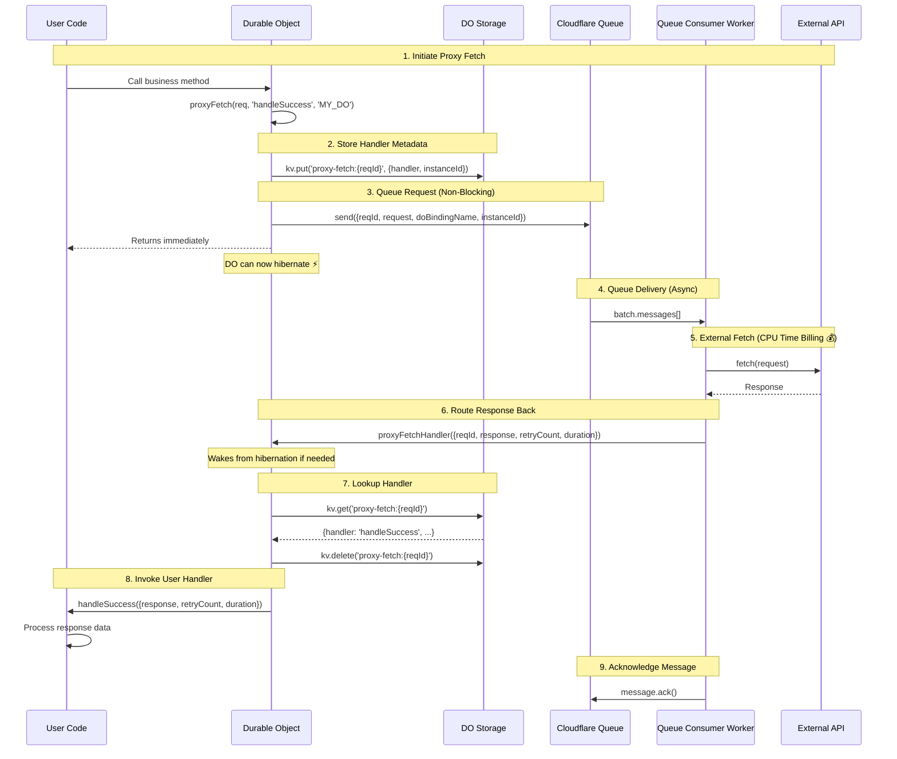

# @lumenize/proxy-fetch - Implementation Plan

## Problem Statement

Durable Objects are billed on **wall clock time**, not CPU time. When a DO makes an external `fetch()` call:
- The DO cannot hibernate during the fetch (awaiting external response)
- Wall clock billing continues during network I/O
- For slow external APIs (100ms-5s response times), costs add up quickly
- This is a common pain point on the Cloudflare Discord

**Example Cost Scenario:**
```
1000 fetches/day × 1 second avg = 1000 seconds/day
30 days = 30,000 seconds = 8.3 hours/month wall clock time
Could cost several dollars just waiting on external APIs
```

## Solution: Cloudflare Queue + Worker Pattern

**Key Insight:** Cloudflare Workers are billed on **CPU time**, not wall clock time!

**Cost Analysis:** TODO: Verify numbers below
```
Queue + Worker:
- Queue: $0.40 per million operations
- Worker CPU: ~$0.02 per million CPU-milliseconds
- 1M fetches: ~$0.42/month
- Scales from 0 to millions automatically
```

## Architecture Overview

### Message Flow Diagram



### Detailed Flow Steps

1. **User Code Triggers Fetch** - Business logic calls `proxyFetch()` in DO
2. **Store Handler Metadata** - Handler name and instance ID saved to DO storage (survives hibernation)
3. **Queue Request** - Serialized request sent to queue, function returns immediately
4. **DO Can Hibernate** - No blocking, DO free to hibernate until response arrives
5. **Queue Delivery** - Queue delivers message batch to worker queue consumer
6. **External Fetch** - Worker makes fetch (CPU time billing, not wall clock!)
7. **Route Response Back** - Worker uses RPC to call `proxyFetchHandler()` on DO
8. **DO Wakes Up** - If hibernated, DO wakes to handle response
9. **Lookup Handler** - Retrieve handler name from storage using reqId
10. **Invoke User Handler** - Call user's handler method with response/error
11. **Acknowledge Message** - Worker acks message, queue removes it

### Key Design Decisions

**Callback Pattern Instead of Promises:**
- No Promise state to preserve across hibernation
- DO can hibernate immediately after sending to queue
- Response arrives as fresh DO method call, wakes DO naturally
- Handler name stored as string in DO storage

**Storage Strategy:**
- Store minimal metadata: `{ handler: string, instanceId: string }`
- Keyed by request ID: `proxy-fetch:${reqId}`
- Cleaned up after handler is called

**Return Addressing:**
- Queue message includes `doBindingName` and `instanceId`
- Worker uses this to route response: `env[doBindingName].idFromString(instanceId).proxyFetchHandler(...)`

### How It All Fits Together

**The Three Core Functions:**

1. **`proxyFetch(doInstance, request, handlerName, doBindingName, options?)`**
   - Called from within your DO
   - Stores handler metadata in DO storage
   - Sends serialized request to queue
   - Returns immediately (non-blocking)

2. **`proxyFetchQueueConsumer(batch, env)`**
   - Your worker's queue consumer
   - Deserializes requests from queue
   - Makes external fetch calls (CPU time billing)
   - Handles retries with exponential backoff
   - Routes responses back to DOs via RPC
   - Handles errors and timeouts

3. **`proxyFetchHandler(doInstance, item)`**
   - Called by queue consumer via RPC
   - Looks up handler name from storage
   - Calls your handler method with response/error
   - Cleans up storage

**The Flow Through These Functions:**
```
Your DO method
  └─> proxyFetch() 
        ├─> Storage: save handler metadata
        └─> Queue: send request
              └─> proxyFetchQueueConsumer()
                    ├─> Deserialize request
                    ├─> fetch() external API
                    ├─> Retry logic if needed
                    └─> proxyFetchHandler()
                          ├─> Storage: get handler name
                          ├─> Call: yourDO.yourHandler()
                          └─> Storage: cleanup
```

## API Design

### User-Facing API

```typescript
// In DO class
import { proxyFetch } from '@lumenize/proxy-fetch';

export class MyDO {
  // User's handler - called when response arrives
  async myHandler({ response, error }: { response?: Response; error?: Error }) {
    if (error) {
      console.error('Fetch failed:', error);
      return;
    }
    
    // response is a real Response object (via Workers RPC or Queue serialization)
    const data = await response.json();
    // Process data...
  }

  // Trigger a proxy fetch
  async triggerFetch() {
    const req = new Request('https://api.example.com/data', {
      headers: { 'Authorization': `Bearer ${this.env.API_TOKEN}` }
    });
    
    // Non-blocking - returns immediately, DO can hibernate
    await proxyFetch(req, 'myHandler', 'MY_DO', this.ctx, this.env);
  }
  
  // Required: Receive response from queue worker
  async proxyFetchHandler(item) {
    return proxyFetchHandler(this, item);
  }
}
```

### Queue Consumer (in worker)

```typescript
// src/index.ts or similar
import { proxyFetchQueueConsumer } from '@lumenize/proxy-fetch';

export default {
  async queue(batch: MessageBatch, env: Env): Promise<void> {
    await proxyFetchQueueConsumer(batch, env);
  }
} satisfies ExportedHandler<Env>;
```

### wrangler.jsonc Configuration

```jsonc
{
  "name": "my-worker",
  "main": "src/index.ts",
  
  // Queue definition
  "queues": {
    "producers": [
      { "queue": "proxy-fetch-queue", "binding": "PROXY_FETCH_QUEUE" }
    ],
    "consumers": [
      {
        "queue": "proxy-fetch-queue",
        "max_batch_size": 10,
        "max_batch_timeout": 5,
        "max_retries": 3
      }
    ]
  },
  
  // DO bindings needed by queue consumer
  "durable_objects": {
    "bindings": [
      { "name": "MY_DO", "class_name": "MyDO", "script_name": "my-worker" }
    ]
  }
}
```

## Implementation Details

### 1. `proxyFetch()` - Send Request to Queue

```typescript
/**
 * Send a fetch request to the queue for processing by a worker.
 * Returns immediately, allowing the DO to hibernate.
 * 
 * @param req - The Request to fetch (can be Request object or URL string)
 * @param handler - Name of the handler method on the DO (as string)
 * @param doBindingName - The DO binding name (e.g., 'MY_DO')
 * @param ctx - DurableObjectState context
 * @param env - Environment bindings (must include PROXY_FETCH_QUEUE)
 */
export async function proxyFetch(
  req: Request | string,
  handler: string,
  doBindingName: string,
  ctx: DurableObjectState,
  env: { PROXY_FETCH_QUEUE: Queue; [key: string]: any }
): Promise<void> {
  // Generate unique request ID
  const reqId = crypto.randomUUID();
  
  // Ensure we have a Request object
  const request = typeof req === 'string' ? new Request(req) : req;
  
  // Store handler metadata in DO storage (survives hibernation)
  ctx.storage.kv.put(`proxy-fetch:${reqId}`, { 
    handler, 
    instanceId: ctx.id.toString()
  });
  
  // Send to queue
  // Best case: Queue supports Request objects directly (like Workers RPC)
  // Worst case: We'll serialize and reconstruct in queue consumer
  await env.PROXY_FETCH_QUEUE.send({ 
    reqId, 
    req: request,  // Send Request object directly first, see if it works
    doBindingName,
    instanceId: ctx.id.toString()
  });
}
```

### 2. `proxyFetchQueueConsumer()` - Worker Queue Consumer

```typescript
/**
 * Queue consumer that processes proxy fetch requests.
 * Makes the external fetch and routes response back to the DO.
 * 
 * @param batch - Queue message batch
 * @param env - Environment with DO bindings
 */
export async function proxyFetchQueueConsumer(
  batch: MessageBatch,
  env: { [doBindingName: string]: DurableObjectNamespace }
): Promise<void> {
  // Process messages in parallel
  await Promise.all(
    batch.messages.map(async (message) => {
      const { reqId, req, doBindingName, instanceId } = message.body;
      
      try {
        // Ensure req is a Request object
        // If Queue serialized it, reconstruct it (worst case)
        const request = req instanceof Request 
          ? req 
          : new Request(req.url, {
              method: req.method,
              headers: req.headers,
              body: req.body
            });
        // Note: If Queue doesn't support Request, we can use our existing
        // Request serialization code from @lumenize/rpc (serializeWebApiObject/deserializeWebApiObject)
        
        // Make the external fetch (CPU time billing, not wall clock!)
        const response = await fetch(request);
        
        // Route back to DO (wakes it up if hibernated)
        // Workers RPC supports Response objects, so pass directly
        const doStub = env[doBindingName].getById(instanceId);
        await doStub.proxyFetchHandler({ 
          reqId, 
          response  // Pass Response object directly via Workers RPC
        });
        
        // Acknowledge message
        message.ack();
        
      } catch (error) {
        console.error('Proxy fetch failed:', error);
        
        // Try to route error back to DO
        try {
          const doStub = env[doBindingName].getById(instanceId);
          await doStub.proxyFetchHandler({ 
            reqId, 
            error: { 
              message: error.message,
              code: 'FETCH_FAILED'
            }
          });
          message.ack();
        } catch (routingError) {
          console.error('Failed to route error back to DO:', routingError);
          // Don't ack - let queue retry
          message.retry();
        }
      }
    })
  );
}
```

### 3. `proxyFetchHandler()` - DO Response Handler

```typescript
/**
 * Called by the queue consumer when a response is ready.
 * Looks up the handler from storage and calls it.
 * 
 * @param doInstance - The DO instance (this)
 * @param item - Response or error from queue consumer
 */
export async function proxyFetchHandler(
  doInstance: any,
  item: { reqId: string; response?: any; error?: any }
): Promise<void> {
  const { reqId, response, error } = item;
  
  // Look up handler from storage
  const metadata = doInstance.ctx.storage.kv.get(`proxy-fetch:${reqId}`);
  
  if (!metadata) {
    console.error('No metadata for proxy fetch:', reqId);
    return;
  }
  
  // Clean up storage
  ctx.storage.kv.delete(`proxy-fetch:${reqId}`);
  
  // Call user's handler method
  const handlerMethod = doInstance[metadata.handler];
  
  if (typeof handlerMethod !== 'function') {
    console.error(`Handler method '${metadata.handler}' not found on DO`);
    return;
  }
  
  // Call handler with response or error
  await handlerMethod.call(doInstance, { response, error });
}
```

## Package Structure

```
packages/proxy-fetch/
├── src/
│   ├── index.ts                    # Public API exports
│   ├── proxy-fetch.ts              # proxyFetch() implementation
│   ├── queue-consumer.ts           # proxyFetchQueueConsumer() implementation
│   ├── handler.ts                  # proxyFetchHandler() implementation
│   └── types.ts                    # TypeScript types
├── test/
│   ├── test-worker-and-dos.ts      # Test harness with queue mock
│   ├── happy-path.test.ts          # Basic flow
│   ├── hibernation.test.ts         # DO hibernates during fetch
│   ├── error-handling.test.ts      # Fetch failures, timeouts
│   └── request-response.test.ts    # Request/Response handling via Queue/RPC
├── wrangler.jsonc                  # Queue bindings for tests
├── vitest.config.js
├── package.json                    # Dependencies: @lumenize/rpc (for serialization fallback if needed)
├── tsconfig.json
└── README.md
```

## Testing Strategy

### Challenges

1. **Queue testing in vitest-pool-workers** - First time using Queues with @lumenize/testing patterns
2. **Simulating hibernation** - How to test DO hibernates and wakes up? Maybe call ctx.abort()?
3. **Queue message format** - Need to discover actual structure
4. **wrangler.jsonc for queues** - New configuration patterns

### Testing Approach

**All tests use vitest-pool-workers (like @lumenize/testing)**
- No mocking needed - real Queue implementation via Cloudflare's test environment
- Real DO instances with real storage
- Real queue consumer workers
- Same testing patterns as @lumenize/rpc and @lumenize/testing

**Test Structure:**
```typescript
// test/test-worker-and-dos.ts
import { env, SELF } from 'cloudflare:test';

export class ProxyFetchTestDO extends DurableObject {
  responseReceived?: Response;
  errorReceived?: Error;
  
  async myHandler({ response, error }: { response?: Response; error?: Error }) {
    this.responseReceived = response;
    this.errorReceived = error;
  }
  
  async triggerProxyFetch(url: string) {
    const req = new Request(url);
    await proxyFetch(req, 'myHandler', 'PROXY_FETCH_TEST_DO', this.ctx, this.env);
  }
  
  async proxyFetchHandler(item: any) {
    return proxyFetchHandler(this, item);
  }
}

// Queue consumer
export default {
  async queue(batch: MessageBatch, env: Env): Promise<void> {
    await proxyFetchQueueConsumer(batch, env);
  }
}
```

**Test Example:**
```typescript
import { env } from 'cloudflare:test';

test('happy path - DO sends to queue, gets response back', async () => {
  const doStub = env.PROXY_FETCH_TEST_DO.get(env.PROXY_FETCH_TEST_DO.idFromName('test'));
  
  // Trigger proxy fetch
  await doStub.triggerProxyFetch('https://api.example.com/data');
  
  // Queue consumer processes automatically in vitest-pool-workers
  // Wait a bit for queue delivery and processing
  await new Promise(resolve => setTimeout(resolve, 100));
  
  // Verify handler was called with response
  const testDO = await doStub.getState();
  expect(testDO.responseReceived).toBeDefined();
  expect(testDO.responseReceived.status).toBe(200);
});
```

### Test Cases

**Happy Path:**
- ✅ DO sends request to queue
- ✅ Queue delivers to worker
- ✅ Worker fetches external API
- ✅ Worker routes response to DO
- ✅ DO calls handler with response
- ✅ Handler processes data successfully

**Hibernation:**
- ✅ DO hibernates after sending to queue
- ✅ Response wakes DO up
- ✅ Handler is called correctly after wake-up

**Error Handling:**
- ✅ External fetch fails (network error)
- ✅ External fetch times out
- ✅ Handler method doesn't exist
- ✅ Handler throws error
- ✅ Queue retry logic works

**Serialization:**
- ✅ Request passed through Queue (or reconstructed if needed)
- ✅ Response passed via Workers RPC (no serialization needed)
- ✅ Request with headers works correctly
- ✅ Request with body (text and binary) works correctly
- ✅ Response with various content types works
- ✅ Large responses handled correctly

## Implementation Phases

### Phase 0: Research & Experimentation ✅ COMPLETE
- ✅ Create test queue in wrangler.jsonc
- ✅ Set up test DO with queue consumer in test/test-worker-and-dos.ts
- ✅ Discover queue message structure via vitest-pool-workers
- ✅ Test if Queue supports Request/Response directly (Answer: Need serialization)
- ✅ Verify queue consumer gets called automatically in test environment

### Phase 1: Core Implementation (Happy Path) ✅ COMPLETE
- ✅ Implement `proxyFetch()` - send Request to queue
- ✅ Implement `proxyFetchQueueConsumer()` - fetch and return Response via Workers RPC
- ✅ Implement `proxyFetchHandler()` - route to user handler
- ✅ Basic tests with real queue in vitest-pool-workers (4 tests)
- ✅ Verify storage operations work across hibernation
- ✅ Use `serializeWebApiObject/deserializeWebApiObject` from `@lumenize/utils`

### Phase 2: Error Handling ✅ COMPLETE
- ✅ Catch fetch errors in worker
- ✅ Route errors back to DO
- ✅ Handle missing handler methods
- ✅ Handle handler exceptions (logged, message acked)
- ✅ Implement request timeout with AbortController
- ✅ Implement exponential backoff retry logic
- ✅ Configurable retry options (maxRetries, retryDelay, maxRetryDelay, retryOn5xx)
- ✅ Network error retry support
- ✅ 5xx retry support (configurable)
- ✅ 4xx errors don't retry
- ✅ Proper message acknowledgment flow
- ✅ Enhanced metadata (retryCount, duration)
- ✅ Structured JSON logging (console.debug/error)
- ✅ Error handling tests (5 tests)

### Phase 3: Testing & Documentation 🔄 IN PROGRESS
- ✅ Integration tests with real queue (11 tests total)
- ✅ Error handling tests (timeout, retry, backoff, 5xx, 4xx)
- ✅ Live test infrastructure for manual testing
- ✅ Test coverage: 74% statements, 54% branches
- ✅ 100% coverage on proxyFetch.ts
- [ ] **Write comprehensive README**
- [ ] **Create website documentation** (`/website/docs/proxy-fetch/`)
  - [ ] Overview with flow diagram
  - [ ] Quick Start guide (includes setup files)
  - [ ] API Reference (auto-generated, but need to review/edit JSDoc)
  - [ ] Configuration options (maybe we can do this in the quick start?)
- [ ] Usage examples
- [ ] Migration guide from direct fetch()

### Phase 4: Advanced Features (Future) ⏸️ DEFERRED
- [ ] Request batching (same domain)
- [ ] Circuit breaker patterns
- [ ] Metrics/observability
- [ ] WebSocket return addressing

## Open Questions

### 1. Queue Message Structure
**Question:** What does `message.body` actually contain in a queue consumer?

**Need to discover:**
- Is it our exact object? `{ reqId, req, doBindingName, instanceId }`
- Or is it wrapped? `{ body: { reqId, req, ... } }`
- What methods are available? (`message.ack()`, `message.retry()`)

### 2. Request/Response Serialization
**Question:** Can we pass Request/Response objects through queues?

**Answer:** Workers RPC definitely supports Request/Response objects. We'll try passing them through Queues first.

**Approach:**
- **Best case:** Queue supports Request/Response directly (try this first)
- **Worst case:** Queue consumer reconstructs Request from serialized data before fetch, passes Response via Workers RPC (which we know works)
- **Fallback:** Use existing `serializeWebApiObject/deserializeWebApiObject` from `@lumenize/rpc` if standard constructors don't work
- No need to write new serialization code - either Queue handles it, standard constructors work, or we reuse existing RPC code

### 3. DO Binding Name Auto-Detection
**Question:** Can DO discover its own binding name?

**Future exploration:**
- Could inspect `env` and compare namespaces
- Could use convention over configuration (class name = binding name)
- For MVP: require user to pass it explicitly

### 4. Type Safety for Handler Names
**Question:** Can we add compile-time checking for handler method names?

**Future improvement:**
```typescript
type HandlerName<T> = {
  [K in keyof T]: T[K] extends (result: any) => any ? K : never
}[keyof T];

proxyFetch<MyDO>(req, 'myHandler', 'MY_DO', ctx, env);
//                     ^^^^^^^^^^^ TypeScript validates this exists
```

### 5. Testing Hibernation
**Question:** How do we test that DO actually hibernates and wakes up?

**Possible approaches:**
- Use delays to force hibernation window
- Monitor DO lifecycle events
- Check storage to verify state persistence
- Manual testing in production

## Success Criteria

### Functional
- ✅ DO can send fetch request to queue without blocking
- ✅ DO can hibernate immediately after sending
- ✅ Worker processes fetch with CPU time billing
- ✅ Response routes back to correct DO instance
- ✅ Handler is called with response data
- ✅ Errors are handled gracefully

### Performance
- ✅ <10ms overhead to send to queue
- ✅ <100ms queue delivery time (p90)
- ✅ Proper retry logic for transient failures
- ✅ Measurable cost savings vs direct fetch in DO

### Developer Experience
- ✅ Simple API - minimal boilerplate
- ✅ Type-safe where possible
- ✅ Clear error messages
- ✅ Good documentation with examples
- ✅ Easy to test (mock queue available)

## Future Enhancements

### Multi-hop Return Addressing
- Browser → DO → ProxyFetch → External API
- Response flows back through path
- Each hop adds itself to return path

### WebSocket Return Addressing
- Return responses via WebSocket instead of DO method call
- Useful for browser → DO → External API flows

### Request Batching
- Batch multiple requests to same domain
- Reduce queue messages
- Improve throughput

### Circuit Breaker
- Track failure rates per domain
- Temporarily stop sending requests to failing APIs
- Automatic recovery

### Observability
- Request/response metrics
- Queue depth monitoring
- Cost tracking
- Performance dashboards
