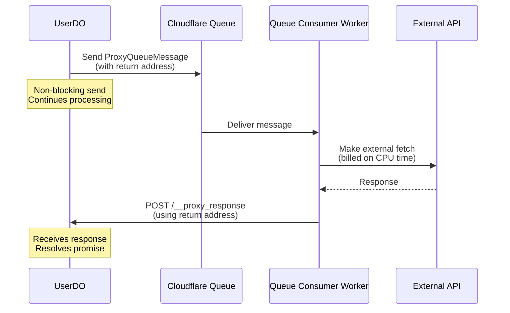

# Work In Progress (WIP)

## Blog: Lumenize RPC vs Cap'n Web — Plan

We are turning the scratchpad in `experiments/performance-comparisons/BOTTOM_LINE.md` into a polished blog post under `website/blog/`.

### Scope and Goals
- Publish a data-driven comparison of Lumenize RPC vs Cap'n Web
- Emphasize real-world impact (network latency dominates)
- Provide clear guidance on when to choose each approach
- Keep post focused; deeper docs live under `/website/docs/`

### Phases
1. Draft scaffold (this PR)
  - [x] Create folder: `website/blog/2025-10-21-lumenize-rpc-vs-capn-web/`
  - [x] Add `index.mdx` with `draft: true` to prevent accidental publish
  - [x] Create `images/` with `.gitkeep` and `README.md` for assets
  - [ ] Port structured content (summary, tables, recommendations)

2. Validation & Research
  - [ ] Confirm Lumenize promise pipelining (chained proxy calls round trips?)
  - [ ] Summarize capability-based security patterns (Cap'n Web) and Lumenize mapping
  - [ ] Understand/contrast MessagePort mode
  - [ ] Investigate connection break handling and stub lifecycle trade-offs
  - [ ] Authentication pattern parity (in-band auth → authenticated API)
  - [ ] Runtime validation approach (TypeBox Value vs Zod), include rationale

3. Assets & Visuals
  - [ ] Produce network latency chart (`images/network-latency-chart.png`)
  - [ ] Throughput chart (`images/throughput.png`)
  - [ ] Protocol features diagram (`images/protocol-features.png`)
  - [ ] Social cover image (`images/cover.png`)

4. Review & Publish
  - [ ] Technical review (numbers, claims, links)
  - [ ] Editorial pass (tighten language; remove internal notes)
  - [ ] Flip `draft: false`, set date/slug, verify build
  - [ ] Announce and link to test harness in repo

### Notes
- Docusaurus blog supports `draft: true` in frontmatter: visible in `npm run start`, excluded from production builds.
- Avoid internal progress reporting inside the post; keep internal notes here in WIP.md.

### Short-term Lumenize RPC targets (close the gap)

- Add MessagePort guidance and note where it’s preferable (iframes/workers)
- Validate promise pipelining round-trip behavior; document chaining patterns
- Provide in-band auth example returning an Authed API, with TypeBox Value validation
- Document connection break handling and recommended guardrails
- Author guidance for “map-like” server-side composition to reduce trips
- Add runtime validation examples without introducing a hard TypeBox dependency
- Cross-link any Workers RPC interop considerations (state clearly if N/A)

## Current Focus: @lumenize/proxy-queue - Cost-Effective External Fetch Offloading

### Problem Statement

Durable Objects are billed on **wall clock time**, not CPU time. When a DO makes an external `fetch()` call:
- The DO cannot hibernate during the fetch (awaiting external response)
- Wall clock billing continues during network I/O
- For slow external APIs (100ms-5s response times), costs add up quickly
- This is a common pain point on the Cloudflare Discord

**Example Cost Scenario:**
```
1000 fetches/day × 1 second avg = 1000 seconds/day
30 days = 30,000 seconds = 8.3 hours/month wall clock time
Could cost several dollars just waiting on external APIs
```

### Solution: Cloudflare Queue + Worker Pattern

**Key Insight:** Cloudflare Workers are billed on **CPU time**, not wall clock time!

**Cost Analysis:**  TODO: Verify numbers below
```
Queue + Worker:
- Queue: $0.40 per million operations
- Worker CPU: ~$0.02 per million CPU-milliseconds
- 1M fetches: ~$0.42/month
- Scales from 0 to millions automatically
```

### Architecture Overview

**Message Flow:**


**Return Address System (MVP):**
- Each message includes a "return address" for routing response back
- Worker uses return address to POST response directly to the DO
- Foundation for future multi-hop routing system

### Implementation Plan

**Phase 0: RPC Type Support**
- [ ] Add Request, Response, Headers support over RPC
- [ ] Check bigint, Uint8Array, and ArrayBuffers
- [ ] Confirm test for RegExp

**Phase 1: Core Infrastructure** (First PR)
- [ ] Create `packages/proxy-queue/` package
- [ ] Define message format (`ProxyQueueMessage` with return address)
- [ ] Implement queue consumer worker
- [ ] Basic DO-to-DO return addressing
- [ ] Error handling and retries
- [ ] Tests using @lumenize/testing

**Phase 2: Developer Experience** (Second PR)
- [ ] Documentation showing Browser composition pattern
- [ ] Examples: Stateless vs Stateful HTTP (with/without cookies)
- [ ] Example: Web scraping with login/session management
- [ ] Example: Multi-step authentication flows
- [ ] Migration guide from direct fetch() to proxied fetch()

**Phase 3: Advanced Features** (Future)
- [ ] WebSocket return addressing (response via WebSocket)
- [ ] HTTP callback return addressing (external system callbacks)
- [ ] Request batching for same external domain
- [ ] Circuit breaker for failing external APIs
- [ ] Metrics and observability

### API Design

**Public API - Low-level Factory + Browser Composition:**
```typescript
/**
 * Creates a fetch-like function that routes requests through a queue worker.
 * The returned function has the EXACT same signature as fetch().
 * 
 * For stateless requests, use directly. For stateful HTTP sessions with cookies,
 * wrap with Browser from @lumenize/utils.
 * 
 * @param queue - Cloudflare Queue binding
 * @param config - Return address and optional defaults
 * @returns A function with fetch()'s exact signature
 */
export function createProxyFetch(
  queue: Queue,
  config: ProxyFetchConfig
): typeof fetch;

interface ProxyFetchConfig {
  returnAddress: ReturnAddress;
  timeout?: number;  // Default timeout for all requests (default: 30000ms)
}

interface ReturnAddress {
  type: 'do';  // MVP: Only DO-to-DO, later: 'ws' | 'http'
  binding: string;     // e.g., 'USER_DO'
  instanceId: string;  // e.g., 'user-123'
}
```

**Composition with Browser for Cookie Management:**

The `Browser` class from `@lumenize/utils` provides automatic cookie management across requests - perfect for external APIs that use cookies for authentication or session management. Simply pass the proxied fetch to Browser:

```typescript
import { createProxyFetch } from '@lumenize/proxy-queue';
import { Browser } from '@lumenize/utils';

// In your DO constructor:
const proxyFetch = createProxyFetch(env.PROXY_QUEUE, { 
  returnAddress: { /* ... */ } 
});
const browser = new Browser(proxyFetch);

// Now browser.fetch automatically:
// - Routes through queue (avoids DO wall-clock billing)
// - Manages cookies across requests (like a real browser)
await browser.fetch('https://api.example.com/login');
await browser.fetch('https://api.example.com/data'); // Cookies from login included!
```

**Internal Message Format (Hidden from users):**
```typescript
// Users never see this - internal queue message format
interface ProxyQueueMessage {
  id: string;  // Auto-generated request ID
  
  // Serialized Request object
  request: {
    url: string;
    method: string;
    headers: [string, string][];  // From Headers.entries()
    body?: string | ArrayBuffer;  // Binary support included
  };
  
  // Return addressing
  returnPath: ReturnAddress[];
  timeout?: number;
}

// Worker response format (also internal)
interface ProxyQueueResponse {
  id: string;
  
  // Serialized Response object
  response?: {
    status: number;
    statusText: string;
    headers: [string, string][];
    body: string | ArrayBuffer;
  };
  
  // Error case
  error?: {
    message: string;
    code?: string;  // 'TIMEOUT', 'FETCH_FAILED', 'NETWORK_ERROR'
  };
}
```

### Usage Examples

**Simple Stateless Requests (No Cookies):**
```typescript
import { createProxyFetch } from '@lumenize/proxy-queue';

class UserDO {
  #proxyFetch: typeof fetch;
  
  constructor(ctx: DurableObjectState, env: Env) {
    this.ctx = ctx;
    this.env = env;
    
    // Create a proxied fetch with DO-specific config
    this.#proxyFetch = createProxyFetch(env.PROXY_QUEUE, {
      returnAddress: {
        type: 'do',
        binding: 'USER_DO',
        instanceId: ctx.id.toString()
      },
      timeout: 30000  // Optional: default timeout for all requests
    });
  }
  
  async fetchGitHubData(repoUrl: string) {
    // Use EXACTLY like fetch()! Same signature, same behavior.
    const response = await this.#proxyFetch(`https://api.github.com/repos/${repoUrl}`, {
      headers: {
        'Authorization': `Bearer ${this.env.GITHUB_TOKEN}`,
        'Accept': 'application/vnd.github.v3+json'
      }
    });
    
    // Standard Response object - all the normal methods work!
    if (!response.ok) {
      throw new Error(`GitHub API failed: ${response.statusText}`);
    }
    
    return await response.json();
  }
  
  async uploadImage(url: string, imageData: ArrayBuffer) {
    // Works with all fetch() options - method, body, headers, etc.
    const response = await this.#proxyFetch(url, {
      method: 'POST',
      headers: { 'Content-Type': 'image/png' },
      body: imageData  // Binary body - just works!
    });
    
    return await response.json();
  }
  
  async fetchWithCustomTimeout(url: string) {
    // Per-request abort signal (standard fetch() feature)
    const controller = new AbortController();
    setTimeout(() => controller.abort(), 5000);  // 5s timeout
    
    const response = await this.#proxyFetch(url, {
      signal: controller.signal
    });
    
    return await response.text();
  }
}
```

**Stateful HTTP Sessions with Cookies (Using Browser Composition):**
```typescript
import { createProxyFetch } from '@lumenize/proxy-queue';
import { Browser } from '@lumenize/utils';

class DataScraperDO {
  #proxyFetch: typeof fetch;  // For stateless APIs
  #browser: Browser;          // For cookie-based sessions
  
  constructor(ctx: DurableObjectState, env: Env) {
    this.ctx = ctx;
    this.env = env;
    
    // Create base proxied fetch
    this.#proxyFetch = createProxyFetch(env.PROXY_QUEUE, {
      returnAddress: {
        type: 'do',
        binding: 'DATA_SCRAPER_DO',
        instanceId: ctx.id.toString()
      }
    });
    
    // Wrap with Browser for cookie management
    this.#browser = new Browser(this.#proxyFetch);
  }
  
  async scrapeProtectedSite(loginUrl: string, dataUrl: string) {
    // Login - receives session cookie
    const loginRes = await this.#browser.fetch(loginUrl, {
      method: 'POST',
      headers: { 'Content-Type': 'application/json' },
      body: JSON.stringify({ 
        username: this.env.SCRAPER_USER, 
        password: this.env.SCRAPER_PASS 
      })
    });
    
    if (!loginRes.ok) {
      throw new Error('Login failed');
    }
    
    // Cookie is automatically included in next request!
    const dataRes = await this.#browser.fetch(dataUrl);
    return await dataRes.text();
  }
  
  async multiStepAuth() {
    // Step 1: Login gets session cookie
    await this.#browser.fetch('https://api.example.com/login?token=xyz');
    
    // Step 2: Fetch user profile (cookie included automatically)
    const profileRes = await this.#browser.fetch('https://api.example.com/profile');
    const profile = await profileRes.json();
    
    // Step 3: Fetch user data (cookie still included)
    const dataRes = await this.#browser.fetch('https://api.example.com/data');
    const data = await dataRes.json();
    
    return { profile, data };
  }
  
  // Can also manually manage cookies if needed
  async manualCookieManagement() {
    this.#browser.setCookie('custom', 'value', { domain: 'example.com' });
    const cookie = this.#browser.getCookie('custom');
    console.log('Cookie value:', cookie);
  }
}
```

**Mixed Usage - Both Stateful and Stateless:**
```typescript
class MixedDO {
  #proxyFetch: typeof fetch;  // Stateless
  #browser: Browser;          // Stateful
  
  constructor(ctx, env) {
    this.#proxyFetch = createProxyFetch(env.PROXY_QUEUE, { 
      returnAddress: { type: 'do', binding: 'MIXED_DO', instanceId: ctx.id.toString() }
    });
    this.#browser = new Browser(this.#proxyFetch);
  }
  
  async fetchPublicAPI() {
    // No cookies needed - use proxyFetch directly
    return await this.#proxyFetch('https://api.public.com/data');
  }
  
  async fetchAuthenticatedAPI() {
    // Cookies needed - use browser
    return await this.#browser.fetch('https://api.private.com/data');
  }
}
```

**Key Benefits:**
- ✅ **Perfect drop-in replacement** - Exact same signature as `fetch()`
- ✅ **Configure once** - Set in constructor, use everywhere
- ✅ **Cookie management when needed** - Compose with Browser from @lumenize/utils
- ✅ **TypeScript perfect** - `typeof fetch` means all type hints work
- ✅ **Platform-aligned** - Uses standard Request/Response, RequestInit, etc.
- ✅ **Flexible** - Use low-level `createProxyFetch()` or high-level `Browser` wrapper

**Queue Consumer Worker:**
```typescript
// src/queue-consumer.ts (provided by package)
export default {
  async queue(batch: MessageBatch<ProxyQueueMessage>, env: Env) {
    await Promise.all(
      batch.messages.map(msg => processProxyRequest(msg, env))
    );
  }
};
```

### Testing Strategy

**Using @lumenize/testing:**
- Test DO sends message to queue
- Mock queue consumer behavior
- Test return address routing
- Test timeout handling
- Test error cases (fetch fails, timeout, etc.)

**Integration tests:**
- Real queue with test worker
- External API mocking (using Mock Service Worker or similar)
- Multi-DO communication tests

### Success Criteria

**Functional:**
- ✅ DO can send fetch request to queue without blocking
- ✅ Worker processes fetch and returns response to correct DO
- ✅ Errors are properly propagated back to calling DO
- ✅ Timeouts work correctly

**Performance:**
- ✅ <10ms overhead to send to queue
- ✅ <100ms queue delivery time (p90)
- ✅ Proper retry logic for transient failures

**Developer Experience:**
- ✅ **Factory pattern** - `createProxyFetch()` returns a function with exact `fetch()` signature
- ✅ **Configure once, use everywhere** - Return address set in constructor
- ✅ **Cookie management via composition** - Wrap with Browser for stateful HTTP sessions
- ✅ **Perfect TypeScript** - `typeof fetch` means all IDE hints and type checking work
- ✅ **Platform-aligned** - Uses standard Web APIs (Request, Response, RequestInit)
- ✅ **Binary support included** - All BodyInit types work (ArrayBuffer, Blob, FormData, etc.)
- ✅ **Clear error messages**
- ✅ **Comprehensive documentation with examples**

### Future Enhancements (Later Phases)

**Multi-hop Return Addressing:**
- Browser → SharedWorker → UserDO → ProxyQueue → External API
- Response flows back through accumulated return path
- Each hop adds itself to path, pops itself on return

**WebSocket Support:**
- Return responses via WebSocket instead of HTTP POST
- Useful for browser → DO → External API flows

**Advanced Features:**
- Request batching (multiple fetches to same domain)
- Circuit breakers for failing external services
- Caching layer for frequently requested external data
- Scheduled/delayed fetches
- Priority queues

### Open Questions

1. **Queue retry strategy:**
   - How many retries for transient failures? (Suggest: 3)
   - Exponential backoff? (Suggest: yes, with jitter)
   
2. **Response routing:**
   - Should we validate return addresses are reachable before sending to queue?
   - Or fail fast when Worker can't route response?

3. **Security:**
   - Should we validate/sanitize external URLs? (Suggest: allowlist by default)
   - Sign return addresses to prevent spoofing? (Suggest: not in MVP)

4. **Timeout handling:**
   - Who owns the timeout - DO or Worker? (Suggest: Worker with AbortSignal)
   - What happens if DO times out waiting but Worker succeeds later?

5. **Browser integration:**
   - Should we export a convenience `createProxyBrowser()` helper?
   - Or keep it simple: users compose Browser themselves? (Current approach)

### Package Structure

```
packages/proxy-queue/
├── src/
│   ├── index.ts              # Public API exports (createProxyFetch)
│   ├── types.ts              # Public types (ProxyFetchConfig, ReturnAddress)
│   ├── factory.ts            # createProxyFetch implementation
│   ├── serialization.ts      # Request/Response serialization helpers
│   ├── queue-consumer.ts     # Worker queue consumer
│   ├── return-router.ts      # Return address routing logic
│   └── error-handling.ts     # Error serialization/handling
├── test/
│   ├── test-worker-and-dos.ts    # Test harness
│   ├── basic-usage.test.ts       # Basic fetch() drop-in flow
│   ├── binary-body.test.ts       # Binary data handling
│   ├── error-handling.test.ts    # Error cases
│   ├── timeout.test.ts           # Timeout scenarios (AbortSignal)
│   └── return-routing.test.ts    # Return address routing
├── wrangler.jsonc            # Queue bindings for tests
├── vitest.config.js
├── package.json
├── tsconfig.json
└── README.md
```

### Key Implementation Details

**Request Serialization:**
- Accept `Request` object or `RequestInfo` (URL string/Request)
- Accept `RequestInit` options (exactly like fetch())
- Clone request to avoid consuming body: `request.clone()`
- Detect body type from `Content-Type` header
- Text-based: Use `request.text()` → string
- Binary: Use `request.arrayBuffer()` → ArrayBuffer
- Handle edge cases: No body, empty body, streaming (consume fully for MVP)

**Factory Implementation:**
```typescript
export function createProxyFetch(queue: Queue, config: ProxyFetchConfig): typeof fetch {
  return async (input: RequestInfo | URL, init?: RequestInit): Promise<Response> => {
    // Construct Request from input/init (same as fetch())
    const request = new Request(input, init);
    
    // Serialize and send to queue with baked-in return address
    // ... implementation details
    
    // Wait for response and deserialize
    return response;
  };
}
```

**Response Deserialization:**
- Reconstruct Response from serialized data
- Preserve status, statusText, headers
- Body can be string or ArrayBuffer
- All Response methods work: `.json()`, `.text()`, `.arrayBuffer()`, `.blob()`

**Queue Size Limits:**
- Cloudflare Queue message limit: 128KB
- Document limitation in README
- Consider adding size check with helpful error message
- Phase 2: Could support larger payloads via R2 or chunks

**Error Handling:**
- Network errors: Serialize with code 'FETCH_FAILED'
- Timeouts: AbortSignal in Worker, code 'TIMEOUT'
- Queue errors: Code 'QUEUE_ERROR'
- Return proper HTTP-like Response for errors (status 500+)

---

## Later and possibly unrelated

- [ ] Writeup my RPC performance findings and put it up as a doc on the website
- [ ] Add examples and docs for plucking the bindingName and instanceNameOrId out of headers into storage for the DO
- [ ] Add `TypeBox Value` support for RPC runtime checking (both TypeBox and JSON Schema) but don't make TypeBox a dependency. That last could be tricky since it'll have to sense if it's a TypeBox spec, or a JSON Schema spec.
- [ ] Move debugOff into @lumenize/utils
- [ ] Need a way to control debug messages more granularly from a global config. Maybe markers like the old debug library I used to use that would check localhost or env variable but maybe not that. Maybe some global static. Maybe we encourage scoped "where" clauses in the debug output?
- [ ] Make changes to docs to document promise pipelining. Right now it's in quirks, but pull it out to its own thing.
- [ ] Make websocket-shim throw when passed in http[s] urls like the real browser. This requires changing a lot of tests especially the matrix tests that run the same test but just varying transport.
- [ ] Consider forking @ungap/structured-clone to claim no dependencies
- [ ] Deploy to Cloudflare button
- [ ] Move SonarQube Cloud (or whatever it's called now. It was previously SonarCloud, I think) account over to the lumenize repo
- [ ] We need much more security info on the website. Maybe an entire .mdx. Here is the completely inadequate warning we had in the README before we thinned it down. 
  ⚠️ **IMPORTANT**: This package exposes your DO internals via RPC endpoints. Only use in development or secure the endpoints appropriately for production use.
- [ ] Test in production on Cloudflare (not just local with vitest)

### GitHub Actions for Publishing & Releases

**Goal**: Automate publishing to npm and creating GitHub releases with changelogs

**Research Completed**: Investigated secure token approaches and GitHub Actions workflow

**Key Findings**:
- **Static tokens being phased out**: npm deprecating TOTP 2FA in favor of rotating keys
- **Modern approach**: GitHub Actions with OIDC (OpenID Connect) - no static tokens needed
- **npm provenance**: Cryptographic proof of package origin, built into modern npm publishing
- **Draft releases**: Can auto-generate release notes, then hand-edit before publishing

**Recommended Workflow**:
1. GitHub Actions triggers on version tags (`v*`)
2. Runs tests, publishes to npm with `--provenance` flag
3. Creates **draft** GitHub release with auto-generated notes from commits/PRs
4. Manual review and editing of release notes
5. Publish release when satisfied

**Only ONE secret needed**: `NPM_TOKEN` (automation token that rotates automatically)
- GitHub authentication handled via built-in `GITHUB_TOKEN` (auto-provided, no setup)
- No static tokens to manage or rotate manually

**Dependencies for Later**:
- Will be implemented when SonarQube Cloud integration is added
- SonarQube scan + unified test coverage reports will use same GitHub Actions infrastructure
- For now, continuing with local `npm run publish` workflow

**Reference Files to Create**:
- `.github/workflows/publish.yml` - Main publish workflow
- `.github/workflows/release.yml` - Release creation workflow (draft mode)

**Benefits of Waiting**:
- Single GitHub Actions setup for both publishing and code quality scanning
- Learn more about team workflow preferences before automating
- Can hand-edit releases via GitHub UI in the meantime (always possible, even after automation)
