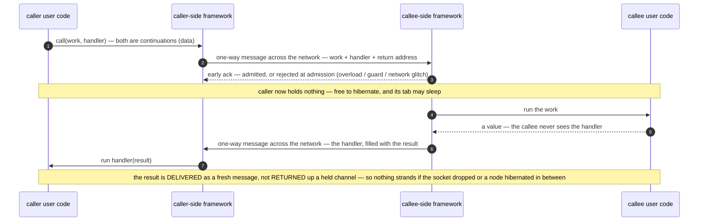

# ADR-003: Continuation-Based Messaging — No Promises Long Held Across Hops

**Date**: 2026-06-11 (records a commitment in force since Mesh's design)
**Status**: Accepted
**Deciders**: Larry
**Evidence**: `.claude/rules/mesh.md` (day-to-day enforcement), `website/docs/mesh/calls.mdx` (§ Direct Delivery, § Error Handling), `packages/mesh/src/lmz-api.ts` (`#dispatchEnvelope` — the early-acking transport), `packages/mesh/src/lumenize-client.ts` (`callAsync`), `packages/fetch/` (a continuation persisted into an alarm), `tasks/on-hold/mesh-overload-backpressure-handling.md`

## Context

A distributed flow touches many nodes: client → Gateway → Star → Worker → back to some node. The tempting model is to `await` each hop the way an in-process call returns a value — hold a Promise (or an open RPC stub) until the callee replies. But in this environment the thing that Promise is bound to routinely vanishes out from under it: **browser tabs sleep, WebSocket connections drop and reconnect, and Durable Objects hibernate or are evicted.** A Promise held across a hop for more than a moment is state bound to a transient channel — when the channel dies the result is stranded and the caller can hang forever. Holding one costs, too: the caller DO stays resident on wall-clock billing while it waits, and an open stub can prevent hibernation. And on the WebSocket legs there is nothing to await at all — every frame is a one-way message.

**Resiliency is the driver** — surviving sleep, reconnect, and hibernation — with the billing win a bonus. Mesh needs one messaging model that holds up under all of it and works as identically as possible from every node type.

## Decision

**Mesh flows are one-way messages carrying continuations; no node holds a Promise (a reply channel) open across a hop for more than an instant.**

A **continuation** (`lmz.ctn()`) is a *serializable description of work to be done in another place or time* — the property everything here rests on. Because a continuation is **data, not a live handle**, it can be sent, delivered, and stored rather than awaited:

- A call specifies the work it wants done **on the callee** as a continuation.
- Request/response is *simulated without a held channel*: the work the caller wants done **with the result** (the value, or an Error) is *also* a continuation; the callee fills it with the result and sends it back with another `call()`. The outcome is **delivered** as a fresh one-way message, never **returned** up a channel the caller would otherwise hold open.
- Those deliveries take a few concrete forms: the 4-arg `call` handler, `svc.broadcast`'s `onResult`, and the client's RESULT fire-back — each a one-way delivery to wherever the result is needed.
- Multi-hop flows hand off **forward** (client → Star → Worker → client), each hop naming only its own next node; they never unwind back through the intermediates (direct delivery).
- `callContext` (identity, provenance, state) rides every hop automatically — that, not a held channel, is what makes flows composable.
- Because a continuation is data, it can also be **persisted** — stashed in an alarm or in storage and re-executed later. That is a "Promise" that survives hibernation precisely because it stopped being one (`@lumenize/fetch` stringifies a continuation into an alarm as its delivery backstop).
- Each cross-node call is an **independent, self-contained envelope** — no session, no live remote reference held across calls (the session-RPC approach we reject, below).

The 4-argument `call` — a request plus a response handler — makes the shape concrete. Both the work and the handler are continuations (data); the caller is freed at the early ack and holds nothing. The result comes back as a **second, independent one-way message** rather than up a channel the caller held open:

## When awaiting is OK

Awaiting a network result is not banned outright — what the decision forbids is holding a *reply channel* open **across a hop for more than an instant**. Two places await, deliberately, and neither does:

- **Under the covers: one very-short hop.** A `call` from a DO, Worker, or Container is dispatched by a single awaited Workers RPC (`#dispatchEnvelope` → `await stub.__executeOperation`) that **acks early**: it returns the instant the callee is *admitted* (binding resolved, guards passed), **before** the callee runs the work, so the caller holds the Promise for admission only, never for the operation. That short hop is also where **admission-time failures** surface — a guard/scope rejection, **overload** back-pressure, or a **network/transport glitch** on the hop itself — so the caller learns *"did it even get accepted?"* promptly, on the ack rather than on a fire-back that might never come. Everything *after* admission — the result, or an error the callee's own code throws — arrives later as the one-way fire-back. Early-ack applies whether or not a handler is attached, and is pure transport (invisible to user-developer code), not the held channel the decision forbids.

- **In user-land: only on the client — a browser tab or a longer-lived host like a Node process (`LumenizeClient` / `NebulaClient`), via `callAsync`.** The client alone may `await` a cross-node *result*, because its environment makes a held Promise safe where a DO's or Worker's does not:
  
  - **The heap is durable enough.** A browser tab's JS heap survives a freeze (sleep) *and* a WebSocket reconnect — only a full discard/reload clears it. A DO or Worker isolate loses its heap on hibernation/eviction, so a Promise parked there is bound to memory that routinely vanishes (the control-flow twin of the mutable instance field we forbid).
  - **Delivery re-resolves.** The result fires back addressed to the client's stable `instanceName`; the Gateway routes it to whatever socket the client is on *now*, not the socket the call left on. The awaited Promise is thus not bound to the transient socket — the exact coupling that made a socket-bound await strand on reconnect.
  
  So `client.lmz.callAsync()` is a Promise **wrapper over that same one-way-fire + re-resolvable delivery** — sugar over send-plus-delivery, not a held cross-hop channel — and it is still bounded (a default timeout composed with an optional `AbortSignal`; abort cancels the *wait*, not the callee's *operation*). DOs and Workers get no awaitable; they use `call()` + a fire-back handler.

## Alternatives considered

| Approach | Why rejected |
|---|---|
| **Hold a Promise across the hop** — a nested awaited RPC, or a `stub.call()` that returns the value to its caller | The core failure this ADR exists to prevent. The held Promise is transient state bound to a transient channel — a socket that drops and reconnects, or an isolate's memory that hibernates/evicts — so it strands and the caller hangs ("thinking… forever"), while any intermediate stays resident (wall-clock, no hibernation). Replaced by continuation-carried deliveries and — client-only, where the heap is durable enough — `callAsync`, a Promise over a re-resolvable delivery rather than over a socket. |
| **Late-ack** transport — the awaited transport hop returns the callee's result instead of acking at admission | Re-holds the caller across the callee's *entire* operation — the long hold this ADR forbids. Early-ack frees the caller at admission and loses nothing, since the result travels one-way regardless. |
| **Session / promise-pipelined RPC** (Cloudflare `RpcTarget`, Cap'n Web) | Gets *dependent calls in one round trip* — the **same goal as OCAN** — but via a **stateful session**: the caller holds a live remote reference (a stub, or an unresolved promise-for-a-capability) and *pipelines* further calls against it (invoking a method on a result that hasn't come back yet). Rejected **precisely because it holds a session** — the live reference keeps the callee resident (fighting hibernation/eviction) and binds to the connection (so it strands on a WS drop or a DO evict), with brittle stub lifecycles. OCAN reaches the same goal **statelessly**: the whole dependent program travels in one self-contained envelope and runs callee-side, nothing held across the wire — and its object-capability form (a gate returning a class instance) is the in-envelope analog of returning an `RpcTarget`, minus the session. |
| Two models — request/response between DOs, one-way over WS | Two mental models and two error paths for the same flow, with the seam exactly where Nebula lives (client ↔ Star). |

## Consequences

### Positive
- **Resilient by construction.** No result is bound to a transient channel, so nothing strands when one vanishes — the "thinking… forever" class of bug is gone by design.
- Direct delivery: results go straight to their consumer (the canonical spell-check reports to the client, not back through the document DO).
- DOs stay hibernation-friendly and avoid wall-clock billing across long flows; no node sits resident waiting on a deep call.
- One model everywhere — client and DO code compose the same way, and `callAsync` restores an awaitable ergonomic on the client **without** the coupling.
- Broadcast falls out of the same primitive: N one-way calls with optional result handlers. And because continuations are data, alarm-backed and store-and-forward flows use the identical shape.

### Negative
- "Did it land?" needs explicit machinery (4-arg result handlers, `onErrorOnly`, or the client's `callAsync`) instead of an implicit return — a fire-and-forget error is silently lost unless a handler is attached.
- Flows are harder to trace than a call stack; `callContext.callChain` exists precisely to compensate.
- Write retry/backpressure cannot lean on a transport response end-to-end; it must be designed at the outcome level (overload/backpressure design + ADR-005's replay idempotency).
