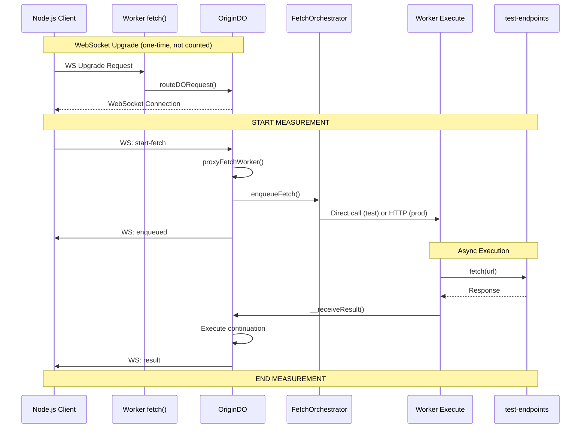

# ProxyFetchWorker Latency Measurements

Production performance measurements for the `proxyFetchWorker` architecture.

## Results in Cloudflare production - 2025-11-12

### Latency (measured in production with warmed instances)
- **101ms measured total** (92-107ms range, 15ms variance)
  - Enqueue phase: 80ms (orchestration & dispatch)
  - Execution phase: 21ms (fetch & result delivery)
- **DO → Orchestrator → Worker → External fetch → Worker → DO**: ~71ms in production 
  after subtracting ~30ms round trip between local Node.js and Cloud
- **57ms added latency** after subtracting ~14ms for the actual fetch call

### Scalability (measured in `wrangler dev`)
- **Superlinear beyond 2000 simultaneous requests** meaning that it got more efficient, 
  the more we loaded it:
  - **10 concurrent**: 420ms total (~42ms per fetch)
  - **100 concurrent**: 3168ms total (~32ms per fetch, **75% of linear time**)
  - **1000 concurrent**: 30087ms total (~30ms per fetch, **72% of linear time**)
  - **2000 concurrent**: 57678ms total (~29ms per fetch, **69% of linear time**)
- We didn't test more because 2000 is more than enough, but it **likely remains linear beyond 2000**.
- 6-connection limit doesn't bottleneck

---

## Architecture Flow

---

**Git Hash**: `87e13bd`
