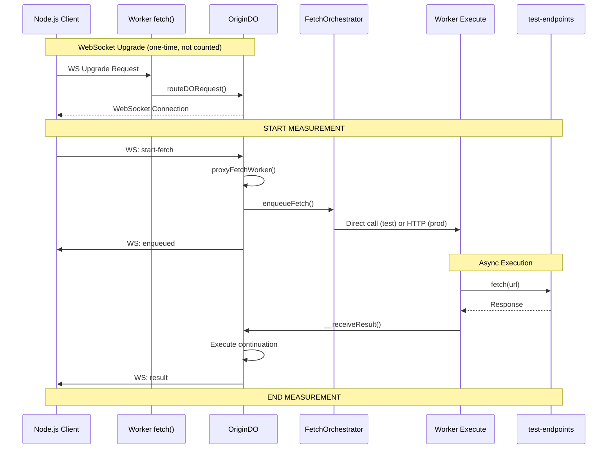

# ProxyFetchWorker Latency Measurements

Production performance measurements for the `proxyFetchWorker` architecture.

## Results in Cloudflare production - 2025-11-12

**Production (Warm):**
- **101ms measured total** (92-107ms range, 15ms variance)
  - Enqueue phase: 80ms (orchestration & dispatch)
  - Execution phase: 21ms (fetch & result delivery)
- **DO → Orchestrator → Worker → External fetch → Worker → DO**: ~71ms in production 
  after subtracting ~30ms round trip between local Node.js and Cloud
- **57ms added latency** after subtracting ~14ms for the actual fetch call

---

## Architecture Flow

---

**Git Hash**: `87e13bd`
