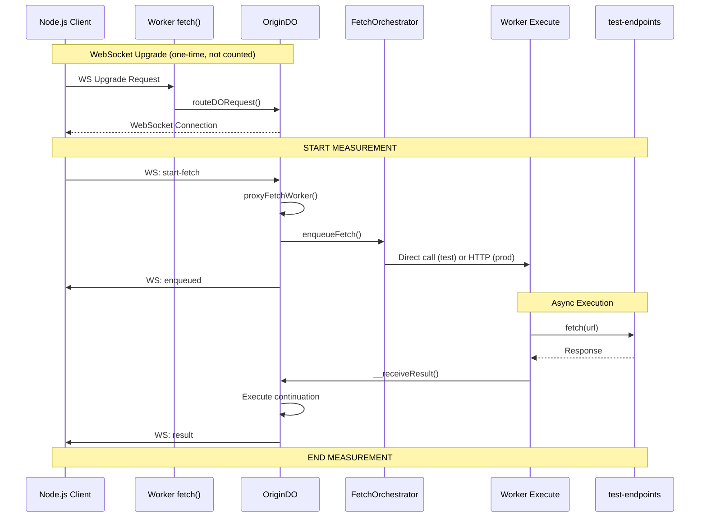

# ProxyFetchWorker Latency Measurements

Production performance measurements for the `proxyFetchWorker` architecture.

## Performance Summary

**Production (Warm):**
- **101ms measured total** (92-107ms range, 15ms variance)
  - Enqueue phase: 80ms (orchestration & dispatch)
  - Execution phase: 21ms (fetch & result delivery)
- **71ms actual end-to-end** (after subtracting 30ms Node.js overhead)
- **564ms cold start** (first request only)

**Local Development:**
- **53ms measured total** (23ms actual after Node.js overhead)
- **48ms production overhead** (71ms vs 23ms, network latency)

**Key Characteristics:**
- Real-time result delivery via WebSocket
- Very consistent warm performance (15ms variance)
- HTTP dispatch to CPU-billed Worker executors
- DO-based queue orchestration

---

## Architecture Flow



**Key Points:**
- **WebSocket connection** is established once and reused (bypasses Worker after upgrade)
- **Enqueue latency**: Time from `start-fetch` message to `enqueued` confirmation
- **End-to-end latency**: Time from `start-fetch` to `result` message (includes external fetch)
- **Results delivered immediately** via WebSocket push
- **Node.js overhead**: ~30ms for network round-trip to/from client (subtracted in results)

## Measurement Methodology

- **Environment**: Cloudflare Workers (production deployment)
- **Test Client**: Node.js 21+ with native WebSocket
- **Iterations**: 10 end-to-end measurements
- **Endpoint**: test-endpoints.workers.dev (fast UUID response)
- **Network Overhead**: ~30ms subtracted (Node.js ↔ Cloudflare edge)

**What we measure:**
1. **Total (measured)**: Client timestamp start → result received
2. **Node.js overhead**: Estimated ~30ms for network to/from client
3. **Actual end-to-end**: Total - Node.js overhead = true DO latency

---

## Results

### Local Development - 2025-11-12

**Git Hash**: `972778d`

**Environment:**
- `wrangler dev` (localhost:8787)
- Direct `executeFetch()` calls (no HTTP dispatch)
- WebSocket hibernating API
- Node.js 21+ native WebSocket client

**Measurements (10 iterations):**
```
Average Breakdown:
  Enqueue (includes network): 51.30ms
  Total (measured): 53.00ms
  Node.js overhead (est): 30ms
  Actual end-to-end: 23.00ms
  Server duration: 49.80ms (varies, external fetch time)
```

**Observations:**
- ✅ Very fast due to local execution (no network hops)
- ✅ Direct `executeFetch()` call bypasses HTTP dispatch
- ⚠️ Production will be slower due to actual network latency

---

### Production - 2025-11-12

**Git Hash**: `87e13bd`

**Environment:**
- Cloudflare Workers (deployed to transformation.workers.dev)
- HTTP dispatch to `handleProxyFetchExecution`
- WebSocket hibernating API
- External API: test-endpoints.workers.dev

**Measurements (10 iterations):**
```
Cold Start (Request 1):
  Total: 564ms
  Enqueue: 531ms
  
Warm Performance (Requests 2-10 average):
  Enqueue (includes network): 80ms
  Total (measured): 101ms
  Node.js overhead (est): 30ms
  Actual end-to-end: 71ms
  Server duration: 87.80ms
```

**Individual Request Latencies:**
- Request 1: 564ms (cold start - DO initialization)
- Request 2-10: 92-107ms (warm - very consistent, 15ms variance)

**Performance Characteristics:**
- Cold start: ~450ms (first request only)
- **Warm latency: 71ms end-to-end** (average, 101ms measured - 30ms Node.js overhead)
- Production overhead vs local: ~48ms (71ms vs 23ms local)
- Very consistent: 92-107ms range (15ms variance)
- HTTP dispatch to Worker executor working as designed

---

## How to Run Measurements

### Local Development
```bash
# Terminal 1: Start dev server
npm run dev

# Terminal 2: Set env vars and run measurements
export $(cat ../../.dev.vars | xargs)
npm test
```

### Production Deployment
```bash
# 1. Deploy worker
npm run deploy

# 2. Set environment variables
export $(cat ../../.dev.vars | xargs)
export TEST_URL=https://proxy-fetch-latency.YOUR_SUBDOMAIN.workers.dev

# 3. Run measurements
npm test
```

**Requirements:**
- Node.js 21+ (for native WebSocket support)
- `TEST_TOKEN` and `TEST_ENDPOINTS_URL` in `.dev.vars`

---

## What This Measures

**Included in measurement:**
1. WebSocket message send (Client → Origin DO)
2. `proxyFetchWorker()` execution in Origin DO
3. Message to FetchOrchestrator DO
4. HTTP dispatch to Worker executor (production) or direct call (local)
5. Worker fetch to external endpoint (test-endpoints.workers.dev)
6. Result delivery to Origin DO (`__receiveResult`)
7. Continuation execution in Origin DO
8. WebSocket message receive (Origin DO → Client)

**Excluded from measurement:**
- WebSocket connection establishment (one-time setup, not counted)
- Test-endpoints processing time (responds instantly with UUID)
- Node.js network overhead (estimated ~30ms, subtracted from results)

**Architecture overhead breakdown:**
- **DO → Orchestrator → Worker → DO flow**: ~71ms in production (warm)
- **HTTP dispatch overhead**: Included in measurements (production only)
- **Network latency**: ~48ms production overhead vs local execution
- **Cold start penalty**: ~450ms (first request only)
