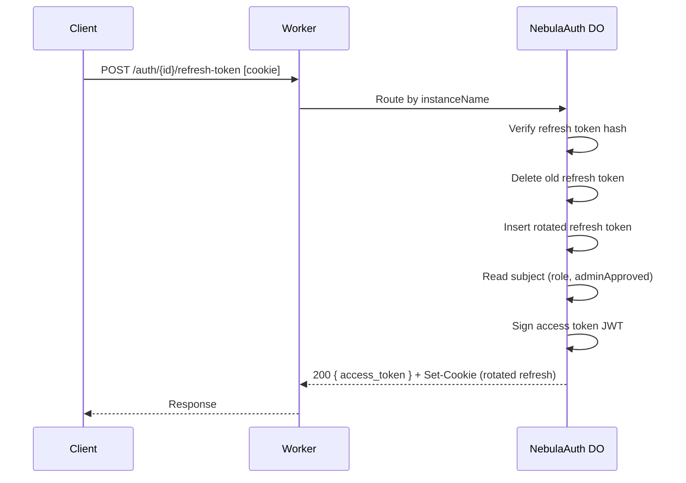
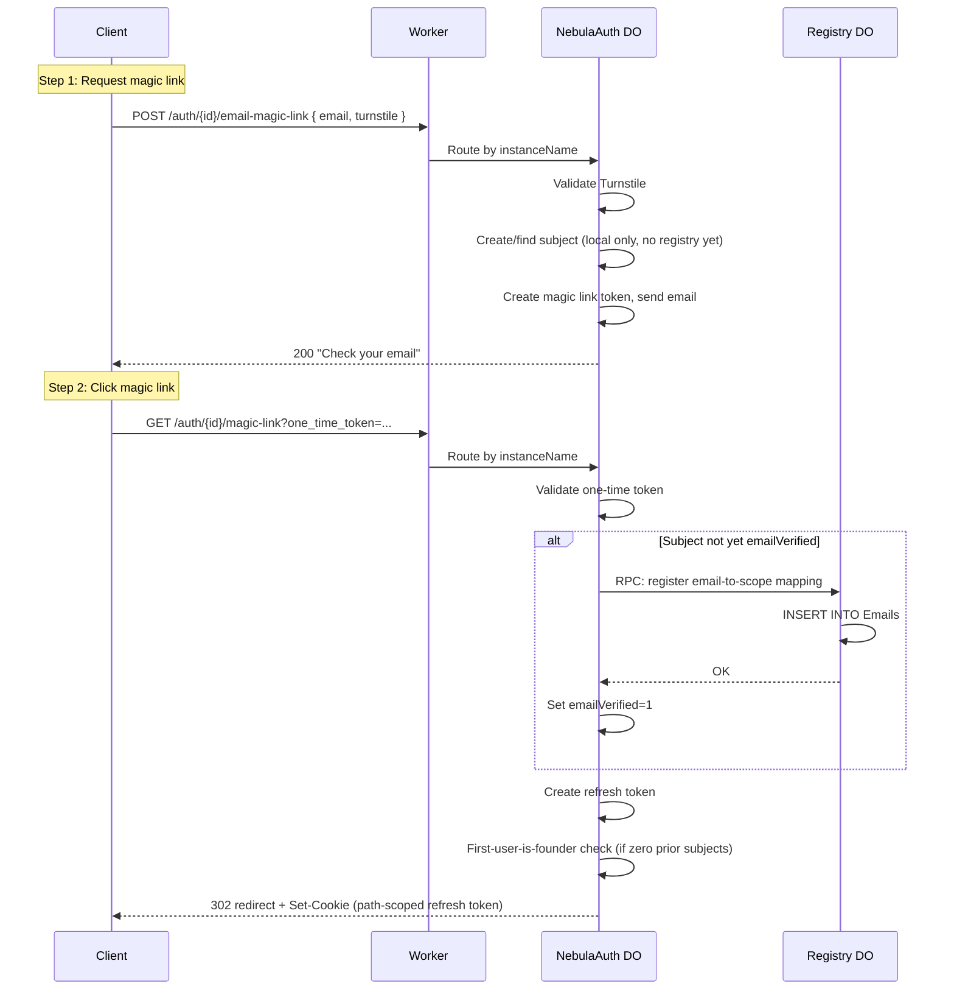
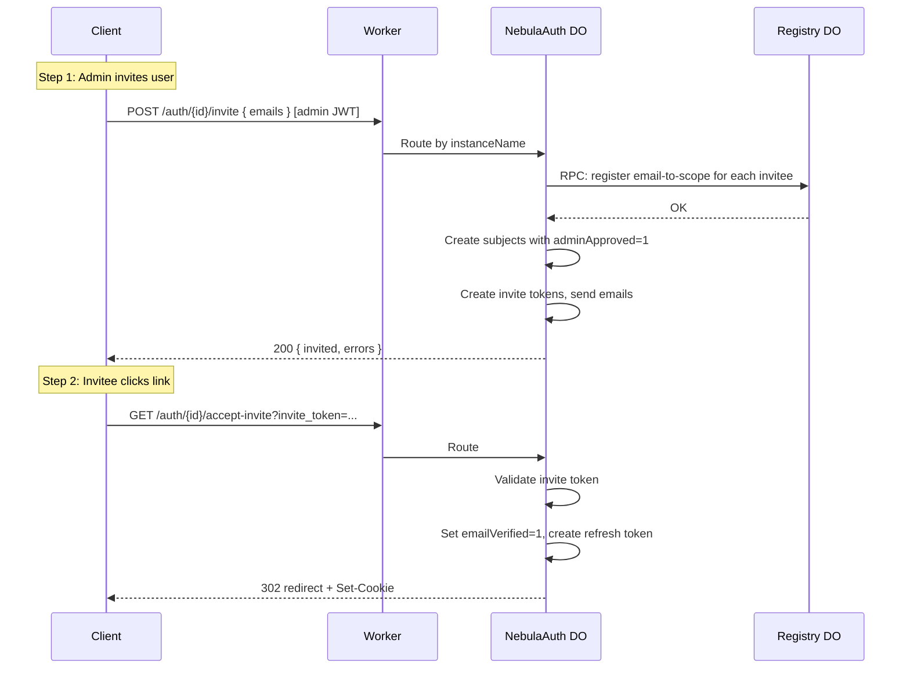
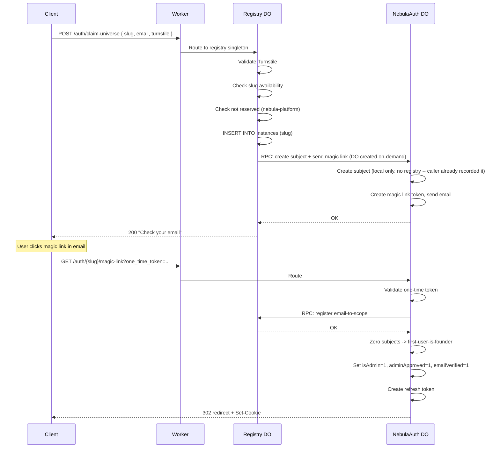
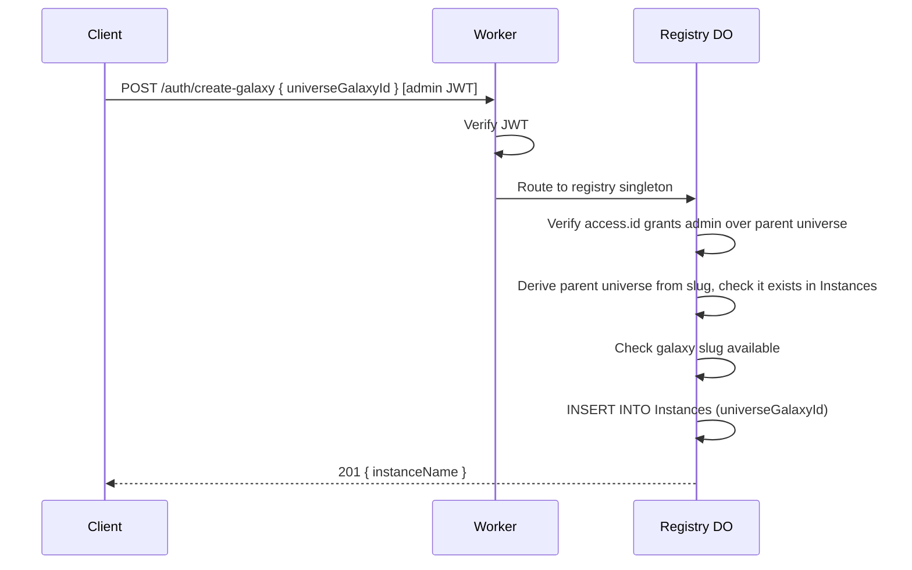
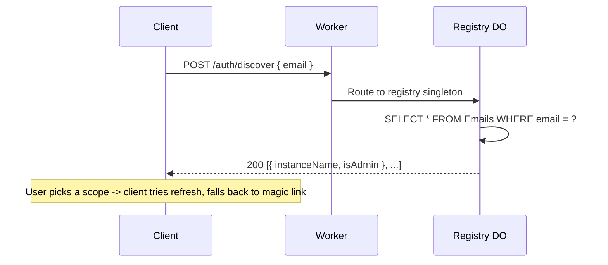
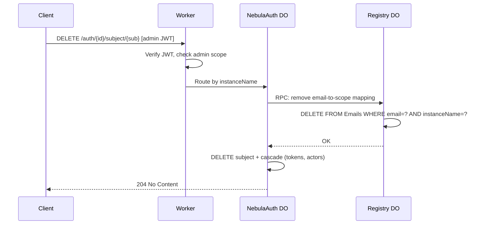
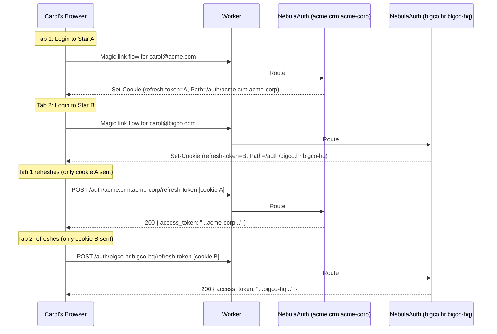

# @lumenize/nebula-auth

Multi-tenant authentication for Nebula — magic link login, JWT access tokens, and admin roles scoped to a three-tier hierarchy: Universe > Galaxy > Star.

## Architecture

Two Durable Object classes, one Worker router:

| Component | Instances | Purpose |
|-----------|-----------|---------|
| `NebulaAuth` (NA) | One per `universeGalaxyStarId` (+ `nebula-platform`) | Token management, magic link flow, JWT issuance, subject CRUD |
| `NebulaAuthRegistry` (R) | Singleton | Instance catalog, email-to-scope index, slug availability, discovery, self-signup routing |
| `NebulaWorker` | Edge (Cloudflare Workers) | Routing, Turnstile, JWT verification, per-subject rate limiting |

### Tier Hierarchy

One `NebulaAuth` class serves all three tiers. The tier is determined by the segment count of the DO instance name:

| Segments | Tier | Example Instance Name | Purpose |
|----------|------|----------------------|---------|
| 1 | Universe | `george-solopreneur` | Universe admin management |
| 2 | Galaxy | `george-solopreneur.georges-first-app` | Galaxy admin management |
| 3 | Star | `george-solopreneur.georges-first-app.acme-corp` | User management + auth |

Slugs are lowercase letters, digits, and hyphens only (`[a-z0-9-]+`). No periods within a slug. Universe slugs are globally unique. Galaxy slugs are unique within their universe. Star slugs are unique within their galaxy.

### Registry-First Mutation Pattern

For subject mutation operations (create, delete, role change), the `NebulaAuth` instance calls the registry *first* via RPC. If the registry call fails, the request fails without modifying local state — nothing to roll back. Read-path operations (token refresh, JWT validation) do not involve the registry.

### Worker Gating Strategy

The Worker runs at the edge and gates requests before they reach DOs:

- **Turnstile** on public mutation endpoints (`email-magic-link`, `claim-universe`, `claim-star`) — blocks automated abuse before it reaches any DO
- **JWT verification + per-subject rate limiting** on authenticated endpoints — the Worker verifies the JWT, extracts `sub`, and rate-limits before forwarding
- **Unauthenticated auth-flow endpoints** (`magic-link` GET, `accept-invite` GET, `refresh-token` POST, `logout` POST, `discover` POST) — forwarded directly to the target DO, which validates the token/cookie internally

### Worker Auth Pipeline (Authenticated Endpoints)

1. Extract JWT from `Authorization: Bearer` header (or WebSocket subprotocol)
2. Verify JWT signature with key rotation support (BLUE/GREEN)
3. Validate standard claims: `iss`, `aud`, `sub`
4. Validate `access` claim exists
5. Match `access.id` against the target `instanceName` — exact match or wildcard
6. Enforce access gate: `access.admin || adminApproved`
7. Per-subject rate limiting (when `NEBULA_AUTH_RATE_LIMITER` binding configured)
8. Forward request to target DO

### Cross-Scope Admin Access

When a higher-tier admin (e.g., universe admin) accesses a lower-tier DO (e.g., star endpoint), the DO's local Subjects table won't contain the admin's `sub`. The DO handles this with a wildcard fallback in JWT verification:

1. Verify JWT signature (always)
2. Look up `payload.sub` in local Subjects table
3. If found, use the local record (normal path)
4. If not found, check `matchAccess(payload.access.id, instanceName)` — if the JWT's wildcard scope covers this instance, return identity from JWT claims (`sub`, `email`, `access.admin`)

This works because DOs are only reachable from Workers in the same project — the JWT re-verification at the DO level provides the security boundary.

---

## URL Format

All auth routes share a single prefix (`/auth` by default):

```
https://host/auth/{universeGalaxyStarId}/[endpoint]   -> NebulaAuth instance
https://host/auth/discover                             -> NebulaAuthRegistry
https://host/auth/claim-universe                       -> NebulaAuthRegistry
https://host/auth/claim-star                           -> NebulaAuthRegistry
https://host/auth/create-galaxy                        -> NebulaAuthRegistry
```

Registry paths are identified by exact match against the 4 known endpoints. Everything else is an instance path where the segment after `/auth/` is the `instanceName`.

---

## Endpoint Reference

### DO Involvement Key

- **NA** = `NebulaAuth` instance only (no registry call)
- **NA->R** = `NebulaAuth` calls registry via RPC first, then writes locally
- **NA (or NA->R)** = Conditional — registry call only when state change requires it
- **R** = `NebulaAuthRegistry` only
- **R->NA** = Registry validates/records, then calls `NebulaAuth` via RPC

### Auth Flow Endpoints

| Endpoint | Method | Gating | DOs | Description |
|----------|--------|--------|-----|-------------|
| `/auth/{id}/email-magic-link` | POST | Turnstile | NA | Request magic link email |
| `/auth/{id}/magic-link?one_time_token=...` | GET | none | NA (or NA->R) | Validate magic link, issue refresh token; registry RPC only on first email verification |
| `/auth/{id}/accept-invite?invite_token=...` | GET | none | NA | Accept invite, set emailVerified, issue refresh token |
| `/auth/{id}/refresh-token` | POST | none (cookie) | NA | Exchange refresh token for access token (hot path) |
| `/auth/{id}/logout` | POST | none (cookie) | NA | Revoke refresh token, clear cookie |

### Subject Management Endpoints

| Endpoint | Method | Gating | DOs | Description |
|----------|--------|--------|-----|-------------|
| `/auth/{id}/subjects` | GET | JWT + rate limit | NA | List subjects in this instance |
| `/auth/{id}/subject/{sub}` | GET | JWT + rate limit | NA | Get subject |
| `/auth/{id}/subject/{sub}` | PATCH | JWT + rate limit | NA->R | Update subject flags (registry notified if role changes) |
| `/auth/{id}/subject/{sub}` | DELETE | JWT + rate limit | NA->R | Delete subject (registry notified) |
| `/auth/{id}/invite` | POST | JWT + rate limit | NA->R | Invite subjects — create with adminApproved, send emails |
| `/auth/{id}/approve/{sub}` | GET | JWT + rate limit | NA | Approve subject (email link friendly) |

### Delegation Endpoints

| Endpoint | Method | Gating | DOs | Description |
|----------|--------|--------|-----|-------------|
| `/auth/{id}/subject/{sub}/actors` | POST | JWT + rate limit | NA | Add authorized actor |
| `/auth/{id}/subject/{sub}/actors/{actorId}` | DELETE | JWT + rate limit | NA | Remove authorized actor |
| `/auth/{id}/delegated-token` | POST | JWT + rate limit | NA | Request token to act on behalf of another subject |

### Registry Endpoints

| Endpoint | Method | Gating | DOs | Description |
|----------|--------|--------|-----|-------------|
| `/auth/discover` | POST | none | R | Email-based scope discovery |
| `/auth/claim-universe` | POST | Turnstile | R->NA | Self-signup: claim universe slug, RPC to NA to send magic link |
| `/auth/claim-star` | POST | Turnstile | R->NA | Self-signup: claim star slug, RPC to NA to send magic link |
| `/auth/create-galaxy` | POST | JWT + rate limit | R | Admin creates galaxy (registry only, no NA DO created) |

---

## Sequence Diagrams

### Token Refresh (Hot Path)

No registry involvement. Most frequent operation (~every 15 minutes per active session).



### Magic Link Login

Registry-first mutation on first verification only: if the subject already exists with `emailVerified=1`, the email-to-scope mapping is already in the registry and the RPC call is skipped.

**First-user-is-founder:** When a `NebulaAuth` DO instance has zero subjects during magic link completion, the first verified email becomes the founding admin (`isAdmin=1, adminApproved=1, emailVerified=1`). This applies to all tiers regardless of how the instance was created.



### Admin Invite Flow

The admin pre-approves the invitee and registers the email-to-scope mapping in the registry upfront. When the invitee clicks the link, there's no conditional registry RPC (already done), no first-user-is-founder check (at least one admin exists), and no Turnstile (the invite token is the proof of legitimacy).



### Universe Self-Signup

Registry validates slug availability, records the instance, then calls NebulaAuth via RPC to send the magic link email.



### Star Self-Signup

Same pattern as universe, but the registry also validates that the parent galaxy exists.

### Galaxy Creation (Admin Only)

Registry-only. No NebulaAuth DO created until the first request routes to it.



### Discovery Flow

Registry-only. No NebulaAuth involvement. After the user picks a scope, the client tries refresh first (in case a valid path-scoped cookie exists), then falls back to magic link.



### Subject Deletion



### Coach Multi-Session

Each DO instance sets its refresh cookie with a `Path` scoped to its `instanceName`, so the browser automatically sends the correct cookie to the correct DO instance.



Admin hierarchy uses JWT wildcards, not separate cookies. A universe admin logs in at `/auth/george-solopreneur` and gets a JWT with `{ "id": "george-solopreneur.*", "admin": true }`. That JWT grants access to any star-level endpoint beneath it via wildcard matching. The refresh cookie is scoped to `Path=/auth/george-solopreneur`, so the admin refreshes at universe level only.

---

## JWT Claims

### `NebulaJwtPayload`

```typescript
interface AccessEntry {
  id: string      // universeGalaxyStarId or wildcard (e.g. "george-solopreneur.*")
  admin?: boolean // true = admin of this scope; omitted when false
}

interface NebulaJwtPayload {
  iss: string            // Issuer (https://nebula.lumenize.com)
  aud: string            // Audience (https://nebula.lumenize.com)
  sub: string            // Subject UUID (within the issuing DO instance)
  exp: number            // Expiration (Unix seconds)
  iat: number            // Issued at (Unix seconds)
  jti: string            // JWT ID (UUID)
  email: string          // Subject's email address
  adminApproved: boolean
  access: AccessEntry    // Scoped access (one entry per JWT)
  act?: ActClaim         // Delegation chain per RFC 8693 (optional)
}
```

### Access Claim Examples

**Star-level regular user:**
```json
{ "access": { "id": "george-solopreneur.georges-first-app.acme-corp" } }
```

**Star-level admin:**
```json
{ "access": { "id": "george-solopreneur.georges-first-app.acme-corp", "admin": true } }
```

**Galaxy admin (access to all stars beneath):**
```json
{ "access": { "id": "george-solopreneur.georges-first-app.*", "admin": true } }
```

**Universe admin (access to all galaxies and stars beneath):**
```json
{ "access": { "id": "george-solopreneur.*", "admin": true } }
```

**Platform admin (access to everything):**
```json
{ "access": { "id": "*", "admin": true } }
```

### Wildcard Matching (`matchAccess`)

```
matchAccess("*", "george-solopreneur")                                -> true  (platform admin)
matchAccess("*", "george-solopreneur.app.tenant")                     -> true  (platform admin)
matchAccess("george-solopreneur.*", "george-solopreneur")             -> true  (universe-level)
matchAccess("george-solopreneur.*", "george-solopreneur.app")         -> true  (galaxy beneath)
matchAccess("george-solopreneur.*", "george-solopreneur.app.tenant")  -> true  (star beneath)
matchAccess("george-solopreneur.app.*", "george-solopreneur")         -> false (galaxy can't access universe)
matchAccess("george-solopreneur.app.*", "george-solopreneur.app")     -> true
matchAccess("george-solopreneur.app.tenant", "george-solopreneur.app.tenant") -> true  (exact)
matchAccess("george-solopreneur.app.tenant", "george-solopreneur.app.other")  -> false
```

### Access Gate

The access gate is: **`access.admin || adminApproved`**. Invited users pass immediately (the invite flow sets `adminApproved=true`). Users who request access via magic link without an invite must be explicitly approved by an admin.

`emailVerified` is not in the JWT because it is always `true` by construction — no refresh token (and therefore no JWT) is ever issued without prior email verification.

---

## Data Model

### NebulaAuth: Per-Instance SQLite

Each `NebulaAuth` instance has its own SQLite database. Since each instance represents exactly one `universeGalaxyStarId`, subjects in that instance are members of that tier by definition.

#### Subjects

```sql
CREATE TABLE IF NOT EXISTS Subjects (
  sub TEXT PRIMARY KEY,
  email TEXT UNIQUE NOT NULL,
  emailVerified INTEGER NOT NULL DEFAULT 0,
  adminApproved INTEGER NOT NULL DEFAULT 0,
  isAdmin INTEGER NOT NULL DEFAULT 0,
  createdAt INTEGER NOT NULL,
  lastLoginAt INTEGER
) WITHOUT ROWID;

CREATE INDEX IF NOT EXISTS idx_Subjects_isAdmin
  ON Subjects(sub) WHERE isAdmin = 1;
```

#### MagicLinks

```sql
CREATE TABLE IF NOT EXISTS MagicLinks (
  token TEXT PRIMARY KEY,
  email TEXT NOT NULL,
  expiresAt INTEGER NOT NULL,
  used INTEGER NOT NULL DEFAULT 0
) WITHOUT ROWID;

CREATE INDEX IF NOT EXISTS idx_MagicLinks_email ON MagicLinks(email);
```

#### InviteTokens

Same structure as MagicLinks without the `used` flag — single-use by design, deleted on redemption.

```sql
CREATE TABLE IF NOT EXISTS InviteTokens (
  token TEXT PRIMARY KEY,
  email TEXT NOT NULL,
  expiresAt INTEGER NOT NULL
) WITHOUT ROWID;

CREATE INDEX IF NOT EXISTS idx_InviteTokens_email ON InviteTokens(email);
```

#### RefreshTokens

```sql
CREATE TABLE IF NOT EXISTS RefreshTokens (
  tokenHash TEXT PRIMARY KEY,
  subjectId TEXT NOT NULL,
  expiresAt INTEGER NOT NULL,
  createdAt INTEGER NOT NULL,
  revoked INTEGER NOT NULL DEFAULT 0,
  FOREIGN KEY (subjectId) REFERENCES Subjects(sub) ON DELETE CASCADE
) WITHOUT ROWID;

CREATE INDEX IF NOT EXISTS idx_RefreshTokens_subjectId ON RefreshTokens(subjectId);
CREATE INDEX IF NOT EXISTS idx_RefreshTokens_expiresAt ON RefreshTokens(expiresAt);
```

#### AuthorizedActors

Delegation actor relationships, scoped to the DO instance.

```sql
CREATE TABLE IF NOT EXISTS AuthorizedActors (
  principalSub TEXT NOT NULL,
  actorSub TEXT NOT NULL,
  PRIMARY KEY (principalSub, actorSub),
  FOREIGN KEY (principalSub) REFERENCES Subjects(sub) ON DELETE CASCADE,
  FOREIGN KEY (actorSub) REFERENCES Subjects(sub) ON DELETE CASCADE
) WITHOUT ROWID;
```

### NebulaAuthRegistry: Singleton SQLite

#### Instances

```sql
CREATE TABLE IF NOT EXISTS Instances (
  instanceName TEXT PRIMARY KEY,
  createdAt INTEGER NOT NULL
) WITHOUT ROWID;
```

Tier and parent are derived from `instanceName`: segment count gives tier (1=universe, 2=galaxy, 3=star), stripping the last segment gives parent.

#### Emails

```sql
CREATE TABLE IF NOT EXISTS Emails (
  email TEXT NOT NULL,
  instanceName TEXT NOT NULL,
  isAdmin INTEGER NOT NULL DEFAULT 0,
  createdAt INTEGER NOT NULL,
  PRIMARY KEY (email, instanceName)
) WITHOUT ROWID;

CREATE INDEX IF NOT EXISTS idx_Emails_instanceName
  ON Emails(instanceName);
```

The compound PK covers email-first lookups (leftmost prefix). `idx_Emails_instanceName` enables reverse lookups ("list all emails in this instance").

---

## Platform Admin (Bootstrap)

### Reserved Instance: `nebula-platform`

`NEBULA_AUTH_BOOTSTRAP_EMAIL` env var designates the platform super-admin. This email authenticates at the reserved `nebula-platform` DO instance via standard magic link flow at `/auth/nebula-platform`. The one conditional behavior: when the DO recognizes the bootstrap email, it issues a JWT with `{ "access": { "id": "*", "admin": true } }` instead of the normal scope.

The `nebula-platform` instance goes through the normal magic link flow including the registry RPC on first verification, so it appears in the `Emails` table and discovery correctly returns it as a scope for the bootstrap email.

### Admin Creation Chain

- **Platform admin** creates universe admins (via invite at universe-level DOs)
- **Universe admins** can create other universe admins, galaxy admins, and star admins
- **Galaxy admins** can create other galaxy admins and star admins beneath them
- **Star admins** manage star users

---

## Configuration

### Environment Variables (secrets + operational)

| Variable | Notes |
|----------|-------|
| `JWT_PRIVATE_KEY_BLUE` / `JWT_PRIVATE_KEY_GREEN` | Ed25519 signing keys (secret) |
| `JWT_PUBLIC_KEY_BLUE` / `JWT_PUBLIC_KEY_GREEN` | Ed25519 verification keys (secret) |
| `PRIMARY_JWT_KEY` | Active signing key (`'BLUE'` or `'GREEN'`) |
| `RESEND_API_KEY` | Resend email API key (secret) |
| `TURNSTILE_SECRET_KEY` | Cloudflare Turnstile secret (optional) |
| `NEBULA_AUTH_BOOTSTRAP_EMAIL` | Platform super-admin email (optional) |
| `NEBULA_AUTH_TEST_MODE` | Enable test endpoints — set in `vitest.config.js` only, never `.dev.vars` |
| `NEBULA_AUTH_REDIRECT` | Post-login redirect target (e.g., `/app`) |

### Hardcoded Constants

| Constant | Value | Notes |
|----------|-------|-------|
| `PLATFORM_INSTANCE_NAME` | `'nebula-platform'` | Reserved DO instance for platform admin |
| `REGISTRY_INSTANCE_NAME` | `'registry'` | Singleton instance name for `NebulaAuthRegistry` |
| `NEBULA_AUTH_PREFIX` | `'/auth'` | URL prefix for all auth routes |
| `NEBULA_AUTH_ISSUER` | `'https://nebula.lumenize.com'` | JWT `iss` claim |
| `NEBULA_AUTH_AUDIENCE` | `'https://nebula.lumenize.com'` | JWT `aud` claim |
| `ACCESS_TOKEN_TTL` | `900` (15 min) | Access token lifetime (seconds) |
| `REFRESH_TOKEN_TTL` | `2592000` (30 days) | Refresh token lifetime (seconds) |
| `MAGIC_LINK_TTL` | `1800` (30 min) | Magic link lifetime (seconds) |
| `INVITE_TTL` | `604800` (7 days) | Invite token lifetime (seconds) |

---

## Exports

```typescript
// DO classes (needed for wrangler bindings in consuming projects)
export { NebulaAuth } from './nebula-auth';
export { NebulaAuthRegistry } from './nebula-auth-registry';

// Email sender (WorkerEntrypoint for service binding)
export { NebulaEmailSender } from './nebula-email-sender';

// Router entry point — the primary export for composing into a parent Worker
export { routeNebulaAuthRequest } from './router';

// universeGalaxyStarId parsing and access matching
export { parseId, isValidSlug, isPlatformInstance, getParentId, buildAccessId, matchAccess } from './parse-id';

// Types: Tier, ParsedId, AccessEntry, NebulaJwtPayload, Subject, DiscoveryEntry
// Constants: PLATFORM_INSTANCE_NAME, REGISTRY_INSTANCE_NAME, NEBULA_AUTH_PREFIX,
//            ACCESS_TOKEN_TTL, NEBULA_AUTH_ISSUER, NEBULA_AUTH_AUDIENCE
```

## License

BSL-1.1
