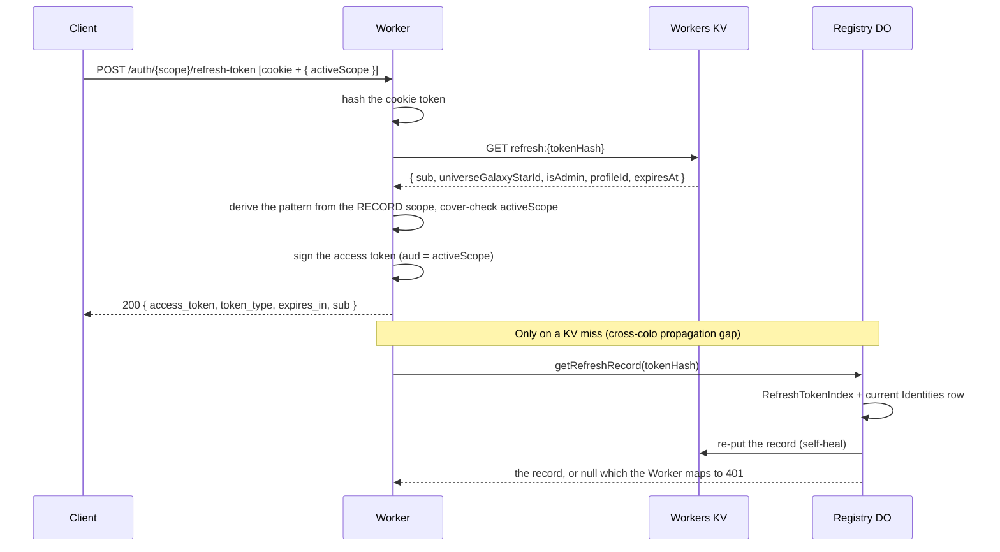
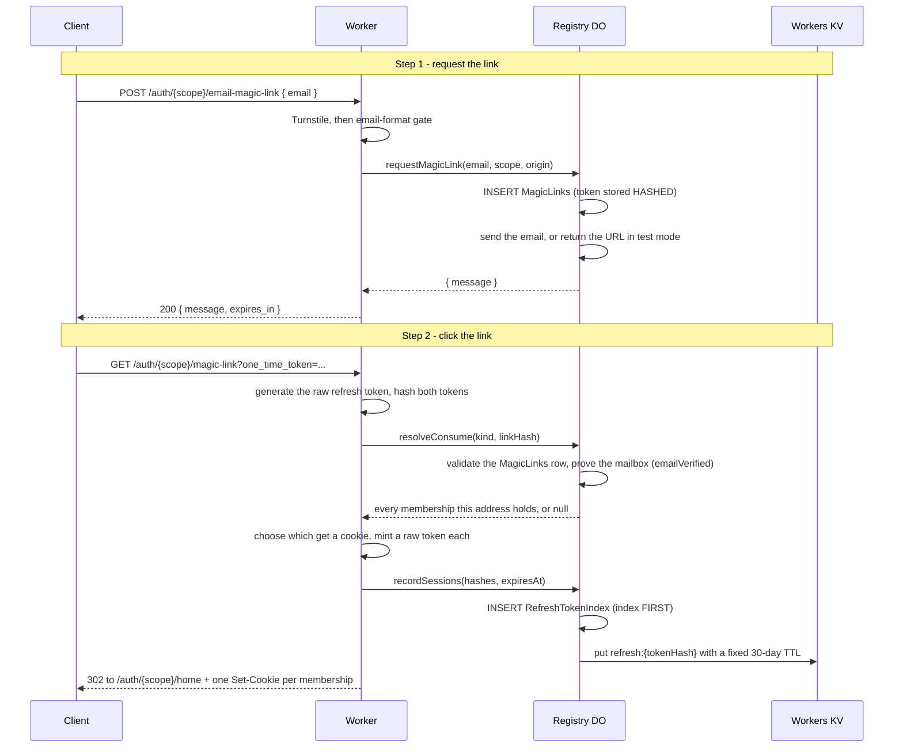
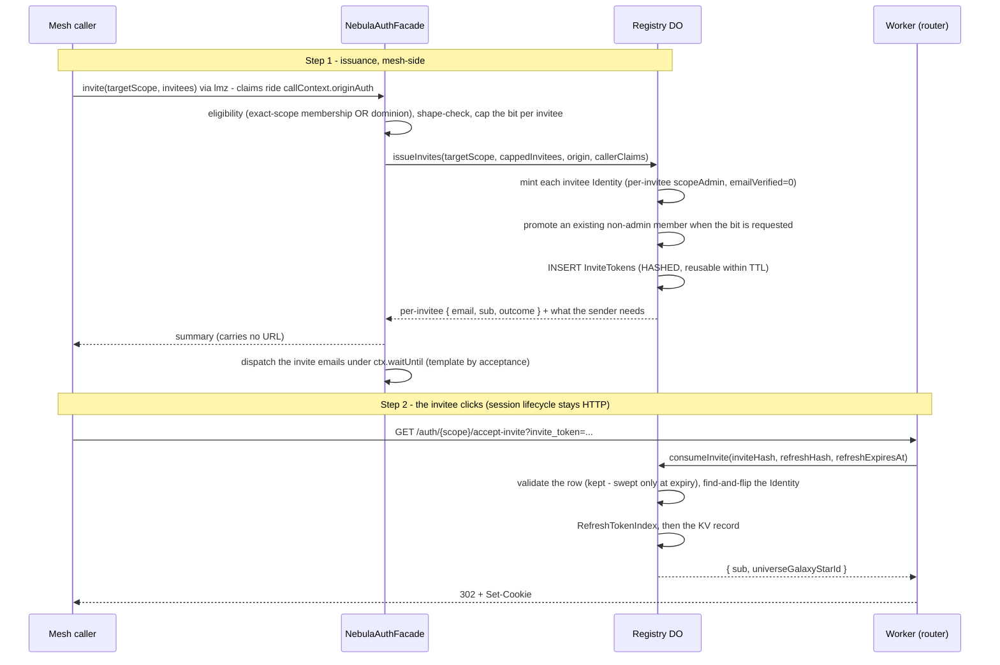
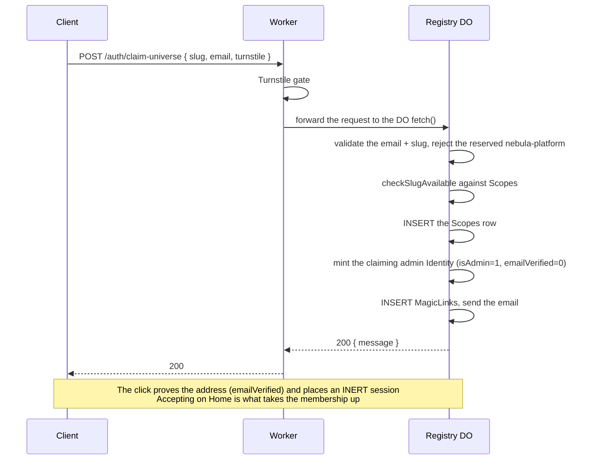
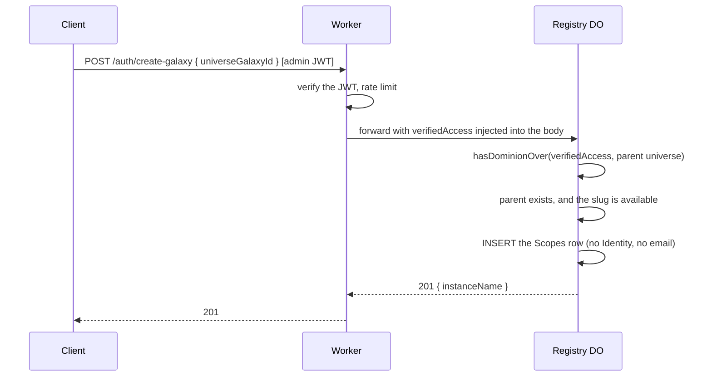
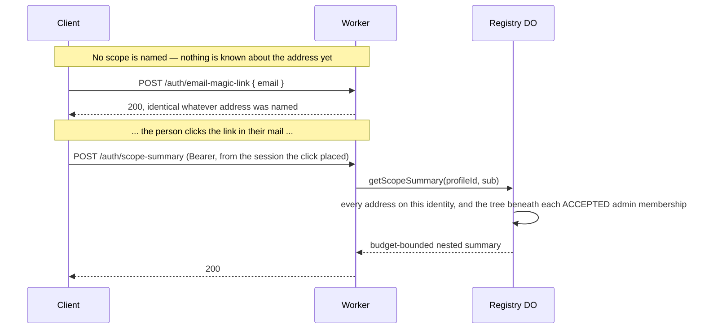
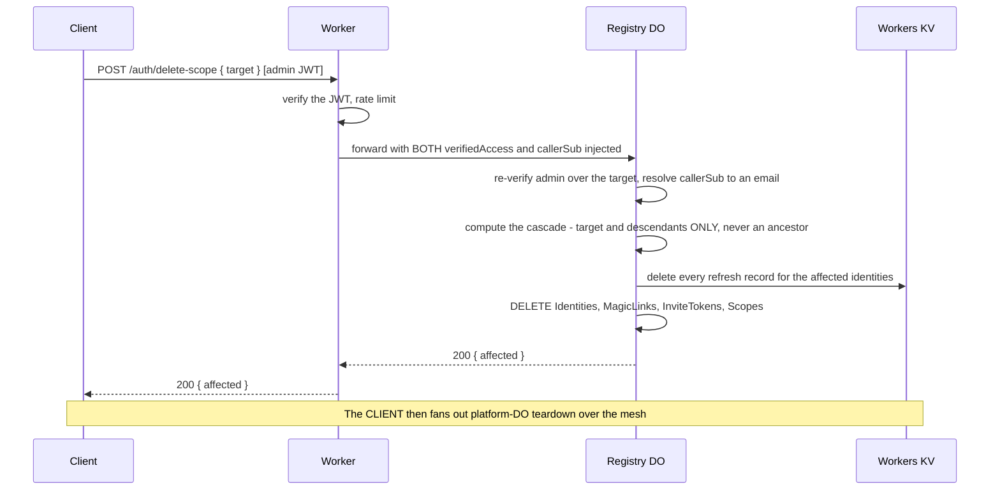
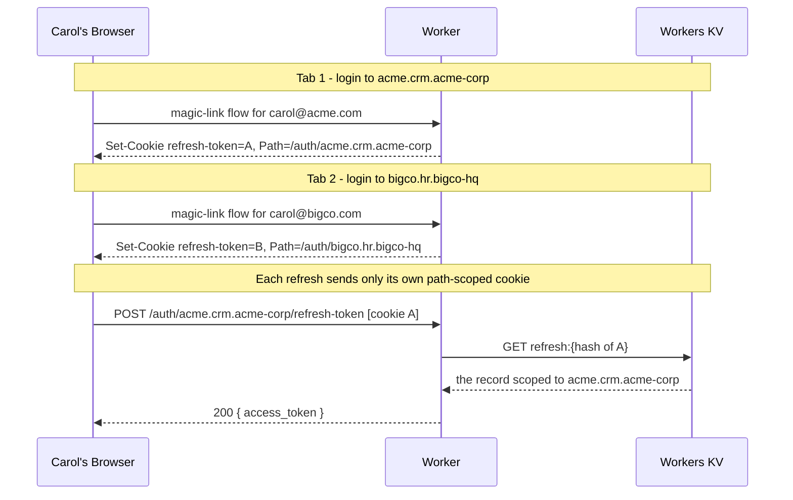

# @lumenize/nebula-auth

Multi-tenant authentication for Nebula — magic link login, JWT access tokens, and admin roles scoped to a three-tier hierarchy: Universe > Galaxy > Star.

## Architecture

**One Worker router, one singleton Durable Object, one KV namespace.**

| Component | Instances | Purpose |
|-----------|-----------|---------|
| `routeNebulaAuthRequest` (`router.ts` + `worker-token.ts`) | Edge (Cloudflare Workers) | Path parsing, Turnstile, JWT verification, per-`sub` rate limiting, and the token/session flows themselves (JWT minting, cookies, redirects) |
| `NebulaAuthFacade` (`@lumenize/nebula-auth/facade`) | `LumenizeWorker` (service binding, mesh-reachable) | The mesh entry for what an authenticated SESSION does with the Registry — invites today. Owns the claims-only eligibility verdicts, the per-invitee `scopeAdmin` cap, the ADR-016 projection, and the post-return mail dispatch |
| `NebulaAuthRegistry` (R) | Singleton (`registry`) | The single writer of all durable auth state: `Scopes`, `Identities`, the magic-link/invite login channel, and `RefreshTokenIndex` |
| Workers KV (`REFRESH_TOKEN_KV`) | Edge | The one hot record — `refresh:{tokenHash}`, read at the edge on every refresh, never touching the DO |
| `NebulaEmailSender` | `WorkerEntrypoint` (service binding) | Nebula-branded magic-link/invite email |

**HTTP carries the session lifecycle; the mesh carries what a session does** (accepted `docs/vision/auth.md` § *The Registry*). So there is **no HTTP invite route**: issuance enters through the facade (`lmz.call('NEBULA_AUTH_FACADE', undefined, …)`), while the accept-invite CLICK — unauthenticated by nature — stays on the router below.

The per-scope `NebulaAuth` DO **no longer exists** — it was dissolved by [`tasks/archive/nebula-auth-surrogate-sub.md`](../../tasks/archive/nebula-auth-surrogate-sub.md), which is the design of record for everything below. Its hot token state moved to Workers KV, its cold identity state moved into the registry, and its HTTP handling moved into the Worker.

### Scope hierarchy

A `universeGalaxyStarId` is 1–3 dot-separated slugs, and the segment count *is* the tier:

| Segments | Tier | Example | Purpose |
|----------|------|---------|---------|
| 1 | Universe | `george-solopreneur` | Universe admin management |
| 2 | Galaxy | `george-solopreneur.georges-first-app` | Galaxy admin management |
| 3 | Star | `george-solopreneur.georges-first-app.acme-corp` | Tenant users + auth |

Slugs are lowercase letters, digits, and hyphens (`[a-z0-9][a-z0-9-]*`), no leading/trailing hyphen, no `--`, no periods within a slug. Universe slugs are globally unique; galaxy slugs unique within their universe; star slugs unique within their galaxy.

⚠️ **`instanceName` is a legacy name, not a DO instance.** The URL segment, the `AffectedScope.instanceName` wire field, and several local variables still say "instance" — but there is no per-scope DO to name. It means *scope id* (`universeGalaxyStarId`) everywhere. Scope **existence** is a row in the registry's `Scopes` table, deliberately independent of membership: an admin-created child scope managed by wildcard reach has a `Scopes` row and zero `Identities`.

### Routing: forward to the DO, or handle in the Worker?

Every route takes one of exactly two shapes — the rule is in [`.claude/rules/raw-comm.md`](../../.claude/rules/raw-comm.md) § "Edge Worker fronting a DO":

- **Forwarded to the registry's `fetch()`** when the endpoint's job *is* the DO's data operation (claim / create / query / delete on registry storage). The Worker does only the cross-cutting pre-checks that need env + secrets and produce **trusted claims** — Turnstile, JWT verify — then injects `verifiedAccess` (and `callerSub` for deletes) into the body and forwards. Because `request.url` is preserved, the DO reads `url.origin` itself, and it converts its own `RegistryError` to a `Response` in-process, so `status`/`errorCode` survive.
- **Handled in the Worker, with narrow RPC** when the endpoint is an HTTP/session concern — setting or clearing a cookie, a `302`, reading a token from the query string, or a pure-KV read. The Worker owns the `Response` and calls the registry only for the specific data it needs (`requestMagicLink`, `resolveConsume`, `recordSessions`, …). (`issueInvites` is not on this list: its caller is the mesh facade, never the router.)

**Every route is registered in the route-pipeline table** (`buildAuthRouteTable` in `router.ts`) —
each entry is `{ path, method, steps }`, and the ordered step list IS the route's complete
requirement, readable without opening a handler. There is no enumeration beside the table: a route
cannot exist without a guard list. The three registry-bound terminals encode what the edge injects —
`forwardRaw` (nothing — the original request, every header intact), `forwardWithAccess`
(`verifiedAccess`), `forwardWithClaims` (`verifiedAccess` + `callerSub` + `callerClaims`, ADR-016's
fail-closed input).

An unknown path is a `404` **at the edge**, and a known path under a wrong verb is a `405 Allow:`
**at the edge** — the singleton never sees either. (The DO keeps its own POST-only check as defense
in depth for non-router callers.)

### Identity model: surrogate `sub`

Identity is keyed by a registry-minted opaque `sub` (UUID), **one per `(email, scope)`** — the same person in two scopes has two `sub`s. `email` is a plain mutable attribute owned only by the registry; nothing keys off it, so an email change is a one-row `UPDATE` with no cascade and no token re-issue. A `profileId` (a second, *public* UUID) is minted in the same INSERT as `sub` — see [`tasks/nebula-profile-store.md`](../../tasks/nebula-profile-store.md).

**Minting happens only at mint points:**

| Mint point | What is minted |
|---|---|
| `claimUniverse` (open self-signup) | `Scopes` row **+** the claiming admin `Identity` (`isAdmin=1`, `emailVerified=0`) |
| `issueInvites` | invitee `Identity` (`emailVerified=0`), pre-created — per-invitee `scopeAdmin`, honored only under the inviter's dominion (a re-invite of an existing non-admin member with the bit **promotes** them) |
| `requestMagicLink` at `nebula-platform` for a configured bootstrap email | platform-admin `Identity` (idempotent, scope-gated) |
| `createGalaxy` / `createStar` (admin) | `Scopes` row **only** — no identity, no email; the parent admin manages via wildcard reach |

**Login never mints, and a consume never enrols.** `resolveConsume` *finds* every membership on the address and flips `emailVerified` — proof of the MAILBOX, set once and globally — resolving to an empty set when the address holds none. It does **not** write `acceptedAt`: proving an address and agreeing to hold a membership are different acts, and the only writer of the second is `accept-membership`, reached from behind a consent modal. So the cookies a click places are INERT until their holder consents; `refresh-token` answers `401 membership_not_accepted` until then. A stranger who requests a link for a scope they were never minted into proves their mailbox and gets nowhere to go.

### The refresh path is a pure KV read

Refresh is the highest-frequency operation and it **never touches the singleton**:

1. Hash the `refresh-token` cookie, `GET refresh:{tokenHash}` from KV.
2. Derive `authScope` from the **record's** `universeGalaxyStarId` — never the request path or body. Deriving it from client input would let a caller mint a token for any scope they name.
3. Check the requested `activeScope` is covered, then mint the JWT with `isAdmin` and `profileId` **from the KV record**.

**No rotation, no slide.** The refresh token gets a fixed 30-day TTL at login and refresh re-issues nothing — zero writes on the hot path. A 30-day re-login (a fresh magic link) is the accepted UX cost. See [`.claude/rules/security.md`](../../.claude/rules/security.md) for why rotation was dropped and what would be required to reintroduce it (rotation *with* a grace window plus family-revoke — never the no-grace form).

**KV-miss fallback.** KV is eventually consistent, so the login→first-refresh hop can miss across colos. On a miss the Worker falls back once to `registry.getRefreshRecord(tokenHash)`, which rebuilds the record from the strongly-consistent `RefreshTokenIndex` plus the current `Identities` row and **re-puts it to KV** (self-healing, so it fires at most once per token). A genuinely invalid token isn't in the index → still `401`.

⚠️ **Revocation is KV-eventually-consistent.** Logout deletes the KV record and its index entry (KV-delete-first, so an interruption never strands a live-but-unindexed token), but a revoked or demoted token keeps working for the KV propagation window (~edge `cacheTtl`) **plus** the full access-token TTL, repeatably within that window. The short `ACCESS_TOKEN_TTL` is the mitigation.

### Dominion

`hasDominionOver(access, scope)` is the single dominion predicate: **`access.scopeAdmin` alone is never dominion** — dominion is that bit *and* `authScope` covering the node in question ([ADR-015](../../docs/adr/015-passage-and-dominion.md) § *Terminology*, the definition home for `dominion` and `passage`). Dominion flows strictly downward and only downward (ADR-015). Every guard delegates to that one predicate; none may re-inline `scopeAdmin && isAtOrAbove(...)`.

The gate lands in three places depending on the surface:

- **The invite facade** (`NebulaAuthFacade.invite`, mesh-side): eligibility = exact-scope membership ∨ `hasDominionOver(claims.access, targetScope)`, computed from `callContext.originAuth` — every member may invite non-admin peers into exactly their own scope; dominion additionally permits inviting downward and is the only thing that licenses a requested `scopeAdmin` (a peer's request caps to false). The registry re-asserts the cap in-method as an invariant (a `scopeAdmin: true` entry without dominion in `callerClaims` throws — a breach, never an expected client error).
- **`/auth/mint-narrower-token`** (scope-less): the pipeline proves identity (`verifyJwtGuard` + `subRateLimitGuard`); authorization is the handler's single `canMintFor(callerClaims, subject)` call — dominion over the **subject's** scope, which no URL carries. Refusal and an absent subject answer identically (no `sub`-existence oracle), and the one containment check besides it is the `aud` validation, run after.
- **Forwarded registry endpoints**: the Worker verifies the JWT and injects the verified `access` claim; the registry re-asserts `hasDominionOver` itself (`createGalaxy`, `createStar`, `#computeDeletionPlan`). `getScopeSummary` is `profileId`-keyed and descends only under ACCEPTED admin memberships, and each level is read with `LIMIT budget+1` — so the READ is bounded, not merely the response.

### Worker gating pipeline

| Stage | Applies to |
|---|---|
| Path parse + `parseId` validation | All (invalid scope id → `400 invalid_instance`); on pipeline routes this is the `parseScopeGuard` step |
| CORS policy (`@lumenize/routing`) | All, per `RouteNebulaAuthOptions.cors` |
| Turnstile | Derived from the CREDENTIAL a route presents, not from a list: every route presenting none — no Bearer, no path-scoped cookie, no one-time token — carries `turnstileGuard`. Today that is `email-magic-link` (both forms), `claim-universe` and `claim-star`. Two deliberate exemptions present nothing and are un-gated: the GETs that serve the auth SPA's static HTML, and `coming-soon`. `test/turnstile-by-credential.test.ts` derives the set from the route table, so a new row must state which side it falls on |
| JWT verify (Ed25519, BLUE/GREEN rotation) + `iss`/`aud`/`sub`/`access` claim checks + `aud ⊆ authScope` | Authenticated endpoints (`verifyJwtGuard`, Bearer-only) |
| Per-`sub` rate limit (`subRateLimitGuard`) | Authenticated endpoints, when `NEBULA_AUTH_RATE_LIMITER` is bound |

(The passage/dominion guard pair left the pipeline with the `/invite` route — those verdicts are the mesh facade's now, and the scoped registry routes re-introduce the pair when their scope moves onto the URL.)

Turnstile is skipped in exactly two cases: no `TURNSTILE_SECRET_KEY` is configured (development and every vitest lane, which bind it `''` explicitly), or the request carries the authorized bypass token in `x-lumenize-turnstile-bypass` (constant-time compared against `NEBULA_AUTH_TURNSTILE_BYPASS_TOKEN`). The bypass skips **only** Turnstile — never the magic-link, JWT, or scope checks.

---

## URL Format

All auth routes share a single prefix (`/auth`):

```
https://host/auth/{universeGalaxyStarId}/[endpoint]   -> Worker token layer
https://host/auth/scope-summary                       -> forwarded to the registry
https://host/auth/claim-universe                      -> forwarded to the registry
https://host/auth/create-galaxy                       -> forwarded to the registry
https://host/auth/create-star                         -> forwarded to the registry
https://host/auth/scope-summary                       -> forwarded to the registry
https://host/auth/delete-scope-plan                   -> forwarded to the registry
https://host/auth/delete-scope                        -> forwarded to the registry
```

Every path is matched against the route table's `URLPattern`s — the scope-less registry paths are exact-match entries, and the scope paths carry the scope as a `:scope` segment that `parseScopeGuard` validates before any step reads it.

---

## Endpoint Reference

**Handled by** is either `Worker` (the Worker owns the `Response`, calling the registry by narrow RPC as needed) or `→ registry fetch()` (forwarded after gating, with verified claims injected into the body).

### Auth flow endpoints

| Endpoint | Method | Gating | Handled by | Description |
|----------|--------|--------|-----------|-------------|
| `/auth/{scope}/email-magic-link` | POST | Turnstile | Worker | Request a login magic link. Validates email format at the edge, then `requestMagicLink` inserts a hashed `MagicLinks` row and sends the mail. **Mints no identity.** |
| `/auth/magic-link?one_time_token=…` | GET | none | Worker | The scope-less click. `resolveConsume` validates the link, proves the mailbox once and globally, and returns EVERY membership the address holds; the Worker mints a session per membership and sets one path-scoped cookie each. `302`s to `/auth/{scope}/home` — or `/auth/signup` when the address holds nothing yet, carrying a short-lived signup ticket |
| `/auth/{scope}/magic-link?one_time_token=…` | GET | none | Worker | The same consume, reached by a link that named a scope (a claim). Identical behaviour; the named scope is minted first |
| `/auth/{scope}/pending-membership` | POST | path-scoped cookie | Worker | The consent modal's inputs for the membership that cookie names — acceptance state and the sender-supplied name. Exists because a refresh REFUSES an unaccepted membership, which is exactly the one the modal is for |
| `/auth/{scope}/accept-membership` | POST | path-scoped cookie | Worker | **The one writer of `acceptedAt`.** Reached from behind the consent modal; converges the KV record and any co-minted `.dev` sibling |
| `/auth/{scope}/accept-invite?invite_token=…` | GET | none | Worker | Same, via `consumeInvite` — the invite row is reusable within its TTL (scanner-safe, like magic links; swept at expiry, never deleted on consume) |
| `/auth/{scope}/refresh-token` | POST | none (cookie) | Worker | Pure KV read → mint the access token. Requires `{ activeScope }` JSON body. Re-sets no cookie |
| `/auth/{scope}/logout` | POST | none (cookie) | Worker | `revokeRefreshToken` deletes the KV record + index entry; clears the cookie |

### Authenticated endpoints

| Endpoint | Method | Gating | Handled by | Description |
|----------|--------|--------|-----------|-------------|
| `NebulaAuthFacade.invite(targetScope, invitees)` | mesh (`lmz.call`/`callAsync` on the `NEBULA_AUTH_FACADE` service binding, `instanceName: undefined`) | eligibility (exact-scope membership ∨ dominion) + the per-invitee bit cap, from `callContext.originAuth` | Facade | `invitees: [{ email, scopeAdmin? }]`. The registry mints per invitee (identity + reusable-within-TTL invite token, promoting an existing non-admin member when the bit is requested under dominion) and answers per-invitee outcomes (`invited \| already-member \| promoted`); the facade dispatches the mail post-return under `ctx.waitUntil` (template by acceptance). **There is no HTTP invite route** — `POST /auth/{scope}/invite` is a 404 |
| `/auth/mint-narrower-token` | POST | pipeline: JWT + `sub` rate limit; authz = the handler's `canMintFor` (dominion over the SUBJECT's scope) | Worker | Mint a narrower token wearing another person's identity: `sub`/`authScope`/`scopeAdmin` = the subject's, `aud` = the requested `activeScope`, `act.sub` = the caller. Requires `{ subOfNarrowerToken, activeScope }`. Scope-less — the old `/auth/{scope}/…` path is a 404 |

### Registry endpoints

| Endpoint | Method | Gating | Handled by | Description |
|----------|--------|--------|-----------|-------------|
| `/auth/claim-universe` | POST | Turnstile | → registry `fetch()` (raw) | Open self-signup: register the `Scopes` row, mint the claiming admin identity, send a magic link |
| `/auth/claim-star` | POST | Turnstile | → registry `fetch()` (raw) | **Open Star self-signup.** Body `{ universeGalaxyStarId, email }`. Registers the `Scopes` row, mints the star-scoped admin at the **3-segment star id** (`isAdmin`, `emailVerified: 0` → an **exact-star** pattern), and sends a claim link — all in one `transactionSync`. No admin in the loop |
| `/auth/create-galaxy` | POST | JWT (+`verifiedAccess` injected) + rate limit | → registry `fetch()` | Admin creates a galaxy — `Scopes` row only |
| `/auth/create-star` | POST | JWT (+`verifiedAccess` injected) + rate limit | → registry `fetch()` | Admin creates a star — `Scopes` row only |
| `/auth/scope-summary` | POST | JWT (+ verified `sub`/`profileId` injected; refuses an `act`-bearing token) + rate limit | → registry `fetch()` | Every address on the caller's identity and the tree beneath each accepted admin membership, budget-bounded |
| `/auth/expand-scope` | POST | same as `scope-summary` | → registry `fetch()` | One more level beneath a node, keyset-paged past the budget |
| `/auth/delete-scope-plan` | POST | JWT (+`verifiedAccess` + `callerSub` injected) + rate limit | → registry `fetch()` | Read-only cascade plan for the confirm screen |
| `/auth/delete-scope` | POST | JWT (+`verifiedAccess` + `callerSub` injected) + rate limit | → registry `fetch()` | Execute the cascade; returns the affected set for the caller's platform-DO teardown fan-out |

#### `claim-star` responses — first failure wins

Validation is a fail-fast prologue in this exact order, so a request failing several checks reports only the first. Multi-error UX is the **client's** job: the signup page format-validates before it POSTs, which leaves `slug_taken` as the one realistic server-side error for a well-behaved client.

| Order | Status | `error` | When |
|---|---|---|---|
| 1 | 400 | `invalid_email` | `email` fails `isValidEmail` |
| 2 | 400 | `invalid_id` | `universeGalaxyStarId` is not 1–3 valid dot-separated slugs |
| 3 | 400 | `invalid_tier` | parses, but is not 3 segments |
| 4 | 400 | `reserved_slug` | the star slug is a reserved **environment** name (`dev`) — see `RESERVED_STAR_SLUGS` |
| 5 | 400 | `parent_not_found` | the parent galaxy `{u}.{g}` has no `Scopes` row |
| 6 | 409 | `slug_taken` | the full `{u}.{g}.{s}` is already claimed |
| — | 400 | `invalid_request` | the body is not a JSON object |
| — | 200 | — | `{ message }`, plus `magicLinkUrl` in test mode only |

⚠️ **`slug_taken` is deliberately ambiguous.** When the slug is held by a claimer who never verified their email, that claimer is re-sent their claim link — but the response is **byte-identical** to an ordinary rejection, and the send is fired without being awaited. Answering a resume with a success (or awaiting only on that branch) would make this endpoint an email-confirmation oracle: probe a slug with `victim@corp.com` and a distinguishable answer proves the victim is that slug's unverified claimer. The resume adds a `MagicLinks` row and nothing else — never an `UPDATE Identities`, which would promote a pending invitee to star admin through an unauthenticated endpoint.

⚠️ **`claim-star`'s row must carry `turnstileGuard`.** `subRateLimitGuard` keys on a verified `sub`, so the Turnstile step (behind the connection limiter) is the only human-presence bound on this open mutation endpoint. The regression is caught behaviourally: `checkTurnstile` no longer short-circuits under `NEBULA_AUTH_TEST_MODE`, so `turnstile-bypass.test.ts`'s gating sweep binds a non-empty secret per test and asserts each open row answers `403 turnstile_required` — a row that silently lost the step reds it.

---

## Sequence Diagrams

### Token refresh (hot path)

The most frequent operation, roughly every 15 minutes per active session. No DO involvement on the normal path.


```mermaid
sequenceDiagram
    participant C as Client
    participant W as Worker
    participant KV as Workers KV
    participant R as Registry DO

    C->>W: POST /auth/{scope}/refresh-token [cookie + { activeScope }]
    W->>W: hash the cookie token
    W->>KV: GET refresh:{tokenHash}
    KV-->>W: { sub, universeGalaxyStarId, isAdmin, profileId, expiresAt }
    W->>W: derive the pattern from the RECORD scope, cover-check activeScope
    W->>W: sign the access token (aud = activeScope)
    W-->>C: 200 { access_token, token_type, expires_in, sub }

    Note over W,R: Only on a KV miss (cross-colo propagation gap)
    W->>R: getRefreshRecord(tokenHash)
    R->>R: RefreshTokenIndex + current Identities row
    R->>KV: re-put the record (self-heal)
    R-->>W: the record, or null which the Worker maps to 401
```

### Magic link login


```mermaid
sequenceDiagram
    participant C as Client
    participant W as Worker
    participant R as Registry DO
    participant KV as Workers KV

    Note over C,KV: Step 1 - request the link
    C->>W: POST /auth/{scope}/email-magic-link { email }
    W->>W: Turnstile, then email-format gate
    W->>R: requestMagicLink(email, scope, origin)
    R->>R: INSERT MagicLinks (token stored HASHED)
    R->>R: send the email, or return the URL in test mode
    R-->>W: { message }
    W-->>C: 200 { message, expires_in }

    Note over C,KV: Step 2 - click the link
    C->>W: GET /auth/{scope}/magic-link?one_time_token=...
    W->>W: generate the raw refresh token, hash both tokens
    W->>R: resolveConsume(kind, linkHash)
    R->>R: validate the MagicLinks row, prove the mailbox (emailVerified)
    R-->>W: every membership this address holds, or null
    W->>W: choose which get a cookie, mint a raw token each
    W->>R: recordSessions(hashes, expiresAt)
    R->>R: INSERT RefreshTokenIndex (index FIRST)
    R->>KV: put refresh:{tokenHash} with a fixed 30-day TTL
    W-->>C: 302 to /auth/{scope}/home + one Set-Cookie per membership
```

Index-first is a seam invariant: an eviction at the awaited KV put leaves at worst a revocable index-entry-without-record, never a live-but-unindexed token that nothing can revoke. Magic links stay reusable within their TTL (scanner-safe) and are swept on DO wake rather than deleted on consume.

### Admin invite

The invitee identity is pre-created at issuance, so the click only flips flags — no conditional mint at consume, and no Turnstile (the invite token is the proof of legitimacy). Promotion happens at ISSUANCE (re-inviting an existing non-admin member with the bit, under dominion), never at the click. The registry is mint-only: the facade dispatches the mail post-return under `ctx.waitUntil`, picking the template by acceptance (`invite-existing` for an accepted member, `invite-new` with the fresh link otherwise). The diagram's caller is whichever mesh node holds the verified claims — a client directly, or a platform node forwarding its own caller's — the facade neither knows nor cares.


```mermaid
sequenceDiagram
    participant C as Mesh caller
    participant F as NebulaAuthFacade
    participant R as Registry DO
    participant W as Worker (router)

    Note over C,R: Step 1 - issuance, mesh-side
    C->>F: invite(targetScope, invitees) via lmz - claims ride callContext.originAuth
    F->>F: eligibility (exact-scope membership OR dominion), shape-check, cap the bit per invitee
    F->>R: issueInvites(targetScope, cappedInvitees, origin, callerClaims)
    R->>R: mint each invitee Identity (per-invitee scopeAdmin, emailVerified=0)
    R->>R: promote an existing non-admin member when the bit is requested
    R->>R: INSERT InviteTokens (HASHED, reusable within TTL)
    R-->>F: per-invitee { email, sub, outcome } + what the sender needs
    F-->>C: summary (carries no URL)
    F->>F: dispatch the invite emails under ctx.waitUntil (template by acceptance)

    Note over C,W: Step 2 - the invitee clicks (session lifecycle stays HTTP)
    C->>W: GET /auth/{scope}/accept-invite?invite_token=...
    W->>R: consumeInvite(inviteHash, refreshHash, refreshExpiresAt)
    R->>R: validate the row (kept - swept only at expiry), find-and-flip the Identity
    R->>R: RefreshTokenIndex, then the KV record
    R-->>W: { sub, universeGalaxyStarId }
    W-->>C: 302 + Set-Cookie
```

### Universe self-signup

The one open, identity-minting claim. Forwarded to the registry, which owns every write.


```mermaid
sequenceDiagram
    participant C as Client
    participant W as Worker
    participant R as Registry DO

    C->>W: POST /auth/claim-universe { slug, email, turnstile }
    W->>W: Turnstile gate
    W->>R: forward the request to the DO fetch()
    R->>R: validate the email + slug, reject the reserved nebula-platform
    R->>R: checkSlugAvailable against Scopes
    R->>R: INSERT the Scopes row
    R->>R: mint the claiming admin Identity (isAdmin=1, emailVerified=0)
    R->>R: INSERT MagicLinks, send the email
    R-->>W: 200 { message }
    W-->>C: 200

    Note over C,R: The click proves the address (emailVerified) and places an INERT session<br/>Accepting on Home is what takes the membership up
```

### Galaxy / Star creation (admin only)


```mermaid
sequenceDiagram
    participant C as Client
    participant W as Worker
    participant R as Registry DO

    C->>W: POST /auth/create-galaxy { universeGalaxyId } [admin JWT]
    W->>W: verify the JWT, rate limit
    W->>R: forward with verifiedAccess injected into the body
    R->>R: hasDominionOver(verifiedAccess, parent universe)
    R->>R: parent exists, and the slug is available
    R->>R: INSERT the Scopes row (no Identity, no email)
    R-->>W: 201 { instanceName }
    W-->>C: 201
```

`create-star` is the same shape one tier down, gated on the parent **galaxy**. Neither mints an identity — the creating admin already reaches the new scope through their wildcard pattern.

### Discovery — after the proof, never before

`POST /auth/discover` is **retired**. It answered, to anyone who asked and with no proof of the
address, which scopes an address belonged to and which it administered — and at galaxy and universe
tiers a membership generally IS administration, while at `nebula-platform` it is superuser-ship, so
narrowing the response could never have closed it. The whole login order changed instead: one
scope-less link, the click proves the mailbox, and only then is the person shown what they reach.


```mermaid
sequenceDiagram
    participant C as Client
    participant W as Worker
    participant R as Registry DO

    Note over C,W: No scope is named — nothing is known about the address yet
    C->>W: POST /auth/email-magic-link { email }
    W-->>C: 200, identical whatever address was named

    Note over C,W: ... the person clicks the link in their mail ...

    C->>W: POST /auth/scope-summary (Bearer, from the session the click placed)
    W->>R: getScopeSummary(profileId, sub)
    R->>R: every address on this identity, and the tree beneath each ACCEPTED admin membership
    R-->>W: budget-bounded nested summary
    W-->>C: 200
```

### Scope deletion


```mermaid
sequenceDiagram
    participant C as Client
    participant W as Worker
    participant R as Registry DO
    participant KV as Workers KV

    C->>W: POST /auth/delete-scope { target } [admin JWT]
    W->>W: verify the JWT, rate limit
    W->>R: forward with BOTH verifiedAccess and callerSub injected
    R->>R: re-verify admin over the target, resolve callerSub to an email
    R->>R: compute the cascade - target and descendants ONLY, never an ancestor
    R->>KV: delete every refresh record for the affected identities
    R->>R: DELETE Identities, MagicLinks, InviteTokens, Scopes
    R-->>W: 200 { affected }
    W-->>C: 200 { affected }

    Note over C,KV: The CLIENT then fans out platform-DO teardown over the mesh
```

`callerSub` is the caller's **verified** surrogate sub from the JWT, never client-supplied — the registry resolves it to an email internally to exclude the caller from the "other users attached" count, and **fails closed** if that resolution comes back empty. That count is a **warning, not a gate** — `delete-scope` never returns `409 scope_in_use`; an admin over the target can always delete it (ADR-015: downward dominion is non-vetoable, so a descendant's members can never block an admin above them). `planScopeDeletion` returns `affectedUsers: { total, sample }` — an exact `COUNT(DISTINCT email)` plus up to 25 sample rows — so the confirm screen can warn with real numbers on a Star with thousands of users. The registry cannot reach platform DOs (dependency direction), so it returns the affected set and the caller tears them down.

### Multi-scope sessions

Each login sets its refresh cookie with `Path` scoped to that scope id, so the browser sends exactly the right cookie to the right scope with no client-side bookkeeping.


```mermaid
sequenceDiagram
    participant C as Carol's Browser
    participant W as Worker
    participant KV as Workers KV

    Note over C,KV: Tab 1 - login to acme.crm.acme-corp
    C->>W: magic-link flow for carol@acme.com
    W-->>C: Set-Cookie refresh-token=A, Path=/auth/acme.crm.acme-corp

    Note over C,KV: Tab 2 - login to bigco.hr.bigco-hq
    C->>W: magic-link flow for carol@bigco.com
    W-->>C: Set-Cookie refresh-token=B, Path=/auth/bigco.hr.bigco-hq

    Note over C,KV: Each refresh sends only its own path-scoped cookie
    C->>W: POST /auth/acme.crm.acme-corp/refresh-token [cookie A]
    W->>KV: GET refresh:{hash of A}
    KV-->>W: the record scoped to acme.crm.acme-corp
    W-->>C: 200 { access_token }
```

Admin hierarchy uses JWT wildcards, not separate cookies. A universe admin logs in at `/auth/george-solopreneur`, so their KV record's scope is the universe and refresh derives `authScope = "george-solopreneur.*"`. That one cookie, scoped to `Path=/auth/george-solopreneur`, refreshes at universe level only — and the `activeScope` in the refresh body picks the `aud` of the minted token, so the admin can target any covered child scope.

---

## JWT Claims

```typescript
interface AccessEntry {
  authScope: string  // scope id or wildcard (e.g. "george-solopreneur.*")
  admin?: boolean           // omitted when false
}

interface NebulaJwtPayload {
  iss: string        // https://nebula.lumenize.com
  aud: string        // the active scope this token is bound to
  sub: string        // the registry-minted surrogate sub
  exp: number        // Unix seconds (JWT NumericDate — the ADR-011 carve-out)
  iat: number        // Unix seconds
  jti: string        // UUID
  access: AccessEntry
  profileId?: string // the bearer's PUBLIC profile address (a bare custom claim)
  act?: ActClaim     // delegation chain per RFC 8693
}
```

**`email` and `adminApproved` are not claims.** `email` is a registry-only mutable attribute (resolved on demand, never keyed off), and `adminApproved` is retired — enforced at mint, so a valid token proves authorized membership by construction and there is no edge gate to feed.

Both mint paths (the Worker's `mintAccessToken` and the Node test-util `createNebulaTestToken`) compose the same `buildNebulaJwtPayload`, which refuses to build a token whose `aud` is not at or below its `authScope`. `verifyNebulaAccessToken` re-checks that same invariant on the way in, so a tampered or stale token is rejected.

### Access claim examples

```json
{ "access": { "authScope": "george-solopreneur.georges-first-app.acme-corp" } }
{ "access": { "authScope": "george-solopreneur.georges-first-app.acme-corp", "admin": true } }
{ "access": { "authScope": "george-solopreneur.georges-first-app", "admin": true } }
{ "access": { "authScope": "george-solopreneur", "admin": true } }
{ "access": { "authScope": "nebula-platform", "admin": true } }
```

Read top to bottom: star user, star admin, galaxy admin, universe admin, platform admin. The claim is the member's scope **verbatim** — the same string their `Memberships` row holds. Nothing derives a second form of it.

### Scope containment (`isAtOrAbove` / `isAtOrBelow`)

```
isAtOrAbove("nebula-platform", "george-solopreneur")                    -> true  (the platform scope is the ROOT)
isAtOrAbove("nebula-platform", "george-solopreneur.app.tenant")         -> true
isAtOrAbove("george-solopreneur", "george-solopreneur")                 -> true  (own scope)
isAtOrAbove("george-solopreneur", "george-solopreneur.app")             -> true  (galaxy beneath)
isAtOrAbove("george-solopreneur", "george-solopreneur.app.tenant")      -> true  (star beneath)
isAtOrAbove("george-solopreneur.app", "george-solopreneur")             -> false (upward is nil)
isAtOrAbove("george-solopreneur.app", "george-solopreneur.app")         -> true
isAtOrAbove("george-solopreneur.app.tenant", "george-solopreneur.app.tenant") -> true
isAtOrAbove("george-solopreneur.app.tenant", "george-solopreneur.app.other")  -> false
isAtOrAbove("acme", "acme-2")                                           -> false (WHOLE segments)
```

`isAtOrBelow(a, b)` is exactly `isAtOrAbove(b, a)` — implemented that way, so the identity and the platform-root branch are structural rather than a property two functions must both remember.

⚠️ **Comparison is by whole dot-separated segments.** The obvious `target.startsWith(mine)` would make `acme` cover `acme-2` and `u.g.s1` cover `u.g.s10` — both legal slugs, both a cross-tenant hole.

---

## Data Model

### Registry SQLite (the singleton)

Five tables, created by an **append-only** migration list (`REGISTRY_MIGRATIONS` in `schemas.ts`) run in the DO constructor via `@lumenize/sql-migrations` — id-gated and atomic, so it completes before any request is dispatched. Never edit, reorder, or reuse an applied id.

```sql
CREATE TABLE IF NOT EXISTS Scopes (
  universeGalaxyStarId TEXT PRIMARY KEY
) WITHOUT ROWID;
```

Scope existence, independent of membership. (Migration 1 also created an `improveProductConsent` column; migration 8 drops it — the consent feature was removed 2026-07-21 as YAGNI. Migration 1's literal keeps the column for history, so a fresh DB creates it and immediately drops it, matching an existing DB exactly.)

```sql
CREATE TABLE IF NOT EXISTS Identities (
  sub TEXT PRIMARY KEY,
  profileId TEXT NOT NULL,
  universeGalaxyStarId TEXT NOT NULL,
  email TEXT NOT NULL,
  isAdmin INTEGER NOT NULL DEFAULT 0,
  emailVerified INTEGER NOT NULL DEFAULT 0,
  createdAt TEXT NOT NULL,
  UNIQUE (email, universeGalaxyStarId)
) WITHOUT ROWID;

CREATE INDEX IF NOT EXISTS idx_Identities_profileId ON Identities(profileId);
```

Person-in-a-scope — the merge of the old `Emails` + `Subjects`. The compound `UNIQUE` also serves the `WHERE email = ?` discovery lookup by leftmost prefix, so there is deliberately no separate email index. `email` is normalized (lowercased **and** trimmed) at every write and lookup — the registry compares binary, so casing or whitespace drift would split an identity or fail-block a delete.

```sql
CREATE TABLE IF NOT EXISTS RefreshTokenIndex (
  tokenHash TEXT PRIMARY KEY,
  sub TEXT NOT NULL,
  expiresAt TEXT NOT NULL
) WITHOUT ROWID;

CREATE INDEX IF NOT EXISTS idx_RefreshTokenIndex_sub ON RefreshTokenIndex(sub);
```

The live-token index that makes KV invalidation reliable: looked up by `tokenHash` at logout, enumerated by `sub` for `isAdmin` convergence and scope deletion. `expiresAt` is the token's **absolute** expiry, re-applied on any KV re-put.

```sql
CREATE TABLE IF NOT EXISTS MagicLinks (
  tokenHash TEXT PRIMARY KEY,
  email TEXT NOT NULL,
  universeGalaxyStarId TEXT NOT NULL,
  expiresAt TEXT NOT NULL
) WITHOUT ROWID;

CREATE TABLE IF NOT EXISTS InviteTokens (
  tokenHash TEXT PRIMARY KEY,
  email TEXT NOT NULL,
  universeGalaxyStarId TEXT NOT NULL,
  expiresAt TEXT NOT NULL
) WITHOUT ROWID;
```

The login channel. Both live in the registry rather than KV because their verify always calls the registry anyway. Both token kinds are reusable within their TTL (scanner-safe) — nothing deletes on consume. They have no KV TTL, so the DO constructor sweeps expired rows on every wake — cheap on small, short-TTL tables, and cheaper than paying an index write on `expiresAt` for every insert.

**All bearer tokens are stored hashed.** Magic-link, invite, and refresh tokens are persisted only as a one-way `tokenHash`; the raw value exists solely in the URL or cookie. A store leak yields no usable credential. Timestamps are ISO 8601 Zulu `TEXT` (ADR-011), string-compared.

### Workers KV — the one hot record

```typescript
// key: `refresh:{tokenHash}`, TTL = the token's fixed 30-day lifetime
interface RefreshTokenKV {
  sub: string
  universeGalaxyStarId: string
  isAdmin: boolean          // denormalized — the registry is the convergence writer
  expiresAt: string
  profileId: string         // carried so the pure-KV mint can emit the claim
}
```

Three writers, all in the registry: the login funnel (`#recordRefreshToken`), the `isAdmin` convergence (`setIdentityAdmin`), and the KV-miss self-heal (`getRefreshRecord`). ⚠️ Every re-put must re-apply the record's **original** absolute expiry — Cloudflare KV drops `expirationTtl` across a put, so a fresh TTL would *extend* a demoted user's token and omitting it would make the token immortal.

---

## Platform Admin (bootstrap)

`NEBULA_AUTH_BOOTSTRAP_EMAIL` holds a comma-separated list of platform super-admin emails (split, trimmed, lowercased, deduped — compared by array membership, never a substring match). Such an email authenticates through the normal magic-link flow at the reserved `nebula-platform` scope.

That pairing is the **one** mint on the `email-magic-link` path, and it is gated on both factors: a configured bootstrap email **and** the reserved scope. A non-bootstrap email requesting a link for `nebula-platform` gets no mint, so stranger-self-join stays closed. Because `nebula-platform` is the ROOT of the scope tree, the resulting token holds dominion over every scope.

`nebula-platform` cannot be claimed as a universe slug and cannot be deleted.

### Admin creation chain

- **Platform admin** (`nebula-platform`, the scope-tree root) reaches everything
- **Universe admins** create galaxies beneath their universe and invite into any scope they cover
- **Galaxy admins** create stars beneath their galaxy
- **Star admins** manage their star's users

Admin-created child scopes stamp **no local admin** — the creating admin manages them through wildcard reach. Handing a child scope to a designated local admin is done by inviting that person into it.

---

## Configuration

### Bindings

| Binding | Kind | Notes |
|---|---|---|
| `NEBULA_AUTH_REGISTRY` | Durable Object (`NebulaAuthRegistry`) | Required. Register the class in the `exports` map as `storage: "sqlite"` — it uses the synchronous storage API, which throws under `legacy-kv` |
| `REFRESH_TOKEN_KV` | KV namespace | Required — the refresh hot path |
| `AUTH_EMAIL_SENDER` | Service binding to the `NebulaEmailSender` entrypoint | Optional; absent means email is logged, not sent |
| `NEBULA_AUTH_RATE_LIMITER` | Rate limiter | Optional; absent disables per-`sub` rate limiting |
| `PROFILE` | Durable Object (`Profile`) | Required only if you mount the `/profile` subpath |

### Environment variables

| Variable | Notes |
|----------|-------|
| `JWT_PRIVATE_KEY_BLUE` / `JWT_PRIVATE_KEY_GREEN` | Ed25519 signing keys (secret) |
| `JWT_PUBLIC_KEY_BLUE` / `JWT_PUBLIC_KEY_GREEN` | Ed25519 verification keys (secret); both present enables rotation |
| `PRIMARY_JWT_KEY` | Active signing key, `'BLUE'` (default) or `'GREEN'` |
| `TURNSTILE_SECRET_KEY` | Cloudflare Turnstile secret (optional — absent skips the gate) |
| `NEBULA_AUTH_TURNSTILE_BYPASS_TOKEN` | Authorized bypass token for the `x-lumenize-turnstile-bypass` header (optional, secret — never logged) |
| `NEBULA_AUTH_BOOTSTRAP_EMAIL` | Comma-separated platform super-admin emails (optional) |
| `AUTH_EMAIL_FROM` | From-address for `NebulaEmailSender` (defaults to `noreply@lumenize.io`) |
| `NEBULA_AUTH_TEST_MODE` | Returns raw magic-link/invite URLs instead of sending. It does NOT skip Turnstile — an absent/empty `TURNSTILE_SECRET_KEY` is what does (the vitest configs bind `''` explicitly). ⚠️ Set **only** in vitest `miniflare.bindings` — never in `wrangler.jsonc` or `.dev.vars` |

⚠️ `NEBULA_AUTH_TEST_MODE` has **no second factor** — unlike `@lumenize/auth`, the decision is made inside the registry DO with no request URL to sniff, so a leak on a deployed Worker would hand magic links to ordinary traffic. Its absence from every deployable surface *is* the control, enforced by `scripts/audit-test-mode.sh`.

Email provider selection is delegated to `@lumenize/email` (the `EMAIL` binding selects Cloudflare; otherwise Resend).

### Hardcoded constants

| Constant | Value | Notes |
|----------|-------|-------|
| `PLATFORM_SCOPE` | `'nebula-platform'` | Reserved scope for platform admin |
| `REGISTRY_INSTANCE_NAME` | `'registry'` | DO instance name of the singleton |
| `NEBULA_AUTH_PREFIX` | `'/auth'` | URL prefix for all auth routes |
| `NEBULA_AUTH_ISSUER` | `'https://nebula.lumenize.com'` | JWT `iss` claim |
| `ACCESS_TOKEN_TTL` | `900` (15 min) | Access token lifetime |
| `REFRESH_TOKEN_TTL` | `2592000` (30 days) | Refresh token lifetime — fixed, never slid |
| `MAGIC_LINK_TTL` | `1800` (30 min) | Magic link lifetime |
| `INVITE_TTL` | `604800` (7 days) | Invite token lifetime |

---

## Exports

```typescript
// The singleton registry DO (needed for wrangler bindings in consuming projects)
export { NebulaAuthRegistry } from './nebula-auth-registry';

// Router entry point — the primary export for composing into a parent Worker
export { routeNebulaAuthRequest } from './router';
export { verifyNebulaAccessToken } from './router';

// Email sender (WorkerEntrypoint for a service binding)
export { NebulaEmailSender } from './nebula-email-sender';

// Scope parsing and the two structural containment predicates
export { parseId, isValidSlug, isPlatformScope, getParentId,
         isAtOrAbove, isAtOrBelow, hasDominionOver } from './parse-id';

// Types:     Tier, ParsedId, AccessEntry, NebulaJwtPayload, DiscoveryEntry,
//            AffectedScope, ScopeDeletionBlocker, ScopeDeletionAffectedUsers, ScopeDeletionPlan
// Constants: PLATFORM_SCOPE, REGISTRY_INSTANCE_NAME, NEBULA_AUTH_PREFIX,
//            ACCESS_TOKEN_TTL, NEBULA_AUTH_ISSUER
```

Composing the router into a Worker:

```typescript
const authResponse = await routeNebulaAuthRequest(request, env, { cors: corsOptions });
if (authResponse) return authResponse;
```

### Subpaths

- **`@lumenize/nebula-auth/profile`** — the `Profile` DO. Deliberately *not* re-exported from the main index: it composes `@lumenize/mesh`, and pulling that chain through this widely-imported barrel breaks the transform of pure-unit consumers that import only light utilities.
- **`@lumenize/nebula-auth/facade`** — `NebulaAuthFacade`, the mesh-speaking invite entry (a `LumenizeWorker`). Kept off the main index for the same transform reason as `Profile`. Consumers wire it as a self-referencing service binding (`NEBULA_AUTH_FACADE`) and re-export the class from their worker entry.
- **`@lumenize/nebula-auth/testing`** — the Node-safe surface (`createNebulaTestToken`, `buildNebulaJwtPayload`, the scope helpers, the invite wire types, types and constants). Free of `cloudflare:workers`, so a standalone `tsx` harness can import it. Per ADR-009, a client-side mint is the **last resort** — prefer the real email login path.

## License

UNLICENSED (Nebula code, until external launch).
