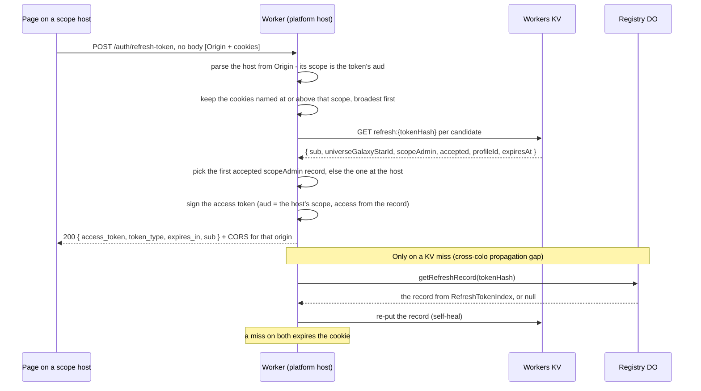
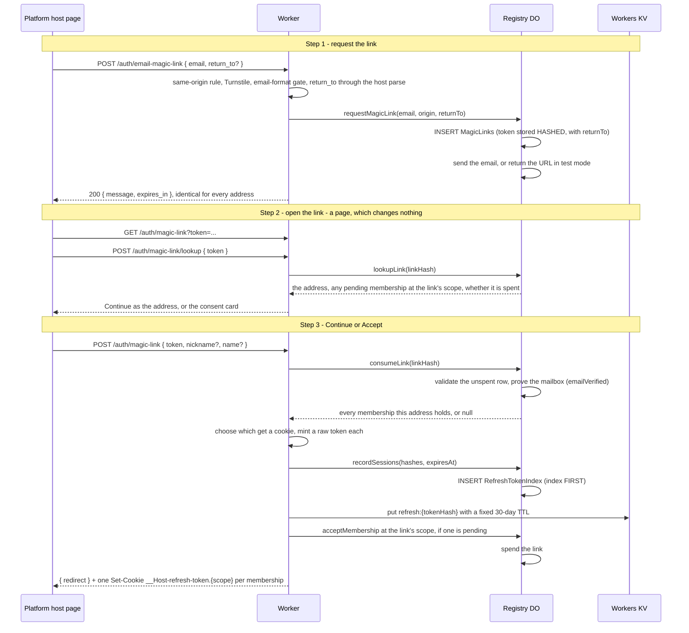
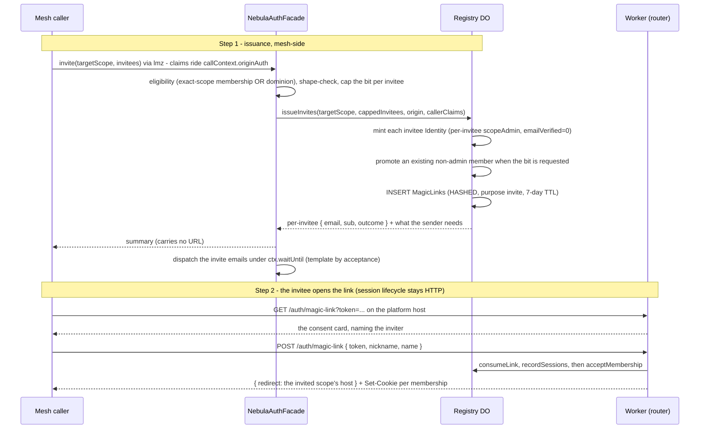
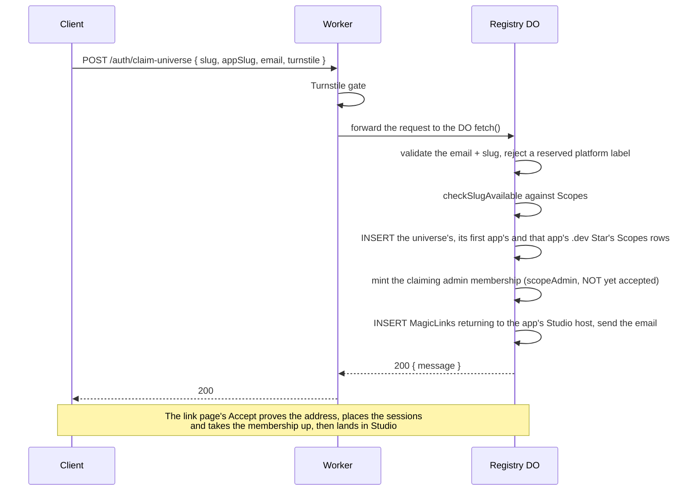
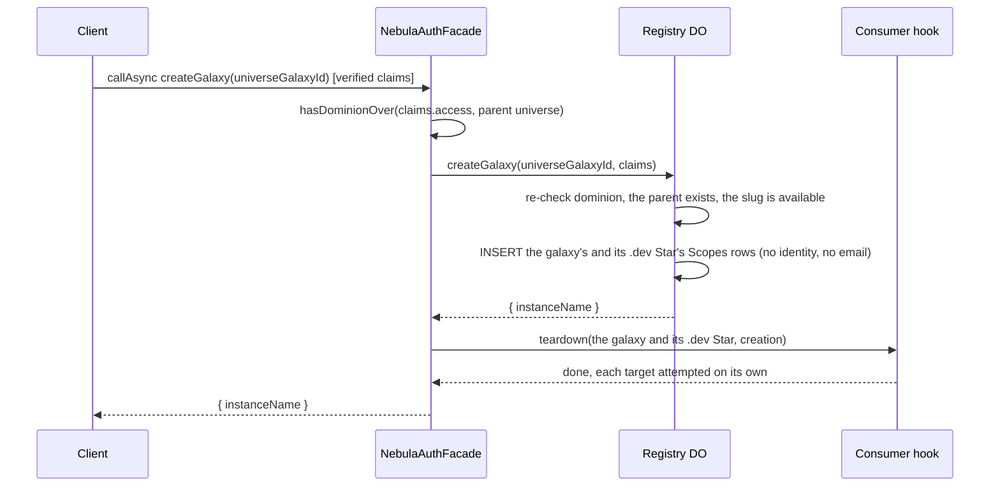
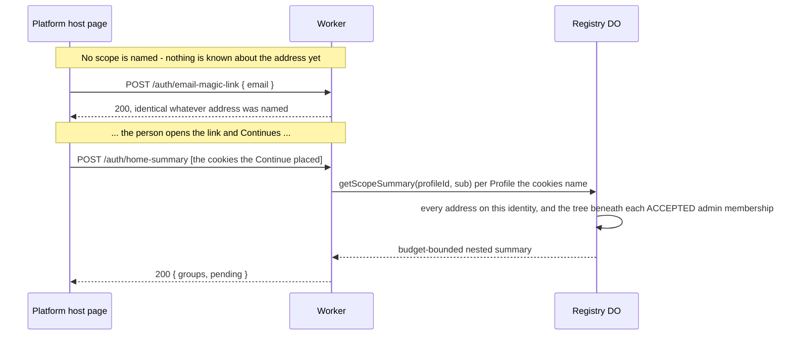
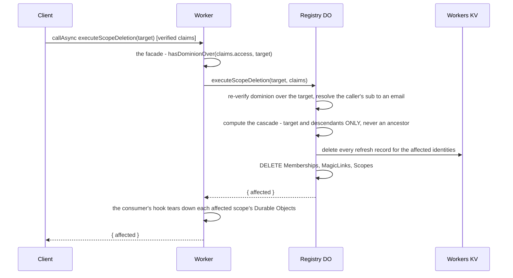
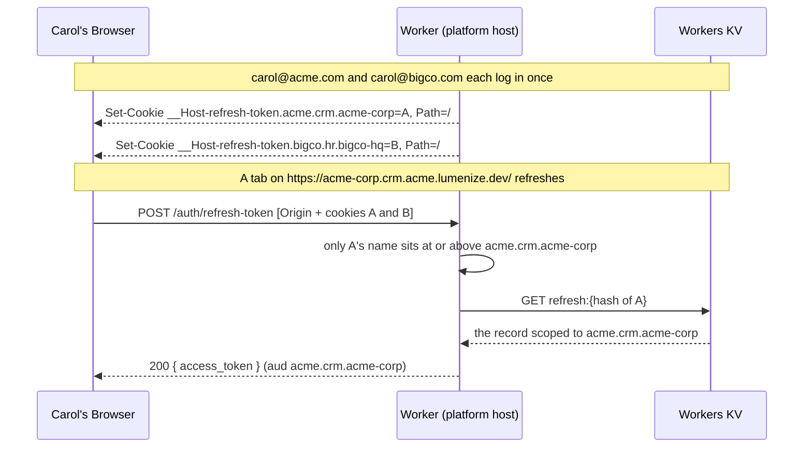

# @lumenize/nebula-auth

Multi-tenant authentication for Nebula — magic link login, JWT access tokens, and admin roles scoped to a three-tier hierarchy: Universe > Galaxy > Star.

## Architecture

**One Worker router, one singleton Durable Object, one KV namespace.**

| Component | Instances | Purpose |
|-----------|-----------|---------|
| `routeNebulaAuthRequest` (`router.ts` + `worker-token.ts`) | Edge (Cloudflare Workers), on the platform host | The same-origin rule, Turnstile, the connection-keyed rate limit, and the session flows themselves (the link page's lookup and consume, cookies, the refresh's JWT mint, Home's summary, logout) |
| `NebulaAuthFacade` (`@lumenize/nebula-auth/facade`) | `LumenizeWorker` (service binding, mesh-reachable) | The mesh entry for what an authenticated SESSION does with the Registry — invites, listing an account's apps, creating an app, deleting a scope, and impersonation. Each method refuses on the verified claims before its one raw Registry hop; it owns the invite verdicts and bit cap, the impersonation mint, the ADR-016 projection, and the consumer-supplied lifecycle hooks that wipe Durable Objects only the consumer can name |
| `NebulaAuthRegistry` (R) | Singleton (`registry`) | The single writer of all durable auth state: `Scopes`, `Identities`, the magic-link/invite login channel, and `RefreshTokenIndex` |
| Workers KV (`REFRESH_TOKEN_KV`) | Edge | The one hot record — `refresh:{tokenHash}`, read at the edge on every refresh, never touching the DO |
| `NebulaEmailSender` | `WorkerEntrypoint` (service binding) | Nebula-branded magic-link/invite email |

**HTTP carries the session lifecycle; the mesh carries what a session does** (accepted `docs/vision/auth.md` § *The Registry*). So there is **no HTTP invite route**: issuance enters through the facade (`lmz.call('NEBULA_AUTH_FACADE', undefined, …)`), while an invite's link is a magic link like any other, opened by the link page on the router below.

The per-scope `NebulaAuth` DO **no longer exists** — it was dissolved by [`tasks/archive/nebula-auth-surrogate-sub.md`](../../tasks/archive/nebula-auth-surrogate-sub.md), which is the design of record for everything below. Its hot token state moved to Workers KV, its cold identity state moved into the registry, and its HTTP handling moved into the Worker.

### Scope hierarchy

A `universeGalaxyStarId` is 1–3 dot-separated slugs, and the segment count *is* the tier:

| Segments | Tier | Example | Purpose |
|----------|------|---------|---------|
| 1 | Universe | `george-solopreneur` | Universe admin management |
| 2 | Galaxy | `george-solopreneur.georges-first-app` | Galaxy admin management |
| 3 | Star | `george-solopreneur.georges-first-app.acme-corp` | Tenant users + auth |

Slugs are lowercase letters, digits, and hyphens (`[a-z0-9][a-z0-9-]*`), no leading/trailing hyphen, no `--`, no periods within a slug. Universe slugs are globally unique; galaxy slugs unique within their universe; star slugs unique within their galaxy.

⚠️ **`instanceName` is a legacy name, not a DO instance.** The URL segment, the `AffectedScope.instanceName` wire field, and several local variables still say "instance" — but there is no per-scope DO to name. It means *scope id* (`universeGalaxyStarId`) everywhere. Scope **existence** is a row in the registry's `Scopes` table, deliberately independent of membership: an admin-created child scope managed by wildcard reach has a `Scopes` row and zero `Identities`.

### Routing: forward to the DO, or handle in the Worker?

Every route takes one of exactly two shapes — the rule is in [`.claude/rules/raw-comm.md`](../../.claude/rules/raw-comm.md) § "Edge Worker fronting a DO":

- **Forwarded to the registry's `fetch()`** when the endpoint's job *is* the DO's data operation — the two claims. The Worker does only the cross-cutting pre-checks that need env + secrets — the same-origin rule, the rate limiter, Turnstile — then forwards the original request. Because `request.url` is preserved, the DO reads `url.origin` itself, and it converts its own `RegistryError` to a `Response` in-process, so `status`/`errorCode` survive.
- **Handled in the Worker, with narrow RPC** when the endpoint is an HTTP/session concern — setting or clearing a cookie, a link's token, a read that starts in Workers KV. The Worker owns the `Response` and calls the registry only for the specific data it needs (`requestMagicLink`, `lookupLink`, `consumeLink`, `recordSessions`, …). (`issueInvites` is not on this list: its caller is the mesh facade, never the router.)

**Every route is registered in the route-pipeline table** (`buildAuthRouteTable` in `router.ts`) —
each entry is `{ path, method, steps }`, and the ordered step list IS the route's complete
requirement, readable without opening a handler. There is no enumeration beside the table: a route
cannot exist without a guard list. The one registry-bound terminal is `forwardRaw`, which injects
nothing — the original request, every header intact.

An unknown path is a `404` **at the edge**, and a known path under a wrong verb is a `405 Allow:`
**at the edge** — the singleton never sees either. (The DO keeps its own POST-only check as defense
in depth for non-router callers.)

### Identity model: surrogate `sub`

Identity is keyed by a registry-minted opaque `sub` (UUID), **one per `(email, scope)`** — the same person in two scopes has two `sub`s. `email` is a plain mutable attribute owned only by the registry; nothing keys off it, so an email change is a one-row `UPDATE` with no cascade and no token re-issue. A `profileId` (a second, *public* UUID) is minted in the same INSERT as `sub` — see [`tasks/nebula-profile-store.md`](../../tasks/nebula-profile-store.md).

**Minting happens only at mint points:**

| Mint point | What is minted |
|---|---|
| `claimUniverse` (open self-signup) | `Scopes` row **+** the claiming admin `Identity` (`isAdmin=1`, `emailVerified=0`) |
| `issueInvites` | invitee `Identity` (`emailVerified=0`), pre-created — per-invitee `scopeAdmin`, honored only under the inviter's dominion (a re-invite of an existing non-admin member with the bit **promotes** them) |
| `requestMagicLink` at `_platform` for a configured bootstrap email | platform-admin `Identity` (idempotent, scope-gated) |
| `createGalaxy` (the facade, admin) | the galaxy's and its `.dev` Star's `Scopes` rows **only** — no identity, no email; the parent admin manages them by dominion |

**Login never mints, and a consume never enrols.** `resolveConsume` *finds* every membership on the address and flips `emailVerified` — proof of the MAILBOX, set once and globally — resolving to an empty set when the address holds none. It does **not** write `acceptedAt`: proving an address and agreeing to hold a membership are different acts, and the second is written only by the registry's `acceptMembership`, which two Worker routes reach from behind a consent card — the link page's Accept (`POST /auth/magic-link`) and Home's (`accept-membership`). So a cookie for a membership nobody accepted is INERT; `refresh-token` answers `401 membership_not_accepted` for it. A stranger who requests a link for a scope they were never minted into proves their mailbox and gets nowhere to go.

### The refresh path is a pure KV read

Refresh is the highest-frequency operation, and on the hit path it **never touches the singleton**. A page on any scope's host calls it on the platform host, with `credentials: 'include'` and no body:

1. Read the page's host from `Origin` and parse its scope; a platform host or a host the parse refuses answers `403 invalid_origin`. That scope becomes the token's `aud`.
2. Take the `__Host-refresh-token.{scope}` cookies whose name sits at or above the host's scope, broadest first. A cookie's name only nominates it; for each, hash the value and `GET refresh:{tokenHash}` from KV.
3. Keep a record only if its own `universeGalaxyStarId` sits at or above the host's scope and its membership is ACCEPTED. Pick the first `scopeAdmin` record, else the one at the host's scope exactly, and mint the JWT with `authScope`, `scopeAdmin` and `profileId` **from that record** — never from the request.
4. Answer with CORS for the page's origin alone.

**No rotation, no slide.** The refresh token gets a fixed 30-day TTL at login and refresh re-issues nothing — zero writes on the hot path. A 30-day re-login (a fresh magic link) is the accepted UX cost. See [`.claude/rules/security.md`](../../.claude/rules/security.md) for why rotation was dropped and what would be required to reintroduce it (rotation *with* a grace window plus family-revoke — never the no-grace form).

**KV-miss fallback.** KV is eventually consistent, so the consume→first-refresh hop can miss across colos. On a miss the Worker falls back once to `registry.getRefreshRecord(tokenHash)`, which rebuilds the record from the strongly-consistent `RefreshTokenIndex` and the current membership, and the Worker **re-puts it to KV** (self-healing, so it fires at most once per token). A cookie that misses both — revoked, or never valid — is answered expired, so the browser stops presenting it.

⚠️ **Revocation is KV-eventually-consistent.** Logout deletes the KV record and its index entry (KV-delete-first, so an interruption never strands a live-but-unindexed token), but a revoked or demoted token keeps working for the KV propagation window (~edge `cacheTtl`) **plus** the full access-token TTL, repeatably within that window. The short `ACCESS_TOKEN_TTL` is the mitigation.

### Dominion

`hasDominionOver(access, scope)` is the single dominion predicate: **`access.scopeAdmin` alone is never dominion** — dominion is that bit *and* `authScope` covering the node in question ([ADR-015](../../docs/adr/015-passage-and-dominion.md) § *Terminology*, the definition home for `dominion` and `passage`). Dominion flows strictly downward and only downward (ADR-015). Every guard delegates to that one predicate; none may re-inline `scopeAdmin && isAtOrAbove(...)`.

The gate lands in three places depending on the surface:

- **The invite facade** (`NebulaAuthFacade.invite`, mesh-side): eligibility = exact-scope membership ∨ `hasDominionOver(claims.access, targetScope)`, computed from `callContext.originAuth` — every member may invite non-admin peers into exactly their own scope; dominion additionally permits inviting downward and is the only thing that licenses a requested `scopeAdmin` (a peer's request caps to false). The registry re-asserts the cap in-method as an invariant (a `scopeAdmin: true` entry without dominion in `callerClaims` throws — a breach, never an expected client error).
- **The impersonation mint** (`NebulaAuthFacade.impersonate`): authorization is `mintImpersonationToken`'s single `canMintFor(callerClaims, subject)` call — dominion over the **subject's** scope. Refusal and an absent subject answer identically (no `sub`-existence oracle), and the one containment check besides it is the `aud` validation, run after: the child's `aud` is the caller's, so the caller's page must sit inside the subject's scope.
- **The facade's scope methods** (`createGalaxy`, `planScopeDeletion`, `executeScopeDeletion`): the facade refuses on `hasDominionOver` before its hop, and the registry re-asserts it (`createGalaxy`, `#computeDeletionPlan`). `getScopeSummary` is `profileId`-keyed and descends only under ACCEPTED admin memberships, and each level is read with `LIMIT budget+1` — so the READ is bounded, not merely the response.

### Worker gating pipeline

| Stage | Applies to |
|---|---|
| Host | All: `/auth/*` answers on the platform host alone, and the consumer's Worker answers 404 to it anywhere else |
| Same-origin rule (`sameOriginGuard`) | Every `POST` but the refresh: refused unless `Sec-Fetch-Site: same-origin`; a request with neither that header nor an `Origin` passes |
| Connection-keyed rate limit (`connectionRateLimitGuard`) | Every `POST` |
| Turnstile | Derived from the CREDENTIAL a route presents, not from a list: every route presenting none — no cookie, no link token, no signup ticket — carries `turnstileGuard`. Today that is `email-magic-link`, `claim-universe` and `claim-star`. Two deliberate exemptions present nothing and are un-gated: the GETs that serve the auth SPA's static HTML, and `coming-soon`. `test/turnstile-by-credential.test.ts` derives the set from the route table, so a new row must state which side it falls on |

No route reads an access token: a credential under `/auth/` is a link, a cookie or a ticket, and a token authenticates a mesh call ("Cookie or token, never both"). The passage and dominion verdicts are the facade's.

Turnstile is skipped in exactly two cases: no `TURNSTILE_SECRET_KEY` is configured (development and every vitest lane, which bind it `''` explicitly), or the request carries the authorized bypass token in `x-lumenize-turnstile-bypass` (constant-time compared against `NEBULA_AUTH_TURNSTILE_BYPASS_TOKEN`). The bypass skips **only** Turnstile — never the magic-link, JWT, or scope checks.

---

## URL Format

Every auth route lives on the platform host, under one prefix (`/auth`), and no path names a scope:

```
https://platform.lumenize.dev/auth/[endpoint]     -> Worker session layer
https://platform.lumenize.dev/auth/claim-universe -> forwarded to the registry
https://platform.lumenize.dev/auth/claim-star     -> forwarded to the registry
https://platform.lumenize.dev/                    -> Home
```

Every path is matched against the route table's `URLPattern`s. A page names its scope by its host, and the one route that reads a scope from the request — the refresh — reads it from `Origin`.

---

## Endpoint Reference

**Handled by** is either `Worker` (the Worker owns the `Response`, calling the registry by narrow RPC as needed) or `→ registry fetch()` (the original request, forwarded after gating).

### Auth flow endpoints

| Endpoint | Method | Gating | Handled by | Description |
|----------|--------|--------|-----------|-------------|
| `/auth/email-magic-link` | POST | Turnstile | Worker | Request a login magic link. Validates email format at the edge and `return_to` through the host parse (refusing anything off the site with a 400), then `requestMagicLink` inserts a hashed `MagicLinks` row carrying it and sends the mail. **Mints no identity**, and answers the same for every address |
| `/auth/magic-link?token=…` | GET | none | the auth app's page | Every emailed link that carries a token opens this page, which **changes nothing**: it drops the token from its URL, then asks the lookup what to show |
| `/auth/magic-link/lookup` | POST | link token | Worker | Pure: the address, the pending membership at the link's scope (with `invitedByName`, and display names only for an address already holding an accepted membership), and whether the link is spent. Writes no registry state |
| `/auth/magic-link` | POST | link token | Worker | The page's Accept or "Continue as {address}". `consumeLink` proves the mailbox once and globally and returns EVERY membership the address holds; the Worker places one `__Host-refresh-token.{scope}` cookie each on the platform host, accepts the link scope's pending membership (with the nickname and name from the body), and spends the link once the sessions are recorded. Answers `{ redirect }` — the record's `returnTo` or Home — or the signup page with a short-lived ticket when the address holds nothing; a spent link answers `409 link_used` and sets no cookie |
| `/auth/home-summary` | POST | cookies | Worker | Home's read: the memberships the browser's cookies name, grouped by Profile, at most `2 × MINT_ALL_COOKIE_CAP` cookies resolved |
| `/auth/pending-membership` | POST | cookie | Worker | Home's consent card for the membership the body names, read from that membership's own cookie |
| `/auth/accept-membership` | POST | cookie | Worker | Home's Accept, the second acceptance writer beside the link page's; both call the registry's one `acceptMembership` |
| `/auth/refresh-token` | POST | cookies | Worker | The KV read → mint the access token for the page's host, read from `Origin`; no body. The one route a page on another host calls, so it alone answers CORS, and it alone accepts `Sec-Fetch-Site: same-site`. Re-sets no cookie but expires one that misses both KV and the index |
| `/auth/logout` | POST | cookies | Worker | Ends the session behind every refresh cookie the browser presents, recording each `sub` whose sessions ended, and expires every one; `{ everywhere: true }` ends every session of each address those cookies name |

### Authenticated endpoints

| Endpoint | Method | Gating | Handled by | Description |
|----------|--------|--------|-----------|-------------|
| `NebulaAuthFacade.invite(targetScope, invitees)` | mesh (`lmz.call`/`callAsync` on the `NEBULA_AUTH_FACADE` service binding, `instanceName: undefined`) | eligibility (exact-scope membership ∨ dominion) + the per-invitee bit cap, from `callContext.originAuth` | Facade | `invitees: [{ email, scopeAdmin? }]`. The registry mints per invitee (identity + a magic link that lives 7 days, promoting an existing non-admin member when the bit is requested under dominion) and answers per-invitee outcomes (`invited \| already-member \| promoted`); the facade dispatches the mail post-return under `ctx.waitUntil` (template by acceptance). **There is no HTTP invite route** — `POST /auth/{scope}/invite` is a 404 |
| `NebulaAuthFacade.expandScope({ after? })` | mesh | dominion over the caller's `aud`, else an empty level without a hop | Facade → registry RPC | One more level beneath the page's own scope, keyset-paged past the budget. No argument names the parent |
| `NebulaAuthFacade.createGalaxy(universeGalaxyId)` | mesh | dominion over the parent universe, then the registry's own check | Facade → registry RPC | Writes the galaxy and its `.dev` Star, then tears both down through the consumer's hook before answering, so a re-used slug starts empty. A refusal such as `slug_taken` tears nothing down |
| `NebulaAuthFacade.planScopeDeletion(target)` | mesh | dominion over `target`, then the registry's own check | Facade → registry RPC | Read-only cascade plan for the confirm screen |
| `NebulaAuthFacade.executeScopeDeletion(target)` | mesh | dominion over `target`, then the registry's own check | Facade → registry RPC | Execute the cascade, then tear down every affected scope's Durable Objects through the consumer's hook; returns the affected set |
| `NebulaAuthFacade.impersonate(sub, { ttlSeconds? })` | mesh | `canMintFor` (dominion over the SUBJECT's scope) + the subject's acceptance | Facade | Mint a token wearing another person's identity: `sub`/`authScope`/`scopeAdmin` = the subject's, `aud` = the caller's own, `act` = the caller. Every refusal is an `ImpersonationRefusedError` with `terminal: true` |

### Registry endpoints

| Endpoint | Method | Gating | Handled by | Description |
|----------|--------|--------|-----------|-------------|
| `/auth/claim-universe` | POST | Turnstile | → registry `fetch()` (raw) | Open self-signup: register the `Scopes` row, mint the claiming admin identity, send a magic link |
| `/auth/claim-star` | POST | Turnstile | → registry `fetch()` (raw) | **Open Star self-signup.** Body `{ universeGalaxyStarId, email }`. Registers the `Scopes` row, mints the star-scoped admin at the **3-segment star id** (`isAdmin`, `emailVerified: 0` → an **exact-star** pattern), and sends a claim link — all in one `transactionSync`. No admin in the loop |

#### `claim-star` responses — first failure wins

Validation is a fail-fast prologue in this exact order, so a request failing several checks reports only the first. Multi-error UX is the **client's** job: the signup page format-validates before it POSTs, which leaves `slug_taken` as the one realistic server-side error for a well-behaved client.

| Order | Status | `error` | When |
|---|---|---|---|
| 1 | 400 | `invalid_email` | `email` fails `isValidEmail` |
| 2 | 400 | `invalid_id` | `universeGalaxyStarId` is not 1–3 valid dot-separated slugs |
| 3 | 400 | `invalid_tier` | parses, but is not 3 segments |
| 4 | 400 | `reserved_slug` | the star slug is a reserved **environment** name (`dev`, `staging`, `prod` and five more) — see `RESERVED_STAR_SLUGS` |
| 5 | 400 | `parent_not_found` | the parent galaxy `{u}.{g}` has no `Scopes` row |
| 6 | 409 | `slug_taken` | the full `{u}.{g}.{s}` is already claimed |
| — | 400 | `invalid_request` | the body is not a JSON object |
| — | 200 | — | `{ message }`, plus `magicLinkUrl` in test mode only |

⚠️ **`slug_taken` is deliberately ambiguous.** When the slug is held by a claimer who never verified their email, that claimer is re-sent their claim link — but the response is **byte-identical** to an ordinary rejection, and the send is fired without being awaited. Answering a resume with a success (or awaiting only on that branch) would make this endpoint an email-confirmation oracle: probe a slug with `victim@corp.com` and a distinguishable answer proves the victim is that slug's unverified claimer. The resume adds a `MagicLinks` row and nothing else — never an `UPDATE Identities`, which would promote a pending invitee to star admin through an unauthenticated endpoint.

⚠️ **`claim-star`'s row must carry `turnstileGuard`.** It presents no token, so the Turnstile step (behind the connection limiter) is the only human-presence bound on this open mutation endpoint. The regression is caught behaviourally: `checkTurnstile` no longer short-circuits under `NEBULA_AUTH_TEST_MODE`, so `turnstile-bypass.test.ts`'s gating sweep binds a non-empty secret per test and asserts each open row answers `403 turnstile_required` — a row that silently lost the step reds it.

---

## Sequence Diagrams

### Token refresh (hot path)

The most frequent operation, roughly every 15 minutes per active session. No DO involvement on the normal path.


```mermaid
sequenceDiagram
    participant C as Page on a scope host
    participant W as Worker (platform host)
    participant KV as Workers KV
    participant R as Registry DO

    C->>W: POST /auth/refresh-token, no body [Origin + cookies]
    W->>W: parse the host from Origin - its scope is the token's aud
    W->>W: keep the cookies named at or above that scope, broadest first
    W->>KV: GET refresh:{tokenHash} per candidate
    KV-->>W: { sub, universeGalaxyStarId, scopeAdmin, accepted, profileId, expiresAt }
    W->>W: pick the first accepted scopeAdmin record, else the one at the host
    W->>W: sign the access token (aud = the host's scope, access from the record)
    W-->>C: 200 { access_token, token_type, expires_in, sub } + CORS for that origin

    Note over W,R: Only on a KV miss (cross-colo propagation gap)
    W->>R: getRefreshRecord(tokenHash)
    R-->>W: the record from RefreshTokenIndex, or null
    W->>KV: re-put the record (self-heal)
    Note over W: a miss on both expires the cookie
```

### Magic link login


```mermaid
sequenceDiagram
    participant C as Platform host page
    participant W as Worker
    participant R as Registry DO
    participant KV as Workers KV

    Note over C,KV: Step 1 - request the link
    C->>W: POST /auth/email-magic-link { email, return_to? }
    W->>W: same-origin rule, Turnstile, email-format gate, return_to through the host parse
    W->>R: requestMagicLink(email, origin, returnTo)
    R->>R: INSERT MagicLinks (token stored HASHED, with returnTo)
    R->>R: send the email, or return the URL in test mode
    W-->>C: 200 { message, expires_in }, identical for every address

    Note over C,KV: Step 2 - open the link - a page, which changes nothing
    C->>W: GET /auth/magic-link?token=...
    C->>W: POST /auth/magic-link/lookup { token }
    W->>R: lookupLink(linkHash)
    R-->>W: the address, any pending membership at the link's scope, whether it is spent
    W-->>C: Continue as the address, or the consent card

    Note over C,KV: Step 3 - Continue or Accept
    C->>W: POST /auth/magic-link { token, nickname?, name? }
    W->>R: consumeLink(linkHash)
    R->>R: validate the unspent row, prove the mailbox (emailVerified)
    R-->>W: every membership this address holds, or null
    W->>W: choose which get a cookie, mint a raw token each
    W->>R: recordSessions(hashes, expiresAt)
    R->>R: INSERT RefreshTokenIndex (index FIRST)
    W->>KV: put refresh:{tokenHash} with a fixed 30-day TTL
    W->>R: acceptMembership at the link's scope, if one is pending
    R->>R: spend the link
    W-->>C: { redirect } + one Set-Cookie __Host-refresh-token.{scope} per membership
```

Index-first is a seam invariant: an eviction at the awaited KV put leaves at worst a revocable index-entry-without-record, never a live-but-unindexed token that nothing can revoke. A link is spent once its sessions are recorded, so a click that fails before that can be retried, and a replay — from history or a forwarded mail — signs nobody in. Expired rows are swept on DO wake.

### Admin invite

The invitee identity is pre-created at issuance, so the Accept only flips flags — no conditional mint at consume, and no Turnstile (the link's token is the proof of legitimacy). Promotion happens at ISSUANCE (re-inviting an existing non-admin member with the bit, under dominion), never at the click. The registry is mint-only: the facade dispatches the mail post-return under `ctx.waitUntil`, picking the template by acceptance (`invite-existing` for an accepted member, `invite-new` with the fresh link otherwise). The diagram's caller is whichever mesh node holds the verified claims — a client directly, or a platform node forwarding its own caller's — the facade neither knows nor cares.


```mermaid
sequenceDiagram
    participant C as Mesh caller
    participant F as NebulaAuthFacade
    participant R as Registry DO
    participant W as Worker (router)

    Note over C,R: Step 1 - issuance, mesh-side
    C->>F: invite(targetScope, invitees) via lmz - claims ride callContext.originAuth
    F->>F: eligibility (exact-scope membership OR dominion), shape-check, cap the bit per invitee
    F->>R: issueInvites(targetScope, cappedInvitees, origin, callerClaims)
    R->>R: mint each invitee Identity (per-invitee scopeAdmin, emailVerified=0)
    R->>R: promote an existing non-admin member when the bit is requested
    R->>R: INSERT MagicLinks (HASHED, purpose invite, 7-day TTL)
    R-->>F: per-invitee { email, sub, outcome } + what the sender needs
    F-->>C: summary (carries no URL)
    F->>F: dispatch the invite emails under ctx.waitUntil (template by acceptance)

    Note over C,W: Step 2 - the invitee opens the link (session lifecycle stays HTTP)
    C->>W: GET /auth/magic-link?token=... on the platform host
    W-->>C: the consent card, naming the inviter
    C->>W: POST /auth/magic-link { token, nickname, name }
    W->>R: consumeLink, recordSessions, then acceptMembership
    W-->>C: { redirect: the invited scope's host } + Set-Cookie per membership
```

### Universe self-signup

The one open, identity-minting claim. Forwarded to the registry, which owns every write.


```mermaid
sequenceDiagram
    participant C as Client
    participant W as Worker
    participant R as Registry DO

    C->>W: POST /auth/claim-universe { slug, appSlug, email, turnstile }
    W->>W: Turnstile gate
    W->>R: forward the request to the DO fetch()
    R->>R: validate the email + slug, reject a reserved platform label
    R->>R: checkSlugAvailable against Scopes
    R->>R: INSERT the universe's, its first app's and that app's .dev Star's Scopes rows
    R->>R: mint the claiming admin membership (scopeAdmin, NOT yet accepted)
    R->>R: INSERT MagicLinks returning to the app's Studio host, send the email
    R-->>W: 200 { message }
    W-->>C: 200

    Note over C,R: The link page's Accept proves the address, places the sessions<br/>and takes the membership up, then lands in Studio
```

### App creation (admin only)


```mermaid
sequenceDiagram
    participant C as Client
    participant F as NebulaAuthFacade
    participant R as Registry DO
    participant H as Consumer hook

    C->>F: callAsync createGalaxy(universeGalaxyId) [verified claims]
    F->>F: hasDominionOver(claims.access, parent universe)
    F->>R: createGalaxy(universeGalaxyId, claims)
    R->>R: re-check dominion, the parent exists, the slug is available
    R->>R: INSERT the galaxy's and its .dev Star's Scopes rows (no identity, no email)
    R-->>F: { instanceName }
    F->>H: teardown(the galaxy and its .dev Star, creation)
    H-->>F: done, each target attempted on its own
    F-->>C: { instanceName }
```

No identity is minted — the creating admin already reaches the new scope by dominion. A Star is created by `claim-star`, never by an admin route.

### Discovery — after the proof, never before

`POST /auth/discover` is **retired**. It answered, to anyone who asked and with no proof of the
address, which scopes an address belonged to and which it administered — and at galaxy and universe
tiers a membership generally IS administration, while at `_platform` it is superuser-ship, so
narrowing the response could never have closed it. The whole login order changed instead: one
scope-less link, the link page's Continue proves the mailbox, and only then is the person shown
what they reach.


```mermaid
sequenceDiagram
    participant C as Platform host page
    participant W as Worker
    participant R as Registry DO

    Note over C,W: No scope is named - nothing is known about the address yet
    C->>W: POST /auth/email-magic-link { email }
    W-->>C: 200, identical whatever address was named

    Note over C,W: ... the person opens the link and Continues ...

    C->>W: POST /auth/home-summary [the cookies the Continue placed]
    W->>R: getScopeSummary(profileId, sub) per Profile the cookies name
    R->>R: every address on this identity, and the tree beneath each ACCEPTED admin membership
    R-->>W: budget-bounded nested summary
    W-->>C: 200 { groups, pending }
```

### Scope deletion


```mermaid
sequenceDiagram
    participant C as Client
    participant W as Worker
    participant R as Registry DO
    participant KV as Workers KV

    C->>W: callAsync executeScopeDeletion(target) [verified claims]
    W->>W: the facade - hasDominionOver(claims.access, target)
    W->>R: executeScopeDeletion(target, claims)
    R->>R: re-verify dominion over the target, resolve the caller's sub to an email
    R->>R: compute the cascade - target and descendants ONLY, never an ancestor
    R->>KV: delete every refresh record for the affected identities
    R->>R: DELETE Memberships, MagicLinks, Scopes
    R-->>W: { affected }
    W->>W: the consumer's hook tears down each affected scope's Durable Objects
    W-->>C: { affected }
```

The caller's `sub` comes from the **verified** claims, never from an argument — the registry resolves it to an email internally to exclude the caller from the "other users attached" count, and **fails closed** if that resolution comes back empty. That count is a **warning, not a gate** — a deletion never refuses as `scope_in_use`; an admin over the target can always delete it (ADR-015: downward dominion is non-vetoable, so a descendant's members can never block an admin above them). `planScopeDeletion` returns `affectedUsers: { total, sample }` — an exact `COUNT(DISTINCT email)` plus up to 25 sample rows — so the confirm screen can warn with real numbers on a Star with thousands of users. The registry cannot reach platform DOs (dependency direction), so it returns the affected set and the facade hands it to the consumer's `teardown` hook.

### Multi-scope sessions

Every membership has its own cookie, `__Host-refresh-token.{scope}`, at `Path=/` on the platform host, so every refresh receives all of them. The refresh picks by the page's host: only cookies whose scope sits at or above it are read.


```mermaid
sequenceDiagram
    participant C as Carol's Browser
    participant W as Worker (platform host)
    participant KV as Workers KV

    Note over C,KV: carol@acme.com and carol@bigco.com each log in once
    W-->>C: Set-Cookie __Host-refresh-token.acme.crm.acme-corp=A, Path=/
    W-->>C: Set-Cookie __Host-refresh-token.bigco.hr.bigco-hq=B, Path=/

    Note over C,KV: A tab on https://acme-corp.crm.acme.lumenize.dev/ refreshes
    C->>W: POST /auth/refresh-token [Origin + cookies A and B]
    W->>W: only A's name sits at or above acme.crm.acme-corp
    W->>KV: GET refresh:{hash of A}
    KV-->>W: the record scoped to acme.crm.acme-corp
    W-->>C: 200 { access_token } (aud acme.crm.acme-corp)
```

An admin's one cookie covers their subtree. A universe admin's `__Host-refresh-token.george-solopreneur` mints on every page beneath the universe, with `authScope: "george-solopreneur"` and `aud` the page's own scope, so the admin works in any covered child by opening its host.

---

## JWT Claims

```typescript
interface AccessEntry {
  authScope: string     // the membership's scope, verbatim
  scopeAdmin?: boolean  // omitted when false
}

interface NebulaJwtPayload {
  iss: string        // the deployment's platform origin, e.g. https://platform.lumenize.dev
  aud: string        // the scope of the page's host
  sub: string        // the registry-minted surrogate sub
  exp: number        // Unix seconds (JWT NumericDate — the ADR-011 carve-out)
  iat: number        // Unix seconds
  jti: string        // UUID
  access: AccessEntry
  profileId: string  // the bearer's PUBLIC profile address (a bare custom claim)
  act?: ActClaim     // delegation chain per RFC 8693
}
```

**`email` and `adminApproved` are not claims.** `email` is a registry-only mutable attribute (resolved on demand, never keyed off), and `adminApproved` is retired — enforced at mint, so a valid token proves authorized membership by construction and there is no edge gate to feed.

Both mint paths (the Worker's `mintAccessToken` and the Node test-util `createNebulaTestToken`) compose the same `buildNebulaJwtPayload`, which refuses to build a token whose `aud` is not at or below its `authScope`. `verifyNebulaAccessToken` re-checks that same invariant on the way in, so a tampered or stale token is rejected.

### Access claim examples

```json
{ "access": { "authScope": "george-solopreneur.georges-first-app.acme-corp" } }
{ "access": { "authScope": "george-solopreneur.georges-first-app.acme-corp", "scopeAdmin": true } }
{ "access": { "authScope": "george-solopreneur.georges-first-app", "scopeAdmin": true } }
{ "access": { "authScope": "george-solopreneur", "scopeAdmin": true } }
{ "access": { "authScope": "_platform", "scopeAdmin": true } }
```

Read top to bottom: star user, star admin, galaxy admin, universe admin, platform admin. The claim is the member's scope **verbatim** — the same string their `Memberships` row holds. Nothing derives a second form of it.

### Scope containment (`isAtOrAbove` / `isAtOrBelow`)

```
isAtOrAbove("_platform", "george-solopreneur")                    -> true  (the platform scope is the ROOT)
isAtOrAbove("_platform", "george-solopreneur.app.tenant")         -> true
isAtOrAbove("george-solopreneur", "george-solopreneur")                 -> true  (own scope)
isAtOrAbove("george-solopreneur", "george-solopreneur.app")             -> true  (galaxy beneath)
isAtOrAbove("george-solopreneur", "george-solopreneur.app.tenant")      -> true  (star beneath)
isAtOrAbove("george-solopreneur.app", "george-solopreneur")             -> false (upward is nil)
isAtOrAbove("george-solopreneur.app", "george-solopreneur.app")         -> true
isAtOrAbove("george-solopreneur.app.tenant", "george-solopreneur.app.tenant") -> true
isAtOrAbove("george-solopreneur.app.tenant", "george-solopreneur.app.other")  -> false
isAtOrAbove("acme", "acme-2")                                           -> false (WHOLE segments)
```

`isAtOrBelow(a, b)` is exactly `isAtOrAbove(b, a)` — implemented that way, so the identity and the platform-root branch are structural rather than a property two functions must both remember.

⚠️ **Comparison is by whole dot-separated segments.** The obvious `target.startsWith(mine)` would make `acme` cover `acme-2` and `u.g.s1` cover `u.g.s10` — both legal slugs, both a cross-tenant hole.

---

## Data Model

### Registry SQLite (the singleton)

Five tables, created by an **append-only** migration list (`REGISTRY_MIGRATIONS` in `schemas.ts`) run in the DO constructor via `@lumenize/sql-migrations` — id-gated and atomic, so it completes before any request is dispatched. Never edit, reorder, or reuse an applied id.

```sql
CREATE TABLE IF NOT EXISTS Scopes (
  universeGalaxyStarId TEXT PRIMARY KEY
) WITHOUT ROWID;
```

Scope existence, independent of membership. (Migration 1 also created an `improveProductConsent` column; migration 8 drops it — the consent feature was removed 2026-07-21 as YAGNI. Migration 1's literal keeps the column for history, so a fresh DB creates it and immediately drops it, matching an existing DB exactly.)

```sql
CREATE TABLE IF NOT EXISTS Identities (
  sub TEXT PRIMARY KEY,
  profileId TEXT NOT NULL,
  universeGalaxyStarId TEXT NOT NULL,
  email TEXT NOT NULL,
  isAdmin INTEGER NOT NULL DEFAULT 0,
  emailVerified INTEGER NOT NULL DEFAULT 0,
  createdAt TEXT NOT NULL,
  UNIQUE (email, universeGalaxyStarId)
) WITHOUT ROWID;

CREATE INDEX IF NOT EXISTS idx_Identities_profileId ON Identities(profileId);
```

Person-in-a-scope — the merge of the old `Emails` + `Subjects`. The compound `UNIQUE` also serves the `WHERE email = ?` discovery lookup by leftmost prefix, so there is deliberately no separate email index. `email` is normalized (lowercased **and** trimmed) at every write and lookup — the registry compares binary, so casing or whitespace drift would split an identity or fail-block a delete.

```sql
CREATE TABLE IF NOT EXISTS RefreshTokenIndex (
  tokenHash TEXT PRIMARY KEY,
  sub TEXT NOT NULL,
  expiresAt TEXT NOT NULL
) WITHOUT ROWID;

CREATE INDEX IF NOT EXISTS idx_RefreshTokenIndex_sub ON RefreshTokenIndex(sub);
```

The live-token index that makes KV invalidation reliable: looked up by `tokenHash` at logout, enumerated by `sub` for `isAdmin` convergence and scope deletion. `expiresAt` is the token's **absolute** expiry, re-applied on any KV re-put.

```sql
CREATE TABLE IF NOT EXISTS MagicLinks (
  tokenHash            TEXT PRIMARY KEY,
  email                TEXT NOT NULL,
  universeGalaxyStarId TEXT,
  purpose              TEXT NOT NULL CHECK (purpose IN ('login', 'claim', 'invite')),
  returnTo             TEXT,
  spentAt              TEXT,
  expiresAt            TEXT NOT NULL
) WITHOUT ROWID;
```

The login channel, for every emailed link — a sign-in and a claim live 30 minutes, an invite 7 days, and `purpose` tells them apart for the activity log only. It lives in the registry rather than KV because the lookup and the consume call the registry anyway. A link is spent once: the consume sets `spentAt` after recording the sessions, and the lookup reports it so the page can say so. There is no KV TTL, so the DO constructor sweeps expired rows on every wake — cheap on a small, short-TTL table, and cheaper than paying an index write on `expiresAt` for every insert.

**All bearer tokens are stored hashed.** Link and refresh tokens are persisted only as a one-way `tokenHash`; the raw value exists solely in the URL or cookie. A store leak yields no usable credential. Timestamps are ISO 8601 Zulu `TEXT` (ADR-011), string-compared.

### Workers KV — the one hot record

```typescript
// key: `refresh:{tokenHash}`, TTL = the token's fixed 30-day lifetime
interface RefreshTokenKV {
  sub: string
  universeGalaxyStarId: string
  isAdmin: boolean          // denormalized — the registry is the convergence writer
  expiresAt: string
  profileId: string         // carried so the pure-KV mint can emit the claim
}
```

Three writers, all in the registry: the login funnel (`#recordRefreshToken`), the `isAdmin` convergence (`setIdentityAdmin`), and the KV-miss self-heal (`getRefreshRecord`). ⚠️ Every re-put must re-apply the record's **original** absolute expiry — Cloudflare KV drops `expirationTtl` across a put, so a fresh TTL would *extend* a demoted user's token and omitting it would make the token immortal.

---

## Platform Admin (bootstrap)

`NEBULA_AUTH_BOOTSTRAP_EMAIL` holds a comma-separated list of platform super-admin emails (split, trimmed, lowercased, deduped — compared by array membership, never a substring match). Such an email authenticates through the normal magic-link flow at the reserved `_platform` scope.

That pairing is the **one** mint on the `email-magic-link` path, and it is gated on both factors: a configured bootstrap email **and** the reserved scope. A non-bootstrap email requesting a link for `_platform` gets no mint, so stranger-self-join stays closed. Because `_platform` is the ROOT of the scope tree, the resulting token holds dominion over every scope.

`_platform` cannot be claimed as a universe slug, since the slug grammar refuses its leading underscore, and it cannot be deleted.

### Admin creation chain

- **Platform admin** (`_platform`, the scope-tree root) reaches everything
- **Universe admins** create galaxies beneath their universe and invite into any scope they cover
- **Galaxy admins** create stars beneath their galaxy
- **Star admins** manage their star's users

Admin-created child scopes stamp **no local admin** — the creating admin manages them through wildcard reach. Handing a child scope to a designated local admin is done by inviting that person into it.

---

## Configuration

### Bindings

| Binding | Kind | Notes |
|---|---|---|
| `NEBULA_AUTH_REGISTRY` | Durable Object (`NebulaAuthRegistry`) | Required. Register the class in the `exports` map as `storage: "sqlite"` — it uses the synchronous storage API, which throws under `legacy-kv` |
| `REFRESH_TOKEN_KV` | KV namespace | Required — the refresh hot path |
| `AUTH_EMAIL_SENDER` | Service binding to the `NebulaEmailSender` entrypoint | Optional; absent means email is logged, not sent |
| `PROFILE` | Durable Object (`Profile`) | Required only if you mount the `/profile` subpath |

### Environment variables

| Variable | Notes |
|----------|-------|
| `JWT_PRIVATE_KEY_BLUE` / `JWT_PRIVATE_KEY_GREEN` | Ed25519 signing keys (secret) |
| `JWT_PUBLIC_KEY_BLUE` / `JWT_PUBLIC_KEY_GREEN` | Ed25519 verification keys (secret); both present enables rotation |
| `PRIMARY_JWT_KEY` | Active signing key, `'BLUE'` (default) or `'GREEN'` |
| `TURNSTILE_SECRET_KEY` | Cloudflare Turnstile secret (optional — absent skips the gate) |
| `NEBULA_AUTH_TURNSTILE_BYPASS_TOKEN` | Authorized bypass token for the `x-lumenize-turnstile-bypass` header (optional, secret — never logged) |
| `NEBULA_AUTH_BOOTSTRAP_EMAIL` | Comma-separated platform super-admin emails (optional) |
| `AUTH_EMAIL_FROM` | From-address for `NebulaEmailSender` (defaults to `noreply@lumenize.io`) |
| `NEBULA_AUTH_TEST_MODE` | Returns raw magic-link/invite URLs instead of sending. It does NOT skip Turnstile — an absent/empty `TURNSTILE_SECRET_KEY` is what does (the vitest configs bind `''` explicitly). ⚠️ Set **only** in vitest `miniflare.bindings` — never in `wrangler.jsonc` or `.dev.vars` |

⚠️ `NEBULA_AUTH_TEST_MODE` has **no second factor** — unlike `@lumenize/auth`, the decision is made inside the registry DO with no request URL to sniff, so a leak on a deployed Worker would hand magic links to ordinary traffic. Its absence from every deployable surface *is* the control, enforced by `scripts/audit-test-mode.sh`.

Email provider selection is delegated to `@lumenize/email` (the `EMAIL` binding selects Cloudflare; otherwise Resend).

### Hardcoded constants

| Constant | Value | Notes |
|----------|-------|-------|
| `PLATFORM_SCOPE` | `'_platform'` | Reserved scope for platform admin |
| `REGISTRY_INSTANCE_NAME` | `'registry'` | DO instance name of the singleton |
| `NEBULA_AUTH_PREFIX` | `'/auth'` | URL prefix for all auth routes |
| `ACCESS_TOKEN_TTL` | `900` (15 min) | Access token lifetime |
| `REFRESH_TOKEN_TTL` | `2592000` (30 days) | Refresh token lifetime — fixed, never slid |
| `MAGIC_LINK_TTL` | `1800` (30 min) | Magic link lifetime |
| `INVITE_TTL` | `604800` (7 days) | An invite's magic-link lifetime |

Each deployment names its origin once, in the `LUMENIZE_ORIGIN` var (`https://lumenize.dev` in production). The JWT `iss` is its platform host, `platformOrigin(origin)`, so a deployment accepts only its own tokens, and `parseHost(host, origin)` reads every host against it. Both are on the Node-safe `/claims` subpath.

---

## Exports

```typescript
// The singleton registry DO (needed for wrangler bindings in consuming projects)
export { NebulaAuthRegistry } from './nebula-auth-registry';

// Router entry point — the primary export for composing into a parent Worker
export { routeNebulaAuthRequest } from './router';
export { verifyNebulaAccessToken } from './router';

// Email sender (WorkerEntrypoint for a service binding)
export { NebulaEmailSender } from './nebula-email-sender';

// Scope parsing and the two structural containment predicates
export { parseId, isValidSlug, isPlatformScope, getParentId,
         isAtOrAbove, isAtOrBelow, hasDominionOver } from './parse-id';

// Types:     Tier, ParsedId, AccessEntry, NebulaJwtPayload, DiscoveryEntry,
//            AffectedScope, ScopeDeletionBlocker, ScopeDeletionAffectedUsers, ScopeDeletionPlan
// Constants: PLATFORM_SCOPE, REGISTRY_INSTANCE_NAME, NEBULA_AUTH_PREFIX,
//            ACCESS_TOKEN_TTL
```

Composing the router into a Worker. `hooks` is required, the same `ScopeLifecycleHooks` the facade
subclass supplies: the router calls it to wipe the scopes a claim's first acceptance names.

```typescript
const authResponse = await routeNebulaAuthRequest(request, env, { hooks: scopeLifecycleHooks });
if (authResponse) return authResponse;
```

### Subpaths

- **`@lumenize/nebula-auth/profile`** — the `Profile` DO. Deliberately *not* re-exported from the main index: it composes `@lumenize/mesh`, and pulling that chain through this widely-imported barrel breaks the transform of pure-unit consumers that import only light utilities.
- **`@lumenize/nebula-auth/facade`** — `NebulaAuthFacade`, the mesh-speaking session entry (a `LumenizeWorker`). Kept off the main index for the same transform reason as `Profile`. It is abstract: a consumer subclasses it under the same name, supplies `hooks` (a `ScopeLifecycleHooks`), wires it as a self-referencing service binding (`NEBULA_AUTH_FACADE`) and exports the subclass from their worker entry.
- **`@lumenize/nebula-auth/testing`** — the Node-safe surface (`createNebulaTestToken`, `buildNebulaJwtPayload`, the scope helpers, the invite wire types, types and constants). Free of `cloudflare:workers`, so a standalone `tsx` harness can import it. Per ADR-009, a client-side mint is the **last resort** — prefer the real email login path.

## License

UNLICENSED (Nebula code, until external launch).
