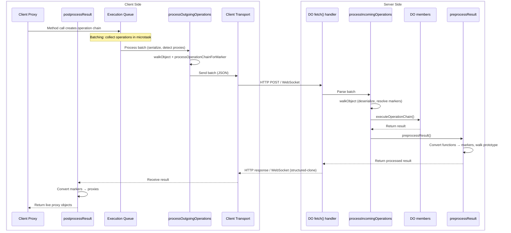

# RPC Processing Lifecycle

This document describes the complete lifecycle of an RPC call from client to server and back, including all pre-processing, transport, and post-processing steps.

## High-Level Flow

## Client-Side: Outgoing (Client → Server)

### 1. Proxy Trap: Building Operation Chain
**File:** `client.ts` - `ProxyHandler` class

- User calls method on proxy: `client.myMethod(arg1, arg2)`
- Proxy traps capture operations:
  - `get` trap: Property access → `{ type: 'get', key: 'myMethod' }`
  - `apply` trap: Function call → `{ type: 'apply', args: [arg1, arg2] }`
- Operation chain built: `[{ type: 'get', key: 'myMethod' }, { type: 'apply', args: [arg1, arg2] }]`
- Args array is cloned to prevent mutation
- Proxy registered in `proxyToOperationChain` WeakMap for pipelining detection

### 2. Queue for Batching
**File:** `client.ts` - `RpcClient.execute()`

- Operation queued in `#executionQueue` with unique ID
- Batch send scheduled via `queueMicrotask()` if not already scheduled
- All operations in same microtask tick are batched together
- Raw operations stored (processing happens in batch to maintain timing)

### 3. Process Outgoing Operations
**File:** `client.ts` - `processOutgoingOperations()`

**For each operation with args:**
- Uses `walkObject()` with transformer function to:
  - **Detect proxies:** Check `proxyToOperationChain` WeakMap
    - If proxy found → call `processOperationChainForMarker()`
    - Track chain in `pipelinedChains` set
  - **Serialize Web API objects:** `Request`, `Response`, `Headers`, `URL`
  - **Serialize Errors:** Preserve `name`, `message`, `stack`, custom properties
  - **Serialize special numbers:** `Infinity`, `-Infinity`, `NaN`
- Skip recursion for:
  - Already-formed `PipelinedOperationMarker` objects
  - Structured-clone native types (Date, Map, Set, etc.)

**Returns:**
- Processed operations (with markers instead of proxies)
- Set of pipelined chains (used as arguments, not awaited)

### 4. Process Operation Chain for Pipelining Marker
**File:** `client.ts` - `processOperationChainForMarker()`

**Why needed:** Operation chains stored in WeakMap may contain Proxy objects in their args. Proxies don't serialize through JSON, so we recursively convert nested proxies to markers.

- Uses `walkObject()` with transformer function to:
  - Check each value against `proxyToOperationChain` WeakMap
  - If nested proxy found:
    - Recursively process its chain
    - Create `PipelinedOperationMarker` with processed chain
- Skip recursion for already-formed markers
- **Result:** Fully serializable operation chain (no Proxy objects)

### 5. Filter Pipelined Operations
**File:** `client.ts` - `RpcClient.#sendBatch()`

- Collect all `pipelinedChains` across all operations in batch
- Filter out operations whose operation chains were used as arguments
- Only send operations that are actually being awaited
- Pipelined operations left pending (correct - they're arguments, not results)

### 6. Transport
**Files:** `http-post-transport.ts`, `websocket-rpc-transport.ts`

- Batch serialized as JSON
- Sent via HTTP POST or WebSocket message
- Transport handles timeout, reconnection, error handling

---

## Server-Side: Incoming (Server Receives)

### 7. Process Incoming Operations
**File:** `lumenize-rpc-do.ts` - `processIncomingOperations()`

**For each operation with args:**
- Uses `walkObject()` with transformer function to:
  - **Deserialize Web API objects:** Reconstruct `Request`, `Response`, etc.
  - **Deserialize Errors:** Restore Error instances with properties
  - **Deserialize special numbers:** Restore `Infinity`, `-Infinity`, `NaN`
  - **Resolve pipelined markers:**
    - Detect `PipelinedOperationMarker` objects
    - Recursively call `processIncomingOperations()` on marker's chain
    - Execute the processed chain via `executeOperationChain()`
    - Replace marker with actual result
- Skip recursion for structured-clone native types

**Result:** Fully deserialized operation chain with live objects (pipelined results computed)

### 8. Execute Operation Chain
**File:** `lumenize-rpc-do.ts` - `executeOperationChain()`

- Start with Durable Object instance
- Walk operation chain sequentially:
  - `get` operation: `obj = obj[key]`
  - `apply` operation: `obj = obj(...args)`
- Return final result

---

## Server-Side: Outgoing (Server → Client)

### 9. Preprocess Result (Convert Functions → Markers)
**File:** `lumenize-rpc-do.ts` - `preprocessResult()`

**Why needed:** Functions can't be serialized. We convert them to markers that tell the client how to recreate a proxy to call them.

**Processing order:**
1. **Check for special types first:**
   - Special numbers → serialize
   - Primitives → pass through
   - Circular references → return cached
   - Structured-clone native types → pass through
   - Errors → serialize
   - Web API objects → serialize

2. **Arrays:**
   - Create processed array, add to `seen` map
   - For each item:
     - Build operation chain: `[...parentChain, { type: 'get', key: index }]`
     - If function → create `RemoteFunctionMarker` with chain
     - Else → recursively process with new chain

3. **Plain objects:**
   - Create processed object, add to `seen` map
   - Process enumerable properties (same as arrays)
   - **Walk prototype chain:**
     - Get property descriptors from each prototype
     - Skip `constructor` and already-processed properties
     - Handle both value properties and getters
     - Create markers for functions, recursively process values

**Path tracking:**
- `operationChain` parameter grows with each recursion
- Each property access adds `{ type: 'get', key: propertyName }`
- Marker contains full chain to recreate proxy on client

**Result:** Object tree where functions are replaced with `RemoteFunctionMarker` objects

### 10. Transport
- Result serialized via structured-clone (preserves complex types)
- Sent back via HTTP response or WebSocket message

---

## Client-Side: Incoming (Client Receives)

### 11. Postprocess Result (Convert Markers → Proxies)
**File:** `client.ts` - `RpcClient.postprocessResult()`

**Why needed:** Convert `RemoteFunctionMarker` objects back into callable proxy functions.

**Processing order:**
1. **Check for markers and serialized types:**
   - `RemoteFunctionMarker` → create callable proxy
   - Serialized Web API objects → deserialize
   - Serialized Errors → deserialize
   - Serialized special numbers → deserialize
   - Primitives → pass through
   - Circular references → return cached

2. **Arrays:**
   - Create processed array, add to `seen` map
   - Recursively process each item with same `baseOperations`

3. **Plain objects:**
   - Check prototype (built-in types pass through)
   - Create processed object, add to `seen` map
   - Recursively process each property with same `baseOperations`

**Path tracking:**
- `baseOperations` parameter stays constant (doesn't grow)
- Used as base for remote function proxy calls
- When marker converted to proxy:
  - Proxy's operation chain = `baseOperations + marker.__operationChain + new operations`

**Result:** Live object tree with callable proxy functions

---

## Key Design Patterns

### Object Walking Strategy
- **`walkObject()`**: General-purpose recursive tree traversal
  - Used for: Client outgoing, server incoming, pipelining marker processing
  - Transformer functions handle type-specific conversions
  - `shouldSkipRecursion` controls depth

- **Manual recursion**: Path-tracking specialized walks
  - Used for: Server `preprocessResult()`, client `postprocessResult()`
  - Need to track and build operation chain paths
  - Handle prototype chains (server-side only)

### Object Chaining and Nesting (OCAN)
- **Client-side detection:**
  - `proxyToOperationChain` WeakMap tracks proxy → chain mappings
  - Proxies detected during `processOutgoingOperations()`
  - Converted to `PipelinedOperationMarker` before serialization

- **Recursive marker processing:**
  - Operation chains may contain nested proxies in args
  - `processOperationChainForMarker()` recursively converts all proxies
  - Ensures full serializability (no Proxy objects survive)

- **Server-side resolution:**
  - `processIncomingOperations()` detects markers
  - Recursively processes and executes marker's operation chain
  - Replaces marker with actual computed result

- **Batching optimization:**
  - Pipelined operations filtered from batch (they're arguments, not awaited)
  - Single round trip for: `client.increment(client.increment())`

### Circular Reference Handling
- `seen` WeakMap passed through recursion
- Object/array created and added to `seen` BEFORE processing children
- Prevents infinite loops on circular structures

### Serialization Hierarchy
1. **Special markers** (remote functions, pipelined operations)
2. **Web API objects** (Request, Response, Headers, URL)
3. **Errors** (preserve stack traces and custom properties)
4. **Special numbers** (Infinity, -Infinity, NaN)
5. **Structured-clone native types** (Date, Map, Set, RegExp, ArrayBuffer, TypedArrays)
6. **Plain objects and arrays** (recursive processing)
7. **Primitives** (pass through)

---

## Performance Considerations

### Batching
- Operations queued synchronously
- Processed and sent in next microtask
- Multiple calls in same tick = single round trip

### Lazy Connection
- WebSocket created on first execute()
- Auto-reconnect on first call after disconnect
- HTTP transport ready immediately (no connection)

### Skip Recursion Optimizations
- Structured-clone native types don't need transformation
- Already-formed markers don't need re-processing
- Reduces redundant object walks

### Path Tracking
- Server builds paths during `preprocessResult()` (functions → markers)
- Client uses constant base path in `postprocessResult()` (markers → proxies)
- Minimizes operation chain copying

---

## Error Handling

### Transport Errors
- All queued operations rejected on transport failure
- WebSocket auto-reconnect on next call
- Timeout handling per transport type

### Execution Errors
- Server-side errors serialized and sent back
- Client deserializes to Error instances
- Promise rejected with original error structure

### Serialization Errors
- Invalid types caught during processing
- Unsupported values (symbols, etc.) skipped
- Getters that throw are silently skipped (server-side)
