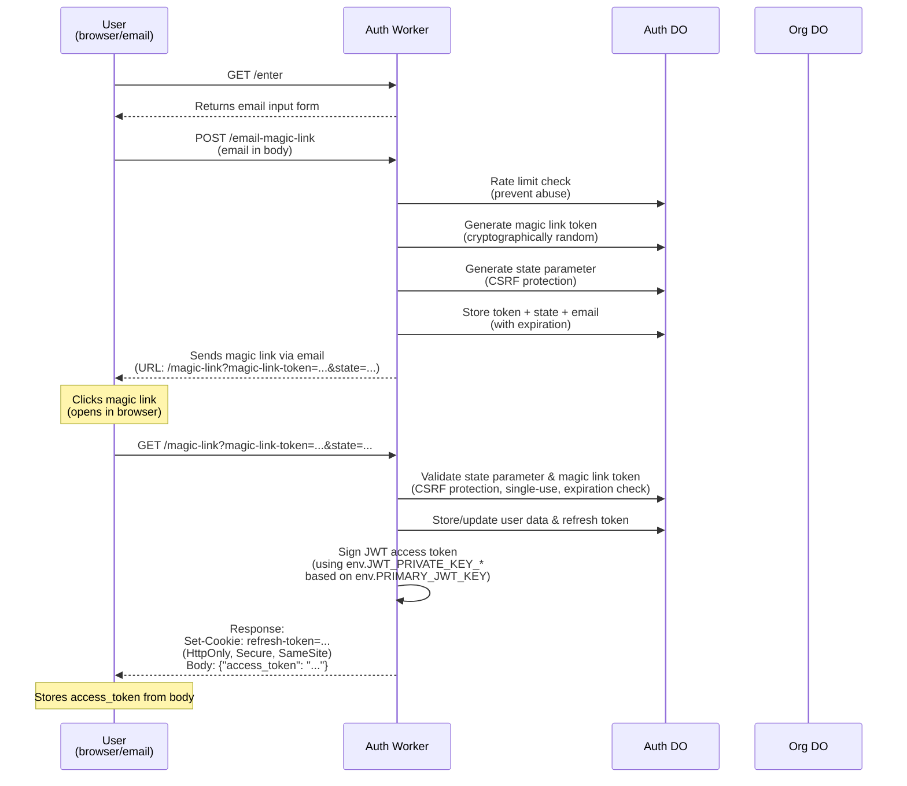
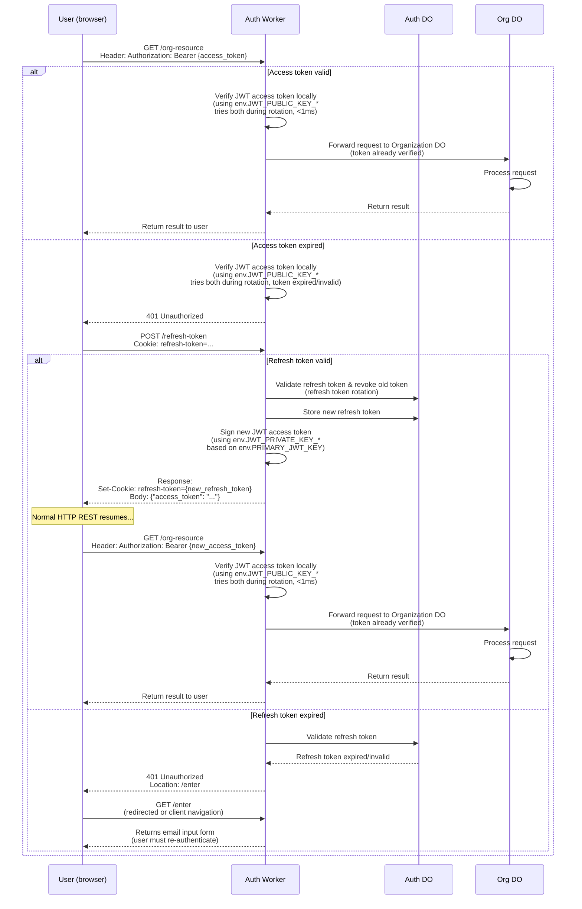
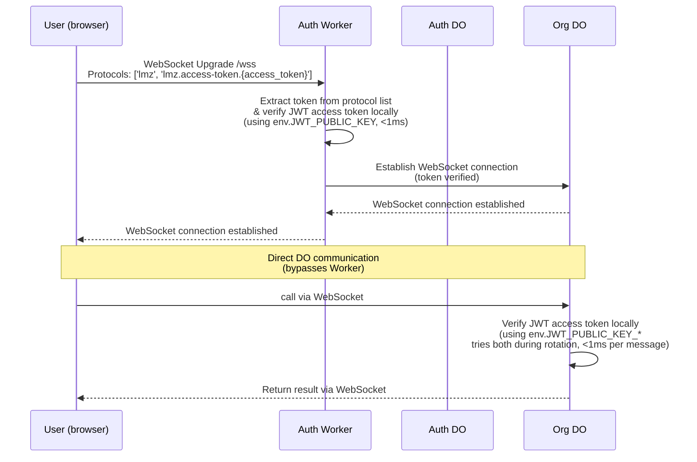
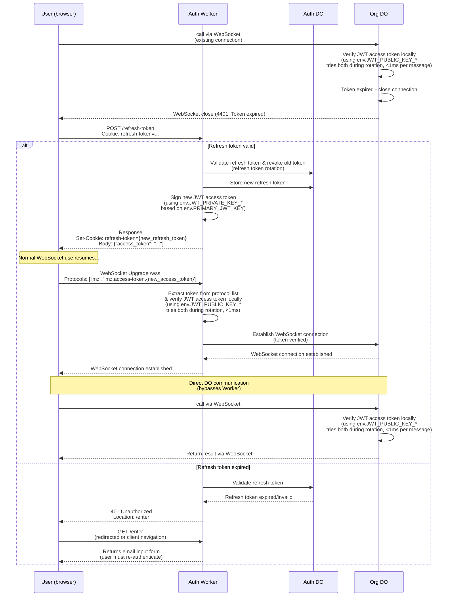

# User Authentication

## Objective

Build a self-contained authentication system for Lumenize applications using a single Auth DO with magic link login, JWT access tokens, and refresh token rotation. Integrates with `routeDORequest` for protected routes.

## Key Design Decisions

- **Storage**: Single Auth DO using synchronous SQLite storage (extends LumenizeBase)
- **Location**: `packages/auth/` - unpublished initially
- **Binding**: `LUMENIZE_AUTH` with singleton instance name `'default'`
- **Access patterns**: 
  - HTTP via fetch passthrough for external clients (`/auth/*` routes)
  - Workers RPC for internal calls from middleware (future capability)
- **Integration**: Two `routeDORequest` calls - auth routes (no middleware) + protected routes (with middleware)

## Architecture

```typescript
// Worker fetch handler pattern
export default {
  async fetch(request, env) {
    // Auth routes - no middleware, Auth DO handles its own per-endpoint auth
    const authResponse = await routeDORequest(request, env, {
      prefix: 'auth',
      cors: true
    });
    if (authResponse) return authResponse;

    // Protected routes - with auth middleware  
    return routeDORequest(request, env, {
      onBeforeRequest: createAuthMiddleware({ publicKeys: [...] }),
      onBeforeConnect: createAuthMiddleware({ publicKeys: [...] }),
      cors: true
    });
  }
}
```

## Phase 1: Auth DO Foundation ✅

**Goal**: Create the Auth DO extending LumenizeBase with SQLite schemas, JWT utilities, and HTTP endpoint shells.

**Success Criteria**:
- [x] `packages/auth/` package structure with wrangler.jsonc
- [x] Auth DO class extending LumenizeBase
- [x] SQLite schema for users table
- [x] SQLite schema for magic_links table (token, state, email, expires_at, used)
- [x] SQLite schema for refresh_tokens table
- [x] JWT signing utility with configurable algorithm (Ed25519)
- [x] JWT verification utility with key rotation support (BLUE/GREEN)
- [x] HTTP endpoint shells: GET /enter, POST /email-magic-link, GET /magic-link, POST /refresh-token, POST /logout

## Phase 2: Magic Link Login Flow ✅

**Goal**: Implement complete passwordless login via email magic links with token issuance.

**Success Criteria**:
- [x] Magic link token generation (cryptographically random)
- [x] State parameter generation (CSRF protection)
- [x] Email sending interface (injectable/mockable) - ConsoleEmailService, HttpEmailService, MockEmailService
- [x] Test mode: `env.AUTH_TEST_MODE` + `?_test=true` returns magic link in response body
- [x] Magic link validation (expiration, single-use, state matching)
- [x] Rate limiting for magic link requests (configurable per-email hourly limit)
- [x] User creation on first login
- [x] Access token + refresh token issuance on successful login
- [x] Refresh token stored in HttpOnly cookie

## Phase 3: Refresh Token Flow ✅

**Goal**: Implement secure refresh token rotation with revocation.

**Success Criteria**:
- [x] POST /refresh-token validates cookie and issues new tokens
- [x] Refresh token rotation (new token on each refresh)
- [x] Old token invalidation on rotation
- [x] Configurable expiration (default: 30 days via `refreshTokenTtl`)
- [x] POST /logout revokes refresh token

## Phase 4: Auth Middleware ✅

**Goal**: Create middleware factory for protecting routes via `routeDORequest` hooks.

**Success Criteria**:
- [x] `createAuthMiddleware()` factory function
- [x] Compatible with `onBeforeRequest` and `onBeforeConnect` hooks
- [x] Bearer token extraction from Authorization header
- [x] JWT verification with both public keys (rotation support)
- [x] Request enhancement with verified user context (headers: `X-Auth-User-Id`, `X-Auth-Verified`)
- [x] Proper 401 responses with WWW-Authenticate header

## Phase 5: WebSocket Authentication ✅

**Goal**: Enable WebSocket connections with JWT verification.

**Success Criteria**:
- [x] Token extraction from WebSocket subprotocol (`lmz.access-token.{token}`)
- [x] Initial connection verification in middleware (`createWebSocketAuthMiddleware`)
- [x] Per-message verification utility for DOs (`verifyWebSocketToken`)
- [x] Close code constants (`WS_CLOSE_CODES.TOKEN_EXPIRED = 4401`)
- [x] Token TTL utility (`getTokenTtl`) for alarm-based expiration

## Future Meta-Phases (Undefined)

These phases will be defined when we're ready to work on them:

- **OAuth 2.1 Provider**: Lumenize as an authorization server
- **OIDC Support**: OpenID Connect Discovery for MCP compliance
- **MCP Authorization**: Full MCP 2025-11-25 authorization spec compliance

---

## Design Reference

The following sections document the detailed flows and security considerations.

### Login Flow



### HTTP REST API Calls



### WebSocket API Calls



### WebSocket Token Refresh



### JWT Verification Strategy

#### Public Key Management

Since we're acting as our own OAuth provider, we use **static key pairs** with support for key rotation:

- **Private keys**: Stored in `env.JWT_PRIVATE_KEY_BLUE` and `env.JWT_PRIVATE_KEY_GREEN`, used by Auth Worker to sign JWTs (never exposed)
- **Public keys**: Stored in `env.JWT_PUBLIC_KEY_BLUE` and `env.JWT_PUBLIC_KEY_GREEN` (available to Worker and all Org DOs for verification)
- **Active key indicator**: `env.PRIMARY_JWT_KEY` indicates which key pair to use for signing (`"BLUE"` or `"GREEN"`)
- **Verification**: Worker and Org DOs verify against **both** public keys during rotation grace period
- **No JWKS endpoint needed**: Static key pairs eliminate the need for dynamic key discovery
- **No storage lookups**: Public keys are immediately available from environment

#### Key Rotation Process

1. **Initial state**: `PRIMARY_JWT_KEY=BLUE`, both BLUE and GREEN keys exist
2. **Generate new key pair**: Create new GREEN key pair (or vice versa)
3. **Update secrets**: Add `JWT_PRIVATE_KEY_GREEN` and `JWT_PUBLIC_KEY_GREEN` to Cloudflare secrets
4. **Switch active key**: Update `PRIMARY_JWT_KEY=GREEN` (Auth Worker now signs with GREEN)
5. **Grace period**: Both keys remain valid for verification (allows existing tokens to continue working)
6. **After grace period**: Remove old BLUE keys from secrets

This approach allows seamless key rotation without downtime. During the grace period, tokens signed with either key are accepted, but new tokens are only signed with the active key.

#### Verification Locations

- **HTTP REST**: Worker verifies JWT before forwarding to Org DO (Org trusts Worker's verification)
- **WebSocket**: 
  - Worker verifies during initial handshake
  - Org DO verifies on each WebSocket message (since messages bypass Worker after connection)

Both Worker and Org DOs have access to both public keys (`env.JWT_PUBLIC_KEY_BLUE` and `env.JWT_PUBLIC_KEY_GREEN`) for verification. Keys are first checked with the active key and if that fails the non-active one is tried. Since Workers have no persistent storage, verification happens on every request, but it's fast enough (<1ms) that this is not a performance concern.

### Token Casing Conventions

Following OAuth 2.1 best practices, we use a **mixed casing approach** that respects each context's established conventions:

- **Cookie**: `refresh-token` (kebab-case, common for cookies)
- **Request Header**: `Authorization: Bearer {access_token}` (standard OAuth 2.1 format)
- **JSON Response Body**: `{"access_token": "..."}` (snake_case, matches OAuth 2.1 spec)

#### Rationale

1. **HTTP Headers**: The `Authorization` header uses the standard OAuth 2.1 Bearer token format. HTTP header names themselves generally use Caps-Kebab-Case (e.g., `Authorization`, `Set-Cookie`).

2. **JSON Body**: Uses `snake_case` (`access_token`) - matches OAuth 2.1 specification and common API conventions.

3. **Cookie Names**: Uses `kebab-case` (`refresh-token`) - common web convention, readable, works in all browsers.

This approach respects each context's established conventions rather than forcing one style everywhere.

### Token Placement (OAuth 2.1 Best Practices)

- **Refresh Token**: 
  - ✅ **Cookie only** (`Set-Cookie: refresh-token=...`) with `HttpOnly`, `Secure`, and `SameSite` attributes
  - ❌ **Not in response body** - prevents XSS attacks by keeping it inaccessible to JavaScript

- **Access Token**:
  - ✅ **Response body only** (`{"access_token": ${accessToken}`) - client stores it
  - ✅ **Request header** (`Authorization: Bearer ${accessToken}`) - sent with each API call
  - ❌ **Not in response headers** - not standard OAuth 2.1 practice

### Security Considerations

#### Magic Link Security

- **Single-use tokens**: Magic link tokens must be invalidated after successful use
- **Time-limited**: Magic links should expire (e.g., 15-30 minutes)
- **State parameter**: Include state parameter in magic link for CSRF protection (see detailed explanation below)
- **Rate limiting**: Limit magic link requests per email/IP to prevent abuse

##### State Parameter for CSRF Protection

**What is CSRF in the magic link context?**

Cross-Site Request Forgery (CSRF) attacks can occur when an attacker tricks a user into clicking a malicious magic link. Without proper protection, an attacker could:

1. **Generate a magic link for their own account** (legitimate request to `/email-magic-link`)
2. **Send a malicious link** to a victim that appears to be for the victim's account
3. **If the victim clicks it**, they might authenticate as the attacker instead of themselves

**How the state parameter prevents CSRF:**

The state parameter creates a cryptographically secure binding between:
- The initial request (when user requests the magic link)
- The callback (when user clicks the magic link)

**Implementation flow:**

1. **User requests magic link** (`POST /email-magic-link`):
   - Server generates a **magic link token** (cryptographically random, e.g., 32-byte random string)
   - Server generates a **state parameter** (cryptographically random, e.g., 32-byte random string)
   - Server stores both together: `magic-link:{token}` → `{state, email, expiration, used}`
   - Server includes both in the magic link URL: `https://yourapp.com/magic-link?magic-link-token=abc123&state=xyz789`
   - Server sends email with this link

2. **User clicks magic link** (`GET /magic-link?magic-link-token=abc123&state=xyz789`):
   - Server retrieves the stored record using the token: `magic-link:abc123`
   - Server validates the token (not expired, not already used)
   - Server compares the state from the URL (`xyz789`) with the stored state
   - **If they match**: Authentication proceeds (legitimate user)
   - **If they don't match**: Reject the request (possible CSRF attack or tampering)

**Why this works:**

- **Magic link token**: Used to look up the stored record (email, etc.). Must be cryptographically random and unpredictable.
- **State parameter**: Provides CSRF protection. Even if an attacker somehow obtains or guesses a valid token, they cannot forge the matching state value because it's cryptographically random and stored server-side.
- **Both together**: The token authenticates the link, the state prevents CSRF. Both must match for authentication to proceed.

**Store with magic link token and state in Auth DO**
 - Table: `magic_links` with columns: `token`, `state`, `email`, `expires_at`, `used`
 - On callback, retrieve both token and state together, validate both
 - Use cleanup job to remove expired tokens

**Additional considerations:**

- **State length**: Use at least 32 bytes (256 bits) of entropy for cryptographic security
- **State format**: Hex encoding is common, but base64url is also fine (URL-safe)
- **State expiration**: State should expire with the magic link token (same expiration time)
- **State uniqueness**: Each magic link request should generate a unique state (don't reuse)
- **Error handling**: If state doesn't match, log the attempt (potential attack) but don't reveal why it failed

#### Refresh Token Security

- **Refresh token rotation**: OAuth 2.1 recommends issuing a new refresh token on each refresh and revoking the old one
- **Token revocation**: Refresh tokens must be revocable (stored in Auth DO for validation)
- **Expiration**: Refresh tokens should have expiration (e.g., 30-90 days)
- **Secure storage**: HttpOnly, Secure, SameSite=Strict cookies prevent XSS and CSRF
- **Rate limiting**: Limit refresh token attempts to prevent brute force

#### Access Token Security

- **Short expiration**: Access tokens should be short-lived (e.g., 15-60 minutes)
- **JWT claims**: Include proper claims:
  - `iss` (issuer): Your service identifier
  - `aud` (audience): Resource server identifier
  - `exp` (expiration): Token expiration time
  - `iat` (issued at): Token issuance time
  - `sub` (subject): User identifier
  - `jti` (JWT ID): Unique token identifier for revocation tracking
- **Claim validation**: Verify all claims during token verification
- **XSS mitigation**: Access token in memory is vulnerable to XSS, but necessary for Authorization header. Mitigate with:
  - Content Security Policy (CSP)
  - Input sanitization
  - Regular security audits

#### Additional Security Measures

- **HTTPS only**: All communication must use HTTPS (enforced by Secure cookie flag)
- **Logout/revocation**: Implement logout endpoint that revokes refresh token
- **Token revocation list**: Consider maintaining a revocation list for access tokens (if needed for immediate revocation)
- **Audit logging**: Log authentication events (success/failure, IP addresses, timestamps)
- **Anomaly detection**: Monitor for suspicious patterns (rapid token refresh, multiple failed attempts)

#### OAuth 2.1 Compliance Notes

- **PKCE**: Not applicable for magic link flow (no authorization code)
- **State parameter**: Implemented for CSRF protection in magic link flow
- **Refresh token rotation**: Recommended and should be implemented
- **Token binding**: Consider implementing token binding if needed for additional security
