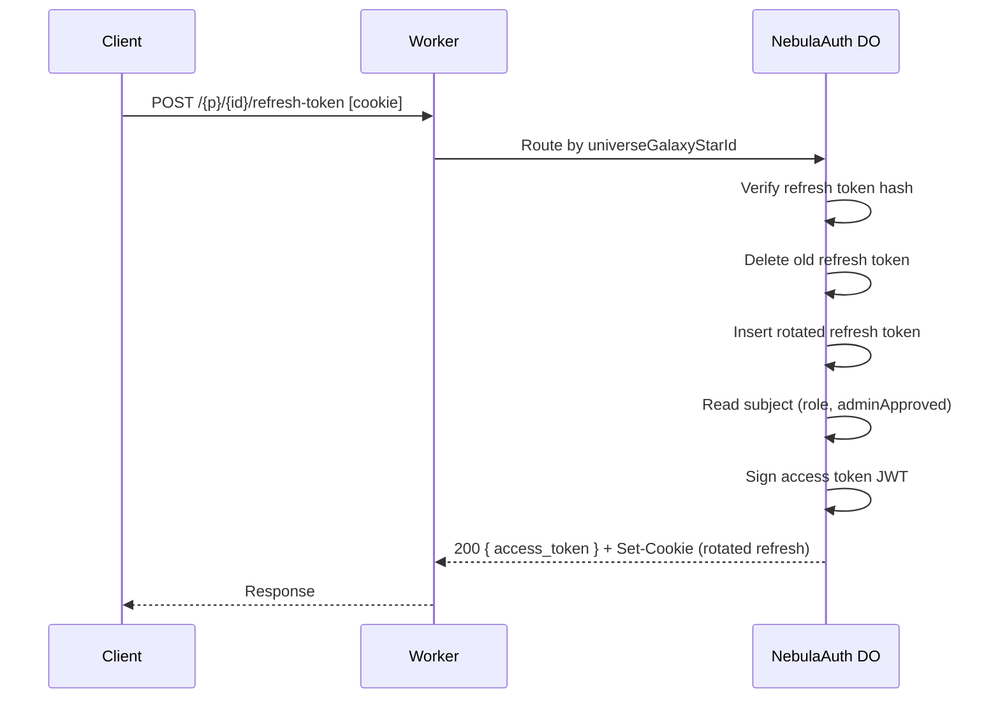
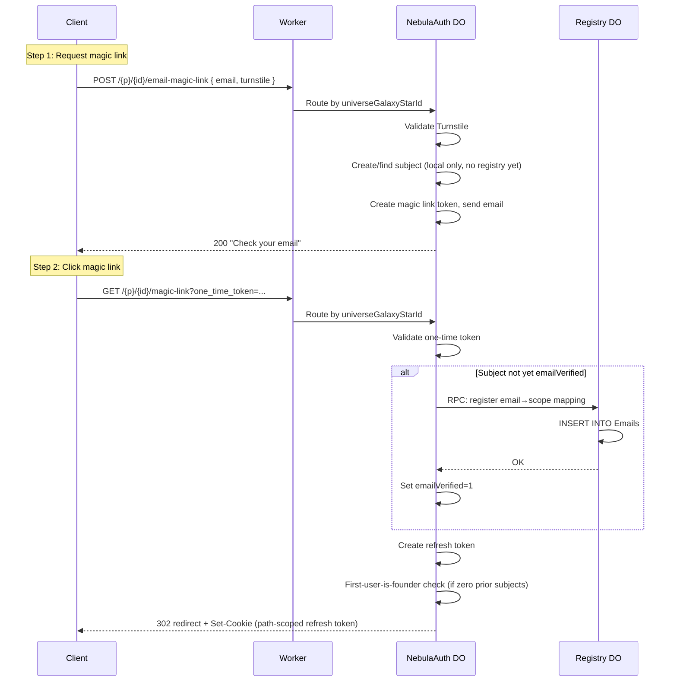
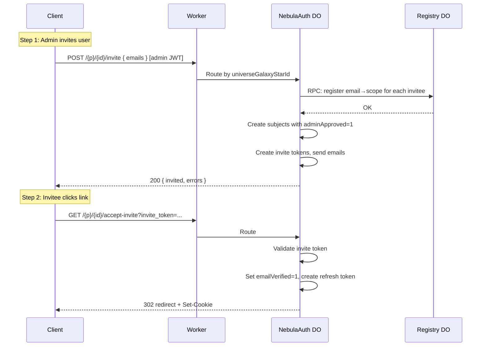
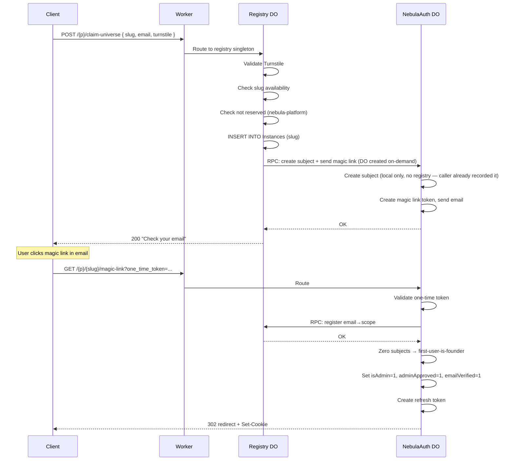
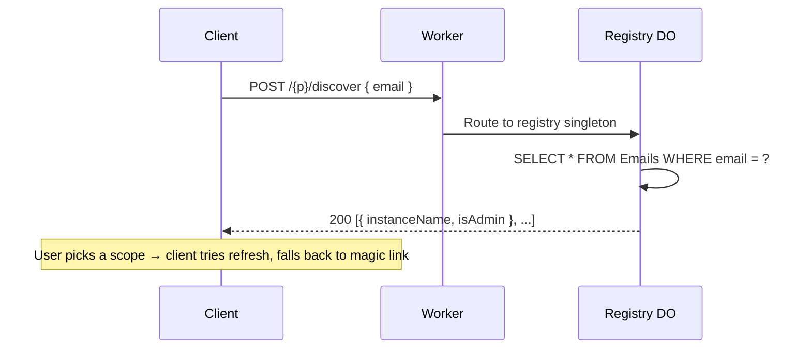
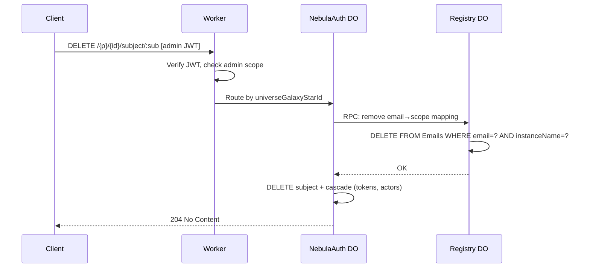
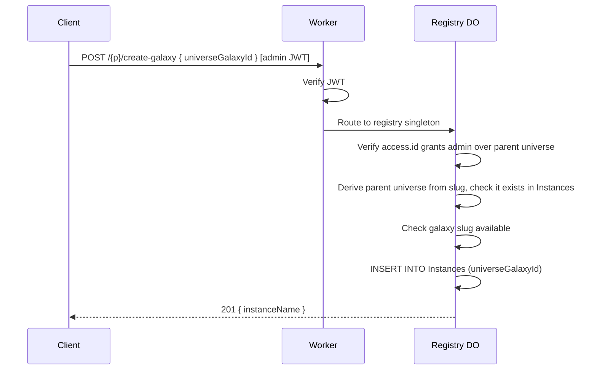
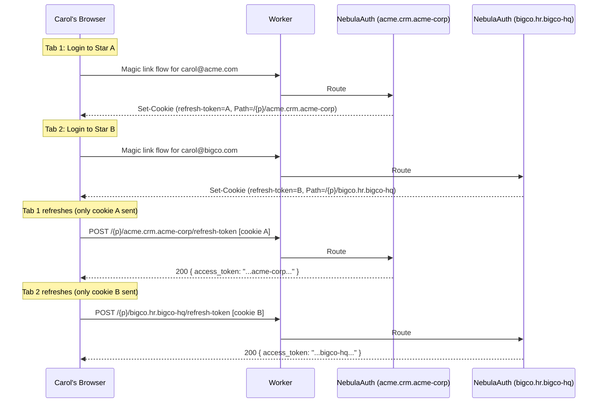

# Nebula Auth — COMPLETE

> All 7 phases done. 231 tests, 80.59% branch coverage. Follow-on items moved to `tasks/nebula.md` and `tasks/nebula-client.md`.

## Overview

`@lumenize/nebula-auth` is a multi-tenant authentication package forked from `@lumenize/auth`. It provides magic link login, JWT access tokens, and admin roles scoped to a three-tier hierarchy: Universe > Galaxy > Star.

The package contains two Durable Object classes:

- **`NebulaAuth` (aka "NA")** — Per-instance auth management (subjects, tokens, JWTs). Each tier maps to a separate instance identified by a `universeGalaxyStarId` in the URL.
- **`NebulaAuthRegistry` ("R", "registry")** — Singleton central registry tracking all instances and email-to-scope mappings. Enables slug availability checks, self-signup flows, and email-based discovery.

Nebula is a BSL 1.1 licensed vibe coding platform built on Lumenize Mesh. Auth is the first piece.

## Business Context

### Dual Multi-Tenancy

- **Universe** — A development organization that is a customer of Lumenize Nebula (company, intrapreneur, solopreneur). Example slug: `george-solopreneur`
- **Galaxy** — An application created by a Universe. Galaxies are themselves multi-tenant. Example slug: `george-solopreneur.georges-first-app`
- **Star** — An organization that is a tenant of a Galaxy. Example slug: `george-solopreneur.georges-first-app.acme-corp`

### Revenue Model (Out of Scope but Informing Design)

Monthly usage reports per `galaxy.star` are sent to Universe billing admins. Universe owners provide code (DWL or webhook) to convert usage into per-Star billing. Lumenize retains ~20% after Cloudflare costs. Free tiers may exist at Universe, Galaxy, and/or Star levels.

### Coach Scenario (Key Business Requirement)

Coaches/consultants work with multiple Lumenize clients simultaneously. A coach may have a different email address per client (issued by the client for access control). Revoking the email revokes access after the current access token expires.

Coaches must be able to switch between clients via tab switching without re-login. This is solved by cookie `Path` scoping (see Multi-Session Architecture below).

---

## Architecture Decisions

### Two DO Classes

| DO Class | Instances | Purpose |
|----------|-----------|---------|
| `NebulaAuth` | One per `universeGalaxyStarId` (+ `nebula-platform`) | Token management, magic link flow, JWT issuance, subject CRUD |
| `NebulaAuthRegistry` | Singleton | Instance catalog, email→scope index, slug availability, discovery, self-signup routing |

`NebulaAuth` instances are the source of truth for their own subjects and tokens. The registry is a secondary index maintained via direct DO-to-DO RPC calls from `NebulaAuth` instances. For subject mutation operations (create, delete, role change), the `NebulaAuth` instance calls the registry *first* — if the registry call fails, the request fails without modifying local state, so there is nothing to roll back. Read-path operations (token refresh, JWT validation) do not involve the registry. The Worker's role is limited to routing and gatekeeping (auth, rate limiting, Turnstile).

### NebulaAuth: Single DO Class, Three Tiers

One `NebulaAuth` class serves all three tiers. The tier is determined by the segment count of the DO instance name:

| Segments | Tier | Example Instance Name | Purpose |
|----------|------|----------------------|---------|
| 1 | Universe | `george-solopreneur` | Universe admin management |
| 2 | Galaxy | `george-solopreneur.georges-first-app` | Galaxy admin management |
| 3 | Star | `george-solopreneur.georges-first-app.acme-corp` | User management + auth |

### URL Format

All auth routes share a single public prefix (`{prefix}`, default `/auth`). The `createNebulaAuthRoutes` helper routes internally:

```
https://lumenize.com/{prefix}/{universeGalaxyStarId}/[endpoint]   → NebulaAuth instance
https://lumenize.com/{prefix}/discover                            → NebulaAuthRegistry
https://lumenize.com/{prefix}/claim-universe                      → NebulaAuthRegistry
https://lumenize.com/{prefix}/claim-star                          → NebulaAuthRegistry
https://lumenize.com/{prefix}/create-galaxy                       → NebulaAuthRegistry
```

The router first confirms that prefix matches, then uses `.endsWith()` on the pathname (consistent with `lumenize-auth.ts` routing): paths ending with `/discover`, `/claim-universe`, `/claim-star`, or `/create-galaxy` go to the registry singleton; everything else is treated as a `universeGalaxyStarId` and routes to the corresponding `NebulaAuth` instance.

- `{prefix}` — Single public URL prefix (default: `/auth`), maps to `NEBULA_AUTH` and `NEBULA_AUTH_REGISTRY` bindings internally
- `universeGalaxyStarId` — 1-3 dot-separated slugs; determines the DO instance

---

## Endpoint Reference

### DO Involvement Key

- **NA** = `NebulaAuth` instance only (no registry call)
- **NA→R** = `NebulaAuth` calls registry via RPC first, then writes locally (registry-first mutation pattern)
- **NA (or NA→R)** = Conditional — registry call only when state change requires it (e.g., first email verification)
- **R** = `NebulaAuthRegistry` only
- **R→NA** = Registry validates/records, then calls `NebulaAuth` via internal RPC to complete the flow (e.g., send magic link email)

### Auth Flow Endpoints (except /discover in [Registry Endpoints below](#registry-endpoints))

| Endpoint | Method | Auth | DOs | Description |
|----------|--------|------|-----|-------------|
| `{prefix}/{id}/email-magic-link` | POST | Turnstile | NA | Request magic link email |
| `{prefix}/{id}/magic-link?one_time_token=...` | GET | — | NA (or NA→R) | Validate magic link → issue refresh token; registry RPC only on first verification |
| `{prefix}/{id}/accept-invite?invite_token=...` | GET | — | NA | Accept invite → set emailVerified, issue refresh token |
| `{prefix}/{id}/refresh-token` | POST | Cookie | NA | Exchange refresh token for access token (hot path, no registry) |
| `{prefix}/{id}/logout` | POST | Cookie | NA | Revoke refresh token, clear cookie |

### Subject Management Endpoints

| Endpoint | Method | Auth | DOs | Description |
|----------|--------|------|-----|-------------|
| `{prefix}/{id}/subjects` | GET | Admin | NA | List subjects in this instance |
| `{prefix}/{id}/subject/:sub` | GET | Admin | NA | Get subject |
| `{prefix}/{id}/subject/:sub` | PATCH | Admin | NA→R | Update subject flags (registry notified if role changes) |
| `{prefix}/{id}/subject/:sub` | DELETE | Admin | NA→R | Delete subject (registry notified) |
| `{prefix}/{id}/invite` | POST | Admin | NA→R | Invite subjects → create with adminApproved, send emails |
| `{prefix}/{id}/approve/:sub` | GET | Admin | NA | Approve subject (email link friendly) |

### Delegation Endpoints

| Endpoint | Method | Auth | DOs | Description |
|----------|--------|------|-----|-------------|
| `{prefix}/{id}/subject/:sub/actors` | POST | Admin | NA | Add authorized actor |
| `{prefix}/{id}/subject/:sub/actors/:actorId` | DELETE | Admin | NA | Remove authorized actor |
| `{prefix}/{id}/delegated-token` | POST | Auth | NA | Request token to act on behalf of another subject |

### Registry Endpoints

| Endpoint | Method | Auth | DOs | Description |
|----------|--------|------|-----|-------------|
| `{prefix}/discover` | POST | — | R | Email-based scope discovery |
| `{prefix}/claim-universe` | POST | Turnstile | R→NA | Self-signup: claim universe slug, RPC to NA to send magic link |
| `{prefix}/claim-star` | POST | Turnstile | R→NA | Self-signup: claim star slug, RPC to NA to send magic link |
| `{prefix}/create-galaxy` | POST | Admin | R | Admin creates galaxy (records in registry only) |

---

## Sequence Diagrams

In these diagrams, `{p}` = `{prefix}` (the single public URL prefix, default `/auth`), and `{id}` = `{universeGalaxyStarId}`.

### Token Refresh (Hot Path)

No registry involvement. This is the most frequent operation (~every 15 minutes per active session).



### Magic Link Login

Registry-first mutation on first verification only: if the subject already exists with `emailVerified=1`, the email→scope mapping is already in the registry and the RPC call is skipped.

**First-user-is-founder:** When a `NebulaAuth` DO instance has zero subjects during magic link completion, the first verified email becomes the founding admin (`isAdmin=1, adminApproved=1, emailVerified=1`). This applies to all tiers — universes, galaxies, and stars — regardless of how the instance was created (self-signup, admin invite, or platform admin). Galaxy authors don't need to handle first-admin bootstrapping — nebula-auth takes care of it.



### Admin Invite Flow

Simpler than the magic link login for new users: the admin pre-approves the invitee (`adminApproved=1`) and registers the email→scope mapping in the registry upfront. When the invitee clicks the link, there's no conditional registry RPC (already done), no first-user-is-founder check (at least one admin already exists even if they are higher scoped), and no Turnstile (the invite token itself is the proof of legitimacy).



### Universe Self-Signup

Registry validates slug availability, records the instance, then calls NebulaAuth via internal RPC to send the magic link email. The client receives a single response — no redirect, no second POST. Anti-squatting is deferred — platform admin can manually revoke claims if abused.



### Star Self-Signup

Same pattern as universe, but registry also validates parent galaxy exists.

### Discovery Flow

Registry-only. No NebulaAuth involvement. After the user picks a scope, the client tries refresh first (in case a valid path-scoped cookie exists), then falls back to magic link. See `tasks/nebula-client.md` for the full login flow.



### Subject Deletion

The remaining endpoints not shown above follow one of two patterns:

**NA→R (same pattern as this diagram)** — `NebulaAuth` calls registry first, then writes locally:
- `PATCH subject/:sub` — update subject flags (registry notified if role changes)

**NA-only (no registry involvement)** — straightforward request→DO→response:
- `logout`, `subjects` GET, `subject/:sub` GET, `approve/:sub`, `subject/:sub/actors` POST/DELETE, `delegated-token`



### Galaxy Creation (Admin Only)

Registry-only. No NebulaAuth DO created until first request routes to it. Most galaxies won't have dedicated galaxy admins — universe admins manage them directly via wildcard access.



### Coach Carol Multi-Session

Coach Carol works with multiple clients in separate browser tabs, each with a different email address. Switching tabs must not require re-login. Each DO instance sets its refresh cookie with a `Path` scoped to its `universeGalaxyStarId`, so the browser **automatically** sends the correct cookie to the correct DO instance — no client-side cookie management required.



**Access revocation is isolated.** When `bigco` revokes `carol@bigco.com`, the current access token expires within the TTL (~15 min), the next refresh fails, and the `NebulaAuth` DO notifies the registry via RPC to remove the email→scope mapping. Other tabs are completely unaffected — different DOs, different cookies, different subjects.

**Admin hierarchy uses JWT wildcards, not separate cookies.** A Universe admin logs in at `{prefix}/george-solopreneur` and gets a JWT with `{ "id": "george-solopreneur.*", "admin": true }`. That JWT grants access to any Star-level endpoint beneath it via the auth hook's wildcard match — no separate Star-level login needed. The refresh cookie is scoped to `Path={prefix}/george-solopreneur`, so it won't be sent to `{prefix}/george-solopreneur.app.tenant/refresh-token` (path doesn't match), but that's fine — the admin refreshes at Universe level only.

---

### `universeGalaxyStarId` Format Constraints

Slugs: lowercase letters, digits, and hyphens only (`[a-z0-9-]+`). No periods within a slug. Universe slugs are globally unique. Galaxy slugs are unique within their Universe. Star slugs are unique within their Galaxy. Convention: domain-based Universe names (e.g., `lumenize-com` for `lumenize.com`).

**Reserved slug** (cannot be used as universe name): `nebula-platform`. The registry endpoint keywords (`discover`, `claim-universe`, `claim-star`, `create-galaxy`) do not need to be reserved because `.endsWith()` routing means a universe named e.g. `discover` would have routes like `{prefix}/discover/refresh-token` — which doesn't end with `/discover`.

### Package Strategy: Fork from `@lumenize/auth`

`@lumenize/nebula-auth` is a fork of `@lumenize/auth`. Individual utility functions will be imported from `@lumenize/auth` where it makes sense:

**Likely imports from `@lumenize/auth`:**
- `signJwt`, `verifyJwt`, `verifyJwtWithRotation`, `importPrivateKey`, `importPublicKey`
- `generateRandomString`, `generateUuid`, `hashString`, `parseJwtUnsafe`
- `verifyTurnstileToken`
- `AuthEmailSenderBase`, `ResendEmailSender`
- `extractWebSocketToken`, `verifyWebSocketToken`, `getTokenTtl`, `WS_CLOSE_CODES`

**Will NOT import (must fork/rewrite):**
- `LumenizeAuth` DO class → becomes `NebulaAuth`
- `createRouteDORequestAuthHooks` → becomes `createRouteDORequestNebulaAuthHooks`
- `createAuthRoutes` → becomes `createNebulaAuthRoutes`
- `createJwtPayload` → new `access` claim structure
- SQL schemas → new schema with `access` claim assembly
- `testLoginWithMagicLink` → new helper supporting multi-star, path-scoped cookies
- Email HTML templates → Nebula default templates (customizable name/logo per tier — see [Follow-On: Email Template Customization](#email-template-customization))
- Types → new `NebulaJwtPayload`, `AccessEntry`, etc.

**New:**
- `NebulaAuthRegistry` DO class
- Self-signup and discovery routes
- DO-to-DO RPC calls from `NebulaAuth` to registry for subject lifecycle events

---

## Data Model

### NebulaAuth: Per-Instance SQLite Schema

Each `NebulaAuth` instance has its own SQLite database. Since each instance represents exactly one `universeGalaxyStarId`, subjects in that instance are members of that tier by definition. No junction table mapping subjects to tiers is needed — DO instance isolation provides that relationship implicitly.

#### Subjects Table

```sql
CREATE TABLE IF NOT EXISTS Subjects (
  sub TEXT PRIMARY KEY,          -- UUID v4
  email TEXT UNIQUE NOT NULL,    -- Lowercase; inline UNIQUE creates the index
  emailVerified INTEGER NOT NULL DEFAULT 0,
  adminApproved INTEGER NOT NULL DEFAULT 0,
  isAdmin INTEGER NOT NULL DEFAULT 0,
  createdAt INTEGER NOT NULL,    -- Unix timestamp (ms)
  lastLoginAt INTEGER            -- Unix timestamp (ms), nullable
) WITHOUT ROWID;

CREATE INDEX IF NOT EXISTS idx_Subjects_isAdmin
  ON Subjects(sub) WHERE isAdmin = 1;
```

Notes:
- `UNIQUE` on `email` creates an implicit unique index — same B-tree as `CREATE UNIQUE INDEX`, usable by the query planner, so **no separate email index** is needed (a redundant explicit index would double write cost for zero benefit)
- `idx_Subjects_isAdmin` — partial index; only costs a write when `isAdmin = 1`

Write costs (per operation):
| Operation | `rowsWritten` | Notes |
|-----------|:-------------:|-------|
| INSERT (non-admin) | 2 | 1 table + 1 email UNIQUE index (partial isAdmin index skipped) |
| INSERT (admin) | 3 | 1 table + 1 email + 1 isAdmin partial index |
| UPDATE isAdmin 0→1 | 2 | 1 table + 1 isAdmin index (email unchanged, not rewritten) |
| UPDATE lastLoginAt | 1 | Non-indexed column, only table row rewritten |
| DELETE | 1 | Index cleanup not counted |

#### Token Tables

All three follow the same pattern: hashed token as TEXT PK, lookup by email/subject, check expiry, mark used or revoked. Each DO instance manages its own tokens independently.

```sql
CREATE TABLE IF NOT EXISTS MagicLinks (
  token TEXT PRIMARY KEY,
  email TEXT NOT NULL,
  expiresAt INTEGER NOT NULL,
  used INTEGER NOT NULL DEFAULT 0
) WITHOUT ROWID;

CREATE INDEX IF NOT EXISTS idx_MagicLinks_email ON MagicLinks(email);
```

`InviteTokens` is identical but without the `used` flag (single-use by design — deleted on redemption). `RefreshTokens` is keyed by `tokenHash` (not plaintext), references `subjectId` with `ON DELETE CASCADE`, and uses a `revoked` flag instead of `used`.

#### `AuthorizedActors` Table

Delegation actor relationships, scoped to the DO instance.

### NebulaAuthRegistry: Singleton SQLite Schema

The registry uses pure SQL with portable types to ease future migration to a horizontally scalable database (e.g., Postgres) if the single-DO model is outgrown.

#### Instances Table

```sql
CREATE TABLE IF NOT EXISTS Instances (
  instanceName TEXT PRIMARY KEY,  -- universeGalaxyStarId (e.g., acme-corp.crm.tenant-a)
  createdAt INTEGER NOT NULL      -- Unix timestamp (ms)
) WITHOUT ROWID;
```

Tier and parent are derived from `instanceName`: segment count gives tier (1=universe, 2=galaxy, 3=star), stripping the last segment gives parent.

#### Emails Table

```sql
CREATE TABLE IF NOT EXISTS Emails (
  email TEXT NOT NULL,            -- Lowercase email
  instanceName TEXT NOT NULL,     -- universeGalaxyStarId
  isAdmin INTEGER NOT NULL DEFAULT 0, -- Denormalized from NebulaAuth Subjects — avoids RPC fan-out during discovery
  createdAt INTEGER NOT NULL,     -- Unix timestamp (ms)
  PRIMARY KEY (email, instanceName)
) WITHOUT ROWID;

CREATE INDEX IF NOT EXISTS idx_Emails_instanceName
  ON Emails(instanceName);        -- Reverse lookups: "list all emails in this instance"
```

Notes:
- Compound PK already covers email-first lookups (leftmost prefix) — **no separate email index**
- `idx_Emails_instanceName` costs +1 write per INSERT (2 total)
- UPDATE on `isAdmin` (non-indexed column) costs only 1 write
- DELETE always costs 1 write regardless of index count

Scope is derived at query time: `instanceName` for stars (3 segments), `instanceName + ".*"` for universe/galaxy (1-2 segments).

#### Registry Write Cost Summary

| Operation | `rowsWritten` | Notes |
|-----------|:-------------:|-------|
| INSERT Instances | 1 | `WITHOUT ROWID` — no separate rowid index |
| INSERT Emails | 2 | 1 table + 1 `idx_Emails_instanceName` |
| UPDATE Emails.isAdmin | 1 | `isAdmin` not indexed, only table row rewritten |
| DELETE Emails | 1 | Index cleanup not counted in `rowsWritten` |

---

## JWT Claims

### `NebulaJwtPayload`

```typescript
interface AccessEntry {
  id: string  // universeGalaxyStarId or wildcard pattern (e.g. "george-solopreneur.*")
  admin?: boolean  // true = admin of this scope; omit when false (keeps JWT compact)
}

interface NebulaJwtPayload {
  iss: string            // Issuer
  aud: string            // Audience
  sub: string            // Subject UUID (within the issuing DO instance)
  exp: number            // Expiration (Unix seconds)
  iat: number            // Issued at (Unix seconds)
  jti: string            // JWT ID (UUID)
  adminApproved: boolean
  access: AccessEntry    // Scoped access (one entry per JWT, issued by one DO instance)
  act?: ActClaim         // Delegation chain per RFC 8693 (optional)
}
```

### Access Claim Examples

**Star-level regular user:**
```json
{ "access": { "id": "george-solopreneur.georges-first-app.acme-corp" } }
```

**Star-level admin:**
```json
{ "access": { "id": "george-solopreneur.georges-first-app.acme-corp", "admin": true } }
```

**Galaxy admin (access to all Stars beneath):**
```json
{ "access": { "id": "george-solopreneur.georges-first-app.*", "admin": true } }
```

**Universe admin (access to all Galaxies and Stars beneath):**
```json
{ "access": { "id": "george-solopreneur.*", "admin": true } }
```

**Platform admin (access to everything):**
```json
{ "access": { "id": "*", "admin": true } }
```

### Access Claim Rules

- Each JWT is issued by one DO instance and contains exactly one `access` entry.
- Wildcard `.*` means "this scope and everything beneath it."

### Admin Model

`isAdmin` is contextual to the DO instance that issued the JWT. A Universe admin's JWT carries `{ "id": "george-solopreneur.*", "admin": true }`. The auth hook checks the `access` entry to determine admin status.

For future extensibility, the `AccessEntry` type can grow additional boolean or string fields (e.g., `billing?: boolean`) without breaking the existing format. For now, only `admin` exists.

---

## Auth Hooks: `createRouteDORequestNebulaAuthHooks`

The hook pipeline:

1. Extract JWT from `Authorization: Bearer` header or WebSocket subprotocol
2. Verify JWT signature with key rotation support
3. Validate standard claims: `iss`, `aud`, `exp`
4. Parse `universeGalaxyStarId` from the URL (second path segment)
5. Match `access.id` against URL — exact match or wildcard match
6. Check `admin` flag if the endpoint requires admin access
7. Enforce access gate: `admin || adminApproved` for the matching entry
8. Rate limiting per subject
9. Forward request to downstream DO with verified JWT

### Wildcard Matching Examples

```
matchAccess("*", "george-solopreneur")                                → true (platform admin)
matchAccess("*", "george-solopreneur.app.tenant")                     → true (platform admin)
matchAccess("george-solopreneur.*", "george-solopreneur")             → true (universe-level access)
matchAccess("george-solopreneur.*", "george-solopreneur.app")         → true (galaxy beneath)
matchAccess("george-solopreneur.*", "george-solopreneur.app.tenant")  → true (star beneath)
matchAccess("george-solopreneur.app.*", "george-solopreneur")         → false (galaxy admin can't access universe)
matchAccess("george-solopreneur.app.*", "george-solopreneur.app")     → true
matchAccess("george-solopreneur.app.tenant", "george-solopreneur.app.tenant") → true (exact)
matchAccess("george-solopreneur.app.tenant", "george-solopreneur.app.other")  → false
```

---

## Access Control

### Access Gate

The access gate is: **`admin || adminApproved`**. Invited users pass immediately (the invite flow sets `adminApproved=true` — see [Admin Invite Flow](#admin-invite-flow)). Users who request access via magic link without an invite must be explicitly approved by an admin.

`emailVerified` is not in the JWT because it is always `true` by construction — no refresh token (and therefore no JWT) is ever issued without prior email verification (magic link click or invite acceptance). This invariant holds for future auth methods too (OAuth providers verify email; passkeys require email verification at registration). `emailVerified` is retained in the `Subjects` table to track invite completion state, but it is not a gating claim.

---

## NebulaAuthRegistry

### Purpose

The registry is a singleton DO that maintains a global view of the Nebula auth landscape. Individual `NebulaAuth` instances are self-contained for auth flows, but certain cross-cutting concerns require a central index:

1. **Slug availability** — Is `acme-corp` already claimed as a universe? Is `acme-corp.crm.tenant-x` taken?
2. **Discovery** — User enters email, gets back all `universeGalaxyStarId`s they belong to
3. **Self-signup routing** — Validate and record new universe/star claims before delegating to `NebulaAuth` instances
4. **Platform admin visibility** — List all universes, galaxies, stars without using Cloudflare's DO management APIs

Discovery is unauthenticated — the user doesn't have a JWT yet and is trying to figure out where to log in. The registry reveals only which scopes an email is associated with, not any sensitive data. See the [Discovery Flow](#discovery-flow) and [Subject Deletion](#subject-deletion) sequence diagrams.

---

## Platform Admin (Bootstrap)

### Reserved Instance: `nebula-platform`

`NEBULA_AUTH_BOOTSTRAP_EMAIL` env var designates the platform super-admin (Lumenize operator). This email authenticates at the reserved `nebula-platform` DO instance via standard magic link flow at `{prefix}/nebula-platform`. The one conditional behavior: when the DO recognizes the bootstrap email, it issues a JWT with `{ "access": { "id": "*", "admin": true } }` instead of the normal scope, granting access to all universes, galaxies, and stars. Refresh cookie is scoped to `Path={prefix}/nebula-platform`.

The `nebula-platform` instance goes through the normal magic link flow including the registry RPC on first verification, so it appears in the `Emails` table (`instanceName='nebula-platform'`, `isAdmin=1`). The `Instances` table does not require a corresponding row — `nebula-platform` is a reserved slug that the router always recognizes. Discovery will correctly return it as a scope for the bootstrap email.

The `nebula-platform` slug is safe from collision because we encourage universe names derived from domain names (e.g., `lumenize-com` for `lumenize.com`), and `.platform` is not a valid ICANN TLD.

### Admin Creation Chain

- **Platform admin** creates universe admins (via invite at universe-level DOs)
- **Universe admins** can create other universe admins for their universe, galaxy admins, and star admins
- **Galaxy admins** can create other galaxy admins and star admins beneath them
- **Star admins** manage star users

Each level's invite/approve flow is scoped to its DO instance.

---

## Configuration

Product-level decisions are hardcoded as constants since we control all deployments. Only secrets and operational switches are env vars.

### Environment Variables (secrets + operational)

| Variable | Notes |
|----------|-------|
| `JWT_PRIVATE_KEY_BLUE/GREEN` | Ed25519 signing keys (secret) |
| `JWT_PUBLIC_KEY_BLUE/GREEN` | Ed25519 verification keys (secret) |
| `PRIMARY_JWT_KEY` | Active signing key (`'BLUE'` or `'GREEN'`) |
| `RESEND_API_KEY` | Resend email API key (secret) |
| `TURNSTILE_SECRET_KEY` | Cloudflare Turnstile secret (optional) |
| `NEBULA_AUTH_BOOTSTRAP_EMAIL` | Platform super-admin email (optional) |
| `NEBULA_AUTH_TEST_MODE` | Enable test endpoints (`'false'` default) |

### Hardcoded Constants

| Constant | Value | Notes |
|----------|-------|-------|
| `PLATFORM_INSTANCE_NAME` | `'nebula-platform'` | Reserved DO instance for platform admin |
| `REGISTRY_INSTANCE_NAME` | `'registry'` | Singleton instance name for `NebulaAuthRegistry` |
| `NEBULA_AUTH_PREFIX` | `'/auth'` | Single URL prefix for all auth routes (`{prefix}`) |
| `NEBULA_AUTH_ISSUER` | TBD | JWT `iss` claim |
| `NEBULA_AUTH_AUDIENCE` | TBD | JWT `aud` claim |
| `ACCESS_TOKEN_TTL` | `900` | Access token lifetime (seconds) |
| `REFRESH_TOKEN_TTL` | `2592000` | Refresh token lifetime (seconds) |
| `MAGIC_LINK_TTL` | `1800` | Magic link lifetime (seconds) |
| `INVITE_TTL` | `604800` | Invite token lifetime (seconds) |

### Redirect Logic

Hardcode redirect to `/app` for now. The real redirect target is a NebulaClient/NebulaUI concern — auth's job is validate token → set refresh cookie → redirect *somewhere*. Tests only need to verify the redirect happens and the cookie is set correctly. Revisit when full Nebula e2e testing reveals the actual URL structure.

---

## Validation Plan

### Testing Infrastructure

Two `@lumenize/testing` capabilities are central to these tests:

- **`Browser`** — Cookie-aware fetch and WebSocket. Already scopes cookies by name + domain + path (verified in `cookie-utils.ts` `cookieMatches()`), follows redirects manually to capture `Set-Cookie` headers from intermediate responses. Critical for the Coach Carol multi-session scenario. That said, for every major new use of `@lumenize/testing`, we've had to add/alter functionality, so let's be open to that if the need arises.

- **`createTestingClient`** — RPC client that can read/write DO state directly: `client.ctx.storage.sql.exec(...)` to query tables, `client.ctx.storage.kv.get(...)` to inspect KV, and call any public method on the DO instance. Use this to verify internal state (e.g., confirm `isAdmin=1` in the Subjects table, check that the registry's Emails table has the right rows) instead of adding test-only methods to the DO classes. See `website/docs/testing/usage.mdx` for the full API.

**Test mode vs e2e email** — Most tests should use test mode (`NEBULA_AUTH_TEST_MODE=true`), which returns magic link URLs directly in the response body instead of sending email. This avoids the SMTP round trip for the common case. A small number of e2e tests should exercise real email delivery using the internal `tooling/email-test/` infrastructure: a deployed `email-test` Worker (`EmailTestDO`, a plain `DurableObject` — not LumenizeDO) receives emails via Cloudflare Email Routing and pushes them to test clients over WebSocket (~1.5 seconds round trip). The `waitForEmail()` and `extractMagicLink()` helpers in `packages/auth/test/e2e-email/` wrap this into a simple API. The auth DO runs in-process (no deployment needed) but sends real email via Resend.

**⚠️ Test mode env vars go in `vitest.config.js` only** — never in `.dev.vars` or `wrangler.jsonc`. The vitest config is not deployed, so there is zero risk of test mode leaking to production. This is the pattern `@lumenize/auth` follows (`LUMENIZE_AUTH_TEST_MODE` set at `packages/auth/vitest.config.js:43`). Nebula-auth should follow the same pattern with `NEBULA_AUTH_TEST_MODE`.

### Coach Multi-Session Scenario

#### Test: Single Browser, Multiple Path-Scoped Refresh Cookies

Using a **single `Browser` instance** (simulating one real browser), verify:

1. **Login to Star A** — Magic link flow for `carol@acme.com` at DO instance `acme.crm.acme-corp`. Verify `refresh-token` cookie is set with `Path={prefix}/acme.crm.acme-corp`.
2. **Login to Star B** — Magic link flow for `carol@bigco.com` at DO instance `bigco.hr.bigco-hq`. Verify a **second** `refresh-token` cookie is set with `Path={prefix}/bigco.hr.bigco-hq`. Verify the Star A cookie still exists (not overwritten).
3. **Refresh Star A** — `POST {prefix}/acme.crm.acme-corp/refresh-token`. Verify the browser sends only the Star A cookie (path match). Verify access token is issued with `access: { "id": "acme.crm.acme-corp" }`.
4. **Refresh Star B** — `POST {prefix}/bigco.hr.bigco-hq/refresh-token`. Verify the browser sends only the Star B cookie. Verify access token has `access: { "id": "bigco.hr.bigco-hq" }`.
5. **Revoke Star B** — Delete Carol's subject in the `bigco.hr.bigco-hq` DO. Verify Star B refresh fails. Verify Star A refresh still succeeds.
6. **Cookie isolation** — Verify `browser.getCookiesForRequest('{prefix}/acme.crm.acme-corp/refresh-token')` does NOT include the Star B cookie, and vice versa.

#### Test: Universe Admin Wildcard Access

1. **Login at Universe level** — Admin logs in at `acme` (1-segment instance). Refresh cookie set with `Path={prefix}/acme`.
2. **Access Star-level resource** — Use the Universe-scoped JWT (with `access: { "id": "acme.*", "admin": true }`) to access `/nebula/acme.crm.acme-corp/some-resource`. Verify the auth hook grants access via wildcard match.
3. **Cookie path does not match Star auth path** — Verify that `browser.getCookiesForRequest('{prefix}/acme.crm.acme-corp/refresh-token')` does NOT include the Universe cookie (path `{prefix}/acme` is not a prefix of `{prefix}/acme.crm.acme-corp`). This is correct — the admin refreshes at Universe level only.
4. **Verify upward access is denied** — A Galaxy admin JWT for `acme.crm.*` must be rejected when accessing `{prefix}/acme/admin-panel` (galaxy admin cannot access universe).

**Tab simulation deferred** — The Coach Multi-Session test above already verifies cookie path isolation using a single `Browser` instance (shared cookie jar, path-scoped sends). Multi-tab testing with `browser.context(origin)` and per-tab access token storage (sessionStorage independence) is a NebulaClient concern — defer to `tasks/nebula-client.md` when that dual-scope model is implemented.

### Registry Scenarios

#### Test: Discovery Flow

1. Create two stars with the same email (`carol@acme.com` in both `acme.crm.star-a` and `acme.crm.star-b`)
2. Query `POST {prefix}/discover` with `carol@acme.com`
3. Verify both scopes returned
4. Revoke Carol from `star-b` (delete subject — `NebulaAuth` DO updates registry via RPC)
5. Query discovery again, verify only `star-a` returned

#### Test: Universe Self-Signup

1. Claim universe slug `new-universe` via `POST {prefix}/claim-universe { slug, email, turnstile }` → 200 "Check your email" (registry records instance, RPCs to NA to send magic link)
2. Click magic link → `GET {prefix}/new-universe/magic-link?one_time_token=...`
3. Verify founding admin has `isAdmin=1, adminApproved=1`
4. Verify registry `Instances` table has the universe record
5. Verify registry `Emails` table has the email→scope mapping
6. Attempt to claim same slug again → rejected

#### Test: Star Self-Signup

1. Universe admin creates galaxy `new-universe.my-app` via registry
2. New user claims star via `POST {prefix}/claim-star { universeGalaxyStarId, email, turnstile }` → 200 "Check your email"
3. Click magic link to complete flow
4. Verify founding admin status
5. Verify registry records
6. Attempt to claim star under nonexistent galaxy → rejected

#### Test: Galaxy Creation (Admin Only)

1. Universe admin creates galaxy via `POST {prefix}/create-galaxy`
2. Verify registry records the galaxy
3. Unauthenticated request to create galaxy → rejected
4. Star admin JWT attempting to create galaxy → rejected (insufficient scope)

### Inherited from `@lumenize/auth`

`packages/auth/test/auth.test.ts` (~2,800 lines, ~150 test cases) covers all subject management endpoints, magic link flows, refresh token rotation, invite flows, delegation, and edge cases. Copy this test file into `packages/nebula-auth/test/` as a starting point — don't just import from `@lumenize/auth`. Nebula-auth will diverge over time (multi-tier auth, registry integration, wildcard JWTs), and we need the full suite running locally against the nebula-auth codebase on every change.

---

## Implementation Phases

### Phase 0: Prerequisites — DONE

- **~~Verify `@lumenize/testing` Browser path scoping~~** — DONE. Found and fixed a bug: `cookieMatches` used simple `startsWith` instead of RFC 6265 §5.1.4 path matching. `/auth/acme` was incorrectly matching `/auth/acme.crm.tenant` (next char is `.`, not `/`). Fixed in `packages/testing/src/cookie-utils.ts`. Added tests in both `cookie-utils.test.ts` and `browser.test.ts` (Coach Carol and universe admin scenarios). All 153 `@lumenize/auth` tests still pass after the fix.
- **~~Audit `@lumenize/auth` for importable utilities~~** — DONE. All 14 listed utilities confirmed exported and stable.
- **~~Research DO SQLite index write costs~~** — DONE. Results in `tasks/do-sqlite-write-costs.md`, experiment code in `experiments/do-write-costs/`. Key decisions applied:
  - All tables with TEXT PK or compound text PK use `WITHOUT ROWID` (saves 1 write per INSERT)
  - No redundant leftmost-prefix indexes (compound PK already covers first-column lookups)
  - `UNIQUE` constraint preferred over separate unique index (same cost, enforces uniqueness)
  - Partial index on `isAdmin` saves writes for non-admin inserts
  - Schema sections above updated with per-operation write cost tables
  - Blog post: Phase 3 of `tasks/do-sqlite-write-costs.md` (separate task)

### Phase 1: Package Scaffold + `universeGalaxyStarId` Parsing — DONE

- ~~Create `packages/nebula-auth/` with standard package structure~~ — DONE. BSL-1.1 license, `wrangler.jsonc` with both DO bindings (NebulaAuth + NebulaAuthRegistry), stub DOs in `test/test-worker-and-dos.ts`.
- ~~`universeGalaxyStarId` validation and parsing~~ — DONE. `parseId()`, `isValidSlug()`, `isPlatformInstance()`, `getParentId()`, `buildAccessId()`, `matchAccess()` in `src/parse-id.ts`.
- ~~TypeScript types and constants~~ — DONE. All types (`ParsedId`, `AccessEntry`, `NebulaJwtPayload`, `Subject`, token types, registry types) and all hardcoded constants in `src/types.ts`.
- ~~Unit tests~~ — DONE. 52 tests in `test/parse-id.test.ts` covering all parsing, validation, parent derivation, access id building, and all 9 wildcard matching examples from this task file.

**Decision: No TypeBox for now.** TypeBox schemas were originally planned for `AccessEntry` and `NebulaJwtPayload`, but we control both sides of the wire (nebula-auth issues JWTs, nebula-auth hooks verify them). Plain TypeScript types exported from this package serve both producer and consumer. TypeBox would add a dependency and runtime overhead for validation we don't need — the JWT is signed, so tampering is already caught by signature verification. If a future boundary (e.g., external API consumers) needs runtime schema validation, we can add TypeBox then.

**Expected outcome:** `parseUniverseGalaxyStarId("george-solopreneur.app.tenant")` returns `{ universe: "george-solopreneur", galaxy: "app", star: "tenant", tier: "star", raw: "george-solopreneur.app.tenant" }`. Invalid formats throw.

### Phase 2: NebulaAuth Core — DONE

- `NebulaAuth` DO class
- SQL schema (Subjects, MagicLinks, InviteTokens, RefreshTokens, AuthorizedActors)
- Lazy schema init, expired token sweep (alarm-based cleanup of expired/used tokens — same pattern as `@lumenize/auth`)
- Magic link login flow with path-scoped `Set-Cookie`
- Refresh token flow with path-scoped cookie
- First-user-is-founder logic: zero subjects → first verified email becomes founding admin
- Platform admin: `nebula-platform` reserved instance, bootstrap email conditional → `{ "id": "*", "admin": true }`
- Tier-aware behavior: the DO knows its tier from its instance name segment count
- JWT `access` claim assembly: `{ id: instanceName, admin: isAdmin }` for Star-level; `{ id: instanceName + ".*", admin: isAdmin }` for Universe/Galaxy-level

**Expected outcome:** Full magic link login, refresh, logout working for a single DO instance. Path-scoped cookies verified. First-user-is-founder tested with an empty DO.

### Phase 3: Auth Hooks — DONE

- ~~`createRouteDORequestNebulaAuthHooks`~~ — DONE. Full hook pipeline with `onBeforeRequest` (HTTP) and `onBeforeConnect` (WebSocket subprotocol). Bearer token extraction, JWT verification with key rotation (BLUE/GREEN), standard claims validation (`iss`, `aud`, `sub`), URL instance name extraction, verified JWT forwarding downstream.
- ~~Wildcard matching for `access.id`~~ — DONE. Exact match, tier-based wildcards (`acme.*`, `acme.crm.*`), and platform admin (`"*"`).
- ~~Admin check from matched `access` entry~~ — DONE.
- ~~Access gate enforcement: `matchedEntry.admin || adminApproved`~~ — DONE.
- ~~Rate limiting per subject~~ — DONE. Optional, graceful degradation when `rate_limits` binding not configured.
- 38 tests in `test/nebula-auth-hooks.test.ts` covering: basic auth failures, star/wildcard/platform access matching, access gate enforcement, key rotation, rate limiting, JWT forwarding, WebSocket subprotocol, integration with real DOs, and edge cases.

**Expected outcome:** A Star-level endpoint correctly accepts JWTs from its own Star DO and from Universe/Galaxy admins. Rejects JWTs from unrelated stars or lower-tier admins trying to access higher tiers.

### Phase 4: Admin Endpoints, Registry, and NA→R Wiring — DONE

All admin endpoints (subject CRUD, invite, approve, delegation) were already implemented in Phase 2's `NebulaAuth` fetch handler alongside the core auth flow. Phase 4 builds the registry, wires up the NA→R mutation pattern, and comprehensively tests everything together.

**Already implemented (Phase 2):**
- ~~Subject CRUD (list, get, patch, delete)~~ — all 4 endpoints in fetch handler
- ~~Invite flow (POST /invite, GET /accept-invite)~~ — batch invite with test mode support
- ~~Approve endpoint (GET /approve/:sub)~~ — one-click admin approval
- ~~Delegated tokens (POST /delegated-token)~~ — act-on-behalf with RFC 8693 `act` claim
- ~~Actor management (POST/DELETE /subject/:sub/actors)~~ — add/remove authorized actors
- ~~Bootstrap admin protection~~ — rejects self-modification and bootstrap email modification

**Build in this phase:**
- `NebulaAuthRegistry` DO class with singleton SQLite schema (`Instances`, `Emails`)
- RPC interface for `NebulaAuth` instances to call: register/remove email→scope, update role
- Wire up registry-first mutation pattern in `NebulaAuth`: invite, subject delete, and role change now call registry via RPC before local write
- Slug availability check endpoints
- Discovery endpoint (`POST {prefix}/discover`)
- Galaxy creation endpoint (authenticated, validates parent universe exists and JWT scope)
- Self-signup endpoints: `claim-universe`, `claim-star` (validate availability, record in registry, RPC to NebulaAuth instance to send magic link)

**Invite to empty DO — founding admin rule:** If the DO has zero subjects and the invite has exactly one email, the invitee becomes founding admin (`isAdmin=1, adminApproved=1`). If multiple emails, error: `"Instance has no subjects — invite exactly one founding admin first, or use claim-universe/claim-star for self-signup."` This is a guard rail — the normal path is higher-tier admins invite one founding admin first.

**Test file organization** (split by concern, not one monolith):
- `nebula-auth.test.ts` — core auth flows (magic link, refresh, logout) — already exists, 45 tests
- `nebula-auth-admin.test.ts` — subject CRUD, approve, bootstrap protection
- `nebula-auth-invite.test.ts` — invite flow, accept-invite, tier-aware behavior, founding admin edge case
- `nebula-auth-delegation.test.ts` — actors, delegated tokens
- `nebula-auth-registry.test.ts` — registry DO, NA→R wiring, discovery, self-signup, galaxy creation

**Expected outcome:** Registry tracks all instances and email→scope mappings. NA→R mutation pattern wired up for invite, delete, and role change. All admin endpoints comprehensively tested with multi-tier access claim verification. Discovery returns correct scopes. Self-signup creates instances and founding admins. Galaxy creation enforced as admin-only. Subject mutations fail cleanly if registry is unreachable.

### Phase 5: Worker Router + Registry Fetch Handler + Email Sender — DONE

**Build in this phase:**

1. **Registry `fetch()` handler** in `src/nebula-auth-registry.ts` — 4 public endpoints
2. **Hand-written Worker router** in `src/nebula-worker.ts` — Inline auth, Turnstile, rate limiting
4. **`NebulaEmailSender`** in `src/nebula-email-sender.ts` — Nebula-branded email sender class
5. **Wire up `test/test-worker-and-dos.ts`** — Replace 404 stub with real router, export email sender
6. **Run `npm run types`** — Regenerate `worker-configuration.d.ts` after wrangler.jsonc changes to eliminate `any` casts
7. **Test file**: `test/nebula-auth-routes.test.ts` — Routing correctness tests

#### Architecture Decision: Hand-Written Worker (No `routeDORequest`)

**Decided in Phase 5 planning (revised from original RPC-for-Registry design).**

Nebula is a single-deployment BSL 1.1 package — there is only one Worker in the world. The modular `routeDORequest` + hook factory pattern from `@lumenize/routing` was designed for reuse across many developer-users' Workers. That reusability is a hindrance here, not a help:

- **URL rewriting ceremony**: `routeDORequest` expects `{prefix}/{bindingName}/{instanceName}/{endpoint}` in the URL, but Nebula's URLs are `{prefix}/{instanceName}/{endpoint}`. Every request would need rewriting just to satisfy the convention, then the DO re-parses the rewritten URL. That's ceremony, not value.
- **Two dispatch targets**: We route to two different DOs (NA and Registry) from one prefix. `routeDORequest` maps one binding per URL pattern, so we'd need two calls or conditional rewriting — awkward.
- **Hook indirection**: `createRouteDORequestNebulaAuthHooks()` returns a closure over imported keys and rate limiter. With one Worker, inlining the auth logic makes the flow readable top-to-bottom and eliminates the hook context object altogether.
**Both DOs get `fetch()` handlers — Worker forwards Request objects to both:**

- **NebulaAuth** already has a full `fetch()` handler (Phase 2). No change needed.
- **NebulaAuthRegistry** gains a `fetch()` handler for its 4 public endpoints (`discover`, `claim-universe`, `claim-star`, `create-galaxy`). The registry's fetch handler parses the Request and dispatches to the existing business logic methods. For `create-galaxy`, the Worker verifies the JWT signature and rate-limits the caller; the registry just `parseJwtUnsafe()` to extract the `access` claim for authorization logic (checking the caller is admin over the parent universe). This avoids the registry needing its own key imports.
- **NA→R calls stay RPC** — `registerEmail`, `removeEmail`, `updateEmailRole` are DO-to-DO and bypass the Worker entirely.

**Worker-level gating strategy (DDoS defense):**

The Worker runs at the edge and is infinitely scalable. DOs are single-instance — a star's auth DO can be overwhelmed at 300–1000 rps. Gating at the Worker level:

- **Turnstile** on public mutation endpoints (`email-magic-link`, `claim-universe`, `claim-star`) — blocks automated abuse before it reaches any DO
- **JWT verification + per-subject rate limiting** on authenticated endpoints — the Worker verifies the JWT, extracts `sub`, and rate-limits before forwarding. The DO trusts the Worker already gated.
- **Unauthenticated auth-flow endpoints** (`magic-link` GET, `accept-invite` GET, `refresh-token` POST, `logout` POST, `discover` POST) — these use tokens/cookies (or are read-only), not JWTs. The Worker forwards them directly to the target DO. The DO validates the token/cookie internally. No IP-based rate limiting — Cloudflare's built-in DDoS protection and IP affinity at the edge handle volumetric abuse, and IP is a poor rate-limit key due to NAT.

**Inlined auth logic** (replaces `createRouteDORequestNebulaAuthHooks`):

The Worker imports `verifyJwtWithRotation`, `importPublicKey`, `parseJwtUnsafe`, `extractWebSocketToken` from `@lumenize/auth` and `matchAccess` from `./parse-id`. On startup, it imports the public keys from env. For authenticated paths, it:
1. Extracts Bearer token (or WebSocket subprotocol token)
2. Verifies JWT signature with key rotation
3. Validates iss/aud/sub/access claims
4. Matches `access.id` against the target `instanceName` (wildcard matching)
5. Enforces access gate: `access.admin || adminApproved`
6. Per-subject rate limiting
7. Forwards request with Bearer token intact

The `hooks.ts` file and its `createRouteDORequestNebulaAuthHooks` export remain in the package for now (other consumers may use them) but the Nebula Worker does not use them.

#### Worker Router Design (`src/nebula-worker.ts`)

The Worker `default` export with a `fetch()` handler. All routing is inline — no factory function.

**Public endpoint classification** (determines gating):

| Path | Method | Gating | Target DO |
|------|--------|--------|-----------|
| `{prefix}/discover` | POST | none (read-only) | Registry |
| `{prefix}/claim-universe` | POST | Turnstile | Registry |
| `{prefix}/claim-star` | POST | Turnstile | Registry |
| `{prefix}/create-galaxy` | POST | JWT + rate limit | Registry |
| `{prefix}/{id}/email-magic-link` | POST | Turnstile | NA |
| `{prefix}/{id}/magic-link` | GET | none (one-time token) | NA |
| `{prefix}/{id}/accept-invite` | GET | none (invite token) | NA |
| `{prefix}/{id}/refresh-token` | POST | none (cookie) | NA |
| `{prefix}/{id}/logout` | POST | none (cookie) | NA |
| `{prefix}/{id}/subjects` | GET | JWT + rate limit | NA |
| `{prefix}/{id}/subject/{sub}` | GET/PATCH/DELETE | JWT + rate limit | NA |
| `{prefix}/{id}/invite` | POST | JWT + rate limit | NA |
| `{prefix}/{id}/approve/{sub}` | GET | JWT + rate limit | NA |
| `{prefix}/{id}/delegated-token` | POST | JWT + rate limit | NA |
| `{prefix}/{id}/subject/{sub}/actors` | POST | JWT + rate limit | NA |
| `{prefix}/{id}/subject/{sub}/actors/{aid}` | DELETE | JWT + rate limit | NA |

**Dispatch logic:**

```
1. Match prefix → 404 if no match
3. Registry paths (no instanceName segment):
   - /discover, /claim-universe, /claim-star, /create-galaxy
   - Apply gating per table above
   - Forward to env.NEBULA_AUTH_REGISTRY.getByName('registry').fetch(request)
4. Instance paths (have instanceName segment):
   - Determine endpoint suffix
   - If auth-flow endpoint (magic-link, accept-invite, refresh-token, logout, email-magic-link):
     - Turnstile on email-magic-link only
     - Forward directly to env.NEBULA_AUTH.getByName(instanceName).fetch(request)
   - If authenticated endpoint:
     - JWT verify + scope match + rate limit
     - Forward to env.NEBULA_AUTH.getByName(instanceName).fetch(request)
```

**How the Worker distinguishes registry vs instance paths:**

Registry paths have a fixed set of known suffixes immediately after the prefix: `/auth/discover`, `/auth/claim-universe`, `/auth/claim-star`, `/auth/create-galaxy`. Everything else is an instance path where the segment after `/auth/` is the `instanceName` (which contains dots but no slashes). This is unambiguous because registry endpoint names cannot be valid `instanceName` values — they contain hyphens in positions that don't conflict with dot-separated slugs, and `discover`/`create-galaxy`/`claim-universe`/`claim-star` are not valid single slugs (they contain hyphens that look like slugs but are reserved).

**Actually, `claim-universe` IS a valid slug format.** To make dispatch unambiguous, registry paths are identified by exact match against the 4 known registry endpoints. The set is small and stable — no pattern matching needed.

#### Registry `fetch()` Handler

Added to `nebula-auth-registry.ts`. Minimal — parses the request and dispatches to existing methods:

```typescript
async fetch(request: Request): Promise<Response> {
  const url = new URL(request.url);
  const path = url.pathname;
  const prefix = NEBULA_AUTH_PREFIX; // '/auth'

  if (request.method !== 'POST') {
    return new Response('Method Not Allowed', { status: 405 });
  }

  const endpoint = path.slice(prefix.length + 1); // after '/auth/'

  switch (endpoint) {
    case 'discover': {
      const { email } = await request.json();
      return Response.json(this.discover(email));
    }
    case 'claim-universe': {
      const { slug, email } = await request.json();
      const origin = new URL(request.url).origin;
      const result = await this.claimUniverse(slug, email, origin);
      return Response.json(result);
    }
    case 'claim-star': {
      const { universeGalaxyStarId, email } = await request.json();
      const origin = new URL(request.url).origin;
      const result = await this.claimStar(universeGalaxyStarId, email, origin);
      return Response.json(result);
    }
    case 'create-galaxy': {
      // JWT already verified by Worker — parse unsafely to extract access claim
      const token = extractBearerToken(request);
      const payload = parseJwtUnsafe(token);
      const { universeGalaxyId } = await request.json();
      const result = this.createGalaxy(universeGalaxyId, payload.access);
      return Response.json(result);
    }
    default:
      return new Response('Not Found', { status: 404 });
  }
}
```

Error handling: wrap in try/catch — if the error has `status` and `errorCode` properties (RegistryError), convert to `{ error, error_description }` JSON response. Otherwise 500.

#### `NebulaEmailSender`

Lives in `src/nebula-email-sender.ts` (not test-only — we'll customize templates in follow-on work). Minimal for now:

```typescript
export class NebulaEmailSender extends ResendEmailSender {
  from = 'auth@nebula.lumenize.com';  // TBD real address
  appName = 'Nebula';
}
```

Exported from `src/index.ts`. Re-exported from `test/test-worker-and-dos.ts` for wrangler binding. `AUTH_EMAIL_SENDER` service binding added to `wrangler.jsonc`.

#### Test Strategy

`test/nebula-auth-routes.test.ts` focused on routing correctness:

**Registry dispatch:**
- `POST /auth/discover` → reaches registry, returns discovery entries
- `POST /auth/claim-universe` → Turnstile required, reaches registry on success
- `POST /auth/claim-star` → Turnstile required, reaches registry on success
- `POST /auth/create-galaxy` → JWT required, rejected without valid admin JWT, accepted with valid JWT

**Instance dispatch:**
- `POST /auth/{id}/email-magic-link` → Turnstile required, reaches NA DO
- `GET /auth/{id}/magic-link?token=X` → forwarded directly (no auth)
- `POST /auth/{id}/refresh-token` → forwarded directly (cookie auth in DO)
- Authenticated endpoints (subjects, invite, etc.) → rejected without JWT, accepted with valid JWT + correct scope

**Gating enforcement:**
- Turnstile: blocked when missing/invalid on `email-magic-link`, `claim-universe`, `claim-star`; not required on `discover`
- JWT: rejected on authenticated NA endpoints + `create-galaxy`; not required on auth-flow endpoints
- Rate limiting: per-subject on authenticated paths
- Access scope: JWT with wrong scope rejected on instance paths

Full e2e flows (coach multi-session, self-signup end-to-end, discovery) deferred to Phase 6.

#### Changes to Existing Code

1. **`src/hooks.ts`** — Keep as-is for now (other packages may use it). The Nebula Worker inlines the logic instead.
2. **`src/index.ts`** — Add exports: `NebulaEmailSender`, `NebulaWorker` (the default export)
3. **`wrangler.jsonc`** — Add `AUTH_EMAIL_SENDER` service binding (entrypoint: `NebulaEmailSender`)
#### Prior Phase Notes (Still Relevant)

- **Path trust (Phase 2):** `NebulaAuth` extracts its `instanceName` from the URL path on first fetch (`#extractInstanceName`). The Worker forwards the original URL unchanged — the DO sees `{prefix}/{instanceName}/endpoint` directly.
- **R→NA self-signup already wired (Phase 4):** `registry.claimUniverse(slug, email, origin)` internally calls `naStub.createSubjectAndSendMagicLink()` via RPC. The Worker just forwards the request to the Registry DO.
- **Turnstile validates in Worker:** DOs trust the Worker already gated. Turnstile check happens before the Worker forwards to registry/NA.
- **NA→R stays RPC:** `registerEmail`, `removeEmail`, `updateEmailRole` are DO-to-DO calls that bypass the Worker. No change from Phase 4.

#### Retrospective (answer after all tests pass)

1. What went wrong and how do we prevent it next time?
2. What tests failed on the first run and how could we get them right first try?
3. What did we learn that we should carry forward?
4. Should we update the task file, CLAUDE.md, skills, or MEMORY.md with any guidance for future phases or future tasks?

**Expected outcome:** Complete Worker + DO stack working. Hand-written Worker correctly dispatches registry vs instance requests with inline auth, Turnstile, and rate limiting. Registry has a fetch handler for its 4 public endpoints. Email sender bound and functional (test mode still bypasses actual email delivery). All 196 existing tests still pass.

**Actual outcome:** 220 tests across 8 files (196 existing + 24 new routing tests). All pass. CORS was initially inlined in the Worker but later removed — JWT scoping is the real security boundary, and CORS adds no value when the deployment model is same-origin or when vibe-coders deploy their own domains (where edge-level CORS rules are more appropriate).

**Known limitation discovered:** Cross-scope admin access (wildcard JWT → child DO) fails at the DO level because the DO's `#authenticateRequest` independently verifies the JWT against its own Subjects table. The Worker correctly matches wildcards, but the star DO doesn't find the universe admin's `sub` in its Subjects. Fixed in Phase 6: add `email` to JWT payload + wildcard fallback in `#verifyBearerToken` (no trusted headers needed — DOs only reachable from same-project Workers, JWT re-verification provides the security boundary).

### Phase 6: Coach Scenario + Full Integration Tests — DONE

Now that the router exists, validate the full stack end-to-end.

#### Fix 1: Add `email` to JWT Payload

Currently `NebulaJwtPayload` does not include `email`. Adding it enables the cross-scope fix below and is generally useful for downstream consumers.

- **`types.ts`**: Add `email: string` to `NebulaJwtPayload`
- **`nebula-auth.ts` `#generateAccessToken`**: Add `email: subject.email` to the payload object (the Subject row is already available)
- Minimal JWT size increase (~20-50 chars for the email address). JWTs are in Authorization headers (not cookies), so no 4KB limit concern.
- **Existing tests**: Many parse JWT payloads and check fields. Use `/refactor-efficiently` pattern — get one representative test passing with the new `email` field, then sweep the rest.

#### Fix 2: Cross-Scope Admin Access via Wildcard Fallback in `#verifyBearerToken`

The Worker correctly matches wildcard JWTs (e.g., universe admin accessing star-level endpoints), but the DO's `#verifyBearerToken` does `SELECT email, isAdmin FROM Subjects WHERE sub = ?` — the universe admin's `sub` doesn't exist in the star DO's Subjects table → returns `null` → 401.

**Fix**: No trusted headers needed. The DO already re-verifies the JWT signature (cheap crypto op). Add a wildcard fallback after the local Subjects lookup fails:

```
1. Verify JWT signature (already done)
2. Try local Subjects table lookup by payload.sub (already done)
3. If local lookup succeeds → return identity from DB (current behavior, unchanged)
4. If local lookup fails → check if payload.access.id matches
   this.#instanceName via matchAccess()
   - If wildcard match → return { sub: payload.sub, isAdmin: payload.access.admin, email: payload.email }
   - If no match → return null (401)
```

**Why no trusted header**: DOs are only reachable from Workers in the same project — no cross-account or cross-project service binding is possible. The JWT re-verification at the DO level provides the security boundary. A forged JWT fails signature verification.

**`adminApproved` not checked in cross-scope path**: Wildcard JWTs always have `access.admin = true` (you can't have a wildcard without being admin). The access gate is `admin || adminApproved`, so `admin = true` satisfies it — checking `adminApproved` would be dead code.

**Update existing test**: The test at `nebula-auth-routes.test.ts:377` ("universe admin wildcard JWT passes Worker auth but star DO re-verifies") currently asserts 401 (known limitation). Update to assert 200 (success).

#### ~~Test Infrastructure: Separate Integration Test Project~~

~~Model after `@lumenize/auth`'s Pattern B (multi-environment vitest projects):~~

**Actual**: No separate vitest project needed — the existing `main` project already has `SELF` + DO bindings. Integration tests live in `test/nebula-auth-integration.test.ts` alongside the other test files. `Browser` from `@lumenize/testing` auto-detects `SELF.fetch` from `cloudflare:test`, manages cookie jar with RFC 6265 path scoping. `createTestingClient` was not needed — all state verification was done via Worker endpoints (discovery, subject listing).

#### Coach Multi-Session Tests (from Validation Plan)

Using a **single `Browser` instance** (shared cookie jar, path-scoped sends):

1. **Login to Star A** — Magic link flow for `carol@acme.com` at `acme.crm.acme-corp`. Verify `refresh-token` cookie set with `Path=/auth/acme.crm.acme-corp`.
2. **Login to Star B** — Magic link flow for `carol@bigco.com` at `bigco.hr.bigco-hq`. Verify second `refresh-token` cookie set with `Path=/auth/bigco.hr.bigco-hq`. Star A cookie still exists.
3. **Refresh Star A** — Browser sends only Star A cookie (path match). Access token has `access.id: "acme.crm.acme-corp"`.
4. **Refresh Star B** — Browser sends only Star B cookie. Access token has `access.id: "bigco.hr.bigco-hq"`.
5. **Revoke Star B** — Delete Carol's subject in `bigco.hr.bigco-hq` DO. Star B refresh fails. Star A refresh still succeeds.
6. **Cookie isolation assertion** — Verify `browser.getCookiesForRequest()` once to confirm path isolation (functional tests in steps 3-5 already validate it implicitly, so one explicit assertion is sufficient).

#### Universe Admin Wildcard Access Tests

1. Login at universe level (`acme`) → get wildcard JWT with `access.id: "acme.*"`
2. Access star-level `subjects` endpoint (`acme.crm.acme-corp`) with wildcard JWT → 200 (cross-scope fix validates this)
3. Cookie path isolation: universe cookie (`Path=/auth/acme`) does NOT match star auth path (`/auth/acme.crm.acme-corp`) — correct behavior, admin refreshes at universe level only
4. Upward access denied: galaxy admin JWT (`acme.crm.*`) rejected when accessing universe endpoint (`/auth/acme/subjects`)

#### Registry Integration Tests (from Validation Plan)

These test the full flow through the Worker router (not just RPC wiring tested in Phase 4):

- **Universe self-signup e2e**: `POST /auth/claim-universe` → click magic link → verify founding admin + registry records
- **Star self-signup e2e**: Universe admin creates galaxy → `POST /auth/claim-star` → click magic link → verify founding admin + registry records
- **Galaxy creation by universe admin**: Login at universe → `POST /auth/create-galaxy` → verify registry records
- **Discovery flow**: Create subjects across multiple scopes → `POST /auth/discover` → verify correct scopes returned → revoke one → re-discover → verify removed

**Note from Phase 4:** NA→R RPC wiring (delete, role change updating registry) already tested in Phase 4's `nebula-auth-registry.test.ts`. Phase 6 tests this through the Worker router for e2e coverage, not to re-verify the RPC wiring itself.

#### Retrospective (answer after all tests pass)

1. What went wrong and how do we prevent it next time?
2. What tests failed on the first run and how could we get them right first try?
3. What did we learn that we should carry forward?
4. Should we update the task file, CLAUDE.md, skills, or MEMORY.md with any guidance for future phases or future tasks?

**Expected outcome:** Coach Carol scenario works end-to-end with path-scoped cookie isolation. Cross-scope admin access works via wildcard fallback in `#verifyBearerToken` (no trusted headers). All self-signup, discovery, and registry flows working through the Worker router. Email included in JWT for downstream use. (Tab simulation with Browser contexts deferred to NebulaClient — see `tasks/nebula-client.md`.)

**Actual outcome:** 227 tests across 9 files (220 existing + 7 new integration tests). All pass. Changes:
- `email: string` added to `NebulaJwtPayload` type and `#generateAccessToken` payload
- Wildcard fallback added to `#verifyBearerToken`: ~15 lines — after local Subjects lookup fails, checks `matchAccess(payload.access.id, this.#instanceName)` and returns identity from JWT claims
- `nebula-auth-routes.test.ts:377` updated from 401 → 200 (cross-scope now works)
- `nebula-auth-integration.test.ts` added with 7 tests: coach multi-session (login two stars, refresh each independently, logout one without affecting other, cookie isolation), universe admin wildcard access to star endpoints, upward access denied (galaxy admin → universe), universe self-signup e2e, star self-signup e2e, discovery flow (multi-scope → revoke → re-discover), email field in JWT
- No separate vitest project needed — existing project already has SELF + DO bindings; `Browser` from `@lumenize/testing` auto-detects `SELF.fetch`
- `testTimeout` increased from 2s → 5s in `vitest.config.js` — delegation tests with multiple `fullLogin` calls were flaky at 2s

### Phase 7: README — DONE

`packages/nebula-auth/README.md` is the living reference — expected to stay current with the implementation (unlike the archived task file which is a snapshot of intent).

**Include in README:**
- Two-DO architecture overview (table + registry-first mutation pattern)
- Sequence diagrams (token refresh, magic link, invite, self-signup, discovery, subject deletion, galaxy creation, coach multi-session)
- Endpoint reference (auth flow, subject management, registry tables)
- JWT claims (`NebulaJwtPayload`, access claim examples, wildcard matching examples)
- Data model (SQL DDL for both DOs)
- Configuration (env vars + hardcoded constants tables)

**Leave in task file only (design-time concerns, not maintenance reference):**
- Business context and revenue model
- Architecture decision rationale (why two DOs, why fork vs import, why discovery-first)
- Write cost analysis (per-operation rowsWritten tables)
- Implementation phases
- Follow-on work and package strategy

No website docs — this is a single-deployment BSL 1.1 package, not a public toolkit. Revisit if Nebula is ever open-sourced.

---

## Follow-On Work

Moved to their new homes:
- **`callContext` Upgrade** → `tasks/nebula.md` § Follow-On from nebula-auth
- **NebulaClient Adaptation** → Already covered in `tasks/nebula-client.md` § Two-Scope Model
- **Email Domain Auto-Approval** → `tasks/nebula.md` § Follow-On from nebula-auth
- **Email Template Customization** → `tasks/nebula.md` § Follow-On from nebula-auth
- **Billing Infrastructure** → `tasks/nebula.md` § Follow-On from nebula-auth
