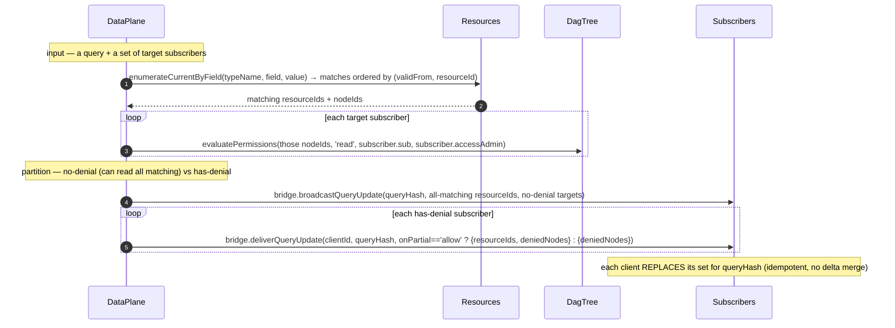
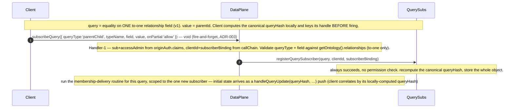
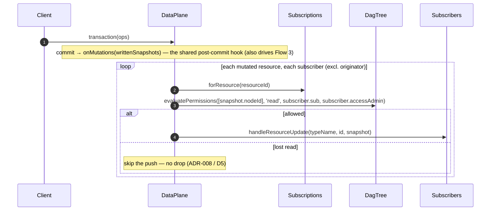
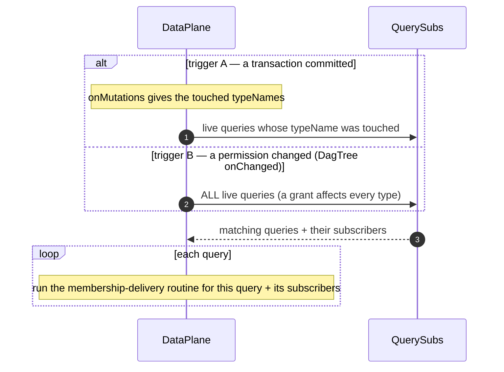

# Nebula — query subscriptions (v1: parent-child)

**Status**: **LANDED + ARCHIVED (2026-06-30)** — all 7 phases (0–6) green + `/build-task` verifier panel PASS (all phases conform); committed on `pre-alpha`. `/review-task` was complete 2026-06-30 (Stage 1 framing + Stage 2 conformance; all findings resolved, D1–D17 pinned — incl. `onPartial` EXCLUDED from `queryHash`, M3, confirmed kept). **Child 2** of the multi-user chat thread ([`nebula-pre-alpha.md`](nebula-pre-alpha.md) § Current focus); **built on Child 1** ([`tasks/archive/nebula-devstudio-data-plane.md`](nebula-devstudio-data-plane.md)), consumed by Child 3 (`reactive-ai-chat`). Frozen on archive (per `tasks/README.md`). Deferred/optional: the user-facing subset of the diagrams may later graduate to `website/docs/nebula/`. See the **Build record + retro** section at the end.

> **Where this is built (read first).** Everything here lands **inside the `ResourceDataPlane` capability** (`apps/nebula/src/resource-data-plane.ts`), which is composed by **both** Star and DevStudio: `QuerySubs` as a new constructor-injected unit (like `Subscriptions`), plus the per-push permission recheck, the `DagTree` batch-eval, and the query rerun (on commit + on permission change) — all **capability** logic, never a host `#broadcast` private. The host DO adds only thin `@mesh` Handler-1 wrappers (`subscribeQuery`, …), `onBeforeCall` (aud-lock), and the bridge that builds the server→client continuations (the capability has no `this.lmz`/`this.ctn`). Building here lands query subscriptions on Star **and** DevStudio (the chat) at once. The diagrams collapse host DO + capability into one **`DataPlane`** lane except where the host boundary matters.

---

## Motivation

We want to subscribe to a **query across Resources**, not just a single Resource. The first concrete need is **parent-child** (Child 3: a chat `Session`'s `Turn`s — `Turn.session == sessionId`).

- **Why not client-side?** The browser-only alternative makes the **parent hold all its children** (a to-many array on the parent). That array grows huge, and every child add **rewrites the whole array** → write amplification on the 1000×-expensive op + an eTag **hotspot** on the parent.
- **Invert it (3NF).** Children point to their parent via a **to-one relationship field**. The parent's collection becomes **derived by query, never stored**. Each child write is one small, independent write — no parent hotspot.
- **v1 supports exactly one query form:** equality on one to-one relationship field (`field == value`; `value` = the parent id), carried as a single object: `subscribeQuery({ queryType: 'parentChild', typeName, field, value, … })`. The **`queryType` discriminant is a public-contract extension point** (D12) — forward-compatible without breaking external apps: richer predicates arrive as a *new* `queryType` (e.g. `'mongoLike'`) that keeps `'parentChild'` frozen; result shapes as per-`queryType` option fields. v1 implements **only** `'parentChild'`.
- **Fanout sends the full current ordered list of matching resource ids** (`resourceIds`, permission-filtered, ordered by `validFrom` — D15), recomputed and re-pushed on every change — **not** deltas. The client **replaces** its membership set with each push, then **lazily per-resource-subscribes** for content (the existing single-resource path). No resource bodies on the query channel. This mirrors the org-tree channel (which pushes the full tree state on every change, not tree-deltas) and is **idempotent / self-healing** — a lost push is repaired by the next one, so there's no baseline marker and no resync (see *Deltas — deferred* below). Membership is a set of **resource ids**; aggregate subscriptions (COUNT/SUM/…) are a different result shape for a later day and get their own value-push, not this channel.

### The two axes

These are **independent** and must never be conflated:

| Axis | What it is | Changed by | Governs |
|---|---|---|---|
| **Relationship field** (e.g. `Turn.session`) | the ontology to-one FK we subscribe on | a `put` that edits the field | **query membership** (which query it matches) |
| **`nodeId`** (DAG/org-tree node) | the resource's permission scope | a `move` op | **permission** (who may see it) |

A `put` that changes the parent field changes *membership* but not permission scope. A `move` changes *permission scope* but not membership. The diagrams keep these on separate channels on purpose.

**Two id spaces — never conflate (the diagrams + prose below keep them distinct):**
- **resource id** — identifies a Resource (a query result — a child). The membership list is a set of these.
- **node id** — a resource's `nodeId`, its DAG **permission scope** (many resources can share one node).

A push carries **`resourceIds`** and/or **`deniedNodes`** (which of the two depends on `onPartial` + whether there are denials — D2): **`resourceIds`** = the **resource ids** the subscriber may read (an **ordered array** — D15); **`deniedNodes`** = the **node ids** denied (for request-access). A resource the subscriber can't read is simply **absent** from `resourceIds` — only its *node id* surfaces, in `deniedNodes`. (`resourceIds`, not `ids`, precisely so it doesn't read as node ids.)

---

## Context — what exists today (post-Child-1 grounding)

- **The capability owns the data-plane.** `ResourceDataPlane` (`apps/nebula/src/resource-data-plane.ts`) composes `DagTree` + `Resources` + `Subscriptions`, owns **Handler 2** (`doTransaction`/`doRead`/`doSubscribe`), and the resource-mutation fanout `#broadcast` (fires per mutated resource → `bridge.broadcastResourceUpdate(resourceId, snapshot, targets)`). The host DO (Star/DevStudio) supplies a **`ResourceHostBridge`** (`deliverTransactionResult`/`deliverReadResponse`/`deliverResourceUpdate`/`broadcastResourceUpdate`) + the ontology via the injected **`getOntology()`** seam. The capability has **no `this.lmz`/`this.ctn`** — all continuation construction is host-side.
- **Single-resource subscribe:** `Subscriptions` (`Subscribers(resourceId, clientId, sub, accessAdmin, subscriberBinding, …)`, `apps/nebula/src/subscriptions.ts`) — `forResource(resourceId)` returns rows incl. **`sub`** + **`accessAdmin`** (subject + the stored `access.admin` claim — both needed for the per-push recheck, D16). On commit, `Resources.transaction` fires `onMutations(writtenSnapshots)` → the capability's `#broadcast`.
- **Ontology relationships:** to-one/to-many relationship metadata is on the compiled ontology version (`OntologyVersionRow.relationships`, `galaxy.ts`; produced by `extractTypeMetadata` → `Relationship { target, cardinality: 'one'|'many', optional }`). The FK lives **inside the structured-clone value**; the query layer extracts it in **JS at write time**, never `json_extract` over the blob.
- **Permission:** `DagTree` (`apps/nebula/src/dag-tree.ts`) holds the org tree + grants in memory; `requirePermission(nodeId, tier)` **throws** over a non-throwing `resolvePermission(view, sub, nodeId, tier): boolean`. **Two admin kinds:** a **Star admin** is a DAG `admin` grant on root — `resolvePermission` honors it (inherits); a **Galaxy/Universe admin** is the `claims.access.admin` flag — `requirePermission` bypasses on it (dag-tree.ts:158) but `resolvePermission` does **not**. So the subscriber recheck must replicate the `access.admin` bypass (D16). The capability's `DagTree` `onChanged` fires the host's tree-broadcast (Star) / no-op (DevStudio); Child 2 also hangs the query rerun (Flow 3, trigger B) off it.
- **Known gap being closed here:** the capability's `#broadcast` does **not** re-check read permission per push (a gap deferred in Child 1). **We close it** (Flow 2 / D3) — and because it's in the capability, the fix protects **both** Star and DevStudio.
- **Index for enumeration: deferred** (D8). Full scans of current snapshots are fine for now (reads cheap; writes ~1000×).

---

## Cast (participants)

| Participant | What it is |
|---|---|
| **Client** | `NebulaClient` in the browser — the **acting** client: subscribes (Flow 1), edits (Flow 2/3), or changes a grant (Flow 3 trigger B). The action identifies its role, so there's no separate "editor"/"admin" actor. |
| **Subscribers** | The `NebulaClient`(s) **receiving** pushes. Each holds query subscriptions + refcounts, **replaces** its membership set (`resourceIds`) on each push, lazily per-resource-subscribes for content, tracks `deniedNodes` for request-access. Server→client pushes ride the per-client Gateway (unchanged transport). |
| **DataPlane** | The **`ResourceDataPlane`** class (in the host DO, Star/DevStudio). Owns the registries + DagTree + Handler-2 + `#broadcast`/`#broadcastQueries` + the query rerun (commit + permission triggers). The host wraps it: thin `@mesh` Handler-1 (`subscribeQuery`, …) + `onBeforeCall` (aud-lock) + the bridge (server→client continuation construction). |
| **Resources** | Snapshot store in the capability: `transaction` / `read` today, plus a **net-new** `enumerateCurrentByField` the query layer needs (built in Phase 3 — the home of the deferred D8 index swap; M1). |
| **Subscriptions** | Existing single-resource `Subscribers` registry (in the capability). |
| **QuerySubs** | **NEW** registry (in the capability), constructor-injected `(ctx, getCallContext, dagTree, resources)` exactly like `Subscriptions`. `registerQuerySubscriber` takes the **whole query object**; keyed by `queryHash` — a **canonical** content hash both client and server compute identically (B1/M3), the content key (like `resourceId` for single-resource subs). Mirrors `Subscriptions`' columns + cleanup (D13). |
| **DagTree** | In-memory permission tree (in the capability). v1 adds one non-throwing, **no-short-circuit** batch primitive — `evaluatePermissions(nodeIds, tier, sub, accessAdmin)` — over the existing `resolvePermission`, honoring the subscriber's stored `accessAdmin` (the `access.admin` bypass, D16). No new `canRead` — `resolvePermission` / the shipped `checkPermission` already cover single-node explicit-sub checks. |

> Mermaid convention: solid `->>` = call / one-way message (incl. server→client push, per ADR-003); dashed `-->>` = return / callback. The **Gateway is omitted as an actor** — it's invariant transport, unchanged by this work. A `DataPlane->>Subscribers` server→client push rides the unchanged per-client Gateway, with the continuation built by the **host bridge** (the capability hands the host the data; the host builds the `this.ctn<NebulaClient>()...` continuation — the capability has no `this.lmz`/`this.ctn`).

---

## Membership-delivery routine — `#broadcastQueries(query, targetSubscribers)`

The single delivery primitive the scenarios reuse, **generic over `queryType`**. Given a **query** and a set of **target subscribers**, it evaluates the query to its **current result set** (matching resource ids), evaluates each target's read permission, then **partitions** — subscribers who can read **every** matching resource share one identical payload (the full `resourceIds`) delivered via the host bridge's `broadcastQueryUpdate` (`svc.broadcast` under the hood, D17); subscribers **with** denials each get an individualized `deliverQueryUpdate` per their `onPartial`. The client **replaces** its set on every push (idempotent, self-healing — no baseline, no resync). The **only `queryType`-specific step** is *evaluating the query to its resources* — v1 `parentChild`: `Resources.enumerateCurrentByField` over current snapshots where `field == value` (a full-scan while D8 defers the index, M1). Everything after (permission eval, partition, deliver) is generic. **Called by Flow 1** (the one new subscriber) and **Flow 3** (each selected query's subscribers, on commit or permission change).



---

## Flow 1 — Subscribe to a query + initial push

Registration **always succeeds** (no permission check) — authorization happens at delivery. The initial state is then delivered to the new subscriber by the **membership-delivery routine** (above), scoped to this one subscriber — mirroring single-resource subscribe (which pushes the first snapshot via `deliverResourceUpdate`, it doesn't return it).



---

## Flow 2 — Post-commit hook + per-push read recheck (D3)

On a successful commit, `Resources.transaction` fires the existing `onMutations(writtenSnapshots)` hook — the **single trigger both channels key off** (this one for single-resource content, Flow 3 for queries). The single-resource content fanout (`#broadcast`) is unchanged **except for one addition**: before each push, recheck the subscriber's read via `evaluatePermissions([snapshot.nodeId], 'read', subscriber.sub, subscriber.accessAdmin)` (D3 — the subscribe-time-only gap Child 1 deferred; explicit-sub, honoring the stored `access.admin` bypass per D16, not `callContext` `requirePermission`). On a failed recheck, **skip the push — never drop the sub** (ADR-008 / D5); readable state returns when access does. Closing the gap in the capability protects Star and DevStudio.



---

## Flow 3 — Query re-push (rerun)

The query channel re-delivers by **rerunning queries**, not by mapping mutations to specific resources. Two triggers, both calling the membership-delivery routine once per selected query:
- **On commit** — `onMutations` gives the **touched typeNames**; rerun each live query whose `typeName` was touched.
- **On a permission change** — `DagTree` `onChanged`; rerun **all** live queries (a grant changes readability across every type, so no typeName filter).

Each rerun re-evaluates the query and pushes the full set; an unchanged result is replaced with itself (a client-side no-op). This reruns more than strictly necessary on purpose — the affected-resource filter and `{added, removed}` deltas are deferred optimizations (over-the-wire cost dominates, both additive — see *Deltas — deferred*). The permission trigger is what closes the **grant hole**: an admin approving a request makes the newly-readable resources appear in the subscriber's `resourceIds`, and the client subscribes to them for content.



---

## Decisions (pinned)

| # | Decision | Choice | Rationale |
|---|---|---|---|
| D1 | v1 query form | Equality on **one to-one relationship field** (`field == value`, value = parent id). The field is **validated against the ontology `relationships` metadata** at `subscribeQuery` time (must exist + be `cardinality: 'one'`). | The first need (parent-child) + forward-compatible name. To-many / arbitrary predicates are later. |
| D2 | `onPartial` (field IN the query object) | `'error' \| 'allow'`, **default `'allow'`**. Governs the **per-push** response shape for a subscriber **who has denials on that push**: `'allow'` → the readable `resourceIds` + the `deniedNodes` (`{ resourceIds, deniedNodes }`); `'error'` → `deniedNodes` only, no `resourceIds` ("can't show this fully"). A subscriber with **no** denials always gets the full `resourceIds` set regardless. Lives inside the query object (each `queryType` carries its own options). | UX-first default: show what you can see plus how to get the rest (D14). `'error'` is the opt-in for "all-or-nothing display." Per-push (not registration) — registration always succeeds, authorization is at delivery. |
| D3 | Close the per-push recheck gap | Add a **per-push DAG read recheck** to the capability's `#broadcast` (Flow 2) — the **existing single-resource** fanout, not just query subs. | Lifting `#broadcast` into the capability (Child 1) carried the subscribe-time-only gap to the chat plane; closing it here fixes **both** Star and DevStudio. Required before Child 3 ships a user-visible chat answer surface. This recheck is **ADR-008's "enforcement at the point of action"** — the control is the check on every push, not secrecy. |
| D4 | Membership push shape + delivery | A push delivers the subscriber's current view per `onPartial` (D2) — `resourceIds` (readable, ordered) and/or `deniedNodes`. **No-denial** subscribers share one identical payload (the full `resourceIds`, no denials) → delivered via **`svc.broadcast`** (the common, uniform-read case — e.g. a flat-permission session). **Has-denial** subscribers each get an individualized push (always carrying `deniedNodes`, node ids, D14, for request-access; plus `resourceIds` iff `onPartial:'allow'`). The client **replaces** its `resourceIds`, so a now-denied resource falls out automatically on the next push. | One shared broadcast for the common case + a per-subscriber tail for the restricted minority. Full-set replace makes "denied" just "absent from `resourceIds`"; the `deniedNodes` drive request-access. |
| D5 | Lost read on recheck → **never drop** | On a failed read recheck (Flow 2), **skip the push and keep the sub** — no drop, no access-lost signal (ADR-008 / never-drop, same as query subs). Readable state returns when access does: the Flow-3 permission rerun grows the query's `resourceIds`, the client subscribes to the newly-allowed resource ids, and content arrives via that fresh per-resource subscribe. The query channel only ever emits `resourceIds` the subscriber may read, so a single-resource sub is **never held against a denied resource** in the first place. | Consistent never-drop across both channels. The **grant** case (the one that matters) is closed by the Flow-3 permission rerun; **revocation** is low-priority (data already on screen, `deniedNodes` is the signal). |
| D6 | Permission-change re-eval scope | On a permission change, **rerun ALL live queries** (Flow 3 trigger B) — in-memory, cheap. Single-resource subs are not re-evaluated (query-driven content refreshes via the rerun; revocation is low-priority, D5). Scope-to-affected-nodes is a later optimization. | A grant touches readability across every type, so all live queries rerun; cheap at v1 scale (permission changes are rare admin actions). |
| D7 | API shape & names | `subscribeQuery(query)` (mesh, **returns void**) / `handleQueryUpdate` (client push) / `unsubscribeQuery`. `query` is a **single object** — `{ queryType, typeName, field, value, onPartial, orderBy }` — with a `queryType` discriminant (v1: `'parentChild'`) and **all options inside it** (no separate `opts` param). The client computes the **canonical `queryHash`** locally and correlates `handleQueryUpdate(queryHash, …)` pushes by it. | `subscribeQuery` parallels `subscribe` (also void); one object (not positional) is the extension seam; the discriminant is present from v1 (D12). **Void**, not an awaited `{queryHash}` return — an awaited value across the client WS is the ADR-003 "thinking-forever" trap (B1). |
| D8 | Enumeration index | **Deferred** — full scan of current snapshots (`validTo = END_OF_TIME`), FK extracted in **JS at write/scan time**, never `json_extract` over the blob. **Do NOT pre-build even an FK-only side-table** — it'd be a stand-in for the real *dev-declared per-type index* feature, re-anchored-then-unlearned (interim tax). Deferral is ~free: full-scan creates **no artifact**, and the future swap is one query behind the unchanged `subscribeQuery` API (the swap query + the per-type side-table shape live in *Considered & declined* below). If perf bites before the real index ships, reach for a **query-sub membership cache** (live-query state), not a general index built blind — whose declaration + schema-evolution design isn't pinnable before real usage. | Reads are cheap in a DO; writes are ~1000×. The query/index layer must key off the **ontology semantic model**, not the storage serialization. The `(typeName, validTo)` *type* index is a separate orthogonal lever (narrows type scans; not the FK index). |
| D9 | "Child of P" disclosure | **Accepted.** The `resourceIds` set discloses "resource X is a child of P"; the real gate is the **per-resource content subscribe** (each resource's snapshot still requires per-resource read permission via Flow 2). | The resource id is low-value vs the content; gating membership too would need an extra per-resource check on enumerate that the content subscribe already enforces. Per **ADR-008**: org/relationship facts aren't confidential within a Star, so the disclosed resource id is not a leak. |
| D10 | Built INTO the capability | `QuerySubs` is a new **constructor-injected** unit in `ResourceDataPlane` (like `Subscriptions`); the per-push recheck (D3), the `DagTree` batch-eval, `#broadcastQueries`, and the permission-change rerun are **capability** logic — **never** a host `#broadcast` private. The host adds only thin `@mesh` Handler-1 wrappers (`subscribeQuery`/`unsubscribeQuery`) + bridge methods. | The Child-1 handoff: lands query subs on **Star + DevStudio at once**; keeps the capability the single home for the data-plane. |
| D11 | `getOntology()` seam widening | Widen the Child-1 seam from `{ version, facet }` to **`{ version, facet, relationships }`** (the `relationships` map on `OntologyVersionRow`). Both providers satisfy it: Star's Galaxy-cached `#ensureFacet` (the row already carries `relationships`), DevStudio's platform constant (`compileOntologyVersion(...).relationships`). | `subscribeQuery` needs the relationship metadata to validate the field; it's already produced by `compileOntologyVersion`, just not surfaced on the seam. |
| D12 | `queryType` discriminant present from v1 (public-contract seam) | The query object carries `queryType` from day one though v1 has ONE type (`'parentChild'`). `subscribeQuery` is a **public API consumed by user-developer app code we don't control** (generated/published apps, dynamic-worker server functions); adding a discriminant later is an **unbounded breaking change** to apps we can't refactor. So the discriminant is a **cheap contract seam** (one field) — distinct from the query *engine* (deferred: implement only `'parentChild'` now). Predicate-richness = a future `queryType` (e.g. `'mongoLike'`), keeping `'parentChild'`'s contract frozen; result shapes = future per-`queryType` option fields with per-type defaults (v1 `'parentChild'` default = the full `resourceIds` set). An unknown `queryType` must **fail closed** (clear error), so an app on a newer type gets a clean failure, not garbage. | **Seam-now / engine-later:** the index-deferral logic (build the *impl* when there's signal) is about *implementation*; a **public-contract seam must exist up front** because external callers can't be migrated — anticipating the evolution axis *at the seam* is exactly good evolvability design. |
| D13 | `QuerySubs` mirrors `Subscriptions` (conventions AND code) | Build `QuerySubs` (`apps/nebula/src/query-subscriptions.ts`) as a near-clone of `Subscriptions` (`subscriptions.ts`): same constructor injection `(ctx, getCallContext, dagTree, resources)`; same `clear()`→`Array<{subscriberBinding, clientId}>` / `all()`; same columns `clientId, sub, subscriberBinding, subscribedAt`, **plus `accessAdmin`** (D16 — added to `Subscribers` too); **`sub` + `accessAdmin` derived from `getCallContext().originAuth` inside the registry (the `sub` and `claims.access.admin`), never params**; `INSERT OR REPLACE`, `WITHOUT ROWID`, deploy-driven `clear()` cleanup; dead-client cleanup follows the same `onBroadcastResult` reactive pattern. **Deliberate divergences:** (1) the add/remove pair is **`registerQuerySubscriber` / `removeQuerySubscriber`** (fully qualified) — the public surface is `@mesh() subscribeQuery`, so the internal ops must read as internal; the qualified names also disambiguate from `Subscriptions.removeSubscriber` at the shared `onBroadcastResult` cleanup site (it drops dead clients from BOTH registries); (2) the content key is **`queryHash` + a `query` blob**, not a bare `resourceId`; (3) `registerQuerySubscriber` **always succeeds** — no permission check at registration (authorize at delivery, D2/D4); (4) live-query selection is a **scan** (by touched `typeName` on commit, or **all** on a permission change), not a per-mutation match (D8 / Flow 3); (5) delivery splits into **`broadcastQueryUpdate`** (no-denial, shared `svc.broadcast`) + a per-subscriber **`deliverQueryUpdate`** loop for has-denial ones (D17/D4) — **both** attach a 4-arg `onResult` so dead-client cleanup (`onBroadcastResult`→`removeQuerySubscriber`) reaps has-denial rows too (m6), not just the broadcast path; (6) the Handler-1 wrapper derives `clientId`/`subscriberBinding` from `callChain` (m2/m3), distinct from the registry's `sub`/`accessAdmin` from `originAuth`. | Minimize new vocabulary + single-source-of-truth: the single-resource subscription already solved subscriber storage, identity, broadcast, and dead-client cleanup. A parallel design is easier to review, and a future refactor could extract a shared base. |
| D14 | `deniedNodes` always disclosed (query subs) | A has-denial subscriber is **always** sent `deniedNodes` (the denied node ids) — both `onPartial` modes disclose them (they differ only in whether `resourceIds` accompany) — which drives the non-modal request-access prompt. The query-sub application of **ADR-008**. | Per **ADR-008** (denied set always disclosed; enforcement at the point of action, not tree/relationship secrecy). UX-first: silent partial results are the worse failure mode. |
| D15 | Result ordering | `resourceIds` is an **ordered array** (not a set). `orderBy` is a query-object option (the forward-compat seam); **v1 accepts only `'validFrom'`** (the default). Other keys (e.g. `'id'`) are **additive future values** — adding an enum value is non-breaking, so v1 stays minimal with no speculative value (D12 logic applied to values, not just the field). **`validFrom` is server-stamped** (the DO's clock — `#calculateValidFrom`), so it's **clock-skew-free across clients** and **≈ chronological** for append-only data (chat turns). v1 orders by **`(validFrom, resourceId)`** — `resourceId` is a free, deterministic **tiebreaker** (the leading PK column), needed because `validFrom` ties are **guaranteed** for resources co-created in one transaction (`Date.now()` is pinned per invocation, `[[cf-clock-traps]]`) and possible cross-transaction at the same ms (a global `validFrom` HWM is deferred — backlog). This tiebreaker is NOT the deferred `orderBy:'id'` value. Ordering costs a **sort** of the matched set M (`validFrom` is the PK's *second* column; O(M log M) on top of the full-scan it rides — a future `validFrom`-leading index, deferred with D8, removes it; a future `'id'` value would be free, being the leading PK column). **No asc/desc in v1** — the full list ships every push, so the client reverses locally; direction only matters for paging (deferred). | Ordering must be **server-side** so the client can **window** (hydrate only the rendered first/last N) instead of fetching the whole list to sort. `validFrom` beats a client ULID precisely because it's server-stamped (no clock skew) — and it needs **no change to the client-supplied-id model** (ADR-005 / ids are never server-generated). Widening `orderBy` to arbitrary declared fields waits on the index (D8); stable *creation* order under edits (first-snapshot `validFrom`) is a later refinement (moot for append-only chat). |
| D16 | Replicate the `access.admin` bypass for subscribers | The per-push recheck + `evaluatePermissions` run with an **explicit subscriber `sub`** (the subscriber is not the live caller), so they use `resolvePermission`, which honors DAG grants (incl. a **Star** `admin` grant) but **NOT** the Galaxy/Universe **`claims.access.admin`** bypass `requirePermission` applies (dag-tree.ts:158). To avoid silently denying a Galaxy/Universe admin who holds no DAG grant, **store the `access.admin` claim** (`originAuth.claims.access.admin`, a boolean) on each subscriber row at subscribe time — **both `Subscribers` and `QuerySubscribers`** — and pass it to `evaluatePermissions` (set → all allowed). | Without it the recheck diverges from the mutation path (`requirePermission`) — the exact hole D3 exists to close, and a latent one for **single-resource** subs too (hence the fix lands on both registries). **Star** admins need nothing (their DAG grant resolves normally). Applies identically on Star + DevStudio (both compose the capability; DevStudio is a Galaxy-level `{u}.{g}.dev` instance with a DAG-gated resource surface). **Demote direction (accepted for v1, self-heals ≤900s):** `access.admin` is a JWT claim, not a DAG grant, so demotion doesn't fire `onChanged` — but it self-heals within one `ACCESS_TOKEN_TTL` (900s, nebula-auth `types.ts:148`) via a verified chain, no manual step: at `exp` the **gateway force-closes the WS** (`ws.close(4401, 'Token expired')`, lumenize-client-gateway.ts:333/489) → the client **reconnects + `#resubscribeAll()`** (nebula-client.ts:400-414) → **refresh re-derives `access.admin` from the live `Subjects.isAdmin`** (`#generateAccessToken`, nebula-auth.ts ~1388), so the demoted admin's new token drops it → re-subscribe stores `accessAdmin = false` (also cleared on deploy `clear()`). 15 min is an accepted window (rare admin action, consistent with the never-drop revocation latency, D5). Phase 5 tests the re-subscribe-clears-it path. |
| D17 | Query-delivery bridge methods (host-side) | The capability has no `this.lmz`/`this.ctn`, so query pushes go through the **host bridge** (like Child-1's `deliverResourceUpdate`/`broadcastResourceUpdate`). Add **two** methods, implemented by **both** Star and DevStudio: `broadcastQueryUpdate(queryHash, resourceIds, targets)` (the no-denial shared-payload group, `svc.broadcast` under the hood) and `deliverQueryUpdate(clientId, queryHash, { resourceIds?, deniedNodes })` (one has-denial subscriber). Both attach a 4-arg `onResult` so dead-client cleanup (`onBroadcastResult`→`removeQuerySubscriber`) covers the has-denial path too (m6). The capability hands the host the partitioned data; the host builds the `this.ctn<NebulaClient>()…handleQueryUpdate(…)` continuations. | The existing `broadcastResourceUpdate` is shared-payload only — it can't carry the per-subscriber has-denial payload. Naming both keeps mesh primitives OUT of the capability (the diagrams' `broadcastQueryUpdate`/`deliverQueryUpdate` are host-bridge calls, not capability code) and gives the restricted-minority path the dead-client cleanup it would otherwise lack (m6). |

> **Considered & declined (2026-06-30) — model relationships as nodes+edges (join tables).** For 1:N the FK rides free on the child, M:N is YAGNI, and an edge costs an extra row write per relationship + re-litigates ADR-006 (relationships ARE FK-by-id). The one real *pro* — edges give indexable columns without blob-extraction — doesn't pay: non-FK fields need that extraction anyway, so the FK is just one more extracted column. **Future index = a per-type extracted-index-columns side-table** (a narrow secondary index of `resourceId` + declared columns over the *current* snapshot, leaving the temporal `Snapshots` blob untouched); D8's full-scan swaps to `SELECT resourceId FROM idx_<T> WHERE field=?` then — same API. Revisit nodes+edges only if true M:N + edge-attributes become a real requirement.
>
> **The clarifying frame (2026-06-30):** three *distinct* concerns, each its own solution — **(1) 1:N relationship** = NOW (FK-on-child + this query-sub); **(2) M:N relationship** = deferred (edges/join table, only when a real M:N + edge-attributes need appears); **(3) plain index extraction** = deferred (the per-type extracted-index side-table). Conflating them is what made nodes+edges look attractive. **No cost-of-delay on the two deferred** — both are purely additive behind a stable API, so building them early only risks an interim, never saves one.

---

## `QuerySubs` table schema (in the capability)

Mirrors `Subscribers` (write-cost discipline per `durable-objects.md`):

```sql
CREATE TABLE IF NOT EXISTS QuerySubscribers (
  queryHash         TEXT NOT NULL,   -- stable hash of stringify(query) — the content key, analogous to resourceId for single-resource subs
  query             TEXT NOT NULL,   -- the full query object, structured-clone-stringified (queryType+typeName+field+value+onPartial+orderBy); parsed in Flow 3 to read its typeName + re-evaluate
  clientId          TEXT NOT NULL,
  sub               TEXT NOT NULL,   -- subject — for the per-push read recheck
  accessAdmin       INTEGER NOT NULL DEFAULT 0,  -- boolean 0/1: the access.admin claim at subscribe time (Galaxy/Universe scope-admin bypass, D16); NOT a Star DAG admin grant
  subscriberBinding TEXT NOT NULL,
  subscribedAt      TEXT NOT NULL,
  PRIMARY KEY (queryHash, clientId)
) WITHOUT ROWID;
```
- **`queryHash`** = a **canonical** content hash over a **normalized tuple in fixed field order** (`[queryType, typeName, field, value, orderBy]`, defaults normalized) — **sync** (NOT async `crypto.subtle`, to stay in the synchronous register path; a non-crypto hash is fine). **Computed identically on client and server** from the **shared** isomorphic `@lumenize/structured-clone` `stringify` + the shared sync hash util — so the client keys its handle **locally** and `subscribeQuery` is **void** (no awaited return across the WS, ADR-003 / B1), and every `handleQueryUpdate(queryHash, …)` push correlates by it. Canonical (NOT raw `stringify`, which preserves key insertion order — `stringify` gives ADR-002 round-trip fidelity, not canonical hashing) so logically-equal queries — reordered keys, present-vs-omitted `onPartial`/`orderBy` — collapse to ONE `queryHash` (coalesces the broadcast partition + makes re-subscribe idempotent, no duplicate live row — M3). The content key, as `resourceId` is for `Subscribers`. The whole object is still stored in `query` (for Flow-3 re-eval); `onPartial` is read at **push** time (D2).
- **Live-query selection** (Flow 3) — **scan** QuerySubscribers grouped by `queryHash` (parse each `query` for its `typeName`): on commit, the queries whose `typeName` ∈ the commit's touched types (= `new Set([...writtenSnapshots.values()].map(s => s.meta.typeName))`, already available from the `onMutations` payload — `resources.ts`); on a permission change, **all** live queries. No per-mutation matching. A scan of the (small) subscription table — consistent with D8 (reads cheap; a decomposed-column index is the deferred optimization). All clients of a query = the rows sharing its `queryHash`.
- Methods mirror `Subscriptions` (D13). The **Handler-1 wrapper** derives `clientId` (`callChain[0].instanceName`) + `subscriberBinding` (`callChain.at(-1).bindingName`) — with throw-if-missing guards, same as `subscribe` (m2) — and passes them in; the registry computes the canonical `queryHash` + derives `sub` and `accessAdmin` from `getCallContext().originAuth` (the `sub` and `claims.access.admin`, D16). `removeQuerySubscriber(queryHash)` takes `clientId` from `callChain[0].instanceName` too — **never a param**, so a client can only drop its OWN row (m3). `clear()`→`Array<{subscriberBinding, clientId}>` (ontology-install/deploy cleanup) / `all()` (the Flow-3 rerun selection). `INSERT OR REPLACE`, `WITHOUT ROWID`, `subscribedAt = new Date().toISOString()`.
- **`clear()` recovery (m1):** a new-version ontology install drains **both** `Subscribers` and `QuerySubscribers` `clear()` returns, **unions by `(subscriberBinding, clientId)`**, and pushes **one** `OntologyStaleError` per client (wired in `Star.#installState`) — so a query-sub client gets the same stale signal single-resource clients do, and a client on both registries isn't double-signaled. A query sub spans types, so an install almost always invalidates it.
- The hash key makes the schema **query-shape-agnostic** — a future `queryType` needs NO schema change (the discriminant rides inside the hashed object), and the cross-`queryType` collision question dissolves (distinct types hash distinctly). D12's discriminant is the API/wire seam; the hash is its shape-agnostic storage realization.
- `INSERT OR REPLACE` keyed by the compound PK — idempotent, 1 billed write.

## `DagTree` batch-eval API (additive, non-throwing)

```ts
// Non-throwing, explicit-sub, NO short-circuit — evaluate ALL nodeIds so the denied node set is complete (drives request-access).
// accessAdmin = the subscriber's stored `access.admin` claim (Galaxy/Universe scope-admin): if true, all allowed — the
// requirePermission bypass replicated for a subscriber who is NOT the live caller (D16). Otherwise resolvePermission per
// node, which already honors a Star DAG `admin` grant.
evaluatePermissions(nodeIds: number[], tier: PermissionTier, sub: string, accessAdmin: boolean):
  { allowed: Set<number>; denied: Set<number> };
```
Distinct from `requirePermission(nodeId, tier)` (throws, reads the **live caller's** `callContext`): `evaluatePermissions` takes an **explicit `sub`** (the subscriber, not the caller), never throws, and replicates `requirePermission`'s `access.admin` bypass via the **stored** `accessAdmin` (we don't have the subscriber's live JWT at push time — D16). Built on the same in-memory `#_view` / `resolvePermission` (and the shipped non-throwing `checkPermission` for any single-node explicit-sub check — no new `canRead`).

## Client-side query-subscription handle

`client.resources.subscribeQuery({ queryType: 'parentChild', typeName, field, value, onPartial, orderBy }): QuerySubscription` — a `using`-compatible handle:
- `subscribeQuery` is **void** (ADR-003); the client **computes the canonical `queryHash` locally** (shared `@lumenize/structured-clone` stringify + sync hash) and keys the handle under it before firing. Initial state and every update then arrive the same way — a `handleQueryUpdate(queryHash, …)` push carrying `resourceIds` and/or `deniedNodes` (per `onPartial`, D2).
- holds the **membership set** (`resourceIds`, an **ordered array** of resource ids — D15); **replaces** it on each push (idempotent — no delta merge, no dedup);
- **lazily per-resource-subscribes** the resources it's **rendering** (a window of the ordered list — first/last N for large sets) for content via the existing `subscribe` path (refcounted — shares rows with direct single-resource subs); drops a per-resource sub when an id leaves what it renders (left the query's set, or scrolled out of view). The existing **~2s unsubscribe grace** makes this **flicker-free** — an id that leaves and returns within the window (membership churn or a scroll bounce) keeps its live content sub, so no extra debounce is needed;
- exposes **`deniedNodes`** (the denied node ids) for the non-modal request-access UI;
- `[Symbol.dispose]()` refcounts down → `unsubscribeQuery` on the last handle (mirrors `subscribe`).

---

## Deltas — deferred (future optimization)

v1 ships **full-set** membership pushes (above) — simplest, idempotent, self-healing, and consistent with the single-resource + org-tree channels (all push full state, defer deltas). Incremental `{ added, removed }` deltas are a **scale optimization** for later (huge sets where re-sending the whole id-list per change costs too much wire, or re-enumerating per change costs too much server compute once the index lands). Deferring costs **no optionality**, because the path is already infra-light:

- **Catch-up deltas (after a gap):** the snapshot history **IS the change-feed** (ADR-004) — compute exact adds + removes by temporal-diffing the set **as-of a baseline `validFrom`** vs now (`WHERE validFrom <= B AND validTo > B AND field==value` vs current). `B` is a **client-tracked high-water mark of every observed `validFrom`** (NOT the max of its current set — removed resources aren't in it), paired with **server-side global `validFrom` monotonicity** (a global high-water mark — see backlog *`validFrom` global monotonicity*). No separate change-feed, no materialized view.
- **Steady-state deltas (while connected):** pair with the deferred affected-resource filter — compute the per-mutation old/new field diff to emit `{ added, removed }` directly instead of rerunning + full-set pushing. (Both deferred together; v1's rerun pushes the full set.)

Both are purely additive behind the `subscribeQuery` / `handleQueryUpdate` API — adopt if/when scale demands it.

---

## Build phases (all into `ResourceDataPlane` → land on Star + DevStudio)

Each phase is independently valuable + testable on **both** hosts (the e2e exercises DevStudio's Session/Turn since that's Child 3's consumer; Star coverage rides the existing baseline suites).

- **Phase 0 — Widen `getOntology()` to `{ version, facet, relationships }` (D11).** Both providers (Star Galaxy-cached, DevStudio constant) return `relationships`; capability stores it for field validation. *Success (capable-of-failing):* both providers return the `relationships` map with `Turn.session` as `cardinality:'one'` (mutation: a provider returns `{ version, facet }` without `relationships` → field validation has nothing to check → red).
- **Phase 1 — `DagTree` batch-eval (`evaluatePermissions`).** Non-throwing, no-short-circuit, explicit-sub, honors the `accessAdmin` flag (D16). *Success (capable-of-failing):* matches `resolvePermission` per (sub, node) for non-admins; returns the COMPLETE denied set — assert **≥2** denied nodeIds appear in one call (mutation: return on first denial → only the first appears → red, n2); `accessAdmin:true` → all allowed even with **no** DAG grant (mutation: ignore `accessAdmin` → a Galaxy/Universe admin with no grant is denied → red); a Star DAG `admin` grant resolves allow-all through `resolvePermission` with `accessAdmin:false`.
- **Phase 2 — Close the recheck gap (Flow 2 / D3): per-push read recheck in `#broadcast`.** Before each push, gate via `evaluatePermissions([snapshot.nodeId], 'read', sub, accessAdmin)`; on failure **skip the push, keep the sub** (no drop, D5). Store `accessAdmin` on the `Subscribers` row at subscribe time (D16). *Success (capable-of-failing):* a subscriber whose read grant is revoked stops receiving content pushes but its sub row remains (mutation: remove the recheck → revoked subscriber still gets the push → red); **a `claims.access.admin` subscriber with no DAG grant still receives pushes** (mutation: ignore stored `accessAdmin` → admin denied → red). Runs on Star **and** DevStudio.
- **Phase 3 — `Resources.enumerateCurrentByField` + `QuerySubs` registry + `subscribeQuery` surface + initial push (Flow 1).** Build the enumeration primitive `Resources.enumerateCurrentByField(typeName, field, value): {resourceId, nodeId, validFrom}[]` (scan current snapshots of `typeName`, parse each `value`, JS-filter `value[field]===value`, order by `(validFrom, resourceId)`; the D8 swap home, M1). New `QuerySubs` registry; thin `@mesh()` Handler-1 `subscribeQuery(query)` (**void**) / `unsubscribeQuery` on Star + DevStudio (deriving `clientId`/`subscriberBinding` from `callChain`, m2/m3) dispatching into the capability; **validate the query object** (`queryType === 'parentChild'` — unknown `queryType` **fails closed**, D12; `field` is a to-one relationship per `relationships`); **register always succeeds** (no permission check), then deliver initial state via the routine, ordered by **`(validFrom, resourceId)`** (D15). *Success (capable-of-failing):* `enumerateCurrentByField` returns only current rows of that type whose parsed `field` matches (excludes superseded / deleted / other types — mutation: drop the `value[field]` filter → leak → red), ordered by `(validFrom, resourceId)` with co-created (same-`validFrom`) rows broken by `resourceId`; `subscribeQuery` returns **void**, the client correlates by its locally-computed `queryHash`, and the new subscriber receives an initial `handleQueryUpdate`; a no-denial subscriber gets the full `resourceIds`; a has-denial subscriber gets `deniedNodes` (plus `resourceIds` iff `onPartial:'allow'`); **register succeeds even when every match is denied** (just `deniedNodes`, no rejection); reordered-keys / present-vs-omitted-default queries produce the **same** `queryHash` + a single row (M3); a non-to-one `field` rejects; an unknown `queryType` rejects cleanly; post-`clear()` a query-sub client receives one `OntologyStaleError` (m1 — mutation: skip query-sub clients in `#installState` → stale empty handle → red).
- **Phase 4 — Query rerun on commit (Flow 3, trigger A): `#broadcastQueries`.** On commit, select live queries whose `typeName` ∈ the touched types; run the membership-delivery routine per query (re-evaluate + partition + deliver, ordered by `(validFrom, resourceId)`). No old/new plumbing, no affected-resource mapping. *Success (capable-of-failing):* create / reparent-in / delete / reparent-out each yield the correct **full `resourceIds`** (in `(validFrom, resourceId)` order) at every no-denial subscriber + the correct `resourceIds`/`deniedNodes` at each has-denial subscriber (client replaces); the **delivery split** holds — no-denial via `broadcastQueryUpdate`, has-denial via per-subscriber `deliverQueryUpdate` (mutation: send the no-denial payload to everyone → a has-denial subscriber sees denied `resourceIds` → red); a mutation to an **unrelated `typeName`** triggers **no** push to this query (mutation: drop the touched-type filter → an unrelated write pushes here → red); a content-only edit reruns + pushes the (unchanged) `resourceIds` → client no-op; a read-denied resource is **absent** from `resourceIds`; re-applying the same push is idempotent; ordering is deterministic across reruns/subscribers (the `(validFrom, resourceId)` key, so co-created rows don't shuffle between pushes — m4/m5).
- **Phase 5 — Query rerun on permission change (Flow 3, trigger B / D6).** Capability hangs an **all-live-queries** rerun off the `DagTree` `onChanged` (in addition to the host hook); no drops anywhere (D5). *Success (capable-of-failing):* **granting** access with no subsequent resource write makes the newly-readable resources appear (ordered) in the subscriber's `resourceIds` (the grant hole — the case that matters); **revoking** shrinks `resourceIds` + adds the node to `deniedNodes`; the rerun covers **all** live queries, not only a touched type (mutation: skip the permission trigger → an approved upgrade doesn't update the screen → red); **demote direction (D16):** an admin holding only `accessAdmin` (no DAG grant) who re-subscribes with a non-admin token has the stale `accessAdmin` cleared and stops receiving (mutation: keep the stale `accessAdmin` on re-subscribe → ex-admin still receives → red) — immediate-on-demote is *not* a v1 guarantee (accepted, ~900s `ACCESS_TOKEN_TTL` bound).
- **Phase 6 — Client `subscribeQuery` handle + e2e.** Client computes the canonical `queryHash` locally + keys the handle (subscribe is void); set-replace on each push, **ordered** list, **windowed** lazy per-resource subscribe (hydrate only the rendered window; drop on leave with the ~2s grace), refcount, denied-set. *Success:* two-client parent-child e2e on DevStudio driving the **public `client.resources.subscribeQuery`** (not a `callXxx` initiator — the unit under test is client-side membership/refcount/window state, m7) — client A subscribes `Turn where session==S`; client B creates/deletes/reparents Turns; A's `resourceIds` holds the correct full membership **in `(validFrom, resourceId)` order** after each change + content arrives via the lazy per-resource subs **for the rendered window only**; a resource A loses read on falls out of A's set; an id that leaves and returns within the grace window keeps its content sub — **no flicker**.

### Final verification (every phase)
- `npx vitest run` green (pool-workers projects) + `tsc --noEmit` clean; capable-of-failing assertions mutation-verified.
- No host `#broadcast`-private query logic (D10) — the registry/recheck/`#broadcastQueries`/rerun live in `resource-data-plane.ts`: `grep -nE 'QuerySubscribers|#broadcastQueries|evaluatePermissions' apps/nebula/src/star.ts apps/nebula/src/dev-studio.ts` returns no matches. Conversely the hosts DO implement the bridge methods (D17): `grep -nE 'broadcastQueryUpdate|deliverQueryUpdate' apps/nebula/src/star.ts apps/nebula/src/dev-studio.ts` finds both in each.
- Nuggets extracted into `nebula-pre-alpha.md`; archive on landing.

## Open questions (genuinely still open)
- **Permission-change rerun cost:** a grant change reruns + full-set-re-pushes **every** live query (D6). Confirm that's cheap at v1 scale, or scope to affected nodes later (a grant on node N only affects queries with a resource under N).

---

## Build record + retro (2026-06-30)

**What shipped** (all in the `ResourceDataPlane` capability → Star + DevStudio at once; hosts add only thin Handler-1 wrappers + the two bridge methods):
- P0 seam widened to `{version,facet,relationships}`; P1 `DagTree.evaluatePermissions`; P2 per-push recheck in `#broadcast` + `accessAdmin` on `Subscribers`; P3 `Resources.enumerateCurrentByField` + `QuerySubs` registry + canonical `queryHash` (`query-hash.ts`) + `subscribeQuery`/`unsubscribeQuery` + bridge methods + Flow-1 initial push; P4 commit rerun (`#rerunQueriesForCommit`); P5 permission-change rerun off `DagTree.onChanged`; P6 client `subscribeQuery` handle (membership replace + windowed lazy content subs with grace + refcount + reconnect re-subscribe) + two-client e2e.
- New tests (baseline): `child2-recheck`, `child2-query-subs`, `child2-query-rerun`, `child2-query-permission`, `child2-query-e2e`, `child2-query-window`; + `dag-tree` (evaluatePermissions) and `dev-studio` surface freeze.
- **Verification:** 346 green (baseline+dev-studio+unit) + the query suites; `tsc` clean; every headline capable-of-failing assertion mutation-verified red. `/build-task` verifier panel: **all 7 phases conform**.

**Two adopted mid-build (not in the original plan):**
- **SQL migration via `@lumenize/sql-migrations`** (NOT a hand-rolled try/catch ALTER — we're in prod). The `accessAdmin` column add is `Subscribers` migration id-2 (id-1 = frozen baseline). Required restoring the package's `markerKey` knob (dropped during vendoring) so per-component runners in one DO don't collide — see [[sql-migrations-marker-key]]. `Subscriptions` is the 2nd consumer.
- **`queryHash` = FNV-1a-64** (standard algorithm from spec), not the ad-hoc hash first written. No sync hash exists in the JS stdlib/Workers runtime (`crypto.subtle` is async and would break the compute-locally-before-firing design); 64-bit so a collision can't merge two queries' subscriber sets.

**Retro (per `/build-task`):**
1. *Learned* — (a) per-component DO migrations need distinct marker keys (composition pattern); (b) a self-healing/idempotent end-state hides transient-path behavior from end-state assertions (the no-flicker grace) — assert on the transient surface instead (now a `testing.md` bullet); (c) `onPartial` is per-subscriber (excluded from `queryHash`, D2/M3), so the delivery routine reads it per-target, not from the query arg.
2. *Struggled with* — the Phase-6 no-flicker e2e wasn't capable-of-failing (a membership rerun re-reconciles the window and re-subscribes, masking the churn); moved it to a Star `inspectSubscribers` test that observes the churn directly.
3. *Unexpected test failures* — both were test-authoring bugs, not code: a `createSubject` 401 (passed `''` for the access token) and a loses-read e2e that granted ROOT read (which **inherits** to child nodes, so revoking a child grant didn't deny — fixed with sibling nodes).
4. *Follow-on* — Child 3 (`reactive-ai-chat`) builds directly on this (turn = child Resource FK'd to Session; the per-id recheck already enforces participant DAG grants). `QuerySubscribers` stays on `CREATE IF NOT EXISTS` until its first ALTER, then adopts a runner with its own `markerKey`. Deferred D8 index + deltas unchanged.
5. *Process* — concrete edits made: `testing.md` (self-healing-end-state failure mode), `workflow.md` (extend the invisible-char grep to NUL — the verifier panel caught a stray `U+0000` an `Edit` injected into a template key that compiled+passed tests), and the `sql-migrations` package README/ATTRIBUTIONS for the `markerKey` knob.
