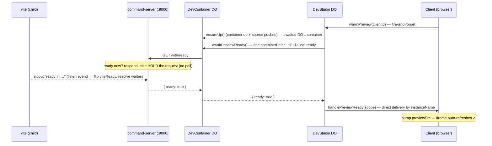

# Preview auto-refresh — event-driven "preview ready" signal (no polling)

**Status: DONE + shipped + deployed (2026-06-29) — ARCHIVED, frozen.** Built this session (`d191d0e`),
verified in-suite (mutation-checked) + ui-smoke 4/4, live on prod. Open follow-ons (container recovery
after a deploy; silence the preview vite reconnect-storm) tracked in `backlog.md` § Nebula + the
[[cf-container-stuck-flag-cloud]] memory. Everything below is the original design (approach (b) + no-poll).

## Problem
On a **full refresh into a dev star**, `connect()` ([App.vue:171](../apps/nebula-studio-ui/src/App.vue))
sets the preview iframe straight to `/dev-container/{star}/` (the cold waking page) and `nudgeNextStep`
returns early (already in a dev star) — so **nothing fires `ensureUp`, nothing senses readiness, nothing
refreshes.** The user sees "warming up… hit Reload" with no idea when "a while" is done. (The `openStar`
path does auto-refresh, but via a backgrounded awaited `callRaw` a WS drop mid-boot would strand.)

## Design — readiness propagates as an event, end to end (zero polling)
The command-server (`:9000`) is **vite's supervisor** — it `spawn`s vite as a child and pipes its stdout
([command-server.mjs:36](../apps/nebula/container/command-server.mjs)). So the container observes vite's
**ready event** directly (vite prints `ready in …` / `Local:` on listen). No port-poll, no platform
port-check.

**No polling anywhere:** vite's listen event → cmd-server resolves the held `/vite/ready` → DevStudio's
single await returns → one-way push to the client → iframe bumps. Nobody asks twice. The push is addressed
by the client's stable `instanceName`, so it survives a WS reconnect during the boot (same as `onChatResult`).

## Phases (commit at each green checkpoint)
1. **Container image** (`command-server.mjs`): watch vite child stdout for the ready marker → set a
   `viteReady` flag + resolve pending waiters; reset on `vite/stop|restart`. Add `GET /vite/ready` —
   immediate `{ready:true}` if ready, else hold the response until the event (bounded by a safety timeout →
   `{ready:false}`). Image rebuild (deploy + ui-smoke build it).
2. **DevContainer**: `@mesh awaitPreviewReady()` → one `#cmdJson('/vite/ready')` (held until ready).
3. **DevStudio**: `@mesh warmPreview(clientId)` — `ensureUp()` → `awaitPreviewReady()` → fire
   `handlePreviewReady(scope)` to `clientId` via `NEBULA_CLIENT_GATEWAY` (direct delivery, no `newChain`).
   Readiness unconfirmed (timeout/throw) still signals — the iframe load + manual Reload fallback cover it.
4. **NebulaClient**: `warmPreview()` initiator (one-way, passes own `instanceName`) + `@mesh
   handlePreviewReady(scope)` → invokes an `onPreviewReady(scope)` config callback.
5. **App.vue**: pass `onPreviewReady` to `createNebulaClient` (bump `previewSrc` if still on that scope);
   fire `client.warmPreview()` on `connect()`-into-dev **and** in `openStar` (unify both paths). Keep the
   static waking page + manual Reload as the missed-signal fallback (NO auto-reload polling → preserves the
   2026-06-27 stuck-container regression fix).

## Acceptance criteria
- [x] Capable-of-failing in-suite test (`nebula-client-preview-ready.test.ts`): `warmPreview` fires + `handlePreviewReady` invokes `onPreviewReady` by scope, via the baseline gateway path. **Mutation-checked**: gutting the callback reddens via timeout.
- [x] No polling anywhere — readiness is vite's stdout event → held `/vite/ready` → single awaited call → one-way push.
- [x] Nebula pool-workers projects 497/497; nebula package type-check clean (exit 0).
- [x] **`ui-smoke` 4/4** — login flow now asserts the preview auto-refreshes (src gains `?t=`) with NO manual Reload click (capable-of-failing: without `warmPreview→onPreviewReady` nothing bumps it → times out); codegen-loop still green on the rebuilt container.

## Boundary
Container image + mesh + UI; verifiable in-suite (mesh-level) + `ui-smoke` (real readiness). Distinct from
the parked observe-first container-*recovery* (stuck-flag) work. Stop/resync if a phase can't go green.
