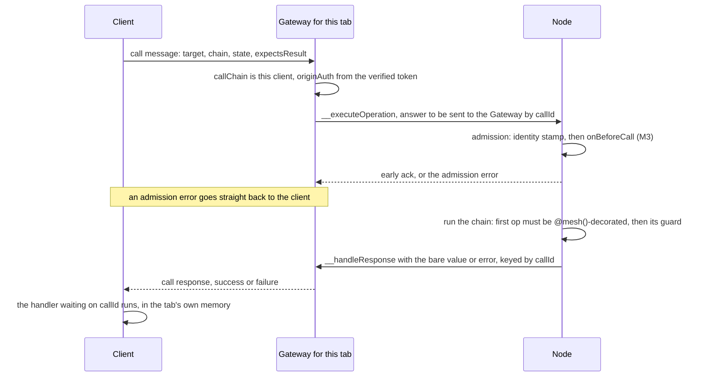
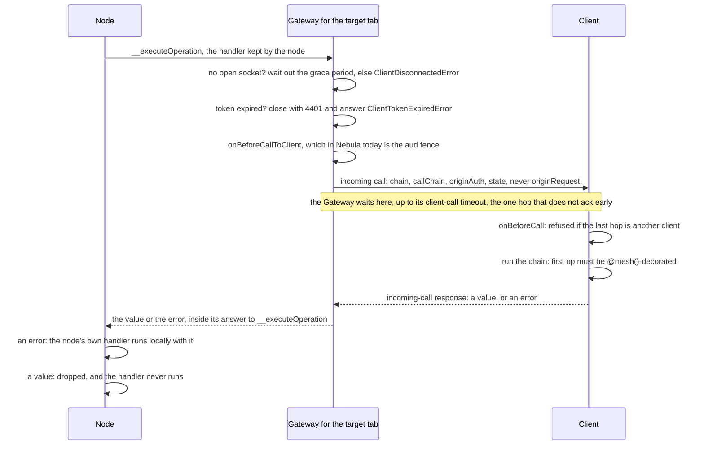

# Calls to and from a client

**Status:** Diagrams drafted but not reviewed by Larry. Each one draws what the code does today, read from source on
2026-09-29. The first two flows are drafted;
§ *Flows still to draw* lists the rest. [nebula-scope-moves-to-subdomain.md](nebula-scope-moves-to-subdomain.md)'s
Phase 2 changes this surface — it deletes the Gateway's `aud` fence and makes every subscription
update start a fresh call chain — so that file's Stage 2 waits for this one. Currently working on prose of what's true today with Larry. After that comes design intent, with Larry.

## What's true today?

### Access token claims

This is the token a Galaxy admin holds today while working on one of their tenants. The type
`NebulaJwtPayload` in `packages/nebula-auth/src/types.ts` defines it, and each comment names the ADR
that decides the claim:

```jsonc
{
  "iss": "https://nebula.lumenize.com",  // NEBULA_AUTH_ISSUER; the verifier refuses any other
  "sub": "8f3c…",             // the membership, a dotless UUID, and the only key (ADR-013)
  "aud": "acme.crm.bigco",    // activeScope. Today the client names it when it refreshes, and
                              // the refresh mints it only at or below authScope (ADR-022)
  "access": {
    "authScope": "acme.crm",  // the membership the token rests on. Today that is the scope in
                              // the refresh cookie's path, /auth/acme.crm (ADR-022)
    "scopeAdmin": true        // omitted when false. Dominion is this bit AND a scope covering
                              // the target, never the bit alone (ADR-015)
  },
  "profileId": "1a9d…",       // the person's public profile address, display-only (ADR-012, ADR-013)
  // "act": { "sub": "…", "profileId": "…" },
                              // only on an impersonation token, naming who is driving. It is
                              // traceability, never an input to authorization (security.md)
  "exp": 1790693100,          // iat + 900: a token lives 15 minutes
  "iat": 1790692200,
  "jti": "…"                  // a UUID
}
```

Two differences from ADR-022's target matter to this file:

- **Passage and dominion read `authScope` today, not `aud`** (`requirePassage` in
  `apps/nebula/src/nebula-do.ts`).
- **After the WebSocket upgrade, the only thing on the call path that reads `aud` is the Gateway's
  fence** on calls heading down to a client (§ *Gateway*, below).

### `callContext`

Every mesh call carries a `callContext` beside its chain of operations. The type `CallContext` in
`packages/mesh/src/types.ts` defines it; no ADR does, and `docs/vision/auth.md` § *How the claims
travel* describes how it moves. This is the one a Star sees when the tab in § *Gateway* calls it
directly:

```ts
{
  callChain: [                     // [origin, …, immediate caller]. The framework appends each
    {                              // sender; the Gateway writes a client's entry
      type: 'LumenizeClient',
      bindingName: 'NEBULA_CLIENT_GATEWAY',  // a client's address is its Gateway's
      instanceName: '8f3c….a1b2c3d4',        // {sub}.{tabId}
    },
  ],
  originAuth: {                    // the origin's verified token, unchanged across hops
    sub: '8f3c…',
    claims: { /* the whole token above */ },
  },
  originRequest: {                 // the WebSocket upgrade's HTTP facts, unchanged across hops.
    origin: 'https://nebula.lumenize.com',   // Server-side only: never sent to a client
    ip: '203.0.113.7',
    cf: { country: 'US', city: 'Austin', colo: 'DFW' /* … */ },
    userAgent: 'Mozilla/5.0 …',
    acceptLanguage: 'en-US',
  },
  callee: {                        // the node this hop reached. The receiver overwrites it from
    type: 'LumenizeDO',            // its own identity, so no caller can set it
    bindingName: 'STAR',
    instanceName: 'acme.crm.bigco',
  },
  state: {},                       // the one mutable field: any hop, or onBeforeCall, may change it
}
```

- **A fresh chain carries only the sender.** A call made with `newChain: true`, or with no incoming
  call to inherit from, such as one made from an alarm, gets `callChain: [thisNode]` and no
  `originAuth` or `originRequest`.
- **A client sees three of the five fields.** A call arriving at a client carries `callChain`,
  `originAuth` and `state`. The Gateway leaves `originRequest` and `callee` behind.
- **The one field a client writes is `state`.** Its call message has no place for the others, so
  the Gateway builds them.

### Gateway

The Gateway is a Durable Object that holds one tab's WebSocket. Nebula's is `NebulaClientGateway`,
at the binding `NEBULA_CLIENT_GATEWAY`.

- **Connecting**
  - **Every tab gets its own Gateway, named `{sub}.{tabId}`**, such as `8f3c….a1b2c3d4`. The client
    picks the name: `sub` from its token, and `tabId` an 8-character id kept in the tab's
    `sessionStorage`, so a reload reaches the same Gateway. A duplicated tab inherits that
    `sessionStorage`, so on load the client asks over a `BroadcastChannel` whether another tab
    already holds the id, and mints a new one if so (`packages/mesh/src/tab-id.ts`). An
    impersonation client in the same tab gets a Gateway of its own,
    `{subjectSub}.{tabId}.{scope with dashes}`.
  - **The Gateway accepts a name only if it starts with the token's `sub`.** The text before the
    first `.` must equal it, or the upgrade gets a 403.
  - **A new connection replaces the old one.** The Gateway closes the existing socket with code 4409
    before accepting the new one, so it never holds two.
  - **The Worker verifies the token, and the Gateway only decodes it.** The client sends its token
    as a WebSocket subprotocol, `lmz.access-token.{token}`. Nebula's Worker checks the signature,
    `exp`, `iss`, and that `aud` sits at or below `authScope` (`onBeforeConnect` in
    `apps/nebula/src/entrypoint.ts`), then forwards the upgrade with the token as
    `Authorization: Bearer`.
  - **The decoded claims live in the socket's attachment for the life of the socket.** An
    attachment is a small value, at most 2 KB, stored with a hibernatable WebSocket, so it survives
    the Gateway hibernating. It holds `sub`, the Gateway's own `bindingName` and `instanceName`,
    `claims`, and `originRequest`. A new token therefore means a new socket: before sending on a
    socket whose token has under 30 s left, the client reconnects with a fresh one.
  - **An expired token closes the socket.** The Gateway checks `claims.exp` on every message the
    client sends. Once it has passed, the Gateway closes the socket with code 4401 and drops that
    message unanswered, and the client reconnects with a fresh token.
  - **A closed socket starts a 5 s grace period**, during which a call or an answer heading down to
    the client waits for it to come back.
- **Upstream calls** — a client calls a node
  - The client sends a `call` message, with `expectsResult` true when it holds a result handler or
    a `callAsync` Promise for this `callId`:
    ```ts
    { type: 'call', callId: '5e0b…', binding: 'STAR', instance: 'acme.crm.bigco',
      chain /* serialized operations */, expectsResult: true, callContext: { state: {} } }
    ```
  - **Nothing in the message says who is calling, so there is nothing to replace.** The Gateway
    builds `callChain`, `originAuth` and `originRequest` from the attachment, and takes only
    `state` from the client.
  - **The instance name becomes the client's address.** It goes into the call as
    `callChain[0].instanceName`, as `metadata.caller`, and as the return address for the answer. A
    node that keeps the caller, as a subscribe does, later reaches the tab with
    `lmz.call('NEBULA_CLIENT_GATEWAY', '8f3c….a1b2c3d4', …)`. The name carries no authority;
    authorization reads `originAuth`.
  - **To the node, the call came from the client, not the Gateway.** `callChain` is the client
    alone, addressed by the Gateway's binding, and the Gateway itself appears nowhere in it. From
    here on it is an ordinary mesh call, and each hop appends itself.
  - **The Gateway forwards to whatever binding and instance the client names**, checking neither.
    The node's own layers, from `onBeforeCall` (M3) on, are the whole defence.
  - The envelope the Gateway sends to the node's `__executeOperation`:
    ```ts
    {
      version: 1,
      chain,               // passed through as the client serialized it
      callContext,         // as in § callContext above
      metadata: {
        caller: { type: 'LumenizeClient', bindingName: 'NEBULA_CLIENT_GATEWAY', instanceName: '8f3c….a1b2c3d4' },
        callee: { type: 'LumenizeDO', bindingName: 'STAR', instanceName: 'acme.crm.bigco' },
      },
      response: {          // present only when expectsResult is true
        kind: 'client',
        returnAddr: { type: 'LumenizeClient', bindingName: 'NEBULA_CLIENT_GATEWAY', instanceName: '8f3c….a1b2c3d4' },
        callId: '5e0b…',
      },
    }
    ```
  - **The Gateway waits only for the node's early ack**, and is then free to hibernate or be
    evicted. The answer arrives later as a separate Workers RPC, which wakes it.
- **Responses to upstream calls**
  - **The early ack carries every refusal made before the chain runs, ours included.** Cloudflare's
    own failures land here, such as the Durable Object being overloaded or reset, and so do these:
    - a binding the Worker does not declare, or a Durable Object with no `__executeOperation`, such
      as the auth Registry;
    - a chain that fails to deserialize;
    - a throw from the node's `onBeforeCall`. In Nebula that is passage, which refuses with a plain
      `Error` whose message is `'Active-scope mismatch'`, the same message it uses for the reserved
      platform name. An unparseable scope name lands here too.

    The Gateway turns any of them into a `call_response` with `success: false` for that `callId`.
  - **Everything after the ack comes from the node's own code**, which answers with a second Workers
    RPC, to the Gateway's `__handleResponse`:
    - **`@mesh()` refusals**, such as `"Member 'x' is not mesh-callable…"` or
      `"No member named 'x' exists on this node…"`, and the refusal of a chain naming
      `constructor` or `__proto__`.
    - **Guard refusals**, whatever each guard throws. `requireDominionHere` throws
      `'Admin access required'` to a caller who is no admin at all. A Star's admin calling its
      Galaxy gets past passage, since upward is free, and is then refused with
      `'Admin access required for acme.crm — your admin scope is acme.crm.bigco'`.
    - **Errors the method throws.** A single Resources read without the grant throws
      `PermissionDeniedError`, carrying `tier: 'read'` and the `nodeId`. `NodeNotFoundError` and
      `OntologyStaleError` come back the same way (`apps/nebula/src/errors.ts`).
    - **A value, most of the time, and a refusal can be one.** A transaction catches each
      `PermissionDeniedError` and returns
      `{ ok: false, errors: { [resourceId]: { type: 'permission', requiredTier: 'write', nodeId } } }`,
      which the mesh delivers as a success.
  - **The node serializes the answer with `@lumenize/structured-clone`**, Errors included, and
    sends it bare: `{ callId, clientInstanceName, $result }` or `{ callId, clientInstanceName,
    $error }`. No handler and no `callContext` travel with it.
  - **The Gateway sends it down the client's current socket without deserializing it**, as
    `{ type: 'call_response', callId, success, result }` or `{ …, success: false, error }`. With no
    socket, it waits out whatever is left of the grace period, then drops the answer with a log line
    and acknowledges anyway.
  - **The Gateway changes no `callContext` here, because the answer carries none.** The fence on
    calls to a client does not run on this leg either, since the answer goes only to the tab that
    asked.
  - **The client matches the answer to its call by `callId`.** It minted the `callId` with
    `crypto.randomUUID()` and kept the handler or `callAsync` Promise in memory under it. The
    handler runs under the `callContext` the client had when it made the call, usually none.
    Delivery deletes the entry, so a duplicate answer is dropped, and so is an answer with no
    entry, such as an admission refusal of a call that had no handler.
  - **An answer the Gateway dropped is never sent again.** A `callAsync` Promise rejects at its
    default 30 s timeout. A result handler never runs, and stays in memory until the client is
    explicitly disconnected.
- **Downstream calls** — a node calls a client
  - **A node calls a tab the way it calls any node**, such as
    `lmz.call('NEBULA_CLIENT_GATEWAY', '8f3c….a1b2c3d4', ctn<NebulaClient>().x(…))`, and most often
    through `lmz.broadcast`. The node's own `lmz.call` builds the envelope, so `callContext` is
    inherited from whatever call the node is running, with the node appended, or starts fresh.
    `lmz.broadcast` inherits by default, so an update carries the writer's `originAuth` to every
    subscriber.
  - **The Gateway's `__executeOperation` is its own code, not the shared receive path.** Nothing
    stamps its identity, and no `onBeforeCall` runs. In order, it:
    1. refuses an envelope whose version is not 1;
    2. finds the open socket. With none, it waits for a reconnect if the grace period is running,
       and otherwise answers `ClientDisconnectedError`;
    3. answers `ClientTokenExpiredError` if the connection's token has expired, closing the socket
       with 4401;
    4. runs `onBeforeCallToClient`. Nebula's is the `aud` fence, which throws
       `'Active-scope mismatch on call to client'` unless the call's `originAuth.claims.aud` equals
       the connection's. It skips the check for a call from the `PROFILE` binding. A call on a
       fresh chain carries no `aud`, so anything else sending one is refused;
    5. sends the client `{ type: 'incoming_call', callId, chain, callContext: { callChain,
       originAuth, state } }`, under a `callId` the Gateway mints for this call.
  - **This is the one hop that does not ack early.** The Gateway holds the node's RPC open until the
    client answers, for up to 30 s after sending, and the node stays awake for as long.
  - **The client asks only who made the last hop.** Its default `onBeforeCall` refuses a call whose
    `callChain.at(-1)` is another client, and never reads `originAuth`. The chain's first operation
    must then be `@mesh()`-decorated, and its guard runs.
- **Responses to downstream calls**
  - The client answers `{ type: 'incoming_call_response', callId, success, result }` or
    `{ …, success: false, error }`, serialized with `@lumenize/structured-clone`.
  - **The Gateway returns that answer as its reply to `__executeOperation`**, `{ $result: value }`
    or `{ $error }`. It ignores the envelope's `response`, so nothing is fired back later.
  - **The node's dispatch reads the reply as an ack.** `{ $error }` runs the node's handler on the
    spot, with `callContext.callee` naming the tab it called, which is how a reaper knows whom to
    drop. `{ $result }` looks like an ordinary ack, so the value is thrown away and the handler
    never runs.
  - **These errors can come back:** `ClientDisconnectedError`, for no socket, a missed reconnect or
    a 30 s timeout; `ClientTokenExpiredError`; the fence's `'Active-scope mismatch on call to
    client'`; the client's `'Direct client-to-client calls are disabled by default…'`; a `@mesh()`
    refusal; and whatever the client's method throws.
  - **A slow client reads as a dead one.** The 30 s timeout answers `ClientDisconnectedError`, the
    class every reaper drops a subscriber on, so a tab that takes 31 s to handle an update loses its
    subscription.
  - **No `callContext` comes back.** The handler runs under the node's own outgoing `callContext`,
    with `callee` set to the tab.

## Cast

| Participant | What it is |
|---|---|
| **Client** | A `LumenizeClient` — in Nebula a `NebulaClient` — running in one browser tab. Its instance name is `{sub}.{tabId}`, such as `8f3c….a1b2c3d4`. |
| **Gateway** | A `LumenizeClientGateway` Durable Object, one per client instance and named the same, which holds that tab's WebSocket. Nebula's subclass is `NebulaClientGateway`. It is mesh mechanics, not a mesh node. |
| **Node** | A server-side mesh node: a Durable Object such as a Star or the Profile, or a Worker such as the auth facade. |

Two things hold in every flow below:

- **A client can send its Gateway two kinds of message and no others:** a call, and an answer to
  a call the Gateway made to it. Anything else is logged and dropped.
- **The Gateway, not the client, writes who is calling.** It builds `callChain` and `originAuth`
  from the connection's verified token. A client supplies only the target, the chain of
  operations, and `state`.

## Flow 1 — a client calls a node, with a result handler



- **The node answers the client with a value, never with code to run.** The client's handler
  stays in the tab's memory, keyed by `callId`, and runs there when the answer arrives.
- **An answer that finds no socket is dropped.** If the tab is gone past the Gateway's grace
  period, `__handleResponse` logs the drop and acknowledges anyway; the client re-issues its
  calls on reload.
- **The Gateway forwards to whatever binding the client names.** Nothing at the Gateway checks
  the target, so the node's own M3 and its `@mesh()` check are the whole defence — and that
  includes a call naming another client's Gateway, which Flow 3 will draw.

## Flow 2 — a node calls a client, with a result handler



- **A successful answer never reaches the node's handler.** The node's dispatch treats any
  answer that is not an error as an early ack, which for every other callee it is. Here it is
  the client's actual value, and it is thrown away without a log line.
- **Every failure does reach it**: no socket, a timeout, an expired token, the fence refusing,
  and the client itself refusing or throwing. `.claude/rules/mesh.md` says the client's own error
  never arrives, which this code contradicts.
- **The client's `onBeforeCall` asks only who made the last hop.** It never reads `originAuth`,
  so a call carrying no claims — a fresh chain — is admitted as readily as one carrying a
  writer's.

## Flows still to draw

3. A client calls another client, through that client's Gateway.
4. A subscription update from the Resources plane: `lmz.broadcast`, its reaper, and what changes
   when the chain starts fresh.
5. A Profile update, which today inherits nothing and is the one the fence exempts.
6. The preview-ready nudge, a directed call from the Galaxy to one Studio tab.
7. A node calls another node with a result handler, for contrast: the early ack and the result
   door, where `@mesh()` is not required and `onBeforeCall` runs again.
8. A node's own work reaching another node with no incoming call to inherit, such as from an
   alarm, and why a Universe, Galaxy or Star refuses it.
