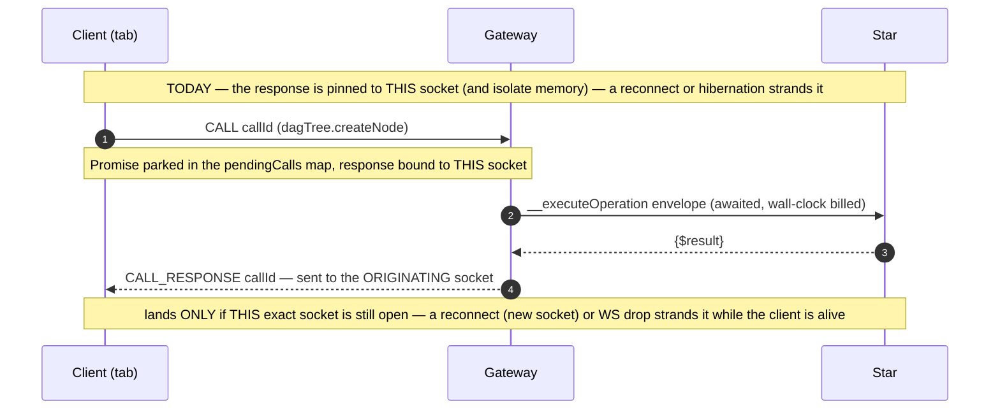
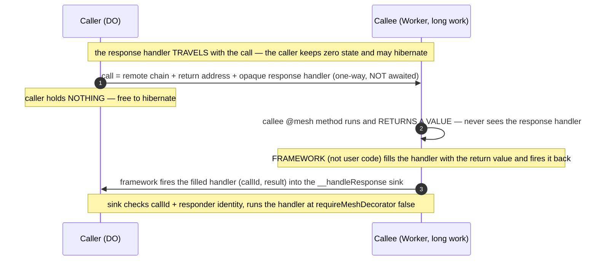
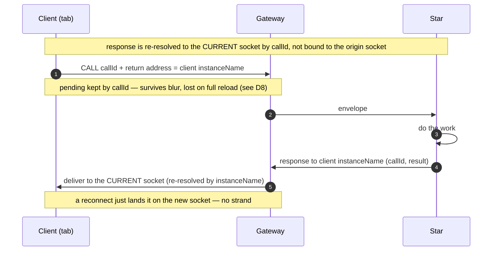
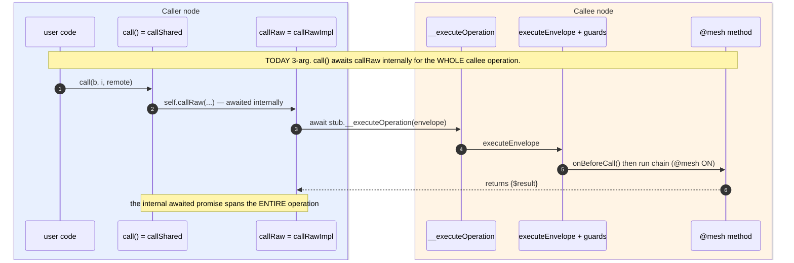
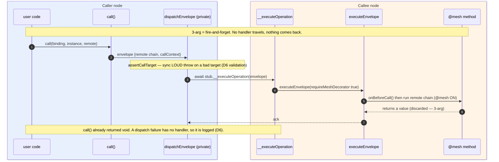
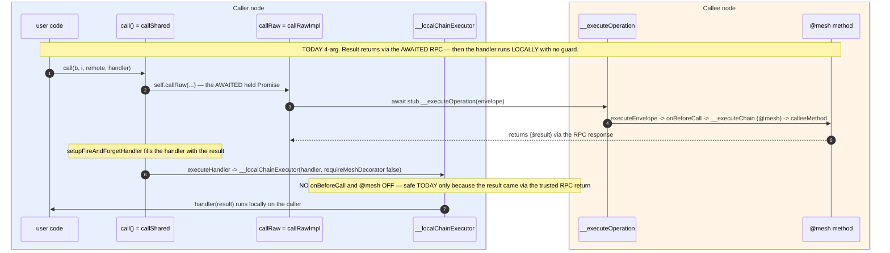
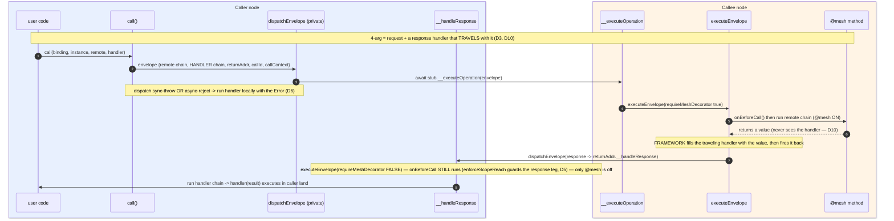
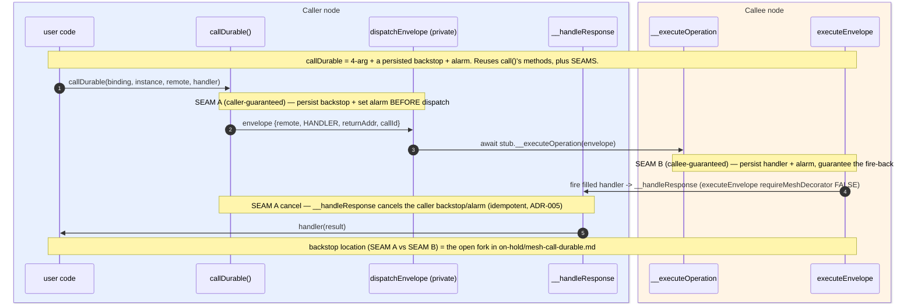

# Mesh — continuation-only calls (no held Promises across hops)

**Status**: **DESIGN CLOSED (best-effort core, D1–D14 pinned; D13 retired → merged into D6) — ready for `/review-task` or Phase-1 build.** Nothing built yet. **This is the sole active work on the `pre-alpha` branch: the rest of [nebula-pre-alpha.md](nebula-pre-alpha.md) is ON HOLD until this ships** (Larry, 2026-07-01, right after Child 3 landed + archived). **Scoped to the best-effort tier: `callDurable` + the durable-delivery spike are split out to [`on-hold/mesh-call-durable.md`](on-hold/mesh-call-durable.md)** (deferred — pre-alpha needs no hard guarantee; best-effort + reconcile covers it). **All design forks resolved** — forgery → `enforceScopeReach` + route-via-`executeEnvelope` (D5, 2026-07-01 fact-find); ADRs → amend 003+007, no 009. Remaining is **Phase-1 build + verification** (framework-fired return + client re-resolution on workerd; confirm no legit response flow is false-negatived by `enforceScopeReach`) — execution, not design.
**Packages**: `packages/mesh/` (the call surface + Gateway + client), `apps/nebula/` (all app-side `callRaw` sites migrate). (`packages/fetch/` alarm backstop is deferred with `callDurable` → [on-hold](on-hold/mesh-call-durable.md).)
**Related**: [`on-hold/mesh-call-durable.md`](on-hold/mesh-call-durable.md) (the deferred guaranteed tier + durable-delivery spike), `tasks/archive/nebula-reactive-ai-chat.md` (Child 3 already solved this *for chat* — durable `Message` + reconcile + transient progress; this generalizes it), `docs/adr/003-continuation-messaging.md` (this is ADR-003 taken to its conclusion; needs an amendment), `docs/adr/007-shared-node-security-core.md` (response-leg gating)
**Relevant engine**: `packages/mesh/src/lmz-api.ts` (`callShared` :394, `callRawImpl` :284, `assertCallTarget` :343, `executeEnvelope` :913), `packages/mesh/src/lumenize-client.ts` (`#callRaw` :1295, `#pendingCalls` :394, `#handleCallResponse` :1165, `#handleIncomingCall` :1187), `packages/mesh/src/lumenize-client-gateway.ts` (`#handleClientCall` :522, `__executeOperation` :412, `#forwardToClient` :668)

---

## Objective

Make **`call()` + a continuation the only cross-node call surface** that application, platform, and client code ever touch. Remove the awaited-`callRaw` request/response shape from that surface. Keep the single awaited hop **only** as a private, framework-internal transport (Gateway / WS internals), which ADR-003 already blesses as "transport, not architecture."

The point is not stylistic. It closes a whole class of "thinking forever" / lost-result bugs by construction, and it turns a nuanced judgment call ("is this hop short and reliable enough to await?") into a **grep-able bright line** ("app code never awaits a cross-node call").

---

## The reframe (why this is worth doing)

The `call` vs `callRaw` debate was always framed as *actor-purity vs async/await ergonomics*. That frame is wrong. **Everything is async at the transport** — `call()` already awaits `callRaw` internally ([lmz-api.ts:424](../packages/mesh/src/lmz-api.ts)). So `callRaw` adds **zero distributed capability** over `call()` + a handler. The one thing it adds is a **lexical closure over the result** (keep going in the same method, local variables in scope) — and it buys that by **parking a Promise in isolate/tab memory** until the hop returns.

The unifying insight: **a held Promise pins the result to a transient binding.** [durable-objects.md](../.claude/rules/durable-objects.md) forbids `#subscribers = new Set()` because it dies on hibernation and tells you to put it in storage. A pending `callRaw` Promise (`#pendingCalls` on the client; an awaited stub on a DO) is the *control-flow* version of that same forbidden field. **A continuation is the storage-backed equivalent of a Promise** — it is data, so it can be serialized, persisted, and re-executed after hibernation. `@lumenize/fetch` already `stringify()`s a continuation into an alarm and rehydrates it — a Promise that survived hibernation *because it stopped being a Promise*.

**And the binding that dies isn't only isolate *memory* — for a client call it's the *socket*, and that's the more common failure** (learned building Nebula). A client's WebSocket **reconnects far more often than a DO hibernates** — a network blip, a backgrounded tab, a wifi handoff each yields a **new socket**. The Gateway routes *inbound* deliveries to the client's **current** socket, but an awaited `callRaw` response is bound to the socket the call **left on** — so on reconnect it lands on a dead socket and is lost, **even though the client is alive and still holding its Promise**. Hibernation / tab-discard (the holder's *memory* vanishes) is the *same class, just rarer*; "tab sleep" bites precisely *because* it triggers a reconnect. A continuation decouples **both**: the result is re-addressable to wherever the caller *currently is* — re-resolved by `instanceName` — never pinned to one socket or one live isolate.

So: **"no mutable instance state" applied to control flow, not just data.** The "early tell" already in the tree is `assertCallTarget` ([lmz-api.ts:343](../packages/mesh/src/lmz-api.ts)) — it throws **synchronously at the `lmz.call(...)` site even for fire-and-forget**. This task makes that the primary error surface.

---

## Decisions

| # | Decision | Choice | Status |
|---|---|---|---|
| D1 | Scope of the bright line | **(A) strict-for-the-surface**: no awaited cross-node call anywhere in `apps/nebula` or client code; single-hop await survives only as private framework transport. (Rejected: (B) forbid only across client/long boundaries — that keeps the judgment call that has burned us.) | **[PINNED]** (Larry + Claude both lean A) |
| D2 | Surface vs transport | Remove `callRaw` from the public `LmzApi` surface. Keep its body as a **private single-hop transport** (rename so it can't be mistaken for an app API, e.g. `#dispatchEnvelope`). ADR-003 already blesses one awaited hop as transport. | **[PINNED]** |
| D3 | Where the response handler lives (default `call`) | **Traveling continuation**: the serialized response handler chain rides *with* the outgoing call to the callee; the callee fires it back — filled with the result — as a one-way call. **The caller holds ZERO state and can hibernate freely.** (Rejected: hold-at-caller — it forces the caller to retain the handler across the wait, reintroducing the exact hibernation-fragile state this task exists to kill. Larry, 2026-07-01.) The handler's `callContext` at fire-back time → **D14**. | **[PINNED]** |
| D4 | Response-leg gating | The response lands in **one** framework sink (`__handleResponse`) that runs the app handler at `requireMeshDecorator:false` — app handlers are **never** `@mesh`-decorated. Gating is **per-leg** (fact-find, D5): DO↔DO responses ride `executeEnvelope` so **`enforceScopeReach`** enforces the tenant boundary (only the @mesh-allowlist is skipped); client responses are **Gateway**-gated (`onBeforeCallToClient`). callId is client↔Gateway **correlation** (dedup/match), not the DO↔DO security gate. | **[PINNED — refined by 2026-07-01 fact-find]** |
| D5 | Response-leg integrity + gating | The returned continuation lands in the non-`@mesh` `__handleResponse` sink at `requireMeshDecorator:false`. **RESOLVED (2026-07-01 fact-find):** route the fire-back **through `executeEnvelope`** (NOT the local-executor path) so **`onBeforeCall`/`enforceScopeReach` runs** — this enforces the **Nebula tenant boundary** on the response leg (directionally correct: within-subtree responses pass; cross-Galaxy/Universe/sibling-Star **rejected**, [nebula-do.ts:66-101](../apps/nebula/src/nebula-do.ts)). Only the **@mesh-allowlist** is skipped (correct — the handler is caller-authored, not an app-exposed method). **No signing / no caller-side callId state.** Client responses are **Gateway**-gated. Residual = intra-tenant forgery (same-subtree node sends an arbitrary chain) → **out of scope** (in-trust-domain code-exec = already-lost, Larry). **⚠ Load-bearing constraint + why it's secure:** the sink MUST dispatch via `executeEnvelope`, which runs `onBeforeCall`/`enforceScopeReach` **first, before the handler chain** — so **the responder is already scope-checked by the time any handler code runs**. `requireMeshDecorator:false` is therefore **allowlist-off, scope-check-ON** (not "ungated"): it skips only the per-method *@mesh allowlist* (correct — the handler is the caller's own continuation, not an app-exposed method), never the scope/tenant check. The `__localChainExecutor` path is forbidden precisely because it runs the chain with **no prior `onBeforeCall`** — a forged inbound chain would execute un-scope-checked. | **[RESOLVED 2026-07-01 — verify legit flows in Phase 1]** |
| D6 | Error model (replaces `try/catch`) — *merged D6+D13* | **Three tiers — two built here, `callDurable` deferred** → [on-hold](on-hold/mesh-call-durable.md). **(1) Loud sync-throw:** validation/developer errors (`assertCallTarget`, invalid continuation, bad binding) throw synchronously at the `lmz.call(...)` site — fail-fast, **never** routed to a handler. **(2) Delivered error handler (best-effort):** a **sync throw OR async rejection** from the dispatch call both land in the handler's error path (Error in the `$result` slot) — the async half is already `setupFireAndForgetHandler`'s `.catch`, plus the sync half. The framework **awaits the single short dispatch/ack hop** (transport, ADR-003) so **overload is caught** (it rejects *at* dispatch with `.overloaded`) and delivered; this await is **framework-internal** — `call()` returns `void` and is NEVER awaited by user code, and the caller is freed right after (hibernates during long work; the result fires back later to the sink). **Empirically low-stakes:** no source inspects `.overloaded`/`.retryable`; the only handler-error consumer is `svc.broadcast`'s drop-on-`ClientDisconnectedError` (a fired-back delivery signal, unaffected). | **[PINNED]** |
| D7 | Retry | **DEFERRED with `callDurable`** → [on-hold](on-hold/mesh-call-durable.md) (retry needs durable state, so it only exists in the guaranteed tier; off by default, never on overload; leans on ADR-005; classification owned by the backpressure task). | **[DEFERRED 2026-07-01]** |
| D8 | Client reload durability (best-effort) | blur+reconnect survives for free — re-resolve delivery by callId to the current socket (**Flow C**, a Phase-1 build item). Full **reload/discard** → **reuse the Child-3 durable-Resource + subscription-reconcile pattern**: the client re-issues (idempotent, ADR-005) and reconciles against the durable server record. It holds **no timer** (the browser has no reliable alarm), so reload recovery is *reconcile*, not *wait*. A durable server record always exists in Nebula so far. | **[PINNED — reuse Child-3]** |
| D9 | Client-side `callDurable` (no client alarm) | **DEFERRED with `callDurable`** → [on-hold](on-hold/mesh-call-durable.md): the client can't be a durability *guarantor* (no reliable browser alarm — `setTimeout` dies on tab discard/reload), so client-side `callDurable` = persist+reconcile / Web Push. The **best-effort** client story (all this task builds) is **D8**. | **[DEFERRED 2026-07-02]** |
| D10 | Response handler is framework-owned + opaque to callee user code | The callee's `@mesh` method just **returns a value**; the framework fills that value into the carried response handler and fires it **back to the immediate caller** — the "under the covers on the callee side" path. Callee user code **never receives the raw handler chain**, so it cannot read or rewrite it — which is what makes D5's signing unnecessary. **Hard requirement (Larry, 2026-07-01): if the raw chain ever surfaces to callee user code, the model is rejected.** **⚠ Implementation invariant:** the traveling handler rides in a **framework-controlled envelope field** — never a method argument, never `callContext.state`, never anything reachable from the `@mesh` method's `this`. The callee runs `executeOperationChain(requestChain, this)` ([lumenize-do.ts:302](../packages/mesh/src/lumenize-do.ts)) — the **request chain only**. (A continuation the caller passes as a method *argument* is intentional data, categorically separate — not this handler.) (Third-node / multi-hop delivery is NOT expressed here — it uses the 3-arg form, D11.) | **[PINNED]** |
| D11 | 3-arg vs 4-arg splits the two modes | **4-arg** `call(b, i, remote, handler)` = simple 2-party request/response: framework owns `handler`, fires it back to the **immediate caller** (D10); the non-`@mesh` sink is used **only** here. **3-arg** `call(b, i, remote)` = fire-and-forget / genuine multi-hop, **exactly as today**: no framework-owned handler, **no pre-specified final destination**; if a result must flow onward, user code fires explicit onward `call()`s naming each next node via a normal `@mesh` remote continuation. So every multi-hop hop lands on a standard identity-gated `@mesh` method — no forwarded handle exists. The 4-arg **API is unchanged from today**; only its mechanism swaps (await→travels). (Larry, 2026-07-01 — resolves the earlier "opaque reply handle" fork: there is no handle.) | **[PINNED]** |
| D12 | 4-arg target must be cross-node-self-contained | A method invoked via **4-arg** must produce its return value **without a cross-node call** — local sync or local *async* (e.g. `crypto.subtle`) both fine (the framework `await`s the local method). A method whose result depends on a **downstream node** cannot be 4-arg (it can't await the hop under this task, and hold-at-caller + forwarded-handle are both rejected) → that flow is inherently **3-arg/multi-hop** or reactive (subscriptions). Consequence: some current awaited-`callRaw` sites that aggregate across nodes don't become 4-arg — they refactor to multi-hop or subscriptions (Phase-2 audit). | **[PINNED 2026-07-01]** |
| D14 | Response-leg `callContext` (no second copy) | The fire-back rides the **same envelope + transport as any mesh hop, so `callContext` propagates identically** (the callee's context + callee appended) — even though it lands on the non-`@mesh` `__handleResponse` sink (the handler is **not** `@mesh`-decorated; it runs at `requireMeshDecorator:false`), NOT an `@mesh` method. So the handler runs under the **naturally-propagated** response-leg `callContext` — `originAuth` unchanged, and the **callee in the callChain**, which D5's `onBeforeCall`/`enforceScopeReach` gate REQUIRES to identify the responder. **Do NOT serialize a second, call-time snapshot of the caller's context and restore it** (Larry): wasteful, and it would carry the *wrong* identity for the D5 gate — the only thing it adds is a shorter callChain (the missing response hop), not worth it. A call-time value the handler needs rides as a **handler argument** in the OCAN chain, not via callContext. | **[PINNED 2026-07-02]** |
| D13 | *(retired — tombstone)* | **Merged into D6** (error model — the taxonomy + dispatch-failure routing are one topic). Number kept so D10/D14 and other references stay stable. | **[→ D6]** |

---

## Cast (participants)

| Participant | Role in this design |
|---|---|
| **Caller** | Any node that makes a cross-node call (client, DevStudio, Star, Worker). **Embeds the opaque response handler + its `callContext` in the outgoing call, then holds ZERO state** (D3); exposes the `__handleResponse` sink where the filled handler lands on return. |
| **Callee** | The node that receives the call. Its `@mesh` **user code just returns a value and never sees the response handler** (D10); the **framework** on the callee carries the handler opaquely and, on return, **fills it and fires it back** as a one-way call to the sink. May be long-running / may hibernate mid-work. |
| **Framework transport** | The private single awaited hop (`#dispatchEnvelope`, née `callRaw`) + `executeEnvelope`. The **only** place a Promise is held across a hop, and only across **one** hop. Not reachable from app code. |
| **Gateway** | For a **client** caller/callee, the response can't be raw RPC — the Gateway re-resolves delivery to the client's **current** socket by instanceName+callId (existing `INCOMING_CALL` path, carrying a callId). |

> Mermaid convention (same as Child 2/3): solid `->>` = call / one-way message (incl. server→client push); dashed `-->>` = return / callback of the single framework transport hop. A `ctn().method(...)` is a **continuation descriptor** — built on the sender, executed on the recipient.

---

## Flow A — TODAY: awaited `callRaw` holds a Promise across the WS (the failure mode)

## Flow B — PROPOSED: traveling response handler + non-@mesh sink (DO to DO/Worker)

## Flow C — PROPOSED: client caller survives reconnect (fixes "thinking forever")

---

## Error handling at a glance

The full model is **D6** (replaces `try/catch`); this is the quick lookup — where each failure ends up:

| Failure | Makes a hop? | Reaches the handler? |
|---|---|---|
| Validation / developer error (bad binding, bad continuation) | No — local, pre-dispatch | ❌ — thrown **loudly** at the `lmz.call(...)` site (fail-fast), never a handler |
| Sync dispatch throw | No — threw before the request left | ✅ |
| Overload / async dispatch reject | Yes — the dispatch hop (reject returns from it) | ✅ — caught at the awaited dispatch hop |
| Callee `@mesh` throws (user-code error) | Yes — out to the callee; error rides the fire-back | ✅ — callee fires the handler back with the Error |
| Callee vanishes mid-work (crash/evict after accepting) | **Hops out, no return** | ❌ — no signal ever comes back → the deferred `callDurable` case (rare; already lost for 3-arg today) |

The rule the two columns encode: **any failure that produces a signal — locally (no hop) or back from a hop — is thrown or handled; the one gap is the row that hops *out* but returns *nothing*, which is exactly what `callDurable` covers.**

---

## Costs & non-negotiables

- **Best-effort is the tier we build here; the guaranteed tier (`callDurable()`) is opt-in and deferred.** Default `call` stays alarm-free — making every hop durable multiplies write cost at broadcast/chat/DAG scale, which is exactly why `callDurable` is a separate opt-in layer ([on-hold](on-hold/mesh-call-durable.md)).
- **Default `call` is stateless at the caller** (traveling, D3) — the caller holds nothing and may hibernate. (The guaranteed tier's backstop-location fork lives in the [on-hold](on-hold/mesh-call-durable.md) file.)
- **Security-surface note:** D4 + D10 keep app handlers off the `@mesh` set **and** the raw handler chain out of callee user code, so the only tamper vector is a compromised framework (out of scope). The `__handleResponse` sink's real job is **forgery** defense (D5); Stage-2 signs off on it.
- **Ergonomic tax lands on platform authors, not user-developers** (who never touch `lmz.call` — they use the client SDK + Resources). Straight-line cross-target orchestration (`dev-studio.ts` sequences) becomes continuation graphs — but most of those are **same-target** sequential awaits that should collapse into **one atomic method** per ADR-006 (a feature, not a tax).

---

## Migration surface

Enumerate at execution time (counts are commentary, not the inventory):

- **App/platform `callRaw` sites** — `grep -rn 'this\.lmz\.callRaw' apps/nebula/src` (at writing: the DAG mutators in [nebula-client.ts:1047-1065](../apps/nebula/src/nebula-client.ts), the DevStudio sequences in [dev-studio.ts:281-471](../apps/nebula/src/dev-studio.ts)). Same-target runs → batch into one atomic mesh method (ADR-006); genuine cross-target sequences → continuation graphs.
- **Test sites** — `grep -rln 'callRaw' packages apps | grep -E '/test/|\.test\.'` (use the `.only` refactor pattern; get one representative green first).
- **`@lumenize/fetch` — best-effort adapt, keep published** (Larry, 2026-07-02): convert its one executor `callRaw`→3-arg `call` (+ its `__localChainExecutor` result-delivery) so it compiles + tests green on the new mesh. Expected easy → stays published; **deprecation is only a fallback if the adapt turns out hard.** Not a mesh-test-parity target (its ~90s flaw is a separate known limitation, unchanged here).
- **Public API removal** — drop `callRaw` from the `LmzApi` interface ([lmz-api.ts:610](../packages/mesh/src/lmz-api.ts)) and the client's public `callRaw` ([lumenize-client.ts:316](../packages/mesh/src/lumenize-client.ts)); keep the body private.

---

## Phases

### Phase 1 — The primitive: traveling handler + non-@mesh sink (also the feasibility proof)
**Goal**: `call()` internally uses a **traveling** response handler + the non-`@mesh` `__handleResponse` sink instead of awaited `callRaw`. Best-effort tier only. **Caller holds zero state.** This phase **is** the feasibility proof — build it small and verify the workerd mechanics (framework-fired return, client re-resolution) under `wrangler dev` before the broad migration; the one genuine unknown lives here, not in a separate spike.

**Success Criteria**:
- [ ] `__handleResponse` sink runs the **traveling** handler (arriving in the return call with its `callContext`) at `requireMeshDecorator:false`; caller stores nothing per-call. callId + responder-identity forgery checks per D5. Callee `@mesh` user code never receives the handler (D10).
- [ ] **`__handleResponse` dispatches via `executeEnvelope`** (so `onBeforeCall`/`enforceScopeReach` runs), NOT the local-executor path (D5). Capable-of-failing test: a **cross-scope forged response is rejected by `enforceScopeReach`**; a legitimate within-subtree response passes. Confirm no real DevStudio↔Star↔Container↔Galaxy response flow is false-negatived.
- [ ] `assertCallTarget` is the documented sync-throw surface; the error model (D6) written into `calls.mdx`/`continuations.mdx`.
- [ ] Dispatch-failure routing (D6): validation throws loud; a **sync throw OR async reject** from the dispatch call routes to the handler's error path; the dispatch hop is **awaited** so overload (`.overloaded`) is caught and delivered. A capable-of-failing test for each (bad-binding throws; a stubbed dispatch-reject reaches the handler).
- [ ] `callRaw` removed from public surface, retained as private `#dispatchEnvelope`; `grep -rn 'this\.lmz\.callRaw' apps/nebula/src packages/mesh/src/lumenize-client.ts` returns nothing outside framework internals.
- [ ] Client blur+reconnect: an in-flight call re-resolves to the new socket by callId (Flow C) — verified with a **real WS drop** (browser test harness / `wrangler dev`, per the verify-before-deploy practice).
- [ ] **Test strategy (Larry, 2026-07-01: test-mode workarounds in vitest-pool-workers are acceptable, and this is left to Claude's judgment):** capable-of-failing tests for framework-fired return + dispatch-failure routing (sync throw + async reject); real WS drop for Flow-C where the browser harness fits, a pool-workers test-mode shim where that's simpler.

### Phase 2 — Migrate the surface
**Goal**: no app/platform/client awaited `callRaw` remains.

**Success Criteria**:
- [ ] **Audit each awaited-`callRaw` site (D12):** target produces its result locally → **4-arg** `call()`; target's result depends on a downstream node → **3-arg multi-hop** or a **subscription**. Record the classification per site.
- [ ] All sites in *Migration surface* converted; same-target runs batched into atomic methods (ADR-006).
- [ ] Tests migrated (`.only` pattern).
- [ ] Full suite green; `type-check` clean.

### Phase 3 — ADR + docs
**Success Criteria**:
- [ ] **Amend ADR-003 + ADR-007 — NO new ADR** (Larry, 2026-07-01: fewer active ADRs; avoid a 3-way 003↔007↔009; ADR-003 is *not* deprecated — the amendment resolves the open mechanism choice it already flagged). **ADR-003** owns the surface/transport split + the continuation-response mechanism; **ADR-007** gets a minimal second-receive-path note (its "one guard path / one place to audit" claim becomes two paths, honestly — the non-`@mesh` `__handleResponse` sink is correlation-gated; the decision itself lives in ADR-003).
- [ ] `mesh.md` §`callRaw` rewritten (the "short reliable hop" carve-out is gone); `calls.mdx`/`continuations.mdx` updated.

### Final Verification (every phase)
- [ ] All tests pass (`npx vitest run` in package dir)
- [ ] Type-check clean (`npm run type-check`)
- [ ] Docs match: grep `website/docs/mesh/` for changed API keywords
- [ ] JSDoc reflects current behavior

---

## Open questions / forks for review

- **[SECURITY] Response forgery / tenant boundary (D5) — RESOLVED by the 2026-07-01 fact-find.** The tenant boundary is already enforced by **`enforceScopeReach`** on any envelope through `executeEnvelope`, and it's **directionally correct** (within-subtree responses pass; cross-Galaxy/Universe/sibling-Star **rejected** — [nebula-do.ts:66-101](../apps/nebula/src/nebula-do.ts)). So the sink needs **no signing and no caller-side state** — my a-priori "caller-signed callId" lean was over-engineering. Design: route the fire-back **through `executeEnvelope`** and skip only the @mesh-allowlist. **⚠ Load-bearing constraint:** the local-executor delivery path (`__localChainExecutor`) skips BOTH `onBeforeCall` and @mesh — the sink must NOT use it. Client responses stay **Gateway**-gated; callId gives no cross-tenant leverage (per-connection UUID, absent from the DO envelope); Nebula's 2 `fetch()` handlers are not a vector. Residual intra-tenant forgery = out of scope (in-domain code-exec = already-lost). **Phase-1 verification:** confirm no legitimate Nebula response flow (DevStudio↔Star↔Container↔Galaxy) is false-negatived by `enforceScopeReach`.
- **[ARCH] ADR scope — RESOLVED (Larry, 2026-07-01):** amend **ADR-003** (surface/transport + continuation-response mechanism) **+ ADR-007** (minimal second, correlation-gated receive-path note); **no new ADR-009** (fewer active ADRs; keep 003↔007 a 2-way interaction, not 3-way; ADR-003 not deprecated). Phase 3.
- **Multi-hop = 3-arg explicit `@mesh` chains (D11) — RESOLVED** (no forwarded handle, no sealing). Residual is the **4-arg contract constraint** (D12): awaited-`callRaw` sites that aggregate across nodes must refactor to multi-hop or subscriptions — enumerate them in Phase 2.
- **Sequencing — RESOLVED (Larry, 2026-07-01):** Child 3 landed + archived; the rest of `nebula-pre-alpha.md` is **ON HOLD** until this refactor ships, and this is the **sole active work on the branch**. Classified as its own `@lumenize/mesh` foundational project, not a pre-alpha child. (Child 3 already proved the model *for chat* — durable `Message` + reconcile + transient progress — this generalizes its "in-memory pending Promise on the client" motivation.)
- **Guaranteed tier (`callDurable`) + durable-delivery spike — DEFERRED** to [on-hold](on-hold/mesh-call-durable.md) (2026-07-01). **Firm: whether any flow needs a hard guarantee won't be known until Nebula is pre-alpha in prod (Larry) — so this does NOT gate the build; we ship best-effort and learn in prod.** Backstop-location + MIT-placement live in the on-hold file. Revive only when a real flow demands it.

---

## Notes

- **This is ADR-003 taken to its conclusion.** ADR-003 already says "nothing depends on request/response across hops" and flags the single awaited hop as a mechanism choice we might remove. The value here is removing the *surface* that keeps seducing us (and the LLM) back into holding Promises — not purifying the transport.
- **Do not purge the single awaited hop from framework internals.** The Gateway (`#handleClientCall`, `#forwardToClient`) genuinely needs it; ADR-007 already classifies the client's hand-rolled path as a justified divergence. Fighting that buys nothing.
- **Retry + the guaranteed tier are deferred** to [on-hold](on-hold/mesh-call-durable.md); this task builds only the best-effort primitive + the migration. Retry's overload classification stays owned by the backpressure task.

---

## Scope (2026-07-01) — this is a mesh-package refactor; Nebula adaptation is best-effort

This is **1 of 3 hardening items** gating a return to `nebula-pre-alpha.md` (the others: DevContainer idle-wakeup, and testing the already-landed chat-history-as-subscriptions). **DevStudio is already broken / unusable**, and all DevStudio work is on hold behind these. So:

- **Success bar = mesh-side test-coverage parity.** After the refactor, `packages/mesh` has equivalent coverage of the new mechanism to what `call`/`callRaw` have today. That is the rigor.
- **Nebula Studio WILL break; adapt it best-effort.** We fully expect breakage; migrating `apps/nebula` is a best-effort pass, not a perfection bar (details deferred to the later pre-alpha resume). This *reframes S1*: pre-classify the known sites enough for the **mesh** tests to exercise 4-arg/3-arg shapes, but don't chase DevStudio correctness now.

---

## Method-responsibility split (Phase-1 build target) — **PROPOSED, for review**

> Draft to nail the method split **with Larry** before Phase-1 build (sequence-diagram-first). Drawn with **callDurable in view** (deferred, but its shape must not be blocked). Each form is shown **BEFORE (today) → AFTER (proposed)** so the refactor's consolidation is legible. Once agreed, this integrates into Phase 1 + a hygiene pass.

**Naming rule (the sanity pass):** a method is `#private` **unless it must cross the Workers-RPC boundary** (a `#` method silently returns `undefined` over an RPC stub). Only RPC **entry points** get the public `__` prefix. Everything else → `#`.

**Current → proposed:**

| Today | Proposed | Why |
|---|---|---|
| `call()` (public) | `call()` — the **only** public cross-node method | unchanged |
| `callRaw()` (public) + `callRawShared` + `callRawImpl` | `#dispatchEnvelope()` (+ `#buildEnvelope()`) — the ONE awaited transport hop | removed from public surface (D2); private |
| `__executeOperation(env)` (RPC entry, requests) | `__executeOperation(env)` — unchanged entry; gains **framework-fired return** for 4-arg (D10) | stays `__` (RPC entry) |
| `executeEnvelope(env, node)` | `executeEnvelope(env, node, {requireMeshDecorator})` — always runs `onBeforeCall`; toggles only the @mesh gate; owns the fire-back | **the consolidation** |
| `__executeChain` (public, @mesh ON) | folded into `executeEnvelope(requireMeshDecorator:true)` | one receive path |
| `#executeChainLocal` / `__localChainExecutor` (no guard, @mesh OFF) | **kept, but scoped to alarms only** (self-scheduled local work) — **removed from the cross-node response path** | this is the D5 security win, encoded structurally |
| *(new)* | `__handleResponse(env)` — RPC entry for responses → `executeEnvelope(requireMeshDecorator:false)` | `__` (RPC entry) |

**Consolidation wins:** (1) `requireMeshDecorator` becomes an `executeEnvelope` parameter → one receive path, `onBeforeCall` **always** runs, only @mesh toggles — so the response leg is guarded by construction (D5), not by a "remember to…". (2) The three `callRaw*` fns collapse to `#dispatchEnvelope`. (3) `__localChainExecutor` (the no-guard path) shrinks to **alarms only** — cross-node responses can no longer reach it. (4) Only **three** `__` methods remain: `__executeOperation`, `__handleResponse`, `__init`.

**callDurable stays additive (not made harder):** it reuses `call()`'s methods and attaches persistence+alarm at **named seams** — SEAM A *(caller-guaranteed)* wraps `#dispatchEnvelope` (persist backstop + alarm before; cancel on `__handleResponse`); SEAM B *(callee-guaranteed)* wraps the fire-back inside `executeEnvelope`. The backstop-location fork lives in [on-hold](on-hold/mesh-call-durable.md); the point here is the best-effort split leaves both seams open.

### `call()` 3-arg (fire-and-forget) — BEFORE → AFTER
_Actors are methods, grouped into **Caller node** / **Callee node** boxes; user code at the far ends._

**BEFORE (today):**

**AFTER (proposed):**

### `call()` 4-arg (with response handler) — BEFORE → AFTER  *(the crux of the refactor)*

**BEFORE (today):** the caller awaits `callRaw` (the held Promise), then runs the handler **locally, unguarded**.

**AFTER (proposed):** the handler travels, the caller holds nothing, and the fire-back is re-guarded by `onBeforeCall`.

### `callDurable()` — net-new (no BEFORE; 4-arg only; DEFERRED) — reuses `call()`'s methods + durability seams

### Open method-split questions (for review)
- **One RPC entry or two?** Two (`__executeOperation` for requests, `__handleResponse` for responses) keeps each single-purpose and gives callDurable a distinct place to layer SEAM B — **lean two**. (Alternative: one entry + an `envelope.kind` field — fewer methods, branchier `executeEnvelope`, harder callDurable seam.)
- **Where does the fire-back live?** In `executeEnvelope` (shared → DO/Worker/Container all get framework-fired return for free) vs in each `__executeOperation` (duplicated) — **lean shared**.
- **Is a durable 3-arg ever needed** (guaranteed delivery, no reply)? **Lean no** — model "must-happen fire-and-forget" as a 4-arg with an ack handler; keeps callDurable 4-arg-only.
