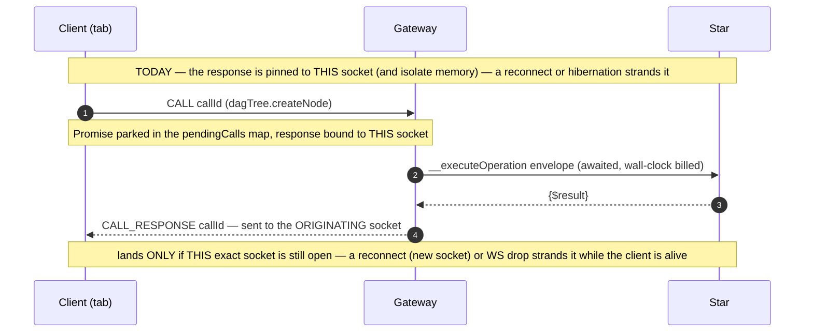
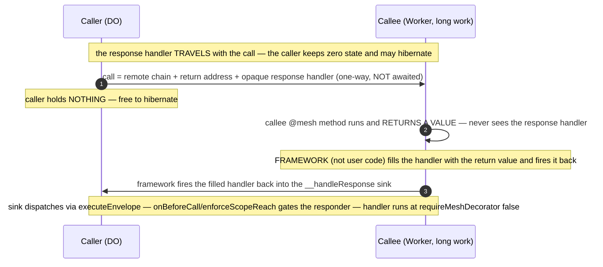
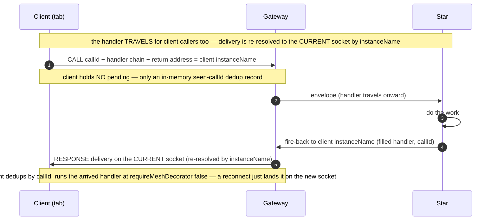
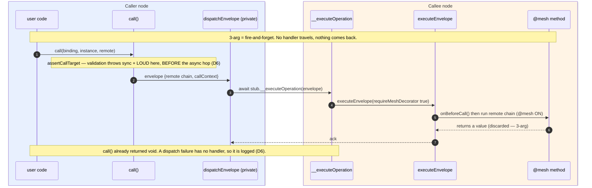
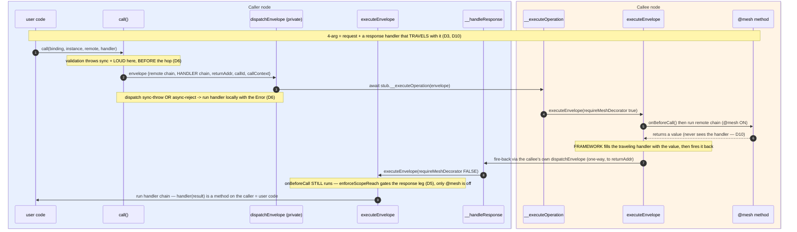
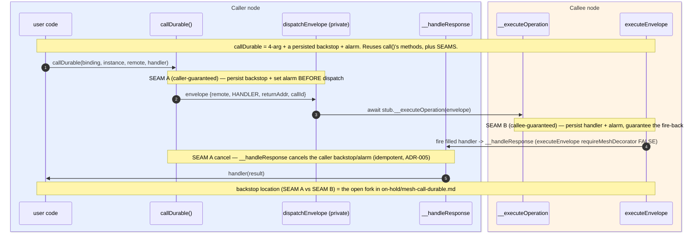

# Mesh — continuation-only calls (no held Promises across hops)

**Status**: **DESIGN PINNED — D1–D14 + the method split (2026-07-02); hygiene-converged. Next: fresh Stage-1 framing pass → Stage-2 conformance → Phase-1 build.** Nothing built yet. Scope = the **best-effort tier only** (guaranteed tier: [`on-hold/mesh-call-durable.md`](on-hold/mesh-call-durable.md)). Sole active work on the `pre-alpha` branch — [nebula-pre-alpha.md](nebula-pre-alpha.md) is on hold until this ships.
**Packages**: `packages/mesh/` (the call surface + Gateway + client), `apps/nebula/` (all app-side `callRaw` sites migrate, best-effort — see Scope). (`packages/fetch/` adapts best-effort; the alarm-backstop work is deferred with `callDurable` → [on-hold](on-hold/mesh-call-durable.md).)
**Related**: [`on-hold/mesh-call-durable.md`](on-hold/mesh-call-durable.md) (the deferred guaranteed tier + durable-delivery spike), `tasks/archive/nebula-reactive-ai-chat.md` (Child 3 already proved this model *for chat* — durable `Message` + reconcile + transient progress; this generalizes it), `docs/adr/003-continuation-messaging.md` (this is ADR-003 taken to its conclusion; Phase 3 amends it), `docs/adr/007-shared-node-security-core.md` (Phase 3 adds the second-receive-path note), `tasks/mesh-identity-stamp-removal.md` (queued directly behind this task; rewrites the same surfaces — so `#buildEnvelope` must read self-identity via the existing `lmz` getters in ONE place, never scatter stamp reads)
**Relevant engine**: `packages/mesh/src/lmz-api.ts` (`callShared` :394, `callRawImpl` :284, `assertCallTarget` :343, `executeEnvelope` :913), `packages/mesh/src/lumenize-client.ts` (`#callRaw` :1295, `#pendingCalls` :394, `#handleCallResponse` :1165, `#handleIncomingCall` :1187), `packages/mesh/src/lumenize-client-gateway.ts` (`#handleClientCall` :522, `__executeOperation` :412, `#forwardToClient` :668)

---

## Objective

Make **`call()` + a continuation the only cross-node call surface** that application, platform, and client code ever touch. Remove the awaited-`callRaw` request/response shape from that surface. Keep the single awaited hop **only** as a private, framework-internal transport (Gateway / WS internals), which ADR-003 already blesses as "transport, not architecture."

The point is not stylistic. It closes a whole class of "thinking forever" / lost-result bugs by construction, and it turns a nuanced judgment call ("is this hop short and reliable enough to await?") into a **grep-able bright line** ("app code never awaits a cross-node call").

---

## The reframe (why this is worth doing)

The `call` vs `callRaw` debate was always framed as *actor-purity vs async/await ergonomics*. That frame is wrong. **Everything is async at the transport** — `call()` already awaits `callRaw` internally ([lmz-api.ts:424](../packages/mesh/src/lmz-api.ts)). So `callRaw` adds **zero distributed capability** over `call()` + a handler. The one thing it adds is a **lexical closure over the result** (keep going in the same method, local variables in scope) — and it buys that by **parking a Promise in isolate/tab memory** until the hop returns.

The unifying insight: **a held Promise pins the result to a transient binding.** [durable-objects.md](../.claude/rules/durable-objects.md) forbids `#subscribers = new Set()` because it dies on hibernation and tells you to put it in storage. A pending `callRaw` Promise (`#pendingCalls` on the client; an awaited stub on a DO) is the *control-flow* version of that same forbidden field. **A continuation is the storage-backed equivalent of a Promise** — it is data, so it can be serialized, persisted, and re-executed after hibernation. `@lumenize/fetch` already `stringify()`s a continuation into an alarm and rehydrates it — a Promise that survived hibernation *because it stopped being a Promise*.

**And the binding that dies isn't only isolate *memory* — for a client call it's the *socket*, and that's the more common failure** (learned building Nebula). A client's WebSocket **reconnects far more often than a DO hibernates** — a network blip, a backgrounded tab, a wifi handoff each yields a **new socket**. The Gateway routes *inbound* deliveries to the client's **current** socket, but an awaited `callRaw` response is bound to the socket the call **left on** — so on reconnect it lands on a dead socket and is lost, **even though the client is alive and still holding its Promise**. Hibernation / tab-discard (the holder's *memory* vanishes) is the *same class, just rarer*; "tab sleep" bites precisely *because* it triggers a reconnect. A continuation decouples **both**: the result is re-addressable to wherever the caller *currently is* — re-resolved by `instanceName` — never pinned to one socket or one live isolate.

So: **"no mutable instance state" applied to control flow, not just data.** The "early tell" already in the tree is `assertCallTarget` ([lmz-api.ts:343](../packages/mesh/src/lmz-api.ts)) — it throws **synchronously at the `lmz.call(...)` site even for fire-and-forget**. This task makes that the primary error surface.

---

## Scope — a mesh-package refactor; Nebula adaptation is best-effort

This is **1 of 3 hardening items** gating a return to `nebula-pre-alpha.md` (the others: DevContainer idle-wakeup, and testing the already-landed chat-history-as-subscriptions). **DevStudio is already broken / unusable**, and all DevStudio work is on hold behind these. So:

- **Success bar = mesh-side test-coverage parity.** After the refactor, `packages/mesh` has equivalent coverage of the new mechanism to what `call`/`callRaw` have today. That is the rigor.
- **Nebula Studio WILL break; adapt it best-effort.** Migrating `apps/nebula` is a best-effort pass, not a perfection bar (details deferred to the pre-alpha resume). Pre-classify the known sites enough for the **mesh** tests to exercise the 4-arg/3-arg shapes (see Migration surface); don't chase DevStudio correctness now.

---

## Decisions

| # | Decision | Choice | Status |
|---|---|---|---|
| D1 | Scope of the bright line | **Strict-for-the-surface**: no awaited cross-node call anywhere in `apps/nebula` or client code; the single-hop await survives only as private framework transport. Not the scoped alternative (forbid only client-crossing/long calls) — that keeps alive the judgment call that has burned us. | **[PINNED]** |
| D2 | Surface vs transport | Remove `callRaw` from the public `LmzApi` surface. Keep its body as a **private single-hop transport** (`#dispatchEnvelope` — renamed so it can't be mistaken for an app API). ADR-003 already blesses one awaited hop as transport. | **[PINNED]** |
| D3 | Where the response handler lives (default `call`) | **Traveling continuation**: the serialized response handler chain rides *with* the outgoing call to the callee; the callee fires it back — filled with the result — as a one-way call. **The caller holds ZERO state and can hibernate freely.** Not hold-at-caller: that forces the caller to retain the handler across the wait — the same hibernation-fragile state this task exists to kill. The handler's `callContext` at fire-back time → **D14**. | **[PINNED]** |
| D4 | *(retired — tombstone)* | **Merged into D5** (response-leg gating + integrity are one topic). Number kept so references stay stable. | **[→ D5]** |
| D5 | Response-leg gating + integrity *(merged D4+D5)* | The response lands in **one** framework sink (`__handleResponse`) that runs the caller-authored handler at `requireMeshDecorator:false` — app handlers are **never** `@mesh`-decorated. **DO↔DO responses ride `executeEnvelope`, so `onBeforeCall`/`enforceScopeReach` runs FIRST, before any handler code** — the responder is already scope-checked by the time the handler runs. `requireMeshDecorator:false` is therefore **allowlist-off, scope-check-ON**, never "ungated" (skipping the per-method @mesh allowlist is correct: the handler is the caller's own continuation, not an app-exposed method). The tenant boundary is directionally correct — within-subtree responses pass; cross-Galaxy/Universe/sibling-Star are rejected ([nebula-do.ts:66-101](../apps/nebula/src/nebula-do.ts)). **Client** responses are **Gateway-gated** (`onBeforeCallToClient`). **callId, pinned:** minted by the origin caller's framework per 4-arg call; rides the envelope's framework metadata and is **round-tripped opaquely** on the fire-back. The **client** keeps an in-memory **seen-callId dedup set** and the **Gateway** uses it for correlation; a **DO/Worker caller stores NOTHING keyed by it, and the DO sink does NOT check it** — the gate is `enforceScopeReach`; callId at the DO sink is trace-only. It gives no cross-tenant leverage. **No signing; no caller-side pending state.** **The dedup set is an ephemeral duplicate-suppression cache, NOT correctness or security state** (durable-objects.md's sanctioned "ephemeral cache where loss is acceptable" class): it guards the reconnect socket-overlap window where re-resolved delivery can land the same response twice (the job `#pendingCalls`' delete-on-resolve did incidentally); bounded/TTL'd; **loss is benign** — freeze keeps memory, and on discard/reload the worst case is a duplicate handler run, bounded by ADR-005 replay-idempotency + D8 reconcile. It holds no result — the result travels in the response — so losing it can never strand anything. Residual intra-tenant forgery (a same-subtree node fires an arbitrary chain) is **out of scope** — in-trust-domain code-exec is already-lost. **⚠ Load-bearing build constraint:** the sink MUST dispatch via `executeEnvelope`; `__localChainExecutor` runs a chain with **no prior `onBeforeCall`** and must never receive cross-node input (it narrows to alarms-only in the method split). | **[PINNED — Phase 1 verifies no legit flow is false-negatived]** |
| D6 | Error model (replaces `try/catch`) — *merged D6+D13* | **Three tiers — two built here, `callDurable` deferred** → [on-hold](on-hold/mesh-call-durable.md). **(1) Loud sync-throw:** validation/developer errors (`assertCallTarget`, invalid continuation, bad binding) throw synchronously at the `lmz.call(...)` site — fail-fast, **never** routed to a handler. **Boundary: validation runs synchronously in `call()`/`#buildEnvelope` BEFORE the async hop; the handler-routing wrapper (tier 2) surrounds ONLY the `#dispatchEnvelope` invocation.** **(2) Delivered error handler (best-effort):** a **sync throw OR async rejection** from the dispatch call both land in the handler's error path (Error in the `$result` slot) — the async half is already `setupFireAndForgetHandler`'s `.catch`, plus the sync half. The framework **awaits the single short dispatch/ack hop** (transport, ADR-003) so **overload is caught** (it rejects *at* dispatch with `.overloaded`) and delivered; this await is **framework-internal** — `call()` returns `void` and is NEVER awaited by user code, and the caller is freed right after (hibernates during long work; the result fires back later to the sink). **3-arg dispatch failures (no handler) are LOGGED** by the dispatch-failure helper — never thrown async, never silently swallowed (preserves today's log-on-no-handler behavior). **Empirically low-stakes:** no source inspects `.overloaded`/`.retryable`; the only handler-error consumer is `svc.broadcast`'s drop-on-`ClientDisconnectedError` — preserved via the Gateway **ack-hop** (see the svc.broadcast pin in the method split). | **[PINNED]** |
| D7 | Retry | **DEFERRED with `callDurable`** → [on-hold](on-hold/mesh-call-durable.md) (retry needs durable state, so it only exists in the guaranteed tier; off by default, never on overload; leans on ADR-005; classification owned by the backpressure task). | **[DEFERRED]** |
| D8 | Client reload durability (best-effort) | blur+reconnect survives for free — re-resolve delivery by callId to the current socket (**Flow C**, a Phase-1 build item). Full **reload/discard** → **reuse the Child-3 durable-Resource + subscription-reconcile pattern**: the client re-issues (idempotent, ADR-005) and reconciles against the durable server record. It holds **no timer** (the browser has no reliable alarm), so reload recovery is *reconcile*, not *wait*. A durable server record always exists in Nebula so far. **~~Exception — `createNode`~~ (RETIRED 2026-07-02):** [client-supplied UUID nodeId landed](archive/dag-client-supplied-nodeid.md), so `createNode` is now idempotent/replay-safe — reload recovery is re-issue-with-the-held-id + reconcile, same as every other mutator (no longer an exception). | **[PINNED — reuse Child-3]** |
| D9 | Client-side `callDurable` (no client alarm) | **DEFERRED with `callDurable`** → [on-hold](on-hold/mesh-call-durable.md): the client can't be a durability *guarantor* (no reliable browser alarm — `setTimeout` dies on tab discard/reload), so client-side `callDurable` = persist+reconcile / Web Push. The **best-effort** client story (all this task builds) is **D8**. | **[DEFERRED]** |
| D10 | Response handler is framework-owned + opaque to callee user code | The callee's `@mesh` method just **returns a value**; the framework fills that value into the carried response handler and fires it **back to the immediate caller**. Callee user code **never receives the raw handler chain**, so it cannot read or rewrite it — which is what makes signing unnecessary (D5). **Hard requirement: if the raw chain ever surfaces to callee user code, the model is rejected.** **⚠ Implementation invariant:** the traveling handler rides in a **framework-controlled envelope field** — never a method argument, never `callContext.state`, never anything reachable from the `@mesh` method's `this`. The callee runs `executeOperationChain(requestChain, this)` ([lumenize-do.ts:302](../packages/mesh/src/lumenize-do.ts)) — the **request chain only**. (A continuation the caller passes as a method *argument* is intentional data, categorically separate — not this handler.) Third-node / multi-hop delivery is NOT expressed here — it uses the 3-arg form (D11). | **[PINNED]** |
| D11 | 3-arg vs 4-arg splits the two modes | **4-arg** `call(b, i, remote, handler)` = simple 2-party request/response: framework owns `handler`, fires it back to the **immediate caller** (D10); the non-`@mesh` sink is used **only** here. **3-arg** `call(b, i, remote)` = fire-and-forget / genuine multi-hop, **exactly as today**: no framework-owned handler, **no pre-specified final destination**; if a result must flow onward, user code fires explicit onward `call()`s naming each next node via a normal `@mesh` remote continuation. So every multi-hop hop lands on a standard identity-gated `@mesh` method — **no forwarded reply handle exists**. The 4-arg **API is unchanged from today**; only its mechanism swaps (await→travels). | **[PINNED]** |
| D12 | 4-arg target must be cross-node-self-contained | A method invoked via **4-arg** must produce its return value **without a cross-node call** — local sync or local *async* (e.g. `crypto.subtle`) both fine (the framework `await`s the local method). A method whose result depends on a **downstream node** cannot be 4-arg → that flow is inherently **3-arg/multi-hop** or reactive (subscriptions). Consequence: awaited-`callRaw` sites that aggregate across nodes don't become 4-arg — they refactor to multi-hop or subscriptions (Phase-2 audit; live-loop sites pre-classified in Migration surface). | **[PINNED]** |
| D13 | *(retired — tombstone)* | **Merged into D6** (error model — the taxonomy + dispatch-failure routing are one topic). Number kept so references stay stable. | **[→ D6]** |
| D14 | Response-leg `callContext` (no second copy) | The fire-back rides the **same envelope + transport as any mesh hop, so `callContext` propagates identically** (the callee's context + callee appended) — even though it lands on the non-`@mesh` `__handleResponse` sink (the handler is **not** `@mesh`-decorated; it runs at `requireMeshDecorator:false`), NOT an `@mesh` method. So the handler runs under the **naturally-propagated** response-leg `callContext` — `originAuth` unchanged, and the **callee in the callChain**, which D5's `onBeforeCall`/`enforceScopeReach` gate REQUIRES to identify the responder. **Do NOT serialize a second, call-time snapshot of the caller's context and restore it**: wasteful, and it would carry the *wrong* identity for the D5 gate — the only thing it adds is a shorter callChain (the missing response hop), not worth it. A call-time value the handler needs rides as a **handler argument** in the OCAN chain, not via callContext. | **[PINNED]** |

---

## Cast (participants)

| Participant | Role in this design |
|---|---|
| **Caller** | Makes the cross-node call; embeds the opaque response handler in the envelope, then **holds ZERO state** (D3); exposes the `__handleResponse` sink (D5). |
| **Callee** | Its `@mesh` method **returns a value and never sees the handler** (D10); its **framework** fills the handler and fires it back one-way. May be long-running / hibernate mid-work. |
| **Framework transport** | The single awaited hop (`#dispatchEnvelope`) + the shared `executeEnvelope` receive path (see the method split). The **only** held Promise, across **one** hop, not reachable from app code. |
| **Gateway** | For client legs: re-resolves response delivery to the client's **current** socket by **instanceName** (callId rides along for the client's dedup only — see the client row in the method split). |

> Mermaid convention (same as Child 2/3): solid `->>` = call / one-way message (incl. server→client push); dashed `-->>` = return / callback of the single framework transport hop. A `ctn().method(...)` is a **continuation descriptor** — built on the sender, executed on the recipient.

---

## Flow A — TODAY: awaited `callRaw` holds a Promise across the WS (the failure mode)

## Flow B — PROPOSED: traveling response handler + non-@mesh sink (DO to DO/Worker)

## Flow C — PROPOSED: client caller survives reconnect (fixes "thinking forever")

---

## Method-responsibility split (Phase-1 build target) — **PINNED 2026-07-02**

> Nailed sequence-diagram-first, with **callDurable in view** (deferred, but its shape must not be blocked). Diagrams show the **target only** — actors are methods grouped into **Caller node** / **Callee node** boxes, user code at the far ends; the current-code baseline is the code itself (the build step reads it directly), and the **named-function inventory** below is the before→after record.

**Naming rule (the sanity pass):** a method is `#private` **unless it must cross the Workers-RPC boundary** (a `#` method silently returns `undefined` over an RPC stub). Only RPC **entry points** get the public `__` prefix. Everything else → `#`. **Third bucket:** public-but-not-RPC framework members keep `__` when they must be reachable **cross-module** (`#` is class-internal and the TS `private` keyword is banned) — e.g. `__localChainExecutor` (accessed by the alarms + fetch plugins), `__initFromHeaders` (called by subclasses).

**Current → proposed:**

| Today | Proposed | Why |
|---|---|---|
| `call()` (public) | `call()` — the **only** public cross-node method | unchanged |
| `callRaw()` (public) + `callRawShared` + `callRawImpl` | `#dispatchEnvelope()` (+ `#buildEnvelope()`, which **owns validation** — sync-throws before the hop, D6) — the ONE awaited transport hop | removed from public surface (D2, Phase-2 exit); private |
| `__executeOperation(env)` (RPC entry, requests) | `__executeOperation(env)` — unchanged entry; gains **framework-fired return** for 4-arg (D10) | stays `__` (RPC entry) |
| `executeEnvelope(env, node)` | `executeEnvelope(env, node, {requireMeshDecorator})` — always runs `onBeforeCall`; toggles only the @mesh gate; **owns the fire-back** (shared, so DO/Worker/Container all get framework-fired return for free) | **the consolidation** |
| `__executeChain` (public, @mesh ON) | folded into `executeEnvelope(requireMeshDecorator:true)` | one receive path |
| `#executeChainLocal` / `__localChainExecutor` (no guard, @mesh OFF) | **kept, but scoped to alarms only** (self-scheduled local work) — **removed from the cross-node response path** | this is the D5 security win, encoded structurally |
| *(new)* | `__handleResponse(env)` — RPC entry for responses → `executeEnvelope(requireMeshDecorator:false)` | `__` (RPC entry) |
| *(new, client)* | the client-side sink mirror: response deliveries arrive as a **distinct Gateway→client message type** (NOT `INCOMING_CALL` — that path enforces the @mesh allowlist and would reject a traveled handler) and execute at `requireMeshDecorator:false` after the client's `onBeforeCall`-equivalent; the client keeps only an in-memory **seen-callId dedup set** | ADR-007's documented parallel path (no ALS) |

**Consolidation wins:** (1) `requireMeshDecorator` becomes an `executeEnvelope` parameter → one receive path, `onBeforeCall` **always** runs, only @mesh toggles — the response leg is guarded by construction (D5), not by a "remember to…". (2) The three `callRaw*` fns collapse to `#dispatchEnvelope`. (3) `__localChainExecutor` (the no-guard path) shrinks to **alarms only** — cross-node responses can no longer reach it. (4) Cross-node **RPC entries are exactly TWO** — `__executeOperation` (requests) and `__handleResponse` (responses); no third door. Surviving non-RPC `__` members, by name: `lmz.__init` (identity init, on `LmzApi`); `__initFromHeaders` (fetch-path identity stamping, ADR-007 — out of scope); `__localChainExecutor` (alarms-only per the row above — a getter returning a function, useless over RPC); `__broadcastTier`/`__forwardBroadcastResult` (broadcast tree — see the svc.broadcast pin below). **No new `__` members.** (5) **Two RPC entries by design:** the gate mode (@mesh on/off) is selected by **which door is knocked on (the address), never by attacker-influenced envelope content** — a single entry with an `envelope.kind` flag would let any sender label a fresh request `kind:'response'` and run its chain allowlist-off (the tenant gate still holds, but the @mesh layer becomes sender-downgradable). Cost: +1 `__` method (the 4-arg diagram's extra actor), bought deliberately.

**Where the consolidation actually lands (named-function inventory).** Don't read consolidation off the diagrams' box count — method-count was never the target; **path-count and state-count** are. (The 4-arg diagram even carries *more* boxes than today's shape: the previously-**invisible response leg made explicit** — today it hides inside the awaited RPC return arrow, and *that fusion is the held Promise*.) Against today's code, the countable change:

| | BEFORE (named functions) | AFTER |
|---|---|---|
| Send path | `call`→`callShared`; `callRaw`→`callRawShared`→`callRawImpl` (5) | `call`→`#buildEnvelope`→`#dispatchEnvelope` (3) |
| Held-promise handler machinery | `captureCallContext`, `createHandlerExecutor`, `executeHandlerWithResult`, `setupFireAndForgetHandler` — the `.then/.catch` around the held await (4) | ~1 small dispatch-failure delivery helper. The success path is **gone** (the handler runs on arrival at the sink); `captureCallContext`/`createHandlerExecutor` die **by D14** (no second context snapshot). |
| Receive path | `__executeOperation`→`executeEnvelope`→`__executeChain` (public), **plus** the ungated `#executeChainLocal`/`__localChainExecutor` pair serving BOTH cross-node results and alarms | `__executeOperation` + `__handleResponse` → **one** `executeEnvelope(requireMeshDecorator)`; `__executeChain` folded away; ungated pair narrowed to **alarms-only** |
| Client | `#pendingCalls` map + resolve/reject + queue timeouts + `#handleCallResponse` — the socket-pinned await | dies for `call()` — the response **carries its handler**; callId = dedup only |

**callDurable stays additive (not made harder):** it is **4-arg-only** (a "must-happen fire-and-forget" is a 4-arg with an ack handler), reuses `call()`'s methods, and attaches persistence+alarm at **named seams** — SEAM A *(caller-guaranteed)* wraps `#dispatchEnvelope` (persist backstop + alarm before; cancel on `__handleResponse`); SEAM B *(callee-guaranteed)* wraps the fire-back inside `executeEnvelope`. The backstop-location fork lives in [on-hold](on-hold/mesh-call-durable.md); the point here is the best-effort split leaves both seams open.

**svc.broadcast rides the same swap (pinned):** its per-target pushes are ordinary 4-arg calls ([broadcast.ts:153](../packages/mesh/src/broadcast.ts)), so they get the traveling handler for free. Two shapes pinned:
- **(a) Worker-caller fire-back — a supported shape:** a tier Worker's `returnAddr` is **binding-only** (Workers have no instanceName), so the fire-back lands on a **fresh, stateless instance** whose handler is the tier's own `__forwardBroadcastResult` — which is correct *because* the handler travels (the fresh instance needs no prior state). No Nebula `LumenizeWorker` exists yet, so this is a supported-shape gap, not a current bug — include it in the Phase-1 coverage-parity bar.
- **(b) Gateway-as-callee — no traveling-handler execution:** the Gateway is NOT a mesh participant; its hand-rolled `__executeOperation` returns/throws the delivery result (e.g. `ClientDisconnectedError`) **on the awaited ack-hop**, and the caller's framework routes that to the handler **locally** (the same dispatch-failure delivery path, D6 tier 2). No Gateway code change; `onErrorOnly` drop-on-disconnect keeps working.

### `call()` 3-arg (fire-and-forget)

### `call()` 4-arg (with response handler) — *the crux of the refactor*

The handler travels, the caller holds nothing, and the fire-back arrives as a **gated entry on the caller's own edge** (`onBeforeCall` re-runs there).

### `callDurable()` — net-new (4-arg only; DEFERRED) — reuses `call()`'s methods + durability seams

---

## Error handling at a glance

The full model is **D6** (replaces `try/catch`); this is the quick lookup — where each failure ends up:

| Failure | Makes a hop? | Reaches the handler? |
|---|---|---|
| Validation / developer error (bad binding, bad continuation) | No — local, pre-dispatch | ❌ — thrown **loudly** at the `lmz.call(...)` site (fail-fast), never a handler |
| Sync dispatch throw | No — threw before the request left | ✅ |
| Overload / async dispatch reject | Yes — the dispatch hop (reject returns from it) | ✅ — caught at the awaited dispatch hop |
| Callee `@mesh` throws (user-code error) | Yes — out to the callee; error rides the fire-back | ✅ — callee fires the handler back with the Error |
| Callee vanishes mid-work (crash/evict after accepting) | **Hops out, no return** | ❌ — no signal ever comes back → the deferred `callDurable` case (rare; already lost for 3-arg today) |

The rule the two columns encode: **any failure that produces a signal — locally (no hop) or back from a hop — is thrown or handled; the one gap is the row that hops *out* but returns *nothing*, which is exactly what `callDurable` covers.** (For **3-arg** calls — no handler — the ✅ rows are **logged** by the dispatch-failure helper instead, per D6.)

---

## Costs & non-negotiables

- **Best-effort only here.** Default `call` is alarm-free and **stateless at the caller** (D3) — durable-everything would multiply write cost at broadcast/chat/DAG scale, which is exactly why the guaranteed tier is a separate opt-in layer; its backstop-location fork lives in [on-hold](on-hold/mesh-call-durable.md).
- **Security surface:** app handlers never join `@mesh` and the raw handler chain never reaches callee user code — so the sink's one job is forgery defense, owned by **D5 + D10**.
- **Ergonomic tax lands on platform authors, not user-developers** (who never touch `lmz.call` — they use the client SDK + Resources). Straight-line cross-target orchestration (`dev-studio.ts` sequences) becomes continuation graphs — but most of those are **same-target** sequential awaits that should collapse into **one atomic method** per ADR-006 (a feature, not a tax).

---

## Migration surface

Enumerate at execution time (counts are commentary, not the inventory):

- **App/platform `callRaw` sites** — `grep -rn 'this\.lmz\.callRaw' apps/nebula/src` (at writing: the DAG mutators in [nebula-client.ts:1047-1065](../apps/nebula/src/nebula-client.ts), the DevStudio sequences in [dev-studio.ts:281-471](../apps/nebula/src/dev-studio.ts)). Same-target runs → batch into one atomic mesh method (ADR-006); genuine cross-target sequences → continuation graphs.
- **Live-loop sites pre-classified (D12; coarse — the mesh tests need the shapes, DevStudio correctness comes with the pre-alpha resume):** `createNode` (client→Star; **[client-supplied UUID nodeId landed 2026-07-02](archive/dag-client-supplied-nodeid.md)** — the client now holds the id, so this is **3-arg + subscription reconcile**, not the old 4-arg id-return) • DevStudio→Star `resetDevData`/`setOntology` and DevStudio→Container `setAppVersion`/`ensureUp`/`applyChanges` (same-instance-name hops, results produced locally by the target → **4-arg** where the value is consumed, **3-arg** where discarded) • DevStudio→Container `awaitPreviewReady` → **4-arg** whose handler pushes `handlePreviewReady` to the client (long-running is now fine — no held Promise).
- **Test sites** — `grep -rln 'callRaw' packages apps | grep -E '/test/|\.test\.'` (use the `.only` refactor pattern; get one representative green first).
- **Held-promise patterns beyond `callRaw`** — the client's `#pendingReads` (`requestId`-correlated read Promises settled by a direct-delivery push, [nebula-client.ts:1174-1251](../apps/nebula/src/nebula-client.ts)) is the same disease in app clothing; audit it in Phase 2 (likely: keep the UI-facing Promise but give it D8 semantics — timeout + re-issue on reconnect — or convert to 4-arg). **No new id concepts anywhere**: the 4-arg correlation/dedup token IS the caller's hop-id — today the existing client WS callId, unified into `CallChainEntry.callId` when [on-hold/mesh-call-tracing-and-ids](on-hold/mesh-call-tracing-and-ids.md) lands (traceId = `callChain[0].callId` per that design; safe as a ULID because post-D5 callId is trace/dedup-only, never a capability).
- **`@lumenize/fetch` — best-effort adapt, keep published:** convert its one executor `callRaw`→3-arg `call` (+ its `__localChainExecutor` result-delivery) so it compiles + tests green on the new mesh. Deprecation is only a fallback if the adapt turns out hard. Not a mesh-test-parity target (its ~90s flaw is a separate known limitation, unchanged here).
- **Public API removal** — drop `callRaw` from the `LmzApi` interface ([lmz-api.ts:610](../packages/mesh/src/lmz-api.ts)) and the client's public `callRaw` ([lumenize-client.ts:316](../packages/mesh/src/lumenize-client.ts)); keep the body private.

---

## Phases

### Phase 1 — The primitive: traveling handler + non-@mesh sink (also the feasibility proof)
**Goal**: `call()` internally uses a **traveling** response handler + the non-`@mesh` `__handleResponse` sink instead of awaited `callRaw`, built to the **pinned method split** above. Best-effort tier only. **Caller holds zero state.** This phase **is** the feasibility proof — build it small and verify the workerd mechanics under `wrangler dev` before the broad migration; the one genuine unknown lives here, not in a separate spike.

**Success Criteria**:
- [ ] **Method split implemented as pinned:** `call()` → `#buildEnvelope` → `#dispatchEnvelope`; **one** `executeEnvelope(env, node, {requireMeshDecorator})` receive path that always runs `onBeforeCall` and owns the fire-back; `__handleResponse` as the second RPC entry → `executeEnvelope(requireMeshDecorator:false)`; `__localChainExecutor` narrowed to **alarms-only**. Cross-node RPC entries are exactly TWO (`__executeOperation`, `__handleResponse`) — no third door; the surviving non-RPC `__` members are the named inventory in Consolidation win (4), unchanged; **no NEW `__` members**.
- [ ] **Traveling-handler semantics (D3/D10/D14):** the handler rides as framework-controlled envelope metadata (never a method argument / `callContext.state`); callee `@mesh` user code never receives it; caller stores nothing per-call (client callers: nothing beyond the in-memory seen-callId **dedup set**; DO/Worker callers: nothing at all); the handler runs under the naturally-propagated response-leg `callContext`.
- [ ] **THE security gate — no legitimate response leg is false-negatived by `enforceScopeReach` (D5):** near-term response legs travel within **one instance name** (DevStudio↔Star/Container use `this.lmz.instanceName`; DAG mutators one `activeScope`) — a false-negative breaks real flows. Capable-of-failing test per flow shape. Inherited free (confirm, don't over-build): a cross-scope forged response is rejected; the sink never uses the local-executor path.
- [ ] **Dispatch-failure routing (D6):** validation throws loud at the call site; a **sync throw OR async reject** from the dispatch call lands in the handler's error path; the dispatch hop is **awaited** so `.overloaded` is caught and delivered. A capable-of-failing test for each (bad-binding throws; a stubbed dispatch-reject reaches the handler).
- [ ] `callRaw` **demoted, not yet removed**: `#dispatchEnvelope` built and `call()` rides it; `LmzApi.callRaw` retained but marked `@deprecated` (removing it now would type-break every unmigrated site and make the every-phase gates unsatisfiable — removal is Phase 2's exit criterion).
- [ ] **[Exploratory — verify on real infra]** the two empirical mechanics: framework-fired return under `wrangler dev`, and Flow-C client re-resolution across a **real WS drop** (browser harness; pool-workers test-mode shims acceptable where simpler). Deliverable includes a captured findings note.

### Phase 2 — Migrate the surface
**Goal**: no app/platform/client awaited `callRaw` remains.

**Success Criteria**:
- [ ] **Audit each awaited-`callRaw` site (D12):** target produces its result locally → **4-arg** `call()`; target's result depends on a downstream node → **3-arg multi-hop** or a **subscription**. Record the classification per site (live-loop sites pre-classified in Migration surface).
- [ ] All sites in *Migration surface* converted; same-target runs batched into atomic methods (ADR-006).
- [ ] Tests migrated (`.only` pattern); **mesh-side coverage parity** with today's `call`/`callRaw` (the Scope bar).
- [ ] **Public surface removed (exit criterion):** `callRaw` dropped from `LmzApi` ([lmz-api.ts:610](../packages/mesh/src/lmz-api.ts)) + the client ([lumenize-client.ts:316](../packages/mesh/src/lumenize-client.ts)); `grep -rn 'this\.lmz\.callRaw' apps/nebula/src packages/mesh/src/lumenize-client.ts` returns nothing outside framework internals.
- [ ] Full suite green; `type-check` clean.

### Phase 3 — ADR + docs
**Success Criteria**:
- [ ] **Amend ADR-003 + ADR-007 — NO new ADR** (fewer active ADRs; keep 003↔007 a 2-way interaction, not 3-way; ADR-003 is *not* deprecated — the amendment resolves the open mechanism choice it already flagged). **ADR-003** owns the surface/transport split + the continuation-response mechanism; **ADR-007** gets a minimal second-receive-path note (its "one guard path / one place to audit" becomes two entries into ONE shared gated path; the non-`@mesh` `__handleResponse` sink is correlation-gated; the decision itself lives in ADR-003).
- [ ] Error model (D6) + the `assertCallTarget` sync-throw surface documented in `calls.mdx`/`continuations.mdx`.
- [ ] `.claude/rules/mesh.md`: rewrite **ALL** `callRaw`-mechanism references (the "short reliable hop" carve-out, the 4-arg `{$error}`-rethrow description, the two-one-way "plain await" cost framing) — enumerate via `grep -n callRaw .claude/rules/mesh.md`; a stale mechanism reference in an always-loaded rule is a per-session unlearning surface.

### Final Verification (every phase)
- [ ] All tests pass (`npx vitest run` in package dir)
- [ ] Type-check clean (`npm run type-check`)
- [ ] Docs match: grep `website/docs/mesh/` for changed API keywords
- [ ] JSDoc reflects current behavior

---

## Notes

- **This is ADR-003 taken to its conclusion.** ADR-003 already says "nothing depends on request/response across hops" and flags the single awaited hop as a mechanism choice we might remove. The value here is removing the *surface* that keeps seducing us (and the LLM) back into holding Promises — not purifying the transport.
- **Do not purge the single awaited hop from framework internals.** The Gateway (`#handleClientCall`, `#forwardToClient`) genuinely needs it; ADR-007 already classifies the client's hand-rolled path as a justified divergence. Fighting that buys nothing.
- **The guaranteed tier (`callDurable`) + retry are deferred** to [on-hold](on-hold/mesh-call-durable.md) — whether any flow needs a hard guarantee is unknowable until Nebula runs pre-alpha in prod, so it does **not** gate this build. Retry's overload classification stays owned by [the backpressure task](on-hold/mesh-overload-backpressure-handling.md).
- **Memory goes stale at ship:** the `[[client-calls-use-direct-delivery]]` feedback memory blesses awaited `callRaw` for short DO↔DO hops — update/retire it when this lands (Phase 3).
