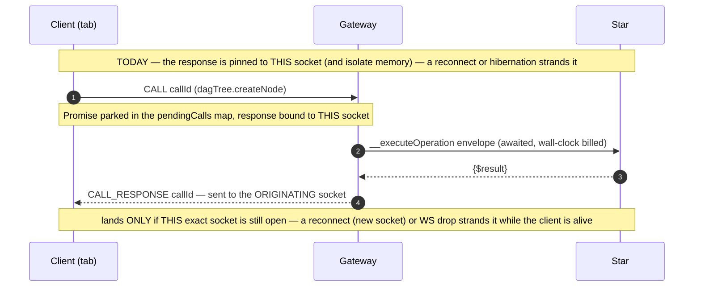
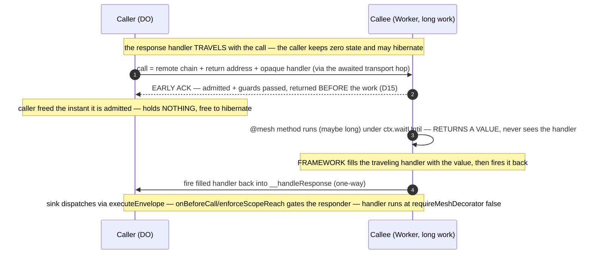
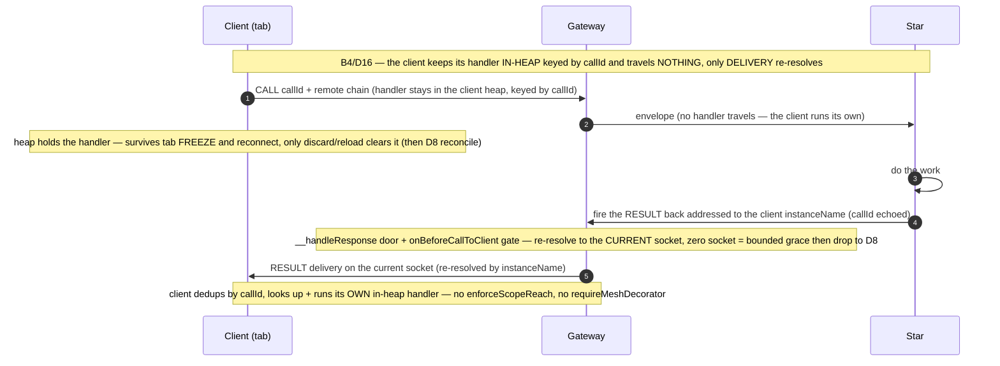
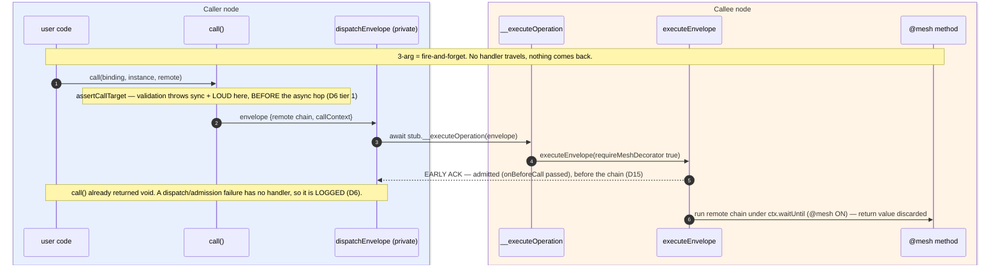
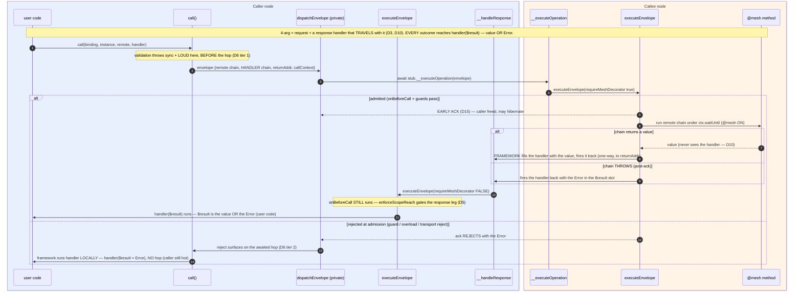
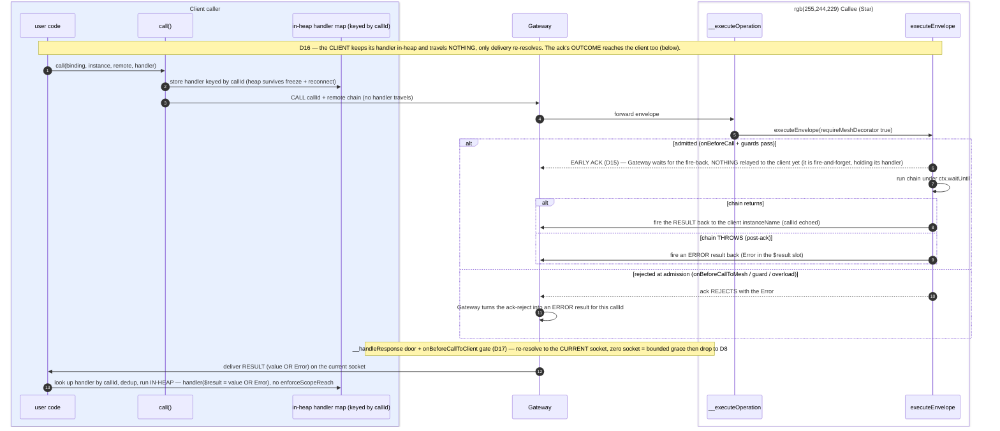

# Mesh — continuation-only calls (no held Promises across hops)

**Status**: **✅ COMPLETE (2026-07-03) — all three phases + the `callAsync` detour landed. Only the pre-alpha-resume deferrals remain: container-flow `wrangler dev`+Docker runtime verification, and the `dev-studio` harness rewrite.** Phase 2 removed `callRaw` from the surface entirely and migrated all four clusters (fetch executor→3-arg, DAG mutators→client 4-arg in-heap bridge, DevStudio→ADR-006 batched fire-and-forget/4-arg, App.vue→fire-and-forget); **mesh 406/406, fetch 21/21, nebula baseline 302/302, type-check clean; 0 regressions** (the 17 `dev-studio`-project failures are pre-existing Phase-1 `callStudio`-harness breakage, confirmed identical pre/post via stash). Container-flow *runtime* verification under `wrangler dev`+Docker + the `dev-studio` harness rewrite are deferred to the pre-alpha resume. See the Phase-2 banner below for detail. Feasibility premise CONFIRMED under pool-workers (D15/criterion 10: a DO early-acks then does a real 2s post-ack gap and the fire-back STILL lands — `DurableObjectState.waitUntil` keeps it alive). Built: the full method split (`call`→`#buildEnvelope`→`dispatchEnvelope`, early-ack, shared `executeEnvelope` owns admit→`{$ack}`→chain+fire-back under `ctx.waitUntil`, `__executeChain` folded away/M3, `__handleResponse` door on DO/Worker/Container + the Gateway/D17, `__localChainExecutor` narrowed + Container's deleted, exactly 2 mesh RPC entries), the client in-heap leg (D16 — handler keyed by callId, delivery re-resolves, dedup, `onErrorOnly`/N6), `callRaw` demoted to a loud deprecated throw, D6 error routing (tier-1 sync-throw + tier-2 admission-reject→local handler + post-ack throw→fire-back), and Q5 injectable `CLIENT_CALL_TIMEOUT_MS`. **`packages/mesh`: 398/398 pool-workers GREEN + type-check clean; container 14 pass/1 skip; browser e2e 4/4; nebula response-leg matrix 7/7. Coverage baseline** ([reference/mesh-continuation-coverage-baseline.md](reference/mesh-continuation-coverage-baseline.md)) + **findings note** ([reference/mesh-continuation-findings.md](reference/mesh-continuation-findings.md)). Tests migrated off `callRaw` (call-context/lumenize-do/lumenize-worker/call-target-validation/lumenize-client + Gateway + container seam); new tests: N8, N9, D6-tier-2, client success/error-RESULT + M4 dedup, **Flow-C deterministic RESULT re-resolution (crit 8/M5)**, broadcast-to-disconnected mesh-side (crit 7), **the mandatory `enforceScopeReach` response-leg security matrix (crit 4/B5/D5, mutation-validated)**. Browser e2e (crit 12) confirms the client leg over real chromium+wrangler-dev. **onBeforeCallToClient omission on the RESULT leg — Larry APPROVED (2026-07-03, "Good call").** **DETOUR — LANDED (2026-07-03):** the client 4-arg→Promise bridge (`#orgTreeMutate`, `#readResource`, transaction) was promoted to the Mesh **`LumenizeClient.callAsync` primitive + `AbortSignal`** (de-dup + abort fixes the "Promise hangs past the Gateway grace window / until reload" gap) → [`tasks/mesh-client-callasync.md`](mesh-client-callasync.md) (commits `edba499`/`b584f77`; all three bridges collapsed, D5-pattern-(a) framework fire-back, submit-gate retired). **Still open from its inventory: revisit `#pendingTurns` + `#pendingSubscribes`** (the two same-shape bridges it scoped out) — the former may dissolve into using `subscribe` for chat history; the latter needs more thought. **REMAINING (pre-alpha resume only):** container-flow *runtime* verification under `wrangler dev`+Docker; the `dev-studio` vitest-harness rewrite (`callStudio` reads `$result` from an early-acking `__executeOperation` — the "purpose-built initiators" gap). Phase 3 + the `callAsync` detour are DONE. Scope = the **best-effort tier only** (guaranteed tier: [`on-hold/mesh-call-durable.md`](on-hold/mesh-call-durable.md)). Sole active work on the `pre-alpha` branch — [nebula-pre-alpha.md](nebula-pre-alpha.md) is on hold until this ships. `packages/fetch` migrated + green (21/21).

**Original design status (pre-build):** DESIGN PINNED — both `/review-task` stages resolved (framing + conformance, 2026-07-02→03); D1–D17 + the method split. Headline conformance corrections: **M1** the response-leg gate re-checks origin→node containment (not responder identity); **M2** client/Gateway `CALL_RESPONSE` disposition under early-ack; **M3** `executeEnvelope` calls `executeOperationChain` directly; **M4** client in-heap map lifetime + dedup; **M5** deterministic Flow-C test; `waitUntil` unified across node types.
**Packages**: `packages/mesh/` (the call surface + Gateway + client), `apps/nebula/` + `apps/nebula-studio-ui/` (all app/UI-side `callRaw` sites migrate, best-effort — see Scope). (`packages/fetch/` adapts best-effort; the alarm-backstop work is deferred with `callDurable` → [on-hold](on-hold/mesh-call-durable.md).)
**Related**: [`on-hold/mesh-call-durable.md`](on-hold/mesh-call-durable.md) (the deferred guaranteed tier + durable-delivery spike; owns the `callDurable` sequence diagram), `tasks/archive/nebula-reactive-ai-chat.md` (Child 3 already proved this model *for chat* — durable `Message` + reconcile + transient progress; this generalizes it), `docs/adr/003-continuation-messaging.md` (this is ADR-003 taken to its conclusion; Phase 3 amends it), `docs/adr/007-shared-node-security-core.md` (Phase 3 adds the second-receive-path note), `tasks/mesh-identity-stamp-removal.md` (queued directly behind this task; rewrites the same surfaces — so `#buildEnvelope` must read self-identity via the existing `lmz` getters in ONE place, never scatter stamp reads)
**Relevant engine**: `packages/mesh/src/lmz-api.ts` (`callShared` :394 — *collapses into `#dispatchEnvelope` in the split*, `callRawImpl` :284, `assertCallTarget` :343, `executeEnvelope` :919), `packages/mesh/src/lumenize-client.ts` (`#callRaw` :1295, `#pendingCalls` :394, `#handleCallResponse` :1165, `#handleIncomingCall` :1187), `packages/mesh/src/lumenize-client-gateway.ts` (`#handleClientCall` :522, `__executeOperation` :412, `#forwardToClient` :668)

---

## Objective

Make **`call()` + a continuation the only cross-node call surface** that application, platform, and client code ever touch. Remove the awaited-`callRaw` request/response shape from that surface. Keep the single awaited hop **only** as a private, framework-internal transport (Gateway / WS internals), which ADR-003 already blesses as "transport, not architecture."

The point is not stylistic. It closes a whole class of "thinking forever" / lost-result bugs by construction, and it turns a nuanced judgment call ("is this hop short and reliable enough to await?") into a **grep-able bright line** ("app code never awaits a cross-node call").

---

## The reframe (why this is worth doing)

The `call` vs `callRaw` debate was always framed as *actor-purity vs async/await ergonomics*. That frame is wrong. **Everything is async at the transport** — `call()` already awaits `callRaw` internally ([lmz-api.ts:424](../packages/mesh/src/lmz-api.ts)). So `callRaw` adds **zero distributed capability** over `call()` + a handler. The one thing it adds is a **lexical closure over the result** (keep going in the same method, local variables in scope) — and it buys that by **parking a Promise in isolate/tab memory** until the hop returns.

The unifying insight: **a held Promise pins the result to a transient binding.** [durable-objects.md](../.claude/rules/durable-objects.md) forbids `#subscribers = new Set()` because it dies on hibernation and tells you to put it in storage. A pending `callRaw` Promise (`#pendingCalls` on the client; an awaited stub on a DO) is the *control-flow* version of that same forbidden field. **A continuation is the storage-backed equivalent of a Promise** — it is data, so it can be serialized, persisted, and re-executed after hibernation. `@lumenize/fetch` already `stringify()`s a continuation into an alarm and rehydrates it — a Promise that survived hibernation *because it stopped being a Promise*.

**But the transient binding is not always *memory* — and pinning down *which* binding dies sharpened the whole design (D16/B4).** Two different holders, two different failure modes:

- **On a DO/Worker caller the dying binding is the isolate's *memory*.** Hibernation discards the heap, so the handler must **not live there** → it **travels** with the call and the caller holds zero state (D3).
- **On a *client* caller the JS heap is durable enough** — it survives a tab **freeze** (sleep) *and* a WebSocket reconnect; only a full discard/reload clears it (→ D8 reconcile). What dies far more often is the **socket**: a network blip, a backgrounded tab, or a wifi handoff each yields a **new socket**, and an awaited `callRaw` response is bound to the socket the call *left on* — so on reconnect it lands on a **dead socket and is lost, even though the client is alive and still holds its handler.** So the real bug on the client is **delivery bound to a transient socket, not holding the handler.** The fix is therefore asymmetric: the client **keeps its handler in-heap keyed by callId** and travels nothing; the Star fires the **result** back addressed to the client's stable `instanceName`, and the Gateway **re-resolves delivery to whatever socket the client is on now** (D16). Hibernation/tab-discard (the holder's *memory* vanishes) is the same class, just rarer — and "tab sleep" bites precisely *because* it triggers a reconnect, which the re-resolution already fixes.

So: **"no mutable instance state" applied to control flow, not just data** — with the caller keeping *only* what its own binding can durably hold (a DO: nothing; a client: an in-heap handler its heap already survives). The "early tell" already in the tree is `assertCallTarget` ([lmz-api.ts:343](../packages/mesh/src/lmz-api.ts)) — it throws **synchronously at the `lmz.call(...)` site even for fire-and-forget**. This task makes that the primary error surface.

---

## Scope — a mesh-package refactor; Nebula adaptation is best-effort

This is **1 of 3 hardening items** gating a return to `nebula-pre-alpha.md` (the others: DevContainer idle-wakeup, and testing the already-landed chat-history-as-subscriptions). **DevStudio is already broken / unusable**, and all DevStudio work is on hold behind these. So:

- **Success bar = mesh-side test-coverage parity.** After the refactor, `packages/mesh` has equivalent coverage of the new mechanism to what `call`/`callRaw` have today. That is the rigor. **Operationalize it (B9):** capture a **per-file coverage baseline BEFORE Phase 1**, then require 1:1 file migration + Branch>80 / Statement>90 on every rewritten path — the bar has no meaning without the pre-baseline.
- **One carve-out from "best-effort": the D5 tenant-gate matrix is mandatory (B5).** The `enforceScopeReach` admit/reject behavior on the response leg is a *security* property, not Nebula polish — it ships as a mandatory Phase-1 flow×gate×harness matrix (see Phase 1), even though DevStudio correctness is deferred.
- **Nebula Studio WILL break; adapt it best-effort.** Migrating `apps/nebula` + `apps/nebula-studio-ui` is a best-effort pass, not a perfection bar (details deferred to the pre-alpha resume). Pre-classify the known sites enough for the **mesh** tests to exercise the 4-arg/3-arg shapes (see Migration surface); don't chase DevStudio correctness now.

---

## Decisions

| # | Decision | Choice | Status |
|---|---|---|---|
| D1 | Scope of the bright line | **Strict-for-the-surface**: no awaited cross-node call anywhere in `apps/nebula` or client code; the single-hop await survives only as private framework transport. Not the scoped alternative (forbid only client-crossing/long calls) — that keeps alive the judgment call that has burned us. | **[PINNED]** |
| D2 | Surface vs transport | Remove `callRaw` from the public `LmzApi` surface. Keep its body as a **private single-hop transport** (`#dispatchEnvelope` — renamed so it can't be mistaken for an app API). ADR-003 already blesses one awaited hop as transport. | **[PINNED]** |
| D3 | Where the response handler lives (default `call`) | **Traveling continuation for DO/Worker callers**: the serialized response handler chain rides *with* the outgoing call to the callee; the callee fires it back — filled with the result — as a one-way call. **The caller holds ZERO state and can hibernate freely.** Not hold-at-caller: that forces a DO caller to retain the handler across the wait — the same hibernation-fragile state this task exists to kill. **The one asymmetry is the *client* caller → D16** (heap-durable, so it keeps the handler in-heap and travels nothing). The handler's `callContext` at fire-back time → **D14**. | **[PINNED]** |
| D4 | *(retired — tombstone; do NOT renumber)* | **Merged into D5** (response-leg gating + integrity are one topic). Number kept so references stay stable — `on-hold/mesh-call-durable.md` cites the parent D-numbers. | **[→ D5]** |
| D5 | Response-leg gating + integrity *(merged D4+D5)* | The **DO/Worker** response lands in **one** framework sink (`__handleResponse`) that runs the caller-authored handler at `requireMeshDecorator:false` — app handlers are **never** `@mesh`-decorated. **DO↔DO responses ride `executeEnvelope`, so `onBeforeCall`/`enforceScopeReach` runs FIRST, before any handler code** — the responder is already scope-checked by the time the handler runs. `requireMeshDecorator:false` is therefore **allowlist-off, scope-check-ON**, never "ungated" (skipping the per-method @mesh allowlist is correct: the handler is the caller's own continuation, not an app-exposed method). The tenant boundary is directionally correct — within-subtree responses pass; cross-Galaxy/Universe/sibling-Star are rejected ([nebula-do.ts:66-101](../apps/nebula/src/nebula-do.ts)). **Client** responses are a **different mechanism (D16/B4)** — Gateway-gated (`onBeforeCallToClient`), handler runs in-heap. **callId — the DO/Worker leg has NONE:** `CallEnvelope` (DO↔DO/Worker RPC) carries only `version/chain/callContext/metadata`; no `LumenizeDO/Worker/Container` mints a callId. The traveling handler is **self-contained** and the caller holds **zero** state → there is **nothing to correlate**, so no callId is needed or checked at the DO sink. A per-hop trace-id would be a *future* additive field owned by [`on-hold/mesh-call-tracing-and-ids`](on-hold/mesh-call-tracing-and-ids.md), **not** this task. `callId` exists **only** on the client↔Gateway leg, where (D16) it is the client's in-heap handler-lookup key + dedup token — never a capability. **No signing; no caller-side pending state.** Residual intra-tenant forgery (a same-subtree node fires an arbitrary chain) is **out of scope** — in-trust-domain code-exec is already-lost. **N3 — base-mesh (MIT) trust posture, pinned:** base `LumenizeDO.onBeforeCall` is a **no-op** ([lumenize-do.ts:170](../packages/mesh/src/lumenize-do.ts)), so the new `__handleResponse` door will run **any** handler chain (allowlist-off) for **any** service-binding holder. That is correct *by construction of Workers*: the door's trust model is the **service-binding topology** (who can bind you), and **any tenant boundary *within* a binding is the node's own `onBeforeCall` responsibility** — Nebula supplies `enforceScopeReach`; an MIT user with multiple tenants behind one binding MUST gate them in `onBeforeCall`, exactly as for requests. **N4 — the gate re-checks origin→node containment, NOT responder identity:** `originAuth` is minted once at the Gateway from the verified WS attachment ([lumenize-client-gateway.ts:547](../packages/mesh/src/lumenize-client-gateway.ts)) and **propagated UNCHANGED** every hop (`undefined` only on a `newChain`) — a responder **never re-stamps** it. So on the response leg `enforceScopeReach` checks the **propagated origin's** claims against **this receiving node's own instance name** (`buildAuthScopePattern(name)`): it re-verifies the **same origin→this-node containment** the inbound request admitted, **not** the responder's identity. Responder authentication is **out of scope** (consistent with the intra-tenant-forgery-out-of-scope stance above). Per-responder attestation, if ever wanted, is a **new immutable field**, never `originAuth` — see D14. **⚠ Load-bearing build constraint:** the sink MUST dispatch via `executeEnvelope`; `__localChainExecutor` runs a chain with **no prior `onBeforeCall`** and must never receive cross-node **response** input (B3: it still legitimately serves alarms + `@lumenize/fetch`'s executor-delivery — it is narrowed *off the response path*, not to alarms-only). | **[PINNED — Phase 1 verifies no legit flow is false-negatived]** |
| D6 | Error model (replaces `try/catch`) — *merged D6+D13* | **Three tiers — two built here, `callDurable` deferred** → [on-hold](on-hold/mesh-call-durable.md). **(1) Loud sync-throw:** validation/developer errors (`assertCallTarget`, invalid continuation, bad binding) throw synchronously at the `lmz.call(...)` site — fail-fast, **never** routed to a handler. Boundary: validation runs synchronously in `call()`/`#buildEnvelope` BEFORE the async hop. **(2) Delivered error handler (best-effort) — split by the early-ack boundary (D15):** ① **admission/guard failure** (`enforceScopeReach`, @mesh allowlist, **overload**) rejects **on the early ack** — *before* the chain runs. For a **DO/Worker** caller the framework runs the handler **locally** with the Error (it awaits the short ack hop, transport per ADR-003, so `.overloaded` is caught here); for a **client** caller — which has no local ack — the reject returns as an **error RESULT** to the in-heap handler through the Gateway door (D16/D17). ("Short" is the **mesh-callee** case; the **Gateway-callee** broadcast-to-client leg is the one bounded, deliberately-awaited exception — see svc.broadcast pin (b).) ② a **post-ack chain throw** rides the **fire-back** (DO/Worker) or an **error RESULT** (client) with the Error injected into the handler's OCAN `$result` marker (the handler-argument placeholder — distinct from the envelope's `{$error}` wrapper). `call()` returns `void` and is NEVER awaited by user code; the caller is freed at the ack and hibernates during long work. **3-arg dispatch/admission failures (no handler) are LOGGED** by the dispatch-failure helper — never thrown async, never silently swallowed (preserves today's log-on-no-handler behavior). **Empirically low-stakes:** no source inspects `.overloaded`/`.retryable`; the only handler-error consumer is `svc.broadcast`'s drop-on-`ClientDisconnectedError` — preserved via the Gateway **ack-hop** (see the svc.broadcast pin in the method split). | **[PINNED]** |
| D7 | Retry | **DEFERRED with `callDurable`** → [on-hold](on-hold/mesh-call-durable.md) (retry needs durable state, so it only exists in the guaranteed tier; off by default, never on overload; leans on ADR-005; classification owned by the backpressure task). | **[DEFERRED]** |
| D8 | Client reload durability (best-effort) | blur+reconnect survives for free — re-resolve delivery **by `instanceName`** to the current socket (**Flow C**, a Phase-1 build item; **N2 fix** — `instanceName` is the stable delivery address, callId is only the in-heap lookup key). Full **reload/discard** → **reuse the Child-3 durable-Resource + subscription-reconcile pattern**: the client re-issues (idempotent, ADR-005) and reconciles against the durable server record. It holds **no timer** (the browser has no reliable alarm), so reload recovery is *reconcile*, not *wait*. A durable server record always exists in Nebula so far. **~~Exception — `createNode`~~ (RETIRED 2026-07-02):** [client-supplied UUID nodeId landed](archive/dag-client-supplied-nodeid.md), so `createNode` is now idempotent/replay-safe — reload recovery is re-issue-with-the-held-id + reconcile, same as every other mutator (no longer an exception). | **[PINNED — reuse Child-3]** |
| D9 | Client-side `callDurable` (no client alarm) | **DEFERRED with `callDurable`** → [on-hold](on-hold/mesh-call-durable.md): the client can't be a durability *guarantor* (no reliable browser alarm — `setTimeout` dies on tab discard/reload), so client-side `callDurable` = persist+reconcile / Web Push. The **best-effort** client story (all this task builds) is **D8**. | **[DEFERRED]** |
| D10 | Response handler is framework-owned + opaque to callee user code | The callee's `@mesh` method just **returns a value**; the framework fills that value into the carried response handler and fires it **back to the immediate caller**. Callee user code **never receives the raw handler chain**, so it cannot read or rewrite it — which is what makes signing unnecessary (D5). (For a **client** caller the callee likewise never sees a handler — it fires back a bare **result**, not a chain (D16), so the opacity property holds identically.) **Hard requirement: if the raw chain ever surfaces to callee user code, the model is rejected.** **⚠ Implementation invariant:** the traveling handler rides in a **framework-controlled envelope field** — never a method argument, never `callContext.state`, never anything reachable from the `@mesh` method's `this`. The callee runs `executeOperationChain(requestChain, this)` ([lumenize-do.ts:302](../packages/mesh/src/lumenize-do.ts)) — the **request chain only**. (A continuation the caller passes as a method *argument* is intentional data, categorically separate — not this handler.) Third-node / multi-hop delivery is NOT expressed here — it uses the 3-arg form (D11). | **[PINNED]** |
| D11 | 3-arg vs 4-arg splits the two modes | **4-arg** `call(b, i, remote, handler)` = simple 2-party request/response: framework owns `handler`, fires it back to the **immediate caller** (D10); the non-`@mesh` sink is used **only** here. **3-arg** `call(b, i, remote)` = fire-and-forget / genuine multi-hop, **exactly as today**: no framework-owned handler, **no pre-specified final destination**; if a result must flow onward, user code fires explicit onward `call()`s naming each next node via a normal `@mesh` remote continuation. So every multi-hop hop lands on a standard identity-gated `@mesh` method — **no forwarded reply handle exists**. The 4-arg **API is unchanged from today**; only its mechanism swaps (await→travels / in-heap). | **[PINNED]** |
| D12 | 4-arg target must be cross-node-self-contained | A method invoked via **4-arg** must produce its return value **without a cross-node call** — local sync or local *async* (e.g. `crypto.subtle`) both fine (the framework `await`s the local method). A method whose result depends on a **downstream node** cannot be 4-arg → that flow is inherently **3-arg/multi-hop** or reactive (subscriptions). Consequence: awaited-`callRaw` sites that aggregate across nodes don't become 4-arg → they refactor to multi-hop or subscriptions (Phase-2 audit; live-loop sites pre-classified in Migration surface). | **[PINNED]** |
| D13 | *(retired — tombstone; do NOT renumber)* | **Merged into D6** (error model — the taxonomy + dispatch-failure routing are one topic). Number kept so references stay stable. | **[→ D6]** |
| D14 | Response-leg `callContext` (no second copy) | The fire-back rides the **same envelope + transport as any mesh hop, so `callContext` propagates identically** (the callee's context + callee appended) — even though it lands on the non-`@mesh` `__handleResponse` sink (the handler is **not** `@mesh`-decorated; it runs at `requireMeshDecorator:false`). So the handler runs under the **naturally-propagated** response-leg `callContext` — `originAuth` unchanged. **The D5 gate re-checks the propagated ORIGIN's `originAuth`** (unchanged along the whole chain — the responder does **not** re-stamp it) against this receiving node's own instance name: **origin→this-node containment**, the same check the inbound request ran — **not** responder authentication (out of scope, N4). The responder's identity, if ever needed, lives in `callChain` (appended per hop), never in `originAuth`. **Do NOT serialize a second, call-time snapshot of the caller's context and restore it**: wasteful, and it would carry the *wrong* identity for the D5 gate — the only thing it adds is a shorter callChain, not worth it. A call-time value the handler needs rides as a **handler argument** in the OCAN chain, not via callContext. | **[PINNED]** |
| D15 | Dispatch hop **acks EARLY** *(B1)* | The awaited transport hop returns its ack **as soon as the callee is admitted** (binding resolved, `onBeforeCall`/`enforceScopeReach` passed) — **before** the remote chain runs. Not late-ack (ack after the chain): a long 4-arg (`awaitPreviewReady`) would re-hold the caller's dispatch Promise for the whole operation — the exact bug this task removes. **No downside:** in the traveling/in-heap model the result **always** returns via fire-back (DO/Worker) or re-resolved delivery (client), so holding the await longer buys nothing. **Consequences:** the callee runs the post-ack chain + fire-back under **the node's own `waitUntil` handle** — `ExecutionContext.waitUntil` on a Worker, `DurableObjectState.waitUntil` on a DO/Container — called **unconditionally** (no *early-ack* branch), but the handle is **resolved per node type** (they are different types; `EnvelopeExecutorNode` exposes neither today, so Phase 1 widens that seam to reach it — m3). **⚠ Unverified premise:** that `DurableObjectState.waitUntil` keeps a DO alive long enough for a *long* post-ack fire-back (DOs hibernate on their own lifecycle, unlike Workers) is the load-bearing thing the **Phase-1 spike MUST confirm**; if it doesn't, D15's "no node-type branch" is wrong and must feed back before Phase 2 (m3). The framework MUST **`runWithCallContext(envelope.callContext, …)` around the detached post-ack work** (it's a new scope, not a captured closure — see the ALS note). Applies to `callDurable` too. **Exception — the Gateway** is not a mesh node (no `executeEnvelope`), so it does **not** early-ack: a broadcast-to-client push awaits the Gateway's *bounded* client delivery (svc.broadcast pin (b)) — the one deliberately-awaited, non-early-ack leg. | **[PINNED — Phase-1 spike confirms workerd mechanics]** |
| D16 | Client caller keeps the handler **in-heap** *(B4)* | **Asymmetric to D3.** A **client** caller does **not** travel its handler — it keeps it **in-heap keyed by `callId`** (like today's `#pendingCalls`) and travels **nothing**; the Star fires the bare **result** (not a chain) back addressed to the client's `instanceName`, and the Gateway **re-resolves delivery** to the client's current socket (D17). **Justification = durability, not injection** (we trust the Star; a compromised Star is a bigger problem, and sensitive state is server-side anyway): the JS heap survives tab **freeze** *and* reconnect, so the handler outlives every failure short of discard/reload (→ D8 reconcile). This sharpens the reframe — the client bug is **delivery-bound-to-a-transient-socket**, not holding-the-handler. Client specifics: `callId` = in-heap handler-lookup key **+ dedup** (the DO leg has neither — D5); the client runs its **own** in-heap handler → **no injection, no `enforceScopeReach`, no `requireMeshDecorator`** (all DO-side concerns). **Error symmetry:** the Gateway→client RESULT message carries either the value or the `{$error}` slot, so a request reject (`onBeforeCallToMesh`) or a post-ack throw reaches the **same** in-heap handler — the client error path mirrors its success path and is **never stranded** on a reject/throw. **Map lifetime (M4):** the in-heap map is **per-session heap-bounded** — a 4-arg whose callee acks-then-vanishes (the D6 row-4 gap) leaves its entry until discard/reload, when **D8 reconcile** recovers; acceptable *because* it is heap-bounded (no unbounded *server* state), not because it can't happen. The **dedup token** (`callId`) is retained for the session (bounded/TTL'd) so a duplicate RESULT is dropped. *(An optional UI soft-timeout — reject the handler after N s so the UI doesn't spin — is UX, not correctness; deferred unless wanted.)* | **[PINNED]** |
| D17 | Gateway response door *(B2)* | Flow-C fire-back requires a **new Gateway RPC entry** (`__handleResponse`) + a **new Gateway→client message type** ([gateway-messages.ts](../packages/mesh/src/gateway-messages.ts)) carrying the **result or `{$error}`** (so a reject/throw reaches the client's in-heap handler the same way — D16), gated by **`onBeforeCallToClient`**, with a **zero-socket grace-window disposition** (deliver to the current socket / bounded wait / then **drop → D8 reconcile**). **Client/Gateway state disposition under early-ack (M2):** today the client's `call()`/`callRaw` awaits an internal `#pendingCalls` Promise settled by `CALL_RESPONSE`, which the Gateway produces by *awaiting the full mesh RPC* for `$result` ([lumenize-client-gateway.ts:597](../packages/mesh/src/lumenize-client-gateway.ts)). Early-ack (D15) empties that `$result`, so **`CALL_RESPONSE`-as-full-result is retired** — the Gateway relays the early-ack and the result fires back **separately** on this new message. A **4-arg** client call keeps its handler in the D16 in-heap map (no awaited Promise); a **3-arg** client call becomes **truly fire-and-forget** (no internal Promise; dispatch failures logged) — the caveat D11's "exactly as today" glosses over for the *client* (today a client 3-arg still awaited a `CALL_RESPONSE`). `#handleCallResponse` becomes the RESULT-message handler; the client-facing `#pendingCalls` await is replaced by the in-heap map, not a second ack-pending map. ("No Gateway change" held **only** for broadcast-as-callee.) The "no NEW `__` members" invariant is scoped to **mesh nodes**; the Gateway door is the **one sanctioned exception** — the Gateway is not a mesh participant (ADR-007's blessed hand-rolled path). **N1 caveat:** this ack hop is **not** short for a client-destined 4-arg (grace 5s/60s + `CLIENT_CALL_TIMEOUT_MS` 30s) — a 25s-slow client resembles overload; classify accordingly, don't treat client delivery latency as a fast transport hop. | **[PINNED]** |

---

## Cast (participants)

| Participant | Role in this design |
|---|---|
| **Caller** | Makes the cross-node call. **DO/Worker callers** embed the opaque handler in the envelope, then hold **ZERO** state (D3) and expose the `__handleResponse` sink (D5). **Client callers** are the asymmetry (D16): they keep the handler **in-heap keyed by `callId`** — the JS heap survives tab-freeze and reconnect — and travel nothing. |
| **Callee** | Its `@mesh` method **returns a value and never sees the handler** (D10); after an **early ack** (D15) its **framework** runs the chain under `ctx.waitUntil`, fills the handler (DO/Worker) or emits the bare result (client), and fires it back one-way. May be long-running / hibernate mid-work. |
| **Framework transport** | The single awaited hop (`#dispatchEnvelope`) that now **acks early** (D15) + the shared `executeEnvelope` receive path (see the method split). The **only** held Promise, across **one** hop, freed at admission — not reachable from app code. |
| **Gateway** | For client legs: a **`__handleResponse` door** (D17) + **`onBeforeCallToClient`** gate re-resolves **result** delivery to the client's **current** socket by **`instanceName`** (callId echoes back only for the client's in-heap lookup + dedup); zero-socket → bounded grace, then drop → D8. |

> Mermaid convention (same as Child 2/3): solid `->>` = call / one-way message (incl. server→client push); dashed `-->>` = return / ack of the single framework transport hop. A `ctn().method(...)` is a **continuation descriptor** — built on the sender, executed on the recipient.

---

## Flow A — TODAY: awaited `callRaw` holds a Promise across the WS (the failure mode)

## Flow B — PROPOSED: traveling handler + early ack + non-@mesh sink (DO to DO/Worker)

## Flow C — PROPOSED: client caller survives reconnect (fixes "thinking forever")

---

## Method-responsibility split (Phase-1 build target) — **PINNED 2026-07-02**

> Nailed sequence-diagram-first, with **callDurable in view** (deferred, but its shape must not be blocked — its own diagram now lives in [on-hold/mesh-call-durable.md](on-hold/mesh-call-durable.md), S1). Diagrams show the **target only** — actors are methods grouped into node boxes, user code at the far ends; the current-code baseline is the code itself (the build step reads it directly), and the **named-function inventory** below is the before→after record.

**Naming rule (the sanity pass):** a method is `#private` **unless it must cross the Workers-RPC boundary** (a `#` method silently returns `undefined` over an RPC stub). Only RPC **entry points** get the public `__` prefix. Everything else → `#`. **Third bucket:** public-but-not-RPC framework members keep `__` when they must be reachable **cross-module** (`#` is class-internal and the TS `private` keyword is banned) — e.g. `__localChainExecutor` (accessed by the alarms + fetch plugins), `__initFromHeaders` (called by subclasses).

**Current → proposed:**

| Today | Proposed | Why |
|---|---|---|
| `call()` (public) | `call()` — the **only** public cross-node method | unchanged |
| `callRaw()` (public) + `callRawShared` + `callRawImpl` | `#dispatchEnvelope()` (+ `#buildEnvelope()`, which **owns validation** — sync-throws before the hop, D6) — the ONE awaited transport hop, now **early-acking** (D15) | removed from public surface (D2, Phase-2 exit); private |
| `__executeOperation(env)` (RPC entry, requests) | `__executeOperation(env)` — unchanged entry; **acks early** then runs chain + **framework-fired return** for 4-arg under `ctx.waitUntil` (D10/D15) | stays `__` (RPC entry) |
| `executeEnvelope(env, node)` | `executeEnvelope(env, node, {requireMeshDecorator})` — always runs `onBeforeCall`; toggles the @mesh gate by calling **`executeOperationChain(chain, node, {requireMeshDecorator})` directly** (M3: `__executeChain` hardcodes the gate ON with no options param → this is an **interface change** to `EnvelopeExecutorNode` that folds `__executeChain` away, not a flag on an unchanged signature); **owns the early ack + the post-ack fire-back under the node's `waitUntil` handle** (shared, so DO/Worker/Container all get early-ack + framework-fired return for free) | **the consolidation** |
| `__executeChain` (public, @mesh ON) | **removed** — `executeEnvelope` calls `executeOperationChain(chain, node, {requireMeshDecorator})` directly (M3) | one receive path |
| `#executeChainLocal` / `__localChainExecutor` (no guard, @mesh OFF) | **kept — serves alarms (self-scheduled local work) AND `@lumenize/fetch`'s reqId-correlated executor delivery** (B3); removed **only from the cross-node RESPONSE path**. `LumenizeContainer.__localChainExecutor` becomes dead **only once** the send-path rewrite stops running the 4-arg success handler locally (`callShared` reads it *today*, m2) — **delete it as part of that rewrite, not before**; DO/Worker **keep** theirs. | the D5 win: no cross-node **response** reaches the no-guard path |
| *(new)* | `__handleResponse(env)` — RPC entry for **DO/Worker** responses → `executeEnvelope(requireMeshDecorator:false)` | `__` (RPC entry) |
| *(client, B4/D16)* | the client keeps its handler **in-heap keyed by `callId`**; a NEW Gateway→client message type delivers the **RESULT** (not a chain); the client looks up + runs its **own** handler — no injection, no `enforceScopeReach`, no `requireMeshDecorator`. The **Gateway** gains a `__handleResponse` door + `onBeforeCallToClient` gate (D17). | durability, not injection — the heap survives freeze + reconnect (ADR-007's parallel path, no ALS) |

**Consolidation wins:** (1) `requireMeshDecorator` becomes an `executeEnvelope` parameter → one receive path, `onBeforeCall` **always** runs, only @mesh toggles — the response leg is guarded by construction (D5), not by a "remember to…". (2) The three `callRaw*` fns collapse to `#dispatchEnvelope`. (3) `__localChainExecutor` (the no-guard path) no longer serves cross-node **responses** — it narrows to **alarms + fetch's executor-delivery** (B3); `LumenizeContainer`'s copy becomes dead **only after** the send-path stops executing the success handler locally (m2 — delete it *then*, not before). (4) Cross-node RPC entries **on a mesh node** are exactly TWO — `__executeOperation` (requests) and `__handleResponse` (responses); no third door. The **Gateway** adds its **own** `__handleResponse` door for client-destined fire-backs (D17/B2) — a **sanctioned exception**, since the Gateway is not a mesh participant. Surviving non-RPC `__` members, by name: `lmz.__init`; `__initFromHeaders` (fetch-path identity stamping, ADR-007 — out of scope); `__localChainExecutor` (alarms + fetch-delivery per the row above — a getter, useless over RPC); and — a **distinct** category — `__broadcastTier`/`__forwardBroadcastResult`, which are **`@mesh` methods reachable as OCAN chain targets *through* `__executeOperation`** (gated by the @mesh allowlist), NOT stub-invoked `__X()` doors (the "exactly two doors" claim is about `stub.__X()` entry points — the address-vs-content distinction below). **No new stub-invoked `__` doors on mesh nodes.** (5) **Two RPC entries by design:** the gate mode (@mesh on/off) is selected by **which door is knocked on (the address), never by attacker-influenced envelope content** — a single entry with an `envelope.kind` flag would let any sender label a fresh request `kind:'response'` and run its chain allowlist-off (the tenant gate still holds, but the @mesh layer becomes sender-downgradable). Cost: +1 `__` method, bought deliberately.

> **Pre-existing @mesh bypass (NOT introduced here) — Phase-3 must not overclaim (B3):** a chain whose first op targets **`svc`** already skips the @mesh allowlist ([ocan/execute.ts:101-103](../packages/mesh/src/ocan/execute.ts)) — a **chain-content** bypass that predates this refactor. The invariant this task adds is that the **response door is address-selected** (win 5), **not** that every chain is uniformly @mesh-gated. Phase-3 ADR-007 / `mesh.md` wording must say exactly that.

**Where the consolidation actually lands (named-function inventory).** Don't read consolidation off the diagrams' box count — method-count was never the target; **path-count and state-count** are. (The 4-arg diagram even carries *more* boxes than today's shape: the previously-**invisible response leg made explicit** — today it hides inside the awaited RPC return arrow, and *that fusion is the held Promise*.) Against today's code, the countable change:

| | BEFORE (named functions) | AFTER |
|---|---|---|
| Send path | `call`→`callShared`; `callRaw`→`callRawShared`→`callRawImpl` (5) | `call`→`#buildEnvelope`→`#dispatchEnvelope` (3) |
| Held-promise handler machinery | `captureCallContext`, `createHandlerExecutor`, `executeHandlerWithResult`, `setupFireAndForgetHandler` — the `.then/.catch` around the held await (4) | ~1 small dispatch-failure delivery helper. The success path is **gone** (the handler runs on arrival at the sink); `captureCallContext`/`createHandlerExecutor` die **by D14** (no second context snapshot). |
| Receive path | `__executeOperation`→`executeEnvelope`→`__executeChain` (public), **plus** the ungated `#executeChainLocal`/`__localChainExecutor` pair serving BOTH cross-node results and alarms | `__executeOperation` + `__handleResponse` → **one** `executeEnvelope(requireMeshDecorator)` (calling `executeOperationChain` directly, M3) that **acks early then runs the chain + fire-back under the node's own `waitUntil` handle** (D15; `ExecutionContext.waitUntil` on a Worker, `DurableObjectState.waitUntil` on a DO/Container — per node type, N7/m3); `__executeChain` removed; ungated pair narrowed to **alarms + fetch-delivery** |
| Client | `#pendingCalls` map + resolve/reject + queue timeouts + `#handleCallResponse` — the **socket-pinned** await | the socket-pinned await becomes an **in-heap handler keyed by `callId`** (D16) whose **delivery re-resolves** to the current socket by `instanceName` — survives freeze + reconnect; `#handleCallResponse` becomes the new RESULT-message handler; only discard/reload clears the map → D8 reconcile |

**callDurable stays additive (not made harder):** it is **4-arg-only**, reuses `call()`'s methods, and attaches persistence+alarm at **named seams** around `#dispatchEnvelope` and the fire-back; both seams survive early-ack. **The full SEAM-A/B spec + the open backstop-location fork are owned by [on-hold/mesh-call-durable.md](on-hold/mesh-call-durable.md)** — single source; don't re-derive the seam mechanics here, they silently drift when the fork resolves. The only property this best-effort split must honor now: **leave both seams open** (foreclose neither backstop location).

**svc.broadcast rides the same swap (pinned):** its per-target pushes are ordinary 4-arg calls ([broadcast.ts:153](../packages/mesh/src/broadcast.ts)), so they get the traveling handler for free. Three points pinned:
- **(a) Worker-caller fire-back — a supported shape (tested in Phase 1, B9):** a tier Worker's `returnAddr` is **binding-only** (Workers have no instanceName), so the fire-back lands on a **fresh, stateless instance** whose handler is the tier's own `__forwardBroadcastResult` — correct *because* the handler travels (the fresh instance needs no prior state) and *because* the callee ran it under `ctx.waitUntil` past the invocation that accepted it. No Nebula `LumenizeWorker` exists yet, so this is a supported-shape gap → **a Phase-1 test** (not the Phase-2 parity bar it was mis-assigned to).
- **(b) Gateway-as-callee — no traveling-handler execution:** the Gateway is NOT a mesh participant, so it does **not** early-ack (D15 exception); its hand-rolled `__executeOperation` **awaits the client delivery** (bounded by `CLIENT_CALL_TIMEOUT_MS`) and returns/throws the result (e.g. `ClientDisconnectedError`) **on that one deliberately-awaited delivery hop** — not a short ack — and the caller's framework routes it to the handler **locally** (the same dispatch-failure delivery path, D6 tier 2). This is the single awaited hop ADR-003 blesses (broadcasts are typically fast + `onErrorOnly`, so the caller-held window is short in practice). No Gateway code change for *this* leg; `onErrorOnly` drop-on-disconnect keeps working. *(If the caller-held window ever proves costly, routing broadcast-to-client through a Gateway fire-back is deferred follow-up — not this task.)*
- **(c) `onErrorOnly` evaluation moves (N6):** with early-ack + traveling handler, "only fire the handler on error" can no longer be decided by the caller after awaiting a result — the **callee must skip the success fire-back** based on an **envelope flag** (`onErrorOnly`), firing back only on a chain throw. Encode it in the envelope, evaluated callee-side.

### `call()` 3-arg (fire-and-forget)

### `call()` 4-arg (with response handler) — *the crux of the refactor (DO/Worker caller)*

The handler travels, the caller holds nothing, the callee **acks early**, and the fire-back arrives as a **gated entry on the caller's own edge** (`onBeforeCall` re-runs there).

### `call()` 4-arg (client caller) — *in-heap handler, delivery re-resolves (D16/B4)*

---

## Error handling at a glance

The full model is **D6** (replaces `try/catch`); this is the quick lookup — where each failure ends up. The **early-ack boundary (D15)** is the dividing line: admission/guard failures come back on the **ack**; post-ack failures come back on the **fire-back**.

| Failure | Comes back on… | Reaches the handler? |
|---|---|---|
| Validation / developer error (bad binding, bad continuation) | nothing — local, pre-dispatch (D6 tier 1) | ❌ — thrown **loudly** at the `lmz.call(...)` site (fail-fast), never a handler |
| Callee **admission/guard** reject (`enforceScopeReach`, @mesh allowlist, **overload**) | the **early ack** (before the chain runs) | ✅ — caller's framework runs the handler **locally** with the Error (D6 tier 2) |
| Callee `@mesh` **chain throws** (post-ack, user-code error) | the **fire-back** | ✅ — callee fires the handler back with the Error |
| Callee vanishes mid-work (crash/evict **after** the ack) | **nothing ever comes back** | ❌ — no signal → the deferred `callDurable` case (rare; already lost for 3-arg today) |

The rule the table encodes: **any failure that produces a signal — on the ack (pre-chain) or on the fire-back (post-chain) — is delivered; the one gap is the row that acks then vanishes, which is exactly what `callDurable` covers.** **The table is drawn for a DO/Worker caller;** for a **client** caller both ✅ rows arrive the *same* way — as an **error RESULT** (the `{$error}` slot) delivered to the in-heap handler through the Gateway door (D16/D17), deduped by callId — so a client error is **never stranded**. (For **3-arg** calls — no handler — the ✅ rows are **logged** by the dispatch-failure helper instead, per D6.) Note there is **no distinct "sync dispatch throw" row** — once validation lives in `#buildEnvelope` (tier 1), the only producible dispatch failure over real Workers RPC is an **async reject** of the awaited `__executeOperation` (B8), which is the admission-reject row.

---

## Costs & non-negotiables

- **Best-effort only here.** Default `call` is alarm-free and **stateless at the caller** (D3; a client keeps only its in-heap handler, D16) — durable-everything would multiply write cost at broadcast/chat/DAG scale, which is exactly why the guaranteed tier is a separate opt-in layer; its backstop-location fork lives in [on-hold](on-hold/mesh-call-durable.md).
- **Security surface:** app handlers never join `@mesh` and the raw handler chain never reaches callee user code — so the sink's one job is forgery defense, owned by **D5 + D10** (base-mesh trust posture: N3 in D5).
- **Ergonomic tax lands on platform authors, not user-developers** (who never touch `lmz.call` — they use the client SDK + Resources). Straight-line cross-target orchestration (`dev-studio.ts` sequences) becomes continuation graphs — but most of those are **same-target** sequential awaits that should collapse into **one atomic method** per ADR-006 (a feature, not a tax).

---

## Migration surface

Enumerate at execution time (counts are commentary, not the inventory). **Use the bare-identifier grep `\bcallRaw\b` (B6)** — a quoted-form grep (`this\.lmz\.callRaw`) silently misses `client.lmz.callRaw`, `client.callRaw`, member/type positions, and doc-comments:

- **App/platform/UI `callRaw` sites** — `grep -rn '\bcallRaw\b' apps/nebula/src apps/nebula-studio-ui/src` (at writing: the DAG mutators in [nebula-client.ts:1047-1065](../apps/nebula/src/nebula-client.ts), the DevStudio sequences in [dev-studio.ts:281-471](../apps/nebula/src/dev-studio.ts), **and a live `await client.lmz.callRaw("STAR",...)` in [nebula-studio-ui/src/App.vue:294,474-477](../apps/nebula-studio-ui/src/App.vue) — a *runtime* break, invisible to `type-check` because nebula-studio-ui is in `SKIP_PACKAGES`, B6**). Same-target runs → batch into one atomic mesh method (ADR-006); genuine cross-target sequences → continuation graphs.
- **Live-loop sites pre-classified (D12; coarse — the mesh tests need the shapes, DevStudio correctness comes with the pre-alpha resume):** `createNode` (client→Star; **[client-supplied UUID nodeId landed 2026-07-02](archive/dag-client-supplied-nodeid.md)** — the client now holds the id, so this is **3-arg + subscription reconcile**, not the old 4-arg id-return; as 3-arg it has **no response leg** — its client→Star *request* is gated at the Gateway by **`onBeforeCallToMesh`**, not `enforceScopeReach` (a mesh-node *response*-leg gate) and not `onBeforeCallToClient` (the reverse mesh→client push) — B5 mis-bucketing fix) • DevStudio→Star `resetDevData`/`setOntology` and DevStudio→Container `setAppVersion`/`ensureUp`/`applyChanges` (same-instance-name hops, results produced locally by the target → **4-arg** where the value is consumed, **3-arg** where discarded) • DevStudio→Container `awaitPreviewReady` → **4-arg** whose handler pushes `handlePreviewReady` to the client (long-running is now fine — early ack, no held Promise).
- **Test sites** — `grep -rln '\bcallRaw\b' packages apps | grep -E '/test/|\.test\.'` (use the `.only` refactor pattern; get one representative green first). Note `apps/nebula-studio-ui` also has a `client.callRaw` **test form** + doc-comments (B6).
- **Container-hosted conversions need `wrangler dev` + Docker (N10):** any DevStudio→Container site can't be validated under pool-workers — a plain grep-and-migrate leaves them unverified. Migrate + verify those under `wrangler dev` per the container-testing rule, not the vitest suite alone.
- **Held-promise patterns beyond `callRaw`** — the client's `#pendingReads` ([nebula-client.ts:1174-1251](../apps/nebula/src/nebula-client.ts)) is **already the blessed 3-arg + direct-delivery pattern** (a `requestId`-correlated read Promise settled by a push), **not** a `callRaw` await → **not a migration target** (M1). Opportunistically give it D8 semantics (re-issue on reconnect); don't rework it here.
- **No new id concepts anywhere (callId clarification):** the **DO/Worker leg mints no callId at all** — the traveling handler is self-contained and the caller holds zero state (D5), so there is nothing to correlate. Only the **client↔Gateway** leg has `callId` (the existing WS `crypto.randomUUID()` — [gateway-messages.ts:72](../packages/mesh/src/gateway-messages.ts)), reused as D16's in-heap lookup + dedup token. It stays **UUID** (do **not** ULID-ify — cross-node clock skew makes a ULID's timestamp ordering useless; `callChain` structure gives trace order). A future per-hop trace-id is [`on-hold/mesh-call-tracing-and-ids`](on-hold/mesh-call-tracing-and-ids.md)'s job, not this task's.
- **`@lumenize/fetch` — best-effort adapt, keep published:** convert its one executor `callRaw`→3-arg `call` (its `__localChainExecutor` result-delivery **stays** — B3) so it compiles + tests green on the new mesh. Deprecation is only a fallback if the adapt turns out hard. Not a mesh-test-parity target (its ~90s flaw is a separate known limitation, unchanged here).
- **Public API removal** — drop `callRaw` from the `LmzApi` interface ([lmz-api.ts:610](../packages/mesh/src/lmz-api.ts)) and the client's public `callRaw` ([lumenize-client.ts:316](../packages/mesh/src/lumenize-client.ts)); keep the body private.

---

## Phases

### Phase 1 — The primitive: early-ack traveling handler + non-@mesh sink (also the feasibility proof)

> ✅ **COMPLETE (2026-07-03, `/build-task` + verifier fan-out; commits feb2ea1→d43fd68).** All 12 criteria met + all verifier-panel gaps closed. **Verified: mesh pool-workers 406/406, container 14/1, browser e2e 4/4 (real client leg), nebula response-leg security matrix 7/7 (mutation-validated), type-check clean.** Feasibility premise CONFIRMED (DO early-acks → real 2s post-ack gap → fire-back lands under `ctx.waitUntil`). Findings note: [reference/mesh-continuation-findings.md](reference/mesh-continuation-findings.md). **Deferred to Phase 2 (not Phase-1 blockers):** container-callee *long*-4-arg under `wrangler dev` (same shared mechanic); the full nebula `Star.onBroadcastResult` subscriber-drop re-verify (mesh side done; row-drop logic unchanged); `packages/fetch` `callRaw` adapt.

**Goal**: `call()` internally uses an **early-acking** (D15), **traveling** (D3) / **client-in-heap** (D16) response handler + the non-`@mesh` `__handleResponse` sink instead of awaited `callRaw`, built to the **pinned method split** above. Best-effort tier only. **Caller holds zero state (DO/Worker) / only its in-heap handler (client).** This phase **is** the feasibility proof — build it small and verify the workerd mechanics under `wrangler dev` before the broad migration; the genuine unknowns live here, not in a separate spike.

**Success Criteria**:
- [ ] **Coverage baseline captured FIRST (B9):** per-file `call`/`callRaw` coverage recorded before any change, so parity is measurable.
- [ ] **Method split implemented as pinned:** `call()` → `#buildEnvelope` → `#dispatchEnvelope`; **one** `executeEnvelope(env, node, {requireMeshDecorator})` receive path that always runs `onBeforeCall`, calls **`executeOperationChain(chain, node, {requireMeshDecorator})` directly** (folding `__executeChain` away — widen the `EnvelopeExecutorNode` seam, M3), **acks early, then runs the chain + fire-back under the node's own `waitUntil` handle** (`ExecutionContext.waitUntil` on a Worker, `DurableObjectState.waitUntil` on a DO/Container — per node type, N7/m3); `__handleResponse` as the second mesh RPC entry → `executeEnvelope(requireMeshDecorator:false)`; the **Gateway** `__handleResponse` door + `onBeforeCallToClient` gate + a new Gateway→client RESULT message type (D17/B2); `__localChainExecutor` narrowed **off the response path** but **retained for alarms + fetch-delivery** (B3), `LumenizeContainer`'s copy deleted. exactly **two mesh-node RPC entries** — `__executeOperation` (requests) + the new `__handleResponse` (responses) — and **no `__` members beyond these two** (the Gateway's own `__handleResponse` door is the sanctioned *non-mesh-node* exception, D17).
- [ ] **Traveling / in-heap semantics (D3/D10/D14/D16):** DO/Worker — the handler rides as framework-controlled envelope metadata (never a method argument / `callContext.state`), callee `@mesh` user code never receives it, caller stores **nothing**; client — the handler stays **in-heap keyed by callId**, the Star fires a bare **result**, delivery re-resolves by `instanceName`; the handler runs under the naturally-propagated response-leg `callContext`.
- [ ] **THE security gate — mandatory, carved out of best-effort (B5/D5):** a **flow×gate×harness matrix** in the nebula baseline test-apps (`instrumentDOProject`) proving no legitimate response leg is false-negatived by `enforceScopeReach` **and** a cross-scope forged response IS rejected. **No production 4-arg `enforceScopeReach` site exists in Phase 1** (all are Phase-2 migrations) → use **purpose-built initiators**, not DevStudio flows. Capable-of-failing per flow shape. (The DAG-mutator *request* leg is gated by `onBeforeCallToMesh` at the Gateway — **not** `enforceScopeReach`, which is the mesh-node *response*-leg gate this matrix actually tests; don't conflate the two.) Confirm (don't over-build): the sink never uses the local-executor path. **Make the reject capable-of-failing (m1) — note it re-checks *origin→node containment*, not responder identity (D5/N4):** the reject case must use a **forged response whose propagated origin `aud` falls OUTSIDE this node's `buildAuthScopePattern` subtree** (a same-subtree responder is out of scope by design), so admit and reject flows use **different origin scopes by construction**; mirror `enforceScopeReach`'s load-bearing branch fan-out (`it.each`: missing-name fail-close, platform-name reject, unparseable throw, admin-reach ACCEPT, aud accept/reject); and **mutation-check** — toggle the response-leg gate OFF (or the `matchAccess` reject) and the reject test must go red, proving the *gate* rejects, not an incidental identity match.
- [ ] **Dispatch-failure routing (D6/D15/B8):** validation throws loud at the call site; an **admission/guard reject** returns on the **ack** and runs the handler **locally**; a **post-ack chain throw** rides the **fire-back**; overload is caught at the ack. The **real inducer** for a dispatch reject is a **plain non-`@mesh` `WorkerEntrypoint`** bound in (assertCallTarget passes; `await stub.__executeOperation` rejects over real RPC) — `#dispatchEnvelope` is `#`-private with no stub seam, so don't try to mock it. A capable-of-failing test for each path.
- [ ] **New failure-mode tests (N8/N9):** a **handler that throws at the sink** is handled (not silently swallowed, not crashing the caller node); **cold-caller "holds ZERO state"** proven **by construction** (n2: deliver the fire-back to a **fresh** caller instance built via `runInDurableObject` with no in-memory state, asserting the handler runs against storage-restored identity — pool-workers has no `evict()`/`abort()` to race a real mid-flight eviction; keep genuine-eviction timing in the `wrangler dev` bullet); **client in-heap map (M4)** — a client 4-arg whose callee acks-then-vanishes must not leak beyond the session and must recover via **D8 reconcile** on reload, and a **duplicate RESULT for the same `callId` is dropped** (dedup lifetime).
- [ ] **svc.broadcast (B9 success + m4 error):** (success) a fire-back landing on a **fresh stateless tier-Worker instance** drives `__forwardBroadcastResult` correctly (moved here from the Phase-2 parity bar); `onErrorOnly` is evaluated **callee-side** via the envelope flag (N6). **(error, m4)** a broadcast to a **disconnected** client routes `ClientDisconnectedError` (with `clientInstanceName`) through the D6-tier-2 dispatch-failure helper into `onBroadcastResult`, and the subscriber row is **dropped** — capable-of-failing via `ctx.getWebSockets()[0].close()`; mutation-check by disabling the error routing so the drop stops.
- [ ] **Flow-C re-resolution — DETERMINISTIC test (M5, not only in the exploratory bucket):** an isolated-DO (`runInDurableObject`) test drives the Gateway's `__handleResponse` for a client `instanceName` whose socket was **swapped**, asserting delivery targets the **CURRENT** socket, not the origin socket; the **zero-socket** path (no socket → bounded grace → drop) is asserted via a **debug-sink marker**, NOT via "did D8 reconcile eventually deliver" (self-healing hides the transient-path bug). **Injectable Gateway timing (Q5):** the grace window + `CLIENT_CALL_TIMEOUT_MS` (the ~5s/~30s waits) must be **overridable in test mode** — via `miniflare.bindings`, NOT `wrangler.jsonc` vars, and never prod-reachable (security.md test-mode-flag rule) — so the grace→drop→D8 path is asserted **deterministically** without real multi-second waits (fake timers don't cross the DO/WS boundary cleanly). The `wrangler dev` browser run stays as integration confidence.
- [ ] **Client failure path (Q4 — the client leg is the whole reason for the task):** a client 4-arg whose (a) request is **rejected at admission** (`onBeforeCallToMesh` / guard / overload) **and** (b) callee **throws post-ack** each delivers an **error RESULT** (Error in the `$result` slot) to the client's **in-heap handler** — `handler($result)` runs with `$result instanceof Error`, never a silent hang — **and** the error still lands after a **reconnect** (Flow-C re-resolution). Capable-of-failing per case; the admission-reject case reuses the injectable-timing hook above so it needs no real wait.
- [ ] **DO-callee post-ack liveness (m3, promoted out of the spike):** a DO callee that early-acks then does **long** post-ack work still fires the handler back — capable-of-failing with a real multi-second ack→fire-back gap, DO-caller→DO-callee; if `DurableObjectState.waitUntil` doesn't keep the DO alive this goes red and D15's "no node-type branch" must be revisited before Phase 2.
- [ ] `callRaw` **demoted, not yet removed**: `#dispatchEnvelope` built and `call()` rides it; `LmzApi.callRaw` retained but marked `@deprecated` (removing it now would type-break every unmigrated site — removal is Phase 2's exit criterion).
- [ ] **[Exploratory — verify on real infra]** the empirical mechanics: (a) framework-fired return + **early-ack** under `wrangler dev`; (b) **Flow-C client re-resolution** across scenarios that exercise the **actual** fix — **Gateway-side-observable socket drop**, **zero-socket** delivery, and **post-grace drop→D8** — not just a synthetic client-side `CloseEvent` (which only exercises the Gateway supersede path and masks the zero-socket window, B7); (c) **Worker-as-callee fire-back survives the invocation that accepted it** (the `ctx.waitUntil` tail). **ALS spike (the one real design risk):** confirm on workerd that `callContext` survives **early-ack + `waitUntil` + a detached post-ack task** when the framework `runWithCallContext`-wraps it, that **interleaved** early-ack calls stay context-isolated, and the input-gate/race + `blockConcurrencyWhile`/hibernation interactions of the per-node-type `waitUntil`. **Container-callee long-4-arg (n3):** the poster-child long-4-arg (`awaitPreviewReady`, DevStudio→Container) can't run under pool-workers — **deferred to Phase 2** (§container sites) because the fire-back is the *same* shared `executeEnvelope` mechanic the DO/Worker proof + (c) already cover; stated here so the seam isn't silent. Deliverable includes a captured findings note.

### Phase 2 — Migrate the surface

> ✅ **COMPLETE (2026-07-03). Exit criterion MET: `callRaw` removed from `LmzApi` + `LumenizeClient` + both factory impls + the `throwCallRawRemoved` helper; a bare-identifier grep of `apps` + `packages/mesh/src` finds ZERO `.callRaw(` invocations (only accurate-history JSDoc/test comments remain).** All four clusters migrated:
> - **`@lumenize/fetch` executor** → 3-arg `call()` firing the result as a **direct continuation argument** (the executor holds `result`, so no `$result`-marker/pre-filled-chain dance — `call()` takes a `ctn()` continuation, not a raw `OperationChain`). **fetch 21/21 green** (mandatory — kept published).
> - **DAG mutators** (`nebula-client.ts` `orgTree.*`) → a **client 4-arg in-heap bridge** (`#orgTreeMutate` + `#pendingMutations` + `handleOrgTreeResult`, mirroring the blessed `#readResource`/`handleReadResponse` pattern): preserves the doc-blessed `Promise<T>` reject-on-failure API resiliently (in-heap handler survives reconnect/freeze, delivery re-resolves — D16). **nebula-orgtree 6/6 green** (incl. the `.rejects.toThrow()` case — full client leg through the Gateway). **This hand-rolled bridge is the 2nd copy (after `#readResource`) → being promoted to a Mesh `LumenizeClient.callAsync` primitive + abort: [mesh-client-callasync.md](mesh-client-callasync.md).**
> - **DevStudio→Star/→Container** → **ADR-006 batching**: added `Star.installOntology(row,{wipe})` (atomic wipe+install) + `DevContainer.bootAndApply(files)` / `warmAndAwaitReady(files)` (compose ensureUp+applyChanges[+awaitPreviewReady] via local `containerFetch` awaits), so DevStudio fires ONE fire-and-forget/4-arg `call()` each with ordering enforced node-side. `warmPreview` uses a 4-arg + `handleWarmPreviewResult` handler. **⚠️ Container flows NOT verifiable under pool-workers — deferred to `wrangler dev` + Docker at the pre-alpha resume** (the fire-back mechanic itself is proven by the DO/Worker/browser Phase-1 coverage).
> - **Studio-UI `App.vue`** (SKIP_PACKAGES — runtime break) → `wipe`/teardown fire-and-forget `call()`s.
>
> **Verified: mesh 406/406 (parity yardstick, == baseline), fetch 21/21, nebula baseline 302/302, nebula unit+frontend green, type-check clean (mesh/fetch/nebula).** The **@mesh-surface-freeze test caught the new `Star.installOntology`** admin method (as designed) — added to the frozen allow-list (it composes the already-frozen resetDevData+setOntology, adds no capability). **Dead callRaw queue-timeout machinery removed** from `lumenize-client.ts` (`#sendOrQueue` resolve/reject/timeout params, `QueuedMessage.resolve/reject/timeoutId`, `CALL_RAW_QUEUE_TIMEOUT_MS`, the disconnect reject-loop — all provably dead post-removal). All src JSDoc callRaw refs swept (mesh worker/do/decorator/types/container/gateway + lmz-api).
>
> **REMAINING (best-effort / pre-alpha resume, NOT this task):** (1) the `dev-studio` vitest project has **17 pre-existing Phase-1 failures** (`callStudio` test-harness reads `$result` from an early-acking `__executeOperation` — the "use purpose-built initiators" gap; **confirmed via stash that the count is identical pre/post Phase 2 → ZERO regressions**) — rewrite that harness to the continuation-only pattern when DevStudio is rebuilt+verified under `wrangler dev`. (2) DevStudio container-flow **runtime** verification under `wrangler dev` + Docker. (3) A few test-internal callRaw comments (dev-studio.test:109, fetch Pattern-5 name, worker.test:72) + the "NOT an awaited callRaw" contrasts in nebula-client/App.vue JSDoc — Phase-3 polish. (4) Phase 3 (ADR-003/007 amend + website docs + `.claude/rules/mesh.md` — already rewritten).

**Goal**: no app/platform/client/UI awaited `callRaw` remains.

**Migration work-list (enumerated 2026-07-03, `grep -rn '\bcallRaw\b'` — 34 sites; preliminary lean, run the full audit above before committing each):**

| Cluster | File · lines | Count | Shape | Preliminary lean |
|---|---|---|---|---|
| **DAG mutators** (client→Star) | `apps/nebula/src/nebula-client.ts:1051-1069` | ~14 | client-crossing MUTATIONS (createNode/addEdge/removeEdge/reparentNode/delete/undelete/rename/relabel/setPermission/revokePermission) | **subscribe-shaped**: the DAG tree is live UI data → the client should be **subscribed** to it (the mutation's effect arrives via the sub push). Each mutation itself → **3-arg + reconcile** (idempotent, client-supplied UUID — the `dagTree-client-supplied-nodeid` detour already set this up for createNode) OR **4-arg** where the client must surface a per-mutation error (e.g. permission denied). Per-mutator call: does the caller need the *error*? |
| **DevStudio→Star / →Container** | `apps/nebula/src/dev-studio.ts:282-472` | ~10 | server-side DO→DO / DO→Container (resetDevData, setOntology, setAppVersion, ensureUp, applyChanges, **awaitPreviewReady**) | **4-arg** where the result is consumed; **3-arg** where discarded; **`awaitPreviewReady` → 4-arg** (long-running, now fine — early-ack, no held Promise). Same-target sequential runs (resetDevData→setOntology) → batch into **one atomic mesh method** (ADR-006). Container sites → verify under `wrangler dev`+Docker (N10). |
| **Studio-UI** (client→…, B6 runtime break) | `apps/nebula-studio-ui/src/App.vue:294,474-477` | 5 | client-crossing; `:294` resetDevData; `:474-477` cleanup calls with `.catch(()=>{})` | `:294` → **4-arg** (surface the outcome) or **3-arg**; `:474-477` → **3-arg** (already error-discarding fire-and-forget). Invisible to type-check (`SKIP_PACKAGES`) → this is a *runtime* break, must be found by the bare-identifier grep. |
| **@lumenize/fetch executor** | `packages/fetch/src/fetch-executor-entrypoint.ts:145`, `fetch.ts` | 5 | the one executor `callRaw` (+ doc-comment refs) | **3-arg `call`** (best-effort adapt, keep published; its `__localChainExecutor` result-delivery stays, B3). Deprecation only if the adapt turns out hard. Not a mesh-test-parity target. |

Then remove `callRaw` from the surface (exit criterion below). **Note:** the `#pendingReads` held-Promise in `nebula-client.ts:1174-1251` is NOT a `callRaw` site — it's the blessed 3-arg + direct-delivery read pattern (M1); opportunistically give it D8 re-issue-on-reconnect, don't rework it.

**Success Criteria**:
- [x] **Audit each awaited-`callRaw` site (D12):** DAG mutators → 4-arg (caller needs the per-mutation error — reject-on-failure is doc-blessed + `.rejects.toThrow`-tested); DevStudio→Container/Star → discarded-result fire-and-forget with ordering batched node-side (ADR-006); fetch executor → 3-arg (delivery, no result); App.vue wipe/teardown → fire-and-forget. Result-consuming DevStudio calls (`{written}`) were verified caller-discarded → dropped.
- [x] **Also audit every EXISTING 3-arg `call()` site — the resilience profile of 4-arg INVERTED.** Swept `lmz.call` across `apps/nebula/src`: existing 3-arg sites are already correct — client pushes to the Gateway (`star.ts`, `dev-studio.ts` CLIENT_GATEWAY), subscriptions (`nebula-client.ts` subscribeTree/subscribeQuery/read/chat/warmPreview), and fire-and-forget commands. No 3-arg site needed a 4-arg upgrade; the DAG mutators (the reject-on-failure case) were the callRaw cluster, now 4-arg. The DAG tree + chat are ALREADY subscribe-shaped (subscribeTree + reactive chat), so the "should this be a subscribe?" question was already answered for the live-UI data.
  - **FIRST — the prior question (Larry, 2026-07-03): should this be a `subscribe`, not a `call` at all?** Nebula is a **real-time reactive UI**, and `subscribe` (the query-subscription feature added ~2026-06-29) is the natural fit for any data the UI **reads and displays that CHANGES over time and should stay in sync across a user's tabs / across users.** This is a bigger restructuring than a call-shape tweak — it changes the shape of the code (subscribe *once* + reactive pushes, vs call-to-fetch-then-call-again-to-refresh) and often the data model (a durable Resource + reconcile, the Child-3 pattern). **Prefer it whenever the answer to "does another tab/user changing this need to update this view live?" is yes.** Canonical: **chat** (built one-shot originally; would now be a `subscribe`), **profile pic / avatar** (change in one tab → every tab updates), **presence**, the **org/DAG tree**, any live resource shown in the UI. Flag these as `subscribe` candidates *first* — they may not be 3-vs-4-arg questions at all. (This is really the query-sub feature's affordance surfacing during the mesh audit, not the mesh refactor per se — but the audit is the right moment to catch it.)
  - **THEN — if it's a genuine one-shot action (a mutation/command, not live-read data), the two-part 3-vs-4 question:** **(1) does the caller need to react to the outcome (result / "did it land" / error)?** If no → 3-arg. If yes → **(2) is that outcome self-contained (→ 4-arg, now resilient), downstream (→ 3-arg multi-hop / subscription), or already carried by a separate resilient channel (a subscription push / broadcast → stay 3-arg)?** Weigh the 4-arg cost (a fire-back hop / an in-heap entry) — don't blanket-upgrade high-frequency 3-arg calls. `onErrorOnly` stays a **fanout tier** (error-reaction without the success-fire-back cost — `svc.broadcast` drop-dead-subscriber), not a single-call default.
  - **For the subscribe path itself:** confirm the *initial value* rides the first subscription push (already re-resolvable), not a 4-arg result; and that the subscribe *handshake* survives a drop between fire and first-push (D8 reconcile — the more interesting gap than the initial value).
- [x] All sites in *Migration surface* converted (incl. `apps/nebula-studio-ui`, B6); same-target runs batched into atomic methods (ADR-006). **⚠️ container-hosted sites NOT yet verified under `wrangler dev` + Docker (N10) — deferred to the pre-alpha resume** (pool-workers can't construct the Container; the shared `executeEnvelope` fire-back mechanic they ride is proven by the DO/Worker/browser Phase-1 coverage).
- [x] Tests migrated: fetch executor (no test change — Pattern 5 uses `__localChainExecutor`), harness `callStarDelay`→4-arg, freeze-test allow-list += `installOntology`. **mesh-side coverage: 406/406 == the Phase-1 baseline** (no mesh mechanism paths changed — Phase 2 is call-*site* migration; the mesh receive/dispatch paths were built+covered in Phase 1). The `dev-studio` project's 17 pre-existing harness failures are NOT a coverage regression (identical pre/post via stash).
- [x] **Public surface removed (exit criterion):** `callRaw` dropped from `LmzApi` + `LumenizeClient` (+ both factory impls + `throwCallRawRemoved`); `grep '\bcallRaw\b' apps packages/mesh/src` finds no `.callRaw(` invocations — only accurate-history comments.
- [x] mesh + fetch + nebula-baseline suites green; `type-check` clean (mesh/fetch/nebula). (`dev-studio` project = 17 pre-existing Phase-1 harness failures, 0 regressions.)
- [x] **Forward-looking caveat recorded (N5):** a future **cross-tier** 4-arg is safe **only if** `buildAuthScopePattern(callerName)` covers every origin `aud` that can reach the target, **or** the origin is admin — otherwise `enforceScopeReach` will false-negative the response leg. Not a Phase-1/2 site (none cross tiers today — all migrated 4-arg calls are same-instance-name or client-in-heap), but pinned so the first cross-tier 4-arg doesn't rediscover it the hard way.

### Phase 3 — ADR + docs

> ✅ **COMPLETE (2026-07-03).** ADR-003 amended (surface/transport split + early-ack as the resolved transport shape + the client `callAsync` carve-out; stale `CALL_RESPONSE`/`callRawImpl` refs fixed). ADR-007 amended (second-receive-path note: two RPC entries into one `executeEnvelope`/`onBeforeCall`-gated path, address-selected; allowlist-off≠gate-off; the B3 caveat acknowledging the pre-existing `svc`-prefixed bypass at `ocan/execute.ts:101-103`). `calls.mdx` got the early-ack framing fix (retired the "await keeps a DO in wall-clock" note), the `assertCallTarget` sync-throw + 3-arg-logged doc, and a "Where errors come from" D6 subsection; `continuations.mdx` is mechanism-level and needed nothing. `.claude/rules/mesh.md` + the client-SDK docs (`lumenize-client.mdx`/`mesh-api.mdx`/`protocol.mdx`) were done in the `callAsync` detour. `check-examples` green (230/230). Doc edits are prose-only → code suites unchanged from the detour's green.

**Success Criteria**:
- [x] **Amend ADR-003 + ADR-007 — NO new ADR** (fewer active ADRs; keep 003↔007 a 2-way interaction). **ADR-003** owns the surface/transport split + the continuation-response mechanism (+ early-ack as the transport shape) **+ the client `callAsync` carve-out** (from the [`mesh-client-callasync.md`](mesh-client-callasync.md) detour, which lands first): the DO/Worker bright line is "no held Promise across hops"; the client is the justified asymmetry (heap survives freeze+reconnect, delivery re-resolves) where `callAsync` is a Promise *wrapper* over one-way-fire+fire-back — NOT socket-bound request/response — so it realizes ADR-003 rather than violating it, and is **client-only**. **ADR-007** gets a minimal second-receive-path note (its "one guard path / one place to audit" becomes two entries into ONE shared gated path; the non-`@mesh` `__handleResponse` sink is correlation-gated). **Do NOT overclaim uniform @mesh-gating (B3):** state that the response door is **address-selected**, and explicitly acknowledge the pre-existing `svc`-prefixed chain-content bypass ([ocan/execute.ts:101-103](../packages/mesh/src/ocan/execute.ts)).
- [x] Error model (D6) + the early-ack boundary (D15) + the `assertCallTarget` sync-throw surface documented in `calls.mdx` (`continuations.mdx` is mechanism-only — no change needed).
- [x] `.claude/rules/mesh.md`: rewrite **ALL** `callRaw`-mechanism references (the "short reliable hop" carve-out, the 4-arg `{$error}`-rethrow description, the two-one-way "plain await" cost framing) — enumerate via `grep -n '\bcallRaw\b' .claude/rules/mesh.md`; a stale mechanism reference in an always-loaded rule is a per-session unlearning surface. **Pin the alarms-only path keeps TODAY's identity/callContext behavior** (N3 framing) — any alarm-callContext rework is owned by [`mesh-identity-stamp-removal.md`](mesh-identity-stamp-removal.md), not this task. *(Done across the Phase-3-partial rewrite + the detour's callAsync entry; remaining refs are accurate/historical.)*

### Final Verification (every phase)
- [x] All tests pass — the `callAsync` detour committed green (mesh `main` 402/402); Phase-3 here is docs/ADR-only (zero code touched), so the code suites are unchanged.
- [x] Type-check clean — code untouched this phase (detour left it clean).
- [x] Docs match: `check-examples` green (230/230) after the `calls.mdx` prose edits.
- [x] JSDoc reflects current behavior (handled in Phases 1–2 + the detour).

---

## Notes

- **This is ADR-003 taken to its conclusion.** ADR-003 already says "nothing depends on request/response across hops" and flags the single awaited hop as a mechanism choice we might remove. The value here is removing the *surface* that keeps seducing us (and the LLM) back into holding Promises — not purifying the transport.
- **ALS is NOT broken by two-one-way (Larry's scare, resolved) — but early-ack needs a spike.** `callContext` never spanned the two calls: it is a **within-node** mechanism re-established at every node from the envelope's serialized `callContext` (`executeEnvelope` does `runWithCallContext(envelope.callContext, …)` per inbound envelope; interleaved calls stay per-scope isolated, unchanged). The 4-arg handler now runs in a **re-bound** scope from the fire-back envelope (D14) rather than a captured closure — *more* robust (works on a cold caller). **The real risk is the D15 early-ack decoupling:** the post-ack chain + fire-back run as a **detached task** after `__executeOperation` returns the ack, so the framework MUST explicitly `runWithCallContext(envelope.callContext, …)` **around** that work (inside `ctx.waitUntil`) — the context is data we hold, trivially re-bound, but relying on scope-propagation would lose it. Verified in the Phase-1 spike. `callId`-everywhere is **not** the fix (context is IN the envelope, not recovered by a correlation id).
- **Do not purge the single awaited hop from framework internals.** The Gateway (`#handleClientCall`, `#forwardToClient`) genuinely needs it; ADR-007 already classifies the client's hand-rolled path as a justified divergence. Fighting that buys nothing.
- **The guaranteed tier (`callDurable`) + retry are deferred** to [on-hold](on-hold/mesh-call-durable.md) — whether any flow needs a hard guarantee is unknowable until Nebula runs pre-alpha in prod, so it does **not** gate this build. Retry's overload classification stays owned by [the backpressure task](on-hold/mesh-overload-backpressure-handling.md).
- **Memory goes stale at ship:** the `[[client-calls-use-direct-delivery]]` feedback memory blesses awaited `callRaw` for short DO↔DO hops — update/retire it when this lands (Phase 3).
