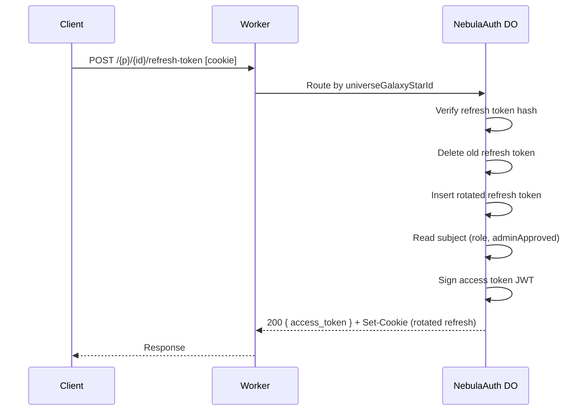
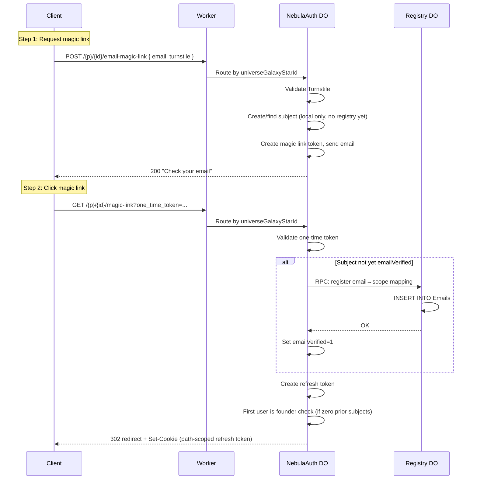
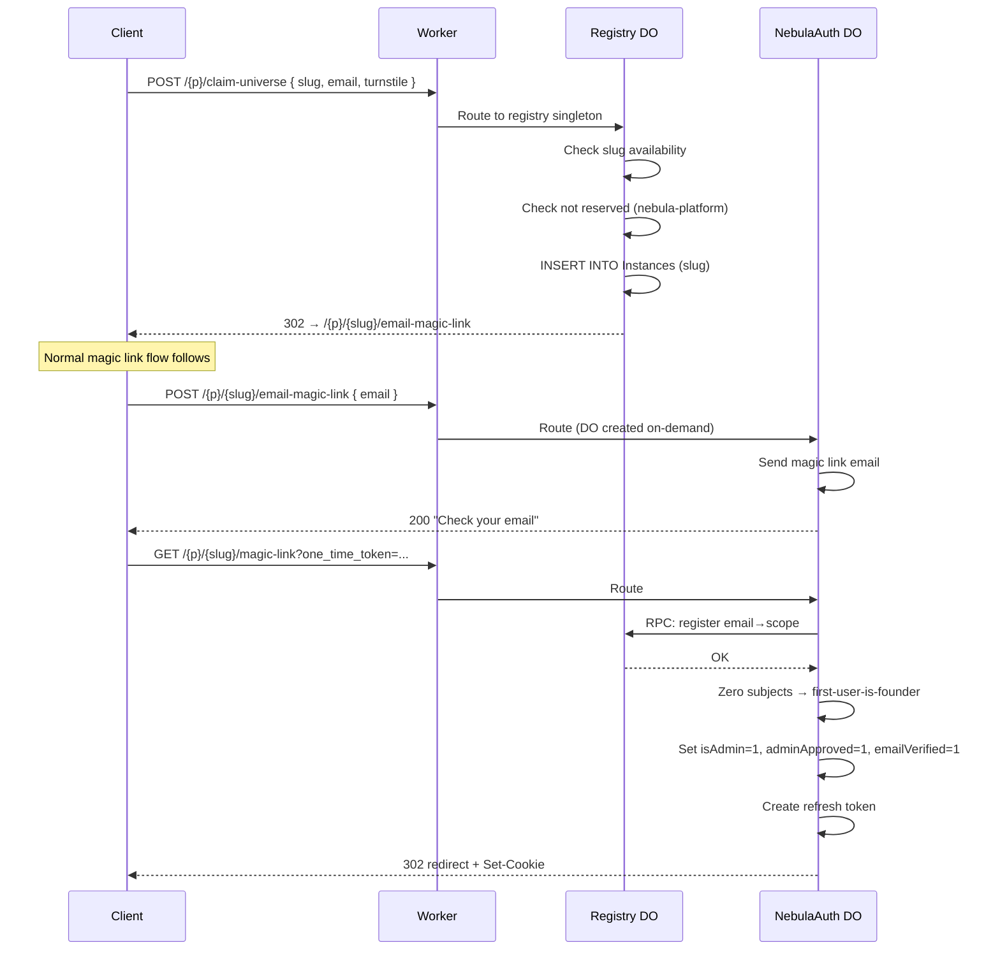
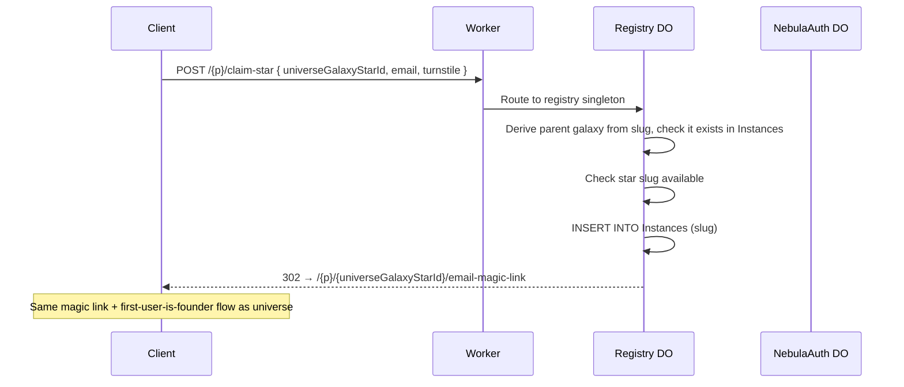
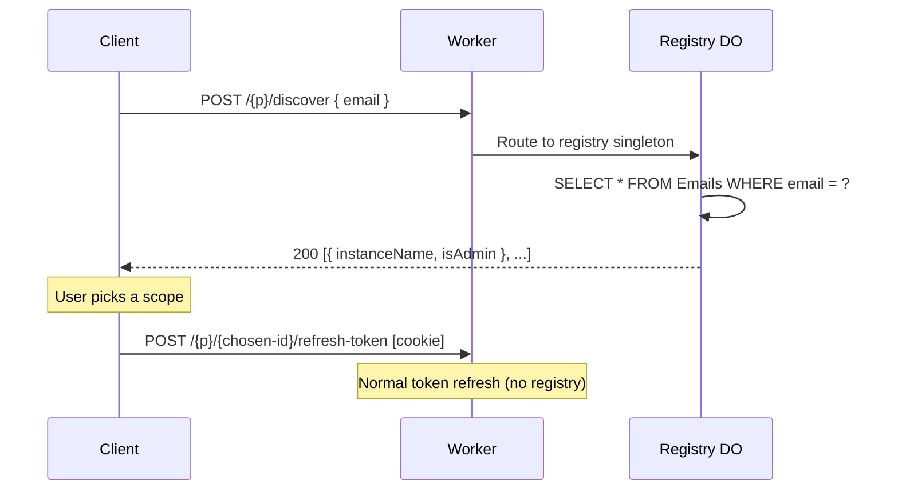
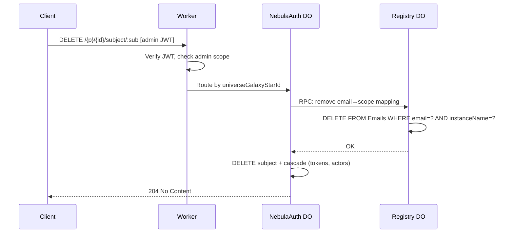
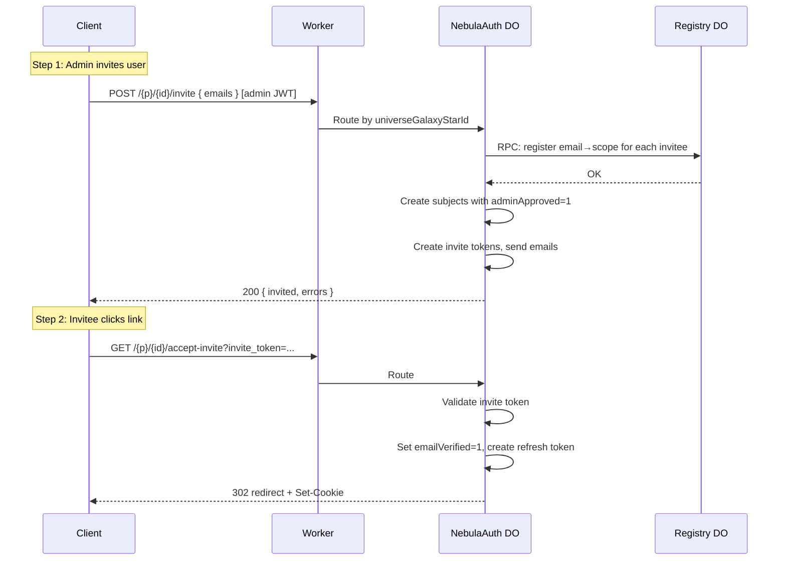
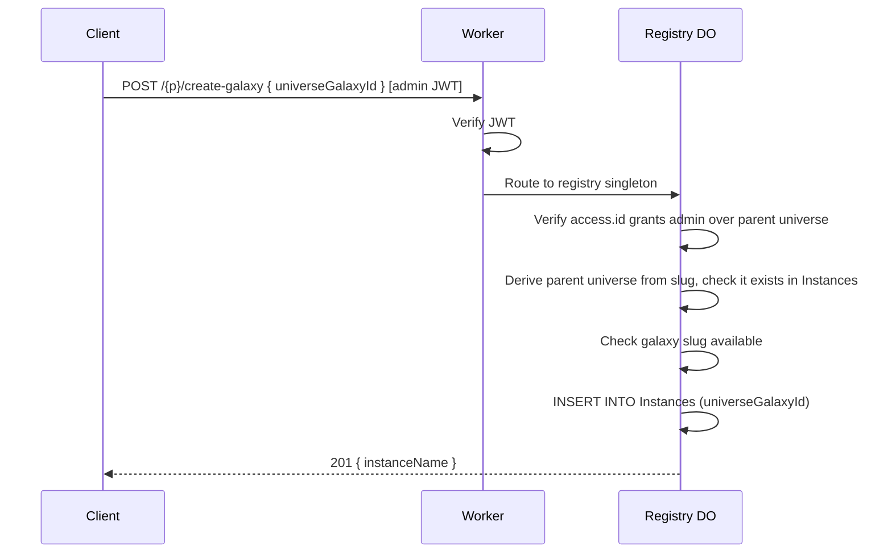

# Nebula Auth

## Overview

`@lumenize/nebula-auth` is a multi-tenant authentication package forked from `@lumenize/auth`. It provides magic link login, JWT access tokens, and admin roles scoped to a three-tier hierarchy: Universe > Galaxy > Star.

The package contains two Durable Object classes:

- **`NebulaAuth` (aka "NA")** — Per-instance auth management (subjects, tokens, JWTs). Each tier maps to a separate instance identified by a `universeGalaxyStarId` in the URL.
- **`NebulaAuthRegistry` ("R", "registry")** — Singleton central registry tracking all instances and email-to-scope mappings. Enables slug availability checks, self-signup flows, and email-based discovery.

Nebula is a BSL 1.1 licensed vibe coding platform built on Lumenize Mesh. Auth is the first piece.

## Business Context

### Dual Multi-Tenancy

- **Universe** — A development organization that is a customer of Lumenize Nebula (company, intrapreneur, solopreneur). Example slug: `george-solopreneur`
- **Galaxy** — An application created by a Universe. Galaxies are themselves multi-tenant. Example slug: `george-solopreneur.georges-first-app`
- **Star** — An organization that is a tenant of a Galaxy. Example slug: `george-solopreneur.georges-first-app.acme-corp`

### Revenue Model (Out of Scope but Informing Design)

Monthly usage reports per `galaxy.star` are sent to Universe billing admins. Universe owners provide code (DWL or webhook) to convert usage into per-Star billing. Lumenize retains ~20% after Cloudflare costs. Free tiers may exist at Universe, Galaxy, and/or Star levels.

### Coach Scenario (Key Business Requirement)

Coaches/consultants work with multiple Lumenize clients simultaneously. A coach may have a different email address per client (issued by the client for access control). Revoking the email revokes access after the current access token expires.

Coaches must be able to switch between clients via tab switching without re-login. This is solved by cookie `Path` scoping (see Multi-Session Architecture below).

---

## Architecture Decisions

### Two DO Classes

| DO Class | Instances | Purpose |
|----------|-----------|---------|
| `NebulaAuth` | One per `universeGalaxyStarId` (+ `nebula-platform`) | Token management, magic link flow, JWT issuance, subject CRUD |
| `NebulaAuthRegistry` | Singleton | Instance catalog, email→scope index, slug availability, discovery, self-signup routing |

`NebulaAuth` instances are the source of truth for their own subjects and tokens. The registry is a secondary index maintained via direct DO-to-DO RPC calls from `NebulaAuth` instances. For subject mutation operations (create, delete, role change), the `NebulaAuth` instance calls the registry *first* — if the registry call fails, the request fails without modifying local state, so there is nothing to roll back. Read-path operations (token refresh, JWT validation) do not involve the registry. The Worker's role is limited to routing and gatekeeping (auth, rate limiting, Turnstile).

### NebulaAuth: Single DO Class, Three Tiers

One `NebulaAuth` class serves all three tiers. The tier is determined by the segment count of the DO instance name:

| Segments | Tier | Example Instance Name | Purpose |
|----------|------|----------------------|---------|
| 1 | Universe | `george-solopreneur` | Universe admin management |
| 2 | Galaxy | `george-solopreneur.georges-first-app` | Galaxy admin management |
| 3 | Star | `george-solopreneur.georges-first-app.acme-corp` | User management + auth |

### URL Format

All auth routes share a single public prefix (`{prefix}`, default `/auth`). The `createNebulaAuthRoutes` helper routes internally:

```
https://lumenize.com/{prefix}/{universeGalaxyStarId}/[endpoint]   → NebulaAuth instance
https://lumenize.com/{prefix}/discover                            → NebulaAuthRegistry
https://lumenize.com/{prefix}/claim-universe                      → NebulaAuthRegistry
https://lumenize.com/{prefix}/claim-star                          → NebulaAuthRegistry
https://lumenize.com/{prefix}/create-galaxy                       → NebulaAuthRegistry
```

The router checks the first path segment after `{prefix}`: reserved keywords (`discover`, `claim-universe`, `claim-star`, `create-galaxy`) go to the registry singleton; everything else is treated as a `universeGalaxyStarId` and routes to the corresponding `NebulaAuth` instance.

- `{prefix}` — Single public URL prefix (default: `/auth`), maps to `NEBULA_AUTH` and `NEBULA_AUTH_REGISTRY` bindings internally
- `universeGalaxyStarId` — 1-3 dot-separated slugs; determines the DO instance

---

## Endpoint Reference

### DO Involvement Key

- **NA** = `NebulaAuth` instance only (no registry call)
- **NA→R** = `NebulaAuth` calls registry via RPC first, then writes locally (registry-first mutation pattern)
- **NA (or NA→R)** = Conditional — registry call only when state change requires it (e.g., first email verification)
- **R** = `NebulaAuthRegistry` only
- **R→NA** = Registry validates/records, then 302 redirects client to `NebulaAuth` endpoint

### Auth Flow Endpoints

| Endpoint | Method | Auth | DOs | Description |
|----------|--------|------|-----|-------------|
| `{prefix}/{id}/email-magic-link` | POST | Turnstile | NA | Request magic link email |
| `{prefix}/{id}/magic-link?one_time_token=...` | GET | — | NA (or NA→R) | Validate magic link → issue refresh token; registry RPC only on first verification |
| `{prefix}/{id}/accept-invite?invite_token=...` | GET | — | NA | Accept invite → set emailVerified, issue refresh token |
| `{prefix}/{id}/refresh-token` | POST | Cookie | NA | Exchange refresh token for access token (hot path, no registry) |
| `{prefix}/{id}/logout` | POST | Cookie | NA | Revoke refresh token, clear cookie |

### Subject Management Endpoints

| Endpoint | Method | Auth | DOs | Description |
|----------|--------|------|-----|-------------|
| `{prefix}/{id}/subjects` | GET | Admin | NA | List subjects in this instance |
| `{prefix}/{id}/subject/:sub` | GET | Admin | NA | Get subject |
| `{prefix}/{id}/subject/:sub` | PATCH | Admin | NA→R | Update subject flags (registry notified if role changes) |
| `{prefix}/{id}/subject/:sub` | DELETE | Admin | NA→R | Delete subject (registry notified) |
| `{prefix}/{id}/invite` | POST | Admin | NA→R | Invite subjects → create with adminApproved, send emails |
| `{prefix}/{id}/approve/:sub` | GET | Admin | NA | Approve subject (email link friendly) |

### Delegation Endpoints

| Endpoint | Method | Auth | DOs | Description |
|----------|--------|------|-----|-------------|
| `{prefix}/{id}/subject/:sub/actors` | POST | Admin | NA | Add authorized actor |
| `{prefix}/{id}/subject/:sub/actors/:actorId` | DELETE | Admin | NA | Remove authorized actor |
| `{prefix}/{id}/delegated-token` | POST | Auth | NA | Request token to act on behalf of another subject |

### Registry Endpoints

| Endpoint | Method | Auth | DOs | Description |
|----------|--------|------|-----|-------------|
| `{prefix}/discover` | POST | — | R | Email-based scope discovery |
| `{prefix}/claim-universe` | POST | Turnstile | R→NA | Self-signup: claim universe slug, redirect to magic link |
| `{prefix}/claim-star` | POST | Turnstile | R→NA | Self-signup: claim star slug, redirect to magic link |
| `{prefix}/create-galaxy` | POST | Admin | R | Admin creates galaxy (records in registry only) |

---

## Sequence Diagrams

In these diagrams, `{p}` = `{prefix}` (the single public URL prefix, default `/auth`).

### Token Refresh (Hot Path)

No registry involvement. This is the most frequent operation (~every 15 minutes per active session).



### Magic Link Login

Registry-first mutation on first verification only: if the subject already exists with `emailVerified=1`, the email→scope mapping is already in the registry and the RPC call is skipped.



### Universe Self-Signup

Registry validates slug availability, then redirects to NebulaAuth for magic link flow.



### Star Self-Signup

Same pattern as universe, but registry validates parent galaxy exists.



### Discovery Flow

Registry-only. No NebulaAuth involvement.



### Subject Deletion (Registry-First Mutation)

Shows the registry-first pattern for any subject mutation.



### Admin Invite Flow



### Galaxy Creation (Admin Only)

Registry-only. No NebulaAuth DO created until first request routes to it.



### Coach Carol Multi-Session

Shows how cookie path scoping enables simultaneous sessions. Cookie paths use `{prefix}` so the browser sends the right cookie to the right path automatically.

```mermaid
sequenceDiagram
    participant C as Carol's Browser
    participant W as Worker
    participant S1 as NebulaAuth (acme.crm.acme-corp)
    participant S2 as NebulaAuth (bigco.hr.bigco-hq)

    Note over C: Tab 1: Login to Star A
    C->>W: Magic link flow for carol@acme.com
    W->>S1: Route
    S1-->>C: Set-Cookie: refresh-token=A; Path=/{p}/acme.crm.acme-corp

    Note over C: Tab 2: Login to Star B
    C->>W: Magic link flow for carol@bigco.com
    W->>S2: Route
    S2-->>C: Set-Cookie: refresh-token=B; Path=/{p}/bigco.hr.bigco-hq

    Note over C: Tab 1 refreshes (only cookie A sent)
    C->>W: POST /{p}/acme.crm.acme-corp/refresh-token [cookie A]
    W->>S1: Route
    S1-->>C: 200 { access_token: "...acme-corp..." }

    Note over C: Tab 2 refreshes (only cookie B sent)
    C->>W: POST /{p}/bigco.hr.bigco-hq/refresh-token [cookie B]
    W->>S2: Route
    S2-->>C: 200 { access_token: "...bigco-hq..." }
```

---

### `universeGalaxyStarId` Format Constraints

Slugs: lowercase letters, digits, and hyphens only (`[a-z0-9-]+`). No periods within a slug. Universe slugs are globally unique. Galaxy slugs are unique within their Universe. Star slugs are unique within their Galaxy. Convention: domain-based Universe names (e.g., `lumenize-com` for `lumenize.com`).

**Reserved slugs** (cannot be used as universe names): `nebula-platform`, `discover`, `claim-universe`, `claim-star`, `create-galaxy`. These are the registry endpoint keywords that the router uses to distinguish registry requests from per-instance requests under the shared `{prefix}`.

### Package Strategy: Fork from `@lumenize/auth`

`@lumenize/nebula-auth` is a fork of `@lumenize/auth`. Individual utility functions will be imported from `@lumenize/auth` where it makes sense:

**Likely imports from `@lumenize/auth`:**
- `signJwt`, `verifyJwt`, `verifyJwtWithRotation`, `importPrivateKey`, `importPublicKey`
- `generateRandomString`, `generateUuid`, `hashString`, `parseJwtUnsafe`
- `verifyTurnstileToken`
- `AuthEmailSenderBase`, `ResendEmailSender`
- `extractWebSocketToken`, `verifyWebSocketToken`, `getTokenTtl`, `WS_CLOSE_CODES`

**Will NOT import (must fork/rewrite):**
- `LumenizeAuth` DO class → becomes `NebulaAuth`
- `createRouteDORequestAuthHooks` → becomes `createRouteDORequestNebulaAuthHooks`
- `createAuthRoutes` → becomes `createNebulaAuthRoutes`
- `createJwtPayload` → new `access` claim structure
- SQL schemas → new schema with `access` claim assembly
- `testLoginWithMagicLink` → new helper supporting multi-star, path-scoped cookies
- Email HTML templates → new Nebula-branded templates
- Types → new `NebulaJwtPayload`, `AccessEntry`, etc.

**New:**
- `NebulaAuthRegistry` DO class
- Self-signup and discovery routes
- DO-to-DO RPC calls from `NebulaAuth` to registry for subject lifecycle events

---

## Data Model

### NebulaAuth: Per-Instance SQLite Schema

Each `NebulaAuth` instance has its own SQLite database. Since each instance represents exactly one `universeGalaxyStarId`, subjects in that instance are members of that tier by definition. No junction table mapping subjects to tiers is needed — DO instance isolation provides that relationship implicitly.

#### `Subjects` Table

| Column | Type | Notes |
|--------|------|-------|
| `sub` | TEXT PK | UUID v4 |
| `email` | TEXT UNIQUE NOT NULL | Lowercase |
| `emailVerified` | INTEGER (0/1) | Set on magic link / invite click |
| `adminApproved` | INTEGER (0/1) | Set by admin |
| `isAdmin` | INTEGER (0/1) | Admin of this tier instance |
| `createdAt` | INTEGER | Unix timestamp (ms) |
| `lastLoginAt` | INTEGER | Unix timestamp (ms), nullable |

`WITHOUT ROWID` — TEXT PK (`sub` is UUID) means SQLite would otherwise maintain both a rowid and a separate PK index, doubling INSERT cost.

Indexes:
- `UNIQUE` on `email` — costs same as `CREATE INDEX` or `CREATE UNIQUE INDEX` (Q3 confirmed no extra cost; use `UNIQUE` constraint since it also enforces uniqueness)
- `idx_Subjects_isAdmin` — partial/filtered index `WHERE isAdmin = 1`. Only costs a write when `isAdmin = 1` (Q9 confirmed partial indexes skip writes when filter doesn't match)

Write costs (per operation):
| Operation | `rowsWritten` | Notes |
|-----------|:-------------:|-------|
| INSERT (non-admin) | 2 | 1 table + 1 email UNIQUE index (partial isAdmin index skipped) |
| INSERT (admin) | 3 | 1 table + 1 email + 1 isAdmin partial index |
| UPDATE isAdmin 0→1 | 2 | 1 table + 1 isAdmin index (email unchanged, not rewritten) |
| UPDATE lastLoginAt | 1 | Non-indexed column, only table row rewritten |
| DELETE | 1 | Index cleanup not counted |

#### `MagicLinks`, `InviteTokens`, `RefreshTokens` Tables

Standard token tables. Each DO instance manages its own tokens independently.

#### `AuthorizedActors` Table

Delegation actor relationships, scoped to the DO instance.

### NebulaAuthRegistry: Singleton SQLite Schema

The registry uses pure SQL with portable types to ease future migration to a horizontally scalable database (e.g., Postgres) if the single-DO model is outgrown.

#### `Instances` Table

| Column | Type | Notes |
|--------|------|-------|
| `instanceName` | TEXT PK | The `universeGalaxyStarId` (e.g., `acme-corp.crm.tenant-a`) |
| `createdAt` | INTEGER | Unix timestamp (ms) |

`WITHOUT ROWID` — TEXT PK means SQLite would otherwise maintain both a rowid and a separate PK index, doubling INSERT cost (2 writes → 1). See write cost research results in `tasks/do-sqlite-write-costs.md`.

Tier and parent are derived from `instanceName`: segment count gives tier (1=universe, 2=galaxy, 3=star), stripping the last segment gives parent.

#### `Emails` Table

| Column | Type | Notes |
|--------|------|-------|
| `email` | TEXT NOT NULL | Lowercase email |
| `instanceName` | TEXT NOT NULL | The `universeGalaxyStarId` |
| `isAdmin` | INTEGER (0/1) | Denormalized from NebulaAuth Subjects table — avoids RPC fan-out during discovery |
| `createdAt` | INTEGER | Unix timestamp (ms) |

`WITHOUT ROWID` with `PRIMARY KEY (email, instanceName)`. Index strategy (informed by write cost research):
- Compound PK already covers email-first lookups (leftmost prefix) — **no separate email index** (Q4 confirmed a redundant leftmost-prefix index doubles write cost for zero query benefit)
- One additional index: `idx_Emails_instanceName` for reverse lookups ("list all emails in this instance") — costs +1 write per INSERT (2 total)
- UPDATE on `isAdmin` (non-indexed column) costs only 1 write — the `idx_Emails_instanceName` index is not rewritten (Q5)
- DELETE always costs 1 write regardless of index count (Q6)

Scope is derived at query time: `instanceName` for stars (3 segments), `instanceName + ".*"` for universe/galaxy (1-2 segments).

#### Registry Write Cost Summary

| Operation | `rowsWritten` | Notes |
|-----------|:-------------:|-------|
| INSERT Instances | 1 | `WITHOUT ROWID`, TEXT PK is the table |
| INSERT Emails | 2 | 1 table + 1 `idx_Emails_instanceName` |
| UPDATE Emails.isAdmin | 1 | `isAdmin` not indexed, only table row rewritten |
| DELETE Emails | 1 | Index cleanup not counted in `rowsWritten` |

---

## JWT Claims

### `NebulaJwtPayload`

```typescript
interface AccessEntry {
  id: string       // universeGalaxyStarId or wildcard pattern (e.g. "george-solopreneur.*")
  admin?: boolean  // true = admin of this scope; omit when false (keeps JWT compact)
}

interface NebulaJwtPayload {
  iss: string            // Issuer
  aud: string            // Audience
  sub: string            // Subject UUID (within the issuing DO instance)
  exp: number            // Expiration (Unix seconds)
  iat: number            // Issued at (Unix seconds)
  jti: string            // JWT ID (UUID)
  adminApproved: boolean
  access: AccessEntry    // Scoped access (one entry per JWT, issued by one DO instance)
  act?: ActClaim         // Delegation chain per RFC 8693 (optional)
}
```

### Access Claim Examples

**Star-level regular user:**
```json
{ "access": { "id": "george-solopreneur.georges-first-app.acme-corp" } }
```

**Star-level admin:**
```json
{ "access": { "id": "george-solopreneur.georges-first-app.acme-corp", "admin": true } }
```

**Galaxy admin (access to all Stars beneath):**
```json
{ "access": { "id": "george-solopreneur.georges-first-app.*", "admin": true } }
```

**Universe admin (access to all Galaxies and Stars beneath):**
```json
{ "access": { "id": "george-solopreneur.*", "admin": true } }
```

**Platform admin (access to everything):**
```json
{ "access": { "id": "*", "admin": true } }
```

### Access Claim Rules

- Each JWT is issued by one DO instance and contains exactly one `access` entry.
- Wildcard `.*` means "this scope and everything beneath it."

### Admin Model

`isAdmin` is contextual to the DO instance that issued the JWT. A Universe admin's JWT carries `{ "id": "george-solopreneur.*", "admin": true }`. The auth hook checks the `access` entry to determine admin status.

For future extensibility, the `AccessEntry` type can grow additional boolean or string fields (e.g., `billing?: boolean`) without breaking the existing format. For now, only `admin` exists.

---

## Multi-Session Architecture (Cookie Path Scoping)

### Problem

Coach Carol works with three clients in separate browser tabs, each with a different email address. Switching tabs must not require re-login.

### Solution: HTTP Cookie `Path` Attribute

Each DO instance sets its refresh cookie with a `Path` scoped to its auth URL prefix:

```
Set-Cookie: refresh-token=<token>; Path={prefix}/acme.crm-app.acme-corp; HttpOnly; Secure; SameSite=Strict
Set-Cookie: refresh-token=<token>; Path={prefix}/bigco.hr-tool.bigco-hq; HttpOnly; Secure; SameSite=Strict
```

The browser **automatically** sends the correct cookie to the correct DO instance based on the request URL path. No client-side cookie management required.

### Access Revocation

When `bigco` revokes `carol@bigco-hr.com`:
- Current access token expires within the access token TTL (~15 min)
- Next refresh attempt fails (subject deleted/revoked in that Star DO)
- Other tabs (`acme`, etc.) are completely unaffected — different DOs, different cookies, different subjects
- The `NebulaAuth` DO notifies registry via RPC to remove the email→scope mapping (discovery results update)

### Admin Hierarchy Access

A Universe admin logs in at `{prefix}/george-solopreneur` (Universe-level DO). Their JWT carries `{ "id": "george-solopreneur.*", "admin": true }`. When they visit a Star-level URL, the auth hook matches the wildcard pattern and grants access. **No separate Star-level login needed.**

The refresh cookie is scoped to `Path={prefix}/george-solopreneur`. Requests to `{prefix}/george-solopreneur.app.tenant/refresh-token` would **not** include this cookie (path doesn't match). But that's fine — the admin doesn't need to refresh at the Star level. They refresh at the Universe level and use that JWT everywhere beneath.

---

## Auth Hooks: `createRouteDORequestNebulaAuthHooks`

The hook pipeline:

1. Extract JWT from `Authorization: Bearer` header or WebSocket subprotocol
2. Verify JWT signature with key rotation support
3. Validate standard claims: `iss`, `aud`, `exp`
4. Parse `universeGalaxyStarId` from the URL (second path segment)
5. Match `access.id` against URL — exact match or wildcard match
6. Check `admin` flag if the endpoint requires admin access
7. Enforce access gate: `admin || adminApproved` for the matching entry
8. Rate limiting per subject
9. Forward request to downstream DO with verified JWT

### Wildcard Matching Algorithm

```
matchAccess("*", "george-solopreneur")                                → true (platform admin)
matchAccess("*", "george-solopreneur.app.tenant")                     → true (platform admin)
matchAccess("george-solopreneur.*", "george-solopreneur")             → true (universe-level access)
matchAccess("george-solopreneur.*", "george-solopreneur.app")         → true (galaxy beneath)
matchAccess("george-solopreneur.*", "george-solopreneur.app.tenant")  → true (star beneath)
matchAccess("george-solopreneur.app.*", "george-solopreneur")         → false (galaxy admin can't access universe)
matchAccess("george-solopreneur.app.*", "george-solopreneur.app")     → true
matchAccess("george-solopreneur.app.tenant", "george-solopreneur.app.tenant") → true (exact)
matchAccess("george-solopreneur.app.tenant", "george-solopreneur.app.other")  → false
```

---

## Access Control

### Access Gate

The access gate is: **`admin || adminApproved`**.

`emailVerified` is not in the JWT because it is always `true` by construction — no refresh token (and therefore no JWT) is ever issued without prior email verification (magic link click or invite acceptance). This invariant holds for future auth methods too (OAuth providers verify email; passkeys require email verification at registration). `emailVerified` is retained in the `Subjects` table to track invite completion state, but it is not a gating claim.

### Admin Approval

A Star admin has full control over who can access their tenant. The invite flow sets `adminApproved=true` at invite time, so invited users pass the gate immediately on first login. Users who request access via magic link without an invite must be explicitly approved by an admin.

---

## NebulaAuthRegistry

### Purpose

The registry is a singleton DO that maintains a global view of the Nebula auth landscape. Individual `NebulaAuth` instances are self-contained for auth flows, but certain cross-cutting concerns require a central index:

1. **Slug availability** — Is `acme-corp` already claimed as a universe? Is `acme-corp.crm.tenant-x` taken?
2. **Discovery** — User enters email, gets back all `universeGalaxyStarId`s they belong to
3. **Self-signup routing** — Validate and record new universe/star claims before delegating to `NebulaAuth` instances
4. **Platform admin visibility** — List all universes, galaxies, stars without using Cloudflare's DO management APIs

Discovery is unauthenticated — the user doesn't have a JWT yet and is trying to figure out where to log in. The registry reveals only which scopes an email is associated with, not any sensitive data. See the [Discovery Flow](#discovery-flow) and [Subject Deletion](#subject-deletion-registry-first-mutation) sequence diagrams for the registry-first mutation pattern in action.

---

## Self-Signup Flows

### First-User-Is-Founder (NebulaAuth Logic)

When a `NebulaAuth` DO instance detects zero subjects in its `Subjects` table during a magic link completion, it treats the first verified email as the founding admin: `isAdmin=1, adminApproved=1, emailVerified=1`. This logic lives in the `NebulaAuth` DO class and applies to all tiers — universes, galaxies, and stars — regardless of how the instance was created (self-signup, admin invite, or platform admin). This means Galaxy authors (Universe admins) don't need to handle first-admin bootstrapping in their app designs — nebula-auth takes care of it.

### Universe Self-Signup

Anyone can claim an unclaimed universe slug and become its founding admin. The registry validates slug availability, records the instance, and redirects to the magic link flow. See the [Universe Self-Signup](#universe-self-signup-1) sequence diagram. Anti-squatting is deferred — platform admin can manually revoke claims if abused.

### Star Self-Signup

The first admin of an unclaimed star within an existing galaxy can self-signup. Same pattern as universe self-signup, but the registry also validates that the parent galaxy exists. See the [Star Self-Signup](#star-self-signup-1) sequence diagram.

### Galaxy Creation (Admin Only)

Galaxies are created by universe admins or the platform admin — no self-signup. The registry validates the JWT scope and records the galaxy. The `NebulaAuth` galaxy DO is created on-demand when the first request routes to it. Most galaxies will not have dedicated galaxy admins — universe admins will manage them directly via wildcard access. See the [Galaxy Creation](#galaxy-creation-admin-only-1) sequence diagram.

---

## Platform Admin (Bootstrap)

### Reserved Instance: `nebula-platform`

`NEBULA_AUTH_BOOTSTRAP_EMAIL` env var designates the platform super-admin (Lumenize operator). This email authenticates at the reserved `nebula-platform` DO instance via standard magic link flow at `{prefix}/nebula-platform`. The one conditional behavior: when the DO recognizes the bootstrap email, it issues a JWT with `{ "access": { "id": "*", "admin": true } }` instead of the normal scope, granting access to all universes, galaxies, and stars. Refresh cookie is scoped to `Path={prefix}/nebula-platform`.

The `nebula-platform` instance goes through the normal magic link flow including the registry RPC on first verification, so it appears in the `Emails` table (`instanceName='nebula-platform'`, `isAdmin=1`). The `Instances` table does not require a corresponding row — `nebula-platform` is a reserved slug that the router always recognizes. Discovery will correctly return it as a scope for the bootstrap email.

The `nebula-platform` slug is safe from collision because we encourage universe names derived from domain names (e.g., `lumenize-com` for `lumenize.com`), and `.platform` is not a valid ICANN TLD.

### Admin Creation Chain

- **Platform admin** creates universe admins (via invite at universe-level DOs)
- **Universe admins** can create other universe admins for their universe, galaxy admins, and star admins
- **Galaxy admins** can create other galaxy admins and star admins beneath them
- **Star admins** manage star users

Each level's invite/approve flow is scoped to its DO instance.

---

## Configuration

Product-level decisions are hardcoded as constants since we control all deployments. Only secrets and operational switches are env vars.

### Environment Variables (secrets + operational)

| Variable | Notes |
|----------|-------|
| `JWT_PRIVATE_KEY_BLUE/GREEN` | Ed25519 signing keys (secret) |
| `JWT_PUBLIC_KEY_BLUE/GREEN` | Ed25519 verification keys (secret) |
| `PRIMARY_JWT_KEY` | Active signing key (`'BLUE'` or `'GREEN'`) |
| `RESEND_API_KEY` | Resend email API key (secret) |
| `TURNSTILE_SECRET_KEY` | Cloudflare Turnstile secret (optional) |
| `NEBULA_AUTH_BOOTSTRAP_EMAIL` | Platform super-admin email (optional) |
| `NEBULA_AUTH_TEST_MODE` | Enable test endpoints (`'false'` default) |

### Hardcoded Constants

| Constant | Value | Notes |
|----------|-------|-------|
| `PLATFORM_INSTANCE_NAME` | `'nebula-platform'` | Reserved DO instance for platform admin |
| `REGISTRY_INSTANCE_NAME` | `'registry'` | Singleton instance name for `NebulaAuthRegistry` |
| `NEBULA_AUTH_PREFIX` | `'/auth'` | Single URL prefix for all auth routes (`{prefix}`) |
| `NEBULA_AUTH_ISSUER` | TBD | JWT `iss` claim |
| `NEBULA_AUTH_AUDIENCE` | TBD | JWT `aud` claim |
| `ACCESS_TOKEN_TTL` | `900` | Access token lifetime (seconds) |
| `REFRESH_TOKEN_TTL` | `2592000` | Refresh token lifetime (seconds) |
| `MAGIC_LINK_TTL` | `1800` | Magic link lifetime (seconds) |
| `INVITE_TTL` | `604800` | Invite token lifetime (seconds) |

### Redirect Logic

Post-login redirect is handled in code (not an env var) — the redirect target will depend on the `universeGalaxyStarId` and potentially other context. Design TBD.

---

## Validation Plan

### Coach Multi-Session Scenario

These tests validate the core multi-session architecture using the `@lumenize/testing` `Browser` class. The Browser class already scopes cookies by name + domain + path (verified in `cookie-utils.ts` `cookieMatches()`), and follows redirects manually to capture `Set-Cookie` headers from intermediate responses — both critical for this scenario.

#### Test: Single Browser, Multiple Path-Scoped Refresh Cookies

Using a **single `Browser` instance** (simulating one real browser), verify:

1. **Login to Star A** — Magic link flow for `carol@acme.com` at DO instance `acme.crm.acme-corp`. Verify `refresh-token` cookie is set with `Path={prefix}/acme.crm.acme-corp`.
2. **Login to Star B** — Magic link flow for `carol@bigco.com` at DO instance `bigco.hr.bigco-hq`. Verify a **second** `refresh-token` cookie is set with `Path={prefix}/bigco.hr.bigco-hq`. Verify the Star A cookie still exists (not overwritten).
3. **Refresh Star A** — `POST {prefix}/acme.crm.acme-corp/refresh-token`. Verify the browser sends only the Star A cookie (path match). Verify access token is issued with `access: { "id": "acme.crm.acme-corp" }`.
4. **Refresh Star B** — `POST {prefix}/bigco.hr.bigco-hq/refresh-token`. Verify the browser sends only the Star B cookie. Verify access token has `access: { "id": "bigco.hr.bigco-hq" }`.
5. **Revoke Star B** — Delete Carol's subject in the `bigco.hr.bigco-hq` DO. Verify Star B refresh fails. Verify Star A refresh still succeeds.
6. **Cookie isolation** — Verify `browser.getCookiesForRequest('{prefix}/acme.crm.acme-corp/refresh-token')` does NOT include the Star B cookie, and vice versa.

#### Test: Universe Admin Wildcard Access

1. **Login at Universe level** — Admin logs in at `acme` (1-segment instance). Refresh cookie set with `Path={prefix}/acme`.
2. **Access Star-level resource** — Use the Universe-scoped JWT (with `access: { "id": "acme.*", "admin": true }`) to access `/nebula/acme.crm.acme-corp/some-resource`. Verify the auth hook grants access via wildcard match.
3. **Cookie path does not match Star auth path** — Verify that `browser.getCookiesForRequest('{prefix}/acme.crm.acme-corp/refresh-token')` does NOT include the Universe cookie (path `{prefix}/acme` is not a prefix of `{prefix}/acme.crm.acme-corp`). This is correct — the admin refreshes at Universe level only.
4. **Verify upward access is denied** — A Galaxy admin JWT for `acme.crm.*` must be rejected when accessing `{prefix}/acme/admin-panel` (galaxy admin cannot access universe).

#### Test: Tab Simulation with Browser Contexts

Using `browser.context(origin)` to simulate separate tabs:

1. **Tab 1 context** — `browser.context('https://lumenize.com')` for Star A operations
2. **Tab 2 context** — `browser.context('https://lumenize.com')` for Star B operations (same origin, shared cookies)
3. Verify both tabs share the same cookie jar (path-scoped cookies coexist)
4. Verify each tab's `fetch` sends only the path-matched cookie when refreshing
5. Verify `sessionStorage` is independent per tab (access tokens stored per-tab)

#### Test: Browser Class Cookie Path Verification

Validate that `@lumenize/testing` Browser correctly implements path scoping (may need upgrade):

1. Set two cookies with same name, same domain, different paths
2. Verify `getCookiesForRequest(url)` returns only the path-matched cookie
3. Verify cookies survive across requests (no accidental overwrite by name)
4. If the Browser class does not properly scope `getCookiesForRequest` by path, upgrade it as prerequisite work

### Registry Scenarios

#### Test: Discovery Flow

1. Create two stars with the same email (`carol@acme.com` in both `acme.crm.star-a` and `acme.crm.star-b`)
2. Query `POST {prefix}/discover` with `carol@acme.com`
3. Verify both scopes returned
4. Revoke Carol from `star-b` (delete subject — `NebulaAuth` DO updates registry via RPC)
5. Query discovery again, verify only `star-a` returned

#### Test: Universe Self-Signup

1. Claim universe slug `new-universe` via `POST {prefix}/claim-universe`
2. Complete magic link flow at `{prefix}/new-universe`
3. Verify founding admin has `isAdmin=1, adminApproved=1`
4. Verify registry `Instances` table has the universe record
5. Verify registry `Emails` table has the email→scope mapping
6. Attempt to claim same slug again → rejected

#### Test: Star Self-Signup

1. Universe admin creates galaxy `new-universe.my-app` via registry
2. New user claims star `new-universe.my-app.tenant-a` via `POST {prefix}/claim-star`
3. Complete magic link flow
4. Verify founding admin status
5. Verify registry records
6. Attempt to claim star under nonexistent galaxy → rejected

#### Test: Galaxy Creation (Admin Only)

1. Universe admin creates galaxy via `POST {prefix}/create-galaxy`
2. Verify registry records the galaxy
3. Unauthenticated request to create galaxy → rejected
4. Star admin JWT attempting to create galaxy → rejected (insufficient scope)

---

## Implementation Phases

### Phase 0: Prerequisites

- **Verify `@lumenize/testing` Browser path scoping** — Write a quick test confirming that the Browser class correctly distinguishes cookies by path in `getCookiesForRequest`. If it doesn't, upgrade the Browser class first.
- **Audit `@lumenize/auth` for importable utilities** — Confirm the exports listed in Package Strategy are stable and usable.
- **~~Research DO SQLite index write costs~~** — DONE. Results in `tasks/do-sqlite-write-costs.md`, experiment code in `experiments/do-write-costs/`. Key decisions applied:
  - All tables with TEXT PK or compound text PK use `WITHOUT ROWID` (saves 1 write per INSERT)
  - No redundant leftmost-prefix indexes (compound PK already covers first-column lookups)
  - `UNIQUE` constraint preferred over separate unique index (same cost, enforces uniqueness)
  - Partial index on `isAdmin` saves writes for non-admin inserts
  - Schema sections above updated with per-operation write cost tables
  - Blog post: Phase 3 of `tasks/do-sqlite-write-costs.md` (separate task)

### Phase 1: Package Scaffold + `universeGalaxyStarId` Parsing

- Create `packages/nebula-auth/` with standard package structure
- `universeGalaxyStarId` validation and parsing: slug regex, segment counting, tier detection
- TypeBox schemas for `AccessEntry`, `NebulaJwtPayload`
- TypeScript types
- Unit tests for parsing and validation

**Expected outcome:** `parseUniverseGalaxyStarId("george-solopreneur.app.tenant")` returns `{ universe: "george-solopreneur", galaxy: "app", star: "tenant", tier: "star", raw: "george-solopreneur.app.tenant" }`. Invalid formats throw.

### Phase 2: NebulaAuth Core

- `NebulaAuth` DO class
- SQL schema (Subjects, MagicLinks, InviteTokens, RefreshTokens, AuthorizedActors)
- Lazy schema init, expired token sweep
- Magic link login flow with path-scoped `Set-Cookie`
- Refresh token flow with path-scoped cookie
- First-user-is-founder logic: zero subjects → first verified email becomes founding admin
- Platform admin: `nebula-platform` reserved instance, bootstrap email conditional → `{ "id": "*", "admin": true }`
- Tier-aware behavior: the DO knows its tier from its instance name segment count
- JWT `access` claim assembly: `{ id: instanceName, admin: isAdmin }` for Star-level; `{ id: instanceName + ".*", admin: isAdmin }` for Universe/Galaxy-level

**Expected outcome:** Full magic link login, refresh, logout working for a single DO instance. Path-scoped cookies verified. First-user-is-founder tested with an empty DO.

### Phase 3: Auth Hooks

- `createRouteDORequestNebulaAuthHooks` — the hook pipeline described above
- Wildcard matching for `access.id` (including `"*"` for platform admin)
- Admin check from matched `access` entry
- Access gate enforcement: `matchedEntry.admin || adminApproved`
- Rate limiting per subject

**Expected outcome:** A Star-level endpoint correctly accepts JWTs from its own Star DO and from Universe/Galaxy admins. Rejects JWTs from unrelated stars or lower-tier admins trying to access higher tiers.

### Phase 4: Coach Scenario Integration Tests

- All coach multi-session tests from the Validation Plan
- Single Browser, multiple path-scoped cookies
- Universe admin wildcard access
- Tab simulation with Browser contexts
- Revocation isolation

**Expected outcome:** Coach Carol scenario works end-to-end. All validation tests pass.

### Phase 5: Admin Endpoints + Invite Flow

- Subject CRUD (list, get, patch, delete) — scoped to the DO instance
- Invite flow (admin invites users to this specific star/galaxy/universe)
- Delegated tokens (act-on-behalf) — scoped to the DO instance
- Bootstrap admin protection (cannot modify/delete self or bootstrap admin)

**Expected outcome:** Full admin management within each DO instance. Invite flow sends emails and creates subjects in the target DO.

### Phase 6: NebulaAuthRegistry

- `NebulaAuthRegistry` DO class with singleton SQLite schema (`Instances`, `Emails`)
- RPC interface for `NebulaAuth` instances to call: register/remove email→scope, update role
- Slug availability check endpoints
- Discovery endpoint (`POST {prefix}/discover`)
- Galaxy creation endpoint (authenticated, validates parent universe exists and JWT scope)
- Self-signup endpoints: `claim-universe`, `claim-star` (validate availability, record in registry, redirect to NebulaAuth instance)
- Wire up registry-first mutation pattern in `NebulaAuth`: subject create/delete/role change calls registry via RPC before local write

**Expected outcome:** Registry tracks all instances and email→scope mappings. Discovery returns correct scopes. Self-signup creates instances and founding admins. Galaxy creation enforced as admin-only. Subject mutations fail cleanly if registry is unreachable.

### Phase 7: Worker Routes + Email Sender

- `createNebulaAuthRoutes` — Worker-level routing to `NebulaAuth` instances and `NebulaAuthRegistry` singleton
- Turnstile validation on magic link endpoint
- Email sender integration (`AuthEmailSenderBase` / `ResendEmailSender` imported from `@lumenize/auth`)
- Email templates adapted for Nebula branding

**Expected outcome:** Complete Worker + DO stack deployed and working.

### Phase 8: Full Integration Tests

- All registry scenario tests from the Validation Plan
- Universe self-signup end-to-end (registry claim → NebulaAuth magic link → registry-first subject creation)
- Star self-signup end-to-end
- Galaxy creation by universe admin
- Discovery flow with multiple scopes
- Subject revocation updates registry via RPC

**Expected outcome:** All self-signup, discovery, and registry notification flows working end-to-end.

### Phase 9: Documentation

- `/website/docs/nebula-auth/*.mdx` files
- `@check-example` annotations linked to `test/for-docs/` tests
- API reference page following the auth package pattern
- Update `website/sidebars.ts`

---

## Follow-On Work (Out of Scope)

The following are important notes for when we finish `@lumenize/nebula-auth` and start on `@lumenize/nebula` proper.

### `callContext` Upgrade

The `starId` will be in the `instanceName` property of `callContext.callChain[0]` if the call originated from a Client. However, you can create a new callChain with `{ newCallChain: true }` and calls might originate from a non-Client, like in an alarm handler, so we need another immutable property in callContext for `starId` that is available in all three node mesh types. A particular mesh DO will keep it in storage and will only ever be part of one `starId`. Same thing for Client/Gateway but it's kept in the WebSocket attachment instead of DO storage. For Workers, the `starId` will come from the caller, and outgoing calls will have to propagate that.

My first thought on how to accomplish this is with NebulaDO, NebulaWorker, NebulaClient, and NebulaClientGateway classes that extend the Lumenize* equivalents and override the default onBeforeCall, callContext, and maybe even call itself so only calls within the same `starId` will be allowed. Remember, users won't be extending these and deploying them.

### NebulaClient Adaptation

`NebulaClient` will need to know its `universeGalaxyStarId` so it can target the correct refresh endpoint (for path-scoped cookie matching). It stores the current access token in memory and refreshes against `POST {prefix}/{universeGalaxyStarId}/refresh-token`.

### Email Domain Claiming

A Star admin can claim an email domain (e.g., `acme-corp.com`), which automatically sets `adminApproved: true` for any user who logs in with an email from that domain. This removes the manual approval step for organizations where email ownership is sufficient proof of membership.

**Design notes:**
- A disallow list prevents claiming common public email domains (gmail.com, yahoo.com, outlook.com, etc.)
- No burdensome domain verification (DNS TXT record, etc.) is required. The Star admin is opening access to their own tenant — they are only potentially hurting themselves, so we can trust them until there's a problem.
- Stored in the DO instance's SQLite: a `ClaimedDomains` table with `domain TEXT PK` and `claimedAt INTEGER`
- The magic link login flow checks claimed domains after verifying the email, before the admin approval gate
- The same domain can be claimed by Stars in different Galaxies — each DO instance is independent, so `acme.crm.tenant-a` and `bigco.hr.tenant-b` can both claim `example.com` without conflict
- **Open question:** Should multiple Stars *within the same Galaxy* be allowed to claim the same email domain? If yes, the URL determines which Star the user is logging into (no ambiguity — the login page is already scoped to a specific Star). If no, a Galaxy-level uniqueness constraint would be needed, which requires cross-DO coordination that contradicts the self-contained instance model. Needs analysis before implementation.

### Billing Infrastructure

Usage tracking per `galaxy.star`, monthly report generation, Universe-level billing formulas via DWL/webhooks.
