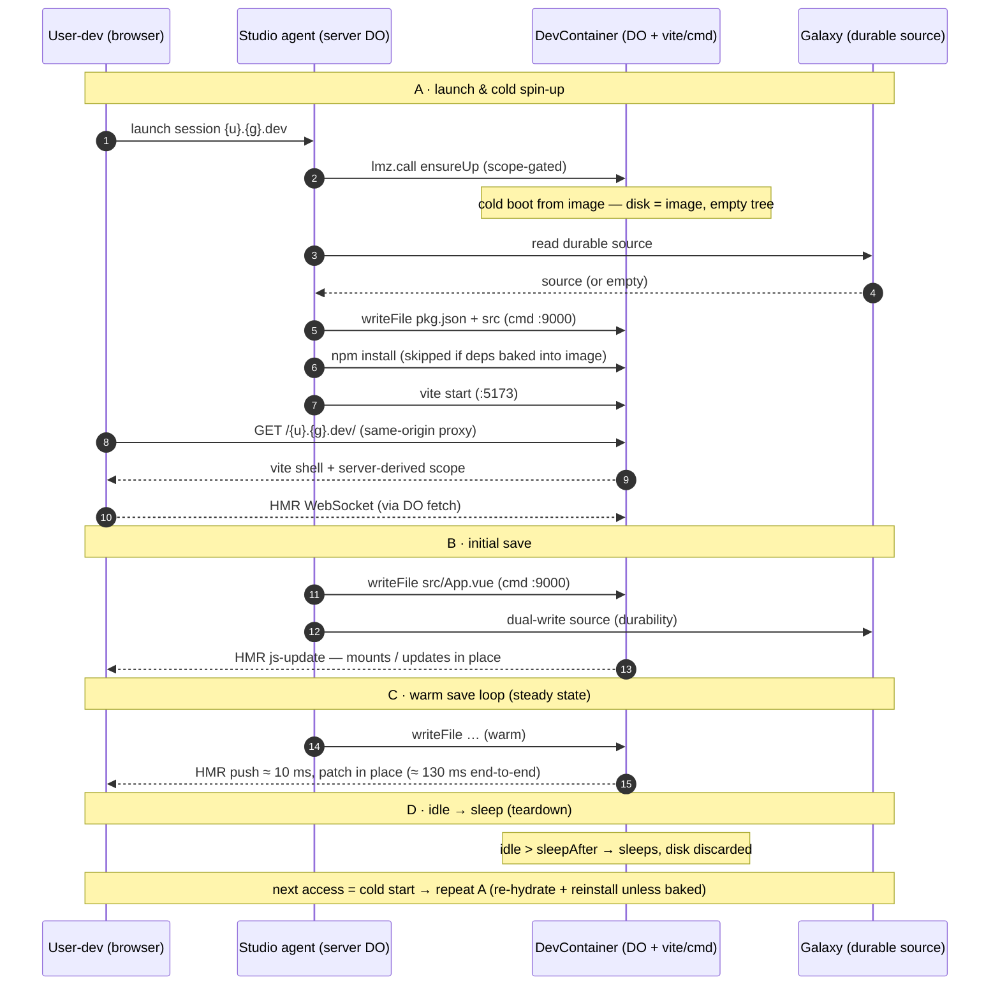

# Nebula Studio — Container dev-loop (DevContainer on the 4th node type)

**Status**: 2026-06-18 — Studio build-seq #1a (the container-vite dev loop). Phases 0–3 ✅ **mechanism-validated on a throwaway experiment** (deployed; now torn down); **Phase 2 browser-half + HMR ✅** (real browser). **⚠️ Not yet productionized into `apps/nebula`** — the real integration is the new **Phase 3.5 (DRAFT, needs `/review-task` + human — inserted AFTER the original framing+conformance review, so NOT covered by it)**; **Phase 4 (in-DO teardown) is gated on Phase 3.5.** Original Phases 0–4 reviewed framing+conformance 2026-06-18. Supersedes the in-DO compile/serve approach (frozen as the `in-do-compile-baseline` tag); [`tasks/nebula-studio-compile-pipeline.md`](nebula-studio-compile-pipeline.md) owns that history + the Phase-4 teardown reference.
**Phase**: Studio build-seq #1a. Builds on **step 2 ✅** — [`tasks/nebula-devcontainer-node-type.md`](nebula-devcontainer-node-type.md) (`LumenizeContainer`/`NebulaContainer`, landed; ADR-007 Accepted).
**App**: `apps/nebula/` (`DevContainer extends NebulaContainer`) + a dev-container image. **Mesh platform layer** — data/agent comms over mesh, never raw primitives.
**Parent**: [`tasks/nebula-studio.md`](nebula-studio.md) § *UI-build architecture*.

## Goal
The Studio dev preview runs a **per-sandbox `DevContainer`** (a Cloudflare Container) running real **vite** with HMR. The browser loads the app **shell** (+ HMR) from DevContainer at `/{dev-container}/{u}.{g}.dev/…` and makes **data** calls to **DevStar** over the mesh — two same-origin paths, no DO→DO hop. Real vite buys Tailwind JIT + tree-shaking (~2 kB gz CSS vs ~58 kB in-DO, ~28×), per-app lib pinning, and a prod path served container-less from static assets. The data layer (Star/Galaxy/mesh/reactive store) is unchanged.

## ⚠️ Work-safety prerequisite (read before Phases 1–2)
The container working tree is **ephemeral** — any container sleep/restart loses uncommitted source (strictly worse than DevStar's gated `deleteAll`). The dev loop is therefore **not work-safe for real user-developer use until source durability holds**: the Galaxy source dual-write + re-hydrate-on-restart, which is **owned by no build task today** (`nebula-app-versioning.md:58` builds the Galaxy draft store but its orchestration is "design-only / owned by no build task"; `dev-star.md:95` pins "do not wire the live reset until source-durability holds"). **This task ships the loop *mechanism* (Phases 0–3); wiring it live for real use is gated on that orchestration** (mirrors dev-star.md, which shipped the reset mechanism and deferred live-wiring). Phase 2 carries an `it.skip` blocker for "agent file write survives a container restart via re-hydrate." **Sequencing flag for the human:** someone must own the save-orchestration (`nebula-studio.md` § Durable draft ownership) before the loop is usable end-to-end — likely sequenced with Studio proper.

## ⚠️ Testing reality — real-infra, NOT pool-workers
A `Container`-based node **cannot construct under vitest-pool-workers** (no container engine → `ctx.container` undefined → ctor throws; [[container-no-construct-pool-workers]], proven in the node-type build). So this task inverts the pool-workers-first norm:
- **Dev iteration**: local `wrangler dev` + Docker (the agent-channel spike's setup). **⚠️ Caveat (found 2026-06-18, Phase 2):** a `LumenizeContainer` (which pins `enableInternet=false`) does **not** start under local `wrangler dev` on **Colima** — the `proxy-everything` egress sidecar severs (`Network connection lost`). Until that's sorted (or Docker Desktop is used), the reliable container-dev loop on this machine is **deployed** (`wrangler deploy` + WARP). See the Phase 2 blocker note below.
- **Deployed e2e**: **local `wrangler deploy` with Cloudflare WARP on** — WARP fixes the registry-push sever that blocked local container deploys ([[cf-container-deploy-proxy]], RESOLVED 2026-06-18). (The `deploy-container.yml` GHA workflow was **deleted** 2026-06-18 now that local deploys work; recreate from git history + that memory if headless/CI container deploys are ever needed.)
- **Pool-workers** still covers everything non-container: the mesh seam/guard (done against harnesses in the node-type build), the scope-injection derivation as a pure function, and the entrypoint **gate-level** behaviour (status codes decided before DO construction — see M3/M2 below).
The container-touching phases (0–2) are **exploratory** (real-infra discovery): deliverable = capable-of-failing tests for the discovered behavior **plus a findings note** (what worked + what didn't). Where a criterion needs a live Container, it runs on `wrangler dev`/CI or is `it.skip` + a named blocker — never asserted against a stub.

## DevContainer design
- **`DevContainer extends NebulaContainer`** — a **sibling of `DevStar`** (different base class), per-sandbox, addressed `{u}.{g}.dev` (the node type's M3 addressing).
- **Env binding name is pinned `DEV_CONTAINER`** (the URL path segment is its kebab, `dev-container`). Expose **exactly one** env binding name that case-varies from `dev-container` — `routeDORequest`'s `generateBindingVariations` smart-match throws `MultipleBindingsFoundError` if both `DEV_CONTAINER` and e.g. a test `DevContainer` exist (the live-path analogue of dev-star.md:58's `DEV_STAR` guard).
- **Two ports, one container**: vite on **5173** (the public preview, the container's `defaultPort`); a **command-server on 9000** reachable **only** via the DO's internal `containerFetch(req, 9000)`. The public `fetch()` can never reach 9000 — `LumenizeContainer.fetch()` strips the inbound `cf-container-target-port` header and pins `defaultPort` (the Q5 trust boundary, enforced by the node core). The command-server's own in-container surface is the same trust domain as the container (node/git/vite + the user-developer's frontend source) — agent-*authored* server code runs elsewhere (a Star facet / Worker-Loader isolate), not in this container.
- **`fetch()` is the public preview surface** (outside the mesh guard, by design — ADR-007: a node's own `fetch()` is public-by-design, secured by its own logic, never *assumed* gated). It must **branch three ways**, not delegate a streamed `super.fetch()` to everything:
  - a **WebSocket upgrade** (vite HMR) → forward `super.fetch()` **verbatim** (101/null-body; never buffered);
  - the **shell `index.html`** GET → buffer (or `HTMLRewriter`) the proxied body, inject scope (below) + strict-CSP headers, return a **fresh** Response;
  - any **other asset** GET → stream `super.fetch()` unchanged.
  vite's config owns the app base path (`/{dev-container}/{u}.{g}.dev/`) + SPA deep-link semantics; pin vite's **inbound** `server.allowedHosts` to the expected edge origin(s) (a Host-header / DNS-rebinding defense — distinct from Phase 3's *outbound* egress allow-list, despite the shared name), not the spike's `true`.
- **`fetch()`-path identity init (the B1 fix — a small `@lumenize/mesh` node-core enhancement).** `routeDORequest` sets the `x-lumenize-do-binding-name` / `x-lumenize-do-instance-name-or-id` headers **before** routing to the DO, but the landed `LumenizeContainer.fetch()` only strips `cf-container-target-port` — it never stamps identity, so `this.lmz.instanceName` is `undefined` on a cold GET (the normal browser-navigation case). **Upgrade `LumenizeContainer.fetch()` to `__init` the lmz identity from those routed headers** before delegating — mirroring `LumenizeDO.fetch()`'s `__initFromHeaders` (incl. its reject-a-64-hex-id validation; the framework first-write-wins guard keeps the fetch() and mesh paths consistent). This makes `this.lmz.instanceName` valid on the fetch() path for **every** container node, symmetric with the mesh path. #1a makes this change as the consumer that surfaces the gap (CLAUDE.md: extend the package, don't work around it in Nebula).
- **Scope-injection choke point (server-derived — the wrong-Star footgun guard).** With identity stamped on the fetch() path (above), `DevContainer.fetch()` derives `activeScope` from **`this.lmz.instanceName`** (`{u}.{g}.dev`) and `authScope` from its parent galaxy (`getParentId`/`parseId` → `{u}.{g}`), and reads `appVersion` from the resident app-version record — **all server-side, never from a request body/query/cookie** — substituting them into the shell HTML. *Load-bearing:* a request-influenceable **or empty** `activeScope` would pass a shape-check yet silently route the client's data calls to `STAR` instead of `DEV_STAR` via `#starBinding()` (`dev-star.md:55`).
- **Agent → DevContainer over the mesh.** The agent is a **server-side Nebula DO/facet** (NOT a process inside the container); it reaches DevContainer via `lmz.call` (`onBeforeCall`-gated `@mesh` methods), and its `callContext` must carry `activeScope={u}.{g}.dev` (or a Galaxy-admin bypass) to pass `NebulaContainer.onBeforeCall` (the inherited scope guard) — the dev-Star admin active-scope flow. The methods `containerFetch(9000)` → command-server → file writes / vite control / git. The spike's proven ~30 ms warm edge-local channel, now over real mesh (not the spike's raw RPC).
- **No alarm need.** Warm-while-focused / idle shutdown is `Container`'s own `sleepAfter` field (its owned lifecycle) — **not** `svc.alarms` (the mesh core takes none) and not `Container.schedule()`. `apps/nebula` uses no `svc.alarms` anywhere.

## Requirements / invariants
- **Public-shell GET is ungated** (no JWT): browsers don't attach `Authorization` to navigations/sub-resource loads, and the shell carries only public frontend code + ontology types every client gets anyway. JS-initiated `fetch`/WS still carry tokens and stay gated (`onBeforeConnect`/`onBeforeCall`). The entrypoint's GET/HEAD-passthrough targets the DevContainer binding (Phase 2; M3).
- **Auth is reused unchanged**: the served app authenticates via the existing `/auth` flow; the dev user is a Galaxy admin (one wildcard cookie + refresh to `activeScope={u}.{g}.dev`); auth DOs are separate from the Star, so **login survives a DevStar wipe**.
- **Strict CSP** (no `unsafe-eval`): a vite build emits runtime-only Vue (render functions precompiled), so the browser needs no compiler.
- **HMR owns dev file-save reload.** A base-`Star` reload channel (`subscribeReload`/`broadcastReload`) **stays in place** for #1b's publish→refresh; this task neither uses nor removes it (see Phase 4).

## Phases

### Phase 0 — DONE ✅ 2026-06-18 (deployed smoke passed)
**Refinement vs. the spec below:** Phase 0 ran as a **self-contained minimal deploy** (`experiments/container-node-phase0/`, a real `LumenizeContainer`-based `SmokeContainer`), NOT wired into `apps/nebula/wrangler.jsonc` — isolating the kill-fast variable (does the node core deploy+construct+coexist on real infra?) from the much bigger "first deploy of the whole nebula Worker" project. The `DEV_CONTAINER` wiring into `apps/nebula` moves to Phase 1, where the preview actually needs it. In-phase refinement, not a reorder.

**Findings (the exploratory deliverable — what worked):**
- **Decorator bundling (resolved locally, no CI needed):** `wrangler 4.86 deploy --dry-run` bundled the Worker (with the `@mesh` TC39 decorator + full mesh imports + `node:async_hooks`) and **transformed the decorator correctly** (`__decorateElement`/`__decoratorStart`/`__runInitializers` helpers in the output, zero literal `@mesh(` surviving, `lumenize.mesh.callable` marker preserved). **⇒ every Lumenize mesh node — incl. `apps/nebula` — can deploy via plain `wrangler deploy`; no swc/custom-build step needed.** (The dry-run's only failure was the Docker/container-image step — expected locally; that's the CI-only half.)
- **CI deploy works:** deployed via the proven temporary `on: push` trigger on `deploy-container.yml` (workflow_dispatch is unavailable — the file isn't on the default branch). Run `27764802476`, ~1m34s, image built+pushed from GitHub's runner. Deployed `https://container-node-phase0.transformation.workers.dev` (container app `container-node-phase0-smokecontainer`).
- **Smoke result (curl):** `{ constructed: true, meshResult.$result: "pong from phase0-smoke", coexistence: { type: "LumenizeDO", bindingName: "SMOKE", instanceName: "phase0-smoke", hasContainerSchedulesTable: true, hasAlarm: true } }`. ⇒ on a **real Container**: the node constructs (`ctx.container` populated); an inbound `lmz.call` lands via `__executeOperation` + stamps identity; and the composed Lumenize identity (`__lmz_do_*` kv) **coexists** with `Container`'s own lifecycle (`container_schedules` table + alarm slot from its ctor). **This closes the node-type task's deferred `it.skip` m2 coexistence blocker against a real artifact.**

**Teardown (owed):** the throwaway `container-node-phase0` Worker + its container app are deployed; tear down once findings are captured (mirrors the agent-channel spike's deployed-infra teardown). The `experiments/container-node-phase0/` dir is the throwaway smoke (prune with the other in-DO experiments per `workflow.md`).

<details><summary>Original Phase-0 spec (kept for the record)</summary>

### Phase 0 — `DEV_CONTAINER` wiring + bare deployed smoke test — *exploratory*
A **kill-fast gate**: prove *any* `NebulaContainer` constructs + coexists on real infra **and** the CI deploy pipeline works, before investing in the vite image. (A deliberate second CI deploy — accepted, mirrors running the Q5 spike first.)
- **Deliverable (closes the node-type's deferred deployability note, `nebula-devcontainer-node-type.md:146`):** add the `DEV_CONTAINER` DO binding to `apps/nebula/wrangler.jsonc`, register the class under **`new_sqlite_classes`**, and add the top-level **`containers` block** (image / `class_name` / `instance_type`, sized to Phase 3's ≥ `standard-1`) — prod currently has none. A minimal `NebulaContainer` subclass + trivial image for this phase; Phase 1 swaps in the real DevContainer image.
- **Success (capable-of-failing + findings note) — the deployed-e2e-only delta** (the kv-stamping half is already covered in pool-workers by the node-type build): on a **live** Container, after one inbound `lmz.call`, `Container`'s `container_schedules` table + alarm slot (created by its constructor lifecycle) and the Lumenize `__lmz_do_*` identity keys are **all present together**, and the inbound call returns via `__executeOperation` with `onBeforeCall` fired. (This closes the node-type's `it.skip` m2 coexistence half against a real artifact; the construction-doesn't-throw fact falls out of the call landing.)

</details>

### Phase 1 — command-channel slice DONE ✅ 2026-06-18 (deployed, validated on real infra)
The command-channel + preview + trust-boundary slice is validated on a **live deployed** container (`container-node-phase0`, overwriting the Phase-0 smoke; `SmokeContainer extends LumenizeContainer` + the spike's reused vite app + command-server, driven over the mesh via `@mesh` methods). **Deployed via local `wrangler deploy` + WARP** (WARP fixes the registry-push sever — confirmed 2026-06-18; the GHA workflow stays as the headless fallback). Curl probes:
- **`/cmd`** — `exec({cmd:'git'})` over the mesh → `{stdout:"git version 2.39.5", code:0}`, warm ~4–40 ms (matches the spike). ✅ command channel works.
- **`/preview`** — the DO's `fetch()` proxies vite → 200 + the shell with `/@vite/client` (real vite + HMR client on 5173). ✅ public preview works.
- **`/boundary`** — a public request carrying `cf-container-target-port: 9000` returns the **vite shell**, not the command-server → the header is stripped, the command port is unreachable from the public surface. ✅ **M1 trust boundary holds on real infra** (closes the node-type's M1/M4 live `it.skip`).
- **`/`** — coexistence still green post-redeploy.

**m3 made concrete + fixed:** the FIRST containerFetch races the cold boot and CF returns a `"Failed to…"` **text** body — which blindly `.json()`-ing throws a `SyntaxError`. Fix: `#cmdJson` reads once and surfaces ANY non-2xx **or** 2xx-non-JSON as the typed retryable `ContainerUnavailableError` (not just 503/429). The dev loop retries on it; `sleepAfter` keeps the container warm during active dev so the cold path is only the first / post-idle command.

**Still open in Phase 1 (carry forward):** the cold-start now *should* surface the typed error (correct-by-construction; couldn't re-trigger — a Worker-code redeploy reused the image + kept the container warm); loopback-binding the command-server (defense-in-depth — deferred: changing the bind addr in `command-server.mjs` risks the `containerFetch` channel and needs interactive debugging, not a blind solo redeploy). HMR + scope-injection are **Phase 2** (need a browser). **Two-overlapping-commands contention — largely answered by Phase 3's `/starvation` probe:** a long child-process `exec` (the 4.74 s `vite build`) did **not** block 12 concurrent `/healthz` round-trips (steady 60–73 ms) — the command-server **interleaves** rather than serializes, because each command is a spawned child + the http handler is async. The strict two-`/exec` case (two child spawns) follows by the same mechanism; a dedicated probe would only confirm CPU-sharing, not the serialization question (now settled).

<details><summary>Original Phase-1 spec (kept for the record)</summary>

### Phase 1 — `DevContainer` image + class: vite preview + agent command channel — *exploratory*
- Dev-container image: `node` + git + the vite app + the command-server (the spike's `command-server.mjs` shape, production-aimed; bind loopback-only as cheap defense-in-depth). `DevContainer extends NebulaContainer`, `defaultPort = 5173`, `sleepAfter` for warm-while-focused.
- Agent command channel: `@mesh`-guarded methods (exec / writeFile / vite-control), each `containerFetch(req, 9000)` → command-server. **Surface container-unavailability as a typed failure:** `containerFetch` returns 503 (no instance) / 429 (rate-limit) as **Responses, not throws** (`container.js:874/877`); the method must check status and surface a recognizable error to the `lmz.call` caller (by `err.name`, per mesh.md / ADR-002) — **not** a 200 carrying a 503 body. So the loop can distinguish "container starting/evicted" from "write succeeded."
- **Re-validate the trust boundary** (the node-type's m4 "receiver re-validates"; the deployed form of the node-type's M1/M4 `it.skip`): a public `fetch()` carrying `cf-container-target-port: 9000` must **not** reach the command server, asserted against a **live two-port container**.
- **Success (capable-of-failing + findings note):** the agent (over real mesh, `onBeforeCall`-gated) writes a file / runs a vite command and gets output back; a command against a **cold / just-woken** container returns **correct output** (correctness, distinct from warm latency — the spike's ~1.36 s cold case is the common post-`sleepAfter` path); `GET /{dev-container}/{u}.{g}.dev/` returns vite's shell from 5173; a public request targeting 9000 is refused; an unavailable-container command surfaces a typed error. **Findings note:** warm channel latency on the chosen instance size; the behaviour of **two overlapping command calls** sharing the single command-server (serialized / interleaved / error) so single-port contention is characterized, not discovered in prod.

</details>

### Phase 2 — scope-injection slice DONE ✅ 2026-06-18 (server-side validated on real infra)
The **scope-injection + header-strip half** is validated on the live deployed container (`container-node-phase0`, consolidated to one `demo.app.dev` instance). `SmokeContainer.fetch()` now branches three ways (WS upgrade verbatim / shell `index.html` buffer+inject / asset stream) and injects the **server-derived** scope into the shell as a `<meta name="nebula-scope">` (strict-CSP-friendly; no inline script). Curl-validated:
- **`/preview`** → `injectedScope = {activeScope:"demo.app.dev", authScope:"demo.app", appVersion:"dev"}`, vite client present. ✅ scope injected, derived from `this.lmz.instanceName` (the B1 fetch-path stamp), parent galaxy for `authScope`.
- **`/preview-decoy`** → a request-supplied `?activeScope=evil.g.dev` is **ignored**; the injected value is the routed `demo.app.dev`. ✅ **wrong-Star footgun guard holds — server-derived, never request-supplied** (the Stage-2 review's highest-risk surface, validated on real infra).
- **`/boundary`** → `cf-container-target-port:9000` stripped → vite shell, not the command-server. ✅ M1 again.

**Phase 2 browser half DONE ✅ 2026-06-18 (real browser + WS-timed, on deployed `standard-1`).** Validated against the live container via a transparent preview passthrough added to the experiment's Worker (`/` + assets + WS forward to `previewStub.fetch()`; a `/touch?v=` route rewrites `App.vue`'s `marker` ref over the command channel to simulate an agent save). A real browser **mounted** the app through the workers.dev same-origin proxy (Vue live, count button increments) and **HMR updated on file write** — the heading cycled `v0→alpha→…→v0` with no full-page reload. A node `WebSocket('wss://…/', 'vite-hmr')` client (the same proxy path the browser uses — so the **HMR WS routes through the proxy**, the residual-risk surface, ✅) timed the loop:
- **Full agent-write→browser-has-update-frame: median 131 ms (116–167, n=6).**
- **HMR push alone (file-change→update frame): ~10 ms** (9–12 ms isolated; so fast the frame sometimes beat the listener-arm in the first probe pass).
- **Update type `js-update`** on `/src/App.vue` + `/src/style.css` — a hot module swap, **NOT** `full-reload` (answers the in-place-vs-reload discriminator definitively). **Human-confirmed in the live browser:** no flicker / no full repaint, the heading changed in place — corroborating the WS probe's `js-update` read.
**Interpretation (kills the "save/refresh is ~5 s painful" worry):** the 4.74 s is the *publish* `vite build`, NOT the interactive loop; the loop is a ~10 ms hot-swap wrapped in a network write. The ~130 ms is **network-dominated** (laptop→workers.dev→container over WARP); in prod the agent writes from a **server-side Nebula DO via edge-local `containerFetch`** (~30 ms warm, spike), so the real loop is *faster* than this measurement, with the ~10 ms HMR push constant. Probe: `/tmp/hmr-probe2.mjs` (throwaway). The deferred `it.skip` ("write survives a container restart via re-hydrate") is unchanged — still blocked on source-durability orchestration.

**⚠️ Local-container blocker (durable finding — affects the "dev = local wrangler dev" premise above):** a `LumenizeContainer` does **NOT start under local `wrangler dev` on Colima** — image builds + uploads fine, but the container start severs with `Network connection lost` / `Container failed to start`. Cause: `LumenizeContainer` pins the secure `enableInternet=false`, which engages Cloudflare's `proxy-everything` egress sidecar; that sidecar's connection to the container fails inside the Colima VM (Docker Desktop was not running to compare — the agent-channel spike that ran "local" may have used DD). Compounding gotcha: **`override enableInternet = true` does NOT bypass it** — `@cloudflare/containers`' `Container` reads `enableInternet` in its **constructor**, before subclass field initializers run, so the ctor-time value is still the base's `false`. **Consequence:** the browser/HMR validation had to be done **deployed** (`wrangler deploy` + WARP), not local — the deployed path is the reliable container-dev loop on this machine until the Colima `proxy-everything` issue (or a DD retry) is sorted. Captured in [[container-no-construct-pool-workers]]'s sibling reference.

**Two real-infra findings this build (durable):**
1. **`wrangler delete <worker>` does NOT delete the container application or its running instances** — they linger and eat the running-instance quota (a deleted Worker's 3 instances blocked a new container from starting). Use **`wrangler containers delete <app-id>`** to fully clean up. (Surfaced cleanly *because* the m3 typed error reported "Maximum number of running container instances exceeded" instead of a `SyntaxError`.)
2. Two `lite` (¼-vCPU) containers + the account running-instance cap → a fresh container can't start; consolidating to one instance (and Phase 3's ≥`standard` sizing) avoids it.

<details><summary>Original Phase-2 spec (kept for the record)</summary>

### Phase 2 — Same-origin preview proxy + HMR + scope injection — *exploratory*
- Implement the three-way `fetch()` branch + the server-derived scope injection (Design § above).
- **Entrypoint serving-target switch (M3):** add the `DEV_CONTAINER` binding to the entrypoint's ungated GET/HEAD passthrough ([`apps/nebula/src/entrypoint.ts:84-95`](../apps/nebula/src/entrypoint.ts) — the hardcoded `isServingTarget`), so the preview is reachable. Register an **inert `DEV_CONTAINER` binding** in `test/test-apps/baseline/test/wrangler.jsonc` so the gate-level assertions are exercisable. (The STAR/DEV_STAR removal is Phase 4.)
- **Salvage** the in-DO #1a's same-origin vite-proxy + iframe-mount chromium harness — the `/dev-star` path-preserving proxy block in [`apps/nebula/vitest.config.js`](../apps/nebula/vitest.config.js) + the preview-mount/CSP/network assertions in [`apps/nebula/test/chromium/self-hosted-preview-browser.test.ts`](../apps/nebula/test/chromium/self-hosted-preview-browser.test.ts) — repointed at a `wrangler dev` DevContainer. Conceptual prior art: [[mesh-browser-test-template]], `preview-iframe-spike.md`.
- **Success criteria (split by where they can run):**
  - *Pool-workers (gate-level, on the inert binding):* a GET/HEAD to `DEV_CONTAINER` is `isServingTarget` (no 404); a non-GET is 405; a GET to a non-serving binding (e.g. `GALAXY`) is 404. (These gate before DO construction, so they're pool-workers-testable.)
  - *Real-browser (chromium, `wrangler dev`):* the preview loads + mounts; **HMR updates on a file write** — with an **HMR-vs-reload discriminator**: stamp ephemeral in-iframe state (a sentinel set after load) **before** the agent's file write, assert the edited content appears **and** the sentinel survives (a full reload would clear it); strict CSP holds (runtime-only Vue, no `unsafe-eval`); **WS upgrade is forwarded, not buffered** (a naive `await response.text()`-on-everything regression goes red).
  - *Scope-injection (capable-of-failing, COLD container — first traffic = GET, no prior mesh call):* the injected `activeScope`/`authScope` equal `this.lmz.instanceName` / its parent galaxy — **valid on a cold GET because `LumenizeContainer.fetch()` stamped identity from the routed headers**. **Mutation #1:** revert the fetch()-path `__init` → `lmz.instanceName` `undefined` → injection empty → red (proves the B1 fix is load-bearing). **Mutation #2 (decoy):** issue the preview GET with a request-supplied decoy (`?activeScope=other.g.dev` / crafted header) on a correctly-routed `{u}.{g}.dev` container → the injected value is the server-derived one, not the decoy (temporarily reading the decoy in `fetch()` confirms red). Plus: a non-`dev` third segment surfaces the guard, not a silent `STAR` route.
- **`it.skip` (named blocker — Work-safety prerequisite above):** an agent file write **survives a container restart** via Galaxy re-hydrate — blocked on the source-durability orchestration (owned by no build task; `nebula-app-versioning.md:58` / `nebula-studio.md` § Durable draft ownership).

</details>

### Phase 3 — Egress hardening + sizing DONE ✅ 2026-06-18 (validated on real infra; one refinement deferred)
Validated on the live deployed container (`container-node-phase0`, version `7112c12a`, `demo.app.dev`), `instance_type` bumped `lite → standard-1`. Curl probes `/egress` + `/starvation`.

**Egress — secure-by-default HOLDS (the core criterion ✅):** `LumenizeContainer`'s `enableInternet=false` blocks **all** non-allow-listed outbound — a container `fetch('https://example.com')` is BLOCKED. This is the security criterion and it is met on real infra.

**Egress allow-list (open npm) — DEFERRED, diagnosed two layers deep:** opening an *allow-listed* HTTPS host needs more than `allowedHosts`:
1. `export { ContainerProxy } from '@cloudflare/containers'` in the Worker (else `ctx.exports.ContainerProxy is undefined` → container won't start). ✅ done.
2. `interceptHttps = true` — `allowedHosts` only intercepts HTTP unless this is on (`container.js` `applyOutboundInterception` gates HTTPS interception on it). Turning it on **did** activate interception (the block-mode changed from a silent `TimeoutError` to an immediate `TypeError`), **but the allow-listed npm host still fails**: HTTPS interception is a **MITM**, so the in-container TLS client must trust the interceptor's CA — node doesn't by default → cert-validation `TypeError`. **Fully opening an HTTPS allow-listed host also needs CA-trust provisioning in the image** (`NODE_EXTRA_CA_CERTS` / install the CF interception CA). **Deferred** — and *not on the dev-loop critical path*: the image bakes deps at build time (`Dockerfile` `npm install`), so **runtime** npm egress isn't needed for the current loop; runtime per-app lib pinning is a later capability. (Owner question #1 below — this outbound build-time allow-list is distinct from the Star-facet's agent-app egress `globalOutbound`→`EgressBroker`, [[project_nebula_outside_world]] D2, and from vite's *inbound* `server.allowedHosts`, Phase 2.)

**Sizing — `standard-1` clears the starvation bar (✅):** with `instance_type: standard-1` (½ vCPU), a `vite build` (4.74 s, exit 0) ran concurrently with **12** command-channel `/healthz` round-trips (all 12 overlapping the build): latency stayed **60–73 ms, zero failures, `starved=false`**. The spike's ¼-vCPU starvation signature (`000`/`>1 s`) does **not** appear at `standard-1` — so the dev instance need not push `vite build` off the interactive moment at this size (the pin's "runs off the interactive instance" mitigation is unnecessary at ≥`standard-1`; revisit only if a heavier app build regresses). The steady ~70 ms (vs. lite's starvation) also corroborates the egress probe ran on the fresh `standard-1` instance.

**Probe mechanism (the exploratory deliverable):** `/egress` and `/starvation` endpoints in `experiments/container-node-phase0/src/index.ts` drive `exec`/`noop` over the real mesh receive seam; `/starvation` fires `npm run build` without awaiting, then times `/healthz` round-trips during it (Date.now() deltas across the awaited `containerFetch` I/O — how the spike measured). `interceptHttps`/`instance_type` are the discovered config knobs.

<details><summary>Original Phase-3 spec (kept for the record)</summary>

- **Egress (pinned):** on top of `LumenizeContainer`'s `enableInternet=false`, the dev default is an explicit **`allowedHosts` allow-list** for the npm registry (+ whatever the toolchain needs). This is the container's **outbound build-time** traffic — distinct from the Star-facet's agent-app egress (`globalOutbound`→`EgressBroker`, [[project_nebula_outside_world]] D2), which is **deferred to the agent-code-execution task** and does not belong here, *and* distinct from vite's **inbound** `server.allowedHosts` (Phase 2).
- **Sizing (pinned):** dev instance ≥ `standard-1`, **and** `vite build` runs off the interactive instance/moment so it can't starve the command channel (spike Q2: a `vite build` saturates the ¼-vCPU default).
- **Success:** an in-container `fetch` to a non-allow-listed host is blocked; a `vite build` burst does not return `000`/`>1 s` on a concurrent trivial command call (the spike's starvation signature — findings-graded against the chosen instance).

</details>

### ⚠️ Phase 3.5 — `apps/nebula` DevContainer integration — **DRAFT (needs `/review-task` + human; NOT build-ready)**
**Why this phase exists (found 2026-06-18):** Phases 0–3 validated the dev-loop **mechanisms on the throwaway experiment** (`experiments/container-node-phase0`, `SmokeContainer extends LumenizeContainer`) — node deploy/coexist, command channel + trust boundary, scope injection, egress, sizing, **browser mount + HMR** — but they were **never productionized into `apps/nebula`** (verified by grep: the in-DO compile/serve is still the only Studio preview path; no `DevContainer`/`DEV_CONTAINER` binding/`containers` block — only `nebula-container.ts`, the node base). The original Phase 0/1/2 specs *targeted* `apps/nebula`; the DONE-records refined them onto the experiment, so that work is outstanding. **Phase 4 is gated on this.**

**The model shift this phase makes (the non-obvious part — this is NOT transcription).** Today `apps/nebula` has **no vite**: `DevStar.compileSFC` ([`dev-star.ts:141`](../apps/nebula/src/dev-star.ts)) hand-rolls a Vue-SFC compile (`compile-module.ts` via the bundled `tsc`) → `rewriteServedSpecifiers` (allow-list `vue` + `lucide-vue-next/icons/*` → self-origin) → stores compiled modules + a scaffold in the Star's `AppBundle` SQLite table → serves them ungated via `Star.onRequest`'s `getPlatformAsset`/`getAsset` branch ([`star.ts:145`](../apps/nebula/src/star.ts)), injecting `__ACTIVE_SCOPE__`/`__AUTH_SCOPE__`/`__APP_VERSION__` placeholders. **The container model replaces ALL of that with real vite running on a source tree** (the experiment's proven path): the agent writes the user-developer's source into the container's working dir over the command channel; vite serves the shell+HMR on 5173; `DevContainer.fetch()` proxies it with the server-derived scope injected as a `<meta>` (not placeholder substitution). So Phase 3.5 *builds the vite-in-container preview*, and Phase 4 *deletes the entire in-DO compile/serve machinery it supersedes* (`compile-module`, `specifier-rewrite`, `platform-assets`, `app-bundle`, `bundle-tsc`, the `getPlatformAsset` branch). **`DevStar` itself stays** — it remains the dev **data** Star (subscribe/transactions/reload channel); only its inherited *serve/compile* role moves to `DevContainer`. The two are siblings: shell from `DEV_CONTAINER`, data from `DEV_STAR` (the client's `#starBinding()` already routes `*.*.dev` → `DEV_STAR`, [`nebula-client.ts:860`](../apps/nebula/src/nebula-client.ts) — unchanged).

**Dev cycle (simplified — `DevContainer` DO + container collapsed into one lane; the DO persists, the container disk is ephemeral).** Graduates to a cleaned-up mermaid diagram in `website/docs/nebula/` once the loop is built (Docusaurus mermaid is enabled; `.md` is fine).



**Pinned (carried from the experiment + the reviewed original specs):**
- `DevContainer extends NebulaContainer` (NOT the bare `LumenizeContainer` the experiment used) → inherits the `onBeforeCall` active-scope guard ([`nebula-do.ts:57`](../apps/nebula/src/nebula-do.ts)): mesh calls from the agent must carry `activeScope={u}.{g}.dev` (or a Galaxy-admin bypass). `defaultPort=5173`, `sleepAfter`, `enableInternet=false`, `interceptHttps=true`+`allowedHosts`+`export { ContainerProxy }` for egress (Phase 3 — but see the local-dev caveat).
- `fetch()` three-way branch (WS verbatim / shell+inject server-derived scope / asset stream) + the B1 routed-header identity stamp — proven on the experiment.
- Touch-points: `DEV_CONTAINER` binding + `new_sqlite_classes` reg + `containers` block (`standard-1`) in [`wrangler.jsonc`](../apps/nebula/wrangler.jsonc); the entrypoint M3 serving-target switch (`isServingTarget` += `env.DEV_CONTAINER`, [`entrypoint.ts:85`](../apps/nebula/src/entrypoint.ts)); a new `src/dev-container.ts`; the `/dev-container` path-preserving proxy in [`vitest.config.js`](../apps/nebula/vitest.config.js) + the salvaged [`self-hosted-preview-browser.test.ts`](../apps/nebula/test/chromium/self-hosted-preview-browser.test.ts) repointed at a `wrangler dev` DevContainer.
- **Reload channel stays** (`reload-subscriptions.ts`, `subscribeReload`/`broadcastReload`) — it's #1b publish→refresh, not dev HMR (HMR covers file-save).

**⚠️ Gating dependency — source durability (the SAME blocker as the Work-safety banner at the top).** The container working tree is ephemeral; the agent's source must be **dual-written to Galaxy + re-hydrated on container restart** ([`nebula-app-versioning.md`](nebula-app-versioning.md) Phase 2 + the unbuilt save-orchestration). Today `compileSFC` takes source as an inline param — there is no source-from-Galaxy fetch wired. **Recommendation (mirrors how this task + `dev-star.md` shipped):** Phase 3.5 ships the **mechanism** (vite-in-container preview + command channel + scope) with an `it.skip` for "source survives restart," and live source-durability wiring stays gated on that orchestration. So Phase 3.5 does NOT itself unblock *live* user-developer use — it unblocks **Phase 4** (a working container preview exists to replace the in-DO serve).

**Dependency / image-shape strategy (Q#1 — RESOLVED 2026-06-18: bake, single-version, flat `node_modules`).** The cold-start cost is dominated by re-creating `node_modules` (the container disk reverts to the image on every cold boot — no persistent volume; only the image is durable). **Recommendation: bake the curated common UI lib set (Vue/Vite/Tailwind/Lucide — no native binaries) into the image** so cold start runs **zero `npm install`** for supported deps; only the user-developer's *source* re-hydrates (from Galaxy). Runtime `npm install` then shrinks to the rare per-app extra pin. **Single version per package (Larry, 2026-06-18):** bake the latest approved version of each supported package — one version each — so a **flat `node_modules` is sufficient and pnpm/multi-version is moot** (the libs are already in the project). The approved list grows over time but stays single-version. **R2 npm-mirror: rejected** — the npm registry is already CDN-fronted, so a mirror buys little for speed; its only value is policy/curation, which a curated bake already provides, and the container→mirror hop would still be egress (the deferred `interceptHttps`/CA-trust work). A baked store needs **zero runtime egress** — strictly better for "secure by default," and it retires most of Phase 3's deferred egress allow-list. **Empirical (bench `experiments/container-dep-install-bench`, plain Docker `--cpus=0.5` ≈ `standard-1`, 2026-06-18):** curated set `node_modules` = **84 MB / 62 pkgs, no native binaries**; baked image = **139 MB**. `npm install` **cold = 20 s**, **warm-cache = 5 s** (download ≈ 15 s, unpack ≈ 5 s). **Decisive:** CF containers have **no persistent volume across instances**, so the 5 s warm path *never exists on CF* — every cold start boots the image with an empty `~/.npm`, making runtime install *always* the ~20 s cold path. **Baking is the only durable store** → cold start = **0 install** (first-bake ~20 s, paid once at image build). A proxy/R2 mirror would shave the ~15 s download but the ~5 s unpack still recurs every cold start (+ still egress) → can't reach 0; rejected. pnpm ≈ npm at this size; its value is multi-version dedup (bake the **pnpm store** as the layer if multi-version matters). Version-bump leaves no clutter (npm v10 dedupes: `vue@3.4`→`@3.5` = one vue). See `RESULTS.md`.

**⚠️ The prune trap (decides the package.json strategy).** A reconciling `npm install` deletes *extraneous* packages (in `node_modules` but not in the dependency tree), so if the project `package.json` lists only the subset an app imports, the next install nukes the pre-baked extras and kills the 0-install win. Two models:
- **Model A (recommended) — platform-managed manifest:** the baked `package.json` declares the **full approved palette**; the user-developer imports a subset and *stops importing* to drop a lib (vite tree-shakes unused deps out of the build). Removal is a **non-event** — zero npm ops, **zero runtime egress**, nothing pruned. Most walled-garden-/secure-by-default-consistent; fully retires the egress allow-list for the core.
- **Model B — agent-managed `package.json`:** removals are cheap `npm uninstall`s, but any reconcile prunes the baked set, and adding a **non-approved** package needs a runtime install (~20 s cold + the deferred `interceptHttps`/CA-trust egress).
An **open-ended long tail** (non-approved packages) only works under B and reintroduces runtime install + egress *for those packages*. **Demo = model A, core set only.** A/B confirmation pending. **'Behind latest' version-drift notice = image-tag level, deferred post-demo** (compare the app's pinned approved-set tag to the latest; keeping multiple image tags is what lets an app stay on an older set — that's where any "multiple versions" need lives, at the image-tag level, not within one `node_modules`).

**Other open questions for review / the human (do NOT decide solo):**
1. **Compile ownership:** confirm vite fully owns compile (so `compileSFC` + the specifier-rewrite allow-list are deleted, not preserved) — i.e., no in-DO compile fallback. (Likely yes; it's the pivot's point.)
2. **Build-order crux — source durability is on the cold-start critical path, not deferrable as I first implied.** Re-hydrate-from-Galaxy runs on *every* cold start (the diagram below), so a "mechanism-only" loop works beautifully until the first `sleepAfter` sleep, then comes back **empty**. Honest options: **(a)** bake a *fixed demo app* into the image so cold start is self-sufficient without Galaxy — enough to *demo* the loop, not real user-developer source; or **(b)** bring the Galaxy source dual-write + re-hydrate ([`nebula-app-versioning.md`](nebula-app-versioning.md) Phase 2) **forward into Phase 3.5** rather than deferring it. (a) unblocks Phase 4 sooner; (b) is the real loop. Pick before build.
3. Addressing: keep `{u}.{g}.dev` for the DevContainer instance (same as DevStar's `.dev`)? Then `DEV_STAR` and `DEV_CONTAINER` share the third-segment `dev` marker but are different bindings — confirm `routeDORequest`'s `generateBindingVariations` smart-match doesn't collide (the dev-star.md:58 guard analogue).

**Test strategy (accounts for the testing-reality constraint):**
- *Pool-workers-able (no container):* the entrypoint M3 gate-level behavior (GET/HEAD to an **inert** `DEV_CONTAINER` binding → serving-target/no-404; non-GET → 405; non-serving binding → 404) via an inert binding in the test wrangler; the `DevContainer.onBeforeCall` scope guard via a non-Container harness (as the node-type build tested `NebulaContainer`); the scope-injection derivation as a pure function.
- *Deploy-gated (real container — already mechanism-proven on the experiment):* the actual vite preview mount + HMR + the trust boundary, validated by the salvaged chromium harness against a deployed `apps/nebula` (the **first full nebula Worker deploy** — a real prerequisite/cost), or `it.skip` + the no-construct/no-local-start blockers ([[lumenize-container-local-dev]], [[container-no-construct-pool-workers]]).

### Phase 4 — Teardown of the superseded in-DO compile/serve (salvage-first)
**Gated on Phase 3.5 (the `apps/nebula` integration above) — NOT merely the experiment's Phases 0–3.** Deleting the in-DO serve before `apps/nebula` has a working `DevContainer` would remove Studio's only preview path. *Then* the in-DO code is dead reference; the `in-do-compile-baseline` tag is the cold fallback, so deleting from HEAD is safe. (Phase 3.5 salvages the proxy harness + CSP intent.) Drive the removal by a **residual grep** (per `tasks/README.md` § Inventories — a hand-picked list silently passes when a new importer is added pre-build), e.g.:
```
grep -rn 'getPlatformAsset\|compileSFC\|rewriteServedSpecifiers\|platform-assets\|specifier-rewrite\|bundle:tsc\|VUE_RUNTIME_JS' apps/nebula/src apps/nebula/scripts apps/nebula/package.json
```
returns zero residual after removing: the vendoring (`scripts/vendor-assets.mjs`, `vendor/platform-assets.generated.mjs`, the `vendor:assets` script + `daisyui`/`lucide-vue-next` devDeps → move into the container's own `package.json`, the Vue/DaisyUI/Lucide vendored-redistribution entries in `ATTRIBUTIONS.md`); the in-DO compile + serve (`src/{specifier-rewrite,platform-assets,compile-module}.ts`, `DevStar.compileSFC` + its `rewriteServedSpecifiers` call, `app-bundle.ts`'s `VUE_RUNTIME_JS`/`daisyui.css` bits, `Star.onRequest`'s `getPlatformAsset` serve branch, `vendor/tsc-transpile.bundle.mjs` + `scripts/bundle-tsc.mjs` + the `bundle:tsc` script); the browser-worker `DevStar` wiring (`test/browser/worker/` `DevStar` export + `DEV_STAR` binding + migration; regen `worker-configuration.d.ts`) and the superseded tests (`self-hosted-preview-browser.test.ts` once its harness is salvaged into Phase 2, `specifier-rewrite.test.ts`, the rewrite/serving additions in `dev-star-compile.test.ts`/`dev-star-serve.test.ts`).
- **Entrypoint serving-target removal (M3):** remove STAR/DEV_STAR from the ungated GET/HEAD passthrough (`entrypoint.ts:84-95`) now that their `onRequest` serve branch is gone — else a latent ungated-GET surface points at a binding that no longer serves. **Criteria (split):** *pool-workers* — GET/HEAD to `DEV_STAR` returns 404, a non-GET returns 405 (gate-level, testable); *real-infra* — GET/HEAD to the `DEV_CONTAINER` binding still passes through (or `it.skip` + the no-construct blocker). Ensure the `worker-configuration.d.ts` regen here doesn't orphan the Phase-2 `DEV_CONTAINER` addition.
- **`nodejs_compat` caveat:** keep the flag (correct hygiene), but its original trigger (`@vue/compiler-sfc`→`node:os`) leaves with `compile-module` — **re-verify what still needs it** Worker/DO-side (likely nebula-auth, not the SFC compiler).
- **Do NOT remove** the reload channel (`reload-subscriptions.ts`, `subscribeReload`/`broadcastReload`/`handleReload`, the `dev-star.ts` call site) — HMR covers dev file-save, but the channel stays in place for #1b's publish→refresh (per the Requirements/invariants).
- Icebox/archive `nebula-studio-compile-pipeline.md` + `nebula-self-hosted-assets.md` once this lands.

## Dependencies / out of scope
- **Source durability (Q6 / #1b)** — the load-bearing prerequisite for *live* use (see the Work-safety banner). Owned by `nebula-app-versioning.md` Phase 2 + the unbuilt save-orchestration; named, not reimplemented here.
- **#1b registry → R2 asset sets** — the app-version registry concept survives but retargets from in-DO `AppBundle` SQLite to R2 / Workers Assets; prod static-asset serving + clean-URL/custom-domain routing are 1b / the prod-serve task. Reconcile, don't revert.
- **The agentic generation loop (Studio proper)** + **agent-authored server-code egress** (the `EgressBroker` path, Phase 3 note) — separate tasks; this builds the dev *substrate* the agent drives, not the generation loop or the in-app code-execution sandbox.

## References
[`tasks/nebula-devcontainer-node-type.md`](nebula-devcontainer-node-type.md) (the node type this builds on; its `it.skip` blockers = Phase 0/1 here); [`tasks/nebula-studio.md`](nebula-studio.md) § *UI-build architecture*; [`tasks/nebula-studio-compile-pipeline.md`](nebula-studio-compile-pipeline.md) (superseded in-DO #1a — Phase-4 teardown reference; the server-injected three-value scope choke point this preserves); [`tasks/nebula-app-versioning.md`](nebula-app-versioning.md) (#1b — source durability + R2 registry); [`tasks/dev-star.md`](dev-star.md) (the data-side sibling + the reset/durability precondition + the `DEV_STAR` smart-match guard); `experiments/container-agent-channel/FINDINGS.md` + [[agent-channel-container-exec]] (command channel + sizing); [[cf-container-deploy-proxy]] (WARP fixes local deploy; the GHA workflow was deleted 2026-06-18, recreate for CI); [[container-no-construct-pool-workers]] (testing reality); [[mesh-browser-test-template]] (chromium harness); `apps/nebula/src/entrypoint.ts` (the `isServingTarget` edit site).
