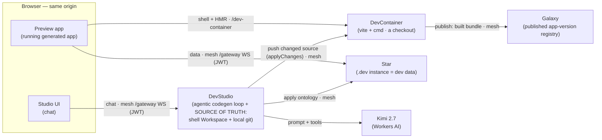
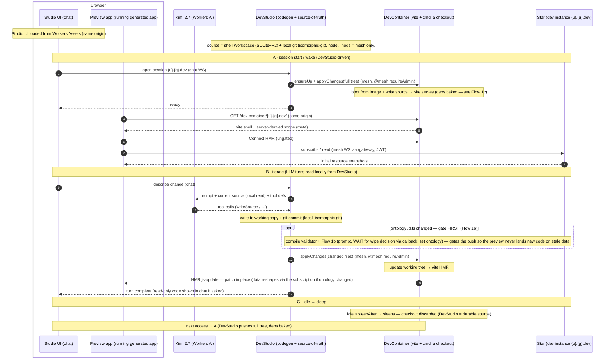
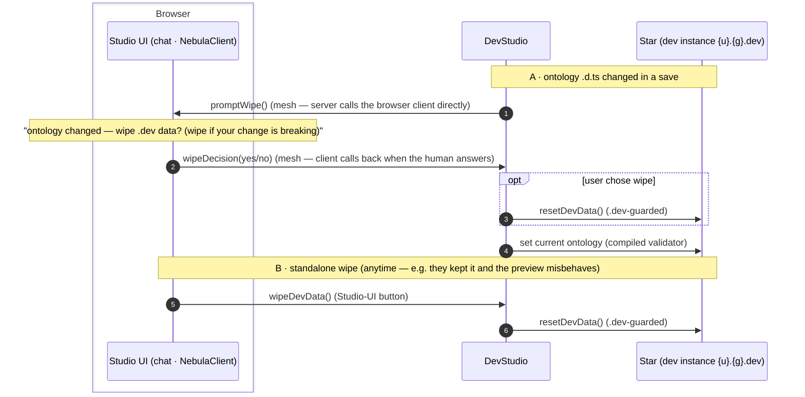
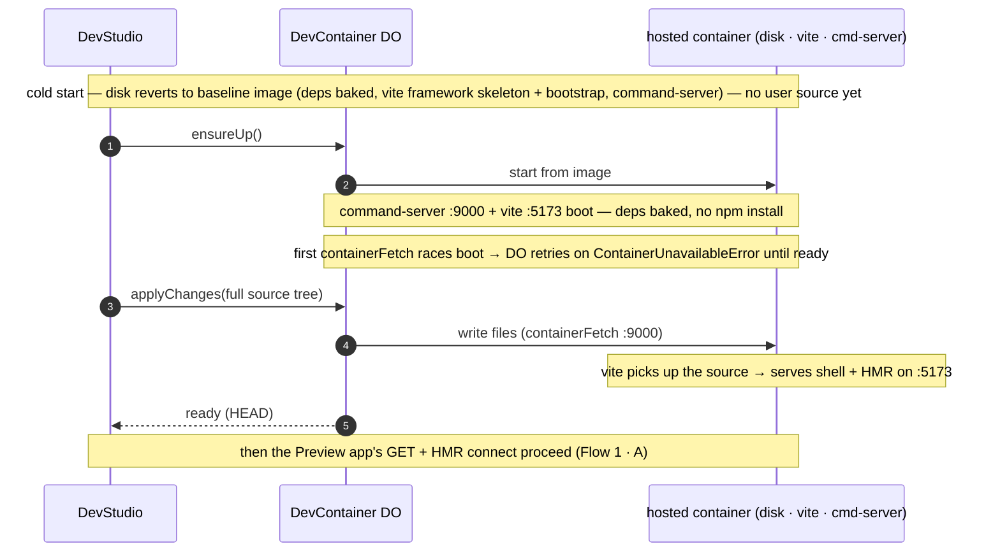
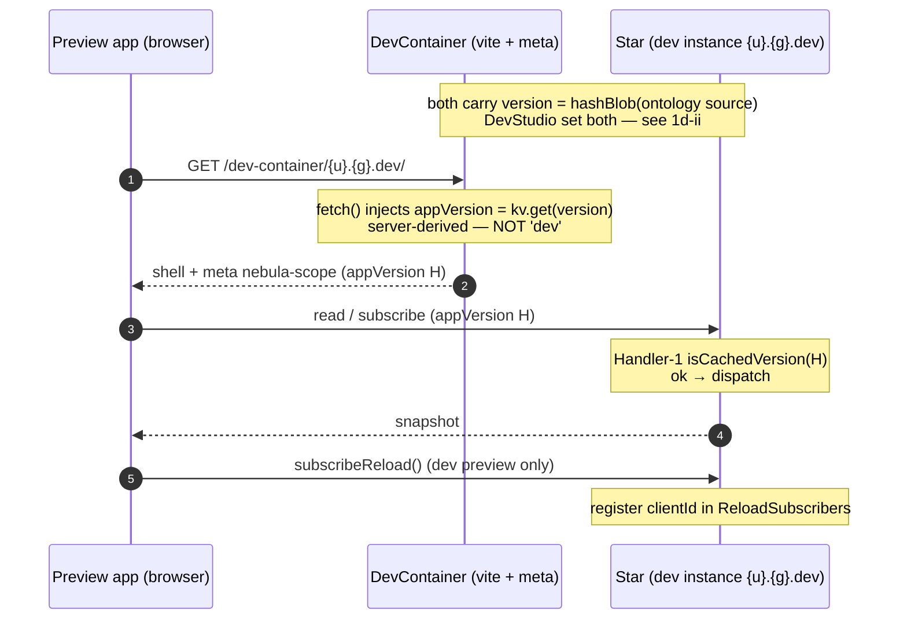
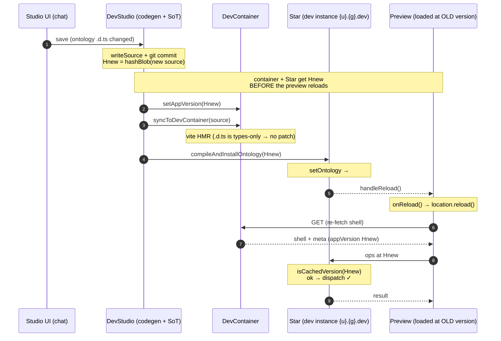
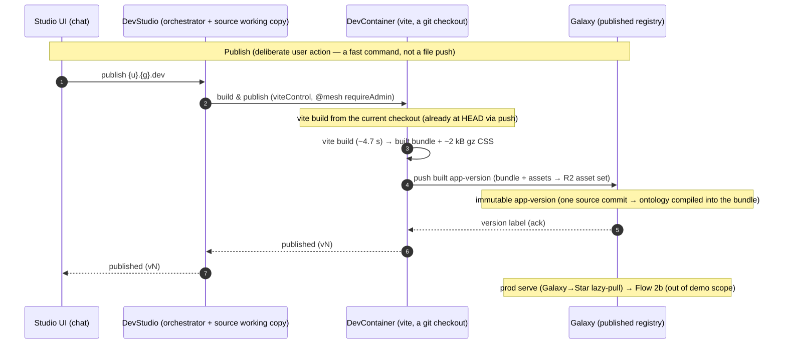
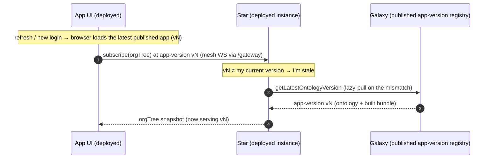
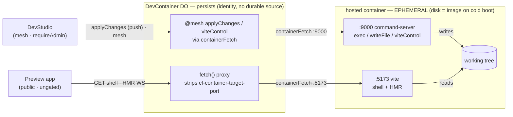

# Nebula — dev & publish flows (canonical model)

**Status**: working design doc — opened 2026-06-19 (this session). The **canonical participant model + sequence diagrams** for the Studio dev loop and publish. Built by stepping back from the [`nebula-container-dev-loop.md`](archive/nebula-container-dev-loop.md) Phase-3.5 review, which surfaced that the participant model was wrong/incomplete and spans the whole product. Once we're happy with these, several task files get realigned to match (see § *Downstream*). The diagrams graduate to `website/docs/nebula/` when the loop is built (Docusaurus mermaid is enabled).

---

## Cast (participants) + the naming rule

> **Naming rule:** `Dev*` = classes that exist **only** in the dev loop; the **plain name** = the thing that spans dev *and* prod (the dev/prod split is then an *instance* concern, not a class one).

| Participant | What it is | Lives |
|---|---|---|
| **Studio UI** | The chat-first authoring app — the chat pane the user-developer talks to. Static SPA. | Browser; **served from Workers Assets** (same origin as the API). |
| **Preview app** | The user-developer's **running generated app**. Loads its shell + HMR from DevContainer, makes data calls to the Star. Distinct actor from Studio UI — HMR updates land *here*, not in the chat. | Browser; in Studio UI iframe |
| **DevStudio** | The code-generation engine, the **sole writer of source**, and the **source-of-truth** (shell `Workspace` + local git). A Nebula-owned server DO running a self-rolled AI agentic-tool-calling loop; it commits locally and **pushes changed source to DevContainer** (`applyChanges`). Orchestrates everything — Studio UI talks only to DevStudio. It's technically an "agent" but not using that term to avoid confusion with Cloudflare's agent toolkit. | Server DO. |
| **DevContainer** | A per-sandbox Cloudflare Container DO running real **vite** (HMR) + a command-server on `:9000`. A **working copy** DevStudio pushes changed source to (`applyChanges`); serves the preview shell and runs `vite build` at publish. Holds **no durable truth**. | Server DO. |
| **Star** | The data Star (Resources / transactions / subscribe). **Plain `Star` class** — the `{u}.{g}.dev` *instance* is the dev Star; `{u}.{g}` is prod. (No `DevStar` subclass — see Decisions.) | Server DO. |
| **Galaxy** | The immutable **published app-version registry** (ontology + built bundle, lock-step). Receives the *built artifact* at publish, never dev source. | Server DO. |
| **Kimi 2.7** | The code-gen model (`@cf/moonshotai/kimi-k2.7-code`), called server-side by DevStudio. | Workers AI binding. |

---

## Decisions (2026-06-19)

1. **`DevStudio`** names the codegen engine (server DO). The browser chat app is **"Studio UI"**; the running generated app is the **"Preview app"**; the product/experience is **"Studio"** (reserved for prose). `Dev*` = dev-loop-only classes → `DevStudio` + `DevContainer`; `Star` is the cross-cutting one.
2. **No `DevStar` class.** Collapse to one `Star` on one `STAR` binding; the dev Star is the `{u}.{g}.dev` instance (own SQLite → already isolated from prod). `compileSFC` is deleted anyway (vite owns compile); only **`resetDevData`** (the wipe) is **hard-guarded to the `.dev` STAR-tier instance** — segment-precise, not a suffix test: `const s = instanceName.split('.'); if (!(s.length === 3 && s[2] === 'dev')) throw` (a bare `endsWith('.dev')` would also admit a galaxy-tier `acme.dev`) — setting the current ontology is a general Star op (Decision 11). The `DEV_STAR` binding + its smart-match guard disappear; `#starBinding()` collapses to always `STAR`.
3. **Studio UI is served from Workers Assets** — closes the open hosting question; same-origin with `/auth`, `/gateway`, `/dev-container`.
4. **Publish is DevStudio-orchestrated** (`Studio UI → DevStudio → DevContainer → Galaxy`). Studio UI talks only to DevStudio, so command-auth (`requireAdmin`) lives in one place; publish is a *fast command*, not a file push (DevContainer already holds the live checkout). The big artifact bytes go `DevContainer → Galaxy` directly.
5. **DevStudio is the sole writer of source and the durable source-of-truth** (its shell `Workspace` + local git). LLM turns read/write *locally* against it (the hot, latency-sensitive path stays local). The container is a disposable **working copy** that DevStudio pushes changed source to (**`applyChanges`**). *Rejected Option 1 (truth in DevContainer DO):* it makes DevStudio pull its own writes back every turn and couples durable state to the disposable container.
6. **`@cloudflare/shell` IS the implementation — NOT gated on Artifacts** (proven end-to-end 2026-06-19, `experiments/interim-dev-loop`). DevStudio's shell `Workspace` (SQLite+R2) is the source-of-truth with **real local git** (isomorphic-git: commit/log/branch; **"checkpoint" = a git tag** via raw `isomorphic-git`, user-facing term unchanged). DevStudio **pushes** changed source to DevContainer (`applyChanges`, mesh). This is the **shipping design — no external service.** **Artifacts is an OPTIONAL future optimization** behind the same (free) seam (`createGit` already has `remote()`/`push()`/`pull()`): it would let the container `git pull` *incrementally* from a remote decoupled from DevStudio. Adopt if/when it helps (large repos / export / resilience) — **we don't care when, or if.** Depend on `@cloudflare/shell` (codemode transitive dep accepted).
7. **Convergence — one source home.** This supersedes the **three conflicting source-durability designs** scattered across the task files: (a) Galaxy dual-write, (b) DevContainer DO store, (c) `file`-resources on the dev Star. All collapse into **DevStudio's shell `Workspace`** (local git). The realignment must purge (a)/(b)/(c).
8. **Facets** (DevStudio running user-provided app code, as Star runs validators) are a **future feature** — deliberately *not* depicted yet.
9. **Ontology is just another source file** (2026-06-19). The ontology `.d.ts` lives in the source tree like any `.vue` — there is **no separate ontology-version registry**. The old Galaxy `appendOntologyVersion`/`getLatestOntologyVersion` subsystem is **eliminated**; at publish the ontology compiles into the app bundle from the same source commit (ontology + bundle lock-step *by construction*) — so there's a single **app-version** (= ontology version; the old app-vs-ontology-version distinction is dropped). In the dev loop an ontology edit is an ordinary `writeSource`→commit→push (`applyChanges`); DevStudio applies the compiled validator to the dev Star (replacing the old `deployToDev`-pulls-from-Galaxy step). Galaxy keeps only the **published app-version** (built bundle) role. The **compile** (`.d.ts` → runtime validator via `@lumenize/ts-runtime-parser-validator`) runs in **DevStudio** during dev and in **Galaxy** at publish (the existing eager-compile, which also rejects malformed types at submit); the **Star never compiles** — it receives the *compiled* validator (DevStudio push on save in dev; the published app-version in prod). Pin the same validator version in both so dev and prod validate identically.
10. **"checkpoint"** is the user-facing term for a named saved state — a **git tag** under the covers if/when Artifacts lands (CONFIRMED 2026-06-19).
11. **Ontology-change lifecycle — `.dev` Star ≡ regular Star, except an optional wipe.** Setting the current ontology (the compiled validator) is a **general** Star op — DevStudio pushes it to the `.dev` Star on save; prod gets it via the published app-version — and it touches **no data**. **Additive** changes leave existing data valid; **breaking** changes (removed/renamed fields, or added-without-default) make it look corrupted to the new ontology. *Now* (no lazy migration), DevStudio does **not** try to detect breaking-ness — on **any** ontology `.d.ts` change it prompts the user via Studio UI (*"ontology changed — wipe `.dev` data? (wipe if your change is breaking)"*) and the user decides. If they keep it and the preview then misbehaves, a **standalone Studio-UI "Wipe `.dev` data" button** lets them wipe anytime. Both paths call the `.dev`-guarded **`resetDevData`**; the prompt itself is a direct **server→client mesh call** (see Flow 1b), and when an ontology change is part of a save the **source-push gates** on the wipe decision (callback-paused, not a held await) so the preview never renders new code on stale data. *Later*, lazy migration lands on **both** Stars (lockstep), demoting the wipe to a rare clean-slate; it rides the existing per-resource ontology-version stamp + version-on-request (`OntologyStaleError`); the runner/transforms are deferred.

12. **Live dev-loop version contract — the preview speaks the *prod* contract, not a `.dev` shortcut** (2026-06-21; resolves the Phase-4 `appVersion:'dev'` gap — Flow 1d). The serving layer injects the **real, content-hashed** current version into the `nebula-scope` meta (dev: `DevContainer.fetch()` reads it from its DO `kv`, set by DevStudio's `setAppVersion`; prod: the static-serve injects the published app-version — **same meta, same client code**). The client sends it on every op; Handler-1 gates on it. **Version = `hashBlob(ontology source)`** — *idempotent* (re-applying unchanged source is a no-op — no Worker-Loader recompile) and **dev/prod label-pinned** (same source → same label in DevStudio and Galaxy); a GUID would lose both. (The Worker Loader does **not** content-address — the id is caller-chosen and the loaded-worker cache is *ephemeral*, so the validator bundle lives on the Star, fed to `loader.get`'s callback on cold isolates — verified against the CF Worker Loader API ref. Hence we supply the content-addressing by hashing.) An ontology change re-syncs the live preview over the **kept reload channel**, **triggered from `Star.#installState` on `isNewVersion`** — so dev (`setOntology` push) and prod (Galaxy lazy-pull) share **one** trigger; **no new `@mesh` surface, no `.dev` branch in any hot path** (Decision 11 holds). The reload subscription is **dev-preview-only** for now (gate on the `.dev` scope in the bootstrap — env detection, not a hot-path branch; the prod publish→reload UX is Flow 2). **Ordering invariant:** `setAppVersion` (+ the source push) run **before** the install, so the reloaded preview reads the new version. **No client lock needed** — `OntologyStaleError` (Handler-1) is a forward-only interlock: a version-skewed op is rejected *before* any validator runs (ADR-005), so the worst case mid-swap is a transient reload, never corruption. **Method rename:** DevStudio's `applyOntology` → **`compileAndInstallOntology`** (reads the `.d.ts`, compiles the validator, optionally wipes, installs on the `.dev` Star). `resetDevData` **preserves `ReloadSubscribers`** across its `deleteAll` (live-connection state, not dev data) so the post-wipe reload still reaches the preview.

---

## Topology (static view — who talks to whom)

*All node↔node edges are **mesh** (`lmz.call`), never raw Workers RPC. Source-of-truth = DevStudio's shell `Workspace` + local git (isomorphic-git); DevStudio **pushes** changed source to the container over mesh. **Optional later:** a Cloudflare Artifacts git remote the container `git pull`s from directly (incremental, decoupled) — that `git pull` is raw HTTPS egress, the one accepted/constrained rule-break; not in the shipping design.*

---

## Flow 1 — Dev loop (iterate cycle)

> **Shipping architecture (shell — no external service).** Source-of-truth = DevStudio's shell `Workspace` (SQLite+R2) + **local git** (isomorphic-git). All node↔node calls are **mesh** (`lmz.call`), never raw Workers RPC. The push model: DevStudio commits locally → **pushes** changed source to **`DevContainer.applyChanges()`** (mesh); the container writes it and vite HMRs. See § *Source abstraction (the seam)*.

*Optional later: the git remote could become a Cloudflare Artifacts repo the container `git pull`s **directly** (incremental, decoupled from DevStudio), dropping DevStudio out of the transfer path. Not needed — shell's local git + mesh push is the shipping design. That `git pull` is raw HTTPS egress (the one accepted, constrained rule-break — single allow-listed host).*

---

## Flow 1b — ontology change → wipe prompt (server calls the client)

When a save touches the ontology `.d.ts`, DevStudio asks the user whether to wipe the `.dev` data — by **calling the Studio UI client directly over mesh**. (Split out of Flow 1 to keep the steady loop clean.)

> **The point of this diagram:** DevStudio calls **Studio UI's `NebulaClient` directly** — in Lumenize mesh, *any node can call any other, including the browser client* (continuations name their destination; the client is a mesh node via its Gateway). No polling/subscription needed, unlike a normal web app. And since the human may take a while, the prompt is **fire-and-forget + a callback** (the client calls `wipeDecision` back when the user answers), not a blocking await — so DevStudio isn't billed waiting. **Segment A gates the save's source-push in Flow 1:** DevStudio pauses the save until `wipeDecision` arrives, so the preview never updates code onto stale data — the pause is that callback, not a held await. We prompt on **any** ontology change (the user judges breaking-ness — no detection logic); the standalone button (B) is the safety net if they declined and the preview then misbehaves. After the wipe the new version is re-installed and the preview is reloaded over the kept reload channel — `resetDevData` **preserves `ReloadSubscribers`** across its `deleteAll` so that reload still reaches it (Decision 12 / Flow 1d).

---

## Flow 1c — container startup / population (cold spin-up · Flow 1 · A)

How the **ephemeral** container disk gets re-populated on every cold boot. (Expands the `ensureUp + applyChanges` one-liner in Flow 1 · A — it's really a container *start* plus a source *push*. The static seam is the **DevContainer internals** diagram below.)

> On cold boot the container disk reverts to the **baseline image** (node + git + vite + the **baked deps** + the vite **framework** skeleton/bootstrap + the command-server) — but **not** the user-developer's per-app source (`App.vue`/ontology), which is durable in DevStudio and pushed. So DevStudio **re-populates** it: `ensureUp()` starts the container, then `applyChanges(full tree)` writes the source; vite (already running) serves it. Because deps are baked, there's **no `npm install`** on boot — cold start is *boot + a source write*, not a dependency install. The first `containerFetch` races the boot, so the DO retries on `ContainerUnavailableError`.

---

## Flow 1d — live dev-loop version contract (drill-down · Decision 12)

How the preview's `appVersion` stays in lock-step with the Star's installed validator, and
how an ontology edit re-syncs an already-loaded preview. Resolves the Phase-4
`appVersion:'dev'` gap. The **client code is identical to prod** — only the *injector*
(DevContainer here, static-serve in prod) and the *validator source* (DevStudio push here,
Galaxy lazy-pull in prod) differ.

### 1d-i — fresh load (version agrees by construction)

### 1d-ii — ontology change → reload (the critical ordering)

> **Ordering & why no lock.** `setAppVersion` + the source push run **before** the install
> (which fires the reload), so the reloaded preview reads `Hnew`. Correctness needs **no
> client lock**: Handler-1's version check is a forward-only interlock — a version-skewed op
> (the preview still at OLD after the install, or a fresh load caught in the gap between
> `setAppVersion` and the install) is rejected with `OntologyStaleError` *before* any
> validator runs (ADR-005), so the worst case is a transient extra reload, never corruption
> or wrong-validator execution. The race window is the gap between two awaited mesh calls
> (low-ms). The wipe variant (Flow 1b) works the same — `resetDevData` preserves
> `ReloadSubscribers` across its `deleteAll`, so `broadcastReload` still reaches the preview.

---

## Flow 2 — Publish

---

## Flow 2b — prod serve (out of demo scope)

A publish propagates to a deployed Star **lazily, triggered by the first client on the new version** — not an eager fan-out.

> Out of demo scope (no prod deploy until lazy migration lands). **How a publish propagates:** a refresh/new-login always serves the **latest published assets**, so the browser is at `vN`; its first call `subscribe(orgTree)` (the orgTree is always synced to the client) **carries `vN`**; the Star sees `vN ≠ its current` and *that mismatch* is what triggers the lazy-pull from Galaxy (the `OntologyStaleError` / version-on-request mechanism). No eager push on publish — each Star catches up the first time a client on `vN` hits it. **One version:** app-version = ontology version (distinction dropped — lock-step by construction, Decision 9). Since a `.dev` Star is just a `Star`, this lazy-pull is general Star behavior. Static-asset serving (Workers Assets) is project-wide, not shown. *(Future: Artifacts could back this pull too — `git pull` a built-app-version repo instead of an asset set.)*

---

## DevContainer internals (the DO ↔ container seam)

In the flows, **DevContainer is one unit**. Inside, it's a **persistent DO supervising an ephemeral container**, and the security boundary lives on the seam between them.

*The public path (Preview app → `fetch()` → `:5173`) can **never** reach `:9000` — `fetch()` strips `cf-container-target-port`, so the command-server is reachable only by its **host** DevContainer DO — the one supervising this container, not any other node (the trust boundary, validated Phases 0–3). The container's working tree is repopulated by DevStudio **pushing** (`applyChanges`) on cold boot — nothing here is durable source.*

**Two access modes:**

| Mode | Port | Runs | Entered via | Reachable by |
|---|---|---|---|---|
| **Preview** | `:5173` vite | app shell + HMR | DO `fetch()` proxy (header stripped, scope injected) | **public / ungated** (browsers) |
| **Command** | `:9000` command-server | `exec` / `writeFile` / `viteControl` (+ git) | DO `containerFetch` from `@mesh(requireAdmin)` methods | **host DO-only** (the container's own DevContainer DO) — never the public surface |

**Persistence:** the **DO persists** (identity + the `applyChanges`/`fetch()` machinery) but holds **no durable source**; the **container is ephemeral** (disk reverts to the image on cold boot, repopulated by DevStudio's **push**); the **source-of-truth is DevStudio**. Neither layer here is durable source — which is why DevStudio holds it.

---

## Source abstraction (the seam)

All of DevStudio's source handling goes through one small interface, so Artifacts is swappable. Modeled on **`@cloudflare/shell`** (`FileSystem` + `createGit`), which **runs standalone today — no Artifacts dependency** (v0.4.0; deps = `@cloudflare/codemode` + `isomorphic-git`; the durable FS is its own `WorkspaceFileSystem` over SQLite + optional R2; `createGit()` is isomorphic-git: `init/clone/add/commit/branch/checkout/fetch/pull/push/diff/remote/log`).

**The interface (two halves; method names proven in `experiments/interim-dev-loop`):**
- **DevStudio side** — `writeSource(path, content)` (write working copy + `git commit`), `readSource(path)` (local read — the LLM hot path), `head()`, and it **pushes** changed files to the container (**`applyChanges(files)`**). Plus `git push` to the Artifacts remote in the optional target.
- **DevContainer side** — **`applyChanges(files)` (`@mesh(requireAdmin)`)**: the container writes DevStudio's pushed files into the working tree (no git in the container). *(The optional Artifacts path swaps this for `pull()` — a real `git pull` from the remote.)*

**The remote is the only swap point:**

| | Source-of-truth | Sync mechanism | DevContainer does | Checkpoint |
|---|---|---|---|---|
| **Now (shell — shipping)** | DevStudio `Workspace` (SQLite+R2) + local git | DevStudio **pushes** changed files (`applyChanges`, mesh) | writes them to the working tree (no git in the container) | git **tag** (raw isomorphic-git) |
| **Later (optional: Artifacts)** | Artifacts repo (git) | DevStudio `git push`es to Artifacts, then signals the container | `git pull`s from Artifacts (incremental; egress+CA-trust ✅) | git **tag** |

The source seam (shell `FileSystem` + `createGit` on DevStudio) is the same either way; only the **container-sync** differs — shell **push** (`applyChanges`) vs Artifacts **pull** (`git pull` from the remote, with DevStudio out of the transfer path). Full-set-every-push is fine for shell (dev apps are small); incremental wire-transfer + a decoupled remote is exactly what the Artifacts swap buys — which is why it's optional, not required.

**isomorphic-git is a client, not a server.** DevStudio's isomorphic-git is **local-only** (history / commits / tags) — nothing can `git pull` *from* DevStudio. So the shell-path **push** (`applyChanges`) transfers files **over mesh, not git**; only the optional Artifacts path does real `git push`/`pull`, and that is **to/from the Artifacts server**, never to/from isomorphic-git.

**Decided — depend on `@cloudflare/shell`** (2026-06-19). The transitive `@cloudflare/codemode` is acceptable: Nebula rejected codemode only as our *LLM tool-calling* mechanism (we get dynamic execution from Worker-Loader facets/Workers instead, and its MCP↔TypeScript machinery is just unused weight) — **not** as a banned dependency; it's small-ish. Shell is experimental v0.4.0 but the FS/git surface is exactly what we need. **Confirmed 2026-06-19** — shell `Workspace` + isomorphic-git `commit` run cleanly in a workerd DO (Stage 1, `experiments/interim-dev-loop/RESULTS.md`).

**Decided — shell model is `push` (`applyChanges`), not `pull`** (2026-06-19; supersedes the earlier "build `pull()` from the start"). `pull()` was chosen for Artifacts-readiness, but it made the shell loop a confusing signal-then-fetch-back round-trip with DevStudio both *triggering* and *serving*. Since Artifacts is maybe-never, **push is simpler** — one mesh call, DevStudio→container, data flows source→checkout. Adopting Artifacts later swaps the single sync call-site (push → the container `git pull`s from Artifacts), behind the seam — cheap insurance, not worth the everyday awkwardness now. *(Aside: git's incremental packfile fetch is the wire efficiency we forgo until Artifacts; mesh-pushing changed files is fine for dev-sized apps.)*

**Optimization to revisit post-beta — [`cloudflare/artifact-fs`](https://github.com/cloudflare/artifact-fs):** a FS driver that *mounts* a git repo and lazy-hydrates files on access instead of blocking on a full clone — "ideal for containers where startup time is critical." Directly addresses the container cold-start (pull-without-full-clone). Artifacts-coupled, so also beta-gated.

---

## Findings — Cloudflare Artifacts (investigated 2026-06-19)

**We are NOT gated on Artifacts** — shell gives us real local git in the DevStudio DO today (proven, Stage 1+2). The notes below stay as the reference for the *optional* future Artifacts swap (still closed beta); none of it blocks the dev loop.

**Confirmed:**
- **Artifacts = a Git server on Durable Objects** (~100 KB Zig/WASM binary; SQLite-chunked objects + R2 snapshots + KV tokens). Reachable three ways: **Workers binding, REST API, standard git clients.** Supports **git protocol v1/v2 + shallow/incremental fetch** — the efficient-sync win.
- **DevStudio write path** (DO → Artifacts): `const created = await env.ARTIFACTS.create(name)` → `created.remote` + `created.token`, then **commit + push with isomorphic-git** (`git.push({ http, url: created.remote, onAuth: () => ({ username: 'x', password: token }) })`). `@cloudflare/shell`'s `createGit()` *is* isomorphic-git over its `WorkspaceFileSystem`; git support in shell is tracked in cloudflare/agents#1155.
- **DevContainer read path** (real git client → Artifacts): `git pull https://x:${TOKEN}@<id>.artifacts.cloudflare.net/git/repo-N.git` — incremental, only the delta over the wire.
- **Container egress + CA-trust — PROVEN locally 2026-06-19** (`experiments/container-egress-catrust/RESULTS.md`). The pull is outbound HTTPS to **one** Cloudflare host. Wire = `allowedHosts: ['*.artifacts.cloudflare.net']` (deny-by-default), `interceptHttps: true`, `export { ContainerProxy }`, **plus copy the ephemeral CA in the entrypoint** (`cp /etc/cloudflare/certs/cloudflare-containers-ca.crt /usr/local/share/ca-certificates/ && update-ca-certificates`) so git trusts the intercept. Verified under **local `wrangler dev` on Docker Desktop** with `github.com` as a stand-in: before CA → cert error (the Phase-3 failure); after CA → `git clone` succeeds (HTTP 200); a non-allow-listed host stays **blocked (HTTP 520)** even with the CA trusted (deny-by-default holds). **This closes Phase-3's deferred CA-trust blocker.** Remaining: point it at a real Artifacts repo + read token (gated on beta access + likely a deploy).
- **Tokens are scoped + expiring** (`art_v1_…?expires=`): DevStudio mints a **read** token for the container's pull and uses a **write** token for its own push.
- **⚠️ No working LOCAL Artifacts sim — the binding is remote-only and beta-gated (TESTED 2026-06-19, corrects an earlier wrong claim).** On wrangler **4.86 AND 4.103**, `env.ARTIFACTS` comes up in **`remote`** mode (not `local` like a DO binding) and the first call fails **`code 10015` — "You do not have access to use Artifacts"** until the account is in the beta. The docs imply a local mode (the `remote=true` opt-in note) but it did **not** engage on either version (possibly a flag or newer/unreleased wrangler — unconfirmed). **Consequence: the Artifacts end-to-end — both the DevStudio binding push AND the container git-pull — is gated on beta access; it cannot be exercised in `wrangler dev` on current tooling.** What this does NOT block: the egress + CA-trust *mechanism* is proven independently (github stand-in, above), so once beta lands the only remaining step is pointing host+token at a real `*.artifacts.cloudflare.net` repo. (Beta form submitted 2026-06-19, awaiting access.)

**Risks / open:**
- **Closed beta** (June 2026 — public beta was *targeted* early May but docs still gate by request form: **https://forms.gle/DwBoPRa3CWQ8ajFp7**). API-churn/stability risk; per-repo DO **~128 MB** limit (fine for source); pricing **$0.15 / 1K ops + $0.50 / GB-mo** (fine at codegen volume). No dedicated Artifacts Discord channel found; Cloudflare Developers Discord is `discord.cloudflare.com`.
- **Internal routing (optimization, unconfirmed):** whether the container's git request can reach the Artifacts binding *internally* via an Outbound-Worker per-host handler (no public egress) is undocumented. Baseline public-HTTPS-to-one-host works regardless; worth a probe.
- **isomorphic-git in a DO** is pure-JS (no native fs) — fine for small source trees.

**Recommendation (locked 2026-06-19):** ship on `@cloudflare/shell` — it's the implementation, not an interim. DevStudio's shell `Workspace` + local git is the source-of-truth; DevStudio **pushes** changed source to the container (`applyChanges`). Artifacts is optional and behind the seam (`createGit` already exposes `remote()`/`push()`/`pull()`); adopt it only if incremental remote transfer / a decoupled remote ever earns its keep. **Nothing in the dev loop waits on Artifacts (or any external service).**

---

## Future capabilities (tracked, NOT designed for yet)

Two external capabilities would change the cold-start / source-transfer story. We are **not** reworking the primary design for either until it lands — captured here only so we don't re-derive them.

- **More efficient source transfer (if Artifacts never lands or we skip it).** The shell path pushes the **full tree on every cold boot** — fine for dev-sized apps, but if Artifacts never earns its keep we may want a lighter incremental push (e.g. a `git log`-based changed-paths record; the interim experiment notes this is bespoke). Deps are **baked** today (Flow 1c — no `npm install` on boot); that cost returns only if we decide we can't fully bake deps (apps pulling arbitrary packages), itself an open question. Artifacts' incremental `git pull` solves the transfer side natively (Findings above).
- **Cloudflare Container snapshots** (announced ~April 2026, "in the coming weeks"; **not yet available as of 2026-06-20**). Snapshots would let a cold container **restore a disk that already has source + installed deps + a warm vite**, instead of reverting to the baseline image and re-populating — erasing *both* the full-tree push *and* any `npm install`, and skipping vite cold-start. That fundamentally changes the "ephemeral disk + push-on-boot" model. **Deliberately not worked out now** (unlike the Artifacts swap): the right design depends on **timing relative to Artifacts** — snapshots-first vs Artifacts-first imply different architectures — so we hold this primary design until we have access to whichever lands (ideally both), then reassess.

---

## Open / to confirm

- ~~"checkpoint" terminology~~ **RESOLVED 2026-06-19:** "checkpoint" is the user-facing term, a git tag under the covers (Decision 10).
- ~~Adopt Artifacts now vs. defer~~ **RESOLVED 2026-06-19:** depend on `@cloudflare/shell`; ship the **push** model (DevStudio→container `applyChanges`); Artifacts becomes the git remote when beta access lands (form submitted). Not blocking.
- ~~`deployToDev` ontology source~~ **RESOLVED 2026-06-19:** ontology is just a source file (Decision 9) — no version registry; an ontology edit is a normal `writeSource`→commit→push, and DevStudio applies the compiled validator to the dev Star. The Flow 1 `opt` should read "ontology `.d.ts` changed → apply compiled validator," not "deployToDev (pull from Galaxy)."
- **First-run scaffold (Flow 0 · new app)** — **mechanism already proven, no experiment needed**: the interim experiment bootstraps from an *empty* Workspace (first `writeSource` → lands in the container → vite serves), and phase0 proved a minimal Vue app mounts + HMR in a real browser. What remains is a **build-time design decision (Phase 3.5)** — the **baked-vs-pushed split**: the **framework layer is baked** into the image (vite config, `index.html`, the NebulaClient bootstrap that injects scope, HMR wiring — same for every app, version-coupled to the container/vite/command-server), while the **app layer is pushed** (`App.vue`, components, ontology `.d.ts` — DevStudio's source-of-truth); first-run = DevStudio **seeds a minimal `App.vue`** (+ a starter ontology). (This also resolves the apparent Flow 1c "image has the skeleton" vs "DevStudio's first `writeSource`" wording — two different layers.)

---

## Downstream — realignment (EXECUTED 2026-06-20)

This doc is the **canonical source of truth** for the dev-loop architecture. The downstream realignment was **executed as a consolidation** on 2026-06-20 (plan: [`nebula-studio-consolidation-plan.md`](nebula-studio-consolidation-plan.md); audit/findings: [`nebula-dev-flows-realignment.md`](nebula-dev-flows-realignment.md)). The ~23-file Studio/dev sprawl collapsed to:

- **Survivors:** this file (canonical flows) · [`nebula.md`](nebula.md) (master, realigned) · [`nebula-studio.md`](nebula-studio.md) (the Studio **build** task file) · [`nebula-agentic-development-engine.md`](nebula-agentic-development-engine.md) (codegen + eval).
- **Archived** (built/ran records, frozen in `tasks/archive/`): `nebula-container-dev-loop`, `dev-star`, `nebula-devcontainer-node-type`, `nebula-do-scope-isolation`, `nebula-self-hosted-assets`, `nebula-studio-compile-pipeline`, `kimi-ui-gen-viability`, `container-vite-spike`, `spike-container-agent-channel`, `nebula-file-storage-backend`, `nebula-lazy-schema-migrations`.
- **Deleted** (never-built; salvage folded into the survivors): `nebula-app-versioning`, `nebula-studio-llm-strategy`, `nebula-resource-metadata`, `preview-iframe-spike`, `vibesdk-llm-patterns`.

**No ADR change** (all 7 conform). The one binding decision: `DEV_STAR` collapses into `STAR` (Decision 2; `#starBinding()` → always `STAR`). Residual `DevStar`→`Star@.dev` term-swaps in still-parked on-hold files (`nebula-skills`, `nebula-studio-eval-suite`, `nebula-5.5-schema-evolution`) are deferred to their un-park.
