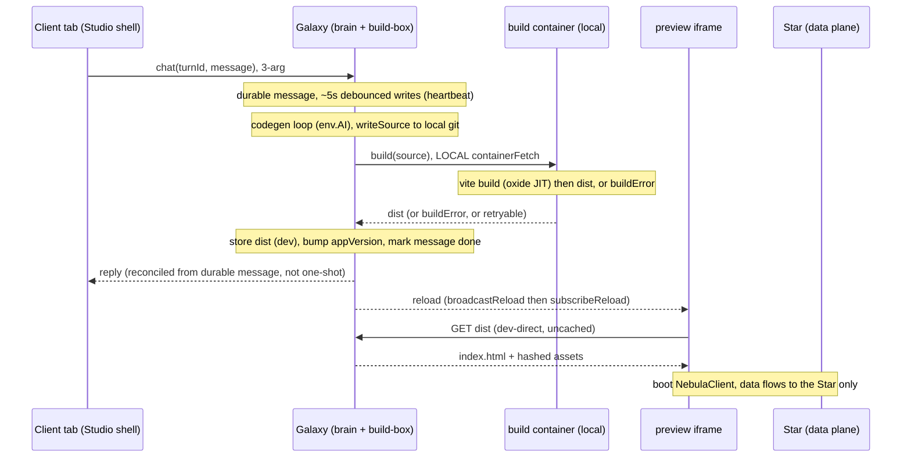

# Collapse DevStudio + DevContainer + Galaxy → one node (`Galaxy`)

> ⛔ **SUPERSEDED 2026-07-17 → [nebula-galaxy-collapse-and-chat.md](nebula-galaxy-collapse-and-chat.md).** Merged with `nebula-chat-history-multiuser.md` into one file (2→1, retiring this file's own "two active children" convention exception). **Do not read as live; do not edit.** Kept only until the merge is confirmed to have dropped nothing, then removed — git preserves the full text.

**Status:** ⚠️ **REFRAMED 2026-07-16 — build-not-serve** (read the *2026-07-16 reframe* section next): the merge still holds, but the container is demoted from a live vite dev-server to a stateless **build-box**, serving goes **container-less**, the 07-07 **HMR-wake driver dissolves**, `ctx.abort()` is **deleted**, and — **DECIDED 2026-07-16** — all **three** nodes (Galaxy + DevStudio + DevContainer) merge into one, **named `Galaxy`** (overrides the shipped rejection; reasoning in the reframe). The punch-list below still holds (read `DevStudio`-class/`STUDIO` as `Galaxy`/`GALAXY`). ⟶ *Original:* **Feasibility spike DONE 2026-07-07 → CLEAN on all four gates → GO** (per the decision rule). Ready to build — see the **Feasibility spike RESULT** section below for the punch-list. The **build** should still land after the chat work ([nebula-chat-history-multiuser.md](nebula-chat-history-multiuser.md) + its [rfc-act-chains.md](archive/rfc-act-chains.md) detour), since the chat Resources are what the merge relocates — building it against a moving Resource surface = rework. Tracked from [nebula-pre-alpha.md](nebula-pre-alpha.md). Node shape/naming pinned below.

> **Deliberate convention break (2026-07-07).** The repo runs "living master + ONE child task file at a time / no stub" ([[task-file-one-at-a-time]]). This file is a considered exception, not a violation: it's substantive capture of thinking already done across a design thread — **not an empty speculative stub** (the anti-pattern the rule guards against) — pulled OUT of the master to keep the master lean while the chat + act-chains detours run long. Do **not** fold it back into the master, and don't treat the two-active-children state as an error to "fix."

## 2026-07-16 reframe — build-not-serve (READ FIRST; supersedes the 07-07 driver + ctx.abort below)

A planning thread this session shifted the container's **role**, which dissolves the original driver and cascades through serving + recovery. **The merge (fold the disposable builder into the brain) still happens — its *reason* and the *container's job* change.**

**The shift:** we don't use HMR — the preview does a full reload. So the container's live **vite dev-server** is wasted work. Demote it to a **stateless one-shot build-box**: `build(source) → dist | buildError | retryable`. Serving becomes **container-less static assets**. (Rationale + the *keep-the-container* decision — the frontend toolchain is going native Rust/Go, so in-workerd builds are a losing bet — in [[studio-keep-container-native-tide]]; probe `experiments/…/build-probe.mjs` this session confirmed Tailwind v4 JIT = native oxide.)

**What cascades:**
- **The 07-07 driver (the HMR-reconnect wake race) largely dissolves** — there is no HMR WebSocket to race on reconnect; the preview is static bytes + a mesh reload signal. So the "≥3 failed wake-race attempts" problem is fixed by *removing the thing that raced*, not only by collapsing nodes. The merge continues, but now for **(a)** killing the DevStudio↔DevContainer desync class (stranding analysis, this session) and **(b)** co-locating the build as a **local `containerFetch`** (no cross-node hop).
- **Serving is tiered; the brain is a web origin only in dev.** Dev preview → served **direct from the brain, uncached** (one user-developer, no herd, freshest). Published app → **R2 (per-app prefix) + edge cache**, brain out of the end-user path (even a cache miss hits R2). **Not Workers Assets** (one shared bucket per Worker mixes tenants). Content-hashed immutable assets ⇒ nothing to purge; the upgrade herd collapses to ~1 cold fetch/asset/PoP. (Edge-cache config is now a `wrangler.jsonc` line — CF announcement ~2026-07.)
- **App code is served by the brain / edge-static — NEVER pushed to the Star.** The Star stays a **pure data plane** (Resources + the ontology that validates them); the retired `Star.onRequest` stays retired. Two *distinct* Galaxy→ flows that were being conflated: **ontology → Star** (data schema; push in dev, lazy-pull in prod) vs **app-code `dist/` → brain/R2** (presentation; never touches the Star).
- **`ctx.abort()` is DELETED from the flow (+ instrumented), not "kept but rare."** With the container off the critical path, a stuck build is a *retryable background failure* (last-good `dist/` still served), not a live-serving emergency. Recovery = build-timeout→kill / `destroy()`+fresh-start / idempotent retry — all enumerable, no catch-all nuke. Keep a counter on the stale-flag signature (`isStuckFlagError`) so we *know* (not guess) whether it ever recurs; re-add recovery only on evidence (Larry's bar: "a lot of convincing"). This also removes the last abort-blast-radius objection to co-locating the container in the brain.
- **The one surviving stranding class → durable message.** Merging kills the DevStudio↔DevContainer desync cases; what remains is **Client↔brain** — a reply-in-progress held **in-heap**, settled by a **one-shot push**, with **no durable in-flight record** ⇒ *chat can hang forever* if the brain evicts mid-stream. **Design (2026-07-16):** the chat **message** is a durable Resource written with a **~5s debounce** — the existing same-user coalescing keeps it **one snapshot** (clean history), the debounce keeps it **~1 write/5s** (a 30s reply ≈ ~6 writes, not hundreds), and the flush doubles as a **liveness heartbeat** so Galaxy stays warm mid-message (can't hibernate mid-stream). The client **auto-propagates** those writes via its existing Resource subscription — streaming feel **and** `client == durable` (no divergence), which is *why* we drop a separate transient channel. **Completion is staleness-derived:** a fresh heartbeat = alive, a stale one (>~15s) = the stream died → render the partial as "cut off"; **no mandatory server sweep** — crash/deploy is the only orphan vector (keep-alive/heartbeat kills the hibernation one), rare, and self-resolving. **Streaming decision:** the shipped **instant-transient** channel (`streamProgress`/`handleStreamChunk`, no Resource write) is **replaced** by this debounced-durable-write propagation — **and so is the one-shot completion push (`onChatResult`)**: both streaming *and* completion now ride the **one** Resource subscription, which is exactly why `turnId`/`onChatResult` are **deleted, not renamed** (see Naming). Re-add an instant overlay later *only* if the ~5s feel demands it (a deliberate divergence-accepting UX call). ⚠️ *This is a new access pattern — Resource writes from **inside** the hosting DO (Galaxy → its own `Message`); almost all writes today come from outside. The debounce cache is the ergonomic layer, symmetric with the debounce already in the Vue store.* Prior art: [preview-ready-autorefresh.md](archive/preview-ready-autorefresh.md), [resilient-turn-delivery.md](archive/resilient-turn-delivery.md) (live direct-delivery shipped; this adds the durable substrate). **Open multi-user semantics** (name it "message", never "turn" — single-user framing): cancel lives on the **response**, not the compose box; **who** may cancel; how the model handles messages arriving **mid-stream**.

### ✅ DECIDED 2026-07-16 — merge all THREE into Galaxy

**Larry's call:** fold **Galaxy + DevStudio + DevContainer** into one node, **named `Galaxy`** (app-level, `{u}.{g}`). This deliberately **overrides the shipped Chat-③ rejection** ([nebula-pre-alpha.md](nebula-pre-alpha.md)) by addressing that rejection's actual reason (single-threaded ontology-read contention) at the root:

- **The heavy codegen work runs in the container, not on Galaxy's DO thread.** The app build/compile is the build-box; validation-function generation (typia) can move in too — and **will have to**, since typia's author is switching its `tsc` to **Go** (native → can't run in a workerd isolate, same native tide as Tailwind oxide / vite→Rolldown, [[studio-keep-container-native-tide]]). The `env.AI` model call stays on the DO but is a **network await** (opens the input gate → interleaves with ontology reads, doesn't block them). So the DO thread does **light orchestration + gate-yielding awaits**; the container does **all heavy/native compute** — the invariant that defuses the contention, and one to *keep* true. (Residual DO-thread CPU to watch: isomorphic-git/Workspace ops; the container already ships `git`, so they can move in later if that thread ever gets tight.)
- **Startup contention is moot.** Startup was never fast (the container gates it either way) and the loop is inherently **serial** — you always need to see current state before the next prompt — so there is no concurrent-startup storm to contend.
- **Cold-start answer = longish keep-alive.** One idle DO ≈ **$4/mo**; fine for these low-usage nodes. Keep Galaxy warm; the fragile cold-wake path goes away entirely.

**Consequences folded through the file below:**
- **Name/binding:** merged class = **`Galaxy`**, one binding **`GALAXY`**; **both** `DEV_STUDIO` **and** `DEV_CONTAINER` removed (two classes retired → **DO-class count 8→6**, not 8→7; reconcile the audit accordingly). The pinned table + punch-list still hold **mechanically** — read every `DevStudio`-the-class / `STUDIO` in them as `Galaxy` / `GALAXY`.
- **Addressing moves env → app level:** the authoring brain lives at **`{u}.{g}`** (Galaxy), not `{u}.{g}.dev`. Correct by construction — **authoring/build is per-app** (one build, deployed to envs); **data is per-env** (the Star at `{u}.{g}.{env}`). The dev preview loads code from Galaxy `{u}.{g}` and talks data to the Star `{u}.{g}.dev`.
- The 07-07 *"NOT the rejected merge / Galaxy stays separate"* framing in the Driver section is **overridden by this decision** (kept for history).

**Core flow (`Galaxy` naming):**

### Naming — finish the `Turn`→`Message` rename (pinned now; do it *during* the build)

The chat's durable unit is **`Message`** — never `turn` (single-user framing that would smuggle wrong defaults into the multi-user cancel/mid-stream decisions above). The `Turn`→`Message` rename was already done for the Resource ([[sql-migrations-marker-key]]), but **correlation/telemetry stragglers survive**, and `workflow.md` § Symbol-renames records this exact rename **bit twice** (missed member-access / quoted forms) — so grep the **bare identifier**, not the quoted form. **Do the rename during the merge/durable-message build** (it rewrites `dev-studio.ts`, where these live, anyway; a standalone rename now touches shipped chat code + needs the chat suites for no functional gain). **Pinned targets so it can't drift back:**

| Current symbol | → Target | Note |
|---|---|---|
| `Message` Resource | *(unchanged)* | the durable unit — already message-named |
| `turnId` | **DELETED** (not renamed) | It was the correlation token for the **one-shot `onChatResult` push**. Delivering the reply as a durable `Message` over the **subscription** obviates it — the reply self-identifies by its message id in the subscribed set. Left with just message ids: **client-minted** for the user's message (idempotency, ADR-010) + **Galaxy-minted** for the assistant `Message` (= the existing `assistantMessageId`); link reply→prompt with a `replyTo` ref only if the UI needs it. |
| `onChatResult` | **DELETED** (not renamed) | the one-shot completion push; the subscription now carries completion (the `Message` reaching `done`), so no keyed push. |
| `deliverTurnResult` | **DELETED** | exists only to fire `onChatResult`; the reply is delivered by writing the `Message` to `done` + the subscription broadcast — no separate push method. |
| `#pendingTurns` | **DELETED** (as-is) | the client renders from the `Message` subscription, not an in-heap map settled by a push. Any optimistic "sending…" state is local, keyed by the **client-minted message id**, not a turn map. |
| `recordTurn` | `recordMessage` | **the only genuine rename** — Galaxy telemetry, independent of the (deleted) push-delivery path. |

Verify: `grep -rn '\bturnId\b'` (etc.) + check string-literal / wire-key uses; the concept is **message**, never **turn**.

---

## Driver — why collapse at all *(⚠️ 07-07 framing — the HMR-wake race is superseded by the reframe above; kept for history)*

After **≥3 failed attempts**, waking + reconstituting the dev sandbox on **tab-refocus** is a race-prone state machine. The tab holds **two independent channels**:
- tab → **Gateway** → **DevStudio** (chat / control plane)
- tab (preview **iframe**) → **DevContainer** vite **HMR WebSocket** (preview / data plane)

…and the backing entities wake independently: **DevStudio-DO hibernation × DevContainer-DO hibernation × container-process states.**

**A leading hypothesis (unconfirmed — context, NOT the plan):** *one* plausible cause is that the node that *serves* the preview (the container) is **not** the node holding what it needs to serve (**DevStudio**: source + readiness) — so a cold-wake serve needs a **cross-node push** (`bootAndApply`) and there's **no in-process point to gate the HMR reconnect** (gating cross-node is a race by construction; gating client-side from the cross-origin **iframe** running the *generated* app is likely impossible). If that's the cause, the fix is to collapse to **one node** so the gate becomes **local** — the vite proxy already sits in the HMR path and could hold the WS until *container-up + source-applied + logic-warm* (in-process), dropping a hibernation dimension.

⚠️ **But we do NOT actually know the primary failure yet** — and we're **not going to bet on out-diagnosing it.** Three fixes have not held, and in this system a wrong diagnosis isn't refuted until *after* we build the treatment and watch the patient not improve — so diagnosis has near-zero standalone refutation power here. The cause could equally be the **client's dual-channel reconnect**, **container lifecycle**, or **hibernation-wake ordering**. **See Approach: simplify-first, not diagnose-first.**

**~~NOT the rejected merge~~ — ⚠️ OVERRIDDEN 2026-07-16 (see the DECIDED callout above):** this *was* framed as **DevStudio + DevContainer** only, deliberately excluding the shipped-and-rejected **Galaxy + DevStudio** merge (rejected because DevStudio's heavy startup + long in-DO model awaits would contend on Galaxy's single-threaded ontology-read path — Chat-③ in [nebula-pre-alpha.md](nebula-pre-alpha.md) ✅-Shipped). **That rejection is now overridden** — the heavy work runs in the container (not the DO thread), so the contention it feared doesn't arise. It is now **all three → `Galaxy`**.

## Pinned — the node shape (name by dominant responsibility)

| Decision | Choice | Rationale |
|---|---|---|
| Merged class name | **`Galaxy`** *(updated 07-16: was `DevStudio`)* | All three merge; the app-level **Galaxy** (ontology registry) is the enduring identity, now also carrying codegen + chat Resources + Workspace + the build-box. Name the class for what it *is*, not its superclass. |
| Base class | **`extends NebulaContainer`** (→ `LumenizeContainer` → CF `Container` → `DurableObject`) | The hierarchy **must** include CF's `Container` — there is no "attach a container to a plain DO" path — so *code* flows Galaxy→the container class even though the *name* stays Galaxy. `NebulaContainer` also carries the tenant scope-reach guard, inherited unchanged. |
| Binding | one binding — **`GALAXY`** (`DEV_STUDIO` + `DEV_CONTAINER` both removed) | Collapses three nodes to one; the brain moves **env→app level** (`{u}.{g}`), data stays per-env (`{u}.{g}.{env}` Star). |
| wrangler config | `containers[].class_name` **and** the DO binding both → `Galaxy`; `defaultPort=5173` / `sleepAfter='5m'` (→ **longish keep-alive**) move onto the class | container-capability config lives on the concrete node now; keep-alive answers cold-start. |
| Capability layers | keep `LumenizeContainer` / `NebulaContainer` container-named | they express the reusable "node-with-a-container (+ Nebula guard)" capability seam (ADR-007); only the concrete node takes the responsibility name — mirrors `LumenizeDO → NebulaDO → concrete`. |

**Class-doc must flag two surprises the name now hides:** (i) *why a "Studio" extends a Container* — the container is a capability, not the identity; (ii) it's therefore **not constructable under vitest-pool-workers** ([[container-no-construct-pool-workers]]) → unit-test the logic via extracted, container-independent modules.

## Approach — simplify-first, NOT diagnose-first

**Why we're inverting the usual order:** diagnosis has already been wrong **three times** here, and — the load-bearing fact — a wrong diagnosis in this system **isn't refuted until *after* we build the fix and watch the patient not improve.** When diagnosis has that little standalone refutation power, betting the next move on finally getting it right is the bad bet.

So we make a move whose payoff is **diagnosis-independent: remove the concurrency** (collapse the state machine) rather than debug the race. Collapse-first **dominates** diagnose-first here:
- if it fixes the failure → we never needed the diagnosis;
- if it doesn't → we're debugging a **simpler** system (one hibernation dimension gone), so any diagnosis still required is *easier* than today;
- the only losing branch — collapse is **expensive AND** doesn't fix it — is exactly what the Phase-1 feasibility spike gates.

**Decision rule (Larry, 2026-07-07):** run the collapse-feasibility spike first; **if it does NOT come back "really hard & messy," do the collapse next — regardless of any diagnosis we could name now.**

## Phase 1 — spike the collapse's feasibility (the go/no-go)

Goal: decide whether the full merge (shape pinned above) is **clean or messy** — nothing more. This is **not** a diagnosis of the wake bug; it's a cost/risk probe of the *merge itself*. Prototype only far enough to answer, then stop.

**"Hard & messy" = any of these bites** (else it's **clean → do the collapse**):
- **`ResourceDataPlane` won't compose cleanly** onto a node already carrying the full lmz-api + CF `Container` (the piece already flagged as needing a spike; precedent = the [DevStudio data-plane extraction](archive/nebula-devstudio-data-plane.md) via `resourceHostBinding`).
- **`ctx.abort()`-recovery can't be separated from the chat** — no way to recover a stuck container without nuking the (now co-located) live chat session.
- **The DO-class merge migration is nasty** — folding two prod DO classes (`STUDIO` + `DEV_CONTAINER`, same instance) into one is a DO migration (one-way door). *Probably defused by pre-alpha's wipe-freely posture* — confirm.
- **Test extraction is infeasible** — can't pull the chat/codegen logic into container-independent modules to keep a unit lane ([[container-no-construct-pool-workers]]).

**Companion (do this too — it is NOT diagnosis): a reproduction we can run on command.** A scripted refocus that reliably makes the patient sick, so we can tell whether the collapse **makes it better.** This is the piece missing from the last three cycles — without a repro, collapse-first has the *same* ship-and-hope blindness as diagnose-first. Repro = treatment-verification ("did it work?"); diagnosis = root-cause ("why is it sick?"). We need only the first. It may be non-trivial (hibernation timing / container states — possibly *why* the bug was only caught post-deploy), but it's reusable for whatever comes next, and light instrumentation can ride along opportunistically (not a gate). *(Reconciled in the reload/self-heal thread: the **cold** case IS reproducible on command via reload-after-idle; the built collapse is verified primarily by the **prod self-heal trigger-rate** dropping — see the master's preview-survives-redeploys gate.)*

## Feasibility spike RESULT (2026-07-07): CLEAN → GO

All four "hard & messy" gates came back **CLEAN** (four parallel code-grounded assessments). Per the decision rule, **the collapse is a go.** "Clean" ≠ trivial — it's a bounded, mechanical, multi-file change with a clear punch-list and no blocker.

**Per-gate verdict:**
- **ResourceDataPlane composition — CLEAN.** Extracted to be host-agnostic (its own doc: *"Star today, DevStudio next"*); needs only `ctx.storage.sql` / `lmz.callContext` / Worker-Loader ontology / `@mesh`+`onBeforeCall`, all present on the Container node. The no-`onStart` crux dissolves into a **lazy first-use getter** (the pattern `LumenizeContainer` already uses for `lmz`; construction is synchronous). No storage-table collisions.
- **`ctx.abort()` vs chat — CLEAN (and better than we'd written).** A container-only recovery that spares the chat **already exists** — `destroy()` resets just the container process, leaving DO storage intact; it's the *primary* branch for every failure except the rare cloud stuck-flag. And the client socket isn't in this DO at all — it's held by the separate `NebulaClientGateway`, and subscriber registrations are durable SQL rows. So an abort drops **only the in-flight AI message**, not subscriber liveness or history.
- **DO-class merge migration — CLEAN.** Pre-alpha wipe-freely fully defuses it: everything `DEV_CONTAINER` persists is regenerable/transient/dead, and the merged class keeps the `DevStudio` name so its precious Workspace + chat Resources ride through untouched. Precedent: the DevStar→Star collapse retired a prod class the same way (`deleted_classes`).
- **Test extraction — CLEAN (~90% already done).** Logic already lives in pure, DI'd, Container-agnostic modules (`codegen-loop.ts`, `codegen-gate.ts`); the DO is already a thin shell, and the fast unit lane doesn't construct DevStudio today. Only the ~6–12 `runInDurableObject` integration tests need re-homing to the pattern `DevContainer` already uses.

**Punch-list (the actual scope — none a blocker):** ⚠️ *07-16: written for the two-way (DevStudio+DevContainer) merge — the three-way decision shifts #4–#5: retire **both** `DEV_STUDIO` and `DEV_CONTAINER` into the **already-existing** `Galaxy` class (class count **8→6**, not 8→7); everything else holds. Names cascade `DevStudio`→`Galaxy`, `STUDIO`→`GALAXY`.*
1. **Merge the classes** — fold `DevContainer` into `class DevStudio extends NebulaContainer`; the `DEV_CONTAINER` mesh calls in dev-studio.ts become local `containerFetch`; move `defaultPort=5173`/`sleepAfter='5m'` onto the class. ⚠️ **Reframe changes the container methods:** `bootAndApply`/`applyChanges`/`warmAndAwaitReady` (a live-serve boot→apply→await-ready dance) collapse into **one** `build(source) → dist | buildError | retryable`; `setAppVersion` stays. There is no vite dev-server / HMR-serve to warm — the container builds, returns `dist`, and the brain serves it. The rest of the punch-list holds unchanged.
2. **Lazy `#dataPlane` getter** — construct `ResourceDataPlane` on first use, not in `onStart` (Container node has none); sync construction makes this trivial.
3. **`LumenizeContainer.broadcast` accessor** — `this.svc.broadcast` is `LumenizeDO`-sugar the Container lacks; add a `broadcast(this)` accessor at the mesh layer (underlying `broadcast()` needs only `lmz`/`ctn`, both present). Legit ADR-007 first-consumer ergonomic gap.
4. **wrangler.jsonc** — rename the `DEV_STUDIO` binding → `STUDIO` (today's name is `DEV_STUDIO`, not `STUDIO`); delete the `DEV_CONTAINER` binding; repoint `containers[].class_name` → `DevStudio`; **remove `DevContainer` from the `exports` map** (⚠️ assumes [do-exports-and-toolchain-upgrade](do-exports-and-toolchain-upgrade.md) has landed — the DO registry is declarative `exports` now, which lists only live classes, so there is **no `deleted_classes` tombstone tag**). *Pre-exports fallback (if this collapse somehow precedes that task): append a `deleted_classes:["DevContainer"]` migration tag, do NOT edit `v1`.*
5. **`audit-migrations.mjs`** *(same change, or the deploy preflight fails)* — after [do-exports-and-toolchain-upgrade](do-exports-and-toolchain-upgrade.md) the audit is **`exports`-shaped** (no tag-union, no `deleted_classes`; its proof is `scripts/audit-migrations.selftest.mjs`, not a vitest test): to collapse, **reconcile the DO-class count 8→7** (DevContainer removed from `exports` + its binding) in the audit + its selftest. *Pre-exports fallback: subtract `deleted_classes` from the union + bump `EXPECTED_DO_CLASS_COUNT` 8→7 + update the companion test.* (⚠️ Count coordination: that task reconciles the audit to **8** = current live; this collapse then takes it **8→7** — whichever lands second sets the final count.)
6. **Re-home ~6–12 tests** off `runInDurableObject` (won't work on a Container subclass) to the pure-guard / `prototype.call(fakeThis)` / top-down ui-smoke patterns already used for `DevContainer`.
7. **Operational cleanup post-deploy** — `wrangler containers delete` the old DevContainer container app; purge orphaned `DEV_CONTAINER` DO storage (wipe-freely).

**The one bit of real wiring to watch** (surfaced by the assessment, not one of the four gates): DevStudio's `onStart` also does **async git/Workspace init** (`@cloudflare/shell` + isomorphic-git). Unlike the data-plane's *synchronous* construction (lazy getter), an *async* init on a no-`onStart` node needs an `await this.#ensureWorkspace()` latch at the top of each Workspace-touching method — a known async-latch pattern, more touch-points than a sync getter but standard. Closest thing to residual risk.

**Small consistency caveat:** on the reconstruct/abort path, the dropped in-flight message shows as *interrupted* (the debounced last-partial is durable), never a silently half-written `Message`. Small message-commit-path task.

## Fallback lane — ⛔ NOT triggered (spike came back CLEAN — see RESULT above); kept only in case the built collapse ships and the prod self-heal trigger-rate shows it didn't fix it

- **Then diagnose** — reproduce across the state combos, instrument the wake timeline at every participant (tab · HMR-iframe · Gateway · DevStudio · DevContainer-DO · container-process) via the [`/live` harness](../apps/nebula/harness), and post-mortem the three prior attempts. (The full diagnosis work — deliberately the *fallback* here, not the default.)
- **Partial** — container self-hydrate + in-path HMR gate (source as files in the container-side DO, not the Resource layer). A **stopgap that relocates a race without collapsing the machine** — only if a diagnosis implicates the cross-node source-push dependency. Overlaps the *preview-survives-redeploys* GATE candidate (b) in [nebula-pre-alpha.md](nebula-pre-alpha.md).
- **Elsewhere** — if diagnosis points at the client's dual-channel reconnect / container lifecycle / hibernation ordering, the fix lives there and collapse was the wrong tool.

## Costs / risks (re-weighted — wake-flow correctness dominates)

- **Test isolation** — the wake flow was **never** pool-workers-unit-testable anyway (inherently container+DO+WS integration, run via the wrangler-dev+Docker harness). So the part that *benefits* from merging is orthogonal to the part that *loses* unit-constructability. **Mitigation:** keep the chat/codegen **logic** in extractable, container-independent modules (pure functions + a thin DO shell) so the fast unit lane survives on the actively-developed chat surface.
- **`ctx.abort()` coupling — now DELETED, not "kept but rare" (reframe supersedes this bullet).** The 07-07 analysis below is precisely *why deleting it is safe*, so it's kept: `#forceReset` aborts + reconstructs the DO, but (a) it fires **only** for the rare cloud stuck-flag — every other recovery uses `destroy()`, which resets just the container and leaves the DO/chat intact; and (b) the client socket isn't in this DO (it's held by the separate `NebulaClientGateway`; subscriptions are durable SQL rows). So an abort would drop **only the in-flight AI message** — not subscriber liveness, not history. **Under the reframe** the container is off the critical path, so a stuck build is a *retryable* background failure (last-good `dist/` still served) — recovery is `destroy()`+retry, `ctx.abort()` is removed from the flow and the stuck-flag signature is instrumented instead (re-add only on evidence). The dropped in-flight message is handled by the **durable-message** design (debounced writes → the last partial survives), not left as a half-written `Message`.
- **ADR-007** — no conflict. Resources/storage/container are composable per-node capabilities; the merged node is simply the **most-capable** node (comms core + storage + Resources + container + fetch-proxy).
- **Confirm sufficiency** — verify a **server-side** HMR gate is **enough**, i.e. no residual **client-side** sequencing is needed between the Gateway channel and the HMR reconnect. (The merge fixes server-side coordination; if the client's dual-channel reconnect *also* races, that's a separate fix.)

## Method + acceptance *(updated by the reframe)*

- **Sequence-diagram-first** ([[sequence-diagram-first-when-tangled]]) — the core flow is drawn in the *2026-07-16 reframe* section above (Studio · build-container · preview-iframe · Star), Mermaid render-safety checked. The old "wake-up state machine across two client channels" is obsolete — build-not-serve removed the HMR channel.
- **Acceptance bar (reframed):**
  1. A message → codegen → local `build` → `dist` → preview **reloads to the new version with zero manual clicks** (static serve + `broadcastReload` signal; no HMR, no wake round-trip).
  2. A **build failure** surfaces correctly by kind — a compile error as a shown `buildError` (fed to the next message, never retried); an infra hiccup as `retryable` (retried, **last-good `dist/` still served throughout**).
  3. **Chat never hangs** — a brain eviction mid-stream leaves the debounced last-partial durable; the client renders it as *interrupted* (staleness-derived), never an eternal spinner (the surviving Client↔brain class, fixed).
  4. **No `ctx.abort()` in the flow**; the stuck-flag signature is instrumented, count stays at zero (or we revisit on evidence).

## Relationships / sequencing

- **Feasibility spike: DONE 2026-07-07 (pulled forward, ahead of chat) → CLEAN.** The **build** still lands after the chat work — its `changedBy.sub` attribution + subscription-layer name resolution are the Resource state the merge relocates — so: finish chat + the rfc-act-chains detour, then build the collapse (else you merge a moving Resource surface).
- **Structural alternative to / subsumer of** the *preview-survives-redeploys* GATE's candidate (b) in the master.
- **Independent of** the container disk-persistence question (turn-1 discussion / [backlog.md](backlog.md)): this is a topology/coordination change, not a persistence-feature dependency — though disk-persistence would *further* simplify self-hydrate (no re-push at all).
- **On go-active:** run `/review-task` → `/build-task`; on completion, lift the durable nuggets up into [nebula-pre-alpha.md](nebula-pre-alpha.md) and archive this file.
