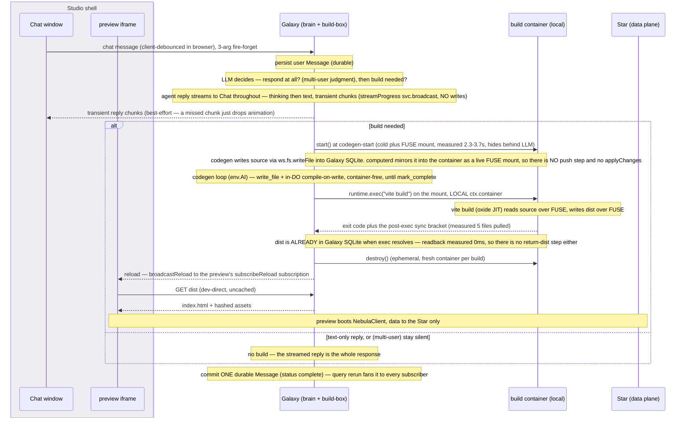
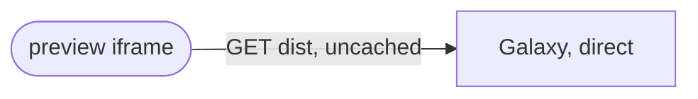

# Galaxy collapse + chat — one node, one thread

**Status:** **Pre-review as a whole** — the deliberate bet is *one big file, one long review, then implementation that is mostly transcription*. Sole active child of [nebula-pre-alpha.md](nebula-pre-alpha.md); that file's wipe item 6 (`actingToken`) lands before this task's build (Phase 2 consumes it), and the whole-file review is deliberately deferred to just before the build.

> 📖 **Vocabulary — one word, one job**:
> - **collapse** = the **node** collapse: DevStudio + DevContainer + Galaxy → one `Galaxy`. **Never used for anything else in this file.**
> - **coalesce** = ADR-004's in-place **snapshot** mechanism (a same-actor write updates the current snapshot rather than opening a new row). Reduces *snapshots*, **not** write count. The code names it `coalesceWindowMs` (✅ renamed from the old `debounce` misnomer → [resources-coalesce-rename.md](archive/resources-coalesce-rename.md)); called **coalesce** throughout this file so it cannot collide with the *real* (client) debounce below.
> - **debounce** = the **client debounce** (the custom Vue store's, batching client-originated writes before the wire) — the only debounce this task touches. *(A server-side **local debounce** for streaming was considered and **DEFERRED** — see Phase 5.)*

## Why one design problem — and why the collapse leads

Chat's substrate is exactly what the collapse changes:

| Chat depends on | Post-collapse |
|---|---|
| its **address** — session on DevStudio at `{u}.{g}.dev` (env-level) | Galaxy at **`{u}.{g}`** (app-level) — the authoring conversation is per-**app**, not per-env |
| its **host binding** — `DEV_STUDIO` vs `STAR`? | **`GALAXY`** — chat Resources host on the merged node |
| its **fanout** — the data-plane fans out via `svc.broadcast` | **unchanged** — Galaxy is a plain `NebulaDO`, so `svc.broadcast` stays; only the *host* relocates, not the mechanism |

**Collapse leads; chat is restored onto the new architecture — *not* chat-first.** Chat's substrate (address, host, fanout — the table above) moves with the collapse, so building chat first would tune it to an architecture we're deleting: don't build against a moving surface.

**Part I** pins the architecture — what the collapsed node is, where the compute runs, how the built app is served, and what the turn apparatus becomes. **Part II** restates chat against that architecture, separating what survives the collapse from what it invalidates. **Part III** interleaves the two into phases.

---

# Part I — The architecture

### Decisions locked

- **Collapse all THREE** — Galaxy + DevStudio + DevContainer → one node named **`Galaxy`**.
- **Container kept, demoted, and EPHEMERAL** — from a live vite dev-server to a **stateless build-box, one fresh container per build**: fire `ctx.container.start()` at codegen-start (**cold + FUSE mount ~3.2 s**, measured 2315–3657 ms over 6 fresh instances — hides behind LLM latency), `destroy()` once the build's sync bracket has resolved. **There is no source to ship and no `dist` to return**: `@cloudflare/computer` projects Galaxy's own VFS into the container as a live FUSE mount, so `/workspace` **is** Galaxy's tree (§ *Relationships*). A container that never outlives a build **can't reach the stuck state** — the keep-alive / stuck-recovery apparatus is *designed away*, not solved (spike `experiments/plain-do-container`; blog `2026-07-17-rules-of-cloudflare-containers`). *(Frontend toolchain is going native Rust/Go; in-workerd builds are a losing bet — [[studio-keep-container-native-tide]].)*
- **Build-box co-located in Galaxy** — a local `ctx.container` call (`runtime.exec` over the FUSE mount), no cross-node hop.
- **Ephemeral drive is simple — never gate on `.running`.** Each build is a fresh container: `destroy()` (clean slate, ignore errors) → `start()` → **bounded readiness probe** (`.running=true` ≠ *ready* — poll a health port with a timeout, fail loud on crash-boot) → build → `destroy()`. The health probe runs at exactly **two points**: (1) readiness after `start()`; (2) the build fetch itself, timeout-bounded — a hang/dead container → `retryable` (next build is fresh). Keep liveness on that probe, never on `.running`.
  - ⚠️ **Attach `ctx.container.monitor()` on every build — mandatory even though the container is ephemeral.** `start()` reads `.running` internally, and `.running` is **monitor-gated**, so after build 1's `destroy()` *without* a monitor the flag stays stale-`true` → build 2's `start()` throws *"already running"* and the loop wedges on the **second message** (spike `RESULTS.md` Q5 #1 *"MUST attach monitor()"*; `containers.md`).
  - **Serialize lifecycle transitions** — `blockConcurrencyWhile` around start/stop, plus an in-flight-start latch, so two participants' builds (multi-user is now in scope) **queue** on the one `ctx.container` instead of racing (a `start()` throw, or a sibling's post-`dist` `destroy()` killing an in-flight build).
  - **Don't vendor the `@cloudflare/containers` base class, but READ it and BORROW its patterns** (Larry) — the `monitor()` attach, the serialize-transitions latch, and the readiness poll are exactly what it gets right (`containers.md` § *steal its homework*); the spike already ported the ~15-line readiness pattern (`experiments/plain-do-container` `driveContainer`/`probe`).
- **Getting the container out of serving decouples *viewing* from the slowest-waking node — a primary reason for the demotion.** Seeing the user-dev app's current state (done before *every* prompt) waits only on **Galaxy** (serves `dist/`) + **Star** (data) waking, **never the container** — which isn't in the read path at all. The container is engaged only on a **build** (a code change — deliberate + latency-tolerant), so even a *cold* container never delays *viewing* — and being ephemeral (spun per build), there's no keep-warm to tune at all. This is the direct fix for the old vite-in-container pain where "let me see my app" blocked on container boot (Larry: *"startup was functionally blocking DevStudio work because I always needed to see current state before the next prompt"*).
- **`ctx.abort()` / stuck-flag recovery deleted** — the ephemeral build-box sidesteps the stuck state *by construction* (never alive long enough to freeze; the state is native to `ctx.container`, cloud-only, deploy-only-recoverable). Log the stuck signature via `@lumenize/debug` for evidence (a dedicated WAE metric is post-pre-alpha) — expect zero.
- **The user-developer's built app is a pre-built static *artifact*** (the build-box's `dist/`) — served **dev**: Galaxy-direct/uncached (the Galaxy DO **IS** engaged per request; *"static" = the artifact, not the path*) · **published (post-pre-alpha)**: also Galaxy-served, same homogeneous path — edge-cache/R2/herd mechanics are **design-only, deferred to alpha** (no published apps pre-alpha) — *salvaged pointer for that work (from the retired child files): edge-cache is a `wrangler.jsonc` line (CF announced ~2026-07), and content-hashed immutable assets collapse the upgrade herd to ~1 cold fetch/asset/PoP.* **Tenant apps never use Workers Assets** — one bucket per Worker mixes N tenants (the platform **Studio UI** can, and does, precisely because it's *singular*). Detail → *Serving*.
- **The Galaxy's orgTree HOLDS GRANTS, and is one node.** A non-`scopeAdmin` peer can only act on a data plane through a grant, so the collaborator being a real collaborator requires them. The ancestor-reach closure once considered here — refusing `setPermission` on the Galaxy outright — is therefore **not built**. ⚠️ **The residual it would have closed is ACCEPTED, and this is why:** a token narrowed to `{u}.{g}.{s}` has passage into `{u}.{g}` by `hasPassageInto`'s at-or-below arm, holds no dominion there, and falls through to that `sub`'s grants. A tenant stranger holds none, so it denies; it bites only for someone who holds a Galaxy grant AND a star-narrowed token, where narrowing no longer sheds their chat access. One node, a handful of grants, all auditable — do not re-derive the closure from the path without reading this first.
- **A composed capability is reached through ONE `@mesh()` GATE returning its instance; what is forbidden is a per-host method DUPLICATING logic that lives in the composed class.** Thinness is not the test — a gate is thin on purpose (`@mesh() resources() { return this.#dataPlane }`, called as `ctn<Galaxy>().resources().invite(...)`), while `Star.invite`/`onInviteResult` are thin because they duplicate. Measured 2026-08-21: of **44** `@mesh()` methods across `star.ts` and `dev-studio.ts`, only **three** are one-statement forwards (`dagTree` on each host, plus `ensureSession`); the rest do real boundary work, which [nebula-data-plane-owns-its-guards.md](nebula-data-plane-owns-its-guards.md) moves into the plane after this task so the entries can be deleted outright. The entry `@mesh` is the only allowlist check, so every method behind the gate authorizes itself (`mesh.md` § *Object-capability access: gate once, then chain*).
  - ✅ **ONE door, settled 2026-08-23 — but the FOLLOW-ON task builds it, not this one.** `@mesh() dagTree()` does not survive beside `resources()`; the tree is reached as `resources().dagTree.<op>()`, which re-points the client's ten `orgTree` mutators and the harness. This task builds neither gate, so it keeps `dagTree()` as it stands and changes no call site. Reasoning in [nebula-data-plane-owns-its-guards.md](nebula-data-plane-owns-its-guards.md) § *Design intent*.
- **The upward-visibility audit moved OUT to [nebula-data-plane-owns-its-guards.md](nebula-data-plane-owns-its-guards.md) § *Design intent*, 2026-08-23.** It was a phase here, and would have annotated 21 bare `@mesh()` sites (`dev-studio.ts` 16, `galaxy.ts` 4, `universe.ts` 1, measured) of which the follow-on deletes 16 behind one gate — and its mechanism, a justification on each decorator line checked by grep, is blind to a gate by construction. Its own counter-argument (*a sibling file would have to restate this task's method inventory*) died when that task was sequenced AFTER the collapse: it now reads the folded surface directly.
- **Star stays a pure data plane** — Resources + the ontology that validates them; **never** app code (the retired `Star.onRequest` stays retired).
- **Ontology → Star** (push in dev, lazy-pull in prod); **app-code `dist/` → Galaxy** (served; R2 only as a deferred cache-origin), never the Star. Two distinct flows that were being conflated.
  - ⏭️ **The prod install path is NOT this task's — moved to [nebula-pre-alpha-fast-follow.md](nebula-pre-alpha-fast-follow.md) § *Item 4: The prod ontology install path*, 2026-08-21.** The dev push covers every Star in the pre-alpha loop; a Star the Galaxy never pushed to exists only once an app is published, which the staging ladder puts in alpha. The candidate shape (git as the transport, commit-per-turn, shipped-version-is-a-tag), the Artifacts evaluation and the source-vs-built-artifact question went with it, along with the six tests skipped on it — **this task's closing sweep no longer counts them**.
  - ✅ **The container transport is `@cloudflare/computer` — ADOPTED (the FUSE-perf spike came back favorable; see Relationships).** It projects the DO-side VFS **into the container as a live FUSE mount** via an in-image `computerd` daemon (MIT; successor to `@cloudflare/shell` — its migration doc renames `workspace.shell.exec` → `workspace.runtime.exec`). The container's `/workspace` **is** Galaxy's tree — there is no source to ship, and `applyChanges` **stops existing** rather than being replaced by git. Commit-per-turn and shipped-version-is-a-tag work entirely locally in Galaxy's own SQLite — **no git server and no Artifacts**.
- **`appVersion` = the ontology's content hash** (its version), injected into the preview shell so the client's **Star data-ops are version-gated** (`OntologyStaleError`). It bumps on an **ontology** change (the Ontology→Star flow above), **never** on a code build — the built code is versioned by its own per-asset `dist` hashes. ⚠️ **The name is a misnomer** (it's the *ontology* version, not a unified app version) — rename to `ontologyVersion` in the cleanup sweep to kill the "is this a publish artifact?" confusion.
- **Pre-alpha stays on `nebula.lumenize.com`** — one Worker serves shell, preview, Gateway, and auth together (all same-origin), so there's **no serving-domain work** in this task.

### Why one node is sound — where the compute runs, and what it costs

The natural objection — heavy startup plus long in-DO **AI awaits contending on Galaxy's single-threaded ontology-read path** — is answered at its root:

- **The CPU-heavy work runs in the container, not on Galaxy's DO thread.** The build/compile is the build-box. The `env.AI` call stays on the DO but is a **network await** → opens the input gate → interleaves with ontology reads rather than blocking them.
  - **Galaxy's DO thread does light orchestration + gate-yielding awaits; the container does the heavy/native compute.** That is a *target*, and two things are still on the DO thread **for now, and NOT moved by this task**: (a) **typia validation-function generation** (occasional — ontology-change only), (b) isomorphic-git/Workspace ops. Both are **acceptable because the dev loop is serial + single-user** (no concurrent load to contend with). typia's eventual move has **two triggers — whichever fires first**: (1) **push** — generation runs **tsc** (genuinely CPU-heavy), so if it actually contends on the DO thread once there's concurrent load (multi-user editing one app), move it *then*, **even before any feature need**; (2) **pull** — wanting its future **TS7.x** features, which its author is shipping on a **Go/native `tsc`** (can't run in a workerd isolate — same tide as Tailwind oxide / vite→Rolldown), so adopting them forces generation into the container anyway. Either way a **later task**.
- **Startup contention is moot — the reframe *strengthens* this.** Viewing current state is now fast (the container is off the read path — above), and the loop is inherently **serial** (see current state → next prompt), so there's no concurrent load to contend on the single thread anyway.
- **Cost — the ephemeral model collapses it; there's no keep-warm to price.** The container runs only for the length of one build — **~3.2 s of cold start + mount, then the build itself** (§ *Relationships* has the measured spread; stopped containers cost nothing) → **≈ free**. The DO isn't kept warm either — billed only for active time (mostly `env.AI` awaits during codegen). Order-of-magnitude at **100 DAU ≈ $15–20/mo**, DO-dominated. Instance sizing is a **build-latency** choice, not cost (a bigger instance builds faster for pennies — we keep **`standard-1`**).
- ⚠️ **DO cold-start is NOT free** (don't call it that). ~**300ms** is human-noticeable — the user hits enter and waits that long for an ack — and it *scales with SQLite size* (a cold-storage restore is proportional; multi-GB → several seconds). Not every ~10s like hibernation; it's an "it-depends" eviction-to-cold-storage. **Monitor, don't engineer** for now (CF knows it's a sore spot + has roadmap items; git storage + text messages stay small for a while) — and it's far more a **Star** worry (resource data) than a **Galaxy** one.

### Pinned node shape

| Decision | Choice | Rationale |
|---|---|---|
| Collapsed class | **`Galaxy`** | All three collapse into it; the app-level Galaxy (ontology registry) is the enduring identity, now also carrying codegen + chat Resources + Workspace + the build-box. Name a class for what it *is*, not its superclass. |
| Base class | **`extends NebulaDO`** (→ `LumenizeDO`) — a plain mesh DO that drives the build container via the **raw `ctx.container` API**, NOT `extends Container`. | Keeps the full `NebulaDO` surface — **`svc.broadcast`**, **`svc.alarms`**, and **pool-workers construction + unit-testability** — all of which `extends Container` forfeits. `ctx.container` is a documented API on any DO. Retiring `NebulaContainer` → **final cleanup phase**; `LumenizeContainer`'s retirement is [backlog.md](backlog.md) § *Lumenize Mesh* (ADR-007). Tenant scope-reach guard composed the same way `NebulaDO` already does it. |
| Binding | one — **`GALAXY`** (`DEV_STUDIO` + `DEV_CONTAINER` both removed) | Three nodes → one; the brain moves **env→app level** (`{u}.{g}`), data stays per-env (`{u}.{g}.{env}` Star). |
| wrangler | `containers[].class_name` **and** the DO binding → `Galaxy`. No `defaultPort`/`sleepAfter` class props (those are `Container`-only) — the plain `NebulaDO` manages the **ephemeral** container lifecycle **in code** (start at codegen-start · `monitor()`+probe · `destroy()` after deliver). | container-capability config lives on the concrete node. |

⚠️ **Keep-warm is retired.** The container is ephemeral (no idle-stop to tune) and the DO cold-start is cheap (~300ms — *not free*, see Cost), so neither is kept warm. The *only* residency concern left is holding **Galaxy** alive across a long **codegen** generation — a mesh/codegen question (not the container's), tracked in the Re-open **codegen residency** bullet.

**Class-doc must flag what the name hides:** (i) *why a "Galaxy" owns a build container* — the container is a **capability** (raw `ctx.container`), not the identity, and Galaxy does **not** `extends Container`; (ii) the DO **constructs + unit-tests under vitest-pool-workers** (`ctx.container` is simply `undefined` there), so only the **container-driving methods** need `wrangler dev` + Docker. Keep those behind a thin shell over pure modules so the bulk stays unit-testable — now *good practice*, no longer *forced* by a construction limit (the old pool-workers construction blocker was specific to `extends Container` — [[ctx-container-plain-do]]).

### Cast

- **Galaxy** `{u}.{g}` — the brain: codegen (`env.AI`), git Workspace, chat Resources, orchestration, the co-located build-box; serves the dev `dist/`; owns the ontology registry.
- **build container** *(local, in Galaxy)* — stateless: it runs `vite build` against a FUSE mount of Galaxy's own tree, writing `dist` back through the same mount. Takes no source and returns no artifact. No serving, no HMR, no durable state; `node_modules` is baked into the image on ext4, never in the mount.
- **Star** `{u}.{g}.{env}` — pure data plane: Resources + ontology/validator. The running app's only runtime backend.
- **Studio shell** — the user-developer's cockpit, one browser page holding two surfaces: the **chat window** (talks to Galaxy over the mesh) and the **preview iframe** (below). *(The Gateway WS that the mesh traffic actually traverses is elided — a transparent hop.)*
- **preview iframe** — the built app; code ← Galaxy (dev direct, prod behind a cache — R2 only if escalated); data ↔ Star.

### Core flow



### The build-box contract

```
build() →                                 no source arg — /workspace IS Galaxy's tree
   { ok: true }                           dist is ALREADY in Galaxy's VFS when exec resolves
 | { ok: false, buildError }              their code — deterministic, SHOW it, never retry
 | { ok: false, retryable: true, detail } box hiccup — retry (idempotent)
```

**Neither direction moves bytes, and that is measured, not assumed** — `dist` readback came back **0 ms on every
run** (`pulled=5` on the build's own post-exec sync bracket) and writing the 9-file scaffold in is likewise 0 ms.
So `applyChanges` / `syncToDevContainer` and the bespoke dist-return are **deleted, not ported**. The call is
`runtime.exec('vite build')` over the local `ctx.container` — not `getTcpPort().fetch()`.

- **The split is load-bearing:** a compile error is a *normal outcome* — surface it, feed the next message, **never retry**. Only infra failures retry.
- **Recovery — no `ctx.abort()`, and ephemeral makes it trivial:** liveness is decided by the health **probe** (never `.running`), and every build is a **fresh container** anyway — so a hung/wedged build is just `destroy()` + fresh `start()` + rebuild (`retryable`, idempotent); a build hang → `BUILD_TIMEOUT` + SIGKILL → `retryable`. The **stuck state can't arise** (a container never outlives its build), so there's no live-serving emergency to nuke — which is what makes co-locating the container in Galaxy safe (recovery never tears down the brain).
- **Log the stuck signature for evidence — no bespoke counter** (`isStuckFlagError`: *"not running / suddenly disconnected / proxying request to container"* — the cloud-only stale-`running=true` that `destroy()` can't clear, native to `ctx.container` — [[cf-container-stuck-flag-cloud]]). Pre-alpha: it already surfaces as an error → **log it via `@lumenize/debug`** (queryable post-facto; rides the observability-tail-worker harvest). A dedicated **stuck-rate metric via Workers Analytics Engine** — also the billing-usage substrate, so a good first WAE learning — is **post-pre-alpha**. Expect **zero**; if it ever fires, that's data, not a reason to re-add `ctx.abort()` (**bar: "a lot of convincing"** — Larry).

### Serving — dev is the only in-scope tier; published is deferred

*Scope: the **user-developer's app**, not the platform **Studio UI** (the one SPA served from Workers Assets, `apps/nebula/wrangler.jsonc` `assets` → `nebula-studio-ui/dist`). "Static" = the pre-built artifact, not the path — the **Galaxy DO IS engaged per request** to serve `dist/`. **Pre-alpha builds and confirms DEV serving only** (Galaxy-direct, uncached); there are no published apps / no third-party signup pre-alpha (that's alpha).*



**Placement pin (forced by the collapse):** published apps will *also* serve from **Galaxy, the same homogeneous path** — **never** per-tenant Workers Assets (§ *Decisions locked* gives the reason). **Everything else about the published tier moved to [backlog.md](backlog.md) § *Future bigger things*, 2026-08-21** — the edge cache for the release thundering-herd, content-hashed `immutable` assets, and R2 as a named escalation are forced by *scale*, which is alpha, and no phase here builds any of it. Only the placement pin above is forced now, by the collapse.

**URL scheme (settled with Larry 2026-07-24 as the `/app`↔`/studio` swap; MECHANISM corrected 2026-08-21).** The naming was right all along — what was wrong was a 2026-08-21 detour that tried to address the built app as a `routeDORequest` binding segment. It is not one; see *How `/app/*` is served* below. **One convention, four surfaces:**

```
/studio/{scope}/*        → Workers Assets (SPA fallback)        · ACTIVE scope
/app/{u}.{g}.{s}/*       → worker-first → Galaxy fetch handler  · ACTIVE scope
/auth/{authScope}/*      → the Registry                         · AUTH scope
/gateway/*               → the multiplexed mesh WebSocket
/_version                → platform-Worker git-SHA
```

⭐ **The convention in one line: the FIRST segment names a SURFACE, and where a second segment exists it carries a scope — the AUTH scope on `/auth`, the ACTIVE scope everywhere else.** `/gateway` and `/_version` carry no scope segment at all, which is why the rule is stated conditionally rather than as "the second segment is a scope". Do not name these by node: Studio's data plane is `GALAXY` and so is the built app's server, so node-naming collapses both onto one prefix. Surface-naming is what keeps Studio and the built app distinct.

**Code and data, for each of the two apps — four combinations, stated separately because they behave differently.** ⚠️ These are not the five routes above: two of the four have no URL of their own (both data planes ride the mesh), and `/auth`, `/gateway` and `/_version` belong to the platform rather than to either app.
1. **Studio's html/js/css → Workers Assets.** One static bundle for every scope; `base` is `/`, so assets resolve at `/assets/…` no matter which scope's document path served them — already scope-independent, **nothing to change**. ⚠️ **`/studio/*` MUST stay OUT of `run_worker_first`**: a Worker prefix reaches `entrypoint.ts`, which ends in a bare 404 with **no fall-through to Assets**, so putting Studio behind the Worker 404s it. Left unmatched, the assets layer serves `index.html` exactly as it does for `/app/{scope}` today.
2. **Studio's data plane → MESH to `GALAXY`.** `NebulaClient` over the Gateway WS. **No HTTP data path exists** — that is what makes the addressing question purely a naming question.
3. **The built app's html/js/css → a `fetch` handler ON GALAXY**, at `/app/{u}.{g}.{s}/*`, behaving **exactly like Assets in SPA mode**: every path past the prefix serves `index.html`, which reads the Star scope from the URL and acts on it.
4. **The built app's data plane → MESH to `STAR`.** Same shape as (2), different binding.

**How `/app/*` is served — and why it is NOT `routeDORequest`.** That helper takes segment 0 as the *binding* and segment 1 as the *instance*, so `/app/{u}.{g}.{s}` would look up a nonexistent `APP` binding, and naming the prefix `galaxy` instead would address a Galaxy instance called `{u}.{g}.{s}` — a DO that holds no `dist`. The handler therefore **derives `{u}.{g}` from the star scope** and serves from that Galaxy. ⚠️ The serve stays **ungated**, as today's `DEV_CONTAINER` branch is — browsers send no `Authorization` on document loads, and data is gated on the mesh path — so keep the GET/HEAD bound when re-pointing. ⚠️ **The built app's vite `base` must equal `/app/{u}.{g}.{s}/`** or its sub-assets 404 ([[preview-path-prefix-vite-base]]). Studio's `base` stays `/`.

⛔ **`routeDORequest` for the Star — including the `.dev` Star — was considered and REJECTED 2026-08-21.** It would un-retire `Star.onRequest`, contradict § *Decisions locked*'s *"Star stays a pure data plane … never app code"*, and move `dist` off the node that builds it.

**Where the ACTIVE scope comes from: the URL. Where the AUTH scope comes from: a client-side hint, never the URL and never a cookie.** The refresh cookie is `Path=/auth/{authScope}`, so the client must know the auth scope to construct the refresh call — a link that breaks the moment the URL carries the *active* scope instead. `App.vue` already persists `localStorage['nebula.authScope']` as a fallback; this **promotes it to primary**.
  - ⚠️ **localStorage, NOT a cookie, and the reason is structural.** A cookie is transmitted automatically, putting `authScope` in front of server code that is forbidden to read it; localStorage never leaves the client, so *"`authScope` from the cookie"* — the scope-less global refresh `security.md` rejects — becomes **impossible rather than prohibited**. The hint tells the CLIENT which refresh endpoint to call; the SERVER still derives auth scope from the path and validates the path-scoped refresh token.
  - **The absent case is a feature, not a bug:** no hint (a cold browser), or an active scope the hint's auth scope cannot reach, means **run discovery** — [nebula-login-prove-then-choose.md](nebula-login-prove-then-choose.md)'s prove-then-choose flow, whose discovery request a persisted `profileId` would also feed.
  - ⚠️ **Caveat to carry:** localStorage is unavailable or partitioned in restricted iframes and under Safari ITP. The preview iframe is same-origin pre-alpha so it does not bite; if the built app ever moves to its own origin the hint must be re-derived there, never assumed.

⚠️ **This is a step toward [ADR-017](../docs/adr/017-the-url-is-the-view-state.md), not compliance.** The active scope is in the URL; **view state beyond scope — selection, open panel, filters, sort, paging — is NOT in this task.**

⚠️ **A denied recipient is NOT the end state.** ADR-017 says a shared URL is safe to paste because *"a recipient without access simply gets denied"*; the product answer is a prompt to ask someone at or above that node in the orgTree, the Google-Docs move. **Deferred past pre-alpha** (Larry, 2026-08-21) → [on-hold/nebula-request-access.md](on-hold/nebula-request-access.md).

⚠️ **`/studio/{u}.{g}` pins the ADDRESS, not the concept — Studio is ONE surface WITH A SCOPE, never "the per-app builder"** (Larry, 2026-08-05). A Universe-level `/studio/{u}` is the same surface at a different altitude — which is also why the surface, not the node, names the prefix. **Nothing here builds it.** ⛔ Not to be **named** (no "Lumenize OS"/"Nebula OS" — rejected 2026-08-05).

- **`run_worker_first`:** `["/app/*", "/gateway/*", "/auth/*", "/_version"]`; everything else — **including `/studio/*`** — falls to Assets. `/app/*` is Galaxy-served and does its **own** SPA fallback for the built app's client routes. ⚠️ `/dev-container/*` comes OUT in the same edit — Phase 3 deletes that apparatus.
- **`consumeAndLogin` tier-branch** (built in [nebula-star-founder-provisioning.md](archive/nebula-star-founder-provisioning.md) Phase 2), computed in `landingBase`: star → `STAR_LANDING_PREFIX`, every other tier → `NEBULA_AUTH_REDIRECT`. ⚠️ **Only ONE constant moves.** `STAR_LANDING_PREFIX` (`landing.ts`) **stays `/app`** — that is where the built app lives and where a star-tier login belongs; `NEBULA_AUTH_REDIRECT` becomes `/studio`. Today both evaluate to `/app`, which is precisely why the branch is invisible — moving one is what makes it diverge. **What the post-login destination finally IS belongs to** [nebula-login-prove-then-choose.md](nebula-login-prove-then-choose.md) § *Open questions* (4) — that file moves the scope choice to after the click, so this phase owns only the VALUES, never what they mean. **Churn folds into Phase 3**, which edits the route list anyway. ⚠️ **Derive the sites, do not trust a list here** — `grep -rn NEBULA_AUTH_REDIRECT --exclude-dir=node_modules apps packages`, then triage. Three things that sweep will NOT find, and one it will find wrongly:
  - ✅ **`STAR_LANDING_PREFIX = '/app'` (`landing.ts`) STAYS — do not flip it** (re-verified 2026-08-21). `/app` is where the **built app** lives, and a star-tier login lands there by design. Only `NEBULA_AUTH_REDIRECT` moves, `/app` → `/studio`. That is what finally makes `landingBase`'s tier branch *diverge*: today both arms evaluate to `/app`, which is exactly why it is invisible.
  - **Two `--var NEBULA_AUTH_REDIRECT:/app` flags** in the chromium and browser `global-setup.ts` launchers, and **two inline env objects** in `nebula-auth-invite.test.ts` — none of them in a `.jsonc`.
  - **`App.vue`'s own path parse** (below) and the **eight Playwright `page.goto` entry points** that build the URL by hand (`ui-smoke/smoke.test.ts` ×3, `ui-smoke/helpers.ts` ×2, `harness/scenarios/studio-chat-reload.ts` ×3). ✅ **All eight drive STUDIO** (verified 2026-08-21), so all eight become `/studio/${scope}` — none of them is a built-app entry point.
  - ⛔ **`packages/nebula-auth/test/wrangler.jsonc` must STAY `/app`** — its own suite says why: *"Do NOT flip it project-wide: `test-helpers.ts` `clickLink` asserts `/^\/app(\/|$)/` on 63 call sites across 8 files."* That suite swaps `env` per-test instead (`withStudioRedirect`); follow that pattern rather than flipping it.
  - ⓘ The four `worker-configuration.d.ts` copies are **generated** — `npm run types`, never hand-edited.
- **`/_version` stays at root** — the single **platform-Worker git-SHA** compare (one Worker, one SHA; deploy/harness tooling, the `GET /_version` handler in [entrypoint.ts](../apps/nebula/src/entrypoint.ts)), **not** the dev-user's app version (that's mesh `subscribeReload`). Don't split it per-surface; there aren't two Worker builds.
- **Custom domains (deferred):** a tenant app then moves to its **own origin at root** (truly non-prefixed); the client's origin-relative WS must reach the Gateway there (or set an explicit control-plane `baseUrl`). The `/app` prefix persists for the **dev preview**, which stays on the control-plane origin.

### Naming — the turn *apparatus* is deleted, not renamed

The durable unit is **`Message`** — never `turn`. "Turn" is single-user (Claude-Code) framing that would quietly smuggle wrong defaults into the multi-user decisions below. And the cleanup is mostly **deletion**, because `turnId` et al. were scaffolding for **one-shot-push delivery**, which the subscription replaces:

| Symbol | → | Why |
|---|---|---|
| `Message` Resource | *(unchanged)* | already the durable unit |
| `turnId` | **DELETED** | it existed only to correlate the one-shot `onChatResult` push; the reply now self-identifies by its message id in the subscribed set. Ids become just message ids: **client-minted** for the user's message (idempotency, ADR-010) + **Galaxy-minted** for the agent `Message`. Link reply→prompt with a `replyTo` ref only if the UI needs it. |
| `onChatResult` | **DELETED** | the subscription carries completion (the `Message` reaching `done`) — no keyed push |
| `deliverTurnResult` | **DELETED** | exists only to fire `onChatResult` |
| `#pendingTurns` | **DELETED** (as-is) | the client renders from the subscription, not an in-heap map settled by a push. Optimistic "sending…" state is local, keyed by the client-minted message id. |
| `recordTurn` | **DELETED** — with `TurnRecord`, `Turns`, `getTurns`, `idx_Turns_time`, and `DevStudio`'s `#recordTurn` fire | an agent `Message` **is** a codegen turn, so the two tables duplicated one event ("codegen-eval is a different domain, so a different table" was considered and settled the other way — do not re-derive it). The corpus folds into the `Message` resource model — shape pinned in [nebula-studio-self-improvement.md](on-hold/nebula-studio-self-improvement.md) § *The folded shape*, which this task **builds**. |

**Deletion is self-enforcing where a rename isn't:** every lingering reference to a deleted symbol is a *compile error*, so the toolchain finds the stragglers (`workflow.md` § Symbol renames is the rename hazard this sidesteps). **No rename remains at all**, so the cleanup is **pure deletion — fully compile-enforced.**

---

# Part II — Chat, on the new architecture

### Objective (target, present tense)

The Studio chat is a **durable, multi-user, reactive** thread. Human messages AND the agent (Nebula) reply already persist as `Message` Resources, so the bulk of the work is **render + attribution + streaming**, not adding storage. Render the thread from a **live subscription** so reload / reconnect / multi-tab / a second participant all restore and stay live, and attribute each message to a stable identity. A message's author is its snapshot's server-stamped **`actingToken.sub`** (an opaque per-person UUID) — never a client-supplied field; the display **name** resolves from a **live `Profile` subscription per distinct author**, keyed off the `profileId` already stamped on each message's `meta.actingToken` (item 6, built 2026-08-20 — no `sub`→`profileId` hop, no Registry load) — **the client-side consumption is owned by Preserved § *Name resolution*** below; other sites carry only their actionable slice. This completes the `Message` substrate **THE GATE (capture-live) rides on**.

### Participant model (settled with Larry 2026-07-06 — survives the collapse)

- **Author attribution = the snapshot's `actingToken.sub`; the DISPLAYED author = `{actor} for {principal}`** when an `act` is present (*Nebula for {human}*), else just the principal. `actingToken` is the full ADR-016 record, server-stamped from `callContext` on every snapshot ([resources.ts](../apps/nebula/src/resources.ts)); on the wire it is the `WireActingToken` allow-list — identity + display `profileId`s, never the asserted `access` — unforgeable, **already delivered** on `Snapshot.meta`, just not consumed yet. This eliminates the **author-spoof (B2) at the render layer**: the displayed author derives from `actingToken.sub`, so a stray/injected `author` key is simply never read.
  - **Authorization always keys off the subject `sub`, never `act`** (RFC-8693). The display deliberately shows **both**, which dissolves the impersonation-display question rather than deferring it.
- **Attribution is by `kind`** (`agent` | `human`) + the display name **`Nebula`** (never "assistant"). ⚠️ *Separate thing, leave it:* `ChatMessage.role:'user'|'assistant'` is the **codegen model provider's** request format for `env.AI` — not our `Message` Resource.
- **`Participant { sub, kind, name }` is RESOLVED by reactive lookup, never stored on a Message.** `sub` from `actingToken`; **`name` resolves per distinct author** — each snapshot's attribution carries the author's `profileId` (a **permanently-immutable** write-time stamp on `Snapshot.meta`, **ADR-013 as amended**), so the client reads it off the message and holds a live `Profile` sub per distinct `profileId` (deduped, cumulative over *everyone who has ever posted*) — **no `sub`→`profileId` hop, no Registry load**, not the live roster; **`kind` derived** (`sub === NEBULA_SUB` → agent).
- **Human vs agent is a participant property, not a capability role.** Data-plane capabilities (post/read/subscribe) are uniform at the API, DAG-gated + UI-shaped.
  - **The codegen/build trigger (`chat()`, M4)** spends AI + a container build. It is gated by `@mesh(requireDominionHere)` today; the target is **uniform: any chat participant may trigger** (the participation grant), NOT admin-only. ✅ **The mechanism is pinned and owned by Phase 4** (2026-08-21): the **durable write becomes the trigger** — a committed *human* `Message` on the session node fires codegen via the existing `onMutations` commit hook — so the DAG check on that write is the only door and `chat()`'s decorator relaxes to a bare `@mesh()`, no longer being the authorization point. Owner/admin hold it inherently; an invited participant gets it via the invite. A participant's trigger spends the **owner's** AI+build — accepted pre-alpha (the owner invited them; budgets/rate-limits later).
  - ⚠️ **Whatever the gate becomes, it keys off `sub` and NEVER `act`** (`security.md` rule (1)) — handed here 2026-07-29 from [nebula-impersonation-client.md](archive/nebula-impersonation-client.md), which cut its own codegen test *because* this gate is being re-pinned. An impersonated session is authorized as the **subject**, so an admin driving one triggers codegen exactly as that person would: there is no escalation to prevent (eligibility has already placed the subject's whole scope inside the caller's authority, so they could do it with their own token carrying *more* authority), and blocking it would require an `act`-reading authorization decision — a second exception to rule (1) with none of [ADR-012](../docs/adr/012-global-profile-visibility.md)'s justification, since codegen is scope-local where the ordinary model already works.
- **Author stamping — the asymmetry is correct:** a **human** message stamps its `actingToken` from `callContext.originAuth` automatically (nothing to build); a **Nebula** message runs under the **triggering human's** `callContext`, so the subject `sub` stamps automatically and Galaxy adds Nebula as the **actor** — a trusted **server-supplied write-option** (the actor id ONLY — never a full record override, and **NOT** `callContext.state`, which a client can seed → forge). Result `{ sub: <triggering human>, act: { sub: NEBULA_SUB } }` — each Nebula reply attributed to the human who prompted it (a capture win), and the authz-off-`sub` invariant holds by construction.
- **A Nebula message records NO observations yet — [ADR-019](../docs/adr/019-derived-artifacts-record-observations.md) is deferred here, and the reason is that there is nothing to record.** The commitment is that any artifact derived from resource reads stores the ids of what it read, so every later reader is re-authorized live. Studio's codegen reply is not such an artifact today: it is assembled from a static system bundle, `/src/App.vue` and the ontology `.d.ts` (both Workspace **files**), and the triggering message — and the loop's whole tool surface is `write_file` + `mark_complete`. It reads **no Resources at all**, so its observation set is empty.
  - **That answers the retrofit argument on this surface rather than dodging it.** "Capture cannot be retrofitted" bites when a reply *was* derived from reads nobody recorded; a genuinely empty set loses nothing by being written now, because retrofitting later reproduces the same empty set. Building the stamp today would ship a field that is `[]` on every message and a criterion asserting emptiness — green by construction, which is the shape `calibration.md` § 9 exists to catch.
  - ⚠️ **The TRIPWIRE, which is the part that must not be lost: the moment anything beyond Workspace files and the triggering message enters the codegen prompt — chat history first among them, since prior `Message`s ARE resources — the observation stamp lands in the SAME change.** It is not a follow-up and not a backlog row; it belongs to whichever edit creates the hazard. The nearest candidate is the respond-or-not policy (Non-goals), which cannot judge whether to reply without seeing the thread.
  - ⓘ **Even with history in the prompt, a live re-check would deny nobody under the one-node orgTree** — every session participant holds a grant at the same node. Capture would be real but inert until participants can legitimately differ, which is the deferred collaborator-tiers bundle. Record it anyway when the read appears; that is the whole point of capture preceding policy.

- **"Immutable" is a UI convention, not a backend property** (ADR-004): a write within the **coalesce** window updates the current snapshot **in place** (new value, new eTag). Chat enforces immutability in the UI: text box local until submit, one write on submit, read-only after.
- **Writes go through the standard `transaction`.** The reactive `Message where session==…` query-sub view **IS "the list"** — no separate list resource.

### ✅ Preserved — architecture-independent, already `/review-task`-reviewed

These survive the collapse untouched and are **hard-won**; do not re-derive them:

- **Same-IDENTITY `actAs` on the create AND every `put`** — the in-place **coalesce** keys on identity (`sub` + the `act` chain's subs — `identityKey` in [resources.ts](../apps/nebula/src/resources.ts), item 6's build); an actor-chain drift between chunks silently opens a **new snapshot row**, while a `profileId`/`access`-only delta deliberately does not (a general Resources invariant; chat now commits once at completion, so it doesn't arise for chat — preserve it for any multi-write resource).
- **typia `validate` is non-strict** — it neither rejects nor strips excess keys, and `transaction` writes `result.data` verbatim. So a type-only drop of `role`/`author` leaves them **persisting at rest with a green build**: the **writers** must stop writing them. Assert the **render**, not absence-from-storage (that assertion is vacuous).
- **RFC-8693 act-chain nesting** — prepend the actor as the **outermost** `act`, preserving any pre-existing verified `payload.act` underneath (outermost = current, most-nested = earliest). Flatten/overwrite **drops** the delegation chain. ⚠️ **The helper does NOT exist yet — this task ADDS it** (§ *Files*), so what is preserved here is the RULE, not an implementation: `prependActor` appears nowhere in `packages/` or `apps/` today, and `profile.ts`'s own comment calls it *"a future `prependActor`"*. Build it as **one** tested helper called by `#buildActingToken` **and** the later cross-node mint path, so the two cannot drift on RFC semantics. ⚠️ **Constraint discovered 2026-07-29 building [nebula-mint-narrower-token.md](archive/nebula-mint-narrower-token.md):** the Profile owner branch is now `claims.profileId === profileId && !claims.act` — **presence-only, by design** ([ADR-012](../docs/adr/012-global-profile-visibility.md); both identity-comparing variants were explicitly rejected). So if `prependActor` is ever applied to a **TOKEN** rather than only to an `actingToken` RECORD, a person's own session would carry `act` and **lose ownership of their own profile**. Keep the prepend on the record side; if a token ever needs it, that re-opens ADR-012 rather than being fixed with `act.sub === claims.sub`. Noted at `profile.ts` too.
- **`NEBULA_SUB` = a self-describing `agent:nebula`** (Q1 resolved) — an **actor id**, never a standalone subject (`actingToken.sub` is the triggering human, never `NEBULA_SUB`). Self-describing over a UUID: readable, syntactically not-a-human, and degrades legibly in the cold case; shape-agnostic since `kind` is a constant compare (`sub === NEBULA_SUB`). ⚠️ *build-checks:* nothing validates `sub` as UUID-shaped, and the actor-profileId stamp (below) is always emitted, so `agent:nebula` never reaches a Registry resolver.
- **Nebula gets its own `Profile` — the *Nebula LLM profile*, never "the platform profile"** (Q1 resolved; naming pinned 2026-08-21). `platform` now names the ROOT of the scope hierarchy and implies super-user, so calling this one that invites a reader to expect authority it does not have. It is a reserved `NEBULA_PROFILE_ID` whose profile holds **all three** public fields, `{ name: "Nebula", nickname: "Nebula", picture: "https://lumenize.com/img/logo.svg" }` (pinned 2026-08-07; supersedes the earlier "env-driven avatar" — `picture` is a plain URL string, so no upload path is involved and none is needed). Seeding all three is what makes "no display special-case" true — the public set is exactly the `PUBLIC_FIELDS` allow-list (`['name','nickname','picture']`, [profile.ts](../packages/nebula-auth/src/profile.ts)), so a partial seed would render Nebula unlike every human. It resolves through the **same participant name-resolution as every human** (no display special-case; it gets an avatar).
  - **The DO seeds ITSELF — never a deploy step, never a manual one** (pinned 2026-08-21). A `Profile` instance that finds its own id is the reserved Nebula one writes the three fields; every other instance does nothing. ⚠️ **`Profile` has no `onStart`** — it is a raw composer whose ctor is documented as *"Synchronous raw-DO init … the ctor completes before dispatch"*, and that ctor **already** seeds a baseline `eTag` with `INSERT OR IGNORE`, so this is one more statement in an established pattern rather than a new hook. Two things to settle at build: the ctor cannot read `this.lmz.instanceName` (not stamped that early — the same trap `ResourceDataPlane` documents), so the identity check comes off `ctx.id.name` or the seed goes lazy on first read; and **the reserved id lives in `packages/nebula-auth/src/types.ts`**, beside `RESERVED_STAR_SLUGS`, because `packages/nebula-auth` may not import from the app; the app imports it from there.
  - ⚠️ **Pick `NEBULA_PROFILE_ID`'s literal at build time — it is still unpinned.** It lives in `packages/nebula-auth/src/types.ts` beside `RESERVED_STAR_SLUGS` (the `Profile` DO self-seeds off it and cannot import from `apps/nebula`); the app imports it from there. It is a *different* value from `agent:nebula`: the actor's chain entry pairs `{ sub, profileId }`, and a pair whose two sides are identical carries nothing.
  - **Zero Registry involvement:** Nebula has no `Emails` row and no `Memberships` row; a `Profile` is read by `profileId` (ADR-012 open-resolution, no Registry read), and every party's `profileId` rides inside `meta.actingToken` (`agent:nebula` carries `NEBULA_PROFILE_ID` from its constant — mechanics in Phase 2), so nothing looks Nebula up in the Registry on the read path.
  - **Write-authz needs no special-casing** — `requireOwnerOrAdmin` ([profile.ts](../packages/nebula-auth/src/profile.ts)) already handles an *ownerless, not-in-Registry* reserved `Profile`: **super-admin edits it** (the reserved platform scope is the ROOT of the tree, so the `isPlatformScope` short-circuit passes with zero reads); **everyone else is cleanly denied** — the Registry lookup resolves to ZERO accepted-membership scopes, so the dominion predicate matches nothing and the scoped-admin branch refuses with the does-not-cover `Forbidden` (the **fail-closed** denial is a different path, reserved for a Registry THROW). Extensible: future artificial entities = more reserved `(sub, profileId)` + seeded `Profile`s, still zero Registry rows.
- **Name resolution keys off *all-time authors*, read from a `profileId` stamped on each message — not the live roster, and not a live `sub`→`profileId` hop.** `profileId` rides **alongside `sub`** on the attribution path (stamped at write time — principal from the writer's verified JWT claim, actors from a reserved constant; all server-derived, unforgeable, *public* per ADR-012), precisely so display needs **no registry resolution**. The client reads each message's stamped `profileId` and holds a live `Profile` sub (`store.lmz.profiles[profileId]`, ADR-012 open-resolution) per distinct author — **deduped + cumulative** (a `profileId` recurs across sessions/windows) — so every *historical* message renders a current name **without touching the singleton Registry**.
  - **The stamp is permanently immutable, per ADR-013 as amended 2026-07-18** — the value NEVER changes, so it records the author's profile *at write time* rather than caching a mutable one; a `sub`-unification never re-points history → no staleness, no re-key; display-only, never a key/FK/authz input. *(So it carries the "current name" only as of the write-instant; the **live** current name for an active participant still updates off the Profile sub.)*
  - ✅ **The server half landed with item 6 (2026-08-20):** every party's `profileId` rides the snapshot's `meta.actingToken` — no parallel meta field was needed, the record itself is the carrier. **The gap this task wires is client-side consumption**: read the stamped `profileId` off each message and hold the per-author `Profile` subs. Upstream is otherwise **BUILT** (2026-07-15): the **profile store** ([ADR-012](../docs/adr/012-global-profile-visibility.md)/[ADR-013](../docs/adr/013-identity-profileid-resolution.md)) + the generic **subscriber-list** ([archive/nebula-subscriber-lists.md](archive/nebula-subscriber-lists.md), supersedes the "presence" framing, ADR-008 extended to presence).
  - This **closes profile-store Phase 4**; the ADR-013 **cold case** (a snapshot missing the stamp) degrades pre-alpha — post-wipe every snapshot carries the stamp, so it's ~never hit; a live `sub`→`profileId` resolver is deferred post-alpha. The live **roster** (`store.lmz.querySubscribers.<sessionQuery>`) stays a **separate** consumption — presence + the AI's respond-or-not signal (Non-goals). **On resume:** adopt the OIDC names (`name`/`nickname`/`picture`) inline, replacing `friendlyName`/`email`.
- ✅ **Real-email multi-user driving is BUILT — do not re-plan it** (ADR-009). `connectDriver` already defaults to `provisionAndLogin` (rung 1); `createNebulaTestToken` survives only behind an explicit, justified `opts.mint`, and `mintDegradedToken` is intact for negative controls. Multi-identity real-email scenarios already exist (`invite-roundtrip`, `node-invite-roundtrip`, `revoke-is-total`, `identity-convergence`, and three identities in `passage-not-dominion`). What this task adds is the four-party chat scenario built on that path — not a conversion.
- **`commitAssistantMessage → commitAgentMessage`** (leave the model-provider `ChatMessage role` alone; grep-verify the bare identifier).
- **Migrate, don't ossify** — update tests asserting `.role`/`.author` on a `Message` value (at least `child3-post.test.ts`'s `snap.value as { role?, content?, author? }` read and `child3-session.test.ts`'s `expect(….author).toBe('admin@example.com')`; grep the bare identifiers for the full set).

### ⚠️ Re-open — the collapse invalidates these (do NOT carry silently)

- **Host-binding** (*"user Message lands on `DEV_STUDIO` vs STAR?"*) → **dissolves.** There is no DevStudio; there is Galaxy. Re-frame: chat Resources live on **`GALAXY`**.
- **The client-binding split — now a TWO-HOST routing problem (m6, Stage-2).** Chat `Session`/`Message` Resources host on **GALAXY `{u}.{g}`**; app-data Resources stay on **STAR `{u}.{g}.dev`**. But `nebula-client.ts` funnels every op through one `#resourceHostBinding` (default `STAR`) + `#activeScope` (`{u}.{g}.dev`) — so `postUserMessage`'s `transaction({ nodeId: SESSION_NODE_ID })` would write the user Message to the **STAR** plane and Phase-4 subscribe would target the wrong host.
  - **Kill the `'STAR'` default; route per-op (Larry).** The host (`binding` + `scope`) is specified **per `transaction`/`read`/`subscribe`** — the client already fires `lmz.call(binding, instance)` under the covers, so the `?? 'STAR'` default (`#resourceHostBinding = resourceHostBinding ?? 'STAR'` in [nebula-client.ts](../apps/nebula/src/nebula-client.ts), ~:599) merely pre-fills it and silently misroutes. Chat Message/Session ops + `subscribeQuery` → **GALAXY/`{u}.{g}`**; app resources → **STAR/`{u}.{g}.dev`**; the client is scoped at the app-level **`{u}.{g}`** so it reaches both planes (ties to session-addressing above).
  - Update the resource-SDK signature + `postUserMessage`/`chat`/`warmPreview` (incl. `warmPreview`'s `'DEV_STUDIO'`→`'GALAXY'` rebind); reconcile App.vue's one-client model with the harness's dedicated client. **Confirm a posted user Message lands on the Galaxy plane** (self-catches in the /live test).
- **Codegen residency across a long `env.AI` generation — mechanism known, window to measure.** Mesh runs the call chain **detached under `ctx.waitUntil`** after early-ack (`executeEnvelope`'s post-ack task in [lmz-api.ts](../packages/mesh/src/lmz-api.ts) — the DO no-op is stated in that file's own comments, ~:256 and ~:319), and **`waitUntil` is a no-op on DOs** (CF docs — it exists only for Worker parity; the mesh comment claiming it "keeps the node alive" is **wrong for DOs**). So detached codegen is **not** held resident and *will* idle-evict on a long generation unless we hold it.
  - **No checkpoint needed** — the input is storage-first (durable before the LLM runs), so an evicted mid-generation reply simply **re-generates** from durable input; we just need Galaxy **alive to finish the loop** in the common case.
  - **The tool is `setTimeout` or an alarm, chosen by which window we race:** a *detached* chain (mesh's default) races the **fast hibernation** clock → **`setTimeout`** (native alarms can be several seconds late — too coarse for a ~10s window); holding codegen **in-flight** instead (resident to ~180s, the spike's measured hold) lets a coarse ~90s **alarm** do it, but would need bypassing mesh's early-ack (a departure), so `setTimeout`-on-the-detached-path is the simpler fit. *(agents' `keepAliveWhile` is the same idea via a repeating alarm — borrowable if we land on the alarm path.)*
  - **The hibernation/eviction boundary is disputed among CF folks** (Kenton V.: up to a few minutes; Lambros/Sunil: shorter) → **measure it** (point the spike's `/long-await` at a mesh-dispatched handler). Wall-clock cost is **not** a worry — Galaxy is a low-use DO (1000 DAU ≈ thousands of apps; the load lands on **Stars**, not Galaxies).
  - **Correctness is covered** by Phase 5's **client-side completion timeout** — a reply that dies before the single durable commit → the client's **idle-timeout** (off the transient stream) surfaces a **`failed` state** → **manual re-prompt**, no auto-retry (there is **no** durable `running` Message or server-side startup-sweep pre-alpha; that per-chunk-durable design is deferred, see Phase 5) — so the pre-alpha floor is **accept the occasional retry**.
- **Session addressing** — chat's session moves **env-level `{u}.{g}.dev` → app-level `{u}.{g}`**. Lean: correct (the authoring conversation is per-app; one build deploys to envs; data stays per-env on the Star). **Confirm in review**, and chase the consequences (`DEFAULT_SESSION_ID`/`SESSION_NODE_ID` homing, the DAG gate's node).
- ⏭️ **Subscriber eviction on an ontology change moves into `ResourceDataPlane` in the FOLLOW-ON guards task, not here** (re-sequenced 2026-08-23). `Star.#installState` drains three registries and unions them today. The enabling change is Phase 2's installed ontology, which makes the two hosts uniform; [nebula-data-plane-owns-its-guards.md](nebula-data-plane-owns-its-guards.md) then moves both halves of the seam together — evict-on-version-change, and enforcing a caller's claimed `appVersion` — along with everything else it pulls inside the plane.
- **⚠️ The breaking-ontology ritual — under review, may not survive as-is.** As written: bump `SESSION_MESSAGE_ONTOLOGY_VERSION` + the `/vN` of `SESSION_MESSAGE_BUNDLE_ID` (so a warm Worker-Loader doesn't serve a stale validator — the loader caches by `bundleId` **per-Worker-project**) + wipe snapshots. **Why it's in question:** it's entangled with (a) the **planned wipe** at this very milestone — which may make the version dance moot; and (b) the ontology's **new home** on the collapsed Galaxy. **Review it fresh; do not inherit it.**

### Deferred generalization (fenced — do NOT read the shortcut as the model)

Every agent (Nebula + a future **Claude Code bridge**) eventually participates via the same mesh-authenticated path. Three layers:
1. **Data + participant model** *(general NOW — ~zero cost)*: identity-from-`actingToken`, `Participant{kind}`, no `role`. A future external agent slots in with no schema change.
2. **Write mechanism** *(contained)*: in-DO now (the `actAs` write-option) vs cross-node later (actor arrives via a trusted callContext field) — **same `#buildActingToken` composition, only transport differs** → [on-hold/delegation-hardening.md](on-hold/delegation-hardening.md).
3. **Agent capability surface** *(DEFERRED — high cost + speculative)*: exposing `writeSource`/commit/preview-push as participant-facing mesh ops + authorization. Triggered by the first EXTERNAL agent. Nebula's internal write is a **fenced shortcut, not the end state**.

---

# Part III — Interleaved phases (proposed ordering — refine in review)

The rhythm Larry asked for: *a bit of collapse architecture, confirm it, then a bit of chat, confirm it.* Each architecture step gets **exercised** by the chat step after it, so we never stack unconfirmed architecture.

### Phase 1 (collapse) — three classes → `Galaxy`
✅ **The confinement this phase needs is already live.** Landing the first `DagTree` on a non-leaf node (`{u}.{g}`) is what would have armed an unconfined `access.admin` bypass — a `{u}.{g}.dev`-scoped admin reaching admin over the whole chat DAG. `dag-tree.ts`'s `requirePermission` now confines that bit with `hasDominionOver(claims?.access, hostName)`, so a Galaxy admin's `{u}.{g}.*` still covers `{u}.{g}` via prefix-self while a descendant's does not. **Phase 1 confirms it rather than waiting on it** — the assertion is in Final verification.

Fold `DevStudio` + `DevContainer` into `class Galaxy extends NebulaDO` (the container is a raw-`ctx.container` capability, **NOT** `extends Container` — see Decisions table); the `DEV_CONTAINER` mesh calls become local raw-`ctx.container` work driven through `@cloudflare/computer`'s `Workspace` — `runtime.exec(...)` over the FUSE mount plus a start-and-wait-ready helper, **not** `getTcpPort().fetch()` and no source-push at all (§ *The build-box contract*); budget more than the ~50–100 lines a port-fetch would have cost, since the adoption also lands the dep, the daemon and the teardown order below; init `#dataPlane` (`ResourceDataPlane`) in **`onStart`** (NebulaDO has it — standard, like Star; no lazy-getter workaround needed); **async git/Workspace latch** (`await this.#ensureWorkspace()` at the top of each Workspace-touching method — the closest thing to residual risk); wrangler `exports` + binding rename; re-home the ~6–12 `runInDurableObject` tests — which **stay green under pool-workers** (the DO constructs; only container-driving methods need `wrangler dev`, see Decisions table).
🔒 **DELETE the `Turns` apparatus in this phase — it is live surface, not dead code, and carrying it across the class move verbatim would satisfy the old Confirm.** On `galaxy.ts`: `TurnRecord`, `#ensureTurns`, the `Turns` DDL and `idx_Turns_time`, `@mesh(requireDominionHere) recordTurn`, and `getTurns`; on `dev-studio.ts`, the `#recordTurn` fire and its `ctn<Galaxy>().recordTurn(...)` call. § *Naming* has the rationale — an agent `Message` **is** a codegen turn, so the two tables duplicated one event — and Phase 2's `codegen` value object is what replaces it, so the one-phase gap is deliberate.
**Confirm:** suites green; the node boots; **existing chat still works, relocated** (nothing regressed by the move alone); and the apparatus is **gone** — `grep -rnE '\bTurns\b|recordTurn|TurnRecord|getTurns' apps/nebula/src` returns nothing. ⚠️ **The `-E` is load-bearing.** Without it `|` is a literal character, so the grep searches for one impossible string and returns nothing **today, with the apparatus fully present** — a criterion that cannot fail. Run 2026-08-23 pre-work: **0 hits without `-E`, 20 hits with it**, and `Galaxy`'s mesh surface no longer offers `recordTurn`. **Mutation:** carry any one of those symbols across and the grep reds.

🔒 **Move `invite` + its result handler INTO `ResourceDataPlane`, so the security logic is written once.** The Galaxy's orgTree must hold real grants — that is the only way a non-`scopeAdmin` peer can act there (`DagTree` resolves a non-admin purely from grants), and it is what makes the collaborator a collaborator rather than an admin. So the ancestor-reach closure considered here is **not built**: see § *Decisions locked* for the residual it accepts.
  - **Mechanism — the logic moves down, and each host keeps ONE thin forward until the guards task deletes it.** `invite`'s body (shape-checks, the `dagTree.requirePermission(nodeId, 'admin')` gate at the door, the `pending` `_InviteStatus` rows through `doTransaction`, `#findInviteStatus`) and the whole of `onInviteResult` (the `setPermission` grants and the status flips) become `ResourceDataPlane` methods. `star.ts` and `galaxy.ts` each keep a three-line `@mesh() invite()` and `@mesh() onInviteResult()` that forward and do nothing else. The one host-typed line in today's `Star.invite` (the `ctn<Star>()` continuation) is supplied by whichever host built the call, so neither the data plane nor the sibling host knows about it.
  - ⚠️ **Those four forwards are a LABELLED INTERIM, not the model** — `TEMP → target=resources() gate` at each site. [nebula-data-plane-owns-its-guards.md](nebula-data-plane-owns-its-guards.md) replaces them with one bare `@mesh() resources()` per host and deletes all four; that deletion is the interim's removal event, and its § *Transition* records the sequencing decision (2026-08-23). ⚠️ **This phase does NOT build the gate and does NOT delete the per-method data-plane entries** — that whole move, including the duplicated `clientId`/`subscriberBinding` derivations and the staleness check, belongs to that task and is deliberately absent here. `dagTree()` already stands as the gate exemplar on both hosts and carries across the fold unchanged.
  - **The Galaxy needs a WORKING ontology for this** — `invite`'s `pending` `_InviteStatus` rows ride the ordinary Resources pipeline and it fails closed without one. Today's code-defined `SESSION_MESSAGE_ONTOLOGY_VERSION` satisfies that; Phase 2 upgrades it to a real installed version for its own reasons. ✅ **The platform types themselves need no work**: `compileOntologyVersion` unions `PLATFORM_RESOURCE_TYPES` (`_OrgNode`, `_InviteStatus`) into every compiled version, so any criterion asserting their presence would pass before this phase starts.
  - ✅ **The four suites that would have needed per-file dispositions need none.** `child3-targets.test.ts`, `child3-stream.test.ts`, `child2-query-e2e.test.ts` and `subscriber-list.test.ts` all use this host to exercise shared `ResourceDataPlane` behaviour with non-admin grants — which is now the model, not a violation of it. They move hosts with the class and keep asserting what they assert.
  - ⭐ **`devstudio-resources-e2e.test.ts` is the executable spec for the collaborator — KEEP it.** It logs in a real non-admin at the scope, asserts DENIED read and DENIED write with no grant, then `admin.orgTree.setPermission(nodeId, payload.sub, 'write')` and asserts the same subject can create and read. That is Austen end to end, already green, with no admin bit anywhere in it. Re-point it at the Galaxy host; do not rewrite its GRANT-then-ALLOWED shape.
  - **Also KEEP the rationale at `dev-studio.ts`'s data-plane surface comment** — *"chat participants are non-admin but DAG-granted"* describes exactly what this task now builds. (Drop only the `(D4)` handle if one is present: `workflow.md` forbids a task-file handle in source.)
  - **Success (capable of failing):** a real non-admin subject at `{u}.{g}` is DENIED a `Message` write on the Galaxy with no grant, and ALLOWED after a `setPermission` at the session node. **Mutation:** drop the grant → the allowed leg reds. **The logic is written once:** `grep -n "dagTree\.requirePermission(.*'admin'" apps/nebula/src/star.ts apps/nebula/src/galaxy.ts` returns **nothing**, and the same pattern over `apps/nebula/src/resource-data-plane.ts` returns the door-gate. ⚠️ **Scope it to those three files** — an unscoped `requirePermission(.*admin` also matches `DagTree`'s own four internal call sites in `dag-tree.ts`, which are unrelated and never go away. Run 2026-08-23 pre-work: `star.ts:508` is the only host hit and the plane has none, which is the exact inversion this phase produces. **Mutation:** leave a copy on either host → the grep reds.

### Phase 2 (chat) — identity + attribution on Galaxy

✅ **[nebula-pre-alpha.md](nebula-pre-alpha.md)'s schema-surgery item 6 LANDED before this phase (2026-08-20), as sequenced.** It replaced `changedBy` with the full acting-claims record (`Snapshots.actingToken`) and derives the same-actor key from identity alone — this phase is its first real consumer. ✅ **Confirmed at item 6's build (2026-08-20): both simplifications hold, and this file's attribution prose was conformed to the built shape in the same pass.** The column now stores the full `ActingTokenRecord` — the subject's `profileId` inside the record and each actor's inside the widened `act` chain — so the parallel `{sub → profileId}` map is **redundant** (read attribution off `snapshot.meta.actingToken`; the wire projection carries identity + `profileId`s and never `access`), and the coalesce carve-out is **moot** (the key is identity-only — `identityKey` in resources.ts). What this phase still adds: `actAs` appends the server-composed actor (with its `profileId`) into the record's `act` chain, not a parallel field. `actAs` itself is unaffected: [ADR-016](../docs/adr/016-record-the-acting-principal.md) blesses a **server-composed** actor inside a claims-shaped record, so the widened column still takes the appended actor id.

Identity + attribution (host-binding settled: Resources on `GALAXY`). `Message` ontology drops `role` AND `author?` — **and the writers stop writing them**. `postUserMessage` attribution comes from `actingToken` with zero client input. Nebula's write produces `{ sub: <triggering human>, act: { sub: NEBULA_SUB, profileId: NEBULA_PROFILE_ID } }` via the `actAs` write-option, so **Nebula resolves via its own `Profile`** like any participant. ✅ **The stamping half is BUILT (item 6, 2026-08-20):** every party's `profileId` rides inside `meta.actingToken` itself — the principal's on the record (from the verified JWT claim), each actor's inside its chain entry — no parallel map, no coalesce carve-out (the key is identity-only, so an actor `profileId` cannot split rows). The stamp is permanently immutable and display-only — § *Preserved* → *Name resolution* carries what that buys. The write-option is **`actAs = { sub, profileId }`** — both **server-supplied/unforgeable** (from the JWT) — and the generic `#buildActingToken(actAs?)` appends it as the outermost chain entry **chat-agnostically** (Resources stays domain-free; a future external agent isn't hardcoded). **Seed Nebula's reserved `Profile`** at `NEBULA_PROFILE_ID` with all three public fields — `{ name: "Nebula", nickname: "Nebula", picture: "https://lumenize.com/img/logo.svg" }` — via the profile store, so the actor stamp resolves to a real `Profile` that Phase 4 renders with no display special-case. `commitAssistantMessage → commitAgentMessage`.

🔒 **This phase also OWNS the two-host client routing — it had no phase at all before 2026-08-21, and Phase 2 is the first phase whose writes need it.** `nebula-client.ts` funnels every resource op through one `#resourceHostBinding` defaulting to `'STAR'`, so `postUserMessage`'s `transaction({ nodeId: SESSION_NODE_ID })` would write the user `Message` to the **Star** plane and Phase 4's subscribe would target the wrong host. Kill the default and specify the host (`binding` + `scope`) **per `transaction`/`read`/`subscribe`**: chat Message/Session ops + `subscribeQuery` → **GALAXY `{u}.{g}`**, app resources → **STAR `{u}.{g}.dev`**. ⚠️ `orgTree`'s ten mutators hardcode `ctn<Star>().dagTree()` and the collaborator's grant is written on the **Galaxy**, so they route per-op too. Pin **required-vs-optional explicitly** — an optional `binding` with no default is undefined routing, which is the silent misroute this change exists to kill. Details in § *Re-open* → *The client-binding split*.
  - **Success (capable of failing):** a posted user `Message` lands on the **GALAXY** plane and is readable there; **mutation:** restore the `?? 'STAR'` default → it lands on the Star and the read reds. Also update the harness — `harness/lib/harness.ts` hardcodes `resourceHostBinding: 'DEV_STUDIO'` at three `connectDriver`-family sites.
⚠️ **A doc edit rides this phase, as a criterion rather than a cleanup step.** This is what first puts a second link in an actor chain, so [`docs/vision/auth.md`](../docs/vision/auth.md) § *When Nebula is the actor* stops being aspirational: **delete that section's entire `> **Today's code differs.**` blockquote.** That file is written target-first — see its frontmatter `working_agreement` — so the section's prose already describes what this phase builds and needs no edit. ⚠️ **Do NOT also touch § *Impersonation*:** its blockquote-free claim that an *access token*'s `act` means impersonation only is the ADR-012 ownership invariant this bullet's own ⚠️ protects, and it stays true after this phase — the actor lands on the record, never on the token.

**Confirm (capable-of-failing):** a client writing a conflicting `author` key **cannot alter the rendered author** (assert the render — typia won't strip); a client seeding `CallOptions.state` **cannot alter the stamped actor**; the act-bearing case yields the **two-level** chain (a flatten must red); **`agent:nebula` is accepted as a `sub`** (nothing validates UUID-shape) and **the actor-`profileId` stamp is always emitted** (so a Nebula message never triggers a `sub`→`profileId` Registry lookup); and a **client-supplied `actAs` on the client-facing `@mesh transaction`/`subscribe` entry is IGNORED/REJECTED** (the trust fence — only server-internal `commitAgentMessage` supplies `actAs`, so a client can't forge `act:{sub: NEBULA_SUB}`). *This is the first real exercise of the collapsed node's data plane.*

⭐ **This phase is the UNIFORMITY GATE — give the Galaxy a real INSTALLED ontology, not a code-defined constant, and two later moves unblock at once** (pinned 2026-08-21). Today `Star` reads an installed, versioned row (`ontology:{version}` in KV via `#ensureFacet`) while `DevStudio` compiles a fixed one from `SESSION_MESSAGE_ONTOLOGY_VERSION` — the same need met two ways, using the very same `compileOntologyVersion`. Post-collapse one class holds both `appendOntologyVersion` and the chat ontology, so it installs its own the way it installs one for a Star. ⚠️ **A prerequisite this phase owns, invisible until now: the Studio client must send the REAL ontology version.** It sends `appVersion: "studio-ui"` today (`App.vue`) and the harness sends `"harness-v0"` — arbitrary strings, which is *why* DevStudio writes `void appVersion`. Turning enforcement on without fixing that would `OntologyStaleError` every Studio and harness call. **What that unblocks:** (1) `#isCachedVersion` enforcement becomes identical code on both hosts and moves into `ResourceDataPlane`; (2) evict-on-version-change likewise, letting the three `clear*` drains go `#private` and `Star.#installState` stop orchestrating them — both currently parked in [nebula-data-plane-owns-its-guards.md](nebula-data-plane-owns-its-guards.md) § *Design intent*. It also decides the § *Re-open* ontology ritual, which becomes a real install rather than a constant bump plus a wipe. **Neither move may be attempted before this lands** — pre-collapse a self-install needs a mesh hop this task deletes, or duplicate install machinery, and both are interims.

**The same ontology edit is what gives the Galaxy an INSTALLED version at all** — `invite` fails closed without one (Phase 1). The platform types it writes (`_InviteStatus`, `_OrgNode`) come free from `PLATFORM_RESOURCE_TYPES`; nothing is added by hand. ⚠️ **A warm Worker-Loader still serves a validator compiled before any platform-type change**, so the `SESSION_MESSAGE_BUNDLE_ID` bump is what makes one visible — that belongs to the ontology-ritual bullet in § *Re-open*, not to a new edit here.

⭐ **The same ontology edit adds the folded codegen corpus** (pinned 2026-08-07 — see Relationships § *Shifting sands*): the agent `Message` gains an optional **`codegen`** value object, absent on human messages, replacing the deleted `Turns` table. Field-by-field target in [nebula-studio-self-improvement.md](on-hold/nebula-studio-self-improvement.md) § *The folded shape*. Two consequences land **here** rather than being noticed later:
  - **`replyTo` stops being conditional.** Part II's participant model leaves it to whether the UI wants it; the corpus needs prompt→reply linkage regardless, so it is now a **required** ref on an agent message.
  - **`codegen` must EMBED, not become a by-id ref.** [ADR-006](../docs/adr/006-resources-reference-by-id.md) rewrites a field typed as another *ontology* type into a `string`, so confirm the compiler treats a nested non-resource interface as a value object — and if it does not, that is a real finding to surface, not a shape to quietly flatten.
  - **Success (capable of failing):** a completed agent turn round-trips `codegen.gate` and `codegen.appliedPaths` through the resource layer intact; a **human** message has no `codegen`. **Mutation:** drop the field from the write → reds.

### Phase 3 (collapse) — build-box + container-less serving
**This phase OWNS the `@cloudflare/computer` adoption, not just the demotion** (§ *Relationships* carries the
measurements; nothing below re-derives them). Four work items nobody else owns: add `@cloudflare/computer` as an
`apps/nebula` dependency (it is currently a dep of the spike workspace alone) — ⚠️ **verify its API against the installed `.d.ts`, never the published docs, which lag the code** (the spike found a whole subsystem marked "(planned)" that ships), put the `computerd` daemon in the
container image, keep `node_modules` **baked on ext4** and out of the mount, and order the teardown below.

The container demotes to an **ephemeral** `build()`: fire `ctx.container.start()` at codegen-start (**cold + FUSE
mount ~3.2 s**, hidden behind the LLM), `runtime.exec('vite build')` against the mount once the model's files land,
`destroy()` after the post-exec sync bracket resolves — **fresh container per build**. There is no source-push and no
dist-return: `/workspace` **is** Galaxy's tree, so `applyChanges`/`syncToDevContainer` and the bespoke dist-return
are **deleted, not ported** (§ *The build-box contract*). **Drive it — never gate on `.running`** (liveness = the
health probe): `destroy()` → `start()` → bounded readiness probe → build → `destroy()`; a hang/failure is `retryable`
on a fresh container. **Attach `ctx.container.monitor()`** (mandatory — keeps `.running` honest so build-2's
`start()` doesn't throw "already running"; see Decisions/`containers.md`) and a **serialize-transitions latch**
(`blockConcurrencyWhile` + in-flight-start) so concurrent participant builds **queue** on the one container, not
race. The vite dev-server / HMR / `cf-container-target-port` / `PREVIEW_BASE` / `/dev-container/*` proxy apparatus is
**deleted**; `dist` served Galaxy-direct (dev). `ctx.abort()` + stuck-recovery **removed** — ephemeral sidesteps the
stuck state by construction (log the stuck signature via `@lumenize/debug` for evidence — a WAE metric is
post-pre-alpha; expect zero). **Instance: keep `standard-1`** — ephemeral makes it ≈ free, so size for **build
speed**, not cost.

⚠️ **`destroy()` is NOT fire-and-forget — the container holds a capnweb session, so order the teardown.**
`CloudflareContainerBackend` keeps a Cap'n Web WebSocket to the in-container `computerd`; destroying while it is
open fails the **whole request** with `Peer closed WebSocket: 1006`. Let the sync bracket resolve, *then* destroy,
and tolerate a 1006 on the way out. ⚠️ **And never let the container outlive the request that started it** — an
eviction mid-generation now orphans a *container* as well as tearing a session, and orphaned containers consume the
`max_instances` cap, where a blocked acquisition surfaces as `connect failed at stage=health … aborted due to
timeout` — which reads exactly like the cloud-only stuck flag and is not it. This sharpens the **codegen residency**
open item rather than being a separate concern: `start()` → build → `destroy()` must happen under one held request.

⚠️ **The mount cannot be validated under `wrangler dev`, so say which criteria are deploy-only.** `/dev/fuse` is
exposed on Cloudflare Containers and **absent** locally, where `FUSE_MOUNT=auto` silently degrades to a userspace
shim — so a green local run proves the drive, never the mount. Verify `/proc/mounts` per run, as the spike did, and
run the mount-dependent criteria **deployed** ([[test-container-changes-with-wrangler-dev]]).

⚠️ **This phase also OWNS the `/app`↔`/studio` swap — it is the phase that edits the route list, and a PARTIAL swap
breaks login silently.** Today `wrangler.jsonc` is `run_worker_first: ["/auth/*", "/gateway/*", "/dev-container/*",
"/_version"]` and `NEBULA_AUTH_REDIRECT` is `/app` — Studio at `/app`, the reverse of the pin — while
`entrypoint-routing-contract.test.ts` asserts `/app` is SPA-owned and `apps/nebula-studio-ui` has no vite `base`. This
phase deletes `/dev-container/*` from that list anyway, so the change lands here as one edit: add `/app/*`, flip
`NEBULA_AUTH_REDIRECT` to `/studio` (prod **and** test), update the routing-contract test, set Studio's vite `base`.
⚠️ **The hazard is not a bare `{u}.{g}` slipping past its siblings** — `*` deep-matches, so until `/app/*` is
worker-first **every** `/app/…` path falls through to Assets and renders the Studio SPA.
🔒 **`/app/*` needs a REAL handler on `entrypoint.ts` — `routeDORequest` cannot do it** (§ *Serving* → *How `/app/*` is served*). It takes segment 0 as the binding and segment 1 as the instance, so `/app/{u}.{g}.{s}` names no binding, and re-prefixing to `galaxy` would address a Galaxy instance called `{u}.{g}.{s}` — a DO holding no `dist`. The branch **derives `{u}.{g}` from the star scope** and serves from that Galaxy, **SPA-mode**: every path past the prefix returns `index.html`. Today's third branch is the model to copy: bounded by `onBeforeRequest` to GET/HEAD against one namespace, and that bounding IS the security property — the serve is deliberately ungated (browsers send no `Authorization` on document loads; data is gated on the mesh path). ⚠️ **Add `entrypoint.ts` to § *Files*** — it is the file this changes and it appears in no phase today.
🔒 **`App.vue` POINTS AT GALAXY after the collapse — four sites, and they are the rename surfacing in the Studio UI** (Larry, 2026-08-21). Today it names the retired nodes directly:
  - `:487` — `client.lmz.call("DEV_STUDIO", a.instanceName, ctnT())`, a hardcoded **mesh binding** → **`"GALAXY"`**.
  - `:68`, `:191`, `:416` — three `previewSrc.value = \`/dev-container/${…}/\`` assignments building the **preview iframe URL** → the Galaxy-served form, `/app/{u}.{g}.{s}/` (§ *Serving*). Note `:416` passes a **star** while `:68`/`:191` pass `activeScope`, so the galaxy/star split has to be derived at each site rather than string-swapped.
  - ⚠️ **This is the ONE surface where the split is real.** Studio holds an app-level scope after the collapse (§ *Re-open* → *Session addressing*) but the preview it embeds is per-**star**, so these three sites are where `{u}.{g}` and `{starSlug}` must be composed — not a prefix substitution.
  - ⚠️ **`App.vue`'s own scope parse becomes `/studio/{scope}`** — it reads `location.pathname.match(/^\/app\/([^/?#]+)/)` today, one segment, and stays one segment; only the prefix moves. ⚠️ **But it now yields the ACTIVE scope, not the auth scope** (§ *Serving*), so the `?? localStorage.getItem(SCOPE_KEY)` fallback stops being a fallback and becomes the **primary source of auth scope**. That inversion is the real change here, not the regex. And the fallback is what makes a half-done swap invisible: a warm browser keeps working off the cached value while every FRESH browser gets `urlScope === undefined` — the invited collaborator's first login (Phase 4) and every harness run (Phase 9). **The routing criterion must clear `localStorage` before navigating.** Keep the comment's no-`?scope=`-fallback rule: *"a second way in is an interim that gets reached for later (the unlearning tax)."*

⚠️ **Concurrency note, not an ordering one: [nebula-login-prove-then-choose.md](nebula-login-prove-then-choose.md) reworks `consumeAndLogin`'s redirect**, the same seam this phase flips. Do not interleave the two edits, and settle there — not here — what the post-login destination finally becomes; this phase owns only the `/app`↔`/studio` swap of the value.

**Confirm:** message → codegen → **fresh container start (hidden behind the LLM)** → `runtime.exec` build → **`dist` is
already in Galaxy's VFS when exec resolves** (assert the readback, not a transfer) → **preview reloads with zero
manual clicks** → `destroy()`; a compile error surfaces as `buildError` (shown, never retried); an infra hiccup as
`retryable` (retried on a fresh container, **last-good `dist/` served throughout**); **≥2 sequential builds on ONE
Galaxy instance succeed** (a single-build happy path would pass while the drive wedges on build 2 — catches a missing
`monitor()`) and **two overlapping build cycles serialize** (neither a `start()` throw nor a sibling's `destroy()`
kills an in-flight build); **a `destroy()` issued while the Workspace session is open does NOT fail the request**
(**mutation:** drop the teardown ordering → a 1006 reds it); **zero stuck-signature entries in the `@lumenize/debug`
sink** (a log grep — no bespoke counter, per Decisions). **Routing, asserted as a pair:** `GET /studio/{u}.{g}`
renders the Studio SPA and `GET /app/{u}.{g}.dev` reaches Galaxy. **Mutation:** revert either half of the swap — drop
`/app/*` from `run_worker_first`, or leave `NEBULA_AUTH_REDIRECT` at `/app` — and one of the two reds; a login round
trip through the flipped redirect must land in Studio, which is what catches the silent break. ⚠️ **Deploy-only:**
every criterion that depends on the mount carrying real bytes — run them on Cloudflare, not `wrangler dev`.

### Phase 4 (chat) — reactive multi-user thread
Chat's old Phase 2. `App.vue` replaces the local `messages` array with a live subscription to the session's Messages; **subscribes a live `Profile` per distinct participant** — reads the `profileId`(s) stamped on each message (ADR-013; **one per act-chain participant** — principal *and* any actor like Nebula) and subs `store.lmz.profiles[profileId]`, deduped + cumulative over *all who have ever posted*, **no Registry hop**; closes profile-store Phase 4; **also** subscribes the roster for presence + the AI respond-signal (consumed, not built — Non-goals); renders each message by `kind` with the **resolved name** — **`{actor} for {principal}`** when an actor is present (*Nebula for {human}*, both resolved via their Profiles) — a late-joiner's name (or a live name change) back-fills their earlier messages.
*(The permission contract these criteria assert — who holds what, and why the collaborator is a non-admin with one grant — is § *Costs / risks* → *Authorization is NOT "unchanged"*. It is stated there rather than here because it is one contract covering four parties across three phases; this phase is where it is VERIFIED.)*

🔒 **The DURABLE WRITE becomes the codegen trigger — this is what makes "any chat participant may trigger" true, and it replaces the guard question rather than answering it** (Larry, 2026-08-21). § *Participant model* pins the target as uniform participation, but today `chat(turnId, clientId, message)` takes the message **as an argument** and runs the loop directly: it never reads a persisted `Message`, so nothing about a write gates it and its `@mesh(requireDominionHere)` decorator is the only door. That is two paths to one event, and the reason the guard mattered at all.
  - **Hang the trigger on the commit.** `resources.ts` already fires `onMutations(writtenSnapshots)` **after a successful commit**, and `postUserMessage` already writes through `resources.transaction(...)`. A committed **human** `Message` on the session node starts codegen; `chat()` stops taking a `message` and stops being the client's entry point. Phase 5 already moves it to fire-and-forget with completion observed on the subscription — this closes the same gap from the other end, and it is what the Core flow diagram has always shown (*persist user Message* **then** *LLM decides*).
  - **The DAG check on that write becomes the ONLY door, which is the whole point.** A descendant Star member — or even a Star `scopeAdmin` — never gets the write to land, so no reply is ever generated; only a principal holding `write` at the session node can trigger. Passage alone is deliberately NOT sufficient, and it does not have to be: `chat()`'s decorator relaxes to a bare `@mesh()` precisely because it is no longer the authorization point.
  - ⚠️ **The trigger needs a PREDICATE or Nebula answers itself.** `onMutations` fires on any committed `Message`, agent replies included. Gate it on a **human** message (`kind`, not `sub`) at `SESSION_NODE_ID`. Left implicit this is an infinite loop, which is why it is a criterion rather than a note.
  - **Success (capable of failing):** the non-admin collaborator, holding only `write` at the session node, posts and **a Nebula reply is generated**; a caller with passage but **no** session-node grant (a descendant Star member) posts and the write is **refused at the DAG**, so no reply and no AI spend. **Mutation:** restore the direct `chat(message)` entry → the ungranted caller can trigger, and that leg reds. **Second mutation:** drop the human-only predicate → Nebula replies to its own reply and the run does not terminate.

**Confirm:** **reconnect and reload asserted as DISTINCT paths** (reconnect replays the in-heap subscription registry; reload rebuilds from a fresh heap — the idempotent end-state hides a broken re-walk, testing.md §25); **the headline (constructible NOW)** — `/live` drives **Nebula + the owner (real `@lumenize.io` login, ADR-009) + the coach (super-admin)** all seeing every message, correctly attributed (**Nebula renders as "Nebula" + avatar via its seeded `Profile`**, displayed *Nebula for {human}*), live. **The non-admin COLLABORATOR (Austen) is IN the headline** — invited at `{u}.{g}` with **no `scopeAdmin` bit**, holding one `write` grant at the session node, so all four parties are live (Costs/risks B1). Rewrite `studio-chat-reload.ts` to be capable-of-failing **on render** (drop its optimistic-echo assumption).

### Phase 9 (chat) — profile completion, so nobody renders nameless
*(Number 9 because handles are append-only — position, not the digit, gives the order: it runs after Phase 4, whose per-author `Profile` subscriptions it consumes.)*

**Goal:** every participant sets a name on first login, so the four-party thread renders people rather than blanks.

**Why it is here and not deferred:** `#mintIdentity` allocates a `profileId` and writes **no** `ProfileFields` — true for the admin minted at claim as much as for any invitee — so without this every human in the demo is nameless, and Phase 4's attribution headline resolves to placeholders. Pre-alpha's users are people we know by name (Jennifer, Austen, Sydney); them typing it once at first login is the product working, not a nicety.

- **The signal needs no new channel.** The per-author `Profile` subscription Phase 4 already opens carries it, so "incomplete" is **derived (`computed`) state** over the live snapshot — no login hook, no polling, no "profile complete?" flag in auth, which would be a second source of truth.
- **BLOCKING, and that is deliberate** (Larry, 2026-07-19): the modal stays up until at least `name` is populated — not dismissible.
- ⚠️ **Derived-state footgun — `empty ≠ not-yet-loaded`.** A naive `!profile.name` is true during the initial load and flashes the modal open-then-closed. The derived state needs three values — **loading / loaded-empty / loaded-named** — with the prompt keyed on the middle one.
- ⚠️ **`nebula-auth` will NOT own the UI.** It is fully headless — zero HTML anywhere, every browser-facing response a 302 back to the app — so a completion screen is a capability it has never had, and each app wants its own styling and policy. Studio renders it.
- ❓ **OPEN, Larry's call — the fallback render for OTHER people** in the window before they complete theirs: a **neutral placeholder**, or their **email**. ⚠️ If email, it must ride the **scope-local roster** (ADR-008 — member identity is visible within the scope), **never** the `Profile`'s public fields: a `Profile` is globally open with no reach gate (ADR-012), so an email there is readable cross-scope by anyone who ever held the `profileId`. Email-in-chat is fine; email-in-the-global-profile is not.

⚠️ **Whether "every app should do the same" is a PATTERN worth documenting is NOT settled here.** A non-dismissible capture screen at every end user's activation moment is a different product decision from a builder typing their name once, and `docs/vision/strategy.md`'s friction check bites on the general form. Build it for Studio; argue the generalization when an app other than Studio wants it.

**Confirm (capable-of-failing):** a freshly-invited identity with an empty `Profile` sees the modal on first login and **cannot dismiss it** without setting `name`; once set, the name appears in the thread **on that participant's existing earlier messages** (the per-author subscription back-fills). **Mutation:** key the prompt on `!profile.name` instead of the three-state derivation → the flash-open-then-closed reappears on a cold load and reds. **And the negative:** an identity whose `Profile` already has a name never sees the modal.

### Phase 5 (chat) — streaming: keep the transient stream, one durable write, resilient completion
Chat's old Phase 3, **simplified**. Streaming is **already built and stays**: `streamProgress` fire-and-forget `svc.broadcast`s transient chunks to session subscribers (`streamProgress` in [dev-studio.ts](../apps/nebula/src/dev-studio.ts), ~:575) — **no Resource write per chunk** — and `commitAssistantMessage` writes **ONE durable `Message` at completion** (`status:'complete'`), which the query rerun fans to every subscriber. The only change is **resilience**: **delete the fragile `onChatResult` one-shot push** (`deliverTurnResult`/`turnId`/`#pendingTurns`) — a keyed reply-channel held in-heap that strands as "thinking… forever" on a dead socket (the Client↔brain bug, ADR-003). `chat()` becomes **fire-and-forget**; the client observes completion on its **`Message` subscription** (the durable Message appearing `complete`), which re-derives on reconnect. **Failure story:** a reply killed *before* the durable commit is caught by an **idle-timeout keyed off the transient stream** — but those `streamProgress` chunks are a liveness **hint, not truth** (best-effort `svc.broadcast`; chunks drop on WS-reconnect / tab-sleep / a quiet model-gap). **The durable `Message` is the source of truth, so the client RECONCILES:** if the reply appears `complete` on the subscription (even *late*, on re-subscribe) it **clears any `failed` and suppresses the re-prompt**; the idle-timeout is set **≫ the max inter-chunk gap** (silent think-phase + a broadcast drop). Only a genuinely silent stream *with no durable completion* surfaces a **`failed` state** → **manual re-prompt** (a fresh user message = a new turn), **NO auto-retry** (the Galaxy-minted agent id stays; a one-click retry-in-place would need an idempotent id derived from the user message — deferred). ⚠️ **Residual, accepted pre-alpha:** the *manual* re-prompt CAN double-commit if the user acts on a spurious `failed` in the window before reconciliation lands — two replies under different ids, rare, tolerated (the "no auto-retry ⇒ never double-generate" guarantee covers *auto* only). *(A resolving timeout, not a held Promise — not the old "thinking… forever" hang.)*

**DEFERRED (post-pre-alpha) — durable-during-stream + the write-debounce apparatus.** An earlier design streamed via per-chunk durable `put`s so the in-progress reply is itself durable (`client == durable` mid-stream; a crash preserves the partial; a mid-stream eviction leaves a durable `running` Message the startup-sweep fails → retry). It buys little pre-alpha and **costs a lot**: a per-chunk `put` pushes a **full snapshot value** through the subscription (O(n²) flood → *needs* a <10s write-debounce to bound it), dragging in a required `{ debounce: 'client'|'server'|'disabled' }` transaction config, a runtime-throw backstop, and the one-debounce-per-write-path invariant — a large apparatus for a write-**count** saving that is ~cents at pre-alpha (DO SQLite writes are cheap, no write-ceiling risk) **while degrading UX** vs the smooth transient stream. Revisit only on a **measured** write-volume need. *(This defers the entire debounce resolution — location + config — with it. The `debounceMs`→`coalesceWindowMs` rename is ✅ done → [resources-coalesce-rename.md](archive/resources-coalesce-rename.md).)*

**Confirm (capable-of-failing):** the reply renders **live** to all session subscribers during generation (transient stream); the **durable `Message` lands once** at completion and is exactly what a **reconnecting or late-joining** client renders — assert a **fresh-heap reload rebuilds from the subscription** (not the transient stream), reconnect vs reload as DISTINCT paths (testing.md §25); deleting `onChatResult` **does not strand** the originating client (completion arrives on the subscription); a variant whose reply **never commits** must surface as **`failed` within the idle-timeout — NOT hang** (the old "thinking forever" red); and **symmetrically, a slow-but-eventually-committing reply must NOT show `failed`** (the idle-timeout keys off transient-chunk arrival, not total elapsed); and a **chunks-fully-dropped-during-a-reconnect** variant whose reply **does** commit must **converge to the durable reply, NOT `failed`** (reconciliation), never double-generating.

### Open multi-user semantics (decide during review — "message", never "turn")
- **Cancel lives on the streaming response**, not the compose box. **Who** may cancel?
- How does the model handle **messages arriving mid-stream** (likelier multi-user than in Claude Code)?
- ✅ **RESOLVED 2026-08-21 — who may TRIGGER a Nebula reply/codegen** (M4): **whoever can commit a human `Message` at the session node**, which is the participation grant itself. Owner/admin inherently; invited participants via the invite; a descendant Star member never, because the write is refused at the DAG. Mechanism and criteria: Phase 4. *Distinct* from the deferred respond-or-not **policy** (LLM judgment on whether to reply) — this is the **authz** to trigger at all; a per-participant budget/rate-limit is a later concern.

*(**The Star-signup page moved to alpha, 2026-08-21** — its server half is built, the pre-alpha cohort arrives by invite, and both this file's § *Serving* and the master plan admit no real third-party signup pre-alpha. ⚠️ The FLOW is not gated: `POST /auth/claim-star` stays open and Turnstile-guarded — open Star self-signup is a pinned business decision. Row in [backlog.md](backlog.md) § *Nebula Studio UI*. The `/app/*` routing it needed is **not** deferred with it — Phase 3 owns it, below.)*

### Phase 6 (cleanup) — retire the container node type + docs + ADR (AFTER green)
**Sequenced LAST — do not start until EVERY other phase is green:** don't rip out the old container stack until the plain-`NebulaDO` Galaxy is proven. Stated structurally on purpose — a numbered list here went stale the moment Phases 8 and 9 landed ahead of it, and handles are append-only so the digits will keep out-running the order.
- **Remove `NebulaContainer`** (`apps/nebula/src/nebula-container.ts`) — orphaned once Galaxy `extends NebulaDO` (its `DevContainer` consumer merged into Galaxy in Phase 1/3).
- **ADR-014 body refresh** — its Consequences still assert the hub `extends Container` / can't construct under pool-workers / `Container` owns `alarm`+`onStart` — the **opposite** of this task's pinned design (`extends NebulaDO`, raw `ctx.container`, retains `svc.broadcast`/`svc.alarms` + pool-workers construction). Fix the Negative/open section to the raw-`ctx.container` reality (the Proposed→Accepted promotion stays gated on the container-hub experiment — the body-fix is independent). ⚠️ The Phase-6 grep sweeps `.claude/rules` + memory, **not `docs/adr`** — easy to miss.
- ⏭️ **`LumenizeContainer`'s retirement moved to [backlog.md](backlog.md) § *Lumenize Mesh*, 2026-08-21** — the `packages/mesh` deletion, the docs sweep and ADR-007's divergence note go together, gated on this collapse landing. **`NebulaContainer` stays here**: Phase 1 orphans it directly.
- **Rules/memory sweep** — grep `.claude/rules/` (esp. `containers.md`, `workers-projects.md`) + agent memory for `NebulaContainer` and reconcile.
- ✅ **The `containers.md` state-machine correction is ALREADY DONE — row deleted 2026-08-21.** Verified against the rule: `.running` is monitor-gated and lies, there is no native `state.status`, `start()` throws on stale-running, and the stuck state is native to `ctx.container` are all stated there, and the over-attributing *"Capabilities the `Container` base owns"* section is gone. Carrying it as a phase criterion made a criterion that could not fail. Its one live residue — flip `draft:true` on the `2026-07-17-rules-of-cloudflare-containers` blog post — is a backlog item, not collapse work.
- ⏭️ **The `appVersion` → `ontologyVersion` rename moved to [backlog.md](backlog.md) § *Nebula*, 2026-08-21** — a pure symbol sweep with no relationship to the container lifecycle this phase retires, and `/refactor-efficiently` is the tool for it.
- **Confirm:** `grep -rn 'NebulaContainer' apps .claude` returns only intentional history (archive/superseded banners) — ⚠️ **per symbol, not combined**: `LumenizeContainer` is another task's now, so a joint grep could not be satisfied by either; `grep -rn '\bappVersion\b' apps packages` returns only intended survivors.

---

## Costs / risks

- **Test isolation — the plain-`NebulaDO` base class keeps it.** Galaxy **constructs + unit-tests under pool-workers** (`ctx.container` is just `undefined` there), so only the **container-driving methods** need `wrangler dev` + Docker — the codegen/git/chat/mesh bulk stays unit-testable, and the ~6–12 `runInDurableObject` tests survive. (`extends Container` would have forfeited this, dropping the whole node to `wrangler dev` — a reason it was rejected.) **Keep container-driving behind a thin shell over pure modules** — ~90% already true (`codegen-loop.ts`, `codegen-gate.ts` are pure + DI'd).
- **ADR-014 (Proposed) governs this collapse** — Galaxy-as-hub (companion DO orchestrates; the container is one local hop *down*, never a sibling across a hop) IS ADR-014's first application. A clean **C1a/C1b** from the container-hub experiment promotes it Proposed→Accepted (C2 is confirmatory, not a promotion criterion). Container mechanics now consolidated in `.claude/rules/containers.md`.
- **ADR-007** — the *principle* (composable per-node capabilities over a shared comms+guards core) **stands and is reinforced**: the container is now a **capability composed onto `LumenizeDO`** (raw `ctx.container`), not a separate node type. Galaxy is simply the **most-capable** node (comms core + storage + Resources + container + fetch-proxy). The ADR already states the target: `workflow.md`'s always-loaded ADR-007 one-liner already states the target — a driven container is a composed capability rather than a node type or base class — and the ADR's own Decision matches. What it carries is a **labelled divergence note** — a blockquote naming `lumenize-container.ts` and citing this task as what closes it. Deleting that note goes with the type's retirement → [backlog.md](backlog.md) § *Lumenize Mesh*, not this file.
- **Authorization is NOT "unchanged" — a non-owner peer clears TWO gates, and the BUILT invite writes both (B1).** post/subscribe stays DAG-gated per-push, and a peer additionally needs (a) **passage into `{u}.{g}`**, which a membership at that scope confers on its own — `hasPassageInto` admits a caller whose `authScope` is at-or-below the callee ([nebula-do.ts](../apps/nebula/src/nebula-do.ts)) — and (b) a **DAG grant at the session node**. The invite writes both at invite time, so nothing is left to apply when they first log in:
  - **The COACH (super-admin) works today** — super-admin bypasses both gates, so the **Nebula + owner + coach** headline is constructible NOW.
  - ✅ **The COLLABORATOR (non-admin peer, Austen) enrolls through the BUILT invite, as a genuine non-admin.** Both planes are written at invite time: the facade mints her membership AT `{u}.{g}` (its own rule — every member may invite non-admin peers into exactly their own scope, and only dominion can confer a requested `scopeAdmin`, which nobody requests here), and the traveling result handler writes her `write` grant at the session node. **She holds no `scopeAdmin` bit at all.** Passage follows from the membership alone — `hasPassageInto` admits a caller whose own `authScope` is at-or-below the callee, and hers IS `{u}.{g}` — so the scope-admin bypass is not involved on her path. This is scenario 5 of [archive/nebula-invite.md](archive/nebula-invite.md) at the Galaxy root, which that file fenced only on the Galaxy having no orgTree; Phase 1 gives it one. The **named-role grant bundle** (multi-node grant sets, valid-combinations UI) stays deferred → [collaborator-tiers](on-hold/nebula-collaborator-tiers.md), and is not needed for one node.
  - **The Galaxy's orgTree is ONE node, and `SESSION_NODE_ID` MAPS to `ROOT_NODE_ID`** — chat is the whole of the Galaxy's resource plane, so there is no other subtree for a grant on the root to cascade into, and the three tiers on that single node (`read` · `write` = post in chat · `admin` = invite and manage) are the whole permission model. Map rather than collapse: the constant stays, so if a second node ever earns its place it is one value to change instead of every call site. This is the narrowest possible use of the DAG, deliberately.
  - **Chat participation is the shared floor** (post + subscribe + **trigger codegen**) — the coach is a **full participant, not an observer**, and is **not** special-cased vs. other participants (what *"treat everyone in the chat equally"* meant: uniform *participation*, **not** identical permissions). Permissions *above* the floor **vary per person** — the owner is a Galaxy admin, the coach is a super-admin, and the collaborator is a non-admin holding one `write` grant. Named-role BUNDLES across many nodes remain the deferred target ([nebula-collaborator-tiers.md](on-hold/nebula-collaborator-tiers.md)); one node needs no bundle.
- **Why multi-user is in-scope pre-alpha (deliberate product call, Larry)** — a **concrete near-term need**, not a someday-feature: a dev-user (Jennifer) invites a collaborator (Austen, her UX designer) into the same Studio, with the coach (Larry) observing as a live feedback channel — **builder + collaborator + coach + Nebula** in one thread. Also a near-free byproduct of identity-from-`actingToken` + subscribe (no extra mechanism). Consistent with `docs/vision/strategy.md` § *The positioning*: the buyer is one visionary, the workspace is multiplayer.
- **Feeds THE GATE** — capture reads these Messages; identity-attributed user messages are the highest-value signal.

## Non-goals

- Per-person memory / preferences (Nebula learning + storing what it knows about each participant) — a real future direction, **not now**.
- *(The "set your name" profile-completion prompt is **IN scope** — it is **Phase 9**. It is not deferred: without it every participant renders nameless, which defeats the identity-attribution headline.)*
- The **general agent capability surface** — deferred to the first external agent (Deferred generalization, layer 3).
- Presence *UI* (online/typing/read-receipts) — the roster is consumed, not built here.
- **The AI's respond-or-not *policy* + `@`-mention control** — *whether* Nebula replies to a given message (the build-warming that *follows* the decision is in scope, under "One container build per response"). The live **roster is a signal** for it — a lone human ⇒ likely addressed, but not definitive (they may be leaving, or replying to another human async) — and we may later **teach `@`-mentions**: `@nebula` to compel a reply, `@john` to address a human and suppress Nebula. In scope here: only that the roster is *available*; the reply policy and `@`-parsing are later. ⚠️ **Whoever builds it inherits the ADR-019 tripwire** — judging whether to reply means putting the thread in the prompt, and prior `Message`s are Resources, so the observation stamp lands in that same change (Part II § *Participant model*).
- Multi-**session** management UI (`DEFAULT_SESSION_ID` stays the single fixed session).
- **Email-reuse hardening** — a reassigned mailbox + stale `Subjects` row lets a new human inherit the old `sub`. Auth-model, orthogonal, negligible pre-alpha; tracked in backlog.
- Cross-origin `lumenize.dev` / custom domains; runtime dependency installs (**gated on container EGRESS, not on snapshots** — measured on real CF ([experiments/container-cold-start-probe](../experiments/container-cold-start-probe/RESULTS.md)): the `vite build` is **70–90 %** of a cold→dist sequence and `npm install` only ~2–6 s, so a snapshot saves almost nothing — and deps must be installed *somewhere* before there is anything to snapshot, so egress is upstream of, and unavoidable by, the snapshot question; [experiments/container-dep-restore-bench](../experiments/container-dep-restore-bench/RESULTS.md)); direct hand-editing with live HMR.
- **One container build per response (resolved — grounded in `codegen-loop.ts`).** The LLM's error loop is **container-free**: each `write_file` compiles **in-DO** (`compileSource`, Rung-1) and returns the error tail to fix, iterating until `mark_complete`; the container is engaged **once**, for the final `vite build → dist`. So a build fires only when the LLM decides to respond *and* a build is needed — the **respond-or-not** call (always for an explicit `@nebula`; a lone human is a strong-but-not-given signal; multi-human is a judgment call), *then* warm the container, *then* generate. Warming is gated on that decision, not on message-arrival (why the model says "at codegen-start," never "per turn"). The container's cold-boot hides behind the *in-DO* loop, not a container round-trip. *(One future shift: if the in-DO validator moves into the container — the typia-Go path — the loop's compiles go with it and the container lives for the whole response; still short-lived, still sidesteps stuck. And a container **build** error, post-loop, is surfaced per the build-box contract — `buildError`, shown — rare since the in-DO compile catches most.)*
- **Moving typia validation-gen into the container** — deferred; the two triggers (push = tsc contention under concurrent load; pull = typia's Go/native-`tsc` TS7.x path) are stated in the Decisions invariant bullet. Stays on the Galaxy DO thread until one fires.

## Files

- **[dev-studio.ts](../apps/nebula/src/dev-studio.ts) + [dev-container.ts](../apps/nebula/src/dev-container.ts) → one `galaxy.ts`** — the collapse itself, as `class Galaxy extends NebulaDO` (drives the container via raw `ctx.container`, **NOT** `extends Container` — see Decisions table); container methods reduce to one `build()` driven over the FUSE mount (no source arg, no dist return — `applyChanges`/`syncToDevContainer` and the dist-return are deleted);  `commitAssistantMessage → commitAgentMessage`; stop writing `role`; **streaming stays as-is** — `streamProgress` transient `svc.broadcast` + `commitAgentMessage` one durable write at completion (NOT per-chunk `put`); delete the `onChatResult`/`deliverTurnResult` completion push.
- [resources.ts](../apps/nebula/src/resources.ts) — **canonical mechanism home.** Give the **private** `transaction(...)` an options bag `{ onMutations?, actAs? }` (fold the existing trailing `onMutations?` in — don't stack a 2nd positional optional; blast radius = 2 call sites). `#buildActingToken(actAs?)` sources the subject from `callContext.originAuth` (**must stay server-derived**) and appends the actor as the outermost chain entry — ✅ **the `profileId` stamping itself is BUILT (item 6** — mechanics in Phase 2; **ADR-013 as amended**: permanently-immutable, value never changes); no parallel meta field, and the identity-only coalesce key needs no carve-out. `actAs` is typed **`{ sub, profileId }`, both server-supplied**, so the composition stays chat-agnostic; ⚠️ **client-facing `@mesh transaction`/`subscribe` entries must never accept or forward a client `actAs`** (trust fence). `#buildActingToken` also **delegates nesting to the shared `prependActor` helper** (nebula-auth's `access-claims.ts`).
- **[`packages/nebula-auth/src/access-claims.ts`](../packages/nebula-auth/src/access-claims.ts)** — add `prependActor(base: ActClaim, actorSub): ActClaim`. ⚠️ **NOT `@lumenize/auth`** (corrected 2026-08-21): that package disclaims `ActClaim` (it moved to `@lumenize/crypto`, deliberately not re-exported) and **neither caller declares it as a dependency**. The `ActClaim` actually persisted is nebula-auth's own widening, which carries `profileId`, so a helper typed against the narrower shape would silently drop the actor's. `access-claims.ts` already composes the act entry and `resources.ts` already imports from it: **one** tested implementation of the RFC-8693 prepend rule. ⚠️ **The name carries the contract**: *prepend* is the one thing a caller must not get wrong, and this is **not a mint** — it returns a plain `ActClaim`, never a signed JWT, so no `mint*` name fits, called by `#buildActingToken` **and** the later cross-node mint path.
- [resource-data-plane.ts](../apps/nebula/src/resource-data-plane.ts) — `doTransaction`/`ensureResource` gain `{ actAs? }` (the Nebula actor write-option). **Also the new home of `invite` + its result handler**, moved off `Star` so both hosts get them by composition (Phase 1). Each host reaches them through one thin `@mesh()` forward labelled `TEMP → target=resources() gate`; **the gate itself is the follow-on task's**, not this one's. *(The local write-debounce config is **DEFERRED** — see Phase 5.)*
- [devstudio-resource-ontology.ts](../apps/nebula/src/devstudio-resource-ontology.ts) — `Message` type: drop `role` AND `author?`. ⛔ **Do NOT add `_InviteStatus` here** — `compileOntologyVersion` **throws** on an app types text declaring any `_`-prefixed name, and this file's `SESSION_MESSAGE_TYPES` is passed as exactly that. The platform types arrive automatically from `PLATFORM_RESOURCE_TYPES` (`ontology-compile.ts`). ⚠️ **A real residual instead:** `createResourceOntologyProvider` derives `relationships` from `SESSION_MESSAGE_TYPES` alone, where `Star` reads `row.relationships` — so `_InviteStatus.node → _OrgNode` is absent from this host's relationship map and `subscribeQuery` field validation over it would fail; ⚠️ the **ontology ritual is under review** (see Re-open).
- [nebula-client.ts](../apps/nebula/src/nebula-client.ts) — `postUserMessage` stops writing `author`/`role`; **delete** `#pendingTurns`/`onChatResult`/`turnId`; `chat()` → **fire-and-forget**, completion observed on the `Message` subscription; an **idle-timeout off the transient stream** surfaces a **`failed` state → manual re-prompt** (no auto-retry, no held Promise). **Two-host routing (m6) — remove the `'STAR'` default:** the host (`binding` + `scope`) is **explicit per resource op** — chat Message/Session ops + `subscribeQuery` → **GALAXY `{u}.{g}`**, app resources → **STAR `{u}.{g}.dev`**; client scoped at app-level `{u}.{g}` to reach both — see the Re-open two-host bullet. ⚠️ **`orgTree`'s ten mutators hardcode `ctn<Star>().dagTree()`** and the collaborator's grant is written on the GALAXY, so they route per-op too. The node invite reaches the same gate — `ctn<Galaxy>().resources().invite(...)`; whether it also gets a named client helper beside `orgTree` is ergonomics, not mechanism.
- [App.vue](../apps/nebula-studio-ui/src/App.vue) — ⚠️ **also carries FOUR references to the retired nodes** (Phase 1): the hardcoded `lmz.call("DEV_STUDIO", …)` mesh binding, and three `previewSrc = /dev-container/${…}/` assignments that build the preview iframe URL. All four become Galaxy; the three URL sites must COMPOSE `{u}.{g}` and `{starSlug}` rather than swap a prefix, since one passes a star and two pass `activeScope`. Plus: subscribe (Messages + **per-author `Profile` subs — read the `profileId` stamped on each message, deduped/cumulative over all-time posters** + roster for presence/AI-signal) + render by `kind` + resolved name (replaces the local `messages`; consumes `snapshot.meta.actingToken` — `sub` + the stamped `profileId`).
- **profile-completion ("set your name")** — now **Phase 9**, not a `Files` entry. Studio-side; `nebula-auth` stays headless. The open fallback-render choice (neutral placeholder vs. email, and the ADR-008-not-ADR-012 constraint on it) lives there too.
- **[entrypoint.ts](../apps/nebula/src/entrypoint.ts)** — the `/dev-container/*` direct-DO branch is REPLACED by an `/app/*` branch (Phase 3): the new `/app/*` SPA-mode branch derives `{u}.{g}` from the star scope, keeping the GET/HEAD bound and the WS rule; `run_worker_first` gains `/app/*` and loses `/dev-container/*`. `/_version` stays at root.
- [chat-constants.ts](../apps/nebula/src/chat-constants.ts) — `DEFAULT_SESSION_ID`/`SESSION_NODE_ID`; home for `NEBULA_SUB` (= `agent:nebula`). ⚠️ **`NEBULA_PROFILE_ID` does NOT live here** — it belongs in `packages/nebula-auth/src/types.ts` beside `RESERVED_STAR_SLUGS`, because the `Profile` DO self-seeds off it and a package may not import from the app. **`SESSION_NODE_ID` MAPS to `ROOT_NODE_ID`** — the Galaxy's orgTree is one node (Costs/risks), so there is no subtree to cascade into; keep the named constant so a later second node is a one-value change.
- **profile store** ([packages/nebula-auth/src/profile.ts](../packages/nebula-auth/src/profile.ts)) — **the `Profile` DO seeds the Nebula LLM profile ITSELF** when its own id is the reserved one, writing `{ name: "Nebula", nickname: "Nebula", picture: "https://lumenize.com/img/logo.svg" }` — extending the `INSERT OR IGNORE` seed its ctor already does. **No deploy step, no manual step.** ⚠️ The reserved id lives in `packages/nebula-auth/src/types.ts` beside `RESERVED_STAR_SLUGS` — a package may not import from `apps/nebula`. No Registry change; `#requireOwnerOrAdmin` already denies everyone but a super-admin on the ownerless reserved profile (§ *Preserved*'s *Nebula gets its own `Profile`* bullet states the exact denial paths).
- **wrangler.jsonc** — `exports` map: retire `DevStudio` + `DevContainer`, keep `Galaxy` (**class count 8→6**); `audit-migrations.mjs` + its selftest reconcile to the new count. *(The `exports` migration + toolchain bump landed 2026-07-16 — those caveats are now simply true.)*
- ⏭️ **Operational cleanup post-deploy is the WIPE GATE's, and it now has it** — [nebula-pre-alpha.md](nebula-pre-alpha.md) carries the `wrangler containers delete` step beside its `RESEND_API_KEY` one (added 2026-08-21). It cannot be a phase criterion: it fires after a deploy that happens well after `/build-task` ends.

## Final verification

- **`apps/nebula` suite measured as a DELTA against [backlog.md](backlog.md) § *THE SUITE IS RED*** — the same set passes, no NEW failure, no NEW skip — plus `npm run type-check` clean. That row is the single source for the baseline and requires the delta form; an absolute "all green" here would gate this task on failures it did not cause.
- Every phase's **capable-of-failing** test reds against pre-fix code, green after (per testing.md).
- The headline **`/live` with all four parties — Nebula + owner (real login) + coach (super-admin) + the invited non-admin collaborator** — renders, survives reload, all see each other's messages attributed live. The collaborator arrives through the real invite (real email, no `scopeAdmin` bit, one `write` grant at the session node), so the scenario proves enrollment rather than assuming it.
- 🔒 **`it.skip('a {u}.{g}.dev-scoped admin is denied on SESSION_NODE_ID')`** — the deferred assertion handed over by [nebula-confine-admin-bypass.md](archive/nebula-confine-admin-bypass.md) Phase 2, which can only test its confinement against a *synthetic* non-leaf host until this task lands a real one. **Un-skips once this task's Phase 1 lands** — it needs the non-leaf Galaxy DagTree, which is the only condition still outstanding; the identity half shipped with [archive/nebula-invite.md](archive/nebula-invite.md).
- 🔒 **Closing sweep — every `it.skip` this task owns is un-skipped and green (**3** of the 17 outstanding; re-counted 2026-08-21).** Inventory structurally (`grep -rnE '^\s*(it|test|describe)\.skip\('`, per `tasks/README.md` § Inventories — a string grep over-reports). The 3: `baseline/confine-dag-plane.test.ts`, which needs the non-leaf DagTree host this task lands; **plus 2 `ui-smoke/smoke.test.ts` tests re-assigned here from [archive/nebula-invite.md](archive/nebula-invite.md)** — the codegen-loop test and the preview-decoy security test, which drive `/dev-container/*`, the `cf-container-target-port` header and `DevStudio.chat`, i.e. surfaces **this** task deletes or rewrites (Phase 3). They are *also* `.dev`-login-blocked and depend on the login test's session, so they cannot run before identity-mint Phase 2 either — but greening them there would buy green this task then unlearns. Identity-mint keeps the **3** blocked *only* on the `.dev` identity; `nebula-auth/identity-mint-point.test.ts` (m6 single-flight) is owned by neither and gets a backlog row. ⚠️ Re-derive each blocker against current code rather than trusting the comment — several went stale between being written and being read.
  - ⚠️ **The 6 ontology-blocked skips are NOT this task's** (corrected 2026-08-21) — the 5 browser benchmarks and `chromium/conflict-modal`. They are owned by [backlog.md](backlog.md) § *Testing & Quality*, and **they are not gated on the install path**: they fail because a fresh `uniqueStar()` has no ontology, which the built `Star.setOntology` path can supply.
- ⏭️ **`ui-smoke/recover.test.ts` is NOT this task's to green — obligation DROPPED 2026-08-21.** Phase 3 deletes every precondition three of its four assertions need: the `/dev-container/{scope}/…` route, `_nebula/recover`, `#forceReset`/`#probeStuck`, `ctx.abort()`, and a container that outlives a build to serve the preview at all. "Re-target the route + container names" was not executable against a design that removes the routes. **What survives is the CSRF slice** (same-origin 200 · cross-site and header-less 403), which is a property of a named route rather than of the container — re-home it onto a Phase 3 criterion or into [nebula-same-origin-guard.md](nebula-same-origin-guard.md), and retire the file in the cleanup phase.
- **The `browser` project's 3 `claim-universe` failures are NOT this task's gate** — they are the known baseline, owned by [backlog.md](backlog.md) § *THE SUITE IS RED*, which holds the diagnosis, the four already-excluded causes and the caller-not-route conclusion. Do not restate them here, and do not block on them: nothing in this task touches the browser lane's `fetchImpl` or its same-origin proxy. ⚠️ If a wipe-and-deploy needs a green browser lane, that gate belongs in [nebula-pre-alpha.md](nebula-pre-alpha.md), not here.
- **Preview loop:** message → build → `dist` → reload, zero manual clicks; `buildError` shown; `retryable` retried with last-good served.
- **Zero stuck-signature entries in the `@lumenize/debug` sink** (a log grep; no bespoke counter — Decisions) — else `ctx.abort()` gets reconsidered, on evidence.
- ⏭️ **ADR-007's divergence note is NOT this task's to delete** — it goes with `LumenizeContainer`'s retirement ([backlog.md](backlog.md) § *Lumenize Mesh*); deleting it while the type still exists would make the ADR assert something false. This task's ADR obligations are the **ADR-014 body refresh** (Phase 6) and the retro's proposed amendments to ADR-016/ADR-019.

## Relationships / sequencing

- **Feasibility spike CLEAN on all four gates → GO** (ResourceDataPlane composition · container-only recovery spares the chat · DO-class migration defused by pre-alpha wipe-freely · test extraction ~90% done). *"Clean" ≠ trivial — a bounded, mechanical, multi-file change with no blocker.*
- **Container-hub experiment ✅ COMPLETE** ([container-hub-experiment.md](archive/container-hub-experiment.md) → `experiments/plain-do-container/RESULTS.md`) — the empirical grounding for the two riskiest bets here: stuck-is-native + `monitor()`-mandatory (folded into Decisions) and the ephemeral build-box recommendation. Its C1a/C1b outcome is what the ADR-014 Proposed→Accepted promotion keys off (see Costs/risks).
- ✅ **Container-VFS spike DONE 2026-08-03 → ADOPT `@cloudflare/computer` in this task** ([experiments/computer-vfs-build/RESULTS.md](../experiments/computer-vfs-build/RESULTS.md)). It was run as a design **gate**, not a confirmation, and it moved the design:
  - **FUSE carries our real `vite build` at a median 1.05×** — 15 within-container pairs (arm A `/workspace` FUSE vs arm B the container's own ext4, one boot, one colo, identical bytes and baked `/node_modules`), min 0.56× max 1.30×, distributions overlapping, five pairs *below* 1.0. Consistent with the vendor's own bench once read correctly: computerd **beats** ext4 on metadata-heavy work and loses only on large sequential I/O, and a small-app vite build is almost entirely the former. ⚠️ **That is a fact about OUR build shape, not a general one** — re-measure if the scaffold's profile changes.
  - **⇒ Do NOT write a source-push.** `dist` readback measured **0 ms on every run** (`pulled=5` on the build's own sync bracket), and writing the 9-file scaffold in is likewise 0 ms. Both directions already happen. So `applyChanges`/`syncToDevContainer` and the bespoke dist-return are **deleted, not ported** — the container's `/workspace` *is* Galaxy's tree.
  - ⚠️ **Cold start is now ~3.2 s, not ~1–2 s** (2315–3657 ms over 6 fresh instances) — `computerd` + the FUSE mount adds ~1.5–2 s over the old 0.3–1.6 s baseline. Still hidden behind LLM latency at codegen-start. ✅ **The prose that said "cold ~1–2s" was updated to this number on 2026-08-21** — § *Decisions locked*, § *Why one node is sound* → *Cost*, and Phase 3 all cite ~3.2 s now.
  - **Startup cost is a non-issue** — 346 KiB / **20–22 ms** server-reported for a minimal Worker importing `@cloudflare/computer`. (Lower bound on the `apps/nebula` delta, not the delta.)
  - **`node_modules` stays ENTIRELY on ext4 — settled by measurement, three candidates tested.** Deps in the VFS *work* (they survive container death, since the VFS is Galaxy's SQLite) but cost roughly **2× the build, every build, forever**: a 33 MB / 3112-file dep resolved through FUSE took a median **8.36 s** vs **4.24 s** fully baked. Bulk-copying it out to ext4 before building is **worse** (5.97 s copy + 3.39 s build) — the copy is chatty at 3112 files, so it does not convert per-file cost into cheap sequential cost. **The FUSE penalty scales with file count, and dependency trees are the most file-count-heavy thing in the system.** ⓘ **Registry egress from a tenant container WORKS — HTTP 200 in 46–57 ms**, so user extras go through `npm install` at build time (2.3–6.6 s measured earlier), which is competitive with the VFS option *and* costs no DO storage and nothing at DO cold start. ⇒ Persisting npm's *cache* in the VFS is also dead — download is under 2 % of an install.
  - ⏭️ **The vite 8 / rolldown evidence moved to [backlog.md](backlog.md) § *Move to vite 8*, 2026-08-21** — the 4–5.8× build timings, the `unplugin-swc` decorator hole and its silent exit-0 failure, the `exclude` `/node_modules/` trap, and the iceboxed CDN-imports idea. That row is the LIVE owner and already carried the same measurements, so a second copy here was a two-way restatement that would rot from both ends. ⚠️ **The bump is still BLOCKED** — rolldown/oxc emits TC39 decorators verbatim and exits 0 (committed and reverted 2026-08-03, `6ff47a9` → `919ee33`) — so **this task assumes the CURRENT toolchain** and none of those timings can be banked. The three figures Phase 3 does consume (~3.2 s cold + mount, 1.05× FUSE, 0 ms `dist` readback) are measured on it and stated above.
  - ✅ **No zod guard is needed — an earlier claim here that `computer` drags in `zod` was WRONG and is retracted** (`experiments/computer-vfs-build/RESULTS.md` § 7, checked three ways: a clean install pulls zero `zod` and zero `ai`; `computer`'s own deps are `acorn`, `capnweb`, `just-bash`, with no `codemode`, which is what carries zod on the shell side). `apps/nebula` already depends on `zod` **today** through `@cloudflare/shell` → `@cloudflare/codemode`, so swapping `shell` → `computer` **removes** a zod path rather than adding one — and the swap is also −12.4 ms of startup and −207 KiB of bundle. ⚠️ It is filed in `calibration.md` § 7 as the worked example of a premise asserted under a conclusion nobody was arguing with: do not re-derive the footgun from the optional-peer listing without reading § 7 first.
  - ⚠️ **Fidelity trap that held up:** `/dev/fuse` is exposed on Cloudflare Containers and **absent under `wrangler dev`**, where `FUSE_MOUNT=auto` silently degrades to a userspace shim. The spike verified `/proc/mounts` per run for exactly this reason; anything measuring this mechanism must be **deployed** ([[test-container-changes-with-wrangler-dev]]).
  - Maturity ("0.1.x, preview") was explicitly **not** a reason to skip adoption while we have no users (`calibration.md` §8) — the measurements were, and they came back favorable.
  - ⚠️ **The container carries a capnweb session, so its lifetime must sit STRICTLY INSIDE one in-flight request.** `CloudflareContainerBackend` holds a Cap'n Web WebSocket RPC session to the in-container `computerd` daemon (`backends/container/index.js:84`). Measured 2026-08-03: calling `ctx.container.destroy()` while that session is open fails the whole request with `Peer closed WebSocket: 1006`; the *next* request reconnects fine against a fresh container. Two consequences for the build-box drive:
    - **Order the teardown.** `destroy()` is **not** fire-and-forget — let the build's sync bracket resolve, then destroy, and tolerate a 1006 on the way out. Round 1's drive assumed otherwise.
    - **Never let the container outlive the request that started it** — which sharpens the existing **codegen residency** open item rather than being a separate concern. If Galaxy idle-evicts mid-generation (mesh chains run detached under `ctx.waitUntil`, a **no-op on DOs**), an eviction now orphans a *container* **and** tears a session, and orphaned containers consume the `max_instances` cap — where a blocked acquisition surfaces as `connect failed at stage=health … aborted due to timeout`, which reads exactly like the cloud-only stuck flag but is not. ⇒ `start()` → build → `destroy()` must all happen under one held request.
    - ⓘ **Why this is NOT an ADR-003 violation** (it will be asked): ADR-003 rejects sessions **between independently-hibernating nodes**, where a stranded Promise loses a continuation. This session is DO↔its own container — **liveness-coupled by construction** (ADR-014), authoritative state is in DO SQLite rather than in the session, and the vendor supplies reconnect plus exec resume (`getExec(id, { resume })`, a remote process journal). It is the local-capability analogue of a TCP connection to a child process, not a mesh hop. The bullet above is what keeps that true.
- **Upstream READY** — the subscriber-list roster and the profile store both built 2026-07-15.
- 🔒 **[nebula-data-plane-owns-its-guards.md](nebula-data-plane-owns-its-guards.md) is a FOLLOW-ON, not a prerequisite — it runs immediately after this task** (decided with Larry 2026-08-23; that file's § *Transition* carries the reasoning). It is the Resources leg of the security-legibility work, and it needs a settled pair of hosts: its reach pulls `invite`, the three `on*BroadcastResult` reapers and the eviction drains inside the plane, and two of those depend on this task's Phase 1 and Phase 2. **What this task owes it:** the four labelled `TEMP → target=resources() gate` forwards in Phase 1, and nothing else — the OCAN gate, the per-method entry deletions and the duplicated boundary work are all deliberately left for it.
- ✅ **All THREE prerequisite detours have LANDED — nothing gates this task.** (0) [nebula-confine-admin-bypass.md](archive/nebula-confine-admin-bypass.md) — ✅ DONE 2026-07-21; the `access.admin` bypass this task's first non-leaf `DagTree` would have armed is confined at `dag-tree.ts`'s `requirePermission` by `hasDominionOver`, so Phase 1 confirms the property instead of waiting on it. (1) [resources-coalesce-rename.md](archive/resources-coalesce-rename.md) — ✅ the `debounceMs`→`coalesceWindowMs` rename. (2) [archive/nebula-invite.md](archive/nebula-invite.md) — ✅ BUILT 2026-08-19: non-admin peer enrollment ships, with three real-email `/live` scenarios (`invite-roundtrip`, `node-invite-roundtrip`, `upward-invite-refused`), so the collaborator is in the headline rather than deferred behind it.
- ✏️ **[on-hold/nebula-collaborator-tiers.md](on-hold/nebula-collaborator-tiers.md) was corrected by this task, 2026-08-21** — its Status had this file enrolling a collaborator as a Galaxy admin via the scope-admin bypass, which the non-admin peer decision falsified. What remains its own is the multi-node grant bundle, not the single-grant collaborator.
- **ADR-013 amended 2026-07-18** (this task) — the immutable-metadata attribution stamp; and **ADR-014 body-refresh** is queued in Phase 6.
- **The exports/toolchain upgrade landed 2026-07-16** — `Galaxy` registers via declarative `exports`.
- **The planned wipe** rides this milestone ([nebula-pre-alpha.md](nebula-pre-alpha.md) § *Invite-gated*, the batched-wipe bullet) — relevant to the ontology ritual under review.
- **On go-active:** `/review-task` (the long one) → `/build-task`; on completion, lift the durable nuggets into [nebula-pre-alpha.md](nebula-pre-alpha.md) and archive this file.
- 🔒 **This task's `/build-task` retro MUST propose concrete amendments to [ADR-019](../docs/adr/019-derived-artifacts-record-observations.md) and [ADR-016](../docs/adr/016-record-the-acting-principal.md) — battle-testing is the point, and this build is their first real contact.** Both are `Proposed` with ratification deferred past pre-alpha, and ADR-019's own Status names amendment-from-contact as the intended path. The retro's question 5 already forces a concrete edit proposal rather than a reflection, so this rides it rather than adding a step.
  - **ADR-019 gets contact by NOT being built, which is still evidence.** Designing this task established that the codegen reply observes no resources (Part II § *Participant model*), which is the surface its Status now records as answered by this build. The retro should say whether that held through the build, and whether the tripwire's trigger is still the right one. **Granularity — resource id, snapshot, or query — is what its Status still flags as untested, and the retro should say so** rather than leaving silence to read as confirmation.
  - **ADR-016 gets the opposite: heavy contact.** This is its first real consumer — `actingToken` is stamped on every snapshot, the actor is appended server-side, and Phase 2's criteria exercise the act-chain, the trust fence, and the `agent:nebula` non-UUID subject. Whatever the build learns about the shared projection, the `access`-is-never-read-back boundary, or the act-chain nesting belongs back in that ADR while it is still amendable.
  - ⚠️ **Propose, never ratify.** Ratification for both is deferred past pre-alpha by decision, and `/build-task` is explicitly not where it happens. The retro's output is a proposed diff for Larry, not a Status flip.

### Shifting sands — ground truths Phase 1 picks up (invisible from the phase text alone)

None reopens a decision; each changes *what Phase 1 is picking up and carrying*.

- **The codegen model call:** Workers AI and AI Gateway are one control plane — gateway routing is a `cf-aig-gateway-id` **header** on the ordinary `/ai/run/{model}` endpoint, not a second origin. `DevStudio`'s REST transport ([dev-studio.ts](../apps/nebula/src/dev-studio.ts)) is one URL, and `CF_AI_GATEWAY` selects observability rather than transport. ⇒ **Phase 1 moves the CURRENT method** — do not "restore" a two-base-URL branch or the gateway origin.
- **That path now has a `/live` gate, and Phase 1 MUST keep it green.** `studio-codegen-rest` ([harness/scenarios](../apps/nebula/harness/scenarios/studio-codegen-rest.ts)) drives real login → real container → one real codegen turn and asserts a well-formed turn came back over the wire; it is the cheapest end-to-end proof that codegen survived the class move, and it is transport-scoped on purpose so a model-quality wobble cannot masquerade as a collapse regression. ⚠️ **Its timeout IS the assertion, so preserve it if the method moves**: the codegen loop does not wrap the model call, so a throwing transport unwinds before anything fires back and the client Promise never settles — the natural failure is a **hang, not an exception**, verified in both directions when the scenario was written.
- ⭐ **The codegen corpus folds into `Message`, and THIS TASK BUILDS IT — pinned by Larry 2026-08-07.** [nebula-studio-self-improvement.md](on-hold/nebula-studio-self-improvement.md) § *Where the harvest record lives* settles that the record is ours rather than AI Gateway's, and § *The folded shape* pins the target object field by field; the decision is closed, the build is here, because the collapse is what co-locates the two DOs. Concretely this **adds work to Phase 1 and removes work from it**: the `Turns` side table and its recorder are deleted rather than carried across the class move (see § *Naming*), and the agent `Message` gains an optional `codegen` value object. ⇒ **The [ADR-019](../docs/adr/019-derived-artifacts-record-observations.md) observation stamp does NOT ride with it** — Part II records why (the codegen reply reads no Resources, so its observation set is empty) and carries the tripwire that brings it back. When it does return it lands on the same object at the same write moment: observations on immutable `Snapshot.meta`, `codegen` in the Message body.

