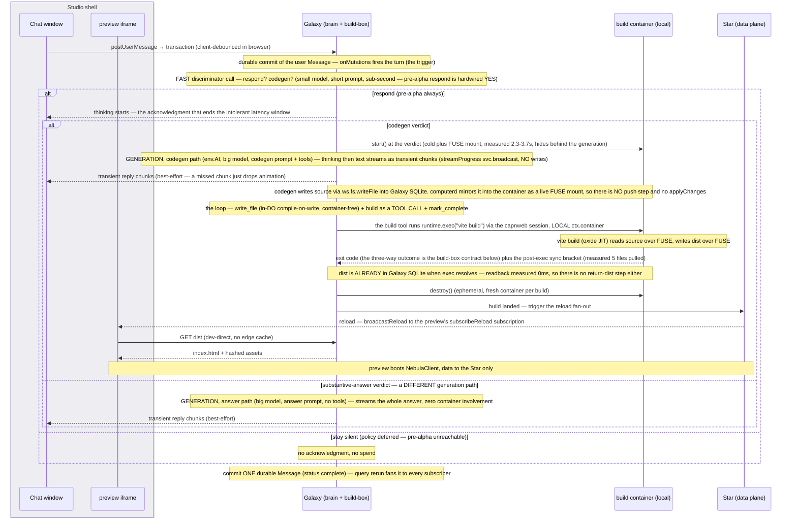

# Galaxy collapse + chat — one node, one thread

**Status:** **Pre-review as a whole** — the deliberate bet is *one big file, one long review, then implementation that is mostly transcription*. Doing it in multiple task files would have left either duplication or a broken interim state between them. Sole active child of [nebula-pre-alpha.md](nebula-pre-alpha.md); that file's wipe item 6 (`actingToken`) lands before this task's build (Phase 2 consumes it), and the whole-file review is deliberately deferred to just before the build.

> 📖 **Vocabulary — one word, one job**:
> - **collapse** = the **node** collapse: DevStudio + DevContainer + Galaxy → one `Galaxy`. **Never used for anything else in this file.**
> - **coalesce** = ADR-004's in-place **snapshot** mechanism (a same-actor write updates the current snapshot rather than opening a new row). Reduces *snapshots*, **not** write count. The code names it `coalesceWindowMs`; called **coalesce** throughout this file so it cannot collide with the *real* (client) debounce below.
> - **debounce** = the **client debounce** (the custom Vue store's, batching client-originated writes before the wire) — the only debounce this task touches. *(A server-side **local debounce** for streaming was considered and **DEFERRED** — see Phase 6.)*

**Collapse leads; chat is restored onto it** — chat's address, host and fanout all move with the collapse, so building chat first would tune it to an architecture this task deletes. **Part I** pins the architecture — what the collapsed node is, where the compute runs, how the built app is served, and what the turn apparatus becomes. **Part II** restates chat against it — § *Preserved* pins what survives untouched. **Part III** interleaves the two into phases, document order = build order.

---

# Part I — The architecture

## Decisions locked

- **Collapse all THREE** — Galaxy + DevStudio + DevContainer → one node named **`Galaxy`**.
- **Container kept, demoted, and EPHEMERAL** — from a live vite dev-server to a **stateless build-box, one fresh container per build**. A container that never outlives a build **can't reach the stuck state** — the keep-alive / stuck-recovery apparatus is *designed away*, not solved. Drive + timing → Phase 3; measurements → § *Relationships*. *(Frontend toolchain is going native Rust/Go; in-workerd builds are a losing bet — [[studio-keep-container-native-tide]].)*
  - **Getting the container out of serving decouples *viewing* from the slowest-waking node — a primary reason for the demotion.** Seeing the user-dev app's current state (done before *every* prompt) waits only on **Galaxy** (serves `dist/`) + **Star** (data) waking, **never the container** — which isn't in the read path at all. The container is engaged only on a **build** (a code change — deliberate + latency-tolerant), so even a *cold* container never delays *viewing*.
  - **There is no source to ship and no built output (`dist`) to return**. `@cloudflare/computer` provides a FUSE mount inside the container, `/workspace`, that is stored in the mounting DO's storage and accessible from the DO via file operation methods (`ws.fs.*`) as well as full git client support (`ws.git` — both verified in the installed `.d.ts`). Commit-per-turn runs DO-side through that client; real git inside the container **can** work against the same mount (fast-follow § *Item 4*'s transport candidate).
  - **Build-box co-located in Galaxy** — a local `ctx.container` call, no cross-node hop. Two channels, one container: `runtime.exec` rides the **capnweb session** to the in-container `computerd`; the build's **file I/O** is what rides the FUSE mount.
  - **Ephemeral drive is simple — never gate on `.running`; liveness lives on a bounded health probe** (`.running=true` ≠ *ready*). The sequence and the probe's two points are Phase 3's; the rule is `containers.md`'s.
  - ⚠️ **Attach `ctx.container.monitor()` on every build — mandatory even though the container is ephemeral**: without it `.running` goes stale-`true` after the first `destroy()` and the loop wedges on the second message. Mechanism → `containers.md`.
  - **Serialize build cycles with an in-memory promise-chain latch — NEVER `blockConcurrencyWhile`** (Larry, 2026-08-24): overlapping builds **queue** on the one `ctx.container` while the Galaxy stays responsive, because every await yields — `blockConcurrencyWhile` would deafen it for the probe's seconds at every build start. Full rule + rationale → `containers.md`; Phase 4's single-flight trigger makes overlap near-impossible, so the latch is the backstop.
  - **Don't vendor the `@cloudflare/containers` base class, but READ it and BORROW its patterns** (Larry) — the `monitor()` attach, the serialize-transitions latch, and the readiness poll are exactly what it gets right (`containers.md` § *steal its homework*); the spike already ported the ~15-line readiness pattern (`experiments/plain-do-container` `driveContainer`/`probe`).
  - **`ctx.abort()` / stuck-flag recovery DELETED** — the stuck state (native to `ctx.container`, cloud-only, deploy-only-recoverable) is designed away by the ephemeral model (the Container-kept row). Log the stuck signature via `@lumenize/debug` for evidence (a dedicated WAE metric is post-pre-alpha) — **expect zero**.
- **Every arriving message gets up to TWO LLM calls**:
  - **The fast DISCRIMINATOR** answers `{respond?, codegen?}` — small fast model, short prompt, sub-second budget, in the **intolerant** latency window. Its verdict does three jobs: **places the "Nebula is thinking" acknowledgment**, **gates the container warm** (on the codegen verdict, never on message-arrival — "codegen-start" has always meant this moment), and **forks the generation prompt** (the tool-bearing codegen loop vs a plain answer). Models are picked at build and never surfaced in UI.
  - **When needed, the GENERATION** — the long, accurate call: big model, full context, tolerant window.
  - **Pre-alpha vs deferred, in one place:** this task builds the call site with `respond?` **hardwired YES**; the policy that unhardwires it (§ *Non-goals*) and the mid-generation queue-or-cancel UX that consumes the same verdict are [fast-follow](nebula-pre-alpha-fast-follow.md) § *Item 6*'s. ⚠️ The discriminator's input today is the triggering message ONLY — when the deferred policy makes it read the THREAD, the ADR-019 observation stamp lands in that same change (§ *Participant model*).
- **The user-developer's built app is a pre-built static *artifact*** (the build-box's `dist/`), **served by the Galaxy** — the DO **is** engaged per request, dev and published alike; *"static" = the artifact, not the path*. Tiers, caching, and routes → § *Serving*.
  - **`/app/*` serving is a composable `serve.ts`, its config shaped like the Assets stanza** (Larry, 2026-08-24) — one file in `apps/nebula/src`, NOT a package. One serving convention to learn: the same match-first/SPA behavior as `/studio/*`, encoded once, with `directory` becoming a `getFile` seam so the store can be Galaxy's SQLite today and anything later. Only the features needed now; an unsupported config value **throws** rather than silently no-oping. Rationale: the Registry's hand-built routing took weeks to untangle, and this routing only grows — a declared config shape is the discipline. *(One divergence, stated: Assets manages Studio's caching itself via ETags; `serve.ts` implements the caching pin — same effect, different mechanism.)*
  - **The star segment in the URL selects WHICH `dist`** — `.dev` serves the working tree's current build (the only case built pre-alpha); any other star serves the published **`dist-prod/`** (⏭️ [fast-follow](nebula-pre-alpha-fast-follow.md) § *Item 5*). The rule is pinned now so "same homogeneous path" cannot be read as one-dist-for-all.
  - **Tenant apps never use Workers Assets** — one bucket per Worker mixes N tenants; the platform **Studio UI** can, and does, precisely because it is *singular*.
- **`entrypoint.ts` adopts the Registry's route runner — `createRouter` from `nebula-auth`'s `route-pipeline.ts` — so the Worker's routes and gates read as one table, the same convention the Registry rewrite established** (Larry, 2026-08-24; the barrel needs a one-line export). The gates are deliberately minimal: Studio and `/_version` carry none, the Gateway and Registry own theirs, and `/app/*` is GET/HEAD-bounded only. ⚠️ **Passage-gating `/app/*` was considered and REJECTED (2026-08-24):** browsers send no `Authorization` on document or sub-asset loads — the preview iframe IS the consumer — and a path-scoped cookie was rejected outright (no cookies for this). Any future entrypoint gate authenticates via `Authorization: Bearer`, never a cookie — which is also why it would gate a programmatic surface, not a browser-loaded one.
- **The Galaxy's orgTree HOLDS GRANTS, and is one node.** scopeAdmin's with dominion have full admin access even down into the Resources plane. However, a non-`scopeAdmin` peer can only act on a Resources plane through a grant, so a non-scopeAdmin collaborator requires them. One node, a handful of grants, all auditable.
  - ⚠️ **Passage is NOT what protects the chat — the DAG grant is**: every star's members have passage into `{u}.{g}` (a sibling **production** Star's as much as `.dev`'s). The denial is the per-op DAG check inside the Resources plane — the two-gate contract § *Costs / risks* → *Authorization is NOT "unchanged"* states in full.
  - ⚠️ **Do not confuse the two grains.** Coarse-grained access control (ADR-015's passage — checked at every mesh node's `onBeforeCall`, and enough to get in) is decided by the token's authScope. Fine-grained access control (the Resources plane's DAG grants) keys off of the **subject** (`sub` — not the person) — a `write` grant at the orgTree root is what makes a non-scopeAdmin collaborator. Same coin, other face. Narrowing a token to a star would only narrow `scopeAdmin`'s **dominion** over the star, but we're talking about non-scopeAdmin peer collaboarators here so that doesn't apply. However, **passage into every ancestor** counterintuitively remains, and the subject's grants are never touched.
- **TARGET, not this task's deliverable: a composed capability reached through ONE `@mesh()` GATE returning its instance** (`@mesh() resources() { return this.#dataPlane }`, called as `ctn<Galaxy>().resources().invite(...)`), with `dagTree()` folded in — one door; a per-host method duplicating the composed class's logic is the forbidden shape. Mechanism → `mesh.md` § *Object-capability access: gate once, then chain*.
  - **This task moves toward it without arriving**: the `invite` logic moves into the plane behind four `TEMP`-labelled forwards (Phase 1), and no call site changes.
  - **The gate, the entry deletions and the `dagTree()` fold are [nebula-data-plane-owns-its-guards.md](nebula-data-plane-owns-its-guards.md)'s**, which runs immediately after (settled 2026-08-23). Reasoning → its § *Design intent*.
  - **So the upward-visibility audit rides that task too**: its unit is what the `resources()` gate returns — a decorator-line grep cannot see through a gate — and it audits the folded surface, which only exists after this one. Doing it here was considered and rejected: most of the sites it would annotate are entries the follow-on deletes.
- **The Chat (today's `Session` type — renamed in Phase 2, § *Naming*) lives at Galaxy/app level `{u}.{g}`, not Star/tenant/dev level `{u}.{g}.dev`** (pinned 2026-08-23). The authoring conversation is per-app: one build is used by many tenants while tenant data stays per-Star. `DEFAULT_SESSION_ID` (the fixed single-session id — the data grouping) and `SESSION_NODE_ID` (the one DAG node chat grants attach to — maps to `ROOT_NODE_ID`) re-home with it in Phase 2; the Phase 1/2/4 criteria all assert at `{u}.{g}`.
- **Star stays a pure data plane** — Resources + the ontology that validates them; **never** app code (the retired `Star.onRequest` stays retired) — and the built app is never served from a Star either: `dist` lives on the Galaxy that builds it (§ *Serving*).
- **Ontology → Star** (push in dev, lazy-pull in prod); **app-code `dist/` → Galaxy** (served; R2 only as a deferred cache-origin), never the Star.
  - ⏭️ **The prod install path is NOT this task's — it is [nebula-pre-alpha-fast-follow.md](nebula-pre-alpha-fast-follow.md) § *Item 4: The prod ontology install path*'s.** The dev push covers every Star in the pre-alpha loop; a Star the Galaxy never pushed to exists only once an app is published, which the staging ladder puts in alpha. Its candidate shape and open questions live there, along with the six tests skipped on it — **this task's closing sweep no longer counts them**.
  - ✅ **The container transport is `@cloudflare/computer` — ADOPTED** (MIT; successor to `@cloudflare/shell`, whose migration renames `workspace.shell.exec` → `workspace.runtime.exec`). `applyChanges` **stops existing** rather than being replaced by git; commit-per-turn and shipped-version-is-a-tag work entirely locally in Galaxy's own SQLite — **no git server and no Artifacts**. Evidence → § *Relationships*.
- **`appVersion` = the ontology's version LABEL** (today `'session-message-v1'` — human/LLM-chosen, ordered by the registry today and by position in the history file after [nebula-ontology-history-file.md](nebula-ontology-history-file.md)). Baked into the built shell so the client's data ops are version-gated (`OntologyStaleError`). It changes on an **ontology** change, never a code build. **No stored "latest" pointer exists or is needed** — the current version is the history file's last entry, read by a local helper (`ontologyVersion()`). **Renamed `appVersion` → `ontologyVersion` in Phase 2** — the misnomer invites "is this a publish artifact?" and would tax every future task file that touches it.
  - **Every ontology is a file in a git repo — one convention, two repos** (Larry, 2026-08-24). The user app's evolves in the **Workspace** repo (the migrations-era history file); the platform's chat ontology lives in the **platform** repo (`devstudio-resource-ontology.ts` — it exists so chat could reuse the Resources plane) and installs as one seeded version (Phase 2). Not two substrates — two repos.
- **Pre-alpha stays on `nebula.lumenize.com`** — one Worker serves shell, preview, Gateway, and auth together (all same-origin), so there's **no serving-domain work** in this task.

## Why one node isn't a UX performance problem

Here is every UX performance objection to the collapse we could think of, addressed — in light of the design decisions above and reasoning about where latency actually hurts UX, all grounded with experiment results:

- **Nothing CPU-heavy runs on Galaxy's DO thread — and CPU is what actually blocks.** The build/compile is the build-box's; the generation is `env.AI`'s; the thread keeps light orchestration only. Two exceptions remain in the DO, **NOT moved by this task**: 
  - isomorphic-git/Workspace ops — acceptable while the dev loop is serial + single-user, because when they DO run, nothing interleaves.
  - **typia validation-function generation** (occasional — ontology-change only). Its move into the container is a **later task with three reasons, any one sufficient**:
    - **Contention:** generation runs **tsc**, genuinely CPU-heavy — if it contends once there's concurrent load, move it then, even before any feature need.
    - **TS7.x pull:** typia's author is shipping on a **Go/native `tsc`** that cannot run in a workerd isolate, so adopting it forces the move anyway.
    - ⚠️ **Latency, already measured:** the tsc bundle alone puts **every DO in the Worker** (Gateway and Registry included) in the large cold-start tier — create ~1,306 ms vs ~357 ms without it, wake **unstable** to ~1,410 ms. The request path only *loads* a precompiled validator, so the move returns the small tier with **no DO class migration** (`experiments/do-cold-start-bundle-ab/RESULTS.md` § *Now what?* recommends exactly this).
- **A long await does NOT block.** The `env.AI` call stays on the DO but is a **network await** → the input gate opens → **every latency-sensitive client operation** — chat commits, resource reads and subscribes, `dist` serves, the next arrival's discriminator — interleaves rather than waiting for the reply to finish.
- **Startup contention is moot.** Viewing current state is fast — vite is demoted from a live dev-server (HMR/watch mode) to a pure build, so the container is off the read path entirely — and the loop is inherently **serial** (see current state → next prompt), so there's no concurrent load to contend on the single thread anyway.
- ⚠️ **Latency is priced against TWO user expectations, split by the moment "Nebula is thinking" appears** (Larry, 2026-08-24):
  - **Before the acknowledgment** (submit → "thinking" appears), **the budget is a few hundred ms.** The user's own message renders instantly — it echoes locally, keyed by its client-minted id — so what they are actually waiting on is the thinking signal, which needs the Galaxy **awake** (and, post-pre-alpha, the discriminator's verdict — the two-LLM-calls row).
  - **The wake cost lands inside that budget, and hibernation makes it routine:** the Galaxy hibernates as soon as **~10 s after its last reply**, so even a mid-conversation message can pay a wake up. **Today that wake is a gamble** — the large bundle tier is unstable: an identical bundle measured **120 ms one run and ~1.3 s another**, so the typical day might be fine and the worst case is a silent **~1.4 s** gap. **However, the fix is already known:** move typia into the container (the typia bullet's third reason) and the Worker drops to the small tier, where the worst measured median is **~115 ms** — inside the budget.
  - **After "thinking" appears, expectation relaxes to tens of seconds–minutes.** User-devs want fast LLM responses but are already used to them being much longer and streaming updates mitigates UX frustration. That is where the container's ~3.2 s cold+mount hides (fired at the codegen verdict, behind the generation) — **and the build itself**, a few seconds on today's toolchain (the vite 8 speedups exist but are blocked and unbankable — § *Relationships*). Neither number ever needed shrinking.
- **Keep-warm is retired for BOTH, and the windows are why — not thrift.**
  - **The container:** its whole cost sits in the tolerant window, so warmth would buy nothing a user can feel.
  - **The DO:** its wake sits in the intolerant window, where the fix is the **small bundle tier** (the typia move) — warmth machinery would mask the cost, not remove it.
  - **The residency hold is NOT keep-warm, despite the resemblance.** Phase 3's `setTimeout` heartbeat keeps the Galaxy from hibernating **mid-turn** — the mesh chain runs detached after early-ack, so no held request ties the DO to its in-flight `env.AI` awaits and container span. It protects **work in progress**, rather than mitigates restart latency.
- **Future worry: The storage axis: wake cost also scales with SQLite size.**
  - **The mechanism:** a cold-storage restore is proportional to the DB's size (multi-GB → several seconds), and it stacks on top of whichever bundle tier the Worker is in.
  - **It is NOT paid on every ~10 s hibernation.** Eviction to cold storage is a separate, deeper event on an unpublished, it-depends timescale (minutes? days? CF doesn't say) — an occasional cost, not a per-idle one.
  - **Posture: monitor, don't engineer.** CF knows it's a sore spot and has roadmap items, and our storage stays small for a while — git history and text messages grow slowly.
  - **Whose worry:** mostly a **Star**'s (resource data) *today*. ⚠️ The Galaxy caveat: § *Serving*'s placement pin puts it in the published app's per-request asset path while three corpora grow on it (git history, the chat thread, the codegen corpus) — that pin rides the deferred cache-origin work, a risk already accepted in the backlog's R2 cache row.

## Pinned node shape

| Decision | Choice | Rationale |
|---|---|---|
| Collapsed class | **`Galaxy`** | All three collapse into it; the app-level Galaxy (ontology registry) is the enduring identity, now also carrying codegen + chat Resources + Workspace + the build-box. Name a class for what it *is*, not its superclass. |
| Base class | **`extends NebulaDO`** (→ `LumenizeDO`) — a plain mesh DO that drives the build container via the **raw `ctx.container` API**, NOT `extends Container`. | Keeps the full `NebulaDO` surface — **`svc.broadcast`**, **`svc.alarms`**, and **pool-workers construction + unit-testability** — all of which `extends Container` forfeits. `ctx.container` is a documented API on any DO. Retiring `NebulaContainer` → **final cleanup phase**; `LumenizeContainer`'s retirement is [backlog.md](backlog.md) § *Lumenize Mesh* (ADR-007). Tenant scope-reach guard composed the same way `NebulaDO` already does it. |
| Binding | one — **`GALAXY`** (`DEV_STUDIO` + `DEV_CONTAINER` both removed) | Three nodes → one; the brain moves **env→app level** (`{u}.{g}`), data stays per-env (`{u}.{g}.{env}` Star). |
| wrangler | `containers[].class_name` **and** the DO binding → `Galaxy`. No `defaultPort`/`sleepAfter` class props (those are `Container`-only) — the plain `NebulaDO` manages the **ephemeral** container lifecycle **in code** (start at codegen-start · `monitor()`+probe · `destroy()` after deliver). | container-capability config lives on the concrete node. |

## Cast

- **Galaxy** `{u}.{g}` — the brain: codegen (`env.AI`), git Workspace, chat Resources, orchestration, the co-located build-box; serves the dev `dist/`; owns the ontology registry.
- **build container** *(local, in Galaxy)* — stateless: it runs `vite build` against a FUSE mount of Galaxy's own tree, writing `dist` back through the same mount. Takes no source and returns no artifact. No serving, no HMR, no durable state; `node_modules` is baked into the image on ext4, never in the mount.
- **Star** `{u}.{g}.{env}` — pure data plane: Resources + ontology/validator. The running app's only runtime backend.
- **Studio shell** — the user-developer's cockpit, one browser page holding two surfaces: the **chat window** (talks to Galaxy over the mesh) and the **preview iframe** (below). *(The Gateway WS that the mesh traffic actually traverses is elided — a transparent hop.)*
- **preview iframe** — the built app; code ← Galaxy (dev direct, prod behind a cache — R2 only if escalated); data ↔ Star.

## Core flow



## The build-box contract

**There is no *intentional* transfer step in either direction — the mount IS the transfer.** The old design pushed source in
(`applyChanges`/`syncToDevContainer`) and pulled `dist` back out; both steps are **deleted, not ported**: a file
written into Galaxy's tree is already in `/workspace`, and `dist` written by the build is already in Galaxy's VFS
when `exec` resolves (evidence → § *Relationships*). The call is `runtime.exec('vite build')` over the local
`ctx.container` — not `getTcpPort().fetch()`. What remains is **one call with three outcomes**, and the bullets below are about those:

```
build() →                                 no source arg — /workspace IS Galaxy's tree
   { ok: true }                           dist is ALREADY in Galaxy's VFS when exec resolves
 | { ok: false, buildError }              their code — deterministic, SHOW it, never retry
 | { ok: false, retryable: true, detail } box hiccup — retry (idempotent)
```

- **The split is load-bearing, and the outcomes are the agent's TOOL RESULTS** (build is a loop tool — the Non-goals build-is-a-tool row): a `buildError` is a *normal outcome* returned to the **model** to fix and rebuild in-turn — never blindly re-run, and shown to the user only if the turn ends unfixed. Only infra failures (`retryable`) retry the same code.
- **Recovery — no `ctx.abort()`, and ephemeral makes it trivial** (the liveness policy — probe, never `.running` — is § *Decisions locked*'s): a hung/wedged build is just `destroy()` + fresh `start()` + rebuild (`retryable`, idempotent); a build hang → `BUILD_TIMEOUT` + SIGKILL → `retryable`. The **stuck state can't arise** (a container never outlives its build), so there's no live-serving emergency to nuke — which is what makes co-locating the container in Galaxy safe (recovery never tears down the brain).
- **Log the stuck signature for evidence — no bespoke counter** (`isStuckFlagError`: *"not running / suddenly disconnected / proxying request to container"* — the cloud-only stale-`running=true` that `destroy()` can't clear, native to `ctx.container` — [[cf-container-stuck-flag-cloud]]). Pre-alpha: it already surfaces as an error → **log it via `@lumenize/debug`** (queryable post-facto; rides the observability-tail-worker harvest). A dedicated **stuck-rate metric via Workers Analytics Engine** — also the billing-usage substrate, so a good first WAE learning — is **post-pre-alpha**. Expect **zero**; if it ever fires, that's data, not a reason to re-add `ctx.abort()` (**bar: "a lot of convincing"** — Larry).

## Serving

One Worker serves every surface. The table says who serves what and when it lands; the subsections that follow take the surfaces one at a time.

**URL scheme (settled with Larry 2026-07-24 — Studio moves to `/studio`, and `/app` becomes the built app's):**

| Route | Served by | For | When |
|---|---|---|---|
| `/studio/{activeScope}/*`<br/>= `/studio/{u}.{g}/*` | Workers Assets (SPA fallback) | STUDIO | ✅ **this task** — Phase 3 lands it |
| `/app/{activeScope}/*`<br>= `/app/{u}.{g}.dev/*` | worker-first → Galaxy `fetch` handler, **working-tree `dist`** | USER-APP-DEV | ✅ **this task** — Phase 3 |
| `/app/{activeScope}/*`<br>= `/app/{u}.{g}.{s}/*` | the **same** handler, the published **`dist-prod/`** (one copy, every tenant star) | USER-APP-PROD | ⏭️ deferred — [fast-follow](nebula-pre-alpha-fast-follow.md) § *Item 5* |
| `/auth/{authScope}/*` | the Registry | REGISTRY | unchanged |
| `/gateway/*` | the multiplexed mesh WebSocket | MESH | unchanged |
| `/_version` | platform-Worker git-SHA | PLATFORM | unchanged |

⭐ **The url convention: the FIRST segment names a SURFACE, and the second segment, if applicable, is a scope** — spelled `{activeScope}` / `{authScope}` in the table's routes. Do not name routes by node: Studio's data plane is `GALAXY` and so is the built app's server, so node-naming collapses both onto one prefix — surface-naming is what keeps Studio and the built app distinct.

**Placement pin (forced by the collapse):** the deferred `.{s}` row rides the **same** Galaxy `.fetch()` handler — **never** per-tenant Workers Assets (§ *Decisions locked*). Its serve is **never in doubt, only deferred** — [nebula-pre-alpha-fast-follow.md](nebula-pre-alpha-fast-follow.md) § *Item 5*. The **scale** mechanisms — edge cache, herd, R2 — are a different kind of future: **decided by measured experience, not committed** — [backlog.md](backlog.md) § *Future bigger things*.

**The data planes have no route** — Studio's and the built app's both ride the mesh; each subsection names its host.

**`/_version` stays at root** — the single **platform-Worker git-SHA** compare (`GET /_version` handler in [entrypoint.ts](../apps/nebula/src/entrypoint.ts); deploy/harness tooling). One Worker, one SHA — don't split it per-surface.

### Studio — Workers Assets

**The config is the explanation — note that `/studio` appears NOWHERE in it.** Assets serves every path not listed in `run_worker_first`, and that is how all of `/studio/*` is served: unlisted, by construction. How a login gets there — `NEBULA_AUTH_REDIRECT` — is § *Where a login lands*'s:

  ```jsonc
  "assets": {
    // ONE bundle: Studio is one app for the whole system. The activeScope segment doesn't
    // change what is served. Rather, it tells the Studio UI which Galaxy to address over
    // mesh and which .dev Star to use for the embedded iframe(s).
    
    "directory": "../nebula-studio-ui/dist",   // Studio's vite build — the ONE Workers-Assets bucket
    
    "binding": "ASSETS",
    // Optional, and unused today: it puts env.ASSETS.fetch(request) on the Worker — retrieves
    // a file with html/not-found handling applied. The lever for ever serving Studio files
    // from a worker-first path (auth-gated entry, custom headers).
    
    "not_found_handling": "single-page-application",
    // "single-page-application" means that if the file exists, it is served, but if it doesn't
    // index.html is served with a 200. It's up to the client-side routing inside the Studio UI
    // to decide what to do after that, including things that would normally have resulted in a 404.
    
    "run_worker_first": ["/app/*", "/auth/*", "/gateway/*", "/_version"]
    // A LISTED prefix always runs entrypoint.ts, which never falls back to Assets (it ends
    // in 404) — which is exactly why /studio/* MUST stay unlisted. /app/* is the serveApp
    // route step, which reimplements the same match-first rule against its own dist
    // (§ How /app/* is served — whose vite-base bullet also carries why Studio's vite-base is `/`).
  }
  ```

**Studio's data plane rides the mesh to `GALAXY`** — `NebulaClient` over the Gateway WS; **no HTTP data path exists**.

### How `/app/*` is served — the `.dev` star, the only one pre-alpha

**The ordering strategy in one line: this task serves ONE star — `.dev`, always the working tree's `dist/`.** Tenant stars and the published tier are the NEXT task's: [fast-follow](nebula-pre-alpha-fast-follow.md) § *Item 5* holds that future state (`dist-prod/`, the publish commit as provenance, custom domains). What follows is the whole serving story the collapse builds.

**The `/app/*` route's `serveApp` step: the URL's scope segment is a STAR scope (`/app/{u}.{g}.{s}/*`) — strip `.{s}` for the owning Galaxy → resolve it → `serve.ts`** (the codeblock's match-first rule, encoded once — § *Decisions locked*; Phase 3 carries the criteria). Studio put the star scope there by the inverse move: the iframe src it composes is its own `{u}.{g}` + `.dev`.

- **Gate:** deliberately **ungated, GET/HEAD-bounded** — browsers send no `Authorization` on document loads, and data is gated on the mesh path. A passage gate was considered and rejected on exactly that fact (§ *Decisions locked*, 2026-08-24).
- **vite `base`: NO baked prefix — the scaffold builds with `base: './'`, and `serve.ts` injects `<base href="/app/{u}.{g}.{s}/">` into `index.html` as it serves it** (decided with Larry 2026-08-26; Phase 3 deletes the scaffold's baked `.dev` prefix). Neither half works alone:
  - **Why not vite's default `base: '/'`:** it emits root-absolute asset URLs (`/assets/index-{hash}.js`) that never start with `/app/`, fall to **Studio's** Assets bucket, miss, and SPA fallback answers the script tag with Studio's `index.html` at **200** — white screen, clean network tab.
  - **Why not bare `'./'`:** a relative URL resolves against the containing DOCUMENT's URL. At the app root that lands right (`/app/{u}.{g}.dev/` + `./assets/…`), but a shared deep link `/app/{u}.{g}.dev/invoices/42` is answered with the same `index.html` (SPA fallback), so `./assets/index-{hash}.js` resolves to `/app/{u}.{g}.dev/invoices/assets/…` — no such file, and the miss is the same silent 200.
  - **What the injected `<base>` closes:** relative URLs resolve against IT instead of the document path, so every asset lands under the prefix the document was ACTUALLY served from — ONE build valid at any prefix, which is what the published one-copy serve needs ([fast-follow](nebula-pre-alpha-fast-follow.md) § *Item 5*) — and it covers the future custom domain too: there the app sits at its own origin's root, so the injected value is simply `<base href="/">`. Same copy, no rebuild.
  - **Inject with `HTMLRewriter`** — workerd-native, streaming, zero bundle bytes, no await; also the lever a future CSP-nonce pass would use (unconsidered yet).
  - **Studio needs no injection:** its assets really are at the origin root and only the *document* path varies, so its `base` stays `/`.
- **Never `routeDORequest`:** it reads segment 0 as the binding and segment 1 as the instance, so `/app/{u}.{g}.{s}` names neither.

**Caching pin (2026-08-24) — both tiers, `.dev` and published** (only the edge-tier bullet is pre-alpha-scoped; a tenant star's `index.html` differs per-star at serve time — the injected `<base>` — so `no-store` on the entry point is right there too):

- **`index.html`: `Cache-Control: no-store`.** It is the un-hashed entry point that names every hashed asset — a cached stale copy would keep asking for stale names — and it is the file `serve.ts` injects `<base href>` into.
- **Hashed assets: `public, max-age=31536000, immutable`.** vite content-hashes every bundled file — js, css, and any imported/referenced asset like a logo — so a content change changes the *name*, which is what makes `immutable` safe. Generated apps should reference every asset this way.
- **`public/` copies: also `no-store`.** vite copies `public/` files to `dist/`'s root, unhashed and names unchanged — `public/` is only for files something outside the app requests at a fixed root path (`favicon.ico`, `robots.txt`).
- **ETag/304 is the available upgrade, not built:** if unhashed-file bytes ever matter, the Workspace's git already content-addresses every blob — the ETag is free. With it, the unhashed arm relaxes to `no-cache` (revalidate, 304 on unchanged), never to a `max-age` guess, which would serve a stale file with no recourse.
- **No edge tier sits in front (pre-alpha):** every request reaches the Galaxy; the browser's HTTP cache is the only cache in the path. The published tier's edge mechanics are measured-then-decided ([backlog.md](backlog.md) § *Future bigger things*).

**The built app's data plane rides the mesh to `STAR`** — same shape as Studio's, different binding.

**Three versions live near this route, and none is another:**

- **`/_version`** — the **platform Worker's** git SHA (ours; the intro's route).
- **`ontologyVersion`** (today's `appVersion`, renamed in Phase 2) — the **ontology's** version label; gates *data* ops (`OntologyStaleError`) and changes only on an ontology change, never a code build (§ *Decisions locked*).
- **The built app's code** — no version *number* at all: hashed asset names + the Galaxy's git history (the published tier's copy-and-provenance story is Item 5's). Fresh code reaches an open .dev Star preview iframe by a PUSH so a dev-user sees changes that were just made ASAP. Note, prod Stars will likely do this differently to avoid thundering herd risk. There is also a GATE for correctness:
  1. **Register.** On connect, the preview's embedded `NebulaClient` calls `subscribeReload()` — one more subscription on the mesh connection its data plane already rides. No snapshot; registering enrolls for future signals.
  2. **Push.** `broadcastReload` fans a bare "re-fetch the shell" signal to every subscriber, and the client handler reloads the page — `index.html` is `no-store`, so the reload fetches fresh. **This task's trigger is build completion, and it REPLACES today's** — announced by the Galaxy that just ran the build, its own event, nothing watches or compares. Today's trigger (an ontology install landing a NEW version, `star.ts`) retires with the collapse: the ontology label is baked into the build, so an install without a build gives a reload nothing new to fetch, and keeping both would double-reload every ontology-touching turn (Larry's catch, 2026-08-26). The CHANNEL keeps its future publish role — the trigger line goes, one turn, one reload.
  3. **Gate.** Every resources op carries the ontology version the UI was coded for (today's `appVersion`, renamed in Phase 2); a mismatch answers `OntologyStaleError`, and an install proactively drops old-version subscribers with that error — so a client that missed the push still cannot touch data with stale shapes, and the error doubles as its refresh cue. (Making Studio send its REAL version is Phase 2's uniformity gate.)
  4. **Why a code-only build is push-only:** unchanged ontology means old code is still data-correct, so a missed push just runs older UI until the next reload. The push is best-effort (a failed send is tolerated — reconnect and lazy detection backstop it); the gate is the guarantee.

### Where the scopes come from

**Where the ACTIVE scope comes from: the URL. Where the AUTH scope comes from: a client-side hint, never the URL and never a cookie.** The refresh cookie is `Path=/auth/{authScope}`, so the client must know the auth scope to construct the refresh call — a link that breaks the moment the URL carries the *active* scope instead. `App.vue` already persists `localStorage['nebula.authScope']` as a fallback; this **promotes it to primary, reshaped and re-homed** (Larry, 2026-08-26):
  - **What is stored: a per-workspace map, never one global value.** One entry per active scope — key `nebula.authScope:{activeScope}`, value the auth scope that last authenticated for that workspace (`nebula.authScope:acme.invoicing` → `acme`). A machine working in several workspaces under different identities keeps one hint each; a single global key thrashes across tabs and can hand a workspace the wrong identity's refresh endpoint.
  - **When it is set: in `NebulaClient`, on every successful token acquisition.** The client just proved the pair works — it called `/auth/{authScope}/refresh` for this active scope and got a token — so it writes the entry at that moment. Authoritative, self-healing (a later success under a different identity overwrites; nothing ever clears), and it lives in the client BOTH surfaces embed, so built apps inherit it with no Studio involvement. Today's `App.vue` write moves there.
  - **The cold-browser FIRST entry:** fresh from a magic-link consume, the map is empty — but pre-alpha the consumed link's scope IS the landing's active scope, so the first refresh tries `{activeScope}`, succeeds, and writes the entry. The general case (cold browser, auth scope ≠ landing scope) belongs to [nebula-login-prove-then-choose.md](nebula-login-prove-then-choose.md).

  - ⚠️ **localStorage, NOT a cookie, and the reason is structural.** A cookie is transmitted automatically, putting `authScope` in front of server code that often doesn't need it, at best, and server code that we don't want seeing it, at worst. localStorage never leaves the client, so *"`authScope` from the cookie"* — the scope-less global refresh `security.md` rejects — becomes **impossible rather than prohibited**. The hint tells the CLIENT which refresh endpoint to call; the SERVER still derives auth scope from the path and validates the path-scoped refresh token.
  - **The absent case is a feature, not a bug:** no entry for this active scope, or the refresh the entry names fails, means **run discovery** — [nebula-login-prove-then-choose.md](nebula-login-prove-then-choose.md)'s prove-then-choose flow, whose discovery request a persisted `profileId` would also feed.
  - ⚠️ **Caveat to carry:** localStorage is unavailable or partitioned in restricted iframes and under Safari ITP. The preview iframe is same-origin pre-alpha so it does not bite; if the built app ever moves to its own origin the hint must be re-derived there, never assumed.

⚠️ **This is a step toward [ADR-017](../docs/adr/017-the-url-is-the-view-state.md), not compliance.** The active scope is in the URL; **view state beyond scope — selection, open panel, filters, sort, paging — is NOT in this task.**

⚠️ **A denied recipient is NOT the end state.** ADR-017 says a shared URL is safe to paste because *"a recipient without access simply gets denied"*; the product answer is a prompt to ask someone at or above that node in the orgTree, the Google-Docs move. **Deferred past pre-alpha** (Larry, 2026-08-21) → [on-hold/nebula-request-access.md](on-hold/nebula-request-access.md).

### Where a login lands

**One env value.** Phase 3 sets `NEBULA_AUTH_REDIRECT` from `/app` to `/studio` (with the transcription sweep; today both constants in `consumeAndLogin`'s tier branch evaluate to `/app`, which is why the branch has been invisible). Pre-alpha **no real star-tier login exists** — no published apps; every human logs into Studio — so the behavior is simply **every login lands at `/studio/{activeScope}`**. The star arm (`STAR_LANDING_PREFIX`, stays `/app`) fires only in tests, and deleting it would red the suite's 63 star-landing assertions for zero behavior change. The preview iframe reaches `/app/{u}.{g}.dev/` because **Studio composes that URL itself** (Phase 3's App.vue work) — no login ever routes a person there.

**The redirect's one later change: [nebula-login-prove-then-choose.md](nebula-login-prove-then-choose.md) points it at the discovery endpoint (not yet defined), and there it stays.** Discovery — mailbox proof, then a workspace picker (none when there is exactly one choice) — is that file's design, not this one's. **The collapse goes FIRST** (pinned on ease, Larry 2026-08-24 — this file's half of the shared `consumeAndLogin` seam is one env value plus a sweep; ⚠️ re-evaluate if that reading weakens once that file's phases are written). ⚠️ Do not interleave the seam edits; whichever lands second inherits — the reciprocal note lives in that file.

## Naming — the turn *apparatus* is deleted; `Session` is renamed

The durable unit is **`Message`** — never `turn`. "Turn" is single-user (Claude-Code) framing that would quietly smuggle wrong defaults into the multi-user decisions below. And the cleanup is mostly **deletion**, because `turnId` et al. were scaffolding for **one-shot-push delivery**, which the subscription replaces:

| Symbol | → | Why |
|---|---|---|
| `Message` Resource | *(unchanged)* | already the durable unit |
| `turnId` | **DELETED** | it existed only to correlate the one-shot `onChatResult` push; the reply now self-identifies by its message id in the subscribed set. Ids become just message ids: **client-minted** for the user's message (idempotency, ADR-010) + **Galaxy-minted** for the agent `Message`. Link reply→prompt with a `replyTo` ref only if the UI needs it. |
| `onChatResult` | **DELETED** | the subscription carries completion (the `Message` reaching `done`) — no keyed push |
| `deliverTurnResult` | **DELETED** | exists only to fire `onChatResult` |
| `#pendingTurns` | **DELETED** (as-is) | the client renders from the subscription, not an in-heap map settled by a push. Optimistic "sending…" state is local, keyed by the client-minted message id. |
| `recordTurn` | **DELETED** — with `TurnRecord`, `Turns`, `getTurns`, `idx_Turns_time`, and `DevStudio`'s `#recordTurn` fire | an agent `Message` **is** a codegen turn, so the two tables duplicated one event ("codegen-eval is a different domain, so a different table" was considered and settled the other way — do not re-derive it). The corpus folds into the `Message` resource model — shape pinned in [nebula-studio-self-improvement.md](on-hold/nebula-studio-self-improvement.md) § *The folded shape*, which this task **builds**. |

**`Session` → `Chat`** (Larry, 2026-08-24). "Session" is auth vocabulary everywhere else in this repo — refresh sessions, login sessions — and the collision is real: it misread as auth in the middle of a hand review. The rename rides Phase 2's ontology edit; the constants follow (`DEFAULT_SESSION_ID` → `DEFAULT_CHAT_ID`, `SESSION_NODE_ID` → `CHAT_NODE_ID`, `ensureSession` → `ensureChat`, `SESSION_MESSAGE_*` → `CHAT_MESSAGE_*`). **Reserved for later: `Thread`** — a future sub-container; a `Message` will attach to the main Chat or a sub-Thread. `MainThread` was considered and rejected: it names the parent for a child concept that does not exist yet.

**Deletion is self-enforcing where a rename isn't:** every lingering reference to a deleted symbol is a *compile error*, so the toolchain finds the stragglers (`workflow.md` § Symbol renames is the rename hazard this sidesteps). **No rename remains at all**, so the cleanup is **pure deletion — fully compile-enforced.**

---

# Part II — Chat, on the new architecture

## Objective (target, present tense)

The Studio chat is a **durable, multi-user, reactive** thread. Human messages AND the agent (Nebula) reply already persist as `Message` Resources, so the bulk of the work is **render + attribution + streaming**, not adding storage. Render the thread from a **live subscription** so reload / reconnect / multi-tab / a second participant all restore and stay live, and attribute each message to a stable identity — WHO a message is from and how it displays is § *Participant model*'s just below; the client-side name/avatar resolution is Preserved § *Name resolution*'s. **THE GATE** — the master plan's pre-invite capture of codegen signal ([nebula-pre-alpha.md](nebula-pre-alpha.md)) — rides this substrate: the `Turns` recorder was its shipped precursor, and this task re-homes that capture onto the agent `Message`'s `codegen` value object, so Phase 1's deletion of `recordTurn`/`getTurns` is a re-homing, not a regression.

## Participant model (settled with Larry 2026-07-06 — survives the collapse)

Every `Message` snapshot includes a `meta.actingToken` that looks like this (a Nebula-authored one shown):

```jsonc
// The WIRE shape (`WireActingToken`, resources.ts): an allow-list of identity + display
// profileIds — the stored ActingTokenRecord adds `access`, which never rides the wire.
// Server-stamped from callContext on every snapshot (resources.ts) — unforgeable,
// already delivered on Snapshot.meta, just not consumed yet.
{
  "sub": "9f2e6c0a-…",        // the TRIGGERING HUMAN — the subject. Author attribution AND
                              // authorization key off this, never `act` (RFC-8693)
  "profileId": "c41d88b2-…",  // the human's public profile address — display-only (ADR-013)
  "act": {                    // present only when someone acted for the subject;
                              // a human's own message carries no `act` key at all
    "sub": "agent:nebula",    // the actor — a non-UUID sub is accepted
    "profileId": "…"          // NEBULA_PROFILE_ID → the seeded "Nebula" Profile (Phase 2)
  }
}
```

- **The DISPLAYED author is `{actor} for {principal}`** when `act` is present (*Nebula for {human}*), else the principal alone — both parties deliberately shown.
- **Display derives ONLY from verified claims — author from `sub`, `kind` from the outermost `act?.sub === NEBULA_SUB` — which is what makes author spoofing impossible.** The claims ride a committed snapshot's `meta.actingToken`, and the optimistic echo of your own pending message reads your own JWT's. A Nebula reply has no optimistic moment at all — clients never author one: its transient chunks and its durable snapshot both arrive FROM the server on the subscription, so its attribution is server-supplied at every stage, no round trip waited on. Today's `Message.author` is CLIENT-written — a sender could post as anyone by providing a name — and an injected `role` would dress a human message as Nebula's; this task DROPS both fields (type, writers, tests — § *Preserved*).
- **An outdated or hostile client can still SEND either key; it lands inert — and this is a GENERAL Resources fact, not a chat one.** typia is non-strict, so ANY undeclared key persists at rest on any Resource (§ *Preserved*); once dropped, `author`/`role` are indistinguishable from other excess-key garbage. No render path reads them — hence the criterion asserts the render, never absence-from-storage. Rejecting excess keys plane-wide (the smuggling/poisoning angle) is [backlog.md](backlog.md) § *Nebula*'s.
- **Attribution is by `kind`** (`agent` | `human`) + the display name **`Nebula`** (never "assistant") — and `kind` is DERIVED at render (outermost `act?.sub === NEBULA_SUB` → agent), never stored: a stored `kind` is a second, client-writable source of truth that can contradict the stamp and reopens the `role` spoof, and deriving means a future agent type needs no data rewrite. ⓘ `ChatMessage.role:'user'|'assistant'` is the **codegen model provider's** request format for `env.AI`, not our `Message` Resource — our vocabulary translates at that call boundary (`agent`→`'assistant'`, `human`→`'user'`) and nowhere else.
- **`Participant { sub, kind, name }` is RESOLVED by reactive lookup, never stored on a Message** — `sub` from `actingToken`, **`kind` derived** (outermost `act?.sub === NEBULA_SUB` → agent), `name` off the stamped `profileId` via a live `Profile` sub (mechanics: Preserved § *Name resolution*).
- **a Nebula reply runs under the TRIGGERING HUMAN's `callContext`.** The subject `sub` stamps automatically — exactly as a human message stamps from `callContext.originAuth` with nothing built — and Galaxy adds Nebula as the **actor** via a trusted, **server-supplied write-option** (the actor entry only — never the whole record). The consequences of that decision:
  - **Each reply is attributed to the human who prompted it** — the codeblock's exact shape, a capture win — and the authz-off-`sub` invariant holds by construction.
  - **Chat stays aligned with the ENTIRE Registry-authn + Resources-authz model: every write is authorized as a principal who proved control of an email address.** Nebula introduces no second kind of principal — it is an actor riding the triggering human's authority (no `Emails` row, no `Memberships` row), so human-vs-agent is a PARTICIPANT property (`kind`, display), never a capability role; data-plane capabilities (post/read/subscribe) stay uniform at the API, DAG-gated + UI-shaped. Future agents keep the same shape — reserved actor ids + seeded `Profile`s, § *Preserved*'s extensibility line.
  - **The codegen/build trigger needs no gate of its own — the committed HUMAN `Message` IS the trigger** (the existing `onMutations` commit hook; ✅ pinned 2026-08-21, owned by Phase 4). The DAG check on that write is the only door, so `chat()` relaxes from today's `@mesh(requireDominionHere)` to a bare `@mesh()`: **any chat participant may trigger** (the participation grant), NOT admin-only — owner/admin inherently, an invitee via the invite. A participant's trigger spends the **owner's** AI + container build — accepted pre-alpha (the owner invited them; budgets/rate-limits later).
  - ⚠️ **Whatever the gate becomes, it keys off `sub` and NEVER `act`** (`security.md` rule (1); history in [archive/nebula-impersonation-client.md](archive/nebula-impersonation-client.md)). An impersonated session is authorized as the **subject**, so an admin driving one triggers codegen exactly as that person would: there is no escalation to prevent (eligibility already placed the subject's whole scope inside the caller's authority), and blocking it would require an `act`-reading authorization decision — a second exception to rule (1) with none of [ADR-012](../docs/adr/012-global-profile-visibility.md)'s justification.
- **A Nebula message records NO observations yet — [ADR-019](../docs/adr/019-derived-artifacts-record-observations.md) is deferred here, and the reason is that there is nothing to record.** The commitment is that any artifact derived from resource reads stores the ids of what it read, so every later reader is re-authorized live. Studio's codegen reply is not such an artifact today: it is assembled from a static system bundle, `/src/App.vue` and the ontology `.d.ts` (both Workspace **files**), and the triggering message — and the loop's whole tool surface is `write_file` + `mark_complete`. It reads **no Resources at all**, so its observation set is empty.
  - **That answers the retrofit argument on this surface rather than dodging it.** "Capture cannot be retrofitted" bites when a reply *was* derived from reads nobody recorded; a genuinely empty set loses nothing by being written now, because retrofitting later reproduces the same empty set. Building the stamp today would ship a field that is `[]` on every message and a criterion asserting emptiness — green by construction, which is the shape `calibration.md` § 9 exists to catch.
  - ⚠️ **The TRIPWIRE, which is the part that must not be lost: the moment anything beyond Workspace files and the triggering message enters the codegen prompt — chat history first among them, since prior `Message`s ARE resources — the observation stamp lands in the SAME change.** It is not a follow-up and not a backlog row; it belongs to whichever edit creates the hazard. The nearest candidate is the respond-or-not policy (Non-goals), which cannot judge whether to reply without seeing the thread.
  - ⓘ **Even with history in the prompt, a live re-check would deny nobody under the one-node orgTree** — every session participant holds a grant at the same node. Capture would be real but inert until participants can legitimately differ, which is the deferred collaborator-tiers bundle. Record it anyway when the read appears; that is the whole point of capture preceding policy.

- **"Immutable" is a UI convention, not a backend property** (ADR-004): a write within the **coalesce** window updates the current snapshot **in place** (new value, new eTag). Chat enforces immutability in the UI: text box local until submit, one write on submit, read-only after.
- **Writes go through the standard `transaction`.** The reactive `Message where session==…` query-sub view **IS "the list"** — no separate list resource.

## ✅ Preserved — architecture-independent, already `/review-task`-reviewed

These survive the collapse untouched and are **hard-won**; do not re-derive them:

- **Same-IDENTITY `actAs` on the create AND every `put`** — the in-place **coalesce** keys on identity (`sub` + the `act` chain's subs — `identityKey` in [resources.ts](../apps/nebula/src/resources.ts), item 6's build); an actor-chain drift between chunks silently opens a **new snapshot row**, while a `profileId`/`access`-only delta deliberately does not (a general Resources invariant; chat now commits once at completion, so it doesn't arise for chat — preserve it for any multi-write resource).
- **typia `validate` is non-strict** — it neither rejects nor strips excess keys, and `transaction` writes `result.data` verbatim. So a type-only drop of `role`/`author` leaves them **persisting at rest with a green build**: the **writers** must stop writing them. Assert the **render**, not absence-from-storage (that assertion is vacuous).
- **RFC-8693 act-chain nesting** — prepend the actor as the **outermost** `act`, preserving any pre-existing verified `payload.act` underneath (outermost = current, most-nested = earliest). Flatten/overwrite **drops** the delegation chain. ⚠️ **The helper does NOT exist yet — this task ADDS it** (§ *Files*), so what is preserved here is the RULE, not an implementation: `prependActor` appears nowhere in `packages/` or `apps/` today, and `profile.ts`'s own comment calls it *"a future `prependActor`"*. Build it as **one** tested helper called by `#buildActingToken` **and** the later cross-node mint path, so the two cannot drift on RFC semantics. ⚠️ **Constraint** ([archive/nebula-mint-narrower-token.md](archive/nebula-mint-narrower-token.md)): the Profile owner branch is now `claims.profileId === profileId && !claims.act` — **presence-only, by design** ([ADR-012](../docs/adr/012-global-profile-visibility.md); both identity-comparing variants were explicitly rejected). So if `prependActor` is ever applied to a **TOKEN** rather than only to an `actingToken` RECORD, a person's own session would carry `act` and **lose ownership of their own profile**. Keep the prepend on the record side; if a token ever needs it, that re-opens ADR-012 rather than being fixed with `act.sub === claims.sub`. Noted at `profile.ts` too.
- **`NEBULA_SUB` = a self-describing `agent:nebula`** — an **actor id**, never a standalone subject (`actingToken.sub` is the triggering human, never `NEBULA_SUB`). Self-describing over a UUID: readable, syntactically not-a-human, and degrades legibly in the cold case; shape-agnostic since `kind` is a constant compare (outermost `act?.sub === NEBULA_SUB`). ⚠️ *build-checks:* nothing validates `sub` as UUID-shaped, and the actor-profileId stamp (below) is always emitted, so `agent:nebula` never reaches a Registry resolver. **Home: `chat-constants.ts`** — imported by BOTH the Galaxy (stamping the actor) and `NebulaClient`/Studio render (deriving `kind`); one compile-time constant reaching the Worker and browser bundles through the existing import graph, nothing exported at runtime.
- **Nebula gets its own `Profile` — the *Nebula LLM profile*, never "the platform profile"** (pinned 2026-08-21). `platform` now names the ROOT of the scope hierarchy and implies super-user, so calling this one that invites a reader to expect authority it does not have. It is a reserved `NEBULA_PROFILE_ID` whose profile holds **all three** public fields, `{ name: "Nebula", nickname: "Nebula", picture: "https://lumenize.com/img/logo.svg" }` (`picture` is a plain URL string — no upload path involved; an env-driven avatar was rejected). Seeding all three is what makes "no display special-case" true — the public set is exactly the `PUBLIC_FIELDS` allow-list (`['name','nickname','picture']`, [profile.ts](../packages/nebula-auth/src/profile.ts)), so a partial seed would render Nebula unlike every human. It resolves through the **same participant name-resolution as every human** (no display special-case; it gets an avatar).
  - **The DO seeds ITSELF — never a deploy step, never a manual one** (pinned 2026-08-21). A `Profile` instance that finds its own id is the reserved Nebula one writes the three fields; every other instance does nothing. ⚠️ **`Profile` has no `onStart`** — it is a raw composer whose ctor is documented as *"Synchronous raw-DO init … the ctor completes before dispatch"*, and that ctor **already** seeds a baseline `eTag` with `INSERT OR IGNORE`, so this is one more statement in an established pattern rather than a new hook. One thing to settle at build: the ctor cannot read `this.lmz.instanceName` (not stamped that early — the same trap `ResourceDataPlane` documents), so the identity check comes off `ctx.id.name` or the seed goes lazy on first read. The id's home is the next bullet's.
  - ⚠️ **Pick `NEBULA_PROFILE_ID`'s literal at build time — it is still unpinned.** It lives in `packages/nebula-auth/src/types.ts` beside `RESERVED_STAR_SLUGS` (the `Profile` DO self-seeds off it and cannot import from `apps/nebula`); the app imports it from there. It is a *different* value from `agent:nebula`: the actor's chain entry pairs `{ sub, profileId }`, and a pair whose two sides are identical carries nothing.
  - **Zero Registry involvement:** Nebula has no `Emails` row and no `Memberships` row; a `Profile` is read by `profileId` (ADR-012 open-resolution, no Registry read), and every party's `profileId` rides inside `meta.actingToken` (`agent:nebula` carries `NEBULA_PROFILE_ID` from its constant — mechanics in Phase 2), so nothing looks Nebula up in the Registry on the read path.
  - **Write-authz needs no special-casing** — `requireOwnerOrAdmin` ([profile.ts](../packages/nebula-auth/src/profile.ts)) already handles an *ownerless, not-in-Registry* reserved `Profile`: **super-admin edits it** (the reserved platform scope is the ROOT of the tree, so the `isPlatformScope` short-circuit passes with zero reads); **everyone else is cleanly denied** — the Registry lookup resolves to ZERO accepted-membership scopes, so the dominion predicate matches nothing and the scoped-admin branch refuses with the does-not-cover `Forbidden` (the **fail-closed** denial is a different path, reserved for a Registry THROW). Extensible: future artificial entities = more reserved `(sub, profileId)` + seeded `Profile`s, still zero Registry rows.
- **Name resolution keys off *all-time authors*, read from a `profileId` stamped on each message — not the live roster, and not a live `sub`→`profileId` hop.** `profileId` rides **alongside `sub`** on the attribution path (stamped at write time — principal from the writer's verified JWT claim, actors from a reserved constant; all server-derived, unforgeable, *public* per ADR-012), precisely so display needs **no registry resolution**. The client reads each message's stamped `profileId` and holds a live `Profile` sub (`store.lmz.profiles[profileId]`, ADR-012 open-resolution) per distinct stamped `profileId` — **deduped + cumulative** (a `profileId` recurs across sessions/windows, and a message with an `act` chain contributes TWO, the actor's and the principal's, each rendering its own Profile's name + avatar per the Participant model's both-shown display) — so every *historical* message renders a current name **without touching the singleton Registry**.
  - ✅ **The subscription lifecycle is ALREADY AUTOMATIC — do not build it.** Reading `store.lmz.profiles[profileId]` inside a component's `effectScope` IS the subscription: the store factory's read-matcher refcounts the id (0→1 fires `subscribeProfile`; unmount disposes the scope → grace → 1→0 unsubscribes) — the documented contract in [create-nebula-client.ts](../apps/nebula/src/frontend/create-nebula-client.ts). Phase 4's client work is only WHICH ids get read: the stamped ones.
  - **The stamp is permanently immutable, per ADR-013 as amended 2026-07-18** — the value NEVER changes, so it records the author's profile *at write time* rather than caching a mutable one; a `sub`-unification never re-points history → no staleness, no re-key; display-only, never a key/FK/authz input. *(So it carries the "current name" only as of the write-instant; the **live** current name for an active participant still updates off the Profile sub.)*
  - ✅ **The server half is BUILT** (item 6): every party's `profileId` rides the snapshot's `meta.actingToken` — the record itself is the carrier. **The gap this task wires is client-side consumption**: read the stamped `profileId` off each message and hold the per-author `Profile` subs. Upstream is likewise built: the **profile store** ([ADR-012](../docs/adr/012-global-profile-visibility.md)/[ADR-013](../docs/adr/013-identity-profileid-resolution.md)) + the generic **subscriber-list** ([archive/nebula-subscriber-lists.md](archive/nebula-subscriber-lists.md)).
  - This **closes profile-store Phase 4**; the ADR-013 **cold case** (a snapshot missing the stamp) degrades pre-alpha — post-wipe every snapshot carries the stamp, so it's ~never hit; a live `sub`→`profileId` resolver is deferred post-alpha. The live **roster** (`store.lmz.querySubscribers.<sessionQuery>`) stays a **separate** consumption — presence + the AI's respond-or-not signal (Non-goals). **On resume:** adopt the OIDC names (`name`/`nickname`/`picture`) inline, replacing `friendlyName`/`email`.
- ✅ **Real-email multi-user driving is BUILT — do not re-plan it** (ADR-009). `connectDriver` already defaults to `provisionAndLogin` (rung 1); `createNebulaTestToken` survives only behind an explicit, justified `opts.mint`, and `mintDegradedToken` is intact for negative controls. Multi-identity real-email scenarios already exist (`invite-roundtrip`, `node-invite-roundtrip`, `revoke-is-total`, `identity-convergence`, and three identities in `passage-not-dominion`). What this task adds is the four-party chat scenario built on that path — not a conversion.
- **`commitAssistantMessage → commitAgentMessage`** (leave the model-provider `ChatMessage role` alone; grep-verify the bare identifier).
- **Migrate, don't ossify** — update tests asserting `.role`/`.author` on a `Message` value (at least `child3-post.test.ts`'s `snap.value as { role?, content?, author? }` read and `child3-session.test.ts`'s `expect(….author).toBe('admin@example.com')`; grep the bare identifiers for the full set).

## Deferred generalization (fenced — do NOT read the shortcut as the model)

Every agent (Nebula + a future **Claude Code bridge**) eventually participates via the same mesh-authenticated path. Three layers:
1. **Data + participant model** *(general NOW — ~zero cost)*: identity-from-`actingToken`, `Participant{kind}`, no `role`. A future external agent slots in with no schema change.
2. **Write mechanism** *(contained)*: in-DO now (the `actAs` write-option) vs cross-node later (actor arrives via a trusted callContext field) — **same `#buildActingToken` composition, only transport differs** → [on-hold/delegation-hardening.md](on-hold/delegation-hardening.md).
3. **Agent capability surface** *(DEFERRED — high cost + speculative)*: exposing `writeSource`/commit/preview-push as participant-facing mesh ops + authorization. Triggered by the first EXTERNAL agent. Nebula's internal write is a **fenced shortcut, not the end state**.

---

# Part III — Interleaved phases (document order = build order)

The rhythm Larry asked for: *a bit of collapse architecture, confirm it, then a bit of chat, confirm it.* Each architecture step gets **exercised** by the chat step after it, so we never stack unconfirmed architecture.

## Phase 1 (collapse) — three classes → `Galaxy`
✅ **The confinement this phase needs is already live.** Landing the first `DagTree` on a non-leaf node (`{u}.{g}`) is what would have armed an unconfined `access.admin` bypass — a `{u}.{g}.dev`-scoped admin reaching admin over the whole chat DAG. `dag-tree.ts`'s `requirePermission` now confines that bit with `hasDominionOver(claims?.access, hostName)`, so a Galaxy admin's `{u}.{g}.*` still covers `{u}.{g}` via prefix-self while a descendant's does not. **Phase 1 confirms it rather than waiting on it** — the assertion is in Final verification.

Fold `DevStudio` + `DevContainer` into `class Galaxy extends NebulaDO` (the container is a raw-`ctx.container` capability, **NOT** `extends Container` — see Decisions table); the `DEV_CONTAINER` mesh calls become local raw-`ctx.container` work driven through `@cloudflare/computer`'s `Workspace` — `runtime.exec(...)` over the capnweb session (the build's file I/O rides the FUSE mount) plus a start-and-wait-ready helper, **not** `getTcpPort().fetch()` and no source-push at all (§ *The build-box contract*); budget more than the ~50–100 lines a port-fetch would have cost, since the adoption also lands the dep, the daemon and the teardown order below; init `#dataPlane` (`ResourceDataPlane`) in **`onStart`** (NebulaDO has it — standard, like Star; no lazy-getter workaround needed); **async git/Workspace latch** (`await this.#ensureWorkspace()` at the top of each Workspace-touching method — the closest thing to residual risk); wrangler `exports` + binding rename; re-home the ~6–12 `runInDurableObject` tests — which **stay green under pool-workers** (the DO constructs; only container-driving methods need `wrangler dev`, see Decisions table).
🔒 **DELETE the `Turns` apparatus in this phase — it is live surface, not dead code.** On `galaxy.ts`: `TurnRecord`, `#ensureTurns`, the `Turns` DDL and `idx_Turns_time`, `@mesh(requireDominionHere) recordTurn`, and `getTurns`; on `dev-studio.ts`, the `#recordTurn` fire and its `ctn<Galaxy>().recordTurn(...)` call. § *Naming* has the rationale — an agent `Message` **is** a codegen turn, so the two tables duplicated one event — and Phase 2's `codegen` value object is what replaces it, so the one-phase gap is deliberate.
**Confirm:** suites green; the node boots; **existing chat still works, relocated** (nothing regressed by the move alone); and the apparatus is **gone** — `grep -rnE '\bTurns\b|recordTurn|TurnRecord|getTurns' apps/nebula/src` returns nothing. ⚠️ **The `-E` is load-bearing.** Without it `|` is a literal character, so the grep searches for one impossible string and returns nothing **today, with the apparatus fully present** — a criterion that cannot fail. Run 2026-08-23 pre-work: **0 hits without `-E`, 20 hits with it**, and `Galaxy`'s mesh surface no longer offers `recordTurn`. **Mutation:** carry any one of those symbols across and the grep reds. **And repoint [nebula-pre-alpha.md](nebula-pre-alpha.md)'s ✅ Recorder row in the same commit** — it names `recordTurn`/`getTurns` as the shipped capture, which this deletion re-homes onto `codegen`.

🔒 **Move `invite` + its result handler INTO `ResourceDataPlane`, so the security logic is written once.** The Galaxy's orgTree must hold real grants — that is the only way a non-`scopeAdmin` peer can act there (`DagTree` resolves a non-admin purely from grants), and it is what makes the collaborator a collaborator rather than an admin. The rejected alternative (never letting the Galaxy hold grants) and the residual that acceptance carries are § *Decisions locked*'s.
  - **Mechanism — the logic moves down, and each host keeps ONE thin forward until the guards task deletes it.** `invite`'s body (shape-checks, the `dagTree.requirePermission(nodeId, 'admin')` gate at the door, the `pending` `_InviteStatus` rows through `doTransaction`, `#findInviteStatus`) and the whole of `onInviteResult` (the `setPermission` grants and the status flips) become `ResourceDataPlane` methods. `star.ts` and `galaxy.ts` each keep a three-line `@mesh() invite()` and `@mesh() onInviteResult()` that forward and do nothing else. The one host-typed line in today's `Star.invite` (the `ctn<Star>()` continuation) is supplied by whichever host built the call, so neither the data plane nor the sibling host knows about it.
  - ⚠️ **Those four forwards are a LABELLED INTERIM, not the model** — `TEMP → target=resources() gate` at each site. [nebula-data-plane-owns-its-guards.md](nebula-data-plane-owns-its-guards.md) replaces them with one bare `@mesh() resources()` per host and deletes all four; that deletion is the interim's removal event, and its § *Transition* records the sequencing decision (2026-08-23). ⚠️ **This phase does NOT build the gate and does NOT delete the per-method data-plane entries** — that whole move, including the duplicated `clientId`/`subscriberBinding` derivations and the staleness check, belongs to that task and is deliberately absent here. `dagTree()` already stands as the gate exemplar on both hosts and carries across the fold unchanged.
  - **The Galaxy needs a WORKING ontology for this** — `invite`'s `pending` `_InviteStatus` rows ride the ordinary Resources pipeline and it fails closed without one. Today's code-defined `SESSION_MESSAGE_ONTOLOGY_VERSION` satisfies that; Phase 2 upgrades it to a real installed version for its own reasons. ✅ **The platform types themselves need no work**: `compileOntologyVersion` unions `PLATFORM_RESOURCE_TYPES` (`_OrgNode`, `_InviteStatus`) into every compiled version, so any criterion asserting their presence would pass before this phase starts.
  - ✅ **The four suites that would have needed per-file dispositions need none.** `child3-targets.test.ts`, `child3-stream.test.ts`, `child2-query-e2e.test.ts` and `subscriber-list.test.ts` all use this host to exercise shared `ResourceDataPlane` behaviour with non-admin grants — which is now the model, not a violation of it. They move hosts with the class and keep asserting what they assert.
  - ⭐ **`devstudio-resources-e2e.test.ts` is the executable spec for the collaborator — KEEP it.** It logs in a real non-admin at the scope, asserts DENIED read and DENIED write with no grant, then `admin.orgTree.setPermission(nodeId, payload.sub, 'write')` and asserts the same subject can create and read. That is Austen end to end, already green, with no admin bit anywhere in it. Re-point it at the Galaxy host; do not rewrite its GRANT-then-ALLOWED shape.
  - **Also KEEP the rationale at `dev-studio.ts`'s data-plane surface comment** — *"chat participants are non-admin but DAG-granted"* describes exactly what this task now builds. (Drop only the `(D4)` handle if one is present: `workflow.md` forbids a task-file handle in source.)
  - **Success (capable of failing):** a real non-admin subject at `{u}.{g}` is DENIED a `Message` write on the Galaxy with no grant, and ALLOWED after a `setPermission` at the session node. **Mutation:** drop the grant → the allowed leg reds. **The logic is written once:** `grep -n "dagTree\.requirePermission(.*'admin'" apps/nebula/src/star.ts apps/nebula/src/galaxy.ts` returns **nothing**, and the same pattern over `apps/nebula/src/resource-data-plane.ts` returns the door-gate. ⚠️ **Scope it to those three files** — an unscoped `requirePermission(.*admin` also matches `DagTree`'s own four internal call sites in `dag-tree.ts`, which are unrelated and never go away. Run 2026-08-23 pre-work: `star.ts:508` is the only host hit and the plane has none, which is the exact inversion this phase produces. **Mutation:** leave a copy on either host → the grep reds.

## Phase 2 (chat) — identity + attribution on Galaxy

✅ **The substrate is BUILT** ([nebula-pre-alpha.md](nebula-pre-alpha.md)'s item 6, 2026-08-20): `Snapshots.actingToken` stores the full `ActingTokenRecord` — the subject's `profileId` on the record, each actor's inside the widened `act` chain (the wire projection carries identity + `profileId`s and never `access`) — and the same-actor coalesce key derives from identity alone (`identityKey` in resources.ts). This phase is its first real consumer. What it adds: `actAs` appends the server-composed actor (with its `profileId`) into the record's `act` chain — [ADR-016](../docs/adr/016-record-the-acting-principal.md) blesses a server-composed actor inside a claims-shaped record.

Identity + attribution (host-binding settled: Resources on `GALAXY`). `Message` ontology drops `role` AND `author?` — **and the writers stop writing them**. The same ontology edit renames **`Session` → `Chat`** (§ *Naming*): `Message.session` → `Message.chat`, `DEFAULT_SESSION_ID` → `DEFAULT_CHAT_ID`, `SESSION_NODE_ID` → `CHAT_NODE_ID`, `ensureSession` → `ensureChat`, `SESSION_MESSAGE_*` → `CHAT_MESSAGE_*`, and **`appVersion` → `ontologyVersion`** (~312 bare-identifier hits across apps+packages — `/refactor-efficiently` is the tool; the wire field renames with it, which pre-alpha may break freely); grep the bare old identifiers after (`workflow.md` § *Symbol renames*). `postUserMessage` attribution comes from `actingToken` with zero client input. Nebula's write produces `{ sub: <triggering human>, act: { sub: NEBULA_SUB, profileId: NEBULA_PROFILE_ID } }` via the `actAs` write-option, so **Nebula resolves via its own `Profile`** like any participant. The stamp is permanently immutable and display-only — § *Preserved* → *Name resolution* carries what that buys. The write-option is **`actAs = { sub, profileId }`** — both **server-supplied/unforgeable** (from the JWT) — and the generic `#buildActingToken(actAs?)` appends it as the outermost chain entry **chat-agnostically** (Resources stays domain-free; a future external agent isn't hardcoded). **Seed Nebula's reserved `Profile`** at `NEBULA_PROFILE_ID` with all three public fields — `{ name: "Nebula", nickname: "Nebula", picture: "https://lumenize.com/img/logo.svg" }` — via the profile store, so the actor stamp resolves to a real `Profile` that Phase 4 renders with no display special-case. `commitAssistantMessage → commitAgentMessage`.

🔒 **This phase also OWNS the two-host client routing — Phase 2 is the first phase whose writes need it.** Chat `Session`/`Message` Resources host on **GALAXY `{u}.{g}`** after the collapse; app resources stay on **STAR `{u}.{g}.dev`**. Today one field pair serves both — every op flows through `#resourceHostBinding` (default `'STAR'`, [nebula-client.ts](../apps/nebula/src/nebula-client.ts) ~:599) + `#activeScope`, fifteen call sites — so `postUserMessage`'s `transaction({ nodeId: SESSION_NODE_ID })` would write the user `Message` to the **Star** plane and Phase 4's subscribe would target the wrong host.
  - 🔒 **The split is PER CLIENT INSTANCE, not per op** (settled with Larry 2026-08-23; per-op was rejected on the measurement that follows): **no client needs two hosts.** Studio's `App.vue` calls `client.chat`/`client.scopes`/`client.warmPreview` and **zero** `client.resources.*`; every `client.orgTree.*` caller in the repo is a test; the generated app's client lives in the preview iframe and talks only to its Star. A required per-op `binding`+`scope` would put a constant on every call in every generated app — and `client.resources.*` is the published, LLM-facing surface (38 uses across five `website/docs/nebula/` pages, all host-free) — to fix a routing problem no single client has.
  - **Mechanism: a second construction pair, and chat never inherits the resource pair.** The client gains a chat `(binding, scope)` pair beside the resource pair, set at construction. `postUserMessage`, `chat()`, and the session `Message`/`Profile` subscribes route through the chat pair; `client.resources.*` and `orgTree` keep the resource pair. **The chat pair has NO default — a chat-path call with it unset throws loudly**, which is what kills the silent misroute; the resource pair keeps its `'STAR'` default so generated apps and the five docs pages change **not at all**. Studio constructs with chat = `GALAXY`/`{u}.{g}`; `warmPreview`'s hardcoded `'DEV_STUDIO'` rebinds to `GALAXY`. Reconcile App.vue's one-client model with the harness's dedicated clients: `harness/lib/harness.ts` hardcodes `resourceHostBinding: 'DEV_STUDIO'` at three `connectDriver`-family sites — each driver sets the pair for the plane it exercises.
  - *(`orgTree`'s ten mutators re-point their **continuation** — `ctn<Star>().dagTree()` → the `resources()` gate — in [nebula-data-plane-owns-its-guards.md](nebula-data-plane-owns-its-guards.md), not here; their **routing** rides the resource pair, and an admin driver granting at the Galaxy's session node is a client constructed against the Galaxy plane.)*
  - **Success (capable of failing):** a posted user `Message` lands on the **GALAXY** plane and is readable there; **mutation:** let the chat path fall back to the resource pair → the write lands on the Star and the read reds. And the loud failure: a client constructed without the chat pair **throws on `postUserMessage`**; **mutation:** remove the throw → the misroute above.
⚠️ **A doc edit rides this phase, as a criterion rather than a cleanup step.** This is what first puts a second link in an actor chain, so [`docs/vision/auth.md`](../docs/vision/auth.md) § *When Nebula is the actor* stops being aspirational: **delete that section's entire `> **Today's code differs.**` blockquote.** That file is written target-first — see its frontmatter `working_agreement` — so the section's prose already describes what this phase builds and needs no edit. ⚠️ **Do NOT also touch § *Impersonation*:** its blockquote-free claim that an *access token*'s `act` means impersonation only is the ADR-012 ownership invariant this bullet's own ⚠️ protects, and it stays true after this phase — the actor lands on the record, never on the token.

**Confirm (capable-of-failing):** a client writing a conflicting `author` key **cannot alter the rendered author** (assert the render — typia won't strip); a client seeding `CallOptions.state` **cannot alter the stamped actor**; the act-bearing case yields the **two-level** chain (a flatten must red); **`agent:nebula` is accepted as a `sub`** (nothing validates UUID-shape) and **the actor-`profileId` stamp is always emitted** (so a Nebula message never triggers a `sub`→`profileId` Registry lookup); and a **client-supplied `actAs` on the client-facing `@mesh transaction`/`subscribe` entry is IGNORED/REJECTED** (the trust fence — only server-internal `commitAgentMessage` supplies `actAs`, so a client can't forge `act:{sub: NEBULA_SUB}`). *This is the first real exercise of the collapsed node's data plane.*

⭐ **This phase is the UNIFORMITY GATE — give the Galaxy a real INSTALLED ontology, not a code-defined constant, and two later moves unblock at once** (pinned 2026-08-21). Today `Star` reads an installed, versioned row (`ontology:{version}` in KV via `#ensureFacet`) while `DevStudio` compiles a fixed one from `SESSION_MESSAGE_ONTOLOGY_VERSION` — the same need met two ways, using the very same `compileOntologyVersion`. Post-collapse one class holds both `appendOntologyVersion` and the chat ontology, so it installs its own the way it installs one for a Star. *(Install via TODAY's KV machinery — [nebula-ontology-history-file.md](nebula-ontology-history-file.md) re-homes registry truth after the guards task, and everything this phase builds survives that swap.)* ⚠️ **A prerequisite this phase owns, invisible until now: the Studio client must send the REAL ontology version.** It sends `appVersion: "studio-ui"` today (`App.vue`) and the harness sends `"harness-v0"` — arbitrary strings, which is *why* DevStudio writes `void appVersion`. Turning enforcement on without fixing that would `OntologyStaleError` every Studio and harness call. **What that unblocks:** (1) `#isCachedVersion` enforcement becomes identical code on both hosts and moves into `ResourceDataPlane`; (2) evict-on-version-change likewise, letting the three `clear*` drains go `#private` and `Star.#installState` stop orchestrating them — both currently parked in [nebula-data-plane-owns-its-guards.md](nebula-data-plane-owns-its-guards.md) § *Design intent*. It is also what deletes the breaking-ontology ritual — the paragraph below. **Neither move may be attempted before this lands** — pre-collapse a self-install needs a mesh hop this task deletes, or duplicate install machinery, and both are interims.

**The same ontology edit is what gives the Galaxy an INSTALLED version at all** — `invite` fails closed without one (Phase 1). The platform types it writes (`_InviteStatus`, `_OrgNode`) come free from `PLATFORM_RESOURCE_TYPES`; nothing is added by hand. **And installing is what DELETES the breaking-ontology ritual.** The ritual — hand-bump `SESSION_MESSAGE_ONTOLOGY_VERSION`, bump `SESSION_MESSAGE_BUNDLE_ID`'s `/vN` so a warm Worker-Loader drops its cached validator, wipe snapshots — existed because this host had, in its own header's words, *"no Galaxy version-registry / migration chain"*, and Phase 2's install IS that registry. The Star already shows staleness solved by **derivation, not discipline**: it builds the loader's `bundleId` from the installed row — `galaxyId/version` ([star.ts](../apps/nebula/src/star.ts) ~:233) — and version labels are unique, append-only and duplicate-rejected (§ *Decisions locked*), so a new version structurally cannot reuse a warm bundle. No bump, no constant, nothing to remember. ⇒ **Delete `SESSION_MESSAGE_BUNDLE_ID`**; `SESSION_MESSAGE_ONTOLOGY_VERSION` survives only as the seed content for the Galaxy's first install; the batched pre-alpha wipe disposes of every pre-collapse snapshot, so no migration is owed this once (the post-pre-alpha breaking-change story stays out of scope). Rewrite the source header's sentinel-version warning in the same edit — its justification is false the moment the registry exists.

⭐ **The same ontology edit adds the folded codegen corpus** (pinned 2026-08-07 — see Relationships § *Shifting sands*): the agent `Message` gains an optional **`codegen`** value object, absent on human messages, replacing the deleted `Turns` table. Field-by-field target in [nebula-studio-self-improvement.md](on-hold/nebula-studio-self-improvement.md) § *The folded shape*. Two consequences land **here** rather than being noticed later:
  - **`replyTo` stops being conditional.** Part II's participant model leaves it to whether the UI wants it; the corpus needs prompt→reply linkage regardless, so it is now a **required** ref on an agent message.
  - **`codegen` must EMBED, not become a by-id ref.** [ADR-006](../docs/adr/006-resources-reference-by-id.md) rewrites a field typed as another *ontology* type into a `string`, so confirm the compiler treats a nested non-resource interface as a value object — and if it does not, that is a real finding to surface, not a shape to quietly flatten.
  - **Success (capable of failing):** a completed agent turn round-trips `codegen.gate` and `codegen.appliedPaths` through the resource layer intact; a **human** message has no `codegen`. **Mutation:** drop the field from the write → reds.

## Phase 3 (collapse) — build-box + container-less serving
**This phase OWNS the `@cloudflare/computer` adoption, not just the demotion** (§ *Relationships* carries the
measurements; nothing below re-derives them). Four work items nobody else owns: add `@cloudflare/computer` as an
`apps/nebula` dependency (it is currently a dep of the spike workspace alone) — ⚠️ **verify its API against the installed `.d.ts`, never the published docs, which lag the code** (the spike found a whole subsystem marked "(planned)" that ships), put the `computerd` daemon in the
container image, keep `node_modules` **baked on ext4** and out of the mount, and order the teardown below.

The container demotes to an **ephemeral** `build()`: fire `ctx.container.start()` at codegen-start (**cold + FUSE
mount ~3.2 s**, hidden behind the LLM), `runtime.exec('vite build')` against the mount once the model's files land,
`destroy()` after the post-exec sync bracket resolves — **fresh container per build**. There is no source-push and no
dist-return: `/workspace` **is** Galaxy's tree, so `applyChanges`/`syncToDevContainer` and the bespoke dist-return
are **deleted, not ported** (§ *The build-box contract*). **Drive it — never gate on `.running`** (liveness = the
health probe): `destroy()` (clean slate, ignore errors) → `start()` → **bounded readiness probe** (`.running=true` ≠
*ready* — poll a health port with a timeout, fail loud on crash-boot) → build → `destroy()`. The probe runs at exactly
**two points**: (1) readiness after `start()`; (2) the build fetch itself, timeout-bounded — a hang/dead container →
`retryable` on a fresh container. **Attach `ctx.container.monitor()`** (mandatory — keeps `.running` honest so build-2's
`start()` doesn't throw "already running"; see Decisions/`containers.md`) and the **promise-chain build latch**
(**never `blockConcurrencyWhile`**, which deafens the DO for the probe's duration — Decisions/`containers.md`)
so overlapping builds **queue** on the one container, not race. The vite dev-server / HMR / `cf-container-target-port` / `PREVIEW_BASE` / `/dev-container/*` proxy apparatus is
**deleted**; `dist` served Galaxy-direct (dev). `ctx.abort()` + stuck-recovery **removed** — ephemeral sidesteps the
stuck state by construction (log the stuck signature via `@lumenize/debug` for evidence — a WAE metric is
post-pre-alpha; expect zero). **Instance: keep `standard-1`** — ephemeral makes it ≈ free, so size for **build
speed**, not cost.

⚠️ **`destroy()` is NOT fire-and-forget — the container holds a capnweb session, so order the teardown.**
`CloudflareContainerBackend` keeps a Cap'n Web WebSocket to the in-container `computerd`; destroying while it is
open fails the **whole request** with `Peer closed WebSocket: 1006`. Let the sync bracket resolve, *then* destroy,
and tolerate a 1006 on the way out. ⚠️ **And never let the container outlive the request that started it** — an
eviction mid-generation now orphans a *container* as well as tearing a session, and orphaned containers consume the
`max_instances` cap, where a blocked acquisition surfaces as `connect failed at stage=health … aborted due to
timeout` — which reads exactly like the cloud-only stuck flag and is not it. This and the residency hold below are one
concern: `start()` → build → `destroy()` must happen under one held residency.

🔒 **This phase OWNS the residency hold — a `setTimeout` heartbeat spanning the whole codegen turn**. Mesh runs the chain **detached** after early-ack
(`executeEnvelope`'s post-ack task, [lmz-api.ts](../packages/mesh/src/lmz-api.ts) ~:319 — whose comment correctly
states `waitUntil` is a DO no-op), so nothing holds the Galaxy resident across a long `env.AI` generation. The tool
is **`setTimeout`, not an alarm**: the detached chain races the **fast hibernation** clock (~10s), and native alarms
can land seconds late — too coarse — while holding the call **in-flight** instead would bypass mesh's early-ack, a
departure. *(agents' `keepAliveWhile` is the same idea via a repeating alarm — borrowable only on the alarm path.)*
**Wall-clock billing is accepted** (Larry, 2026-08-23): the hold runs only during codegen, and the Galaxy is a
low-use DO — the load lands on Stars. **No checkpoint:** input is durable before the LLM runs, so an evicted reply
re-generates, and Phase 6's client idle-timeout covers the death case.
  - **Success (capable of failing), deploy-only on an `experiment-*` Worker** (the spike's `/long-await` probe — the
    no-prod-redeploy gate stays intact): a generation held by the heartbeat and **outlasting the disputed eviction
    window** (CF folks disagree — minutes vs shorter) **completes, and `destroy()` leaves no container instance
    behind**. **The unheld control leg in the same run IS the window measurement** — record the number in
    § *Costs / risks*. If the control *also* completes, that is a real finding (the window exceeds a generation);
    record it and keep the heartbeat as stated insurance rather than silently dropping it.

⚠️ **The mount cannot be validated under `wrangler dev`, so say which criteria are deploy-only.** `/dev/fuse` is
exposed on Cloudflare Containers and **absent** locally, where `FUSE_MOUNT=auto` silently degrades to a userspace
shim — so a green local run proves the drive, never the mount. Verify `/proc/mounts` per run, as the spike did, and
run the mount-dependent criteria **deployed** ([[test-container-changes-with-wrangler-dev]]).

⚠️ **This phase also OWNS the prefix move — Studio to `/studio`, `/app` to the built app — because it edits the
route list, and a PARTIAL move breaks login silently.** Today `wrangler.jsonc` is `run_worker_first: ["/auth/*", "/gateway/*", "/dev-container/*",
"/_version"]` and `NEBULA_AUTH_REDIRECT` is `/app` — Studio at `/app`, the reverse of the pin — while
`entrypoint-routing-contract.test.ts` asserts `/app` is SPA-owned and `apps/nebula-studio-ui` has no vite `base`. This
phase deletes `/dev-container/*` from that list anyway, so the change lands here as one edit: add `/app/*`, set
`NEBULA_AUTH_REDIRECT` to `/studio` (prod **and** test), update the routing-contract test. Studio's vite `base`
stays unset — `/` — per § *How `/app/*` is served*'s vite-base bullet.
  - **The transcription sweep** (§ *Serving* keeps only the pin). Derive the sites — `grep -rn NEBULA_AUTH_REDIRECT --exclude-dir=node_modules apps packages` — then triage against these known shapes:
    - ✅ **`STAR_LANDING_PREFIX = '/app'` (`landing.ts`) STAYS** — the sweep will not surface it (different symbol), and it must not be changed: `/app` is where the built app lives.
    - **Two `--var NEBULA_AUTH_REDIRECT:/app` flags** in the chromium and browser `global-setup.ts` launchers, and **two inline env objects** in `nebula-auth-invite.test.ts` — none of them in a `.jsonc`.
    - **`App.vue`'s own path parse** and the **eight Playwright `page.goto` entry points** that build the URL by hand (`ui-smoke/smoke.test.ts` ×3, `ui-smoke/helpers.ts` ×2, `harness/scenarios/studio-chat-reload.ts` ×3) — the sweep will not find these. ✅ **All eight drive STUDIO** (verified 2026-08-21), so all eight become `/studio/${scope}`; none is a built-app entry point.
    - ⛔ **`packages/nebula-auth/test/wrangler.jsonc` must STAY `/app`** — the sweep finds it, wrongly. Its own suite says why: *"Do NOT flip it project-wide: `test-helpers.ts` `clickLink` asserts `/^\/app(\/|$)/` on 63 call sites across 8 files."* That suite swaps `env` per-test (`withStudioRedirect`); follow that pattern.
    - ⓘ The four `worker-configuration.d.ts` copies are **generated** — `npm run types`, never hand-edited.

    ⚠️ **The hazard is not a bare `{u}.{g}` slipping past its siblings** — `*` deep-matches, so until `/app/*` is
    worker-first **every** `/app/…` path falls through to Assets and renders the Studio SPA.
    🔒 **Build `serve.ts` FIRST, then the `/app/*` route wires it** (§ *Decisions locked*) — the route lands as a row in a `createRouter` table (export `route-pipeline.ts` from the `nebula-auth` barrel, one line), converting `entrypoint.ts`'s hand-written dispatch to the Registry's routes-and-steps convention: `/app/*` steps `[serveApp]`, `/_version` steps `[version]`, `/auth/*` and `/gateway/*` forwarding as today. `serve.ts` is pure — `(request, config, getFile) → Response | null`, config keys named after the Assets stanza, unsupported values throwing — so it lands green against a fake `getFile` before any branch exists. **Criteria (capable of failing):** a real file serves as itself with its content type; a miss serves `index.html`; a missing asset serves `index.html`; headers follow the caching pin; every serve of `index.html` (direct or SPA fallback) carries `<base href="/app/{u}.{g}.dev/">` prepended to `head` via `HTMLRewriter` (the vite-base bullet's mechanism — and the scaffold's vite config goes to `base: './'` in this same phase; a baked prefix and the injection would fight). **Mutation:** invert match-first (index always) → the real-file leg reds; drop either header → reds; drop the `<base>` injection → reds. The branch then derives `{u}.{g}` from the star scope and calls it (§ *Serving* → *How `/app/*` is served*). The property to carry over from the `/dev-container/*` branch this phase deletes: **GET/HEAD-bounded against one namespace, deliberately ungated** — that bounding IS the security property. The branch also sets the **caching pin** — `no-store` on `index.html` and any unhashed file, `immutable` on hashed assets (§ *Serving*). **Criterion:** `GET /app/{u}.{g}.dev/` returns `Cache-Control: no-store` and a hashed asset returns `immutable`; **mutation:** drop either header → reds.
    🔒 **`App.vue` POINTS AT GALAXY after the collapse — four sites, and they are the rename surfacing in the Studio UI** (Larry, 2026-08-21). Today it names the retired nodes directly:
  - `:487` — `client.lmz.call("DEV_STUDIO", a.instanceName, ctnT())`, a hardcoded **mesh binding** → **`"GALAXY"`**.
  - `:68`, `:191`, `:416` — three `previewSrc.value = \`/dev-container/${…}/\`` assignments building the **preview iframe URL** → the Galaxy-served form, `/app/{u}.{g}.{s}/` (§ *Serving*). Note `:416` passes a **star** while `:68`/`:191` pass `activeScope`, so the galaxy/star split has to be derived at each site rather than string-swapped.
  - ⚠️ **This is the ONE surface where the split is real.** Studio holds an app-level scope after the collapse (the session-addressing row in § *Decisions locked*) but the preview it embeds is per-**star**, so these three sites are where `{u}.{g}` and `{starSlug}` must be composed — not a prefix substitution.
  - ⚠️ **`App.vue`'s own scope parse becomes `/studio/{scope}`** — it reads `location.pathname.match(/^\/app\/([^/?#]+)/)` today, one segment, and stays one segment; only the prefix moves. ⚠️ **But it now yields the ACTIVE scope, not the auth scope** (§ *Serving*), so the `?? localStorage.getItem(SCOPE_KEY)` fallback stops being a fallback and becomes the **primary source of auth scope** — keyed per active scope, with the write moved into `NebulaClient` on successful token acquisition (§ *Serving* → *Where the scopes come from*). That inversion is the real change here, not the regex. And the fallback is what makes a half-done move invisible: a warm browser keeps working off the cached value while every FRESH browser gets `urlScope === undefined` — the invited collaborator's first login (Phase 4) and every harness run (Phase 5). **The routing criterion must clear `localStorage` before navigating.** Keep the comment's no-`?scope=`-fallback rule: *"a second way in is an interim that gets reached for later (the unlearning tax)."*

⚠️ **Concurrency note, not an ordering one: [nebula-login-prove-then-choose.md](nebula-login-prove-then-choose.md) reworks `consumeAndLogin`'s redirect**, the same seam this phase edits. Do not interleave the two edits, and settle there — not here — what the post-login destination finally becomes; this phase owns only setting the value to `/studio`.

🔒 **The reload trigger this phase wires is BUILD COMPLETION (a Galaxy→Star fan-out call), and wiring it also RETIRES `star.ts`'s ontology-install trigger** (`if (isNewVersion) this.broadcastReload()`) — § *Serving*'s push step carries why (the label is baked at build; one turn, one reload). The channel and `broadcastReload` itself stay (publish's future signal). **Criterion:** an ontology-touching turn produces exactly ONE preview reload; **mutation:** restore the install trigger → the single-reload assertion reds.

**Confirm:** message → codegen → **fresh container start (hidden behind the LLM)** → `runtime.exec` build → **`dist` is
already in Galaxy's VFS when exec resolves** (assert the readback, not a transfer) → **preview reloads with zero
manual clicks** → `destroy()`; a compile error surfaces as `buildError` (shown, never retried); an infra hiccup as
`retryable` (retried on a fresh container, **last-good `dist/` served throughout**); **≥2 sequential builds on ONE
Galaxy instance succeed** (a single-build happy path would pass while the drive wedges on build 2 — catches a missing
`monitor()`) and **two overlapping build cycles serialize** (neither a `start()` throw nor a sibling's `destroy()`
kills an in-flight build); **a `destroy()` issued while the Workspace session is open does NOT fail the request**
(**mutation:** drop the teardown ordering → a 1006 reds it); **zero stuck-signature entries in the `@lumenize/debug`
sink** (a log grep — no bespoke counter, per Decisions). **Routing, asserted as a pair:** `GET /studio/{u}.{g}`
renders the Studio SPA and `GET /app/{u}.{g}.dev` reaches Galaxy. **Mutation:** revert either half of the move — drop
`/app/*` from `run_worker_first`, or leave `NEBULA_AUTH_REDIRECT` at `/app` — and one of the two reds; a login round
trip through the changed redirect must land in Studio, which is what catches the silent break. ⚠️ **Deploy-only:**
every criterion that depends on the mount carrying real bytes — run them on Cloudflare, not `wrangler dev`.

## Phase 4 (chat) — reactive multi-user thread
`App.vue` replaces the local `messages` array with a live subscription to the session's Messages; **subscribes a live `Profile` per distinct participant** — reads the `profileId`(s) stamped on each message (ADR-013; **one per act-chain participant** — principal *and* any actor like Nebula) and subs `store.lmz.profiles[profileId]`, deduped + cumulative over *all who have ever posted*, **no Registry hop**; closes profile-store Phase 4; **also** subscribes the roster for presence + the AI respond-signal (consumed, not built — Non-goals); renders each message by `kind` with the **resolved name** — **`{actor} for {principal}`** when an actor is present (*Nebula for {human}*, both resolved via their Profiles) — a late-joiner's name (or a live name change) back-fills their earlier messages.
*(The permission contract these criteria assert — who holds what, and why the collaborator is a non-admin with one grant — is § *Costs / risks* → *Authorization is NOT "unchanged"*: one contract covering four parties; this phase VERIFIES it.)*

🔒 **The DURABLE WRITE becomes the codegen trigger — this is what makes "any chat participant may trigger" true, and it replaces the guard question rather than answering it** (Larry, 2026-08-21). § *Participant model* pins the target as uniform participation, but today `chat(turnId, clientId, message)` takes the message **as an argument** and runs the loop directly: it never reads a persisted `Message`, so nothing about a write gates it and its `@mesh(requireDominionHere)` decorator is the only door. That is two paths to one event, and the reason the guard mattered at all.
  - **Hang the trigger on the commit.** `resources.ts` already fires `onMutations(writtenSnapshots)` **after a successful commit**, and `postUserMessage` already writes through `resources.transaction(...)`. A committed **human** `Message` on the session node starts codegen; `chat()` stops taking a `message` and stops being the client's entry point. Phase 6 already moves it to fire-and-forget with completion observed on the subscription — this closes the same gap from the other end, and it is what the Core flow diagram has always shown (*persist user Message* **then** *LLM decides*).
  - **The DAG check on that write becomes the ONLY door, which is the whole point.** A descendant Star member — or even a Star `scopeAdmin` — never gets the write to land, so no reply is ever generated; only a principal holding `write` at the session node can trigger. Passage alone is deliberately NOT sufficient, and it does not have to be: `chat()`'s decorator relaxes to a bare `@mesh()` precisely because it is no longer the authorization point.
  - ⚠️ **The trigger needs a PREDICATE or Nebula answers itself.** `onMutations` fires on any committed `Message`, agent replies included. Gate it on a **human** message (`kind`, not `sub`) at `SESSION_NODE_ID`. Left implicit this is an infinite loop, which is why it is a criterion rather than a note. **And the trigger is SINGLE-FLIGHT**: a human `Message` committed while a generation is in flight fires no second codegen — one container, one capnweb session, one held residency at a time, and a concurrent trigger would race all three. The skipped message sits in the thread; a participant re-prompts after completion (§ *Non-goals*). ⚠️ **Expect this to be revisited — it is the pre-alpha floor, not the model** (it surfaced twice in one hand-review session, 2026-08-24). The likely target is the two-stage arrival pipeline of [fast-follow](nebula-pre-alpha-fast-follow.md) § *Item 6*. Build single-flight so that refinement replaces one function, not the trigger plumbing.
  - **The discriminator is the triggered turn's FIRST stage** (the two-LLM-calls Decisions row): after the predicate and the single-flight latch, the fast call answers `{respond?, codegen?}` — `respond?` hardwired YES pre-alpha; the `codegen?` verdict fires the container warm and picks the generation prompt. **Success (capable of failing):** a plain-question turn streams an answer with **zero container starts** (assert the drive log); **mutation:** warm on message-arrival instead of the verdict → reds.
  - **Success (capable of failing):** the non-admin collaborator, holding only `write` at the session node, posts and **a Nebula reply is generated**; a caller with passage but **no** session-node grant (a descendant Star member) posts and the write is **refused at the DAG**, so no reply and no AI spend. And two human `Message`s committed during one generation produce **exactly one** reply; **mutation:** drop the in-flight latch → two.
  - **The participation floor gets its durable home here** (decided 2026-08-23, no ADR — below its bar): state *"chat participation is a uniform floor; permissions above it vary"* in the **trigger's JSDoc** at the site, and add a line to [docs/vision/_ai-security.md](../docs/vision/_ai-security.md) — that doc, not `auth.md`, since the floor is an agent-behaviour practice, not an auth mechanism. This file archives, so the floor must not live only here. **Mutation:** restore the direct `chat(message)` entry → the ungranted caller can trigger, and that leg reds. **Second mutation:** drop the human-only predicate → Nebula replies to its own reply and the run does not terminate.

**Confirm:** **reconnect and reload asserted as DISTINCT paths** (reconnect replays the in-heap subscription registry; reload rebuilds from a fresh heap — the idempotent end-state hides a broken re-walk, testing.md §25); **the headline (constructible NOW)** — `/live` drives **Nebula + the owner (real `@lumenize.io` login, ADR-009) + the coach (super-admin)** all seeing every message, correctly attributed (**Nebula renders as "Nebula" + avatar via its seeded `Profile`**, displayed *Nebula for {human}*), live. **The non-admin COLLABORATOR (Austen) is IN the headline** — invited at `{u}.{g}` with **no `scopeAdmin` bit**, holding one `write` grant at the session node, so all four parties are live (§ *Costs / risks*). Rewrite `studio-chat-reload.ts` to be capable-of-failing **on render** (drop its optimistic-echo assumption).

## Phase 5 (chat) — profile completion, so nobody renders nameless

**Goal:** every participant sets a name on first login, so the four-party thread renders people rather than blanks.

**Why it is here and not deferred:** `#mintIdentity` allocates a `profileId` and writes **no** `ProfileFields` — true for the admin minted at claim as much as for any invitee — so without this every human in the demo is nameless, and Phase 4's attribution headline resolves to placeholders. Pre-alpha's users are people we know by name (Jennifer, Austen, Sydney); them typing it once at first login is the product working, not a nicety.

- **The signal needs no new channel.** The per-author `Profile` subscription Phase 4 already opens carries it, so "incomplete" is **derived (`computed`) state** over the live snapshot — no login hook, no polling, no "profile complete?" flag in auth, which would be a second source of truth.
- **BLOCKING, and that is deliberate** (Larry, 2026-07-19): the modal stays up until at least `name` is populated — not dismissible.
- ⚠️ **Derived-state footgun — `empty ≠ not-yet-loaded`.** A naive `!profile.name` is true during the initial load and flashes the modal open-then-closed. The derived state needs three values — **loading / loaded-empty / loaded-named** — with the prompt keyed on the middle one.
- ⚠️ **`nebula-auth` will NOT own the UI.** It is fully headless — zero HTML anywhere, every browser-facing response a 302 back to the app — so a completion screen is a capability it has never had, and each app wants its own styling and policy. Studio renders it.
- ✅ **RESOLVED 2026-08-23 — OTHER people render from a live `Profile` subscription keyed by the roster's `profileId`, and the neutral placeholder is what an EMPTY Profile renders as** until its owner completes it. The email option predated the profile store and is dead — no email rides the scope-local roster (`SubscriberEntry` is `{ sub, profileId }`), and Phase 4 already subscribes a `Profile` per participant, so the fallback is the same mechanism with fewer fields, not a second path. ⏭️ **`profileId` becomes REQUIRED on the roster row** in [nebula-data-plane-owns-its-guards.md](nebula-data-plane-owns-its-guards.md)'s registry merge — its optionality exists for pre-rollout rows (`query-hash.ts` says so on the field) and the batched wipe deletes those.

⚠️ **Whether "every app should do the same" is a PATTERN worth documenting is NOT settled here.** A non-dismissible capture screen at every end user's activation moment is a different product decision from a builder typing their name once, and `docs/vision/strategy.md`'s friction check bites on the general form. Build it for Studio; argue the generalization when an app other than Studio wants it.

**Confirm (capable-of-failing):** a freshly-invited identity with an empty `Profile` sees the modal on first login and **cannot dismiss it** without setting `name`; once set, the name appears in the thread **on that participant's existing earlier messages** (the per-author subscription back-fills). **Mutation:** key the prompt on `!profile.name` instead of the three-state derivation → the flash-open-then-closed reappears on a cold load and reds. **And the negative:** an identity whose `Profile` already has a name never sees the modal.

## Phase 6 (chat) — streaming: keep the transient stream, one durable write, resilient completion
Streaming is **already built and stays**: `streamProgress` fire-and-forget `svc.broadcast`s transient chunks to session subscribers (`streamProgress` in [dev-studio.ts](../apps/nebula/src/dev-studio.ts), ~:575) — **no Resource write per chunk** — and `commitAssistantMessage` writes **ONE durable `Message` at completion** (`status:'complete'`), which the query rerun fans to every subscriber. The only change is **resilience**: **delete the fragile `onChatResult` one-shot push** (`deliverTurnResult`/`turnId`/`#pendingTurns`) — a keyed reply-channel held in-heap that strands as "thinking… forever" on a dead socket (ADR-003). `chat()` becomes **fire-and-forget**; the client observes completion on its **`Message` subscription** (the durable Message appearing `complete`), which re-derives on reconnect. **Failure story:** a reply killed *before* the durable commit is caught by an **idle-timeout keyed off the transient stream** — but those `streamProgress` chunks are a liveness **hint, not truth** (best-effort `svc.broadcast`; chunks drop on WS-reconnect / tab-sleep / a quiet model-gap). **The durable `Message` is the source of truth, so the client RECONCILES:** if the reply appears `complete` on the subscription (even *late*, on re-subscribe) it **clears any `failed` and suppresses the re-prompt**; the idle-timeout is set **≫ the max inter-chunk gap** (silent think-phase + a broadcast drop). Only a genuinely silent stream *with no durable completion* surfaces a **`failed` state** → **manual re-prompt** (a fresh user message = a new turn), **NO auto-retry** (the Galaxy-minted agent id stays; a one-click retry-in-place would need an idempotent id derived from the user message — deferred). ⚠️ **Residual, accepted pre-alpha:** the *manual* re-prompt CAN double-commit if the user acts on a spurious `failed` in the window before reconciliation lands — two replies under different ids, rare, tolerated (the "no auto-retry ⇒ never double-generate" guarantee covers *auto* only).

**DEFERRED (post-pre-alpha) — durable-during-stream + the write-debounce apparatus.** An earlier design streamed via per-chunk durable `put`s so the in-progress reply is itself durable (`client == durable` mid-stream; a crash preserves the partial; a mid-stream eviction leaves a durable `running` Message the startup-sweep fails → retry). It buys little pre-alpha and **costs a lot**: a per-chunk `put` pushes a **full snapshot value** through the subscription (O(n²) flood → *needs* a <10s write-debounce to bound it), dragging in a required `{ debounce: 'client'|'server'|'disabled' }` transaction config, a runtime-throw backstop, and the one-debounce-per-write-path invariant — a large apparatus for a write-**count** saving that is ~cents at pre-alpha (DO SQLite writes are cheap, no write-ceiling risk) **while degrading UX** vs the smooth transient stream. Revisit only on a **measured** write-volume need. *(This defers the entire debounce resolution — location + config — with it.)*

**Confirm (capable-of-failing):** the reply renders **live** to all session subscribers during generation (transient stream); the **durable `Message` lands once** at completion and is exactly what a **reconnecting or late-joining** client renders — assert a **fresh-heap reload rebuilds from the subscription** (not the transient stream), reconnect vs reload as DISTINCT paths (testing.md §25); deleting `onChatResult` **does not strand** the originating client (completion arrives on the subscription); a variant whose reply **never commits** must surface as **`failed` within the idle-timeout — NOT hang** (the old "thinking forever" red); and **symmetrically, a slow-but-eventually-committing reply must NOT show `failed`** (the idle-timeout keys off transient-chunk arrival, not total elapsed); and a **chunks-fully-dropped-during-a-reconnect** variant whose reply **does** commit must **converge to the durable reply, NOT `failed`** (reconciliation), never double-generating.

🔒 **This phase DELETES the pre-resources turn machinery, and the tests that enshrine it go with it** (added 2026-08-23 — the § *Naming* table pins WHAT dies; this is the instruction). The completion story above — durable `Message` + subscription + idle-timeout — is what replaces the held promise, so the deletion lands here, not in cleanup:
  - **Client:** `#pendingTurns`, `trackTurn`, `onChatResult`, `turnId`; `chat()` goes fire-and-forget. **Server:** `deliverTurnResult` and the ephemeral push at the end of `chat()` (its comment cites a task-file phase number in source, which `workflow.md` forbids — it dies with the line).
  - **Delete `test-apps/baseline/nebula-client-chat-delivery.test.ts` whole.** All three of its tests assert the old shape itself — `onChatResult` correlation, unknown-`turnId` ignored, a pending turn surviving reconnect. A green test asserting deprecated behavior is the false-confidence trap `workflow.md` names; the *capability* (resilient completion) is re-asserted by Phase 4's reconnect/reload confirm and this phase's durable-lands-once confirm.
  - **Delete the fixture half in `test-apps/baseline/index.ts`:** `runFakeTurn` on the test Star, `registerPendingTurnForTest`, the fake-turn firer and the `onChatResult` delivery helper — apparatus with no machinery left to exercise. Update `child3-e2e.test.ts`'s header comment (it narrates the ephemeral path as "demoted"; now it is gone).
  - **Rename the two `turnId` locals in `devstudio-resources-e2e.test.ts`** — they name Message resource ids, not turns; leftover vocabulary from before the resources switch. The KEEP-marked test itself is untouched.
  - **Success (capable of failing):** `grep -rnE '\b(onChatResult|trackTurn|pendingTurns|deliverTurnResult|turnId|runFakeTurn)\b' apps/nebula --include='*.ts' --include='*.vue'` returns **nothing**. Run 2026-08-23 pre-work: **6 files hit** (`nebula-client.ts`, `dev-studio.ts`, four baseline test files), so it discriminates. **Mutation:** carry any symbol across → the grep reds.

## Phase 7 (cleanup) — retire the container node type + docs + ADR (AFTER green)
**Sequenced LAST — do not start until EVERY other phase is green:** don't rip out the old container stack until the plain-`NebulaDO` Galaxy is proven. Stated structurally on purpose, so it stays true if a phase is added or removed.
- **Remove `NebulaContainer`** (`apps/nebula/src/nebula-container.ts`) — orphaned once Galaxy `extends NebulaDO` (its `DevContainer` consumer merged into Galaxy in Phase 1/3).
- **ADR-014 body refresh** — its Consequences still assert the hub `extends Container` / can't construct under pool-workers / `Container` owns `alarm`+`onStart` — the **opposite** of this task's pinned design (`extends NebulaDO`, raw `ctx.container`, retains `svc.broadcast`/`svc.alarms` + pool-workers construction). Fix the Negative/open section to the raw-`ctx.container` reality (the Proposed→Accepted promotion stays gated on the container-hub experiment — the body-fix is independent). ⚠️ The rules/memory grep below sweeps `.claude/rules` + memory, **not `docs/adr`** — easy to miss.
- ⏭️ **`LumenizeContainer`'s retirement is [backlog.md](backlog.md) § *Lumenize Mesh*'s** — the `packages/mesh` deletion, the docs sweep and ADR-007's divergence note go together, gated on this collapse landing. **`NebulaContainer` stays here**: Phase 1 orphans it directly.
- **Rules/memory sweep** — grep `.claude/rules/` (esp. `containers.md`, `workers-projects.md`) + agent memory for `NebulaContainer` and reconcile.
- ✅ **`containers.md` already states the corrected container state-machine** (verified 2026-08-21) — nothing to do here; the blog-post `draft:true` flip is a backlog item, not collapse work.
- **Confirm:** `grep -rn 'NebulaContainer' apps .claude` returns only intentional history (archive/superseded banners) — ⚠️ **per symbol, not combined**: `LumenizeContainer` is another task's now, so a joint grep could not be satisfied by either; `grep -rn '\bappVersion\b' apps packages` returns **nothing** (the Phase 2 rename left no survivors).

---

## Costs / risks

- **Run cost — the ephemeral model collapses it; there's no keep-warm to price.** The container runs only for the length of one build — **~3.2 s of cold start + mount, then the build itself** (§ *Relationships* has the measured spread; stopped containers cost nothing) → **≈ free**. The DO isn't kept warm either — billed only for active time (mostly `env.AI` awaits during codegen). Order-of-magnitude at **100 DAU ≈ $15–20/mo**, DO-dominated. Instance sizing is a **build-latency** choice, not cost (a bigger instance builds faster for pennies — we keep **`standard-1`**).
- **Test isolation — the plain-`NebulaDO` base class keeps it.** Galaxy **constructs + unit-tests under pool-workers** (`ctx.container` is just `undefined` there), so only the **container-driving methods** need `wrangler dev` + Docker — the codegen/git/chat/mesh bulk stays unit-testable, and the ~6–12 `runInDurableObject` tests survive. (`extends Container` would have forfeited this, dropping the whole node to `wrangler dev` — a reason it was rejected.) **Keep container-driving behind a thin shell over pure modules** — ~90% already true (`codegen-loop.ts`, `codegen-gate.ts` are pure + DI'd).
- **ADR-014 (Proposed) governs this collapse** — Galaxy-as-hub (companion DO orchestrates; the container is one local hop *down*, never a sibling across a hop) IS ADR-014's first application. A clean **C1a/C1b** from the container-hub experiment promotes it Proposed→Accepted (C2 is confirmatory, not a promotion criterion). Container mechanics now consolidated in `.claude/rules/containers.md`.
- **ADR-007** — the *principle* (composable per-node capabilities over a shared comms+guards core) **stands and is reinforced**: the container is now a **capability composed onto `LumenizeDO`** (raw `ctx.container`), not a separate node type. Galaxy is simply the **most-capable** node (comms core + storage + Resources + container + fetch-proxy). `workflow.md`'s always-loaded ADR-007 one-liner already states the target — a driven container is a composed capability rather than a node type or base class — and the ADR's own Decision matches. What it carries is a **labelled divergence note** — a blockquote naming `lumenize-container.ts` and citing this task as what closes it. Deleting that note goes with the type's retirement → [backlog.md](backlog.md) § *Lumenize Mesh*, not this file.
- **Authorization is NOT "unchanged" — a non-owner peer clears TWO gates, and the BUILT invite writes both.** post/subscribe stays DAG-gated per-push, and a peer additionally needs (a) **passage into `{u}.{g}`**, which a membership at that scope confers on its own — `hasPassageInto` admits a caller whose `authScope` is at-or-below the callee ([nebula-do.ts](../apps/nebula/src/nebula-do.ts)) — and (b) a **DAG grant at the session node**. The invite writes both at invite time, so nothing is left to apply when they first log in:
  - **The COACH (super-admin) works today** — super-admin bypasses both gates, so the **Nebula + owner + coach** headline is constructible NOW.
  - ✅ **The COLLABORATOR (non-admin peer, Austen) enrolls through the BUILT invite, as a genuine non-admin.** Both planes are written at invite time: the facade mints her membership AT `{u}.{g}` (its own rule — every member may invite non-admin peers into exactly their own scope, and only dominion can confer a requested `scopeAdmin`, which nobody requests here), and the traveling result handler writes her `write` grant at the session node. **She holds no `scopeAdmin` bit at all.** Passage follows from the membership alone — `hasPassageInto` admits a caller whose own `authScope` is at-or-below the callee, and hers IS `{u}.{g}` — so the scope-admin bypass is not involved on her path. This is scenario 5 of [archive/nebula-invite.md](archive/nebula-invite.md) at the Galaxy root, which that file fenced only on the Galaxy having no orgTree; Phase 1 gives it one. The **named-role grant bundle** (multi-node grant sets, valid-combinations UI) stays deferred → [collaborator-tiers](on-hold/nebula-collaborator-tiers.md), and is not needed for one node.
  - **The Galaxy's orgTree is ONE node, and `SESSION_NODE_ID` MAPS to `ROOT_NODE_ID`** — chat is the whole of the Galaxy's resource plane, so there is no other subtree for a grant on the root to cascade into, and the three tiers on that single node (`read` · `write` = post in chat · `admin` = invite and manage) are the whole permission model. Map rather than collapse: the constant stays, so if a second node ever earns its place it is one value to change instead of every call site. This is the narrowest possible use of the DAG, deliberately.
  - **Chat participation is the shared floor** (post + subscribe + **trigger codegen**) — the coach is a **full participant, not an observer**, and is **not** special-cased vs. other participants (what *"treat everyone in the chat equally"* meant: uniform *participation*, **not** identical permissions). Permissions *above* the floor **vary per person** — the owner is a Galaxy admin, the coach is a super-admin, and the collaborator is a non-admin holding one `write` grant. Named-role BUNDLES across many nodes remain the deferred target ([nebula-collaborator-tiers.md](on-hold/nebula-collaborator-tiers.md)); one node needs no bundle.
- **Why multi-user is in-scope pre-alpha (deliberate product call, Larry)** — a **concrete near-term need**, not a someday-feature: a dev-user (Jennifer) invites a collaborator (Austen, her UX designer) into the same Studio, with the coach (Larry) observing as a live feedback channel — **builder + collaborator + coach + Nebula** in one thread. Also a near-free byproduct of identity-from-`actingToken` + subscribe (no extra mechanism). Consistent with `docs/vision/strategy.md` § *The positioning*: the buyer is one visionary, the workspace is multiplayer.
- **Feeds THE GATE** — capture reads these Messages; identity-attributed user messages are the highest-value signal.

## Non-goals

- Per-person memory / preferences (Nebula learning + storing what it knows about each participant) — a real future direction, **not now**.
- **Cancel for an in-flight reply, and a mid-stream arrival policy** — none pre-alpha. The codegen trigger is single-flight (Phase 4): a message committed during a generation gets no concurrent second reply; it sits in the thread and any participant re-prompts after completion, with Phase 6's client idle-timeout as the only escape. **The target UX is [fast-follow](nebula-pre-alpha-fast-follow.md) § *Item 6*'s** — the two-stage arrival pipeline: cancel on the streaming response, a busy queue prompting interrupt-or-wait. Deferred with, not before, the classifier policy (the respond-or-not row below).
- *(The "set your name" profile-completion prompt is **IN scope** — it is **Phase 5**. It is not deferred: without it every participant renders nameless, which defeats the identity-attribution headline.)*
- The **general agent capability surface** — deferred to the first external agent (Deferred generalization, layer 3).
- Presence *UI* (online/typing/read-receipts) — the roster is consumed, not built here.
- **The AI's respond-or-not *policy* + `@`-mention control** — *whether* Nebula replies to a given message (the build-warming that *follows* the decision is in scope, under the build-is-a-tool row below). The live **roster is a signal** for it — a lone human ⇒ likely addressed, but not definitive (they may be leaving, or replying to another human async) — and we may later **teach `@`-mentions**: `@nebula` to compel a reply, `@john` to address a human and suppress Nebula. In scope here: the **discriminator call site** (Phase 4 — `respond?` hardwired YES) and that the roster is *available*; this row defers only the policy that unhardwires the verdict, and the `@`-parsing. ⚠️ **Whoever builds it inherits the ADR-019 tripwire** — judging whether to reply means putting the thread in the prompt, and prior `Message`s are Resources, so the observation stamp lands in that same change (Part II § *Participant model*).
- Multi-**session** management UI (`DEFAULT_SESSION_ID` stays the single fixed session).
- **Email-reuse hardening** — a reassigned mailbox + stale `Subjects` row lets a new human inherit the old `sub`. Auth-model, orthogonal, negligible pre-alpha; tracked in backlog.
- Cross-origin `lumenize.dev` / custom domains; runtime dependency installs (**gated on container EGRESS, not on snapshots** — measured on real CF ([experiments/container-cold-start-probe](../experiments/container-cold-start-probe/RESULTS.md)): the `vite build` is **70–90 %** of a cold→dist sequence and `npm install` only ~2–6 s, so a snapshot saves almost nothing — and deps must be installed *somewhere* before there is anything to snapshot, so egress is upstream of, and unavoidable by, the snapshot question; [experiments/container-dep-restore-bench](../experiments/container-dep-restore-bench/RESULTS.md)); direct hand-editing with live HMR.
- **`build` is a TOOL the agent invokes, not a deterministic post-loop step** (Larry, 2026-08-24; supersedes "one container build per response" as a structural guarantee — it stays the *typical* shape). The loop's tool surface is `write_file` + `build` + `mark_complete`: each `write_file` still compiles **in-DO** (`compileSource`, Rung-1) and returns the error tail, so iteration stays container-free; the model calls `build` when it believes it is done and **reads the contract's three outcomes as tool results** — a `buildError` comes back to the model to fix in-turn, reaching the user only if the turn ends unfixed. Each `build` call is one ephemeral container cycle (the promise-chain latch serializes; the loop's iteration cap bounds spend, all of it in the tolerant window). Warming is still gated on the discriminator's verdict, never on message-arrival. **Why a tool: the model checks its own work, and the tool surface is the extension seam** — `run_tests` and live-driving the app join it later without replumbing the loop. *(Future shift unchanged: if the in-DO validator moves into the container — the typia-Go path — the loop's compiles go with it.)*
- **Moving typia validation-gen into the container** — deferred; the two triggers (push = tsc contention under concurrent load; pull = typia's Go/native-`tsc` TS7.x path) are stated in the Decisions invariant bullet. Stays on the Galaxy DO thread until one fires.

## Files

- **[dev-studio.ts](../apps/nebula/src/dev-studio.ts) + [dev-container.ts](../apps/nebula/src/dev-container.ts) → one `galaxy.ts`** — the collapse itself, as `class Galaxy extends NebulaDO` (drives the container via raw `ctx.container`, **NOT** `extends Container` — see Decisions table); container methods reduce to one `build()` — exec over the capnweb session, file I/O over the FUSE mount (no source arg, no dist return — `applyChanges`/`syncToDevContainer` and the dist-return are deleted);  `commitAssistantMessage → commitAgentMessage`; stop writing `role`; **streaming stays as-is** — `streamProgress` transient `svc.broadcast` + `commitAgentMessage` one durable write at completion (NOT per-chunk `put`); delete the `onChatResult`/`deliverTurnResult` completion push.
- [resources.ts](../apps/nebula/src/resources.ts) — **canonical mechanism home.** Give the **private** `transaction(...)` an options bag `{ onMutations?, actAs? }` (fold the existing trailing `onMutations?` in — don't stack a 2nd positional optional; blast radius = 2 call sites). `#buildActingToken(actAs?)` sources the subject from `callContext.originAuth` (**must stay server-derived**) and appends the actor as the outermost chain entry — ✅ **the `profileId` stamping itself is BUILT** (item 6; **ADR-013 as amended**: permanently-immutable, value never changes). `actAs` is typed **`{ sub, profileId }`, both server-supplied**, so the composition stays chat-agnostic; ⚠️ **client-facing `@mesh transaction`/`subscribe` entries must never accept or forward a client `actAs`** (trust fence). `#buildActingToken` also **delegates nesting to the shared `prependActor` helper** (nebula-auth's `access-claims.ts`).
- **[`packages/nebula-auth/src/access-claims.ts`](../packages/nebula-auth/src/access-claims.ts)** — add `prependActor(base: ActClaim, actorSub): ActClaim`. ⚠️ **NOT `@lumenize/auth`**: that package disclaims `ActClaim` (it moved to `@lumenize/crypto`, deliberately not re-exported) and **neither caller declares it as a dependency**. The `ActClaim` actually persisted is nebula-auth's own widening, which carries `profileId`, so a helper typed against the narrower shape would silently drop the actor's. `access-claims.ts` already composes the act entry and `resources.ts` already imports from it: **one** tested implementation of the RFC-8693 prepend rule. ⚠️ **The name carries the contract**: *prepend* is the one thing a caller must not get wrong, and this is **not a mint** — it returns a plain `ActClaim`, never a signed JWT, so no `mint*` name fits, called by `#buildActingToken` **and** the later cross-node mint path.
- [resource-data-plane.ts](../apps/nebula/src/resource-data-plane.ts) — `doTransaction`/`ensureResource` gain `{ actAs? }` (the Nebula actor write-option). **Also the new home of `invite` + its result handler**, moved off `Star` so both hosts get them by composition (Phase 1). Each host reaches them through one thin `@mesh()` forward labelled `TEMP → target=resources() gate`; **the gate itself is the follow-on task's**, not this one's. *(The local write-debounce config is **DEFERRED** — see Phase 6.)*
- [devstudio-resource-ontology.ts](../apps/nebula/src/devstudio-resource-ontology.ts) — `Message` type: drop `role` AND `author?`. ⛔ **Do NOT add `_InviteStatus` here** — `compileOntologyVersion` **throws** on an app types text declaring any `_`-prefixed name, and this file's `SESSION_MESSAGE_TYPES` is passed as exactly that. The platform types arrive automatically from `PLATFORM_RESOURCE_TYPES` (`ontology-compile.ts`). ⚠️ **A real residual instead:** `createResourceOntologyProvider` derives `relationships` from `SESSION_MESSAGE_TYPES` alone, where `Star` reads `row.relationships` — so `_InviteStatus.node → _OrgNode` is absent from this host's relationship map and `subscribeQuery` field validation over it would fail — **dissolved by Phase 2's install**: once the Galaxy reads `row.relationships` off the installed row the way `Star` does, the platform relationships arrive with it. The same edit **deletes `SESSION_MESSAGE_BUNDLE_ID`** and rewrites the header's sentinel-version warning (Phase 2 owns both).
- [nebula-client.ts](../apps/nebula/src/nebula-client.ts) — `postUserMessage` stops writing `author`/`role`; **delete** `#pendingTurns`/`onChatResult`/`turnId`; `chat()` → **fire-and-forget**, completion observed on the `Message` subscription; an **idle-timeout off the transient stream** surfaces a **`failed` state → manual re-prompt** (no auto-retry, no held Promise). **Two-host routing: a second chat `(binding, scope)` construction pair with NO default — chat never inherits the resource pair; the resource pair keeps `'STAR'` so the published `client.resources.*` surface is untouched** (Phase 2 owns the shape and the criteria). The node invite reaches the same gate — `ctn<Galaxy>().resources().invite(...)`; whether it also gets a named client helper beside `orgTree` is ergonomics, not mechanism.
- [App.vue](../apps/nebula-studio-ui/src/App.vue) — ⚠️ **also carries FOUR references to the retired nodes** (Phase 1): the hardcoded `lmz.call("DEV_STUDIO", …)` mesh binding, and three `previewSrc = /dev-container/${…}/` assignments that build the preview iframe URL. All four become Galaxy; the three URL sites must COMPOSE `{u}.{g}` and `{starSlug}` rather than swap a prefix, since one passes a star and two pass `activeScope`. Plus: subscribe (Messages + **per-author `Profile` subs — read the `profileId` stamped on each message, deduped/cumulative over all-time posters** + roster for presence/AI-signal) + render by `kind` + resolved name (replaces the local `messages`; consumes `snapshot.meta.actingToken` — `sub` + the stamped `profileId`).
- **profile-completion ("set your name")** — now **Phase 5**, not a `Files` entry. Studio-side; `nebula-auth` stays headless. Others render from a live `Profile` subscription via the roster's `profileId`; the neutral placeholder is the empty-Profile render (resolved 2026-08-23).
- **[entrypoint.ts](../apps/nebula/src/entrypoint.ts)** — the hand-written dispatch becomes a `createRouter` table (Phase 3): the `/dev-container/*` direct-DO branch is REPLACED by the `/app/*` route's `serveApp` step, which derives `{u}.{g}` from the star scope and keeps the GET/HEAD bound and the WS rule; `run_worker_first` gains `/app/*` and loses `/dev-container/*`. `/_version` stays at root.
- [chat-constants.ts](../apps/nebula/src/chat-constants.ts) — `DEFAULT_SESSION_ID`/`SESSION_NODE_ID`; home for `NEBULA_SUB` (= `agent:nebula`). ⚠️ **`NEBULA_PROFILE_ID` does NOT live here** — it belongs in `packages/nebula-auth/src/types.ts` beside `RESERVED_STAR_SLUGS`, because the `Profile` DO self-seeds off it and a package may not import from the app. **`SESSION_NODE_ID` MAPS to `ROOT_NODE_ID`** — the Galaxy's orgTree is one node (Costs/risks), so there is no subtree to cascade into; keep the named constant so a later second node is a one-value change.
- **profile store** ([packages/nebula-auth/src/profile.ts](../packages/nebula-auth/src/profile.ts)) — **the `Profile` DO seeds the Nebula LLM profile ITSELF** when its own id is the reserved one, writing `{ name: "Nebula", nickname: "Nebula", picture: "https://lumenize.com/img/logo.svg" }` — extending the `INSERT OR IGNORE` seed its ctor already does. **No deploy step, no manual step.** ⚠️ The reserved id lives in `packages/nebula-auth/src/types.ts` beside `RESERVED_STAR_SLUGS` — a package may not import from `apps/nebula`. No Registry change; `#requireOwnerOrAdmin` already denies everyone but a super-admin on the ownerless reserved profile (§ *Preserved*'s *Nebula gets its own `Profile`* bullet states the exact denial paths).
- **wrangler.jsonc** — `exports` map: retire `DevStudio` + `DevContainer`, keep `Galaxy` (**class count 8→6**); `audit-migrations.mjs` + its selftest reconcile to the new count.
- ⏭️ **Operational cleanup post-deploy is the WIPE GATE's** — [nebula-pre-alpha.md](nebula-pre-alpha.md) carries the `wrangler containers delete` step. It cannot be a phase criterion: it fires after a deploy that happens well after `/build-task` ends.

## Final verification

- **`apps/nebula` suite measured as a DELTA against [backlog.md](backlog.md) § *THE SUITE IS RED*** — the same set passes, no NEW failure, no NEW skip — plus `npm run type-check` clean. That row is the single source for the baseline and requires the delta form; an absolute "all green" here would gate this task on failures it did not cause.
- Every phase's **capable-of-failing** test reds against pre-fix code, green after (per testing.md).
- 🔒 **Leftover sweep — production code whose only consumer is a TEST either dies in this task or carries an explicit keep-decision** (Larry, 2026-08-24). The last substrate move (chat tables → Resources) left its old shape half-standing — the live `Turns` table, the turn machinery, `postUserMessage` ahead of its UI — and each cost review time, because nothing distinguished "superseded, forgot to delete" from "built ahead, adoption coming". The phases delete what this file enumerated; this criterion is the derivation that catches the rest: for every public method and exported symbol on the files this task touched, grep the bare identifier outside `test/` and `harness/` — zero production hits means **delete it**, or write the keep-decision **where it survives this file's archiving**: a JSDoc at the site naming the intended consumer and what brings it (per `workflow.md`, cite an ADR/rule or state it as prose — never a task-file handle). `postUserMessage` pre-Phase-4 is the model of a legitimate keep: test-only today, and Phase 4 is the named arrival. Test-only proves neither deadness nor a use case — the explicit decision is the point.
- 🔒 **Two-ways sweep — where two roughly equivalent mechanisms coexist for one job, the reason is recorded where the second one lives, or one dies** (Larry, 2026-08-24). This task exists partly because nobody wrote that sentence earlier: `chat(message)` beside `postUserMessage` were two paths to one event (Phase 4 kills one); Star's `#isCachedVersion` beside DevStudio's `void appVersion` were one need met two ways (Phase 2 unifies them); `dagTree()` beside the per-method entries were two shapes for one capability (the follow-on unifies them). At closing, sweep the touched surfaces for a pair doing one job — two write paths, two guards, two ways to reach a capability — and either delete one or record why both, at the site the next reader would otherwise "conform" (`workflow.md` § *Evaluating alternatives* owns the pricing: an unexplained second way accretes false justifications). The test: a cold reader can tell which one to call without asking.
- The headline **`/live` with all four parties — Nebula + owner (real login) + coach (super-admin) + the invited non-admin collaborator** — renders, survives reload, all see each other's messages attributed live. The collaborator arrives through the real invite (real email, no `scopeAdmin` bit, one `write` grant at the session node), so the scenario proves enrollment rather than assuming it.
- 🔒 **`it.skip('a {u}.{g}.dev-scoped admin is denied on SESSION_NODE_ID')`** — the deferred assertion handed over by [nebula-confine-admin-bypass.md](archive/nebula-confine-admin-bypass.md) Phase 2, which can only test its confinement against a *synthetic* non-leaf host until this task lands a real one. **Un-skips once this task's Phase 1 lands** — it needs the non-leaf Galaxy DagTree, which is the only condition still outstanding; the identity half shipped with [archive/nebula-invite.md](archive/nebula-invite.md).
- 🔒 **Closing sweep — every `it.skip` this task owns is un-skipped and green (**3** of the 17 outstanding; re-counted 2026-08-21).** Inventory structurally (`grep -rnE '^\s*(it|test|describe)\.skip\('`, per `tasks/README.md` § Inventories — a string grep over-reports). The 3: `baseline/confine-dag-plane.test.ts`, which needs the non-leaf DagTree host this task lands; **plus 2 `ui-smoke/smoke.test.ts` tests re-assigned here from [archive/nebula-invite.md](archive/nebula-invite.md)** — the codegen-loop test and the preview-decoy security test, which drive `/dev-container/*`, the `cf-container-target-port` header and `DevStudio.chat`, i.e. surfaces **this** task deletes or rewrites (Phase 3). They are *also* `.dev`-login-blocked and depend on the login test's session, so they cannot run before identity-mint Phase 2 either — but greening them there would buy green this task then unlearns. Identity-mint keeps the **3** blocked *only* on the `.dev` identity; `nebula-auth/identity-mint-point.test.ts` (the pending-signup single-flight skip) is owned by neither and gets a backlog row. ⚠️ Re-derive each blocker against current code rather than trusting the comment — several went stale between being written and being read.
  - ⚠️ **The 6 ontology-blocked skips are NOT this task's** — the 5 browser benchmarks and `chromium/conflict-modal`. They are owned by [backlog.md](backlog.md) § *Testing & Quality*, and **they are not gated on the install path**: they fail because a fresh `uniqueStar()` has no ontology, which the built `Star.setOntology` path can supply.
- ⏭️ **`ui-smoke/recover.test.ts` is NOT this task's to green.** Phase 3 deletes every precondition three of its four assertions need: the `/dev-container/{scope}/…` route, `_nebula/recover`, `#forceReset`/`#probeStuck`, `ctx.abort()`, and a container that outlives a build to serve the preview at all. **What survives is the CSRF slice** (same-origin 200 · cross-site and header-less 403), which is a property of a named route rather than of the container — re-home it onto a Phase 3 criterion or into [nebula-same-origin-guard.md](nebula-same-origin-guard.md), and retire the file in the cleanup phase.
- **The `browser` project's 3 `claim-universe` failures are NOT this task's gate** — they are the known baseline, owned by [backlog.md](backlog.md) § *THE SUITE IS RED*, which holds the diagnosis, the four already-excluded causes and the caller-not-route conclusion. Do not restate them here, and do not block on them: nothing in this task touches the browser lane's `fetchImpl` or its same-origin proxy. ⚠️ If a wipe-and-deploy needs a green browser lane, that gate belongs in [nebula-pre-alpha.md](nebula-pre-alpha.md), not here.
- **Preview loop:** message → build → `dist` → reload, zero manual clicks; `buildError` shown; `retryable` retried with last-good served.
- **Zero stuck-signature entries in the `@lumenize/debug` sink** (a log grep; no bespoke counter — Decisions) — else `ctx.abort()` gets reconsidered, on evidence.
- ⏭️ **ADR-007's divergence note is NOT this task's to delete** — it goes with `LumenizeContainer`'s retirement ([backlog.md](backlog.md) § *Lumenize Mesh*); deleting it while the type still exists would make the ADR assert something false. This task's ADR obligations are the **ADR-014 body refresh** (Phase 7) and the retro's proposed amendments to ADR-016/ADR-019.

## Relationships / sequencing

- **Feasibility spike CLEAN on all four gates → GO** (ResourceDataPlane composition · container-only recovery spares the chat · DO-class migration defused by pre-alpha wipe-freely · test extraction ~90% done). *"Clean" ≠ trivial — a bounded, mechanical, multi-file change with no blocker.*
- **Container-hub experiment ✅ COMPLETE** ([container-hub-experiment.md](archive/container-hub-experiment.md) → `experiments/plain-do-container/RESULTS.md`) — the empirical grounding for the two riskiest bets here: stuck-is-native + `monitor()`-mandatory (folded into Decisions) and the ephemeral build-box recommendation. Its C1a/C1b outcome is what the ADR-014 Proposed→Accepted promotion keys off (see Costs/risks).
- ✅ **Container-VFS spike DONE 2026-08-03 → ADOPT `@cloudflare/computer` in this task** ([experiments/computer-vfs-build/RESULTS.md](../experiments/computer-vfs-build/RESULTS.md)). It was run as a design **gate**, not a confirmation, and it moved the design:
  - **FUSE carries our real `vite build` at a median 1.05×** — 15 within-container pairs (arm A `/workspace` FUSE vs arm B the container's own ext4, one boot, one colo, identical bytes and baked `/node_modules`), min 0.56× max 1.30×, distributions overlapping, five pairs *below* 1.0. Consistent with the vendor's own bench once read correctly: computerd **beats** ext4 on metadata-heavy work and loses only on large sequential I/O, and a small-app vite build is almost entirely the former. ⚠️ **That is a fact about OUR build shape, not a general one** — re-measure if the scaffold's profile changes.
  - **⇒ Do NOT write a source-push.** `dist` readback measured **0 ms on every run** (`pulled=5` on the build's own sync bracket), and writing the 9-file scaffold in is likewise 0 ms. Both directions already happen. So `applyChanges`/`syncToDevContainer` and the bespoke dist-return are **deleted, not ported** — the container's `/workspace` *is* Galaxy's tree.
  - ⚠️ **Cold start is now ~3.2 s, not ~1–2 s** (2315–3657 ms over 6 fresh instances) — `computerd` + the FUSE mount adds ~1.5–2 s over the old 0.3–1.6 s baseline. Still hidden behind LLM latency at codegen-start.
  - **Startup cost is a non-issue** — 346 KiB / **20–22 ms** server-reported for a minimal Worker importing `@cloudflare/computer`. (Lower bound on the `apps/nebula` delta, not the delta.)
  - **`node_modules` stays ENTIRELY on ext4 — settled by measurement, three candidates tested.** Deps in the VFS *work* (they survive container death, since the VFS is Galaxy's SQLite) but cost roughly **2× the build, every build, forever**: a 33 MB / 3112-file dep resolved through FUSE took a median **8.36 s** vs **4.24 s** fully baked. Bulk-copying it out to ext4 before building is **worse** (5.97 s copy + 3.39 s build) — the copy is chatty at 3112 files, so it does not convert per-file cost into cheap sequential cost. **The FUSE penalty scales with file count, and dependency trees are the most file-count-heavy thing in the system.** ⓘ **Registry egress from a tenant container WORKS — HTTP 200 in 46–57 ms**, so user extras go through `npm install` at build time (2.3–6.6 s measured earlier), which is competitive with the VFS option *and* costs no DO storage and nothing at DO cold start. ⇒ Persisting npm's *cache* in the VFS is also dead — download is under 2 % of an install.
  - ⏭️ **The vite 8 / rolldown evidence lives in [backlog.md](backlog.md) § *Move to vite 8*** — the 4–5.8× build timings, the `unplugin-swc` decorator hole and its silent exit-0 failure, the `exclude` `/node_modules/` trap, and the iceboxed CDN-imports idea. That row is the LIVE owner. ⚠️ **The bump is still BLOCKED** — rolldown/oxc emits TC39 decorators verbatim and exits 0 (committed and reverted 2026-08-03, `6ff47a9` → `919ee33`) — so **this task assumes the CURRENT toolchain** and none of those timings can be banked. The three figures Phase 3 does consume (~3.2 s cold + mount, 1.05× FUSE, 0 ms `dist` readback) are measured on it and stated above.
  - ✅ **No zod guard is needed** (`experiments/computer-vfs-build/RESULTS.md` § 7, checked three ways: a clean install pulls zero `zod` and zero `ai`; `computer`'s own deps are `acorn`, `capnweb`, `just-bash`, with no `codemode`, which is what carries zod on the shell side). `apps/nebula` already depends on `zod` **today** through `@cloudflare/shell` → `@cloudflare/codemode`, so swapping `shell` → `computer` **removes** a zod path rather than adding one — and the swap is also −12.4 ms of startup and −207 KiB of bundle. ⚠️ It is filed in `calibration.md` § 7 as the worked example of a premise asserted under a conclusion nobody was arguing with: do not re-derive the footgun from the optional-peer listing without reading § 7 first.
  - ⚠️ **Fidelity trap that held up:** `/dev/fuse` is exposed on Cloudflare Containers and **absent under `wrangler dev`**, where `FUSE_MOUNT=auto` silently degrades to a userspace shim. The spike verified `/proc/mounts` per run for exactly this reason; anything measuring this mechanism must be **deployed** ([[test-container-changes-with-wrangler-dev]]).
  - Maturity ("0.1.x, preview") was explicitly **not** a reason to skip adoption while we have no users (`calibration.md` §8) — the measurements were, and they came back favorable.
  - ⚠️ **The container carries a capnweb session, so its lifetime must sit STRICTLY INSIDE one in-flight request.** `CloudflareContainerBackend` holds a Cap'n Web WebSocket RPC session to the in-container `computerd` daemon (`backends/container/index.js:84`). Measured 2026-08-03: calling `ctx.container.destroy()` while that session is open fails the whole request with `Peer closed WebSocket: 1006`; the *next* request reconnects fine against a fresh container. Two consequences for the build-box drive:
    - **Order the teardown.** `destroy()` is **not** fire-and-forget — let the build's sync bracket resolve, then destroy, and tolerate a 1006 on the way out.
    - **Never let the container outlive the request that started it** — which sharpens the existing **codegen residency** open item rather than being a separate concern. If Galaxy idle-evicts mid-generation (mesh chains run detached under `ctx.waitUntil`, a **no-op on DOs**), an eviction now orphans a *container* **and** tears a session, and orphaned containers consume the `max_instances` cap — where a blocked acquisition surfaces as `connect failed at stage=health … aborted due to timeout`, which reads exactly like the cloud-only stuck flag but is not. ⇒ `start()` → build → `destroy()` must all happen under one held request.
    - ⓘ **Why this is NOT an ADR-003 violation** (it will be asked): ADR-003 rejects sessions **between independently-hibernating nodes**, where a stranded Promise loses a continuation. This session is DO↔its own container — **liveness-coupled by construction** (ADR-014), authoritative state is in DO SQLite rather than in the session, and the vendor supplies reconnect plus exec resume (`getExec(id, { resume })`, a remote process journal). It is the local-capability analogue of a TCP connection to a child process, not a mesh hop. The bullet above is what keeps that true.
- **Upstream READY** — the subscriber-list roster and the profile store both built 2026-07-15.
- 🔒 **[nebula-ontology-history-file.md](nebula-ontology-history-file.md) is FOLLOW-ON #2 — after the guards task, BEFORE the pre-alpha wipe** (settled 2026-08-24). It re-homes ontology truth from the KV registry into one committed Workspace history file; the collapse runs entirely on today's machinery, and everything Phase 2 builds is substrate-agnostic and survives it. Migrations are authored under that design but executed post-pre-alpha.
- 🔒 **[nebula-data-plane-owns-its-guards.md](nebula-data-plane-owns-its-guards.md) is a FOLLOW-ON, not a prerequisite — it runs immediately after this task** (decided with Larry 2026-08-23; that file's § *Transition* carries the reasoning). It is the Resources leg of the security-legibility work, and it needs a settled pair of hosts: its reach pulls `invite`, the three `on*BroadcastResult` reapers and the eviction drains inside the plane, and two of those depend on this task's Phase 1 and Phase 2. **What this task owes it:** the four labelled `TEMP → target=resources() gate` forwards in Phase 1, and nothing else — the OCAN gate, the per-method entry deletions and the duplicated boundary work are all deliberately left for it, as is **subscriber eviction on an ontology change** (`Star.#installState`'s three-registry drain) — enabled by Phase 2's installed ontology, it moves into the plane together with `appVersion` enforcement.
- ✅ **All THREE prerequisite detours have LANDED — nothing gates this task.** (0) [nebula-confine-admin-bypass.md](archive/nebula-confine-admin-bypass.md) — ✅ its confinement is live; Phase 1's opener says what it confirms. (1) [resources-coalesce-rename.md](archive/resources-coalesce-rename.md) — ✅ the `debounceMs`→`coalesceWindowMs` rename. (2) [archive/nebula-invite.md](archive/nebula-invite.md) — ✅ BUILT 2026-08-19: non-admin peer enrollment ships, with three real-email `/live` scenarios (`invite-roundtrip`, `node-invite-roundtrip`, `upward-invite-refused`), so the collaborator is in the headline rather than deferred behind it.
- **ADR-014 body-refresh** is queued in Phase 7; ADR-013 already carries the immutable-attribution amendment this task consumes.
- **The planned wipe** rides this milestone ([nebula-pre-alpha.md](nebula-pre-alpha.md) § *Invite-gated*, the batched-wipe bullet) — it disposes of every pre-collapse snapshot, which is why Phase 2's resolved ontology story owes no migration.
- **On go-active:** `/review-task` (the long one) → `/build-task`; on completion, lift the durable nuggets into [nebula-pre-alpha.md](nebula-pre-alpha.md) and archive this file — ⚠️ **and repoint the standing-guidance references in the same commit as the `git mv`**: `grep -rln 'nebula-galaxy-collapse-and-chat' docs .claude` lists them (seven files when checked 2026-08-23 — four ADRs, `strategy.md`, `calibration.md`, `prose-voice.md`); fix **paths and any status wording** ('is being built' → 'was built'), and re-run the grep until only intended archive-path references remain.
- 🔒 **This task's `/build-task` retro MUST propose concrete amendments to [ADR-019](../docs/adr/019-derived-artifacts-record-observations.md) and [ADR-016](../docs/adr/016-record-the-acting-principal.md) — battle-testing is the point, and this build is their first real contact.** Both are `Proposed` with ratification deferred past pre-alpha, and ADR-019's own Status names amendment-from-contact as the intended path. The retro's question 5 already forces a concrete edit proposal rather than a reflection, so this rides it rather than adding a step.
  - **ADR-019 gets contact by NOT being built, which is still evidence.** Designing this task established that the codegen reply observes no resources (Part II § *Participant model*), which is the surface its Status now records as answered by this build. The retro should say whether that held through the build, and whether the tripwire's trigger is still the right one. **Granularity — resource id, snapshot, or query — is what its Status still flags as untested, and the retro should say so** rather than leaving silence to read as confirmation.
  - **ADR-016 gets the opposite: heavy contact.** This is its first real consumer — `actingToken` is stamped on every snapshot, the actor is appended server-side, and Phase 2's criteria exercise the act-chain, the trust fence, and the `agent:nebula` non-UUID subject. Whatever the build learns about the shared projection, the `access`-is-never-read-back boundary, or the act-chain nesting belongs back in that ADR while it is still amendable.
  - ⚠️ **Propose, never ratify.** Ratification for both is deferred past pre-alpha by decision, and `/build-task` is explicitly not where it happens. The retro's output is a proposed diff for Larry, not a Status flip.
- 🔒 **The retro also PROPOSES standing-guidance homes for the two review-born sweeps** (Larry, 2026-08-24) — the leftover sweep (test-only consumer → delete or keep-decision) and the two-ways sweep (equivalent mechanisms → reason recorded or one dies), both in § *Final verification*. Each entered this file with one dated instance; the retro says whether the build bore them out — how many hits, how many legitimate keeps, whether the JSDoc form was noisy — and proposes what/where. Nearest existing homes to weigh: `testing.md` for the test-consumer rule, and `workflow.md` § *Evaluating alternatives* for the two-ways rule (its permanent-divergence bullet is the cousin — divergence-from-pattern vs coexisting-equivalents may merge or stand apart). **Propose only** — Larry decides the what/where at the retro.

### Shifting sands — ground truths Phase 1 picks up (invisible from the phase text alone)

None reopens a decision; each changes *what Phase 1 is picking up and carrying*.

- **The codegen model call:** Workers AI and AI Gateway are one control plane — gateway routing is a `cf-aig-gateway-id` **header** on the ordinary `/ai/run/{model}` endpoint, not a second origin. `DevStudio`'s REST transport ([dev-studio.ts](../apps/nebula/src/dev-studio.ts)) is one URL, and `CF_AI_GATEWAY` selects observability rather than transport. ⇒ **Phase 1 moves the CURRENT method** — do not "restore" a two-base-URL branch or the gateway origin.
- **That path now has a `/live` gate, and Phase 1 MUST keep it green.** `studio-codegen-rest` ([harness/scenarios](../apps/nebula/harness/scenarios/studio-codegen-rest.ts)) drives real login → real container → one real codegen turn and asserts a well-formed turn came back over the wire; it is the cheapest end-to-end proof that codegen survived the class move, and it is transport-scoped on purpose so a model-quality wobble cannot masquerade as a collapse regression. ⚠️ **Its timeout IS the assertion, so preserve it if the method moves**: the codegen loop does not wrap the model call, so a throwing transport unwinds before anything fires back and the client Promise never settles — the natural failure is a **hang, not an exception**, verified in both directions when the scenario was written.
- ⭐ **The codegen corpus folds into `Message`, and THIS TASK BUILDS IT — pinned by Larry 2026-08-07.** [nebula-studio-self-improvement.md](on-hold/nebula-studio-self-improvement.md) § *Where the harvest record lives* settles that the record is ours rather than AI Gateway's, and § *The folded shape* pins the target object field by field; the decision is closed, the build is here, because the collapse is what co-locates the two DOs. Concretely this **adds work to Phase 1 and removes work from it**: the `Turns` side table and its recorder are deleted rather than carried across the class move (see § *Naming*), and the agent `Message` gains an optional `codegen` value object. ⇒ **The [ADR-019](../docs/adr/019-derived-artifacts-record-observations.md) observation stamp does NOT ride with it** — Part II records why (the codegen reply reads no Resources, so its observation set is empty) and carries the tripwire that brings it back. When it does return it lands on the same object at the same write moment: observations on immutable `Snapshot.meta`, `codegen` in the Message body.

