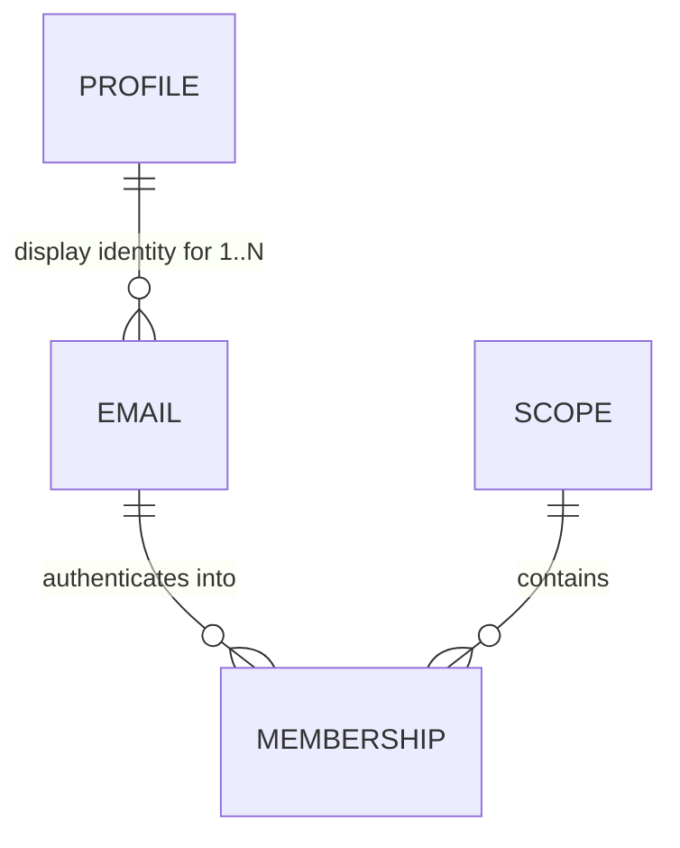

# The identity data model — behaviour and access-control decisions, before the schema

**Status (2026-08-04):** decisions settled, **schema drafted** (§ *The schema*), **phases written** (§ *Phases*). ⚠️ **`/review-task` Stage 1 closed after two passes; Stage 2 (conformance) has now RUN — 45 raised, 42 survived — and its findings are being resolved one by one.** D16 is resolved (`!claims.act` restored); the rest are outstanding, so this file is **not yet ready for `/build-task`**. Two items are deliberately open, both small and neither blocking: **(a)** D13's change-email *flow* carries no explicit deferral marker though `changeEmail` has zero production callers; **(b)** D14's derived trigger covers the unauthenticated claim paths, where no acting token exists — ADR-016 has a server-composed-actor answer that D14 does not yet cite. Each decision here is encoded *structurally* by whatever tables we write, which is why they were settled first; answering them afterwards would mean reverse-engineering them back out. That is how `Identities` came to carry five jobs.

🔀 **This file IS the task file — pinned 2026-08-02.** It is `/write-task` pass 1 (design intent, hand-reviewed), and it grows the **schema draft** and then **phases** in place. It is not a decisions record to be handed off to a separate implementation file, and it does **not** supersede [nebula-auth-identity-mint.md](nebula-auth-identity-mint.md) — that is a separate, already-phased task (the per-invitee admin mint) which survives, and of which only **Phase 2** is a prerequisite here (D11). Revisit only if the schema draft fans into several independently-shippable chunks, which would make this a living master with children instead.

⏳ **Rides the pre-alpha wipe's schema-surgery window** ([nebula-pre-alpha.md](nebula-pre-alpha.md) § *The wipe is a CLOSING WINDOW*, item 5).

## The invariant

> **Anchor access to the mailbox. Anchor identity to the person.**

Nearly every decision in this file is that one sentence applied to a different surface — D3 to authentication, D12/D13 to mutation, D7 to delegation. If a proposed rule about **access or identity** cannot be derived from it, that is the signal to look harder. (D14 and D17 are deliberately outside it — they govern what the registry *records* and *reclaims*, not who reaches what.)

## The bet, as a comparison

**GitHub's model: your *account* determines access.** Email is a contact detail, so organisation membership survives your leaving — removing you takes an explicit admin action, and if nobody performs it, access persists **indefinitely**. (Observed first-hand: Larry still held repo access at a former employer long after leaving, reported to them at the time and not promptly resolved.)

**Nebula keeps the half of that worth keeping and rejects the half that leaks:**

- ✅ **One portable Profile per person** — name, picture and attribution follow you across every scope, Star and Universe. This is the GitHub property worth copying.
- ❌ **Access is anchored to the *email*, never to the Profile.** Deactivating a company mailbox offboards the person **automatically** (with the accepted limit noted below), because the mailbox *is* the authentication channel — no admin action to forget, no revocation feature to remember to build.

That single split determines nearly every answer below: a Profile is display-only and spans a person's emails; an *email* is what holds memberships and therefore access.

⚠️ **Accepted limit — a bounded session window.** Losing the mailbox stops new logins immediately, but the refresh token is a fixed 30-day TTL with no rotation and no slide (`security.md`), so a live session survives up to that long. **Accepted:** it is strictly better than the account-anchored GitHub — bounded rather than indefinite — and in practice an org's own device wipe usually takes the cookie with it, since the refresh cookie is `HttpOnly` + path-scoped and lives only on the device. ⚠️ But that mitigation is the **org's** capability, not a Nebula guarantee, and a session on a personal device survives the full window. **The window is ACCEPTED, not forced** — the machinery to starve sessions already exists in the registry; what is deferred is the offboarding cascade that makes starving them *stick* → F5.

⚠️ **The same mechanism cuts the other way for an OWNER — understood, and deliberately not fixed here.** A user-developer who claims a Universe with an employer address they later lose is locked out of work they own, and D3, D13 and D16 each correctly refuse to help. The mitigation is a **warning at signup** — use an address you will keep; invite the work address afterwards — which is UI work several task files away, not schema. And recovery exists where the user-developer can establish the work is genuinely theirs: a super-admin **re-invites** them as admin of that Universe. That is a re-invite, not a re-point, so D13/D16 permit it.

## How to read this file

**Settled** = inherited, already committed elsewhere; listed so the schema honours it, not to reopen. **Decided here** = resolved in this file, with provenance. **Deferred** = keep the seam, build nothing. *(No "still open" section exists — every decision is settled; what remains are two build-time confirmations, named in § Next.)*

---

## Settled — inherited constraints the schema must honour

| | Proposition | Committed in |
|---|---|---|
| **S1** | **A profile is display-only. It is never an input to a permission decision outside the Profile DO itself** — no scope-derived authority confers rights over a profile, and holding a profile confers nothing anywhere else. | [ADR-012](../docs/adr/012-global-profile-visibility.md) |
| **S2** | **Scopes are the coarse-grained (`{u}.{g}.{s}`) access-control entity.** Authority flows strictly **downward and only downward** (`{u}` → `{g}` → `{s}`), and it is always the conjunction **(`admin` ∧ the caller's `authScopePattern` covers *this* node)** — a guard must compare the pattern against the node it is executing in, because **the bit travels to nodes it was not issued for**. At rest the bit sits beside its scope (`Identities.isAdmin` + `universeGalaxyStarId`); the `.*` pattern form exists **only in the JWT**, derived at mint time by `buildAuthScopePattern` — and `/mint-narrower-token` may mint a *narrower* pattern than the row's scope. **Fine-grained access control is the orgTree DAG in the data plane — out of scope for this file.** | [ADR-015](../docs/adr/015-scope-authority-flows-downward.md) |
| **S3** | **Email is never a primary key.** It is a mutable natural attribute. Keys are random opaque values, generatable without coordination — never a natural/mutable attribute, never a counter. | [ADR-010](../docs/adr/010-random-opaque-keys.md) |
| **S4** | **The registry singleton owns scope existence and email ownership.** Scope existence is **independent of membership** — an admin-gated `createGalaxy`/`createStar` writes a `Scopes` row and **no identity** (the caller's own wildcard — `{u}.*` for a Galaxy, `{u}.{g}.*` for a Star — already reaches it), so a real scope routinely has zero members. Only the *unauthenticated* claims mint an identity, because until one exists nobody holds a token that reaches the new scope. Four readers need that row, **none of them access**: slug uniqueness · **parent-exists** (`claimStar` rejects a Star whose parent has no row — so deriving existence from membership would break self-signup under a freshly-created Galaxy) · enumeration (`myScopeTree`, so an admin can find a Galaxy they hold no membership in — authority is the pattern, S2) · the deletion cascade. | [archive/nebula-auth-surrogate-sub.md](archive/nebula-auth-surrogate-sub.md) |
| **S5** | **Proving control of an email *authenticates*; memberships *authorize*.** Email is the channel, never the authorization key. *(The precise form of "email determines access" — the loose form invites putting email back on a durable path, which is what caused two prod wipes.)* | ADR-010, surrogate-sub |
| **S6** | **`sub` stays the membership key and the resource FK.** Resources/grants/snapshots key on `sub` only; `profileId` rides as a display copy. ⚠️ If `sub` became per-*person*, every snapshot re-keys — ADR-013 exists to prevent that. | [ADR-013](../docs/adr/013-identity-profileid-resolution.md) |
| **S7** | **An `Emails` table is not a return to the wipe-causing shape.** That defect was `Emails.email` (registry DO) ↔ `Subjects.email` (per-scope DO) — a *natural key doing cross-DO FK duty*, unenforceable, with no safe change flow. A table inside the **one** registry DO, surrogate PK, email as a `UNIQUE` *attribute*, FK on an opaque `profileId`, shares none of those properties. State this or it gets re-litigated. | surrogate-sub § The problem (1) |
| **S8** | **ADR-016 imposes no storage obligation on this schema — do NOT add an audit table.** Authority changes and state removals must record the acting token's full verified claims, but the ADR says explicitly that a consumer discharges that by **logging**, so the obligation lands on **call sites, never tables**. Listed only because a review re-derived it as a storage requirement once already. *How* it is discharged here → D14. | [ADR-016](../docs/adr/016-record-the-acting-principal.md) |

---

## Decided here

*Settled 2026-07-26 with Larry; rows added later carry their own date.*

| | Decision | Rejected / why |
|---|---|---|
| **D1** | **A membership is keyed on the email, not the person** — one per `(emailId, scope)`, which is today's shape made load-bearing rather than incidental. `sub` stays the membership key (S6). | Per-*person* membership — it severs access from the mailbox, which is the whole revocation mechanism (D3). ⚠️ The objection that one human with two addresses in one scope would "render as two people" was **wrong**: both resolve to the same `profileId`, so name and picture are identical. The only real consequence is that the **subscriber roster is keyed by `sub`** and should dedupe by `profileId` for presence — a one-line roster fix, not a model change. |
| **D2** | **`profileId` hangs off the EMAIL row, not the membership row.** | On the membership — that is today's shape, and it is what makes "one human, one profile" an *emergent* property of N rows agreeing, hence derived canonical-ness, a first-mover race, and the join hazard that consumed two review passes. See § What this buys. |
| **D3** | **A verified email cannot reach another email's memberships.** Authentication into a scope runs through the address that holds the membership there, full stop. **Losing access to a company mailbox therefore removes access to that scope**, even when the person still holds other emails on the same Profile. | "Any verified email on the Profile authenticates anywhere" — that is precisely GitHub's hole (§ The bet). It also widens each membership's authentication surface to every address the person ever proved. |
| **D4** | **Multiple emails per Profile are modelled NOW**, while the schema is open — even though the flow that *attaches* a second email stays deferred (F1). | Deferring the modelling too. Storage is nearly free and we are already opening the table; retrofitting later costs a migration. The hard part was always *proving control of both*, which is a flow problem, not a modelling one. |
| **D5** | **A Profile DO needs no existence question** — it is addressable for any `profileId`, and first access creates it (empty fields, seeded eTag). The real question is *allocation*, which is a registry-side concern → D6. | Framing it as "does a Profile exist before verification" — a category error about DO lifecycle. |
| **D6** | **An `Emails` row carries a real `profileId` from the moment it exists** — with **no provisional state and no promotion step** — on every path that creates one: proof of a mailbox (a clicked magic link), an authenticated admin's invite, or a scope claim. ⚠️ This decides *when*, not *which*: a flow that already knows the Profile **supplies** the id instead (F1's link, F2's merge), so a person's second address carries their existing `profileId` rather than a fresh one. Nothing is orphaned by that — D5 creates the Profile DO on first *access*, so a superseded id was never a DO. | Provisional-allocation-until-verified, with a promotion step. Under D2 allocation is **deterministic, not derived**, so there is no race to win: an attacker's `claim-star` for your address creates the `Emails` row, so your eventual `profileId` is one they caused to be minted — but they never learn its value (no endpoint returns it) and the dangling membership in their scope is one only **you** could ever authenticate into. Two states plus a promotion, to prevent something with no observable effect. ⚠️ **The residual has a STORAGE axis, and it was not asked when this was decided:** a claim can mint an `Emails` row unauthenticated, and an admin can mint them by inviting addresses. ⚠️ **NOT answered by a sweep** — D17 deliberately leaves `Identities`/`Emails` alone (reaping them breaks `#resumeClaimIfOwner` and dangles the `emailId` FK), so these rows are permanent. D12 shrank the surface by keeping bare magic-link requests off this list, and the rest is an **accepted residual** with the bound stated in D17; reclaiming it needs an abandonment TTL, deferred. |
| **D7** | **A minted token never exceeds the caller's own access** — a *consequence*, not a separate bound. Two rules produce it: **eligibility** — wearing another identity's `sub` requires administering that identity's scope (`hasAdminOverScope`), and the subject must be somebody else; and **faithfulness** — the token then mirrors *that person's* access (their `admin` bit, their reach). Its claims name **both** people per RFC 8693: the subject's `{sub, profileId}` top-level, the caller's in `act`. | Leaving either unbounded — today any admin can mint for any identity in **any universe**. ⚠️ The `profileId` hazard is real — holding one *is* write access to that profile (S1's owner check, zero reads) — but it is closed on the **READ** side, not by bending the claim: `#requireOwnerOrAdmin`'s owner branch additionally requires the token carry **no `act` chain** — a narrower token is never the owner ([profile.ts](../packages/nebula-auth/src/profile.ts) `claims.profileId === profileId && !claims.act`). Presence-only, never *who* the actor is. Rejected: stamping the **caller's** `profileId` top-level (it makes `sub` and `profileId` name different people, corrupting the subscriber roster), and omitting it (writes then carry no display stamp). Mechanism, rename and phases: **[nebula-mint-narrower-token.md](archive/nebula-mint-narrower-token.md)**. |
| **D8** | *Subsumed by **D12**.* It restated D3, and its per-table rule (`MagicLinks`/`InviteTokens` key on `emailId`) turned out to be both too narrow and, for `MagicLinks`, wrong — D12 states the real rule (nothing keys or FKs on an address) and the short-TTL carve-out ADR-010 already sanctions. Handle kept so the number is never reused (`workflow.md` § *Referring to things across files*). | — |
| **D9** | **A Profile survives its last membership — do NOT reap it on scope deletion.** | Deleting when a Profile has no memberships left. A Profile is display-only and **portable** (§ The invariant), so it is not scope-owned. Reaping also breaks historical attribution: a name is resolved through the Profile, and snapshots **will** carry a write-time-pinned `profileId` once schema-surgery item 6 lands ([ADR-013](../docs/adr/013-identity-profileid-resolution.md) as amended — today `changedBy` is `{ sub, act }` only), so a reaped Profile renders every past message from that person nameless — and a person invited back should be themselves again. The orphan concern is a **storage-cost** question, not a correctness one; its answer is a later GC pass over Profiles with zero memberships **and** zero attribution. The backlog's Profile-GC row agrees and defers to this; it holds only the residual storage-cost work. |
| **D10** | **(i) Within a scope, a member sees only the address that holds the membership *in that scope*.** `#affectedUsers` (`SELECT COUNT(DISTINCT email) … FROM Identities`) and `#emailForSub` — the two live sites that read the address off `Identities` — select through membership → `emailId` → address, never "all addresses for this Profile". | (ii) All addresses on the Profile — that extends ADR-008 past its own stated **intra-scope** boundary (the same over-reach ADR-012 had to be written separately to license), leaking addresses across scopes the viewer has no relationship to. (iii) Display name only — breaks the deletion warning, which must name *who* loses access decisively; a name alone is ambiguous when two people share one. ✅ **Accepted consequence, and it is not a security risk:** an admin of two scopes could correlate two of a person's addresses via a shared `profileId`. Nothing is authorized differently (S1; ADR-012 already opens public fields to any holder), it is **unreachable until F1 exists** (unlinked addresses are separate Profiles with unrelated ids), and once F1 does exist the person **initiated the link themselves** by proving control of both — consented, not disclosed. In the ordinary case the admin *supplied* both addresses via invites anyway. ⚠️ The mitigation belongs at the **link moment** → F1. |
| **D11** | **No identity-mint phase gates this schema — the security dependency was DISCHARGED IN CODE on 2026-08-04.** The concern was that D2 arms the Profile DO's scoped-admin branch: once a `profileId` is a property of the address and spans every scope, anyone could claim a Universe, invite an address they guessed, and become "an admin of a scope that stranger's profile touches". That is closed at the **registry**, not by build ordering — `getScopesForProfile` now counts only **accepted** memberships, pinned by a capable-of-failing manufacture test in `identity-authority.test.ts`. The branch itself is **kept** ([ADR-012](../docs/adr/012-global-profile-visibility.md) — admins curating a member's private fields is a wanted capability), so identity-mint §4 is now Profile-DO conformance work with no ordering claim on this file. ⚠️ **What this file still owes is a RE-POINT, not a prerequisite:** the predicate reads `Identities.emailVerified`, which Phase 1 splits — it becomes `Memberships.acceptedAt IS NOT NULL`, on D18's *Consumers to re-point* list. Dropping it during the re-key would silently reopen the hole, which is why it is stated as a consumer rather than left to be noticed. 🔸 **identity-mint Phase 1 remains a soft preference, never a constraint:** it rewrites the same `Identities` write path this schema re-keys (`#mintIdentity`'s caller, plus the first production `setIdentityAdmin`), so landing it first avoids redoing it against a new table shape — worth taking if convenient, never worth waiting on. | **Ordering this file behind an identity-mint phase.** It was the decision until 2026-08-04, and it was the wrong *shape*: the risk it managed was a real escalation, but build ordering is a promise a builder can skim past, whereas a predicate with a test that reds is not. ⚠️ The original rejection of relocating §4 also reasoned from **exposure risk**, which the no-release-until-pre-alpha constraint removes — that argument was incomplete, because the risk was never exposure-to-users but the order in which two files land. Fixing it in code makes both arguments moot. |
| **D12** | **Every `Emails` row has an opaque surrogate PK (`emailId`), the address is a mutable attribute, and NOTHING KEYS OR FKs ON AN ADDRESS.** Memberships and `InviteTokens` reference `emailId`, as does anything else that must still resolve after a change. Emails genuinely change — marriage/legal-name change, a vendor move — so an address can never be a PK or an FK (S3, ADR-010). Consequence: changing an email is a **one-row, one-column `UPDATE`** with no cascade anywhere. ⚠️ **A short-TTL cache is NOT a key, and is explicitly sanctioned:** ADR-010's replication rule permits a mutable value in *"a short-lived token whose expiry bounds the staleness"*, forbidding only a TTL *"large in comparison to the expected frequency of change"*. `MagicLinks` therefore stores the **bare address** — 30 minutes, against an address that changes maybe once in years — and its `Emails` row is created **when the link is clicked**, on proof of the mailbox. `InviteTokens` uses `emailId` instead, not as an exception but because `issueInvites` creates the membership, so the row already exists. **The split is principled: a magic link creates no membership, an invite does.** ✅ **It also buys a property worth naming — an `Emails` row can no longer be created by an unauthenticated request.** Every row is now a byproduct of proof-of-mailbox, an authenticated admin action, or a scope claim, which shrinks how fast the table grows, since D17 does not reclaim these rows. ⚠️ A link issued to an address that then changes goes **dead**, which is correct — D13/D16 starve that person's sessions on the same change, so a still-working link would be the inconsistent outcome. | Email as the PK/FK — every change becomes a re-key across memberships, which is the shape that caused two prod wipes (S7). **Keying `MagicLinks` on `emailId` as well** — stricter than ADR-010 requires, and it would force an *unauthenticated* request to write an `Emails` row for any address a stranger types into the form. |
| **D13** | **Changing an email requires FRESH proof of the OLD address, plus proof of the new.** The request must itself be authenticated (a live session) — but ⚠️ **"fresh" is load-bearing and a live session is NOT proof**: sessions outlive mailbox control by up to the 30-day refresh TTL, so authorising off the current session would hand a departing employee that whole window as an escape hatch. The proof must be a magic link delivered to the old address **at change time**. That single rule separates the cases with no domain heuristics: marriage/legal-name changes and vendor moves pass, because the person still holds the old address while moving; a departing employee whose work mailbox is dead **cannot** re-point the row. And the attempt is **self-defeating** — trying it costs them their session rather than buying permanent access (mechanism and timing: **D16**). | Authorising off the **live session** — sessions outlive mailbox control by up to the 30-day refresh TTL, so that is a 30-day escape hatch. Domain heuristics ("did it leave the company's domain?") — they break the moment a company rebrands. An **unauthenticated** change request — that is a denial-of-service: a stranger typing your address would kill your sessions. ⚠️ Revocation is **starving**, not revoking: access tokens are stateless JWTs with no revocation list, so deleting the refresh records (D15's revoke mechanism) leaves outstanding access tokens alive for up to `ACCESS_TOKEN_TTL` — the window collapses from ~30 days to **≤15 minutes**, never to zero. ⚠️ **One shared OPERATION, not a count:** *enumerate a `sub`'s live refresh records* — used by `setIdentityAdmin`'s convergence (which **re-PUTs** each record with its ORIGINAL expiry, not a revoke — so the enumeration must carry `expiresAt`), by this row's proof-time revoke, and by the F5 offboarding cascade. D15 owns it. ⚠️ **Both halves owe an ADR-016 log record (S8)** — starving removes state, and the re-point changes which mailbox holds the authority. A log line, not a row. Conveniently guaranteed: the authenticated-request requirement that stops this being a denial-of-service is what ensures a **verified token always exists to record**. |
| **D14** | **In the registry the record is a log line and only a log line** — a `@lumenize/debug` call at the point of action. **Which actions is DERIVED, not enumerated:** every registry method that **changes who can do what, removes state, or establishes a session**. The first two are ADR-016's own trigger; the third is this decision's addition — a login changes no authority, but it is the first thing a post-incident reader asks about. ⚠️ Stated as a derivation deliberately: a per-case list is the shape that ships a missing case (calibration §2), and it would need re-checking every time a registry method is added. ⚠️ The one deliberate exclusion is a **token refresh** — it changes no authority. (It is *nearly* registry-free rather than entirely: a KV miss falls back to `getRefreshRecord`, which reconstructs and self-heals. D15 removes that fallback; either way the path records nothing, correctly.) ⚠️ **The gap today is the ACTOR, not the line:** `setIdentityAdmin` logs its *target* only (`{ sub, isAdmin }`) and takes no claims parameter. Conformance is therefore a claims parameter **plus** routing through ADR-016's shared projection — ⚠️ **`executeScopeDeletion` is that migration's FIRST CALLER, not its template.** ADR-016 names it not-yet-conformant precisely because it hand-assembles its fields inline, so copying it propagates the divergence the ADR calls unrecoverable. Where this work lands → § *Next — write the schema*. | **An audit table in the registry.** It is the system's only singleton — a hard, non-sharding 10 GB / ~1000 rps ceiling ([ADR-018](../docs/adr/018-singleton-is-the-scarce-resource.md)) — so a table there routes every destructive action in the system through it; a log line costs it nothing and leaves the durable copy to the observability path ([on-hold/nebula-observability-tail-worker-r2-ae.md](on-hold/nebula-observability-tail-worker-r2-ae.md)). ⚠️ ADR-016 permits a durable table as a *mechanism*, so **nothing but this decision forecloses one here.** Also rejected: logging only ADR-016's floor — the floor is a minimum, and the cost of a line above it is a line. **Decided 2026-08-02.** |
| **D15** | **The Registry knows every live refresh token, so a revoke is a local read plus point-deletes — no enumeration over KV.** Revoke = `SELECT tokenHash FROM RefreshTokenIndex WHERE sub = ?` (strongly consistent, single-writer, indexed) → delete each KV record **by exact key** → un-index **only the hashes whose KV delete resolved**. ⚠️ **NOT "complete by construction" — revocation spans two stores with no transaction, so it needs a stated invariant: never un-index a token whose KV record you did not just delete.** There are two possible orphans and they are **not** equally bad: **(i) index row, no KV record** — the next refresh takes a KV miss, `getRefreshRecord` reconstructs the record from the index row and re-puts it, so the token *resurrects*; but it stays **enumerable**, so re-running the revoke kills it — **recoverable**. **(ii) KV record, no index row** — the token keeps working off the KV hit, is invisible to every future revoke, and lives to its 30-day TTL — **unrecoverable**. ⚠️ **Both revoke methods today document the opposite premise, and it is false:** *"an orphaned index row (harmless — the token is already dead)"*. It is not dead; `worker-token.ts` falls back to `getRefreshRecord` on a KV miss, which is exactly the reconstruction in (i) — and the same file's fallback comment relies on the contrary (*"a genuinely-invalid token isn't there → still 401"*), which holds only once the index row is gone. **The conclusion (KV first, index second) survives; the reason does not** — re-derive it as recoverable-vs-unrecoverable and fix both JSDoc comments, or the next reader "simplifies" the ordering on a premise that was never true. ⚠️ **What breaks the invariant today is not the ordering, it is the BLANKET delete.** `#invalidateRefreshTokensForSub` ends with `DELETE FROM RefreshTokenIndex WHERE sub = ?`, removing index rows for tokens the operation never KV-deleted: a login landing in the input gate that the KV deletes open writes its index row **synchronously** (the record path is index-first by design), and the blanket sweep un-indexes it while its KV record survives — converting the recoverable orphan into the unrecoverable one. D16 and F5 run that loop across N subs. 🔧 **Shape that makes it structural rather than guarded:** one `#revokeByHashes(hashes)` — `Promise.allSettled` the KV point-deletes, then `DELETE … WHERE tokenHash IN (<the fulfilled subset>)`; `#invalidateRefreshTokensForSub(sub)` becomes the `SELECT` plus a call to it, and `revokeRefreshToken` collapses into the same helper with a one-element list. The method **cannot** delete a row it was not handed, so the invariant survives partial failure (a failed delete leaves that token indexed = recoverable) and is checkable without racing two RPCs. `allSettled` is chosen for **failure semantics**, not speed — plain `Promise.all` discards *which* key failed; overlapping the round-trips is a second-order win on DO **elapsed-time** billing and changes neither the operation count nor its per-operation cost. Guard the empty list (`IN ()` is invalid SQL) and build placeholders the way `#affectedUsers` already does. ⚠️ **Irreducible residual, stated rather than hidden:** a KV `put` already in flight when the `SELECT` runs can still land after the delete — the write is dispatched to an external store and nothing DO-side can unsend it. The window is one KV round-trip; F5 covers the adversarial case by ordering the **membership** deletion before the revoke, since starving alone is defeated by re-login. ⚠️ **The fan-out is serial today** — `executeScopeDeletion` does `for (const sub of subs) await …`, so N subs × M tokens of elapsed time is billed on the singleton; flatten it with the same shape, staying under Workers' **1,000 external-service operations per invocation**. ⚠️ **`RefreshTokenIndex` is KEPT, not retired** — its defect was never that it existed, but that it was **deliberately never swept**, so it accumulated every token ever minted, forever. D17's sweep is the fix; deleting the table was not. ⭐ **Why the delete lands even on a token too new to have propagated:** KV is a **central store with edge caches**. Both the mint's `put` and the revoke's `delete` go to that store and are ordered there, later-wins; the ~60s figure is a **read-side** staleness bound (edges serving cached values, including cached absence). So revocation depends on no read-side property at all — there is no list, and the point-read on the refresh path is unaffected. ⚠️ **Storage, stated for [ADR-018](../docs/adr/018-singleton-is-the-scarce-resource.md):** the index holds live tokens only, so it is bounded by (login rate × the fixed 30-day `REFRESH_TOKEN_TTL`) — roughly **100 MB at 1000 logins/hour**, ~1% of the 10 GB ceiling, degrading linearly and predictably. That is *not* the "bounded by something that cannot itself grow" case, since login rate grows with the product; it qualifies under the other half — justify what lands there, and state the bound. ✅ **`getRefreshRecord` is unchanged**: the index survives, so the KV-miss self-heal that covers the login→first-refresh cross-colo gap keeps working. That gap is not rare by construction — login is a bodiless 302 carrying no access token, so the first refresh lands inside the propagation window. ⚠️ **That self-heal is exactly why an orphaned index row is a LIVE token** — this ✅ and orphan (i) above are the same mechanism read from opposite ends, which is why keeping the index obliges the invariant rather than merely permitting it. | **Retiring the index and enumerating KV by a `sub` prefix** — it would need the KV key re-shaped to `refresh:{sub}:{tokenHash}`, but the Worker builds that key from the cookie alone and the raw token is 32 random bytes carrying no `sub`, so the hottest authenticated path could not construct its own key without also changing the cookie format. And it bought nothing: the design still kept a Registry table beside it, so it paid twice. **A short-retention table covering only the propagation window** — a second source of truth whose totality depended on a union with that same KV enumeration. **Bulk KV delete** — it exists (up to 10,000 keys) but lives **only on the REST API and `wrangler`, never the binding**: the generated `KVNamespace` type has `get(key: Array<Key>, …)` and no array overload on `delete`, and the docs state bulk is unsupported from a binding. Reaching it from the DO would add an API-token secret plus an outbound dependency on `api.cloudflare.com` to the revocation path, and **miniflare does not implement it**, so the path would lose local testability under pool-workers *and* `/live`. It also **does not address the defect** — the un-indexing is SQL-side, and an outbound `fetch` opens the input gate exactly as `kv.delete` does. **Decided 2026-08-03; revoke mechanism corrected 2026-08-04.** |
| **D16** | **A change-email request starves only the session it arrived on; the `emailId`-wide revoke fires when the old-address proof is consumed.** **On request:** revoke the single refresh record the request arrived with, identified by **token hash**. **On the proof being consumed:** revoke every `sub` anchored to that `emailId` — triggered by possession of the mailbox, which no token can fake. ⚠️ **This PINS the request endpoint to carry the refresh cookie.** `sub` granularity is *not* safe: under D1 a `sub` is per-(email, scope) and an impersonated token carries the **victim's** `sub`, so revoking by `sub` would let one session-kill reach every scope that address touches. ⚠️ **`!claims.act` at the request IS the control — presence-only, never *who* the actor is.** ✅ What the split makes impossible is the **victim-wide** revoke being manufactured; that half stands. What it does **not** make impossible — and an earlier draft of this row wrongly claimed it did, on the premise that an impersonated token "holds no refresh record of its own, so it starves nothing" — is a request under a derived session spending the **originator's** credential. `security.md` § *A DERIVED session must never revoke on the ORIGINATING session's credential path* says exactly the opposite, and *for that same reason*: having no cookie of its own is what makes a credential-path call spend the admin's. That section also pins the `authScope` path-scoping as a **coincidence, never the control** — an admin who logged in *at* the scope they act into gets an exact `Path=/auth/{authScope}` match, which is the ordinary support shape, not an edge case. So without the predicate a change-email POST from an impersonated session carries the admin's cookie and the token-hash revoke kills the admin's own 30-day session. Same class as the `#mintedFrom` branch already carried by `NebulaClient.logout()`. The predicate also closes the **request** half of the same manufacture (an `act`-carrying token cannot start a re-point at all), and it costs nothing legitimate — see the ⚠️ on admin-changes-a-member's-email in the next column. ⚠️ **Keep it loudly commented:** [ADR-016](../docs/adr/016-record-the-acting-principal.md) pins that `act` is **by design the only field** distinguishing an impersonated token from a real one, so anyone who "simplifies" this away sees no other check weaken. ⚠️ **Owed when this flow is BUILT — no phase here builds it:** `security.md` § *Delegation* states its READ-SIDE `act`-presence bucket as **"EXACTLY ONE, and it is licensed"**; this is the second, so the count is falsified the moment the code lands. Restate that bucket **structurally** rather than bumping it to two — the license is that the object is **global** (it sits outside the scope tree, so scope authority over it can be *manufactured*), which is why a Profile qualified ([ADR-012](../docs/adr/012-global-profile-visibility.md)) and why a D2 `Emails` row does too. The same section already states its other two buckets that way. ✅ **And D13's self-defeat property survives, better targeted:** a departing employee loses the session they are sitting in, while a legitimate gmail→fastmail move costs only the current device, other devices surviving until the address actually moves. | **Firing the `emailId`-wide revoke at REQUEST time** — it put a destructive, cross-scope action behind a gate anyone can manufacture: claim a Universe unauthenticated → invite any address at `emailVerified=0` → you now administer a scope that address touches → mint a token whose top-level `sub` **is** the victim (D7). **Gating that broad request-time revoke on ownership so it can stay at request time** — the split already removes the broad revoke from request time, so the gate has nothing left to protect there. ⚠️ **The `!claims.act` half of that proposal is NOT rejected — it is ADOPTED, in the decision column.** It was talked down once on "the split makes it impossible" grounds, which was false (see the ⚠️ opposite); the ownership half is a separate live question — *which* identity resolves the target `emailId`, the refresh record's `sub` or the access token's `sub`, since under impersonation they name different people. Answer it wherever this flow is built. **Revoking only on proof** — closes the manufacture but loses self-defeat entirely: a departing employee with a dead mailbox would pay nothing for trying. ⚠️ **No legitimate admin-changes-a-member's-email case exists** — access is anchored to the mailbox, so an admin re-pointing someone's identity IS the escalation D13 blocks. *(Owner lockout is recovered by a super-admin **re-invite**, a different operation — see § The bet.)* **Decided 2026-08-03; `!claims.act` restored 2026-08-04.** |
| **D17** | **Exactly three token tables are swept, and nothing else is.** One self-re-arming hourly alarm (`SWEEP_INTERVAL`) runs ONE sweep task — the constructor calls the same method — performing **zero KV operations**: expired `MagicLinks`, expired `InviteTokens`, and expired `RefreshTokenIndex` rows (the hygiene D15 keeps that table for). All three are already **inert on lookup** once expired, so the sweep is storage hygiene and never correctness. ⛔ **`Scopes`, `Identities` and `Emails` are deliberately NOT swept**, and a predicate keyed on "no live activation path" — the obvious one — is wrong three times over: (1) `createGalaxy`/`createStar` write a `Scopes` row and **nothing else, ever** (registry `:501`/`:528`), so an admin-created scope matches such a predicate permanently and a user-developer's Galaxy would vanish within the hour with its slug freed — exactly the state **S4** calls normal; (2) it deletes the unverified `Identities` row `#resumeClaimIfOwner` reads, which is **designed to work after the link expires** ("link lost, failed, or expired"), so a legitimate claimer would be locked out of their own slug with no path back; (3) sweeping `Emails` would dangle the `emailId` FK from every surviving membership. ⚠️ **Reclaiming an abandoned scope needs a time-based abandonment TTL, not an absence test** — unverified for N days, N ≫ `MAGIC_LINK_TTL`, reaping scope + identity + email together so resume keeps working. That is a product policy with its own risk, and it is **deferred**, not solved here. ⚠️ **The period follows storage accumulation, never a correctness deadline** — nothing swept here is time-critical, so hourly is 12× fewer singleton requests than the 5-minute figure this started at, which was inherited from a re-sweep that no longer exists. **[ADR-018](../docs/adr/018-singleton-is-the-scarce-resource.md) answer, stated rather than assumed:** every registry table is either swept by this task **or** carries a stated bound and an accepted residual. The three unswept ones: `Scopes` grows one small row per scope, gated only by Turnstile on the open claim endpoints — **unbounded in principle**, accepted while the population is one user-developer; `Identities`/`Emails` grow with real memberships plus **one permanent row per invitation ever sent**. ⚠️ **Accepted residual that follows:** an expired `InviteTokens` row leaves an `Identities` row a plain magic link still activates (`consumeMagicLink` gates on the row existing, not on `emailVerified`), so **an invitation never actually lapses and there is no rescind path**. The real fix is a rescind/remove-member action (F5's machinery), not a sweep. | **A sweep predicate keyed on the absence of a live activation path** — see the three failures above; it was the original proposal and it would have destroyed user data. **Multiplexing the alarm** (a one-shot for revocation against a hygiene timer) — a DO has exactly **one** alarm slot, so it needs a `min(next)` handler; the `svc.alarms` service is mesh-only and the Registry is a raw `DurableObject`. One recurring tick deletes the mechanism. **The wake sweep as the only mechanism** — the constructor re-runs only after eviction, so its frequency is *inversely* correlated with load while row accumulation is *directly* correlated with it; at the traffic where hygiene matters it stops firing. **Decided 2026-08-03; split out of D15, then narrowed the same day.** |
| **D18** | **Verification splits in two: `Emails.emailVerified` is proof of the MAILBOX (global to the address); `Memberships.acceptedAt` is whether THIS membership was ever activated.** Today one column does both jobs only because `Identities` is keyed `(email, scope)` — splitting the tables forces the question, and the two answers differ. Proving control of a mailbox is a property of the **address**, so it should not have to be re-proved scope by scope; whether a membership was ever taken up is per-**membership**, and that is what `#resumeClaimIfOwner` actually asks ("is this specific claim unfinished?") and what the never-lapsing invitation (D17's accepted residual) has no marker for today. | **One column on `Memberships`** (today's semantics, relocated) — it makes "has this person proved this mailbox?" a per-scope question, which is already odd when one address holds memberships in several scopes (D1) and worse under D4's multiple-addresses-per-Profile. **Both on `Emails`** — one address has N memberships, so acceptance cannot live there. ⚠️ **Consumers to re-point:** `getAndVerifyIdentity` flips **both** (the address is proved *and* this membership is taken up); `#resumeClaimIfOwner`'s `emailVerified = 0` becomes `acceptedAt IS NULL`; `#mintIdentity` leaves `acceptedAt` NULL for invites and claims. 🔒 **And `getScopesForProfile`'s `AND emailVerified = 1` becomes `AND acceptedAt IS NOT NULL` — this one is load-bearing AUTHZ, not a mechanical rename.** It is what stops scope authority over a *global* profile being manufactured by inviting an address you guessed ([ADR-012](../docs/adr/012-global-profile-visibility.md)); dropping it during the re-key reopens the hole silently, and it lives in a query rather than a gate, which is exactly where nobody looks for a security control. `identity-authority.test.ts` reds if it goes — keep that test pointed at the new column rather than deleting it with the old one. ✅ A side benefit worth naming: an unaccepted invitation finally has a **structural marker**, which is what any future rescind action needs. **Decided 2026-08-03 — surfaced by the schema draft.** |

---

## Next — what remains

✅ **No decision is open.** Two **build-time confirmations** remain — the D13 two-proof feasibility check, and the applied-id marker behaviour — and neither blocks drafting, so the schema can be written: § *What D1 + D2 buy* holds the entity shape, and the column lists now follow from the decisions rather than preceding them.

✅ **The schema is drafted** — see § *The schema*. Four things remain before this can be built; each describes something the draft now makes answerable. (The last is not growth work: it records two defects the conformance pass will fix.)
- **One baseline, not a migration.** At the wipe, `REGISTRY_MIGRATIONS` is **replaced** by a fresh baseline describing the final table set — the list restarts at id 1 and is append-only again afterwards, exactly as the surrogate-sub reset did. That removes the whole question of which ids are edited, which appended, and in what order the FK targets appear. ⚠️ **The baseline's CONTENTS follow from the schema draft and will change; the decision to collapse will not** — do not treat an id inventory written before the draft as anything but a guess. Licensed because **nothing in the current list has ever been applied to a live DB** (prod predates all of it) and `schemas.ts`'s reset exception is explicitly still open — it closes when the wipe deploys. ⚠️ Constraint unchanged: **no deploy between the rewrite and the wipe.** Locally, `rm -rf .wrangler` — a DO that already applied an id will not re-run it, which the existing exception already warns about. Also updates `registry-migrations.test.ts`'s last-id assertion. **No DO-class (`exports`) change** — no class is added or renamed, and "migration" means both things in this repo (`durable-objects.md`). ✅ **Subsumes the consent create-then-drop churn** that was queued separately in the pre-alpha batch: a collapse deletes the column and its drop-migration together, and does the same for any similar pair that accretes before the wipe.
- **Standing-guidance sweep — a success criterion of the schema phase, not a follow-up.** Landing the schema makes several always-loaded or review-loaded statements describe a shape that no longer exists. Known today: `.claude/rules/workflow.md`'s **ADR-013 one-liner** (says `profileId` is "a plain column on the `Identities` row", and that "owner authz short-circuits off the JWT `profileId` claim" — now D7's content) · ⚠️ **ADR-013's body — a REWRITE, not a wording sync.** D2 falsifies its Decision sentence (`profileId` is "a plain column on the `Identities` row") and the cost argument in its Alternatives table, so this is an ADR change and § Relationships already says such a change must be "stated as such". Write it **forward-facing** (rewrite the body; mechanism moves, commitment intact — `sub` is the only key, `profileId` is never a key/FK/authz input), **never as a dated amendment** — `docs/adr/README.md` forbids that · **`schemas.ts`'s header + per-table comments** · ✅ **ADR-012 and its `workflow.md` one-liner are ALREADY CONFORMED** (rewritten 2026-08-04 when the scoped-admin branch was kept and gated on acceptance) — both are deliberately written **column-agnostic** ("an accepted membership", never `emailVerified`), so the Phase 1 split does not falsify them; do not re-edit them for the rename, and do not let a sweep re-introduce a column name into either · ⚠️ **ADR-016 itself** — D14 widens its trigger set with a third, *establishes a session*, derived and stated generally, so it binds every future consumer. But it lives only in a task file that gets archived on completion, while ADR-016 and its always-loaded one-liner carry the two original triggers. Per CLAUDE.md's routing table a commitment belongs in the ADR: amend it for the session trigger **only** — ADR-016 already states the discharge-by-logging half · ✅ **`security.md`'s refresh-path claim is ALREADY FIXED — do not go looking for it.** This bullet used to quote *"a pure Workers-KV read (the singleton registry is **never** on the refresh path …) with **zero writes**"* as text needing rewriting. That sentence no longer exists: `security.md` § *Refresh tokens* now reads *"**zero writes** on the hit path. ⚠️ **It is not yet registry-free** … a KV **miss** falls back to `getRefreshRecord`"* — and cites this very file as where the error was made. Nothing here falsifies the corrected text (D15 keeps `getRefreshRecord`), so it is off the sweep list entirely · ⚠️ None of these is stale **yet** — they describe current code correctly, which is why they must be changed *with* the schema and not before. Criterion phrased over structure: **no standing-guidance statement describes the pre-split shape.** The always-loaded one-liner is the highest-traffic of them and the one most likely to be missed.
- **Phases + capable-of-failing criteria**, including what must red: a `changeEmail` that updates one row of N, a first-mover capture, and an unbounded impersonation subject (D7 — ✅ **implemented and archived 2026-07-29**, so this file owes only the *rule*, not the code).
- **ADR-016 conformance rides these phases — as a VISIBLE success criterion of each, never a buried step.** Not extra scope on a schema task: these phases re-key `Identities`, add `Emails` and sweep `RefreshTokenIndex`, so they **already open nearly every method that owes a record**. Every method a phase rewrites owes its record while it is open; anywhere else, the same methods get opened twice. **Criterion, derived per phase from its own diff:** *every registry method a phase's diff touches that establishes a session, changes authority, or removes state (D14's trigger) emits its record through the shared projection — stripping the claims argument from any one of them must red.* ⚠️ **Deliberately NOT a list of method names.** One was drafted here and shipped three omissions immediately — `consumeInvite`, `revokeRefreshToken`, `#invalidateRefreshTokensForSub` — which is the failure D14 names one screen earlier, and it is worse here because this criterion gets transcribed into per-phase criteria and ADR-016 calls an under-record *unrecoverable*. Completing the list is the tempting fix and the wrong one; derive it from the diff, which cannot go stale. ⚠️ Name it in each phase's criteria — a reader skimming phase titles will not expect audit work in a schema task, which is exactly how it gets skipped. 🔸 **The projection helper is a MUTUAL obligation, stated as a criterion on both sides** — one exported helper in `nebula-auth`, coupled to nothing. **Whichever phase runs first builds it; the other adopts it.** `identity-mint` Phase 1 carries the same sentence, so neither file can assume the other did it. ⚠️ It was previously written here as an aside — *"lands with whoever needs it first"* — which made it nobody's criterion and left this bullet resting on an artifact no phase promised. ⚠️ Registry conformance had **no owner at all** before this line: the only other ADR-016 home in an active file is pre-alpha item 6, which is Resources-only.
- **Transcription strips the handles — a criterion, not a cleanup step.** The DDL block in § *The schema* cites `S#`/`D#` deliberately: handles are a task file's native currency, they survive a decision moving (D15 moved twice in one day), and a builder reads them *here*. But this file archives, so a bare `D12` in `schemas.ts` is `workflow.md`'s cross-file rule violated from code — which outlives the file by design. **Whichever phase writes `schemas.ts` converts as it transcribes**: every comment ends up citing an **ADR**, a **rule file**, or nothing. Most reduce cheaply — `S3`/`D12` are ADR-010, `S6` is ADR-013, and the rest are one clause of prose, which is already how today's `schemas.ts` writes them. **Success:** `grep -nE '\b[SD](1[0-9]|[1-9])\b'` over the phase's changed files returns only intended hits — eyeball them, since `S3` also spells a storage product (the grep-then-eyeball shape `workflow.md` already prescribes for renames). ⚠️ **Ordering:** ADR-013's body rewrite (in the sweep bullet above) must land *before or with* this — it is what makes `sub → emailId → profileId` an ADR-citable commitment, and converting first leaves the `Emails.profileId` comment with no durable target. ⚠️ The "do NOT change this" comments matter most: `MagicLinks` holding a bare address **will** be "fixed" to `emailId` by someone, and the warning has to survive without a handle to lean on.
- **Two ADR-016 gaps are LIVE DEFECTS in shipped code, not new work.** `revokeRefreshToken` logs `warn('Logout', { method: 'logout' })` — **no `sub`, no actor, nothing identifying whose session was killed**; `#invalidateRefreshTokensForSub` (`executeScopeDeletion`'s workhorse, which removes every refresh record for a person) **logs nothing at all**. Both remove state, so both are ADR-016 triggers today, and neither is waiting on this schema. They are listed here because the conformance pass is what will fix them — but a reader should not mistake them for consequences of this work.

## What D1 + D2 buy — the join mechanism dissolves

With `profileId` on the email row, **"same email, any scope → same `profileId`" is a structural fact, not a mechanism.** One address has one row holding one `profileId`, however many scopes it is in. There is nothing to join:

- no `SELECT … ORDER BY createdAt LIMIT 1` to derive canonical-ness
- no `AND emailVerified = 1` predicate to stop a first-mover capture
- no deterministic-tiebreak problem (`createdAt` comes from a clock pinned within an invocation — [[cf-clock-traps]])
- no row able to compete with **itself** for canonical status, which is the defect the second review panel caught in the join-at-verification design

And `email` lives in exactly one row keyed by an opaque id (D12), so `changeEmail` becomes a single-row, single-column update that is *correct* rather than one-of-N ([backlog.md](backlog.md) § Nebula Auth). `sub` stays per `(email, scope)`, so nothing re-keys (S6).



Shape only — the DDL is in § *The schema*; these are the entities and why each exists:

- **Profile** — display identity. PK is the `profileId` (random opaque, ADR-010). The Profile DO is addressed by it (D5).
- **Email** — **opaque surrogate PK (`emailId`)**, `email UNIQUE` as a *mutable attribute*, FK → Profile, verification state. **Email lives here once** (S3, S7, D12), and changing it is a one-row single-column `UPDATE` (D12) gated by D13.
- **Membership** — the renamed `Identities`: `sub` PK (S6, unchanged), **FK → `emailId`** (never the address — D12), FK → Scope, `isAdmin`, `createdAt`. This is what `Identities` already *is* — a join table — which is why the name stopped describing it.
- **RefreshTokenIndex** — unchanged in shape (`tokenHash` → `sub`, `expiresAt`), **kept** and now **swept** (D17). It is what lets a revoke enumerate one person's live tokens (D15); KV cannot answer that, being keyed by `tokenHash`.
- **Scope** — unchanged, deliberately. Hierarchy-in-the-string works, the `LIKE 'prefix.%'` descendant scan is fine at this scale, and ADR-006 already defers FK integrity. **No `parentId`, no `tier`, no admin-identity stamp on the scope row** — the last was explicitly rejected 2026-07-21 (at signup there is no authenticated principal, so an eager stamp needs a backdoor).

⚠️ **`MagicLinks` and `InviteTokens` stop being byte-identical here** — D12 gives one a bare address and the other an `emailId`, deliberately. So the standing "fold them into one table" idea no longer follows from their shape, and [on-hold/nebula-collaborator-tiers.md](on-hold/nebula-collaborator-tiers.md)'s wish for **one** `Contexts(tokenHash → payload)` to key against now has to be argued on its own merits — the two rows differ in what they carry, not just in their name. Revisit it there, not here. **Add `CHECK (col IN (0,1))` to every boolean-ish column at creation** — SQLite has no `ALTER TABLE ADD CONSTRAINT`, so retrofitting one later needs the full 12-step table rebuild; it is cheap **only** in a greenfield window like this. The collapsed baseline creates every table fresh, so this is a property of writing it correctly rather than a separate step. *(Was queued separately in the pre-alpha batch; removed there, owned here.)*

## The schema

Six registry tables. Conventions per `durable-objects.md` — PascalCase tables, camelCase columns, `WITHOUT ROWID` on every TEXT-PK table, ISO-8601 Zulu `TEXT` timestamps (ADR-011), `INTEGER` + a `CHECK` for every boolean.

```sql
-- Scope existence, independent of membership (S4). Unchanged.
CREATE TABLE IF NOT EXISTS Scopes (
  universeGalaxyStarId TEXT PRIMARY KEY
) WITHOUT ROWID;

-- The address lives here ONCE (S3, S7, D12), behind an opaque surrogate PK.
-- `profileId` hangs off this row (D2) and is real from creation (D6).
CREATE TABLE IF NOT EXISTS Emails (
  emailId       TEXT PRIMARY KEY,
  email         TEXT NOT NULL UNIQUE,
  profileId     TEXT NOT NULL,
  emailVerified INTEGER NOT NULL DEFAULT 0 CHECK (emailVerified IN (0, 1)),
  createdAt     TEXT NOT NULL
) WITHOUT ROWID;
-- Reverse lookup for the Profile DO's scoped-admin authz check (ADR-012). Indexed, not scanned:
-- the check is permanently on an authz path, and `Emails` is never swept (D17).
CREATE INDEX IF NOT EXISTS idx_Emails_profileId ON Emails(profileId);

-- The renamed `Identities`: a join table, which is why the old name stopped describing it.
-- One per (emailId, scope) — D1. `sub` stays the key and the resource FK — S6.
CREATE TABLE IF NOT EXISTS Memberships (
  sub                  TEXT PRIMARY KEY,
  emailId              TEXT NOT NULL,
  universeGalaxyStarId TEXT NOT NULL,
  isAdmin              INTEGER NOT NULL DEFAULT 0 CHECK (isAdmin IN (0, 1)),
  acceptedAt           TEXT,          -- NULL until taken up (D18)
  createdAt            TEXT NOT NULL, -- the age D17's deferred abandonment TTL needs
  UNIQUE (emailId, universeGalaxyStarId)
) WITHOUT ROWID;

-- Live-token index: what lets a revoke enumerate one person's tokens (D15). Swept by D17.
CREATE TABLE IF NOT EXISTS RefreshTokenIndex (
  tokenHash TEXT PRIMARY KEY,
  sub       TEXT NOT NULL,
  expiresAt TEXT NOT NULL
) WITHOUT ROWID;
CREATE INDEX IF NOT EXISTS idx_RefreshTokenIndex_sub ON RefreshTokenIndex(sub);

-- Bare address, 30-min TTL: a short-TTL CACHE, not a key (D12, ADR-010's replication rule).
CREATE TABLE IF NOT EXISTS MagicLinks (
  tokenHash            TEXT PRIMARY KEY,
  email                TEXT NOT NULL,
  universeGalaxyStarId TEXT NOT NULL,
  expiresAt            TEXT NOT NULL
) WITHOUT ROWID;

-- `emailId`, because `issueInvites` creates the membership anyway, so the row already exists (D12).
CREATE TABLE IF NOT EXISTS InviteTokens (
  tokenHash            TEXT PRIMARY KEY,
  emailId              TEXT NOT NULL,
  universeGalaxyStarId TEXT NOT NULL,
  expiresAt            TEXT NOT NULL
) WITHOUT ROWID;
```

**Write cost, counted properly.** A `UNIQUE` constraint **is an index and costs 1 write per INSERT** — measured, not assumed ([the write-costs post](../website/blog/2026-02-23-do-sqlite-write-costs/index.md): *"Each index adds 1 write per INSERT, whether it's a single-column index, a compound index, or a UNIQUE index"*). So:

| Operation | Today | Here |
|---|---|---|
| **Login — repeat** (the highest-volume write path) | 3 — unguarded verify UPDATE (1) + `RefreshTokenIndex` (2) | **2** — guarded flags write nothing, so just `RefreshTokenIndex` |
| Login — first ever, flags flip | 3 | 4 (`emailVerified` + `acceptedAt` + `RefreshTokenIndex`) |
| Mint — **brand-new person** | 3 (row + `UNIQUE(email,scope)` + `idx_profileId`) | **5** (`Emails` row + `email UNIQUE` + `idx_Emails_profileId`; `Memberships` row + `UNIQUE(emailId,scope)`) |
| Mint — **additional membership**, known address | 3 | **2** (`Memberships` only) |

⚠️ **The brand-new-person case is two writes WORSE, deliberately** — one for splitting a row into two, one for keeping a `profileId` index — and both are **once-per-person**, not per-membership, because the `Emails` row is created once however many scopes the person joins. Every *subsequent* membership is a write cheaper. The floors are irreducible given the decisions: `Emails` cannot fold `emailId` and `email` into one key (S3 forbids the address as a PK), and `Memberships` cannot drop `UNIQUE (emailId, universeGalaxyStarId)` without losing D1's uniqueness *and* the `discover` path.

**Every per-request lookup is indexed, and no index exists that a query does not use** (the scope-wide scans are named below, and `idx_RefreshTokenIndex_sub` is a plain secondary index — neither a PK nor a `UNIQUE`):

| Lookup | Served by |
|---|---|
| `discover(email)` → the person's scopes | `Emails.email UNIQUE` → `emailId`, then `Memberships`' `UNIQUE (emailId, …)` leftmost prefix |
| `sub` → scope / `isAdmin` / address | `Memberships` PK, then `Emails` PK |
| revoke or converge a `sub`'s tokens | `idx_RefreshTokenIndex_sub` |
| `profileId` → the scopes with an **accepted** membership (the Profile DO's authz read, ADR-012) | `idx_Emails_profileId` → `emailId`, then `Memberships`' `UNIQUE (emailId, …)` |
| consume a link, invite, or refresh record | the token tables' PKs |

✅ **No mutable column sits in any index** — `emailVerified`, `isAdmin` and `acceptedAt` are all updated in place, and an UPDATE only rewrites indexes covering changed columns, so none of those flips costs an index write.

⚠️ **GUARD every flag UPDATE with the value it is changing from.** An UPDATE writes the row whether or not the value actually changes, so `UPDATE … SET emailVerified = 1 WHERE emailId = ?` costs a write on **every** login. That is a live defect today — `getAndVerifyIdentity` runs exactly that statement unguarded, so every returning login pays a write to set a flag that is already `1` — and D18 would **double** it by adding a second unguarded update on `acceptedAt`. Both take `AND emailVerified = 0` / `AND acceptedAt IS NULL`, after which a repeat login writes **nothing**. This is the highest-volume write path in the registry, so it is also the one place this matters most (ADR-018).

⚠️ **`RefreshTokenIndex` keeps PK `tokenHash` + `idx_..._sub` rather than the compound PK the write-cost guidance would suggest.** A compound `(sub, tokenHash)` PK would save 1 write per login, but `WHERE tokenHash = ?` would then scan — and that is logout's path (`revokeRefreshToken`) plus the KV-miss `getRefreshRecord`, against a table holding up to 30 days of tokens. Two indexed access patterns for 2 writes is the right side of that trade; the guidance's rule 3 assumes the second pattern is rare, and here it is not. ⚠️ **This is a measurable call, not a taste one:** the compound PK saves 1 write on *every* login — ~25% of the registry's per-login write cost — and costs a scan only on KV-miss. If the miss rate is ever measured well below the login rate, and logout is re-shaped to supply `sub` (it can: the KV record carries it), the compound PK becomes the better side. Revisit with that number, not by re-reading the rule.

⚠️ **One deliberate omission, reversible later at one index write per insert.** The `UNIQUE` is `(emailId, universeGalaxyStarId)` rather than the reverse, so **scope-wide reads scan** (`#affectedUsers`, the deletion cascade) while `discover` — the unauthenticated per-login path — uses the index. Reads are ~1/1000th the cost of writes, so the scan is the cheap side; this mirrors today's `UNIQUE (email, universeGalaxyStarId)` exactly.

⚠️ **`idx_Emails_profileId` is NOT that trade, and it is deliberately not omitted.** An earlier draft dropped it on the grounds that `getScopesForProfile` would lose its authz consumer — that premise died when the scoped-admin branch was kept (ADR-012), so the reverse lookup is now permanently on an **authz** path. Reads being cheap is the wrong frame for it: the alternative is a **full scan of `Emails`, a table D17 never sweeps**, on the singleton (ADR-018), and the index costs +1 write **once per person** rather than per membership. ⚠️ Do not "restore the symmetry" by deleting it alongside the `UNIQUE` ordering above — they are different trades with different consumers.

### D13's three cases

| Case | Old address still reachable? | Outcome |
|---|---|---|
| Marriage / legal-name change (`jane.smith@acme.com` → `jane.jones@acme.com`) | yes — IT provisions the new one while the old still delivers | ✅ change allowed, membership preserved |
| Vendor move (gmail → fastmail) | yes | ✅ allowed |
| Departing employee (`jane@acme.com` → personal) | **no** — the company killed it | ❌ cannot re-point; access dies with the mailbox, D3 holds |

**Build-time confirmation:** does the two-proof flow fit the shape here? It is a *weaker* problem than F1's — both addresses sit on **one row of one Profile**, whereas F1 must prove control of two addresses belonging to different Profiles across differently-path-scoped cookies (which that file calls "the core problem to solve"). Likely yes; confirm rather than assume.

---

## Phases

Three. Phase 1 is atomic by construction — you cannot half-migrate one DO's schema — so it is large; 2 and 3 are small and independent of each other.

### Phase 1 — The baseline and the re-point

Collapse `REGISTRY_MIGRATIONS` to one fresh baseline holding the six tables in § *The schema*, and re-point every registry method onto them. `changeEmail` becomes a one-row, one-column `UPDATE`. `#resumeClaimIfOwner` asks `acceptedAt IS NULL`. Every flag UPDATE is guarded.

- **Success — `changeEmail` is one row, not one of N.** A person holding memberships in three scopes changes their address; `discover` returns the **same three scopes** before and after, and no row anywhere still holds the old address. *Reds against today's `UPDATE Identities SET email = ? WHERE sub = ?`.*
- **Success — first-mover capture is structurally impossible.** Two independent paths that see the same address (an open claim and an admin's invite, in different scopes) resolve to **one** `profileId`, with no ordering, no `emailVerified` predicate, and no tiebreak anywhere in the code. *Reds against any implementation that derives canonical-ness.*
- **Success — a repeat login writes NOTHING for flags.** Log in twice; assert the second login's `rowsWritten` covers only the refresh-token insert. *Reds against an unguarded `SET emailVerified = 1`.*
- **Success — no task-file handle in source.** `grep -nE '\b[SD](1[0-9]|[1-9])\b'` over the changed files returns only intended hits (eyeball them). Every comment cites an ADR, a rule file, or nothing.
- **Success — no standing-guidance statement describes the pre-split shape.** Includes ADR-013's body rewrite, `workflow.md`'s ADR-013 one-liner, and ADR-016's session trigger — all named in § *Next*, which also names what is **already conformed** (ADR-012 + its one-liner, and `security.md`'s refresh-path claim) so nobody hunts for text that is no longer there.
- 🔒 **Success — the acceptance predicate survives the re-key.** `getScopesForProfile` reads `acceptedAt IS NOT NULL` after the split, and `identity-authority.test.ts`'s manufacture test is re-pointed at the new column rather than deleted with the old one. *Reds if the predicate is dropped: an admin who invited an address they guessed reaches that profile.*
- **Success — ADR-016.** Every method this phase's diff touches that establishes a session, changes authority, or removes state emits through the shared projection. *Stripping the claims argument from any one must red.*

### Phase 2 — Revocation (D15)

A revoke becomes a local `SELECT` of the person's live `tokenHash`es, `allSettled` exact-key KV deletes, and an un-index scoped to the hashes whose delete **resolved** — one `#revokeByHashes(hashes)` that `revokeRefreshToken` and `#invalidateRefreshTokensForSub` both route through. No enumeration over KV. `getRefreshRecord` is untouched, which is *why* the un-index must be scoped rather than merely tidy: an index row outliving its KV record is a token that comes back (D15).

- **Success — a revoke never un-indexes a token whose KV record it did not delete.** Hand `#revokeByHashes` two of the three hashes live for one `sub`; the third keeps **both** its index row and its KV record. *Reds against `DELETE … WHERE sub = ?`, and against un-indexing the whole input list when one KV delete rejects.*
- **Success — a revoked token stays revoked.** Delete the KV records for a `sub` but leave the `RefreshTokenIndex` rows, then refresh: it must **401**. *Today it returns 200 — `getRefreshRecord` reconstructs the record and re-puts it. Deterministic, no race needed.*
- **Success — a revoke is total for the tokens it enumerated.** Mint three sessions for one `sub`, revoke, and all three refresh attempts 401 with no `RefreshTokenIndex` row and no `refresh:{tokenHash}` key surviving for that `sub`. *Reds if any single token survives in either store.* ⚠️ Deliberately silent on KV **edge propagation** — `security.md`'s ~60s + access-TTL bound still applies, and no lane we have can reproduce that gap deterministically (miniflare KV is strongly consistent); the reasoning stays in D15, out of the criteria.
- **Success — the singleton is off the refresh hot path.** A refresh that hits KV performs **zero** registry reads. *Reds if the fallback is taken on the happy path.*

### Phase 3 — The sweep (D17)

One self-re-arming hourly alarm running one sweep task, zero KV operations.

- **Success — it sweeps exactly three tables.** After a tick, expired `MagicLinks`, `InviteTokens` and `RefreshTokenIndex` rows are gone.
- 🔒 **Success — and it reaps NOTHING else.** Create a Galaxy via `createGalaxy` (a `Scopes` row with no identity, no link, no invite — S4's normal state), run the sweep, and assert the row **survives** and `myScopeTree` still returns it. Likewise an unverified claimer's `Identities` row, which `#resumeClaimIfOwner` needs after its link expires. *This is the criterion that reds against the absence-keyed predicate this decision was corrected away from — it would have deleted a user-developer's Star within the hour.*
- **Success — the alarm re-arms**, so the second tick happens without a request.

## Deferred — keep the seam, build nothing

| | Deferred | Home |
|---|---|---|
| **F1** | The flow that **attaches a second email** to a Profile (proving control of both). Rails already settled and hard-won: a breadcrumb cookie is advisory only and never an input to the decision; a confirm modal is not proof; never link silently. D4 makes the *schema* admit N emails; this is how one gets added. ⚠️ **Design consideration from D10:** linking two addresses makes them correlatable by an admin of scopes the person belongs to, so the link flow should say so at the moment of linking — informed consent at the link, not a gate at the read. | [on-hold/nebula-profile-link-breadcrumb.md](on-hold/nebula-profile-link-breadcrumb.md) |
| **F2** | **Merging two Profiles** that turn out to be one human. Correct SQL form recorded (re-point every affected row, then converge each `sub`'s KV record with its own original absolute expiry). | same |
| **F3** | Replacing the `isAdmin` boolean with a per-person **grant set**. The schema should not foreclose it; it should not build it. | [on-hold/nebula-collaborator-tiers.md](on-hold/nebula-collaborator-tiers.md) |
| **F4** | A **queryable** audit trail — durable retention, search, an admin-facing view. Post-wedge per `enterprise.md`'s timing gates. ⚠️ **The ADR-016 log line is NOT deferred with it** (D14): capturing the actor at the point of action is required now, because a mechanism can be swapped in later and an actor never captured is gone. What is deferred is somewhere durable to *query* it. | [backlog.md](backlog.md) § Nebula Auth |
| **F5** | **Offboarding a person from an address — the cascade that starts at an email.** Not "an admin kills their sessions": starving sessions alone is **defeated by re-login** (`consumeMagicLink` needs only the membership row to exist), so the membership must go too — that is what actually cuts authentication. Shape: one `Emails` row → `emailId` → **every membership across every scope** → for each `sub`, its refresh records **and**, inside that Star, its DAG grants + roster rows. Same fan-out as `executeScopeDeletion` — the registry cannot reach platform DOs, so the Worker fans out per affected Star — but keyed on `emailId` rather than a scope. ⚠️ **Attribution must SURVIVE it:** snapshots keep `changedBy.sub` and D9 keeps the Profile alive, so a `sub` stays referenced by history after its membership row is gone (fine under S6 — `sub` is the FK and needs no live membership). ✅ **D1/D12 are what make this feasible at all:** today `email` is denormalized across N `Identities` rows with no authoritative source, so "everything branching from this address" is a string search over rows that may disagree; afterwards it is one row, one `emailId`, one clean fan-out. ⚠️ **Deferred on product timing, not machinery** — `enterprise.md`'s gates, and today's population is the user-developer plus people they personally chose, so there is nobody to offboard. | [backlog.md](backlog.md) § Nebula Auth |

## Relationships

- **Absorbs** the `profileId`-join half of [nebula-auth-identity-mint.md](nebula-auth-identity-mint.md) (former §3) — and D1+D2 **dissolve** it rather than relocating it. That file keeps the per-invitee admin mint **and its §4, which now KEEPS the Profile's scoped-admin branch and gates it on an accepted membership** ([ADR-012](../docs/adr/012-global-profile-visibility.md)). ⚠️ §4 no longer gates this file: the security half landed in code on 2026-08-04, so what remains there is Profile-DO conformance — see D11.
- **Rides** the pre-alpha wipe as schema-surgery item 5 ([nebula-pre-alpha.md](nebula-pre-alpha.md)) — the largest queued item, and wipe-gated in the strong sense (it re-keys the registry's central table).
- **Fixes structurally:** `changeEmail`'s one-row-of-N update, and the emergent canonical-ness behind first-mover capture (both [backlog.md](backlog.md) § Nebula Auth).
- **Does NOT fix** the `profileId`-as-bearer-capability leak — that is independent of where `profileId` is stored. D7 decides the rule; ✅ the code landed 2026-07-29 in [nebula-mint-narrower-token.md](archive/nebula-mint-narrower-token.md) (eligibility bounds *which* subject; the Profile owner branch requires `!claims.act`).
- **Constrained by** ADR-010 / ADR-012 / ADR-013 / ADR-015 / **ADR-016** (§ Settled). ADR-017 was checked and does **not** bear on this schema — it governs frontend addressing. If an answer needs one of them changed, that is an ADR amendment, stated as such.
- **No other task file is blocked on this** — the Galaxy collapse is not; identity-mint's former §3 was, which is why it moved. ⚠️ That is not the same as "unhurried": pre-alpha files this under *Invite-gated* as **the largest queued item**, and the wipe is a **one-way door** — land it inside the window or it becomes migration-bound forever.
