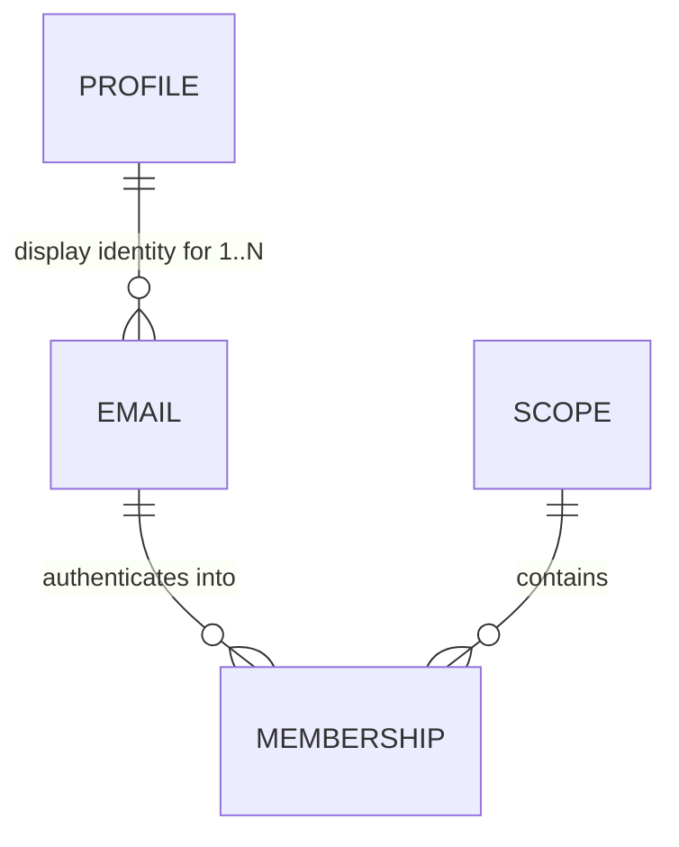

# The identity data model — behaviour and access-control decisions, before the schema

**Status:** Decisions **resolved 2026-07-26** (S1–S7 inherited, D1–D13 decided, F1–F5 deferred). Schema not yet drafted — see § Next. Each decision here is encoded *structurally* by whatever tables we write, which is why they were settled first; answering them afterwards would mean reverse-engineering them back out. That is how `Identities` came to carry five jobs.

⏳ **Rides the pre-alpha wipe's schema-surgery window** ([nebula-pre-alpha.md](nebula-pre-alpha.md) § *The wipe is a CLOSING WINDOW*, item 5): greenfield now, migration-bound forever after.

📥 **Absorbed:** the `profileId`-join half of [nebula-auth-identity-mint.md](nebula-auth-identity-mint.md) (its former §3). That task keeps the per-invitee admin mint.

## The invariant

> **Anchor access to the mailbox. Anchor identity to the person.**

Every decision in this file is that one sentence applied to a different surface — D3 to authentication, D12/D13 to mutation, D7 to delegation. If a proposed rule cannot be derived from it, that is the signal to look harder.

## The bet, as a comparison

**GitHub's model: your *account* determines access.** Email is a contact detail, so organisation membership survives your leaving — removing you takes an explicit admin action, and if nobody performs it, access persists **indefinitely**. (Observed first-hand: Larry still held repo access at a former employer more than a year after leaving, reported to them at the time and not promptly resolved.)

**Nebula keeps the half of that worth keeping and rejects the half that leaks:**

- ✅ **One portable Profile per person** — name, picture and attribution follow you across every scope, Star and Universe. This is the GitHub property worth copying.
- ❌ **Access is anchored to the *email*, never to the Profile.** Deactivating a company mailbox offboards the person **automatically**, because the mailbox *is* the authentication channel — no admin action to forget, no revocation feature to remember to build.

That single split determines nearly every answer below: a Profile is display-only and spans a person's emails; an *email* is what holds memberships and therefore access.

⚠️ **Accepted limit — a bounded session window.** Losing the mailbox stops new logins immediately, but the refresh token is a fixed 30-day TTL with no rotation and no slide (`security.md`), so a live session survives up to that long. **Accepted for pre-alpha:** it is strictly better than the account-anchored model it replaces — bounded rather than indefinite — and in practice an org's own device wipe usually takes the cookie with it, since the refresh cookie is `HttpOnly` + path-scoped and lives only on the device. ⚠️ But that mitigation is the **org's** capability, not a Nebula guarantee, and a session on a personal device survives the full window. **Explicit enterprise revocation is a real requirement, deferred** → F5.

## How to read this file

**Settled** = inherited, already committed elsewhere; listed so the schema honours it, not to reopen. **Decided here** = resolved in this file, with provenance. **Still open** = the schema cannot be written without an answer. **Deferred** = keep the seam, build nothing.

---

## Settled — inherited constraints the schema must honour

| | Proposition | Committed in |
|---|---|---|
| **S1** | **A profile is display-only. It is never an input to a permission decision outside the Profile DO itself** — no scope-derived authority confers rights over a profile, and holding a profile confers nothing anywhere else. | [ADR-012](../docs/adr/012-global-profile-visibility.md) |
| **S2** | **Scopes are the coarse-grained access-control entity.** Authority flows strictly **downward and only downward**, and it is always the conjunction **(`admin` ∧ the caller's `authScopePattern` covers *this* node)** — a guard must compare the pattern against the node it is executing in, because **the bit travels to nodes it was not issued for** (that was the confinement bug: a `{u}.{g}` admin admitted to the Universe DO by the tenant branch, then handed admin there by a guard that never asked which node it was in). At rest the bit sits beside its scope (`Identities.isAdmin` + `universeGalaxyStarId`); the `.*` pattern form exists **only in the JWT**, derived at mint time by `buildAuthScopePattern` — and `/mint-narrower-token` may mint a *narrower* pattern than the row's scope. **Fine-grained access control is the orgTree DAG in the data plane — out of scope for this file.** | [ADR-015](../docs/adr/015-scope-authority-flows-downward.md) |
| **S3** | **Email is never a primary key.** It is a mutable natural attribute. Keys are random opaque values, generatable without coordination — never a natural/mutable attribute, never a counter. | [ADR-010](../docs/adr/010-random-opaque-keys.md) |
| **S4** | **The registry singleton owns scope existence and email ownership.** Scope existence is **independent of membership** — `createGalaxy` mints no founder, so a real scope routinely has zero members. Four readers need that row, **none of them access**: slug uniqueness · **parent-exists** (`claimStar` rejects a Star whose parent has no row — so deriving existence from membership would break self-signup under a freshly-created Galaxy) · enumeration (`myScopeTree`, so an admin can find a Galaxy they hold no membership in — authority is the pattern, S2) · the deletion cascade. | [archive/nebula-auth-surrogate-sub.md](archive/nebula-auth-surrogate-sub.md) |
| **S5** | **Proving control of an email *authenticates*; memberships *authorize*.** Email is the channel, never the authorization key. *(The precise form of "email determines access" — the loose form invites putting email back on a durable path, which is what caused two prod wipes.)* | ADR-010, surrogate-sub |
| **S6** | **`sub` stays the membership key and the resource FK.** Resources/grants/snapshots key on `sub` only; `profileId` rides as a display copy. ⚠️ If `sub` became per-*person*, every snapshot re-keys — ADR-013 exists to prevent that. | [ADR-013](../docs/adr/013-identity-profileid-resolution.md) |
| **S7** | **An `Emails` table is not a return to the wipe-causing shape.** That defect was `Emails.email` (registry DO) ↔ `Subjects.email` (per-scope DO) — a *natural key doing cross-DO FK duty*, unenforceable, with no safe change flow. A table inside the **one** registry DO, surrogate PK, email as a `UNIQUE` *attribute*, FK on an opaque `profileId`, shares none of those properties. State this or it gets re-litigated. | surrogate-sub § The problem (1) |

---

## Decided here (2026-07-26, with Larry)

| | Decision | Rejected / why |
|---|---|---|
| **D1** | **A membership is keyed on the email, not the person** — one per `(emailId, scope)`, which is today's shape made load-bearing rather than incidental. `sub` stays the membership key (S6). | Per-*person* membership — it severs access from the mailbox, which is the whole revocation mechanism (D3). ⚠️ The objection that one human with two addresses in one scope would "render as two people" was **wrong**: both resolve to the same `profileId`, so name and picture are identical. The only real consequence is that the **subscriber roster is keyed by `sub`** and should dedupe by `profileId` for presence — a one-line roster fix, not a model change. |
| **D2** | **`profileId` hangs off the EMAIL row, not the membership row.** | On the membership — that is today's shape, and it is what makes "one human, one profile" an *emergent* property of N rows agreeing, hence derived canonical-ness, a first-mover race, and the join hazard that consumed two review passes. See § What this buys. |
| **D3** | **A verified email cannot reach another email's memberships.** Authentication into a scope runs through the address that holds the membership there, full stop. **Losing access to a company mailbox therefore removes access to that scope**, even when the person still holds other emails on the same Profile. | "Any verified email on the Profile authenticates anywhere" — that is precisely GitHub's hole (§ The bet). It also widens each membership's authentication surface to every address the person ever proved. |
| **D4** | **Multiple emails per Profile are modelled NOW**, while the schema is open — even though the flow that *attaches* a second email stays deferred (F1). | Deferring the modelling too. Storage is nearly free and we are already opening the table; retrofitting later costs a migration. The hard part was always *proving control of both*, which is a flow problem, not a modelling one. |
| **D5** | **A Profile DO needs no existence question** — it is addressable for any `profileId`, and first access creates it (empty fields, seeded eTag). The real question is *allocation*, which is a registry-side concern → D6. | Framing it as "does a Profile exist before verification" — a category error about DO lifecycle. |
| **D6** | **A `profileId` is allocated when an email is first seen** — any path, including the open unauthenticated ones. The residual is accepted. | Provisional-allocation-until-verified, with a promotion step. Under D2 allocation is **deterministic, not derived**, so there is no race to win: an attacker's `claim-star` for your address creates the `Emails` row, so your eventual `profileId` is one they caused to be minted — but they never learn its value (no endpoint returns it) and the dangling membership in their scope is one only **you** could ever authenticate into. Two states plus a promotion, to prevent something with no observable effect. |
| **D7** | **A minted token never exceeds the caller's own access** — a *consequence*, not a separate bound. Two rules produce it: **eligibility** — wearing another identity's `sub` requires administering that identity's scope (`hasAdminOverScope`), and the subject must be somebody else; and **faithfulness** — the token then mirrors *that person's* access (their `admin` bit, their reach). Its claims name **both** people per RFC 8693: the subject's `{sub, profileId}` top-level, the caller's in `act`. | Leaving either unbounded — today any admin can mint for any identity in **any universe**. ⚠️ The `profileId` hazard is real — holding one *is* write access to that profile (S1's owner check, zero reads) — but it is closed on the **READ** side, not by bending the claim: `#requireOwnerOrAdmin`'s owner branch additionally requires the token carry **no `act` chain** — a narrower token is never the owner ([profile.ts](../packages/nebula-auth/src/profile.ts) `claims.profileId === profileId && !claims.act`). Presence-only, never *who* the actor is. Rejected: stamping the **caller's** `profileId` top-level (it makes `sub` and `profileId` name different people, corrupting the subscriber roster), and omitting it (writes then carry no display stamp). Mechanism, rename and phases: **[nebula-mint-narrower-token.md](archive/nebula-mint-narrower-token.md)**. |
| **D8** | **The magic link goes to the address that holds the membership** (D3 restated). `MagicLinks` / `InviteTokens` key on **`emailId`**, not a bare address. | Storing a bare `email` string (today's shape) — it would hold a second copy of the one attribute D12 says lives in exactly one place, and a D13 email change would orphan any in-flight link. |
| **D9** | **A Profile survives its last membership — do NOT reap it on scope deletion.** | Deleting when a Profile has no memberships left. A Profile is display-only and **portable** (§ The invariant), so it is not scope-owned. Reaping also breaks historical attribution: snapshots carry a write-time-pinned `profileId` ([ADR-013](../docs/adr/013-identity-profileid-resolution.md) as amended), so a reaped Profile renders every past message from that person nameless — and a person invited back should be themselves again. The orphan concern is a **storage-cost** question, not a correctness one; its answer is a later GC pass over Profiles with zero memberships **and** zero attribution. ⚠️ **Supersedes** [backlog.md](backlog.md)'s Profile-DO-teardown row, which proposed the opposite. |
| **D10** | **Within a scope, a member sees only the address that holds the membership *in that scope*.** `#otherUsers` and the deletion warning select through membership → `emailId` → address, never "all addresses for this Profile". | (ii) All addresses on the Profile — that extends ADR-008 past its own stated **intra-scope** boundary (the same over-reach ADR-012 had to be written separately to license), leaking addresses across scopes the viewer has no relationship to. (iii) Display name only — breaks the deletion warning, which must name *who* loses access decisively; a name alone is ambiguous when two people share one. ✅ **Accepted consequence, and it is not a security risk:** an admin of two scopes could correlate two of a person's addresses via a shared `profileId`. Nothing is authorized differently (S1; ADR-012 already opens public fields to any holder), it is **unreachable until F1 exists** (unlinked addresses are separate Profiles with unrelated ids), and once F1 does exist the person **initiated the link themselves** by proving control of both — consented, not disclosed. In the ordinary case the admin *supplied* both addresses via invites anyway. ⚠️ The mitigation belongs at the **link moment** → F1. |
| **D11** | **No — identity-mint's §4 *Drop the Profile's scoped-admin branch* stays where it is, and D7's fix stays in its own task file** ([nebula-mint-narrower-token.md](archive/nebula-mint-narrower-token.md), which supersedes the backlog row it began as). Neither moves here. Nothing releases until **all of pre-alpha** is done, so the window in which either defect is exposed to a real user is empty (prod exists, but F&F invites stay paused until the wipe). §4 therefore lands with identity-mint, which builds *before* the model work — so the scoped-admin branch is still deleted while it is near-vacuous, rather than after D2 widens a `profileId` to span every membership across all of a person's emails. | Externalizing both into a "profile authz conformance" task (the `task_file_one_at_a_time` externalize exception would have permitted it), or moving them here. Both were argued on **exposure risk**, which the no-release-until-pre-alpha-completes constraint removes — a third active file to track buys nothing. ✅ **Resolved 2026-07-29.** D7's implementation landed in [nebula-mint-narrower-token.md](archive/nebula-mint-narrower-token.md) (archived), which superseded the backlog row this clause pointed at — **that row is deleted; do not go looking for it.** The release gate it carried (must land before F&F invites resume) is **satisfied**. |
| **D12** | **Every `Emails` row has an opaque surrogate PK (`emailId`); the address is a mutable attribute.** Memberships FK on `emailId`, **never on the address**. Emails genuinely change — marriage/legal-name change, a vendor move — so an address can never be a PK or an FK (S3, ADR-010). Consequence: changing an email is a **one-row, one-column `UPDATE`** with no cascade anywhere. | Email as the PK/FK — every change becomes a re-key across memberships, which is the shape that caused two prod wipes (S7). |
| **D13** | **Changing an email requires FRESH proof of the OLD address plus proof of the new — and *requesting* the change immediately revokes every refresh record anchored to that `emailId`.** The request must itself be authenticated (a live session). Effect: the legitimate cases pass (marriage/legal-name change and vendor moves — the person still holds the old address while moving), and a departing employee whose work mailbox is dead **cannot** re-point the row. Better still, the attempt is **self-defeating**: requesting the change revokes them, so trying to convert bounded access into permanent access instead costs them the remainder of the window — at zero UX cost to a legitimate user, who was about to re-authenticate anyway. | Authorising off the **live session** — sessions outlive mailbox control by up to the 30-day refresh TTL, so that is a 30-day escape hatch. Domain heuristics ("did it leave the company's domain?") — they break the moment a company rebrands. An **unauthenticated** change request — that is a denial-of-service: a stranger typing your address would kill your sessions. ⚠️ **Precision on "revoke":** access tokens are stateless JWTs with no revocation list, so they cannot be revoked, only **starved** — delete the KV refresh record **and** its `RefreshTokenIndex` row (both, KV-first; the refresh handler's KV-miss self-heal rebuilds from the index otherwise), after which outstanding access tokens die within `ACCESS_TOKEN_TTL`. The window collapses from ~30 days to **≤15 minutes**, not to zero. Revoke across **every** `sub` anchored to that `emailId` (a person may hold memberships in several scopes through one address). ⚠️ Same machinery as `setIdentityAdmin`'s KV convergence and the deferred demote/revoke endpoints (F5) — **three consumers, one helper.** |

---

## Next — write the schema

✅ **All decisions resolved 2026-07-26.** Nothing above is open, so the schema can be written: § *What D1 + D2 buy* holds the entity shape, and the column lists now follow from D1–D13 rather than preceding them.

Two things this file must grow before it can be built, and **not before the schema is drafted** (they are where the drift risk lives — a decisions document quietly becoming an implementation task):
- **Migration shape.** The registry list is append-only, *except* inside the wipe window (`schemas.ts` documents the existing pre-wipe baseline exception). This re-keys the central table, so it edits the baseline literals rather than appending — permitted only because the wipe resets the applied-id sequence. Confirm that is still true when the work starts.
- **Standing-guidance sweep — a success criterion of the schema phase, not a follow-up.** Landing the schema makes several always-loaded or review-loaded statements describe a shape that no longer exists. Known today: `.claude/rules/workflow.md`'s **ADR-013 one-liner** (says `profileId` is "a plain column on the `Identities` row", and that "owner authz short-circuits off the JWT `profileId` claim" — now D7's content) · **ADR-013's body** (`sub → profileId` becomes `sub → emailId → profileId`) · **`schemas.ts`'s header + per-table comments** · ADR-012, if the access ADR takes over "never an authz input". ⚠️ None of these is stale **yet** — they describe current code correctly, which is why they must be changed *with* the schema and not before. Criterion phrased over structure: **no standing-guidance statement describes the pre-split shape.** The always-loaded one-liner is the highest-traffic of them and the one most likely to be missed.
- **Phases + capable-of-failing criteria**, including what must red: a `changeEmail` that updates one row of N, a first-mover capture, and an unbounded impersonation subject (D7 — ✅ **implemented and archived 2026-07-29**, so this file owes only the *rule*, not the code).

## What D1 + D2 buy — the join mechanism dissolves

With `profileId` on the email row, **"same email, any scope → same `profileId`" is a structural fact, not a mechanism.** One address has one row holding one `profileId`, however many scopes it is in. There is nothing to join:

- no `SELECT … ORDER BY createdAt LIMIT 1` to derive canonical-ness
- no `AND emailVerified = 1` predicate to stop a first-mover capture
- no deterministic-tiebreak problem (`createdAt` comes from a clock pinned within an invocation — [[cf-clock-traps]])
- no row able to compete with **itself** for canonical status, which is the defect the second review panel caught in the join-at-verification design

And `email` lives in exactly one row keyed by an opaque id (D12), so `changeEmail` becomes a single-row, single-column update that is *correct* rather than one-of-N ([backlog.md](backlog.md) § Nebula Auth). `sub` stays per `(email, scope)`, so nothing re-keys (S6).

Shape only — column lists follow from § Still open:

- **Profile** — display identity. PK is the `profileId` (random opaque, ADR-010). The Profile DO is addressed by it (D5).
- **Email** — **opaque surrogate PK (`emailId`)**, `email UNIQUE` as a *mutable attribute*, FK → Profile, verification state. **Email lives here once** (S3, S7, D12), and changing it is a one-row single-column `UPDATE` (D12) gated by D13.
- **Membership** — the renamed `Identities`: `sub` PK (S6, unchanged), **FK → `emailId`** (never the address — D12), FK → Scope, `isAdmin`, `createdAt`. This is what `Identities` already *is* — a join table — which is why the name stopped describing it.
- **Scope** — unchanged, deliberately. Hierarchy-in-the-string works, the `LIKE 'prefix.%'` descendant scan is fine at this scale, and ADR-006 already defers FK integrity. **No `parentId`, no `tier`, no `founderSub`** — the last was explicitly rejected 2026-07-21 (at signup there is no authenticated principal, so an eager founder stamp needs a backdoor).

Worth folding in while the schema is open, low priority: `MagicLinks` and `InviteTokens` are byte-identical four-column tables, and [on-hold/nebula-collaborator-tiers.md](on-hold/nebula-collaborator-tiers.md) wants **one** `Contexts(tokenHash → payload)` keyed against "the flow's already-minted token" — awkward with two token tables to key against. Also add `CHECK (col IN (0,1))` to every boolean-ish column *at creation*: SQLite has no `ALTER TABLE ADD CONSTRAINT`, so it is cheap only now (pre-alpha wipe item 4, which should apply to the tables this produces).

### Why D13's proof rule is the one that works

**A change requires FRESH proof of the OLD address, plus proof of the new one.** That separates the legitimate cases from the leak with no domain heuristics (which break the moment a company rebrands):

| Case | Old address still reachable? | Outcome |
|---|---|---|
| Marriage / legal-name change (`jane.smith@acme.com` → `jane.jones@acme.com`) | yes — IT provisions the new one while the old still delivers | ✅ change allowed, membership preserved |
| Vendor move (gmail → fastmail) | yes | ✅ allowed |
| Departing employee (`jane@acme.com` → personal) | **no** — the company killed it | ❌ cannot re-point; access dies with the mailbox, D3 holds |

⚠️ **"Fresh" is load-bearing — a live session is NOT proof.** Sessions outlive mailbox control by up to the 30-day refresh TTL (§ The bet), so authorising the change off the current session would hand a departing employee a 30-day escape hatch converting bounded access into permanent access. The proof must be a magic link delivered to the old address **at change time**.

**Open sub-question:** does the two-proof flow fit the existing shape here? It is a *weaker* problem than F1's — both addresses sit on **one row of one Profile**, whereas F1 must prove control of two addresses belonging to different Profiles across differently-path-scoped cookies (which that file calls "the core problem to solve"). Likely yes; confirm rather than assume.

---

## Deferred — keep the seam, build nothing

| | Deferred | Home |
|---|---|---|
| **F1** | The flow that **attaches a second email** to a Profile (proving control of both). Rails already settled and hard-won: a breadcrumb cookie is advisory only and never an input to the decision; a confirm modal is not proof; never link silently. D4 makes the *schema* admit N emails; this is how one gets added. ⚠️ **Design consideration from D10:** linking two addresses makes them correlatable by an admin of scopes the person belongs to, so the link flow should say so at the moment of linking — informed consent at the link, not a gate at the read. | [on-hold/nebula-profile-link-breadcrumb.md](on-hold/nebula-profile-link-breadcrumb.md) |
| **F2** | **Merging two Profiles** that turn out to be one human. Correct SQL form recorded (re-point every affected row, then converge each `sub`'s KV record with its own original absolute expiry). | same |
| **F3** | Replacing the `isAdmin` boolean with a per-person **grant set**. The schema should not foreclose it; it should not build it. | [on-hold/nebula-collaborator-tiers.md](on-hold/nebula-collaborator-tiers.md) |
| **F4** | An **audit trail for who minted an admin**. Nothing persists the actor today (no column; only a DEBUG-gated log). Post-wedge per `enterprise.md`'s timing gates. | [backlog.md](backlog.md) § Nebula Auth |
| **F5** | **Explicit enterprise revocation** — an admin action that kills a person's live sessions immediately rather than waiting out the 30-day refresh TTL. Needed for the enterprise expansion; the mailbox-as-revocation mechanism (§ The bet) covers the self-serve wedge. | [backlog.md](backlog.md) § Nebula Auth |

## Relationships

- **Absorbs** the `profileId`-join half of [nebula-auth-identity-mint.md](nebula-auth-identity-mint.md) (former §3) — and D1+D2 **dissolve** it rather than relocating it. That file keeps the per-invitee admin mint **and its §4 *Drop the Profile's scoped-admin branch*** — D11 settled that it does not move here.
- **Rides** the pre-alpha wipe as schema-surgery item 5 ([nebula-pre-alpha.md](nebula-pre-alpha.md)) — the largest queued item, and wipe-gated in the strong sense (it re-keys the registry's central table).
- **Fixes structurally:** `changeEmail`'s one-row-of-N update, and the emergent canonical-ness behind first-mover capture (both [backlog.md](backlog.md) § Nebula Auth).
- **Does NOT fix** the `profileId`-as-bearer-capability leak — that is independent of where `profileId` is stored. D7 decides the rule; ✅ the code landed 2026-07-29 in [nebula-mint-narrower-token.md](archive/nebula-mint-narrower-token.md) (eligibility bounds *which* subject; the Profile owner branch requires `!claims.act`).
- **Constrained by** ADR-010 / ADR-012 / ADR-013 / ADR-015 (§ Settled). If an answer needs one of them changed, that is an ADR amendment, stated as such.
- **Nothing on the critical path waits on this** — the Galaxy collapse does not. identity-mint's former §3 did, which is why it moved.
