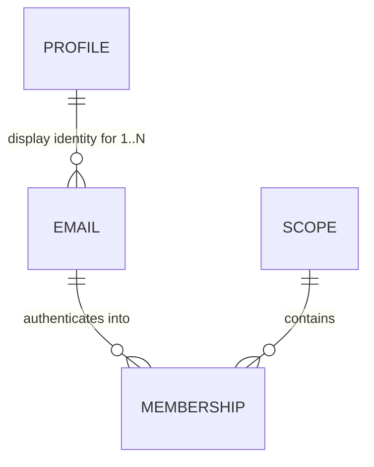

# The identity data model — behaviour and access-control decisions, before the schema

**Status:** Decisions document, open. **No schema is pinned yet** — deliberate. Every question in § Still open gets encoded *structurally* by whatever tables we write, so answering them afterwards means reverse-engineering them out of the schema later. That is how `Identities` came to carry five jobs.

⏳ **Rides the pre-alpha wipe's schema-surgery window** ([nebula-pre-alpha.md](nebula-pre-alpha.md) § *The wipe is a CLOSING WINDOW*, item 5): greenfield now, migration-bound forever after.

📥 **Absorbed:** the `profileId`-join half of [nebula-auth-identity-mint.md](nebula-auth-identity-mint.md) (its former §3). That task keeps the per-invitee admin mint.

## The bet, as a comparison

**GitHub's model: your *account* determines access.** Email is a contact detail, so organisation membership survives your leaving — removing you takes an explicit admin action, and if nobody performs it, access persists **indefinitely**. (Observed first-hand: Larry still held repo access at a former employer more than a year after leaving, reported to them at the time and not promptly resolved.)

**Nebula keeps the half of that worth keeping and rejects the half that leaks:**

- ✅ **One portable Profile per person** — name, picture and attribution follow you across every scope, Star and Universe. This is the GitHub property worth copying.
- ❌ **Access is anchored to the *email*, never to the Profile.** Deactivating a company mailbox offboards the person **automatically**, because the mailbox *is* the authentication channel — no admin action to forget, no revocation feature to remember to build.

That single split determines nearly every answer below: a Profile is display-only and spans a person's emails; an *email* is what holds memberships and therefore access.

⚠️ **Accepted limit — a bounded session window.** Losing the mailbox stops new logins immediately, but the refresh token is a fixed 30-day TTL with no rotation and no slide (`security.md`), so a live session survives up to that long. **Accepted for pre-alpha:** it is strictly better than the account-anchored model it replaces — bounded rather than indefinite — and in practice an org's own device wipe usually takes the cookie with it, since the refresh cookie is `HttpOnly` + path-scoped and lives only on the device. ⚠️ But that mitigation is the **org's** capability, not a Nebula guarantee, and a session on a personal device survives the full window. **Explicit enterprise revocation is a real requirement, deferred** → F5.

## How to read this file

**Settled** = inherited, already committed elsewhere; listed so the schema honours it, not to reopen. **Decided here** = resolved in this file, with provenance. **Still open** = the schema cannot be written without an answer. **Deferred** = keep the seam, build nothing.

---

## Settled — inherited constraints the schema must honour

| | Proposition | Committed in |
|---|---|---|
| **S1** | **A profile is display-only. It is never an input to authorization over anything else — a profile authorizes only *itself*.** ⚠️ The carve-out is load-bearing: `profileId` *is* an authz input for writing **that** profile (`#requireOwnerOrAdmin`'s owner branch is `claims.profileId === profileId`, zero reads). "Not in the hierarchy" ≠ "never an authz input at all", and the difference is where D7's leak lives. | [ADR-012](../docs/adr/012-global-profile-visibility.md) as amended 2026-07-26 |
| **S2** | **Scopes are the coarse-grained access-control entity.** Authority flows strictly downward and only downward; the bare `admin` bit is never authority by itself. **Fine-grained access control is the orgTree DAG in the data plane — out of scope for this file.** | [ADR-015](../docs/adr/015-scope-authority-flows-downward.md) |
| **S3** | **Email is never a primary key.** It is a mutable natural attribute. Keys are random opaque values, generatable without coordination — never a natural/mutable attribute, never a counter. | [ADR-010](../docs/adr/010-random-opaque-keys.md) |
| **S4** | **The registry singleton owns scope existence and email ownership.** Scope existence is independent of membership (a wildcard-managed child scope has a `Scopes` row and zero members). | [archive/nebula-auth-surrogate-sub.md](archive/nebula-auth-surrogate-sub.md) |
| **S5** | **Proving control of an email *authenticates*; memberships *authorize*.** Email is the channel, never the authorization key. *(The precise form of "email determines access" — the loose form invites putting email back on a durable path, which is what caused two prod wipes.)* | ADR-010, surrogate-sub |
| **S6** | **`sub` stays the membership key and the resource FK.** Resources/grants/snapshots key on `sub` only; `profileId` rides as a display copy. ⚠️ If `sub` became per-*person*, every snapshot re-keys — ADR-013 exists to prevent that. | [ADR-013](../docs/adr/013-identity-profileid-resolution.md) |
| **S7** | **An `Emails` table is not a return to the wipe-causing shape.** That defect was `Emails.email` (registry DO) ↔ `Subjects.email` (per-scope DO) — a *natural key doing cross-DO FK duty*, unenforceable, with no safe change flow. A table inside the **one** registry DO, surrogate PK, email as a `UNIQUE` *attribute*, FK on an opaque `profileId`, shares none of those properties. State this or it gets re-litigated. | surrogate-sub § The problem (1) |

---

## Decided here (2026-07-26, with Larry)

| | Decision | Rejected / why |
|---|---|---|
| **D1** | **A membership is keyed on the `(email, scope)` pair** — unchanged from today, and now load-bearing rather than incidental. `sub` is minted per `(email, scope)`. | Per-*person* membership — it severs access from the mailbox, which is the whole revocation mechanism (D3). ⚠️ The objection that one human with two addresses in one scope would "render as two people" was **wrong**: both resolve to the same `profileId`, so name and picture are identical. The only real consequence is that the **subscriber roster is keyed by `sub`** and should dedupe by `profileId` for presence — a one-line roster fix, not a model change. |
| **D2** | **`profileId` hangs off the EMAIL row, not the membership row.** | On the membership — that is today's shape, and it is what makes "one human, one profile" an *emergent* property of N rows agreeing, hence derived canonical-ness, a first-mover race, and the join hazard that consumed two review passes. See § What this buys. |
| **D3** | **A verified email cannot reach another email's memberships.** Authentication into a scope runs through the address that holds the membership there, full stop. **Losing access to a company mailbox therefore removes access to that scope**, even when the person still holds other emails on the same Profile. | "Any verified email on the Profile authenticates anywhere" — that is precisely GitHub's hole (§ The bet). It also widens each membership's authentication surface to every address the person ever proved. |
| **D4** | **Multiple emails per Profile are modelled NOW**, while the schema is open — even though the flow that *attaches* a second email stays deferred (F1). | Deferring the modelling too. Storage is nearly free and we are already opening the table; retrofitting later costs a migration. The hard part was always *proving control of both*, which is a flow problem, not a modelling one. |
| **D5** | **A Profile DO needs no existence question** — it is addressable for any `profileId`, and first access creates it (empty fields, seeded eTag). The real question is *allocation*, which is a registry-side concern → D6. | Framing it as "does a Profile exist before verification" — a category error about DO lifecycle. |

---

## Still open — the schema cannot be written without these

### D6 · When is a `profileId` allocated, and to what?
The registry-side allocation question that D5 replaced. Under D2 a `profileId` is allocated **when an email is first seen** — but the open part is *which paths may do that*. Two of the four mint paths are open and unauthenticated (Turnstile-only), so a row bearing anyone's address can be created before that person acts.

Under D2 this is no longer a *race* — allocation is deterministic, not derived by `ORDER BY` — so the residual is dull: an attacker's `claim-star` for your address creates the `Emails` row, so your eventual `profileId` is one they caused to be minted. They never learn its value, and the dangling membership in their scope is one only **you** could ever authenticate into. **Decide whether that is simply accepted** (the lean) or whether an unverified address should hold a provisional allocation.

### D7 · Is "act as this person" a capability bounded by scope?
The `/delegated-token` finding as a **model rule** rather than a patch: that endpoint bounds `activeScope` to the caller's reach but places **no bound on `actFor`**, and stamps the target's `profileId` into the minted token — which S1's carve-out makes a write capability over that person's profile. Bug filed at [backlog.md](backlog.md) § Nebula Auth; the *rule* belongs here, because "who may act as whom" is a property of the identity model, not of one endpoint.

### D8 · Which address receives the magic link for a given scope?
Under D3 the answer is presumably "the address that holds the membership" — confirm, and decide what `MagicLinks`/`InviteTokens` store: a bare `email` (today) or a reference.

### D9 · When the last membership for a Profile goes away, does the Profile survive?
Today the Profile DO is simply orphaned on scope deletion ([backlog.md](backlog.md) § Profile store follow-ons). With emails owning the `profileId` this becomes answerable rather than accidental: reap, or keep for a returning person? Note a Profile can outlive every membership and still be legitimate — the person may be invited back.

### D10 · Within a scope, what may a member see of another member's email? (ADR-008)
ADR-008 makes member identity visible within a Star, and `#otherUsers` discloses emails today for the deletion warning. Under D4: which address — the one they joined with, all of them, or none? "All" leaks addresses across scopes the viewer has no relationship to.

### D11 · Does identity-mint's §4 come here?
Dropping the Profile's scoped-admin branch is **model-conformance** — making the code match S1 — and it lives in `profile.ts`, not on the invite path. With the join absorbed here it is arguably orphaned in identity-mint, and it is the same family as D7. Left there for now; **not moved unilaterally.**

---

## What D1 + D2 buy — the join mechanism dissolves

With `profileId` on the email row, **"same email, any scope → same `profileId`" is a structural fact, not a mechanism.** One address has one row holding one `profileId`, however many scopes it is in. There is nothing to join:

- no `SELECT … ORDER BY createdAt LIMIT 1` to derive canonical-ness
- no `AND emailVerified = 1` predicate to stop a first-mover capture
- no deterministic-tiebreak problem (`createdAt` comes from a clock pinned within an invocation — [[cf-clock-traps]])
- no row able to compete with **itself** for canonical status, which is the defect the second review panel caught in the join-at-verification design

And `email` lives in exactly one row, so `changeEmail` becomes a single-row update that is *correct* rather than one-of-N ([backlog.md](backlog.md) § Nebula Auth). `sub` stays per `(email, scope)`, so nothing re-keys (S6).

Shape only — column lists follow from § Still open:

- **Profile** — display identity. PK is the `profileId` (random opaque, ADR-010). The Profile DO is addressed by it (D5).
- **Email** — surrogate PK, `email UNIQUE`, FK → Profile, verification state. **Email lives here once** (S3, S7).
- **Membership** — the renamed `Identities`: `sub` PK (S6, unchanged), FK → Email, FK → Scope, `isAdmin`, `createdAt`. This is what `Identities` already *is* — a join table — which is why the name stopped describing it.
- **Scope** — unchanged, deliberately. Hierarchy-in-the-string works, the `LIKE 'prefix.%'` descendant scan is fine at this scale, and ADR-006 already defers FK integrity. **No `parentId`, no `tier`, no `founderSub`** — the last was explicitly rejected 2026-07-21 (at signup there is no authenticated principal, so an eager founder stamp needs a backdoor).

Worth folding in while the schema is open, low priority: `MagicLinks` and `InviteTokens` are byte-identical four-column tables, and [on-hold/nebula-collaborator-tiers.md](on-hold/nebula-collaborator-tiers.md) wants **one** `Contexts(tokenHash → payload)` keyed against "the flow's already-minted token" — awkward with two token tables to key against. Also add `CHECK (col IN (0,1))` to every boolean-ish column *at creation*: SQLite has no `ALTER TABLE ADD CONSTRAINT`, so it is cheap only now (pre-alpha wipe item 4, which should apply to the tables this produces).

---

## Deferred — keep the seam, build nothing

| | Deferred | Home |
|---|---|---|
| **F1** | The flow that **attaches a second email** to a Profile (proving control of both). Rails already settled and hard-won: a breadcrumb cookie is advisory only and never an input to the decision; a confirm modal is not proof; never link silently. D4 makes the *schema* admit N emails; this is how one gets added. | [on-hold/nebula-profile-link-breadcrumb.md](on-hold/nebula-profile-link-breadcrumb.md) |
| **F2** | **Merging two Profiles** that turn out to be one human. Correct SQL form recorded (re-point every affected row, then converge each `sub`'s KV record with its own original absolute expiry). | same |
| **F3** | Replacing the `isAdmin` boolean with a per-person **grant set**. The schema should not foreclose it; it should not build it. | [on-hold/nebula-collaborator-tiers.md](on-hold/nebula-collaborator-tiers.md) |
| **F4** | An **audit trail for who minted an admin**. Nothing persists the actor today (no column; only a DEBUG-gated log). Post-wedge per `enterprise.md`'s timing gates. | [backlog.md](backlog.md) § Nebula Auth |
| **F5** | **Explicit enterprise revocation** — an admin action that kills a person's live sessions immediately rather than waiting out the 30-day refresh TTL. Needed for the enterprise expansion; the mailbox-as-revocation mechanism (§ The bet) covers the self-serve wedge. | [backlog.md](backlog.md) § Nebula Auth |

## Relationships

- **Absorbs** the `profileId`-join half of [nebula-auth-identity-mint.md](nebula-auth-identity-mint.md) (former §3) — and D1+D2 **dissolve** it rather than relocating it. That file keeps the per-invitee admin mint and, for now, its §4 (see D11).
- **Rides** the pre-alpha wipe as schema-surgery item 5 ([nebula-pre-alpha.md](nebula-pre-alpha.md)) — the largest queued item, and wipe-gated in the strong sense (it re-keys the registry's central table).
- **Fixes structurally:** `changeEmail`'s one-row-of-N update, and the emergent canonical-ness behind first-mover capture (both [backlog.md](backlog.md) § Nebula Auth).
- **Does NOT fix** the `/delegated-token` leak — that is `profileId`-as-bearer-capability, independent of where it is stored. D7 decides the rule; the bug has its own row.
- **Constrained by** ADR-010 / ADR-012 / ADR-013 / ADR-015 (§ Settled). If an answer needs one of them changed, that is an ADR amendment, stated as such.
- **Nothing on the critical path waits on this** — the Galaxy collapse does not. identity-mint's former §3 did, which is why it moved.
