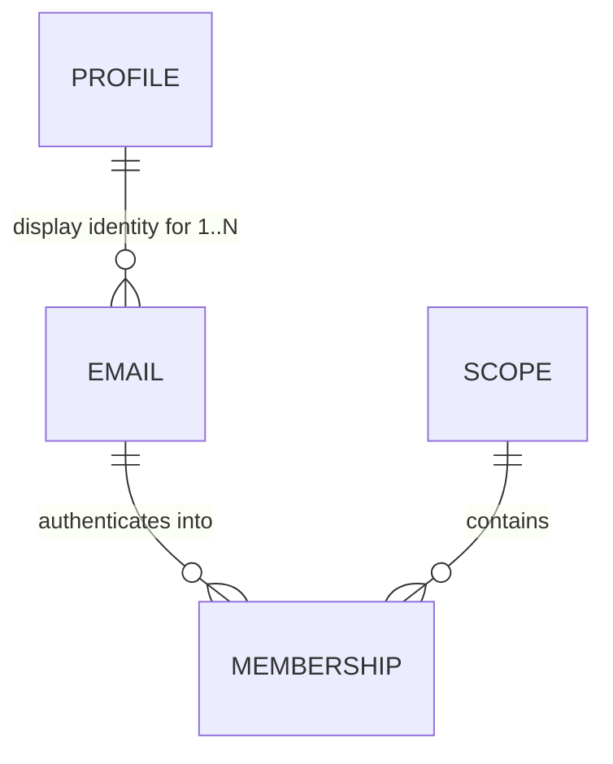

# The identity data model — behaviour and access-control decisions, before the schema

**Status:** Decisions **resolved 2026-07-26** (S1–S8 inherited, D1–D16 decided, F1–F5 deferred; **S8 + D14–D16 added later** — ADR-016 landed after the decisions were initially settled; it binds the call sites, not the tables). Schema not yet drafted — see § Next. Each decision here is encoded *structurally* by whatever tables we write, which is why they were settled first; answering them afterwards would mean reverse-engineering them back out. That is how `Identities` came to carry five jobs.

🔀 **This file IS the task file — pinned 2026-08-02.** It is `/write-task` pass 1 (design intent, hand-reviewed), and it grows the **schema draft** and then **phases** in place. It is not a decisions record to be handed off to a separate implementation file, and it does **not** supersede [nebula-auth-identity-mint.md](nebula-auth-identity-mint.md) — that is a separate, already-phased task (the per-invitee admin mint) which survives, and of which only **Phase 2** is a prerequisite here (D11). Revisit only if the schema draft fans into several independently-shippable chunks, which would make this a living master with children instead.

⏳ **Rides the pre-alpha wipe's schema-surgery window** ([nebula-pre-alpha.md](nebula-pre-alpha.md) § *The wipe is a CLOSING WINDOW*, item 5).

## The invariant

> **Anchor access to the mailbox. Anchor identity to the person.**

Nearly every decision in this file is that one sentence applied to a different surface — D3 to authentication, D12/D13 to mutation, D7 to delegation. If a proposed rule about **access or identity** cannot be derived from it, that is the signal to look harder. (D14 and D15 are deliberately outside it — they govern what the registry *records* and *reclaims*, not who reaches what.)

## The bet, as a comparison

**GitHub's model: your *account* determines access.** Email is a contact detail, so organisation membership survives your leaving — removing you takes an explicit admin action, and if nobody performs it, access persists **indefinitely**. (Observed first-hand: Larry still held repo access at a former employer long after leaving, reported to them at the time and not promptly resolved.)

**Nebula keeps the half of that worth keeping and rejects the half that leaks:**

- ✅ **One portable Profile per person** — name, picture and attribution follow you across every scope, Star and Universe. This is the GitHub property worth copying.
- ❌ **Access is anchored to the *email*, never to the Profile.** Deactivating a company mailbox offboards the person **automatically** (with the accepted limit noted below), because the mailbox *is* the authentication channel — no admin action to forget, no revocation feature to remember to build.

That single split determines nearly every answer below: a Profile is display-only and spans a person's emails; an *email* is what holds memberships and therefore access.

⚠️ **Accepted limit — a bounded session window.** Losing the mailbox stops new logins immediately, but the refresh token is a fixed 30-day TTL with no rotation and no slide (`security.md`), so a live session survives up to that long. **Accepted:** it is strictly better than the account-anchored GitHub — bounded rather than indefinite — and in practice an org's own device wipe usually takes the cookie with it, since the refresh cookie is `HttpOnly` + path-scoped and lives only on the device. ⚠️ But that mitigation is the **org's** capability, not a Nebula guarantee, and a session on a personal device survives the full window. **Explicit enterprise revocation is a real requirement, deferred** → F5.

## How to read this file

**Settled** = inherited, already committed elsewhere; listed so the schema honours it, not to reopen. **Decided here** = resolved in this file, with provenance. **Deferred** = keep the seam, build nothing. *(No "still open" section exists — every decision is settled; what remains are two build-time confirmations, named in § Next.)*

---

## Settled — inherited constraints the schema must honour

| | Proposition | Committed in |
|---|---|---|
| **S1** | **A profile is display-only. It is never an input to a permission decision outside the Profile DO itself** — no scope-derived authority confers rights over a profile, and holding a profile confers nothing anywhere else. | [ADR-012](../docs/adr/012-global-profile-visibility.md) |
| **S2** | **Scopes are the coarse-grained (`{u}.{g}.{s}`) access-control entity.** Authority flows strictly **downward and only downward** (`{u}` → `{g}` → `{s}`), and it is always the conjunction **(`admin` ∧ the caller's `authScopePattern` covers *this* node)** — a guard must compare the pattern against the node it is executing in, because **the bit travels to nodes it was not issued for**. At rest the bit sits beside its scope (`Identities.isAdmin` + `universeGalaxyStarId`); the `.*` pattern form exists **only in the JWT**, derived at mint time by `buildAuthScopePattern` — and `/mint-narrower-token` may mint a *narrower* pattern than the row's scope. **Fine-grained access control is the orgTree DAG in the data plane — out of scope for this file.** | [ADR-015](../docs/adr/015-scope-authority-flows-downward.md) |
| **S3** | **Email is never a primary key.** It is a mutable natural attribute. Keys are random opaque values, generatable without coordination — never a natural/mutable attribute, never a counter. | [ADR-010](../docs/adr/010-random-opaque-keys.md) |
| **S4** | **The registry singleton owns scope existence and email ownership.** Scope existence is **independent of membership** — an admin-gated `createGalaxy`/`createStar` writes a `Scopes` row and **no identity** (the caller's own wildcard — `{u}.*` for a Galaxy, `{u}.{g}.*` for a Star — already reaches it), so a real scope routinely has zero members. Only the *unauthenticated* claims mint an identity, because until one exists nobody holds a token that reaches the new scope. Four readers need that row, **none of them access**: slug uniqueness · **parent-exists** (`claimStar` rejects a Star whose parent has no row — so deriving existence from membership would break self-signup under a freshly-created Galaxy) · enumeration (`myScopeTree`, so an admin can find a Galaxy they hold no membership in — authority is the pattern, S2) · the deletion cascade. | [archive/nebula-auth-surrogate-sub.md](archive/nebula-auth-surrogate-sub.md) |
| **S5** | **Proving control of an email *authenticates*; memberships *authorize*.** Email is the channel, never the authorization key. *(The precise form of "email determines access" — the loose form invites putting email back on a durable path, which is what caused two prod wipes.)* | ADR-010, surrogate-sub |
| **S6** | **`sub` stays the membership key and the resource FK.** Resources/grants/snapshots key on `sub` only; `profileId` rides as a display copy. ⚠️ If `sub` became per-*person*, every snapshot re-keys — ADR-013 exists to prevent that. | [ADR-013](../docs/adr/013-identity-profileid-resolution.md) |
| **S7** | **An `Emails` table is not a return to the wipe-causing shape.** That defect was `Emails.email` (registry DO) ↔ `Subjects.email` (per-scope DO) — a *natural key doing cross-DO FK duty*, unenforceable, with no safe change flow. A table inside the **one** registry DO, surrogate PK, email as a `UNIQUE` *attribute*, FK on an opaque `profileId`, shares none of those properties. State this or it gets re-litigated. | surrogate-sub § The problem (1) |
| **S8** | **ADR-016 imposes no storage obligation on this schema — do NOT add an audit table.** Authority changes and state removals must record the acting token's full verified claims, but the ADR says explicitly that a consumer discharges that by **logging**, so the obligation lands on **call sites, never tables**. Listed only because a review re-derived it as a storage requirement once already. *How* it is discharged here → D14. | [ADR-016](../docs/adr/016-record-the-acting-principal.md) |

---

## Decided here (D1–D13 on 2026-07-26 with Larry; D14 on 2026-08-02; D15 + D16 on 2026-08-03)

| | Decision | Rejected / why |
|---|---|---|
| **D1** | **A membership is keyed on the email, not the person** — one per `(emailId, scope)`, which is today's shape made load-bearing rather than incidental. `sub` stays the membership key (S6). | Per-*person* membership — it severs access from the mailbox, which is the whole revocation mechanism (D3). ⚠️ The objection that one human with two addresses in one scope would "render as two people" was **wrong**: both resolve to the same `profileId`, so name and picture are identical. The only real consequence is that the **subscriber roster is keyed by `sub`** and should dedupe by `profileId` for presence — a one-line roster fix, not a model change. |
| **D2** | **`profileId` hangs off the EMAIL row, not the membership row.** | On the membership — that is today's shape, and it is what makes "one human, one profile" an *emergent* property of N rows agreeing, hence derived canonical-ness, a first-mover race, and the join hazard that consumed two review passes. See § What this buys. |
| **D3** | **A verified email cannot reach another email's memberships.** Authentication into a scope runs through the address that holds the membership there, full stop. **Losing access to a company mailbox therefore removes access to that scope**, even when the person still holds other emails on the same Profile. | "Any verified email on the Profile authenticates anywhere" — that is precisely GitHub's hole (§ The bet). It also widens each membership's authentication surface to every address the person ever proved. |
| **D4** | **Multiple emails per Profile are modelled NOW**, while the schema is open — even though the flow that *attaches* a second email stays deferred (F1). | Deferring the modelling too. Storage is nearly free and we are already opening the table; retrofitting later costs a migration. The hard part was always *proving control of both*, which is a flow problem, not a modelling one. |
| **D5** | **A Profile DO needs no existence question** — it is addressable for any `profileId`, and first access creates it (empty fields, seeded eTag). The real question is *allocation*, which is a registry-side concern → D6. | Framing it as "does a Profile exist before verification" — a category error about DO lifecycle. |
| **D6** | **A `profileId` is allocated when an email is first seen** — any path, including the open unauthenticated ones. The residual is accepted. | Provisional-allocation-until-verified, with a promotion step. Under D2 allocation is **deterministic, not derived**, so there is no race to win: an attacker's `claim-star` for your address creates the `Emails` row, so your eventual `profileId` is one they caused to be minted — but they never learn its value (no endpoint returns it) and the dangling membership in their scope is one only **you** could ever authenticate into. Two states plus a promotion, to prevent something with no observable effect. |
| **D7** | **A minted token never exceeds the caller's own access** — a *consequence*, not a separate bound. Two rules produce it: **eligibility** — wearing another identity's `sub` requires administering that identity's scope (`hasAdminOverScope`), and the subject must be somebody else; and **faithfulness** — the token then mirrors *that person's* access (their `admin` bit, their reach). Its claims name **both** people per RFC 8693: the subject's `{sub, profileId}` top-level, the caller's in `act`. | Leaving either unbounded — today any admin can mint for any identity in **any universe**. ⚠️ The `profileId` hazard is real — holding one *is* write access to that profile (S1's owner check, zero reads) — but it is closed on the **READ** side, not by bending the claim: `#requireOwnerOrAdmin`'s owner branch additionally requires the token carry **no `act` chain** — a narrower token is never the owner ([profile.ts](../packages/nebula-auth/src/profile.ts) `claims.profileId === profileId && !claims.act`). Presence-only, never *who* the actor is. Rejected: stamping the **caller's** `profileId` top-level (it makes `sub` and `profileId` name different people, corrupting the subscriber roster), and omitting it (writes then carry no display stamp). Mechanism, rename and phases: **[nebula-mint-narrower-token.md](archive/nebula-mint-narrower-token.md)**. |
| **D8** | **The magic link goes to the address that holds the membership** (D3 restated). `MagicLinks` / `InviteTokens` key on **`emailId`**, not a bare address. | Storing a bare `email` string (today's shape) — it would hold a second copy of the one attribute D12 says lives in exactly one place, and a D13 email change would orphan any in-flight link. |
| **D9** | **A Profile survives its last membership — do NOT reap it on scope deletion.** | Deleting when a Profile has no memberships left. A Profile is display-only and **portable** (§ The invariant), so it is not scope-owned. Reaping also breaks historical attribution: a name is resolved through the Profile, and snapshots **will** carry a write-time-pinned `profileId` once schema-surgery item 6 lands ([ADR-013](../docs/adr/013-identity-profileid-resolution.md) as amended — today `changedBy` is `{ sub, act }` only), so a reaped Profile renders every past message from that person nameless — and a person invited back should be themselves again. The orphan concern is a **storage-cost** question, not a correctness one; its answer is a later GC pass over Profiles with zero memberships **and** zero attribution. The backlog's Profile-GC row agrees and defers to this; it holds only the residual storage-cost work. |
| **D10** | **(i) Within a scope, a member sees only the address that holds the membership *in that scope*.** `#affectedUsers` (`SELECT COUNT(DISTINCT email) … FROM Identities`) and `#emailForSub` — the two live sites that read the address off `Identities` — select through membership → `emailId` → address, never "all addresses for this Profile". | (ii) All addresses on the Profile — that extends ADR-008 past its own stated **intra-scope** boundary (the same over-reach ADR-012 had to be written separately to license), leaking addresses across scopes the viewer has no relationship to. (iii) Display name only — breaks the deletion warning, which must name *who* loses access decisively; a name alone is ambiguous when two people share one. ✅ **Accepted consequence, and it is not a security risk:** an admin of two scopes could correlate two of a person's addresses via a shared `profileId`. Nothing is authorized differently (S1; ADR-012 already opens public fields to any holder), it is **unreachable until F1 exists** (unlinked addresses are separate Profiles with unrelated ids), and once F1 does exist the person **initiated the link themselves** by proving control of both — consented, not disclosed. In the ordinary case the admin *supplied* both addresses via invites anyway. ⚠️ The mitigation belongs at the **link moment** → F1. |
| **D11** | **identity-mint's Phase 2 (§4 *Drop the Profile's scoped-admin branch*) builds before this schema** — so the branch is deleted while it is still near-vacuous, rather than after D2 widens a `profileId` to span every membership across all of a person's emails. §4 stays in that file; it does not move here. ⚠️ **Phase granularity is load-bearing, not pedantry:** identity-mint states Phase 2 is independent of Phase 1 and depended on by nothing there, so it can land alone — while its Phase 4 is ⛔ not buildable as written and Phase 3 waits on the Galaxy collapse. "*The file* builds first" would park the largest wipe-gated item behind both, for no reason this decision supports. 🔸 **Phase 1 is a soft preference, never a constraint:** it rewrites the same `Identities` write path this schema re-keys (`#mintIdentity`'s caller, plus the first production `setIdentityAdmin`), so landing it first avoids redoing it against a new table shape — worth taking if convenient, never worth waiting on. | Externalizing §4 into a separate "profile authz conformance" task (the `task_file_one_at_a_time` externalize exception would have permitted it), or moving it here. Both were argued on **exposure risk**, which the no-release-until-pre-alpha-completes constraint removes — nothing releases until all of pre-alpha is done, so a third active file to track buys nothing. |
| **D12** | **Every `Emails` row has an opaque surrogate PK (`emailId`); the address is a mutable attribute.** Memberships FK on `emailId`, **never on the address**. Emails genuinely change — marriage/legal-name change, a vendor move — so an address can never be a PK or an FK (S3, ADR-010). Consequence: changing an email is a **one-row, one-column `UPDATE`** with no cascade anywhere. | Email as the PK/FK — every change becomes a re-key across memberships, which is the shape that caused two prod wipes (S7). |
| **D13** | **Changing an email requires FRESH proof of the OLD address plus proof of the new, and the attempt itself costs the attacker their session.** The request must be authenticated (a live session); **what it revokes, and when, is D16** — the request starves only the session it arrived on, and the `emailId`-wide revoke waits for the old-address proof. Effect: the legitimate cases pass (marriage/legal-name change and vendor moves — the person still holds the old address while moving), and a departing employee whose work mailbox is dead **cannot** re-point the row. Better still, the attempt is **self-defeating**: requesting the change starves the session they are sitting in, so trying to convert bounded access into permanent access instead costs them the remainder of the window — at zero UX cost to a legitimate user, who was about to re-authenticate anyway. | Authorising off the **live session** — sessions outlive mailbox control by up to the 30-day refresh TTL, so that is a 30-day escape hatch. Domain heuristics ("did it leave the company's domain?") — they break the moment a company rebrands. An **unauthenticated** change request — that is a denial-of-service: a stranger typing your address would kill your sessions. ⚠️ **Precision on "revoke":** access tokens are stateless JWTs with no revocation list, so they cannot be revoked, only **starved** — delete the refresh records by **D15's two-half mechanism**, after which outstanding access tokens die within `ACCESS_TOKEN_TTL`. The window collapses from ~30 days to **≤15 minutes**, not to zero. The **`emailId`-wide** revoke — every `sub` anchored to that address, since a person may hold memberships in several scopes through one — fires at **proof-consumption**, not at request (D16). ⚠️ Same machinery as `setIdentityAdmin`'s KV convergence and the deferred demote/revoke endpoints (F5) — **three consumers, one helper**, and D15 is that helper. ⚠️ **Both halves owe an ADR-016 log record (S8)** — the revoke removes state, and the re-point changes which mailbox holds the authority. A log line, not a row. Conveniently guaranteed: the same authenticated-request requirement that stops this being a denial-of-service is what ensures a **verified token always exists to record**. |
| **D14** | **In the registry the record is a log line and only a log line** — a `@lumenize/debug` call at the point of action. **Which actions is DERIVED, not enumerated:** every registry method that **changes who can do what, removes state, or establishes a session**. The first two are ADR-016's own trigger; the third is this decision's addition — a login changes no authority, but it is the first thing a post-incident reader asks about. ⚠️ Stated as a derivation deliberately: a per-case list is the shape that ships a missing case (calibration §2), and it would need re-checking every time a registry method is added. ⚠️ The one deliberate exclusion is a **token refresh** — it changes no authority. (It is *nearly* registry-free rather than entirely: a KV miss falls back to `getRefreshRecord`, which reconstructs and self-heals. D15 removes that fallback; either way the path records nothing, correctly.) ⚠️ **The gap today is the ACTOR, not the line:** `setIdentityAdmin` logs its *target* only (`{ sub, isAdmin }`) and takes no claims parameter. Conformance is therefore a claims parameter **plus** routing through ADR-016's shared projection — ⚠️ **`executeScopeDeletion` is that migration's FIRST CALLER, not its template.** ADR-016 names it not-yet-conformant precisely because it hand-assembles its fields inline, so copying it propagates the divergence the ADR calls unrecoverable. Where this work lands → § *Next — write the schema*. | **An audit table in the registry.** It is the system's only singleton — a hard, non-sharding 10 GB / ~1000 rps ceiling ([ADR-018](../docs/adr/018-singleton-is-the-scarce-resource.md)) — so a table there routes every destructive action in the system through it; a log line costs it nothing and leaves the durable copy to the observability path ([on-hold/nebula-observability-tail-worker-r2-ae.md](on-hold/nebula-observability-tail-worker-r2-ae.md)). ⚠️ ADR-016 permits a durable table as a *mechanism*, so **nothing but this decision forecloses one here.** Also rejected: logging only ADR-016's floor — the floor is a minimum, and the cost of a line above it is a line. **Decided 2026-08-02.** |
| **D16** | **A change-email request starves only the session it arrived on; the `emailId`-wide revoke waits for the old-address proof.** D13 fired both at request time, which put a **destructive, cross-scope** action behind a gate anyone can manufacture: claim a Universe unauthenticated → invite any address at `emailVerified=0` → you now administer a scope that address touches → mint a token whose top-level `sub` **is** the victim (D7). Splitting by *timing* makes that structurally impossible rather than guarded. **On request:** revoke the single refresh record the request arrived with, identified by **token hash** — an impersonated token holds no refresh record of its own (`security.md` § *A DERIVED session must never revoke on the ORIGINATING session's credential path*), so it starves nothing and the victim is untouched. **On the old-address proof being consumed:** revoke every `sub` anchored to that `emailId` — triggered by possession of the mailbox, which no token can fake. ⚠️ **This PINS the request endpoint to carry the refresh cookie.** `sub` granularity is *not* safe: under D1 a `sub` is per-(email, scope) and an impersonated token carries the **victim's** `sub`, so revoking by `sub` re-opens a narrower form of the same denial-of-service. ✅ D13's self-defeat property survives and is better targeted — a departing employee loses the session they are sitting in, while a legitimate gmail→fastmail move now costs only the current device, other devices surviving until the address actually moves. | **Gating a broad request-time revoke on ownership** (requester's `sub` resolves to the target `emailId`, plus `!claims.act`) — correct, but a guard where the split is an impossibility, and it rests on a predicate whose necessity is invisible to the next reader: [ADR-016](../docs/adr/016-record-the-acting-principal.md) pins that `act` is **by design the only field** distinguishing an impersonated token from a real one, so anyone who "simplifies" it away sees no other check weaken. **Revoking only on proof** — closes the denial-of-service but loses self-defeat entirely: a departing employee with a dead mailbox would pay nothing for trying. ⚠️ **No legitimate admin-changes-a-member's-email case exists** — access is anchored to the mailbox, so an admin re-pointing someone's identity IS the escalation D13 blocks. **Decided 2026-08-03.** |
| **D15** | **Revocation is complete IMMEDIATELY — it depends on no sweep — and every registry table is swept by ONE periodic task.** ⭐ The enabling fact: **KV list *visibility* is eventually consistent, but delete-by-known-key is not** — an exact-key delete wins at the central store by timestamp whether or not the create has propagated. So a revoke does both halves and their union is total: (1) KV prefix-list-and-delete over `refresh:{sub}:` catches everything past the propagation window, and (2) a strongly-consistent local read of `RecentTokens WHERE sub = ?` deletes the un-propagated head by exact key. **`RecentTokens(sub, tokenHash, mintedAt)`**, PK `(sub, tokenHash)` `WITHOUT ROWID`, retention **`RECENT_TOKEN_WINDOW` = 15 min** (the docs say propagation is "60 seconds **or more**"; widening costs ~linear rows on a table measured in hundreds). **No index on `mintedAt`** — a full scan of that table is far cheaper than an index write per login, the same trade `MagicLinks` already documents. ⚠️ **Not `RefreshTokenIndex` reborn:** that held one row per live token for **30 days** and was deliberately never swept; this holds 15 minutes and is swept (~2900× fewer rows at 1000 logins/hour). **One self-re-arming hourly alarm (`SWEEP_INTERVAL`) runs ONE sweep task** (the constructor calls the same method), and that task performs **zero KV operations** — expired `MagicLinks`/`InviteTokens`/`RecentTokens`, plus the hygiene deletes: unverified `Identities`/`Emails` and unclaimed `Scopes` **whose only activation path has already expired**, with a live link/invite row as the predicate so an in-flight claim is never reaped. ⚠️ **The period follows storage accumulation, never a correctness deadline.** Nothing in the task is time-critical: expired `MagicLinks` (30 min) and `InviteTokens` (7 days) are already inert on lookup, `RecentTokens` is measured in hundreds of rows, and the only *semantic* deadline is the invitation lapse at `INVITE_TTL` = 7 days — so hourly is 12× fewer singleton requests than the 5-minute figure this started at, which was inherited from the re-sweep below and implied a dependency that does not exist. Coverage stated **structurally** (ADR-018): every registry table is either swept by that task or carries an inline argument that its row count is bounded by something that cannot itself grow without limit. | **A 5-minute re-sweep that re-lists KV** — the first proposal, superseded: KV list is expensive, it would then run on every tick, and once the recent hashes are known locally there is no tail left to sweep. **Multiplexing the alarm** (a one-shot for revocation against a daily hygiene timer) — a DO has exactly **one** alarm slot, so it needs a `min(next)` handler; the `svc.alarms` service is mesh-only and the Registry is a raw `DurableObject`. One recurring tick deletes the mechanism. **The wake sweep as the only mechanism** — the constructor re-runs only after eviction, so its frequency is *inversely* correlated with load while row accumulation is *directly* correlated with it; at the traffic where hygiene matters it stops firing. **Keeping `RefreshTokenIndex`** — one row per live token, 30 days, on the singleton, unswept (ADR-018). ✅ **Fixes a live gap, not just storage:** an expired `InviteTokens` row today leaves an `Identities` row that a plain magic link still activates (`consumeMagicLink` gates on the row existing, not on `emailVerified`), so an invitation never actually lapses and there is no rescind path. **Decided 2026-08-03.** |

---

## Next — write the schema

✅ **No decision is open** (D1–D13 resolved 2026-07-26; D14 on 2026-08-02; D15 + D16 on 2026-08-03). Two **build-time confirmations** remain (the D13 two-proof feasibility check below, and the migration baseline in § Next) — neither blocks drafting, so the schema can be written: § *What D1 + D2 buy* holds the entity shape, and the column lists now follow from D1–D16 rather than preceding them.

**Four** things this file must grow before it can be built, and **not before the schema is drafted** — each describes a shape that does not exist yet, so writing any of them first is guessing at it:
- **Migration shape.** The registry list is append-only, *except* inside the wipe window (`schemas.ts` documents the existing pre-wipe baseline exception). This re-keys the central table, so it edits the baseline literals rather than appending — permitted only because the wipe resets the applied-id sequence. Confirm that is still true when the work starts.
- **Standing-guidance sweep — a success criterion of the schema phase, not a follow-up.** Landing the schema makes several always-loaded or review-loaded statements describe a shape that no longer exists. Known today: `.claude/rules/workflow.md`'s **ADR-013 one-liner** (says `profileId` is "a plain column on the `Identities` row", and that "owner authz short-circuits off the JWT `profileId` claim" — now D7's content) · ⚠️ **ADR-013's body — a REWRITE, not a wording sync.** D2 falsifies its Decision sentence (`profileId` is "a plain column on the `Identities` row") and the cost argument in its Alternatives table, so this is an ADR change and § Relationships already says such a change must be "stated as such". Write it **forward-facing** (rewrite the body; mechanism moves, commitment intact — `sub` is the only key, `profileId` is never a key/FK/authz input), **never as a dated amendment** — `docs/adr/README.md` forbids that · **`schemas.ts`'s header + per-table comments** · ADR-012, if the access ADR takes over "never an authz input" · ⚠️ **`security.md`'s refresh-path claim** — it asserts refresh is *"a pure Workers-KV read (the singleton registry is **never** on the refresh path … ) with **zero writes**"*, and **both halves are already false today** (`worker-token.ts` falls back to `getRefreshRecord`, which reads the registry and re-puts KV). D15 is what finally makes the sentence true, so it must be rewritten *with* D15 rather than left asserting a property the code only then acquires. ⚠️ None of these is stale **yet** — they describe current code correctly, which is why they must be changed *with* the schema and not before. Criterion phrased over structure: **no standing-guidance statement describes the pre-split shape.** The always-loaded one-liner is the highest-traffic of them and the one most likely to be missed.
- **Phases + capable-of-failing criteria**, including what must red: a `changeEmail` that updates one row of N, a first-mover capture, and an unbounded impersonation subject (D7 — ✅ **implemented and archived 2026-07-29**, so this file owes only the *rule*, not the code).
- **ADR-016 conformance rides these phases — as a VISIBLE success criterion of each, never a buried step.** Not extra scope on a schema task: these phases re-key `Identities`, add `Emails` and swap `RefreshTokenIndex` for `RecentTokens`, so they **already open nearly every method that owes a record** — `#mintIdentity`, `claimUniverse`, `claimStar`, `issueInvites`, `consumeMagicLink`, `setIdentityAdmin`, `executeScopeDeletion`, `changeEmail`. Every method a phase rewrites owes its record while it is open; anywhere else, the same methods get opened twice. Criterion phrased over **that** set rather than over D14's enumeration: **every registry method a phase rewrites emits its record through the shared projection — stripping the claims argument from any one of them must red.** ⚠️ Name it in each phase's criteria; a reader skimming phase titles will not expect audit work in a schema task, which is exactly how it gets skipped. 🔸 **The projection itself is separable** — one exported helper in `nebula-auth`, coupled to nothing — so it lands with whoever needs it first, which is identity-mint's Phase 1 `setIdentityAdmin` call, **not** this schema. ⚠️ Registry conformance had **no owner at all** before this line: the only other ADR-016 home in an active file is pre-alpha item 6, which is Resources-only.

## What D1 + D2 buy — the join mechanism dissolves

With `profileId` on the email row, **"same email, any scope → same `profileId`" is a structural fact, not a mechanism.** One address has one row holding one `profileId`, however many scopes it is in. There is nothing to join:

- no `SELECT … ORDER BY createdAt LIMIT 1` to derive canonical-ness
- no `AND emailVerified = 1` predicate to stop a first-mover capture
- no deterministic-tiebreak problem (`createdAt` comes from a clock pinned within an invocation — [[cf-clock-traps]])
- no row able to compete with **itself** for canonical status, which is the defect the second review panel caught in the join-at-verification design

And `email` lives in exactly one row keyed by an opaque id (D12), so `changeEmail` becomes a single-row, single-column update that is *correct* rather than one-of-N ([backlog.md](backlog.md) § Nebula Auth). `sub` stays per `(email, scope)`, so nothing re-keys (S6).

Shape only — the column lists follow from S1–S8 and D1–D16:

- **Profile** — display identity. PK is the `profileId` (random opaque, ADR-010). The Profile DO is addressed by it (D5).
- **Email** — **opaque surrogate PK (`emailId`)**, `email UNIQUE` as a *mutable attribute*, FK → Profile, verification state. **Email lives here once** (S3, S7, D12), and changing it is a one-row single-column `UPDATE` (D12) gated by D13.
- **Membership** — the renamed `Identities`: `sub` PK (S6, unchanged), **FK → `emailId`** (never the address — D12), FK → Scope, `isAdmin`, `createdAt`. This is what `Identities` already *is* — a join table — which is why the name stopped describing it.
- **RecentTokens** — `(sub, tokenHash, mintedAt)`, PK `(sub, tokenHash)` `WITHOUT ROWID`, **15-minute** retention (D15). Exists solely so a revoke can delete by exact key the tokens a KV prefix-list cannot yet see. **Replaces `RefreshTokenIndex`**, which held the same shape for 30 days and was never swept.
- **Scope** — unchanged, deliberately. Hierarchy-in-the-string works, the `LIKE 'prefix.%'` descendant scan is fine at this scale, and ADR-006 already defers FK integrity. **No `parentId`, no `tier`, no admin-identity stamp on the scope row** — the last was explicitly rejected 2026-07-21 (at signup there is no authenticated principal, so an eager stamp needs a backdoor).

Worth folding in while the schema is open, low priority: `MagicLinks` and `InviteTokens` are byte-identical four-column tables, and [on-hold/nebula-collaborator-tiers.md](on-hold/nebula-collaborator-tiers.md) wants **one** `Contexts(tokenHash → payload)` keyed against "the flow's already-minted token" — awkward with two token tables to key against. Also add `CHECK (col IN (0,1))` to every boolean-ish column *at creation*: SQLite has no `ALTER TABLE ADD CONSTRAINT`, so it is cheap only now (pre-alpha wipe item 4, which should apply to the tables this produces).

### Why D13's proof rule is the one that works

**A change requires FRESH proof of the OLD address, plus proof of the new one.** That separates the legitimate cases from the leak with no domain heuristics (which break the moment a company rebrands):

| Case | Old address still reachable? | Outcome |
|---|---|---|
| Marriage / legal-name change (`jane.smith@acme.com` → `jane.jones@acme.com`) | yes — IT provisions the new one while the old still delivers | ✅ change allowed, membership preserved |
| Vendor move (gmail → fastmail) | yes | ✅ allowed |
| Departing employee (`jane@acme.com` → personal) | **no** — the company killed it | ❌ cannot re-point; access dies with the mailbox, D3 holds |

⚠️ **"Fresh" is load-bearing — a live session is NOT proof.** Sessions outlive mailbox control by up to the 30-day refresh TTL (§ The bet), so authorising the change off the current session would hand a departing employee a 30-day escape hatch converting bounded access into permanent access. The proof must be a magic link delivered to the old address **at change time**.

**Open sub-question:** does the two-proof flow fit the existing shape here? It is a *weaker* problem than F1's — both addresses sit on **one row of one Profile**, whereas F1 must prove control of two addresses belonging to different Profiles across differently-path-scoped cookies (which that file calls "the core problem to solve"). Likely yes; confirm rather than assume.

---

## Deferred — keep the seam, build nothing

| | Deferred | Home |
|---|---|---|
| **F1** | The flow that **attaches a second email** to a Profile (proving control of both). Rails already settled and hard-won: a breadcrumb cookie is advisory only and never an input to the decision; a confirm modal is not proof; never link silently. D4 makes the *schema* admit N emails; this is how one gets added. ⚠️ **Design consideration from D10:** linking two addresses makes them correlatable by an admin of scopes the person belongs to, so the link flow should say so at the moment of linking — informed consent at the link, not a gate at the read. | [on-hold/nebula-profile-link-breadcrumb.md](on-hold/nebula-profile-link-breadcrumb.md) |
| **F2** | **Merging two Profiles** that turn out to be one human. Correct SQL form recorded (re-point every affected row, then converge each `sub`'s KV record with its own original absolute expiry). | same |
| **F3** | Replacing the `isAdmin` boolean with a per-person **grant set**. The schema should not foreclose it; it should not build it. | [on-hold/nebula-collaborator-tiers.md](on-hold/nebula-collaborator-tiers.md) |
| **F4** | A **queryable** audit trail — durable retention, search, an admin-facing view. Post-wedge per `enterprise.md`'s timing gates. ⚠️ **The ADR-016 log line is NOT deferred with it** (D14): capturing the actor at the point of action is required now, because a mechanism can be swapped in later and an actor never captured is gone. What is deferred is somewhere durable to *query* it. | [backlog.md](backlog.md) § Nebula Auth |
| **F5** | **Explicit enterprise revocation** — an admin action that kills a person's live sessions immediately rather than waiting out the 30-day refresh TTL. Needed for the enterprise expansion; the mailbox-as-revocation mechanism (§ The bet) covers the self-serve wedge. | [backlog.md](backlog.md) § Nebula Auth |

## Relationships

- **Absorbs** the `profileId`-join half of [nebula-auth-identity-mint.md](nebula-auth-identity-mint.md) (former §3) — and D1+D2 **dissolve** it rather than relocating it. That file keeps the per-invitee admin mint **and its §4 *Drop the Profile's scoped-admin branch*** — D11 settled that it does not move here.
- **Rides** the pre-alpha wipe as schema-surgery item 5 ([nebula-pre-alpha.md](nebula-pre-alpha.md)) — the largest queued item, and wipe-gated in the strong sense (it re-keys the registry's central table).
- **Fixes structurally:** `changeEmail`'s one-row-of-N update, and the emergent canonical-ness behind first-mover capture (both [backlog.md](backlog.md) § Nebula Auth).
- **Does NOT fix** the `profileId`-as-bearer-capability leak — that is independent of where `profileId` is stored. D7 decides the rule; ✅ the code landed 2026-07-29 in [nebula-mint-narrower-token.md](archive/nebula-mint-narrower-token.md) (eligibility bounds *which* subject; the Profile owner branch requires `!claims.act`).
- **Constrained by** ADR-010 / ADR-012 / ADR-013 / ADR-015 / **ADR-016** (§ Settled). ADR-017 was checked and does **not** bear on this schema — it governs frontend addressing. If an answer needs one of them changed, that is an ADR amendment, stated as such.
- **No other task file is blocked on this** — the Galaxy collapse is not; identity-mint's former §3 was, which is why it moved. ⚠️ That is not the same as "unhurried": pre-alpha files this under *Invite-gated* as **the largest queued item**, and the wipe is a **one-way door** — land it inside the window or it becomes migration-bound forever.
