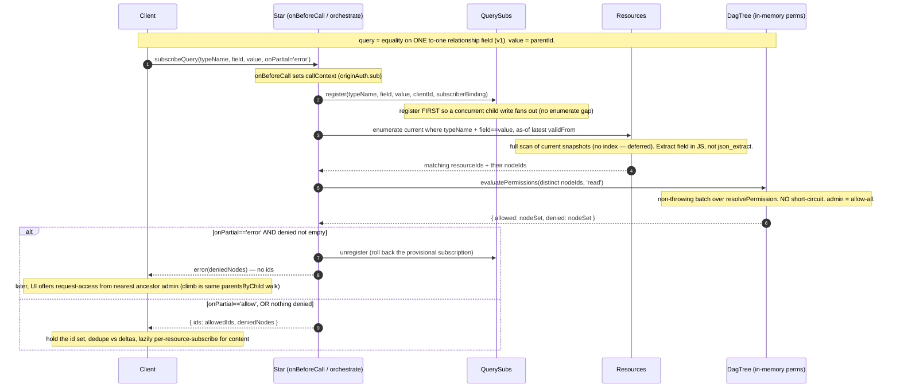
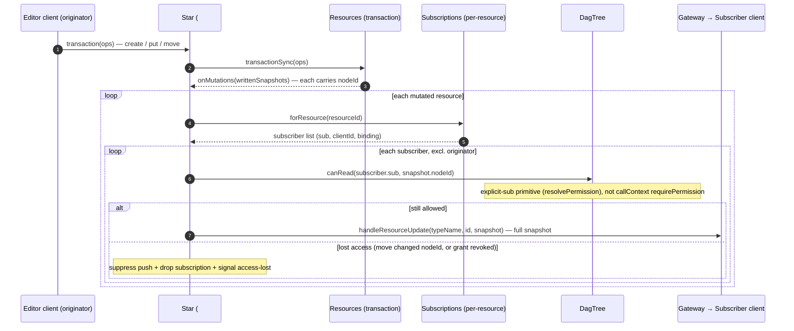
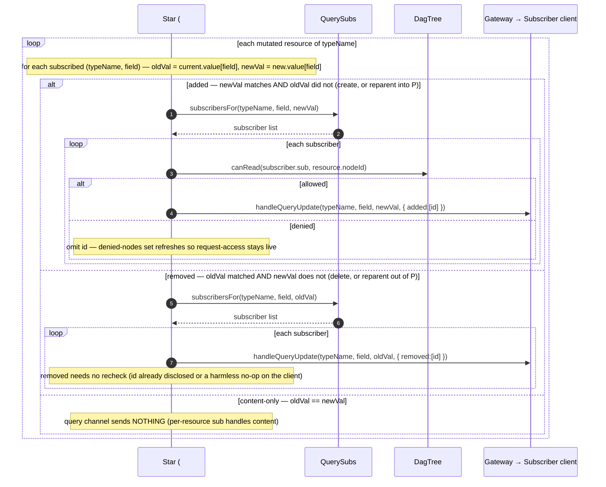
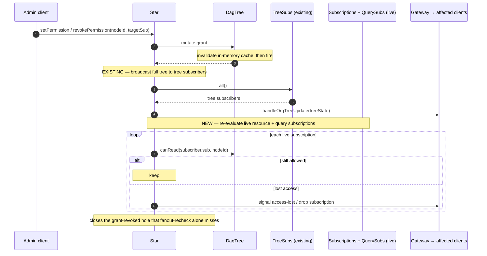

# Nebula — query subscriptions (v1: parent-child)

**Status**: working design doc — opened 2026-06-26. **Sequence-diagram-first** (per `workflow.md`: lead with a participant model + per-flow diagrams when a multi-node fanout design is tangled; nail the cast + flows *with the reviewer* before prose). **This file is intentionally incomplete:** it holds only the motivation, the cast, and the flow diagrams. **Decisions, table schema, the permission-API shape, the client-side handle, and the build phases are deliberately withheld until the diagrams below are approved.** Once approved, this becomes a normal build task file (decisions table + phases added, then `/review-task` → `/build-task`) and archives to `tasks/archive/` on landing — the user-facing subset of these diagrams may graduate to `website/docs/nebula/`.

---

## Motivation

We want to subscribe to a **query across Resources**, not just a single Resource. The first concrete need is **parent-child**.

- **Why not client-side?** The browser-only alternative makes the **parent hold all its children** (a to-many array on the parent). That array grows huge, and every child add **rewrites the whole array** → write amplification on the 1000×-expensive op + an eTag **hotspot** on the parent.
- **Invert it (3NF).** Children point to their parent via a **to-one relationship field**. The parent's collection becomes **derived by query, never stored**. Each child write is one small, independent write — no parent hotspot.
- **v1 supports exactly one query form:** equality on one to-one relationship field (`field == value`; `value` = the parent id). The name **"query subscription"** is chosen to be forward-compatible — the full MongoDB-like query engine comes later, generalizing `field == value` to arbitrary predicates.
- **Fanout sends id deltas only** (`{ added, removed }`). The client merges the membership set and **lazily per-resource-subscribes** for content (the existing single-resource path). No resource bodies on the query channel.

### The two axes (the clarity the diagrams force out)

These are **independent** and must never be conflated:

| Axis | What it is | Changed by | Governs |
|---|---|---|---|
| **Relationship field** (e.g. `child.parent`) | the ontology to-one FK we subscribe on | a `put` that edits the field | **query membership** (add/remove deltas) |
| **`nodeId`** (DAG/org-tree node) | the resource's permission scope | a `move` op | **permission** (who may see it) |

A `put` that changes the parent field changes *membership* but not permission scope. A `move` changes *permission scope* but not membership. The diagrams keep these on separate channels on purpose.

---

## Context — what exists today (grounding for the diagrams)

- **Single-resource subscribe:** `Subscribers(resourceId, clientId, …)` registry ([subscriptions.ts:44](../apps/nebula/src/subscriptions.ts)). On commit, `Resources.transaction` fires `onMutations(writtenSnapshots)` ([resources.ts:545](../apps/nebula/src/resources.ts)) → `Star.#broadcast` ([star.ts:675](../apps/nebula/src/star.ts)) looks up `forResource(id)` and ships the **full snapshot** via `svc.broadcast`.
- **Ontology relationships:** to-one / to-many relationship metadata is extracted and carried on the compiled ontology version ([extract-type-metadata.ts](../packages/ts-runtime-parser-validator/src/extract-type-metadata.ts), [galaxy.ts:109](../apps/nebula/src/galaxy.ts)). There is **no first-class parent-child** concept — just relationships. The FK lives **inside the structured-clone value**, not extracted or indexed.
- **Permission:** `DagTree` holds the org tree + grants **in memory** (`#_cached`/`#_view`, [dag-tree.ts:28](../apps/nebula/src/dag-tree.ts)); checks are memory walks. `requirePermission(nodeId, tier)` **throws** ([dag-tree.ts:152](../apps/nebula/src/dag-tree.ts)) over a non-throwing `resolvePermission(view, sub, nodeId, tier): boolean`. Permission is **per-node**; admins (`claims.access.admin`) allow-all. `#onDagChanged()` already broadcasts the full tree to tree-subscribers on every grant mutation ([star.ts:641](../apps/nebula/src/star.ts)).
- **Known gap being closed here (Open Q2):** fanout does **not** re-check permission per push ([star.ts:658](../apps/nebula/src/star.ts) — "accepted for demo"). We close it.
- **Index for enumeration: deferred.** Full scans are fine for now (reads are cheap in a DO; writes are ~1000× more expensive). The query/index layer must depend on the **ontology semantic model**, never on the storage serialization — so the parent id is extracted in **JS at write time**, never via `json_extract` over the structured-clone blob.

---

## Cast (participants)

| Participant | What it is |
|---|---|
| **Client** | `NebulaClient` in the browser. Holds subscriptions + refcounts, merges id deltas into a membership set, lazily per-resource-subscribes for content. |
| **Gateway** | Per-client fanout transport. `svc.broadcast` targets route to `{ subscriberBinding, clientId }`. |
| **Star** | The data DO. `onBeforeCall` (callContext), `doTransaction`, `#broadcast`; hosts the registries + DagTree. |
| **Resources** | Snapshot store inside Star: `transaction` / `#writeSnapshot` / enumerate. The write path already reads the **prior** snapshot (`current`), so it has **old + new** value per resource. |
| **Subscriptions** | Existing single-resource `Subscribers` registry. |
| **QuerySubs** | **NEW** query-subscription registry: `(typeName, field, value) → subscribers`. |
| **DagTree** | In-memory permission tree. v1 adds a non-throwing, **no-short-circuit** batch eval (`evaluatePermissions` / `canRead(sub, nodeId)`) over the existing `resolvePermission`. |

> Mermaid convention: solid `->>` = call / one-way message (incl. server→client push, per ADR-003); dashed `-->>` = return / callback.

---

## Flow 1 — Subscribe to a query + initial enumeration (with `onPartial`)

---

## Flow 2 — Content fanout with per-id permission recheck (closes Open Q2)

This is the **existing single-resource** channel, now rechecking permission on every push.

---

## Flow 3 — Query membership delta (ids only)

Same commit, the **new** channel. `onMutations` carries **old + new** value per resource (the write path already reads `current`).

---

## Flow 4 — Grant change → re-evaluate live subscriptions (closes the revocation hole)

Recheck-on-fanout (Flow 2) misses revocation when the resource never changes again. This rides the **existing** `#onDagChanged` hook.

---

## Held — pending diagram approval

Filled in only after the flows above are signed off (listed so nothing is forgotten, **not** decided here):

- **Decisions table** — already-agreed: `onPartial: 'error' | 'allow'` (default `'error'`); close Open Q2 (recheck the existing single-resource fanout too); defer the enumeration index; accept "child of P" disclosure (gate is the per-id subscribe). To be formalized as Decision rows.
- **v1 scope** — equality on one to-one relationship field; field validated against the ontology `relationships` metadata at subscribe time.
- **`QuerySubs` table** schema + lookup keys.
- **DagTree** batch permission API (`evaluatePermissions` / `canRead(sub, nodeId)`) — the non-throwing, no-short-circuit shape.
- **Client-side** query-subscription handle, refcount, membership-set merge, lazy per-resource subscribe.
- **`getOntology()` seam widening** — Child 1 (`tasks/archive/nebula-devstudio-data-plane.md`) pins the data-plane capability's ontology-provider seam to `{ version, facet }` (no standalone relationship data — it's baked into the compiled facet, and Child 1 has no reader). **Child 2 is the first reader:** widen the seam to `{ version, facet, relationships }` (the `relationships` field on `OntologyVersionRow`, `galaxy.ts:38`) so the subscribed to-one field can be validated against the ontology at `subscribeQuery` time. The same widened seam must be satisfiable by *both* providers — Star's Galaxy-cached one and DevStudio's platform-constant one.
- **Build phases.**
- **Open sub-questions:** live-delta denied-notice vs silent-filter; drop-vs-skip subscription on lost access; whether tree-change re-eval should scope to affected nodes (optimization) vs re-evaluate all live subs.
