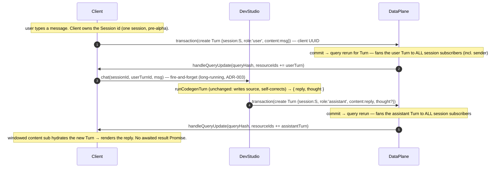
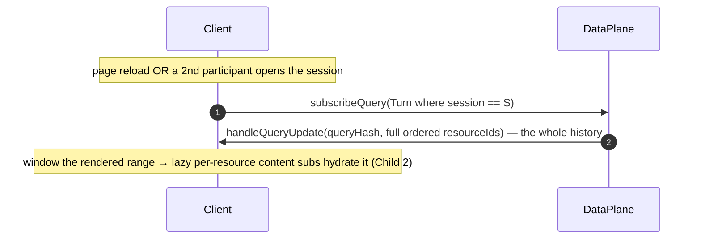
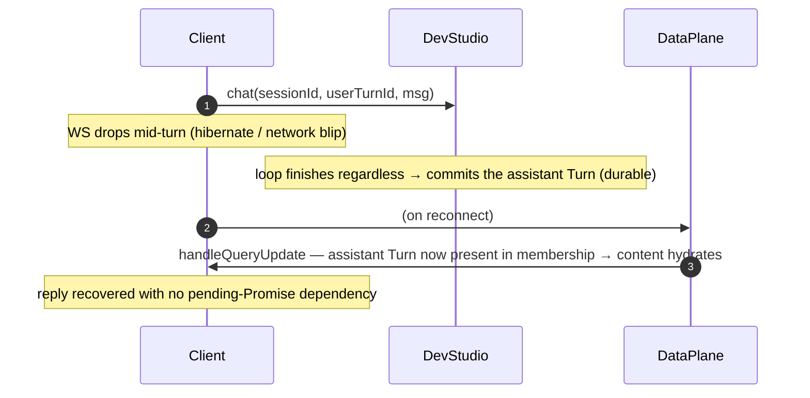

# Nebula — reactive AI chat (Child 3)

**Status**: **FIRST DRAFT (2026-06-30) — NOT reviewed.** Needs `/review-task` (Stage 1 framing + Stage 2 conformance). Per the sequence-diagram-first convention, the **cast + flows below must be nailed with Larry first**, then the prose/phases realigned. **Child 3** of the multi-user chat thread ([`nebula-pre-alpha.md`](nebula-pre-alpha.md) § Current focus); **builds on Child 1** ([`tasks/archive/nebula-devstudio-data-plane.md`](archive/nebula-devstudio-data-plane.md), the composable `ResourceDataPlane` on DevStudio + the platform-fixed `Session`/`Turn` ontology) and **Child 2** ([`tasks/archive/nebula-query-subscriptions.md`](archive/nebula-query-subscriptions.md), `subscribeQuery` over `Turn where session == {id}`).

> ⚠️ **Draft authored by the assistant from the pre-alpha design notes + the current chat code — it carries proposed decisions (Dx) the assistant inferred, not yet confirmed by Larry.** Treat every "proposed" Dx and every Open Question as live until review. The diagrams are a starting cast, not the pinned model.

---

## Motivation

Today a chat turn is an **in-memory pending Promise** on the client (`NebulaClient.chat` → `#pendingTurns`, settled by the `onChatResult` direct-delivery push) and is **recorded only to Galaxy** (`DevStudio.#recordTurn` → `Galaxy.recordTurn`, the eval corpus). That gives three failure modes the pre-alpha loop hits:

1. **No history-restore on refresh** — the pending map lives in JS memory; a page reload loses the conversation (`#pendingTurns` comment, nebula-client.ts).
2. **Completed-while-disconnected loss / "thinking forever"** — a turn runs for minutes; if the WS drops and the `onChatResult` push is missed, the reply is stranded (the resilient-turn-delivery work softened this with direct delivery, but the reply is still ephemeral).
3. **No multi-participant** — a second client (a coach / UX designer now; teammates later) can't see the conversation.

**The fix (pinned with Larry 2026-06-29):** model **each chat turn as a `Turn` Resource FK'd to a `Session`** (parent), hosted on **DevStudio's** data plane, and let a **single query subscription** (`Turn where session == {id}`, the Child-2 `field == value` form) be the delivery + history channel. A committed assistant `Turn` is durable and reactive — refresh re-subscribes and replays it, a missed push is repaired by the query rerun, and every session subscriber sees it. This also **relocates chat off Galaxy** onto the per-app DevStudio where it belongs.

---

## What already exists (Child 1 + Child 2 — do NOT rebuild)

- **DevStudio hosts Resources** via the composed `ResourceDataPlane` (`dev-studio.ts onStart`): `transaction`/`read`/`subscribe`/`unsubscribe`/`subscribeQuery`/`unsubscribeQuery` + the DAG (`dagTree()`), all `@mesh()` non-admin + DAG-gated (D4 of Child 1).
- **The `Session`/`Turn` ontology** is the platform-fixed constant compiled on DevStudio (`devstudio-resource-ontology.ts`): `Session { title }`, `Turn { session: Session; role: string; content: string }` — `Turn.session` is the to-one FK Child 2 subscribes on. **Survives app-data wipes** (NOT in the `.dev` Star). Editing it is a breaking change → bump `SESSION_TURN_ONTOLOGY_VERSION` + wipe DevStudio's resource snapshots.
- **Query subscriptions** (Child 2): `client.resources.subscribeQuery({ queryType:'parentChild', typeName:'Turn', field:'session', value: sessionId })` → ordered membership (`validFrom, resourceId`), windowed lazy per-resource content, per-id permission recheck, reruns on commit + grant change.
- **The codegen loop** (`DevStudio.runCodegenTurn` / `chat`) — writes source, self-corrects, returns `{ reply, thought }`. **Unchanged by this work** except where its output is written (a `Turn` Resource instead of / in addition to the ephemeral push).

---

## Cast (participants)

| Participant | What it is |
|---|---|
| **Client** | `NebulaClient` (browser), `resourceHostBinding: 'DEV_STUDIO'`. Subscribes the session query, **creates the user `Turn`**, renders the ordered turn list (windowed content), fires the codegen kick. A coach/UX-designer client is just another subscriber. |
| **DevStudio** | The `{u}.{g}.dev` DO. Hosts the `Session`/`Turn` Resources (composed `ResourceDataPlane`), runs the codegen loop, and **writes the assistant `Turn`** (+ a pending placeholder, if D-pending). |
| **DataPlane** | The `ResourceDataPlane` capability inside DevStudio (Child 1/2) — `Resources` + `QuerySubs` + fanout. The transaction/rerun machinery is reused as-is. |
| **Galaxy** | The eval-corpus store (`TurnRecord` via `recordTurn`). **Open: stays as the corpus, or is subsumed by the `Turn` Resource — D-corpus.** |
| **Model** | Workers AI behind `DevStudio.callModel` (model-agnostic; never surfaced). Unchanged. |

> Mermaid convention (same as Child 2): solid `->>` = call / one-way message (incl. server→client push); dashed `-->>` = return / callback. The Gateway is omitted (invariant transport). A `DataPlane->>Client` push is the Child-2 `handleQueryUpdate` / `handleResourceUpdate` ride.

---

## Flow A — Send a message + reactive reply

## Flow B — History restore on refresh / late join (no special path)

## Flow C — Completed-while-disconnected (the "thinking forever" fix)

---

## Decisions (PROPOSED — confirm in review)

| # | Decision | Proposed choice | Rationale / to confirm |
|---|---|---|---|
| D1 | Turn = Resource | Each chat turn is a `Turn` Resource on DevStudio, FK'd to a `Session`; user msg = `role:'user'`, reply = `role:'assistant'`. | Pinned 2026-06-29 (turn = child Resource FK'd to Session). |
| D2 | Delivery = the query sub | The reply arrives as a `Turn` via `subscribeQuery(Turn where session==S)`, NOT a bespoke `onChatResult` Promise. The in-memory `#pendingTurns` becomes an optional optimistic-echo, not the source of truth. | Gives history-restore + disconnect-recovery + multi-participant for free; closes the chat hang structurally. |
| D3 | Who writes which Turn | **Client** creates the **user** Turn (a transaction); **DevStudio** creates the **assistant** Turn (server-side, after the loop). | Both ride the same Session query; sender sees its own user Turn via the rerun (or an optimistic local echo — D-echo). |
| D4 | Session entity now | A `Session` Resource exists now; turns FK to it. Pre-alpha ships **one session, no management UI**; the model accommodates many. | Pinned 2026-06-29 — avoids a post-deploy turn-FK migration (one-way door). |
| D5 | Participants = DAG grants | Membership/visibility = DAG grants on the Turns' node(s); the Child-2 per-id recheck already enforces them. `Session` may **denormalize a display list** only (not a second permission model). | Pinned 2026-06-29. |
| D6 | Relocate off Galaxy | The user-facing conversation lives on DevStudio as Resources, not recorded-to-Galaxy-only. | Pinned 2026-06-29 (fix the `dev-studio.ts` recordTurn storage mistake). |

## Open questions (genuinely open — resolve in review)

- **D-corpus — `Turn` Resource vs Galaxy `TurnRecord`.** The eval corpus (`TurnRecord`: `systemPrompt`, `toolCalls`, `reasoning`, `validate`, `model`) has a different shape than a chat `Turn` (`role`, `content`). Does the `Turn` Resource **subsume** the corpus (then the eval suite reads DevStudio Resources), do they **coexist** (chat `Turn` on DevStudio for the UI + `TurnRecord` on Galaxy for cross-app eval, maybe FK-linked), or does the corpus stay on Galaxy untouched and only the *conversation* moves? "Relocate off Galaxy" (D6) reads as the latter for the conversation — confirm the corpus's fate separately.
- **D-pending — in-flight "thinking…" turn.** Create the assistant `Turn` up-front in a `pending` state and `put` it to `complete` on finish (reactive thinking→reply, but needs a `status` field + an extra write + an eTag), or create it only at completion (simpler; the client shows a local spinner keyed off its fired `chat`)? Affects the ontology + the conflict/eTag story.
- **D-ontology — enrichment.** Carrying `thought`/`reasoning`, a `status`, an `error`, or a `model` on `Turn` requires editing the platform-fixed `Session`/`Turn` ontology → a `SESSION_TURN_ONTOLOGY_VERSION` bump + a DevStudio resource-snapshot wipe (Child 1 n1). Enumerate the fields once so it's a single breaking bump.
- **D-session-id — creation + discovery.** Where does the single Session's id come from (a fixed per-sandbox constant? a `Session` Resource created lazily on first chat? client- or server-supplied)? How does a late-joining client discover it to subscribe? (Pre-alpha one-session simplifies this, but the id must be stable + discoverable.)
- **D-echo — optimistic user-Turn echo.** Does the sender optimistically render its own user Turn before the rerun confirms (the existing optimistic-write path), or wait for the fanout? Interacts with the engine's optimistic/rollback machinery.
- **D-streaming — token streaming.** At-completion assistant Turn (pre-alpha) vs streamed updates (a `Turn` `put` per chunk → many writes + many reruns). Almost certainly **defer streaming**; confirm.
- **D-error-turn.** A failed/non-clean codegen finish — surfaced as an `assistant` Turn with an error/status, or out-of-band? (Today `chat` returns a non-clean `reply`.)
- **Multi-participant concurrency.** Two clients posting to one Session interleave fine (independent Turn creates, no shared eTag). Confirm no Session-level write contention (the denormalized display list, if any, would be a hotspot — D5 says "may denormalize," weigh against the eTag-hotspot lesson from Child 2's motivation).
- **Cost of per-turn writes.** Each turn = a Resource create (~1000× a read in DO SQLite). A long conversation = many writes. Acceptable at pre-alpha scale; note it.

---

## Build phases (DRAFT — re-derive after the flows are pinned)

Each phase independently testable on DevStudio via a real `NebulaClient` (`resourceHostBinding:'DEV_STUDIO'`), mirroring the Child-2 e2e harness.

- **Phase 0 — Ontology enrichment (if D-ontology adds fields).** Add the agreed `Turn`/`Session` fields, bump `SESSION_TURN_ONTOLOGY_VERSION`, confirm the wipe path. *Success:* a `Turn` with the new fields validates; version stamped server-side.
- **Phase 1 — Session creation + discovery (D4/D-session-id).** Establish the one Session + a stable, discoverable id. *Success:* a fresh sandbox yields a Session a client can subscribe `Turn where session==S` against.
- **Phase 2 — `DevStudio.chat` writes the assistant Turn (D1/D2/D3/D6).** After `runCodegenTurn`, create the assistant `Turn` Resource (replacing/augmenting the Galaxy-only record per D-corpus). *Success (capable-of-failing):* a committed assistant `Turn` appears for the session; a client subscribed to the query receives it via the rerun (no `onChatResult` dependency).
- **Phase 3 — Client posts the user Turn + kicks codegen (D3/D-echo).** `client.chat(message)` creates the user `Turn` then fires `DevStudio.chat`. *Success:* sender and a 2nd subscriber both see the user Turn in order.
- **Phase 4 — Disconnect-recovery + history-restore e2e (Flow B/C).** Two-client e2e: post → drop WS → reconnect → reply recovered via the query sub; reload → full history restored. *Success:* no "thinking forever"; ordered history after refresh.
- **Phase 5 — Multi-participant + the chat-hang retirement.** A coach client joins mid-session, sees history + live turns; remove the ephemeral-only delivery path (or demote it to an optimization). *Success:* 2+ participants converge; the known hang can't recur (reply is Resource-backed).

### Final verification (every phase)
- `npx vitest run` (pool-workers) green + `tsc --noEmit` clean; capable-of-failing assertions mutation-verified.
- Reuses the Child-2 capability unchanged (no new query/recheck logic) — this is wiring the chat loop onto the substrate, not extending it.
- Nuggets → `nebula-pre-alpha.md`; archive on landing.
