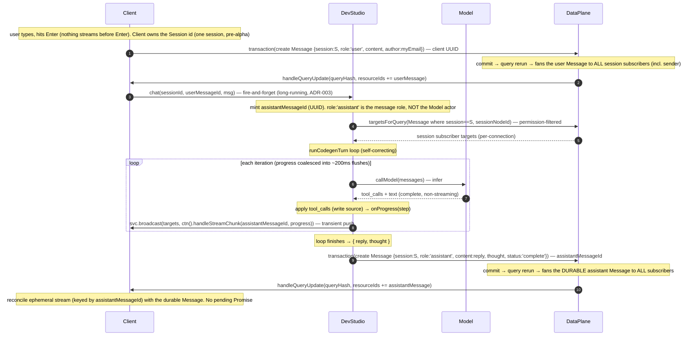
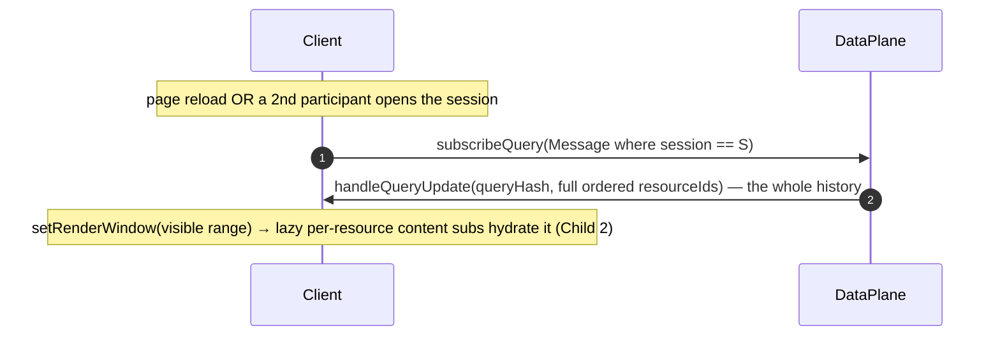
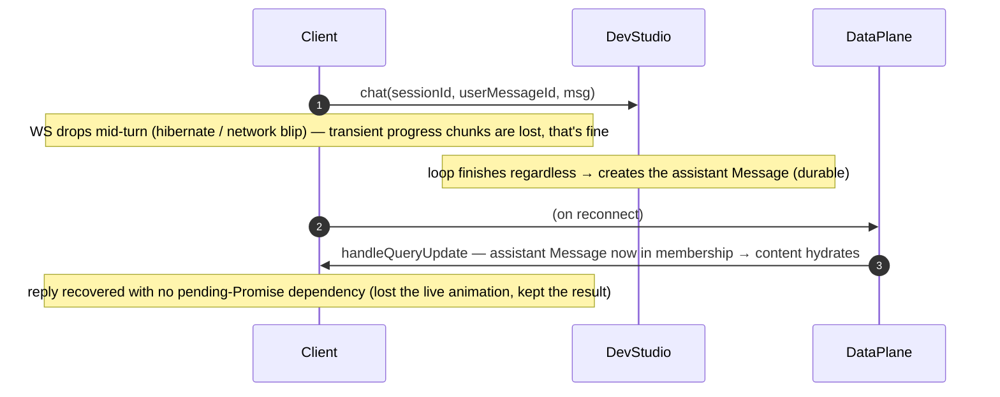

# Nebula — reactive AI chat (Child 3)

**Status**: **REVIEWED — Stage-1 (live with Larry) + Stage-2 conformance panel both done 2026-07-01.** Stage-2 (architecture/mesh, security, test-strategy) raised 0 blockers / 5 majors / 2 minors / 2 nits, all resolved into the decisions + phases below (M1 single-node pin, M5 ordering, M2 emit-seam/testability split, M3 transient-surface assertions, M4 per-operand accessor tests, m1/m2/n1/n2 folded in). `targetsForQuery` accessor already shipped. **Phases 0–3 are build-ready** (D-session-id pinned 2026-07-01 → D-session). Still open but NON-blocking for 0–3: **D-corpus** (Galaxy eval-corpus fate — leave untouched for now, move only the conversation) and **D-echo** (Phase 4; default wait-for-fanout). **Child 3** of the multi-user chat thread ([`nebula-pre-alpha.md`](nebula-pre-alpha.md) § Current focus); **builds on Child 1** ([`tasks/archive/nebula-devstudio-data-plane.md`](archive/nebula-devstudio-data-plane.md), the composable `ResourceDataPlane` on DevStudio + the platform-fixed ontology) and **Child 2** ([`tasks/archive/nebula-query-subscriptions.md`](archive/nebula-query-subscriptions.md), `subscribeQuery` over `Message where session == {id}` + windowed lazy content subs with grace).

> **Naming note (pinned 2026-07-01): `Turn` → `Message`.** The chat unit is renamed `Turn` → **`Message`** everywhere in this doc + the ontology. "Message" + a `role` field is the dominant-ecosystem convention (Anthropic/OpenAI messages array), and the record was always message-shaped (one `role` per row, never a round-trip) — multi-participant just makes "Turn" an obvious misnomer. **No prod migration**: Child 1/2 were never deployed, so there's no snapshot data anywhere — it's a pure source+test rename + a version-constant rename (`SESSION_TURN_ONTOLOGY_VERSION` → `SESSION_MESSAGE_ONTOLOGY_VERSION`). The parent stays **`Session`**. Distinct concept, keep its name: Galaxy's eval-corpus `TurnRecord`/`recordTurn` genuinely *is* a full generate-cycle "turn" (systemPrompt/toolCalls/reasoning) — letting the two names diverge is correct (partially pre-answers **D-corpus**).

---

## Motivation

Today a chat turn is an **in-memory pending Promise** on the client (`NebulaClient.chat` → `#pendingTurns`, settled by the `onChatResult` direct-delivery push) and is **recorded only to Galaxy** (`DevStudio.#recordTurn` → `Galaxy.recordTurn`, the eval corpus). Three failure modes the pre-alpha loop hits:

1. **No history-restore on refresh** — the pending map lives in JS memory; a reload loses the conversation.
2. **Completed-while-disconnected loss / "thinking forever"** — a turn runs for minutes; if the WS drops and the `onChatResult` push is missed, the reply is stranded (direct delivery softened this, but the reply is still ephemeral).
3. **No multi-participant** — a second client (a coach / UX designer now; teammates later) can't see the conversation.

**The fix (pinned with Larry 2026-06-29 / refined 2026-07-01):** model **each chat message as a `Message` Resource FK'd to a `Session`** (parent), hosted on **DevStudio's** data plane, and let a **single query subscription** (`Message where session == {id}`, the Child-2 `field == value` form) be the durable delivery + history channel. A committed `Message` is durable and reactive — refresh re-subscribes and replays it, a missed push is repaired by the query rerun, and every session subscriber sees it. The assistant's **live progress** rides a *separate, transient* direct-delivery push (**option (b)** below), so nothing depends on request/response across the client connection (ADR-003). This also **relocates chat off Galaxy** onto the per-app DevStudio where it belongs.

---

## What already exists (Child 1 + Child 2 — do NOT rebuild)

- **DevStudio hosts Resources** via the composed `ResourceDataPlane` (`dev-studio.ts onStart`): `transaction`/`read`/`subscribe`/`unsubscribe`/`subscribeQuery`/`unsubscribeQuery` + the DAG (`dagTree()`), all `@mesh()` non-admin + DAG-gated (Child-1 D4).
- **The `Session`/`Message` ontology** is the platform-fixed constant compiled on DevStudio (`devstudio-resource-ontology.ts`; currently authored as `Session`/`Turn` → renamed here). `Turn.session` (→ `Message.session`) is the to-one FK Child 2 subscribes on. **Survives app-data wipes** (NOT in the `.dev` Star). Editing it is a breaking change → bump the ontology-version constant + wipe DevStudio's resource snapshots. **Never deployed → the wipe/bump is moot for the rename** (there's no data), but the field enrichments below are still a single deliberate version bump.
- **Query subscriptions** (Child 2): `client.resources.subscribeQuery({ queryType:'parentChild', typeName:'Message', field:'session', value: sessionId })` → ordered membership (`validFrom, resourceId`), **windowed lazy per-resource content subs with grace**, per-id permission recheck, reruns on commit + grant change.
- **Windowed content subs** (Child 2, `nebula-client.ts`): the query sub delivers the full ordered **id** list; content subs open only for a `setRenderWindow(visibleIds)` range; a scrolled-off id is released after a **2000ms grace** (`renderGraceMs`) so scroll-bounce keeps the sub live with no re-subscribe RTT. **Gotcha: `desiredWindow` starts empty — if the UI never calls `setRenderWindow`, NO content hydrates.** So the render component is required, not polish.
- **The codegen loop** (`DevStudio.runCodegenTurn` / `chat`) — a bounded self-correcting **tool** loop that writes source, self-corrects, returns `{ reply, thought }`. **This work adds ONE seam: an `onProgress` callback on `CodegenLoopDeps`** (it emits nothing today — [codegen-loop.ts:140](../apps/nebula/src/codegen-loop.ts:140)); otherwise unchanged except where its output is written (a `Message` Resource). **Note:** `callModel` is a single awaited `env.AI.run(...)` (non-streaming), and `reply` is a *synthesized status string* — the model writes source via tools, not prose. `chat` is **wrangler-dev-only** (container + `env.AI`), so Phase 3 drives the stream via a synthetic-progress harness in pool-workers. See the streaming finding below.

---

## ⚠️ Streaming finding (2026-07-01) — what actually streams is *progress*, not tokens

`callModel` returns the complete response in one awaited call ([dev-studio.ts:655](../apps/nebula/src/dev-studio.ts:655)); the user-facing `reply` is synthesized from the loop outcome ([dev-studio.ts:383](../apps/nebula/src/dev-studio.ts:383)), not model prose (system prompt: "do not output code in your reply", [dev-studio.ts:113](../apps/nebula/src/dev-studio.ts:113)). So **there are no reply tokens to stream today.** What the loop *does* have is discrete **progress/thought steps** (each self-correction iteration, each file written) — the natural streamable content for codegen UX ("writing App.vue… fixing type error… done"), aligned with the model-agnostic thought-process view ([[studio-model-agnostic-naming]]). **Pre-alpha streams progress/thought events**, via option (b). **Token-level prose streaming is deferred** — it needs `callModel` switched to streaming mode and is a poor fit for a tool-driven codegen loop anyway; revisit if/when a non-codegen chat surface needs it.

---

## Cast (participants)

| Participant | What it is |
|---|---|
| **Client** | `NebulaClient` (browser), `resourceHostBinding: 'DEV_STUDIO'`. Subscribes the session query, **creates the user `Message`** (atomic, on Enter), renders the ordered list (windowed content driven by the viewport), fires the codegen kick, and holds an **ephemeral streaming view** it reconciles against the durable assistant `Message`. A coach/UX-designer client is just another subscriber. |
| **DevStudio** | The `{u}.{g}.dev` DO. Hosts the `Session`/`Message` Resources (composed `ResourceDataPlane`), runs the codegen loop, **pushes live progress** to session subscribers via `this.svc.broadcast`, and **creates the assistant `Message`** at completion. |
| **DataPlane** | The `ResourceDataPlane` capability inside DevStudio (Child 1/2) — `Resources` + `QuerySubs` + fanout. Reused as-is, **plus** a new **targeting accessor** (`targetsForQuery`/`targetsForResource`, permission-filtered) so the host can `svc.broadcast` to a subscriber set without re-implementing target computation or the permission recheck. The capability still has **no `this.lmz`/`this.ctn`** — it returns targets; the host delivers. |
| **Model** | The inference engine `DevStudio.callModel` calls (Workers AI; model-agnostic — the *name* is never surfaced, but "Model" is the actor term). Non-streaming: one awaited call returns the complete response. **Appears as an actor in Flow A** (the codegen loop's inference calls). NB: `assistant` is NOT this actor — it is only the message `role` string (`role:'assistant'`, `assistantMessageId`), the Anthropic/OpenAI wire convention. |
| **Galaxy** | **Not a chat-flow participant** — D6 relocated the conversation off Galaxy. Its only remaining tie is the eval corpus (`TurnRecord` via `recordTurn`), whose fate is the open **D-corpus** question; Galaxy re-enters a flow (a dashed `recordTurn` step) only if D-corpus keeps a corpus. Listed here to explain its *absence* from the flows, not as an active actor. |

> Mermaid convention (same as Child 2): solid `->>` = call / one-way message (incl. server→client push); dashed `-->>` = return / callback. Gateway omitted (invariant transport). A **`ctn().method(...)`** in a step is a **continuation descriptor** — built on the sender now, executed on the *recipient* on receipt — NOT a local call whose return feeds the enclosing `svc.broadcast`/`lmz.call` (the full form is `this.ctn<TargetType>().method(...)`).

## Flow A — Send a message + reactive reply (option (b): transient progress stream + durable final Message)

```mermaid
sequenceDiagram
    autonumber
    participant Client
    participant DevStudio
    participant Model
    participant DataPlane

    Note over Client: user types, hits Enter (nothing streams before Enter). Client owns the Session id (one session, pre-alpha)
    Client->>DataPlane: transaction(create Message {session:S, role:'user', content, author:myEmail}) — client UUID
    Note over DataPlane: commit → query rerun → fans the user Message to ALL session subscribers (incl. sender)
    DataPlane->>Client: handleQueryUpdate(queryHash, resourceIds += userMessage)
    Client->>DevStudio: chat(sessionId, userMessageId, msg) — fire-and-forget (long-running, ADR-003)
    Note over DevStudio: mint assistantMessageId (UUID). role:'assistant' is the message role, NOT the Model actor
    DevStudio->>DataPlane: targetsForQuery(Message where session==S, sessionNodeId) — permission-filtered
    DataPlane-->>DevStudio: session subscriber targets (per-connection)
    Note over DevStudio: runCodegenTurn loop (self-correcting)
    loop each iteration (progress coalesced into ~200ms flushes)
        DevStudio->>Model: callModel(messages) — infer
        Model-->>DevStudio: tool_calls + text (complete, non-streaming)
        Note over DevStudio: apply tool_calls (write source) → onProgress(step)
        DevStudio->>Client: svc.broadcast(targets, ctn().handleStreamChunk(assistantMessageId, progress)) — transient push
    end
    Note over DevStudio: loop finishes → { reply, thought }
    DevStudio->>DataPlane: transaction(create Message {session:S, role:'assistant', content:reply, thought, status:'complete'}) — assistantMessageId
    Note over DataPlane: commit → query rerun → fans the DURABLE assistant Message to ALL subscribers
    DataPlane->>Client: handleQueryUpdate(queryHash, resourceIds += assistantMessage)
    Note over Client: reconcile ephemeral stream (keyed by assistantMessageId) with the durable Message. No pending Promise
```

## Flow B — History restore on refresh / late join (no special path)

```mermaid
sequenceDiagram
    autonumber
    participant Client
    participant DataPlane

    Note over Client: page reload OR a 2nd participant opens the session
    Client->>DataPlane: subscribeQuery(Message where session == S)
    DataPlane->>Client: handleQueryUpdate(queryHash, full ordered resourceIds) — the whole history
    Note over Client: setRenderWindow(visible range) → lazy per-resource content subs hydrate it (Child 2)
```

## Flow C — Completed-while-disconnected (the "thinking forever" fix)

```mermaid
sequenceDiagram
    autonumber
    participant Client
    participant DevStudio
    participant DataPlane

    Client->>DevStudio: chat(sessionId, userMessageId, msg)
    Note over Client: WS drops mid-turn (hibernate / network blip) — transient progress chunks are lost, that's fine
    Note over DevStudio: loop finishes regardless → creates the assistant Message (durable)
    Client->>DataPlane: (on reconnect) #resubscribeAll re-fires subscribeQuery
    DataPlane->>Client: handleQueryUpdate — assistant Message now in membership → content hydrates
    Note over Client: reply recovered with no pending-Promise dependency (lost the live animation, kept the result)
```

---

## Decisions (PINNED 2026-07-01 unless marked)

| # | Decision | Choice | Rationale |
|---|---|---|---|
| D1 | Message = Resource | Each chat message is a `Message` Resource on DevStudio, FK'd to a `Session`; user msg = `role:'user'`, reply = `role:'assistant'`. | Pinned 2026-06-29. Renamed Turn→Message 2026-07-01. |
| D2 | Delivery = the query sub | The **durable** reply arrives as a `Message` via `subscribeQuery(Message where session==S)`, NOT a bespoke `onChatResult` Promise. `#pendingTurns` retires (or demotes to an optimistic echo). | History-restore + disconnect-recovery + multi-participant for free; closes the chat hang structurally. |
| D3 | Who writes which Message | **Client** creates the **user** Message (atomic, on Enter); **DevStudio** creates the **assistant** Message at loop completion. | Both ride the same Session query. |
| D4 | Session entity now | A `Session` Resource exists now; messages FK to it. Pre-alpha ships **one session, no management UI**; the model accommodates many. | Pinned 2026-06-29 — avoids a post-deploy FK migration (one-way door). |
| D-session | Fixed well-known Session id (pre-alpha) | The single session's id is a **fixed, code-defined constant** (a well-known UUID). The `Session` Resource is **created lazily + idempotently** on first chat (create-if-absent under the session node); the client subscribes `Message where session == <constant>` with **no discovery lookup** — the id is a shared constant, so a fresh/late client knows it. Multi-session (many ids + a session list/discovery surface) is deferred with the management UI (D4). | Resolves the D-session-id creation/discovery half. Stable + discoverable without a lookup; unblocks Phases 1/3. Pinned 2026-07-01 (pre-build). |
| D5 | Participants = DAG grants | Membership/visibility = DAG grants; the Child-2 per-id recheck enforces them (**durable AND transient paths — see D-fanout-accessor**). **Pre-alpha: every Message of a session lives under ONE node (the session's node)** — multi-node-per-session is a non-goal (the future "node(s)" plural is deferred). A Galaxy/Universe admin grants non-admin participants directly via the `access.admin` bypass (no DevStudio root-admin seed needed — see [`nebula-dataplane-root-admin.md`](on-hold/nebula-dataplane-root-admin.md)). | Pinned 2026-06-29 / 2026-07-01. Single-node pin resolves Stage-2 M1. |
| D6 | Relocate off Galaxy | The user-facing conversation lives on DevStudio as Resources, not recorded-to-Galaxy-only. | Pinned 2026-06-29. |
| D-streaming | **Option (b): transient progress stream + one durable write** | The assistant's **live progress/thought** rides `this.svc.broadcast(targets, ctn().handleStreamChunk(assistantMessageId, progress))` — fire-and-forget server→client direct delivery, addressed by stable `clientId`, buffered ~200ms. `handleStreamChunk` on the client **must be `@mesh()`-decorated** (a remotely-dispatched server→client push, like `handleQueryUpdate`/`handleResourceUpdate` — n1). The ~200ms buffer is a **deliberate ephemeral cache** whose loss is acceptable (never persisted — persisting defeats option (b)); the flush timer adds no incremental billing since the codegen loop already awaits `env.AI`. At completion, **one** `create` writes the durable `Message`. Client reconciles the ephemeral stream with the durable Message **by `assistantMessageId`**. | Sidesteps the fanout's no-coalescing chatter entirely (no per-chunk Resource writes/reruns). Disconnect degrades gracefully (lose the animation, keep the result via the query sub). The ADR-003 server→client `call()` dividend. **Streams progress, not tokens** (see finding). |
| D-streaming-fallback | (a) is the fallback | If (b) is messy to build, fall back to streaming *as* debounced Resource `put`s: the same-actor-within-60min server-side debounce ([resources.ts:214](../apps/nebula/src/resources.ts:214)) keyed on `changedBy` (the DevStudio caller's `sub`, orthogonal to the `author` string) collapses subsequent puts **in place** — so a streamed message is a **create row + one collapsing-put row** (not literally "one row"), 1 row-write + 0 index-writes per collapsed put, history un-polluted. But the fanout has **no coalescing** ([resource-data-plane.ts:163](../apps/nebula/src/resource-data-plane.ts:163)), so it needs client-side flush + would benefit from a rerun-coalescing capability fix (backlog). | Recorded so we don't re-derive the debounce facts. (b) is preferred. |
| D-ordering | Order by `(validFrom, resourceId)`; accept the tiebreak | Message order = the capability's `ORDER BY validFrom, resourceId` ([resources.ts:283](../apps/nebula/src/resources.ts:283)). A `validFrom` collision falls to the random-UUID `resourceId` tiebreak → non-chronological. **Accepted for pre-alpha (maybe forever):** distinct chat sends are separate transactions with an advancing pinned-per-invocation clock, so they get distinct `validFrom` — a true collision needs two creates in one invocation, which chat never does (each send is its own client transaction; the assistant create is seconds/minutes later). **Rejected: a client-supplied monotonic ULID ordering field** — clock skew across clients makes it *worse*, and it would change the capability's shared `ORDER BY` (blast radius onto Star). Fast-follow only if a strict total order over co-`validFrom` messages is ever needed. | Resolves Stage-2 M5. Cheaper to pin now than post-deploy (one-way-door class, like D4). |
| D-fanout-accessor | Capability exposes **targeting**, host delivers | **SHIPPED**: `targetsForQuery(query, nodeId)` on `ResourceDataPlane` ([resource-data-plane.ts:130](../apps/nebula/src/resource-data-plane.ts:130)) → the permission-filtered `{bindingName,instanceName}[]` (the `evaluatePermissions` read-recheck, `access.admin`-aware, same as `#broadcastQueries`). The host (DevStudio) delivers via `this.svc.broadcast(targets, …)`. **The recheck is NOT optional** (M1): it's the transient path's point-of-action enforcement (ADR-008), symmetric with the durable `#broadcastQueries` recheck — without it the live stream leaks assistant content to a subscriber denied on the node (a no-op today since chat is admins-only, load-bearing the instant D5 non-admins join). Under the D5 single-node pin the single-`nodeId` form is provably correct (message's node == the session's one node). | Keeps the capability's "no `this.lmz`/`this.ctn`" invariant; avoids re-implementing targeting + the recheck host-side; NOT a generic pub/sub bus. Generalizes to typing indicators / cursors / presence. |
| D-window | Viewport-driven windowed content subs | Wire a coarse viewport-driven `setRenderWindow(visibleIds)` now (the mechanism + 2000ms grace already exist, Child 2). Render all, let old scroll off, but only content-subscribe the visible window (+ buffer). | Re-subscribe cost on reconnect / token-cycle = **N open subs**, not total messages ([nebula-client.ts:763](../apps/nebula/src/nebula-client.ts:763) serial re-fire; Gateway force-closes WS on token expiry). Subscribe-all makes that scale with history; windowing makes it ≈ constant. Barely more work than subscribe-all since windowing is built. |
| D-presence | Streaming targets = the query-subscriber set | Stream to the **per-connection** subscriber set of the session query (via `targetsForQuery`) — **no dedup** (every tab wants the stream). A user-visible "who's here" **roster** is separate: dedup **by `sub`**, denormalize onto `Session` (the D5 display list), a later fast-follow. | No separate presence mechanism needed for (b) — reuse what `QuerySubs` already holds. |
| D-human-no-stream | User messages never stream | Enter sends; nothing before. The user `Message` is a single atomic `create`; only the **assistant** path streams. | Standard convention; simplifies the asymmetry. |
| D-attribution | Attribute by **email** (pre-alpha) | Stamp an `author` field (email) on each `Message` at write time. There is **no profile store** (`Subjects` = `sub,email,emailVerified,adminApproved,isAdmin,timestamps`); the JWT carries **`email`** ([types.ts:50](../packages/nebula-auth/src/types.ts:50)), which is friendlier than the raw `sub` UUID; `changedBy` carries only `sub` and a viewer's JWT can't resolve *another* participant's `sub→email` — so identity must ride on the message (or a roster). **`author` is display-only — NEVER key any authz/visibility off it** (all authz stays on DAG grants + server-derived `changedBy.sub`, [resources.ts:212](../apps/nebula/src/resources.ts:212)); it's spoofable (m1). The "admins-only makes the spoof safe" claim holds because the user-Message `create` is DAG-write-gated ([resources.ts:507](../apps/nebula/src/resources.ts:507)), not merely because `chat()` is admin-gated. Friendly-name + avatar = fast-follow (backlog). | User-friendly enough for pre-alpha; testers won't tolerate UUIDs. |
| D-pending | Fold "thinking…" into `status` | No separate pending-Promise / placeholder decision: a pending assistant message is just a `Message` with `status:'thinking'`/`'streaming'` (or, in (b), a purely local ephemeral view until the durable `create`). | Streaming subsumes D-pending. |

## Resolved in Stage-2 (2026-07-01)

- **Progress-vs-tokens — CONFIRMED.** Pre-alpha streams *progress/thought events* (the reply is a synthesized status, the model call is non-streaming); token-level prose streaming is deferred.
- **Node placement (was part of D-session-id) — PINNED single node per session** (D5) → resolves M1; the `targetsForQuery(query, nodeId)` single-`nodeId` recheck is correct and required.
- **Ordering — PINNED `(validFrom, resourceId)`, accept the tiebreak** (D-ordering) → resolves M5.
- **Streaming target refresh — FROZEN per turn.** Targets are fetched once per turn; a mid-stream joiner misses in-flight chunks but gets the final Message via the query sub + all *future* turns' live progress (m2). Phase 6 wording synced to this (a joiner "sees history + the NEXT turn's live progress", not in-flight chunks of the turn already running).

## Open questions (genuinely open — resolve before "go")

- **D-corpus — `Message` Resource vs Galaxy `TurnRecord`.** The eval corpus (`systemPrompt`, `toolCalls`, `reasoning`, `validate`, `model`) has a different shape than a chat `Message` (`role`, `content`, `author`, `thought`, `status`). Coexist (FK-linked?), subsume, or leave the corpus on Galaxy untouched and move only the conversation? The Turn/Message name split leans "coexist, different concepts."
- **D-echo — optimistic user-Message echo** (Phase 4 concern; does NOT block Phases 0–3). Does the sender optimistically render its own user Message before the rerun confirms, or wait for the fanout? Interacts with the engine's optimistic/rollback machinery. **Pre-alpha default if unresolved at Phase 4: wait for the fanout** (simplest; the rerun is fast); optimistic echo is a later enhancement.
- **D-attribution trustworthiness (hardening fast-follow).** A client-supplied `author` is spoofable; safe now only because the `create` is DAG-write-gated + chat is admins-only. Derive/validate against `originAuth.email` server-side before any non-admin can write a Message.
- **Cost of per-message writes.** Each message = a Resource create (~1000× a read). Acceptable at pre-alpha scale; note it.

---

## Build phases (DRAFT — re-derive after Stage-2 review)

Each phase independently testable on DevStudio via a real `NebulaClient` (`resourceHostBinding:'DEV_STUDIO'`), mirroring the Child-2 e2e harness.

- **Phase 0 — Ontology: `Turn`→`Message` + enrichment.** Rename `Turn`→`Message` across source + tests + the version constant (`SESSION_TURN_ONTOLOGY_VERSION` → `SESSION_MESSAGE_ONTOLOGY_VERSION`) **and the sibling symbols** (`SESSION_TURN_TYPES`, `SESSION_TURN_BUNDLE_ID` — symbol only; the bundle-id *string value* need not change and its M2-disjointness JSDoc stays accurate); add `status` (`thinking|streaming|complete|error`), `thought?`, `author` to `Message`; single ontology-version bump. *Success:* a `Message` with the new fields validates; version stamped server-side; Child-2 query calls updated to `typeName:'Message'` green.
- **Phase 1 — Session creation (D4/D-session).** Lazily + idempotently create the one `Session` Resource at the **fixed well-known id**, under a **single node** (D5), on first chat. *Success:* a fresh sandbox yields (create-if-absent) that Session; a client subscribes `Message where session==<constant>` with no discovery lookup; all its Messages share one `nodeId`; a second create-if-absent is a no-op (idempotent).
- **Phase 2 — DataPlane targeting accessor (D-fanout-accessor) — SHIPPED, add tests.** `targetsForQuery(query, nodeId)` already landed. *Success (capable-of-failing, per-operand mutation-checked — testing.md):* enumerate the compound gate `accessAdmin || resolvePermission` — **(a)** allowed non-admin subscriber present, **(b)** read-denied non-admin absent, **(c)** `accessAdmin` subscriber lacking a direct grant present. Mutation-check EACH operand independently: force `.allowed.size>0` always-true (denied must leak → red) and `Boolean(r.accessAdmin)` false (admin must drop → red).
- **Phase 3 — Assistant progress stream + durable Message (D-streaming/option b).** Add an **`onProgress` seam to `CodegenLoopDeps`** (the loop emits nothing today — M2) and factor progress-broadcast + durable-`create` into a **protected DevStudio method** a test harness drives with a synthetic progress script (mirror the `callModel`/`deliverTurnResult` test seams; real `chat` is wrangler-dev-only — container + `env.AI`). DevStudio mints `assistantMessageId`, buffers loop progress (~200ms flush), `svc.broadcast`s `handleStreamChunk` (`@mesh()`) to `targetsForQuery(sessionQuery, sessionNodeId)`, then `create`s the durable `Message` at completion. *Success — assert the TRANSIENT surface, NOT the self-healing end-state (M3 / testing.md self-heal trap):* **(a)** a subscriber observes ≥1 `handleStreamChunk` for `assistantMessageId` **BEFORE** the durable `handleQueryUpdate` adds it; **(b)** exactly one rendered entry when ephemeral + durable coexist mid-window (reconcile-by-id); **(c)** a subscriber **denied on the assistant node receives ZERO chunks** (M1 transient-recheck). **Mutation-verify** by deleting the by-id reconcile / disabling the stream / forcing the recheck true — each must go red; the durable query rerun alone must NOT satisfy (a)/(c). *Which runs where (testing.md):* the stream/targets/reconcile/durable-create + rerun run in **pool-workers** via the synthetic-progress harness; real `chat` codegen is `it.skip` **wrangler-dev-only**.
- **Phase 4 — Client posts the user Message + kicks codegen (D3/D-human-no-stream/D-echo).** `client.chat(message)` creates the user `Message` (with `author`) then fires `DevStudio.chat`. *Success:* sender and a 2nd subscriber both see the user Message in order; no pre-Enter streaming.
- **Phase 5 — Viewport window wiring (D-window).** Drive `setRenderWindow` from the rendered range (coarse is fine). *Success:* a 100-message session opens ~window-size content subs, not 100; reconnect re-fires ≈ window-size, not 100.
- **Phase 6 — Disconnect-recovery + history-restore + multi-participant e2e (Flow B/C).** Two-client e2e: post → drop WS mid-stream → reconnect → reply recovered via the query sub; reload → full ordered history; a coach client **joins after a turn starts → sees prior history + the NEXT turn's live progress** (NOT in-flight chunks of the turn already running — frozen-per-turn targets, m2). Remove the ephemeral-only delivery path (or demote it). *Success:* no "thinking forever"; ordered history after refresh; the hang can't recur (reply is Resource-backed).

### Final verification (every phase)
- `npx vitest run` (pool-workers) green + `tsc --noEmit` clean. **Capable-of-failing + mutation-verified**, per-operand for compound gates (Phase 2), and **on the transient surface** for the stream/reconcile (Phase 3 — an end-state assertion self-heals via the durable rerun; assert the pre-durable window + mutate to red).
- Reuses the Child-2 capability + windowing unchanged, **plus** the shipped `targetsForQuery` accessor + a new `CodegenLoopDeps.onProgress` seam — wiring the chat loop onto the substrate.
- Nuggets → `nebula-pre-alpha.md`; archive on landing.

## Spun-off backlog items (log during/after build)
- **Capability targeting accessor** (`targetsForQuery`/`targetsForResource`) — built here for streaming; generalizes to typing indicators / cursors / presence pings. Mesh/DataPlane capability feature, Nebula as first consumer.
- **Fanout rerun-coalescing (optional, NOT cheap).** Skip the query-membership rerun when a commit changed only existing-member *content* (not membership) — [resource-data-plane.ts:163](../apps/nebula/src/resource-data-plane.ts:163) fires `#broadcast` + `#rerunQueriesForCommit` unconditionally. Real fanout-core surgery (per-mutation × per-query membership-delta detection, with a correctness trap on create/delete/move). Only needed if we ever pick the (a) fallback; (b) sidesteps it.
- **Profile store (friendly name + avatar) — fast-follow.** No name/avatar exists in `nebula-auth` today. Add a profile store; attribution then resolves `sub→profile`; the D5 roster (dedup by `sub`) is its home + doubles as presence.
