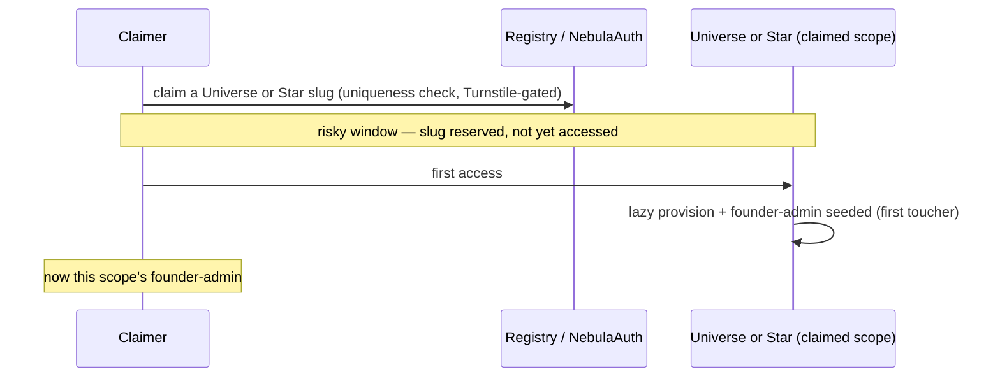
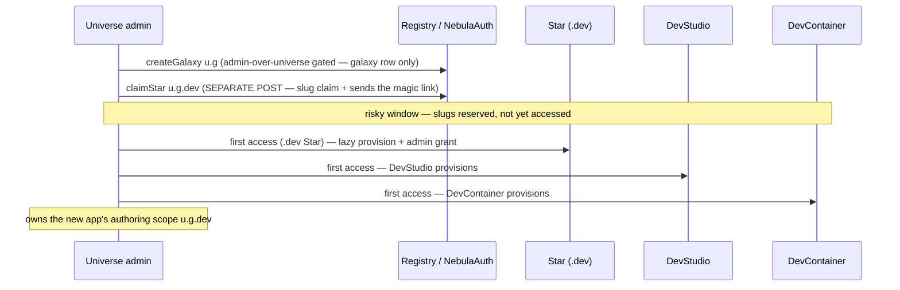

# Nebula Release Process

**Status**: Wave 1 of [`nebula-pre-alpha.md`](nebula-pre-alpha.md) — this is ③, behind ①② (both done). The master plan owns sequencing/provenance. Delivers two things: **(Phase 0)** first-prod-deploy readiness for `apps/nebula` — everything that must be true before a real Cloudflare deploy can serve pre-alpha users (the one-time gates *and* the two builds the deployed Worker needs: serve the Studio SPA; a prod-usable login); **(Phases 1–3)** the reusable Nebula deploy/release flow — git-SHA stamp + a compare-only `/_version` + a bench-staleness guard + `apps/nebula/scripts/deploy.sh`. Scoped to Phases 0–3 for pre-alpha; heavier release-discipline (registry-tarball reproducibility, CI, rollback) → [`on-hold/nebula-release-hardening.md`](on-hold/nebula-release-hardening.md).

> **Review status (2026-06-25): FULLY REVIEWED, BUILD-READY.** `/review-task` framing ×2 + conformance ×2; all findings resolved. **Build in two batches (decided 2026-06-25):** **Batch 1 (do first, locally verifiable, no deploy) = B1 (Assets serving via `run_worker_first` route-list) + the migrations-audit script.** **Batch 2 (with the deploy) = Phases 1–3 (deploy machinery) + B2 (the login swap) + the actual first deploy.** B2 is held to batch 2 because removing `NEBULA_AUTH_TEST_MODE` + the `?_test` button makes *local* manual `dev:studio` login require a real email round-trip — keep the one-click dev button while iterating; do the swap right before exposure. B1's **first step is an Exploratory de-risk spike** (`vite build apps/nebula-studio-ui` over the `@mesh()`-decorated dep — confirm it mounts; fallback = `unplugin-swc` in the build config) — if that spike turns into a debugging rabbit hole, that's expected. ⚠️ **Build code stays sequential/single-writer** (verifier fan-out only — `.claude/rules/workflow.md`).
>
> **🔵 BATCH 2 FINAL REVIEW (2026-06-25) — `/review-task` framing + conformance, Batch-2-scoped.** Design held up; all findings were spec-precision (no design change). **Framing** (10 findings): Phase 2's guard was spec'd against a nonexistent `benchmark.ts:239` + under-covering per-file wiring → **rewritten around the single shared chokepoint `apps/nebula/test/browser/global-setup.ts:56`** (covers both `browser`+`browser-bench` projects); `deploy:test-worker`/`deploy.sh` `--define` factored into one `git-stamp.sh`; redeploy strings repointed; RESULTS criterion → inventory; email-sender path corrected; B2 prod scope + dev-constant pruning pinned. **Conformance** (6 findings): the redeploy-string line-numbers were re-derived from disk (the real bare-deploy strings are the `*.benchmark.ts:3` headers — incl. `throughput.benchmark.ts:3` carrying the **forbidden `--name` form** — not the `npm run bench*` RUN strings); the `audit-test-mode.sh` criterion fixed from "stays green"→"red-today→green-on-removal" + the verify-before-remove routed to `cd packages/nebula-auth && npm test` (root `test:code` aborts on the RED preflight); README cleanup added; ui-smoke discriminators de-vacuumed; `/_version` CORS rationale corrected (real shadow-prevention = `run_worker_first`). Committed `7463c92` (together with the B2 reshape below).
>
> **🟣 B2 RESHAPED to uniform self-provision (2026-06-25, with Larry).** The earlier "operator's own configured Universe + bootstrap-shortcut + hardcoded `acme.app.dev`" framing was an **interim that read as the model** — replaced (see the `interim-unlearning-tax` rule/memory) by the real model, now pinned **in present tense with two sequence diagrams in B2** (Flow A: the slug-claim primitive — Universe *or* Star; Flow B: a Universe admin's create-app): **every actor (real users, tests, you) self-provisions one uniform way** — log in → discovery → (first-run) claim a slug → first access lazily provisions + makes you founder-admin (first-touch root-admin seed in `Star.onBeforeCall`, `star.ts:92` KV-latched; `nebula-auth.ts:1292` first-user-promote — NOT bootstrap-dependent). The hardcoded scope `<PIN>` **dissolved** (discovery resolves it). This round builds **backend + minimal UI**; full discovery/admin UI + **teardown/`test-`-reaper** (`backlog.md:341`) + **Turnstile-ON/automation-bypass** (`backlog.md:381`) are deferred, so the automated self-provision smoke is **untestable-now (accepted)** → manual first-deploy check. The `login↔discovery↔per-scope-token` sequencing is a flagged build-time mechanic. Teardown is **not** specced here (lower-level task) but is a **pre-alpha-completion gate**; its first action = reap `test-`-named scopes.
>
> **🟢 BATCH 1 BUILT (2026-06-25) — committed `cee6ddc`.** (1) De-risk spike **PASSED with no fallback**: `vite build` (1604 modules) + a headless-chromium mount of `dist/` rendered the SPA cleanly (login button, `#app` non-empty, zero pageerror, no `Private field` SyntaxError). *Why it survived:* `unplugin-swc` is registered with no `apply` restriction, so rollup runs SWC on the decorated `@lumenize/*` source during **build** too (`optimizeDeps.exclude` is only the dev-esbuild lever). (2) **m-3 RESOLVED**: CF docs confirm `run_worker_first` `*` is **deep-matching** ("zero or more of any character", spans segments+dots; the `/api/*` example matches `/api/docs/*`) + `!`-negation — so `/dev-container/*` matches the deep dotted preview sub-assets; pinned block used as-is, no `**`. (3) **NEW finding (not in review): wrangler HARD-ERRORS when `assets.directory` is ABSENT** (an EMPTY dir is fine). `dist` is gitignored, so the `wrangler dev` lanes that load the main config (`apps/nebula` `dev` npm script + the `ui-smoke` global-setup) now `mkdir -p ../nebula-studio-ui/dist` first — zero-build, survives fresh checkout; empty assets layer is inert under `wrangler dev` (browser hits vite). (4) **migrations-audit gate** built dependency-free at `apps/nebula/scripts/audit-migrations.mjs` (pure `auditMigrations()` core + CLI; `npm run audit:migrations`) with a **capable-of-failing selftest** (`audit-migrations.selftest.mjs`, `npm run audit:migrations:selftest`) — baseline passes + all task-pinned must-red mutations (a–d) red, plus a parse-not-grep discriminator (NebulaAuth ⊄ NebulaAuthRegistry) and a malformed-JSONC vacuous-pass guard. Files touched: `apps/nebula/wrangler.jsonc` (assets block), `apps/nebula/package.json` (dev mkdir + 2 audit scripts), `apps/nebula/test/ui-smoke/global-setup.ts` (mkdir), 2 new `scripts/*.mjs`. **Deferred to Batch 2:** `deploy.sh` wiring of the gate (Phase 3), first-deploy prod-URL serving checks, B2 login swap.
>
> **🟢 BATCH 2 IN PROGRESS (2026-06-26) — `/build-task`, gating per phase.** Built sequentially in the working tree (not yet committed). **Phase 1 (Version stamp) ✅ built + vitest-green:** `/_version?sha=` compare endpoint as the literal first statement of `entrypoint.fetch` + dev-safe `declare const __GIT_SHA__/__DIRTY__` and `typeof`-guarded `buildSha()`/`buildDirty()` (dev sentinel `'dev'`/`dirty:true`); `__BUILD_TIME__` is stamped by deploy but deliberately unread (no declare). New `test/test-apps/baseline/entrypoint-version.test.ts` (4 tests: dev-safe, compare-only/non-disclosing keys, missing-sha, positive `?sha=dev` anchor) + routing-contract regression both green. Bench `worker/index.ts` got a forward-guard comment (gets `/_version` via the trailing `entrypoint.fetch` fallthrough). **Phase 2 (Bench-staleness guard) ✅ built; deployed-demo deferred to manual run:** `scripts/git-stamp.sh` (single `--define` compute+escape home, verified args), `assertDeployedMatchesHead` guard at the shared `global-setup.ts:56` chokepoint (covers `browser`+`browser-bench`), `deploy:test-worker` npm script (sources git-stamp.sh), node-only `bench-commit-stamp.ts` (`withCommitStamp`) wrapping all 6 `*-deployed.md` writers, and every benchmark header repointed to `npm run deploy:test-worker` (criterion `grep -rn 'wrangler deploy' …/*.benchmark.ts` → empty ✅; the forbidden `--name` deploy form gone). **Phase 3 (deploy flow) ✅ built:** `apps/nebula/scripts/deploy.sh` (stamp-first → migrations + secret-set preflights → `vite build` + prints `AUTH_EMAIL_FROM` → `wrangler deploy` w/ `--define` → `/_version?sha=` self-check; no `--dry-run`), wrappers `npm run deploy:nebula` (root) + `npm run deploy` (apps/nebula), and top-level `RELEASING.md`; confirmed `scripts/release.sh` still has zero nebula/wrangler-deploy refs (purely additive). **B2 (login swap + email + m2 gate) ✅ built:** m2 `claimStar(.dev)` parent-admin gate done+mutation-verified (above); `App.vue` rewritten to real-email magic-link + discovery-resolve + minimal first-run claim (drops `?_test`/`devLogin`/`DEV_SCOPE`/`DEV_EMAIL` — grep-clean; `vite build` green); `ui-smoke/smoke.test.ts` both `it` blocks updated (pre-login asserts the send-magic-link control; login DRIVES the form + post-auth discriminator = chat-input-present AND send-magic-link-absent); `apps/nebula-studio-ui/README.md` rewritten to the self-provision model; `AUTH_EMAIL_FROM: noreply@lumenize.io` added to `apps/nebula/wrangler.jsonc` vars; `NEBULA_AUTH_TEST_MODE` removed from `.dev.vars` (verify-before-remove: nebula-auth suite 291✓ sets the flag in its OWN `vitest.config` miniflare.bindings; `audit-test-mode.sh` flipped RED→GREEN; bootstrap-email retained). Inline suites green: nebula-auth 291, apps/nebula unit+frontend+baseline 451, nebula-auth `tsc --noEmit` clean. **Verifier fan-out (4 adversarial, read-only, one per phase) — ALL PASS, zero blockers (2026-06-26).** Only minor/deploy-gated notes; acted on one: added a POSITIVE router→registry `.dev` claim test (admin JWT through the Worker → 200) to the routes e2e, closing the loop the verifier flagged (nebula-auth-routes 74✓). Other notes left as-is: (a) the `*-deployed.md` writers embed `${label}` which resolves to `-deployed.md` under `BENCH_BASE_URL` (correct, cosmetic); (b) deploy.sh's `NEBULA_PROD_URL` default + first-deploy secret bootstrap (`wrangler secret put` before the first `wrangler deploy`) are human-navigated on the manual deploy. **Next:** the manual deploy. **Manual-deploy hand-off (only Larry can run):** the first laptop+WARP+Docker deploy and its prod-URL-serving / real-inbox / redeploy-survival / self-provision + bench-`/_version` + capable-of-failing-staleness-guard criteria (+ the ui-smoke lane, which needs Docker Desktop + CF creds).

## Objective

Build a release process for Nebula that fits its actual nature — an **app** that gets `wrangler deploy`d (which also builds + pushes the DevContainer Docker image), not a package that gets `npm publish`d — and that prevents the "tested locally, deployed something else" failure mode.

## Background

The repo's existing release flow (`scripts/release.sh` + Lerna `version` / `publish from-package`) treats every workspace as a publishable **package**. Nebula is `private: true` so Lerna already skips it — `release.sh` never touches Nebula at all. Nebula's real release — `wrangler deploy` — happens (today) entirely outside any script, by hand.

**Lerna's only role is the npm *package* publish** (synchronized version + `publish from-package`). It does nothing for a Nebula deploy; `wrangler deploy` does the real work (worker bundle + container image). So this task does not extend Lerna — it adds a *separate* Nebula deploy path beside the existing package path.

Three concrete symptoms of the missing deploy discipline surfaced during the parse-validate release pre-flight (2026-04-30):

1. **`apps/nebula/test/browser/{transactions.benchmark.ts, throughput.benchmark.ts}`** target the deployed `nebula-browser-test.transformation.workers.dev` worker. There is no version-stamp on that worker and no check that it matches local `HEAD`. The benchmark numbers in `RESULTS.md` / `THROUGHPUT-RESULTS.md` could have been measured against any prior commit. **Phase 2 is the permanent fix for this.**
2. **Smoke tests** (`smoke.test.ts`) hit local `wrangler dev` for the code under test — fine — but the email-magic-link path bounces through deployed Email Routing → the deployed `email-test` worker (`tooling/email-test/`) → WS callback. A drift between local Nebula (HEAD) and the deployed `email-test` worker (whenever) is invisible until something changes the wire format.
3. **Deploy is manual.** `wrangler deploy` is run by hand, after-the-fact — not a single repeatable command. (There is **no** publish-then-deploy *ordering* to enforce: `wrangler` bundles workspace `src/` directly, so the deploy always captures current monorepo state — see Phase 3 § *Dependency resolution*.) **Phase 3 is the permanent fix for the manual part.**

The short-term mitigation already landed (2026-04-30): warning headers in the `.benchmark.ts` files reminding the operator to deploy first, and those files run on demand only (`npm run bench`, `npm run bench:throughput`), not on the default `npm test` path. That's a reader-visible reminder, not a guarantee — this task replaces it.

## Goals

A robust process that answers, with no human discipline required:

- **Did the deployed Nebula match the local commit when bench/throughput were measured?** (Phases 1–2)
- **Is the Nebula deploy a single repeatable command that captures the current monorepo `src/`** — not a stale published version, with no publish-then-deploy ordering to get wrong and no unpublished-local-dependency trap? (Phase 3 § *Dependency resolution*)

Deferred to [`on-hold/nebula-release-hardening.md`](on-hold/nebula-release-hardening.md) (un-park at alpha — do **not** build here):
- *Did the deployed Nebula resolve to the **published** `@lumenize/*` npm versions, not workspace symlinks?* — Phase A (reproducibility). Doesn't apply while `apps/nebula` is `private` and `wrangler` bundles workspace `src/` directly (which is exactly what the tests run).
- *What's the rollback story?* — Phase B (rollback + CI).

Non-goal: solving every monorepo "apps vs packages" pattern. Just Nebula and `email-test` for now; future apps inherit the pattern.

**Out of scope here (a separate release vehicle, not a Worker deploy):** the **Wave-2 prompt-tree refactor** — turning the codegen system prompt into a platform-owned file tree (`NEBULA.md` + `skills/*.md` + `rules/*.md`) that's **updated over mesh without a redeploy** (a git commit into the platform/registry DO's `Workspace`; `nebula-pre-alpha.md` § *The system prompt becomes a file tree*).

**No ordering problem — the deploy is fully testable now.** The codegen system prompt ships **today** as the baked `STUDIO_LOOP_SYSTEM_PROMPT` const (`apps/nebula/src/dev-studio.ts`), bundled by `wrangler deploy` from `src/` — so a fresh deploy already drives the full `prompt → codegen → preview` loop (exactly what the ② `ui-smoke` lane exercises). **That const IS the v0 prompt tree; no stub is needed**, and the file tree above doesn't exist in the repo yet. The only thing Wave-2 buys is **editing the prompt without a redeploy**; until then, prompt iteration during pre-alpha is edit-the-const + redeploy (laptop+WARP, minutes — acceptable for ~5 F&F users). `deploy.sh` must **not** fold in prompt-tree updates; when the Wave-2 substrate lands, the prompt push gets its **own** `apps/nebula/package.json` script (e.g. `npm run push:prompt`), distinct from `npm run deploy`.

## Phase 0: First-deploy readiness

**Goal**: everything that must be true before the first real Cloudflare deploy of `apps/nebula` — the one-time gates to confirm/set **(A)**, and the two real builds the deployed Worker needs **(B)**: serve the Studio SPA, and a prod-usable login. (These ride the deploy machinery in Phases 1/3; the recurring deploy itself is Phase 3.)

### (A) One-time gates — confirm or set (no new mechanism)

- **Audit + freeze the `migrations` block** in `apps/nebula/wrangler.jsonc`. The block **already exists** (tag `v1`, 8 classes in `new_sqlite_classes`: `NebulaClientGateway, Universe, Galaxy, Star, DevStudio, DevContainer, NebulaAuth, NebulaAuthRegistry`). In **local dev it stays freely editable** (every vitest / `wrangler dev` run behaves like a fresh deploy). The first prod deploy is a **one-way door**: from then on the list is **append-only** (DO-class add/rename/delete = a migration forever; old rows may not be trimmable — assume not). So this is a **verification**, the last thing checked before cutting the first deploy:
  - The 8 **`class_name`** values in `durable_objects.bindings` exactly equal the 8 in `migrations` `new_sqlite_classes`, and each is re-exported from `src/worker.ts`. Compare on **class name, not binding name** (`NEBULA_CLIENT_GATEWAY` → `NebulaClientGateway`). **`src/worker.ts` also re-exports the `default` fetch handler and `NebulaEmailSender` (a `WorkerEntrypoint`, NOT a DO)** — these are **not** DO classes and must **never** appear in `migrations`/`bindings`; exclude both from the comparison (adding `NebulaEmailSender` to `migrations` is a hard deploy failure).
  - Every class is `new_sqlite_classes`, **never** `new_classes` (sync storage throws on a non-SQLite DO — hard deploy failure). See `.claude/rules/durable-objects.md` § DO class registration.
- **Super-admin seed** — set `NEBULA_AUTH_BOOTSTRAP_EMAIL=larry@lumenize.com` as a deployed Worker **secret** (`wrangler secret put`, never committed `vars` — `packaging.md`; it's an *identifier*, not a credential — admin requires receiving the magic link at that inbox — so **no dedicated audit-guard for pre-alpha**: the convention + the `deploy.sh` secret-set preflight suffice). Its job is the **`*` super-admin** at the reserved `nebula-platform` instance (act-as / registry / governance — `nebula-pre-alpha.md:44`). The deployed bootstrap secret also makes larry@ admin at **every** instance he touches (`#loginSubject` promotes on `isBootstrap` with no `nebula-platform` gate — `nebula-auth.ts:1265/1292`). **Accepted — not a pre-alpha risk (Larry, 2026-06-26):** pre-alpha is multi-tenant at the Universe level (each tester = their own Universe), but the platform **operator** reaching a tester's scope — e.g. claiming a new Star under a tester's Galaxy to watch their app run — is a **feature, not a vector** (Larry won't claim others' Universes; no adversarial operator). The "reach via audited act-as, never silent login-promote" refinement is the eventual model → nebula-auth gating-audit (`backlog.md:396`), not pre-alpha-blocking. **`larry@lumenize.com` is the address the first-deploy Studio login uses** (success criteria below) — distinct from the dev `.dev.vars` seed (`dev@example.com`, dev-only). **Single value for pre-alpha** — the var is one env string today (`nebula-auth.ts:97`); the decided **multi-value upgrade** (`NEBULA_AUTH_BOOTSTRAP_EMAIL` → array + the dedicated test super-admin `automation.superadmin@lumenize.io`) is **deferred test-infra** that lands with the teardown / prod-UI-smoke work → `tasks/backlog.md` § Testing & Quality (pre-alpha F&F prod runs no automated teardown, so `larry@` alone suffices).
- **Turnstile OFF for pre-alpha** (decided 2026-06-24) — do **not** set `TURNSTILE_SECRET_KEY` in the prod deploy; `checkTurnstile` skips when the secret is unset (`router.ts:283`). Acceptable **only** because access is F&F-invite-only / obscure-URL / low-bot-risk. The deeper reason it's deferred (not just bot-risk): Turnstile blocks non-human access *by design*, so re-enabling it also blocks our **own** trusted automation (an AI agent / CI) — a safe bypass for that is the hard part we punted. **🔴 SECURITY-CRITICAL to re-enable + build the bypass before public signup → `tasks/backlog.md` (top-of-file banner + § Nebula Auth).**
- **Concurrency sanity** for ~5 external users (no per-tenant limits tripped; DO/Gateway defaults fine — a confirm, not a build).
- **DevStudio source-of-truth durability** — confirm the shell `Workspace` (git over `ctx.storage.sql`) survives a real deploy + DO restart (it's the dev-user's app source; losing it loses their work).
- **Deploy is laptop + WARP** for pre-alpha (`cf-container-deploy-proxy`, which also pushes the DevContainer image); the headless/CI deploy is deferred → `on-hold/nebula-release-hardening.md`.

### (B) Builds — serve the Studio SPA, and a prod-usable login

Two real changes the deployed Worker needs. ①'s frozen contract (`tasks/archive/nebula-studio-vite-proxy.md`) supplies only the **routing rule** for B1; the build wiring and the login UI are net-new design here.

**B1 — Serve the Studio SPA via Workers Assets (declarative routing).** The deployed Worker 404s the root today; pre-alpha users need the Studio SPA served from the deployed Worker's Assets.

- **First, de-risk the build (Exploratory — do this before any wiring).** `vite build apps/nebula-studio-ui` has **never been run** over the `@mesh()`-decorated `@lumenize/*` dep. The dev path relies on `optimizeDeps.exclude` (a **dev-only** vite setting — `apps/nebula-studio-ui/vite.config.ts`) so the SWC plugin transforms the decorated source; a production rollup build bundles deps differently and may resurface the blank-screen / "Private field `#x` must be declared in an enclosing class" decorator-mangling failure (the exact reason `optimizeDeps.exclude` exists). **Run `vite build` and confirm the bundled SPA mounts in a browser (decorators survive rollup) BEFORE relying on it in `deploy.sh`.** Fallback if it breaks: extend the `unplugin-swc` plugin to the build (not just dev), or `build.commonjsOptions`.
- **Then wire it — `run_worker_first` as a route LIST, not `true` (this is the whole simplification).** ①'s frozen archive chose `run_worker_first: true` + a Worker that proxies assets via `env.ASSETS.fetch`; that one choice is what would force a terminal rework → a 500 in the binding-less harnesses → a guard, a type-cast, and a test rewrite. The route-list form keeps Assets serving entirely in CF infra, so the shared Worker code is **untouched**. ①'s *goal* (API precedence + SPA fallback + `/dev-container` not shadowed) is preserved; only the mechanism changes.
  1. `vite build` output → `apps/nebula-studio-ui/dist` (gitignored — a build artifact).
  2. Add **one** `assets` binding to **`apps/nebula/wrangler.jsonc`** (prod) **only** — not the baseline test-app, not the bench worker:
     ```jsonc
     "assets": {
       "directory": "../nebula-studio-ui/dist",
       "binding": "ASSETS",
       "not_found_handling": "single-page-application",
       "run_worker_first": ["/auth/*", "/gateway/*", "/dev-container/*", "/_version"]
     }
     ```
     The **route list** is the key: the Worker runs first **only** for the API prefixes + `/_version`; **every other path is served directly by the assets layer** (SPA `index.html` for `/`, `/app`, and any unmatched path) **without invoking the Worker** ([CF static-assets routing](https://developers.cloudflare.com/workers/static-assets/routing/worker-script/) — `run_worker_first` accepts an array). ⚠️ **Confirm the glob form against the docs at build time — especially that `/dev-container/*` matches DEEP, DOTTED, MULTI-SEGMENT paths** (the preview is `/dev-container/${scope}/…` where `${scope}` is a dotted multi-segment id (`{u}.{g}.dev`) and the container-served sub-assets are deep, e.g. `…/assets/index-abc.js`). If `*` is single-segment-only, those sub-assets fall through to the SPA layer → **blank/404 preview** (the `reference_preview_path_prefix_vite_base` failure) — use a `/dev-container/*`-that-matches-deep form (or `/dev-container/**` if required).
  3. **No `entrypoint.ts` change for Assets, and no `ASSETS` reference in code.** The Worker never serves assets, so the terminal stays `return new Response('Not Found', { status: 404 })` — reached only for a *malformed* path under a run-first prefix (e.g. `/auth/badpath` → 404, which is correct). ⇒ **no terminal guard, no `env.ASSETS` intersection-cast, no `type-check`-across-three-programs**, and the shared bench/baseline harnesses are **untouched** (`gateway-abuse`'s `/unknown/path → 404` stays green by construction). (`entrypoint.ts` still gains the `/_version` branch in Phase 1 — unrelated to Assets. No `npm run types` is needed for an `ASSETS` binding the code never reads.)
  4. **Precedence + non-shadow are declarative** in the route list: the API prefixes are run-worker-first so Assets can't shadow them; `/dev-container/*` is in the list (Worker-served preview, incl. its container-served sub-assets); `/` + `/app` (the `NEBULA_AUTH_REDIRECT` post-login landing — the easy-to-miss path ① surfaced) are *not* in the list, so Assets serves `index.html`.
- **Sequencing** (pinned): the `vite build` runs as a **`deploy.sh` step** (Phase 3), ordered **before** `wrangler deploy` so the `assets` upload sees the built SPA (not a wrangler `[build]` hook — `deploy.sh` is the single deploy home).
- **No routing-test rewrite needed.** Because `entrypoint.ts` is unchanged, the existing `entrypoint-routing-contract.test.ts` (model A: API prefixes routed, non-API → 404 at the *Worker* level) **stays valid as-is** — under pool-workers there's no CF assets layer, so `Browser().fetch` hits `entrypoint.fetch` directly and non-API paths still 404. The prod SPA serving (non-API → `index.html`) is **CF-infra config, not Worker code**, so it isn't pool-workers-testable; it's verified at the **prod URL** (success criteria), which was already the hard real-serving gate. *(Optional config-correctness guard: a tiny test asserting the `run_worker_first` array in `wrangler.jsonc` contains every API prefix — cheap, catches a dropped prefix; the prod-URL check already covers it.)*

**B2 — A prod-usable real-email login, and retire the dev test-mode.** The `?_test=true` "Log in (dev)" button (`apps/nebula-studio-ui/src/App.vue` `devLogin()`) is the Studio's only manual-login path and is **inert in prod** (`NEBULA_AUTH_TEST_MODE` never deploys). So prod needs a **real-email login UI**: an email field → "send magic link" → land authenticated.

- **Scope: every actor self-provisions — one uniform model, no operator special-case, no hardcoded scope.** Claiming is the same path for everyone (real users, tests, you); **login resolves your scope via discovery** (`NebulaAuthRegistry`), and **founder-admin is the first toucher** (lazy provision, no explicit `createStar` — `star.ts:75`; `nebula-auth.ts:1292`, **not** bootstrap-dependent). There are **two claiming flows** (diagrammed below). **Returning is *not* claiming**, so it isn't diagrammed: log in → discovery → navigate — **1** scope (the ~95% solo case) = straight there, no prompt; **>1** = a discovery **picker** (Wave-2 UI). **No bootstrap "operator's special scope" shortcut, no hardcoded `acme.app.dev`** — `App.vue:24`'s `?? "acme.app.dev"` is the dead interim (removed, not re-pinned; the old `<PIN>` dissolves into discovery). *(Login uses a per-scope magic-link → the login↔discovery↔per-scope-token sequencing is a build-time mechanic to confirm against the code.)*

**Flow A — the slug-claim primitive (Universe *or* Star).** Same mechanism both tiers — claim a slug → first access → founder-admin. A **Universe** is open self-signup (anyone); a **Star** slug is always `…dev` and is *triggered by Flow B's create-app* (not open self-signup).



**Flow B — Universe admin creates a new app (parent-gated).** Provisions the app's `{u}.{g}.dev` authoring scope — a plain `.dev` `Star` + `DevStudio` + `DevContainer` (the old "DevStar" duties, now split across `DevStudio` + `DevContainer`). The `.dev` `Star` step **is Flow A's `claimStar`**, just *triggered* here by create-app (slug always `…dev`). ⚠️ **No server-side create-app wrapper exists** — `createGalaxy` (`nebula-auth-registry.ts:253`) records only the galaxy row; the `.dev` `Star` is a **separate `claimStar` POST** (`:189`, which sends the magic link). So Wave-2's create-app issues **both** POSTs **in order** — createGalaxy first, because `claimStar` 400s `parent_not_found` unless the galaxy `Instances` row already exists (`registry:214-221`) — or builds a wrapper that awaits createGalaxy. The *create-app UI* is Wave 2; the backend primitives exist.



- **This round = backend + MINIMAL UI** to hit this task's goal (you log into the deployed Studio and work): real-email login, discovery-resolve (land in your one scope), and a minimal "claim a slug" input for the no-scope first-run. **Deferred — pointers, not interims:** the full discovery picker + Galaxy-admin "create galaxy" pages + per-Star claim UI → **Wave 2** (`nebula-pre-alpha.md`); **scope teardown / the `test-`-reaper** (first action = reap `test-`-named scopes) → `backlog.md:341` (+ `:111–114`); **Turnstile-ON + automation bypass** → `backlog.md:381` + top banner. ⚠️ **Untestable-now, accepted (the vibe):** the *automated* self-provision smoke needs the Turnstile-bypass + teardown (neither built), so for this round the self-provision path is **manually verified on the first deploy**; the random-scope-per-run smoke upgrade is already captured (`backlog.md:110`). The exact **login ↔ discovery ↔ per-scope-token sequencing** (the magic-link is per-scope today — `/auth/{scope}/…`) is a **build-time mechanic to nail against the code**, not assumed here.
- **Security model: Turnstile + email — nothing bolted on.** The real gates are already built and frictionless: the self-provision/login endpoints (`claim-universe`, `claim-star`, `email-magic-link`) are **Turnstile-gated** (`router.ts:61`) and email verification proves identity. Turnstile is **OFF for pre-alpha** (above). **Accepted residual:** with it off, anyone who finds the URL can self-provision universes + spin up containers (compute on your account) — mitigated by the obscure URL + cost-dashboard watch + turning Turnstile on when it matters (you control the timing). ⚠️ **Two more findings on the open self-provision surface** (beyond compute-abuse): **(1) `discover(email)` enumeration oracle** — unauthenticated AND unthrottled (`nebula-auth-registry.ts:106`; the only rate-limit keys on JWT `sub`, `router.ts:425`, so it never covers `discover`) → returns `{instanceName, isAdmin}` for any *guessed* email. **Accepted residual — put aside (Larry, 2026-06-26):** there is **no token/cookie at the discovery call** (it precedes any round-trip — confirmed in `website/docs/nebula/auth-flows.md`), so it can't be authenticated or token-key-rate-limited without re-ordering the flow; and **dropping `isAdmin` doesn't really help** — at Galaxy/Universe tiers membership *is* admin-ship (regular users only land at Star scopes), so the `instanceName` tier already leaks the sensitive bit (and the UI keys off `isAdmin` anyway). Partially mitigated by **Turnstile-ON** (bot-gate); the who-is-admin leak persists even then. **Proper fix = confirm email ownership *before* discovery** (re-introduce the intermediate-token/cookie gate that was simplified away) → backlog `§ Nebula Auth`, not pre-alpha. **(2) `claimStar(.dev)` parent-admin gate — PULL FORWARD (Larry, 2026-06-26, build now, NOT deferred):** today `claimStar` is Turnstile-only, takes a bare email, and checks only that the parent galaxy *exists* (`registry:189`), so a non-admin can claim the `.dev` Star and a non-admin first-toucher leaves root **adminless** (`star.ts:97`). **Fix (nebula-auth code change):** gate `claimStar` on a `…dev` slug to **parent-Galaxy admins** (mirror `createGalaxy`'s admin-over-parent check) — but **claim ≠ use**: non-admins must still **use** the Star (normal DAG grants), only *claiming/creating* it is admin-gated. (The bootstrap-everywhere finding M1 is **accepted** — Phase 0/A, operator-reach is a feature.) That's a **Turnstile decision** — and with discovery resolving each actor's own scope there is **no scope to pin and no bespoke login gate to bolt on** (the API + Turnstile are the real surface; a UI gate never closed the open API anyway). *(The hierarchical "who-can-claim-what" model — superadmin reaches via audited act-as, never silent login-promote; Universe-admin claims Galaxies; Galaxy-admin claims Stars; child scopes are parent-gated, not open-first-user — is the nebula-auth gating-audit target → `tasks/backlog.md` § Nebula Auth.)*
- **Atomic swap, in order:** (1) **the login↔discovery rewire — the substance of B2, not a cleanup tail:** build the real-email login (email → "send magic link") and **repoint every `DEV_SCOPE` consumer to the discovery-resolved scope**. `DEV_SCOPE` (`App.vue:24`) is load-bearing at ~7 sites (`grep -n DEV_SCOPE src/App.vue` → preview / reload / magic-link POST / client construct / codegen / wipe), so rewiring them **is** the work. Minimal first-run ordering — now pinned (`discover` is **unauthenticated + email-keyed**, `nebula-auth-registry.ts:106`, so you discover *before* you hold a token): `email → discover(email)` (pre-auth) → **1 entry** = `POST /auth/{that-scope}/email-magic-link` → land; **0 entries** = claim-a-slug-then-land; **>1** = the Wave-2 picker. No hardcoded scope; (2) drop the `?_test=true` button + `devLogin()`; **after the rewire (1), delete the now-orphaned dev-only constants (`DEV_SCOPE`, `DEV_EMAIL`) + their dev-config comment block** — grep `acme.app.dev` / `dev@example.com` / `NEBULA_AUTH_TEST_MODE` in `App.vue` to confirm none linger; **and rewrite `apps/nebula-studio-ui/README.md`** (grep its `NEBULA_AUTH_TEST_MODE` / "Log in (dev)" / `acme.app.dev` lines — the manual dev-login recipe + the `App.vue` "see README.md" pointer; anchors shift with edits, so grep rather than cite line numbers) to the new real-email + discovery login so nothing dangles to a broken recipe; (3) **update `apps/nebula/test/ui-smoke/smoke.test.ts`** — its button assertions live in **two separate `it` blocks**: the **pre-login shell test** (`:69-86`, asserts the `Log in (dev)` button at `:81` as the unauthenticated negative control) and the **login test** (`:88-125`, button-count==0 at `:120`). **Both** must be updated or the pre-login test reds on a button that no longer exists. ⚠️ **Use discriminating assertions, not vacuous ones** (`testing.md` vacuous-assertion trap, in a release-gate test): the post-login chat ALSO renders a `<form>`+`<input>` (`App.vue:175-186`), so "an email form/input is present" is true in BOTH auth states and proves nothing. Pin the discriminators: the **pre-login control** asserts the **send-magic-link control specifically** (the email field + "send magic link" submit — unique to the unauthenticated state); the **login test's post-auth discriminator** (`:120`, currently button-count==0 on the removed button) becomes "**the chat input ("Describe a change…") is present AND the send-magic-link control is absent (count==0)**" (the new email-login form must sit in the same `v-if="!connected"`-gated slot as today's button — `App.vue:175/180` — so the count==0 is load-bearing; mutation-check by removing the gate → the test should red). The login step **DRIVES the form** (type the email + click "send magic link") in place of the Node-side `fetch(.../email-magic-link)` POST (`:96`) — the `waitForEmail` waiter (`:93`) stays armed BEFORE the send-click — then continues with the existing Node-side email-catch + Playwright link-navigate (the magic link still arrives by email). This gives the form capable-of-failing coverage **under vite-dev** (see the B1-Assets caveat in the criteria). ⚠️ **ui-smoke deliberately stays on the explicit-scope path** (`TEST_SCOPE` in the URL + the per-scope POST) — it covers the **form wiring**, **NOT** the discovery-resolve branch (App.vue's real login flow); discovery's automated coverage is the deferred random-scope-per-run upgrade (`backlog.md:110`), so don't over-credit a green smoke as discovery coverage; (4) remove `NEBULA_AUTH_TEST_MODE` from the root `.dev.vars` (a known `packaging.md` deviation — test-mode flags belong in vitest `miniflare.bindings`, where it stays). **`NEBULA_AUTH_BOOTSTRAP_EMAIL` stays in `.dev.vars`** — it seeds the admin for the `wrangler dev`-based test lanes (gitignored; an admin seed, not a bypass flag), distinct from the prod secret.
- **Before removing the flag (step 4)**, confirm every `#isTestMode`-gated path stays reachable via `miniflare.bindings` after the `.dev.vars` removal — **don't trust a hand-maintained line list** (it already drifts: an earlier enumeration missed `:765`). Instead, **run the nebula-auth suite directly — `cd packages/nebula-auth && npm test`** (it sets `NEBULA_AUTH_TEST_MODE` in its OWN `vitest.config.js` `miniflare.bindings`, independent of `.dev.vars`) and confirm the test-mode-gated tests still pass — that proves every consumer stays reachable (`nebula-auth.ts:98` getter; the magic-link/invite in-body links; `#handleTestSetSubjectData`; the real-email-send skip) without depending on exact line numbers. ⚠️ **Do this verify-before-remove via the package-scoped command, NOT root `npm run test:code`** — `test-code.sh:18` runs `audit-test-mode.sh` as a fail-fast preflight, which is **RED right now** (the `.dev.vars` `NEBULA_AUTH_TEST_MODE` line trips its category-5 scan), so `test:code` aborts before vitest until the line is gone. *(This proves the test-mode **code branches** stay exercised — it's independent of root `.dev.vars`, since the suite sets the flag in its own `miniflare.bindings`. Separately confirm no `apps/nebula` `wrangler dev` login lane reads `NEBULA_AUTH_TEST_MODE`: the `ui-smoke` lane uses the **real** magic-link loop (`smoke.test.ts:12`), never test-mode — its `global-setup.ts` passes only `NEBULA_AUTH_BOOTSTRAP_EMAIL` + `AUTH_EMAIL_FROM` via `--var`, **no test-mode var** — so it's independent by construction; grep the `global-setup` files to confirm neither `browser/` nor `ui-smoke/` sets it.)* The Turnstile-skip is **not** lost by the removal — `checkTurnstile` also skips on the no-secret path (`router.ts:283`), and pre-alpha prod keeps `TURNSTILE_SECRET_KEY` unset (above). **Success criterion to add**: no source references `?_test=true` or reads `body.magic_link`, and a `.dev.vars` grep shows `NEBULA_AUTH_TEST_MODE` absent.
- **Email sender — set `AUTH_EMAIL_FROM` to the VERIFIED `noreply@lumenize.io`** (no wiring — ② already wired sending: `services[AUTH_EMAIL_SENDER→NebulaEmailSender]` + `send_email[EMAIL, remote:true]`). ⚠️ **The code default `auth@nebula.lumenize.com` is NOT verified — CF silently drops it** (the shared nebula-auth default at `packages/nebula-auth/src/nebula-email-sender.ts:35` — a *package* file, not `apps/nebula`; overridden purely via the app's wrangler `vars`, no source edit; confirmed live in `tasks/nebula-scratchpad.md` and the harness note at `apps/nebula/test/browser/worker/index.ts:49-54`). `lumenize.io` **is** the verified CF Email Sending domain, so set `"AUTH_EMAIL_FROM": "noreply@lumenize.io"` in `apps/nebula/wrangler.jsonc` `vars` (non-secret) — this **removes the silent-drop risk** (verified domain, no DNS work). *(Deliberate split: the app origin + JWT issuer are `nebula.lumenize.com`, but its **email** isn't verified for CF Email Sending yet, so the sender stays on the verified `lumenize.io`; switch to `noreply@nebula.lumenize.com` when CF subdomain email support lands → `tasks/backlog.md` § Nebula Auth.)* On the first prod deploy: confirm a real magic-link lands in a test inbox — a green `ui-smoke` lane proves **nothing** here (it overrides `AUTH_EMAIL_FROM` to `test@lumenize.io`, `global-setup.ts:67`), so this is a manual check; have `deploy.sh` print the resolved `AUTH_EMAIL_FROM` for an eyeball. Also confirm `remote:true` is inert on the deployed worker (a `wrangler dev`-only proxy directive).

**Success criteria**:
- [x] **Migrations frozen & consistent — scripted, not eyeballed** (it's the one-way door, so it must be capable-of-failing) — **BATCH 1 DONE** (script + selftest; `deploy.sh` wiring → Batch 2/Phase 3): a check `deploy.sh` runs (Phase 3 preflight) on the **hardcoded single prod `apps/nebula/wrangler.jsonc`** (never a glob — the bench worker's chain intentionally diverges) asserts set-equality of the 8 `durable_objects.bindings` class_names vs the 8 `migrations` `new_sqlite_classes`, asserts `src/worker.ts` re-exports each of the 8, asserts zero `new_classes`, and asserts the `default` handler + `NebulaEmailSender` are **absent** from both (non-DO). *(Built: `apps/nebula/scripts/audit-migrations.mjs` — string-aware JSONC parse + tokenized worker.ts re-export parse, `EXPECTED_DO_CLASS_COUNT=8` size tripwire; all 4 mutations + parse-not-grep + malformed-JSONC red in `audit-migrations.selftest.mjs`.)* ⚠️ **PARSE the JSON, never substring-grep** — `NebulaAuth` ⊂ `NebulaAuthRegistry` and `NebulaEmailSender` shares an export line, so a grep false-passes; **assert the parsed set size is exactly 8** before comparing (a silent parse→`[]` must not vacuous-pass). **Capable-of-failing — demonstrate by mutation:** each of (a) a 9th class only in `new_sqlite_classes`, (b) a class missing from `worker.ts`, (c) a `new_classes` entry, (d) `NebulaEmailSender` added to `migrations` must **red** the check. (Prod config only — the bench worker legitimately diverges with its own chain.) The first deploy is when the list freezes append-only.
- [x] **`vite build` is viable** — **BATCH 1 DONE**: `vite build apps/nebula-studio-ui` produces a bundle whose SPA **mounts in a browser** (the `@mesh()` decorators survive rollup) — confirmed by a headless-chromium mount of `dist/` (login button rendered, `#app` non-empty, zero pageerror / no `Private field` SyntaxError) before `deploy.sh` depends on it. No fallback needed — `unplugin-swc` already runs in build mode.
- [ ] **First deploy boots + operator self-provisions (manual — the self-provision path is untestable-now)**: first prod deploy succeeds from laptop+WARP, the DevContainer image builds + pushes, the worker boots; logging in with the real-email magic link (`larry@lumenize.com`, never `?_test`) → **discovery** → (first-ever run) **claim a slug** → first access lands you in that scope as **founder-admin** (first-touch seed in `Star.onBeforeCall`, not `onStart`), and a second login goes **straight there** (discovery, no prompt). *(The deploy smoke check for THIS task = `deploy.sh`'s `/_version?sha=` byte-check (curl from bash, not vitest) + this manual self-provision+login — distinct from the `ui-smoke` gate below. The **automated** self-provision smoke is deferred — it needs the Turnstile-bypass + teardown, neither built → `backlog.md:110/341/381`.)*
- [ ] **The deployed Worker serves the Studio SPA**: at the prod URL, `GET /` + `GET /app` + a hard-refresh deep path return `index.html`; `/auth /gateway /dev-container` + `/_version` still route to the Worker (they're in `run_worker_first`); the `/dev-container` preview is **not** shadowed by Assets — **verify a deep hashed sub-asset** like `GET /dev-container/{scope}/assets/<hash>.js` routes to the Worker/container (not the SPA), exercising the deep-dotted-glob case (m-3), not just the top-level document. ⚠️ **Assert a discriminator, not just `200`** — the SPA `single-page-application` fallback ALSO 200s (with `index.html`), the exact blank-preview failure mode; assert the response `Content-Type` is JS (or the body lacks the SPA's root `<div id="app">` marker). This prod-URL check is the **hard real-serving gate**. The existing `entrypoint-routing-contract.test.ts` still passes **unchanged** (entrypoint untouched; non-API paths still 404 at the Worker level under pool-workers, which has no assets layer).
- [ ] **Real-email login + dev test-mode retired**: the deployed Studio logs in via the real-email magic-link form (their discovery-resolved scope, never `?_test`); **the `ui-smoke` lane drives that form** (types the email + clicks send) — this covers the form's **wiring/behavior under vite-dev**, **NOT** B1's Assets-served (`dist/`) prod path (a rollup base-path/asset-URL break would leave it green); **B1's** capable-of-failing checks are the `vite build`-mounts de-risk + the manual prod-URL check, and the real automated Assets coverage (the ui-smoke body run against the *deployed* origin) is deferred → Open questions; no source references `?_test=true` or reads `body.magic_link`, and a grep shows `NEBULA_AUTH_TEST_MODE` absent from `.dev.vars` **and from every committed deploy-path `wrangler.jsonc` `vars`** — it stays only in vitest `miniflare.bindings`. The existing `audit-test-mode.sh` `*_TEST_MODE` scan (covers `.dev.vars` + wrangler configs) is **RED today** because of the `.dev.vars` line; **removing the line turns it GREEN** — so the criterion is "`audit-test-mode.sh` goes from red→green", not "stays green". **DONE (code/config) 2026-06-26** — `App.vue` grep-clean (no `?_test`/`magic_link`/`DEV_SCOPE`/`DEV_EMAIL`/`acme.app.dev`); `NEBULA_AUTH_TEST_MODE` absent from `.dev.vars` + deploy-path wranglers (retained only in vitest `miniflare.bindings`); `audit-test-mode.sh` exit 0 (red→green). The ui-smoke form-drive under vite-dev is **built but Docker-gated** (runs in the manual pre-deploy gate); the deployed-Studio login is the manual first-deploy check.
- [x] **`claimStar(.dev)` parent-admin gated (m2, pulled forward — capable-of-failing)**: the nebula-auth change is built — a non-Galaxy-admin `claimStar(u.g.dev)` is **rejected** (mirror `createGalaxy`'s admin-over-parent check, `registry:253`), a **Galaxy admin succeeds**, and a non-admin can **still USE** an existing `.dev` Star via DAG grants (claim ≠ use). Mutation-check: flipping the new gate off must red the negative test. **DONE 2026-06-26** — new `isDevAuthoringStar` predicate (single-sourced in `parse-id.ts`), registry gate via `#hasAdminOverGalaxy` (`matchAccess`: `*`/`u.*`/`u.g.*`/exact-`u.g` admin qualify) + the Worker router verifies the JWT and injects `verifiedAccess` ONLY for a `.dev` claim (non-`.dev` stays Turnstile-only). 7 registry tests + 1 router (`.dev` no-JWT → 401); all 116 registry+routes pass; **mutation-confirmed** (gate→`if(false)` reds exactly the 3 negative `.dev` tests, positives stay green). USE-path unchanged (gate touches only claiming).
- [ ] **Email sender set + working**: `apps/nebula/wrangler.jsonc` `vars` sets `AUTH_EMAIL_FROM: "noreply@lumenize.io"` (the verified domain — **not** the broken `nebula.lumenize.com` default); a real magic-link from the deploy lands in a test inbox. **VAR SET 2026-06-26** (verified-domain `noreply@lumenize.io` in `apps/nebula/wrangler.jsonc` vars + `deploy.sh` prints the resolved value); the real-inbox delivery is the manual first-deploy check.
- [ ] **Pre-deploy gate — the ② `ui-smoke` lane is green** (`npx vitest run --project ui-smoke`, needs Docker Desktop + `CLOUDFLARE_*` creds): real-email login → shell/connected → prompt → codegen → non-blank container preview → wipe. ② **swept all the old codegen/Container `it.skip`s** (zero `it.skip` in `apps/nebula`), so this lane — not a manual `wrangler dev` pass — is the codegen/Container pre-deploy confidence check.
- [ ] **DevStudio Workspace source survives a redeploy** — by construction it lives in `ctx.storage.sql` (survives code deploys like all DO storage); confirm once by hand (write source → second `wrangler deploy` → `getSourceTree` shows the same HEAD oid).

## Phase 1: Version-stamp deployed Workers

**Goal**: every deployed Worker exposes the git SHA it was built from, and tests can assert against it. The **SHA is the identity** (precise); the `package.json` `version` rides alongside as a coarse human label (`0.24.0` today), **not** locked to the Lerna package stream (see Open questions).

**Approach**:
- **Inject the stamp at deploy time; read it through a dev-safe guard.** `deploy.sh` (Phase 3) computes the values into shell vars **first, before any build step touches the tree** (so a clean checkout never stamps dirty), then passes them as Wrangler `--define`:
  ```sh
  GIT_SHA=$(git rev-parse HEAD)
  DIRTY=$([ -z "$(git status --porcelain)" ] && echo clean || echo dirty)
  wrangler deploy --define __GIT_SHA__:"\"$GIT_SHA\"" --define __DIRTY__:"\"$DIRTY\"" --define __BUILD_TIME__:"\"$(date -u +%FT%TZ)\""
  ```
  *(Illustrative only — `deploy.sh` is the single canonical home for this nested escaping; never re-type it inline elsewhere.)*
- **`--define` globals are absent everywhere except a real deploy** (vitest-pool-workers, `wrangler dev`, the bench worker's local-spawn mode inject none). `entrypoint.ts` is imported by the baseline app, the bench worker, and **every** test app — so a handler reading bare `__GIT_SHA__` would fail type-check (TS2304) and throw `ReferenceError` at request time, breaking the **whole suite + dev loop**, not just deploy. Therefore: `declare const __GIT_SHA__: string` (etc.) and read through a guarded helper returning a **dev sentinel** when undefined — `typeof __GIT_SHA__ !== 'undefined' ? __GIT_SHA__ : 'dev'` (and `dirty: true` in dev).
- **`/_version` is a Worker `fetch` endpoint that COMPARES, never DISCLOSES — one uniform public route, no gating, no mesh.** Add it as the **literal FIRST statement of `entrypoint.fetch`** — ahead of `routeNebulaAuthRequest` (`entrypoint.ts:61`) — as a cheap, side-effect-free fast-path (defense-in-depth: it can't be reordered behind a future handler). *(The placement is belt-and-suspenders, not load-bearing: auth routing already wouldn't intercept `/_version` — `parsePath` (`router.ts:104-105`) returns null for any non-`/auth/*` path so `routeNebulaAuthRequest` returns undefined before CORS runs; the **actual** prod shadow-prevention is `/_version`'s presence in the `run_worker_first` array, B1, not the statement order.)* It runs at the **Worker** HTTP boundary, before any DO dispatch (it reads the bundle-baked `--define` globals; no DO, no storage, no mesh — putting it in a DO would force a mesh method or a raw DO fetch, both heavier and both entangling a bundle fact with DO machinery). It does **not return the SHA**: the caller **submits** its expected SHA (`GET /_version?sha=<local HEAD>`) and the endpoint replies `{ match, dirty }` after a plain compare against `__GIT_SHA__` — never echoing the deployed SHA (nor `buildTime`, nor a dependency list) in the body or in any error. *(No constant-time compare needed — the deployed SHA is a public git hash and the reply is already a boolean, so timing leaks nothing beyond what's returned; add it only if you want defense-in-depth, don't treat it as required.)* Because nothing sensitive leaves the worker, the route is **public and identical on prod and the bench worker** (no Bearer gate, no public-vs-gated split — *that* is what idea-3 buys: the disclosure surface, and with it the whole gating problem, simply disappears). Both real callers fit it — the Phase-2 guard and the Phase-3 self-check each already know the SHA they expect and only want yes/no; `{match:true}` doubles as the liveness signal. *(The coarse `package.json` version label, if ever wanted, lives in the deploy log / git tag — not worth its own surface.)*
- **Per-worker deploy of the stamp.** `nebula-browser-test` is a SEPARATE worker (own `apps/nebula/test/browser/worker/wrangler.jsonc`, own `index.ts` wrapping the prod entrypoint, `StarTest`/`BenchAgent`/`BenchFanoutTier`/EMAIL/rate-limiter, own 7-tag migrations chain) — deploy via `wrangler deploy --config test/browser/worker/wrangler.jsonc` with its **own** `--define`, **never `--name`**. The compare route lives in the shared prod `entrypoint.fetch`, so the bench worker gets it via passthrough for free — though note it's reached there via the **trailing fallthrough** (`index.ts:101`, *after* the bench's own `/bench/*` routes), not as a "first statement," so the "can't be reordered" defense-in-depth doesn't hold there: add a forward-guard comment in the bench `index.ts` (no future catch-all above the `entrypoint.fetch` fallthrough), and confirm the bench deploy's `--define` substitutes the global the *imported prod* `entrypoint` reads (it's bundled separately). (Harmless either way — `/_version` discloses nothing.) `email-test` (`tooling/email-test/`) is a *standalone* worker (own `fetch`, `EmailTestDO`, no Nebula entrypoint import) — it does **not** get `/_version` for free; stamping it needs a ~4-line compare route in its own `index.ts` **plus** the `--define` in its own `--config` deploy (see the email-test open question — pinned to defer for pre-alpha).

**Success criteria**:
- [x] vitest + `wrangler dev` still boot `entrypoint`; `/_version` is dev-safe (`declare const` + sentinel — never throws). In dev (no `--define`) a compare returns `{ match: false, dirty: true }`, and the Phase-2 guard is `BENCH_BASE_URL`-gated so it never calls it locally anyway. **DONE 2026-06-26** (`entrypoint-version.test.ts` green: real-SHA→`{match:false,dirty:true}`, body keys exactly `{match,dirty}`, missing-sha never matches, `?sha=dev` positive anchor).
- [ ] `GET <bench URL>/_version?sha=<the SHA it was deployed at>` → `{ match: true }`; a wrong SHA → `{ match: false }`. The deployed SHA never appears in any response body, on either worker.
- [ ] Prod `/_version` behaves identically (public, leaks nothing) — confirm by inspecting the response shape, no auth needed.
- [ ] A `wrangler deploy` from a dirty tree makes the compare report `dirty: true`.

## Phase 2: Bench-staleness guard (the permanent fix for symptom #1)

**In scope** — this is the no-human-discipline fix for the originating symptom (benches measured against stale deploys). It is **not invite-blocking** (we don't benchmark for pre-alpha users), so it **sequences after Phase 1** and off the invite path — but it is cheap once Phase 1's stamp exists and it permanently closes the footgun, so it is built here, not deferred.

**Goal**: bench and throughput tests refuse to run against a stale **deployed** bench worker.

**Approach**:
- **One guard at the single deployed-mode chokepoint — `apps/nebula/test/browser/global-setup.ts:56`** (the `if (overrideBaseUrl) { … }` early-return, where `overrideBaseUrl = process.env.BENCH_BASE_URL`). This `global-setup.ts` is the shared `globalSetup` of **both** the `browser-bench` project (the 5 `*.benchmark.ts` files: `transactions`, `throughput`, `throughput-multi`, `fanout`, `fanout-agents`) **and** the `browser` project (the deployed `.test.ts` files: `cross-region`, `multi-client`, `flush-spike`) — so wiring the guard here covers **every** deployed run in one place. In that branch, **before** `project.provide('wranglerBaseUrl', overrideBaseUrl)`, call `GET <overrideBaseUrl>/_version?sha=$(git rev-parse HEAD)` and read `{ match, dirty }`: **throw fast** on `match:false` (clear msg: "deployed != local HEAD; run `npm run deploy:test-worker` first") so globalSetup fails the whole project; **warn** on `match:true, dirty:true` ("deployed from a dirty tree — numbers not reproducible"). The guard only submits its own SHA — it never needs to *see* the deployed one.
- **Local mode short-circuits by construction.** With no `BENCH_BASE_URL`, `global-setup.ts` takes the **other** branch (spawns `wrangler dev` against workspace `src/`, which IS `HEAD` and injects no `--define`) and never reaches the guard — so the local lane can't spuriously fail against an unsubstituted `__GIT_SHA__` literal / dev sentinel. ⚠️ **Do NOT hook the per-file `const isDeployed = !!process.env.BENCH_BASE_URL` locals** (`transactions.benchmark.ts:239`, `throughput-multi.benchmark.ts:342`, `fanout.benchmark.ts:114`/`:480`, `fanout-agents.benchmark.ts:170`, `flush-spike.test.ts:81`): there is **no** importable `benchmark.ts` gate — those are per-`it` copies that exist only to skip deployed-only *assertions*, so wiring there needs 5+ hand-copies AND silently misses the `.test.ts` files (the exact footgun this phase closes). The shared `global-setup.ts` branch is the single hook.
- **New script `npm run deploy:test-worker`** = `wrangler deploy --config test/browser/worker/wrangler.jsonc` with the **same** `--define __GIT_SHA__/__DIRTY__/__BUILD_TIME__` stamp as Phase 3's `deploy.sh`. That stamp is two *different* deploys baking two *different* bundles, and Phase 1 forbids re-typing the nested escaping inline — so **factor the compute+escape into a single sourced shell fragment** (e.g. `apps/nebula/scripts/git-stamp.sh`) that BOTH `deploy.sh` and `deploy:test-worker` source. Repoint the in-repo **bare-deploy** strings to `npm run deploy:test-worker` so nothing instructs an **unstamped** redeploy. The actual bare strings (re-derive with `grep -rn 'wrangler deploy' apps/nebula/test/browser/*.benchmark.ts`) are the file-header comments at `transactions.benchmark.ts:3`, `throughput-multi.benchmark.ts:3`, and **`throughput.benchmark.ts:3` — which ALSO carries the forbidden `--name nebula-browser-test` form Phase 1 bans (`:115`)** — plus the `writeFileSync` docstring at `transactions.benchmark.ts:212`. ⚠️ Leave `transactions.benchmark.ts:206` / `throughput-multi.benchmark.ts:44` / `fanout.benchmark.ts:311` alone — those are correct `npm run bench*` **RUN** strings, not redeploy strings. (There is no "bench README" — that referent was dangling; drop it.) **Criterion: `grep -rn 'wrangler deploy' apps/nebula/test/browser/*.benchmark.ts` returns nothing** (no bare `--config`/`--name` deploy survives in any header or docstring).

**Success criteria**:
- [ ] Capable-of-failing: deploy at SHA A, advance `HEAD` to B, run with `BENCH_BASE_URL` set → the guard fails fast with the SHA-mismatch message — **and not just for `bench`/`bench:throughput`**: confirm a *different* lane also fails fast (e.g. `bench:fanout` **and** one deployed `.test.ts` like `flush-spike`), proving the single-`global-setup` hook covers every deployed run, not an enumerated subset.
- [ ] `npm run bench` with **no** `BENCH_BASE_URL` (local mode) still passes — the guard short-circuits (global-setup takes the `wrangler dev` branch, never reaching the check).
- [ ] `npm run deploy:test-worker && BENCH_BASE_URL=… npm run bench` succeeds end-to-end.
- [ ] **Every** `*-deployed.md` results file that a `BENCH_BASE_URL` run regenerates cites the SHA it was measured against — **written programmatically** from local `HEAD` *after* the guard confirms `match:true` (so deployed == HEAD == the cited SHA, no drift), not a hand-typed footnote. Scope this by **inventory, not a named pair** (`apps/nebula/test/browser/` holds ~14 `RESULTS*`/`THROUGHPUT*` files): the criterion is "no `…-deployed.md` regenerated by `deploy:test-worker`-driven runs keeps an absent or hand-typed SHA" — verify with `grep -L "$(git rev-parse HEAD)" apps/nebula/test/browser/*-deployed.md` over the regenerated set (empty output = every regenerated file carries the current HEAD SHA).

## Phase 3: A first-class Nebula deploy flow, separate from the package release

**Goal**: a single repeatable Nebula deploy command, distinct from the package publish. (`scripts/release.sh` **already** only publishes packages and never touches Nebula — Lerna skips it as `private`. So this phase is purely *additive*: a new `deploy.sh`, not a refactor of `release.sh`.)

**Approach**:
- **PINNED (2026-06-23): all deploy logic lives in `apps/nebula/scripts/deploy.sh`.** Two thin wrappers invoke it: the root `package.json` exposes `npm run deploy:nebula`; `apps/nebula/package.json` exposes `npm run deploy` (local, unprefixed). The script:
  1. Computes `GIT_SHA` + `DIRTY` into shell vars **first** (before any build/bundle step mutates the tree — see Phase 1).
  2. **Preflight gates** (refuse before building): (a) the **migrations/DO-class consistency** script (Phase 0 / A — set-equality of `bindings` class_names vs `new_sqlite_classes`, each re-exported by `worker.ts`, no `new_classes`, `default`+`NebulaEmailSender` excluded) — ✅ **BUILT in Batch 1**: invoke `node apps/nebula/scripts/audit-migrations.mjs` (exits non-zero on any failure; `npm run audit:migrations`); (b) the **super-admin secret is set** — name-only via `wrangler secret list` (no value-retrieving command exists; never echo a secret).
  3. Runs `vite build apps/nebula-studio-ui` (Phase 0 / B1) so the built SPA exists for the `assets` upload — **before** `wrangler deploy`; also **prints the resolved `AUTH_EMAIL_FROM`** for an eyeball against the CF verified-senders list (B2).
  4. Runs `wrangler deploy` (which also builds + pushes the DevContainer image) with the `--define` stamp from step 1.
  5. **Self-checks** the new build is live by calling `GET <prod URL>/_version?sha=$GIT_SHA` and asserting `{ match: true }` — this is the *same* public compare endpoint (Phase 1), which doubles as the liveness signal (a reply at all = serving; `match:true` = the bytes we just built). It discloses nothing, needs **no admin token**, and surfaces a failure if the worker doesn't answer or reports `match:false` (stale cache / failed deploy).
  - **Dependency resolution — no package-publish step, no unpublished-local-dependency trap (the deploy captures current `src/` everywhere).** For pre-alpha `apps/nebula` is `private` and every `@lumenize/*` dependency resolves from the **monorepo workspace `src/`**, never a published npm version — so "unreleased local-dependency code" is the *intended* behavior (the deploy ships exactly what the tests run), and there is **no publish-then-deploy ordering** to get wrong (no Lerna, no version-lock, no registry-tarball reinstall). The unpublished Nebula code reaches prod by **bundling, not installing**: (a) `wrangler deploy` esbuild-bundles `apps/nebula/src/` + its `@lumenize/*` workspace deps from `src/`; (b) the Studio SPA `vite build` (B1) resolves `@lumenize/nebula` from the workspace symlink (`apps/nebula-studio-ui` deps it `"*"`) and bundles its `src/` (this is exactly the B1 decorator-survives-rollup de-risk). **The only `npm install` anywhere in the deploy is the DevContainer image build** (`apps/nebula/container/Dockerfile`), and it installs **only public-npm** stub-app deps (`container/app/package.json`: vue / daisyui / lucide + the vite toolchain) — pre-alpha generated apps are self-contained Vue with **no `@lumenize/*` runtime import**, so nothing installs an unpublished Nebula package. **Wave-2 forward-pointer:** when data-bound generation lands and the stub app imports `@lumenize/nebula` (`{client, store}` — `nebula-pre-alpha.md` Wave 2 *Container vite swc*), the image must **vendor that unpublished source** (copy `src/` in + a `file:`/workspace reference — the same bundle-from-`src/` move, **not** a public-npm publish: Nebula is `UNLICENSED`). Reproducibility-from-published-versions + auto-rollback stay deferred → `on-hold/nebula-release-hardening.md`.
  - **⚠️ Batch-1 carry-forward — do NOT add a `wrangler deploy --dry-run` preflight.** It HANGS on the full nebula worker (0% CPU, >10 min) — the heavy remote bindings (`containers` image build + `ai` + `send_email`) stall on account-level resolution. The validation path is already correct without it: `vite build` (step 3) → `wrangler deploy` (step 4) → the `GET /_version?sha=` self-check (step 5). To sanity-check a config-SHAPE change in isolation, dry-run a minimal throwaway worker holding just that block, never the full app config.
  - **⚠️ Batch-1 carry-forward — the `vite build` step (3) is load-bearing for wrangler not erroring**, not just for serving content: wrangler HARD-ERRORS if `assets.directory` is absent (an empty dir is fine). `dist` is gitignored, so step 3 (vite build → populates `../nebula-studio-ui/dist`) MUST precede step 4 (`wrangler deploy`, whose `assets` upload reads it). The `wrangler dev` lanes already `mkdir -p` an empty dist; the deploy needs the REAL build there first.
  - Any secret `deploy.sh` reads comes from env / `.dev.vars` (never a literal), with no `set -x` around lines that touch it.
- Document when to run each flow (package publish vs Nebula deploy) in a new top-level `RELEASING.md`.

**Success criteria**:
- [x] `scripts/release.sh` still only publishes packages; never deploys Nebula. (Confirm — already true.) **CONFIRMED 2026-06-26** — `grep -niE 'wrangler deploy|nebula' scripts/release.sh` → zero hits; deploy.sh is purely additive.
- [x] `apps/nebula/scripts/deploy.sh` holds the deploy logic; `npm run deploy:nebula` (root) and `npm run deploy` (apps/nebula) both invoke it. **DONE 2026-06-26.**
- [ ] `deploy.sh` runs the **migrations-consistency + secret-set preflight**, then `vite build`, then `wrangler deploy` (the `assets` upload sees the built SPA), in that order; it refuses on any preflight failure. **BUILT** (order coded; `set -e` + non-zero preflight exits abort; migrations preflight confirmed green locally) — the actual refuse-on-failure + ordering is exercised on the manual deploy.
- [ ] Post-deploy, the `/_version?sha=` self-check returns `{ match: true }` (confirms the freshly-built worker is serving the bytes just deployed); `deploy.sh` holds no admin token and emits no secret in its output. **BUILT** (script does name-only `wrangler secret list`, no value echo) — `match:true` confirmed on the manual deploy.
- [x] `RELEASING.md` exists and says which flow to run when. **DONE 2026-06-26.**

## Deferred (post-pre-alpha) → `on-hold/nebula-release-hardening.md`

Un-park at the **alpha** milestone: **Phase A — reproducibility from npm** (deploy from registry tarballs vs workspace symlinks — doesn't apply while `apps/nebula` is `private` and `wrangler` bundles `src/`); **Phase B — CI wiring + rollback** (the headless/CI container deploy that replaces laptop+WARP; `wrangler rollback`; the repo has no CI today).

## Open questions

- **App vs package versioning — RESOLVED for pre-alpha: do NOT version-lock.** Nebula deploys are identified by **SHA** (precise) + `apps/nebula`'s own `package.json` `version` (coarse label). Lerna is not involved in deploys. (Re-evaluate a lock only once CI deploys packages-first.)
  - *Open sub-threads (noted, not decided here):* (a) a **compatibility-date-style** scheme like Cloudflare's — note the thing that already behaves like a compat-date for Nebula is the **append-only migrations tag chain**, not semver; (b) whether to eventually **drop Lerna** for plain npm workspaces now that workspaces cover more (Lerna's remaining value is synchronized versioning of the published packages). Both are separate discussions.
- **`email-test`** (`tooling/email-test/`) is a deployed Worker with the same staleness problem (symptom #2). It is a *standalone* worker (own `fetch`, no Nebula entrypoint), so it does **not** get `/_version` for free — stamping it costs a ~4-line route in its own `index.ts` + the `--define` in its own `--config` deploy. **Pre-alpha call (pinned): accept the gap, don't build a third stamp+guard.** Unlike the opt-in benches, the magic-link smoke path runs in the default `npm test`, so a wire-format drift between `HEAD` and the deployed email-test worker **breaks the smoke test loudly** (not silently) — caught, just not pre-empted. Revisit (ride the Phase-1 pattern) at alpha if it bites.
- **Dirty-tree deploys** — block, warn-and-allow, or stamp `dirty:true`? Current pin: **stamp** (surfaced as `dirty:true` in the `/_version` compare reply), don't block. Revisit if it bites.
- **Future apps in `apps/`** — assume the Nebula pattern generalizes; refactor if a second app breaks the assumptions.
- **Prod UI smoke** — does ③ also **run** a prod UI smoke (re-target the ② `ui-smoke` body at the deployed URL — now unblocked once the SPA is served), or just **unblock** it for the backlog task? *Lean: unblock + leave the run to the backlog task*, since the local `ui-smoke` lane is already the pre-deploy gate. → `tasks/backlog.md` § Testing & Quality.

## Notes

- Short-term mitigation already in place (2026-04-30): warning headers in the `.benchmark.ts` files, plus they run on demand only (`npm run bench`, `npm run bench:throughput`), not in `npm test`. This task supersedes those once Phase 2 lands.
- Memory entry referencing the deployed test worker subdomain and configured secrets lives in `MEMORY.md` under the parse-validate-release notes — keep that in sync if the test worker name or config changes.
