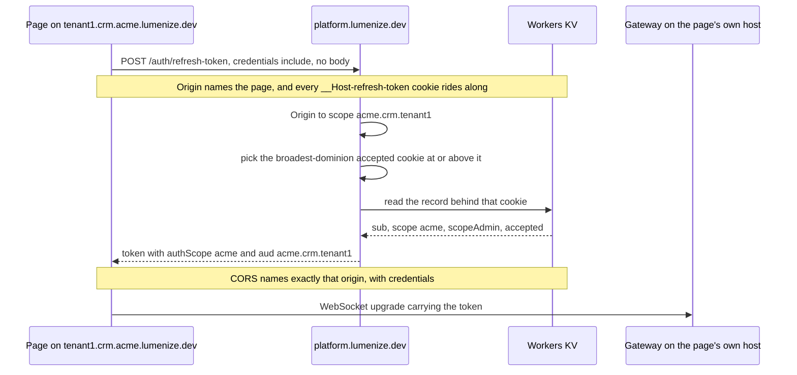
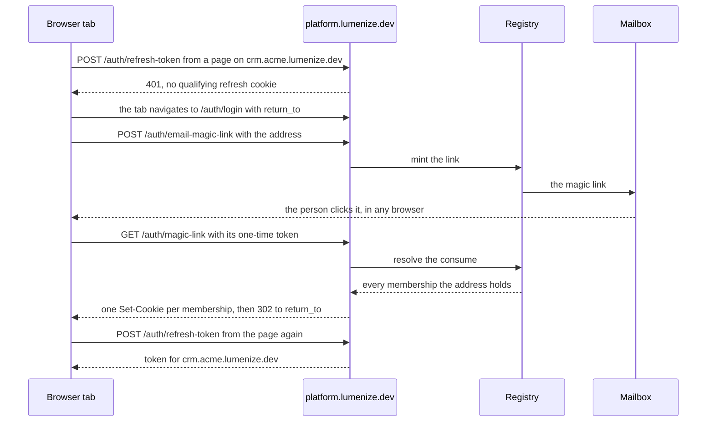
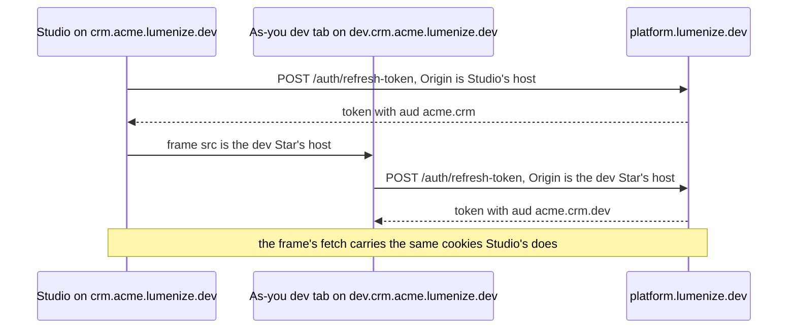

# The scope moves from a URL segment to a subdomain

**Status:** Pass 1 — design intent, constraints and decisions; phases are Pass 2. [ADR-021](../docs/adr/021-every-scope-has-its-own-host.md) and [ADR-022](../docs/adr/022-every-session-lives-on-the-platform-host.md) carry the decisions and this build amends both; this file carries what building them in this repo needs. Gates ② Testing with personas.

**Objective — every universe, galaxy, Star and persona is served from a host of its own, and every session lives on the platform host, in production, in the local stack and in the `/live` harness alike.**

Today one host serves everything, with the scope in the path. Take a user-developer who claimed the universe `acme` and then created the galaxy `crm`. Creating a galaxy adds no membership, so theirs is at `acme`. Their Studio for the galaxy is `https://nebula.lumenize.com/acme.crm`, and its preview is `/app/acme.crm.dev/` on that same host. Studio gets its token with `POST /auth/acme/refresh-token` and the body `{"activeScope":"acme.crm"}`, so the path names the membership and the body names the page. Their Home is `/auth/acme/home`. After this build Studio is `https://crm.acme.lumenize.dev/` and the preview is `https://dev.crm.acme.lumenize.dev/`. A page on either gets its access token from `POST https://platform.lumenize.dev/auth/refresh-token` with no body, and login and Home live on that host too.

**Three goals, in the order they matter:**

1. **No page gets an access token for another host, generated code leaves Studio's origin, and a call from a page carries dominion no further than that page's scope.** Today a login sets one cookie per membership on `nebula.lumenize.com`, told apart only by `Path`, so any page there can get a token for any scope the person holds, in any universe. The preview runs the user-developer's generated code on Studio's own origin, in a frame with no `sandbox`, so that code can read and rewrite Studio's page and its `localStorage` through `window.parent`. And a token carries its holder's whole dominion wherever it is used, so that code acts with the visitor's broadest membership (§ *Passage and dominion read the page's scope*).
2. **A shared link opens the same scope and view, even across a login** ([ADR-017](../docs/adr/017-the-url-is-the-view-state.md)). Today a signed-out visitor's destination waits in `localStorage['nebula.returnTo']`, which a magic link opened in another browser never sees.
3. **The client names neither `authScope` nor `activeScope`.** The refresh takes the page's scope from its `Origin` and picks the membership itself, and a page on the platform host gets no token at all. A call's target scope still rides its parameters, as `invite(targetScope, …)` does. Today Studio reads `authScope` from a `localStorage` hint keyed `nebula.authScope:{activeScope}`, and every refresh names `activeScope` in its body.

## Relationships

- **Gates ② Testing with personas, [nebula-testing-with-personas.md](nebula-testing-with-personas.md).** A persona tab needs a host of its own. This build parses a persona's host and adds the refresh branch ADR-022 § *A persona's host* describes, with one `/live` scenario; the cast, the Galaxy's provisioning and records, the tab strip, seeding and reaping stay with the personas build, whose rewrite inherits the branch (§ *Decisions*).
- **Lands before ⑥ the wipe.** `PLATFORM_SCOPE`'s rename and the reserved slug sets are stored data, which is why the master plan gates this build `data`.
- **Shares Universe Signup and Galaxy create with the master plan's shared-pages item** ([nebula-pre-alpha.md](nebula-pre-alpha.md) § *Shared pages*), which captures scope full names on them and decides, page by page, whether an app forwards to ours or runs its own. This build caps the slug those pages collect at 30 characters, holds Galaxy create on a certificate count-up (§ *Certificates and the wait*), and **owns the claim behind the signup page even though the page is theirs** (Larry, 2026-09-20): collecting the extra fields is a form change, while writing a galaxy and its `.dev` Star inside the claim is server work in `nebula-auth` that this build is already rewriting for certificates, cookies and `return_to`. Splitting them would land the ordering decision in a build that cannot test it. The claim signature carries the account's name and slug and the first app's name and slug; the page that collects them is the shared-pages item's.
- **This build's signup criteria do not wait on that page** (Larry, 2026-09-21). Their scenarios post the claim over HTTP and drive the browser from the consume onward, which is what `signup-one-email.ts` and `signup-to-first-app.ts` already do — so what they prove is what this build owns: the claim writes three `Scopes` rows, the consume orders the pack, and the wait ends in Studio. ⚠️ A criterion here MUST NOT be written against a form this build does not own: the shared-pages item has no task file and no acceptance criteria, and the pre-alpha exception licenses deferred testing only where the later file carries them.

### Backlog rows this build settles

One verdict each, stated as an obligation because none of it is done — this is Pass 1. The rows this
file disposes of in passing are cited where they come up. Named by the text that identifies them,
since line numbers move; all in [backlog.md](backlog.md) § *Nebula Auth* unless noted.

- **"Tune the auth rate limits — real numbers for BOTH limiters"** — this build narrows it to the
  connection-keyed limiter, because the facade move leaves `NEBULA_AUTH_RATE_LIMITER` with no caller
  at all and the row's own inventory says otherwise.
- **"One person holding two memberships that reach the same host"** — this build rewrites its
  selection clause, which reads *dominion wins nearest first* where ADR-022 settled **broadest** on
  2026-09-18. Documentation drift rather than scope, and it is not the "SILENTLY SWAP" row, which
  this build leaves alone.
- **"Re-derive the Gateway's use of `activeScope` (`aud`)"** — this build closes it: its only
  surviving subject is the fence deleted here. What it was really asking for becomes a criterion —
  the readers of `aud` are enumerable and the prose about them is conformed.
- **"Promote `aud` and `authScope` to named, typed scope accessors"** — maximum trigger, since every
  authorization site starts reading `aud` and both predicates change signature. This build folds it
  into the row that redefines `access`, so the shape lands once.
- **`createNebulaClient`'s `authScope` URL auto-detect** (§ *Other Nebula backlog*) — this build
  deletes the row, which its own note asks for once this lands, and drops both fields from the
  client's config. ⚠️ Its note also asserts the server "narrows `authScope`" to the detected scope,
  which is what ADR-022 rejects — so the row must not be mined for design on the way out.
- **"One concept, two vocabularies: `/mint-narrower-token` vs `impersonate`"** — this build rewrites
  it: the row states in bold that the route becomes `POST /auth/impersonate`, and there is no route.
  The naming verdict it records stands and lands on the facade method.
- **"The admin-debug UI — drive a Star as an impersonated user"** — same correction, same reason: it
  names the same dead route.
- **SELF-NARROWING (reopened 2026-09-18)** — this build answers its stated worry, that a superuser
  holding platform `scopeAdmin` carries it on every host, and answers it structurally rather than by
  narrowing a token: no page sits at the platform scope, so that reach cannot be minted
  (§ *Passage and dominion read the page's scope*). Its other half, a person choosing to work
  narrower than their membership, is untouched and stays open.
- **"Local dev over https, so Safari can drive the stack"** — tripped twice. Its cookie inventory
  (`HttpOnly; Secure; SameSite=Strict`) is what § *Sessions* replaces with `__Host-` and `Lax`, and
  its one-certificate fix is undersized for the label depths `*.lumenize.localhost` reaches, since a
  wildcard matches exactly one label. The same stale claim sits in `scripts/dev-studio.sh`.
- **"A `/gateway/` instance is claimable by whoever knows its name"** — stays OPEN, narrowed rather
  than closed: the binding check lands here, claiming an instance by name does not, and the fence
  that incidentally covered a directed push is gone. What gates a push instead is stated where the
  fence is deleted.
- **`on-hold/nebula-registry-scope-in-url.md`** — retired 2026-09-20, its three disk facts mined into
  § *Context and current state* first. The facade move removed its subject: no Registry URL survives
  to carry a scope. ⚠️ Its own box warned against reading its absence as *we decided against moving
  the scope onto the URL*, and that is not what happened.

## Context and current state

**Built already**, grouped by what it serves.

### Serving

- **One route, `nebula.lumenize.com` as a `custom_domain` in `apps/nebula/wrangler.jsonc`.** *Replaced* by a proxied `*.lumenize.dev` DNS record, a record and a route for the apex, whose only job is to redirect to `platform.lumenize.dev`, and one `*.lumenize.dev/*` Worker route, which served every depth in [the 2026-09-14 run](../experiments/wildcard-host-routing/RESULTS.md).
- **`apps/nebula/scripts/local-config.mjs` strips `routes` before `wrangler dev`**, so the Worker sees the `Host` a caller used. *Adapted:* it also writes the origin var's local value (§ *The deployment names its origin once*), beside the `routes` it already strips so one local `wrangler dev` answers for many hosts.
- **`entrypoint.ts`'s `router` dispatches on the path alone.** `/app/:scope/*` goes to the Galaxy through `serveAppForward`, `/auth/*` to nebula-auth, `/gateway/*` to the Gateway, and anything unmatched to Studio's single-page app through `assets.not_found_handling`. *Adapted:* it tries § *Which host answers what*’s three things in order — the platform host's own routes, the routes every host answers by path, then a page chosen by host — and in production that last step reaches the Worker at all only once `run_worker_first` stops handing unmatched paths to the assets layer.
- **nebula-auth's `serveAuthApp` serves `auth-app.html` for `GET /auth/login`, `/auth/signup`, `/auth/emails` and `/auth/{scope}/home`.** In the local stack, vite's `authAppRoutes` serves the same file for the same paths on any host, ahead of its `/auth` proxy, and `appSpaFallback` answers every other HTML `GET` with Studio, whatever the host. vite proxies `/auth`, `/gateway`, `/app` and `/pictures` to `wrangler dev`. *Adapted:* the auth screens answer only on the platform host, and Home's path loses its scope segment. Both vite middlewares call § *The deployment names its origin once*’s parse to decide, so one host rule has two callers. The path proxies stay, except `/app`, which goes with the path it served.
- **The preview is served at a path, and its scope rides a `<meta>` tag the Galaxy injects.** `Galaxy.#serveBuiltApp` answers `/app/{u}.{g}.{s}/*`, takes the Star from the path, and serves only the `dev` Star. Into each HTML page it injects `nebula-scope`: `activeScope` is the Star, `authScope` the parent galaxy, and `ontologyVersion` the installed ontology. The scaffold's `apps/nebula/container/app/src/nebula.ts` hands all three to `createNebulaClient`, and navigates to `/login` when the client fails to get ready. *Adapted:* at `dev.crm.acme.lumenize.dev` the host is the scope, so the two scope fields go (ADR-022 § *What an access token carries*), and the server supplies `ontologyVersion` and whether the page is the dev Star, which the scaffold's `isDevPreview` computes from `activeScope` today. The scaffold's `/login` navigation is left behind, so `NebulaClient` alone gets the page's token and answers a 401 as § *Decisions* says. The serve gains one field, the origin a page may post its auth state to.
  - The injected `authScope` is the galaxy, whose cookie path only a galaxy member holds, so a universe owner's preview already refreshes where their own cookie does not match.
- **`handlePictureUpload` answers a picture's URL as `` `${origin}/pictures/${segment}` ``, which the Profile stores**, and `servePicture` answers `GET /pictures/:key` from `BLOBS` for anyone, checking only the key's shape. *Adapted:* the upload answers the relative path `/pictures/{key}`, so the stored value names no host — no tenant slug lands in markup another scope renders, and a picture uploaded on a host whose scope is later deleted keeps rendering everywhere else — and each `` resolves it against the host that served its page. `profile-pictures.ts`'s module JSDoc justifies the public serve on an image load carrying neither bearer nor cross-site cookie; that premise is re-derived rather than kept: no cookie of ours reaches a scope host at all, and serving stays unauthenticated because holding the key is the capability.
- **`LUMENIZE_APPROVED_ORIGINS` feeds `applyCorsPolicy` for both the auth router and the Gateway, through `buildCorsOptions` in `entrypoint.ts`.** Production and both local configs set it to `""`, which turns the check off. Only the browser test rig sets a list, so that it accepts the `Origin` its own vite proxy rewrites. *Left behind:* the var goes, with the rig's rewrite and `auth-flows.md` § *Cross-origin browser deploys*. The refresh answers CORS for exactly the origin its lookup accepts (ADR-022 § *Getting an access token*), and the `Sec-Fetch-Site` check is in § *Constraints*.
- **`workers_dev: true` in `apps/nebula/wrangler.jsonc` also serves the Worker on its `workers.dev` host**, which is outside `lumenize.dev` and names no scope § *The deployment names its origin once*’s parse can read (endpoint audit, 2026-09-17). *Left behind:* it becomes `false`, so every host the Worker answers is one the parse knows. The test target stops needing it once it answers on `lumenize-test.dev` (§ *Venues*).

### Sessions

- **`buildAuthRouteTable` in `packages/nebula-auth/src/router.ts` puts the scope in the path** for every route a cookie authenticates — `refresh-token`, `logout`, `logout-all`, `accept-membership`, `pending-membership`, `home` — and for the emailed `magic-link` and `accept-invite`. *Adapted:* the cookie routes and the emailed links move to the platform host, which reads no scope from the path, and the token routes become facade methods rather than moving to a host of their own (§ *Which host answers what*).
- **The emailed consume has two routes today, `GET /auth/:scope/magic-link` and the scope-less `GET /auth/magic-link`** (endpoint audit, 2026-09-17). *Left behind:* the scoped one, since every emailed link lands on the platform host. `claim-star` has no production caller yet either, and stays: it is Star self-signup, which the shared-pages item gives a page (§ *Future state*).
- **`refreshCookie` in `worker-token.ts` writes `refresh-token=…; Path=/auth/{scope}; HttpOnly; Secure; SameSite=Strict`**, and `consumeAndLogin` sets one per membership, capped at `MINT_ALL_COOKIE_CAP`. The consume and the signup claim are the only places a refresh token is issued, each stamped now plus `REFRESH_TOKEN_TTL`, and neither revokes the record behind a cookie it overwrites. *Adapted:* the consume still sets one per membership, now on the platform host as `__Host-refresh-token.{scope}` at `Path=/`, `Lax` (ADR-022 § *The cookie rules*). No scope host holds a cookie of ours.
- **`handleRefreshToken` reads Workers KV, falls back once to the Registry's `getRefreshRecord`, and requires `activeScope` in the body.** *Adapted:* the refresh answers on the platform host alone, with an empty body. It takes the page's scope from `Origin`, picks the broadest-dominion accepted membership among the cookies it receives, and answers CORS for that origin alone (ADR-022 § *Getting an access token*). It keeps the Registry fallback unchanged, and the record it reads is written Worker-side, which is what makes a miss rare (§ *Constraints*).
- **The Registry Durable Object dispatches on the forwarded path, and two of the four moved endpoints need values no URL carries** (mined 2026-09-20 from the retired `nebula-registry-scope-in-url.md`, whose subject the facade move removed). `forwardToRegistry` preserves `request.url` and `NebulaAuthRegistry.fetch` computes its endpoint by slicing the prefix off the pathname, so the DO's own `case` dispatch is part of this move, not just the Worker's route table. `delete-scope` destructures `callerSub`, which feeds the deletion plan's caller-exclusion, and `callerClaims`, which IS the ADR-016 acting-principal record. *Adapted:* both arrive as `callContext.originAuth` once the entry is a facade method, which is the shape that file kept having to work around.
  - **The delete routes' dominion check is not where a symbol list would put it.** It is a bare `hasDominionOver(callerAccess, target)` inside the private `#computeDeletionPlan`, shared by `planScopeDeletion` and `executeScopeDeletion` — `#hasDominionOverUniverse`/`#hasDominionOverGalaxy` serve `createGalaxy`/`createStar` only. ⇒ State what moves as a PROPERTY rather than a symbol list, or a literal reading leaves the shared one behind.
- **`forwardWithSubject` in `router.ts` refuses a token carrying `act` on `scope-summary` and `expand-scope`**, because `scope-summary` answers every tenancy the subject holds, some of it beyond the impersonating admin's dominion; it is `security.md`'s worked case for an `act`-presence check. *Left behind:* once `scope-summary` goes and the tree read answers only beneath its own page's scope, where the admin already holds dominion, the refusal withholds nothing, so by `security.md`'s test for such a check it goes too, and that rule needs a new worked case or none.
- **`claimUniverse(slug, email, origin)` writes one universe and mails a link, and `claimUniverseWithTicket` does the same against a proved address; `SignupScreen.vue` posts `{ slug: accountName }` alone.** Neither writes a galaxy, and no page collects a second slug. *Adapted:* both claims take the first app's slug too and write the universe, that galaxy and its `.dev` Star in one act, so the consume has a galaxy whose certificate pack — the ACM order naming the zone apex, `crm.acme.lumenize.dev` and `*.crm.acme.lumenize.dev` — it can order (§ *Signing up lands in Studio*). The form field is the shared-pages item's; the claim is this build's (§ *Relationships*).
- **Emailed links take their host from the request.** `#magicLinkUrl` builds `${origin}/auth/{scope}/…` from the inbound `url.origin`, and `NebulaAuthFacade` uses `callContext.originRequest?.origin`, falling back to `NEBULA_AUTH_ISSUER`. *Adapted:* every emailed link lands on the platform host.
- **Nothing tests that an emailed link follows the request's host.** `describe('Outbound URL host-awareness (Phase 0 guard)')` did, until `4cb069e` deleted it on 2026-07-13. [The sessions record](archive/decision-sessions-per-origin.md) § *What changes in today's code* still describes it as present. *Missing:* this build owes a successor (§ *Criteria to carry into the phases*).
- **`NEBULA_AUTH_ISSUER` is `https://nebula.lumenize.com`**, a constant in `types.ts` that `access-claims.ts` stamps and `verify.ts` checks. *Adapted:* it derives from § *The deployment names its origin once*’s origin, so each deployment issues and accepts only its own — `https://platform.lumenize.dev`, `https://platform.lumenize-test.dev`, `http://platform.lumenize.localhost`. `NebulaAuthFacade` takes the same value where it falls back today, so a link a Durable Object sends names the stack that sent it.
- **`Star.onBeforeCall` seeds the initial root-admin DAG grant** when a caller carries `scopeAdmin` and an `authScope` equal to the Star, behind a one-shot `__nebula_rootAdminSeeded` flag. *Left behind:* the grant buys no capability, since `requirePermission`'s bypass already admits a star-level admin, as `isAtOrAbove` holds on equality (§ *Decisions*). Deleting it takes the flag with it, along with every test and test comment that leans on the seed — `dag-tree.test.ts`'s "DataPlane root-admin seeding" block, the covering-admin test and a skipped reseed test among them, found by grepping for `__nebula_rootAdminSeeded` and "root-admin seeding" — and the model in the bypass comment inside `requirePermission` in `dag-tree.ts`, which calls a Star admin a DAG `admin` grant on root. A Star's founders then act through the bypass and hold no grant the permission climb can find; [on-hold/nebula-request-access.md](on-hold/nebula-request-access.md) holds the question of where a climb ends without one.
- **`aud` has one reader that decides anything, `NebulaClientGateway.onBeforeCallToClient`**, which delivers a push only when the change came from a page with the same `aud`. Today the client chooses `aud`; after this build it is the page's host, so that check would drop every push whose change came from another host. *Left behind*, exemption included (§ *Decisions*). The other job it did — keeping a writer's claims off pages in other scopes — passes to § *A push speaks for the node, not the writer*. `access.authScope` keeps its meaning as the membership's scope, and stops deciding how far a call reaches (§ *Passage and dominion read the page's scope*).

- **Eight comments describe the `aud` fence or an "aud-lock" that this build changes or deletes**, in `nebula-client.ts`, `verify.ts`, `parse-id.ts`, `star.ts` (three), `tree-subscriptions.ts`, `galaxy.ts` and `profile.ts`. Checked one by one before the fence was deleted (2026-09-20), and none holds a reason to keep it: the "aud-lock" ones name the INBOUND gate, which `NebulaDO`'s own header says stores no `aud` at all — the scope is read off the instance name on every call — and the two in `verify.ts`/`parse-id.ts` say the fence ASSUMES the at-or-below invariant, a one-way dependency that survives it. *Adapted* at each site, and `nebula-client.ts`'s is the one that changes meaning rather than wording: it currently calls the fence the real cross-scope boundary.
**The checks**, in `packages/nebula-auth/src/parse-id.ts` and `verify.ts`:

- **`hasDominionOver` and `hasPassageInto`** read `access.authScope` and `access.scopeAdmin`, and every site that decides passage or dominion passes them `claims.access`. *Adapted:* they take the verified claims and read `aud` in `authScope`'s place. The facade's invite eligibility compares `access.authScope === targetScope` itself, and adapts the same way.
- **`verifyNebulaAccessToken`** refuses a token whose `aud` is not at or below its `authScope`, with no condition on `scopeAdmin`. *Adapted:* a plain membership's token verifies only when the two are equal, because two mint paths let one sit below its scope today — the refresh, and the impersonation mint's subject bound.

### Client

- **`NebulaClient` refreshes at `/auth/{authScope}/refresh-token` with `{ activeScope }`, then writes the `nebula.authScope:{activeScope}` hint.** A 401 or 403 throws mesh's `LoginRequiredError` and fires `onLoginRequired`. *Adapted:* the refresh is `POST https://platform.lumenize.dev/auth/refresh-token` with `credentials: 'include'` and no body. A 401 sends a top-level page to the platform host's login with `return_to` (ADR-022 § *Logging in*); a frame never navigates the tab and posts its reason to its parent instead, since both refresh off the same cookies (§ *Decisions*). The hint goes, with its readers in `App.vue` and `auth/HomeScreen.vue`, and `CreateNebulaClientConfig` drops `authScope` and `activeScope`, which makes goal 3 a fact the compiler checks rather than a convention.
- **Home, `HomeScreen.vue`, is reached only at `/auth/{scope}/home`.** Its `bootstrap` refreshes at that scope, `pending-membership` and `accept-membership` pick their cookie by the same segment, and `loadSummary` is its one call that sends a token, to `scope-summary`. A visit that names no scope lands on Studio's signed-out page, even with live cookies. *Adapted:* Home lives on the platform host and makes no token call — its summary comes from a cookie route of its own (§ *Home reads by cookie, and every action runs where it can*), grouped by Profile (§ *Decisions*) — and acceptance names the membership it accepts. `crossEmailNotice`'s line, *"Signing in here emails {address}"*, is re-derived for an address whose session the browser already holds.
- **Studio's `App.vue` reads the scope from the first path segment, and `enterScope` moves between scopes with `leaveTo('/{scope}')`.** Its preview frame's `src` is the relative `/app/{u}.{g}.dev/`. *Adapted:* the scope comes from the host, moving to another scope navigates to its host, and the frame's `src` is the dev Star's host. `view-state.ts` stays the one place the URL is read (`.claude/rules/ui-routing.md`).
- **Studio's account menu offers "Log out of this app", "Log out everywhere" and a Manage panel.** "Log out of this app" revokes the record behind `/auth/{scope}` through `NebulaClient.logout()`, and "Log out everywhere" posts `logout-all`, which revokes every record the address holds. The Manage panel, opened by `?manage`, lists every scope from `scope-summary` and offers "Develop" on an app, "+ App" on an account, and Delete on every accepted row but the platform root; its "+ App" form carries the data-use notice's second placement, and `develop()` also creates a missing `.dev`. *Adapted:* one "Log out" runs through the platform host (§ *Logging out*), and the menu's Home and Email addresses links point there. *Left behind:* "Log out of this app", the menu's "Log out everywhere" item (the capability moves to the Profile page — § *Logging out*), the Manage panel and `develop()`'s repair; Home takes the list, and the universe page and Studio take its actions (§ *Home reads by cookie, and every action runs where it can*).
- **`NebulaClient.logout({ everywhere })` posts to `/auth/{authScope}/logout` or `logout-all`**, and its `#mintedFrom` branch ends a derived session without calling either (`security.md`'s derived-session rule). The endpoint audit (2026-09-17) found it has no route after this build: both routes move to the platform host, where `Sec-Fetch-Site: same-origin` refuses a scope host's `fetch`. *Adapted:* `logout()` sends the tab to the platform host, whose page posts the logout (§ *Logging out*). The client's `everywhere` argument and the separate `logout-all` route both go; ending every device becomes a parameter on that one route, offered by the page the tab lands on. The `#mintedFrom` branch is carried unchanged, and a framed page's `logout()` becomes the same teardown, since the session it would end is the parent's.
- **The universe page, `UniverseView`, creates an app and enters it the moment `createGalaxy` resolves, through `onCreateApp`'s `enterScope`.** Its create form opens from `?create` and shows no data-use notice. It lists its apps by loading the person's whole summary through `NebulaClient.scopes.summary()` and keeping the galaxies directly beneath its universe. *Adapted:* after `create-galaxy` it wakes the new Galaxy, shows a seconds count-up and enters Studio once Studio's host answers (§ *Certificates and the wait*), and its form gains the data-use notice the Manage panel carried. Its list comes from the facade's tree read, which takes its parent from the page's scope rather than from an argument, so it answers for that universe alone. *Left behind:* the `scope-summary` route and `scopes.summary()`, since Home's cookie route is the only reader left that needs a person's whole summary (§ *Home reads by cookie, and every action runs where it can*).
- **`NebulaClient.impersonate(sub, activeScope)` passes that scope to `POST /mint-narrower-token`**, which requires it and makes it the child's `aud`, while the child's `authScope` is the subject's own scope — so `canMintFor` already bounds the child to at or below the caller's session. *Adapted:* the argument goes, the mint becomes the facade's `impersonate` method, and it takes the child's `aud` from the page that called it, so a mint asked from a page above the subject's membership is refused there. `mintNarrowerToken` and the `nebula-auth.worker.narrower.*` debug namespaces take the same name, and the claim that the child is at or below the caller's session moves into the handler's JSDoc and its predicate. `logout()`'s comment that `authScope` IS the refresh-cookie path goes with the paths.
- **`view-state.ts`'s `rememberReturnTo`, `takeReturnTo` and `validReturnTo` keep a signed-out visitor's destination in `localStorage`.** *Left behind:* `return_to` and the magic-link record replace them.
- **Studio's signed-out landing, `stageMode 'landing'`, is where a failed connect or a logout ends today.** *Left behind:* a signed-out visit to a scope host goes to the platform host's login when its first refresh answers 401, a logout lands there too (§ *Logging out*), and the apex redirects to the platform host, so nothing reaches that stage. `studio-signed-out-landing` retargets at the platform host's login.
- **The Gateway's WebSocket URL carries no scope** — `/gateway/NEBULA_CLIENT_GATEWAY/{sub}.{tabId}` — and `onBeforeConnect` verifies the token and forwards it as `Authorization: Bearer`. *Adapted:* each client still connects to its own host's `/gateway/`, which now accepts that one binding and refuses every other (§ *Decisions*).

### Names that assume a scope is a path segment

- **`PLATFORM_SCOPE` is `'nebula-platform'`** in `packages/nebula-auth/src/types.ts`. *Adapted:* it becomes `'_platform'` (§ *Decisions*), a stored scope id, and every copy of the literal changes with it — `test-helpers.ts`, `home-logic.ts` and harness scenario constants among them — found by grepping for `nebula-platform` rather than by trusting this list.
- **`RESERVED_STAR_SLUGS` is `{'dev'}`**, and `apps/nebula/test/test-helpers.ts` declares a second copy. *Adapted:* it holds the eight environment names ADR-021 reserves, and the copy folds into the import.
- **`RESERVED_UNIVERSE_SLUGS` exists because a universe slug is the first path segment.** *Re-derived:* that reason dies, and HOST labels such as `platform`, `email` and `www` become the reason instead (`.claude/rules/calibration.md` §4) — the parse strips the origin suffix, so a universe named `platform` would shadow the platform host. That is now the set's only job, since the root scope stops being a claimable slug (§ *Decisions*). Only `claimUniverse` checks the set today — `claimUniverseWithTicket` checks `PLATFORM_SCOPE` alone — so both claim paths call one predicate, or a signup ticket could claim `www`.
- **`isValidSlug` in `packages/nebula-auth/src/parse-id.ts` checks every universe, galaxy and Star slug, and caps no length.** It allows lowercase letters, digits and hyphens, and refuses a leading or trailing hyphen or a `--`. *Adapted:* it gains ADR-021's 30-character cap, so `northwind-traders-international`, at 31, is refused at signup. The persona floor of 3 is the personas build's: a label with `--` as its third and fourth characters is reserved for punycode, and certificate authorities refuse to name one (ADR-021 § *How a host spells a scope*).
- **`validateSlug` in `apps/nebula/src/dag-ops.ts` checks an org-tree node's slug with a grammar of its own**, allowing 100 characters and a `--`. *Adapted:* it calls `isValidSlug`, so a node slug gets the same grammar and the same 30-character cap.
- **Three JSDoc comments plan a split between `lumenize.dev` and `nebula.lumenize.com`**, in `nebula-auth-facade.ts`, `profile-pictures.ts` and `home-logic.ts`. *Re-derived*, each on its own terms. The facade's worry about mapping a connection's host to a scope is answered, since every emailed link lands on the platform host and its fallback origin comes from the deployment (§ *Sessions*). `profile-pictures.ts` keeps its conclusion on a new premise (§ *Serving*). And `home-logic.ts`'s `surfaceFor` still keeps the platform root unclickable, now because its surface would be Home, the page the person is already on.
- **Every other `nebula.lumenize.com`** — `grep -rl 'nebula\.lumenize\.com' --exclude-dir=node_modules --exclude-dir=archive` finds deploy scripts, the harness's `prod.ts` and `mintDegradedToken`, tests and docs. *Adapted* at each site. A generated file such as `platform-embed.ts` changes at its source.
- **"Nebula" still reads where users look** — both page `<title>`s, `LoginScreen.vue`'s *"Sign in to Nebula"*, `App.vue`'s welcome, thinking and chat-header text, and `NebulaEmailSender.appName`, which every magic-link and invite email carries. *Adapted:* each reads "Lumenize" wherever a user sees it (ADR-021 § *What each domain is for*), while code identifiers keep the name. A grep for `Nebula` over the Studio UI and the sender is the inventory, read for strings rather than identifiers.

### Venues

- **`bootDevStack` runs `wrangler dev` at `http://localhost:{port}` on a free port, and `bootStudioVite` serves Studio on 5174 through the vite config in § *Serving*.** Scenarios name scopes in paths, and `loginViaEmail` fetches an emailed link as sent. Most scenarios log in through `provisionAndLogin` or `connectDriver`, which end in a refresh whose body names a scope, and several refresh one session into scopes below it. *Adapted:* hosts become `{scope}.lumenize.localhost:{port}`, and following a link as sent is carried unchanged. A helper logs in on the platform host through the Browser shim, and each client refreshes against the platform host with the shim's cookies, which is what a browser does.
- **`@lumenize/testing`'s cookie jar matches a domain with a bare `endsWith`, and exempts `Secure` only for literal `localhost`, `127.0.0.1` and `::1`.** So it would send a cookie set on `crm.acme.lumenize.localhost` to `xcrm.acme.lumenize.localhost`, and withhold every `__Host-` cookie on these hosts, which most of the registry's scenarios depend on. *Adapted in the package:* host-only against `Domain` semantics, matching at a dot boundary, the `__Host-` and `__Secure-` rules, and `*.localhost` as a secure context. It is product feedback for `@lumenize/testing` rather than a Nebula workaround, and a prerequisite for the scenarios that drive through it.
- **The `ui-smoke` lane boots the same `wrangler dev` and the same vite config, and runs in CI on `ubuntu-latest`** (`.github/workflows/ui-smoke.yml`). Its "create an app from the manage panel" test clicks "+ App" on the universe row from inside Studio, and `delete-scope.test.ts` holds two skipped tests that drive the panel's Delete. *Adapted:* it moves to these hosts with the rest, which is what makes § *The deployment names its origin once*’s resolver mapping load-bearing rather than a convenience. The create test retargets at the universe page's form, and the two delete tests at Studio's "Delete this app" (§ *Home reads by cookie, and every action runs where it can*).
- **`deploy-test.sh` deploys `test-nebula` with `routes` deleted, so it answers on `workers.dev`**, whose hosts are one label deep. It swaps only the R2 bucket, so `test-nebula` shares production's `REFRESH_TOKEN_KV` namespace, which a `wrangler.jsonc` comment justifies by both workers carrying the same JWT keys. *Adapted:* it deploys with `lumenize-test.dev`'s routes in place of production's, with that domain's origin (§ *The deployment names its origin once*), and with a KV namespace of its own, swapped the way the bucket is — production signs with its own key pair (§ *Decisions*), so that reason is gone. Both deploy scripts' self-checks curl `/_version` on the platform host, the one host every deployment has.
- **`harness/scenarios/superuser-end-to-end.ts` refreshes AT the platform scope**, so its limb 2 mints and verifies a token whose `aud` and `authScope` are both the platform root — its own comment says the predicate answers on the equality arm. *Adapted:* no page sits at the platform scope, so that token cannot be minted; the limb re-grounds on a superuser's token at a universe's page, which carries `authScope` platform and that universe as `aud`, and proves the same mint-and-verify path plus the property that replaces it (§ *Passage and dominion read the page's scope*). The platform MEMBERSHIP is untouched — it is what gives a superuser passage everywhere — and `four-party-chat.ts`'s bootstrap login and acceptance at that scope are unaffected, since both are cookie-side.
- **`harness/lib/prod-drive.ts` keeps one stored superuser session and refreshes it into any scope through `prodRefresh(session, activeScope)`.** *Adapted:* it keeps the platform host's cookie in the Browser shim's cookie jar, reads Home's summary route with it for `prod.ts enumerate`, and lets each client refresh against the platform host with that jar, which is what [backlog.md](backlog.md) § *Testing & Quality*'s row on moving `/live` and prod-drive to ADR-009 rung 1 asks for.

The sections of § *Design intent, constraints, and future state* decide how the parts marked *Adapted* change, wherever an ADR does not already say.

## Design intent, constraints, and future state

The decisions are ADR-021's and ADR-022's. What follows is what building them here commits to, where the ADRs leave the choice to the build.

**Three flows, as ADR-022 runs them here.** A page gets its access token by one credentialed `fetch` to the platform host. The person in this one is a universe admin, so the token carries their broadest-dominion membership.



With no qualifying cookie, the page sends its tab to log in and comes back to the same URL.



A frame needs nothing of its own, because Studio, its frames and the platform host are one site.



### The deployment names its origin once

**The deployment names its origin once, and every host parses against it.** Production's is `https://lumenize.dev`, the deployed test target's is `https://lumenize-test.dev`, and the local stack's is `http://lumenize.localhost`, with the port taken from the request. It is one `wrangler.jsonc` var, which `local-config.mjs` rewrites for the local stack as it already strips `routes`, and `deploy-test.sh` rewrites for the test target. Stripping that suffix and reading the rest right to left makes `tenant1.crm.acme.lumenize.localhost:54321` the scope `acme.crm.tenant1`, exactly as `tenant1.crm.acme.lumenize.dev` is. `platform.lumenize.dev` parses to the platform host — **which is not the platform scope, and the two must never be used for each other.** `_platform` is the root of the scope tree: a membership sits there, `isAtOrAbove` opens by returning true for it, and a superuser's dominion comes from it. `platform.lumenize.dev` is where the session lifecycle is served, and a page there gets no token at all. Every other host maps to a scope and hands its page a token whose `aud` is that scope; this one maps to none, which is exactly why no token can carry platform-wide dominion (§ *Passage and dominion read the page's scope*). The leading underscore keeps the two unmistakable in any sentence. And `manny--dev.crm.acme.lumenize.dev` parses to persona `manny` in `acme.crm.dev`, whose refresh branch this build lands (§ *Acceptance runs on the platform host*). The parse reads ADR-021's whole grammar, persona labels such as `manny--dev` included. One function does it. It backs the refresh's `Origin` lookup, the `return_to` check and every URL the platform mints — a magic link, an invite link, a frame's `src` — so an app's own domain later joins in one place (ADR-022 § *A customer's own domain*).
- **`http` is enough locally, because Chromium counts `*.localhost` as a secure context.** Measured 2026-09-15 by a scratch probe on macOS, with Node 24.19 and Playwright's Chromium 145. Chromium stores `Secure` and `__Host-` cookies over plain `http` there, and keeps them host-only. Node's `fetch` and `WebSocket` and Chromium all resolve `*.lumenize.localhost` at any depth to loopback, with no `/etc/hosts` entry. Every `*.lumenize.localhost` host is one site, so Chromium sends the `Sec-Fetch-Site` values `lumenize.dev` gets. Linux resolves none of them: measured 2026-09-16 in a `node:24-slim` container, where every depth including the bare `lumenize.localhost` answered `ENOTFOUND`. So the local stack states its own wildcard the way production states one in DNS — Chromium takes `--host-resolver-rules=MAP *.lumenize.localhost 127.0.0.1` and Node's `fetch` takes a `lookup` hook over that suffix — which stands in for the `*.lumenize.dev` record rather than for any behaviour of ours, and makes all three operating systems answer alike.
- **`wrangler dev` passes the caller's `Host` through once `routes` is stripped.** That was read from wrangler's source, not run, so the first local boot on these hosts confirms it.
- **The deployed test target has a domain of its own, `lumenize-test.dev`.** It is `.dev` so tests see production's browser rules: HSTS preloading covers the whole TLD, and `.dev` is a public suffix, so `lumenize-test.dev` is one site the way `lumenize.dev` is. Its zone sits in the same Cloudflare account as production's.
### Which host answers what

**The Worker tries three things in order, each falling through to the next: the platform host's own routes, then the routes every host answers by path, then a page chosen by host** (Larry, 2026-09-16). The platform host is an app of its own — login, the consume, Home and the refresh — and its routes live in a `WorkerEntrypoint` that the default `fetch` reaches through a self-referencing service binding, the way `AUTH_EMAIL_SENDER` reaches `NebulaEmailSender`. Every host answers `/gateway/`, `/pictures` and `/_version` by path alone; `/gateway/` reads nothing from the host, since the token's `aud` carries the scope, and it accepts one binding from its path rather than any of the six bound here — an upgrade naming another is refused in `onBeforeConnect`, before a Durable Object is created (§ *Decisions*). The last step is the only one where the host selects what a wildcard-served host shows — Studio, a universe page or a built app — and it is what the assets layer answers before the Worker today. A page loads without a session (ADR-022 § *Context*), so the Worker never asks the Registry whether a host's scope exists, and no page load touches the singleton ([ADR-018](../docs/adr/018-singleton-is-the-scarce-resource.md)).

```
lumenize.dev                     redirects to platform.lumenize.dev
platform.lumenize.dev            login and signup, Home, the consume, acceptance, the refresh
acme.lumenize.dev                the universe page
crm.acme.lumenize.dev            Studio
dev.crm.acme.lumenize.dev        the built app, from the Galaxy's /dist
tenant1.crm.acme.lumenize.dev    404 until a published build exists, as today
manny--dev.crm.acme.lumenize.dev the built app as a persona, once personas land
```

**Every route under `/auth/` answers on the platform host, and none of them reads a token** (Larry, 2026-09-19). Each one is a step in a session's lifecycle, and its credential says which step:

| Route under `/auth/` | Authenticates by |
|---|---|
| the `login`, `signup` and `emails` pages, `coming-soon` | nothing |
| the magic-link consume, `accept-invite` | the emailed link |
| `refresh-token`, Home's summary read, `pending-membership`, `accept-membership`, `logout` | its refresh cookies |
| `POST signup` | its `__Host-` signup-ticket cookie |
| `claim-universe`, `claim-star`, `email-magic-link` | nothing — Turnstile guards them |

- **What a session does becomes a `NebulaAuthFacade` method instead, reached by `lmz.call` over the page's own socket** (Larry, 2026-09-19). `expand-scope`, `create-galaxy`, `delete-scope`, `delete-scope-plan` and the impersonation mint each stop being a route, which finishes the move invites already made: `route-guards.test.ts` opens by stating its own route is deleted and every invite enters mesh-side. auth.md § *The Registry*'s dividing line then holds without the exception it currently carves — HTTP carries the session lifecycle, the mesh carries what a session does — though the rest of that section stops describing anything (§ *Claims the build rests on*), and its § *Grants in both planes* already calls the mint the natural second instance, in a "Today's code differs" note this build deletes. The entry relocates, never the predicate: `canMintFor`, the mint invariants and the refusal text `impersonation.ts` matches all move untouched ([backlog.md](backlog.md) § *Nebula Auth*, whose row this absorbs).
- **A claim is not a facade method, because the facade needs a token and a claim is what you do before you have one** (Larry, 2026-09-20). `claim-universe` and `claim-star` reach the Registry through `forwardRaw`, with Turnstile and the connection limiter in front and no token step at all — the same dividing line auth.md draws, since claiming creates the thing you will have a session for. ⇒ After this build a galaxy is created by two mechanisms, the tokenless claim and the facade's `createGalaxy`, which is why the owner cap is checked where they converge rather than at either entry (§ *Decisions*).
- **The refresh is the one route a page on another host calls**, by a credentialed `fetch` whose `Origin` names that page (ADR-022 § *Getting an access token*). A page on the platform host holds no token, so it reaches no facade method either (§ *Home reads by cookie, and every action runs where it can*). Home's summary read is named at Pass 2.
- **How the refresh picks a cookie, since the name alone cannot decide it** (Larry, 2026-09-20). A cookie's name carries its scope and nothing else; `accepted` and `scopeAdmin` live in the Workers KV record, because both change after the cookie is placed — a consume sets one for every membership an address holds, an invited one being pending by definition, and `setIdentityAdmin` re-puts every record when a membership is promoted or demoted. So the refresh takes as candidates the cookies whose name sits at or above the page's scope, reads their records broadest first — the platform root, then `acme`, then `acme.crm`, then `acme.crm.tenant1` — and answers with the first accepted `scopeAdmin` one, or else the membership at the page's own scope, or else 401. **The candidate set is capped at four by the scope tree**, since `isAtOrAbove` tops out at the platform root: for `tenant1.crm.acme.lumenize.dev` they are `acme`, `acme.crm`, `acme.crm.tenant1` and the platform root, and a cookie named for any other scope is not a candidate and is never read. One person holds one in the ordinary case.
- **One authenticated route survives outside `/auth/`: `PUT /pictures`, which reads a Bearer token.** It answers on every host beside `GET /pictures/:key` and `/_version`, and the upload derives whose picture it is from the verified token rather than from anything the caller says. § *Future state* holds the shape that would retire it.
- **The last step reaches the Worker first, which in production it does not today.** `run_worker_first` is a path list, so Workers Assets answers a page load before the Worker sees the host — after `/app/` goes, a Star host would serve Studio's `index.html`. It becomes `true`, and the Worker forwards to `env.ASSETS.fetch` for the hosts that serve Studio and the auth app. § *Decisions* records why a negation list cannot do it.
### Signing up lands in Studio

A person signs up to build an app, so the signup names the first app, and the first page after the emailed link is Studio (Larry, 2026-09-19). Walked through for `acme` and `crm`:

1. **The signup page on `platform.lumenize.dev` asks for the account's name and slug and the first app's name and slug** — all four, since the names are what the master plan's § *Scope full names* is about and the claim now writes three scope rows rather than one. The host spells both slugs, as `crm.acme.lumenize.dev`. The page itself belongs to the master plan's shared-pages item.
2. **The claim writes the universe, its first galaxy with that galaxy's `.dev` Star, and the unaccepted admin membership at `acme`.** Then it sends the link.
3. **The click runs the consume on the platform host**, which sets the cookies.
4. **Consent takes one click, on the platform host.** The claim's membership mints nothing until it is accepted, so a mail scanner's click accepts nothing.
5. **The person waits on the platform host, with the count-up, until Studio's host answers** (Larry, 2026-09-19). The consume ordered the pack, so the wait began at the click; the page polls `https://crm.acme.lumenize.dev/` itself and goes there once the handshake succeeds.

Guiding a new user is Studio's first-run job, so the universe page begins at the second app: creating another app, the organisation's admins, and later its guidance layer. It keeps the list of the account's apps it renders today, now read through the facade — the rows a per-app manager will hang off, and what lets the create form open itself exactly when an account has none. Home fast-forwards to the one place a person can work, so someone whose one membership is a universe holding one app lands in that app's Studio, where today's fast-forward opens the universe page.

### Acceptance runs on the platform host

**Acceptance happens on the platform host, before any page gets a token for the membership.** The refresh mints only on an accepted membership ([ADR-012](../docs/adr/012-global-profile-visibility.md)), so an invite link lands on `platform.lumenize.dev`. An invite to `acme.crm` runs:
1. the emailed link, `https://platform.lumenize.dev/auth/accept-invite?…`, whose consume sets `__Host-refresh-token.acme.crm`
2. the accept screen, which posts `accept-membership` on the platform host
3. `return_to`, which the invite's scope makes `https://crm.acme.lumenize.dev/`, where the page's first refresh gets its token

A person who leaves before accepting gets a 401 on their next visit, and the platform host's login page, which receives the pending membership's cookie, offers acceptance rather than a login form.

**A persona's host mints the persona's own token, and nothing else can** (ADR-022 § *A persona's host*). The refresh answers a page on `manny--dev.crm.acme.lumenize.dev` with Manny's plain token when the browser holds a cookie whose membership has dominion over `acme.crm.dev`, and 401s otherwise. Without that branch a member of the dev Star reaching that host would get their own token there, and the persona's tab would act as them, which generated code can arrange by pushing the top window, since the preview frame carries no `sandbox`. This build adds the branch and one `/live` scenario; everything else about personas stays with that build (§ *Decisions*).

### Home reads by cookie, and every action runs where it can

**The platform host handles the session lifecycle and the picker, and scope pages handle everything a session does** (Larry, 2026-09-19). Cookies live only on the platform host, so every step that reads or writes one happens there: signing up and logging in, which end in the consume that sets the cookies, consent, and logging out. A page there holds no token, so it can do nothing a session does, and Home is a picker. A page on a scope host holds a token and a socket. It is auth.md § *The Registry*'s own line, that HTTP carries the session lifecycle and the mesh carries what a session does, applied to pages. Consent is the exception that proves it: a scope page gets no token for a membership nobody has accepted, so consent happens where the cookie is, and picking a pending row is how a person accepts it.

**Which scope page an action lives on.** Signup creates what a person signs up for: a universe with its first app, or a tenant Star through `claim-star`. Any other scope is created on its parent's page. Every other action on a scope happens on its parent's page, its own page, or both, and who acts decides which: a page's token comes only from a membership at or above its scope, so the parent's page serves the parent's admins, and the scope's own page serves everyone who belongs to the scope. A Star's founder gets no token on Studio, while a galaxy admin gets one on both. Home is the only list a person picks from, and a parent's page may list its children to manage them.

| Action | Where |
|---|---|
| Choose where to work | Home |
| Accept a membership | Home, by picking its pending row |
| Sign up, naming the account and its first app | The signup page on the platform host |
| Log in, log out | The platform host, reached from the avatar menu on the universe page and in Studio |
| Create another app | The universe page, `acme.lumenize.dev` |
| Delete an app | That app's Studio |
| Delete a tenant Star | Studio's list of the galaxy's tenants |
| A tenant founder's own actions | A Nebula page on an origin the app's code cannot script, once tenants are real (§ *Decisions*) |
| Edit your profile | A scope page, since the Profile is reached over the mesh |
| Merge two Profiles | The Profile page, linked from Home when it sees two |
| Invite someone | Unchanged, from the page it happens on today |
| Impersonate someone | Their own scope's page |

**A page on the platform host gets no token: Home reads by cookie, and every action it offers runs on a host that can perform it** (Larry, 2026-09-16). Home shows a person their scopes, and the platform host holds a cookie per membership, whose names a page cannot read because they are `HttpOnly`. So Home's summary is a route of its own on the platform host, authenticated by every accepted refresh cookie the request carries and answered from `getScopeSummary`, which keys on the `profileId` and reads no `access` claim. It is the only route that returns a person's whole summary; no scope host has one. A visit to `platform.lumenize.dev` that names nothing reaches Home without asking the person anything, and no token exists there to carry to `/gateway/` or anywhere else.
- **Home is where a person manages every scope, and each action on it is a link.** An account row's "+ App" opens `https://acme.lumenize.dev/?create`. An app row's Delete opens the app's own host, where "Delete this app" sits behind a confirmation that never rides a URL (ADR-017). An account's own Delete opens its universe page.
- **An action runs on a host whose token holds dominion over its target: creating runs on the parent's host, and deleting on the target's own.** A galaxy admin who is not a universe admin gets no token on `acme.lumenize.dev` but does on `crm.acme.lumenize.dev`, so "Delete this app" lives where every admin who may use it can reach it. A superuser impersonates from the customer's host, where the refresh gives them a token by dominion.
- **Home groups by Profile,** listing every Profile the browser's cookies resolve to, each with its addresses, memberships and tree, and marking the rows this browser can enter without a fresh login. Each cookie's KV record already carries the `profileId`, and each group's summary comes back on that group's own cookie.
  - ⚠️ Design consideration: Home is where a second Profile becomes visible, so it is where the offer to merge two belongs — as a link to the Profile page, which is where a merge runs, since a page on the platform host can edit no Profile (§ *Decisions*). Several Profiles in one browser are usually one human, and a coach may keep them apart on purpose: one picture for their clients, another for the apps they build themselves. So it stays an offer, and the flow that adds an address to a Profile is unbuilt ([backlog.md](backlog.md) § *Nebula Auth*, the multi-email row).

### Passage and dominion read the page's scope

**A page's code acts with its visitor's token, and on a Star's host that code is the user-developer's** (Larry, 2026-09-19). Under ADR-022 as written the token carries the visitor's broadest membership, and ADR-022 § *Negative / mitigations* accepts what follows. Opening someone's Studio is enough: it loads their app in the as-you dev tab, and that frame's token carries the visitor's whole dominion, which for a superuser is the platform. The code can also outlive the visit, by inviting its author as an admin.

**So the page a call came from sets how far it reaches.** The two checks are ADR-015's, with the page's scope, the token's `aud`, in `authScope`'s place, and `scopeAdmin` still from the membership:

```
dominion = scopeAdmin ∧ isAtOrAbove(aud, targetScope)
passage  = isAtOrBelow(aud, targetScope) ∨ dominion
```

A token then carries dominion over its page's scope and every descendant, nothing at all across to a sibling — the call is refused at the coarse-grained barrier — and upward it carries passage only, so the callee's own grants and per-op checks decide. Every action § *Home reads by cookie, and every action runs where it can* places still passes, because each runs on the page of the scope it acts on, or on its parent's. The checks keep their two inputs, the token and the target: they receive the verified claims rather than the `access` claim alone, because `aud` sits outside `access`, and `access` keeps `authScope` and `scopeAdmin` as what the token rests on rather than how far it reaches.

- **`aud` can decide now, which it could not before.** [archive/nebula-passage-dominion-from-scope.md](archive/nebula-passage-dominion-from-scope.md) moved these checks off `aud` because the client chose it, and because the refresh confined it inside `authScope`, so it added nothing. ADR-022 derives it from `Origin`, which page script cannot set, and it now carries what `authScope` cannot: which page, and so whose code, made the call.
- **`aud` rather than the call chain.** A `callChain` entry names a node, not a scope, and `callChain.at(-1)` is only the last hop, so a chain from a page through its Star to the Galaxy looks like the Star. `aud` is signed and rides every hop unchanged.
- **A plain membership's token verifies only when its `aud` equals its `authScope`.** Reading `aud` then only ever narrows, since `aud` already sits at or below `authScope`. Without it, a plain member of `acme.crm` holding a token for `acme.crm.tenant1` would have passage into the tenant.
- **Three defences sit with the pages rather than the checks.** Lumenize's own pages refuse to be framed, and a Star's host lets only its galaxy's Studio frame it, so no page can trick a click out of Home or Studio. Nothing on the platform host changes state on a `GET` or on load, so a page that sends the tab there causes nothing, logging out included. And Studio takes no privileged action because of a `postMessage` from a frame, which is the dev tab's one channel into it.
- **You navigate to act, which is the rule Home already follows** (Larry, 2026-09-20). Nothing privileged at the universe level happens inside Studio, because § *Home reads by cookie, and every action runs where it can* already puts each action on the page that owns it and makes Home a picker that takes you there. Working at a galaxy and needing the universe is the same move: go to the universe's page. Downward from wherever you stand keeps working, which is the direction dominion was always for.
- **No token can carry platform-wide dominion, and nothing enforces that — it is a consequence.** `aud` is the page's scope, both mint paths take it from a page, and no page on the platform host gets a token at all, so the platform root is unreachable as an `aud` and `isAtOrAbove(platform, anything)` never decides a call. A superuser still reaches every universe, by going to its host; at any moment their token reaches that page's subtree and no further. Lateral movement therefore costs an explicit navigation, which is what the coarse-grained layer exists to constrain ([ADR-015](../docs/adr/015-passage-and-dominion.md), `calibration.md` §14 — whose example this reverses for a reason it does not cover, the page's code rather than the person).
- **What the rule leaves.** Inside the page's own scope its code acts for its visitor, which is the web's same-origin model and what ADR-022 set out to give every host. And any page's code can read and write its visitor's own Profile, as its owner ([ADR-012](../docs/adr/012-global-profile-visibility.md)).

### A push speaks for the node, not the writer

**A fanout starts a fresh call chain, and a directed call keeps the caller's** (Larry, 2026-09-19). `newChain: true` is already a `CallOptions` field, and `buildOutgoingCallContext` answers it with `{ callChain: [callerIdentity], originAuth: undefined }`, so nothing is added to the mesh API and nothing of the writer's rides out to a subscriber's page for the deleted fence to have guarded. A push then arrives as what it is: the Star or the Galaxy speaking for itself.

- **The fence was the only recorded reason to inherit.** `broadcast.ts` says the chain rides so "Gateways and other callees can authorize the push the same way they would for the originator's direct call", and `deliverPreviewReady`'s JSDoc says it outright — inherit "so the Gateway's aud check passes". Both expire with the fence (`calibration.md` §4), and a subscriber's claim on a push comes from the passage check it met when it subscribed, never from whoever wrote.
- **A directed call still carries `originAuth`, because a client's `@mesh()` methods are guardable like any node's** (Larry, 2026-09-19) — the capability the fence's deletion leans on, though `NebulaClient` itself takes no guard in this build (§ *Decisions*). A guard authorizes an incoming call from those claims, so blanking them on every leg would take a capability from every app we ship. The preview-ready nudge is the exception that proves the rule rather than a counter-example: it is directed, and its only reason to inherit was the fence. Where a subscriber needs to show who wrote, that belongs in the payload, which is where a display value belongs anyway.
- **The default belongs in `@lumenize/mesh`.** `svc.broadcast` starts a fresh chain, with `{ newChain: false }` for an app that wants the writer's claims to ride. Nebula reaches it through one chokepoint, `NebulaDO.broadcast`, so a local fix is available — but inherit-on-fanout is wrong for every multi-tenant consumer, and fixing it in Nebula is the quiet workaround the package should hear about instead.
- **The two land in one phase.** The fence refuses a push whose claims are absent, so `newChain` arriving first would refuse every push in the system.
- **It also fixes the tree path's misrouted cleanup, which is a pointer rather than a claim.** `NebulaDO.broadcast` pins `directThreshold: Infinity` partly because a per-target failure is forwarded to the chain's origin, "which in production is the mutating CLIENT and not this node", so a disconnected subscriber's row is never dropped. Under `newChain` that origin is the broadcasting DO. Derived from two comments and not measured, so it is worth a check by whoever lifts the pin.
- **The preview-ready nudge stays point-to-point, and takes `newChain: true` with the rest** (Larry, 2026-09-19). Only the client that asked for a build has its iframe reloaded, so a teammate's build never pulls a preview out from under someone mid-interaction. The cost is stated rather than fixed: the nudge is an event, so one fired while a socket is down is swallowed by the try/catch that keeps a delivery failure from breaking the dev loop, and nothing re-sends it.

### Logging out

**Logging out ends every session the browser's cookies name** (Larry, 2026-09-19). One route on the platform host expires each cookie and revokes the record behind it, reached from a page that first says what is about to end, so every page on every host stops at its next refresh. It takes up to a minute to reach every Workers KV location, and a token already minted lives out its 15 minutes (`security.md` § *Refresh tokens*).

- **In a frame, `logout()` tears the client down and tells the parent instead,** since the session it would end is the parent's, which `security.md`'s derived-session rule already says for an impersonating child.
- **The second menu item goes; the capability behind it stays** (Larry, 2026-09-20). Two logouts whose difference nobody can parse is what the avatar menu was wrong to offer. But ending an address's records on every device is the only answer to a lost or shared laptop that does not mean waiting out a fixed 30-day refresh with no rotation and no MFA, and `#invalidateRefreshTokensForSub` already reaches every device — so it becomes a parameter on the one logout route, which resolves every cookie the browser carries anyway, with a confirmation naming what ends. 
  - **It surfaces on the platform host's logout page** (Larry, 2026-09-21), the destination the ordinary "Log out" navigation already arrives at: same-origin with the route it posts, already showing a confirmation that names what is about to end, and open with no token, which is what a lost device needs. The Profile page links to it with `everywhere` preselected. ⇒ The control sits near the addresses it concerns without living where it cannot work — those are on the platform host, the Profile page is a scope page, and a same-origin `POST` to `/auth/` does not cross that.
- **Ending one Profile's cookies** waits until Home shows two groups, and it is then a second parameter on the same route.

### The as-you dev tab

**Studio's preview, which shows the app as the user-developer, becomes the as-you dev tab.** Its frame moves to the dev Star's host, `dev.crm.acme.lumenize.dev`, and gets its token from the platform host's refresh like any page (ADR-022 § *Getting an access token*). The strip, Studio's row of tabs with each a frame on its own host, holds only this tab until [nebula-testing-with-personas.md](nebula-testing-with-personas.md) adds persona tabs.
- ⚠️ Design consideration: with its own origin, Reset data can clear the tab's `localStorage`, IndexedDB and cookies without touching Studio's.

### Certificates and the wait

**Creating a galaxy orders one certificate pack naming the zone apex, the galaxy's own host and its wildcard, and a universe orders none.** `lumenize.dev`, `crm.acme.lumenize.dev` and `*.crm.acme.lumenize.dev` in one pack cover Studio, every Star and every persona of that galaxy. Cloudflare requires the apex in every pack, and `acme.lumenize.dev` already rides Universal SSL. On 2026-09-16, before a galaxy's pack went active, the galaxy's host and a Star under it failed their TLS handshake while the universe host answered, and a sibling galaxy with no pack still failed afterwards ([the run](../experiments/wildcard-host-routing/RESULTS.md) § *One pack per galaxy*).
- **Galaxy create holds the person on the universe page, with a seconds count-up, until Studio's host answers** (Larry, 2026-09-16). **A first galaxy, created inside the claim, orders its pack at the magic-link consume instead, and its count-up runs on the platform host** (Larry, 2026-09-19): the claim is Turnstile-guarded but proves no mailbox, and a pack spent per bot claim drains a bounded per-zone pool, which arrives as an outage rather than a warning. Both pages ride Universal SSL, which covers one label, so each can show a wait for a host that cannot yet answer.
  - **What the wait is, and how it ends.** Until the pack is active, `crm.acme.lumenize.dev` has no certificate, and `.dev` is HSTS-preloaded, so a browser shows an error with no way past it. A pack takes two and a half to four minutes — active at +148 s on 2026-09-14 and +233 s on 2026-09-16 — and the count-up means the person expects the wait rather than discovers it. The page learns it is over by polling the destination host itself, a `no-cors` request that rejects while the handshake fails: a page on the platform host holds no token, so it can open no socket to the Galaxy that owns the pack, and a pack reading active is in any case a proxy for what the poll measures directly.
- **The Galaxy's own Durable Object orders the pack, polls it and retries**, keeping the pack's id and status in its own storage and driving both from its own alarm. Whoever starts the clock wakes it — the universe page right after a create, the consume for a claim's first galaxy — since `Registry.createGalaxy` writes only `Scopes` rows. Ordering is idempotent and attached to a proved mailbox, so a claim nobody ever consumes simply has no pack, and the next consume orders it. Ordering is an API call that can fail transiently, and status held by the Registry would put certificate state on the singleton ADR-018 keeps it off.
- **Only a deployment whose origin is `https` orders.** The local stack's `http` origin needs no certificate, so its count-up ends at once. An `https` deployment reads `CERTIFICATE_API_TOKEN`, scoped to SSL and Certificates on its own zone, beside a `CERTIFICATE_ZONE_ID` var, and one missing the token fails its preflight rather than skipping. So only a deployed pass verifies ordering, the deploy-only class `live.md` § *Two venues, one registry* describes.
- **Deleting a scope leaves its pack.** Teardown's `deleteAll()` erases the storage holding the pack's id, so a galaxy cannot own a retry past its own deletion, and production approaches no certificate limit for a long while, so reaping waits for the grace-period reaper [backlog.md](backlog.md) § *Other Nebula backlog* plans for soft delete.
- **The deployed test venue names what it creates `test-{MMDD}-{random}`, such as `test-0916-k3x9q2`, and sweeps their packs by age.** A run creates its universe and galaxy through the real endpoints during setup, so signup runs for real, and its scenarios share them; one that must claim a universe of its own costs a pack only if it also creates a galaxy. A helper keys the scopes it shares on the stack's origin: a deployed run keeps one origin across its scenarios, so they share, and every local boot is a new origin, so each creates its own, with the same code in both venues. At startup the harness deletes the packs of `test-` hosts older than a few days, using the test zone's certificate token from `.dev.vars`, and leaves their scopes to accumulate, which `deploy-test.sh` already accepts. `test-` is the marker the soft-delete row gives its reaper, and sweeping by age rather than by last run keeps a concurrent run's packs alive.
- ⚠️ Design consideration: **one pack per galaxy spends one certificate per galaxy.** A pack holds at most 50 hosts, and Cloudflare documents a certificate limit only for Enterprise, at 100 per zone; ADR-021's figure of about 4,900 wildcards assumes 49 per certificate. So the ceiling is counted in galaxies, and ADR-021's Pass-2 rewrite states it that way.

### The old host retires

**`nebula.lumenize.com` retires without a redirect.** Nothing a user holds points at it once the wipe has run: every account is re-created, and the published docs and blog live on `lumenize.com`.

### Claims the build rests on

1. **Reading the page's scope only ever narrows.** Verification already holds `aud` at or below `authScope`, and will hold a plain membership's equal to it. So every verdict read from `aud` is one that reading `authScope` also grants.
2. **Every passage and dominion verdict goes through `hasDominionOver` or `hasPassageInto`** ([ADR-007](../docs/adr/007-shared-node-security-core.md)), so changing what they read changes every site. `grep -rn 'hasDominionOver\|hasPassageInto' apps packages` lists them, and the facade's invite eligibility makes one comparison of its own that reads `aud` the same way.
3. **Passage and dominion stop being computed on the HTTP path, so one of auth.md's two sequences collapses.** That document defines R1–R7 beside M1–M7 on the premise that both compute the same two verdicts from the same claims. `verifyJwtGuard` and its `sub`-keyed limiter lose all seven callers in `router.ts`; R2's scope segment disappears with the routes that carried it; and R5's and R6's exemplars, `passageGuard` and `dominionOverScopeGuard`, were deleted a month ago when the invite route moved to the facade — this build ends the path they were the last reason to keep, which is why `coding-style.md` still promises their return. The R6-shaped check that actually moves is the `hasDominionOver` inside `#computeDeletionPlan`. R1, R3 and R7 survive for the cookie, link and ticket routes, and `PUT /pictures` remains the one route outside `/auth/` that verifies a token.
4. **No session migrates.** `nebula.lumenize.com` retires, and a browser sends a cookie only to the host that set it, so every person logs in again on the platform host.

### Constraints

- **ADR-021 and ADR-022 are the design, and this build amends both.** Each carries one "Today's code differs" note, and every phase deletes the clauses of its note that it makes false. ADR-022's note has four — one host and cookie path, the client naming both scopes, the Gateway's `aud` fence, and `security.md`'s cookie — and this build makes all four false, so what the personas build still owes is ADR-021's persona slug floor alone.
  - **The amendment to ADR-022 is a reversal, and it sits outside that note.** Its § *What an access token carries* says dominion and passage read `authScope` and that no check reads `aud` to decide what a call may do; the page rule reverses both, and overturns the first bullet of its § *Negative / mitigations* with it (§ *Passage and dominion read the page's scope*). Stated here rather than quoted, because that ADR is rewritten at Pass 2.
- **[ADR-015](../docs/adr/015-passage-and-dominion.md) and [ADR-012](../docs/adr/012-global-profile-visibility.md), through ADR-022:** an access token carries the broadest-dominion membership at or above its page's host, never narrowed to the host, and rests on an accepted membership. ADR-015's two checks still decide passage and dominion, now read with the page's scope in `authScope`'s place, which amends that ADR (§ *Passage and dominion read the page's scope*).
- **[ADR-017](../docs/adr/017-the-url-is-the-view-state.md):** moving between scopes is moving between hosts, and `.claude/rules/ui-routing.md` sends every such move through `leaveTo`.
- **`.claude/rules/critical.md`:** no cookie, token or full request URL is logged, at any level.
- **ADR-018: no page load and no ordinary refresh touches the singleton.** A page loads with no session at all, and a refresh reads Workers KV. The Registry's per-person work — the consume, acceptance, Home's summary — happens once per login or per visit to Home, never per request. The Registry reads a refresh can still make are its fallbacks on a KV miss — up to four, one per candidate — and they stay unbounded in extent (Larry, 2026-09-20). What makes that safe is not a guard: the candidate set is capped by the scope tree rather than by anything we enforce, and each fallback is an indexed row read, which ADR-018's table measures a little below 1000 rps, where writes are what halve the figure.
  - **A revoked record is the miss that does NOT stay rare, so the class is deleted rather than argued about** (Larry, 2026-09-20). `#revokeByHashes` deletes the KV record and its index row when a membership is removed or a scope deleted, only the logout paths ever expire a cookie, and a refresh cookie carries a 30-day `Max-Age` — so under `__Host-` and `Path=/` a dead cookie rides every request to the platform host for a month, and wherever it sorts at or above the page's scope it is a guaranteed miss into a Registry read on every refresh. ⇒ When a candidate misses KV **and** its fallback also misses, the response expires that cookie — `Set-Cookie: __Host-refresh-token.{scope}=; Path=/; Max-Age=0`, which a credentialed response naming the exact origin honours. The miss cannot recur, and the candidate set converges on what the person holds. ⚠️ The order is load-bearing: expiring on the first KV miss would kill the propagation-gap session the fallback exists for.
  - **The write moves to the Worker the person is talking to, which is what makes that miss rare rather than merely survivable — and rarity, not a bound, is the whole defence.** Workers KV is read-your-writes at the location that wrote, and today every record is written inside the Registry Durable Object while every read happens at the person's own colo — the gap the fallback exists for. `consumeAndLogin` already mints the raw token, hashes it, and holds all five fields the record needs beyond `expiresAt`, so the put moves with no extra round trip and keeps the index-first order `#recordRefreshToken` documents, since the RPC must return before the Worker can write. Acceptance moves for the same reason. `setIdentityAdmin` stays in the Registry: an admin flipping someone else's flag is at the wrong colo for whoever will read it.
- **[ADR-009](../docs/adr/009-real-auth-path.md) and `live.md`:** every scenario logs in through real email and follows a link as sent, and no scenario bridges a difference between the local stack and production (`live.md` § *A `/live` scenario MUST NOT compensate for its environment*), which is why the local stack answers for many hosts. The login helpers change here, so `drive.ts all` sweeps the whole registry.
- **[ADR-016](../docs/adr/016-record-the-acting-principal.md)** lists establishing a session, so the consume and the signup claim each record who caused it.
- **Standing guidance moves in two waves, sorted by what it describes** (Larry, 2026-09-16).
  - **Docs describing the target are rewritten at Pass 2, before Stage 2**, because Stage 2 reads them as the model. That is every ADR and vision doc the inventory below finds, such as ADR-015, whose § *Terminology* writes a scope under `nebula.lumenize.com`, and `docs/vision/auth.md`, whose passages on sessions, the refresh and `activeScope` were brought in line with ADR-022 ahead of the rest on 2026-09-18. Where code lags, each carries a `> **Today's code differs.**` blockquote that the phase closing the gap deletes. `auth.md` is `accepted`, so its rewritten sections get Larry's line-by-line read first, and `prose-voice.md`, which quotes its old `nebula.lumenize.com` URL as an example of a literal value, changes in the same edit.
  - **Docs describing today's code — the rules, `website/docs/nebula/`, and the guidance embedded in the bundle — move in the last phase that changes what they describe**, since rules load every session and must never run ahead of the code.
  - **The inventory is a rule rather than a list:** every passage that puts a scope in a path or a cookie `Path`, names `nebula.lumenize.com`, `nebula-platform`, `mint-narrower-token` or `scope-summary`, has a client name `activeScope`, relies on `nebula.returnTo`, or describes the root-admin seed or where the permission climb ends. A grep for those strings is triage, read hit by hit, because `activeScope` stays a server-side term and the seed has no one string to find it by.
- **`security.md`'s refresh-token rules are re-derived, never dropped.** Its ADR-022 note already carries the case against rotation for the new cookie, and the fixed 30-day lifetime holds unchanged, since every cookie lives on the platform host.
- **Cookie or token, never both** (Larry, 2026-09-16). Each route authenticates one way, which § *Which host answers what*’s table shows, and no route answers two credentials — `scope-summary` answering Home by cookie and Studio by token is the case a settled row rejects. Once what a session does rides the mesh, the rule needs no per-route classification to state: a credential under `/auth/` is a cookie, a link or a ticket, and a token authenticates a mesh call.
  - **`POST https://platform.lumenize.dev/auth/refresh-token` authenticates by cookie,** because the credential behind every token has to stay where no page's script can read it.
  - **`ctn<NebulaAuthFacade>().createGalaxy(…)` authenticates by token,** as every mesh call does: a Durable Object receives verified claims in `callContext` ([ADR-007](../docs/adr/007-shared-node-security-core.md)), and the Gateway keeps the token out of ambient reach.
  - **The trade the rule states rather than leaves to be rediscovered:** a cookie costs a Workers KV read per request where a token verifies statelessly, and buys revocation that does not wait out an access token.
  - **Where it is written:** `docs/vision/auth.md` states it as the model at Pass 2, and `security.md` carries it as a rule in the phase that lands a cookie-established session. At Pass 2, ADR-016's *"the acting token"* is sharpened too, since a ticket-backed claim establishes a session with none.
- **Every `POST` to `/auth/` but the refresh requires `Sec-Fetch-Site: same-origin`, whatever credential its route reads**, as ADR-022 § *The cookie rules* says (Larry, 2026-09-16). The refresh also accepts `same-site`, since it serves every page on the site. A route added later is covered without anyone classifying it, and no route under `/auth/` carries an `Authorization` header to force a CORS preflight, since what a session does rides the mesh. The `/gateway/` upgrade needs neither, since a cross-site page can open the socket but holds no token to present. The custom page's stash gets a second named exemption when the shared-pages item builds it (§ *Future state*), and `LUMENIZE_APPROVED_ORIGINS` goes (§ *Serving*).
- **Before the first deployed pass, Larry sets up the test zone**, because no build can, and each step is outward-facing and waits for his go. The steps: Advanced Certificate Manager on `lumenize-test.dev`; a certificate token scoped to that zone's SSL and Certificates, set as `test-nebula`'s secret and kept in `.dev.vars` under a name that names its zone; that zone's `CERTIFICATE_ZONE_ID`; the test target's KV namespace; and proxied wildcard and apex DNS records on the zone. Production's list runs at the wipe ([nebula-pre-alpha.md](nebula-pre-alpha.md) § *⑥ The wipe*).

### Future state

- ⚠️ Design consideration: **HTTP to a scope's Durable Objects comes after pre-alpha** (ADR-022 § *Deliberately open*). Keep `/auth/` reserved on every host and the Worker the only place a request is authenticated, so however that route ends up authenticating, it forwards `Authorization: Bearer` without moving anything.
- ⚠️ Design consideration: **an app can own its login and signup pages without living on our host** (Larry, 2026-09-16). By default it forwards to the platform host's page with `return_to`. A custom page instead posts what it collected to the platform host, receives a one-time token, and navigates to a platform endpoint with that token and `return_to`, which finishes the way login does. That stash is the `POST` the `Sec-Fetch-Site` check would exempt by name beside the refresh (§ *Constraints*), and the second cross-origin request needing CORS approval, which § *The deployment names its origin once*’s parse can give. `claim-star` stays where § *Which host answers what* puts it until then, and the master plan's shared-pages item decides which kind of page comes first.
- ⚠️ Design consideration: **a picture reaches the edge cache before it reaches a public bucket, and `BLOBS` never gets a public domain.** Every browser's first load of a picture is a Worker invocation, because Workers run before the cache. If that cost ever matters, the route uses the Cache API first; past that, public blobs move to a bucket of their own behind a custom domain, and the stored relative path lets the route redirect there without rewriting data. `BLOBS` itself stays private because it will hold access-controlled app media, where a public domain would turn any leaked key into a read that skips ReBAC.
- ⚠️ Design consideration: **the last authenticated route outside `/auth/` goes if the browser uploads straight to R2** (Larry, 2026-09-19). R2's S3-compatible API signs a presigned `PUT`, so a facade method could choose the key, sign a short-lived URL for it, and hand that back — leaving the Worker out of the byte path and making "no route of ours reads a token" true of every route rather than all but one. What the signature can bind decides whether the Worker still has to stand in front, and signing needs an R2 access key pair rather than the binding, which is one more secret to hold. Pushing the bytes over the mesh instead is the other candidate and the weaker one: the socket's ceiling rose from 1 MiB to 32 MiB on 2025-10-31, so size no longer rules it out, but it would carry every picture through the Gateway and a Durable Object to reach the same bucket.
- ⚠️ Design consideration: **a customer's own domain brings a platform host of its own** (ADR-022 § *A customer's own domain*), so the client learns which platform host to call rather than holding `platform.lumenize.dev` as a constant, from the same parse § *The deployment names its origin once* gives every other minted URL.
- ⚠️ Design consideration: **the wait is the best onboarding slot the product will ever have.** The signup page already collects the app's slug, and the person then sits in front of a count-up with nothing to do. Asking what the app should do there, and handing that to Studio as the turn it opens on, would start codegen warm rather than cold. It needs somewhere to park the answer between the consume and Studio's first load, so it is a later build.
- ⚠️ Design consideration: **the zone's total galaxy count is a capacity signal, and this build adds none.** The per-owner cap (§ *Decisions*) stops one owner draining the shared budget; many accounts outgrowing the zone is a different question, which ADR-021 counts in galaxies and which wants watching and alerting rather than a refusal — refusing an innocent customer for a neighbour's growth is the wrong shape. [backlog.md](backlog.md) § *Infrastructure* holds it.
- ⚠️ Design consideration: **until a tenant's own side lands, a tenant member sets their display name only at consent.** Studio's `?profile` overlay is the one place that edits a Profile afterwards, and a tenant member gets no token on Studio.
- ⚠️ Design consideration: **measuring the refresh's cold start in the full bundle decides whether the platform host becomes a Worker of its own.** Every page on every host calls it when it loads and again about every 15 minutes, so its cold start sits in front of every page's first call. The platform host's `WorkerEntrypoint` (§ *Which host answers what*) turns that split into a change to one binding's `service` (`workflow.md` § *Startup cost is the criterion*).

## Open questions

None. The four the 2026-09-19 rewrite opened and the two carried from before it are all settled in § *Decisions*.


## Decisions

Settled during the two Pass 1 reviews, recorded while the reasons are fresh.

| Decision | Rejected alternative — why |
|---|---|
| **`validateSlug` calls `isValidSlug`** (Larry, 2026-09-15) | **A node-slug grammar of its own** — a node slug will ride a URL segment or query parameter too, where 100 characters adds up quickly, and two grammars drift. |
| **`/gateway/` answers on every host** | **One host for it, `gateway.lumenize.dev` or `platform.lumenize.dev/gateway`** — its URL carries no scope, so nothing is gained, and the socket would become cross-origin. |
| **The local stack answers on `*.lumenize.localhost`** | **Bare `*.localhost`** — Chromium treats each such host as its own site, so the local stack would be stricter than production. |
| **The deployed test target lives on `lumenize-test.dev`** (Larry, 2026-09-15) | **`*.test.lumenize.dev` in production's zone** — its route also caught `contest.lumenize.dev` and every host beneath it, because a route's `*.` matches any host ending in the rest ([the 2026-09-15 run](../experiments/wildcard-host-routing/RESULTS.md) § *Route precedence*). **A base label containing `--`, such as `test--lmz.lumenize.dev`** — the slug grammar closes that capture, but test certificates would still churn production's zone. **`test.lumenize.io`** — `.io` is not HSTS-preloaded, so tests would see different browser rules. |
| **Production signs with its own key pair, the test target and local stacks share `.dev.vars`' pair, and each deployment's `iss` derives from its origin** (Larry, 2026-09-16) | **One key pair under a constant `iss`** — today's shape, where `deploy.sh` tells the operator to copy production's keys out of the same `.dev.vars` the local stack and the test target sign with. An admin token claimed on either then verifies in production, which decides `create-galaxy` and dominion from claims alone. **A per-deployment `iss` alone** — a check rather than a construction, since whoever holds `.dev.vars` can write production's issuer. **A pair of the test target's own** — the harness signs its degraded tokens with `.dev.vars`' key, so its negative controls against the deployed target would fail on the signature instead of on the shape they test. Production's own keys and the derived `iss` both land, because they close different holes: the keys close the trust boundary, and the derived origin also fixes `NebulaAuthFacade`'s fallback, which mails a production link from every other stack. The matrix that generalizes this is [backlog.md](backlog.md) § *Infrastructure*. |
| **The test target has a `REFRESH_TOKEN_KV` namespace of its own** (Larry, 2026-09-16) | **Sharing production's, as today** — once production signs with its own pair, one host comparison would stand between a signup on the test target and a production-signed admin token, and no real run spans two deployments to test it. |
| **The server tells a built app whether its page is the dev Star, beside `ontologyVersion`** (Larry, 2026-09-16) | **Exporting § *The deployment names its origin once*’s parse to the client**, so the scaffold's `nebula.ts` derives it from its own host — that file is seed copied into each app's Workspace, where the model can edit it and an existing app keeps its copy, so a copied parse would strand the moment the grammar grows, a Star's custom domain for one. The server already injects `nebula-scope`, so one more field costs nothing. |
| **Standing guidance moves in two waves: target docs at Pass 2, code-describing docs in the last phase that changes them** (Larry, 2026-09-16) | **Every document in the last phase that changes it** — Stage 2 would review this file against ADRs and an accepted vision doc still describing the replaced design. **Every document before Stage 2** — rules load every session, and the published docs and embedded guidance would misdescribe running code for the whole build. |
| **The apex redirects to `platform.lumenize.dev`** (Larry, 2026-09-16) | **Moving Studio's signed-out landing there** — nothing else reaches that stage once a signed-out visit goes to the platform host's login, and several kinds of landing page are coming. **Building ADR-021's landing page now** — pre-alpha users are invited, and that page belongs to `lumenize.com`'s direction at beta. |
| **No origin guard of its own** (Larry, 2026-09-16) | **A `sameOriginGuard` on the Registry routes**, which a task file of its own once specified and this build absorbed — ADR-022's `Sec-Fetch-Site` check already covers every `POST` to `/auth/` but the refresh, which checks `Origin` itself, and CORS preflight stands in front of every token route, so a separate guard would duplicate them; that file's shape also overrode `LUMENIZE_APPROVED_ORIGINS` without saying so. |
| **Every `POST` to `/auth/` but the refresh requires `Sec-Fetch-Site: same-origin`, and `LUMENIZE_APPROVED_ORIGINS` goes** (Larry, 2026-09-16) | **Only the routes that read or set a cookie** — a new cookie route is covered only if whoever adds it classifies it correctly, and cross-site pages keep reaching `email-magic-link` while Turnstile is off. **Every route except token routes** — the same classification, for nothing gained. **Keeping the allow-list** — production sets it to `""`, and any list would refuse the `POST`s of every scope host it does not name. |
| **The rule is titled by what it says, "Cookie or token, never both", and coins no term** (Larry, 2026-09-16) | **"The lane rule"** — "lane" already means a test lane in this file and in three rules. **"One credential per route"** — it overclaims, since `claim-universe`, `email-magic-link` and `GET /pictures` take no credential at all. |
| **Every host answers `/pictures` and `/_version` by path, and a stored picture is the relative path `/pictures/{key}`** (Larry, 2026-09-16) | **A dedicated `pictures.lumenize.dev`**, or **the platform host** — each needs an absolute URL and a host outside the dispatch order, for nothing once the stored value names no host. **Serving straight from R2** — a public bucket lists nothing and a v4 key is unguessable, so profile pictures would be safe, but a custom domain exposes the whole bucket, and `BLOBS` will hold access-controlled media. **Keeping the absolute upload URL** — it writes the uploading host into a field every scope reads. |
| **A galaxy's pack names the zone apex, its own host and its wildcard, and a universe orders none** (Larry, 2026-09-16) | **A universe wildcard ordered with the first galaxy** — what ADR-021 § *What certificates may cost* describes, and it spends a pack per customer for nothing: on 2026-09-16 a galaxy's own pack served its host, a Star and a persona, and a sibling galaxy without one failed its handshake. **The universe wildcard only at a second galaxy** — the same saving for single-galaxy universes, still a wasted pack for every other one, and a trigger to build. ADR-021's cost section and its § *Negative / mitigations* conform to this. |
| **The Galaxy's Durable Object owns ordering, polling and retry** (Larry, 2026-09-16) | **A Registry alarm keeping status on `Scopes` rows** — it still puts certificate state on the singleton. **The Worker, under `waitUntil`** — nothing survives to retry a failure. |
| **A pack is ordered where its galaxy is created, and the person waits where they already are** (Larry, 2026-09-15, 2026-09-16 and 2026-09-19). A galaxy created from the universe page orders at the create and holds the person there with a count-up; a claim's first galaxy orders at the magic-link consume and holds them on the platform host. Either page polls the destination host rather than reading a status. | **The wait in the as-you dev tab's slot, with Studio opening at once** — Studio's own host has no certificate until the galaxy's pack is active: on 2026-09-16 the galaxy host failed its handshake along with its Star. **A universe wildcard ordered at claim** — two certificates for a one-galaxy customer, and a galaxy created within minutes of its universe still needs the hold. **Ordering when the slug is chosen** — every abandoned form leaves a pack behind. **A certificate issued in advance and kept unassigned** — a certificate names its hosts, and a galaxy's name does not exist until someone creates it. **Ordering at universe creation, or creating a universe and its first galaxy in one go** — the wait moves to the universe and gets no shorter. **Ordering inside the claim** — it hides most of the wait behind the email round trip, but the claim proves no mailbox, so every bot claim clearing Turnstile spends a certificate from a bounded per-zone pool. **Ordering at consent** — strictest and buys nothing, since consent is seconds after the consume, so the wait is the same while the retry path narrows. **A status route on the platform host** — a cookie route and a Galaxy wake per tick, to read a proxy for the thing the poll measures. **A separate master-plan row for the count-up** — this build already reports when a certificate goes active. |
| **Deleting a scope leaves its pack, and reaping waits for soft delete** (Larry, 2026-09-16) | **Deleting the pack at teardown** — teardown's `deleteAll()` erases the storage holding the pack's id, and production approaches no limit for a long while. The test venue's sweep deletes its own packs. |
| **Test universes and galaxies are named `test-{MMDD}-{random}`, a run's scenarios share scopes keyed on the stack's origin, and the harness sweeps their packs by age** (Larry, 2026-09-16) | **A fixed universe and galaxy for the deployed venue** — no packs per run, but signup would never run deployed. **A random per run, cleared at the next run's start** — a full GUID breaks the 30-character cap, a bare random cannot be told from a real slug, and clearing everything wipes a concurrent run. **`t{MMDD}-{random}`** — a second marker beside the `test-` one the soft-delete reaper reserves. **Sweeping scopes as well as packs** — only packs are scarce, and deleting a scope needs a superuser login on the test target, where deleting a pack needs only the zone's certificate token. **Deciding per venue whether scenarios share** — a helper that asks which venue it is in would run different code in each. |
| **`run_worker_first` becomes `true`, and the local stack states its own wildcard** (Larry, 2026-09-16) | **A negation list such as `["/*", "!/assets/*"]`** — it has no host dimension, and both Studio and a generated app serve bundles at `/assets/*` on their own hosts, so the exclusion would hand Studio's assets to an app host. It becomes available once the app's bundles take a prefix of their own. **Leaving Linux to the lane's first CI run** — measured instead on 2026-09-16, and it fails, so the mapping is stated rather than discovered. |
| **vite decides which HTML a host gets by calling § *The deployment names its origin once*’s parse** | **Copying the host rule into vite** — two copies drift, and the copy is what `live.md` § *A `/live` scenario MUST NOT compensate for its environment* forbids; vite serving what Workers Assets serves in production is simply what a dev server is. |
| **The platform host's routes live in a `WorkerEntrypoint` reached through a self-referencing service binding** (Larry, 2026-09-15) | **A branch in the default `fetch`** — a later split would rework dispatch instead of changing one binding's `service`. **Measuring the refresh's cold start as a phase criterion** — the entrypoint is the same whether or not a split ever follows. |
| **Of the persona host, this build adds the refresh's branch and one `/live` scenario, and nothing else** (Larry, 2026-09-19) | **Leaving the branch to the personas build** — ADR-022 settles the token and both conditions, the branch lands in the refresh this build rewrites, and a persona needs no record to exist, so that build would open by re-deriving it. **Parsing no persona label until then** — it removes the hazard by removing the host, at the cost of a carve-out in the one function § *The deployment names its origin once* wants reading the whole grammar. **Adding Studio's tab strip here** — it belongs with the build that decides the cast. |
| **A page on the platform host gets no token, and Home reads by cookie on a route of its own** (Larry, 2026-09-16) | **A platform refresh that picks any accepted cookie and mints that membership's token** — the token carried a whole membership's scope and `/gateway/`, which reads nothing from the host, would accept it, while Home needed none of its authority, since `getScopeSummary` keys on the `profileId`. **A body naming the membership** — a visit that names no scope has nothing to put there, and a page cannot read `HttpOnly` cookie names. **`scope-summary` authenticated by cookie on the platform host** — one route would answer two credentials. **A token minted without authority** — every verify path would special-case its shape, and the pick would survive. **Every Bearer route on every host** — it would need a token on the platform host, where no page needs one. |
| **Home is where a person manages every scope, and each of its actions links to a host whose token can perform it** (Larry, 2026-09-16) | **Keeping Studio's Manage panel** — it lists every scope through `scope-summary`, which this build removes in favour of the facade's tree read, and Home already shows that list. **The panel, showing each button only where the host's token holds dominion** — a second list of every scope beside Home, with a dominion check on every row. **Home acting in place** — cookie-authenticated acting routes on the one host that holds every refresh cookie, a second way to perform every action, and no acting token for ADR-016 to record. |
| **`scope-summary` goes, and the facade's tree read lists the apps beneath the page's own scope, taking its parent from that scope rather than from an argument** (Larry, 2026-09-16). | **Bounding `scope-summary` on scope hosts to the token's `authScope`** — Home no longer calls it, its one remaining caller needs a single level beneath its own host, and a filter has to keep holding where a removed route cannot leak at all. **Leaving it on every scope host** — generated code on a tenant host could read the visitor's addresses and memberships at other customers with the visitor's own token, then write them into its Star's Resources, where the app's author reads them through dominion. **Deleting `expand-scope` as well** — the universe page would need a new route for the same read. |
| **Logging out ends every session the browser's cookies name, through one route on the platform host** (Larry, 2026-09-16 and 2026-09-19) | **Keeping "Log out of this app"** — an app has no session of its own to end, since its next refresh reads the same platform cookies, so on a shared machine the next person is signed in. **Cutting "Log out everywhere" with the menu item** — the reason offered for it miscited auth.md, whose passage is about losing a MAILBOX, not a device; the capability works today and has a shipped UI caller rather than a fixture; and against a 30-day refresh with no rotation and no MFA before beta, cutting it leaves a lost laptop signed in for a month. **Narrowing it to one Profile** — nothing asks for that until Home shows two groups, and it is then a parameter on a route that already resolves each cookie. |
| **The mint is named `impersonate`, names no scope, and takes the child's `aud` from the page that called it** (Larry, 2026-09-16). The two bounds put that page at the subject's own scope, so the token is the subject's own with `act` added, and the entry is a facade method. | **Keeping the argument, renamed `targetScope`** — goal 3's carve-out would cover it as a call's target, and it would keep minting a child bound to a Star while standing on the galaxy host. That capability has no consumer: the admin-debug UI is a [backlog.md](backlog.md) § *Nebula Studio UI* row, so the callers are three `/live` scenarios and the baseline tests, and an admin who wants to watch a Star goes to its host, which is where they were going to look. **`/mint-narrower-token`** — it names what the implementation produces, while the caller is asking to impersonate someone (`calibration.md` §5); the claim that the child is at or below the caller's session lives in the predicate and its JSDoc instead. A person narrowing their own token, reopened in [backlog.md](backlog.md) § *Nebula Auth*, would be its own entry. **`mint-impersonation-token`** — it names what comes back rather than what the caller asks for (`calibration.md` §5). |
| **The host a slug becomes is previewed by the shared-pages item, not here** (Larry, 2026-09-16) | **Building the preview in this build** — two builds would shape the same line of the same form, which the master plan's § *Scope full names* already designs beside the name field. |
| **The Star's initial root-admin seed is deleted** (Larry, 2026-09-16) | **Keeping it** — every justification for the seed expired before this build. The bypass comment modelling a Star admin as a DAG grant is from 2026-06-12, the seed from 2026-06-14, and the `.dev` co-mint that prices a collaborator's workspace admin bit on the inviter's dominion from 2026-08-27 — which gives her dominion over the Star and makes the grant redundant for capability. What remained was discoverability for a climb that is unspecced and on hold. **Keeping it under the exact-star rule** — `dev-star-data-lifecycle.test.ts`'s skipped reseed test already records that between 2026-08-02 and that co-mint no principal satisfied the gate on a `.dev` Star at all. |
| **`create-star` is deleted rather than moved** (Larry, 2026-09-19), with `NebulaClient.scopes.createDevWorkspace` and `develop()`'s repair; its test callers move to `createGalaxy` or go with it. | **Moving it** — its one production caller repairs apps made before galaxies came with a `.dev` Star, [nebula-pre-alpha.md](nebula-pre-alpha.md) § *⑥ The wipe* already deletes it, and this build ships in the wipe's deploy. ⚠️ It is also the only route that could create an environment Star such as `staging`, so that feature re-adds a create when it arrives. |
| **Signup names the account and its first app, and lands in Studio after one consent click** (Larry, 2026-09-19) | **Landing on the universe page to create the first app** — a new user should reach Studio without learning universe, galaxy and Star first. **Treating the click as consent** — a mail scanner's click would then accept a membership on its owner's behalf. |
| **An action on a scope happens on its parent's page, its own page, or both, and who acts decides which** (Larry, 2026-09-19). A tenant Star is the exception: its own page is the user-developer's app, so its actions live in its galaxy's Studio, which lists the galaxy's tenants for them. | **Every action on the scope's own page** — a galaxy's admins would then have nowhere in Lumenize to manage its tenants. **Dropping tenant deletes with the Manage panel** — a galaxy admin could not remove a stranger's `claim-star`. |
| **A tenant's own side waits for real tenants, with a backlog row**: a Nebula page on an origin the app's code cannot script, opened from an entry point in the app, holding the founder's actions and every member's Profile. | **Nebula controls drawn inside the generated app** — ADR-020 decision 3 makes the app the user-developer's surface. **A Nebula page on the Star's own host** — it shares the app's origin, so the app's code can drive it. **Building it now** — pre-alpha has no real tenants, since its plan excludes real third-party end-user signup. |
| **When a 401 sends the tab to the platform host and a pending membership's cookie covers `return_to`, the platform host shows that membership's consent** rather than the login (Larry, 2026-09-19). | **Sending the person to log in** — they would come back to the same 401, because an unaccepted membership mints nothing. |
| **Passage and dominion read the page's scope, the token's `aud`, in `authScope`'s place, and a plain membership's token verifies only when its `aud` equals its `authScope`** (Larry, 2026-09-19) | **Reading `authScope`, as ADR-022 has it** — a page's code acts with its visitor's broadest membership, a superuser's platform membership included, and can outlive the visit by inviting its author as an admin. **Refusing facade calls, and calls above the Star, whenever `aud` names a Star** — sibling Stars stay reachable, and a member's peer invite and reads upward are refused. **Keying on `callChain.at(-1)`** — it names only the last hop. **Reading `aud` only on hosts that serve generated code, and `authScope` elsewhere** — it matches the threat exactly, but it makes an authorization predicate answer differently by host tier, which is the special-casing `workflow.md` § *Evaluating alternatives* calls the anti-pattern: more code for less capability, a second rule every reader has to hold, and a carve-out that expires the day Studio renders anything untrusted. |
| **The checks read `aud` from the verified claims, and `access` keeps `{ authScope, scopeAdmin }`, redefined as what the token rests on** (Larry, 2026-09-19) | **Adding `access.activeScope`** — a second copy of `aud`, which verification would have to hold equal and every reader would have to tell apart. **Renaming `access` to `membership`** — a persona token rests on no membership, and the `scopeAdmin` inside `access` still decides dominion. |
| **The Gateway's `aud` fence is deleted, with its Profile exemption** (Larry, 2026-09-19). **What gates a push, precisely** (Larry, 2026-09-20): a fanout reaches a tab only where it passed a subscribe-time passage check, which now reads its own page, and a directed push must name an instance — `${sub}.${tabId}`. A client *can* guard its `@mesh()` methods like any node, which is why a directed call keeps `originAuth`, but `NebulaClient` has no `onBeforeCall` override and the base default accepts every DO-mediated push, so that is a capability rather than a gate we hold today. The fence was over-caution from the months-old moment it was added; the risk of dropping it is accepted, since after `newChain` such a guard could only ask which of our own nodes sent the push. A user-developer who wants one writes an `@mesh()` guard by subclassing or wrapping `NebulaClient`, not an `onBeforeCall`. | **Delivering when the receiving page sits at or below the page that caused the push** — a guard with no job left, which still refuses every push from a chain no page started. **Keeping it, with Studio reloading each frame after its own writes** — the reloads grow with every persona tab. ⚠️ The fence's other job, keeping a writer's claims off pages in other scopes, passes to § *A push speaks for the node, not the writer*. |
| **A framed page never navigates the tab** (Larry, 2026-09-19). On a terminal auth failure it posts once to its parent, and Studio draws that state around the frame and rechecks its own session, clearing it on the frame's next `load`. | **ADR-022's navigation, in a frame** — a browser blocks it without sticky activation, `return_to` would be the frame's URL, so the person returns to the dev tab as a full page, and for a host this person cannot use it loops. **A sign-in button in the frame** — the same wrong `return_to`. **A popup or a second tab** — blocked without a click, and it splits the login off from the work. |
| **`NebulaClient` posts its terminal auth failure to `window.parent` from every page, at the origin the serving layer injects beside `nebula-scope`** (Larry, 2026-09-19). The message carries a kind, a status and a reason, never a token, and a page with no injected origin posts nothing. | **`'*'` as the target origin** — it makes the notice a login-status signal for any site that frames the app, should the `frame-ancestors` rule ever be wrong. **Deriving the parent from the page's own host** — it couples the client to ADR-021's grammar, where the serving layer already knows the answer. |
| **Home groups by Profile** (Larry, 2026-09-19), listing every Profile the browser's cookies resolve to, each with its addresses, memberships and tree. | **One Profile at a time, with a switcher** — the browser holds both credentials whatever Home draws, so showing one hides what is there, the shape that made a second login at a scope read as a silent identity swap. **The cookies alone, with no summary** — it drops the tree Home lists and the addresses that tell someone where to sign in next. |
| **The refresh keeps ADR-022's pick, the highest accepted admin membership at or above the page** (Larry, 2026-09-19) | **The nearest one** — a person's id would change as they walk down into a scope where they hold a nearer membership, and anything keyed on `sub` sees it. The vertical pair it turns on is rare, and capability is identical either way under § *Passage and dominion read the page's scope*, so ADR-022's reason for rejecting nearest is gone without making it better. |
| **What a session does enters mesh-side: `expand-scope`, `create-galaxy`, `delete-scope`, `delete-scope-plan` and the impersonation mint become `NebulaAuthFacade` methods** (Larry, 2026-09-19). **A facade method and the Registry method it calls share a stem, so a reader pairs them from the name alone** (Larry, 2026-09-20). The facade is a `LumenizeWorker` that speaks mesh and reaches the Registry, which speaks none, by one raw Workers RPC — so the two names are all a reader has to go on. `createGalaxy` and `expandScope` already match; the deletion pair takes the Registry's `planScopeDeletion` and `executeScopeDeletion` rather than the old route spellings; `invite` and `issueInvites` share a stem and stay. ⚠️ `impersonate` is the exception and says so: the mint is Worker-side and only reads the Registry for the subject's scope, so there is no counterpart to hunt for. The entry relocates and the predicates do not — except `forwardWithSubject`'s `act` refusal, which § *Sessions* retires on its own grounds, since a read bounded to the page's scope withholds nothing from an impersonator. | **Keeping them as token routes on each scope host** — it is a second authenticated surface to place, gate and reason about, when auth.md § *The Registry* already divides HTTP from the mesh by what a call is, and its § *Grants in both planes* calls the mint the natural second instance of the move invites made. The whole token half of `router.ts` loses its callers: `verifyJwtGuard`, its `sub`-keyed limiter and the three `forwardWith…` steps. That limiter is the one thing the routes bought, and § *Future state* holds what replaces it. `nebula-registry-scope-in-url.md`, the on-hold file that planned to put a scope on those URLs, loses its subject and is deleted — its three disk facts mined into § *Context and current state* first. |
| **Merging two Profiles happens on the Profile page, and Home only shows the link when it senses two** (Larry, 2026-09-19) | **A merge screen on the platform host** — a Profile is a mesh node, so a page there holds no way to edit one, and the work would be built where it cannot be done. Home is where a second Profile becomes visible, which makes it the place to offer the link rather than the place to run it. |
| **A fanout starts a fresh chain with `newChain: true`; a directed call inherits, since `newChain` defaults off** (Larry, 2026-09-19) | **Stripping `claims` from every client-bound `originAuth`** — a client's `@mesh()` methods are guardable like any node's, and a guard authorizes an incoming call from those claims, so a blanket strip takes a capability from every app we ship. **Leaving fanouts inheriting** — the reason on record is the fence itself, in two `broadcast.ts` comments and `deliverPreviewReady`'s JSDoc, so it expires with it. **An override on `NebulaClientGateway`'s outbound leg** — the defect is generic to any multi-tenant mesh app, so confining the fix to Nebula hides it from the package that has it. |
| **The preview-ready nudge stays point-to-point** (Larry, 2026-09-19) | **A subscription to the built digest** — `report.bundle.indexSha256` is already in hand where the announce happens, the data plane already carries enrollment and reaping, and a resubscribe would heal the reconnect gap an event cannot. It also reloads every teammate watching the galaxy the moment any build lands, and getting today's behaviour back means a client comparing digests and offering a reload rather than taking one. The nudge is wanted for whoever asked and nobody else, so the cheaper mechanism is the right one. |
| **The universe page keeps its list of the account's apps, read through the facade with its parent taken from the page's scope** (Larry, 2026-09-19). `expandScope` therefore lands in this build for that page; what stays deferred is Home calling it past its 50-node budget. | **A create form and no list** — the rows and their read both exist today, so this deletes working UI and rebuilds it for the per-app manager the page's own header promises. It also loses the behaviour that opens the create form exactly when an account is empty: with no list the page cannot tell an empty account from a full one, so someone adding their second app meets a modal over their apps. The rule it appears to fight already allows it — Home is the only list a person picks *from*, and a parent's page may list its children to manage them. |
| **`/gateway/` accepts only the client Gateway's binding, refused in `onBeforeConnect` before any Durable Object is created** (endpoint audit 2026-09-17; Larry, 2026-09-19). `@lumenize/routing` gains a `bindingName` on its hook context, which is what makes that check writable at all — today `RouteDORequestHooksContext` carries only `doNamespace` and `doInstanceNameOrId`. | **Leaving it** — an upgrade naming `STAR` or `NEBULA_AUTH_REGISTRY` reaches no data, since a DO `fetch` answers 405 or 501 everywhere but the Galaxy's public app, but each one runs a constructor and `onStart`, leaving a billable instance with migration markers written, and the Registry's instance name is a constant, so it is an unmetered path to the singleton ([ADR-018](../docs/adr/018-singleton-is-the-scarce-resource.md)). **Dropping the binding from the path, so `/gateway/{instance}` can name nothing else** — it deletes the class rather than guarding it, but it rewrites the URL every mesh client builds and its docs, and leaves the same hole open for every other `routeDORequest` consumer, which one additive field closes for all of them. **A `bindings` allowlist option** — sugar over the same check, worth adding when a second consumer wants it. |
| **The refresh keeps its Registry fallback on a KV miss, unguarded, and the KV record is written by the Worker the person is talking to** (Larry, 2026-09-19 and 2026-09-20) | **A signed freshness proof in the cookie**, and **a cap of one Registry read per request** — both were priced against a forged-cookie flood that cannot happen: a candidate must be named at or above the page's scope, so the scope tree caps the set at four however many cookies arrive. The proof would also have changed the value format of the highest-stakes credential we hold, reaching every `hashString` site and the `refresh:{tokenHash}` key, and silently amended ADR-022 § *The cookie rules*. **Dropping the fallback and letting the client retry** — a KV read that misses is cached at that colo like any other result, so a retry re-reads the miss rather than the store; the person would wait out the cache TTL or log in again, and a backoff loop would sit on the path every page load runs through. ⚠️ That caching behaviour is documented rather than measured here; a deployed two-colo probe settles it if the question returns. **Leaving the KV write in the Registry** — the record would keep being written at one colo and read at another, which is the gap the fallback exists for. **Resting on "a miss is rare" alone** — true of the propagation gap the Worker-side write closes, false of a revoked record, whose cookie outlives it by up to 30 days and misses on every refresh until it expires. |
| **A person may own at most `MAX_GALAXIES_PER_OWNER` galaxies, counted live in the Registry at both create paths** (Larry, 2026-09-20). It is a runaway stop, not an anti-abuse guard: more addresses defeat any per-identity cap, and what raises the bar for an adversary is the proved mailbox at the consume. What this stops is a script in a loop, an over-enthusiastic user or a bug in our own create path draining a budget every customer on the zone shares. The count is `Memberships` for the address, joined to a `Scopes` prefix scan per admin scope — no stored counter, no new column, and both `claimUniverse` and `createGalaxy` already run inside the Registry, so the check is local to the invocation that writes. It counts galaxies others created under a universe you admin, which is your footprint on the shared zone, so the number wants headroom. Escape until Beta: ask, and we raise the constant or add a zone; at Beta, a domain of their own. | **A cap per universe** — keyed on an axis that does not bound the spending: `claimUniverse` applies no per-address bound and Turnstile is OFF in production (backlog.md's opening banner), so one mailbox claims universes without limit, each claim writes its first galaxy, and a fresh universe has zero galaxies — so a per-universe cap never fires on the runaway path while refusing a single-universe customer their 21st app. **The check in the facade** — counting in the Worker and writing in the Durable Object is check-then-act across a hop, and it would cover `createGalaxy` while missing `claim-universe`, which enters over HTTP through `forwardRaw` and is the runaway path. **A counter on the Profile DO** — a denormalized copy owing convergence, for a low-frequency event whose write already happens where the data is. **No cap at all** — defensible while every user is someone we know, but the consequence of being wrong is an outage for every customer rather than a degraded experience for one. |
| **The claim writes the universe, its first galaxy and that galaxy's `.dev` Star in one act, and this build owns it** (Larry, 2026-09-20) | **Leaving the whole step to the shared-pages item** — that item has no task file and no ordering against this build, so two criteria here could not pass from this build alone, and § *Certificates and the wait*'s walk would be conditional on a file nobody has written: the pack is ordered at the consume, and what it orders is the galaxy the claim created, so without the galaxy there is nothing to order and the signup walk changes shape. **A claim that writes only the universe, with the galaxy created afterwards from the universe page** — that is the flow § *Signing up lands in Studio* replaced, which made a new user learn universe, galaxy and Star before reaching Studio. |
| **`PLATFORM_SCOPE` becomes `'_platform'`, not `'platform'`** (Larry, 2026-09-21) | **`'platform'`** — it spells the same as the host label in `platform.lumenize.dev`, so the bare word stops saying which of the two a sentence means, and those two are opposites: the root scope is what dominion comes from, while the platform host is the one host that hands out no token. Four things follow from the underscore, and none of them costs anything, since renaming a stored scope id rides the wipe either way. It cannot be a slug — `SLUG_RE` requires `[a-z0-9]` first — so it cannot be a host label either, which makes the distinction structural rather than a note someone has to remember. It deletes a guard: `claimUniverse` currently refuses `PLATFORM_SCOPE` by name because today's value IS a claimable slug, and the validator now refuses it first. It coins nothing — `SCOPELESS_INSTANCE_TAG` is `'_scopeless'` for this exact reason, stated in its JSDoc. And a cookie named `__Host-refresh-token._platform` says scope on its face. ⚠️ `parseId` admits it where the root flows through, since `isPlatformScope` is a plain equality check and validation order decides. |

## Criteria to carry into the phases

A draft of settled obligations only. Pass 2 places each in a phase.

- **A minted link follows the request it was minted from.** A magic link and an invite link minted from requests on two different ports each land on the platform host at that port. Mutation: build the link from a constant origin, and one of the two goes red.
- **A revoked membership's cookie stops costing a Registry read.** After a removal, the next refresh carrying that cookie answers with it expired, and the one after carries it no longer. Mutation: drop the expiry, and the cookie is still presented on the third refresh.
- **The refresh reads only the cookies at or above the page's scope.** A request to `tenant1.crm.acme`'s refresh carrying cookies for a sibling tenant and for another universe reads neither record. Mutation: consider every cookie the request carries, and the sibling's is read.
- **The consume's KV record is written Worker-side.** A spy on the Worker's `REFRESH_TOKEN_KV` sees the put across a consume, and `recordSessions` writes only its index. Mutation: move the put back into the Registry, and the spy sees nothing.
- **The refresh reads only `__Host-` cookies.** A `/live` browser scenario sets an unprefixed `refresh-token` for all of `lumenize.localhost` from a scope host, and the platform host's refresh ignores it. Mutation: read the unprefixed name, and the planted cookie is honoured.
- **A shared link survives a signed-out login in another browser.** A link carrying a fragment, opened signed out, logs in through a magic link followed in a second browser context and lands on the same URL, fragment included.
- **Home opens from a visit that names no scope, and shows every Profile the browser holds.** A `/live` browser scenario logs in two addresses, then opens `platform.lumenize.dev` in a fresh tab and sees both groups, with the rows needing a fresh login marked, without signing in again. Mutation: read only the first cookie, and the second group is missing.
- **Home offers nothing but picking, consent and logging out.** Its page sends no request but its cookie read, the consent pair and the logout. Mutation: give it an acting route, and the check reds.
- **No route of ours reads a token but `PUT /pictures`.** A test walks the route table and finds no entry verifying a Bearer token under `/auth/`. Mutation: restore `create-galaxy` as a token route, and the walk reds.
- **No scope host returns what a person holds elsewhere.** A token from a tenant's page gets nothing beyond that Star from the facade's tree read, and nothing anywhere returns a whole summary. Mutations: take that read's parent from its argument again, and the token lists the apps of another universe its holder administers; restore `scope-summary`, and it returns the holder's memberships.
- **An upgrade naming another binding is refused before any Durable Object is created.** A `/gateway/STAR/whatever` upgrade with a valid token is refused, and no `STAR` instance exists afterwards. Mutation: drop the binding check, and the Star is created.
- **A page gets an access token for its own host and no other.** A `/live` browser scenario opens pages on two hosts, and each refresh answers that host's `aud` with CORS naming only that origin, while a page on the platform host gets nothing. Mutation: drop the lookup's check that the host names a scope, and the platform host's page gets a token.
- **The refresh picks the admin membership, not the plain one.** A person who is a scopeAdmin at `acme` and a plain member of `acme.crm.tenant1` gets `authScope: acme` on the tenant's host, and from that page holds dominion **over the tenant itself** — which their plain membership alone would not give. Mutation: pick the plain membership, and that call is refused for want of dominion; match the refusal by its message. ⚠️ State it over the tenant, never over the universe: from that page `aud` is `acme.crm.tenant1`, so a Universe method requiring dominion is REFUSED, which is the whole point of the page rule and what the criterion below asserts. Whether the pick is broadest or nearest is discriminated by the `sub`-stability criterion, not here.
- **Logging out everywhere ends a session on a device this browser never saw.** Two browsers hold sessions for one address. In the first, "Log out" navigates to the platform host's logout page, whose everywhere option is taken there; the second browser's next refresh 401s. Mutation: end only the cookies the asking browser carries, and the second stays signed in.
- **"Log out" ends every host in the browser.** After it, pages on two hosts that different memberships serve both land on the platform host's login when reloaded. Mutation: end only the cookie behind the page that asked, and the other page comes back signed in.
- **The universe page lists the account's apps, and the create form opens itself only when there are none.** ui-smoke opens a universe page holding one app and sees the list, not the modal. Mutation: drop the list read, and the modal opens over an account that has apps.
- **Creating and deleting an app work from the pages that offer them.** ui-smoke creates an app from the universe page's form, then deletes it from Studio's "Delete this app" as a galaxy admin who holds no membership at the universe. Mutation: move "Delete this app" to the universe page, and that admin cannot reach it.
- **One owner cannot drain the zone's certificates, by either path.** The create past `MAX_GALAXIES_PER_OWNER` is refused before a pack is ordered, and so is the claim whose first galaxy would cross it — the same check, reached from the facade and from `claim-universe`. Mutation: drop the cap, and each orders one.
- **Creating an app waits for Studio's host, then opens it.** On the deployed target, Galaxy create shows the count-up and enters Studio once the new galaxy's host answers, and the as-you dev tab loads. Mutation: order no pack, and Studio's host never answers.
- **The harness sweep deletes only the packs of `test-` hosts older than its window.** Mutation: drop the age check, and a concurrent run's pack goes.
- **The test target never reads production's refresh records.** `deploy-test.sh`'s generated config binds `REFRESH_TOKEN_KV` to a namespace other than `wrangler.jsonc`'s. Mutation: drop the swap, and the two ids match.
- **The `Sec-Fetch-Site` check refuses the right request, and the refusal says which mechanism refused.** On any `POST` to `/auth/` but the refresh, same-origin passes and cross-site is refused; the refresh also passes same-site; and a header-less `POST` passes unless its `Origin` is one the route would refuse. Match the refusal by message or the debug sink, never by a bare 403. A proxied browser login through `wrangler dev` and vite passes as well. Mutation: drop the check, and the cross-site leg passes.
- **A deployment accepts only its own tokens.** `iss` and `NebulaAuthFacade`'s fallback both come from the deployment's origin, so a token or a link minted on one stack names that stack. Mutation: restore the constant, and a token minted at another origin verifies.
- **A star-level `scopeAdmin` acts on its own tree with no DAG grant.** The bypass carries this once the seed goes, and today's tests exercise it with a universe admin while `dag-tree.test.ts` still calls a star-level admin unmintable, which the 2026-08-27 co-mint made false. Mutation: confine the bypass to a covering admin, and the star admin is refused.
- **A stored picture names no host.** A picture uploaded on a tenant host stores `/pictures/{key}`, and the same profile renders it on the platform host and on a galaxy host. Mutation: answer the absolute URL again, and the tenant's host appears in markup another scope renders.
- **A page load on every host reaches the Worker, in both venues.** Mutation: restore the path list, and a deployed Star host serves Studio's `index.html` in place of the built app.
- **A persona's host mints the persona's own token, and only for dominion.** A page on `manny--dev.crm.acme.lumenize.dev` gets Manny's plain token when the browser holds a cookie with dominion over `acme.crm.dev`, and a 401 when it does not. Mutation: treat that host as its Star, and the page gets its opener's own token instead.
- **The root scope cannot be claimed, and no guard says so.** A claim for `_platform` is refused by slug validation, with `claimUniverse`'s by-name reserved check gone. Mutation: restore a value matching `SLUG_RE`, and the claim reaches the reserved check instead.
- **No client-supplied scope reaches the server.** The refresh carries none from any host, and `impersonate(sub)` carries none to the facade. Mutation: accept an `activeScope` in either, and a client names a scope again.
- **Dominion is contained by the page.** A universe admin's token from a tenant's page is refused dominion over a sibling tenant, over the galaxy and over the universe, while the same person's token from the universe page holds all three. Match each refusal by its message. Mutation: read `authScope` again, and all three pass.
- **The upward arm is bounded by the callee, not by the barrier.** Enumerate the Galaxy's guard-less `@mesh()` methods — `transaction`, `read`, `subscribe`, `subscribeQuery` and the `dagTree()` gate — and for a Star-`aud` token assert each is refused by its own check or bounded by a grant, with a positive control that `transaction` is callable at all and every refusal matched by message rather than as a bare boolean. ADR-015 § *Deliberately open* asks for this sweep and it was unanswerable until Star hosts existed.
- **A plain membership's token whose `aud` sits below its `authScope` fails verification**, whichever path minted it. Mutation: drop the equality, and an impersonation mint issues one that verifies.
- **A push carries no claims, and a directed call does.** A subscriber's `@mesh()` handler and the raw `incoming_call` frame on its socket both show no `originAuth` for a fanout, while a call down to a client still carries one. Mutation: drop `newChain` from the fanout, and the writer's claims are back in the frame.
- **Only the client that asked for a build has its preview reloaded.** Mutation: fan the nudge out, and a second Studio client on the same galaxy reloads too.
- **Only the enumerated sites read `aud`, and every verdict reads it through a predicate.** Outside `hasDominionOver`, `hasPassageInto` and the facade's one comparison, the readers are the mint, verification's shape and at-or-below checks, and the type — five sites in four files, which `grep -rn '\.aud\b|aud:' apps/nebula/src packages/nebula-auth/src` shows. Mutation: read `aud` directly at a call site, and the sweep finds a sixth.
- **No comment claims the Gateway's `aud` fence holds.** Mutation: leave `verify.ts`'s or `nebula-client.ts`'s line in place, and a grep for `aud` fence finds it.
- **A change Studio makes to the dev Star reaches the dev tab as a push, with no reload.** Mutation: keep the Gateway's `aud` fence, and the push is refused.
- **A frame that cannot get a token posts once and leaves the tab where it is**, and Studio ignores a message from any origin but the frames it created. Mutation: navigate the tab from the frame, and Studio is replaced by a login page carrying the frame's own `return_to`.
- **A derived token differs from the subject's own by `act` and nothing else.** Impersonating a tenant member happens on that tenant's page, and the same mint asked from the galaxy's page is refused.
- **Someone holding admin memberships at a universe and at one of its galaxies carries the universe membership's `sub` on both pages.** Mutation: pick the nearest, and the id changes between the two.
- **Studio lists the galaxy's tenant Stars and deletes one**, and a caller without dominion over the galaxy is refused.
- **A sign-out inside the dev tab leaves Studio's session alive.** Mutation: let the framed client call the logout route, and Studio's next refresh 401s.
- **A signup waits where it can and arrives when it can.** That same scenario stops at the platform host's count-up, and enters Studio only once that host's handshake succeeds. Mutation: navigate as soon as consent returns, and the run meets the certificate error.
- **A signup that names an account and its first app ends in Studio.** A `/live` scenario posts the claim for `acme` and `crm` with a real email, then drives the browser from the consume onward — follows the link as sent, accepts, and lands on `crm.acme.lumenize.dev` once that host's pack is active. It posts rather than filling a form because the signup page belongs to the shared-pages item; what is asserted here is the claim's three `Scopes` rows, the pack ordered at the consume, and the arrival.
- **`create-star`, `createDevWorkspace` and `develop()`'s repair are gone**, and `grep -rn 'create-star'` finds nothing outside archived files.
- **The master plan stops claiming a claim path this build owns.** `nebula-pre-alpha.md` § *Scope full names* says galaxy creation "sits elsewhere and needs finding", which stops being true for a first galaxy, and § *Shared pages* names no first-app fields. Both are edited, and a grep of that file for the old sentence finds nothing.
- **The guidance this build owes is conformed, one bullet per document**, because a comma chain of targets is an enumeration nobody can check:
  - **`docs/vision/auth.md`** (`accepted`, so these get Larry's line-by-line read): § *The layers a call passes*, which loses R2 and every caller of R4–R6 and whose worked example is a route this build deletes; § *The Registry*, whose "scoped routes are gated by the same two rules as a mesh node" stops describing anything; § *Grants in both planes*, whose "Today's code differs" note this build closes and whose licence for an unthrottled mesh — a caller could only overwhelm their own Star or Galaxy by cheaper means — needs the clause a create that spends a shared certificate breaks; and § *The three roles a scope plays*, § *`activeScope`*, § *Coarse-grained access control*'s predicates, § *The access token*, § *Superuser seed*, § *Home* and § *Impersonation*.
  - **[ADR-022](../docs/adr/022-every-session-lives-on-the-platform-host.md):** § *What an access token carries* and the first bullet of § *Negative / mitigations*, both reversed by the page rule; and its § *Alternatives considered*, whose narrowing bullet rejects an option for taking a universe admin's dominion away on a galaxy's page — which the page rule now does deliberately, for a different reason.
  - **[ADR-021](../docs/adr/021-every-scope-has-its-own-host.md):** § *What certificates may cost*, which has creating a universe order a wildcard, against this build's one pack per galaxy and none for a universe; and § *Negative / mitigations*, which has a page create a universe and its first galaxy and wait once, against a wait that now runs on the platform host after the consume.
  - **[ADR-015](../docs/adr/015-passage-and-dominion.md):** the predicate pair and its paragraph on the two-argument signatures, and the ⚠️ clause in § *Alternatives considered* stating that the input moved from a client-chosen `aud` to a server-trusted scope — still true, and it needs the clause saying `aud` is now server-derived, or it reads as a reversion.
  - **The authorization sense of "reach" goes from this file and from the guidance it conforms** (Larry, 2026-09-20). Passage, dominion, grant and refused are the precise words; "reach" stays only where it names where a request goes, never what it may do. ADR-015 § *Terminology* currently preserves it ("`reach` stays a verb"), `workflow.md`'s index line repeats that and carries the banned noun form in ADR-012's line ("no reach gate"), and `docs/vision/auth.md` uses it both ways — including at the sentence that defines passage.
  - **`.claude/rules/coding-style.md`:** its `*Guard`-suffix clause promises `passageGuard` and `dominionOverScopeGuard` "return under the same names when the scoped registry routes gain URL scopes" — a future that cannot arrive once no scoped registry route survives. It is path-scoped to `*.ts`, so it loads in nearly every implementation session, and the grep triage below is structurally blind to it.
  - **`.claude/rules/security.md`:** the scope rule, and the delegation rule's only worked case for an `act`-presence check, `forwardWithSubject`, which this build deletes — so that rule needs a new worked case or none.
  - **`.claude/rules/calibration.md` §14**, whose example this build reverses for a reason it does not cover — the page's code, not the person — and **`workflow.md`'s ADR-018 index line**, whose "low-thousands rps at best" overstates that ADR's own table in the one place every session reads it.
- **Nothing outside this build points at a section of it that no longer exists.** `grep -rn 'nebula-scope-moves-to-subdomain' docs tasks .claude` resolves every hit against the file's headings.
- **Each phase deletes the "Today's code differs" clauses it makes false**, never as a follow-up.
- **`drive.ts all` is green** after the login helpers change.
