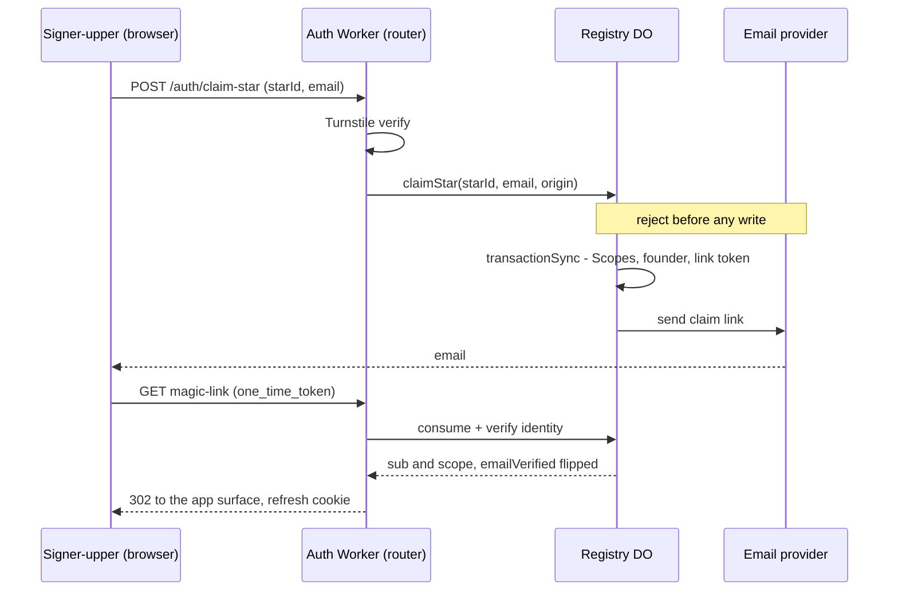

# Star self-signup — open signup, a real founder, no admin in the loop

**Status:** 🚧 **DESIGN PINNED 2026-07-21 — reviewed (`/review-task` Stage 1 + Stage 2), ready for hand-review then `/build-task`.** Phase 2, the headline capability, is unblocked.

## The business decision (pinned by Larry)

**Star self-signup is the PRIMARY use case, and it is open.** A stranger signs up for a Star inside a user-developer's Galaxy without anyone approving it. That is not a security defect to be engineered away; it is the product.

The instinct to reject this — *"a rando can create something inside someone else's `{u}.{g}`"* — is the wrong frame and should be shut down when it recurs. **The standing argument, in Larry's words:**

> *The Star is empty. A bad actor gets control of it. So long as the real intended Star owner gets an error and a path to pick a new slug, nothing of substance is at risk except ownership of that slug.*

The rights model that makes it sound:

| | |
|---|---|
| **Star founder gets** | complete control of their Star — **non-exclusive**: Galaxy, Universe, and super admins all sit above them |
| **Star founder gets NO** | ability to **affect** anything at Galaxy or Universe level |
| **Star founder sees** | only what it needs above it — whatever the `@mesh` guards expose (§Upward visibility). Not "nothing": a Star legitimately reads its app's ontology. |
| **Cleanup** | a covering admin deletes the squatted Star — remediation, not prevention. ⚠️ **Does not work today — see §Remediation.** |

⚠️ **Do not reintroduce an approval step, an invite code, or an admin-in-the-loop as a "safety" measure.** If a specific abuse needs bounding, bound *that* and say so — do not convert the flow back into an authorized one.

## Why the confinement makes this safe

[nebula-confine-admin-bypass.md](nebula-confine-admin-bypass.md) (COMPLETE) is the enabler: a star founder holds an **exact-star** pattern, and `hasAdminOverScope(access, <ancestor>)` is **false** for it at any Galaxy or Universe. So "no ability to affect anything above the Star" is enforced by construction, not by a guard this task adds.

## Design

### What a "founder" is

**The identity minted by the claim, at the claimed scope, stamped `isAdmin` — the scope's first member.** It is a *registry* concept (an `Identities` row), created by the claim itself. Two clarifications, because the word carries weight in this file:

- **NOT "the admin of the org-tree root."** That grant is downstream *and Star-specific*: the founder self-seeds `ROOT_NODE_ID` on their first authenticated touch (§The DAG root grant). Defining "founder" there would not generalize — a **Universe founder has no org-tree at all** (the DagTree lives on the Star, and the collapse adds one at `{u}.{g}`).
- **NOT a persisted marker.** We deliberately build no founder flag (§The DAG root grant), so once other admins exist a founder is **indistinguishable** from any later admin. "Founder" is a role *at creation time*, not an attribute you can query later — don't go looking for a column.

### Who owns what — Option A (registry owns the mechanism)

Star signup **reuses `claim-universe`'s machinery** — an open endpoint on the `nebula-auth` router that creates the `Scopes` row, mints the founder identity, and issues the emailed claim token. Every machine part already exists (`isValidSlug`, `checkSlugAvailable`, `#mintIdentity`, `InviteTokens`, the email path), so the flow adds no new mechanism. ⚠️ **That "no new mechanism" claim is scoped to the flow** — it is NOT true of `signupPolicy`, whose write path does not exist at all (§Signup policy). Do not carry it across.

**What "reuses" means, precisely: `claimStar` is a NEW sibling method on the registry that calls the same private helpers `claimUniverse` calls** — `isValidSlug`, `checkSlugAvailable`, `mintIdentity`, `createMagicLinkAndSend`. It does **not** call `claimUniverse`, and it is **not** a copy-paste of it. Same building blocks, different validation prologue.

**The happy path:**
1. A stranger POSTs `{ starId, email }` to the open `/auth/claim-star`. The Worker router verifies **Turnstile** first.
2. The registry validates, in order, rejecting **before any state change or email**: email format → slug format → **not a reserved slug** → **parent Galaxy exists** → **slug unclaimed**.
3. In one `transactionSync`: insert the `Scopes` row, **mint the founder** (`isAdmin: true`, `emailVerified: false`, **exact-star** pattern), and insert the magic-link token.
4. Email the claim link. *(The only step outside the transaction — see the double-submit note below.)*
5. The founder clicks it: the link is consumed, `emailVerified` flips, a refresh cookie is set, and they land on the app's own surface (**tier-derived redirect**, Phase 4b).
6. Their **first authenticated touch** of the Star self-seeds the org-tree root grant (§The DAG root grant) — no extra step.

⚠️ **Design consideration — keep the already-authenticated door open.** We may later let a *logged-in* user found a Star without the email round-trip. The mechanism allows it (`mintIdentity` already takes `emailVerified`, and the send is a separate final step), so simply **don't foreclose it**: let the endpoint tolerate an authenticated caller and branch (authenticated + verified email → mint verified, **skip step 4**, return success), and don't bake *"check your email"* into the response shape. That stays **claim** semantics — they are founding their *own* Star.

🚨 **What it is NOT: a verbatim copy of `claimUniverse` — that would ship real security holes.** `claim-universe` is **top-level**; `claim-star` **nests under an existing Galaxy**. It is also not a copy of `createStar` (the admin path to a star row) — it deliberately drops that path's admin gate. It is a specific blend; each divergence below is load-bearing security with its own Phase 2 criterion:

| Aspect | `claimUniverse` (top-level) | `createStar` (admin) | **`claim-star` (this task)** |
|---|---|---|---|
| **Admin gate** | none (open) | `#hasAdminOverGalaxy` (`registry:392`) | **none — open.** The pinned business decision; do NOT add one. |
| **Parent-exists check** | none (a universe has no parent) | `if (checkSlugAvailable(parentGalaxy)) throw 'parent_not_found'` (`registry:395`) | **REQUIRED — mirror `createStar`.** Without it an open, unauthenticated mint creates an `isAdmin:true` founder + orphan `Scopes` row under **any** caller-supplied `{u}.{g}` prefix, incl. galaxies that don't exist. An orphan has **no covering admin**, so the pinned remediation backstop (*"a covering admin deletes the squatted Star"*) cannot clean it — only a platform `*` admin can. It also breaks Phase 6's `signupPolicy` read, which needs a real Galaxy `Scopes` row. |
| **Allowed slug** | any valid slug **except `nebula-platform`** (`PLATFORM_INSTANCE_NAME` — the reserved platform pseudo-Universe) | **`dev`** — the only slug any caller creates today (the client hardcodes `{galaxy}.dev`) | any valid, currently-**unclaimed** slug **except `dev`** (plus any env names the collapse later adds — today the `{u}.{g}.{env}` cast is just `dev`) |
| **Turnstile** | in `TURNSTILE_ENDPOINTS` | (n/a — authenticated) | **must be registered** (Phase 2 — separate `Set` from the router). |
| **Mint** | founder, `isAdmin:true`, `{u}` pattern | no founder | founder, `isAdmin:true`, **exact-star** pattern. |

**Why a plain login cannot replace step 1–3 — LOGIN NEVER MINTS.** Identity mint is authority-point-only (the registry says outright *"NEVER call from a login path"*). A magic link for a scope with no identity is **issued and emailed**, then rejected on consumption: `consumeMagicLink` → `getAndVerifyIdentity` → null → `302 /app?error=invalid_token`, **no cookie** (the `'Magic link for non-member'` warn in `login` — [nebula-auth-registry.ts](../packages/nebula-auth/src/nebula-auth-registry.ts)). So a Star with a `Scopes` row and no founder is not "log in and it works" — it is a scope nobody can ever enter. `claim-universe` is the **only** open founder-minting entry today. This is what makes Phase 2 non-optional rather than a convenience. (Documented at [email-login.ts:252-267](../apps/nebula/test/lib/email-login.ts).)

**Keep `claimUniverse`'s ORDERING — every rejection lands BEFORE any state change or email.** With the deltas folded in, the `claim-star` order is: `isValidEmail` → `isValidSlug` → **reserved-slug** → **parent-galaxy-exists** → `checkSlugAvailable` → INSERT `Scopes` → `#mintIdentity` → `#createMagicLinkAndSend`. ⇒ every reject — taken slug, reserved slug, **or phantom parent** — is a synchronous `RegistryError` with **no `Scopes` row written and no email sent to anyone**. That directly satisfies the pinned safety argument (*"the real intended Star owner gets an error and a path to pick a new slug"*), and it is the property the Phase 2 criteria assert per-reject. Do not "simplify" any reject into a post-INSERT catch.

⚠️ **Double-submit is not a corruption risk** — the DO serializes `checkSlugAvailable → INSERT → mint` (no `await` between) and `#mintIdentity` is idempotent, so a concurrent double-POST cleanly 409s the loser; do **not** add an idempotency key. Two real edges, both handled in Phase 2: wrap the writes in **`transactionSync`** (`checkSlugAvailable` inside it) against a partial write; and make the claim **resumable** — on a taken slug, if the founder's email == the caller's, re-send the link instead of 409 — against an incomplete claim (email fails/lost/expired) locking the owner out. Guaranteed *delivery* is a separate concern (our internal-email reliability, **not** the dev-user `nebula-outside-world` sandbox-escape) → [backlog](backlog.md) § internal email reliability.

⚠️ **The registry cannot reach platform DOs** — its own JSDoc says so — *"the registry can't reach platform DOs — dependency direction"*, above `executeScopeDeletion` ([nebula-auth-registry.ts](../packages/nebula-auth/src/nebula-auth-registry.ts)), and two prior files burned the idea ([archive/nebula-auth-surrogate-sub.md](archive/nebula-auth-surrogate-sub.md); [on-hold/nebula-dataplane-root-admin.md](on-hold/nebula-dataplane-root-admin.md) — *"a write with no reader"*). So the DAG grant is **not** the registry's job.

### Naming — `claim` = self-signup, `create` = admin

The convention holds across every scope-creation entry point once `claimStar` lands:

| | **claim** — self-signup (open, mints a founder, emails) | **create** — admin (gated, founderless) |
|---|---|---|
| Universe | `claimUniverse` | — |
| Galaxy | — | `createGalaxy` |
| Star | **`claimStar`** *(this task)* | `createStar` |

The two blanks are correct, not gaps: a Universe is top-level and only ever self-claimed (even the platform bootstrap goes through `claimUniverse` with the reserved slug), and a Galaxy *is* the user-developer's app — always created by the Universe founder.

⚠️ **`createStar` stays — it is the ONLY founderless path**, which is exactly what `.dev` (and any later env Star) needs: no founder, administered by the covering admin's wildcard. `claimStar` cannot serve them (it mints a founder, emails, and *rejects* `dev` as reserved). The two partition cleanly by slug class.

🚨 **But the CLIENT method breaks the convention and must be renamed** (Phase 2): `scopes.createStar(galaxy)` takes a **galaxy** and hardcodes `${galaxy}.dev` — every call site passes a galaxy. It is `createDevWorkspace(galaxy)`, and its current name promises a generality it does not have. Post-`claimStar` a reader could reasonably reach for it to make a *tenant* Star — which it cannot do, and which would be the wrong path anyway. (The registry-side `createStar` name is accurate; leave it.)

⚠️ **The convention encodes two axes that merely correlate today** — *who may call* (open vs admin) and *whether a founder is minted*. If "an admin provisions a tenant Star **with** a founder" (managed onboarding) ever appears, `create` would be admin-gated *and* founder-minting, and the convention goes ambiguous. Fine now; just don't read `create` as permanently meaning founderless.

### The DAG root grant — the existing seed already covers it

The founder's **first authenticated touch** carries everything the seed needs: `aud` = their star, exact-star pattern, `admin`. `Star.onBeforeCall`'s existing gate — `hasAdminOverScope(claims?.access, this.lmz.instanceName)` ([star.ts](../apps/nebula/src/star.ts)) — is **TRUE for an exact-star founder on their own Star**, so the founder self-seeds root on first touch with **zero new code**.

⚠️ **Express the rule host-generically** against `this.lmz.instanceName`, never a tier special-case — the collapse lands the first DagTree on the non-Star host `{u}.{g}`, and the pending DataPlane lift moves this seed off Star entirely.

### Slug — caller-chosen, with a reserved-slug reject

The signer-upper picks the slug. The signup path **must reject reserved names**, mirroring `claimUniverse`'s `PLATFORM_INSTANCE_NAME` check (the `reserved_slug` throw, [nebula-auth-registry.ts](../packages/nebula-auth/src/nebula-auth-registry.ts)).

⚠️ **`dev` is reserved by structure and MUST be on that list.** [nebula-client.ts](../apps/nebula/src/nebula-client.ts) hardcodes `create-star` with `${galaxy}.dev` as the user-developer's authoring workspace; `Star.resetDevData` gates on `s[2] === 'dev'` ([star.ts](../apps/nebula/src/star.ts)); `#parseScope`'s returned `isDev` flags the same thing ([nebula-auth-registry.ts](../packages/nebula-auth/src/nebula-auth-registry.ts)). Without the reject, a stranger founds **the user-developer's own Studio workspace** as `isAdmin: true`: their Studio then 409s `slug_taken` forever behind *"Could not start the development workspace"*, and the squatter's exact-star `isAdmin` clears `resetDevData`'s `requireAdmin` — i.e. they can **wipe it**. Seed the list with `dev` plus whatever env names [nebula-galaxy-collapse-and-chat.md](nebula-galaxy-collapse-and-chat.md) pins for its `{u}.{g}.{env}` cast. Collision on a non-reserved slug is an ordinary `checkSlugAvailable` → 409.

### Signup policy — data the registry owns

*"May anyone sign up for a Star in my app?"* is the **app developer's** policy, but it does not require app code. Put it as a field on the **Galaxy's `Scopes` row** (`signupPolicy`), read by the signup path. The registry reads its own data — **no dependency inversion** — and later shapes (invite-code-required, payment-first, custom fields) extend that field without moving the flow. ⚠️ **Design consideration for Phase 6:** store the policy as a small **JSON object** (`{ mode }`), not a bare enum — same TEXT storage cost, but a future invite-code/payment mode carries config a scalar can't hold without a migration. Build only `open`/`closed`; just don't foreclose the rest with the shape.

That is the seam: the 80% case is free and identical across every app; the 20% we cannot yet specify has somewhere to go.

🚨 **No write path exists yet.** `Scopes` has exactly one column (`universeGalaxyStarId` — [schemas.ts](../packages/nebula-auth/src/schemas.ts)), there is **zero** `UPDATE Scopes` in the package, and the endpoint surface is the seven in `REGISTRY_ENDPOINTS`. A writer needs an append-only `REGISTRY_MIGRATIONS` entry + admin-gated endpoint + registry method + client method + tests — so "no new mechanism" (true of the signup *flow*) does **not** extend to `signupPolicy`.

**`signupPolicy` is entirely Phase 6 (read + write); it does NOT gate Phase 2 — the flow ships open** (the pinned business decision). The field has zero consumers today; landing a closed-by-default read earlier would ship the primary flow dark.

## ⚠️ Remediation — a PREREQUISITE, not a follow-up

The business decision rests on *"a covering admin deletes the squatted Star."* **That does not work today**, and open signup without it is the one combination that does not hold together.

`#computeDeletionPlan` computes `blockedBy = #otherUsers(down, callerEmailLc)` where `down` **includes the target itself**, and `#otherUsers` (defined just below `#computeDeletionPlan` in [nebula-auth-registry.ts](../packages/nebula-auth/src/nebula-auth-registry.ts)) returns every Identity in those scopes whose email differs from the caller's. So a Galaxy admin deleting a squatted Star gets `blockedBy = [the squatter]` → **`RegistryError(409, 'scope_in_use')`** — thrown by `executeScopeDeletion`, in [nebula-auth-registry.ts](../packages/nebula-auth/src/nebula-auth-registry.ts). The block fires on the **Star**, so an automated sweep hits it exactly as a support ticket would. (Galaxies are not the target *today* — but they **become** reachable if Phase 1a's `if (blockedBy.length > 0)` early return is wrongly deleted; that cascade is the 🚨 in Phase 1a.)

### The fix is the principle, not a carve-out

**Authority trickles DOWN. A covering admin may delete any descendant scope — shared or not, risky or not — and the only restraint is a UI warning.** That is a design principle of the whole tier model, not a concession to self-signup: a Galaxy admin already holds full authority over every Star beneath them, so a Star's own members cannot be allowed to *veto* that authority.

⇒ **`blockedBy` → `affectedUsers`, and it stops blocking.** `executeScopeDeletion` no longer throws (the `RegistryError(409, 'scope_in_use')` throw goes). The plan carries **`affectedUsers: { total, sample }`** — a `COUNT` plus a **≤25-email sample**, NOT the unbounded list `#otherUsers` materializes today — and the confirm screen shows it as a *warning*, not a wall. The bound matters: deleting an active Star must never shuttle every attached user's email across the wire (Phase 1a criterion). A "see all / last-login" step-2 is a **deferred follow-on** ([backlog](backlog.md) § deletion-warning enrichment).

⚠️ **Scoped to the deletion TARGET.** Leave the `#otherUsers` check in the **prune-up** — the `if (this.#otherUsers([ancestor], callerEmailLc).length > 0) break;` inside the `while (ancestor)` loop of `#computeDeletionPlan` ([nebula-auth-registry.ts](../packages/nebula-auth/src/nebula-auth-registry.ts)) — intact: that one decides whether the cascade silently climbs into an *ancestor* the admin did not name. Preventing a surprise ancestor wipe is a different concern from letting an admin delete what they explicitly chose.

⚠️ **Keep `#emailForSub`'s fail-closed 403.** It resolves the *caller's* email to exclude them from the attached-user set; a `null` there would silently corrupt the count/sample, so it **403s before a plan is ever returned**. Because it 403s (rather than returning an under-counted plan), a returned plan's `affectedUsers.total` is always trustworthy — so there is no "unknown" state to represent. Don't "relax" this guard as merely-informational now that the list no longer blocks. (It also backs the prune-up ancestor stop.)

## Upward visibility — audit the allocation, don't add a mechanism

The requirement is *not* "a Star sees nothing above it" — that would break the ontology path a Star depends on. It is: **a Star sees only what it needs, and that surface is controlled by the `@mesh` guards on the Galaxy/Universe methods.** `@mesh()` vs `@mesh(requireAdmin)` **is** the control, per method. No new gating mechanism.

A star-scoped caller is admitted to its ancestors by `enforceScopeReach`'s tenant branch and may call every non-admin `@mesh()` method there:

| Node | Method | Assessment |
|---|---|---|
| Galaxy | `getLatestOntologyVersion` / `getOntologyVersion` / `listOntologyVersions` | ✅ **Not a risk.** The app's source/ontology is what every tenant gets by signing up and logging in anyway — reading it is inherent to using the app. |
| Galaxy | `getGalaxyConfig` | **Audit the contents** (Larry's lean: probably fine) |
| Universe | `getUniverseConfig` | **Audit the contents** (Larry's lean: probably fine) |

⚠️ **The work is a CONTENT audit of the two config blobs**, not an architecture change — confirm nothing sensitive to the app developer or universe owner lives there, and that nothing is *expected* to later. If something is, move that field or split the method; do **not** narrow the tenant branch. This matters slightly more under open signup because a squatter gets these reads too.

⚠️ **The current allocation is incidental, not deliberate** — those methods were marked `@mesh()` when "non-admin" meant *another member of the same org*, not *an untrusted stranger who signed up five minutes ago*. Re-confirm each against the new meaning and **write the reason down**.

## Decisions
| Decision | Rejected alternative — why |
|---|---|
| **Open self-signup, no admin in the loop** | An approval step / invite code — contradicts the business model. An approval gate is not a safer version of self-signup; it is a different product. |
| **Option A — the registry owns scope-row + founder-mint + claim-token**, shape-identical to `claim-universe` | A new `apps/nebula` signup endpoint — builds a **second** signup mechanism for what is conceptually one operation, duplicating machinery that already exists, and makes signup an app-layer concern rather than a platform primitive the developer inherits. Also worse under the ossification lens: a second shape every future test anchors to. |
| The founder's pattern is the **exact star id** | A `{u}.*` pattern — a universe admin wearing a star's name, and exactly what the gating task exists to prevent. It is also what makes open signup safe. |
| The founder is the **signing-up user** | The Galaxy admin as founder — then it is not self-signup, and the signing-up user cannot administer their own Star. |
| **DAG grant is lazy, on first authenticated touch**, via the existing seed gate | An eager stamp at signup — there is no authenticated principal yet, so it needs a token minted for someone who has not authenticated, or an `onBeforeCall` exemption. Both are standing backdoors. |
| **Keep the `hasAdminOverScope` seed gate unchanged** | Narrowing it to "exact-star pattern only" — a strict subset that leaves every admin-created Star (incl. every `.dev` workspace, which has no exact-star identity) permanently root-adminless. |
| **No "partially-stamped Star" phase** | Creating the Star in a pending state that only the founder can finish, protected by the slug — redundant *and* weaker. The founder's post-login JWT already carries an unguessable exact-star admin pattern, so the narrowed seed **is** "only the real founder can finish it"; a slug is guessable. Slug reservation is likewise already handled by the `Scopes` row + `checkSlugAvailable`. |
| Caller-chosen slug + **reserved-slug reject** | A server-minted opaque slug — kills squatting and the enumeration surface, but star ids stop being human-friendly and vanity slugs become their own feature later. |
| Signup policy as **registry data** on the Galaxy's `Scopes` row | A policy hook calling into `apps/nebula` — forbidden direction. App code owning the flow — see Option A above. |
| **Authority trickles DOWN: a covering admin may delete any descendant; warn, never block** | (a) The status quo, where a Star's members *veto* an admin above them — inverts the tier model. (b) A narrow "only if the Star has a single founder" carve-out — treats the symptom; the block is wrong for every descendant, not just that case. Restraint belongs in the UI warning, not the authorization. |
| **Founder marker: NOT built — the existing seed gate suffices** | A marker on `Identities` threaded into the JWT. an exact-star founder already satisfies `hasAdminOverScope` on their own Star, so the marker buys only the covering-admin-touches-first race — benign and doubly self-healing — at the cost of a migration and a JWT-payload change. |
| **`signupPolicy` is Phase 6 in full (read + write)** | Landing the read in Phase 2. the field has **zero** consumers today, and a closed default with the write path in the last phase ships the primary flow dark, contradicting the Objective. The premise that shipping open "flips existing Galaxies" was false — `claim-star` does not exist, so nothing is being flipped. |
| **Minimal signup UI, served from Galaxy, after the collapse's serving phase** | (a) Building it in `nebula-studio-ui` — that is the user-developer control plane; a stranger has no business there. (b) Deferring the UI entirely — *"not having Star self-signup before caused us to work around its absence"* (Larry). (c) Building it before the collapse — would require standing up a Galaxy serving surface for signup alone. |
| **Resumable claim + `transactionSync`** (a taken slug re-sends the link to its owner) | (a) A client-supplied idempotency key — dedupes a double-POST the DO already prevents, and does **not** fix the real edge (an incomplete claim locking the owner out). (b) Accept-and-record — leaves the owner stuck on their own slug after any send/lost/expired failure. Guaranteed *delivery* (outbox/Workflows) is a separate deferred concern. |
| **Unblocking deletion is a PREREQUISITE** | Treating it as a follow-up — the business decision's own backstop depends on it. |
| **One file, full product** — not a pre-alpha slice | Splitting pre-alpha (founder mint only) from alpha (the signup product) — *"favor the goal, not the milestone; over-applying YAGNI builds interims harder to overcome than the real thing"* (Larry). |

## Phases

Each phase carries a **Goal** and **capable-of-failing success criteria** — `/build-task` feeds these to its verifier panel, so a phase without them gets rubber-stamped.

### Phase 1a — deletion stops blocking + a bounded warning (PREREQUISITE)
**Goal:** a covering admin can delete a descendant **Star** through the UI regardless of who else is attached (ADR-015), shown a **bounded** warning — the affected scopes + a `count + ≤25-email sample` of attached users — so deleting an active Star never shuttles every attached user's email. **No schema; a query-shape + rename change only.** (The block removal is uniform across tiers per ADR-015; the *richer per-tier warning* a Galaxy needs — a `count + sample` of its **affectedStars**, since a Galaxy's danger is its child Stars, not its own users — is the deferred delete-any-Galaxy task, a similar-but-separate method.)

**Scope — all four sites, or the prerequisite lands "done" with the backstop still broken:**
- **`executeScopeDeletion`** — remove the `if (plan.blockedBy.length > 0) throw new RegistryError(409, 'scope_in_use', …)`. ⚠️ **It is a 409, not a 403.** Two *genuine* 403s live in the same function — `'Caller is not an admin of "…"'` (`#hasAdminOverScope`) and `'Caller identity not found'` (`#emailForSub` fail-closed) — and this file requires **both to stay**. An instruction to "stop the 403" would delete a control we are keeping. ([nebula-auth-registry.ts](../packages/nebula-auth/src/nebula-auth-registry.ts))
- 🚨 **PIN the `if (blockedBy.length > 0)` early return in `#computeDeletionPlan` — DO NOT DELETE IT.** Identify it by predicate: the return **immediately after** `const blockedBy = this.#otherUsers(down, callerEmailLc);`, short-circuiting **before** the prune-up `while (ancestor)` loop. ⚠️ Not the `if (!down.includes(target)) …` guard just above it (an unrelated not-registered check). It looks inert once `blockedBy` stops throwing, so an implementer will want to remove it — **but with it gone, deleting a squatted Star cascades into the Galaxy and Universe**: the prune-up climbs, and because `createGalaxy` mints no identities, `#otherUsers` is empty at each ancestor so each is added to the wipe set. A solo user-developer would lose their Galaxy and Universe by deleting one squatter's Star. ([nebula-auth-registry.ts](../packages/nebula-auth/src/nebula-auth-registry.ts))
- [`nebula-studio-ui/src/App.vue:469`](../apps/nebula-studio-ui/src/App.vue) — early-returns on `plan.blockedBy.length > 0` (becomes `affectedUsers.total`), so the confirm handler no-ops. Under warn-don't-block it must **not** gate on it at all.
- [`nebula-studio-ui/src/App.vue:699`](../apps/nebula-studio-ui/src/App.vue) — drives `:disabled` from the same value, so the button is dead; delete must be enabled. (`:693-694` renders the "Blocked —" copy → a warning: *"N other users are attached"* + the ≤25 sample.)

⚠️ **[`nebula-studio-ui/src/App.vue:48`](../apps/nebula-studio-ui/src/App.vue) hand-copies the `DeletionPlan` type** instead of importing the exported `ScopeDeletionPlan` (which `nebula-client.ts:17/:738` already imports) — and `scripts/type-check.sh` has `SKIP_PACKAGES=("nebula-studio-ui")` with no `vue-tsc`, so **renaming `blockedBy` → `affectedUsers` produces zero errors in any gate** and surfaces only as a runtime `TypeError` on the confirm screen. Import the shared type as part of this phase.

**Success (capable-of-failing):**
- A covering admin deletes a Star holding **another user's** identity and it **succeeds** — reds against today's **409 `scope_in_use`**.
- 🔒 **The cascade still refuses to climb:** delete a **self-signup Star** that is its Galaxy's **only** child; assert `affected` contains the **Star and NOT the Galaxy or Universe**. ⚠️ **The founder makes this work** — a self-signup Star has a founder identity, the founder is a *user*, so `#otherUsers` sees it (email ≠ the deleting admin) and the early return fires. Set the fixture's founder email ≠ the admin's, or the Star reads as **empty** (zero users) and legitimately cascades — which is the admin-created `.dev` case (no founder minted), not this one. This is the criterion that catches the catastrophic regression above; it must exist before the phase is done.
- 🔒 **The attached-user list is bounded.** A Star with **more than 25** attached users yields `affectedUsers.total` = the full count and `affectedUsers.sample.length ≤ 25` — the query is `COUNT(DISTINCT email)` + a `LIMIT 25` read, never the unbounded per-scope materialization `#otherUsers` does today. Reds if the plan carries every email.
- **End-to-end through the UI**, not a registry unit test — an admin clicks delete on a Star with another user attached and it completes. A registry-only test passes while the button is still dead. ⚠️ **Name the lane:** `apps/nebula-studio-ui` has **zero test files, no test script, and is the sole `SKIP_PACKAGES` entry** in `scripts/type-check.sh` — the only lane that renders that SPA is the Playwright + `wrangler dev` + Docker harness at `apps/nebula/test/ui-smoke`. So this criterion means a new `ui-smoke` scenario — real work beyond the registry query change.
- ⚠️ **Retitle + re-assert `nebula-auth-registry.test.ts`'s *"guard: another user on the target blocks the delete"*.** It asserts a populated `blockedBy` (→ `affectedUsers`) and stays **GREEN** after this phase while its name states the opposite of the new behavior — the "green test enshrining the old shape" false-confidence trap (`workflow.md`). Note nothing today asserts the `409 scope_in_use` throw at all, so removing that throw reds **nothing** on its own — this test is the only place the old semantics are written down.
- The prune-up's own `#otherUsers` stop (in the `while (ancestor)` loop) still refuses to climb into an ancestor holding other users.

### Phase 1b — ~~warning enrichment (last-login)~~ ✅ DEFERRED → backlog
The count + ≤25-email sample landed in Phase 1a. The richer step-2 (see-all / pagination + `last-login`, which needs a schema/derivation decision) is **not** on the star-founder path — it moved to [backlog](backlog.md) § deletion-warning enrichment, carrying the two zero-cost `lastLogin` mechanisms and the ADR-011 "no epoch column" ban.

### Phase 2 — open signup endpoint on the registry router
**Goal:** a stranger POSTs a slug + email and becomes the founder of that Star, with no admin involved.

**Scope:** `Scopes` row **(no consent flag)** + `#mintIdentity(email, starId, isAdmin: true)` + `InviteTokens` claim link; reserved-slug reject; **parent-galaxy-exists check**; **Turnstile registration (below)**; the writes in a **`transactionSync`** (`checkSlugAvailable` inside it); **resumable claim** (a taken slug re-sends the link to its owner rather than 409-ing); **rename the client's `scopes.createStar(galaxy)` → `createDevWorkspace(galaxy)`** (it takes a *galaxy* and hardcodes `{galaxy}.dev`, so post-`claim-star` its name invites exactly the wrong reach — see §Naming) — see the delta table in §Who owns what for the five divergences from `claim-universe`, and §Who owns what's resolved double-submit note for the last two. ⛔ **NOT `signupPolicy`** — the whole field, read and write, is Phase 6 (§Signup policy). Phase 2 ships the flow **open**, which is the pinned business decision.

🔒 **`claim-star` must join TWO sets in [router.ts](../packages/nebula-auth/src/router.ts), and only one of them is needed for the route to work.** `REGISTRY_ENDPOINTS` routes it; **`TURNSTILE_ENDPOINTS`** gates it. They are separate `Set`s about ten lines apart, and today `TURNSTILE_ENDPOINTS = new Set(['email-magic-link', 'claim-universe', 'discover'])` — **no `claim-star`**. ⚠️ This is **one of three** places a verbatim `claimUniverse` copy misleads (the delta table in §Who owns what has all of them): `claimUniverse`'s own JSDoc says *"(open, Turnstile-gated at the Worker)"*, but the gate is registered somewhere the copied code does not live. An implementer who copies the registry method faithfully ships an **ungated open mutation endpoint that mints identities and sends email**, and nothing reds. This is a bound on a specific abuse (scripted mass slug-squatting + mail-send amplification), **not** an approval step — the flow stays open to any human.

⚠️ **[`packages/nebula-auth/README.md`](../packages/nebula-auth/README.md) already documents `claim-star` as SHIPPED, with Turnstile** — `:35` lists it among "public mutation endpoints", `:71` maps the route, `:124` tabulates `/auth/claim-star | POST | Turnstile`. So the docs currently promise a control on an endpoint that does not exist. Sweep all three as part of this phase; until then the README is a false assurance, not just a stale line.

**Success (capable-of-failing):**
- 🔒 **Turnstile gate fires — and this needs its OWN vitest project, because the test-mode lane cannot prove it.** `checkTurnstile` (`router.ts:269`) returns `null` on `NEBULA_AUTH_TEST_MODE === 'true'` **before** it ever reads `TURNSTILE_SECRET_KEY` or consults `TURNSTILE_ENDPOINTS`, and `nebula-auth`'s sole `main` project sets that binding (`vitest.config.js:35`) — the very lane the un-skip test below runs in. So "configure `TURNSTILE_SECRET_KEY`" is necessary but **not sufficient**: in test mode the gate is skipped regardless, and adding `claim-star` to `REGISTRY_ENDPOINTS`-alone would **not** flip a test-mode assertion. ⇒ Add a **separate vitest project** whose `miniflare.bindings` set `TURNSTILE_SECRET_KEY`, leave `NEBULA_AUTH_TEST_MODE` **unset**, and present no bypass token; assert a `claim-star` POST with no `cf-turnstile-response` gets **403 `turnstile_required`, no `Scopes` INSERT, no email**. The two criteria (this one, and the un-skip mint below) need **opposite env configs**, so they are different tests in different projects — do not try to make the un-skip test carry this.
- A stranger signs up for a fresh slug and, after the claim link, holds `admin` with an **exact-star** `authScopePattern` — assert the pattern, not just that login worked. Reds if the mint ever widens to `{u}.*`.
- 🔒 **Phantom parent is rejected.** A `claim-star` for `{u}.{g}.{s}` whose parent galaxy `{u}.{g}` has **no `Scopes` row** is rejected `parent_not_found` — **before** any INSERT, mint, or email. Reds if the `claimUniverse`-shaped body (which has no parent check) is copied. This is the orphan-star / namespace-squat case, and it is what keeps the remediation backstop and the Phase 6 policy read meaningful.
- 🔒 `{galaxy}.dev` is **rejected, with NO `Scopes` row created and NO email/claim link produced** (assert all three, matching the taken-slug "assert both" — the reject must land before any state change). The security-critical case: a squatter would 409 the user-developer's Studio forever *and* clear `resetDevData`'s `requireAdmin`. Extend to whatever env names the collapse pins.
- **Taken-slug behavior is owner-aware** (resumable claim), two tests, opposite email: a re-claim **by a different email** gets `RegistryError(409, 'slug_taken')` with **no email sent** (assert both — a 409 that still emails breaks the pinned safety argument); a re-claim **by the founder's own email** instead **re-sends the magic link**, no 409 (idempotent resume).
- **The claim writes are atomic.** `Scopes` + `Identities` (+ `MagicLinks`) commit in one `transactionSync`; force `#mintIdentity` to throw mid-sequence and assert **no orphan `Scopes` row** survives. Reds if the writes aren't wrapped.
- ✅ **`provisionAndLogin` collapses.** [email-login.ts:272](../apps/nebula/test/lib/email-login.ts) currently reaches a star founder by claiming the **universe** and creating the galaxy/star beneath it — a detour that exists *only* because `createStar` mints no founder, and whose ⚠️ names this task file as the fix. Rewriting it to a direct claim-star, with its call sites unchanged, is **part of Phase 2's DONE definition**, not a follow-up. ⚠️ Its universe-claiming path must **survive** for callers genuinely provisioning a universe — collapse the star case, don't delete the function.
- 🔒 **The redirect tier-split is tested HERE, where it is built — not deferred to Phase 4b.** The `consumeAndLogin` change that routes a star-tier claim link to the Galaxy-served surface (Phase 4b's 🔒 note pins it as *"built in Phase 2"*) bakes into every emailed link and cannot be fixed later. It is a cheap **302 `Location` assertion** over the real claim→consume loop, no rendered page needed: a **star-tier** claim's consume redirects to the tenant surface; a **universe/galaxy-tier** claim still redirects to `/app/{scope}`. Reds against today's env-global `NEBULA_AUTH_REDIRECT`. (Phase 4b keeps only the *rendered-page* assertions, which genuinely need the collapse's serving surface + `ui-smoke`.)
- ⚠️ **Un-skip `nebula-auth-routes.test.ts` `claim-star: open self-signup mints an exact-star founder and rejects reserved slugs`** — it already carries these as skipped assertions and shows as `↓ skipped` until then. Extend with response shape + claim-token details once pinned; they are deliberately unasserted so it stays a contract, not a scaffold.

### Phase 3 — re-ground the baseline fixtures onto real star founders
**Goal:** retire the interim where a fixture asking for "an admin at this star" receives a universe admin.

⛔ **Depends on Phase 2** — nothing but `claim-star` mints a star founder, and this phase re-grounds fixtures *onto* one. (No seed change is involved; Phase 4 was cut.)

**Success (capable-of-failing):**
⚠️ **PRE-STEP — the intent-split is NOT finished, and the criterion below is false until it is.** Enumerate with `grep -rn 'adminClientAt(' apps/nebula/test | grep -v test-helpers.ts` (**78 sites across 39 files** at time of writing; the helper's own JSDoc estimates "~70"). Several of those pass a **non-star** scope and assert wildcard cross-tier reach — `scope-isolation.test.ts` *"a galaxy admin reaches a descendant Star"* / *"a universe admin reaches a descendant Galaxy and Star"*, and sites in `scope-binding.test.ts`. A body that mints an **exact-star founder cannot serve a galaxy or universe `scope` argument**, so those must MOVE to `universeAdminClient` first. That one `it()` in `scope-isolation.test.ts` already calls `universeAdminClient` for its positive control while its primary client is still `adminClientAt` is the tell that the sweep missed them. **Do not satisfy the criterion with a tier-branch inside the helper** — that is the tier special-case this file bans, hidden in a test helper.

- **After the pre-step, only the `adminClientAt` body changes**; no *remaining* `adminClientAt` call site is edited by the re-grounding itself. That is the payoff of the intent-split ([test-helpers.ts](../apps/nebula/test/test-helpers.ts)).
- **No `universeAdminClient` call site is touched** — they depend on the wildcard and must keep the universe admin (`grep -rn 'universeAdminClient(' apps/nebula/test | grep -v test-helpers.ts` — 13 before the pre-step, more after).
- The baseline lane is green, and a fixture asserting an exact-star pattern now passes where it previously would have seen `{u}.*`.

### Phase 4 — ~~founder preference in the seed~~ ✅ CUT
**Not built — resolved by pinning, not by deferral.** The existing `Star.onBeforeCall` gate already seeds a self-signup founder on their own Star (an exact-star pattern satisfies `hasAdminOverScope`), so this phase had no consumer. See §The DAG root grant for the reasoning and the one benign case it declines to fix. **Phase numbering is left intact** so existing git-history references keep resolving.

### Phase 4b — the signup UI (minimal), served from Galaxy
**Goal:** a stranger can actually sign up — a real page, on the app's own surface, not a curl command.

**Build a minimal UI, served from Galaxy** — the collapse confirms why: [nebula-galaxy-collapse-and-chat.md](nebula-galaxy-collapse-and-chat.md) makes **Galaxy the node that serves the tenant-facing app** (*"the user-developer's built app is a pre-built static artifact … served dev: Galaxy-direct/uncached — the Galaxy DO **IS** engaged per request"*). A signup page for a Star inside `{u}.{g}` belongs on exactly that surface. ⚠️ **Do NOT build it inside `nebula-studio-ui`** — that is the user-developer **control plane**, and a stranger signing up for someone else's app has no business there; it would be a textbook interim to unlearn.

⛔ **SEQUENCED AFTER [nebula-galaxy-collapse-and-chat.md](nebula-galaxy-collapse-and-chat.md) Phase 3 ("build-box + container-less serving").** ⚠️ **Galaxy has NO `fetch` handler today** — verified: the only HTTP surfaces in `apps/nebula/src` are `entrypoint.ts` and `dev-container.ts`. Collapse Phase 3 is what gives Galaxy its serving surface. Building signup before it means standing up a serving surface *for signup alone* — the interim this repo keeps paying to unlearn. After it, the page is a route on a surface that already exists.

🔒 **The one wire-level decision the UI cannot fix later — pin it in this file, build it in Phase 2.** `consumeAndLogin` redirects **every** claim/magic-link/invite click to `${NEBULA_AUTH_REDIRECT}/{scope}`, and `NEBULA_AUTH_REDIRECT` is a single **env-global** value pinned to `/app` — the Studio SPA. So today a Star founder clicks their claim link and lands in the user-developer control plane, in `stageMode==='help'`, reading about Universes and Galaxies. **The redirect target is baked into the emailed link**, so no later UI work can correct a link already sent. **Mechanism: derive the destination by TIER at the one site that already holds it** — `consumeAndLogin` has `result.universeGalaxyStarId` in hand, so a **star-tier** scope routes to the Galaxy-served tenant surface and universe/galaxy-tier keeps `/app`. One site, tier-derived, no per-Galaxy config to thread and no new env var per tenant.

**Success (capable-of-failing):** — *rendered-page assertions only; the redirect tier-split itself is tested in Phase 2 (`consumeAndLogin` 302 `Location`), where it is built.*
- **(`ui-smoke` lane)** A stranger completes signup **through the rendered page** and lands authenticated on the app's own Galaxy-served surface — not the Studio SPA. Needs the collapse's serving surface, hence the ⛔ above.
- **(`ui-smoke` lane)** Turnstile widget is present and enforced on the rendered form (pairs with Phase 2's server-side gate criterion; widget provisioning is the tracked blocker in `apps/nebula/harness/FINDINGS.md` B0/B1).

### Phase 5 — audit §Upward visibility
**Goal:** every non-admin `@mesh()` on Galaxy/Universe is deliberately tenant-readable, with the reason written down.

**Success (capable-of-failing):** ⚠️ **Regenerate the inventory** (`grep -rn '@mesh()' apps/nebula/src/galaxy.ts apps/nebula/src/universe.ts`) rather than trusting §Upward visibility's table — the collapse changes what a tenant can reach. Then: a written justification line per method, and a check that neither config blob carries anything app-developer-private. A method with no written reason fails the phase.

### Phase 6 — `signupPolicy` write path
**Goal:** a Galaxy admin can turn signup on/off for their app.

**Scope:** append-only `REGISTRY_MIGRATIONS` entry + admin-gated endpoint + registry method + client method + UI toggle — **plus the read** in the `claim-star` path. **None of this exists** — see §Signup policy. Default-on-absent is decided here, where the write path exists to change it; until this phase, signup is open.

**Success:** a Galaxy admin toggles the policy and a subsequent signup to that Galaxy is accepted/rejected accordingly, end-to-end.

## Relationships
- ✅ **Gated by [nebula-confine-admin-bypass.md](nebula-confine-admin-bypass.md) — COMPLETE.** Not merely sequencing: the confinement is what makes open self-signup safe.
- **Partially supersedes [on-hold/nebula-dataplane-root-admin.md](on-hold/nebula-dataplane-root-admin.md) Part 1** — answers its `TODO(self-signup)` (the founder is known at signup) but narrows rather than retires the latch. Part 2 (last-admin protection) unaffected. **Part 1b (placement) stays deferred there — not this task's decision.** DO location pins at **first instantiation** (whether by name or a random id) and never moves, so `claim-star` is the natural **geo-capture seam** — it's the one place we hold the signing-up user's own `request.cf`. But explicit `locationHint` threading isn't built, isn't pre-alpha-critical, and the **lazy seed already lands the Star near its founder** (the Star DO is first instantiated by the founder's own first authenticated touch). Grab it when Part 1b is built; nothing to do here.
- **Overlaps [nebula-auth-identity-mint.md](nebula-auth-identity-mint.md)** — star-tier admins by *invite* rather than self-signup. Same principal shape, different provenance; neither blocks the other.
- **Retires the fixture interim** recorded in the gating task's Phase 0 (every `adminClientAt` call site — 78/39 files at time of writing; see Phase 3's grep). Not on the pre-alpha critical path — [nebula-galaxy-collapse-and-chat.md](nebula-galaxy-collapse-and-chat.md) does not reference this file.
