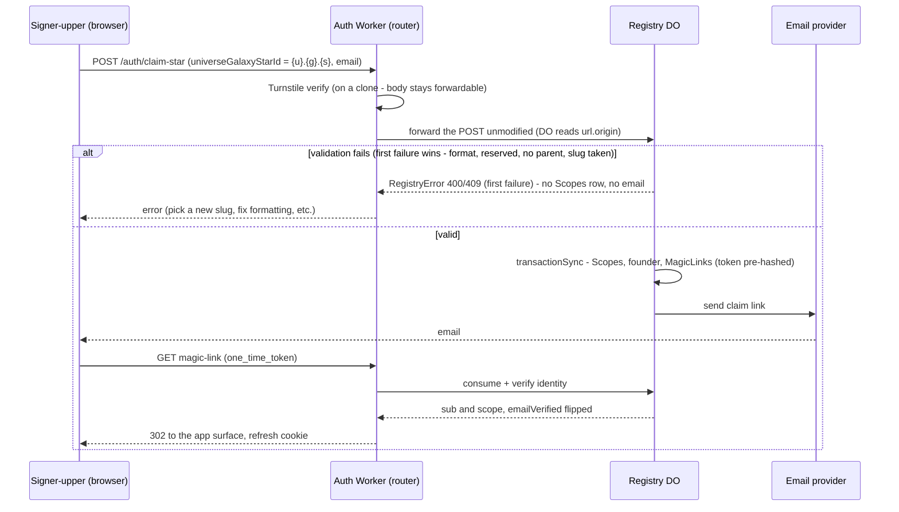

**Status:** 🚧 **Phases 1, 2, 2b, 3 + 4 ✅ BUILT + green 2026-07-25** — only Phases 5 (signup UI, needs the collapse's serving surface) and 6 (upward-visibility audit) remain. — `nebula-auth` 211 tests pass (was 195), `apps/nebula` baseline+frontend 531 pass, type-check clean. All 7 security branches in Phase 2 are **mutation-verified** (each reds exactly its own test). **Phases 3–6 are DESIGN PINNED, not built.** ⚠️ Phase 2's `ui-smoke` un-skip criterion was found FALSE while building and is corrected in place — `claim-star` refuses `.dev` by design, so it does not unblock that lane.

## The business decision (pinned by Larry)

**Star self-signup is the PRIMARY use case, and it is open.** A stranger signs up for a Star inside a user-developer's Galaxy without anyone approving it. That is not a security defect to be engineered away; it is the product.

The instinct to reject this — *"a rando can create something inside someone else's `{u}.{g}`"* — is the wrong frame and should be shut down when it recurs. **The standing argument, in Larry's words:**

> *The Star is empty. A bad actor gets control of it. So long as the real intended Star owner gets an error and a path to pick a new slug, nothing of substance is at risk except ownership of that slug.*

The rights model that makes it sound:

| | |
|---|---|
| **Star founder gets** | complete control of their Star — **non-exclusive**: Galaxy, Universe, and super admins all sit above them |
| **Star founder gets NO** | ability to **affect** anything at Galaxy or Universe level |
| **Star founder sees** | only what it needs above it — whatever the `@mesh` guards expose (§Upward visibility). Not "nothing": a Star legitimately reads its app's ontology. |
| **Cleanup** | a covering admin deletes the squatted Star — remediation, not prevention. ✅ **Works as of Phase 1 — see §Remediation.** |

⚠️ **Do not reintroduce a gate — no approval step, invite code, admin-in-the-loop, or per-Galaxy signup on/off switch — as a "safety" measure.** Star signup is **never gated**, exactly like Universe self-claim: there is no super-admin approval and no per-Galaxy policy. If a specific abuse needs bounding, bound *that* and say so — do not convert the flow back into an authorized one.

## Why the confinement makes this safe

[nebula-confine-admin-bypass.md](archive/nebula-confine-admin-bypass.md) (COMPLETE) is the enabler: a star founder holds an **exact-star** pattern, and `hasAdminOverScope(access, <ancestor>)` is **false** for it at any Galaxy or Universe. So "no ability to affect anything above the Star" is enforced by construction, not by a guard this task adds.

## Design

### What a "founder" is

**The identity minted by the claim, at the claimed scope, stamped `isAdmin` — the scope's first member.** It is a *registry* concept (an `Identities` row), created by the claim itself. Two clarifications, because the word carries weight in this file:

- **NOT "the admin of the org-tree root."** That grant is downstream *and Star-specific*: the founder self-seeds `ROOT_NODE_ID` on their first authenticated touch (§The DAG root grant). That gives it the maximum chance of the Star DO being geolocated close to the founder and hopefully most of that Star's users. Defining "founder" there would not generalize — a **Universe founder has no org-tree at all** (the DagTree lives on the Star, and the collapse adds one at `{u}.{g}`).
- **NOT a persisted marker.** We deliberately build no founder flag (§The DAG root grant), so once other admins exist a founder is **indistinguishable** from any later admin. "Founder" is a role *at creation time*, not an attribute you can query later — don't go looking for a column.

### Who owns what — the registry owns the mechanism

Star signup is a **new registry method, `claimStar`** — an open `nebula-auth` endpoint that validates the submitted form (§Validation), then in one transaction creates the `Scopes` row, mints the founder identity, and issues the emailed claim token. **Reuse `claimUniverse`'s machinery wherever you can** (`#mintIdentity`, the magic-link helper — which §Validation **splits** into a sync row-insert + an async send — and the same fail-fast validation prologue); where `claim-star` must deviate — parent-exists, the reserved set, the exact-star pattern — that is expected and enumerated in the delta table below, not something to engineer around.

⚠️ **No new email template — it reuses `claimUniverse`'s generic "Sign in to Nebula" copy.** `#createMagicLinkAndSend` sends `type: 'magic-link'` (`{ to, magicLinkUrl }` only) — no app/Star name, no signup signal. **Softened by serving signup only from the Galaxy landing page** (below): the user is on a Nebula-rendered page when they submit, so "Sign in to Nebula" is far less jarring, and it buys time for a distinct `claim`/welcome template (worth a look before F&F, not a blocker). Mechanism is one subclass — `NebulaEmailSender extends AuthEmailSenderBase`, a `WorkerEntrypoint` with a **method per email type**, bound `AUTH_EMAIL_SENDER`; per-tier branded copy is the deferred work in [nebula-scratchpad.md](nebula-scratchpad.md) § Email Template Customization.

**The `claim-star` flow** (reject ordering is noted below; the first-touch self-seed is in §The DAG root grant):

⚠️ **Signup is served ONLY from a Galaxy-rendered landing page at `/app/{u}.{g}`** (Phase 5) — never from the app-developer's own site. It prompts for email + slug, then POSTs `claim-star`. **The path is load-bearing:** signup is necessarily **galaxy-scoped** (the star does not exist yet), and under the collapse's pinned routing (`run_worker_first: ["/app/*", "/gateway/*", "/auth/*", "/_version"]`) a **bare** `{u}.{g}` matches no worker-first prefix — it falls through to Assets and renders the **Studio SPA**, the control plane this phase forbids. Two segments under the existing `/app/*` prefix is Galaxy-served and needs no new route: `/app/{u}.{g}` = the app's signup/landing page · `/app/{u}.{g}.{s}` = a tenant's instance of it · `/studio/{u}.{g}` = authoring. Payoffs: the POST needs no cross-origin allowance, and the DO reads **`url.origin`** off the forwarded request to build the magic-link URL — keeping the email in-context (§email note above). An app with its own website can link to `/app/{u}.{g}` as its signup page.

⚠️ **Design consideration — keep the already-authenticated door open.** We may later let a *logged-in* user found a Star without the email round-trip.

🚨 **`claim-star` is a specific blend — and every divergence is load-bearing security.** It is open and founder-minting like `claimUniverse`, but **nests under an existing Galaxy** like `createStar` (whose admin gate it drops). ⚠️ A verbatim `claimUniverse` copy would ship real security holes: each row below is a deliberate divergence with its own Phase 2 criterion.

| Aspect | `claimUniverse` (top-level) | `createStar` (admin) | **`claim-star` (this task)** |
|---|---|---|---|
| **Admin gate** | none (open) | `#hasAdminOverGalaxy` | **none — open.** The pinned business decision; do NOT add one. |
| **Parent-exists check** | none (a universe has no parent) | `if (checkSlugAvailable(parentGalaxy)) throw 'parent_not_found'` | **REQUIRED — mirror `createStar`.** A Star nests under a Galaxy, so this is just an existence query — `checkSlugAvailable(parentGalaxy)` (a public one-row `SELECT` on `Scopes`), the same check `createStar` already runs — copy its exact form, `if (this.checkSlugAvailable(parentGalaxy)) throw new RegistryError(400, 'parent_not_found', …)` (note the **un-negated** call: slug *available* ⇒ parent absent). Skip it and an open, unauthenticated mint writes an `isAdmin:true` founder + `Scopes` row under **any** `{u}.{g}` the caller names, incl. galaxies (or universes) that never existed — namespace pollution. Edge harm: a *fully*-orphan Star (its **universe** absent too, so nobody holds a covering pattern over it) escapes even the pinned remediation backstop — only a platform `*` admin can clean it. It's an integrity check, not an admin gate. |
| **Allowed slug** | any valid slug **except `nebula-platform`** (`PLATFORM_INSTANCE_NAME` — the reserved platform pseudo-Universe) | **`dev`** — the only slug any caller creates today (the client hardcodes `{galaxy}.dev`) | any valid, currently-**unclaimed** slug **except `dev`** (plus any env names the collapse later adds — today the `{u}.{g}.{env}` cast is just `dev`) |
| **Turnstile** | in `TURNSTILE_ENDPOINTS` | (n/a — authenticated) | **same end-state — in `TURNSTILE_ENDPOINTS`** — but *not* automatic: the gate is a separate `Set` the method body never touches, so a verbatim copy ships it **ungated** (Phase 2 must register it). |
| **Mint** | founder at the **universe** scope → derives `{u}.*` | no founder | founder at the **star** scope: `#mintIdentity(email, {u}.{g}.{s}, isAdmin: true)`. **Pass the full 3-segment star id** — the pattern is *not* a parameter; `#mintIdentity` stores no pattern, and `buildAuthScopePattern` derives **exact-star** (no wildcard, covers only itself) from a 3-segment scope at token-mint time. Minting at the universe scope — the verbatim-copy slip — silently yields `{u}.*`: a universe admin wearing a star's name. ⚠️ The confinement **enforces** the pattern, it does not **validate** it, so a bad mint is faithfully honored. |

### Validation — first-failure-wins, on the EXISTING error shape

`claimStar` validates exactly the way `claimUniverse` already does: a **fail-fast prologue of `if (…) throw new RegistryError(status, code, message)`**, in the pinned order, emitting today's `{ error, error_description }` body. **No new error contract, no collect-all, no shape change anywhere in the package.**

**Request body:** **`universeGalaxyStarId`** + **`email`**, matching `create-star`'s field names. ⚠️ Not `starId` — that name appears nowhere in source.

**Checks, in order** — format (`isValidEmail`, `isValidSlug`) → reserved-slug → parent-galaxy-exists → slug-available. The first failure returns; the rest never run.

⚠️ **Multi-error UX is the CLIENT's job, not the server's.** Returning only the first failure is poor form UX *if the server is the only validator* — so the signup page (Phase 5) validates **format client-side** before it ever POSTs. That leaves at most one realistic server-side error for a well-behaved client: **`slug_taken`**, which genuinely needs the round-trip. `parent_not_found` means an attacker or a client bug, and `reserved_slug` is likewise unreachable from our own form. So the collect-all case the server would be built for is one the client has already eliminated.

*(Considered and dropped, 2026-07-25: a package-wide `{ issues: [{path, code, message}] }` contract to return validation + slug-uniqueness in one shot. It was drafted as its own task file and killed at Stage-1 review — it bought **uniformity nowhere** (every JSON error body in `nebula-auth` is already `{ error, error_description }`; the genuine non-uniformity is plain-text 404/405 and bodyless 302 redirects, which survive any shape change), it required a package-wide refactor of shared router helpers, and it created a **dependency cycle** with this file's Phase 2. Revisit only when the ontology-driven form primitive lands — it brings its own Standard-Schema issue shape and a real consumer: [backlog](backlog.md) § form-validation primitive.)*

**Ordering — the atomic unit, and why the hash comes first.** `transactionSync(closure)` takes a **synchronous** closure, but `#createMagicLinkAndSend` is `async`: it `await`s `hashString` **before** its `MagicLinks` INSERT. The two cannot be composed naively — and the naive wrap is a **silent** failure: it type-checks (`T` infers `Promise<…>`) and commits before the link row is written. Pin the order:

1. **`await hashString(rawToken)` FIRST**, before any check — so no `await` ever sits between the checks and the write.
2. **All validation**, synchronous (above).
3. **`transactionSync(INSERT Scopes + #mintIdentity + INSERT MagicLinks)`** — no `await` inside.
4. **`await` the send AFTER commit** — an email send inside a transaction is both un-rollback-able and an open input gate.

⇒ This **splits `#createMagicLinkAndSend`** into a **sync** `#insertMagicLinkRow(tokenHash, …)` + an **async** send — and the ordering then governs **every caller of that helper, not just `claim-star`.** There are two callers and three write-paths:

| Write-path | writes before the link row | treatment |
|---|---|---|
| **`claimStar`** *(new)* | `Scopes` + `#mintIdentity` | hash → `transactionSync` → send |
| **`claimUniverse`** | `Scopes` + `#mintIdentity` | the same wrap — **defence-in-depth, NOT a shipped defect.** It uses no `transactionSync` today, but the orphan-`Scopes` row that would guard is **not currently reachable**: `#mintIdentity` pre-checks its only UNIQUE `(email, universeGalaxyStarId)` and **returns the existing `sub`**, and `sub`/`profileId` are fresh UUIDs — so it has no reachable throw. Wrap it anyway (the ordering change touches it regardless, and an unwrapped sibling is the inconsistency this file rejects for the contract), but do **not** write a criterion premised on forcing that throw. |
| **`requestMagicLink`** — **bootstrap branch** | `INSERT OR IGNORE Scopes` + `#mintIdentity` | same wrap. Self-heals by construction (both writes idempotent, so the next bootstrap request re-runs cleanly), but leaving one of three siblings unwrapped is the same inconsistency. |
| **`requestMagicLink`** — normal path | none (the helper's single link row) | **ordering only, no transaction** — one write is trivially atomic. It is the **live login path**: Phase 2 carries a criterion that it is behaviorally unchanged. |

*(A synchronous digest would dissolve the ordering constraint entirely — `node:crypto`'s `createHash` is sync and supported under `nodejs_compat` — but `hashString` lives in the published `@lumenize/auth`, where a `node:crypto` import would impose that flag on every consumer. Deferred: [backlog](backlog.md) § sync digest.)*

**The two failure points, both returning the contract above:**
1. **Pre-transaction validation** — the fail-fast prologue, synchronous. ⚠️ **Never slip an `await` between the checks and the write** — an open input gate is a TOCTOU window on the slug. On *any* failure: a `RegistryError` with **no `Scopes` row** — and no email, **with one pinned exception: the owner-matched resume** (below), which is by construction a `slug_taken` failure that *does* write a `MagicLinks` row and *does* send. (The safety argument — *"the real intended Star owner gets an error and a path to pick a new slug"* — is unchanged, and now returns *all* failures at once.)
2. **Transaction failure** — `transactionSync` is atomic, so a mid-sequence throw leaves **no orphan `Scopes` row**. ⚠️ **Do NOT add a broad `catch` inside `claimStar`**: the registry's `fetch()` already try/catches the whole endpoint switch, and a genuinely unexpected failure must stay a **500** rather than be dressed up as a field error. Exactly two **narrow** exceptions, both pinned: map a UNIQUE-conflict to `slug_taken`, and guard the JSON parse (below). Rethrow everything else.

⚠️ **The DO needs a JSON-parse guard the Worker used to provide.** Today the Worker's rebuild does `?? {}` on a malformed body, so `claim-universe` returns a clean **400** (`isValidEmail(undefined)` fails). Under the raw forward the DO's `await request.json()` throws a `SyntaxError` — not a `RegistryError`, so it falls to the `fetch()` catch's non-`RegistryError` fallback (`return Response.json({ error: 'internal_error', … }, { status: 500 })`) → **500**. So this is a **regression to fix, not a neutral move**: add the guard in the registry `fetch()` for all three raw-forwarded endpoints, returning **the existing shape** — `Response.json({ error: 'invalid_request', error_description: 'Request body must be JSON' }, { status: 400 })`, matching the six sibling 400s already in that same `fetch()` switch. ⚠️ Do **not** "fix" it by pre-parsing in the Worker — that consumes the body and forecloses the raw forward.

**Owner-aware slug-available (resumable claim).** When the slug is taken, look up `(normalizeEmail(email), universeGalaxyStarId)` in `Identities` matching **`isAdmin = 1` AND `emailVerified = 0`** — a founder mid-claim (link failed, lost, or expired). On a match, **re-send the magic link by email**.

⚠️ **Return the `slug_taken` response BEFORE the send — do not `await` the provider hop on this branch.** Otherwise the resume is a **timing oracle**: only that branch awaits an external send, so a prober distinguishes 409-fast from 409-slow and recovers exactly the bit the design protects. (The ordering pin above is about *atomicity* — writes before the send — not about blocking the response on it.) Pin how the send's rejection is handled so it isn't an unhandled rejection (`testing.md`). ⚠️ **This is not testable by timing** — every lane sets `NEBULA_AUTH_TEST_MODE`, where the send is short-circuited — so assert it **structurally**: no branch's `slug_taken` return is preceded by an awaited `#sendEmail`.

⚠️ **The response is `slug_taken` either way — the resume must NOT be observable in it.** Returning a fresh-claim-shaped success on resume would turn success-vs-`slug_taken` into an **email-confirmation oracle**: probe a slug with a throwaway address → `slug_taken`; probe with `victim@corp.com` → success proves the victim is that slug's unverified founder (and mails them). Keeping the body identical to an ordinary rejection leaves the email as the only channel **this endpoint** opens, and it reaches the real owner. ⚠️ **Not "the only channel" full stop** — `discover(email)` (`nebula-auth-registry.ts`, **unauthenticated**, Turnstile-only) already answers *"is this email an admin of `{u}.{g}.{s}`"*, so the residual delta here is just the `emailVerified` bit plus the mail trigger. Treat this as defence-in-depth, not proof of unlinkability. 🚨 **And `claim-star` invalidates that oracle's recorded acceptance** ([backlog](backlog.md) § `discover(email)` oracle): the acceptance reasoned about a handful of *user-developer* identities, but self-signup puts **every end user of every user-developer's app** into that table, turning it into a cross-tenant *"which apps has alice@corp.com signed up for"* lookup — a population it was never evaluated against, and one Turnstile does not stop for a targeted probe. **Gate deployed exposure on re-recording (or narrowing) that acceptance**, alongside `turnstile-on-in-prod.md` Phase 0. A **completed** claim (verified founder) is an ordinary `slug_taken` with **no** email — that owner signs in through the existing `POST /auth/{star}/email-magic-link`.

⚠️ **The resume writes ONLY a new `MagicLinks` row — never `UPDATE Identities`.** The `isAdmin = 1` clause above is load-bearing: `issueInvites` mints pending invitees as `(isAdmin 0, emailVerified 0)` at the same scope, so a looser predicate matches them — and an implementer reading "resume the claim" as `SET isAdmin = 1` would **promote an invitee to star admin through an unauthenticated endpoint**.

Double-submit needs no idempotency key: the synchronous `checkSlugAvailable → INSERT` has no slip-in and `#mintIdentity` is idempotent, so a concurrent double-POST cleanly loses the race. (Guaranteed *delivery* — outbox/retries — is a separate concern: [backlog](backlog.md) § internal email reliability.)

⚠️ **Not typia here** — and *not* because of request cost: the registry singleton is deliberately **off** the hot path (refresh is a pure KV read that never touches it). The binding reasons are sequencing, recorded in [backlog](backlog.md) § form-validation primitive — the 9 MB typia **generator** rides the container-move, and our build-free dev loop has no generate-and-commit AOT path for a static type (generated validators are small and go anywhere). When that primitive lands it brings its own **Standard-Schema** issue shape (`path` + `message`, plus a `code`) — and that, not this file, is the moment to revisit collect-all, with a real consumer behind it (§Validation's dropped-alternative note).

⚠️ **The registry cannot reach platform DOs** (its own JSDoc — *"dependency direction"*; two prior files burned the idea — [archive/nebula-auth-surrogate-sub.md](archive/nebula-auth-surrogate-sub.md), [on-hold/nebula-dataplane-root-admin.md](on-hold/nebula-dataplane-root-admin.md) *"a write with no reader"*). So the DAG grant is **not** the registry's job — it's the lazy seed (§The DAG root grant).

### Naming — `claim` = self-signup, `create` = admin

The convention holds across every scope-creation entry point once `claimStar` lands:

| | **claim** — self-signup (open, mints a founder, emails) | **create** — admin (gated, founderless) |
|---|---|---|
| Universe | `claimUniverse` | — |
| Galaxy | — | `createGalaxy` |
| Star | **`claimStar`** *(this task)* | `createStar` |

The two blanks are correct, not gaps: a Universe is top-level and only ever self-claimed (even the platform bootstrap goes through `claimUniverse` with the reserved slug), and a Galaxy *is* the user-developer's app — always created by the Universe founder.

⚠️ **`createStar` stays — it is the ONLY founderless path**, which is exactly what `.dev` (and any later env Star) needs: no founder, administered by the covering admin's wildcard. `claimStar` cannot serve them (it mints a founder, emails, and *rejects* `dev` as reserved). The two partition cleanly by slug class.

🚨 **But the CLIENT method breaks the convention and must be renamed** (Phase 2): `scopes.createStar(galaxy)` takes a **galaxy** and hardcodes `${galaxy}.dev` — every call site passes a galaxy. It is `createDevWorkspace(galaxy)`, and its current name promises a generality it does not have. Post-`claimStar` a reader could reasonably reach for it to make a *tenant* Star — which it cannot do, and which would be the wrong path anyway. (The registry-side `createStar` name is accurate; leave it.)

⚠️ **The convention conflates two axes that only correlate today** (*who calls* — open vs admin — and *founder minted or not*). Managed onboarding — an admin provisioning a tenant Star **with** a founder — would break the correlation, so don't read `create` as permanently meaning founderless.

### The DAG root grant — the existing seed already covers it

The founder's **first authenticated touch** carries everything the seed needs: `aud` = their star, exact-star pattern, `admin`. `Star.onBeforeCall`'s existing gate — `hasAdminOverScope(claims?.access, this.lmz.instanceName)` ([star.ts](../apps/nebula/src/star.ts)) — is **TRUE for an exact-star founder on their own Star**, so the founder self-seeds root on first touch with **zero new code**.

⚠️ **Express the rule host-generically** against `this.lmz.instanceName`, never a tier special-case — the collapse lands the first DagTree on the non-Star host `{u}.{g}`, and the pending DataPlane lift moves this seed off Star entirely.

⚠️ **Sweep the stale `TODO(self-signup)` in `star.ts` while you're here.** `Star.onBeforeCall` (`star.ts:118-122`) promises this gate *"gains a **founder preference**"* — the founder-marker this task **cut** (§Decisions "the existing seed gate suffices — add no founder-specific machinery", variant (b); zero new code). The comment names this task file as its pointer, so shipping the task without touching it leaves **reversed-decision archaeology at a security gate**. Correct or delete it to match the shipped model (seed gate, no preference).

### Slug — caller-chosen, with a reserved-slug reject

The signer-upper picks the slug; the path rejects reserved names (a `reserved_slug` throw, like `claimUniverse`'s `PLATFORM_INSTANCE_NAME` check).

**Star slugs are unique within their Galaxy, not globally.** Uniqueness is on the full `{u}.{g}.{s}` (the `Scopes` PRIMARY KEY — `checkSlugAvailable` keys on the whole dotted id, never the bare segment), so `acme.crm.tenant-a` and `acme.shop.tenant-a` coexist. Each Galaxy has its own tenant namespace — which is also why `dev` is reserved *per Galaxy* (every Galaxy has its own `{u}.{g}.dev`). A global check on the bare segment would give every user-developer's app one shared tenant namespace **and** leak cross-Galaxy existence on every rejection.

⚠️ **Why env names are on the list — tenant and environment stars share one namespace.** A star id's third segment is a single slot. It holds a **tenant slug** when self-claimed here, but some values are reserved **environment** names — today only `dev` (`{u}.{g}.dev`, the dev-user's authoring/build workspace, admin-created and *founderless* via `createStar`). There is no structural tenant-vs-env separator; the reserved list is the *only* thing stopping a stranger from claiming `dev`. The collapse formalizes the slot as `{u}.{g}.{env}` (Star = per-environment data plane), so any environment it later adds (`staging`/`prod`) joins the reserved list for the same reason.

⚠️ **`dev` is reserved by structure and MUST be on that list.** [nebula-client.ts](../apps/nebula/src/nebula-client.ts) hardcodes `create-star` with `${galaxy}.dev` as the user-developer's authoring workspace; `Star.resetDevData` gates on `s[2] === 'dev'` ([star.ts](../apps/nebula/src/star.ts)); `#parseScope`'s returned `isDev` flags the same thing ([nebula-auth-registry.ts](../packages/nebula-auth/src/nebula-auth-registry.ts)). Without the reject, a stranger founds **the user-developer's own Studio workspace** as `isAdmin: true`: their Studio then 409s `slug_taken` forever behind *"Could not start the development workspace"*, and the squatter's exact-star `isAdmin` clears `resetDevData`'s `requireAdmin` — i.e. they can **wipe it**. Seed the list with `dev` plus whatever env names [nebula-galaxy-collapse-and-chat.md](nebula-galaxy-collapse-and-chat.md) pins for its `{u}.{g}.{env}` cast. Collision on a non-reserved slug is an ordinary `checkSlugAvailable` → a `slug_taken` rejection at **409** (§Validation).

## Remediation — the deletion backstop ✅ BUILT (Phase 1)

The business decision rests on *"a covering admin deletes the squatted Star."* **That now works** — Phase 1 shipped it (2026-07-25). The model, in the present tense:

- **Deletion cascades DOWN only.** `#computeDeletionPlan` returns `affected = down` — the target plus its registered descendants — and nothing else.
- **Attached users are a WARNING, never a refusal.** The plan carries a bounded `affectedUsers { total, sample }` (a `COUNT(DISTINCT email)` plus a ≤25-row sample); `executeScopeDeletion` no longer refuses on it. Authority flows downward and is non-vetoable (ADR-015).
- **The caller is excluded from that count**, resolved from their verified `sub` — and `#emailForSub` fails **closed** so the warning can never silently under-count.

*(History — the 409 `scope_in_use` refusal and the prune-up loop that made this a prerequisite — lives in the two Decisions rows below and nowhere else.)*

### The fix is the principle, not a carve-out

**Authority trickles DOWN. A covering admin may delete any descendant scope — shared or not, risky or not — and the only restraint is a UI warning.** That is a design principle of the whole tier model, not a concession to self-signup: a Galaxy admin already holds full authority over every Star beneath them, so a Star's own members cannot be allowed to *veto* that authority.

⚠️ **This principle is ADR-015, still *Proposed*** — and Phase 1 is its **first implementation**. The task treats down-only authority as settled because it is independently **pinned as the business decision (by Larry)**; hand-review of this task is ADR-015's ratification venue, so building Phase 1 and accepting the ADR land at the same event — a formality, not a build blocker.

⇒ **`blockedBy` → `affectedUsers`, and it stops blocking.** `executeScopeDeletion` no longer throws (the `RegistryError(409, 'scope_in_use')` throw goes). The plan carries **`affectedUsers: { total, sample }`** — a `COUNT` plus a **≤25-email sample**, NOT the unbounded list `#otherUsers` materializes today — and the confirm screen shows it as a *warning*, not a wall. The bound matters: deleting an active Star must never shuttle every attached user's email across the wire (Phase 1 criterion). A "see all / last-login" step-2 is a **deferred follow-on** ([backlog](backlog.md) § deletion-warning enrichment).

### 🚨 Delete the prune-up — deletion cascades DOWN only

**`#computeDeletionPlan`'s `while (ancestor)` loop was removed entirely** ✅, along with the `if (blockedBy.length > 0)` early return that existed only to short-circuit it. After Phase 1, `affected` is always exactly **`down`** — the target plus its registered descendants — and nothing else.

**What the loop did:** empty-husk garbage collection — *"wipe an ancestor iff the caller admins it AND it has no remaining registered descendants outside the wipe set AND no other users."* **Why it goes:**

- **It destroys things the admin never named.** `createGalaxy` mints no identities, so a Galaxy and Universe holding no other users read as "empty" — meaning a solo user-developer who deletes their one tenant Star **also loses their Galaxy and their Universe**, irreversibly, from an action that said "delete this Star."
- **It let plan→execute drift reach scopes the admin never named.** `executeScopeDeletion` **recomputes** the plan rather than trusting the confirmed one. With the loop present, an attached identity disappearing between confirm and execute let the prune-up climb, and the **Universe** joined the wipe set with no second confirmation — open self-signup makes that trigger routine and attacker-timed.
  ⚠️ **What removing the loop buys is CONFINEMENT, not stability — do not overstate it.** `down` is still a live query, so a `Scopes` INSERT *beneath* the target between plan and execute **does** enlarge `affected` — and **Phase 2 builds exactly that INSERT** (an open, unauthenticated `claim-star`). The property that now holds: **`affected` can never climb; drift is confined to descendants of the scope the admin explicitly named** — which is what "delete this scope and everything under it" already means. That is why no plan-currency digest is needed. The residual is a **plan-time-stale warning**: an admin can be shown "no other users" and still wipe a Star that self-signed-up in the window. Accepted — the named scope's subtree was always in scope for the delete.
- **The legitimate use case is already served, unambiguously:** deletion cascades *down*, so a user-developer who wants their tree gone deletes the **top** scope they want removed. Down-cascade matches ADR-015's model; up-cascade is the surprising direction and the only one that can destroy un-named scopes.

⚠️ **A star founder could never prune up anyway** — the loop's first guard is `hasAdminOverScope(callerAccess, ancestor)`, and an exact-star pattern fails it at the first ancestor. So this removes a capability that only ever fired for someone deleting **their own descendants**, in exchange for removing a data-loss path.

⚠️ **Keep `#emailForSub`'s fail-closed 403.** It resolves the *caller's* email to exclude them from the attached-user set; a `null` there would silently corrupt the count/sample, so it **403s before a plan is ever returned**. Because it 403s (rather than returning an under-counted plan), a returned plan's `affectedUsers.total` is trustworthy **at plan time** — so there is no "unknown" state to represent. (It can still go stale before execute; see the confinement note above.) Don't "relax" this guard as merely-informational now that the list no longer blocks. (It also backs the prune-up ancestor stop.)

## Upward visibility — audit the allocation, don't add a mechanism

The requirement is *not* "a Star sees nothing above it" — that would break the ontology path a Star depends on. It is: **a Star sees only what it needs, and that surface is controlled by the `@mesh` guards on the Galaxy/Universe methods.** `@mesh()` vs `@mesh(requireAdmin)` **is** the control, per method. No new gating mechanism.

A star-scoped caller is admitted to its ancestors by `enforceScopeReach`'s tenant branch and may call every non-admin `@mesh()` method there:

| Node | Method | Assessment |
|---|---|---|
| Galaxy | `getLatestOntologyVersion` / `getOntologyVersion` / `listOntologyVersions` | ✅ **Not a risk.** The app's source/ontology is what every tenant gets by signing up and logging in anyway — reading it is inherent to using the app. |
| Galaxy | `getGalaxyConfig` | **Audit the contents** (Larry's lean: probably fine) |
| Universe | `getUniverseConfig` | **Audit the contents** (Larry's lean: probably fine) |

⚠️ **The work is a CONTENT audit of the two config blobs**, not an architecture change — confirm nothing sensitive to the app developer or universe owner lives there, and that nothing is *expected* to later. If something is, move that field or split the method; do **not** narrow the tenant branch. This matters slightly more under open signup because a squatter gets these reads too.

⚠️ **The current allocation is incidental, not deliberate** — those methods were marked `@mesh()` when "non-admin" meant *another member of the same org*, not *an untrusted stranger who signed up five minutes ago*. Re-confirm each against the new meaning and **write the reason down**.

## Decisions
| Decision | Rejected alternative — why |
|---|---|
| **Open self-signup, no admin in the loop** | An approval step / invite code — contradicts the business model. An approval gate would only protect malicious slug reservation which we can easily remediate with a support ticket. |
| **The registry owns scope-row + founder-mint + claim-token** (shape-identical to `claim-universe`) | A new `apps/nebula` signup endpoint — a **second** mechanism duplicating machinery that already exists, making signup an app-layer concern not a platform primitive, and ossifying as a second shape every future test anchors to. |
| The Star founder is the **signing-up user** | The Galaxy admin as founder — then it is not self-signup, and the signing-up user cannot administer their own Star. |
| **DAG grant is lazy, on first authenticated touch**, via the existing seed gate | An eager stamp at signup — but the founder hasn't clicked the magic link yet (email unverified, no token issued) **and** the registry can't reach platform DOs, so writing the grant then needs either a **token minted for an unauthenticated principal** or an **`onBeforeCall` exemption**. Each is a *permanent, always-reachable* auth bypass bought for a few seconds of signup convenience — and the exemption would sit on the guard every mesh call to every Star passes through. The lazy seed adds **zero new mechanism**: it rides `onBeforeCall`'s existing `hasAdminOverScope` check, so only an already-authenticated caller whose pattern covers the Star can trigger it. |
| **The existing seed gate suffices — add no founder-specific machinery** | Three variants rejected: **(a) narrow the gate to "exact-star pattern only"** — a strict subset that leaves every admin-created Star (incl. every `.dev` workspace, which has no exact-star identity) permanently root-adminless; **(b) a founder marker** on `Identities` threaded into the JWT — an exact-star founder already satisfies `hasAdminOverScope` on their own Star, so it buys only the covering-admin-touches-first race (benign, self-healing) at the cost of a migration + a JWT-payload change; **(c) a "partially-stamped Star"** — a pending state only the founder can finish, protected by the slug: redundant *and* weaker, since the claim already creates the `Scopes` row **and** the founder identity in one transaction (nothing is partial), slug reservation is already `Scopes` + `checkSlugAvailable`, and a slug is guessable where the post-login JWT pattern is not. |
| Caller-chosen slug + **reserved-slug reject** | A server-minted opaque slug — kills squatting and the enumeration surface, but star ids stop being human-friendly and vanity slugs become their own feature later. ⚠️ **Carve-out to [ADR-010](../docs/adr/010-opaque-keys.md), which names *slug* explicitly as a key never to use:** a scope id is an immutable **address**, not a mutable attribute — it is never renamed in place (there is no `UPDATE … SET universeGalaxyStarId` anywhere; a rename is delete + re-create), so the cross-DO re-key bill the ADR exists to prevent cannot accrue. `enforceScopeReach` also requires name == routing key (`nebula-do.ts:152-153`), so an opaque key would need a second resolution layer on every hop. Pre-existing design; recorded here because the reconciliation was never written down. |
| **Deletion cascades DOWN only — the prune-up is REMOVED** (Larry, 2026-07-25) | (a) Keeping empty-husk GC — it destroys scopes the admin never named (a solo user-developer deleting one tenant Star also loses their Galaxy *and* Universe, since `createGalaxy` mints no identities so both read as "empty"), and it makes `affected` depend on mutable state, which once the 409 is gone becomes a data-destruction path: `executeScopeDeletion` **recomputes** the plan, so an identity disappearing between confirm and execute silently enlarges the wipe set. (b) Keeping it + adding a plan-currency digest (`409 plan_stale`) — real machinery to preserve a convenience, and it leaves the surprising up-cascade in place. Removing the loop makes `affected = down` (stable, unenlargeable), retires both the early-return pin and the prune-up `#otherUsers` stop, and serves the real use case better: to remove a tree, delete the **top** scope — down-cascade already handles the rest, and matches ADR-015's direction. |
| **Authority trickles DOWN: a covering admin may delete any descendant; warn, never block** | (a) The status quo, where a Star's members *veto* an admin above them — inverts the tier model. (b) A narrow "only if the Star has a single founder" carve-out — treats the symptom; the block is wrong for every descendant, not just that case. Restraint belongs in the UI warning, not the authorization. |
| **Minimal signup UI, served from Galaxy, after the collapse's serving phase** | (a) Building it in `nebula-studio-ui` — that is the user-developer control plane; a stranger has no business there. (b) Deferring the UI entirely — *"not having Star self-signup before caused us to work around its absence"* (Larry). (c) Building it before the collapse — would require standing up a Galaxy serving surface for signup alone. |
| **Resumable claim, IN-ENDPOINT and INVISIBLE** (an *unverified* claim on your own slug re-sends the link, but still answers `slug_taken`) | (a) A client-supplied idempotency key — dedupes a double-POST the DO already prevents, and does **not** fix the real edge (an incomplete claim locking the owner out). (b) Accept-and-record — leaves the owner stuck on their own slug after any send/lost/expired failure. (c) Answering the resume with a **fresh-claim-shaped success** — the intuitive choice, and an **email-confirmation oracle**: success-vs-`slug_taken` would let anyone confirm that a given address is a given slug's unverified founder (and mail them). Answering `slug_taken` in both cases leaves the email as the only channel, and it reaches the real owner. (d) Redirecting the caller to `POST /auth/{star}/email-magic-link` — the right path for a **completed** claim, but as a *response* it discloses the same thing. Guaranteed *delivery* (outbox/Workflows) is a separate deferred concern. |
| **Unblocking deletion is a PREREQUISITE** | Treating it as a follow-up — the business decision's own backstop depends on it. |
| **One file, full product** — not a pre-alpha slice | Splitting pre-alpha (founder mint only) from alpha (the signup product) — *"favor the goal, not the milestone; over-applying YAGNI builds interims harder to overcome than the real thing"* (Larry). |
| **Fail-fast validation on the EXISTING error shape; multi-error UX is client-side** | A package-wide `{ issues: [{path, code, message}] }` collect-all contract, so validation + slug-uniqueness return in one shot. Drafted as its own task file and **killed at Stage-1 review (2026-07-25)**: it bought **uniformity nowhere** — every JSON error body in `nebula-auth` is *already* `{ error, error_description }`, and the real non-uniformity (plain-text 404/405, bodyless 302 redirects, a cross-package CORS 403) survives any shape change; it forced a refactor of router helpers shared by the registry **and** instance paths with no route-type in scope; and it created a **dependency cycle** with Phase 2. Meanwhile client-side format validation removes the multi-error case it existed to serve, leaving `slug_taken` as the one realistic server error. Revisit with the ontology-driven form primitive, which brings its own Standard-Schema issue shape and a real consumer ([backlog](backlog.md) § form-validation primitive). |

## Phases

Each phase carries a **Goal** and **capable-of-failing success criteria** — `/build-task` feeds these to its verifier panel, so a phase without them gets rubber-stamped.

### Phase 1 — deletion stops blocking + a bounded warning (PREREQUISITE) ✅ BUILT 2026-07-25
**✅ Landed** (uncommitted): the prune-up loop and the `scope_in_use` 409 removed; `blockedBy` → bounded `affectedUsers`; `App.vue` moved onto the shared `ScopeDeletionPlan`; registry tests re-asserted. **Not landed:** the ui-smoke UI evidence — that lane is blocked on `claim-star`, so those criteria live in **Phase 2** now.
**Goal:** a covering admin can delete a descendant **Star** through the UI regardless of who else is attached (ADR-015), shown a **bounded** warning — the affected scopes + a `count + ≤25-email sample` of attached users — so deleting an active Star never shuttles every attached user's email. **No schema change — but two BEHAVIOR changes plus a type change:** the `scope_in_use` refusal is removed, the prune-up is deleted (deletion cascades down only), and `blockedBy: ScopeDeletionBlocker[]` becomes `affectedUsers: { total, sample }`. (The block removal is uniform across tiers per ADR-015; the *richer per-tier warning* a Galaxy needs — a `count + sample` of its **affectedStars**, since a Galaxy's danger is its child Stars, not its own users — is the deferred delete-any-Galaxy task, a similar-but-separate method.)

**Scope — as built.** ⚠️ The rename sweep below was specified as a *string* grep and **missed real sites** (a test asserting the removed 409 purely by `expect(resp.status).toBe(409)`, a `nebula-client.ts` JSDoc, a `router.ts` comment, an orphan JSDoc, a test still titled `prune-up authz:`) — all since fixed. The lesson is recorded in `tasks/README.md` § Inventories: **pair a symbol grep with a model-word grep** (`prune.up|blocker|scope_in_use|#otherUsers`, across `*.ts`/`*.vue`/`*.md`) **and a behavior inventory** ("every test asserting `409`/`scope_in_use` against `delete-scope*`"). Original inventory: `grep -rn 'blockedBy\|ScopeDeletionBlocker' packages apps` plus the two App.vue behavior sites below. ⚠️ **`blockedBy` → `affectedUsers` is a TYPE change, not a rename** — the shape goes from `ScopeDeletionBlocker[]` to `{ total, sample }`, so **every** assertion needs re-writing, not renaming: `nebula-auth-registry.test.ts:190` and `worker-edge-cases.test.ts:125` are `expect(plan.blockedBy).toEqual([])` → become `toEqual({ total: 0, sample: [] })`; the test titled *"guard: another user on the target blocks the delete"* is the **populated** one needing retitle + re-assert (below). (`:194` is an `it()` title, not an assertion — three assertions total.) ⚠️ **Pin `sample`'s element type** on what is **public surface** (re-exported `index.ts:23`): `App.vue:694` renders `` `${b.instanceName} (${b.email})` ``, so either keep `sample: ScopeDeletionBlocker[]` or make it `string[]` and adjust that copy — and note a `COUNT(DISTINCT email)` **total** is not commensurable with a per-scope×email **sample**, so say which each counts. The **type name** `ScopeDeletionBlocker` may stay (it is still `#otherUsers`'s return type). The load-bearing behavior sites:
- ✅ **DONE — `executeScopeDeletion`'s `if (plan.blockedBy.length > 0) throw new RegistryError(409, 'scope_in_use', …)` is gone.** ⚠️ **It was a 409, not a 403.** Two *genuine* 403s live in the same function — `'Caller is not an admin of "…"'` (`#hasAdminOverScope`) and `'Caller identity not found'` (`#emailForSub` fail-closed) — and this file requires **both to stay**. An instruction to "stop the 403" would delete a control we are keeping. ([nebula-auth-registry.ts](../packages/nebula-auth/src/nebula-auth-registry.ts))
- ✅ **DONE — the prune-up `while (ancestor)` loop and the `if (blockedBy.length > 0)` early return are gone.** `#computeDeletionPlan` now ends at `return { affected: down.map(…), affectedUsers: this.#affectedUsers(down, callerEmailLc) }`; the unrelated `if (!down.includes(target))` not-registered guard was kept; `#otherUsers` was **replaced** by the bounded `#affectedUsers` (`COUNT(DISTINCT email)` + `LIMIT 25`), so that symbol no longer exists. ([nebula-auth-registry.ts](../packages/nebula-auth/src/nebula-auth-registry.ts))
- ✅ **DONE — [App.vue](../apps/nebula-studio-ui/src/App.vue)'s confirm handler no longer gates on the blocker.** Its `if (plan.blockedBy.length > 0) return` early-return is gone; the handler proceeds regardless of who is attached (warn-don't-block).
- ✅ **DONE — the delete button is enabled.** Its `:disabled` no longer reads the blocker list, and the "Blocked — …" copy is now a warning: *"N other users are attached"* + the ≤25 sample with a `…` overflow marker.

⚠️ ✅ **DONE — App.vue's hand-copied `DeletionPlan` interface is deleted; it now imports `ScopeDeletionPlan` from `@lumenize/nebula/frontend`** (re-exported through [client-index.ts](../apps/nebula/src/client-index.ts), since App.vue depends only on `@lumenize/nebula`). **Keep it imported.** The hazard this closes is permanent and applies to every future field rename here: `scripts/type-check.sh` has `SKIP_PACKAGES=("nebula-studio-ui")` and runs no `vue-tsc`, so a hand-copied type drifting from the server's produces **zero errors in any gate** — it surfaces only as a runtime `TypeError` on the confirm screen. (That is exactly how `blockedBy` → `affectedUsers` would have slipped through.)

**Success (capable-of-failing):**
- A covering admin deletes a Star holding **another user's** identity and it **succeeds** — reds against today's **409 `scope_in_use`**.
- 🔒 **The cascade NEVER climbs — with or without other users attached.** Two cases, one assertion each, both asserting `affected` contains the **Star and NOT the Galaxy or Universe**: **(a)** a Star holding another identity (email ≠ the deleting admin's — fixture: `seed()`, [nebula-auth-registry.test.ts:19-34](../packages/nebula-auth/test/nebula-auth-registry.test.ts)); **(b) an EMPTY Star that is its Galaxy's only child** — the case that **reds today**, because the prune-up currently wipes the Galaxy and Universe. (b) is the criterion that proves the loop is gone; without it a build that merely stops *throwing* still passes. ⚠️ `nebula-auth-registry.test.ts:194` — today's positive climb control, asserting `affected` `toEqual(['d3','d3.app.dev'])` — **inverts**: it must now assert the ancestor is absent. Leaving it green would enshrine exactly the behavior this phase removes.
- 🔒 **Plan→execute drift is CONFINED to the named subtree — it can never climb.** ⚠️ Not "cannot disagree": `down` is a live query that `executeScopeDeletion` **recomputes**, so a `Scopes` INSERT *beneath* the target between confirm and execute **does** enlarge `affected` — and **Phase 2 builds exactly that INSERT** (open, unauthenticated `claim-star`). Assert the bound, in two parts: **(a)** identity churn cannot change `affected` — plan while another identity is attached, delete that identity, execute, wipe set unchanged; **(b)** an **ancestor never appears** in `affected` no matter what changed. In-subtree drift is *accepted*: the admin named that scope, and "delete this and everything under it" already covers whatever is under it. This is what makes the removed 409 safe without a plan-currency token. ⚠️ The residual is a **plan-time-stale warning** (an admin can be shown "no other users" and still wipe a Star that self-signed-up in the window) — accepted, and the reason `affectedUsers.total` is described as trustworthy *at plan time*.
- 🔒 **The attached-user list is bounded.** A Star with **more than 25** attached users yields `affectedUsers.total` = the full count and `affectedUsers.sample.length ≤ 25` — the query is `COUNT(DISTINCT email)` + a `LIMIT 25` read, never the unbounded per-scope materialization `#otherUsers` does today. Reds if the plan carries every email.
- ⏭️ **The UI evidence for this phase lives in Phase 2** — the `ui-smoke` lane is blocked on `claim-star`, so the rendered-delete criteria moved there rather than sitting here unmeetable.
- **The two silent-rename deliverables have criteria of their own** (nothing else catches them — see the type-check gap below): `grep -rn '\bblockedBy\b' packages apps --include='*.ts' --include='*.vue'` returns only the intentional sites named in Scope; and `grep -n 'type DeletionPlan' apps/nebula-studio-ui/src/App.vue` returns **nothing** while the file imports `ScopeDeletionPlan`, as `nebula-client.ts:17` already does.
- ⚠️ **Retitle + re-assert the `nebula-auth-registry.test.ts` test titled *"guard: another user on the target blocks the delete"*.** It asserts a populated `blockedBy` (→ `affectedUsers`) and stays **GREEN** after this phase while its name states the opposite of the new behavior — the "green test enshrining the old shape" false-confidence trap (`workflow.md`). Note nothing today asserts the `409 scope_in_use` throw at all, so removing that throw reds **nothing** on its own — this test is the only place the old semantics are written down.
- **`#emailForSub`'s fail-closed 403 still fires** — a caller whose `sub` resolves to no email is refused **before** a plan is returned, so `affectedUsers.total` is never silently under-counted. (It no longer backs a prune-up stop, but it still guarantees the warning's honesty.)

### Phase 2 — open signup endpoint on the registry router ✅ BUILT 2026-07-25
**Goal:** a stranger POSTs a slug + email and becomes the founder of that Star, with no admin involved.

**Scope:** the **fail-fast validation prologue** on the existing `RegistryError` shape (§Validation — no new error contract, and `claimUniverse`'s validation is left alone); a **JSON-parse guard in the registry `fetch()`** for the three raw-forwarded endpoints (the raw forward otherwise turns a malformed body from 400 into 500); the **split of the magic-link helper** into a sync row-insert + an async send, **plus the same ordering + `transactionSync` retrofit on `claimUniverse` and `requestMagicLink`'s bootstrap branch** (§Validation's ordering pin — `claimUniverse` carries the orphan-`Scopes` bug today); `Scopes` row + `#mintIdentity(email, starId, isAdmin: true)` + the `MagicLinks` claim-link row; reserved-slug reject; **parent-galaxy-exists check**; **Turnstile registration (below)**; the writes in a **`transactionSync`**; **resumable claim**; **rename the client's `scopes.createStar(galaxy)` → `createDevWorkspace(galaxy)`** (it takes a *galaxy* and hardcodes `{galaxy}.dev`, so post-`claim-star` its name invites exactly the wrong reach — see §Naming). See **§Validation** for the check order and why multi-error UX is client-side; the delta table for the security divergences.

🔒 **`claim-star` must join TWO sets in [router.ts](../packages/nebula-auth/src/router.ts), and only one of them is needed for the route to work.** `REGISTRY_ENDPOINTS` routes it; **`TURNSTILE_ENDPOINTS`** gates it. They are separate `Set`s about ten lines apart, and today `TURNSTILE_ENDPOINTS = new Set(['email-magic-link', 'claim-universe', 'discover'])` — **no `claim-star`**. ⚠️ This is one of the spots the §Who owns what delta table flags where a verbatim `claimUniverse` copy silently misleads: its JSDoc says *"(open, Turnstile-gated at the Worker)"*, but the gate lives in a `Set` the copied method does not touch — so a faithful copy ships an **ungated open mutation endpoint that mints identities and sends email**, and nothing reds. (Turnstile bounds scripted abuse — mass squatting + mail amplification — not humans; it is not an approval step.)

⚠️ **Forward the request RAW — do not rebuild it.** `claim-star` injects nothing into the body (unlike `create-*`/`delete-scope*`, which must add `verifiedAccess`/`callerSub`), so route it straight through with `stub.fetch(request)`. `checkTurnstile` already `clone()`s for its body read, so the original body is intact and forwardable. ⚠️ **Free cleanup while you're in `handleRegistryPath`:** `discover` and `claim-universe` take the rebuild path today while injecting nothing — they parse + re-`JSON.stringify` the body for no reason (their comment even claims *"forward the body as-is"*), and `forwardToRegistry` silently drops every header but `Content-Type`. Rule: [raw-comm.md](../.claude/rules/raw-comm.md) § Edge Worker fronting a DO.

**README work — additive, and it is the right home.** [`packages/nebula-auth/README.md`](../packages/nebula-auth/README.md) is the deliberate exception to the docs-live-in-`website/docs/` rule: `nebula-auth` is Nebula-internal and never a public package, so its reference docs live there (hence 601 lines where public siblings are 19–72 — intentional, not a violation to "fix"). It already carries a fenced *"Not yet built"* pointer to this file; replace it with the real route-table row, and extend that table with the **request + all-possible-responses** columns the §Validation contract needs.

**Success (capable-of-failing):**
- 🔒 **An unregistered `claim-star` REDS — and the default test lane cannot prove it.** `checkTurnstile` ([router.ts](../packages/nebula-auth/src/router.ts), first statement in the body) returns `null` on `NEBULA_AUTH_TEST_MODE === 'true'` **before** it reads `TURNSTILE_SECRET_KEY` or its caller consults `TURNSTILE_ENDPOINTS`, and `nebula-auth`'s sole project sets that binding in `vitest.config.js` `miniflare.bindings` — so a test-mode assertion cannot distinguish gated from ungated. The **outcome** is what's required: omitting `claim-star` from `TURNSTILE_ENDPOINTS` must fail something. Cheapest mechanisms first: **(a) set-membership — PREFERRED** — `router.ts` already exports `isTurnstileBypassed` purely so `turnstile-bypass.test.ts` can unit-assert the sibling decision; export `TURNSTILE_ENDPOINTS` (or an `isTurnstileGated(endpoint)` predicate) and assert membership, which reds on exactly this regression with no new project. **(b)** the existing Turnstile-ON lane, `apps/nebula/harness/scenarios/turnstile-canary.ts` — ⚠️ **if used, it MUST probe with a phantom parent galaxy.** That scenario documents itself as "unauthenticated, NO side effect … zero emails" against a real booted stack, but a `claim-star` probe is asymmetric: gated → a harmless 403; **ungated — the very regression under test — writes a `Scopes` row, mints an `isAdmin:true` founder, and emits a claim link.** A phantom parent makes the ungated path return **`400 parent_not_found`** — the same existence check `createStar` runs (`if (checkSlugAvailable(parentGalaxy)) throw 'parent_not_found'`), mirrored into `claimStar`, which lands **before** any INSERT/mint/send — while gated still returns `403 turnstile_*`. A sharp discriminator that preserves the scenario's no-side-effect contract. Reserve a **separate vitest project** (bindings set `TURNSTILE_SECRET_KEY`, `NEBULA_AUTH_TEST_MODE` unset, no bypass token) only if neither carries it — `testing.md` flags a new project as a recurring bindings footgun.
- ⚠️ **Turnstile is named as the abuse bound, but it is INERT in prod today** — `checkTurnstile` returns `null` when `TURNSTILE_SECRET_KEY` is unset (`const secretKey = (env as any).TURNSTILE_SECRET_KEY` → early `return null`), and [on-hold/turnstile-on-in-prod.md](on-hold/turnstile-on-in-prod.md) records prod's key as unset with no widget provisioned. `checkRateLimit` keys on the **verified** `payload.sub`, so it is unreachable on the **unauthenticated** registry endpoints (`claim-*` / `discover`) — it *does* run on the authenticated ones via `checkJwtForRegistry` (which calls `checkRateLimit(env, payload.sub)` only *after* verifying a JWT). So there is **no other bound on `claim-star`**. Set-membership passes while the gate does nothing. ⇒ **Exposing `claim-star` in a deployed environment is gated on that file's Phase 0** (whose Objective already names `claim-star`). ⚠️ Do **not** "fix" this by making `checkTurnstile` fail-closed on a missing secret — that breaks local dev, `ui-smoke`, and `/live`, and re-creates the sibling divergence.
- A stranger signs up for a fresh slug and, after the claim link, holds `admin` with an **exact-star** `authScopePattern` — assert the pattern, not just that login worked. Reds if the mint ever widens to `{u}.*`.
- 🔒 **Phantom parent is rejected.** A `claim-star` for `{u}.{g}.{s}` whose parent galaxy `{u}.{g}` has **no `Scopes` row** is rejected `parent_not_found` — **before** any INSERT, mint, or email. Reds if the `claimUniverse`-shaped body (which has no parent check) is copied. This is the orphan-star / namespace-squat case, and it is what keeps the remediation backstop meaningful.
- 🔒 `{galaxy}.dev` is **rejected for BEING RESERVED — assert the code, not just the status.** ⚠️ The skipped test at `nebula-auth-routes.test.ts:83-101` builds `` `${universe}.app` `` and **never creates that galaxy**, then asserts only `status === 400` — so the new `parent_not_found` check produces **identical observables** (400, no rows, no link) and the test passes whether or not the reserved list exists. **Create the parent galaxy in the fixture** so `parent_not_found` cannot fire, and assert the response's **`error` is `'reserved_slug'`** (the claim-universe sibling at `:220-233` already asserts its code this way). **Mutation-check it:** delete the reserved-list branch and confirm this test reds. Also assert NO `Scopes` row and NO `MagicLinks` row (the reject must land before any state change). ⚠️ **Do NOT phrase this as "no email sent":** `#createMagicLinkAndSend` short-circuits **before** `#sendEmail` in test mode, and `NEBULA_AUTH_TEST_MODE: 'true'` is set in the sole `nebula-auth` project and both `apps/nebula` projects — so "no email" passes **identically** whether the reject fired or the endpoint happily minted a founder. Assert the `MagicLinks` row's absence via `runInDurableObject` + `ctx.storage.sql.exec`, the pattern the deletion tests already use. The security-critical case: a squatter would 409 the user-developer's Studio forever *and* clear `resetDevData`'s `requireAdmin`. Extend to whatever env names the collapse pins.
- 🔒 **Taken-slug behavior is owner-aware but NOT observable**, three tests, all asserting the **`MagicLinks` row** (not "no email" — see the `dev` bullet): a re-claim **by a different email** → `slug_taken`, **no new `MagicLinks` row**; a re-claim **by the founder's own email while `emailVerified = 0`** → `slug_taken` **and a new `MagicLinks` row** (the resume, delivered only by email); a re-claim **by the founder's own email after verification** → `slug_taken`, **no new row**. ⚠️ **The three responses must be byte-identical** — that is the anti-oracle property: reds if the resume returns a fresh-claim-shaped success, which would confirm a probed email is that slug's unverified founder.
- 🔒 **The resume does not mutate the identity.** After a resume, `sub` / `profileId` / `isAdmin` / `emailVerified` on the founder row are **unchanged** (only a `MagicLinks` row is added), and a re-claim naming a **pending invitee's** email (`isAdmin 0, emailVerified 0` — what `issueInvites` mints) **does not promote it** to `isAdmin 1` and sends no link. Reds if the predicate omits `isAdmin = 1` or the branch does an `UPDATE Identities`.
- 🔒 **Each reject returns its OWN code, in the pinned order.** Four cases, each asserting `error` (the existing shape) — `invalid_email`, `reserved_slug`, `parent_not_found`, `slug_taken` — so a mis-ordered prologue reds: a payload that is **both** malformed-email and taken-slug must return **`invalid_email`** (format precedes registry-data), and a reserved slug under a **phantom** parent must return **`reserved_slug`** (reserved precedes parent-exists). ⚠️ Without the ordering assertion these are indistinguishable — both are 400s with no rows written. ⚠️ Assert over `SELF.fetch(registryUrl('claim-star'))`, not `freshRegistry().claimStar(...)`: raw DO RPC drops custom own properties (`raw-comm.md` § Errors), so a `status`/`errorCode` assertion through the RPC helper sees nothing and passes vacuously.
- **Malformed body returns a clean 400, not a 500.** ⚠️ This is a **regression the raw forward introduces**: today the Worker's `?? {}` yields a 400; under `stub.fetch(request)` the DO's `await request.json()` throws a `SyntaxError` → 500. Assert **400 with `error === 'invalid_request'`** (the existing shape) for all three raw-forwarded endpoints (`claim-star`, `claim-universe`, `discover`).
- 🔒 **The claim writes are atomic — asserted STRUCTURALLY, because the failure is not reachable at runtime.** ⚠️ There is **no** way to force a post-`Scopes`-INSERT throw: `#mintIdentity` pre-checks its only UNIQUE and **returns the existing `sub`** (idempotent), `Scopes.universeGalaxyStarId` is both the PK and the *first* write, and `sub`/`profileId`/`tokenHash` are fresh random. So do **not** write "force the mint to throw" — it is unreachable, and the only reach (a test-only branch in the registry) is banned by `security.md`. Assert instead, in the style of Phase 3's no-tier-branch criterion: **(a) structural** — all three writes sit inside one `transactionSync(` closure whose body contains **no `await`**, read off the source for `claimStar`, `claimUniverse`, and `requestMagicLink`'s bootstrap branch; **(b) observable** — on any validation failure **other than the owner-matched resume** (§Owner-aware, which deliberately writes a link row) there is **no `MagicLinks` row and no `Scopes` row**; the resume writes **no new `Scopes` row** either. If a true rollback proof is wanted, unit-test the `transactionSync` primitive itself against a throwaway table, or `it.skip` it per `testing.md` § Deferring ≠ deleting.
- 🔒 **`requestMagicLink` is behaviorally unchanged** by the helper split (§Validation's ordering pin) — the **live login path** rides the same halves, so its existing tests stay green with no edits. Reds if the split changes login. (Its **bootstrap branch** gets the same `transactionSync` wrap; it self-heals either way, so this is consistency, not a live bug.)
- **The client rename is complete — asserted by grep, not by "compiles".** `grep -rn 'scopes\.createStar(' apps --include='*.vue' --include='*.ts'` returns **nothing**, and `grep -c 'createDevWorkspace(' apps/nebula-studio-ui/src/App.vue` returns **3** (`:360`/`:379`/`:438`). ⚠️ **The `--include` flags are required** — the stale `apps/nebula-studio-ui/dist/assets/index-*.js` bundle carries three hits today. "Compiles" proves nothing: there is no `vue-tsc` anywhere, `nebula-studio-ui` is the sole `SKIP_PACKAGES` entry, `vite build` is transpile-only, and since `createStar` is a property on an object literal (`nebula-client.ts:735`) a missed call site is a runtime `undefined` no bundler reds on.
- **The raw-forward cleanup is non-regressing:** `claim-universe`/`discover` keep passing their existing route tests with headers now preserved.
- 🔒 **The redirect tier-split is built + tested HERE — the one wire-level decision that bakes into every emailed link and can't be fixed later.** Today `consumeAndLogin` builds `Location = ${NEBULA_AUTH_REDIRECT}/${scope}` for **every** tier ([worker-token.ts:162](../packages/nebula-auth/src/worker-token.ts)). The split adds exactly **one** branch at that site: **star-tier → a hardcoded `/app/{scope}`** (the built-app surface); **every other tier is unchanged — still `${NEBULA_AUTH_REDIRECT}/{scope}`**. So universe/galaxy gets **no new code**: it rides `NEBULA_AUTH_REDIRECT`, which stays `/app` until the collapse's `/app`↔`/studio` swap flips that **env value** to `/studio` ([nebula-galaxy-collapse-and-chat.md](nebula-galaxy-collapse-and-chat.md) § Serving). ⚠️ **Split the ERROR branch too.** `redirectWithError` (`worker-token.ts:70-74`) uses bare `redirectUrl(env)`, and `consumeAndLogin`'s only failure exit (`:157`) goes through it — so once the collapse flips `NEBULA_AUTH_REDIRECT` to `/studio`, an **expired** claim link (`MAGIC_LINK_TTL = 1800`, the exact case §Owner-aware resumable claim exists for) lands a Star founder in the Studio control plane, the outcome this split exists to prevent. ⚠️ **Derive the tier from the TOKEN, not the URL.** The success branch already holds the server-trusted `result.universeGalaxyStarId` (`worker-token.ts:155-162`) — use `parseId` on it (already imported at `:28`). `handleInstancePath`'s `instanceName` (from the URL path) is only *format*-validated — a bare `try { parseId(instanceName); } catch { … 400 invalid_instance }` — and is never cross-checked against the token (`nebula-auth-registry.ts` keys on `tokenHash` alone), so keying the redirect off it would let a caller pick another tier's landing surface — and contradicts this file's own "never the client body/path" pin. Thread `instanceName` **only** into `redirectWithError` (`:70-74`, `:157`), where no result exists. Add a criterion: a star-tier URL carrying a **universe-scope token** still redirects per the **token's** scope. **Test:** a 302 `Location` assertion over the real claim→consume loop for **both a valid and an invalid/expired star-tier token**, with the test **binding `NEBULA_AUTH_REDIRECT=/studio`** so the branches diverge — **star → `/app/{scope}`, universe/galaxy → `/studio/{scope}`** — proving the branch. ⚠️ **Do not flip that binding project-wide:** `nebula-auth` has exactly one vitest project, the var is `/app` in `test/wrangler.jsonc:48-51`, and **`packages/nebula-auth/test/test-helpers.ts:61`** (`clickLink` — ⚠️ *not* `apps/nebula/test/test-helpers.ts`, which other links in this file point at) hardcodes `expect(...Location).toMatch(/^\/app(\/|$)/)` on the shared login helper used by 63 call sites across 8 files. Either read the binding there, or mutate `env.NEBULA_AUTH_REDIRECT` inside the single test and restore it. The deployed pre-collapse value staying `/app` (so live univ/gal login is untouched) is **test-config vs deploy-config, not a contradiction** — only the star branch is new code; the collapse owns the env flip. (Phase 5 keeps only the *rendered-page* assertions, which need the collapse's serving surface + `ui-smoke`.)
- ⚠️ **Sweep the "claim-star does not exist" archaeology — grep-anchored.** **Four** sites still assert, in code and in the backlog, a model this task reverses: `backlog.md:18`, the registry NOTE above `createStar` (the block ending *"…if you change the model again, sweep all four together"*), the `router.ts` comment above `REGISTRY_ENDPOINTS`, and `nebula-auth-registry.test.ts:114-120`. (`router.ts` is already named above for the Set registration, so the registry NOTE and the registry test are the two truly unnamed.) ✅ **`backlog.md:430` is already done** — rewritten 2026-07-25, explicitly reversing the 2026-06-21 *"Do NOT add the reservation to `@lumenize/nebula-auth`"* layering call, because the reserved list is the only structural defense and must sit where the claim is validated. ⚠️ That old wording still **grep-hits**, surviving inside the historical quotation on that line — anchor the sweep on the four sites above, not on the raw string.
- 🚨 **`claim-star` does NOT unblock the `ui-smoke` lane — this criterion was WRONG, corrected 2026-07-25 while building.** The lane logs in **at `test-u0.test-g0.dev`** (`helpers.ts` `loginViaUi` navigates to `/app/{scope}` and drives the form there), and **`.dev` is on the reserved list this very phase adds** — so `claim-star` refuses it by design. The two facts were pinned in separate sections and never cross-checked: §Slug reserves `dev`, and this criterion assumed `claim-star` provisions whatever the lane names.
  - **Diagnosis stands, remedy doesn't.** The lane fails because `email-magic-link` never mints (post-surrogate-sub) and nothing puts an identity at `test-u0.test-g0.dev`, so consume → `302 /app?error=invalid_token`, no cookie. That is still true. What is not true is that an open star claim fixes it.
  - **The real question is a DESIGN one, not a build one: which scope should the Studio lane authenticate at?** A `.dev` workspace is founderless by construction (`create-star`), administered by the covering admin's wildcard — so an identity can only get there by (a) logging in at an **ancestor** the founder does hold (`test-u0`, via `claim-universe`, which mints today), or (b) an **invite** into the `.dev` scope ([nebula-auth-identity-mint.md](nebula-auth-identity-mint.md)). ⚠️ (a) is not a drop-in: `refreshCookie` sets `Path=/auth/{scope}`, so a universe login's cookie is **not sent** to `/auth/{u}.{g}.dev/refresh-token` — the SPA at `/app/{u}.{g}.dev` would not refresh. Resolve that before rewriting the lane.
  - ⇒ **The skips STAY**, with the blocker corrected in place (`smoke.test.ts`, `delete-scope.test.ts`, and its `LANE_BLOCKED_ON_CLAIM_STAR` flag renamed). Do **not** "fix" it by dropping `dev` from the reserved list — that list is the only structural defense against a stranger founding the user-developer's own Studio workspace (§Slug), and the lane is not worth it.
  - **What `claim-star` DOES unblock** is a lane that authenticates at a **tenant** star. If `delete-scope.test.ts` is re-pointed at one (a founder deleting their own Star is a legitimate and *better*-scoped delete test than an admin deleting `.dev`), it needs no invite and no ancestor login. Cheapest path to green; not done here because it changes what the scenario asserts.

  - **Phase 1's UI evidence, relocated here** (its registry work is built and green; only this needed the lane):
  - **End-to-end through the UI**, not a registry unit test — an admin clicks delete on a Star with another user attached and it completes. A registry-only test passes while the button is still dead. ⚠️ **Name the lane:** `apps/nebula-studio-ui` has **zero test files, no test script, and is the sole `SKIP_PACKAGES` entry** in `scripts/type-check.sh` — the only lane that renders that SPA is the Playwright + `wrangler dev` + Docker harness at `apps/nebula/test/ui-smoke`. So this criterion means a new `ui-smoke` scenario — real work beyond the registry query change.
  - 🔒 **…and that scenario must be shown to have RUN.** `ui-smoke` is **not** in `apps/nebula/package.json`'s project list, and `smoke.test.ts` is `describe.runIf(HAS_DOCKER && HAS_AI_PATH)` — so it is skipped by default *and* skips cleanly when run. Combined with the type-check gap below, **all of Phase 1's Vue correctness rests on a lane that can silently never execute.** ⇒ Put delete-scope in its own `describe.runIf(HAS_DOCKER)` (an admin delete has no business behind `HAS_AI_PATH`) and record actual `npx vitest run --project ui-smoke` output showing the scenario **ran** — not `↓ skipped`. ⚠️ A green `npm test` is **not** evidence for this bullet or the one above it. (CI's `.github/workflows/ui-smoke.yml` runs on PR/push to `main` only — not `pre-alpha`, where the work happens.)
    - 🚧 **BLOCKED, and not by this phase:** the scenario + the `HAS_DOCKER`-only gating are **built** (`test/ui-smoke/delete-scope.test.ts`, `helpers.ts`, `global-setup` relaxed), but the lane's **login step fails pre-existing** — `getByPlaceholder('Describe a change…')` never becomes visible, i.e. the Studio never reaches `connected`. **Proven independent of this work** (2026-07-25): with every Phase-1 change stashed, the untouched `smoke.test.ts` fails identically at the same locator; `recover.test.ts` also fails its `warmUntilServing` probe. Repairing the ui-smoke lane is its own item — this criterion is satisfied the moment the lane boots.
  - ⚠️ **The multi-user half of the UI assertion is DEFERRED, by design.** Attaching a second identity needs an invite, and there is none reachable: the Studio has no invite affordance and `nebula-client` exposes no invite method. It is `it.skip`'d rather than satisfied with an out-of-band registry seed — a test-only fixture in this lane is exactly the ossifying stand-in `workflow.md` bans (*"prefer `it.skip` over an ossifying stand-in"*). **Un-skips with [nebula-auth-identity-mint.md](nebula-auth-identity-mint.md)**, which carries the acceptance criterion. The registry-level equivalent **is** covered here (see the two criteria above), so what's deferred is UI rendering of the warning, not the behavior.
- ⚠️ **Un-skip `nebula-auth-routes.test.ts` `claim-star: open self-signup mints an exact-star founder and rejects reserved slugs`** — it already carries these as skipped assertions and shows as `↓ skipped` until then. Extend with response shape + claim-token details once pinned; they are deliberately unasserted so it stays a contract, not a scaffold.

### Phase 2b — re-ground the browser + chromium lanes onto `claim-star` ✅ BUILT 2026-07-25
**Goal:** the 12 red tests in `apps/nebula`'s `browser` / `chromium` / `browser-bench` projects, which were red for exactly the reason `claim-star` exists.

**Not planned — surfaced by building Phase 2 and confirming the capability against real consumers.** Distinct from Phase 3/4, which sort `adminClientAt`; these lanes use their own `test/browser/auth-bootstrap.ts` and `test/chromium/auth-bootstrap.ts`, whose JSDoc already said the fix was *"designed and pinned but NOT BUILT"*.

**What landed:**
- `provisionStarFounder` + `requestStarClaim` in [email-login.ts](../apps/nebula/test/lib/email-login.ts) — provision the tree, then found the star through the **open** claim. The result is a real **exact-star** founder, not `provisionAndLogin`'s universe founder whose `{u}.*` merely *covers* the star. ⚠️ Not a rename of that helper: it stays, because a caller genuinely provisioning a universe still needs it.
- **The browser lane's `bootstrapAdmin` was serving two intents and is split** — `bootstrapStarFounder` (3-segment) and `bootstrapUniverseAdmin` (everything else), same shape Phase 3 imposes on `adminClientAt`. 9 of 13 call sites passed a variable literally named `galaxyScope`, so the intent was already written down.
- 🔒 **A galaxy can NEVER be logged into — the same class of fact as reserved `.dev`.** `create-galaxy` mints no founder and there is no `claim-galaxy`, so no `Identities` row can exist at a 2-segment scope and no refresh cookie can be set at `/auth/{u}.{g}/`. Those 9 sites now authenticate at the **universe** and name the target in `activeScope` — the shape prod already uses (`prodLogin` at `nebula-platform`, then refresh at the target), not a workaround.
- The chromium lane got the same re-grounding, re-expressed against chromium's implicit cookie jar (JS cannot read `Set-Cookie`).

**Result:** `browser` fully green; `chromium` 14/15; `apps/nebula` overall **685 passed, 0 failed**.

🚨 **It also exposed a SECOND, unrelated blocker: the prod ontology pull (Star ← Galaxy) is NOT BUILT.** A test appends the ontology to the Galaxy and transacts on the Star, and nothing carries it across — `grep -rn 'getLatestOntologyVersion' apps packages --include='*.ts'` matches only `galaxy.ts` and test code, and `Star` makes no `lmz.call('GALAXY', …)` at all. The only built install path is the dev-loop PUSH (`DevStudio` → `Star.setOntology`), whose own JSDoc calls itself *"the dev analog of the prod lazy-pull from Galaxy (Flow 2b)"*. 6 tests are `it.skip`'d on it (5 benchmarks + the chromium conflict-modal), assertions intact, blocker named at each site. ⚠️ **This was masked by the auth breakage** — those tests never got far enough to reach it — and is masked *again* in the baseline lane, where `adminClientAt` hands out a universe admin. Worth its own task file.

### Phase 3 — intent-split the `adminClientAt` fixtures ✅ BUILT 2026-07-25
**Goal:** every *remaining* `adminClientAt` call site genuinely wants "an admin **at this star**" — the non-star sites move to `universeAdminClient` — so Phase 4 can swap one helper body and touch nothing else.

🔀 **Independent of `claim-star`** — pure test-fixture sorting, so it can run before or after Phase 2. It **must** precede Phase 4.

**Scope:** enumerate with `grep -rn 'adminClientAt(' apps/nebula/test | grep -v test-helpers.ts` (**78 sites across 39 files**; the helper's own JSDoc estimates "~70"). Several pass a **non-star** scope and assert wildcard cross-tier reach — `scope-isolation.test.ts` *"a galaxy admin reaches a descendant Star"* / *"a universe admin reaches a descendant Galaxy and Star"* (`:148`/`:179`/`:209`), plus sites in `scope-binding.test.ts`. A body that mints an **exact-star founder cannot serve a galaxy or universe `scope` argument**, so those MOVE to `universeAdminClient`. The tell that the sweep is unfinished: that one `it()` already calls `universeAdminClient` for its positive control while its primary client is still `adminClientAt`.

**Success (capable-of-failing):**
- 🔒 **`adminClientAt` REFUSES a non-star scope** — Phase 3 adds a hard precondition to the helper: `if (scope.split('.').length !== 3) throw new Error('adminClientAt is star-tier only — use universeAdminClient')`. That is the mechanizable form: **it reds today** (the tier-named sites still pass 1- and 2-segment scopes) and keeps reding for any leftover, where a grep cannot — all 78 sites pass *identifiers*, never dotted literals, and 7+ pass a wrapper param whose 3-segment-ness lives two indirections away. ⚠️ This refusal is **exempt** from the no-tier-branch criterion below: it *rejects* non-star scopes rather than *serving* them differently.
- 🔒 **`adminClientAt`'s body contains NO tier/segment-count branch** — asserted by reading the helper, not inferred from a green lane. ⚠️ This is the criterion that makes the ban real: a segment-count branch inside the helper would satisfy every *other* bullet here and in Phase 4 (nothing edited, lane green) while hiding exactly the tier special-case this file bans.
- The baseline lane is green after the moves, and each moved site still asserts the same wildcard cross-tier reach it did before (a move, not a behavior change).

**✅ Landed 2026-07-25.** The precondition worked exactly as designed — it found **6** mis-tiered sites, not the 5 a single pass would have: one was **masked by another failure in the same test**, so it only surfaced on the second run. A grep could not have found any of them (all 78 pass identifiers, never dotted literals). Counts: `adminClientAt` **78 → 72**, `universeAdminClient` **13 → 19**.

Every moved site was self-identifying — its own comment already said *"Galaxy-level founder admin"* / *"Universe-level founder admin"*, and `scope-binding.test.ts`'s galaxy case had **already** moved its positive controls to `universeAdminClient` while leaving the negative control behind, which is precisely the unfinished-sweep tell this phase predicted.

The refusal is locked in by `scope-binding.test.ts` § *adminClientAt tier precondition* — three refuse cases **plus a star case that must still pass**, so hardcoding the throw cannot satisfy it. Mutation-verified: disabling the check reds exactly the three refuse cases. `adminClientAt`'s body is the refusal and one delegation — no tier branch.

⚠️ **The moves are behavioral no-ops TODAY** — both helpers still delegate to the same `createAuthenticatedClient`, so nothing about them can red yet. That is the nature of a pure sort: its capable-of-failing evidence is the precondition (demonstrated above), and the moved sites become meaningful only when Phase 4 changes the body underneath them.

### Phase 4 — re-ground the fixtures onto real star founders ✅ BUILT 2026-07-25
**Goal:** retire the interim where a fixture asking for "an admin at this star" receives a universe admin.

⛔ **Depends on Phase 2** (nothing but `claim-star` mints a star founder) **and Phase 3** (the intent-split).

**Scope:** swap the `adminClientAt` body to mint a real star founder; collapse `provisionAndLogin`'s star case.

⚠️ **`provisionAndLogin` is a REACH change, not a rename — "call sites unchanged" is false.** [email-login.ts:272](../apps/nebula/test/lib/email-login.ts) reaches a star founder by claiming the **universe** and creating the galaxy/star beneath it, returning a **universe-founder token whose `{u}.*` reach is load-bearing** (`email-login.ts:260-262`: *"lets a caller drive a star it never logged into directly"*). Its sole non-test caller is the **`/live` harness** ([harness.ts:223](../apps/nebula/harness/lib/harness.ts)), which threads `scope` into `authScope`/`activeScope` — and every real-path harness scope is `{u}.{g}.dev` (e.g. `message-roundtrip.ts:23` = `claude.sandbox.dev`). ⚠️ A literal "direct claim-star" collapse would therefore be **refused by Phase 2's own reserved-`dev` and `parent_not_found` criteria** on a fresh boot. Enumerate `apps/nebula/harness/scenarios/*` and decide per scenario: re-verified on the star path, or kept on the universe path. The universe-claiming path must **survive** for callers genuinely provisioning a universe. Do **not** resolve this with a slug-class branch inside the helper.

**Success (capable-of-failing):**
- **Only the `adminClientAt` body changes** — no *remaining* call site is edited by the re-grounding itself. That is the payoff of Phase 3 ([test-helpers.ts](../apps/nebula/test/test-helpers.ts)).
- **No PRE-EXISTING `universeAdminClient` call site changes behavior** — the re-grounding edits none of them. (Phase 3 only *adds* sites: 13 before, more after.)
- A fixture asserting an **exact-star** pattern now passes where it previously would have seen `{u}.*`, and the baseline lane is green.
- 🔒 **Every `/live` harness scenario still boots and passes**, enumerated — each 3-segment scenario either re-verified on the star path or explicitly kept on the universe path. Reds if the `provisionAndLogin` collapse strands the harness on a reserved `dev` slug.

**✅ Landed 2026-07-25.** `adminClientAt` now mints a real star founder via `claim-star` (`foundStarAndLogin`), so it returns an **exact-star** `authScopePattern`. Mutation-verified: restoring the old universe-admin body reds the new pattern assertion in `scope-binding.test.ts`. Final counts `adminClientAt` **72 → 67**, `universeAdminClient` **19 → 27**.

🚨 **Phase 3's sort was NECESSARY BUT NOT SUFFICIENT — segment count is the wrong (well, incomplete) discriminator, and only the re-grounding could reveal it.** 46 tests reddened; three distinct causes, none findable by the Phase-3 precondition:
1. **Fixture composition (28).** The first cut provisioned the universe under a separate `owner-…` identity, so a later `foundAndLogin(browser, scope, email)` in the same test found the universe taken and could not log in. Fixed by using **one email and one Browser** — the two cookies are Path-scoped (`/auth/{u}` vs `/auth/{u}.{g}.{s}`) and RFC-6265 matched, so they cannot be confused, and the star row is still its own identity. (The separate-browser guard was protecting against something cookie matching already prevents.)
2. **The reserved `.dev` star (13).** `{u}.{g}.dev` is **3 segments and still founderless** — `create-star` mints no founder, `claim-star` refuses the slug — so it needs the covering admin, exactly as in production. `adminClientAt` gained a **second precondition** rejecting `RESERVED_STAR_SLUGS` (mirroring the registry's, same name) with test-authoring advice; the 7 `devClient`/`devAdmin` helpers moved to `universeAdminClient`.
3. **Star scope, GALAXY authority (5).** Every `star-ontology.test.ts` galaxy test passed a *star* scope while exercising `appendOntologyVersion`, which is `@mesh(requireAdmin)` **on the Galaxy** — refused for an exact-star founder, correctly. Split into `adminClient` (star, 14 sites) and `galaxyOntologyAdmin` (galaxy, 5). ⚠️ **The old fixture hid the app-developer-publishes / tenant-consumes distinction entirely.**

⇒ The durable lesson: the tier a fixture *names* and the authority it *exercises* are independent axes. Phase 3 could only sort the first.

🔒 **`/live` harness — enumerated, all four kept on the universe path, and that is correct not a concession.** `message-roundtrip` (`claude.sandbox.dev`), `studio-chat-reload` (`claude.browser.dev`), `turnstile-canary` (`claude.sandbox.dev`), `superadmin-reach` (`claude-reach.sandbox.dev`) — **every scenario scope is `.dev`**, i.e. founderless by construction, so none can move to `claim-star`. `provisionAndLogin` is therefore **unchanged** (verified: zero deleted lines in `email-login.ts`; `harness/` untouched), and the scenarios were not re-run because nothing they depend on changed.

### Phase 5 — the signup UI (minimal), served from Galaxy
**Goal:** a stranger can actually sign up — a real page, on the app's own surface, not a curl command.

**Build a minimal UI, served from Galaxy** — the collapse confirms why: [nebula-galaxy-collapse-and-chat.md](nebula-galaxy-collapse-and-chat.md) makes **Galaxy the node that serves the tenant-facing app** (*"the user-developer's built app is a pre-built static artifact … served dev: Galaxy-direct/uncached — the Galaxy DO **IS** engaged per request"*). A signup page for a Star inside `{u}.{g}` belongs on exactly that surface. ⚠️ **Do NOT build it inside `nebula-studio-ui`** — that is the user-developer **control plane**, and a stranger signing up for someone else's app has no business there; it would be a textbook interim to unlearn.

⛔ **SEQUENCED AFTER [nebula-galaxy-collapse-and-chat.md](nebula-galaxy-collapse-and-chat.md) Phase 3 ("build-box + container-less serving").** ⚠️ **Galaxy has NO `fetch` handler today** — verified: the only HTTP surfaces in `apps/nebula/src` are `entrypoint.ts` and `dev-container.ts`. Collapse Phase 3 is what gives Galaxy its serving surface. Building signup before it means standing up a serving surface *for signup alone* — the interim this repo keeps paying to unlearn. After it, the page is a route on a surface that already exists.

🔒 **The star-tier redirect is baked into the emailed claim link, so it is decided + built in Phase 2** (mechanism + test live in that Phase 2 criterion) — no later UI work can correct a link already sent. It is noted here because the *motivation* is this phase's concern: without the tier-split a Star founder clicks their claim link and lands in the **Studio control plane** (`stageMode==='help'`, reading about Universes and Galaxies) instead of their own app. This phase builds only the *rendered page* at that star-tier destination.

**Success (capable-of-failing):** — *rendered-page assertions only; the redirect tier-split itself is tested in Phase 2 (`consumeAndLogin` 302 `Location`), where it is built.*
- **(`ui-smoke` lane — ⚠️ which must be shown to have RUN, not `↓ skipped`; see Phase 1's note on the same lane)** A stranger completes signup **through the rendered page at `/app/{u}.{g}`** and lands authenticated on the app's own Galaxy-served surface — **not** the Studio SPA. ⚠️ Assert the concrete path: a **bare** `{u}.{g}` matches no `run_worker_first` prefix and falls through to Assets, rendering Studio (§Who owns what). Needs the collapse's serving surface, hence the ⛔ above.
- **(`ui-smoke` lane)** The Turnstile widget is present and enforced on the rendered form (pairs with Phase 2's server-side gate). ⚠️ **Conditional on [on-hold/turnstile-on-in-prod.md](on-hold/turnstile-on-in-prod.md) Phase 0** — provisioning the widget is a Cloudflare-dashboard human step that file owns (its Phase 2 owns threading the token once `claim-star` has a UI). **Locally this passes now**: the `turnstile-canary` scenario already injects the `1x0000…AA` test key ([harness.ts:122-124](../apps/nebula/harness/lib/harness.ts)).

### Phase 6 — audit §Upward visibility
**Goal:** every non-admin `@mesh()` on Galaxy/Universe is deliberately tenant-readable, with the reason written down **in the code**.

⛔ **LAST, and sequenced after [nebula-galaxy-collapse-and-chat.md](nebula-galaxy-collapse-and-chat.md).** Run early and it audits the **5** bare `@mesh()` methods on `galaxy.ts` + `universe.ts` today, marks itself done, and leaves the **12** more that the collapse folds in from `dev-studio.ts` unaudited — with nothing left to re-trigger it. The collapse changes what a tenant can reach, so the audit must see the post-collapse surface.

**Success (capable-of-failing):** ⚠️ **Regenerate the inventory** (`grep -rn '@mesh()' apps/nebula/src/galaxy.ts apps/nebula/src/universe.ts`) rather than trusting §Upward visibility's table. ⚠️ **The collapsed Galaxy has TWO controls, and the audit question is "may an untrusted descendant INVOKE this?", not only "may it read this?"** The 12 bare `@mesh()` methods the collapse folds in from `dev-studio.ts` include data-plane **writes** — `transaction` (`:599`), `subscribe` (`:611`), `subscribeQuery` (`:685`), `dagTree()` (`:695`), and three broadcast handlers that delete subscriber rows (`:711`/`:738`/`:748`) — gated not by the decorator but by the **per-op DAG check**. Forcing a read-shaped label onto those produces a false justification; refusing them with `requireAdmin` breaks the pinned chat-participant model. (A star founder **is** admitted upward to its Galaxy — `scope-isolation.test.ts:540`.) So accept **two** marker forms and let the audit discharge ADR-015 clause (3) honestly. Then, mechanized so it cannot be rubber-stamped: **the justification goes ON THE DECORATOR LINE** — `@mesh() // tenant-readable: <reason>` or `@mesh() // dag-gated: per-op authorization in DagTree` — so the check is `grep -rn '@mesh()' <files> | grep -vE 'tenant-readable:|dag-gated:'` → **prints nothing**. Add one behavioral criterion so `dag-gated:` isn't a rubber stamp either: **a star-tier caller holding no Galaxy DAG grant is REJECTED by `Galaxy.transaction` / `subscribeQuery`** post-collapse. ⚠️ A JSDoc line *above* the decorator is **not** checkable: a bare `grep '@mesh()'` matches all 5 unconditionally (`universe.ts:16`; `galaxy.ts:137/175/186/192`) so any output satisfies it, and no fixed-context grep works either — `galaxy.ts:175` sits under a 5-line JSDoc while `:137` and `universe.ts:16` have none. Plus a content check that neither config blob (`getGalaxyConfig`/`getUniverseConfig`) carries anything app-developer-private.

## Relationships
- ✅ **Gated by [nebula-confine-admin-bypass.md](archive/nebula-confine-admin-bypass.md) — COMPLETE.** Not merely sequencing: the confinement is what makes open self-signup safe.
- **Partially supersedes [on-hold/nebula-dataplane-root-admin.md](on-hold/nebula-dataplane-root-admin.md) Part 1** — answers its `TODO(self-signup)` (the founder is known at signup) but narrows rather than retires the latch. Part 2 (last-admin protection) unaffected. **Part 1b (placement) stays deferred there — not this task's decision.** DO location pins at **first instantiation** (whether by name or a random id) and never moves, so `claim-star` is the natural **geo-capture seam** — it's the one place we hold the signing-up user's own `request.cf`. But explicit `locationHint` threading isn't built, isn't pre-alpha-critical, and the **lazy seed already lands the Star near its founder** (the Star DO is first instantiated by the founder's own first authenticated touch). Grab it when Part 1b is built; nothing to do here.
- **Overlaps [nebula-auth-identity-mint.md](nebula-auth-identity-mint.md)** — star-tier admins by *invite* rather than self-signup. Same principal shape, different provenance; neither blocks the other.
- **Retires the fixture interim** recorded in the gating task's Phase 0 (every `adminClientAt` call site — 78/39 files at time of writing; see Phase 3's grep). Not on the pre-alpha critical path — the collapse does not *depend* on this file; the two only coordinate on the shared `consumeAndLogin` tier-branch + URL scheme ([nebula-galaxy-collapse-and-chat.md](nebula-galaxy-collapse-and-chat.md) § Serving).
