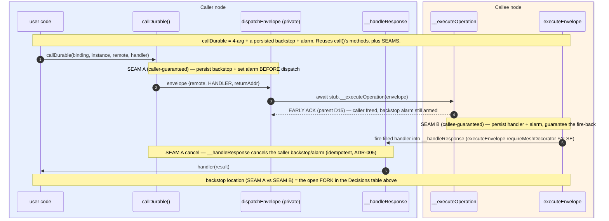

# Mesh — `callDurable` (guaranteed delivery)

**Status**: **ON HOLD** — deferred 2026-07-01 from the continuation-only refactor ([`../archive/mesh-continuation-only-calls.md`](../archive/mesh-continuation-only-calls.md)). This is the **guaranteed-delivery tier**: an **additive layer** on the best-effort primitive built there, *not* a different mechanism. `callDurable` = best-effort `call` **+ a persisted backstop + an alarm**, wrapping the *same* traveling-handler / non-`@mesh`-sink primitive (parent D3/D5/D10 — D4 merged into D5). Building best-effort first paints us into no corner.
**Why deferred**: pre-alpha needs **no hard delivery guarantee** — best-effort `call` + Flow-C socket re-resolution + Child-3 subscription-reconcile covers every current flow and already kills "thinking forever."
**Revive when**: a flow needs *at-least-once* delivery surviving the **callee vanishing entirely**, or an **external side effect** delivered exactly/at-least once — e.g. `tasks/nebula-outside-world.md` (webhooks/email/cron), or fixing `@lumenize/fetch`'s ~90s flaw by rebuilding it on `callDurable`.
**Packages**: `packages/mesh/` — `callDurable` is the generic primitive, built **fresh** here (not a patch of `@lumenize/fetch`'s hand-rolled double-duty alarm — that flaw is the *cautionary tale*, see Phase 0). `@lumenize/fetch` is NOT deprecated (best-effort-adapted to the new mesh, stays published); it could later be rebuilt on `callDurable` as a consumer.
**Related**: parent [`../archive/mesh-continuation-only-calls.md`](../archive/mesh-continuation-only-calls.md) (best-effort primitive + the D-numbers referenced here), [`../archive/mesh-client-callasync.md`](../archive/mesh-client-callasync.md) (the best-effort **client** awaitable `callAsync`, LANDED 2026-07-03 — its **foundation for the client tier**: a client-side `callDurable` (D9) is `callAsync` + a persisted `#pendingAsyncCalls` map + reconcile-on-reload, since the browser has no reliable alarm), [`mesh-overload-backpressure-handling.md`](mesh-overload-backpressure-handling.md) (owns overload/retry classification — the retry knob here is that task), [`../../docs/adr/005-optimistic-concurrency-etags.md`](../../docs/adr/005-optimistic-concurrency-etags.md) (replay-idempotency = the substrate that makes write-retry safe)

---

## Why best-effort already covers pre-alpha (the deferral rationale)

- **Client flows** — a lost response re-resolves to the current socket by callId on reconnect (parent Flow C), or the client reconciles against a durable server Resource via its subscription (Child-3 pattern). The client never hangs.
- **Idempotent re-issue** — ADR-005 forward-only eTags make a re-issued write safe, so "fire again on reconnect" is the client's recovery, not a server guarantee.
- **Every current awaited-`callRaw` site is best-effort-reconcilable** (DAG mutators, DevStudio sequences; chat already shipped on durable `Message` + subscription).

`callDurable` earns its cost only when *neither* holds: the caller needs the handler to run **even if the callee never responds** (callee vanished), or an **external side effect** must be delivered at-least-once. Pre-alpha has no such flow; the outside-world work does.

---

## Decisions (deferred from the parent — restated with context)

| Decision | Choice |
|---|---|
| **Backstop location** | **[FORK]** *callee-guaranteed* (caller still holds ZERO state; the callee persists the traveling handler + alarms to always fire back) vs *caller-guaranteed* (caller persists a backstop record + alarm — stronger, survives the callee vanishing entirely — but a durable write). Both on-thesis: persisted **data + alarm**, never a held Promise. |
| **API shape** | **4-arg only** (pinned 2026-07-02 with the parent's method split) — a "must-happen fire-and-forget" is modeled as a 4-arg with an ack handler. Attaches at the parent's named seams: SEAM A wraps `#dispatchEnvelope` (caller-side persist+alarm, cancel on `__handleResponse`); SEAM B wraps the fire-back inside `executeEnvelope` (callee-side). The parent's **early-ack** (D15) applies: the backstop alarm is armed **before** dispatch and outlives the early ack, so it still fires if the callee acks then vanishes. |
| **Retry** | A `callDurable` knob, **off by default, never on `.overloaded`** (retry worsens overload). Needs durable state → only exists in this tier. Leans on ADR-005 replay-idempotency; classification per the backpressure task (do not re-litigate its settled thinking). |
| **Client-side durability** | The client **cannot** be the guarantor — `setTimeout` dies on tab discard/reload; no reliable browser alarm (SW idle-kill; Periodic Background Sync PWA-only/~12h; Background Sync connectivity-only). So a client `callDurable` = **persist intent + reconcile on reconnect** against a server-side durable record (the DO owns the alarm); Web Push for server→client wake if ever needed. In practice: callee-guaranteed / reconcile only. (IndexedDB-backed local pending only as a last resort for a hypothetical flow with **no** durable server record to reconcile against — none in Nebula so far.) The best-effort client story is the parent's D8. |
| **MIT placement** | **`@lumenize/mesh`** — generic plumbing, built fresh (not by patching `@lumenize/fetch`'s hand-rolled alarm). |

---

## Sequence — `callDurable` (4-arg + persisted backstop + alarm)

> Moved here from the parent (framing S1). Reuses `call()`'s methods — **early-ack** (parent D15), the traveling handler (DO/Worker) / client-in-heap (D16) — and attaches persistence at named **SEAMS**. The backstop-location fork (SEAM A vs SEAM B) is the open decision above.

---

## Phase 0 — Spike: de-risk durable delivery **[Exploratory — GATING for this increment]**
**Goal**: prove the load-bearing brick — concurrent alarm-backed durable delivery — **built fresh in `@lumenize/mesh`** (the generic primitive, not a patch of `@lumenize/fetch`'s hand-rolled alarm, which is the *cautionary tale* — see criterion 1).

**Success Criteria** (capable-of-failing tests + a captured findings note):
- [ ] **Separate timers by concern from the start.** The `@lumenize/fetch` **double-duty alarm** (`.claude/rules/mesh.md` §Two-one-way) is the cautionary reference: one timer served *both* the operation-timeout and the executor-liveness backstop — which is why it broke past ~90s and for concurrent in-flight requests. The fresh design must not repeat it.
- [ ] **Concurrent durable delivery proven**: N in-flight durable calls on one caller DO all deliver; survive an induced hibernation between dispatch and response; past-budget + long-running deliveries land.
- [ ] **Durable-path forgery**: a response for an unknown/duplicate durable-call id is rejected (the durable tier DOES keep a persisted backstop record to check against — unlike best-effort); responder identity checkable (inherits parent D5's gate: responses dispatch via `executeEnvelope`, so `onBeforeCall`/`enforceScopeReach` identifies the responder; @mesh allowlist off).
- [ ] Findings note: mechanism that worked + alternatives that failed → reference memory or rule.

## Phase 1 — `callDurable` (storage tier) + retry
**Success Criteria**:
- [ ] Persisted backstop + alarm (fixed Phase-0 mechanism); resolve callee- vs caller-guaranteed.
- [ ] `retry` knob: off by default, **never** on `.overloaded`; ADR-005 idempotency; backpressure classification.
- [ ] Client durability = persist + reconcile (**no client alarm**).

## Phase 2 — Migrate the deferred sites + docs
**Success Criteria**:
- [ ] (Optional) rebuild `@lumenize/fetch` on `callDurable` — replace its hand-rolled double-duty alarm with the generic primitive (fixes its ~90s flaw). fetch is a *consumer* of this tier, not its foundation.
- [ ] Any flow that turned out to need a guarantee, migrated to `callDurable`.
- [ ] Docs: `callDurable` section in `calls.mdx`.
