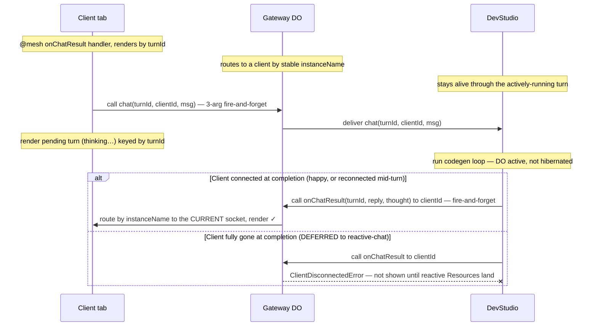

# Resilient chat-turn delivery — live direct-delivery only (history deferred)

**Status:** design, pinned for review (2026-06-28). **Reframed three times** — see "How this evolved."
Goal-spec for an autonomous build once Larry confirms.

**Scope (deliberately small):** stop a completed chat turn from being stranded when the client's WS dropped
and reconnected mid-turn — the "Studio is thinking…" eternal hang. **Live delivery only.** History restore,
completed-while-fully-gone recovery, and the Galaxy→DevStudio storage move are **explicitly deferred** to a
reactive-chat task built on [nebula-query-subscriptions.md](nebula-query-subscriptions.md) (see "Deferred").

## How this evolved (so the reasoning is visible)
1. Nebula `turnId` + persist + requery — **wrong**, rebuilt the `callId` correlation the mesh already owns.
2. "Fix the awaited path in the mesh foundation" — **wrong layer + unnecessary.**
3. Larry: use the documented two-one-way / Direct-Delivery pattern ([calls.mdx §Multi-Hop](../website/docs/mesh/calls.mdx)).
4. **This cut:** keep #3's live delivery, but **drop history/requery entirely** — that belongs to reactive
   Resources, not a throwaway `getRecentTurns`.

**Known-for-a-year limitation we work *around* (not fix):** the **awaited** response path (`callRaw` /
4-arg handler) isn't resilient to a socket drop — the gateway holds the awaited RPC and `ws.send`s on the
*origin* socket ([lumenize-client-gateway.ts:597,604](../packages/mesh/src/lumenize-client-gateway.ts)); on a
drop the result is stranded and the client's pending Promise hangs forever. Standing decision: don't fix the
awaited path; use fire-and-forget + direct-delivery when resilience matters. Chat needs it.

**Nebula-layer only — no mesh-foundation change, no new storage.** Every piece exists: 3-arg fire-and-forget
`call`, the client as a full mesh peer with `@mesh()` push handlers ([nebula-client.ts:962+](../apps/nebula/src/nebula-client.ts)),
and DevStudio already firing fire-and-forget `recordTurn` to Galaxy ([dev-studio.ts:455](../apps/nebula/src/dev-studio.ts)).

## The pattern applied to chat

**Crux:** the reply is a **new mesh call** addressed by the client's **stable `instanceName`** — the gateway
routes to whatever socket is current, so a reconnect (same `instanceName`) just lands it on the new socket.
Nothing holds an awaited Promise across a hop. The DO is actively running the turn, so it doesn't hibernate
mid-turn, and the reply is one-way (no callback to DevStudio), so there's no hibernate-mid-roundtrip to guard.

## Design decisions
- **Address the client by explicit `clientId`, NOT `callChain[0]`.** Larry's caution: call chains grow
  indefinitely and `callChain[0]` is only the true origin if no hop reset it — fragile to depend on. The
  client knows its own id, so it passes `this.lmz.instanceName` as a `chat()` arg (the "full peers" doc
  pattern, [calls.mdx:188](../website/docs/mesh/calls.mdx)). When DevStudio fires `onChatResult`, use
  `{ newChain: true }` so DevStudio is a clean fresh origin for the reply (don't carry the chat chain).
- **`turnId` = carried context** (client-generated, rides out and back) so the client matches the result to
  the right pending bubble even with concurrent turns. Not a correlation system competing with `callId`.
- **No new storage in this task.** The DO stays alive through the turn and the reply is one-way, so live
  delivery needs none. Galaxy `recordTurn` stays exactly as-is (the reactive task relocates it).
- **ADR-003 re-tighten (Larry):** `callRaw` = short single hops; long / hibernation-spanning client calls
  use direct-delivery. Document the known awaited-path limitation so it isn't rediscovered. Chat = example.

## Phases (commit at each green checkpoint)
1. **`chat(turnId, clientId, message)`** signature; client fires it 3-arg fire-and-forget passing its own
   `instanceName` + a generated `turnId`; client renders a pending turn keyed by `turnId`.
2. **DevStudio fires `onChatResult(turnId, reply, thought)`** to `clientId` via the gateway with
   `{ newChain: true }` after the loop; `chat` stops returning a value. `recordTurn`→Galaxy unchanged.
3. **Client `@mesh() onChatResult(turnId, reply, thought)`** renders by `turnId` (mirrors existing push handlers).

## Acceptance criteria (definition of done)
- [ ] Capable-of-failing test: WS drops mid-turn → reconnect → `onChatResult` lands on the new socket and renders by `turnId` (mutation-checked).
- [ ] Chat no longer uses `callRaw` for the long turn; a transient drop cannot produce an eternal "thinking…".
- [ ] Reply is addressed by the explicitly-passed `clientId`, never `callChain[0]`.
- [ ] `ui-smoke` 4/4 + cross-package type-check green; mesh + nebula suites green.

## Deferred (detail + sequencing in the master plan)
History-restore, completed-while-fully-gone recovery, multi-participant chat, and the Galaxy→DevStudio chat
storage relocation are **out of scope here** — they ride a future **reactive-AI-chat** task built on
[nebula-query-subscriptions.md](nebula-query-subscriptions.md) (turn = child Resource). Sequencing + rationale
live in [nebula-pre-alpha.md](nebula-pre-alpha.md) § Wave 2. **Interim honesty:** until then a hard refresh
shows an empty chat, and a turn that completes while the tab is fully gone won't appear — accepted for
pre-alpha, closed by the reactive work.

## Boundary / tripwire
Nebula-layer + verifiable in-suite (mock-WS / instrumented DOs) + `ui-smoke` under `wrangler dev`. Stop and
resync if it reaches container/cloud behavior, or if a phase can't be made green after a couple of honest
attempts. Don't deploy anything not verified in-suite or under `wrangler dev`.
