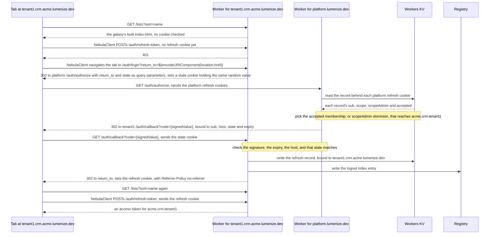
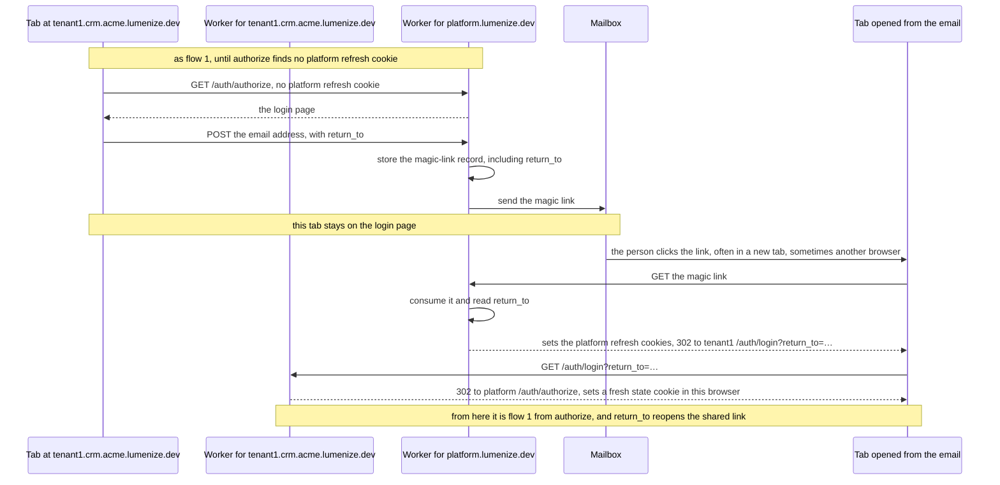
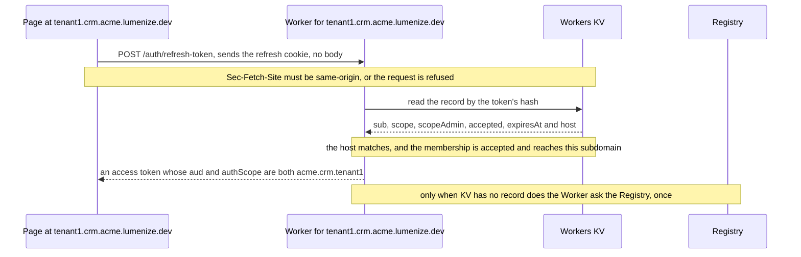
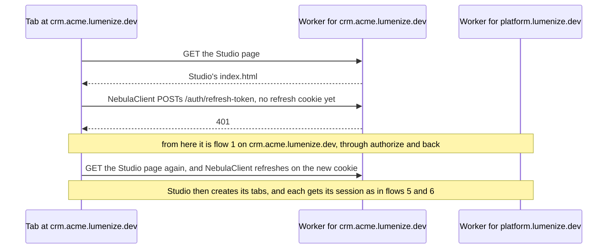
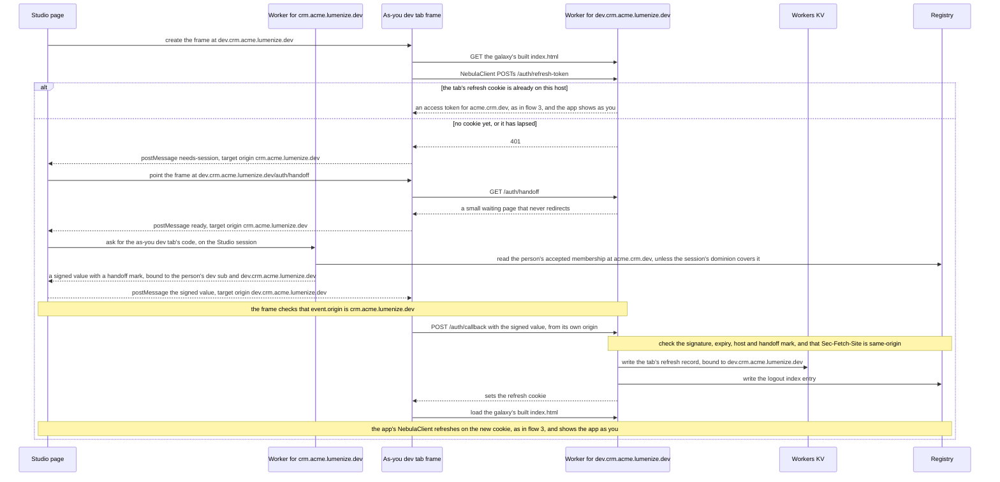
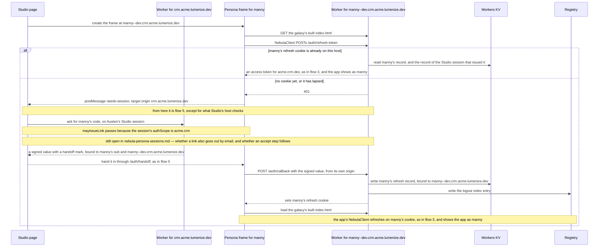
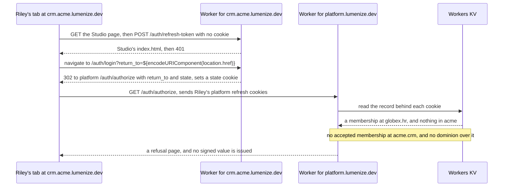

# Sessions per origin — how a person gets a session on each Lumenize host

**Status:** ✅ **DECIDED 2026-09-13 (Larry)** — `platform.lumenize.dev` establishes a session by top-level redirect, and every scope host — the name in a web address, like `tenant1.crm.acme.lumenize.dev` — keeps its own host-only refresh cookie, one with no `Domain` attribute, which the browser sends back only to the exact host that set it. An ADR follows and this file is its evidence. [domain-allocation.md](domain-allocation.md) decided the hosts; this file decides how a credential reaches each of them.

**Question:** once every scope has its own host under `lumenize.dev`, how does a person hold a session on each host they use — without a credential crossing from one host to another, and without waiting on a Public Suffix List entry that may not be accepted until after launch?

**What this file is.** The working record for that decision: the design, the browser rules that forced it, the code it changes, and the designs that lost. When the ADR is drafted, this archives as `tasks/archive/decision-sessions-per-origin.md` and stops changing. ⓘ **Rules derived while writing this up, rather than settled in conversation, are marked ⓘ where they appear** — they are the parts to read hardest.

---

## Context — what today's model assumes

Everything is served from one host today, `nebula.lumenize.com`, and three things rest on that.

1. **Refresh cookies are host-only and told apart by path.** Each is `refresh-token=…; Path=/auth/{scope}; HttpOnly; Secure; SameSite=Strict`, with no `Domain`. A consume deposits one per membership, up to `MINT_ALL_COOKIE_CAP`, and a request to `/auth/acme.crm/refresh-token` carries only the cookie whose path matches.
2. **The client names the scope twice.** It calls `POST /auth/{authScope}/refresh-token` and sends `activeScope` in the body. The token's `aud` is that activeScope, `access.authScope` is the membership's scope, and the mint refuses an `aud` not at or below it. The client learns `authScope` from a localStorage hint that `nebula-client.ts` writes as `nebula.authScope:{activeScope}`, and that `App.vue` and `HomeScreen.vue` also write — with `App.vue` clearing it — to keep it from going stale.
3. **A lapsed session remembers where it was in localStorage.** `view-state.ts` stores `pathname + search` for one hour, reads it once, and refuses any absolute URL as an open redirect.

**Alternative C gives every scope its own host, and all three break there.** A cookie on one host never reaches another. localStorage belongs to one origin — `https://` plus a host, such as `https://crm.acme.lumenize.dev` — so neither the hint nor the return-to can be read across hosts. And a return target on another host has to be an absolute URL, which is exactly what the validator refuses.

§ *The design* says what replaces them, § *What changes in today's code* lists where, and § *Alternatives considered* records the designs rejected along the way — two of them proposed while this was being decided, which is the best evidence a fresh reader would propose them too.

## The design

### Two kinds of host

| Host | What it serves | Cookies it holds |
|---|---|---|
| `platform.lumenize.dev` | login, the magic-link consume, Home, and superusers — members of the `platform` scope | today's per-membership refresh cookies, host-only |
| every scope host — `crm.acme.lumenize.dev`, `tenant1.crm.acme.lumenize.dev`, `manny--dev.crm.acme.lumenize.dev` | Studio or the app, plus that host's own `login`, `callback`, `handoff` and `refresh-token` endpoints | ONE host-only refresh cookie, for that host's scope |

### Getting a session on a scope host

The endpoint names are OAuth's, deliberately. A **code** here is OAuth's *authorization code*: a short-lived value carried in the redirect's address — `https://tenant1.crm.acme.lumenize.dev/auth/callback?code={signedValue}` — and never in a cookie. It shows the platform approved this person for this subdomain, and the subdomain trades it for its own refresh cookie. It takes one of two forms: an **opaque id**, a random value the server stores alongside who it is for and deletes once used; or a **signed value**, which carries that information itself, with nothing stored. **It is a signed value** (Larry, 2026-09-15), so its examples show `{signedValue}`. It expires in about a minute, carries one person, one host and one `state` value or a handoff mark, and is signed with a key used for nothing else, so a code can never pass as an access token. The callback's redirect sends `Referrer-Policy: no-referrer`, and no other response does: set site-wide, it would turn `Origin` to `null` on the platform's login form `POST` and break the fallback in § *The rules*. § *Alternatives considered* records why not an opaque id. Like a magic-link URL, a code is never logged.

```
1. tenant1.crm.acme.lumenize.dev        index.html loads, and NebulaClient's first refresh gets a 401
   tenant1…/auth/login?return_to=…      the client navigates the tab here → a state cookie → 302
2. platform.lumenize.dev/auth/authorize?return_to=…
                                        a top-level navigation, so the platform host's cookies ARE sent
                                        → finds a membership that may be issued a session at acme.crm.tenant1
                                        → 302 back with a signed value bound to that origin
3. tenant1.crm.acme.lumenize.dev/auth/callback?code={signedValue}
                                        → checks state, redeems the signed value, sets its own refresh cookie
4. every refresh after that             POST tenant1…/auth/refresh-token — one cookie arrives, nothing to choose
```

### The rules

- **Every cookie we set is named `__Host-…`, so no cookie carries a `Domain` attribute** (Larry, 2026-09-14). A browser refuses a `__Host-` cookie unless it is `Secure`, has `Path=/` and has no `Domain`, so each is host-only by construction. It also refuses to let another host set one: a generated app on a sibling host can set `refresh-token` for all of `lumenize.dev`, but never `__Host-refresh-token`, and the server reads only prefixed names. Nothing cascades down the scope tree and exactly one refresh cookie ever arrives at a scope host, so no rule for choosing between cookies is needed. No host can place a cookie on another, which is why step 2 is a redirect.
- ⓘ **`Path=/` means page and asset requests to a host carry its refresh cookie too**, where today's `Path=/auth/{scope}` kept it to the auth routes. The cookie is `HttpOnly`, so no page script reads it, and the rule against logging a `Cookie` header now covers every route on the host.
- **`activeScope` is the host, derived by the server.** The client sends no `activeScope` and names no `authScope` in the URL, which deletes the localStorage hint. A page cannot ask for any scope but the one it is served from. [archive/nebula-frontend.md](archive/nebula-frontend.md) already named the deployment URL as where a deployed app's `authScope` comes from; the host now supplies it for every page.
- **Nothing here waits on the Public Suffix List entry** (Larry, 2026-09-14). [domain-allocation.md](domain-allocation.md) § *One-way doors* explains why it may not be accepted before launch. Until it is, every `lumenize.dev` host is one site, so `SameSite` separates neither one customer's app from another's Studio, nor either from the platform host. ⓘ Two checks do that job instead, and keep doing it once the entry lands:
  - **Every `POST` to `/auth/`, and every `POST` a cookie authenticates, requires `Sec-Fetch-Site: same-origin`.** The browser sets that header and a page cannot change it, so a generated app on `tenant1.crm.acme.lumenize.dev` cannot post to `/auth/refresh-token` on Studio's `crm.acme.lumenize.dev`.
  - **`/auth/login`, `authorize`, the `GET` callback and the magic-link consume require a top-level navigation** — `Sec-Fetch-Mode: navigate` with `Sec-Fetch-Dest: document`. Until the entry lands, the platform host's `Lax` cookies ride any same-site request, a background `fetch` included, and this check is what refuses one.
  - **A request without the headers is allowed, unless it is a `POST` whose `Origin` names another host** (Larry, 2026-09-15). Browsers from before March 2023 omit them, and so does every client outside a browser, the `/live` harness's Node client included. The attack these checks stop only runs in a browser, and every major browser since 2019 sends `Origin` on a `POST`, so old browsers stay covered while the harness needs no invented header. Google's Fetch Metadata guidance lets absent headers through the same way. `Origin` is only the fallback: browsers omit it on a `GET` and a top-level navigation, and it turns `null` after a cross-origin redirect or under a `Referrer-Policy` that withholds the referrer.
- ⚠️ **A session minted for a scope host narrows `authScope` to that host's scope — never just `aud`.** A universe admin's session on `tenant1.crm.acme.lumenize.dev` carries `authScope: acme.crm.tenant1`. Pinning only `aud` would leave universe-wide dominion in the token, because `hasDominionOver` reads `authScope` and not `aud`. `access-claims.ts`'s JSDoc explains that those two containments answer different questions, and `tasks/archive/nebula-confine-admin-bypass.md` is where confusing them shipped as an escalation.
- **A session is only issued on an accepted membership, or on dominion held through an accepted scopeAdmin membership** (Larry, 2026-09-13). An unaccepted membership never counts, since ADR-012 requires every read of a membership that confers authority to require an accepted one.
- **No session is needed for passage.** Everyone has passage up the tree from the scope in their access token: `hasPassageInto` tests `isAtOrBelow(access.authScope, target)`, and on a subdomain that `authScope` is the subdomain's own scope — the same value as its activeScope.
- **Each refresh cookie is backed by a server-side record, and a subdomain's record is bound to the host it was issued for** (Larry, 2026-09-13). The cookie holds only an unguessable token. The record lives in Workers KV, keyed by that token's hash, and holds `sub`, the membership's scope, `scopeAdmin`, `accepted` and `expiresAt` — the `RefreshTokenKV` shape — plus, new here, the host. The browser already keeps a host-only cookie on its own host; binding the record covers a token value copied out and replayed by hand. A refresh arriving at any other host is refused, so an admin's tenant-host token replayed at `acme.lumenize.dev` fails rather than passing the containment check there. Whether the person still holds authority is resolved live on every refresh, as today.
- ⓘ **In the browser, `platform.lumenize.dev` holds one refresh cookie per membership, each host-only and each backed by its own server-side record — never one cookie that works across scopes.** Host-only means no `Domain` attribute at all, which is stricter than writing `Domain=platform.lumenize.dev`: that would also reach any `x.platform.lumenize.dev`. `authorize` picks the cookie whose own record may be issued a session at the target — the existing containment check against the record's `universeGalaxyStarId`, used to choose rather than to confirm. Their names carry the scope, as in `__Host-refresh-token.acme.crm`, because `__Host-` fixes every path at `/` and a path can no longer tell them apart — a label for finding the cookie, never trusted over the record's own `universeGalaxyStarId`. § *Alternatives considered* records why an address-level session is not proposed.
- **Refreshing stays on the edge: an access token is minted from Workers KV alone and never waits on the singleton Registry** (Larry, 2026-09-13). This design keeps that. A subdomain's refresh reads one KV record, checks its bound host and derives the scope by parsing the host, so a KV hit makes no Registry call, as today. § *Open* records the two places the Registry still appears around it.

### `SameSite` differs by cookie, and getting it wrong breaks the bounce

⚠️ **A cross-site top-level navigation does not carry `SameSite=Strict` cookies**, and once the Public Suffix List entry lands every scope host is a different site from `platform.lumenize.dev` — a site being what a browser treats as one organization, so `crm.acme.lumenize.dev` and `tenant1.crm.acme.lumenize.dev` are one site, the universe `acme.lumenize.dev`, while `platform.lumenize.dev` is another. So each cookie's value follows from which requests must carry it:

| Cookie | Must ride | `SameSite` |
|---|---|---|
| a refresh cookie on `platform.lumenize.dev` | step 2, a navigation arriving from a scope host — cross-site | **Lax** |
| a scope host's `state` cookie, set by `/auth/login` | step 3, a navigation arriving from the platform host — cross-site | **Lax** |
| a scope host's refresh cookie | only that host's own `fetch` to `/auth/refresh-token` — same-origin | **Strict** |

With `Strict` on the platform host's cookies, `authorize` would receive none of them, and every bounce would stop at the login page.

Before the entry lands, all of `lumenize.dev` is one site. Every value in the table still works then, and the `Sec-Fetch` checks in § *The rules* do the separating that `SameSite` cannot.

## The flows, as sequence diagrams

**One Worker, deployed once, answers every host.** One proxied wildcard DNS record, `*.lumenize.dev`, and one Workers route, `*.lumenize.dev/*`, send it every request at every depth — measured in [experiments/wildcard-host-routing/RESULTS.md](../experiments/wildcard-host-routing/RESULTS.md). It reads the `Host` header to find the scope. `/auth/*` runs its own auth code on any host, `platform.lumenize.dev` serves login and Home, a galaxy's host serves Studio, and a Star's or persona's host serves its galaxy's built app from the galaxy's Durable Object, where the build lives. The platform host's code lives in its own `WorkerEntrypoint`, which the default `fetch` reaches through a self-referencing service binding, as `AUTH_EMAIL_SENDER` reaches `NebulaEmailSender` today. Moving it into a Worker of its own later changes that binding's `service` and nothing a browser can see (Larry, 2026-09-15). Whether to split is decided by measuring `authorize`'s cold start in the full bundle. So each participant below is that one Worker, labelled with the host a request is addressed to.

Solid arrows are requests and dashed arrows are responses or messages pushed between frames, and each arrow names the cookie, signed value or record it carries.

**Every flow starts the way an app starts.** The Worker serves an app's `index.html` to anyone, without looking at a cookie. `NebulaClient` takes the active scope from the host, and its first `POST /auth/refresh-token` decides whether a round trip is needed. Flows 5 and 6 lean on § *Studio and personas*, which explains why they differ from flow 1.

### 1. First visit to a subdomain, already signed in on the platform

A colleague shared `https://tenant1.crm.acme.lumenize.dev/lists?sort=name`, and the person opens it in a new tab.



### 2. First visit, not signed in



### 3. A normal refresh

`NebulaClient` does this whenever a page loads and whenever its access token needs renewing.



### 4. Opening Studio

Studio's own session comes exactly as in flow 1, on `crm.acme.lumenize.dev`. What differs is what Studio does next: every tab in its strip gets a session from Studio's host, as flows 5 and 6 show.



### 5. The as-you dev tab



### 6. A persona tab



### 7. A refusal

Riley belongs to another universe and opens `acme.crm`'s Studio from a link.



## Returning the person

**When the person is already signed in on the platform host,** `NebulaClient` puts `return_to` on its navigation to `/auth/login`: `location.href`, encoded, so a shared link's path, query string and fragment all come back intact. A server redirect never sees the fragment, so starting from the client is what keeps it. The hops use redirects and `location.replace`, so none reaches history or gets shared, and none runs into ADR-017, which governs what a page's own address carries.

**When they are not signed in,** the platform host shows login, and `return_to` is saved on the server alongside the magic-link record when the letter is minted. The link then brings the person back even when it opens in a new tab or a different browser — which today's localStorage cannot do. It rides a write that already happens. ⓘ **The consume sends the person to that host's `/auth/login` with `return_to`, never straight to the callback**, so the redirect through `authorize` runs again in whichever browser clicked the link. That is what lets the `state` check pass in a different browser, whose cookie jar holds no `state` from the tab that started — flow 2 shows it.

⚠️ **Checking `return_to` and the signed value is the whole security story here** — a loosely checked return URL is the most common OAuth vulnerability:

- **HTTPS only.**
- **The host is under `lumenize.dev`.** Custom domains extend this at Beta — § *Open*.
- **The host parses to a scope the person may be issued a session at** — the same check as step 2.
- **The signed value is short-lived and bound to that exact origin**, so one that leaks anywhere else redeems nowhere.
- ⓘ **The callback checks a `state` value its own host set before the bounce.** At `/auth/login`, the subdomain puts a random value in a short-lived `state` cookie and sends the same value to `authorize`, which binds it into the signed value; the callback redeems the signed value only when the two match. Without it, someone could mint a signed value for their own account and send a victim to the callback, signing the victim into the attacker's account on that host.

## What the person sees

- **Already signed in on the platform host — the usual case:** the app's page loads, its first refresh finds no session, and the tab goes to the platform and back, usually in a few hundred milliseconds, with the address bar changing twice. The page then loads again, mostly from cache. It happens the first time a person reaches a host, and again when that host's cookie reaches its fixed 30-day expiry; every refresh in between is silent. It is visible, though — someone opening `tenant1` and then `tenant2` from Studio goes round once on each first visit.
- **Not signed in:** the platform login page, then the magic link, which usually opens a new tab and sometimes a different browser. The original tab stays on the login page, as it does today.
- **Kept out of history:** `location.replace` for the client's navigation, plus server 302s, so Back never lands on the platform hop.
- ⓘ **A loop breaker in the client:** if the cookie fails to set — blocked, or the jar full — the refresh after the round trip gets a 401 again. `NebulaClient` notes in `sessionStorage` that it has just been round, and shows an error instead of going again.

## Studio and personas

**Studio shows the app in a strip of tabs, and first in the strip is the as-you dev tab — the app as you** (Larry, 2026-09-13, named 2026-09-15). It is always there, and before any personas are defined it is the only tab — its job is to show that the app comes up at all. Persona tabs follow it. Every tab is a frame inside Studio's page on its own subdomain: the as-you dev tab on the plain Star label, `dev.crm.acme.lumenize.dev`, and a persona's on `manny--dev.crm.acme.lumenize.dev`. So each tab needs its own session.

**"As you" means with your permissions.** For a universe admin that is everything. A collaborator invited by a peer rather than an admin holds a dev membership with no admin bit, so for them the as-you dev tab shows only what their grants allow — an empty screen there can be permissions rather than a broken app.

**Every tab in the strip is handed a signed value rather than bouncing.** A navigation inside a frame is not top-level, so in Safari and Firefox the platform host's cookie is third-party there and a bounce would reach the login page. The iframe has no `sandbox` attribute (`apps/nebula-studio-ui/src/App.vue`), so on its own host it gets working cookies and a real `Origin`. Studio sends the signed value in with `postMessage`, naming the frame's exact origin and never `*`, and the frame checks `event.origin` before redeeming it with a `POST` to its own `/auth/callback` — a request from the frame to its own subdomain, which shares the universe's site with Studio's page, so its cookies are first-party and no browser blocks them. Flows 5 and 6 show it.

ⓘ **A handed-in signed value has no `state` cookie to match**, because the frame never started a redirect of its own. Studio's host marks it as a handoff instead, and a handoff redeems only by `POST` from the subdomain's own origin — never through the navigation callback, which is the one that checks `state`. Another site can send a browser to an address, but it cannot make this frame's script send that `POST`.

ⓘ **The frame first loads a small waiting page at `/auth/handoff`** that never redirects, and tells Studio it is ready before the value is sent.

**Studio's own host mints every tab's signed value** (Larry, 2026-09-15). For a persona tab, `mayIssueLink` decides. The as-you dev tab can need a different `sub` from Studio's session — a galaxy collaborator's dev membership is a separate `sub` from their galaxy membership, since `sub` is one per address per scope — so Studio's host reads the Registry for the person's accepted membership at the dev Star, unless the Studio session's dominion already covers it. That read happens only when the tab has no session. § *Alternatives considered* records why `authorize` no longer issues it during Studio's own round trip.

**A tab asks for its signed value only once its frame is ready, so no value waits out a certificate.** On a brand-new galaxy, Studio's subdomain rides the universe's wildcard certificate, which already exists, but the as-you dev tab's subdomain needs the galaxy's own, measured at two and a half to four minutes. `.dev` is HTTPS-only, so the tab's waiting page does not load until that certificate is active — which is why [nebula-pre-alpha.md](nebula-pre-alpha.md) § *The certificate wait* has the Galaxy create page wait for it before sending the person into Studio. Once redeemed, the tab refreshes on its own cookie. When that cookie is gone, its refresh gets a 401, the frame posts `needs-session`, and Studio asks its host again, in the background.

**What crosses into the iframe is not a bearer credential.** It is short-lived and bound to one subdomain, and the only place it redeems is that subdomain, where the page running there would hold that session anyway. That is different in kind from the cross-tab token sharing [nebula-persona-sessions.md](nebula-persona-sessions.md) exists to remove.

**A persona's session works like anyone's, with five differences:**

- **Its credential comes from Studio's host, not the platform.** A persona never signs in on `platform.lumenize.dev`, so the platform holds no cookie for it and never runs `authorize` for it. Whether a link also goes out by email is [nebula-persona-sessions.md](nebula-persona-sessions.md) § *Open questions* 1.
- **Studio obtains it, not the persona.** It asks on the user-developer's Studio session, and `mayIssueLink` checks that the session's `authScope` is the galaxy's — which is why Austen asks from Studio rather than from her dev session (§ *Who gets what*).
- **A persona runs only inside a frame in Studio's strip, so it never makes the top-level round trip.** ⓘ When its refresh gets a 401 — the first visit, a lapsed 30-day cookie, a cleared cookie jar — the frame posts `needs-session` to Studio, which obtains a fresh signed value and hands it in. While the cookie lasts, reloading Studio refreshes the persona silently, as in flow 3. Flow 6 shows both paths.
- **A persona's host is always in an environment Star**, as in `manny--dev.crm.acme.lumenize.dev`, never in a tenant ([ADR-021](../docs/adr/021-every-scope-has-its-own-host.md)).
- **A persona's session lives under the Studio session that issued it** (Larry, 2026-09-15). Its refresh record names the record behind that Studio session, and every persona refresh reads both from Workers KV. So signing out, signing out everywhere, or the Studio session reaching its 30-day expiry ends every persona tab, within KV's propagation window. The persona's own logout still ends only the persona's record. Signing out everywhere works by email address and a persona is a different address, so without this link a persona's cookie would outlive its user-developer's sign-out on a shared machine.

Everything else is the same: the `__Host-` refresh cookie, the record bound to its host, and the `Sec-Fetch-*` checks. The as-you dev tab shares the first and third differences, with a different check in place of `mayIssueLink`: an accepted membership at the dev Star, or dominion over it.

⭐ **One cookie per host is also what makes a persona's identity swap impossible.** [nebula-persona-sessions.md](nebula-persona-sessions.md) § *Context* describes a second login overwriting the first, and `handleAcceptMembership` resolving whatever cookie it finds. On a persona host only that persona's cookie exists, and nothing else can reach it, because no cookie carries a `Domain`.

**Today the preview shares Studio's origin** — [nebula-persona-sessions.md](nebula-persona-sessions.md) § *The origin: give the problem nowhere to happen* notes that giving it a host makes everything Studio reaches cross-origin. So generated preview code runs on Studio's own origin today. Moving it to its own host is a security improvement by itself, and it is why the iframe needs a session at all.

## Who gets what

Every scope-host refresh cookie below is `__Host-refresh-token=…; Path=/; HttpOnly; Secure; SameSite=Strict`, with no `Domain`. Universe `acme`, galaxy `acme.crm`, tenant Star `acme.crm.tenant1`.

| Who → where | Host = activeScope | How the session is issued | Token's `authScope` |
|---|---|---|---|
| **Jennifer**, universe admin → Studio | `crm.acme.lumenize.dev` | platform, from the `acme` membership, by dominion | `acme.crm` |
| Jennifer → dev Star | `dev.crm.acme.lumenize.dev` | Studio's host, by the dominion in her Studio session; Studio hands the signed value in | `acme.crm.dev` |
| Jennifer → tenant Star | `tenant1.crm.acme.lumenize.dev` | platform, `acme` by dominion | `acme.crm.tenant1` |
| **Austen**, galaxy collaborator → Studio | `crm.acme.lumenize.dev` | platform, her `acme.crm` membership | `acme.crm` |
| Austen → dev Star | `dev.crm.acme.lumenize.dev` | Studio's host, after the Registry finds her accepted `acme.crm.dev` membership; Studio hands the signed value in | `acme.crm.dev` |
| Austen → a persona's code | her Studio session | — | `acme.crm`, so `mayIssueLink` ③ passes |
| Austen → tenant Star | `tenant1.crm.acme.lumenize.dev` | ✗ refused — no accepted membership there, and no dominion | — |
| **Manny**, persona | `manny--dev.crm.acme.lumenize.dev` | Studio's host, by `mayIssueLink` on Austen's Studio session; redeemed on this host | `acme.crm.dev` |
| **Taylor**, tenant member | `tenant1.crm.acme.lumenize.dev` | platform, the `acme.crm.tenant1` membership | `acme.crm.tenant1` |
| **Casey**, tenant admin | `tenant1.crm.acme.lumenize.dev` | platform, the `acme.crm.tenant1` membership | `acme.crm.tenant1` |

**Austen gets a persona's code from her Studio session, not her dev one.** `mayIssueLink`'s third condition requires `authScope === acme.crm`; her dev session carries `acme.crm.dev`, and a Star holds no dominion over its parent.

## After pre-alpha: HTTP requests that reach a scope's Durable Objects

**Nothing in pre-alpha sends HTTP to a scope's Durable Objects.** The Worker serves `index.html` to anyone, and `NebulaClient` reaches the data through the Gateway. A generated app's `fetch` handler will one day serve routes like `GET /orders?sort=date` on its own host, and the design keeps room for that (Larry, 2026-09-15):

- **The Worker checks the session, then forwards the request with `Cookie` removed and the access token in `Authorization: Bearer`** (Larry, 2026-09-15). `onBeforeConnect` in `apps/nebula/src/entrypoint.ts` already forwards that way for WebSocket upgrades, and `@lumenize/auth`'s `createRouteDORequestAuthHooks` for HTTP — though both start from a token rather than a cookie, and both copy every other header through, so dropping `Cookie` is the new step. A generated app's `fetch` handler receives a real HTTP request, never translated into Workers RPC the way the Gateway translates mesh calls, and the refresh cookie never reaches it. The stub `onBeforeRequest() { // No plans to ever implement` in that entrypoint is where this goes.
- **How the Worker checks the session is open, and Larry's lean is a cookie on every request** (2026-09-15). It is the pattern Cloudflare users reach for most: the Worker reads the session's record from Workers KV on each request. A read costs $0.50 per million past the 10 million a month the paid plan includes, and a key read often at one location is answered from that location's cache, which lasts 60 seconds by default. Three things come with it:
  - **Revocation gets faster.** A revoked session stops working once KV's cache expires, with no 15-minute access token outliving it.
  - **A state change is never a `GET`.** It is a `POST` that passes the `Sec-Fetch-Site` check above.
  - **A navigation from an email link carries no `Strict` cookie**, so it needs a `Lax` one or the round trip. `Lax` is safe here as long as no `GET` changes state, because a `Lax` cookie rides only a top-level navigation from another site — never that site's frames, `fetch`es or form posts. GitHub goes one step further and pairs a `Lax` cookie for reading with a `Strict` one that every state change requires.

  A page's own script could still send a `Bearer` token instead, doing a dance like `NebulaClient`'s, and a request the browser makes itself — a navigation, an ``, a download link, a plain form post — can only bring the cookie.
- **`/auth/` is reserved on every host**, so no app route shares a path with the auth endpoints.
- **The `Sec-Fetch-Site` check covers `/auth/` and every `POST` a cookie authenticates**, not every `POST`, so a webhook or API client bringing its own credential is not refused for arriving from another site.

A page route that needs a session before it sends HTML brings three more pieces:

- **A `session-present` marker cookie, `SameSite=Lax`.** The refresh cookie is `Strict`, so a page request arriving from an email link does not carry it, and the Worker could not tell that request from one with no session. The marker does ride it, and a forged marker only loads a page that then bounces.
- **The Worker redirecting before it sends any HTML** — straight to `authorize` with a `state` cookie, instead of waiting for the client's 401.
- **A loop breaker on the server.** If the cookie fails to set, the Worker sees no session after one bounce and shows an error instead of bouncing again.

## What changes in today's code

- **`apps/nebula/src/nebula-client.ts`** — the localStorage hint and the `activeScope` refresh body both go, along with the hint's reads and writes in `apps/nebula-studio-ui/src/App.vue` and `auth/HomeScreen.vue`. A refresh that gets a 401 now starts the round trip, by navigating the tab to `/auth/login` with `return_to`.
- **`apps/nebula-studio-ui/src/view-state.ts`** — `rememberReturnTo`, `takeReturnTo` and `validReturnTo` lose their job to `return_to` and the magic-link record.
- **`packages/nebula-auth/src/router.ts`** — `/auth/:scope/refresh-token` becomes `/auth/refresh-token` on each scope host, joined by `authorize` on the platform host, by `login`, `callback` and `handoff` on every scope host, and on a galaxy's host by the endpoint Studio asks for a tab's signed value. ⚠️ **A scope-less refresh endpoint, which [archive/nebula-frontend.md](archive/nebula-frontend.md) rejected, would have had that same path**, with a different meaning — here the host supplies the scope the path used to. § *Alternatives considered* records why this is not that design.
- **`packages/nebula-auth/src/worker-token.ts`** — the refresh cookie becomes `__Host-refresh-token` at `Path=/`, and the auth routes gain the `Sec-Fetch-Site` and `Sec-Fetch-Mode` checks.
- **`PLATFORM_SCOPE`** in `packages/nebula-auth/src/types.ts` — `'nebula-platform'` becomes `'platform'`. It is a stored scope id, so the rename belongs before the wipe.
- **Emailed links change destination** — login and invite links land on `platform.lumenize.dev`. Whether a persona gets an emailed link at all is open in [nebula-persona-sessions.md](nebula-persona-sessions.md).
- **Studio's preview moves off Studio's origin.**
- **The Phase-0 outbound-URL guard gets re-derived, not deleted.** `describe('Outbound URL host-awareness (Phase 0 guard)')` in `packages/nebula-auth/test/nebula-auth-routes.test.ts` asserts that a magic link echoes the host its request arrived on, that the post-login redirect stays relative, and that the JWT issuer stays fixed. Login now starts only on `platform.lumenize.dev`, and the issuer's value, `https://nebula.lumenize.com`, names a host that retires. The failure it guards against is silent — a link built for the wrong host just makes a person sign in twice — so a test that can go red has to survive the change.
- **Reset data can clear a tab's own browser storage.** Each tab now has its own origin, so wiping an app's `localStorage`, IndexedDB and cookies no longer risks Studio's own.
- **Standing guidance that goes stale with the change.** `.claude/rules/security.md`'s refresh-token rule describes the cookie as path-scoped by `authScope` and leans on it not travelling cross-site. `website/docs/nebula/auth-flows.md` § *Admin active-scope switching (within one scope's subtree)* describes an admin varying `activeScope` against one path and cookie, where under this design an admin switches scope by going to that scope's host.

## Open

- **Establishing a session writes to the Registry once per subdomain, rather than once per login.** Today a consume writes the refresh index the Registry reads to end every session for an address at logout. Each subdomain's callback creates a new refresh token, so that write now happens on a person's first visit to each subdomain. It is required — without it, logout would leave subdomain sessions alive — but it is new load on the singleton, growing with subdomains visited and bounded by the 30-day lifetime (ADR-018).
- **The KV-miss fallback to the Registry would fire more often.** When KV has no record, `handleRefreshToken` falls back once to the Registry, and `security.md` attributes that fallback to login being a bodiless redirect carrying no access token, so the first refresh can land before KV has propagated. Every subdomain's callback is the same kind of bodiless redirect. Having the callback's response carry the first access token would keep the fallback as rare as it is today.
- ⚠️ **`security.md`'s case against refresh-token rotation loses one leg on the platform host.** That rule argues rotation defends a theft surface already closed because the cookie is host-only, HttpOnly and never sent cross-site. The platform host's cookies must be `Lax`, so they do travel on cross-site top-level navigations — and, until the Public Suffix List entry lands, on every same-site request, which the `Sec-Fetch-Mode` check is what refuses. What limits them is that only `authorize` reads them, and it can only send a signed value to a checked `lumenize.dev` host for a scope the person already reaches. This is not a case for bringing rotation back, which that rule forbids — but its rationale needs re-deriving against the new facts (`.claude/rules/calibration.md` §4).
- **Cookies per universe.** A person holds one cookie per host visited. Once the Public Suffix List entry lands the browser's cookie limits apply per universe; until then they apply across all of `lumenize.dev`, so every universe a person visits shares one jar. RFC 6265 only guarantees 50 per domain, so a heavy visitor could lose older ones — and a generated app can fill that shared jar on purpose, which signs people out of other hosts but cannot replace a `__Host-` cookie.
- **Custom domains, at Beta, and only for a Star** (Larry, 2026-09-15). `app.acme.com` would name a tenant Star such as `acme.crm.tenant1`. Studio stays on `lumenize.dev`, because its tabs are frames on `lumenize.dev` hosts and Safari blocks cookies in frames from another site. One lookup turns a host into its scope and backs the `return_to` check, so a custom hostname joins through that lookup rather than through new checks. A custom domain is always a different site from the platform host, which the `Lax` platform and `state` cookies already handle. A universe-level domain such as `lmz.comcast.com` may come years later and is not designed here.
- **Where the build lives.** Personas need this to be testable, so it is pre-alpha work. Whether it folds into [nebula-persona-sessions.md](nebula-persona-sessions.md) or comes first as its own task is decided after Larry's read.

## Alternatives considered

### Cookies cascading down the scope tree by `Domain`, set only for a scopeAdmin

Each cookie sits at its membership's scope — `Domain=acme.lumenize.dev` for a universe admin, host-only for everyone else — so the browser expresses `hasDominionOver` directly, and `Path=/auth/{scope}` picks among the cookies that arrive. **Lost because** every persona host still receives the owner's cascaded cookie: only `Path` kept it off the persona's own refresh, and only narrowing made it harmless. Choosing by path also needs the client to know which membership's scope to call, which is the localStorage hint again. One host-only cookie per host removes the question rather than managing it.

### Every cookie at `Domain=lumenize.dev` and `Path=/auth`, the server choosing

All cookies reach every host, and the host supplies activeScope. **Lost because** a `__Host-` cookie cannot carry a `Domain`, so this gives up the prefix — and once the Public Suffix List entry lands, browsers refuse `Domain=lumenize.dev` anyway. Without either, any customer's generated app can set `Domain=lumenize.dev` cookies that reach every other customer's `/auth` — the reason GitHub moved Pages user sites to `github.io` and put that domain on the Public Suffix List. It also gives a person one cookie jar across every customer, with RFC 6265 guaranteeing only 50 per domain. It puts a superuser's cookie on every tenant host. And it turns choosing a token into choosing an identity, since `sub` is one per address per scope. **Its host-derived activeScope survived** and is in § *The design*.

### A central auth host, refreshed by background `fetch`

Refresh cookies live only on `platform.lumenize.dev`; each app calls it with `credentials: 'include'`, and `Origin` names the scope. **Lost because** it stops working the day the Public Suffix List entry lands, which makes the platform host a different site from every app host, so the refresh cookie is third-party on that `fetch`. Safari blocks it; Firefox partitions it by top-level site, so the login's cookie is not in the jar the request reads; only Chrome still sends it by default. **Its top-level half survived** — a navigation to the platform host is first-party — and became step 2.

### Pinning `aud` to the host instead of narrowing `authScope`

**Lost because** `hasDominionOver` reads `authScope`; § *The rules* carries the citation.

### Moving persona hosts out of the universe subtree

A top-level `{p}--{g}--{u}.lumenize.dev` would sit beyond any cascade. **Lost because** it drops every slug from 30 characters to about 24, the character budget is why [domain-allocation.md](domain-allocation.md) chose C, and with host-only cookies nothing cascades into a persona host anyway.

### Carrying the return target in a header, or reading `Referer`

**Lost because** a navigation cannot carry custom headers — only `fetch` can. `Referer` under the default `strict-origin-when-cross-origin` policy sends only the origin on a cross-origin navigation, with no path or query string, and privacy extensions strip it entirely. `Origin` does not help either: a top-level GET navigation sends none, and a sandboxed iframe without `allow-same-origin` sends `Origin: null`.

### Keeping today's localStorage return-to

**Lost because** localStorage belongs to one origin, and `validReturnTo` refuses absolute URLs, which a return across hosts needs.

### The preview iframe bouncing for its own session, or chaining top-level bounces through each child host

**Lost because** a navigation inside a frame is not top-level, so the platform host's cookie is third-party again in Safari and Firefox. A chain needs one hop per host, which breaks for hosts added mid-session, such as a persona's.

### `authorize` issuing the as-you dev tab's value during Studio's round trip

Studio's `/auth/login` named the tab, `authorize` picked a second membership for it, and the value rode back in the URL fragment to a callback page that kept it in `sessionStorage`. **Lost because** Studio's host can issue it instead, for one Registry read that happens only when the tab has no session (Larry, 2026-09-15). That deleted the extra parameter, the second membership pick, the fragment and the callback page, and it turned a lapse of the tab's cookie from a visible round trip into a background request — the same channel persona tabs use.

### Persona sessions that outlive their issuer, are revoked by issuer, or expire in hours

Three other answers to whether signing out ends the persona tabs. Leaving persona sessions independent for 30 days lets anyone at a shared browser open `manny--dev.crm.acme.lumenize.dev` as Manny after the user-developer signs out. Recording each persona session's issuer and revoking by issuer at sign-out ends them immediately, but needs an issuer index in the singleton Registry. Short-lived persona sessions, silently reissued while Studio is open, bound the exposure without ending anything at sign-out. **Lost because** tying each persona session to the Studio session that issued it ends them at sign-out with no index and no singleton write, for one extra KV read per persona refresh (Larry, 2026-09-15).

### An opaque, single-use code

An opaque id is stored with what it is for — which person, which subdomain, which `state` — and deleted on use, which is what OAuth expects of an authorization code: RFC 6749 § 4.1.2 lets a code work only once. **Lost because** single use needs a store that checks and deletes atomically. Workers KV is eventually consistent, so that means the Registry, adding a singleton write to every round trip, or a Durable Object per code, adding a write and a read-and-delete to every first visit. And single use buys nothing the bindings do not already give: the redirect code works only in the browser holding its `state` cookie, and the handoff only by a `POST` from its own host, so a replay can only sign the same person into the same host in the same browser (Larry, 2026-09-15).

### The Storage Access API inside each frame

The removed on-hold lumenize.dev task planned a first-party popup login, then `document.requestStorageAccess()` in the frame, because handing a scoped token in by `postMessage` had been rejected (Larry, 2026-08-28). **Lost because** it puts a popup and a browser prompt on every tab, in every browser, where Studio's strip loads its tabs unprompted. What `postMessage` carries in this design is not the credential that was rejected: it is a signed value that expires in about a minute, is bound to one host, and redeems only by a same-origin `POST` there — never a refresh or access token.

### One address-level session on the platform host — not proposed, recorded so it is not re-proposed blind

The simplest platform host would hold one cookie per address and resolve memberships live at `authorize`. [archive/nebula-frontend.md](archive/nebula-frontend.md) rejected a scope-less refresh endpoint on three grounds: the refresh store carried no scope, a path-scoped cookie never reaches a scope-less path, and dropping the path drops the confinement derived from it. ⚠️ **The first ground no longer holds** — `RefreshTokenKV` now carries `universeGalaxyStarId` — and for scope hosts this design already replaces the second and third with the host. So anyone who wants an address-level session owes a re-derivation of that rejection (`.claude/rules/calibration.md` §4), not an assumption that it still stands or has lapsed.
