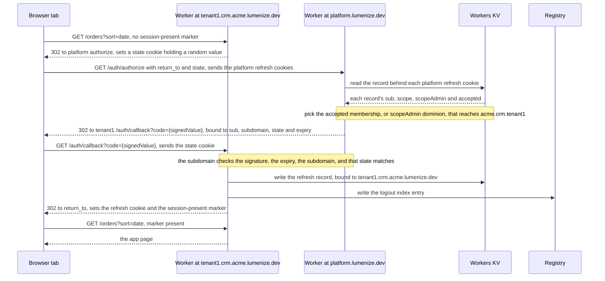
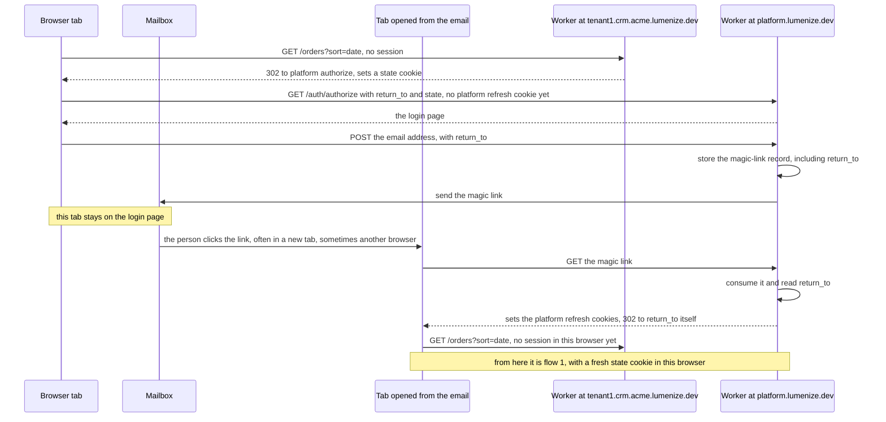
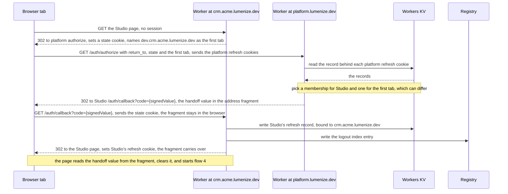
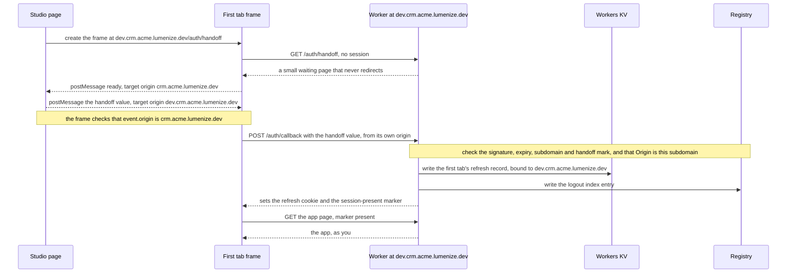
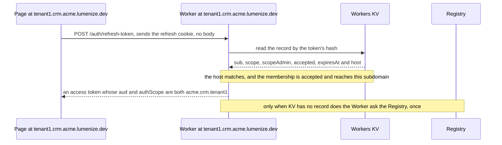
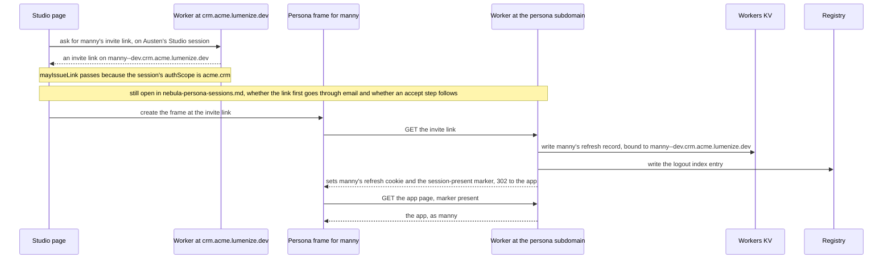
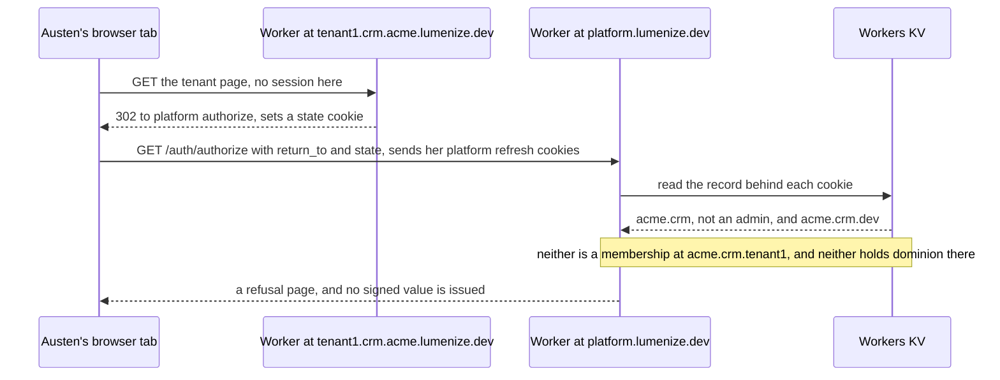

# Sessions per origin — how a person gets a session on each Lumenize host

**Status:** ✅ **DECIDED 2026-09-13 (Larry)** — `platform.lumenize.dev` establishes a session by top-level redirect, and every scope host — the name in a web address, like `tenant1.crm.acme.lumenize.dev` — keeps its own host-only refresh cookie, one with no `Domain` attribute, which the browser sends back only to the exact host that set it. An ADR follows and this file is its evidence. [domain-allocation.md](domain-allocation.md) decided the hosts; this file decides how a credential reaches each of them.

**Question:** once every scope has its own host under `lumenize.dev`, how does a person hold a session on each host they use — without a credential crossing from one host to another, and without giving up the Public Suffix List entry?

**What this file is.** The working record for that decision: the design, the browser rules that forced it, the code it changes, and the designs that lost. When the ADR is drafted, this archives as `tasks/archive/decision-sessions-per-origin.md` and stops changing. ⓘ **Rules derived while writing this up, rather than settled in conversation, are marked ⓘ where they appear** — they are the parts to read hardest.

---

## Context — what today's model assumes

Everything is served from one host today, `nebula.lumenize.com`, and three things rest on that.

1. **Refresh cookies are host-only and told apart by path.** Each is `refresh-token=…; Path=/auth/{scope}; HttpOnly; Secure; SameSite=Strict`, with no `Domain`. A consume deposits one per membership, up to `MINT_ALL_COOKIE_CAP`, and a request to `/auth/acme.crm/refresh-token` carries only the cookie whose path matches.
2. **The client names the scope twice.** It calls `POST /auth/{authScope}/refresh-token` and sends `activeScope` in the body. The token's `aud` is that activeScope, `access.authScope` is the membership's scope, and the mint refuses an `aud` not at or below it. The client learns `authScope` from a localStorage hint that `nebula-client.ts` writes as `nebula.authScope:{activeScope}`, and that `App.vue` and `HomeScreen.vue` also write — with `App.vue` clearing it — to keep it from going stale.
3. **A lapsed session remembers where it was in localStorage.** `view-state.ts` stores `pathname + search` for one hour, reads it once, and refuses any absolute URL as an open redirect.

**Alternative C gives every scope its own host, and all three break there.** A cookie on one host never reaches another. localStorage belongs to one origin — `https://` plus a host, such as `https://crm.acme.lumenize.dev` — so neither the hint nor the return-to can be read across hosts. And a return target on another host has to be an absolute URL, which is exactly what the validator refuses.

§ *The design* says what replaces them, § *What changes in today's code* lists where, and § *Alternatives considered* records the designs rejected along the way — two of them proposed while this was being decided, which is the best evidence a fresh reader would propose them too.

## The design

### Two kinds of host

| Host | What it serves | Cookies it holds |
|---|---|---|
| `platform.lumenize.dev` | login, the magic-link consume, Home, and superusers — members of the `platform` scope | today's per-membership refresh cookies, host-only |
| every scope host — `crm.acme.lumenize.dev`, `tenant1.crm.acme.lumenize.dev`, `manny--dev.crm.acme.lumenize.dev` | Studio or the app, plus that host's own `refresh-token` and `callback` endpoints | ONE host-only refresh cookie, for that host's scope |

### Getting a session on a scope host

The endpoint names are OAuth's, deliberately. A **code** here is OAuth's *authorization code*: a short-lived value carried in the redirect's address — `https://tenant1.crm.acme.lumenize.dev/auth/callback?code={signedValue}` — and never in a cookie. It shows the platform approved this person for this subdomain, and the subdomain trades it for its own refresh cookie. It takes one of two forms: an **opaque id**, a random value the server stores alongside who it is for and deletes once used; or a **signed value**, which carries that information itself, with nothing stored. This file recommends a signed value — § *Open* — so its examples show `{signedValue}`. Like a magic-link URL, a code is never logged.

```
1. tenant1.crm.acme.lumenize.dev        a page request with no session → 302
2. platform.lumenize.dev/auth/authorize?return_to=…
                                        a top-level navigation, so the platform host's cookies ARE sent
                                        → finds a membership that may be issued a session at acme.crm.tenant1
                                        → 302 back with a signed value bound to that origin
3. tenant1.crm.acme.lumenize.dev/auth/callback?code={signedValue}
                                        → checks state, redeems the signed value, sets its own refresh cookie
4. every refresh after that             POST tenant1…/auth/refresh-token — one cookie arrives, nothing to choose
```

### The rules

- **No cookie carries a `Domain` attribute.** Every cookie is host-only, so nothing cascades down the scope tree and exactly one refresh cookie ever arrives at a scope host. No rule for choosing between cookies is needed, because there is never a second one.
- **`activeScope` is the host, derived by the server.** The client sends no `activeScope` and names no `authScope` in the URL, which deletes the localStorage hint. A page cannot ask for any scope but the one it is served from. [archive/nebula-frontend.md](archive/nebula-frontend.md) already named the deployment URL as where a deployed app's `authScope` comes from; the host now supplies it for every page.
- **The PSL entry stands.** Host-only cookies need no `Domain`, so nothing here is refused by it. Browsers refuse `Domain=lumenize.dev` on a public suffix with or without a leading dot, since RFC 6265 ignores the dot — which is why no one host can place a cookie on another, and why step 2 is a redirect.
- ⚠️ **A session minted for a scope host narrows `authScope` to that host's scope — never just `aud`.** A universe admin's session on `tenant1.crm.acme.lumenize.dev` carries `authScope: acme.crm.tenant1`. Pinning only `aud` would leave universe-wide dominion in the token, because `hasDominionOver` reads `authScope` and not `aud`. `access-claims.ts`'s JSDoc explains that those two containments answer different questions, and `tasks/archive/nebula-confine-admin-bypass.md` is where confusing them shipped as an escalation.
- **A session is only issued on an accepted membership, or on dominion held through an accepted scopeAdmin membership** (Larry, 2026-09-13). An unaccepted membership never counts, since ADR-012 requires every read of a membership that confers authority to require an accepted one.
- **No session is needed for passage.** Everyone has passage up the tree from the scope in their access token: `hasPassageInto` tests `isAtOrBelow(access.authScope, target)`, and on a subdomain that `authScope` is the subdomain's own scope — the same value as its activeScope.
- **Each refresh cookie is backed by a server-side record, and a subdomain's record is bound to the host it was issued for** (Larry, 2026-09-13). The cookie holds only an unguessable token. The record lives in Workers KV, keyed by that token's hash, and holds `sub`, the membership's scope, `scopeAdmin`, `accepted` and `expiresAt` — the `RefreshTokenKV` shape — plus, new here, the host. The browser already keeps a host-only cookie on its own host; binding the record covers a token value copied out and replayed by hand. A refresh arriving at any other host is refused, so an admin's tenant-host token replayed at `acme.lumenize.dev` fails rather than passing the containment check there. Whether the person still holds authority is resolved live on every refresh, as today.
- ⓘ **In the browser, `platform.lumenize.dev` holds one refresh cookie per membership, each host-only and each backed by its own server-side record — never one cookie that works across scopes.** Host-only means no `Domain` attribute at all, which is stricter than writing `Domain=platform.lumenize.dev`: that would also reach any `x.platform.lumenize.dev`. `authorize` picks the cookie whose own record may be issued a session at the target — the existing containment check against the record's `universeGalaxyStarId`, used to choose rather than to confirm. § *Alternatives considered* records why an address-level session is not proposed.
- **Refreshing stays on the edge: an access token is minted from Workers KV alone and never waits on the singleton Registry** (Larry, 2026-09-13). This design keeps that. A subdomain's refresh reads one KV record, checks its bound host and derives the scope by parsing the host, so a KV hit makes no Registry call, as today. § *Open* records the two places the Registry still appears around it.

### `SameSite` differs by cookie, and getting it wrong breaks the bounce

⚠️ **A cross-site top-level navigation does not carry `SameSite=Strict` cookies**, and with the PSL entry every scope host is a different site from `platform.lumenize.dev` — a site being what a browser treats as one organization, so `crm.acme.lumenize.dev` and `tenant1.crm.acme.lumenize.dev` are one site, the universe `acme.lumenize.dev`, while `platform.lumenize.dev` is another. So each cookie's value follows from which requests must carry it:

| Cookie | Must ride | `SameSite` |
|---|---|---|
| a refresh cookie on `platform.lumenize.dev` | step 2, a navigation arriving from a scope host — cross-site | **Lax** |
| a scope host's `state` cookie, set before step 1 | step 3, a navigation arriving from the platform host — cross-site | **Lax** |
| a scope host's `session-present` marker | a person arriving from a link in an email — cross-site | **Lax** |
| a scope host's refresh cookie | only that host's own `fetch` to `/auth/refresh-token` — same-origin | **Strict** |

With `Strict` on the platform host's cookies, `authorize` would receive none of them, and every bounce would stop at the login page.

## The flows, as sequence diagrams

One Worker answers every subdomain, so each participant is labelled with the subdomain a request is addressed to. Solid arrows are requests and dashed arrows are responses or messages pushed between frames, and each arrow names the cookie, signed value or record it carries. Flows 3, 4 and 6 lean on § *Studio and personas*, which explains why they differ from flow 1.

### 1. First visit to a subdomain, already signed in on the platform



### 2. First visit, not signed in



### 3. Opening Studio



### 4. The first tab's handoff



### 5. A normal refresh



### 6. A persona tab



### 7. A refusal




## Returning the person

**When the person is already signed in on the platform host,** step 1's redirect carries `return_to` — the full URL, encoded, so a shared link's query string comes back intact. That redirect is a 302 hop that never reaches history and that nobody shares, so it does not run into ADR-017, which governs what a page's own address carries.

**When they are not signed in,** the platform host shows login, and `return_to` is saved on the server alongside the magic-link record when the letter is minted. The link then brings the person back even when it opens in a new tab or a different browser — which today's localStorage cannot do. It rides a write that already happens. ⓘ **The consume sends the person to `return_to` itself, never straight to the callback**, so the redirect through `authorize` runs again in whichever browser clicked the link. That is what lets the `state` check pass in a different browser, whose cookie jar holds no `state` from the tab that started — flow 2 shows it.

⚠️ **Checking `return_to` and the signed value is the whole security story here** — a loosely checked return URL is the most common OAuth vulnerability:

- **HTTPS only.**
- **The host is under `lumenize.dev`.** Custom domains extend this at Beta — § *Open*.
- **The host parses to a scope the person may be issued a session at** — the same check as step 2.
- **The signed value is short-lived and bound to that exact origin**, so one that leaks anywhere else redeems nowhere.
- ⓘ **The callback checks a `state` value its own host set before the bounce.** Before step 1's redirect, the subdomain puts a random value in a short-lived `state` cookie and sends the same value to `authorize`, which binds it into the signed value; the callback redeems the signed value only when the two match. Without it, someone could mint a signed value for their own account and send a victim to the callback, signing the victim into the attacker's account on that host.

## What the person sees

- **Already signed in on the platform host — the usual case:** two quick 302s, usually a few hundred milliseconds, and the address bar changes twice. It happens the first time a person reaches a host, and again when that host's cookie reaches its fixed 30-day expiry; every refresh in between is silent. It is visible, though — someone clicking from Studio into `tenant1` and then `tenant2` bounces once on each first visit.
- **Not signed in:** the platform login page, then the magic link, which usually opens a new tab and sometimes a different browser. The original tab stays on the login page, as it does today.
- **Kept out of history:** server 302s plus `location.replace`, so Back never lands on the platform hop.
- **A loop breaker:** if the cookie fails to set — blocked, or the jar full — the host sees no session and would bounce forever. After one bounce it shows an error instead.
- **No flash of the app:** a scope host's refresh cookie is `Path=/auth`, so a page request does not carry it and the Worker cannot tell that request has no session. The `session-present` marker at `Path=/` lets the Worker 302 before sending any HTML. A forged marker only loads the app shell, which then bounces.

## Studio and personas

**Studio shows the app in a strip of tabs, and the first tab is the app as you** (Larry, 2026-09-13). It is always there, and before any personas are defined it is the only tab — its job is to show that the app comes up at all. Persona tabs follow it. Every tab is a frame inside Studio's page on its own subdomain: the first tab on the plain Star label, `dev.crm.acme.lumenize.dev`, and a persona's on `manny--dev.crm.acme.lumenize.dev`. So each tab needs its own session.

**"As you" means with your permissions.** For a universe admin that is everything. A collaborator invited by a peer rather than an admin holds a dev membership with no admin bit, so for them the first tab shows only what their grants allow — an empty screen there can be permissions rather than a broken app.

**The first tab is handed a signed value rather than bouncing.** A navigation inside a frame is not top-level, so in Safari and Firefox the platform host's cookie is third-party there and a bounce would reach the login page. The iframe has no `sandbox` attribute (`apps/nebula-studio-ui/src/App.vue`), so on its own host it gets working cookies and a real `Origin`. Studio sends the signed value in with `postMessage`, naming the frame's exact origin and never `*`, and the frame checks `event.origin` before redeeming it with a `POST` to its own `/auth/callback` — a request from the frame to its own subdomain, so first-party, and no browser blocks it. Flows 3 and 4 show it.

ⓘ **A handed-in signed value has no `state` cookie to match**, because the frame never started a redirect of its own. The platform marks it as a handoff instead, and a handoff redeems only by `POST` from the subdomain's own origin — never through the navigation callback, which is the one that checks `state`. Another site can send a browser to an address, but it cannot make this frame's script send that `POST`.

ⓘ **The handoff travels in the address's fragment — the part after `#` — so no server ever sees it.** The platform's redirect to Studio's callback carries it there, and a browser keeps a fragment across a redirect that names none, so it arrives on the Studio page, which reads it and clears it from the address bar. The frame first loads a small waiting page at `/auth/handoff` that never redirects, and tells Studio it is ready before the value is sent.

ⓘ **The platform host mints that signed value, during Studio's own bounce.** Studio's session belongs to one membership's `sub`, and the dev Star can need a different one: a galaxy collaborator's dev membership is a separate `sub` from their galaxy membership, since `sub` is one per address per scope. The galaxy host cannot mint for a `sub` it does not hold, and the platform host holds both — so when Studio bounces for its own session, `authorize` issues the first tab's signed value alongside it.

**The signed value is redeemed within seconds, because the first tab loads with Studio** — with one exception. On a brand-new galaxy, Studio's subdomain rides the universe's wildcard certificate, which already exists, but the first tab's subdomain needs the galaxy's own, measured at three to four minutes. `.dev` is HTTPS-only, so the tab does not load until that certificate is active, and the signed value would expire first. [nebula-pre-alpha.md](nebula-pre-alpha.md) § *The certificate wait* closes this: the Galaxy create page waits for the certificate before sending the person into Studio. Once redeemed, the tab refreshes on its own cookie and never needs another signed value.

**What crosses into the iframe is not a bearer credential.** It is short-lived and bound to one subdomain, and the only place it redeems is that subdomain, where the page running there would hold that session anyway. That is different in kind from the cross-tab token sharing [nebula-persona-sessions.md](nebula-persona-sessions.md) exists to remove.

**Personas already arrive this way.** A persona's credential comes through its invite link, consumed on the persona's own host. The first tab uses the same channel with a different check — whether the Studio user may be issued a session at the dev scope, rather than `mayIssueLink`.

⭐ **One cookie per host is also what makes a persona's identity swap impossible.** [nebula-persona-sessions.md](nebula-persona-sessions.md) § *Context* describes a second login overwriting the first, and `handleAcceptMembership` resolving whatever cookie it finds. On a persona host only that persona's cookie exists, and nothing else can reach it, because no cookie carries a `Domain`.

**Today the preview shares Studio's origin** — [nebula-persona-sessions.md](nebula-persona-sessions.md) § *The origin: give the problem nowhere to happen* notes that giving it a host makes everything Studio reaches cross-origin. So generated preview code runs on Studio's own origin today. Moving it to its own host is a security improvement by itself, and it is why the iframe needs a session at all.

## Who gets what

Every scope-host refresh cookie below is `refresh-token=…; Path=/auth; HttpOnly; Secure; SameSite=Strict`, with no `Domain`. Universe `acme`, galaxy `acme.crm`, tenant Star `acme.crm.tenant1`.

| Who → where | Host = activeScope | How the session is issued | Token's `authScope` |
|---|---|---|---|
| **Jennifer**, universe admin → Studio | `crm.acme.lumenize.dev` | platform, from the `acme` membership, by dominion | `acme.crm` |
| Jennifer → dev Star | `dev.crm.acme.lumenize.dev` | platform, `acme` by dominion; Studio hands the signed value in | `acme.crm.dev` |
| Jennifer → tenant Star | `tenant1.crm.acme.lumenize.dev` | platform, `acme` by dominion | `acme.crm.tenant1` |
| **Austen**, galaxy collaborator → Studio | `crm.acme.lumenize.dev` | platform, her `acme.crm` membership | `acme.crm` |
| Austen → dev Star | `dev.crm.acme.lumenize.dev` | platform, her `acme.crm.dev` membership; Studio hands the signed value in | `acme.crm.dev` |
| Austen → a persona's link | her Studio session | — | `acme.crm`, so `mayIssueLink` ③ passes |
| Austen → tenant Star | `tenant1.crm.acme.lumenize.dev` | ✗ refused — no accepted membership there, and no dominion | — |
| **Manny**, persona | `manny--dev.crm.acme.lumenize.dev` | the invite link, consumed on this host | `acme.crm.dev` |
| **Taylor**, tenant member | `tenant1.crm.acme.lumenize.dev` | platform, the `acme.crm.tenant1` membership | `acme.crm.tenant1` |
| **Casey**, tenant admin | `tenant1.crm.acme.lumenize.dev` | platform, the `acme.crm.tenant1` membership | `acme.crm.tenant1` |

**Austen gets a persona's link from her Studio session, not her dev one.** `mayIssueLink`'s third condition requires `authScope === acme.crm`; her dev session carries `acme.crm.dev`, and a Star holds no dominion over its parent.

## What changes in today's code

- **`apps/nebula/src/nebula-client.ts`** — the localStorage hint and the `activeScope` refresh body both go, along with the hint's reads and writes in `apps/nebula-studio-ui/src/App.vue` and `auth/HomeScreen.vue`.
- **`apps/nebula-studio-ui/src/view-state.ts`** — `rememberReturnTo`, `takeReturnTo` and `validReturnTo` lose their job to `return_to` and the magic-link record.
- **`packages/nebula-auth/src/router.ts`** — `/auth/:scope/refresh-token` becomes `/auth/refresh-token` on each scope host, joined by `authorize` on the platform host and `callback` on every scope host. ⚠️ **A scope-less refresh endpoint, which [archive/nebula-frontend.md](archive/nebula-frontend.md) rejected, would have had that same path**, with a different meaning — here the host supplies the scope the path used to. § *Alternatives considered* records why this is not that design.
- **`PLATFORM_SCOPE`** in `packages/nebula-auth/src/types.ts` — `'nebula-platform'` becomes `'platform'`. It is a stored scope id, so the rename belongs before the wipe.
- **Emailed links change destination** — login and invite links land on `platform.lumenize.dev`, and persona invite links on the persona's own host.
- **Studio's preview moves off Studio's origin.**
- **Standing guidance that goes stale with the change.** `.claude/rules/security.md`'s refresh-token rule describes the cookie as path-scoped by `authScope` and leans on it not travelling cross-site. `website/docs/nebula/auth-flows.md` § *Admin active-scope switching (within one scope's subtree)* describes an admin varying `activeScope` against one path and cookie, where under this design an admin switches scope by going to that scope's host.

## Open

- **How the platform host's per-membership cookies stay distinct.** Today `Path=/auth/{scope}` separates them. If they share `Path=/auth` so that `authorize` receives them all, cookies with the same name, host and path overwrite one another — so either the name carries the scope, as in `refresh-token.acme.crm`, or the path keeps it. Whichever carries it is only a label for finding the cookie, never trusted over the record's own `universeGalaxyStarId`.
- **An opaque id or a signed value.** An opaque id is stored with what it is for — which person, which subdomain, which `state` — and deleted on use; a signed value carries those itself, checked by its signature, with nothing stored. An opaque id is what OAuth expects, because deleting it on use makes it single-use, but that needs a strongly consistent store, and on the edge that means the Registry or another Durable Object. A signed value keeps the whole flow on the edge, at the cost of being usable more than once within its lifetime — and the subdomain binding and the `state` check mean a replay can only ever sign the same person in again, in the same browser. The recommendation is a signed value that expires after about a minute.
- **Establishing a session writes to the Registry once per subdomain, rather than once per login.** Today a consume writes the refresh index the Registry reads to end every session for an address at logout. Each subdomain's callback creates a new refresh token, so that write now happens on a person's first visit to each subdomain. It is required — without it, logout would leave subdomain sessions alive — but it is new load on the singleton, growing with subdomains visited and bounded by the 30-day lifetime (ADR-018).
- **The KV-miss fallback to the Registry would fire more often.** When KV has no record, `handleRefreshToken` falls back once to the Registry, and `security.md` attributes that fallback to login being a bodiless redirect carrying no access token, so the first refresh can land before KV has propagated. Every subdomain's callback is the same kind of bodiless redirect. Having the callback's response carry the first access token would keep the fallback as rare as it is today.
- ⚠️ **`security.md`'s case against refresh-token rotation loses one leg on the platform host.** That rule argues rotation defends a theft surface already closed because the cookie is host-only, HttpOnly and never sent cross-site. The platform host's cookies must be `Lax`, so they do travel on cross-site top-level navigations. What limits them is that only `authorize` reads them, and it can only send a signed value to a checked `lumenize.dev` host for a scope the person already reaches. This is not a case for bringing rotation back, which that rule forbids — but its rationale needs re-deriving against the new facts (`.claude/rules/calibration.md` §4).
- **Cookies per universe.** A person holds one cookie per host visited, and with the PSL entry the browser's cookie limits apply per universe. RFC 6265 only guarantees 50 per domain, so a heavy visitor of one universe's tenants could lose older ones.
- **Custom domains, at Beta.** `return_to` accepts only `lumenize.dev` hosts. A customer's hostname needs its own entry in that check, and it is its own site, so the `SameSite` table applies to it too.
- **Where the build lives.** Personas need this to be testable, so it is pre-alpha work. Whether it folds into [nebula-persona-sessions.md](nebula-persona-sessions.md) or comes first as its own task is decided after Larry's read.

## Alternatives considered

### Cookies cascading down the scope tree by `Domain`, set only for a scopeAdmin

Each cookie sits at its membership's scope — `Domain=acme.lumenize.dev` for a universe admin, host-only for everyone else — so the browser expresses `hasDominionOver` directly, and `Path=/auth/{scope}` picks among the cookies that arrive. **Lost because** every persona host still receives the owner's cascaded cookie: only `Path` kept it off the persona's own refresh, and only narrowing made it harmless. Choosing by path also needs the client to know which membership's scope to call, which is the localStorage hint again. One host-only cookie per host removes the question rather than managing it.

### Every cookie at `Domain=lumenize.dev` and `Path=/auth`, the server choosing

All cookies reach every host, and the host supplies activeScope. **Lost because** a browser refuses `Domain=lumenize.dev` once it is a public suffix, so this means dropping the PSL entry. Without it, any customer's generated app can set `Domain=lumenize.dev` cookies that reach every other customer's `/auth` — the reason GitHub moved Pages user sites to `github.io` and put that domain on the PSL. It also gives a person one cookie jar across every customer, with RFC 6265 guaranteeing only 50 per domain. It puts a superuser's cookie on every tenant host. And it turns choosing a token into choosing an identity, since `sub` is one per address per scope. **Its host-derived activeScope survived** and is in § *The design*.

### A central auth host, refreshed by background `fetch`

Refresh cookies live only on `platform.lumenize.dev`; each app calls it with `credentials: 'include'`, and `Origin` names the scope. This keeps the PSL entry. **Lost because** the PSL entry makes the platform host a different site from every app host, so the refresh cookie is third-party on that `fetch`. Safari blocks it; Firefox partitions it by top-level site, so the login's cookie is not in the jar the request reads; only Chrome still sends it by default. **Its top-level half survived** — a navigation to the platform host is first-party — and became step 2.

### Pinning `aud` to the host instead of narrowing `authScope`

**Lost because** `hasDominionOver` reads `authScope`; § *The rules* carries the citation.

### Moving persona hosts out of the universe subtree

A top-level `{p}--{g}--{u}.lumenize.dev` would sit beyond any cascade. **Lost because** it drops every slug from 30 characters to about 24, the character budget is why [domain-allocation.md](domain-allocation.md) chose C, and with host-only cookies nothing cascades into a persona host anyway.

### Carrying the return target in a header, or reading `Referer`

**Lost because** a navigation cannot carry custom headers — only `fetch` can. `Referer` under the default `strict-origin-when-cross-origin` policy sends only the origin on a cross-origin navigation, with no path or query string, and privacy extensions strip it entirely. `Origin` does not help either: a top-level GET navigation sends none, and a sandboxed iframe without `allow-same-origin` sends `Origin: null`.

### Keeping today's localStorage return-to

**Lost because** localStorage belongs to one origin, and `validReturnTo` refuses absolute URLs, which a return across hosts needs.

### The preview iframe bouncing for its own session, or chaining top-level bounces through each child host

**Lost because** a navigation inside a frame is not top-level, so the platform host's cookie is third-party again in Safari and Firefox. A chain needs one hop per host, which breaks for hosts added mid-session, such as a persona's.

### One address-level session on the platform host — not proposed, recorded so it is not re-proposed blind

The simplest platform host would hold one cookie per address and resolve memberships live at `authorize`. [archive/nebula-frontend.md](archive/nebula-frontend.md) rejected a scope-less refresh endpoint on three grounds: the refresh store carried no scope, a path-scoped cookie never reaches a scope-less path, and dropping the path drops the confinement derived from it. ⚠️ **The first ground no longer holds** — `RefreshTokenKV` now carries `universeGalaxyStarId` — and for scope hosts this design already replaces the second and third with the host. So anyone who wants an address-level session owes a re-derivation of that rejection (`.claude/rules/calibration.md` §4), not an assumption that it still stands or has lapsed.
