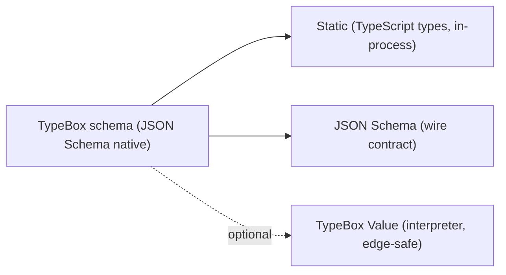

# From Babel to Unity: Healing the MCP Type Fracture

Remeber that game from childhood called "telephone" where we lined up in a circle with our friends. Then, one person would whisper something into their neighbor's ear, and they would in turn whisper it into the next friend's ear until you completed the circle? The lesson of that exercise was that every translatation from brain to words and back to brain was just a little bit lossy. Cumulatively, what came out the other end was nothing like the original message.

Software systems, and APIs in particular, are no different. Every layer of translation results in just a little bit of loss in fidelity. This is no more true than in the realm of types, schemas, validation, and code generation — the same patch of cognitive quicksand occupied by TypeScript, JSON Schema, Ajv, Zod, and friends.

MCP is all about context portability: moving structured data democratically across agents, runtimes, and languages. The type/schema has to remain the same throughout the journey around the circle of friends. Tooling decisions have very real consequences for portability and correctness. So imagine my surprise when I discovered the Babel of type/schema translations running in MCP stacks today.

<!-- truncate -->

⸻

## Why this post (Lumenize’s decision, MCP‑first)

Lumenize is an MCP server platform. The obvious path would be to consume the MCP TypeScript SDK directly (as the Cloudflare `agents` npm package does). But for our initial scope, we only needed Resources and Tools — a subset that looked straightforward to implement directly from the spec, without pulling in the rest of the SDK’s baggage.

That’s where the real work began. Choosing an architecture for types, schemas, and validation in MCP opened a can of worms: dialect drift, conversion fidelity, validator choices, and runtime constraints. This post is about that can of worms, the choices I made for Lumenize, and why.

## The Type/Schema/Validation Babel that MCP is Today

At a glance, MCP’s types and validation story looks straightforward. In practice, it’s a patchwork that varies by SDK, validation engine, and even runtime.

- Canonical source (spec): TypeScript first
  - The MCP spec defines canonical protocol types in TypeScript (schema.ts). From those, JSON Schema artifacts are generated and published for interoperability on the wire.
  - This gives TypeScript a great authoring experience, but JSON Schema becomes a derived artifact—already one translation away from the source of truth.

- TypeScript SDK (server and client): Zod + conversion + Ajv
  - Server authoring and validation: tools are authored with Zod. The server validates tool inputs (and optionally outputs) with Zod at runtime.
  - Wire contracts: to expose tool schemas to clients (`tools/list`), Zod is converted to JSON Schema. Now we have Zod → JSON Schema conversions in the path.
  - Client/runtime validation: clients compile Ajv validators from those JSON Schemas and validate structured outputs on `tools/call`.
  - Elicitation: when the server requests additional information via JSON Schema, it validates that elicitation schema with Ajv as well (separate from Zod). Two validation engines are now in play.

- Elicitation (spec): defined directly in JSON Schema
  - Elicitation needed semantics that JSON Schema supports cleanly but TypeScript types do not (for example, the restricted primitives-only shape, defaults, and UI-ready constraints). So this part of the spec is authored directly in JSON Schema—not in TS types.
  - Result: the spec now has mixed authorship. Some parts originate in TS, others in JSON Schema. SDKs must reconcile both.

- Python SDK: Python-first types + JSON Schema on the wire
  - Authoring: tools are written using Python type hints and Pydantic v2 models. From those, the SDK derives JSON Schema for input/output where needed.
  - Wire/runtime: JSON Schema is used on the wire and validated at runtime using the `jsonschema` library (including for elicitation). This is JSON Schema–centric, with Python types as the developer ergonomics layer.

- Other SDKs and ecosystems: choose-your-own source-of-truth
  - Some key off JSON Schema directly (treating the published schema as the normative wire contract), then either generate native types from it or work dynamically without compile-time types.
  - Trade-offs:
    - Codegen from JSON Schema → native types provides dev-time safety but introduces another translation step and drift risk when schemas evolve.
    - Hand-maintained native models (redefined from docs/spec) can diverge silently.
    - Dynamic-only (validate at runtime) avoids codegen but gives up compile-time type safety and shifts errors later.

- Environmental constraints: not all validators fit everywhere
  - Ajv’s codegen performs well but can be incompatible with constrained runtimes (e.g., Cloudflare Workers without eval). Interpreter-based validation (like TypeBox Value) works broadly but has different performance characteristics.

The net effect
- We have multiple sources of truth: TS types (spec), generated JSON Schema, Zod schemas (SDK), elicitation’s direct JSON Schema, and per-language SDK models.
- Each translation—TS → JSON Schema, Zod ↔ JSON Schema, JSON Schema → native types—introduces opportunities for drift and nuance loss.
- Different dialects (draft-07 vs 2020-12), non-standard fields (like enumNames), and format mismatches compound the problem.
- Cross-SDK behavior can diverge in subtle ways, especially around elicitation’s constrained subset and defaulting rules.

If this feels like the childhood game of “telephone,” that’s the point. MCP schemas are effectively re-stated multiple times—sometimes by automation, sometimes by humans—almost always with some fidelity loss. See the Receipts below for concrete examples and links.


So, how do we fix this?

## TypeSpec (a recent suggestion), briefly

If the situation we find ourselves in feels like the [Tower of Babel](https://en.wikipedia.org/wiki/Tower_of_Babel), then TypeSpec feels like [Esperanto](https://en.wikipedia.org/wiki/Esperanto): a designed universal language promising unity across dialects — but adopting it still means learning a new language and depending on a new toolchain.

TypeSpec (the evolution of Cadl) is seductive. One DSL to rule APIs, models, validation, client SDKs, and docs. In theory: write once, emit many. In practice: you’re introducing a new syntax, a new compiler, and a new ecosystem for each team to absorb.

That’s not unification. It’s another layer. TypeSpec could centralize parts of a system internally, but it also introduces translation friction with existing tools (OpenAPI, JSON Schema, Zod, etc.). In a world that already speaks JSON Schema, asking everyone to learn a new language risks further fracture, not harmony.

⸻

## Zod in the New Era: Better, but Still Local

The MCP TypeScript SDK uses Zod. That made sense historically: Zod is intuitive, expressive, and TS-native. With Version 4, Zod became even more attractive by adding native JSON Schema support via toJSONSchema() and a global registry approach. (zod.dev)

However, Zod was not originally designed around JSON Schema (which is the wire schema specification format for MCP) so it comes with a few caveats:
	•	The conversion is mediated by Zod’s internal representation, so some JSON Schema nuances are lost or approximated.
	•	Not all JSON Schema consumers will accept the output exactly as intended.
	•	The conversion makes Zod more interoperable but doesn’t eliminate the performance or bundling difficulties.
	•	Cross-ecosystem “false friends” still exist. For example: OpenAPI 3.0’s `nullable: true` is not the same as JSON Schema 2020-12, which represents nullability via a union type (e.g., `type: ["string", "null"]`). And `default` never implies required—OpenAPI marks parameter presence with a top-level `required: true`, while JSON Schema uses a `required: []` array on the parent object to enforce presence.

Regarding speed, many reports cite Zod 4 being several times faster and more memory efficient than Zod 3 (e.g. ~2–4×), but it's still ~4-10x slower than a compiled parser/validator.

⸻

:::note

<details id="receipts">
<summary><strong>Receipts: what we found (specific, linkable examples)</strong></summary>

Concrete places where starting from TS/Zod and emitting JSON Schema, or mixing dialects/validators, caused friction. These support designing wire contracts as JSON Schema first (or with TypeBox, which is JSON Schema–native).

- Non‑standard enumNames vs JSON Schema
  - Historically used `enumNames` (non-standard) for enum display labels. Fixes replace with standard patterns (for example, `oneOf` with `const`+`title`).
  - Evidence: TypeScript SDK PR “Replace non‑standard enumNames with standard oneOf” (#844)
    https://github.com/modelcontextprotocol/typescript-sdk/pull/844
  - Evidence: Spec work “Elicitation Enum Schema Improvements and Standards Compliance” (#1148 PR, #1330 issue)
    https://github.com/modelcontextprotocol/modelcontextprotocol/pull/1148
    https://github.com/modelcontextprotocol/modelcontextprotocol/issues/1330

- Dialect mismatch (draft‑07 vs 2020‑12)
  - Clients/tools increasingly assume JSON Schema 2020‑12 while generated schema remained draft‑07 for a period, causing incompatibilities.
  - Evidence: Spec issue “Support full JSON Schema 2020‑12” (#834) and PR “Tools inputSchema & outputSchema conform to JSON Schema 2020‑12” (#881)
    https://github.com/modelcontextprotocol/modelcontextprotocol/issues/834
    https://github.com/modelcontextprotocol/modelcontextprotocol/pull/881
  - Evidence: Spec proposal “Establish JSON Schema 2020‑12 as Default Dialect for MCP” (#1613)
    https://github.com/modelcontextprotocol/modelcontextprotocol/issues/1613
  - Evidence: TS SDK issue “MCP TypeScript SDK generates JSON Schema draft‑07…” (#745)
    https://github.com/modelcontextprotocol/typescript-sdk/issues/745

- Zod → JSON Schema conversion fidelity gaps
  - Some Zod features don’t round‑trip cleanly to JSON Schema (e.g., transforms, certain unions), leading to lost intent on the wire.
  - Evidence: TS SDK issue “Zod transform functions are lost during JSON Schema conversion, breaking union types” (#702)
    https://github.com/modelcontextprotocol/typescript-sdk/issues/702
  - Evidence: “fix: Zod to JSONSchema pipe strategies” (#962)
    https://github.com/modelcontextprotocol/typescript-sdk/pull/962

- Format/annotation mismatches
  - Incorrect or non‑standard `format` values in generated schemas and custom formats requiring out‑of‑band support (for example, `uri-template`). Spec TS uses JSDoc `@TJS-type` hints to steer generation, which can drift from normative JSON Schema.
  - Evidence: Spec PR “Fix format value for websiteUrl in draft schema.json” (#1529)
    https://github.com/modelcontextprotocol/modelcontextprotocol/pull/1529

- Elicitation specifics: subset design and cross‑SDK differences
  - Elicitation’s `requestedSchema` is a restricted subset of JSON Schema (primitives only). Multiple iterations aligned behavior (defaults, enums, accept without content), plus runtime/env issues.
  - Evidence: Spec PR “Add default values for all primitive types in elicitation schemas” (#1035)
    https://github.com/modelcontextprotocol/modelcontextprotocol/pull/1035
  - Evidence: Python SDK issue “inconsistent actions between python sdk and specification for Elicitation” (#1056)
    https://github.com/modelcontextprotocol/python-sdk/issues/1056
  - Evidence: TS SDK Cloudflare Workers incompatibility: “Elicitation feature fails on Cloudflare Workers due to AJV code generation (EvalError…)” (#689) and follow‑up fix PR (#1012)
    https://github.com/modelcontextprotocol/typescript-sdk/issues/689
    https://github.com/modelcontextprotocol/typescript-sdk/pull/1012

- Fresh schema/detail drift in generated outputs
  - Example: missing fields (like `_meta`) in generated JSON Schema that were expected by the TS source/spec.
  - Evidence: Spec issue (#1616)
    https://github.com/modelcontextprotocol/modelcontextprotocol/issues/1616

Why this matters for elicitation in particular
- Elicitation already specifies JSON Schema as the lingua franca (even if restricted). Designing it as JSON Schema first, or with TypeBox (JSON Schema‑native), would have:
  - avoided non‑standard fields like `enumNames` from leaking into wire contracts;
  - made dialect and formats explicit up front;
  - simplified validator choice (e.g., interpreter validators where codegen is disallowed);
  - reduced cross‑SDK drift by anchoring to the JSON Schema document as the normative source.

</details>

:::

## Enter TypeBox

I hadn't known much about TypeBox when I started this research but as soon as I dug into it, it became a strong candidate. TypeBox doesn’t lobby for replacing everything. It sets out to bring JSON Schema semantics and validation to TypeScript projects.

If TypeSpec is Esperanto, then [JSON Schema](https://json-schema.org/) is English—the [lingua franca](https://en.wikipedia.org/wiki/Lingua_franca) of APIs today. TypeBox is English with a great style guide: you speak JSON Schema grammar, and you get precise TypeScript types as well as runtime validation for free. That combination travels well across gateways, languages, and runtimes without asking teams to learn a completely new language if you think of TypeBox as just a TypeScript way of writing JSON Schema.

TypeBox Value works on plain JSON Schema

The revelation that makes an architecture simpler: TypeBox’s Value validator can accept arbitrary JSON Schema — you don’t need to define a TypeBox schema object. It just expects a schema object that aligns with the kinds of constructs it supports.

For example:

```TypeScript
import { Value } from '@sinclair/typebox/value'

const schema = {
  type: 'object',
  properties: {
    name: { type: 'string' },
    age: { type: 'number', minimum: 0 }
  },
  required: ['name', 'age'],
  additionalProperties: false
}

Value.Check(schema, { name: 'Larry', age: 42 })  // → true
```

No Ajv. No compile-time tricks. No eval. This works in Cloudflare Workers, Vercel Edge, or any sandboxed JS runtime. That means fewer moving parts, smaller downloads, and lower operational complexity.

TypeBox's interpreted validation is significantly faster than Zod's parsing particularly Zod v3 but also v4. TypeBox also supports pre-compiled validation (which we are not planning on using in Lumenize unless we hit a performance wall) show dramatic multipliers over interpreted validation. It seems a step or two behind Ajv in raw pre-compiled validation speed, but Ajv is a big additional package. It's raw speed advantage in a pre-compiled situation is traded off against the fact that it adds to package size as well as development and operational complexity. In a serverless environment, cold starts are a function of package size. 

Going back to thinking about interpreted mode, TypeBox out paces Ajv for another reason. Ajv doesn't have a true interpretted mode. Rather, it's a just in time compile. In a serverless environment, that may rarely be reused and is a huge performance hit.

The exact numbers vary by environment, but the architectural advantage is significant under most conditions and particularly in Lumenize's which is running on the edge serverless environment, Cloudflare.

### The Rule of Wire Separation for Types

In Lumenize, our decision to follow a principle I'm hereby minting:

> **The Wire Separation of Types**
>
> - **Use TypeScript for everything that never leaves your process.**
> - **Use TypeBox for everything that crosses a process, network, or persistence boundary.**

That boundary is sacred. TypeScript’s types model what code believes about data. TypeBox’s schemas model what machines must prove about data when it crosses that boundary.
This separation keeps your internal code flexible and expressive, and your wire contracts stable, serializable, and enforceable

⸻

## Lumenize Type Pipeline Visual



Notes
- We author wire contracts directly as JSON Schema via TypeBox.
- We infer TypeScript types in memory for implementation ergonomics.
- Validation is either interpreter-based (TypeBox Value) for codegen-hostile runtimes, or Ajv when compiled performance is desired.

## Choosing Fewer Fractures Over False Unity

You don’t need another “Type Babel” in your stack. You need pragmatic boundaries. You need composability across languages, runtimes, and services. You need portability.

TypeSpec promises a new world. Zod 4 makes progress toward compatibility. But TypeBox today offers something that actually works in the messy, multi-tenant reality we already live in:
	•	It lives in TypeScript.
	•	It is designed around JSON Schema semantics natively.
	•	Its Value engine can validate with plain JSON Schema directly, no extra tooling.
	•	It gives us performance headroom, especially in compiled/AOT modes.
	•	It aligns with the Rule of Wire Separation.

That’s why Lumenize is built around it.
