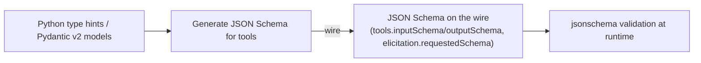
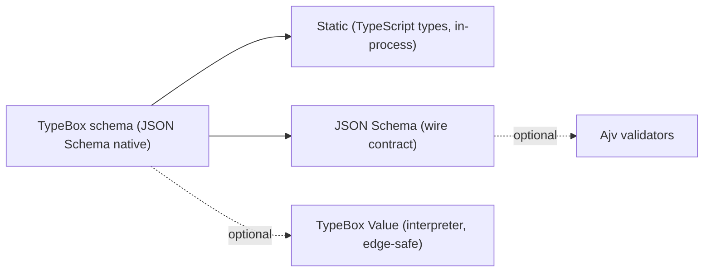

# From Babel to Unity: Healing the Type Fracture

The history of software is one long pendulum swing between unification and fracture. Every generation rediscovers the dream of a single type system, only to invent another dialect, another compiler, another schema tool promising to unify everything.

We’re in that moment again. You’re reading the room exactly right: TypeSpec sits in that ever-expanding Venn diagram overlap of types, schemas, validation, and code generation — the same patch of cognitive quicksand already occupied by TypeScript, JSON Schema, Zod, and friends.

From where I stand — building Lumenize to implement the Model Context Protocol (MCP) — I can’t remain neutral. I’m forced to choose. And that choice matters, because MCP is all about context portability: moving structured data democratically across agents, runtimes, and languages. Your type/design system has to survive the journey.

<!-- truncate -->

⸻

## The Esperanto Promise of TypeSpec

If the situation we find ourselves in feels like the [Tower of Babel](https://en.wikipedia.org/wiki/Tower_of_Babel), then TypeSpec feels like [Esperanto](https://en.wikipedia.org/wiki/Esperanto): a designed universal language promising unity across dialects — but adopting it still means learning a new language and depending on a new toolchain.

TypeSpec (the evolution of Cadl) is seductive. One DSL to rule APIs, models, validation, client SDKs, and docs. In theory: write once, emit many. In practice: you’re introducing a new syntax, a new compiler, and a new ecosystem for each team to absorb.

That’s not unification. It’s another layer. TypeSpec could centralize parts of a system internally, but it also introduces translation friction with existing tools (OpenAPI, JSON Schema, Zod, etc.). In a world that already speaks JSON Schema, asking everyone to learn a new language risks further fracture, not harmony.

⸻

## Zod in the New Era: Better, but Still Local

The MCP TypeScript SDK uses Zod. That made sense historically: Zod is intuitive, expressive, and TS-native. But in Version 4, Zod has addressed one of the big criticisms: it now supports native JSON Schema conversion via toJSONSchema() and a global registry approach. (zod.dev)

So the claim “Zod doesn’t output JSON Schema” is no longer strictly correct in v4. It can. But with caveats:
	•	The conversion is mediated by Zod’s internal representation, so some JSON Schema nuances may be lost or approximated.
	•	Not all JSON Schema consumers will accept the output exactly as intended.
	•	The conversion makes Zod more interoperable but doesn’t eliminate the performance or bundling differences.
	•	Cross-ecosystem “false friends” still exist. For example: OpenAPI 3.0’s `nullable: true` is not the same as JSON Schema 2020-12, which represents nullability via a union type (e.g., `type: ["string", "null"]`). And `default` never implies required—OpenAPI marks parameter presence with a top-level `required: true`, while JSON Schema uses a `required: []` array on the parent object to enforce presence.

Regarding speed, many reports cite Zod 4 being several times faster than Zod 3 (e.g. ~2–4×). Some combinator-heavy usage shows regressions in performance when schemas are deeply nested or use .extend(), .omit(). (icantevencode.com)

⸻

## Why TypeBox Still Holds the Practical Edge

TypeBox doesn’t lobby for replacing everything. It leans into what’s already real: TypeScript ecosystems, JSON Schema infrastructure, and the necessity of runtime validation.

If TypeSpec is Esperanto, then [JSON Schema](https://json-schema.org/) is English—the [lingua franca](https://en.wikipedia.org/wiki/Lingua_franca) of APIs today. TypeBox is English with a great style guide: you speak JSON Schema on the wire, and you get precise TypeScript types in-process. That combination travels well across gateways, languages, and runtimes without asking teams to learn a new language.

TypeBox Value works on plain JSON Schema

The revelation that makes an architecture simpler: TypeBox’s Value validator can accept arbitrary JSON Schema — you don’t need to define a TypeBox schema object. It just expects a schema object that aligns with the kinds of constructs it supports.

For example:

```TypeScript
import { Value } from '@sinclair/typebox/value'

const schema = {
  type: 'object',
  properties: {
    name: { type: 'string' },
    age: { type: 'number', minimum: 0 }
  },
  required: ['name', 'age'],
  additionalProperties: false
}

Value.Check(schema, { name: 'Larry', age: 42 })  // → true
```

No Ajv. No compile-time tricks. No eval. This works in Cloudflare Workers, Vercel Edge, or any sandboxed JS runtime. That means fewer moving parts, smaller downloads, and lower operational complexity.

When tested under repeated validation workloads, TypeBox’s compiled paths show dramatic multipliers over naive validation — especially vs Zod 3 or interpretive Zod 4. The exact numbers vary by environment, but the architectural headroom is real.

### The Rule of Wire Separation for Types

In Lumenize we practice a principle we call:

> **The Wire Separation of Types**
>
> - **Use TypeScript for everything that never leaves your process.**
> - **Use TypeBox for everything that crosses a process, network, or persistence boundary.**

That boundary is sacred. TypeScript’s types model what code believes about data. TypeBox’s schemas model what machines must prove about data when it crosses that boundary.
This separation keeps your internal code flexible and expressive, and your wire contracts stable, serializable, and enforceable

⸻

## Visuals: two simple pipelines (narrative-first)

### Python SDK today — a linear pipeline



Notes
- Author tools in Python using type hints and Pydantic; the SDK derives JSON Schema for tool input/output where needed.
- On the wire, JSON Schema is used for tool discovery and validation (including elicitation). Validation is performed by the `jsonschema` library at runtime.

### Lumenize — TypeBox-first with one small branch



Notes
- We author wire contracts directly as JSON Schema via TypeBox.
- We infer TypeScript types in memory for implementation ergonomics.
- Validation is either interpreter-based (TypeBox Value) for codegen-hostile runtimes, or Ajv when compiled performance is desired.

## Choosing Fewer Fractures Over False Unity

You don’t need another “Type Babel” in your stack. You need pragmatic boundaries. You need composability across languages, runtimes, and services. You need portability.

TypeSpec promises a new world. Zod 4 makes progress toward compatibility. But TypeBox today offers something that actually works in the messy, multi-tenant reality we already live in:
	•	It lives in TypeScript.
	•	It emits JSON Schema natively.
	•	Its Value engine can validate plain JSON Schema directly, no extra plumbing.
	•	It gives you performance headroom, especially in compiled/AOT modes.
	•	It aligns with the Rule of Wire Separation.

That’s why Lumenize is built around it. We don’t demand you throw away everything. We just demand coherence: that code and schema speak the same language on both sides of the wire.

## Receipts: what we found (specific, linkable examples)

Concrete places where starting from TS/Zod and emitting JSON Schema, or mixing dialects/validators, caused friction. These support designing wire contracts as JSON Schema first (or with TypeBox, which is JSON Schema–native).

- Non‑standard enumNames vs JSON Schema
  - Historically used `enumNames` (non-standard) for enum display labels. Fixes replace with standard patterns (for example, `oneOf` with `const`+`title`).
  - Evidence: TypeScript SDK PR “Replace non‑standard enumNames with standard oneOf” (#844)
    https://github.com/modelcontextprotocol/typescript-sdk/pull/844
  - Evidence: Spec work “Elicitation Enum Schema Improvements and Standards Compliance” (#1148 PR, #1330 issue)
    https://github.com/modelcontextprotocol/modelcontextprotocol/pull/1148
    https://github.com/modelcontextprotocol/modelcontextprotocol/issues/1330

- Dialect mismatch (draft‑07 vs 2020‑12)
  - Clients/tools increasingly assume JSON Schema 2020‑12 while generated schema remained draft‑07 for a period, causing incompatibilities.
  - Evidence: Spec issue “Support full JSON Schema 2020‑12” (#834) and PR “Tools inputSchema & outputSchema conform to JSON Schema 2020‑12” (#881)
    https://github.com/modelcontextprotocol/modelcontextprotocol/issues/834
    https://github.com/modelcontextprotocol/modelcontextprotocol/pull/881
  - Evidence: Spec proposal “Establish JSON Schema 2020‑12 as Default Dialect for MCP” (#1613)
    https://github.com/modelcontextprotocol/modelcontextprotocol/issues/1613
  - Evidence: TS SDK issue “MCP TypeScript SDK generates JSON Schema draft‑07…” (#745)
    https://github.com/modelcontextprotocol/typescript-sdk/issues/745

- Zod → JSON Schema conversion fidelity gaps
  - Some Zod features don’t round‑trip cleanly to JSON Schema (e.g., transforms, certain unions), leading to lost intent on the wire.
  - Evidence: TS SDK issue “Zod transform functions are lost during JSON Schema conversion, breaking union types” (#702)
    https://github.com/modelcontextprotocol/typescript-sdk/issues/702
  - Evidence: “fix: Zod to JSONSchema pipe strategies” (#962)
    https://github.com/modelcontextprotocol/typescript-sdk/pull/962

- Format/annotation mismatches
  - Incorrect or non‑standard `format` values in generated schemas and custom formats requiring out‑of‑band support (for example, `uri-template`). Spec TS uses JSDoc `@TJS-type` hints to steer generation, which can drift from normative JSON Schema.
  - Evidence: Spec PR “Fix format value for websiteUrl in draft schema.json” (#1529)
    https://github.com/modelcontextprotocol/modelcontextprotocol/pull/1529

- Elicitation specifics: subset design and cross‑SDK differences
  - Elicitation’s `requestedSchema` is a restricted subset of JSON Schema (primitives only). Multiple iterations aligned behavior (defaults, enums, accept without content), plus runtime/env issues.
  - Evidence: Spec PR “Add default values for all primitive types in elicitation schemas” (#1035)
    https://github.com/modelcontextprotocol/modelcontextprotocol/pull/1035
  - Evidence: Python SDK issue “inconsistent actions between python sdk and specification for Elicitation” (#1056)
    https://github.com/modelcontextprotocol/python-sdk/issues/1056
  - Evidence: TS SDK Cloudflare Workers incompatibility: “Elicitation feature fails on Cloudflare Workers due to AJV code generation (EvalError…)” (#689) and follow‑up fix PR (#1012)
    https://github.com/modelcontextprotocol/typescript-sdk/issues/689
    https://github.com/modelcontextprotocol/typescript-sdk/pull/1012

- Fresh schema/detail drift in generated outputs
  - Example: missing fields (like `_meta`) in generated JSON Schema that were expected by the TS source/spec.
  - Evidence: Spec issue (#1616)
    https://github.com/modelcontextprotocol/modelcontextprotocol/issues/1616

Why this matters for elicitation in particular
- Elicitation already specifies JSON Schema as the lingua franca (even if restricted). Designing it as JSON Schema first, or with TypeBox (JSON Schema‑native), would have:
  - avoided non‑standard fields like `enumNames` from leaking into wire contracts;
  - made dialect and formats explicit up front;
  - simplified validator choice (e.g., interpreter validators where codegen is disallowed);
  - reduced cross‑SDK drift by anchoring to the JSON Schema document as the normative source.
