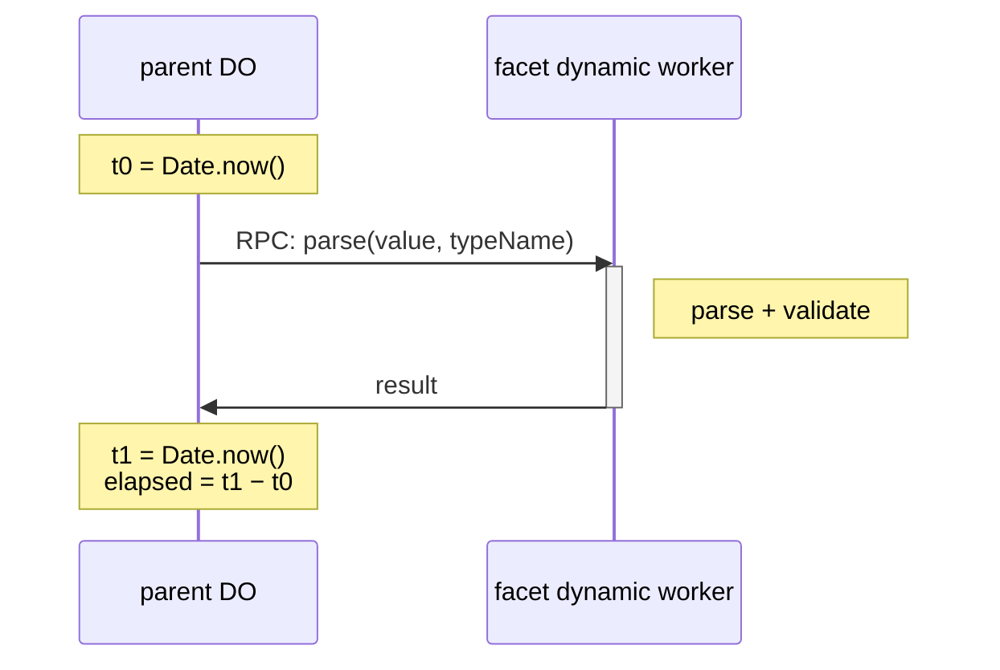
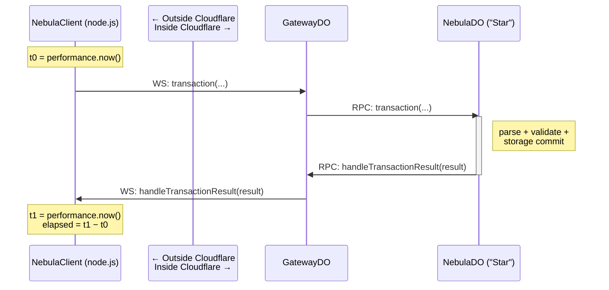
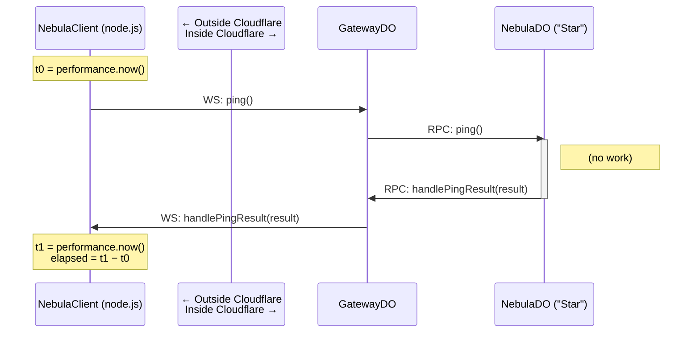

Have you (or your LLM) ever concluded that something took 0 ms inside Cloudflare, only to remember that annoying quirk — the clock there lives behind a veil of temporal haze. This post is about how to get honest numbers anyway.

Inside Cloudflare, **you can't trust `Date.now()` or `performance.now()`.** Two problems:
1. **Neither advances during synchronous execution.** They only advance at certain ([but not all](#how-thick-is-the-temporal-haze)) I/O events.
2. **`performance.now()` is no finer-grained than `Date.now()`.** Cloudflare aliases the two clocks, so the sub-ms resolution you'd normally get from `performance.now()` (in Node, browsers, etc.) doesn't apply inside Cloudflare. 

The full extent of the haze — split documentation, undocumented edge cases, what `workerd` source does and doesn't tell you — is in [How thick is the temporal haze?](#how-thick-is-the-temporal-haze) at the end of this post.

**A narrow, but useful, exception.** We have observed that when an `await` of an I/O subrequest completes `Date.now()` advances by the actual elapsed time of that subrequest. The Workers RPC call to a DO dynamic worker facet is the one place in this benchmarking where we rely upon an inside-Cloudflare `Date.now()` delta. We overcome the lack of sub-ms granularity by taking an average over many runs to resolve on the 1.4 ms facet boundary latency measurement. For everything else we measure from outside.

**Measuring from outside.** "Outside" means a Node process driving a real WebSocket into a deployed Worker, using Node-side `performance.now()` as the only honest, fine-grained clock. Results come back over the WebSocket as push frames (mesh callbacks). We then take the instrumentation message latency into account and average over many runs to bring the real numbers into focus.

<!-- truncate -->

## What this post covers

- **Facet latency** — measured from inside the parent DO via await-boundary subtraction.
- **Nebula transaction latency**, decomposed three ways:
  - **End-to-end** — `t1 − t0` on the Node side, single round-trip
  - **Ping baseline** — same path with `ping()` doing no work, leaving only routing in/out
  - **Durability flush, derived** — what's left after subtracting the layers we *can* measure
- **Nebula throughput** — concurrent in-flight calls; interpreting the high-N latencies that emerge under load.

## Facet latency

We don't measure single parses. The DO loops the facet call (sequential `await`s) inside one method invocation until total elapsed is comfortably above the in-Worker clock's ~1 ms resolution floor — typically tens of milliseconds — then divides by the loop count. So what we publish (e.g. ~1.4 ms warm) is a per-call *mean* over the batch, not a single-call number. For what the 1.4 ms number *means* — boundary cost vs. inner work — see [Cloudflare DO Facets in practice](/blog/cloudflare-do-facets-in-practice).

## Nebula transaction latency

### End-to-end

This is a simplified sequence diagram for the full [Nebula](/blog/introducing-lumenize-nebula) transaction.

The left side is Node, where `performance.now()` is honest. The right side, inside Cloudflare, is the time domain we don't trust. The trick is that the result returns to the *outside* — over the WebSocket as a push frame — so a single `t1 − t0` on the Node side captures the entire round-trip including all the in-Worker work.

This e2e **Nebula transaction latency is 56 ms** average over 50 runs.

### Ping baseline

This diagram is the same as the one before except we call `ping()` rather than `transaction()`, which short-circuits the eTag, access control checks, and most significantly, the storage write durable flush latency.

This **ping latency is 40 ms**. So, the **bare transaction latency is 16 ms** (e2e latency − ping latency = 56 ms − 40 ms = 16 ms).

The ping baseline lumps routing in and routing out into a single number. For finer breakdown — separating the WS hops from the Workers RPC hops, or measuring routing in vs out separately — you'd add intermediate push frames back to the Node-side observer at each point you care about, and read `performance.now()` as each arrives. We didn't need that granularity for bare transaction latency, but it's the next rung up if you do.

### Durability flush, derived

We can't measure the output-gate flush directly. From inside the parent DO, no clock reading happens *after* the gate releases — by the time the WS push frame is on the wire, the method has already returned. From outside, the response arrives but the gate can't be isolated from everything else on the inbound leg.

So we derive it. Bare transaction is 16 ms inside the parent DO, including the wrapped facet call (e2e − ping). Subtract the facet call (~1.4 ms), pre-facet work (~1.5 ms est), and the eTag check / permission walk / SQL write inside `transactionSync` (~1.5 ms est) — full layer breakdown in [What I got wrong about DO throughput](/blog/what-i-got-wrong-about-do-throughput) — and the residual is **~10–13 ms for the output-gate flush itself.**

Two methodology notes:

- **Error bars stack.** The 16 ms carries a few percent of ping-subtraction error. The 1.4 ms facet number carries small batch-averaging error. The two ~1.5 ms terms are *estimated* — those layers aren't independently measured. Realistic uncertainty on the residual: about ±2 ms. Order of magnitude is solid; the third significant digit isn't.
- **Subtraction works when the residual is much larger than the accumulated uncertainty.** ~10–13 ms ≫ ±2 ms — fine here. If the flush were ~2 ms, the error bars would swallow the answer. We're comfortably past that threshold; tighter bounds would need a probe that observes the gate directly, and we don't have one.

## Nebula throughput

Same outside-Cloudflare clock pattern as the latency benches, scaled up to N concurrent in-flight transactions. The *insight* — one Star sustains ~410 txn/s at N=128, far above the single-client serial floor, because output gates don't block input gates — lives in [What I got wrong about DO throughput](/blog/what-i-got-wrong-about-do-throughput).

### Saturation curve (excerpt)

| N | throughput (txn/s) | mean lat raw (ms) | p99 raw | errors |
| ---: | ---: | ---: | ---: | ---: |
| 1 | 16.0 | 62.6 | 88.1 | 0 |
| **128** (peak) | **410.0** | **286.7** | **879.4** | **81** |
| 256 (collapse) | 367.1 | 267.6 | 1,782.4 | 214 |

Full curve, reading guide, and operating-point recommendations: [`THROUGHPUT-RESULTS.md`](https://github.com/lumenize/lumenize/blob/main/apps/nebula/test/browser/THROUGHPUT-RESULTS.md).

### Reading the high-N latencies

At N=128 the mean per-call latency is ~287 ms and p99 is ~880 ms — both far above the warm ~56 ms. That climb is Star-side queueing: 128 invocations waiting their turn through the parent DO's serial CPU.

A more rigorous measurement could sample pings *during* each step's steady-state window — that would catch any drift in the WS leg under load (browser socket buffering, Cloudflare ingress queue, network jitter) instead of leaning on a single pre-ramp baseline. In practice it doesn't matter here: WS-leg variance would have to be tens of ms to register against the ~880 ms p99 that Star-side queueing already dominates. The simpler constant-subtraction holds.

## How thick is the temporal haze?

**The official documentation is split across two pages.** Cloudflare's [Performance API page](https://developers.cloudflare.com/workers/runtime-apis/performance/) covers `performance.now()` and explicitly notes it returns the same value as `Date.now()` (`performance.timeOrigin` is `0`, so the two clocks are aliased inside the Worker). The [Security Model page](https://developers.cloudflare.com/workers/reference/security-model/) explains the Spectre rationale — but only ever mentions `Date.now()`, never naming `performance.now()`.

**Why coarsen at all? Spectre.** High-resolution timers leak speculative-execution side-channel signals; coarsening to invocation-entry time (advancing only at I/O completions) defeats that whole class of attack. If `Date.now()` were coarsened but `performance.now()` weren't, attackers would just use the higher-resolution one — so Cloudflare blurs both clocks.

**What counts as "I/O" that advances the clock?** Officially undocumented. Empirically, fetch subrequests, Workers RPC subrequests, and storage I/O all qualify (and that's what makes the facet bench's await-boundary measurement work). What *doesn't* count: incoming WebSocket frames. `workerd`'s hibernation manager has a comment confirming this — in the [auto-response read loop](https://github.com/cloudflare/workerd/blob/e612e24bd0accaed23d2066ce7d9bb7425292e71/src/workerd/io/hibernation-manager.c%2B%2B#L287-L295) the code calls `syncTime()` manually with: *"This should count as a new IO event, hence we should call syncTime otherwise the autoResponseTimestamp wouldn't be accurate."* A Cloudflare engineer had to add a manual sync because incoming WS frames don't trigger one automatically. So WebSocket-handler invocations and fetch-handler invocations are asymmetric in their clock-advance behavior — and this asymmetry is acknowledged only in runtime source, not in developer-facing docs.

**Open-source `workerd` ships only the interface, not the clamp.** The `TimerChannel::syncTime()` method in `workerd`'s open source is implemented as `void syncTime() override { /* Nothing to do */ }` — the actual Spectre coarsening happens in Cloudflare's closed-source production runtime. Reading `workerd` source tells you *when* the clock might re-sync; it doesn't tell you *what value* the clock will be re-synced to.

**Hibernation adds another wrinkle.** A hibernated Durable Object's clock reflects the time of its most recent `syncTime()` call, not the moment it was hibernated. When it wakes, the clock catches up — but cross-invocation reasoning has to account for the gap.

The list is incomplete. We measure from outside precisely because we couldn't map every patch of haze.

## Reproducer

Bench source: [`apps/nebula/test/browser/`](https://github.com/lumenize/lumenize/tree/main/apps/nebula/test/browser/) — `transactions.bench.ts`, `throughput.benchmark.ts`, and `harness-client.ts`. Headline numbers from this harness:

- Warm transaction: ~56 ms raw / ~16 ms in-Worker after ping subtraction
- Per-DO-instance peak throughput: ~410 txn/s at N=128 simulated clients (single-client serial throughput is ~18 txn/s — different bottlenecks)

Both verified 2026-04-29 against `nebula-browser-test.transformation.workers.dev`. See [Cloudflare DO Facets in practice](/blog/cloudflare-do-facets-in-practice) and [What I got wrong about DO throughput](/blog/what-i-got-wrong-about-do-throughput) for what those numbers mean.
