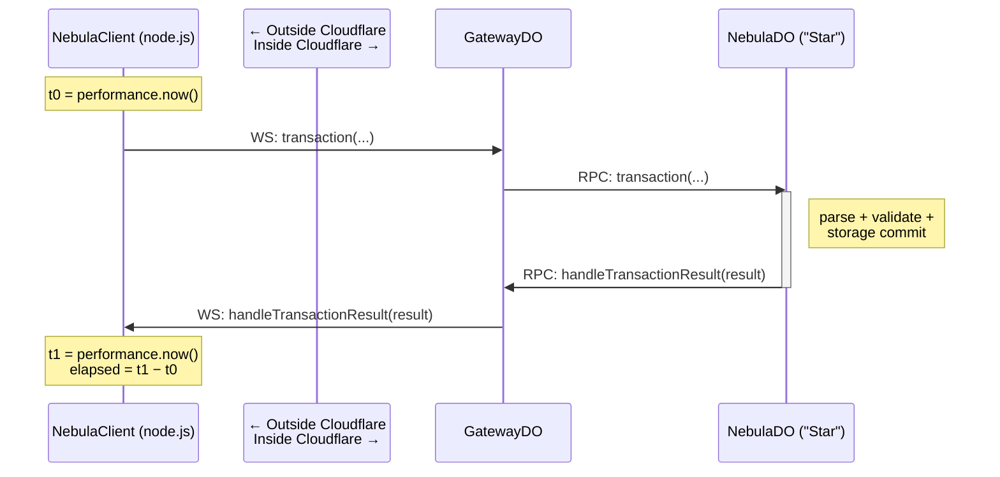

Have you (or your LLM) ever concluded that something took 0 ms inside Cloudflare, only to remember that annoying quirk: the clock stops in surprising and hard-to-predict ways. This post is about how to get honest numbers anyway.

Here's what's actually going on. Cloudflare Workers (and so Durable Objects) coarsen `Date.now()` and `performance.now()` to the same pinned value during synchronous execution — every read returns the time of the last I/O. The clock advances only when an `await` of real I/O completes, and `performance.now()` is no finer-grained than `Date.now()` inside the Worker (Spectre mitigation: if it were, attackers would just use the higher-resolution one for timing side-channels). So during the work most benches actually care about — `transactionSync` blocks, parse loops, storage commits — there is no honest in-Worker clock at all. Hibernation and fuzzy WebSocket-invocation boundaries[^ws-async] blur elapsed-time observations across invocations on top of that. If you reach for `vi.bench` inside `vitest-pool-workers` and ask the DO "how long did that take?", you're not measuring what you think you're measuring.

Cloudflare documents the behavior across [two](https://developers.cloudflare.com/workers/runtime-apis/performance/) [pages](https://developers.cloudflare.com/workers/reference/security-model/); neither addresses what to actually do when you need numbers. WebSocket-message invocation boundaries, hibernation effects, and what exactly counts as the "I/O" that bumps the clock all go undocumented — you end up reading `workerd` source or measuring empirically. (Even `workerd` only ships the *interface* — the actual Spectre clamp lives in Cloudflare's closed-source production runtime.)

So we measure from outside. The bench runs in plain Node, drives a real WebSocket into a deployed Worker, and uses the Node-side `performance.now()` as the only honest clock. Results come back as **WebSocket push frames** (mesh callbacks), not as RPC return values — that distinction is what makes the round-trip end-to-end observable from a single clock domain.

<!-- truncate -->

## The shape of the problem

The left side is Node, where `performance.now()` is honest. The right side, inside Cloudflare, is the time domain we don't trust. The trick is that the result returns to the *outside* — over the WebSocket as a push frame — so a single `t1 − t0` on the Node side captures the entire round-trip including all the in-Worker work.

## Subtracting the WebSocket leg

A round-trip number is honest but it's also a sum: WS leg out + in-Worker work + WS leg back. To isolate the in-Worker contribution, we run a second bench against a no-op `ping()` mesh handler that bounces along *the same path* — same WebSocket, same Gateway DO hop, same callback shape — but does zero work. Subtract its mean from the transaction mean and you have an estimate of just the in-Worker cost.

> Diagram pending — show ping vs transaction along the same path, with shared WS legs cancelling.

## Two benches sharing one harness

Latency (`transactions.bench.ts`) and throughput (`throughput.benchmark.ts`) are different shapes:

- **Latency**: sequential `vi.bench` blocks, single in-flight call at a time, single `#pending` slot for result correlation.
- **Throughput**: stepped concurrency ramp, many in-flight calls at once, a `Map` keyed by `resourceId` to dispatch each returning result to the right Promise.

> Architecture diagram pending — single-slot vs Map-based result dispatch.

## The limits of constant subtraction

The ping baseline is captured before the ramp. At low concurrency this is fine. At high concurrency, the WS leg itself can become contended and the constant-subtraction approximation may understate true in-Worker latency. Section pending.

## When NOT to use this pattern

- Microbenchmarks where harness overhead dominates the work being measured (the WS leg is tens of milliseconds; if you're measuring a single function call that takes microseconds, this harness is the wrong tool).
- Anything where you actually need an inside-the-DO timer for correctness rather than benchmarking.

Section pending.

## Reproducer

Bench source: [`apps/nebula/test/browser/`](https://github.com/larrymaccherone/lumenize/tree/main/apps/nebula/test/browser/) — `transactions.bench.ts`, `throughput.benchmark.ts`, and `harness-client.ts`. Headline numbers from this harness:

- Warm transaction: ~52 ms raw / ~16 ms in-Worker after ping subtraction
- Per-DO-instance peak throughput: ~410 txn/s at N=128 simulated clients (21× the serial single-client floor)

Both verified 2026-04-29 against `nebula-browser-test.transformation.workers.dev`. See [Cloudflare DO Facets in practice](/blog/cloudflare-do-facets-in-practice) and [What I got wrong about DO throughput](/blog/what-i-got-wrong-about-do-throughput) for what those numbers mean.

[^ws-async]: `workerd`'s hibernation manager has a comment confirming the asymmetry. In the [auto-response read loop](https://github.com/cloudflare/workerd/blob/e612e24bd0accaed23d2066ce7d9bb7425292e71/src/workerd/io/hibernation-manager.c%2B%2B#L287-L295) it calls `syncTime()` manually with: *"This should count as a new IO event, hence we should call syncTime otherwise the autoResponseTimestamp wouldn't be accurate."* An incoming WebSocket frame doesn't automatically count as I/O for clock-coarsening purposes — fetch handler invocations do. The Cloudflare engineer who wrote the auto-response path had to add a manual sync to keep timestamps accurate. Undocumented in the developer-facing docs; visible only in runtime source.
