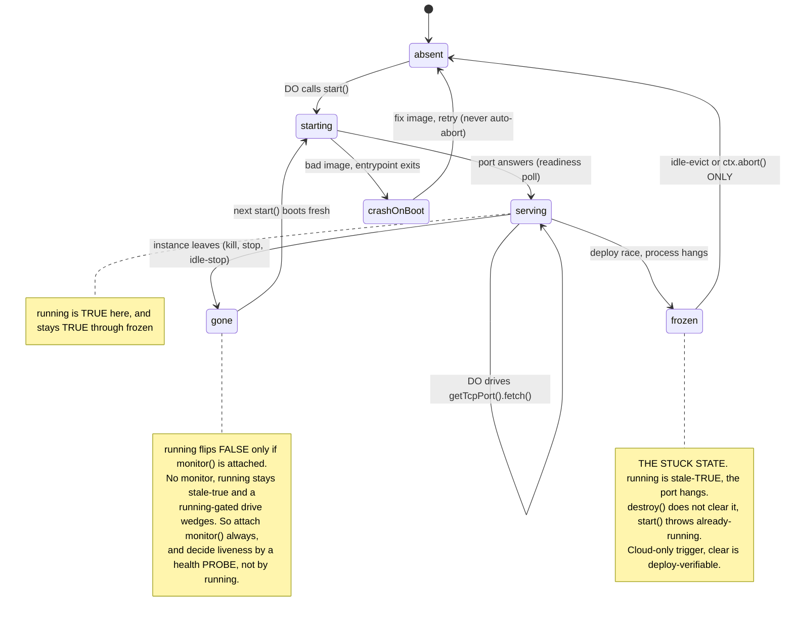

I've been running Cloudflare Containers for about a month, and the mental model that finally made them click is this: **the companion Durable Object doesn't _wrap_ the container — it _mounts_ it.** The container is a separate microVM with its own lifecycle; the DO holds a handle to it (`ctx.container`) and uses that handle to mount it (`start()`), drive it (`getTcpPort().fetch()`), observe it (`monitor()`), and unmount it (`destroy()`). Almost every hard-won lesson below falls out of getting that one framing right — and out of realizing the handle's view of the container can go *stale*.

Cloudflare's docs describe the states in prose and hand you lifecycle hooks, but I couldn't find a single state diagram, or anything on the DO↔container coupling — which is exactly where the footguns live. So I measured it. Here's the map.

<!-- truncate -->

## The state machine

The DO is the actor; these are the **container's** states. (The DO's own `awake`/`hibernating`/`evicted` lifecycle is a separate thing — see Cloudflare's [Lifecycle of a Durable Object](https://developers.cloudflare.com/durable-objects/concepts/durable-object-lifecycle/) — and folding it in here is the "wraps it" confusion the mount model avoids.)



The "all models are wrong, some are useful" simplification: **`.running` is the only signal the platform hands you, and it lies** — one coarse boolean smeared across five states.

| State | `.running` (with `monitor()`) | Port | What to do |
|---|---|---|---|
| starting | true | not yet | poll readiness |
| serving | true | answers | drive it |
| gone (kill/stop/idle) | → false | rejects | `start()` boots fresh |
| **frozen (stuck)** | **stale true** | **hangs** | can't fix DO-side |
| absent | false | — | `start()` |

## Why `.running` lies, and the one call that keeps it honest

`ctx.container` hands you exactly one lifecycle signal: a boolean `.running`. No status enum, no health field — I dumped the whole surface and it's `running` plus a handful of methods (`start`, `monitor`, `destroy`, `getTcpPort`, `exec`, …). "Healthy," which the docs talk about, is a concept the `@cloudflare/containers` base class layers on top; it is *not* on the raw handle.

And `.running` lies two ways:

1. It's set true the instant you call `start()` — *before* the container is accepting requests. So `true` doesn't mean "ready"; poll a port for that.
2. It only flips back to false if you are **monitoring** the container. `ctx.container.monitor()` returns a promise that resolves when the instance leaves, and attaching it is what lets the runtime keep `.running` honest. Skip it and `.running` stays stuck-true forever after the container dies — I killed a container and watched `.running` report `true` for 12+ seconds, then attached a monitor and it flipped false within ~2s.

This is the biggest footgun. The obvious drive —

```js
if (!ctx.container.running) ctx.container.start();
await ctx.container.getTcpPort(8080).fetch(url);
```

— wedges the moment the container dies *without a monitor*: `.running` says `true`, so you never restart, and the fetch hangs against a dead port. The base class self-heals on a killed container precisely because it attaches the monitor for you — that's not sugar, it's load-bearing.

**The rule: attach `ctx.container.monitor()`, and decide "is it alive?" with a health probe (a bounded fetch), never with `.running` alone.**

## The stuck state

There's one state a monitor can't save you from. `docker kill` — or a cloud instance leaving — is *gone*: the monitor sees it, `.running` flips false, the next `start()` boots a fresh one. But a *frozen* container — process alive, unresponsive — is different. The instance hasn't "left," so `.running` stays true and the port hangs.

That's the stuck state, and it's nasty because every obvious escape fails:

- `.running` is stale-true, so a `.running`-gated drive won't restart.
- `start()` **throws** `"cannot be called on a container that is already running"` — you can't force a fresh one.
- `destroy()` doesn't clear the flag either.

In the cloud the trigger is a deploy/eviction race — rare; I've only ever seen it in production, never reproduced it off-prod. The only clears are idle-eviction (the DO goes idle, reconstructs, and re-reads `.running` from reality) or a forced DO reset (`ctx.abort()`). Locally you can reproduce the *mechanism* but not the *trigger* with `docker pause` (freeze the process with the flag still true).

The part that surprised me: this state is **native to `ctx.container`**, not something the base class introduces. Dropping the base class doesn't dissolve it. What *does* dissolve it is never keeping a container alive long enough to get stuck — see the design at the end.

## Keeping the DO alive during long work — you probably don't need to

The companion DO hibernates when idle and evicts after a couple of minutes. I assumed I'd have to fight that to keep the DO responsive. Two measurements changed my mind:

1. **Waking a hibernated/evicted DO is free.** After a full idle-and-evict, the DO reconstructed and answered in ~0.3s — indistinguishable from a warm call (it's just network round-trip). There is nothing to optimize; let it hibernate.
2. **An in-flight request keeps the DO resident on its own.** I held one request open with a 180s `await` and it stayed the *same isolate* the whole time — idle-eviction doesn't fire while a request is in flight.

And the thing people reach for — a periodic alarm as a keep-warm heartbeat — **doesn't do what you'd want anyway.** An alarm that fires after an eviction *reconstructs a fresh isolate*; it does not preserve the one that was running. So a heartbeat can't keep a long in-memory operation (a streaming model call, say) alive across an eviction. If you need that, the work has to happen inside an in-flight request, or be checkpointed and resumed. A heartbeat is the wrong tool.

## What the base class gets right (steal its homework)

`@cloudflare/containers` is open source, and reading it is the fastest way to learn the platform's sharp edges. Even if you drive `ctx.container` raw (I do), copy these patterns:

- **The monitor is the single source of truth** for "the container exited." Its promise resolving is what drives every stop/error transition — build your lifecycle around it, not around `.running`.
- **Readiness is a poll with a timeout**, not an open-ended wait, and a port that never comes up should fail *loudly* (a crashed entrypoint is a bug to surface, not a hang to sit in).
- **Serialize lifecycle transitions.** The base wraps start/stop in `blockConcurrencyWhile` and keeps an in-flight-start latch so concurrent callers coalesce onto one `start()` instead of racing a second one.
- **It keeps its own status enum** because `.running` alone isn't enough — which is the entire lesson of this post.

## A worked example: an LLM code-gen build box

Here's the use case that sent me down this hole, and where the numbers pay off. An LLM writes source files; I compile them in a container and serve the result. The naive design keeps a container warm per user and babysits its lifecycle — which is exactly how you end up fighting cold starts, keep-alive, and the stuck state all at once.

Line up the latencies instead:

- An LLM takes several seconds to compose a response and write out files.
- A container cold-starts in ~1–2s for a small image (measure yours — a heavier image with a real toolchain will be more).

So **start the container the moment the model begins generating.** `start()` is non-blocking — fire it and keep streaming tokens. By the time the model has finished and written files to the DO's durable storage, the container is warm and waiting. The cold start is hidden behind work you were doing anyway.

Then **compile, take the output, and `destroy()` the container.** Every build gets a fresh one:

- **No stuck state** — you never keep a container alive long enough to freeze.
- **No keep-alive, no heartbeat, no idle-timeout tuning** — the container exists only for the ~1–3s build, and stopped containers cost nothing.
- **Clean state every build** — no leftover files, no accumulated cruft.

The DO doesn't need keeping warm either: it wakes for free between turns, and during a turn it's resident as long as it's doing in-flight work. So the whole thing reduces to: the companion DO **mounts a fresh container per build, times the mount to hide behind the model, and unmounts when done.** The hard problems — cold start, keep-alive, the stuck state — don't get *solved*. They get *designed away*.

---

_Work in progress. Measurements are from a small `node:22-slim`-based spike (`experiments/plain-do-container`) driven under `wrangler dev` + Docker and as a deployed Worker; single-run numbers, indicative not averaged — they'll firm up before this leaves draft._
