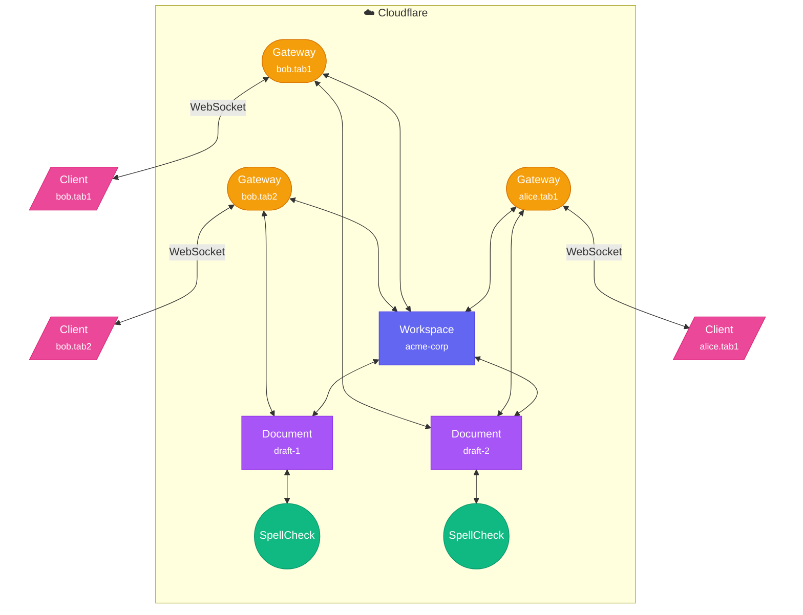

```mermaid @skip-check
flowchart TB

    subgraph browserA[" "]
        ClientA[/"Client<br/><small>alice.tab1</small>"/]
    end

    subgraph cloud[" ☁️ Cloudflare "]
        direction TB

        subgraph mesh[" "]
            direction LR
            Workspace["Workspace<br/><small>acme-corp</small>"]
            Doc1["Document<br/><small>draft-1</small>"]
            Doc2["Document<br/><small>draft-2</small>"]
            Spell1(("SpellCheck"))
            Spell2(("SpellCheck"))
        end

        subgraph gatewaysA[" "]
            GwA(["Gateway<br/><small>alice.tab1</small>"])
        end

        subgraph gatewaysB[" "]
            GwB1(["Gateway<br/><small>bob.tab1</small>"])
            GwB2(["Gateway<br/><small>bob.tab2</small>"])
            GwB1 ~~~ GwB2
        end

        Workspace <--> Doc1
        Workspace <--> Doc2
        Doc1 <--> Spell1
        Doc2 <--> Spell2

        GwA <--> Workspace
        GwB1 <--> Workspace
        GwB2 <--> Workspace

        GwA <--> Doc2
        GwB1 <--> Doc2
        GwB2 <--> Doc1
    end

    subgraph browserB[" "]
        ClientB1[/"Client<br/><small>bob.tab1</small>"/]
        ClientB2[/"Client<br/><small>bob.tab2</small>"/]
        ClientB1 ~~~ ClientB2
    end

    GwB1 <-->|WebSocket| ClientB1
    GwB2 <-->|WebSocket| ClientB2
    GwA <-->|WebSocket| ClientA

    classDef workspaceDO fill:#6366f1,stroke:#4f46e5,color:#fff
    classDef documentDO fill:#a855f7,stroke:#9333ea,color:#fff
    classDef spellWorker fill:#10b981,stroke:#059669,color:#fff
    classDef gateway fill:#f59e0b,stroke:#d97706,color:#fff
    classDef client fill:#ec4899,stroke:#db2777,color:#fff
    classDef invisible fill:none,stroke:none

    class Workspace workspaceDO
    class Doc1,Doc2 documentDO
    class Spell1,Spell2 spellWorker
    class GwA,GwB1,GwB2 gateway
    class ClientA,ClientB1,ClientB2 client
    class mesh,gatewaysA,gatewaysB,browserA,browserB invisible
```
