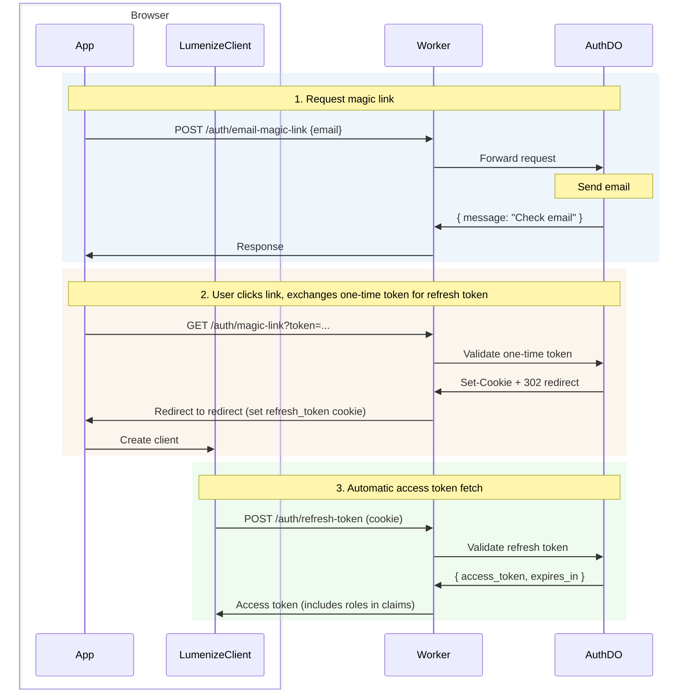

# Auth

Passwordless authentication for Cloudflare Durable Objects with magic link login, JWT access tokens, refresh token rotation, and built-in role management. Serves as the default authentication for Lumenize Mesh.

| Feature | Description |
|---------|-------------|
| **Passwordless** | Magic link email login (no passwords to manage) |
| **Secure JWTs** | Ed25519 signed tokens with key rotation support |
| **Refresh rotation** | Automatic token refresh with revocation |
| **Built-in roles** | `isSuperAdmin`, `isAdmin`, and `hasMeshAccess` out of the box |
| **Zero-config bootstrap** | First admin via environment variable |
| **Agent delegation** | RFC 8693 `act` claim for agents acting on behalf of users |
| **Rate limiting** | Built-in protection against abuse |
| **WebSocket auth** | Token passing via subprotocol headers |
| **Middleware** | Drop-in `routeDORequest` hooks for protected routes |
| **Extensible** | Subclass to add custom fields, routes, and behavior |

## Getting Started

For a complete setup walkthrough including key generation, environment configuration, and Worker setup, see [Lumenize Mesh: Getting Started](/docs/mesh/getting-started#step-5-set-up-authentication).

## Installation

```bash @skip-check
npm install @lumenize/auth
```

## Bootstrap: Your First Admin

Before anyone can log in with admin privileges, you need to designate a super-admin. Set the `AUTH_SUPER_ADMIN_EMAIL` environment variable:

```bash @skip-check
# In .dev.vars (local development)
AUTH_SUPER_ADMIN_EMAIL=you@example.com

# In production (via wrangler or dashboard)
wrangler secret put AUTH_SUPER_ADMIN_EMAIL
```

When this email address logs in for the first time, LumenizeAuth automatically grants `isSuperAdmin: true`. No database seeding required. The super-admin can then promote other users to admin via the [user management APIs](/docs/auth/users-and-roles#user-management-apis).

## Login Flow



| Token | Lifetime | Storage | Purpose |
|-------|----------|---------|---------|
| **One-time token** | 30 min | URL query param | Magic link validation (single use) |
| **Refresh token** | 30 days | HttpOnly cookie | Obtain new access tokens |
| **Access token** | 15 min | Memory (JS) | Authenticate mesh calls, carries role claims |

### Request Magic Link

```typescript @skip-check
const response = await fetch('/auth/email-magic-link', {
  method: 'POST',
  headers: { 'Content-Type': 'application/json' },
  body: JSON.stringify({ email: 'user@example.com' })
});
// Returns: { message: "Check your email for the magic link", expires_in: 1800 }
```

### Exchange One-time Token for Refresh Token Cookie

When the user clicks the magic link, the server validates the token, sets the refresh token cookie, and redirects to your app.

### Get Access Token with Role Claims

**With LumenizeClient** (recommended): token management is automatic. `LumenizeClient` handles retrieving the access token using the refresh token cookie, transparent access token refresh, reconnection, and a callback for you to re-route to a login page when necessary. See [LumenizeClient: Authentication](/docs/mesh/lumenize-client#authentication).

**Manual token management** (for non-Lumenize Mesh use):

```typescript @skip-check
// On app load, get access token using the refresh token cookie
const response = await fetch('/auth/refresh-token', { method: 'POST' });
if (!response.ok) {  // 401 if refresh token has expired
  window.location.href = '/login';
} else {
  const { access_token } = await response.json();
  // access_token contains claims: { sub, isSuperAdmin, isAdmin, ... }
}
```

### Logout

```typescript @skip-check
await fetch('/auth/logout', { method: 'POST' });
// Refresh token cookie is cleared
```

## JWT Claims

Access tokens contain standard JWT claims plus role information:

```typescript @skip-check
interface JwtClaims {
  // Standard claims
  iss: string;          // Issuer
  aud: string;          // Audience
  sub: string;          // Subject (user ID)
  exp: number;          // Expiration time
  iat: number;          // Issued at
  jti: string;          // JWT ID

  // Role claims
  isSuperAdmin?: boolean;
  isAdmin?: boolean;
  hasMeshAccess?: boolean;  // Required for mesh access (see below)

  // Delegation (RFC 8693)
  act?: { sub: string };  // Actor: agent/system making the call
}
```

The `hasMeshAccess` claim gates access to Lumenize Mesh. Without it, authenticated users cannot connect to the mesh—authentication alone is not sufficient. Super-admins and admins implicitly have mesh access. Regular users must be explicitly granted access via the [user management APIs](/docs/auth/users-and-roles#user-management-apis).

The `sub` claim identifies whose permissions apply. When an agent acts on behalf of a user, `sub` is the user's ID and `act.sub` is the agent's ID. Guards check `sub` for authorization; `act` is for audit logging. See [Agent Delegation](#agent-delegation) for details.

## Server-Side Token Verification

Use auth middleware to verify access tokens on protected routes. Both HTTP and WebSocket middleware accept an array of public keys for [zero-downtime key rotation](#key-rotation):

```typescript @skip-check
import { env } from 'cloudflare:workers';
import { createAuthMiddleware, createWebSocketAuthMiddleware } from '@lumenize/auth';

// Create once at module level - both accept arrays for zero-downtime key rotation
const publicKeys = [env.JWT_PUBLIC_KEY_BLUE, env.JWT_PUBLIC_KEY_GREEN].filter(Boolean);
const httpAuth = await createAuthMiddleware({ publicKeysPem: publicKeys });
const wsAuth = await createWebSocketAuthMiddleware({ publicKeysPem: publicKeys });

// In fetch handler:
const response = await routeDORequest(request, env, {
  onBeforeRequest: httpAuth,
  onBeforeConnect: wsAuth
});
```

**WebSocket token delivery** (if not using LumenizeClient): Smuggle the token via the subprotocol list:

```javascript @skip-check
// Client-side
const ws = new WebSocket(url, ['lmz', `lmz.access-token.${accessToken}`]);
```

## Using Claims in Guards

The parsed JWT claims are available in `@mesh` guards and `onBeforeCall` hooks:

```typescript @skip-check
import { mesh } from '@lumenize/mesh';

class ProjectDO {
  @mesh({
    guard: (auth) => auth.isSuperAdmin || auth.isAdmin
  })
  deleteProject() {
    // Only admins can delete
  }

  @mesh({
    guard: (auth, args, ctx) => {
      // Check if user owns this project
      const project = ctx.storage.kv.get('project');
      return project?.ownerId === auth.sub;
    }
  })
  updateProject(data: ProjectUpdate) {
    // Only owner can update
  }
}
```

See [Security: Guards](/docs/mesh/security#guards) for more patterns.

## Agent Delegation

When AI agents or automated systems act on behalf of users, the JWT includes an `act` (actor) claim following [RFC 8693](https://datatracker.ietf.org/doc/html/rfc8693):

```typescript @skip-check
// Token for agent "agent-123" acting on behalf of user "user-456"
{
  sub: "user-456",        // User's permissions apply
  act: { sub: "agent-123" }, // Agent is making the call
  isAdmin: true           // User's roles
}
```

Guards automatically check `sub` for permissions. The `act` claim provides transparency for logging and audit:

```typescript @skip-check
// In onBeforeCall hook
onBeforeCall: (auth, methodName) => {
  if (auth.act) {
    console.log(`Agent ${auth.act.sub} calling ${methodName} for user ${auth.sub}`);
  }
}
```

To issue tokens with delegation, use the `actAs` parameter when creating tokens:

```typescript @skip-check
// Agent requests token to act on behalf of user
const token = await authDO.createDelegatedToken({
  userId: 'user-456',
  actorId: 'agent-123'
});
```

The agent must be authorized to act for this user. See [Users and Roles: Delegation](/docs/auth/users-and-roles#delegation) for authorization setup.

## Key Rotation

The BLUE/GREEN pattern enables zero-downtime key rotation. Tokens are verified against each public key until one succeeds.

### Secrets and Variables

**Secrets** - Generate with:
```bash @skip-check
# Generate and display private key (copy for next step)
openssl genpkey -algorithm ed25519 | tee /dev/stderr | openssl pkey -pubout
```

Set in the dashboard or via command line:

```bash @skip-check
# Primary key pair (signs new tokens)
wrangler secret put JWT_PRIVATE_KEY_BLUE
wrangler secret put JWT_PUBLIC_KEY_BLUE

# Secondary key pair (verifies old tokens during rotation)
wrangler secret put JWT_PRIVATE_KEY_GREEN
wrangler secret put JWT_PUBLIC_KEY_GREEN
```

Paste each key (including `-----BEGIN/END-----` lines) when prompted.

**Variable** - Set `PRIMARY_JWT_KEY` to `BLUE` in the dashboard or wrangler.jsonc/wrangler.toml

### Key Rotation Procedure

Every 3 months for 6 month lifetime:
1. **Generate new key pair** for the secondary slot (GREEN if BLUE is primary)
2. **Switch primary** - change `PRIMARY_JWT_KEY` (to GREEN if BLUE is primary)
3. **Deploy** - environment variables/secrets only become active on deploy

## Test Mode

For development, add `?_test=true` to get the magic link directly:

```typescript @skip-check
const response = await fetch('/auth/email-magic-link?_test=true', {
  method: 'POST',
  body: JSON.stringify({ email: 'test@example.com' })
});
// Returns: { message: "Magic link generated (test mode)", magic_link: "..." }
```

Requires `AUTH_TEST_MODE="true"` in environment.

For testing with specific roles, use `testLoginWithMagicLink`:

```typescript @skip-check
import { testLoginWithMagicLink } from '@lumenize/auth';

// Login as admin
const { accessToken, claims } = await testLoginWithMagicLink(env, {
  email: 'admin@test.com',
  userData: { isAdmin: true }
});

// Login as agent acting for user
const { accessToken: agentToken } = await testLoginWithMagicLink(env, {
  email: 'user@test.com',
  actAs: 'agent-123'
});
```

## Worker Setup

Use `createAuthRoutes` to expose auth endpoints with clean URLs:

```typescript @skip-check
import { env } from 'cloudflare:workers';
import { createAuthRoutes, createAuthMiddleware, createWebSocketAuthMiddleware } from '@lumenize/auth';
import { routeDORequest } from '@lumenize/utils';

// Create routes and middleware once at module level (not per request)
const publicKeys = [env.JWT_PUBLIC_KEY_BLUE, env.JWT_PUBLIC_KEY_GREEN].filter(Boolean);
const authRoutes = createAuthRoutes(env, {
  redirect: '/app',  // Required: where to redirect after magic link
  cors: { origin: ['https://app.example.com'] }
});
const httpAuth = await createAuthMiddleware({ publicKeysPem: publicKeys });
const wsAuth = await createWebSocketAuthMiddleware({ publicKeysPem: publicKeys });

export default {
  async fetch(request: Request): Promise<Response> {
    // Auth routes - public, clean URLs (/auth/magic-link, /auth/refresh-token, etc.)
    const authResponse = await authRoutes(request);
    if (authResponse) return authResponse;

    // Protected routes use middleware
    return routeDORequest(request, env, {
      onBeforeRequest: httpAuth,
      onBeforeConnect: wsAuth,
      cors: { origin: ['https://app.example.com'] }
    }) ?? new Response('Not Found', { status: 404 });
  }
};
```

## API Reference

### Auth Endpoints

| Endpoint | Method | Auth | Response |
|----------|--------|------|----------|
| `/auth/email-magic-link` | POST | None | `{ message, expires_in }` |
| `/auth/magic-link` | GET | None | 302 redirect (sets `refresh_token` cookie) |
| `/auth/refresh-token` | POST | Cookie | `{ access_token, expires_in }` |
| `/auth/logout` | POST | Cookie | `{ message }` (clears cookie) |
| `/auth/users` | GET | Admin | `{ users: User[] }` |
| `/auth/user/:id` | GET | Admin | `{ user: User }` |
| `/auth/user/:id` | PATCH | Admin | `{ user: User }` |
| `/auth/user/:id` | DELETE | SuperAdmin | `{ message }` |

See [Users and Roles](/docs/auth/users-and-roles) for user management details.

### createAuthRoutes

```typescript @skip-check
const authRoutes = createAuthRoutes(env, {
  redirect: string,              // Required: redirect destination after magic link
  prefix?: string,               // Default: '/auth'
  gatewayBindingName?: string,   // Default: 'LUMENIZE_AUTH'
  instanceName?: string,         // Default: 'default'
  cors?: CorsConfig,             // Optional: CORS configuration
  // JWT and token options (passed to Auth DO)
  issuer?: string,               // Default: 'https://lumenize.local'
  audience?: string,             // Default: 'https://lumenize.local'
  accessTokenTtl?: number,       // Default: 900 (15 minutes)
  refreshTokenTtl?: number,      // Default: 2592000 (30 days)
  magicLinkTtl?: number,         // Default: 1800 (30 minutes)
  rateLimitPerHour?: number      // Default: 5 requests per email
});
```

### Middleware Functions

```typescript @skip-check
// HTTP auth (for protected routes)
const httpAuth = await createAuthMiddleware({
  publicKeysPem: string[],
  audience?: string,
  issuer?: string
});

// WebSocket auth (for protected routes)
const wsAuth = await createWebSocketAuthMiddleware({
  publicKeysPem: string[],
  audience?: string,
  issuer?: string
});
```

## Next Steps

- [Users and Roles](/docs/auth/users-and-roles) - Role hierarchy, user management APIs, delegation setup
- [Extending Auth](/docs/auth/extending) - Custom fields, routes, and behavior via subclassing
- [Security](/docs/mesh/security) - Guard patterns and authorization strategies
