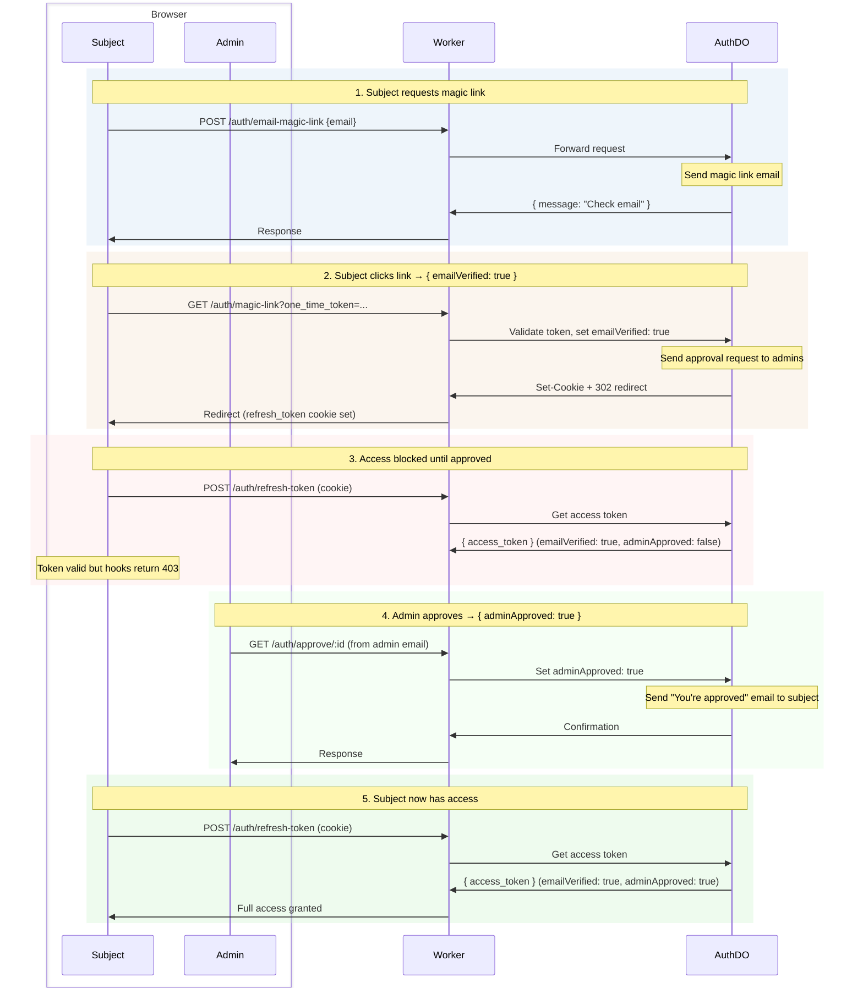
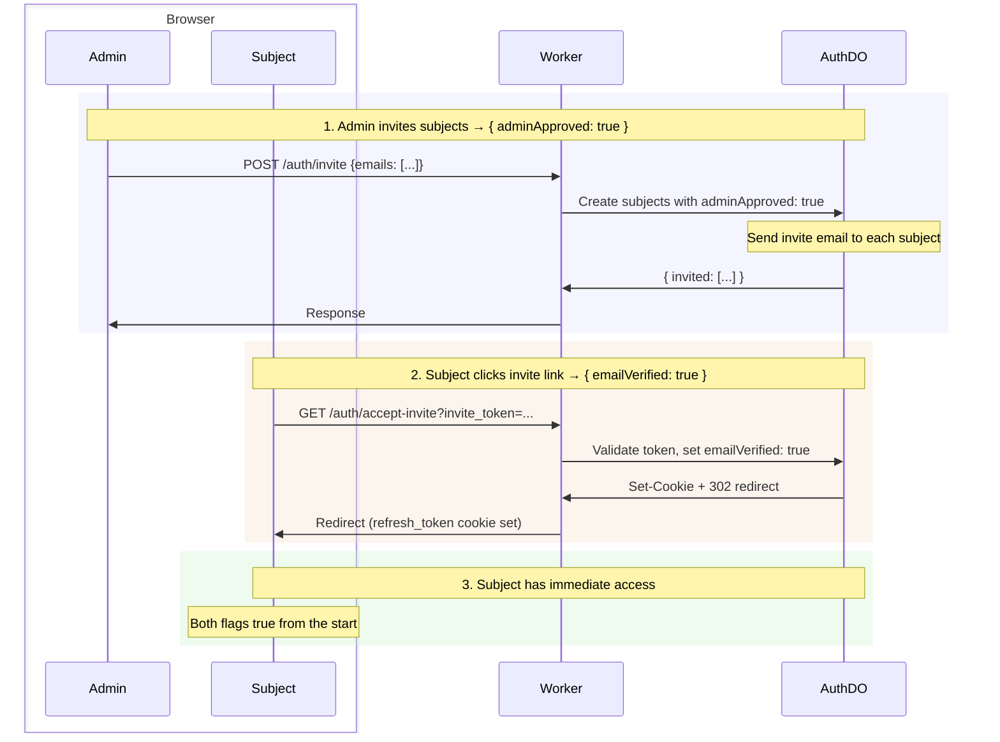

# Auth

De✨light✨ful passwordless authentication with passwordless magic link login, JWT access tokens, refresh token rotation, and built-in admin role. Serves as the default authentication for [Lumenize Mesh](/docs/mesh) but designed to work with any Cloudflare Workers project.

| Feature | Description |
|---------|-------------|
| **Passwordless** | Magic link email login (no passwords to manage) |
| **Secure JWTs** | Ed25519 signed tokens with key rotation support |
| **Refresh rotation** | Automatic token refresh with revocation |
| **Two-phase access** | Requires both subject confirmation (`emailVerified`) and admin approval (`adminApproved`) |
| **Admin role bootstrapped** | First `isAdmin` bootstrapped via environment variable |
| **Delegation** | RFC 8693 `act` claim for delegated access (agents, services, impersonation) |
| **Rate limiting** | Cloudflare DDoS + Turnstile (magic link) + Worker-level rate limiting binding (authenticated routes) |
| **WebSocket auth** | Token passing via subprotocol headers |
| **Hooks** | Drop-in `routeDORequest` hooks for protected routes |

:::note Why "subject" instead of "user"?
These docs use **subject** — the [RFC 7519](https://datatracker.ietf.org/doc/html/rfc7519) term for the entity a JWT describes. A subject could be a person, an AI agent, a service account, or any authenticated entity. The standard `sub` claim carries this meaning, so we use "subject" everywhere rather than "user" to avoid implying the principal is always human.
:::

## Access Flows

Two-phase access requires both `emailVerified` (subject clicked link) and `adminApproved` (admin granted access). These can happen in either order via two flows.

### Self-Signup Flow

Subject initiates signup, then waits for admin approval:



### Admin Invite Flow

Invite from admin pre-approves subjects, then subjects confirm via email:



## JWT Claims

Access tokens contain standard JWT claims plus status and role information:

```typescript @check-example('packages/auth/src/types.ts')
interface JwtPayload {
  // Standard claims (RFC 7519)
  iss: string;          // Issuer
  aud: string;          // Audience
  sub: string;          // Subject (UUID of the principal)
  exp: number;          // Expiration time
  iat: number;          // Issued at
  jti: string;          // JWT ID

  // Status flags (both required for access)
  emailVerified: boolean;   // Subject clicked magic link
  adminApproved: boolean;   // Admin granted access

  // Role flag
  isAdmin?: boolean;

  // Delegation (RFC 8693)
  act?: ActClaim;
}
```

The `act` claim enables delegation — one authenticated subject acting on behalf of another. It's recursive per [RFC 8693](https://datatracker.ietf.org/doc/html/rfc8693): each layer records who delegated to whom. Guards check `sub` for authorization; the `act` chain is recorded for audit trails.

Admins can delegate as any subject. Non-admin actors must be explicitly listed in the principal's `authorizedActors`. See [Delegation](/docs/auth/delegation) for the full API, requirements, and limitations.

## Server-Side Token Verification

Use [`createRouteDORequestAuthHooks`](/docs/auth/getting-started#createroutedorequestauthhooks) to create hooks that validate JWTs, enforce two-phase access, rate-limit per subject, and forward the verified token to your DO. See [Worker Setup](/docs/auth/getting-started#worker-setup) for the full integration pattern.

**WebSocket token delivery** (if not using LumenizeClient): Smuggle the token via the subprotocol list:

```javascript @skip-check-approved('conceptual')
// Client-side
const ws = new WebSocket(url, ['lmz', `lmz.access-token.${accessToken}`]);
```
