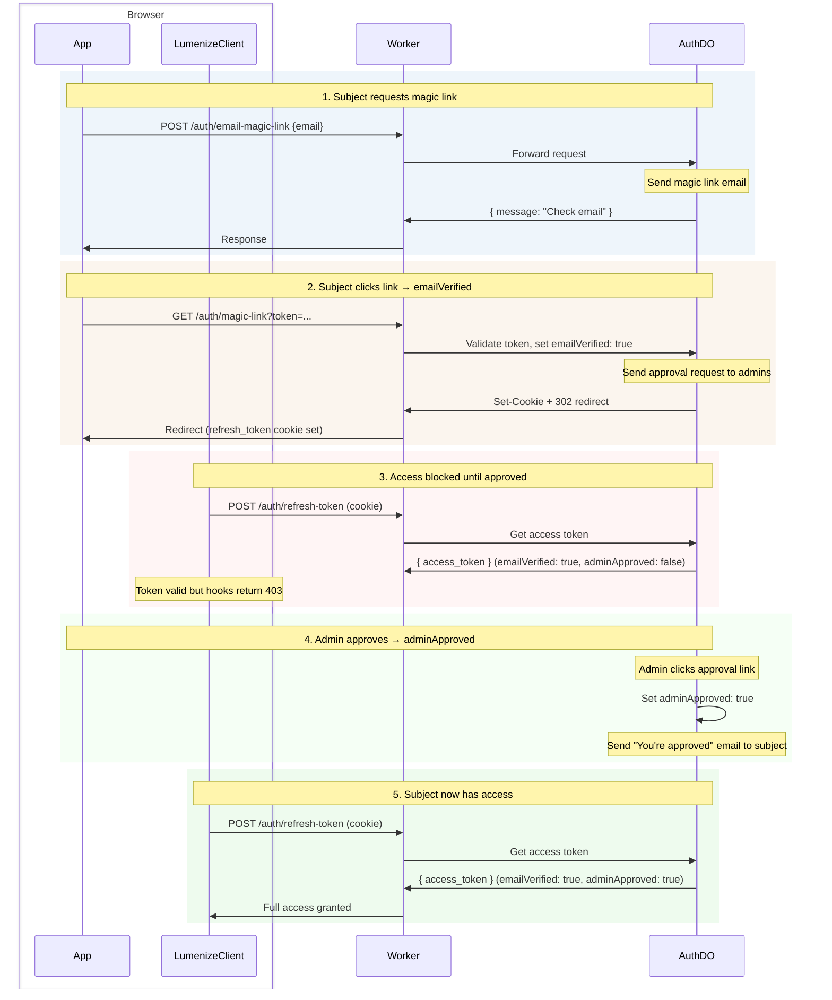
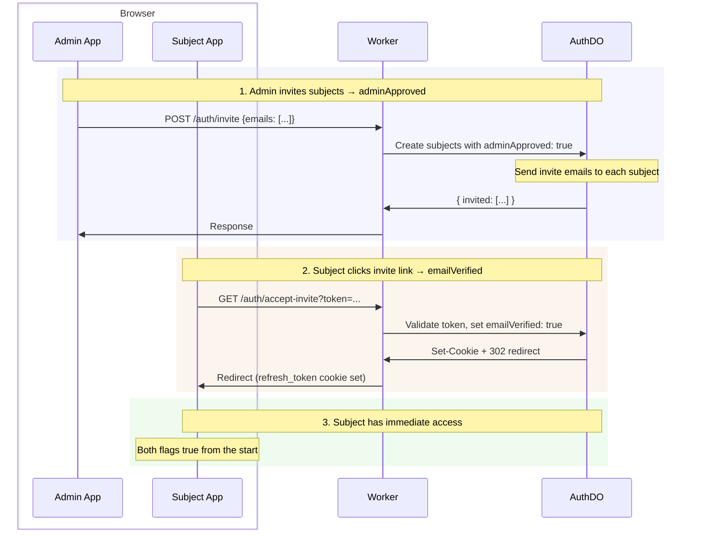

# Auth

Passwordless authentication for Cloudflare Durable Objects with magic link login, JWT access tokens, refresh token rotation, and built-in role management. Serves as the default authentication for Lumenize Mesh.

| Feature | Description |
|---------|-------------|
| **Passwordless** | Magic link email login (no passwords to manage) |
| **Secure JWTs** | Ed25519 signed tokens with key rotation support |
| **Refresh rotation** | Automatic token refresh with revocation |
| **Two-phase access** | Requires both subject confirmation (`emailVerified`) and admin approval (`adminApproved`) |
| **Built-in roles** | `isAdmin` out of the box, bootstrap admin via env var |
| **Zero-config bootstrap** | First admin via environment variable |
| **Delegation** | RFC 8693 `act` claim for delegated access (agents, services, impersonation) |
| **Rate limiting** | Layered: Cloudflare DDoS, optional Turnstile, Worker-level rate limiting binding |
| **WebSocket auth** | Token passing via subprotocol headers |
| **Hooks** | Drop-in `routeDORequest` hooks for protected routes |

## Getting Started

For a complete setup walkthrough including key generation, environment configuration, and Worker setup, see [Lumenize Mesh: Getting Started](/docs/mesh/getting-started#step-5-set-up-authentication).

## Installation

```bash @skip-check
npm install @lumenize/auth
```

## Bootstrap: Your First Admin

Before anyone can log in with admin privileges, you need to designate a bootstrap admin. Set the `LUMENIZE_AUTH_BOOTSTRAP_EMAIL` environment variable:

```bash @skip-check
# In .dev.vars (local development)
LUMENIZE_AUTH_BOOTSTRAP_EMAIL=you@example.com

# In production (via wrangler or dashboard)
wrangler secret put LUMENIZE_AUTH_BOOTSTRAP_EMAIL
```

When this email address logs in for the first time, LumenizeAuth automatically grants `isAdmin: true` and `adminApproved: true`. No database seeding required. The bootstrap admin can then approve other subjects and promote them to admin via the [subject management APIs](/docs/auth/subjects-and-roles#subject-management-apis).

The bootstrap subject has special protection: it cannot be demoted or deleted via API. To change the bootstrap admin, update the environment variable and deploy.

## Access Flows

Two-phase access requires both `emailVerified` (subject clicked link) and `adminApproved` (admin granted access). These can happen in either order via two flows:

### Self-Signup Flow

Subject initiates signup, then waits for admin approval:



### Admin Invite Flow

Admin pre-approves subjects, then subjects confirm via email:



| Token | Lifetime | Storage | Purpose |
|-------|----------|---------|---------|
| **One-time token** | 30 min | URL query param | Magic link validation (single use) |
| **Refresh token** | 30 days | HttpOnly cookie | Obtain new access tokens |
| **Access token** | 15 min | Memory (JS) | Authenticate mesh calls, carries role claims |

### Request Magic Link

```typescript @skip-check
const response = await fetch('/auth/email-magic-link', {
  method: 'POST',
  headers: { 'Content-Type': 'application/json' },
  body: JSON.stringify({ email: 'user@example.com' })
});
// Returns: { message: "Check your email for the magic link", expires_in: 1800 }
```

### Exchange One-time Token for Refresh Token Cookie

When the subject clicks the magic link, the server validates the token, sets the refresh token cookie, and redirects to your app.

### Get Access Token with Role Claims

**With LumenizeClient** (recommended): token management is automatic. `LumenizeClient` handles retrieving the access token using the refresh token cookie, transparent access token refresh, reconnection, and a callback for you to re-route to a login page when necessary. See [LumenizeClient: Authentication](/docs/mesh/lumenize-client#authentication).

**Manual token management** (for non-Lumenize Mesh use):

```typescript @skip-check
// On app load, get access token using the refresh token cookie
const response = await fetch('/auth/refresh-token', { method: 'POST' });
if (!response.ok) {  // 401 if refresh token has expired
  window.location.href = '/login';
} else {
  const { access_token } = await response.json();
  // access_token contains claims: { sub, isAdmin, ... }
}
```

### Logout

```typescript @skip-check
await fetch('/auth/logout', { method: 'POST' });
// Refresh token cookie is cleared
```

## JWT Claims

Access tokens contain standard JWT claims plus status and role information:

```typescript @skip-check
interface JwtClaims {
  // Standard claims (RFC 7519)
  iss: string;          // Issuer
  aud: string;          // Audience
  sub: string;          // Subject (UUID of the principal)
  exp: number;          // Expiration time
  iat: number;          // Issued at
  jti: string;          // JWT ID

  // Status flags (both required for access)
  emailVerified: boolean;   // Subject clicked magic link
  adminApproved: boolean;   // Admin granted access

  // Role flag
  isAdmin?: boolean;

  // Delegation (RFC 8693) - recursive for delegation chains
  act?: { sub: string; act?: ActClaim };
}
```

The `act` claim is recursive per RFC 8693. Each layer records who delegated to whom — pure provenance for audit trails. Guards only check `sub`; the `act` chain is for transparency.

## Two-Phase Access Control

Access to protected resources requires two independent approvals:

1. **Subject confirmation** (`emailVerified`) - Subject clicked the magic link
2. **Admin approval** (`adminApproved`) - Admin granted access

These can happen in either order:

| Scenario | emailVerified | adminApproved | Can Access? |
|----------|---------------|---------------|-------------|
| Admin invites subject, subject hasn't clicked | No | Yes | No |
| Subject self-signs-up, admin hasn't approved | Yes | No | No |
| Admin invited, subject clicked | Yes | Yes | **Yes** |
| Subject self-signed-up, admin approved | Yes | Yes | **Yes** |

Admins implicitly satisfy `adminApproved`. Regular subjects must be explicitly approved via the [subject management APIs](/docs/auth/subjects-and-roles#subject-management-apis).

The `sub` claim (the subject's UUID) identifies the principal whose permissions apply. For direct access, only `sub` is present. For delegated access, `act.sub` identifies who is actually making the call. Guards check `sub` for authorization; `act` is recorded for audit trails. See [Delegation](#delegation) for details.

## Server-Side Token Verification

Use `createRouteDORequestAuthHooks` to create hooks that verify access tokens and enforce two-phase access control. The hooks:

1. Validate the JWT signature against your public keys
2. Verify `emailVerified && adminApproved` (admins pass implicitly)
3. Return 401 for invalid/missing tokens, 403 for valid tokens without access

```typescript @skip-check
import { env } from 'cloudflare:workers';
import { createRouteDORequestAuthHooks } from '@lumenize/auth';

// Create once at module level - accepts arrays for zero-downtime key rotation
const publicKeys = [env.JWT_PUBLIC_KEY_BLUE, env.JWT_PUBLIC_KEY_GREEN].filter(Boolean);
const { onBeforeRequest, onBeforeConnect } = createRouteDORequestAuthHooks({
  publicKeysPem: publicKeys,
});

// In fetch handler:
const response = await routeDORequest(request, env, {
  onBeforeRequest,
  onBeforeConnect,
});
```

**WebSocket token delivery** (if not using LumenizeClient): Smuggle the token via the subprotocol list:

```javascript @skip-check
// Client-side
const ws = new WebSocket(url, ['lmz', `lmz.access-token.${accessToken}`]);
```

## Using Claims in Guards

The parsed JWT claims are available in `@mesh` guards and `onBeforeCall` hooks. Note that subjects without `emailVerified && adminApproved` are blocked at the Worker level before any DO code runs, so you don't need to check those in guards.

```typescript @skip-check
import { mesh } from '@lumenize/mesh';

class ProjectDO {
  @mesh({
    guard: (auth) => auth.isAdmin
  })
  deleteProject() {
    // Only admins can delete
  }

  @mesh({
    guard: (auth, args, ctx) => {
      // Check if subject owns this project
      const project = ctx.storage.kv.get('project');
      return project?.ownerId === auth.sub;
    }
  })
  updateProject(data: ProjectUpdate) {
    // Only owner can update
  }
}
```

See [Security: Guards](/docs/mesh/security#guards) for more patterns.

## Delegation

Delegation allows something to act on behalf of a subject. The actor could be an AI agent, a service account, a scheduled job, or even another human (e.g., admin impersonation for support). The JWT includes an `act` (actor) claim following [RFC 8693](https://datatracker.ietf.org/doc/html/rfc8693):

```typescript @skip-check
// Delegated token: "agent-123" acting on behalf of subject "abc-456"
{
  sub: "abc-456",            // Principal: whose permissions apply
  act: { sub: "agent-123" }, // Actor: who is making the call
  isAdmin: true              // Principal's role
}
```

Guards check `sub` for authorization. The `act` claim records delegation for audit trails:

```typescript @skip-check
// Audit logging in onBeforeCall hook
onBeforeCall: (auth, methodName) => {
  if (auth.act) {
    console.log(`${auth.act.sub} calling ${methodName} for ${auth.sub}`);
  }
}
```

To issue tokens with delegation, use the `actAs` parameter when creating tokens:

```typescript @skip-check
// Agent requests token to act on behalf of subject
const token = await authDO.createDelegatedToken({
  sub: 'abc-456',       // Subject (principal)
  actorId: 'agent-123'  // Actor
});
```

The actor must be authorized to act for this subject. See [Subjects and Roles: Delegation](/docs/auth/subjects-and-roles#delegation) for authorization setup.

## Key Rotation

The BLUE/GREEN pattern enables zero-downtime key rotation. Tokens are verified against each public key until one succeeds.

### Secrets and Variables

**Secrets** - Generate with:
```bash @skip-check
# Generate and display private key (copy for next step)
openssl genpkey -algorithm ed25519 | tee /dev/stderr | openssl pkey -pubout
```

Set in the dashboard or via command line:

```bash @skip-check
# Primary key pair (signs new tokens)
wrangler secret put JWT_PRIVATE_KEY_BLUE
wrangler secret put JWT_PUBLIC_KEY_BLUE

# Secondary key pair (verifies old tokens during rotation)
wrangler secret put JWT_PRIVATE_KEY_GREEN
wrangler secret put JWT_PUBLIC_KEY_GREEN
```

Paste each key (including `-----BEGIN/END-----` lines) when prompted.

**Variable** - Set `PRIMARY_JWT_KEY` to `BLUE` in the dashboard or wrangler.jsonc/wrangler.toml

### Key Rotation Procedure

Every 3 months for 6 month lifetime:
1. **Generate new key pair** for the secondary slot (GREEN if BLUE is primary)
2. **Switch primary** - change `PRIMARY_JWT_KEY` (to GREEN if BLUE is primary)
3. **Deploy** - environment variables/secrets only become active on deploy

## Rate Limiting

Rate limiting runs at the Worker level, not in the LumenizeAuth DO. This keeps the singleton DO focused on business logic and leverages Worker horizontal scaling.

### Three Layers

1. **Cloudflare DDoS/bot protection** (automatic) — Fingerprint-reputation filtering handles volumetric attacks. No configuration needed.

2. **Turnstile** (optional, recommended) — [Cloudflare Turnstile](https://developers.cloudflare.com/turnstile/) proves the requester is human before the magic-link request reaches your Worker. If `TURNSTILE_SECRET_KEY` is set in your environment, `createAuthRoutes` validates the `cf-turnstile-response` token from the request body via Cloudflare's siteverify API. Your frontend is responsible for embedding the Turnstile widget and including the token in the request.

3. **Worker-level rate limiting** — Uses Cloudflare's [Rate Limiting binding](https://developers.cloudflare.com/workers/runtime-apis/bindings/rate-limit/). Two independent bindings:
   - `AUTH_RATE_LIMITER` — Keyed on email (parsed from request body). Protects `POST {prefix}/email-magic-link` from email flooding.
   - `HOOKS_RATE_LIMITER` — Keyed on `sub` from decoded JWT. Protects authenticated routes handled by `createRouteDORequestAuthHooks`.

### Setup

Add rate limiting bindings to your `wrangler.jsonc`:

```jsonc @skip-check
{
  "rate_limits": [
    { "binding": "AUTH_RATE_LIMITER", "namespace_id": "1001", "simple": { "limit": 5, "period": 60 } },
    { "binding": "HOOKS_RATE_LIMITER", "namespace_id": "1002", "simple": { "limit": 100, "period": 60 } }
  ]
}
```

For Turnstile, add the secret key to `.dev.vars`:

```bash @skip-check
TURNSTILE_SECRET_KEY=0x4AAAAAAA...
```

Pass the bindings when creating routes and hooks (see [Worker Setup](#worker-setup)).

`createRouteDORequestAuthHooks` **requires** its rate limiting binding — it throws at creation time if missing. `createAuthRoutes` requires at least one of `TURNSTILE_SECRET_KEY` (env) or `rateLimiterBinding` — it throws at creation time if neither is provided. This ensures the unauthenticated magic-link endpoint always has at least one layer of abuse protection.

### Rate Limiting Caveats

The rate limiting binding is **per Cloudflare location** (not globally consistent) and **eventually consistent**. It is designed for abuse prevention, not precise accounting. This is fine for auth rate limiting — the goal is to stop floods, not enforce exact quotas.

## Test Mode

For development, add `?_test=true` to get the magic link directly:

```typescript @skip-check
const response = await fetch('/auth/email-magic-link?_test=true', {
  method: 'POST',
  body: JSON.stringify({ email: 'test@example.com' })
});
// Returns: { message: "Magic link generated (test mode)", magic_link: "..." }
```

Requires `AUTH_TEST_MODE="true"` in environment.

For testing with specific roles, use `testLoginWithMagicLink`:

```typescript @skip-check
import { testLoginWithMagicLink } from '@lumenize/auth';

// Login as approved regular subject
const { accessToken, claims } = await testLoginWithMagicLink(env, {
  email: 'alice@test.com',
  subjectData: { adminApproved: true }  // emailVerified is set automatically
});

// Login as admin
const { accessToken: adminToken } = await testLoginWithMagicLink(env, {
  email: 'admin@test.com',
  subjectData: { isAdmin: true }  // Admins implicitly have adminApproved
});

// Login as agent acting for subject
const { accessToken: agentToken } = await testLoginWithMagicLink(env, {
  email: 'alice@test.com',
  subjectData: { adminApproved: true },
  actAs: 'agent-123'
});
```

## Worker Setup

Use `createAuthRoutes` to expose auth endpoints and `createRouteDORequestAuthHooks` to protect your DOs:

```typescript @skip-check
import { env } from 'cloudflare:workers';
import { createAuthRoutes, createRouteDORequestAuthHooks } from '@lumenize/auth';
import { routeDORequest } from '@lumenize/utils';

// Create routes and hooks once at module level (not per request)
const publicKeys = [env.JWT_PUBLIC_KEY_BLUE, env.JWT_PUBLIC_KEY_GREEN].filter(Boolean);
const authRoutes = createAuthRoutes(env, {
  redirect: '/app',
  cors: { origin: ['https://app.example.com'] },
  rateLimiterBinding: env.AUTH_RATE_LIMITER,   // Optional: rate limit magic-link requests by email
});
const { onBeforeRequest, onBeforeConnect } = createRouteDORequestAuthHooks({
  publicKeysPem: publicKeys,
  rateLimiterBinding: env.HOOKS_RATE_LIMITER,  // Required: rate limit authenticated requests by sub
});

export default {
  async fetch(request: Request): Promise<Response> {
    // Auth routes - public, clean URLs (/auth/magic-link, /auth/refresh-token, etc.)
    const authResponse = await authRoutes(request);
    if (authResponse) return authResponse;

    // Protected routes use auth hooks
    return routeDORequest(request, env, {
      onBeforeRequest,
      onBeforeConnect,
      cors: { origin: ['https://app.example.com'] }
    }) ?? new Response('Not Found', { status: 404 });
  }
};
```

## API Reference

### Auth Endpoints

All endpoints use the configured `prefix` (default: `/auth`).

| Endpoint | Method | Auth | Description |
|----------|--------|------|-------------|
| `{prefix}/email-magic-link` | POST | None | Request magic link (self-signup) |
| `{prefix}/magic-link` | GET | None | Validate magic link → `emailVerified`, notify admins |
| `{prefix}/invite` | POST | Admin | Invite subjects (bulk) → `adminApproved`, send invite emails |
| `{prefix}/accept-invite` | GET | None | Accept invite → `emailVerified` |
| `{prefix}/approve/:id` | GET | Admin | Approve subject → `adminApproved` (from admin notification email) |
| `{prefix}/refresh-token` | POST | Cookie | Exchange refresh token for access token |
| `{prefix}/logout` | POST | Cookie | Clear refresh token cookie |
| `{prefix}/subjects` | GET | Admin | List subjects |
| `{prefix}/subject/:id` | GET | Admin | Get subject |
| `{prefix}/subject/:id` | PATCH | Admin | Update subject |
| `{prefix}/subject/:id` | DELETE | Admin | Delete subject |

See [Subjects and Roles](/docs/auth/subjects-and-roles) for subject management details.

### createAuthRoutes

```typescript @skip-check
const authRoutes = createAuthRoutes(env, {
  redirect: string,              // Required: redirect destination after magic link
  prefix?: string,               // Default: '/auth'
  gatewayBindingName?: string,   // Default: 'LUMENIZE_AUTH'
  instanceName?: string,         // Default: 'default'
  cors?: CorsConfig,             // Optional: CORS configuration
  // JWT and token options (passed to Auth DO)
  issuer?: string,               // Default: 'https://lumenize.local'
  audience?: string,             // Default: 'https://lumenize.local'
  accessTokenTtl?: number,       // Default: 900 (15 minutes)
  refreshTokenTtl?: number,      // Default: 2592000 (30 days)
  magicLinkTtl?: number,         // Default: 1800 (30 minutes)
  // Rate limiting (Worker-level, see Rate Limiting section)
  rateLimiterBinding?: RateLimit, // Optional: rate limiting binding from wrangler.jsonc
});
// Throws if neither env.TURNSTILE_SECRET_KEY nor rateLimiterBinding is provided
```

### createRouteDORequestAuthHooks

Creates hooks for `routeDORequest` that verify JWTs and enforce two-phase access control:

```typescript @skip-check
const { onBeforeRequest, onBeforeConnect } = createRouteDORequestAuthHooks({
  publicKeysPem: string[],        // Required: public keys for JWT verification
  audience?: string,              // Default: 'https://lumenize.local'
  issuer?: string,                // Default: 'https://lumenize.local'
  rateLimiterBinding: RateLimit,  // Required: rate limiting binding from wrangler.jsonc
});
```

Both hooks:
- Validate JWT signature against provided public keys (tries each until one succeeds)
- Verify `emailVerified && adminApproved` (admins pass implicitly)
- Return 401 for invalid/missing tokens
- Return 403 for valid tokens that fail the access check
- Attach parsed claims to the request for use in guards

## Next Steps

- [Subjects and Roles](/docs/auth/subjects-and-roles) - Role hierarchy, subject management APIs, delegation setup
- [Security](/docs/mesh/security) - Guard patterns and authorization strategies
