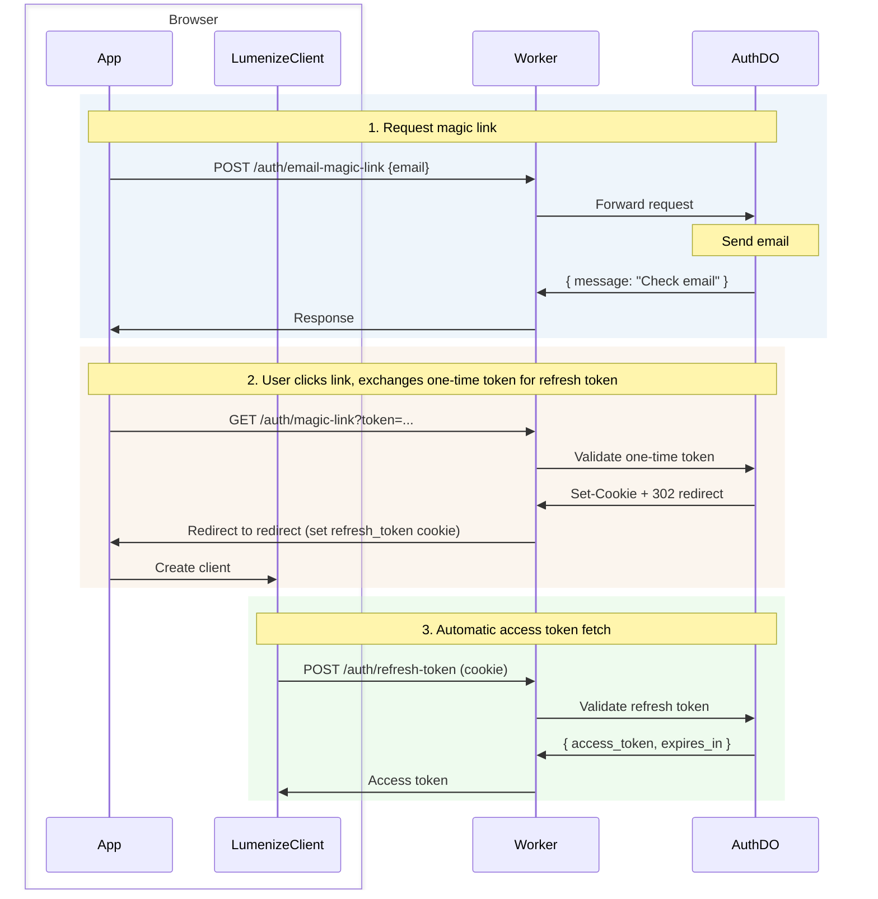

# Auth

Passwordless authentication for Cloudflare Durable Objects with magic link login, JWT access tokens, and refresh token rotation. It serves as the default authentication for Lumenize Mesh.

| Feature | Description |
|---------|-------------|
| **Passwordless** | Magic link email login (no passwords to manage) |
| **Secure JWTs** | Ed25519 signed tokens with key rotation support |
| **Refresh rotation** | Automatic token refresh with revocation |
| **Rate limiting** | Built-in protection against abuse |
| **WebSocket auth** | Token passing via subprotocol headers |
| **Middleware** | Drop-in `routeDORequest` hooks for protected routes |

## Getting Started

For a complete setup walkthrough including key generation, environment configuration, and Worker setup, see [Lumenize Mesh: Getting Started](/docs/lumenize-mesh/getting-started#step-5-set-up-authentication).

## Installation

```bash @skip-check
npm install @lumenize/auth
```

## Login Flow (LumenizeClient)



| Token | Lifetime | Storage | Purpose |
|-------|----------|---------|---------|
| **One-time token** | 30 min | URL query param | Magic link validation (single use) |
| **Refresh token** | 30 days | HttpOnly cookie | Obtain new access tokens |
| **Access token** | 15 min | Memory (JS) | Authenticate mesh calls |

### Request Magic Link Containing One-time Token

```typescript @skip-check
const response = await fetch('/auth/email-magic-link', {
  method: 'POST',
  headers: { 'Content-Type': 'application/json' },
  body: JSON.stringify({ email: 'user@example.com' })
});
// Returns: { message: "Check your email for the magic link", expires_in: 1800 }
```

### Exchange One-time Token for Refresh Token Cookie

When the user clicks the magic link, the server validates the token, sets the refresh token cookie, and redirects to your app.

### Use Refresh Token to Get Short-lived Access Token

**With LumenizeClient** (recommended): token management is automatic. `LumenizeClient` handles retrieving the access token using the refresh token cookie, transparent access token refresh, reconnection, and a callback for you to re-route to a login page when necessary. See [LumenizeClient: Authentication](/docs/lumenize-mesh/lumenize-client#authentication).

**Manual token management** (for non-Lumenize Mesh use):

```typescript @skip-check
// On app load, get access token using the refresh token cookie
const response = await fetch('/auth/refresh-token', { method: 'POST' });
if (!response.ok) {  // 401 if refresh token has expired
  window.location.href = '/login';
} else {
  const { access_token } = await response.json();
  // ...
}
```

### Logout

```typescript @skip-check
await fetch('/auth/logout', {
  method: 'POST'
});
// Refresh token cookie is cleared
```

## Server-Side Token Verification

Use auth middleware to verify access tokens on protected routes. Both HTTP and WebSocket middleware accept an array of public keys for [zero-downtime key rotation](#key-rotation):

```typescript @skip-check
import { createAuthMiddleware, createWebSocketAuthMiddleware } from '@lumenize/auth';

// Both middlewares accept an array of public keys for zero-downtime rotation
const publicKeys = [env.JWT_PUBLIC_KEY_BLUE, env.JWT_PUBLIC_KEY_GREEN].filter(Boolean);

const httpAuth = await createAuthMiddleware({ publicKeysPem: publicKeys });
const wsAuth = await createWebSocketAuthMiddleware({ publicKeysPem: publicKeys });

const response = await routeDORequest(request, env, {
  onBeforeRequest: httpAuth,
  onBeforeConnect: wsAuth
});
```

**WebSocket token delivery** (if not using LumenizeClient): Smuggle the token via the subprotocol list:

```javascript @skip-check
// Client-side
const ws = new WebSocket(url, ['lmz', `lmz.access-token.${accessToken}`]);
```

## Key Rotation

The BLUE/GREEN pattern shown above enables zero-downtime key rotation. Tokens are verified against each public key until one succeeds. See [Key Rotation Procedure](#key-rotation-procedure) for when and how to rotate.

### Secrets and Variables

**Secrets**

To generate use:
```bash @skip-check
# Generate and display private key (copy for next step)
openssl genpkey -algorithm ed25519 | tee /dev/stderr | openssl pkey -pubout
```

Set in the dashboard or via command line with:

```bash @skip-check
# Primary key pair (signs new tokens)
wrangler secret put JWT_PRIVATE_KEY_BLUE
wrangler secret put JWT_PUBLIC_KEY_BLUE

# Secondary key pair (verifies old tokens during rotation)
wrangler secret put JWT_PRIVATE_KEY_GREEN
wrangler secret put JWT_PUBLIC_KEY_GREEN
```

Paste each key (including `-----BEGIN/END-----` lines) when prompted.

**Variable**

Set `PRIMARY_JWT_KEY` to `BLUE` in the dashboard or wrangler.jsonc/wrangler.toml

### Key Rotation Procedure

Every 3 months for 6 month lifetime, do the following:
1. **Generate new key pair** for the secondary slot (GREEN if BLUE is primary) using 
2. **Switch primary** — change `PRIMARY_JWT_KEY` (to GREEN if BLUE is primary)
3. **Deploy** — environment variables/secrets only become active on deploy

## Test Mode

For development, add `?_test=true` to get the magic link directly:

```typescript @skip-check
const response = await fetch('/auth/email-magic-link?_test=true', {
  method: 'POST',
  body: JSON.stringify({ email: 'test@example.com' })
});
// Returns: { message: "Magic link generated (test mode)", magic_link: "..." }
```

Requires `AUTH_TEST_MODE="true"` in environment.

## Worker Setup

Use `createAuthRoutes` to expose auth endpoints with clean URLs:

```typescript @skip-check
import { createAuthRoutes, createAuthMiddleware, createWebSocketAuthMiddleware } from '@lumenize/auth';
import { routeDORequest } from '@lumenize/utils';

export default {
  async fetch(request: Request, env: Env): Promise<Response> {
    // Auth routes - public, clean URLs (/auth/magic-link, /auth/refresh-token, etc.)
    const authRoutes = createAuthRoutes(env, {
      redirect: '/app',  // Required: where to redirect after magic link
      // prefix: '/auth',                      // Default: '/auth'
      // gatewayBindingName: 'LUMENIZE_AUTH',  // Default: 'LUMENIZE_AUTH'
      // instanceName: 'default',              // Default: 'default'
      cors: { origin: ['https://app.example.com'] }
    });
    const authResponse = await authRoutes(request);
    if (authResponse) return authResponse;

    // Protected routes use middleware
    const publicKeys = [env.JWT_PUBLIC_KEY_BLUE, env.JWT_PUBLIC_KEY_GREEN].filter(Boolean);
    const httpAuth = await createAuthMiddleware({ publicKeysPem: publicKeys });
    const wsAuth = await createWebSocketAuthMiddleware({ publicKeysPem: publicKeys });

    return routeDORequest(request, env, {
      onBeforeRequest: httpAuth,
      onBeforeConnect: wsAuth,
      cors: { origin: ['https://app.example.com'] }
    }) ?? new Response('Not Found', { status: 404 });
  }
};
```

## API Reference

### LumenizeAuth DO

**HTTP Endpoints:**

| Endpoint | Method | Response |
|----------|--------|----------|
| `/auth/email-magic-link` | POST | `{ message, expires_in }` |
| `/auth/magic-link` | GET | 302 redirect to `redirect` (sets `refresh_token` cookie) |
| `/auth/refresh-token` | POST | `{ access_token, expires_in }` |
| `/auth/logout` | POST | `{ message }` (clears `refresh_token` cookie) |

### Routing Function

```typescript @skip-check
const authRoutes = createAuthRoutes(env, {
  redirect: string,              // Required: redirect destination after magic link
  prefix?: string,               // Default: '/auth'
  gatewayBindingName?: string,   // Default: 'LUMENIZE_AUTH'
  instanceName?: string,         // Default: 'default'
  cors?: CorsConfig              // Optional: CORS configuration
});
```

### Middleware Functions

```typescript @skip-check
// HTTP auth (for protected routes)
const httpAuth = await createAuthMiddleware({
  publicKeysPem: string[],
  audience?: string,
  issuer?: string
});

// WebSocket auth (for protected routes)
const wsAuth = await createWebSocketAuthMiddleware({
  publicKeysPem: string[],
  audience?: string,
  issuer?: string
});
```

---

## Internal Use (TODO: may be out of date)

### RPC Methods on LumenizeAuth

- `getUserById(userId)` - Look up user by ID
- `getUserByEmail(email)` - Look up user by email
- `configure(options)` - Set auth configuration (including `redirect`)
- `setEmailService(service)` - Set email provider

### JWT Utilities

```typescript @skip-check
import {
  signJwt,
  verifyJwt,
  verifyJwtWithRotation,
  importPrivateKey,
  importPublicKey,
  parseJwtUnsafe
} from '@lumenize/auth';
```

### WebSocket Utilities

```typescript @skip-check
import {
  extractWebSocketToken,
  verifyWebSocketToken,
  getTokenTtl,
  WS_CLOSE_CODES
} from '@lumenize/auth';
```

### Email Services

- `ConsoleEmailService` - Logs to console (development)
- `HttpEmailService` - Sends via HTTP POST
- `MockEmailService` - Collects emails in memory (testing)
- `createDefaultEmailService(env)` - Factory for default service

### Configuration

Configure the Auth DO programmatically:

```typescript @skip-check
const stub = env.LUMENIZE_AUTH.getByName('default');
await stub.configure({
  redirect: '/',  // Required: where to redirect after magic link
  issuer: 'https://myapp.com',
  audience: 'https://api.myapp.com',
  accessTokenTtl: 900,      // 15 minutes (default)
  refreshTokenTtl: 2592000, // 30 days (default)
  magicLinkTtl: 1800,       // 30 minutes (default)
  rateLimitPerHour: 5       // 5 requests per email per hour (default)
});
```
