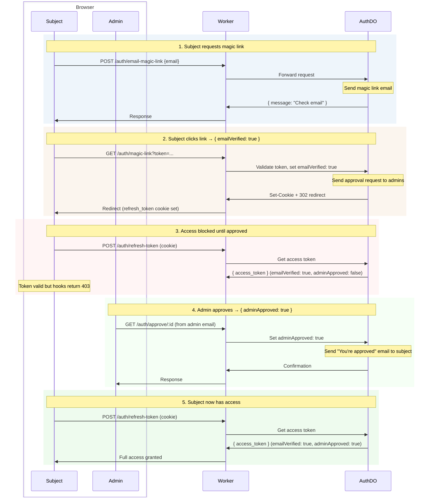
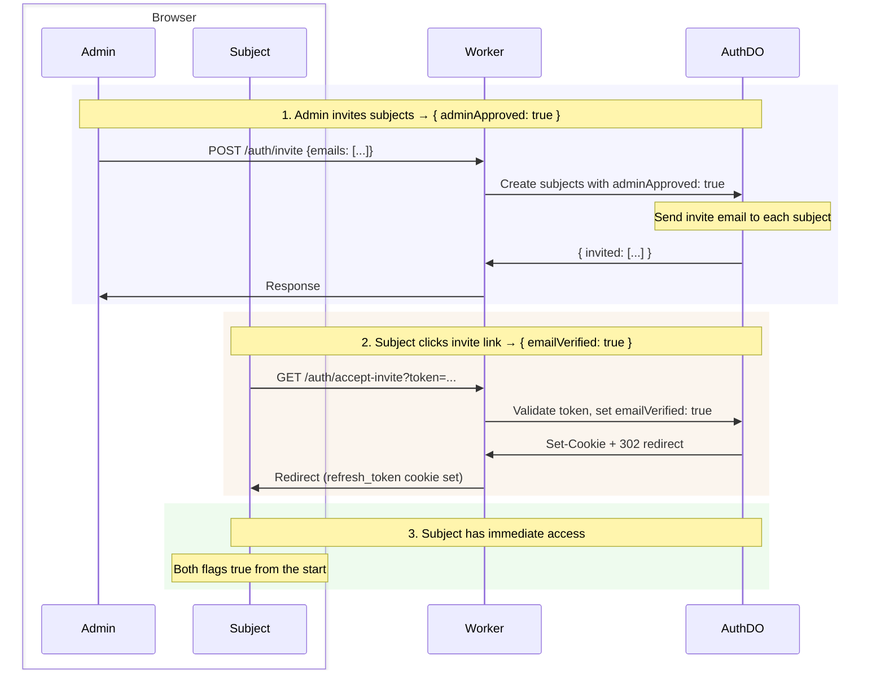

# Auth

Passwordless authentication for Cloudflare Durable Objects with magic link login, JWT access tokens, refresh token rotation, and built-in admin role. Serves as the default authentication for Lumenize Mesh but can be used with any Cloudflare Workers project.

| Feature | Description |
|---------|-------------|
| **Passwordless** | Magic link email login (no passwords to manage) |
| **Secure JWTs** | Ed25519 signed tokens with key rotation support |
| **Refresh rotation** | Automatic token refresh with revocation |
| **Two-phase access** | Requires both subject confirmation (`emailVerified`) and admin approval (`adminApproved`) |
| **Admin role bootstraped** | First `isAdmin` bootstrapped via environment variable |
| **Delegation** | RFC 8693 `act` claim for delegated access (agents, services, impersonation) |
| **Rate limiting** | Cloudflare DDoS + Turnstile (magic link) + Worker-level rate limiting binding (authenticated routes) |
| **WebSocket auth** | Token passing via subprotocol headers |
| **Hooks** | Drop-in `routeDORequest` hooks for protected routes |

:::note Why "subject" instead of "user"?
These docs use **subject** — the [RFC 7519](https://datatracker.ietf.org/doc/html/rfc7519) term for the entity a JWT describes. A subject could be a person, an AI agent, a service account, or any authenticated entity. The standard `sub` claim carries this meaning, so we use "subject" everywhere rather than "user" to avoid implying the principal is always human.
:::

## Getting Started

:::note Lumenize Mesh/Utils used to illustrate
In these docs, `@lumenize/mesh` and `@lumenize/utils` are used to illustrate Lumenize Auth, but `@lumenize/auth` will work with any Cloudflare Workers/Durable Object system. The integration surface is the standard `Authorization` header: the auth hooks verify the JWT and forward it to your DO in the `Authorization: Bearer <jwt>` header — for both HTTP requests and WebSockets. See [Integrating Alternative Auth](/docs/mesh/security#integrating-alternative-auth-advanced) for the exact header contract.
:::

For a complete setup walkthrough including key generation, environment configuration, and Worker setup, see [Lumenize Mesh: Getting Started](/docs/mesh/getting-started#step-5-set-up-authentication).

## Installation

```bash @skip-check
npm install @lumenize/auth
```

## Bootstrap: Your First Admin

Before anyone can log in with admin privileges, you need to designate a bootstrap admin. Set the `LUMENIZE_AUTH_BOOTSTRAP_EMAIL` environment variable:

```bash @skip-check
# In .dev.vars or wrangler.jsonc (local development)
LUMENIZE_AUTH_BOOTSTRAP_EMAIL=you@example.com

# In production (via wrangler or dashboard)
wrangler secret put LUMENIZE_AUTH_BOOTSTRAP_EMAIL
```

When this email address logs in for the first time, LumenizeAuth automatically grants `isAdmin: true`, `emailVerified: true`, and `adminApproved: true`. No database seeding required. The bootstrap admin can then approve other subjects and promote them to admin via the [subject management APIs](/docs/auth/api-reference#subject-management-endpoints).

The bootstrap subject has special protection: it cannot be demoted or deleted via API. To change the bootstrap admin, update the environment variable and deploy.

## Access Flows

Two-phase access requires both `emailVerified` (subject clicked link) and `adminApproved` (admin granted access). These can happen in either order via two flows. 

### Self-Signup Flow

Subject initiates signup, then waits for admin approval:



### Admin Invite Flow

Invite from admin pre-approves subjects, then subjects confirm via email:



### Three Different Tokens

| Token | Lifetime | Storage | Purpose |
|-------|----------|---------|---------|
| **One-time token** | 30 min | URL query param | Magic link validation (single use) |
| **Refresh token** | 30 days | HttpOnly cookie | Obtain new access tokens |
| **Access token** | 15 min | Memory (JS) | Authenticate mesh calls, carries claims |

### Request Magic Link

```typescript @skip-check
const response = await fetch('/auth/email-magic-link', {
  method: 'POST',
  headers: { 'Content-Type': 'application/json' },
  body: JSON.stringify({ email: 'user@example.com' })
});
// Returns: { message: "Check your email for the magic link", expires_in: 1800 }
```

### Exchange One-time Token for Refresh Token Cookie

When the subject clicks the magic link, the server validates the token, sets the refresh token cookie, and returns a 302 redirect to the `redirect` option you passed to [`createAuthRoutes`](/docs/auth/api-reference#createauthroutes).

### Get Access Token with Role Claims

**With LumenizeClient**: token management is automatic. `LumenizeClient` handles retrieving the access token using the refresh token cookie, transparent access token refresh, reconnection, and a callback for you to re-route to a login page when necessary. See [LumenizeClient: Authentication](/docs/mesh/lumenize-client#authentication).

**Manual token management** (for non-Lumenize Mesh use):

```typescript @skip-check
// On app load, get access token using the refresh token cookie
const response = await fetch('/auth/refresh-token', { method: 'POST' });
if (response.status === 401) {
  window.location.href = '/login';       // Refresh token expired or missing
} else if (response.status === 403) {
  window.location.href = '/pending';     // Authenticated but not yet approved
} else {
  const { access_token } = await response.json();
  // access_token contains claims: { sub, isAdmin, ... }
}
```

### Logout

```typescript @skip-check
await fetch('/auth/logout', { method: 'POST' });
// Refresh token cookie is cleared
```

## JWT Claims

Access tokens contain standard JWT claims plus status and role information:

```typescript @skip-check
interface JwtClaims {
  // Standard claims (RFC 7519)
  iss: string;          // Issuer
  aud: string;          // Audience
  sub: string;          // Subject (UUID of the principal)
  exp: number;          // Expiration time
  iat: number;          // Issued at
  jti: string;          // JWT ID

  // Status flags (both required for access)
  emailVerified: boolean;   // Subject clicked magic link
  adminApproved: boolean;   // Admin granted access

  // Role flag
  isAdmin?: boolean;

  // Delegation (RFC 8693) - recursive for delegation chains
  act?: { sub: string; act?: ActClaim };
}
```

The `act` claim enables delegation — one authenticated subject acting on behalf of another. It's recursive per [RFC 8693](https://datatracker.ietf.org/doc/html/rfc8693): each layer records who delegated to whom. Guards check `sub` for authorization; the `act` chain is recorded for audit trails.

Currently, delegation is between authenticated subjects (e.g., admin impersonation): the actor logs in via magic link, then requests a delegated token for the target subject. If `act.sub` matches an existing subject, the system verifies it. Service account and AI agent authentication (API keys, service tokens) is planned for a future release. See [API Reference: Delegation](/docs/auth/api-reference#delegation) for the API.

## Server-Side Token Verification

Use `createRouteDORequestAuthHooks` to create hooks that verify access tokens and enforce two-phase access control. The hooks:

1. Validate the JWT signature against your public keys
2. Verify `emailVerified && adminApproved` (admins pass implicitly)
3. Enforce the `LUMENIZE_AUTH_RATE_LIMITER` binding (keyed on `sub`)
4. Return 401 (invalid/missing token), 403 (not approved), or 429 (rate limited)
5. Forward the verified JWT to the DO in the standard `Authorization: Bearer` header

```typescript @skip-check
import { env } from 'cloudflare:workers';
import { createRouteDORequestAuthHooks } from '@lumenize/auth';

// Create once at module level — reads JWT_PUBLIC_KEY_BLUE/GREEN from env automatically
const { onBeforeRequest, onBeforeConnect } = createRouteDORequestAuthHooks(env);

// In fetch handler:
const response = await routeDORequest(request, env, {
  onBeforeRequest,
  onBeforeConnect,
});
```

**WebSocket token delivery** (if not using LumenizeClient): Smuggle the token via the subprotocol list:

```javascript @skip-check
// Client-side
const ws = new WebSocket(url, ['lmz', `lmz.access-token.${accessToken}`]);
```

## How the JWT Reaches Your DO

After `createRouteDORequestAuthHooks` verifies the JWT, it forwards the original token to your Durable Object in the standard `Authorization: Bearer <jwt>` header. This works for both HTTP requests and WebSocket upgrades.

The WebSocket case is worth noting: browsers don't allow custom headers on WebSocket connections, so the token arrives via the subprotocol list (see [above](#server-side-token-verification)). The hooks extract and verify it at the Worker level, then set the `Authorization: Bearer <jwt>` header on the upgrade request before forwarding to the DO. Your DO code sees a consistent header regardless of transport.

Your DO can then decode the JWT payload and authorize however you like — role checks, ownership guards, audit logging, etc. Ed25519 verification is a local `crypto.subtle.verify()` call (no network round trip, sub-millisecond), so DOs that want defense-in-depth can cheaply re-verify. DOs that trust the Worker hooks can simply base64url-decode the payload section. For a concrete example using `@lumenize/mesh` guards, see [Security: Guards](/docs/mesh/security#guards).

## Key Rotation

The BLUE/GREEN pattern enables zero-downtime key rotation. Tokens are verified against each public key until one succeeds.

### Secrets and Variables

**Secrets** - Generate two key pairs with:
```bash @skip-check
# Generate and display private key (copy for next step)
openssl genpkey -algorithm ed25519 | tee /dev/stderr | openssl pkey -pubout
```

Set in the dashboard or via command line:

```bash @skip-check
# Primary key pair (signs new tokens)
wrangler secret put JWT_PRIVATE_KEY_BLUE
wrangler secret put JWT_PUBLIC_KEY_BLUE

# Secondary key pair (verifies old tokens during rotation)
wrangler secret put JWT_PRIVATE_KEY_GREEN
wrangler secret put JWT_PUBLIC_KEY_GREEN
```

Paste each key (including `-----BEGIN/END-----` lines) when prompted.

**Variable** - Set `PRIMARY_JWT_KEY` to `BLUE` in the dashboard or wrangler.jsonc/wrangler.toml

### Key Rotation Procedure

Every 3 months for 6 month lifetime:
1. **Generate new key pair** for the secondary slot (GREEN if BLUE is primary)
2. **Switch primary** - change `PRIMARY_JWT_KEY` (to GREEN if BLUE is primary)
3. **Deploy** - environment variables/secrets only become active on deploy

## Rate Limiting

Rate limiting runs at the Worker level, not in the LumenizeAuth DO. This keeps the singleton DO focused on business logic and leverages Worker horizontal scaling.

### Cloudflare DDoS/Bot Protection

Fingerprint-reputation filtering handles volumetric attacks automatically. No configuration needed.

### Magic-Link Endpoint: Turnstile

The unauthenticated `POST {prefix}/email-magic-link` endpoint needs abuse protection. [Cloudflare Turnstile](https://developers.cloudflare.com/turnstile/) proves the requester is human before the request reaches your Worker — it's free, GDPR-compliant, and requires no CAPTCHA interaction. `createAuthRoutes` requires `TURNSTILE_SECRET_KEY` in your environment and throws at creation time if missing.

Your frontend embeds the [Turnstile widget](https://developers.cloudflare.com/turnstile/get-started/client-side-rendering/) and includes the resulting token as `cf-turnstile-response` in the JSON body alongside `email`:

```typescript @skip-check
const response = await fetch('/auth/email-magic-link', {
  method: 'POST',
  headers: { 'Content-Type': 'application/json' },
  body: JSON.stringify({
    email: 'user@example.com',
    'cf-turnstile-response': turnstileToken  // from the Turnstile widget callback
  })
});
```

`createAuthRoutes` extracts `cf-turnstile-response` from the body and verifies it with Cloudflare before forwarding to the DO. Returns 403 if verification fails.

### Authenticated Routes: Rate Limiter

`LUMENIZE_AUTH_RATE_LIMITER` protects all authenticated routes handled by `createRouteDORequestAuthHooks`, keyed on `sub` from the decoded JWT. Uses Cloudflare's [Rate Limiting binding](https://developers.cloudflare.com/workers/runtime-apis/bindings/rate-limit/). `createRouteDORequestAuthHooks` **requires** this binding and throws at creation time if missing.

### Setup

Add the rate limiting binding to your `wrangler.jsonc`:

```jsonc @skip-check
{
  "rate_limits": [
    { "binding": "LUMENIZE_AUTH_RATE_LIMITER", "namespace_id": "1001", "simple": { "limit": 100, "period": 60 } }
  ]
}
```

Add the Turnstile secret key:

```bash @skip-check
# Local development (.dev.vars)
TURNSTILE_SECRET_KEY=0x4AAAAAAA...

# Use wrangler or dashboard for production
wrangler secret put TURNSTILE_SECRET_KEY
```

`createAuthRoutes` reads `TURNSTILE_SECRET_KEY` from `env` automatically. Similarly, `createRouteDORequestAuthHooks` reads `LUMENIZE_AUTH_RATE_LIMITER` from `env` automatically (see [Worker Setup](#worker-setup)).

### Rate Limiting Caveats

The rate limiting binding is **per Cloudflare location** (not globally consistent) and **eventually consistent**. It is designed for abuse prevention, not precise accounting. This is fine for auth rate limiting — the goal is to stop floods, not enforce exact quotas.

## Test Mode

For development, add `?_test=true` to get the magic link directly:

```typescript @skip-check
const response = await fetch('/auth/email-magic-link?_test=true', {
  method: 'POST',
  body: JSON.stringify({ email: 'test@example.com' })
});
// Returns: { message: "Magic link generated (test mode)", magic_link: "..." }
```

:::info Recommendation: Put LUMENIZE_AUTH_TEST_MODE in vitest config
`LUMENIZE_AUTH_TEST_MODE="true"` must be set as an environment variable for test mode to work, but putting it in `wrangler.jsonc` risks accidentally deploying it — which would let anyone obtain magic links without email delivery. Instead, inject it via `miniflare.bindings` in your `vitest.config.js`, which only exists during test runs and is never deployed:

```javascript @skip-check
// vitest.config.js
export default defineWorkersProject({
  test: {
    poolOptions: {
      workers: {
        wrangler: { configPath: './wrangler.jsonc' },
        miniflare: {
          bindings: { LUMENIZE_AUTH_TEST_MODE: 'true' },
        },
      },
    },
  },
});
```
:::

For testing with specific roles, use `testLoginWithMagicLink`:

```typescript @skip-check
import { testLoginWithMagicLink } from '@lumenize/auth';

// Login as approved regular subject
const { accessToken, claims } = await testLoginWithMagicLink(env, {
  email: 'alice@test.com',
  subjectData: { adminApproved: true }  // emailVerified is set automatically
});

// Login as admin
const { accessToken: adminToken } = await testLoginWithMagicLink(env, {
  email: 'admin@test.com',
  subjectData: { isAdmin: true }  // Admins implicitly have adminApproved
});

// Login as actor acting for subject
const { accessToken: delegatedToken } = await testLoginWithMagicLink(env, {
  email: 'alice@test.com',
  subjectData: { adminApproved: true },
  actAs: actorSub  // subject ID of the actor
});
```

## Worker Setup

Use `createAuthRoutes` to expose auth endpoints and `createRouteDORequestAuthHooks` to control access your DOs over HTTP (`onBeforeRequest`) or WebSockets (`onBeforeConnect`):

```typescript @skip-check
import { env } from 'cloudflare:workers';
import { createAuthRoutes, createRouteDORequestAuthHooks } from '@lumenize/auth';
import { routeDORequest } from '@lumenize/utils';

// Create routes and hooks once at module level (not per request)
const authRoutes = createAuthRoutes(env, {
  redirect: '/app',
  cors: { origin: ['https://app.example.com'] },
});
const { onBeforeRequest, onBeforeConnect } = createRouteDORequestAuthHooks(env);

export default {
  async fetch(request: Request): Promise<Response> {
    // Auth routes - public, clean URLs (/auth/magic-link, /auth/refresh-token, etc.)
    const authResponse = await authRoutes(request);
    if (authResponse) return authResponse;

    // Protected routes use auth hooks
    return routeDORequest(request, env, {
      onBeforeRequest,
      onBeforeConnect,
      cors: { origin: ['https://app.example.com'] }
    }) ?? new Response('Not Found', { status: 404 });
  }
};
```

## API Reference

See the [API Reference](/docs/auth/api-reference) for endpoints, environment variables, function signatures, subject management, and delegation.
